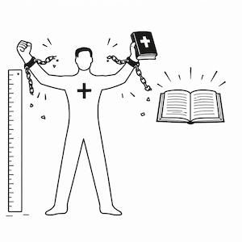
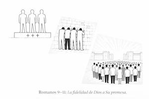

# TABLA DE CONTENIDOS

## CÓMO USAR ESTE MANUAL

### Propósito del manual

### Enfoque metodológico

### Alcance y naturaleza del manual

### Estructura del contenido

### Uso recomendado para la enseñanza

### Observación, aplicación y resultado esperado

## INTRODUCCIÓN

## ROMANOS 1:1–17 – EL EVANGELIO QUE DIOS ANUNCIÓ

### Romanos 1:1–7 – El evangelio prometido y revelado

### Romanos 1:8–17 – El evangelio como poder de Dios

## Romanos 1:18–3:20 – EL MUNDO NECESITA SALVACIÓN

### Romanos 1:18–23 – La revelación de la ira de Dios (resultado del rechazo de Dios como Dios)

### Romanos 1:24–25 – Entrega de Dios #1: El colapso de la conducta humana

### Romanos 1:26–27 – Entrega de Dios #2: El colapso de valores humanos

### Romanos 1:28–32 – Entrega de Dios #3: El colapso de la cosmovisión humana

### Romanos 2:1–5 – El juicio justo e imparcial de Dios (condenación del moralista)

### Romanos 2:6–16 – El juicio justo e imparcial de Dios (principios morales universales)

### Romanos 2:17–29 – El juicio justo e imparcial de Dios (condenación de la hipocresía religiosa)

### Romanos 3:1–8 – Objeciones religiosas y la fidelidad de Dios

### Romanos 3:9–20 – Culpabilidad universal

## ROMANOS 3:21–5:21 – JUSTIFICACIÓN: LA JUSTICIA QUE DIOS PROVEE

### Romanos 3:21–31 – La justicia de Dios aparte de la ley

### Romanos 4:1–8 – Abraham justificado por la fe (no por obras)

### Romanos 4:9–12 – Fe y promesa (antes de la circuncisión)

### Romanos 4:13–17 – La promesa por gracia, no por ley

### Romanos 4:18–25 – La fe contada por justicia

### Romanos 5:1–2 – Paz con Dios y acceso a la gracia

### Romanos 5:3–5 – Esperanza en medio del sufrimiento

### Romanos 5:6–8 – El amor de Dios demostrado

### Romanos 5:9–11 – Reconciliación asegurada

### Romanos 5:12–14 – El origen del pecado y la muerte

### Romanos 5:15–17 – El don no como la transgresión

### Romanos 5:18–19 – Dos actos, dos resultados

### Romanos 5:20–21 – La ley y la multiplicación de la transgresión

## ROMANOS 6:1-8:17 SANTIFICACIÓN: LA VIDA QUE BROTA DE LA JUSTIFICACIÓN

### Romanos 6:1-2 ¿Permaneceremos en el pecado? (la gracia abundante provoca una objeción lógica: si la gracia reina, ¿importa el pecado?)

### Romanos 6:1-2 ¿Permaneceremos en pecado?

### Romanos 6:3-10 La unión con Cristo (bautizados en su muerte y resucitados con él)

### Romanos 6:11-14 Lógica de la unión: considerarse muertos al pecado y vivos para Dios

### Romanos 6:15-23 Dos esclavitudes, dos frutos, dos finales (gracia no significa libertad para pecar)

### Romanos 7:1-6 La ley no puede gobernar a un muerto (liberación del dominio legal)

### Romanos 7:7-13 La ley no es pecado, pero revela el pecado (el pecado usa la ley)

### Romanos 7:14-20 La impotencia del yo bajo la carne (querer no es poder)

### Romanos 7:21-23 Dos leyes operando: el conflicto interno como realidad continua

### Romanos 7:24-25 El clamor por liberación (la solución no es más ley u otra ley, sino una persona)

### Romanos 8:1-4: La vida posible solo por el Espíritu

### Romanos 8:5-11 La mente de la carne versus la mente del Espíritu (vida y paz)

### Romanos 8:12-17 Hijos de Dios: herencia, adopción y testimonio del Espíritu

## Romanos 8:18-39 GLORIFICACIÓN: ESPERANZA Y SEGURIDAD EN EL PROPÓSITO DE DIOS

### Romanos 8:18-25 La creación y la esperanza futura

### Romanos 8:26-27 La ayuda del Espíritu en la debilidad

### Romanos 8:28-30 El propósito de Dios

### Romanos 8:31-39 La seguridad del amor de Dios

## EPÍLOGO VISUAL

## APÉNDICE

-----

# CÓMO USAR ESTE MANUAL

## Propósito del manual

### Este manual existe para enseñar Romanos 1–8 de manera **textual, progresiva y consciente del lenguaje**, dando prioridad a lo que el Texto bíblico dice y a cómo lo dice, antes de cualquier síntesis teológica o aplicación práctica.

### No fue diseñado para resolver debates doctrinales históricos ni para presentar un sistema teológico cerrado. Su propósito es exponer cuidadosamente el argumento de Pablo, observando cómo la gramática, el vocabulario y la estructura literaria determinan el significado. La teología y la aplicación se entienden como derivadas del texto, no como su punto de partida.

## Enfoque metodológico

### Este manual sigue un enfoque observacional e inductivo. Parte de la convicción de que la Escritura comunica significado a través del lenguaje, y que la gramática no es un elemento secundario, sino un medio esencial para transmitir sentido.

### Por esta razón, el material presta atención deliberada a los tiempos verbales, la voz, el modo, los participios, los conectores y las relaciones sintácticas. Las observaciones se formulan de tal manera que el propio Texto establezca los límites de lo que puede afirmarse. Las tensiones internas del pasaje no se resuelven de forma apresurada, sino que se reconocen y se mantienen visibles cuando el texto mismo no las explica.

## Alcance y naturaleza del manual

### Este manual es una herramienta de estudio bíblico diseñada para **todo estudiante de la Palabra de Dios** y más específicamente, para el uso en el contexto del discipulado en la Iglesia. Puede utilizarse tanto en discipulado personal como en la enseñanza en grupos, clases o estudios congregacionales.

### Está diseñado para enseñar Romanos como un argumento continuo y coherente, y no como una colección de versículos aislados. Su enfoque busca ayudar al lector a observar el Texto con cuidado, siguiendo el desarrollo del pensamiento de Pablo de principio a fin.

### No es un comentario devocional, ni un tratado de teología sistemática, ni un manual de aplicación inmediata. Cuando aparecen observaciones teológicas, pastorales o apologéticas, estas se presentan como conclusiones secundarias que surgen del Texto, y no como ideas impuestas sobre él.

## Estructura del contenido

### El material sigue el flujo argumental de Romanos 1–8, observando cómo Pablo desarrolla su pensamiento mediante patrones recurrentes de explicación, ilustración e inferencia.

### Las secciones no están organizadas únicamente por capítulos, sino por movimientos argumentales. El objetivo es que el estudiante aprenda a seguir la lógica interna de Pablo, reconociendo cómo una afirmación prepara la siguiente y cómo las conclusiones dependen de lo que ya ha sido establecido.

## Uso recomendado para la enseñanza

### Este manual no está diseñado para ser leído literalmente en clase. Funciona como una herramienta de preparación y consulta. Es el deseo de los creadores de este material que el alumno vea que son de apoyo únicamente para presentar lo que el Texto bíblico enseña. El manual no es para hacer entender la Biblia sino presentar lo que la Biblia enseña. Este manual no es para reemplazar a la Biblia. 

### El uso recomendado es para discipulado. Este material está diseñado para permitir que el alumno sea enseñado las verdades que contiene Romanos y a la vez para que el alumno utilice el manual para enseñar a otros. 

## Observación, aplicación y resultado esperado

### En Romanos 1–8, Pablo se enfoca principalmente en declarar realidades antes de exhortar conductas. Por ello, este manual enseña primero a **observar y comprender el texto**, y solo después a considerar su aplicación.

### Al completar el estudio de Romanos 1–8 usando este manual, el estudiante debería ser capaz de seguir el argumento completo de Pablo, reconocer cambios gramaticales significativos, distinguir entre afirmaciones textuales e inferencias, y leer Romanos con mayor precisión, paciencia y fidelidad al texto. De esta manera, el lector podrá acercarse al texto con mayor confianza y respeto por lo que Pablo realmente afirma.

### Esperamos que tenga muchos ánimos de ser enseñado por la Palabra de Dios.

###  ¡Que Dios bendiga su estudio de Romanos 1–8!

-----

# ROMANOS

## El Evangelio de Poder

# INTRODUCCIÓN

## Preámbulo

### La Carta a los Romanos es el escrito más extenso y uno de los más desarrollados, tanto en contenido como en argumentación, del apóstol Pablo. Probablemente fue compuesta en Corinto alrededor del año 56–57 d.C. y dirigida a la iglesia cristiana en Roma. Pablo tenía la expectativa de visitarlos en su camino hacia España.[^3]

### Desde el inicio, Romanos se presenta como una carta cuidadosamente estructurada, cuyo propósito principal es exponer el evangelio de manera ordenada, profunda y progresiva.

## Sobre el autor

### Aunque se desconoce la fecha exacta de su nacimiento, Pablo estuvo activo como misionero durante las décadas del 40 y 50 del siglo 1 d.C. La mayoría de las reconstrucciones históricas sugieren que nació aproximadamente en la misma época que Jesús, o poco después. Su conversión a la fe en Jesucristo ocurrió alrededor del año 33 d.C., y su muerte tuvo lugar, probablemente en Roma, entre los años 62 y 64 d.C.[^4]

### Pablo era un judío de habla griega, originario de Asia Menor. Su ciudad natal, Tarso, era una ciudad importante en el oriente de Cilicia, región que pasó a formar parte de la provincia romana de Siria cPreámbulo

### La Carta a los Romanos es el escrito más extenso y uno de los más desarrollados, tanto en contenido como en argumentación, del apóstol Pablo. Probablemente fue compuesta en Corinto alrededor del aPreámbulo

### La Carta a los Romanos es el escrito más extenso y uno de los más desarrollados, tanto en contenido como en argumentación, del apóstol Pablo. Probablemente fue compuesta en Corinto alrededor del año 56–57 d.C. y dirigida a la iglesia cristiana en Roma. Pablo tenía la expectativa de visitarlos en su camino hacia España.[^3]

### Desde el inicio, Romanos se presenta como una carta cuidadosamente estructurada, cuyo propósito principal es exponer el evangelio de manera ordenada, profunda y progresiva.

## ROMA

### Roma era la ciudad más célebre del mundo en tiempos de Cristo, tradicionalmente fundada en el año 753 a.C. Para la época en que se escribió el Nuevo Testamento, la ciudad estaba enriquecida y adornada con los despojos del mundo conquistado. Su población se estimaba en aproximadamente 1.200.000 habitantes, de los cuales cerca de la mitad eran esclavos. Era una ciudad altamente diversa, compuesta por personas provenientes de múltiples regiones del imperio, y se distinguía por su riqueza, lujo y derroche. El imperio del cual era capital se encontraba entonces en su mayor esplendor.

### El día de Pentecostés había en Jerusalén «extranjeros procedentes de Roma», quienes sin duda llevaron consigo noticias de aquel acontecimiento y desempeñaron un papel importante en el surgimiento de la iglesia en esa ciudad. Más adelante, Pablo fue llevado a Roma como prisionero, donde permaneció dos años viviendo «en una casa alquilada» (Hechos 28:30–31).

### Durante ese período, Pablo escribió varias de sus epístolas: a los Filipenses, a los Efesios, a los Colosenses y a Filemón. En esos años tuvo como compañeros a Lucas y Aristarco (Hechos 27:2), a Timoteo (Filipenses 1:1; Colosenses 1:1), a Tíquico (Efesios 6:21), a Epafrodito (Filipenses 4:18) y a Juan Marcos (Colosenses 4:10).

### Debajo de la ciudad de Roma se encuentran extensas galerías subterráneas conocidas como catacumbas. Estas comenzaron a utilizarse aproximadamente desde la época de los apóstoles —una de las inscripciones halladas lleva la fecha del año 71— y durante unos trescientos años sirvieron como lugares de entierro, refugio en tiempos de persecución y, en algunos casos, como espacios de reunión y culto.

### Se han descubierto alrededor de cuatro mil inscripciones en estas catacumbas, las cuales ofrecen una perspectiva valiosa sobre la historia temprana de la iglesia en Roma hasta la época de Constantino.[^5]

## Gramática de la carta

### En la Carta a los Romanos, Pablo presenta el evangelio y el problema universal del pecado con un claro predominio de declaraciones, más que de exhortaciones directas.

### Aunque existen algunas excepciones, en Romanos capítulos 1–11 Pablo utiliza mayormente verbos en modo indicativo, es decir, declara lo que es, más que indicar lo que debe hacerse. Esto describe una tendencia dominante en la carta, no una ausencia total de imperativos.

### Indicativos (Romanos 1–11) → Imperativos (Romanos 12–15)

### Un cambio gramatical significativo ocurre en Romanos 12:1.

#### Capítulos 1–11: predominan los indicativos, las estructuras condicionales, los contrastes razonados y los marcadores explicativos.
#### Capítulos 12–15: predominan los imperativos y los llamados a la acción.

### Interpretación gramatical

### Este cambio indica que la carta pasa de declarar realidades establecidas a apelar a una respuesta práctica basada en esas realidades.

### Uniendo toda la gramática

### Si se consideran en conjunto las estructuras gramaticales que se repiten a lo largo de la carta —las condiciones de primera clase (premisas asumidas como verdaderas), la cadena lógica marcada por conectores como GAR, DE y OUN, los contrastes extensos y el paso del indicativo al imperativo— se observa un tema gramatical a gran escala:

### Romanos se presenta como un argumento progresivo, construido sobre premisas asumidas como verdaderas, desarrollado mediante contrastes claros, explicado con lógica conectiva y culminando en una respuesta práctica.

## Un patrón recurrente en Romanos

### A lo largo de la carta, Pablo utiliza de manera constante un patrón reconocible.

#### Generalmente:

##### Explica un principio (a menudo introducido con GAR, OUN, EPEIDE, EAN),
##### presenta un ejemplo (una persona o grupo que encarna ese principio),
##### y completa el pensamiento con una conclusión o inferencia.

#### Este patrón no aparece de forma idéntica en cada sección, pero se repite con la frecuencia suficiente como para ser claramente observable.

#### Este estudio abordará Romanos priorizando la observación gramatical, discursiva y contextual del texto griego, evitando conclusiones teológicas que no estén claramente expresadas por la sintaxis o por el flujo argumentativo del propio texto.

# ROMANOS 1:1–17 – EL EVANGELIO QUE DIOS ANUNCIÓ

## Romanos 1:1–7 – El evangelio prometido y revelado  
### Pablo no comienza su carta con el problema del hombre, sino con la iniciativa de Dios.

### Romanos 1:1a "*Pablo,*" 
#### Gradualmente dejó de ser llamado Saulo a ser conocido como Pablo. Al principio de su ministerio era conocido como Saulo, pero con el tiempo se lo llama Pablo. ¿Por qué es interesante este detalle? 

#### Saulo significa "aquel que pidieron" llegó a ser Pablo que significa "pequeño". Hechos 7:58, 9:22-24, 13:9, 21:40

### Romanos 1:1b "*siervo de Cristo Jesús,*" 
#### Para Pablo, ser siervo de Cristo no era un término de humillación, sino un honor. 

#### Pablo se consideraba comprado por precio. Su nuevo amo era Cristo Jesús.

### Romanos 1:1c "*llamado a ser apóstol,*" 
#### el llamado que Pablo recibió de parte de Dios fue para ser apóstol, es decir, un enviado con un mensaje específico.

> "*apóstol*" APOSTOLO apóstol n. — un enviado de Jesucristo comisionado directamente por Él o por otros apóstoles; normalmente alguien que ha sido enseñado directamente por Jesús y que está investido con la autoridad para hablar en Su nombre.[^1]

### Romanos 1:1d "*apartado para el evangelio…*" 
#### su llamado apostólico tenía un propósito definido: el evangelio.

> "*evangelio*" – EUAGGELIO. Buenas noticias. Información positiva sobre acontecimientos recientes e importantes, considerados dignos de ser anunciados y celebrados.[^1]

> En el texto original, “evangelio” aparece con artículo definido. No se trata de un evangelio entre muchos, sino de el evangelio. Pablo no fue apartado para cualquier mensaje, sino para la única buena noticia.

### Romanos 1:1e "*el evangelio de Dios,*" 
#### el evangelio tiene su origen en Dios. No procede de ningún hombre. Pablo no lo inventó ni lo redefinió; ya había sido revelado por Dios.

### Romanos 1:2a "*que Él ya había prometido*" 
#### Dios ya lo había prometido; no era un mensaje nuevo revelado por Pablo.

#### Aunque el plan redentor de Dios existía desde antes de la fundación del mundo, Dios comenzó a anunciarlo desde el momento en que el ser humano pecó.

##### Dios mismo declaró en Génesis 3:15 (NBLA): "*Pondré enemistad entre tú y la mujer, y entre tu simiente y su simiente; Él te herirá en la cabeza, y tú lo herirás en el talón.*"

###### Se prometió que sería varón: "*Él…*"

###### Se prometió que vendría de la simiente de la mujer: "*tu simiente…*"

###### Se anunció que heriría la cabeza de la serpiente: "*te herirá en la cabeza*"

###### Dios mismo afirmó que Él lo haría: "*Pondré enemistad… Él te herirá…*"

### Romanos 1:2b "*…que había prometido por medio de Sus profetas*" 
#### Dios anunció el evangelio por medio de Sus profetas.

#### Algunos profetas que anunciaron esta promesa: Moisés (Génesis 3:15; Génesis 12:3), Isaías (Isaías 53), Zacarías (Zacarías 3:9), Malaquías (Malaquías 4:2).

### Romanos 1:2c "*en las Sagradas Escrituras…*" 
#### las promesas quedaron registradas por escrito.

### Romanos 1:3a "*acerca de Su Hijo,*" 
#### el evangelio es un mensaje específico: trata acerca del Hijo de Dios, Jesucristo.

### Romanos 1:3b "*que nació de la descendencia de David según la carne,*" 
#### Pablo afirma que el Hijo de Dios nació verdaderamente como hombre, de carne y hueso, y como descendiente del rey David.

### Romanos 1:4a "*que fue declarado Hijo de Dios con poder,*" 
#### su identidad fue confirmada mediante un acto poderoso.

### Romanos 1:4b "*conforme al Espíritu de santidad,*" 
#### el Espíritu Santo fue el agente principal en este acontecimiento.

### Romanos 1:4c "*por la resurrección de entre los muertos: Jesucristo nuestro Señor.*" 
#### Jesús fue levantado por el Espíritu de santidad.

### Romanos 1:5a "*por medio de Él hemos recibido la gracia y el apostolado…*" 
#### Pablo recibió su llamado por medio de Cristo.

### Romanos 1:5b "*para promover la obediencia a la fe entre todos los gentiles,*" 
#### la gracia y el apostolado tenían un propósito definido.

### Romanos 1:5c "*por amor a Su nombre;*" 
#### la obediencia que procede de la fe surge del amor a Cristo.

### Romanos 1:6a "*entre los cuales están también ustedes…*" 
#### los creyentes en Roma forman parte de ese alcance.

### Romanos 1:6b "*llamados de Jesucristo.*" 
#### su identidad está definida por Aquel a quien pertenecen.

### Romanos 1:7a "*a todos los amados de Dios que están en Roma,*" 
#### esta expresión se refiere a creyentes en Jesucristo.

### Romanos 1:7b "*llamados santos;*" 
#### Pablo no dice “a ser”, sino que los llama santos.

### Romanos 1:7c "*Gracia a ustedes y paz de parte de Dios nuestro Padre y del Señor Jesucristo.*" 
#### Pablo inicia su carta con un deseo de gracia y paz.

## En Síntesis (1:1–7)

### El evangelio tiene su origen en Dios, no en el hombre.

### No es una idea nueva, sino una promesa anunciada en las Escrituras.

### Jesucristo es el centro del plan redentor de Dios.

### El llamado apostólico existe para producir obediencia que procede de la fe.

### Desde el inicio, el evangelio tiene un alcance universal.

## Romanos 1:8–17 – El evangelio como poder de Dios  
### (No es solo información, sino poder eficaz. 1 Corintios 1:18)

### Romanos 1:8a "*En primer lugar, doy gracias a mi Dios*" 
#### después de haber hablado de Dios como Padre común, Pablo ahora se expresa de manera personal. Manifiesta gratitud y se refiere a Dios como *mi* Dios.

### Romanos 1:8b "*por medio de Jesucristo*" 
#### Pablo da gracias a Dios por medio de Jesucristo, quien hizo posible esta relación mediante Su obra redentora en la cruz.

### Romanos 1:8c "*por todos ustedes,*" 
#### la gratitud de Pablo no es general, sino concreta: agradece a Dios específicamente por los creyentes en Roma.

### Romanos 1:8d "*porque por todo el mundo se habla de su fe.*" 
#### la razón de su gratitud es que la fe de ellos era conocida ampliamente. No se trata de fama personal, sino del testimonio visible de su confianza en Dios.

#### Más adelante Pablo aclarará que esta fe se expresaba en obediencia (Romanos 16:19; 3 Juan 1:3; Colosenses 1:6, 23).

### Romanos 1:9a "*Pues Dios, a quien sirvo en mi espíritu*" 
#### Pablo describe su servicio a Dios como algo interno y sincero. Su servicio no es meramente externo, sino que brota de lo profundo de su ser (Hechos 18:25; Filipenses 3:3).

> El verbo "*sirvo*" LATREUO, término usado para el servicio sacerdotal de Israel a Yahvé (Éxodo 20:5; Deuteronomio 5:9). Pablo emplea este lenguaje porque considera que el ministerio del evangelio es un servicio sagrado a Dios. También usa este término para describir el servicio de los gentiles a Dios. Romanos 12:1; compárese con 2 Timoteo 1:3).[^2]

### Romanos 1:9b "*en la predicación del evangelio de Su Hijo,*" 
#### el centro del servicio de Pablo era el anuncio del evangelio, cuyo contenido es el Hijo de Dios.

#### El evangelio no es un método para ser salvo, ni una técnica. Pablo no predicaba un procedimiento, sino un mensaje definido.

#### El mensaje es "*de Su*" Hijo. El enfoque no está en el mensajero ni en el oyente, sino en la persona del Hijo de Dios. Este es el mismo evangelio para el cual Pablo había sido apartado.

### Romanos 1:9c "*me es testigo de cómo sin cesar hago mención de ustedes*" 
#### Pablo apela a Dios como testigo de su constante oración por los creyentes en Roma.

### Romanos 1:10 "*siempre en mis oraciones, implorando que ahora, al fin, por la voluntad de Dios, logre ir a ustedes.*" 
#### Pablo somete su deseo a la voluntad de Dios. No exige, implora.

### Romanos 1:11a "*Porque anhelo verlos*" 
#### Pablo expresa un deseo profundo y personal de visitar a los creyentes en Roma.

### Romanos 1:11b "*para impartirles algún don espiritual,*" 
#### el propósito de su visita no es recibir, sino dar. Pablo desea servir y ser de bendición a la iglesia.

#### Este lenguaje muestra su afecto pastoral y su preocupación por la edificación de los creyentes (1 Corintios 4:15).

#### Pablo no especifica el don. La expresión "*algún don*" es deliberadamente general y está calificada como espiritual.

#### Otros pasajes muestran que los dones espirituales tienen como propósito la edificación del cuerpo (1 Corintios 12:4–7; Romanos 12:6).

### Romanos 1:11c "*a fin de que sean confirmados;*" 
#### el propósito del don es el fortalecimiento de los creyentes.

> "*Confirmados*" proviene de STERIZO (aoristo, pasivo, infinitivo): ser establecido, reforzado o fortalecido.

#### El énfasis gramatical está en el efecto producido en los creyentes, no en la acción de Pablo.

### Romanos 1:12a "*es decir, para que cuando esté entre ustedes nos confortemos mutuamente,*" 
#### Pablo aclara que la edificación no sería unilateral. Espera un fortalecimiento mutuo.

#### No va como superior ni como inferior, sino como hermano entre hermanos.

### Romanos 1:12b "*cada uno por la fe del otro, tanto la de ustedes como la mía.*" 
#### la base del ánimo mutuo es la fe compartida.

### Romanos 1:13a "*Y no quiero que ignoren, hermanos, que con frecuencia he hecho planes para ir a visitarlos,*" 
#### Pablo desea que sepan que su intención de visitarlos ha sido constante.

### Romanos 1:13b "*pero hasta ahora me he visto impedido,*" 
#### los obstáculos no significan falta de interés ni abandono del plan.

### Romanos 1:13c "*a fin de obtener algún fruto también entre ustedes,*"
#### el término "*fruto*" no es definido explícitamente.

#### El contexto más amplio de Romanos sugiere que este fruto puede incluir resultados concretos de su ministerio entre los gentiles (Romanos 15:28).

### Romanos 1:13d "*así como entre los demás gentiles.*" 
#### Pablo ve a la iglesia en Roma dentro del mismo marco de su ministerio entre los gentiles.

### Romanos 1:14a "*Tengo obligación*" 
#### Pablo se describe como deudor, alguien con un deber que debe cumplirse.

> "*Obligación*" proviene de OFEILETES, término que expresa deber o responsabilidad (Mateo 6:12; Romanos 8:12; Gálatas 5:3).[^13]

### Romanos 1:14b–d "*tanto para con los griegos… como para con los bárbaros… para con los sabios como para con los ignorantes.*" 
#### el evangelio no distingue por cultura, idioma o nivel educativo. Pablo se siente responsable ante todos.

### Romanos 1:15a "*Así que, por mi parte, ansioso estoy de anunciar el evangelio*" 
#### como deudor, Pablo expresa su disposición inmediata a anunciar el evangelio.

### Romanos 1:15b "*también a ustedes que están en Roma.*" 
#### aunque los romanos ya eran creyentes, Pablo desea anunciarles el evangelio.

#### Pablo nunca presenta el evangelio como algo que se deja atrás. Los creyentes reciben el evangelio, permanecen en él y son edificados por él (1 Corintios 15:1–2).

### Romanos 1:16a "*Porque no me avergüenzo del evangelio,*" 
#### Pablo declara abiertamente su confianza en el evangelio, aun en un contexto cultural hostil.

> "*Avergüenzo*" proviene de EPAISCHYNOMAI: sentir vergüenza, bochorno o retraimiento.[^1]

### Romanos 1:16b "*pues es el poder de Dios*" 
#### la razón de su confianza es que el evangelio es el poder de Dios, no del hombre.

#### Lo que el mundo considera debilidad, Dios lo usa como poder (1 Corintios 1:18–31).

### Romanos 1:16c "*para salvación*" 
#### en Romanos, la salvación está siempre vinculada al evangelio.

#### El lenguaje de la salvación abarca todo el proceso: iniciado, en desarrollo y esperado (Romanos 1:16; 8:24; 13:11).

### Romanos 1:16d "*de todo el que cree,*" 
#### el poder salvador del evangelio se aplica a quienes creen.

> La expresión TO PISTEUONTI está en presente, indicando una acción continua: “al que está creyendo”.

#### Pablo escribe a creyentes y, aun así, desea predicarles el evangelio, porque este sigue operando como poder de Dios en sus vidas.

### Romanos 1:16e "*del judío primeramente y también del griego.*"
#### el alcance del evangelio es universal, respetando el orden histórico de la revelación.

### Romanos 1:17a "*Porque en el evangelio la justicia de Dios se revela*"
#### la justicia de Dios no se produce, se revela.

> *“justicia”* DIKAIOSYNE — estado o condición de estar en conformidad con una norma correcta; rectitud reconocida según un estándar válido; puede referirse a un estatus otorgado o a una condición reconocida públicamente. [^18]

> *“revelar”* APOKALYPTO — hacer visible algo que estaba oculto; quitar un velo para que algo sea perceptible o comprensible. [^18]

### Romanos 1:17b "*por fe y para fe*" 
#### la justicia se recibe por fe y conduce a una vida caracterizada por la fe.

> *“fe”* PISTIS — confianza, fidelidad o dependencia; relación de confianza dirigida hacia un objeto o persona. [^18]

### Romanos 1:17c "*como está escrito: MAS EL JUSTO POR LA FE VIVIRÁ.*" 
#### Pablo apoya su afirmación citando las Escrituras. La vida procede de la fe.

### El evangelio no comienza con el hombre, sino con Dios y Su propósito.

## En Síntesis (1:8–17)

### Pablo presenta el evangelio como poder eficaz, no solo como información.

### El evangelio es poder de Dios para salvación para todo el que cree.

### La justicia de Dios se revela por fe y conduce a una vida de fe.

### Esta sección establece la tesis que gobierna toda la carta.

### Todo lo que sigue explica por qué este poder es necesario.

# Romanos 1:18–3:20 – EL MUNDO NECESITA SALVACIÓN

## Romanos 1:18–23 – La revelación de la ira de Dios (resultado del rechazo de Dios como Dios)

### Dios es el Creador y, en el principio, todo lo que hizo reflejaba perfectamente Su carácter. El mundo era bueno en gran manera. No había mal, ni muerte, ni tristeza, ni dolor; todo estaba marcado por armonía, amor, paz y gozo.

#### Toda la creación —cada molécula— depende completamente de Dios para existir. Dios existe por Sí mismo; Él es el gran YO SOY. La creación, en cambio, depende enteramente de Él, y el ser humano es totalmente dependiente de Dios. Salmo 63:8; Hebreos 1:3; 2 Pedro 3:7

### Si Dios es verdaderamente bueno, justo y puro, surge una pregunta inevitable: ¿cómo debe responder Dios ante la injusticia del hombre?

#### Pablo comienza presentando la culpabilidad humana de manera general y, de forma progresiva, la hace cada vez más personal. Su objetivo es demostrar que toda la humanidad es culpable delante de Dios y que Dios es imparcialmente justo con todo ser humano.

### Progresión del argumento de culpabilidad en Romanos
#### Romanos 1:18–32 – Condenación de “ellos”.
#### Romanos 2:1–5 – Condenación del moralista “tú”.
#### Romanos 2:6–16 – Principios morales universales (“él”, “ellos”).
#### Romanos 2:17–29 – Condenación de la hipocresía religiosa judía (“tú”).
#### Romanos 3:1–8 – Diálogo religioso judío imaginario.
#### Romanos 3:9–20 – Culpabilidad universal: “nosotros”, “todos” bajo pecado.

#### Pablo pasa deliberadamente de “ellos” → “tú” → “él/ellos” → “tú” → “nosotros/todos” para demostrar que **no hay justo, ni siquiera uno** (Romanos 3:10).

### Romanos 1:18a "*Porque la ira de Dios se revela desde el cielo...*"
#### En Romanos 1:17 Pablo explicó que la justicia de Dios se revela por medio del evangelio. Ahora introduce otra revelación: la ira de Dios, que no surge desde la tierra, sino desde el cielo.

>*“ira”* ORGE — reacción estable y deliberada frente a lo que viola un orden establecido; no un arrebato emocional, sino una respuesta consistente frente a una transgresión objetiva. [^18]

### Romanos 1:18b "*...contra toda impiedad e injusticia de los hombres*"
#### La ira de Dios se dirige contra la impiedad y la injusticia humanas. El texto no dice que Dios se revele contra el hombre como tal, sino contra su impiedad e injusticia, con el propósito de mostrar al ser humano su verdadera condición.

> *“impiedad”* ASEBEIA — conducta caracterizada por falta de reverencia o reconocimiento debido; vivir sin considerar una autoridad superior. [^18]

### Romanos 1:18c "*que con injusticia restringen la verdad*"
#### La humanidad no solo ignora la verdad, sino que activamente la suprime. 

> *“injusticia”* ADIKIA — comportamiento que viola lo que es correcto o debido; desviación activa del estándar recto. [^18]

> El verbo "*restringen*" proviene de KATECHO y expresa la idea de suprimir, contener o mantener bajo control. Está en tiempo presente y voz activa, señalando una acción continua y deliberada.

#### La razón de la ira divina queda clara: los seres humanos restringen la verdad de Dios.

### Romanos 1:19a "*porque lo que se conoce acerca de Dios es evidente dentro de ellos*"
#### Todo ser humano posee conocimiento de Dios. Este conocimiento no es meramente externo, sino interno, ya que el ser humano fue creado a imagen de Dios.

> "*Evidente*" proviene de FANEROS y significa manifiesto o claramente perceptible.

### Romanos 1:19b "*pues Dios se lo hizo evidente*"
#### Este conocimiento no surge por casualidad ni por descubrimiento humano. Dios mismo lo hizo evidente.

### Romanos 1:20a "*Porque desde la creación del mundo*"
#### Desde el principio de la creación, Dios ha revelado algo verdadero acerca de Sí mismo.

### Romanos 1:20b "*Sus atributos invisibles*"
#### Aunque Dios es invisible, Él ha hecho que ciertos atributos invisibles sean perceptibles por medio de lo creado (Salmo 19:1–6).

### Romanos 1:20c "*Su eterno poder y divinidad*"
#### Pablo especifica cuáles son esos atributos visibles: el poder eterno de Dios y Su divinidad. Estos no son cualidades menores, sino atributos esenciales. Jeremías 51:15

### Romanos 1:20d "*se han visto con toda claridad*"
#### Estos atributos no son vagos ni ambiguos; son claramente perceptibles.

### Romanos 1:20e "*siendo entendidos por medio de lo creado*"
#### La creación permite que estos atributos sean comprendidos racionalmente. Lo creado comunica información verdadera acerca de Dios.

### Romanos 1:20f "*de manera que ellos no tienen excusa*"
#### La conclusión de Pablo es definitiva: la humanidad no tiene excusa delante de Dios. Esta revelación es universal, clara y continua. El problema no es la falta de revelación, sino el rechazo y la supresión de la verdad. Romanos 1:18

### Romanos 1:21a "*Pues aunque conocían a Dios, no lo honraron como a Dios ni le dieron gracias*"
#### El conocimiento de Dios no produjo una respuesta correcta. "*Conocían*" está en aoristo activo participio, indicando conocimiento real y responsable. Sin embargo, "*no lo honraron*" ni "*le dieron gracias*", ambos en aoristo activo indicativo, mostrando un rechazo deliberado.

> *“conocer”* GINOSKO — llegar a conocer mediante experiencia o relación; conocimiento adquirido, no meramente informativo. [^18]

### Romanos 1:21b "*sino que se hicieron vanos en sus razonamientos*"
#### Como consecuencia del rechazo, el pensamiento humano se vuelve fútil. "*Vanos*" proviene de METAIOO y significa volverse inútil o sin propósito.

### Romanos 1:21c "*y su necio corazón fue entenebrecido*"

> El corazón pierde capacidad de comprensión espiritual. "*Necio*" proviene de ASYNETOS, incapaz de comprender, y "*entenebrecido*" de SKOTIZO, oscurecido o privado de luz.

### Romanos 1:22 "*Profesando ser sabios, se volvieron necios*"
#### La humanidad se autodefine como sabia, pero el resultado real es necedad. El necio no es quien ignora la verdad, sino quien la rechaza con conocimiento (Salmo 14:1).

### Romanos 1:23a "*y cambiaron la gloria del Dios incorruptible*"
#### El ser humano intercambia deliberadamente la gloria del Dios incorruptible.

### Romanos 1:23b "*por una imagen en forma de hombre corruptible*"
#### El Creador es reemplazado por la imagen de la criatura caída.

### Romanos 1:23c "*y de aves, de cuadrúpedos y de reptiles*"
#### La idolatría se extiende a todo lo creado, mostrando la irracionalidad del razonamiento humano al adorar lo creado en lugar del Creador.

## En Síntesis (1:18–23)

### La ira de Dios se revela contra la impiedad y la injusticia.

### El problema del hombre no es ignorancia, sino supresión de la verdad.

### Dios se ha dado a conocer de manera suficiente a toda la humanidad.

### El rechazo de Dios conduce a la idolatría.

### El pecado comienza con un intercambio: verdad por mentira.

## Romanos 1:24–25 – Entrega de Dios #1: El colapso de la conducta humana  
### (La degradación moral es resultado, no causa)

#### Romanos 1:24a "*Por lo cual Dios los entregó a la impureza en la lujuria de sus corazones*" 
##### Dios responde a la injusticia del hombre entregándolos, o dejándolos, a la impureza que ya dominaba los deseos de sus corazones. La acción divina no introduce un mal nuevo, sino que retira el freno, permitiendo que los deseos internos se expresen plenamente.

> *“entregar”* PARADIDOMI — poner a alguien bajo el control o dominio de algo; ceder a una esfera de influencia. [^18]

> "*Impureza*" AKATHARSIA se refiere a inmoralidad entendida como suciedad o contaminación moral, usada especialmente para pecados de carácter sexual.[^1]

> "*Lujuria*" EPITHYMIA describe un deseo intenso. El término no es negativo en sí mismo, pero en el Nuevo Testamento aparece mayormente con una connotación negativa cuando el deseo está desordenado o gobernado por la carne.

###### Jesús usó este término para expresar un deseo profundo sin connotación pecaminosa (Lucas 22:15), lo que muestra que el problema no es el deseo en sí, sino su orientación y dominio.

###### Pablo también utiliza este término para deseos legítimos (1 Tesalonicenses 2:17; Filipenses 1:23).

###### Sin embargo, la gran mayoría de sus usos en el Nuevo Testamento describen deseos desordenados: deseos del padre Satanás (Juan 8:44), deseos de la carne (Romanos 6:12; 7:7–8; 13:14; Gálatas 5:16, 24; Efesios 2:3; Colosenses 3:5), deseos propios del estado previo a la fe (1 Pedro 1:14; 4:3; Tito 3:3), y deseos en contraste con la voluntad de Dios (1 Juan 2:17; 1 Pedro 4:2).

###### Santiago explica el proceso interno del deseo: Dios no tienta a nadie (Santiago 1:13); la tentación surge cuando cada uno es llevado y seducido por su propio deseo (Santiago 1:14); y cuando el deseo concibe, produce pecado, que finalmente engendra muerte (Santiago 1:15). El énfasis recae en la responsabilidad humana, no en la acción directa de Dios para tentar.

#### Romanos 1:24b "*de modo que deshonraron entre sí sus propios cuerpos*" 
##### la deshonra del cuerpo es el resultado visible de esta entrega. El cuerpo se convierte en el escenario donde se manifiesta externamente lo que ya gobierna internamente el corazón.

##### Esta expresión describe la **primera etapa** de la ira de Dios. Debido a que la humanidad rechazó glorificar a Dios como Creador (Romanos 1:21), Dios los entregó a la impureza corporal. No se trata de un solo pecado aislado, sino de una categoría de conductas que surgen de deseos corporales sin control moral.

##### Esta deshonra se refiere a prácticas sexuales que degradan la dignidad de la persona, utilizando el cuerpo como instrumento de pasión en lugar de honor, en contradicción con el diseño de Dios (1 Tesalonicenses 4:3–5).

##### Cuando la humanidad vive dominada por impulsos corporales sin freno moral, esto no debe interpretarse como libertad, sino como manifestación de la ira de Dios contra la injusticia. El ser humano sufre las consecuencias de haber rechazado a Dios como Creador (Gálatas 5:19; Efesios 5:3–5; Colosenses 3:5).

##### La entrega de Dios se hace visible externamente en inmoralidad sexual, deshonra del cuerpo, actos físicos degradantes, impureza asociada a la idolatría, promiscuidad, sensualidad y explotación del cuerpo ajeno.

#### Romanos 1:25a "*Porque ellos cambiaron la verdad de Dios por la mentira*" 
##### Pablo explica la razón de esta entrega: la humanidad intercambió la verdad de Dios por la mentira. Al rechazar la verdad revelada, Dios deja de restringir la conducta humana, y la impureza interna se manifiesta abiertamente en la conducta.

#### Romanos 1:25b "*y adoraron y sirvieron a la criatura en lugar del Creador*" 
##### la deshonra del cuerpo está directamente relacionada con la idolatría. Al adorar y servir a lo creado en vez del Creador, la conducta humana colapsa.

##### La entrega de Dios se hace evidente cuando la humanidad rinde culto a algo creado en lugar de al Dios que creó todas las cosas. Cuando Dios entrega al ser humano, su verdadera condición interior queda expuesta.

#### Romanos 1:25c "*del Creador, quien es bendito por los siglos. Amén.*" 
##### Pablo interrumpe la descripción para rendir honor y gloria a Dios. Hace una distinción clara entre la creación y el Creador, afirmando que Él es bendito eternamente.

##### El Creador nunca debe ser acusado de injusticia por revelar Su ira. Al contrario, Él es siempre digno de honra. Dios no es culpable de la conducta indecorosa de la humanidad; Su ira se manifiesta de manera justa al entregar al hombre a las consecuencias de haberlo rechazado como Creador.

##### Así como Adán culpó a Dios por la mujer que Él creó (Génesis 3:12), la humanidad tiende a culpar a Dios por el colapso de su conducta, ignorando que la causa real es el rechazo previo de Dios como Creador.

## En Síntesis (1:24–25)

### Dios entrega al hombre como consecuencia de su rechazo previo.

### La primera entrega produce un colapso en la conducta humana.

### El cuerpo se convierte en el escenario del desorden moral.

### La degradación es resultado del intercambio de la verdad por la mentira.

### El juicio de Dios es coherente y justo, no arbitrario.

## Romanos 1:26–27 – Entrega de Dios #2: El colapso de valores humanos  
### La consecuencia es una inversión de valores

##### El ser humano, no conforme con abandonar la verdad, insiste en sustituirla por la mentira. Ante esta persistencia, surge la pregunta: ¿cómo responde Dios?

#### Romanos 1:26a "*Por esta razón Dios los entregó*" 
##### esta segunda entrega no es arbitraria ni caprichosa. Dios manifiesta Su ira como respuesta directa al abandono previo de la verdad. La acción divina sigue el curso del rechazo humano.

#### Romanos 1:26b "*a pasiones degradantes;*" 
##### ahora la entrega no se limita a los deseos del corazón, sino que avanza hacia pasiones que implican deshonra.

> "*Degradantes*" ATIMIA se refiere a un estado de deshonra, vergüenza o descrédito.[^1]

###### Es decir, Dios los entrega —o permite— que sus pasiones vergonzosas gobiernen su conducta. Esta entrega ocurre porque adoraron y sirvieron a la criatura en lugar de reconocer a Dios como Creador.

#### Romanos 1:26c "*porque sus mujeres cambiaron la función natural por la que es contra la naturaleza.*" 
##### Pablo aclara que este cambio no es resultado del diseño original ni de un proceso natural de la creación.

##### No se trata de una evolución moral ni de un desarrollo progresivo. Es un intercambio deliberado que ocurre como consecuencia de la entrega de Dios. Las mujeres abandonan la función natural y adoptan prácticas contrarias a la naturaleza.

#### Romanos 1:27a "*De la misma manera también los hombres, abandonando el uso natural de la mujer,*" 
##### el colapso de valores no se limita a un solo grupo. Los hombres, de igual manera, abandonan la relación natural establecida por Dios.

#### Romanos 1:27b "*se encendieron en su lujuria unos con otros,*" 
##### el deseo se intensifica de manera desordenada. En lugar de orientarse según el diseño de Dios, se dirige hacia lo que es antinatural.

#### Romanos 1:27c "*cometiendo hechos vergonzosos hombres con hombres,*" 
##### el deseo desordenado se manifiesta en actos que Pablo califica como vergonzosos. La conducta refleja la inversión total de los valores establecidos por el Creador.

#### Romanos 1:27d "*y recibiendo en sí mismos el castigo correspondiente a su extravío.*" 
##### el texto indica que las consecuencias no son externas únicamente, sino que se experimentan en ellos mismos. El castigo corresponde directamente al extravío moral y espiritual.

##### El extravío se evidencia en el colapso de los valores, impulsado por deseos pecaminosos que ahora determinan lo que se considera aceptable.

## En Síntesis (1:26–27)

### La segunda entrega afecta el sistema de valores humanos.

### Se invierte lo que se considera natural y correcto.

### El problema ya no es solo la conducta, sino el criterio moral.

### El pecado redefine lo que se honra y lo que se rechaza.

### El colapso de valores revela una corrupción más profunda.

## Romanos 1:28–32 – Entrega de Dios #3: El colapso de la cosmovisión humana  
### (La ira de Dios los deja hasta llegar a un punto sin discernimiento; se vuelven incapaces de evaluar correctamente)

#### Ahora se presenta la tercera entrega mediante la cual Dios revela Su ira frente al rechazo persistente de la verdad. Esta vez, de forma aún más profunda, la entrega es a una mente depravada, lo que produce el colapso total de la cosmovisión humana.

#### Romanos 1:28a "*Y así como ellos no tuvieron a bien reconocer a Dios,*" 
##### la causa vuelve a ser el rechazo deliberado. Al no considerar valioso reconocer a Dios, la humanidad insiste en su propia interpretación de la realidad, apartándose de la verdad revelada.

#### Romanos 1:28b "*Dios los entregó a una mente depravada,*" 
##### la mente depravada no surge de manera aislada, sino como consecuencia directa de no haber querido reconocer a Dios. Dios responde retirando el freno que preservaba el discernimiento moral.

#### Romanos 1:28c "*para que hicieran las cosas que no convienen.*" 
##### el resultado es una conducta inapropiada y desordenada, contraria a lo que es correcto y adecuado.

> "*Convienen*" KATHEKO significa ser apropiado o correcto; aquello que corresponde al orden y a la idoneidad moral.

#### Romanos 1:29–32 – La descripción final del estado real de la humanidad

#### Romanos 1:29a "*Están llenos de toda injusticia,*" 
##### la expresión indica plenitud. No se trata de actos ocasionales, sino de una condición dominante.

> "*Llenos*" PLEROO significa estar completamente colmado, hasta el máximo posible.[^1]

#### Romanos 1:29b "*maldad,*"
> "*maldad,*" PONERIA describe corrupción moral y una disposición activa a hacer daño.[^1]

#### Romanos 1:29c "*avaricia,*"
> "*avaricia,*" PLEONEXIA es el deseo insaciable de tener más; codicia egoísta.[^1]

#### Romanos 1:29d "*y malicia,*"
> "*malicia,*" KAKIA expresa mala voluntad, intención de dañar o corromper.[^1]

#### Romanos 1:29e "*llenos de envidia,*"
> "*llenos de envidia*" MESTOUS indica estar completamente caracterizado por algo; FTHONOU es resentimiento ante el bien o la ventaja del otro.[^1]

#### Romanos 1:29f "*homicidios,*"
> "*homicidios,*" FONOU es el acto injusto de quitar la vida a otro.[^1]

#### Romanos 1:29g "*pleitos,*"
> "*pleitos,*" ERIDOS señala conflicto, rivalidad y espíritu contencioso.[^1]

#### Romanos 1:29h "*engaños,*"
> "*engaños,*" DOLOU es deshonestidad deliberada, astucia y traición.[^1]

#### Romanos 1:29i "*y malignidad.*"
> "*y malignidad*" KAKOETHEIAS describe mal carácter, disposición rencorosa y bajeza moral.[^1]

#### Romanos 1:29j "*Son chismosos,*"
> "*Son chismosos*" PSITHYRISTAS son los que difunden rumores en secreto.[^1]

#### Romanos 1:30a "*detractores,*"
> "*detractores*" KATALALOUS son los que difaman y hablan mal de otros.[^1]

#### Romanos 1:30b "*aborrecedores de Dios,*"
> "*aborrecedores de Dios*" THEOSTYGEIS describe hostilidad activa hacia Dios.[^1]

#### Romanos 1:30c "*insolentes,*"
> "*insolentes*" HYBRISTAS son abusadores arrogantes que actúan con violencia verbal o social.[^1]

#### Romanos 1:30d "*soberbios,*"
> "*soberbios*" HYPEREPHANOUS expresa orgullo inflado y autosuficiencia.[^1]

#### Romanos 1:30e "*jactanciosos,*"
> "*jactanciosos*" ALAZONAS son quienes presumen y exageran sus logros o capacidades.[^1]

#### Romanos 1:30f "*inventores de lo malo,*"
> "*inventores de lo malo*" KAKON señala creatividad aplicada a lo perverso.[^1]

#### Romanos 1:30g "*desobedientes a los padres,*"
> "*desobedientes a los padres*" APEITHEIS indica rechazo a la autoridad legítima.[^1]

#### Romanos 1:31a "*sin entendimiento,*"
> "*sin entendimiento*" ASYNETOS describe falta de discernimiento moral y práctico.[^1]

#### Romanos 1:31b "*indignos de confianza,*"
> "*indignos de confianza*" ASYNTHETOS se refiere a quienes rompen pactos y compromisos.[^1]

#### Romanos 1:31c "*sin amor,*"
> "*sin amor*" ASTORGOS describe ausencia de afecto humano natural.[^1]

#### Romanos 1:31d "*despiadados.*"
> "*despiadados*" ANELEEMON señala falta total de misericordia y compasión.[^1]

#### Romanos 1:32a "*Ellos, aunque conocen el decreto de Dios que los que practican tales cosas son dignos de muerte,*" 
##### el problema no es ignorancia del decreto divino, sino incapacidad para evaluarlo correctamente. Conocen, pero no comprenden la gravedad de su condición.

##### La falla no es de información, sino de entendimiento. La cosmovisión está tan distorsionada que incluso el juicio de Dios es reinterpretado según criterios propios.

#### Romanos 1:32b "*no solo las hacen, sino que también dan su aprobación a los que las practican.*" 
##### el colapso es completo. No solo practican el mal, sino que lo celebran y legitiman en otros.

##### La cosmovisión ha quedado totalmente corrompida. Aquello que antes se percibía con claridad ahora es evaluado desde un razonamiento vano y torcido.

##### Esto explica por qué el evangelio debe ir al mundo. El mundo no busca a Dios porque su manera de pensar ha sido deformada por el rechazo previo de la verdad.

## En Síntesis (1:28–32)

### La tercera entrega afecta la cosmovisión y el pensamiento humano.

### La mente queda incapacitada para evaluar correctamente.

### El pecado se expresa en múltiples dimensiones sociales y relacionales.

### El hombre no solo practica el mal, sino que lo aprueba.

### Romanos 1 concluye el diagnóstico del mundo sin ley.

### Romanos 1 presenta una progresión clara:
#### rechazo de la verdad
#### colapso de la conducta
#### colapso de los valores
#### colapso de la cosmovisión

## Romanos 2:1–5 – El juicio de Dios es imparcial  
### (Juzgar a otros no exime al hombre del juicio de Dios)

### Romanos 2:1–5 – Acusación: el hombre moral condena a otros y hace lo mismo

#### Al igual que Romanos 1, el capítulo 2 tampoco contiene imperativos. Los verbos siguen siendo indicativos, estableciendo lo que es. Pablo continúa denunciando al pecador y describiendo el juicio justo de Dios, pero aún no da órdenes ni exhortaciones directas. Romanos 2 sigue exponiendo la culpabilidad humana, no instrucciones para la vida del creyente.

### Romanos 2:1a "*Por lo cual…*" 
#### esta expresión conecta directamente con todo lo anterior. Pablo ahora anticipa al moralista, aquel que juzga a la humanidad sin darse cuenta de que él mismo está incluido en la misma condición de culpabilidad.

### Romanos 2:1b "*no tienes excusa, oh hombre,*" 
#### anteriormente vimos que el hombre no tenía excusa porque no respondió a la revelación de Dios manifestada en la creación. Ahora, la falta de excusa se debe a que su entendimiento moral reconoce el mal, pero lo usa para juzgar a otros y no para evaluarse a sí mismo.

### Romanos 2:1c "*…quienquiera que seas tú que juzgas…*" 
#### Pablo dirige su atención a cualquier persona que adopta una postura de juez frente a los demás.

#### Este “quienquiera que seas” reconoce la maldad ajena, pero no se considera a sí mismo bajo el mismo estándar. Juzga a otros sin reconocer su propia condición.

### Romanos 2:1d "*pues al juzgar a otro, a ti mismo te condenas, porque tú que juzgas practicas las mismas cosas.*" 
#### el hombre moral queda expuesto como inexcusable. Al condenar a otros por acciones que él mismo practica, se pronuncia juicio a sí mismo.

#### Al juzgar, demuestra que conoce el bien. Sin embargo, ese conocimiento no lo libra del juicio. Romanos 2:15

### Romanos 2:2 "*Y sabemos que el juicio de Dios justamente cae sobre los que practican tales cosas.*" 
#### Dios juzga con justicia. Quien practica el mal, sin excepción, es objeto del juicio divino.

#### Dios no sería injusto al juzgar el mal. Por el contrario, sería injusto si no lo hiciera.

### Romanos 2:3a "*¿Y piensas esto, oh hombre…*" 
#### Pablo introduce una pregunta retórica que apela al razonamiento del moralista.

#### Pablo no está ordenando que deje de juzgar. Está confrontando su forma de pensar. El problema no es su juicio sobre el mal, sino su falsa conclusión de que juzgar a otros lo exime del juicio de Dios.

### Romanos 2:3b "*tú que condenas a los que practican tales cosas y haces lo mismo, que escaparás del juicio de Dios?*" 
#### la pregunta es directa: ¿cree realmente que condenar el mal en otros lo protegerá del juicio divino?

### Pablo deja claro que la rendición de cuentas final no es ante los hombres, sino ante Dios.

#### No basta con condenar el mal ajeno. Para satisfacer la justicia de Dios, sería necesario practicar perfectamente el mismo bien que se exige a otros. El conocimiento del bien no equivale a obediencia.

### Romanos 2:4a "*¿O tienes en poco las riquezas de Su bondad, tolerancia y paciencia…*" 
#### Pablo confronta otra suposición equivocada: interpretar la paciencia de Dios como ausencia de juicio.

#### Dios es paciente y tolerante no porque apruebe el pecado, sino porque extiende oportunidad para que el hombre responda correctamente antes del juicio.

### Romanos 2:4b "*ignorando que la bondad de Dios te guía al arrepentimiento?*" 
#### al pensar que ha escapado del juicio por su moralidad, el hombre desprecia la bondad de Dios, cuya intención es conducirlo a un cambio de manera de pensar.

### Breve aclaración sobre el arrepentimiento bíblico

#### La palabra traducida como “arrepentimiento” corresponde al término griego METANOIA, cuyo sentido básico es cambio de mente o cambio de parecer.

#### En Romanos 2:4, el énfasis no está en actos externos ni en un cambio de conducta, sino en un cambio interno de perspectiva. El hombre moral necesita abandonar su falsa seguridad —basada en comparar su conducta con la de otros— y reconocer que él también está bajo el juicio justo de Dios.

#### La bondad de Dios no apunta a producir méritos ni reformas morales como condición para la salvación, sino a confrontar el razonamiento equivocado del hombre y llevarlo a reconocer la verdad: que no escapará del juicio por saber lo que es correcto, sino que necesita depender de lo que Dios ha provisto.

#### Este cambio de manera de pensar es necesario para creer correctamente el evangelio. No se trata de añadir obras a la gracia, sino de abandonar una confianza errónea y aceptar la evaluación que Dios hace de la condición humana.

### Romanos 2:5a "*Pero por causa de tu terquedad y de tu corazón no arrepentido…*" 
#### el problema del hombre moral no es la falta de información, sino la terquedad de su razonamiento. Su “corazón” —entendido bíblicamente como el centro del pensamiento, la voluntad y la percepción— se rehúsa a cambiar de parecer frente a la bondad de Dios.

#### En la cosmovisión bíblica, mente y corazón describen conjuntamente a la persona interior. Un corazón “no arrepentido” es una mente que se niega a reconocer la verdad sobre sí misma y sobre Dios.

### Romanos 2:5b "*…estás acumulando ira para ti en el día de la ira y de la revelación del justo juicio de Dios.*" 
#### al persistir en su manera equivocada de pensar, el hombre moral no reduce su responsabilidad, sino que la incrementa.

#### Ignorar la bondad de Dios no elimina el juicio futuro; lo acumula.

## En Síntesis (2:1–5)

### Pablo confronta al hombre moral que juzga a otros.

### Juzgar no exime de culpabilidad delante de Dios.

### El juicio divino se basa en la verdad, no en comparaciones.

### La paciencia de Dios es oportunidad, no aprobación.

### Un corazón que no cambia de parecer acumula juicio, no justicia.

## Romanos 2:6–11 – Dios juzga según las obras, sin acepción de personas  
### (El juicio de Dios es justo, público e imparcial)

### Romanos 2:6 "*ÉL PAGARÁ A CADA UNO CONFORME A SUS OBRAS:*" 
#### en el día del justo juicio de Dios, Él pagará a cada persona según lo que ha hecho.

#### En otras palabras, Dios da a cada uno lo que corresponde conforme a sus obras.

### Romanos 2:7 "*a los que por la perseverancia en hacer el bien buscan gloria, honor e inmortalidad: vida eterna;*" 
#### Dios daría vida eterna a aquellos que perseveran en hacer el bien.

#### No es suficiente pensar el bien; es necesario practicarlo. No basta con juzgar a quienes no hacen lo correcto; uno debe practicar el bien y perseverar en hacerlo.

> "*Perseverancia*" HYPOMONE resistencia firme n. – la capacidad de soportar presión, dificultad o sufrimiento con constancia interior.

#### Perseverar no significa simplemente ser sincero ni intentar ocasionalmente hacer el bien. Implica mantenerse firmemente en la práctica del bien. El verbo "*buscan*" está en tiempo presente, indicando una acción continua: buscan constantemente gloria, honor e inmortalidad, y perseveran en hacer el bien.

#### ¿Existe alguien que pueda ser recompensado con vida eterna sobre esta base?

#### ¿Y qué sucede si no persevera perfectamente?

### Romanos 2:8a "*pero a los que son ambiciosos y no obedecen a la verdad,*" 
#### la conjunción "*pero*" introduce el otro lado del argumento. Aquí se describe a quienes no perseveran en hacer el bien, sino que actúan movidos por ambición personal y desobedecen continuamente a la verdad revelada.

> "*ambiciosos*" ERITHEIA ambición egoísta n. – un impulso centrado en el beneficio personal sin consideración moral.[^1]

#### En el versículo 7 se presenta una condición hipotética: si alguien perseverara perfectamente en hacer el bien, recibiría vida eterna. Este planteamiento apela directamente al moralista, quien suele pensar que ese es su caso.

#### En el versículo 8, Pablo muestra la otra realidad. Si bien la vida eterna está asociada a una obediencia perfecta, ahora se considera a quienes no cumplen con ese estándar.

#### Pablo cuestiona las motivaciones del hombre moral: no son neutrales ni puras, sino egocéntricas. Son descritos como ambiciosos y desobedientes a la verdad.

### Romanos 2:8b "*sino que obedecen a la injusticia: ira e indignación.*" 
#### al no obedecer a la verdad, se vuelven obedientes a la injusticia. El resultado no es recompensa, sino ira e indignación.

### Romanos 2:9 "*Habrá tribulación y angustia para toda alma humana que hace lo malo, del judío primeramente y también del griego;*" 
#### el juicio de Dios no se basa en etnia ni estatus religioso. Abarca a toda persona que practica el mal. El judío es mencionado primero por haber recibido mayor revelación, y luego también el griego.

#### El argumento es claro: conforme a las obras. Al que persevera perfectamente en el bien, vida eterna. Al que no, tribulación y angustia.

### Romanos 2:10 "*pero gloria y honor y paz para todo el que hace lo bueno, al judío primeramente, y también al griego.*" 
#### de la misma manera, Dios otorgaría gloria, honor y paz a quien persevera en hacer el bien, sin distinción étnica.

### Romanos 2:11 "*Porque en Dios no hay acepción de personas.*" 
#### el conocimiento moral, la posición religiosa o la identidad étnica no otorgan ventaja alguna delante de Dios. Su juicio es completamente imparcial.

#### Dios no favorece a nadie por quién es. Bajo un sistema de obras, solo cuenta el cumplimiento perfecto de ellas.

#### El propósito de esta sección es confrontar al moralista que confía en su propia justicia y asume que Dios le dará vida eterna. Pablo lo obliga a considerar dos realidades:

##### Dios exige perseverancia perfecta en hacer el bien.

##### El moralista no ha cumplido ese estándar y, por lo tanto, debería cuestionar su seguridad.

## En Síntesis (2:6–11)

### Dios juzga con justicia y sin acepción de personas.

### El juicio divino es conforme a las obras, no a las intenciones.

### Judíos y gentiles enfrentan el mismo estándar de juicio.

### La recompensa y el castigo se presentan como resultados del juicio.

### Este pasaje establece la imparcialidad del juicio, no el camino de salvación.

## Romanos 2:12–16 – La responsabilidad según la revelación recibida  
### (Dios juzga a cada persona conforme a la luz que ha recibido)

### Romanos 2:12a "*Pues todos los que han pecado sin la ley, sin la ley también perecerán;*" 

> *“pecado”* HAMARTIA — acción o estado que no alcanza el objetivo correcto; fallo respecto a un estándar esperado. [^18]

> *“ley”* NOMOS — principio normativo que regula la conducta; regla, conjunto de mandatos o marco regulador reconocido. [^18]

#### el juicio de Dios es proporcional a la revelación recibida. Quien no tuvo la ley escrita no será juzgado por ella, pero aun así perecerá por haber pecado contra la luz que sí recibió.

#### La persona que nunca recibió una revelación mayor que la manifestada claramente por medio de lo creado igualmente será juzgada, pero conforme a esa revelación limitada. Nadie queda exento de responsabilidad, aunque la medida del juicio corresponde a la medida de la luz recibida.

### Romanos 2:12b "*y todos los que han pecado bajo la ley, por la ley serán juzgados.*" 
#### quienes conocieron la ley y pecaron contra ella serán juzgados por ese mismo estándar. El mayor conocimiento implica mayor responsabilidad.

### Romanos 2:13a "*Porque no son los oidores de la ley los justos ante Dios,*" 
#### escuchar la ley no hace justo a nadie delante de Dios. Bajo un sistema de obras, el conocimiento de la ley no es suficiente.

#### El oidor de la ley queda comprometido a cumplir lo que ha escuchado. Haber recibido la ley no es una ventaja automática, sino una mayor responsabilidad, porque ahora conoce con mayor claridad el estándar de justicia que Dios exige.

### Romanos 2:13b "*sino los que cumplen la ley; esos serán justificados.*" 
#### bajo el sistema de la ley, solo quienes cumplen perfectamente sus demandas serían declarados justos. No basta con oír; es necesario cumplir.

> *“justificar”* DIKAIOO — declarar o reconocer como conforme a un estándar correcto; tratar como estando en condición justa. [^18]

### Romanos 2:14a "*Porque cuando los gentiles, que no tienen la ley, cumplen por instinto los dictados de la ley,*" 
#### Pablo introduce el caso de los gentiles, quienes no poseen la ley escrita como Israel.

### Romanos 2:14b "*ellos, no teniendo la ley, son una ley para sí mismos.*" 
#### aun sin la ley escrita, demuestran que existe un estándar moral que opera internamente.

### Romanos 2:15a "*Porque muestran la obra de la ley escrita en sus corazones, su conciencia dando testimonio,*" 
#### la conciencia actúa como testigo interno, evidenciando que ciertos actos son reconocidos como correctos o incorrectos.

### Romanos 2:15b "*y sus pensamientos acusándolos unas veces y otras defendiéndolos,*" 
#### los pensamientos funcionan como un tribunal interior: en algunos casos acusan, en otros defienden, mostrando una conciencia activa frente al bien y al mal.

### Romanos 2:16 "*el día en que, según mi evangelio, Dios juzgará los secretos de los hombres mediante Cristo Jesús.*" 
#### todo este juicio apunta a un día futuro y definitivo. Según el evangelio que Pablo anuncia, Dios juzgará incluso lo oculto del ser humano, y lo hará por medio de Jesucristo.

## En Síntesis (2:12–16)

### Cada persona es responsable conforme a la revelación que ha recibido.

### Pecar sin la ley no elimina la culpa ni el juicio.

### Pecar bajo la ley aumenta la responsabilidad delante de Dios.

### La conciencia funciona como testigo interno de la ley moral.

### El juicio final revelará lo oculto mediante Jesucristo.

## Romanos 2:17–24 – La ley no protege al transgresor  
### (Poseer la ley no equivale a cumplirla)

### Romanos 2:17a "*Pero si tú…*" 
#### el pronombre "*tú*" está en segunda persona singular. Pablo deja de hablar de manera general y ahora se dirige a una persona específica, creando un contraste directo con lo dicho en los versículos 12–16 sobre los gentiles.

#### La expresión "*si*" introduce una condición de primera clase. No plantea una posibilidad incierta, sino que asume la premisa como verdadera para desarrollar el argumento. Su fuerza es: “dado que esto es así…”, “suponiendo que este sea el caso…”.

#### Una condición de primera clase se usa para iniciar un razonamiento a partir de una premisa asumida, establecer una conexión lógica y extraer una consecuencia. No es una pregunta, sino una suposición retórica.

#### A continuación, Pablo dialoga con esta persona (aunque representativa) mediante una serie de calificativos: te llamas judío, te apoyas en la ley, te jactas de Dios, conoces Su voluntad, apruebas lo excelente, eres instruido, estás convencido de guiar a otros, posees conocimiento.

### Romanos 2:17b "*tú que llevas el nombre de judío*" 
#### Pablo se dirige específicamente a quien se identifica como judío, no solo étnicamente, sino religiosamente.

### Romanos 2:17c "*tú que te apoyas en la ley*" 
#### su confianza descansa en la ley. No se describe a alguien sujeto a la ley, sino a alguien que se apoya en ella como base de seguridad.

### Romanos 2:17d "*tú que te glorías en Dios*" 
#### no se dice que glorifica a Dios, sino que se gloría en Dios. Dios se convierte en el medio de su propia gloria.

#### El versículo establece un marco de autopercepción: identidad judía, confianza en la ley y jactancia en Dios.

#### Este marco prepara el terreno para Romanos 2:18–20, donde se examinarán conocimiento, discernimiento y enseñanza, antes de exponer la tensión entre estatus declarado y obediencia real.

### Romanos 2:18a "*tú que conoces Su voluntad*" 
#### por medio de la ley, esta persona conoce la voluntad de Dios.

#### Cuanto mayor es el conocimiento recibido, mayor es la responsabilidad. Conocer la voluntad de Dios no concede privilegio, sino obligación.

### Romanos 2:18b "*tú que apruebas las cosas que son esenciales*" 
#### afirma lo que la ley determina como correcto y valioso.

### Romanos 2:18c "*tú que eres instruido por la ley*" 
#### la ley es su maestro.

#### Tener un buen instructor no garantiza ser un buen alumno.

### Romanos 2:19a "*tú que confías en que eres guía de los ciegos*" 
#### a partir de ese conocimiento, se considera capacitado para guiar a otros.

#### El participio "*confías*" indica una seguridad continua en su propia capacidad como guía espiritual.

### Romanos 2:19b "*luz de los que están en tinieblas*" 
#### se percibe a sí mismo como portador de luz para los ignorantes.

### Romanos 2:20a "*instructor de los necios, maestro de los faltos de madurez*" 
#### se presenta como autoridad educativa sobre los inmaduros.

#### Estas expresiones funcionan como descripciones paralelas de la autoridad percibida del judío religioso.

### Romanos 2:20b "*tú que tienes en la ley la expresión misma del conocimiento y de la verdad*" 
#### su autoridad se basa en poseer la forma estructurada del conocimiento y la verdad en la ley.

#### Romanos 2:20 completa una secuencia descriptiva:
##### Identidad (2:17)
##### Conocimiento y discernimiento (2:18)
##### Confianza en guiar a otros (2:19)
##### Rol de enseñanza y posesión del conocimiento (2:20)

#### Hasta este punto no hay juicio explícito. Todo es descriptivo y autoadscriptivo. La evaluación surge en el contraste que sigue.

### La sección siguiente no busca señalar simplemente hipocresía, sino revelar autoengaño. La ley exige cumplimiento total, no solo conocimiento ni enseñanza selectiva.

#### El conocimiento será contrastado con la obediencia. Sabe mucho, pero no lo practica. Se jacta en la ley, pero actúa contra Dios.

### Romanos 2:21a "*Tú, pues, que enseñas a otro, ¿no te enseñas a ti mismo?*" 
#### el "*tú, pues*" introduce el contraste directo. La ley que enseña debería aplicarse primero a sí mismo.

#### El problema no es la ley, sino la excepción que se concede a sí mismo.

### Romanos 2:21b "*Tú que predicas que no se debe robar, ¿robas?*" 
#### proclama la ley contra el robo, condenando al ladrón.

#### Si roba —aunque sea de forma encubierta— queda bajo la misma condena que proclama.

### Romanos 2:22a "*Tú que dices que no se debe cometer adulterio, ¿adulteras?*" 
#### enseña correctamente la prohibición, pero incurre en la misma falta.

#### Enseñar la ley sin cumplirla no ofrece solución al pecado; solo expone culpabilidad.

### Romanos 2:22b "*Tú que abominas a los ídolos, ¿saqueas templos?*" 
#### condena la idolatría, pero comete actos que contradicen la fidelidad a Dios.

### Romanos 2:23 "*Tú que te jactas de la ley, ¿violando la ley deshonras a Dios?*" 
#### la conclusión es directa: al quebrantar la ley, deshonra a Dios.

#### La secuencia retórica (2:21–23) enfatiza la inconsistencia moral:
##### Enseñas la ley, pero no te aplicas la ley.
##### Condenas el pecado, pero lo practicas.
##### Te jactas de la ley, pero la violas.

#### El problema no está en la ley, sino en la persona. La ley es justa; el religioso es el que queda expuesto.

### Romanos 2:24a "*Porque tal como está escrito:*" 
#### Pablo apela a las Escrituras para confirmar su argumento.

### Romanos 2:24b "*«EL NOMBRE DE DIOS ES BLASFEMADO ENTRE LOS GENTILES POR CAUSA DE USTEDES».*" 
#### la conducta del judío religioso provoca que el nombre de Dios sea deshonrado entre los gentiles.

#### "*Blasfemado*" BLASFEMEO está en voz pasiva. El nombre de Dios resulta calumniado como consecuencia directa de la incoherencia del pueblo que lo representa.

#### El texto muestra, sin añadir nada externo, el contraste final:
##### Se identifica como judío (2:17)
##### Se jacta en la ley (2:17, 21, 23)
##### Se gloría en Dios (2:17)
##### Se jacta en su conocimiento (2:18)
##### Se asume maestro y guía (2:19–20)
##### Juzga a otros (2:21–22)
##### Practica lo mismo que condena (2:21–22)

#### Resultado: en lugar de iluminar, oscurece; en lugar de guiar, extravía; en lugar de producir madurez, genera corrupción, comenzando por sí mismo.

## En Síntesis (2:17–24)

### Poseer la ley no equivale a cumplirla.

### El privilegio religioso no protege del juicio.

### La desobediencia invalida la confianza en la ley.

### La hipocresía religiosa deshonra el nombre de Dios.

### La ley expone al transgresor, no lo justifica.

## Romanos 2:25–29: La verdadera circuncisión es interna  
### (La identidad delante de Dios no es externa, sino interna)

### Romanos 2:25a "*Pues ciertamente la circuncisión es de valor si tú practicas la ley,*" 
#### la circuncisión tiene valor únicamente cuando el rito externo está acompañado por el cumplimiento de la ley.

### Romanos 2:25b "*pero si eres transgresor de la ley, tu circuncisión se ha vuelto incircuncisión.*" 
#### guardar el rito de la circuncisión mientras se transgrede la ley anula completamente su valor. La circuncisión, en ese caso, equivale a no estar circuncidado.

### Romanos 2:26 "*Por tanto, si el incircunciso cumple los requisitos de la ley, ¿no se considerará su incircuncisión como circuncisión?*" 
#### más allá del rito religioso, lo que determina la evaluación es el cumplimiento de la ley.

#### Pablo mantiene separadas la persona y su condición externa. El contraste no es étnico, sino práctico: circuncidado versus incircunciso, evaluados por lo que practican.

#### El texto enfatiza la práctica, no la posesión del rito. No es el símbolo externo lo que determina la evaluación, sino la obediencia.

##### El incircunciso que guarda la ley es contado como circuncidado. El circuncidado que no guarda la ley es contado como incircunciso.

##### En ambos casos, el criterio es el mismo: cumplir los requisitos de la ley. El factor determinante no es poseer la ley ni el rito, sino obedecerla.

### Romanos 2:27 "*Y si el que es físicamente incircunciso guarda la ley, ¿no te juzgará a ti, que aunque tienes la letra de la ley y eres circuncidado, eres transgresor de la ley?*"

#### El incircunciso obediente termina funcionando como testigo contra el circuncidado que no guarda la ley.

### Romanos 2:28 "*Porque no es judío el que lo es exteriormente, ni la circuncisión es la externa, en la carne.*" 
#### el estatus externo no define la identidad real delante de Dios. La circuncisión externa debía reflejar una realidad interna.

#### Entonces surge la pregunta: ¿qué define verdaderamente a un judío?

### Romanos 2:29a "*Pues es judío el que lo es interiormente,*" 
#### la identidad verdadera no se establece por un acto ritual externo, sino por una realidad interior.

#### Según la ley del Antiguo Testamento, cualquier varón gentil que quisiera incorporarse a la comunidad del pacto de Israel debía ser circuncidado (Génesis 17:12–13; Éxodo 12:48).

#### Esto no significa que todos los creyentes se conviertan en judíos. El pacto abrahámico establece promesas específicas para Israel como nación.

##### Génesis 12:2 "*Haré de ti una nación grande…*" 
######  la promesa incluye una nación, una tierra, un rey y un reino con ubicación y descendencia específicas.

##### Génesis 12:3 "*En ti serán benditas todas las familias de la tierra.*" 
###### además de la promesa nacional, Dios anuncia bendición para todas las etnias por medio de Abraham.

##### Esa bendición a las naciones se cumple a través de la Simiente, Jesucristo, sin anular las promesas nacionales dadas a Israel.

##### Los gentiles no reemplazan a Israel ni heredan su identidad nacional. Esto será desarrollado con mayor claridad en Romanos 9–11 (Romanos 11:25–27).

### Romanos 2:29b "*y la circuncisión es la del corazón, por el Espíritu, no por la letra;*" 
#### la circuncisión que Dios valora no es externa, sino interna, realizada en el corazón y no por el simple cumplimiento de la letra.

#### Pablo define la naturaleza de la circuncisión verdadera: una transformación interior, no un acto ritual externo (Deuteronomio 10:16).

### Romanos 2:29c "*la alabanza del cual no procede de los hombres, sino de Dios.*" 
#### la aprobación que realmente importa no proviene de los hombres, sino de Dios.

## En Síntesis (2:25–29)

### La circuncisión externa no garantiza aceptación delante de Dios.

### La identidad verdadera se define por una realidad interna.

### El judío verdadero lo es en lo interior, no solo externamente.

### La alabanza que cuenta proviene de Dios, no de los hombres.

### Este cierre redefine la identidad y prepara el argumento de Romanos 3.

## Romanos 3:1–8 La fidelidad de Dios ante la infidelidad humana  
### (Dios permanece justo y fiel aunque el hombre sea infiel)

### Romanos 3 continúa el argumento lógico de Pablo de los capítulos 1 y 2.

#### Sigue argumentando sobre el pecado y la culpa universales ante Dios —tanto de judíos como de gentiles— y prepara el terreno para la revelación de la justicia de Dios mediante la fe en Cristo.

#### Así pues, al igual que los capítulos 1 y 2, Romanos 3 es principalmente declarativo (modo indicativo) y argumentativo, no imperativo.

### Romanos 3:1 *¿Cuál es, entonces, la ventaja del judío? ¿O cuál el beneficio de la circuncisión?*   
#### Pablo continúa hablando del judío y formula una pregunta retórica: ¿existe realmente alguna ventaja en ser judío?

### Romanos 3:2a *Grande, en todo sentido.*   
#### La respuesta de Pablo es enfática: sí, absolutamente, existe una gran ventaja.

### Romanos 3:2b *En primer lugar, porque a ellos les han sido confiados los oráculos de Dios.*  
#### Dios confió a Israel Sus oráculos, es decir, Su Palabra revelada.

### Romanos 3:3a *Entonces ¿qué? Si algunos fueron infieles, ¿acaso su infidelidad anulará la fidelidad de Dios?* 
#### Pablo introduce una nueva objeción: si algunos judíos fueron infieles, ¿revoca eso la fidelidad de Dios?

#### Dicho de otra manera: si Dios hizo promesas a Israel y muchos no creyeron, ¿significa eso que Dios falló?

#### La respuesta es inmediata y categórica.

### Romanos 3:4a *¡De ningún modo!*   
#### No hay espacio para la duda. La respuesta es tajante y absoluta.

#### Aquí Pablo no afirma que las promesas de Dios dependan de la fidelidad humana; al contrario, establece que la fidelidad de Dios no depende del hombre.

#### La infidelidad humana no afecta la confiabilidad de Dios. Esto se observa claramente en la historia de Israel.

### Romanos 3:4b *Antes bien, sea hallado Dios veraz, aunque todo hombre sea hallado mentiroso;*   
#### Antes de cuestionar el carácter de Dios, Pablo afirma que todo ser humano puede resultar mentiroso, pero Dios siempre es veraz.

#### Pablo confronta la idea de que la verdad se determina por mayoría. Aunque todos los hombres fallen, Dios permanece fiel.

#### El hombre intenta redefinir la realidad según su percepción, pero Dios nunca deja de ser fiel a Su Palabra.

### Romanos 3:4c *como está escrito: «PARA QUE SEAS JUSTIFICADO EN TUS PALABRAS, Y VENZAS CUANDO SEAS JUZGADO».*   
#### Pablo cita el Salmo 51:6 (51:4 en hebreo) para afirmar que Dios es vindicado aun cuando juzga.

#### El contexto del Salmo 51 es David reconociendo su pecado después de ser confrontado por Natán.

##### Salmo 51:1a *«Ten piedad de mí, oh Dios, conforme a Tu misericordia;»*   
#### David apela a la misericordia de Dios, no a sus propios méritos.

##### Salmo 51:1b *«Conforme a lo inmenso de Tu compasión, borra mis transgresiones.»*   
#### David confía en la fidelidad y compasión de Dios.

#### El énfasis del Salmo no está en la fidelidad de David, sino en la fidelidad de Dios.

#### David reconoce que Dios es justo cuando habla y sin reproche cuando juzga.

##### El propósito de la cita no es exaltar a David, sino vindicar el carácter de Dios.

##### Aun cuando el hombre falla, Dios permanece fiel y justo.

### Romanos 3:5a *Pero si nuestra injusticia hace resaltar la justicia de Dios, ¿qué diremos?* 
#### Pablo presenta una objeción hipotética: la injusticia humana sirve para resaltar la justicia de Dios.

#### Esto no implica que el pecado sea deseable, sino que Dios sigue siendo justo aun cuando el hombre falla.

### Romanos 3:5b *¿Acaso es injusto el Dios que expresa Su ira?*   
#### La objeción sugiere que, si el pecado resalta la justicia divina, Dios sería injusto al castigar.

### Romanos 3:5c *Hablo en términos humanos.*  
#### Pablo aclara que está planteando el argumento desde una perspectiva humana, no divina.

### Romanos 3:6a *¡De ningún modo!* 
#### Pablo rechaza completamente esta idea.

### Romanos 3:6b *Pues de otra manera, ¿cómo juzgaría Dios al mundo?*  
#### Si Dios fuera injusto al juzgar el pecado, no podría ser juez del mundo.

### Romanos 3:7a *Pero si por mi mentira la verdad de Dios abundó para Su gloria,*  
#### Pablo amplía la objeción hipotética: si mi mentira resulta en mayor gloria para Dios…

### Romanos 3:7b *¿por qué también soy yo aún juzgado como pecador?*  
#### La objeción concluye erróneamente que el pecado no debería ser juzgado.

### Romanos 3:8a *¿Y por qué no decir, como se nos calumnia, y como algunos afirman que nosotros decimos:*  
#### Pablo señala una acusación falsa que circulaba sobre su enseñanza.

#### La voz pasiva indica que estas calumnias provienen de otros.

### Romanos 3:8b *«Hagamos el mal para que venga el bien»?*  
#### Esta es la acusación: que Pablo promovía el pecado para producir bien.

### Romanos 3:8c *La condenación de los tales es justa.*  
#### Pablo declara que el juicio sobre quienes hacen tal acusación es justo.

#### Pablo nunca promueve el pecado; esta acusación surge de una mala interpretación de sus argumentos hipotéticos.

#### La objeción distorsiona el contraste que Pablo establece entre la justicia de Dios y el pecado humano.

## En Síntesis (3:1–8)

### Pablo responde a objeciones sobre la fidelidad de Dios.

### La infidelidad humana no invalida las promesas divinas.

### Dios permanece justo aun cuando juzga al pecador.

### El pecado no es excusa ni mérito delante de Dios.

### La justicia de Dios no depende del comportamiento humano.

## Romanos 3:9–10 Todos bajo pecado  
### (declaración judicial universal: no hay justo, ni aun uno)

### Romanos 3:9a *¿Entonces qué? ¿Somos nosotros mejores que ellos?*  
#### Entonces, ¿tenemos nosotros alguna ventaja?

#### ¿A quiénes se refiere Pablo con “nosotros”? Gramaticalmente, el pronombre puede referirse a:

##### Pablo junto con sus destinatarios creyentes en Roma. Romanos 1:6–7

##### Pablo junto con sus interlocutores judíos. Romanos 3:8

##### Pablo junto con la humanidad en general. Romanos 3:5

##### Pablo junto con cualquier grupo con el que se alinee retóricamente en la discusión.

##### Las formas verbales no restringen por sí solas la identidad del “nosotros”. En el contexto inmediato, Pablo ya ha tratado tanto con judíos como con griegos como grupos separados. El contraste “nosotros versus ellos” pierde sentido si se entiende en términos étnicos.

##### Por lo tanto, el uso del pronombre no tiene un propósito étnico, sino retórico: involucrar a cada oyente en el veredicto y llevar a cada individuo a reconocer su propia culpabilidad delante de Dios.

### Romanos 3:9b *¡De ninguna manera!*  
#### Aunque ser judío era una ventaja por haber recibido los oráculos de Dios, esa ventaja no produce justicia si no hay una respuesta de fe a la revelación recibida.

#### En ese sentido, la ventaja termina convirtiéndose en mayor responsabilidad, y por lo tanto, en mayor juicio si es rechazada.

### Romanos 3:9c *Porque ya hemos denunciado que tanto judíos como griegos están todos bajo pecado.*  
#### Si judíos y griegos están bajo pecado, no queda ningún otro grupo humano fuera de esta condición.

#### La denuncia contra los judíos incluye que:

##### No es por poseer los oráculos de Dios que alguien llega a ser justo delante de Él.

##### No es por tener la Ley que uno es declarado justo.

##### No es por enseñar la Ley que se alcanza justicia delante de Dios.

#### La denuncia contra los griegos incluye que:

##### No es por tener un sentido moral o conciencia ética que se obtiene justicia delante de Dios.

#### ¿Y nosotros?

##### Tampoco. En Romanos 3:10–18, Pablo presentará una serie de citas de las Escrituras que confirman que “nosotros” también estamos bajo pecado.

##### El juicio no procede de Pablo, sino de Dios mismo, quien ya lo había declarado en las Escrituras.

### Romanos 3:10 *Como está escrito: «NO HAY JUSTO, NI AUN UNO;»*  
#### La Escritura reúne a judíos, griegos y a toda la humanidad bajo una misma categoría: injustos.

##### La expresión “ni aun uno” (OUK OUDE EIS) enfatiza de manera absoluta que no existe una sola excepción.

##### Desde una perspectiva humana, se suele hablar de personas “más justas” que otras, o de personas que “intentan hacer el bien”.

##### Sin embargo, ese sistema de medición no es el estándar bíblico. La Escritura declara de forma categórica que no hay justo, ni siquiera uno.

## En Síntesis (3:9–10)

### Pablo declara el veredicto final sobre toda la humanidad.

### Judíos y gentiles están igualmente bajo pecado.

### No existe excepción ni ventaja moral delante de Dios.

### La Escritura concluye que no hay justo, ni aun uno.

### El problema del hombre es universal, no cultural ni étnico.

## Romanos 3:11–18 La condición moral del hombre  
### (evidencia escritural que describe la corrupción humana)

#### Romanos 3:11a "*NO HAY QUIEN ENTIENDA,*"  
##### No hay ni una sola persona que entienda. Ni siquiera hay alguien que pueda decir: “yo entiendo”. Salmo 14:1–3; Salmo 53:1–3

#### Romanos 3:11b "*NO HAY QUIEN BUSQUE A DIOS.*"  
##### No existe persona alguna que sea buscadora de Dios. Salmo 14:1–3

#### Romanos 3:12a "*TODOS SE HAN DESVIADO,*"  
##### No quedó ni uno solo que no se haya desviado del camino.

#### Romanos 3:12b "*A UNA SE HICIERON INÚTILES;*"  
##### De manera conjunta, toda la humanidad se volvió inservible para el propósito de Dios.

#### Romanos 3:12c "*NO HAY QUIEN HAGA LO BUENO,*"  
##### Entre todos, no se halló ni uno solo que haga lo bueno.

#### Romanos 3:12d "*NO HAY NI SIQUIERA UNO.*"  
##### La Escritura enfatiza la misma realidad con distintas expresiones: “todos”, “a una”, “no hay”, “ni siquiera uno”. Toda la humanidad queda reunida en un solo grupo: injustos.

#### Tres imágenes consecutivas del habla humana describen la corrupción interna que se manifiesta por la boca.  

##### La progresión anatómica muestra que todo el aparato del habla está comprometido:
##### garganta → sepulcro abierto
##### lengua → instrumento de engaño
##### labios → portadores de veneno mortal

##### Pablo no apela a observaciones culturales ni a eventos contemporáneos, sino que cita las Escrituras (Salmo 5:9; Salmo 140:3), demostrando que esta condición ya era real entonces y continúa siéndolo hoy.

#### Romanos 3:13a "*SEPULCRO ABIERTO ES SU GARGANTA,*"  
##### La garganta permanece abierta como un sepulcro, imagen de corrupción expuesta y permanente.

#### Romanos 3:13b "*ENGAÑAN DE CONTINUO CON SU LENGUA.*"  
##### El engaño caracteriza de forma continua el hablar del hombre.

#### Romanos 3:13c "*VENENO DE SERPIENTES HAY BAJO SUS LABIOS;*"  
##### El veneno permanece presente bajo los labios, listo para causar daño.

#### Romanos 3:14 "*LLENA ESTÁ SU BOCA DE MALDICIÓN Y AMARGURA.*"  
##### La boca de los injustos está repleta de palabras dañinas, cargadas de amargura.

##### La maldad del corazón asciende por la garganta y se expresa por la boca: engaño en la lengua, veneno oculto bajo los labios, maldición y amargura en las palabras.

##### Son como tumbas abiertas: de ellas brota corrupción, engaño, veneno y destrucción.

#### Pablo demuestra que el pecado no afecta solo las obras externas, sino también las palabras, las intenciones y el carácter interior.  

#### Así prepara el terreno para la conclusión en Romanos 3:19–20: toda boca queda cerrada, irónicamente aquella boca que antes engañaba y destilaba veneno.

#### Romanos 3:15 "*SUS PIES SON VELOCES PARA DERRAMAR SANGRE.*"  
##### Los pies representan el andar y las acciones. El hombre se apresura hacia la violencia y la muerte.

##### Al citar Isaías 59:7 (Septuaginta), Pablo continúa mostrando la condición universal del hombre bajo pecado.

#### Romanos 3:16 "*DESTRUCCIÓN Y MISERIA HAY EN SUS CAMINOS,*"  
##### Sus caminos conducen inevitablemente a la ruina y al sufrimiento.

#### Romanos 3:17 "*Y LA SENDA DE PAZ NO HAN CONOCIDO.*" 
##### Nunca conocieron el camino de la paz. La expresión verbal indica una ausencia total y definitiva.

#### Romanos 3:18 "*NO HAY TEMOR DE DIOS DELANTE DE SUS OJOS.*"  
##### Los ojos revelan la raíz del problema: ausencia total de temor de Dios.

##### En Romanos 3:13–18 Pablo recorre una progresión completa:  
###### garganta → lengua → labios → pies → caminos → ojos

##### Es un cuadro totalizador: todo el ser humano, en cada uno de sus miembros, está afectado por el pecado.

## En Síntesis (3:11–18)

### Pablo presenta evidencia bíblica directa sobre la condición humana.

### El pecado afecta entendimiento, voluntad, palabras y acciones.

### La corrupción del hombre es integral, no superficial.

### La Escritura describe un estado universal, no casos aislados.

### El temor de Dios está ausente del corazón humano.

## Romanos 3:19–20 La ley cierra toda boca 
### (la función de la ley no es justificar, sino acusar)

### Romanos 3:19a *Ahora bien, sabemos...*  
#### Pablo utiliza la primera persona plural para expresar un conocimiento compartido, establecido y asumido tanto por él como por sus lectores.

### Romanos 3:19b *que cuanto dice la ley, lo dice a los que están bajo la ley,*  
#### Todo lo que la ley declara está dirigido específicamente a quienes se encuentran bajo su jurisdicción.

#### Pablo muestra que incluso el pueblo con revelación especial queda plenamente culpable.

#### “Dice” está en tiempo presente, indicando que la ley continúa hablando. Su testimonio sigue vigente, pero se dirige a “los que están bajo la ley”. 1 Timoteo 1:8–10

### Romanos 3:19c *para que toda boca se calle*  
#### La boca queda cerrada (voz pasiva) por una fuerza externa: el testimonio de la ley.

#### En términos judiciales, el acusado queda sin defensa y en completo silencio.

### Romanos 3:19d *y todo el mundo sea hecho responsable ante Dios.*  
#### El resultado final es universal: toda la humanidad queda responsable delante de Dios.

### Romanos 3:20a *Porque...*  
#### Pablo introduce la explicación de la función de la ley.

#### Razón principal: nadie será justificado por las obras de la ley.

#### Razón de apoyo: la ley no fue dada para justificar, sino para dar conocimiento del pecado.

### Romanos 3:20b *porque por las obras de la ley*  
#### Pablo niega explícitamente este medio como base para la justificación. “Obras de la ley” se refiere a acciones caracterizadas por obediencia legal.

#### Estas incluyen, entre otras, prácticas rituales, observancias religiosas, mandamientos éticos y normas de pureza exigidas por la ley mosaica.

#### Todas comparten una misma característica: funcionan como marcadores externos de identidad y rectitud, pero no producen justicia delante de Dios.

### Romanos 3:20b *ningún ser humano será justificado*  
#### Pablo establece un rechazo absoluto.

#### “Será justificado” DIKAIOTHESETAI (futuro, pasivo, indicativo):  
#### ningún ser humano —judío o gentil— recibirá jamás justificación por medio de las obras de la ley.

#### La justificación no ocurre por el medio de hacer obras. Esta vía está cerrada de forma definitiva.

#### El esfuerzo moral o religioso, aunque valorado socialmente, no produce aceptación delante de Dios.

### Romanos 3:20c *delante de Él*  
#### El énfasis está en la perspectiva divina.

#### Es posible ser considerado justo delante de los hombres, pero no delante de Dios.

#### Dios mismo rechaza toda pretensión de justificación basada en obras.

### Romanos 3:20d *pues por medio de la ley viene el conocimiento del pecado.*  
#### La segunda razón es funcional: la ley produce conocimiento del pecado, no justificación.

#### El verbo “viene” no aparece en el texto original; la idea es:  #### por medio de la ley, conocimiento de pecado.

#### La ley revela, acusa y expone, pero no capacita para cumplir lo que exige.

### Conclusión  

#### Ningún ser humano puede ser justificado por las obras de la ley.  

#### La ley fue dada para revelar el pecado, cerrar toda defensa y establecer la necesidad de otra forma de justicia.

## En Síntesis (3:19–20)

### La ley cierra toda boca delante de Dios.

### Su función no es justificar, sino revelar culpa.

### Ningún ser humano puede ser declarado justo por obras.

### El conocimiento del pecado viene por medio de la ley.

### La ley prepara el terreno para la gracia.

# ROMANOS 3:21–5:21 – JUSTIFICACIÓN: LA JUSTICIA QUE DIOS PROVEE

## Romanos 3:21–26 La justicia revelada aparte de la ley 
### (Dios provee por medio de la obra de Cristo)

### Romanos 3:21–31 forma una unidad argumentativa clara. 

#### Los versículos 21–26 presentan un solo argumento continuo; los versículos 27–31 presentan su conclusión.

### Romanos 3:21a *Pero ahora,*  
#### Se introduce un giro decisivo en contraste directo con Romanos 3:9–20. El texto pasa de acusación universal a provisión divina.

#### Lo que sigue contrasta con la declaración de que ningún ser humano será justificado por las obras de la ley.

### Romanos 3:21b *aparte de la ley,*  
#### La justicia que ahora se presenta no procede de la ley ni depende de ella.

### Romanos 3:21c *la justicia de Dios ha sido manifestada,*  #### Se introduce el tema central del párrafo: una justicia que ya ha sido hecha visible y permanece vigente.

#### La manifestación es un hecho completo con resultado presente, independiente de la ley.

### Romanos 3:21d *confirmada por la ley y los profetas.*  
#### Aunque esta justicia es manifestada aparte de la ley, la ley y los profetas dan testimonio continuo de ella.

#### No son el medio de su manifestación, sino sus testigos.

### Romanos 3:22a *esta justicia de Dios,*  
#### Se retoma el sujeto para explicar cómo esta justicia llega a las personas.

### Romanos 3:22b *por medio de la fe en Jesucristo,*  
#### La fe es el medio de acceso, no el origen de la justicia.

### Romanos 3:22c *para todos los que creen,*  
#### La justicia de Dios se aplica sin distinción a todos los que creen.

### Romanos 3:22d *porque no hay distinción;*  
#### No hay diferencia entre personas, grupos o antecedentes.

### Romanos 3:23a *por cuanto todos pecaron*  
#### La culpabilidad es universal y ya ha ocurrido.

### Romanos 3:23b *y no alcanzan la gloria de Dios.*  
#### La condición de carencia permanece en el presente.

#### Todos han pecado y todos continúan careciendo de la gloria de Dios.

### Romanos 3:24a *siendo justificados gratuitamente*  
#### La justificación es otorgada sin costo alguno.

#### Los mismos que pecaron son los que ahora son justificados.

### Romanos 3:24b *por Su gracia,*  
#### La base de la justificación es el favor no debido de Dios.

> *“gracia”* CHARIS — favor otorgado libremente; disposición positiva que no depende de mérito previo. [^18]

#### La justificación no surge de obligación, mérito ni deuda.

### Romanos 3:24c *mediante la redención que es en Cristo Jesús,*  
#### La gracia opera sobre la base de una obra objetiva realizada por Cristo.

#### La redención implica liberación mediante un costo asumido por otro.

### Romanos 3:25a *a quien Dios exhibió públicamente*  
#### Dios es el sujeto activo: Él presenta públicamente a Cristo.

### Romanos 3:25b *como propiciación por Su sangre,*  
#### Cristo es presentado como el medio provisto por Dios para tratar con el pecado, en relación directa con su muerte.

#### La imagen se conecta con el propiciatorio del Antiguo Testamento, donde la sangre era presentada delante de Dios.

### Romanos 3:25c *a través de la fe,*  
#### La fe es el medio de acceso a lo que Dios ha provisto.

### Romanos 3:25d *como demostración de Su justicia,*  
#### El propósito de esta acción es mostrar públicamente que Dios es justo.

### Romanos 3:25e *porque en Su tolerancia Dios pasó por alto los pecados cometidos anteriormente;*  
#### Dios no ejecutó juicio inmediato en el pasado, pero tampoco ignoró el pecado.

### Romanos 3:26a *para demostrar en este tiempo Su justicia,*  
#### En el presente, Dios muestra que Su justicia nunca fue comprometida.

### Romanos 3:26b *a fin de que Él sea justo*  
#### Dios permanece coherente con Su carácter.

### Romanos 3:26c *y sea el que justifica*  
#### Dios no solo es justo, sino el que declara justo al pecador.

### Romanos 3:26d *al que tiene fe en Jesús.*  
#### La justificación se aplica al que cree, no al que obra.

#### En todo el pasaje, Dios es el actor principal: Él manifiesta, exhibe, demuestra y justifica.

#### La justicia no es producida por el hombre, sino otorgada por Dios.

## En Síntesis (3:21–26)

### Dios introduce una justicia completamente nueva.

### Esta justicia es revelada aparte de la ley, aunque testificada por ella.

### La justicia de Dios se recibe por medio de la fe en Jesucristo.

### La redención y la propiciación se basan en la obra de Cristo.

### Dios es justo y el que justifica al que cree.

## Romanos 3:27–31 La jactancia excluida 
### (la justificación por fe elimina el orgullo humano y une a todos)

### Romanos 3:27a *¿Dónde está, pues, la jactancia? Queda excluida.*  
#### La jactancia queda excluida porque lo único que el hombre contribuye para su justificación es el pecado.

### Romanos 3:27b *¿Por cuál ley? ¿La de las obras? No,*  
#### ¿Cuál fue el camino que quitó toda jactancia? ¿El de las obras?

#### ¿Por qué preguntaría esto Pablo?

##### Porque muchas personas creen que para quitar la jactancia del hombre es necesario:

###### Cambiar de estilo de vida

###### Tener un cambio de actitud frente a su pecado

###### Someterse al señorío de Cristo

###### Sentir remordimiento por una vida de pecado

###### Pedir a Dios por salvación

###### ¿Puedes pensar en otros ejemplos de obras que se usan como método para la salvación?

### Romanos 3:27c *sino por la ley de la fe.*  
#### No es por el camino de las obras, sino por un principio que Dios estableció: la fe en Jesucristo como medio de justificación para todo el que cree.

### Romanos 3:28 *Porque concluimos que el hombre es justificado por la fe aparte de las obras de la ley.*  
#### Pablo aclara de manera enfática que la justificación es únicamente para el que cree, excluyendo cualquier participación de las obras de la ley.

#### En base a los hechos, llegamos a concluir (LOGIZOMAI) que el hombre es justificado solo por la fe, completamente aparte de las obras que exige la ley.

#### Como ya se estableció, el principio de las obras niega el principio de la fe.

#### El principio de las obras no elimina la jactancia. El único medio para excluir la jactancia humana es la fe, porque toda la gloria recae en aquel que realizó la obra meritoria: Jesucristo en la cruz.

#### El pasaje es explícito: la justificación no es por obras. Las obras quedan excluidas. Gálatas 2:16; 3:2, 5, 11; Efesios 2:8–9; Tito 3:5.

#### Las Escrituras tratan las obras y la gracia como principios mutuamente excluyentes.

##### Romanos 11:6 *Pero si es por gracia, ya no es a base de obras; de lo contrario, la gracia ya no es gracia.*

##### Si las obras permanecen operativas, la gracia deja de ser gracia (esto se establece gramaticalmente, no por inferencia).

##### Pablo no dice que las obras sean malas ni que fallen moralmente.

##### Dice que si hay trabajo, entonces lo que se acredita es salario, no gracia, sino deuda. Se usa el mismo verbo (LOGIZOMAI), pero cambia la categoría de lo acreditado.

#### Por eso este punto es crucial en el argumento de Pablo:

##### La gracia deja de ser gracia si las obras siguen vigentes.

###### No es una disminución de la gracia.

###### Es un cambio completo de categoría.

##### Pablo elimina las obras no porque sean malas,

###### sino porque su presencia transforma la naturaleza de la transacción.

##### Mantener las obras implica:

###### Que ya no se habla de dádiva.

###### Sino de salario.

###### Aunque se use el mismo lenguaje de “acreditar” o “justificar”.

###### Ese es el colapso de categoría que Pablo evita.

### Romanos 3:29 *¿O es Dios el Dios de los judíos solamente? ¿No es también el Dios de los gentiles? Sí, también de los gentiles.*  
#### El principio de las obras —ya sea por moralidad gentil o por la ley judía— es incompatible con la justificación por la fe.

### Romanos 3:30a *porque en verdad Dios es uno,*  
#### La razón es que hay un solo Dios.

### Romanos 3:30b *el cual justificará en virtud de la fe a los circuncisos y por medio de la fe a los incircuncisos.*  
#### La justificación viene únicamente por la fe, sin importar la etnia de la persona.

### Romanos 3:31a *¿Anulamos entonces la ley por medio de la fe?*  
#### Pablo anticipa la objeción de que la fe podría invalidar la ley.

### Romanos 3:31b *¡De ningún modo!*  
#### La fe no desacredita ni anula la ley.

### Romanos 3:31c *Al contrario, confirmamos la ley.*  
#### La justificación por la fe confirma la ley.

#### Confirma que los requisitos de la ley son reales: el que peca merece morir.

#### La fe afirma la ley porque reconoce que la muerte de Cristo satisface plenamente sus demandas.

## En Síntesis (3:27–31)

### La justificación por fe excluye toda jactancia humana.

### No hay diferencia entre judíos y gentiles delante de Dios.

### Un solo Dios justifica a todos por el mismo principio.

### La fe no invalida la ley, sino que la establece correctamente.

### El argumento prepara el camino para la demostración en Abraham.

## Romanos 4:1–3 Abraham examinado ante Dios

### Romanos capítulo 4 funciona como una demostración bíblica que respalda la afirmación de Romanos 3:21–31. Romanos capítulo 3 afirma una verdad; Romanos capítulo 4 la demuestra a partir de las Escrituras. Pablo no introduce un tema nuevo, sino que confirma el argumento anterior.

#### Pablo demuestra por las Escrituras que Abraham fue justificado por la fe antes de la ley y antes de la circuncisión, lo cual prueba que su justificación ocurrió con anterioridad a ambas.

#### A lo largo de Romanos 4 veremos el uso recurrente del verbo *contar* (LOGIZOMAI).  

#### Cuando Dios *cuenta* justicia, el verbo aparece en voz pasiva o media-pasiva.  

#### Cuando el hombre es llamado a *contar* o *considerar* un hecho, el verbo aparece en voz activa, a veces en modo indicativo y a veces en modo imperativo.

##### Esto indica que cuando Dios acredita justicia al hombre, lo hace sin participación humana alguna. Romanos 4:4, 5, 6, 8, 9, 10, 11, 22, 23, 24; 9:8.

##### En contraste, hay verdades que el creyente debe *contar* como verdaderas; de esto el hombre es responsable, no Dios. Romanos 3:28; 6:11; 8:18.

#### Dado que el capítulo es argumentativo e ilustrativo —no exhortativo— no encontramos imperativos dirigidos a la acción.

### Romanos 4:1a *¿Qué diremos, entonces, que halló Abraham… según la carne?*  
#### Esta pregunta establece el tema que Pablo desarrolla a lo largo de todo el capítulo.

> "*diremos*" EROUMEN — (futuro, activo, indicativo, primera persona plural)

> "*halló*" EUREKENAI — (perfecto, activo, infinitivo)

#### El capítulo se estructura como una averiguación. Abraham es examinado como evidencia, no presentado como un modelo moral.  

#### La expresión "*según la carne*" limita el análisis a las condiciones históricas visibles, no a estados internos o espirituales.

### Romanos 4:1b *“…nuestro padre…”*  
##### La palabra *padre* aparece siete veces en Romanos 4. Esto es significativo. Abraham es el receptor del pacto abrahámico, y su rol como “padre” es central para el argumento de Pablo.

#### Cuando Romanos 4 llama a Abraham *padre*, no lo hace en términos étnicos. Pablo no presenta a Abraham como padre exclusivo de los judíos.

##### El punto principal es mostrar a Abraham como padre de todo el que cree, sin distinción de circuncisión. La justicia de Abraham es la justicia que viene por la fe. Solo la fe establece la descendencia de Abraham. Romanos 4:11–12.

##### Abraham es padre de los circuncidados únicamente si creen. No hay distinción.

##### Pablo usa la palabra *padre* para subrayar:
###### - no la paternidad étnica,
###### - no la paternidad basada en la circuncisión,
###### - sino la paternidad basada en la fe.

#### Para revertir las suposiciones judías sobre Abraham

##### Muchos judíos del primer siglo veían a Abraham como:
###### - padre de Israel por sangre,
###### - padre de los circuncidados,
###### - padre de la obediencia,
###### - padre de la distinción del pacto.

##### Pablo invierte esta noción: Abraham es padre por fe, no por etnicidad.

#### Por promesa, no por Torá; por creer, no por obrar.

##### El uso repetido de *padre* recalca que la verdadera descendencia es por fe, no por carne.

#### Para establecer a Abraham como prototipo del creyente

##### Pablo presenta a Abraham como:
###### - prototipo de fe (4:3),
###### - prototipo de justificación (4:5–6),
###### - prototipo de fe en el Dios que da vida a los muertos (4:17–25).

##### La repetición de *padre* muestra que Abraham es el modelo de:
###### - cómo las personas son justificadas,
###### - cómo caminan delante de Dios,
###### - cómo heredan la promesa.

##### Pablo construye así una identidad teológica: ser creyente es ser hijo de Abraham.

##### El uso de *padre* también continúa el argumento de Romanos 3:27–31: Dios no es solo Dios de judíos, sino también de gentiles.

##### Romanos 3:29 — “¿Dios es Dios solo de judíos? ¿No lo es también de gentiles?”

##### Romanos 4 lo demuestra:
###### - Abraham fue justificado antes de la circuncisión,
###### - por lo tanto, es padre de creyentes incircuncisos,
###### - y también de creyentes circuncidados que siguen su fe.

##### Así, las múltiples referencias a *padre* funcionan como prueba legal de que Dios es el Dios de todas las naciones.

#### Para destacar la promesa de bendición universal (Génesis 12; 17)

##### Romanos 4 remite repetidamente a:
###### - Génesis 12:3 — “Todas las naciones serán benditas en ti”,
###### - Génesis 17:5 — “Serás padre de muchas naciones”.

##### Pablo cita Génesis 17:5 en Romanos 4:17 para mostrar:
###### - el rol pactal de Abraham,
###### - la naturaleza multinacional de la promesa,
###### - la base de fe para su cumplimiento.

#### Resumen

##### Pablo repite *padre* siete veces para:
###### - presentar a Abraham como padre de todos los creyentes,
###### - derribar la descendencia étnica como base,
###### - enfatizar la fe como fundamento,
###### - mostrar a Abraham como prototipo de la justificación,
###### - vincular Romanos 4 con Génesis 12 y 17,
###### - expresar la plenitud de su paternidad espiritual.

### Romanos 4:2a *Porque si Abraham fue justificado por las obras,*  
#### Pablo presenta una condición hipotética: asumamos por un momento que Abraham fue justificado por obras.

> "*fue justificado*" EDIKAIŌTHĒ — (aoristo, pasivo, indicativo, tercera persona singular)

### Romanos 4:2b *tiene de qué jactarse,*  
#### La consecuencia lógica —no moral— de esta hipótesis sería la jactancia.

> "*tiene*" EKEI — (presente, activo, indicativo, tercera persona singular)

### Romanos 4:2c *pero no para con Dios.*  
#### La esfera de evaluación es delante de Dios, no delante de los hombres.  

#### Esto introduce una distinción clave: aun si Abraham tuviera jactancia humana, no tendría ninguna base para jactarse ante Dios.

### Romanos 4:3a *Porque ¿qué dice la Escritura?*  
#### Pablo apela a la autoridad suprema: la Escritura.

> "*dice*" LEGEI — (presente, activo, indicativo, tercera persona singular)

#### Pablo no apela a opiniones ni tradiciones, sino al testimonio escrito de Dios.

#### La Escritura gobierna la fe y la práctica. Está por encima de toda opinión humana.

##### Nuestra cosmovisión debe ser moldeada por la Escritura; no usamos la Escritura para justificar nuestras ideas.

#### Pablo cita Génesis 15:6 para evaluar la justificación de Abraham delante de Dios.

### Romanos 4:3b *«Y creyó Abraham a Dios, y le fue contado por justicia».*  
#### La Escritura es clara: Abraham creyó; Dios contó justicia.

#### El verbo *contado* (LOGIZOMAI) describe una acción contable, no un proceso moral.

#### El texto no describe obras de Abraham, sino el acto soberano de Dios.

#### No se menciona ninguna obra de Abraham; el foco está completamente en la acción de Dios.

#### Abraham no tiene base para la jactancia porque la justificación no provino de obras, sino de Dios.

> "*creyó*" EPISTEUSEN — (aoristo, activo, indicativo, tercera persona singular)

> "*fue contado*" ELOGISTHĒ — (aoristo, pasivo, indicativo, tercera persona singular)

## En Síntesis (4:1–3)

### Abraham es presentado como evidencia examinada, no como ejemplo moral.

### El análisis se limita a lo que puede lograrse “según la carne”.

### La evaluación decisiva ocurre delante de Dios, no delante de los hombres.

### La Escritura emite el veredicto: Abraham creyó, y Dios le contó justicia.

### La autoridad final del argumento es la Escritura, no la opinión humana.

## Romanos 4:4–5 Dos principios opuestos: salario o gracia

### Romanos 4:4 *Ahora bien, al que trabaja, el salario no se le cuenta como favor, sino como deuda;*  
#### Usando términos económicos, Pablo enfatiza la diferencia entre salario y favor.

#### El salario —sueldo, paga o jornal— es algo que se debe a una persona por trabajar. El salario es lo que se gana por laborar.

#### En contraste, un favor o gracia es de naturaleza completamente distinta. La gracia no es algo debido ni obligatorio.

> "*al que trabaja*" ERGAZOMENŌ — (presente, medio/deponente, dativo masculino singular)

> "*se le cuenta*" LOGIZETAI — (presente, medio/pasivo, indicativo, tercera persona singular)

#### Aquí no se hace ninguna evaluación moral de las obras; el punto no es si trabajar es bueno o malo, sino **cómo** se acredita algo. El énfasis está en el principio de contabilidad, no en el comportamiento.

### Romanos 4:5a *pero al que no trabaja, sino que cree en Aquel que justifica al impío,*  
#### Aquí Pablo establece un contraste fundamental. *Creer* es puesto directamente en contraste con *trabajar*.

> "*no trabaja*" MĒ ERGAZOMENŌ — no funcionando / no operando

> "*cree*" PISTEUONTI — (presente, activo, participio dativo masculino singular)

> "*justifica*" DIKAIOUNTA — (presente, activo, participio acusativo masculino singular)

#### La frase puede expresarse de varias maneras equivalentes:
##### “al que no funciona, sino que cree”
##### “al que no está trabajando, pero está creyendo”
##### “al que no se caracteriza por trabajar, sino por creer”

#### La gramática **no** dice: 
###### El texto no presenta una secuencia temporal.
###### que creer es una obra posterior o una sustitución progresiva del trabajo.

###### que las obras autentifican la fe como condición para la justificación.  
###### Ese concepto es ajeno a este texto.

#### La gramática presenta **dos modos de proceder** contrastados, no dos etapas ni dos requisitos combinados.

### Romanos 4:5b *su fe se le cuenta por justicia.*  
#### La justificación ocurre por acreditación, no por producción.

> "*se le cuenta*" LOGIZETAI — (presente, medio/pasivo, indicativo, tercera persona singular)

#### Romanos 4:5 contrasta explícitamente dos principios:

#### trabajar — como base para recibir salario (deuda)

#### creer — dirigido a Dios que justifica al impío

#### Los participios funcionan **descriptivamente**, no causalmente.  
##### No explican un mecanismo interno, sino una posición relacional.

#### La traducción debe preservar este contraste sin introducir categorías externas.

### Romanos 4:5 **no dice** que:

##### Creer sea una obra. Al contrario, creer está en oposición directa a trabajar.

##### Creer sea una obra “menor” o “espiritualizada”.

##### Creer gane la justificación.  
###### Si la fe fuera meritoria, la justificación dejaría de ser gracia.

##### Creer restaure comunión.  
###### El texto habla de **justificación**, no de experiencia relacional.

#### Cuando la Biblia habla de justificación, no siempre se refiere a la misma esfera.

##### Existen textos que hablan de una justificación **delante de los hombres** por obras.

##### Por ejemplo, Lucas 16:15:  
###### “*Ustedes son los que se justifican a sí mismos **ante los hombres**, pero Dios conoce sus corazones…*”

#### Aunque Romanos 4 no dice explícitamente “delante de los hombres”, el contraste está implícito en Romanos 4:2:

##### “*Porque si Abraham fue justificado por las obras, tiene de qué jactarse, **pero no para con Dios***”.

##### Esto implica que Abraham podía tener justificación visible ante los hombres, pero no justificación ante Dios.

#### ¿Y qué hay de Santiago 2:21–24?

##### El texto afirma que Abraham fue “justificado por obras”.

##### El verbo también está en voz pasiva, pero Santiago **no especifica** que Dios sea el agente de esa justificación.

##### Santiago no contradice a Pablo; trata una esfera distinta.

#### Génesis 22 ocurre **décadas después** de Génesis 15:6.

##### Las obras de Abraham confirmaron públicamente una justificación ya declarada por Dios.

##### Las obras no produjeron la justificación; la evidenciaron ante los hombres.

#### Concluimos, entonces, que la justificación **delante de Dios** es aparte de las obras.

#### No proviene de ningún medio meritorio que permita jactancia.

#### Prácticas modernas que generan confusión incluyen:
##### pedir perdón como mérito,
##### prometer cambiar,
##### modificar actitudes,
##### abandonar vicios,
##### hacer compromisos con Dios,
##### orar como condición para ser justificado.

#### Estos enfoques introducen mérito humano en un acto que el texto presenta como completamente gratuito.

##### Si el hombre debe “poner de su parte”, entonces Cristo no lo hizo todo.

##### Eso contradice directamente:  
###### “*Consumado es*.” — Juan 19:30

##### Si la obra de Cristo no es suficiente por sí sola, entonces el hombre contribuye a su justificación.

##### Eso no es una variación menor, sino un evangelio diferente. Gálatas 1:6–10

##### La pregunta final queda planteada por el texto mismo:

##### ¿Qué es necesario para ser justificado delante de Dios?

## En Síntesis (4:4–5)

### Pablo contrasta dos principios incompatibles: salario y gracia.

### Trabajar produce deuda; creer recibe un favor inmerecido.

### La fe no es una obra ni un mérito alternativo.

### Dios es presentado como el que **justifica al impío**, no al merecedor.

### La justificación opera bajo un sistema de gracia, no de retribución.

## Romanos 4:6-8 David y la justicia acreditada sin obras

### Romanos 4:6a "*Como también David habla de la bendición que viene sobre el hombre a quien Dios atribuye justicia*" 
#### David también recibió la bendición de la justificación por la fe. Dios le contó o acreditó justicia; no la consiguió por mérito.

### Romanos 4:6b "*aparte de las obras:*" 
#### David no obtuvo su justificación por obras; fue algo que recibió. Y esto es notable porque, a diferencia de Abraham, David vivió bajo la Ley. Aun así, no recibió la bendición de la justificación por cumplir la Ley ni por realizar obras.

### Romanos 4:7a "*«BIENAVENTURADOS AQUELLOS CUYAS INIQUIDADES HAN SIDO PERDONADAS,*" 
#### Pablo cita Salmo 32:1–2 para confirmar este hecho: bienaventurados aquellos que reciben el perdón de Dios.

### Romanos 4:7b "*Y CUYOS PECADOS HAN SIDO CUBIERTOS.*" 
#### Sus pecados fueron cubiertos; no expuestos ni imputados.

### Romanos 4:8 "*BIENAVENTURADO EL HOMBRE CUYO PECADO EL SEÑOR NO TOMARÁ EN CUENTA».*"
#### David es presentado después del pecado, no antes.

#### El énfasis está en lo que Dios decide no contar, no en la eliminación ontológica del pecado.

#### El verbo clave sigue siendo “contar / acreditar”.

#### El hecho de que el Señor no tome en cuenta el pecado es el resultado de la justificación.

#### La justificación se describe consistentemente como un acto completo y con efectos permanentes.

## En Síntesis (4:6-8)

### David es introducido como segundo testigo bíblico.

### La justicia acreditada excluye tanto las obras como la imputación de pecado.

### La bienaventuranza se define por lo que Dios no cuenta al hombre.

### La justificación es descrita en términos contables, no morales.

### La Escritura confirma que la gracia elimina toda base para la jactancia.

## Romanos 4:9-12 Justificación antes y aparte de la circuncisión

### Romanos 4:9a "*¿Es, pues, esta bendición...*" 
#### Pablo continúa con el tema de la bendición mencionada en el versículo anterior: la bendición que viene sobre el hombre a quien Dios atribuye justicia.

### Romanos 4:9b "*¿solo para los circuncisos, o también para los incircuncisos?*" 
#### La pregunta no redefine la bendición; cuestiona su alcance.

### Romanos 4:9c "*Porque decimos: «A ABRAHAM, LA FE LE FUE CONTADA POR JUSTICIA».*" 
#### Abraham fue contado justo por Dios cuando aún era incircunciso.

### Romanos 4:10a "*Entonces, ¿cómo le fue contada?*"

### Romanos 4:10b "*¿Siendo circunciso o incircunciso?*"

### Romanos 4:10c "*No siendo circunciso, sino siendo incircunciso.*"

#### Pablo fundamenta su argumento en la cronología.

#### La circuncisión es presentada como señal y sello, no como causa.

### Romanos 4:11a "*Abraham recibió la señal de la circuncisión como sello de la justicia de la fe que tenía mientras aún era incircunciso,*" 
#### La circuncisión confirma algo que ya había ocurrido.

### Romanos 4:11b "*para que fuera padre de todos los que creen sin ser circuncidados,*"

### Romanos 4:11c "*a fin de que la justicia también se les tome en cuenta a ellos.*"

### Romanos 4:12a "*También Abraham es padre de la circuncisión para aquellos que no solamente son de la circuncisión,*"

### Romanos 4:12b "*sino que también siguen en los pasos de la fe*"

### Romanos 4:12c "*que tenía nuestro padre Abraham cuando era incircunciso.*"

## En Síntesis (4:9-12)

### Pablo define el alcance universal de la justificación.

### Abraham fue justificado antes de la circuncisión.

### La circuncisión es una señal, no la causa de la justicia.

### La paternidad de Abraham se define por la fe.

### La familia de Dios incluye a judíos y gentiles creyentes.

## Romanos 4:13-15 La promesa no viene por la ley

### Romanos 4:13a "*Porque la promesa a Abraham o a su descendencia de que él sería heredero del mundo,*" 
#### Dios hizo una promesa a Abraham y a su descendencia.

### Romanos 4:13b "*no fue hecha por medio de la ley, sino por medio de la justicia de la fe.*" 
#### La ley y la fe operan como medios mutuamente excluyentes.

### Romanos 4:14 "*Porque si los que son de la ley son herederos, vana resulta la fe y anulada la promesa.*" 
#### Si la herencia dependiera de la ley, la fe quedaría vacía y la promesa sin efecto.

### Romanos 4:15a "*Porque la ley produce ira,*" 
#### La ley expone la transgresión.

### Romanos 4:15b "*pero donde no hay ley, tampoco hay transgresión.*"

## En Síntesis (4:13-15)

### La promesa hecha a Abraham no fue otorgada por medio de la ley.

### La ley no puede asegurar la promesa; solo expone la transgresión.

### Si la herencia dependiera de la ley, la promesa quedaría anulada.

### La gracia es necesaria para que la promesa sea firme.

### La certeza de la promesa descansa en Dios, no en el desempeño humano.

## Romanos 4:16-17 La fe que corresponde a la promesa

### Romanos 4:16a *Por eso es por fe, para que esté de acuerdo con la gracia,* 
#### La promesa opera por fe para que su fundamento sea la gracia y no el desempeño humano.

### Romanos 4:16b *a fin de que la promesa sea firme para toda la posteridad,* 
#### La fe garantiza la firmeza de la promesa, ya que no depende de la capacidad humana para cumplir la ley.

### Romanos 4:16c *no solo a los que son de la ley,* 
#### La promesa no se limita a quienes poseen la ley.

### Romanos 4:16d *sino también a los que son de la fe de Abraham,* 
#### La promesa se extiende a todos los que comparten la misma fe que Abraham.

### Romanos 4:16e *quien es padre de todos nosotros.* 
#### Abraham es presentado como padre de todos los creyentes, sin distinción étnica.

### Romanos 4:17a *Como está escrito: «TE HE HECHO PADRE DE MUCHAS NACIONES»,* 
#### Pablo apela a la Escritura para confirmar el carácter multinacional de la promesa.

### Romanos 4:17b *delante de Aquel en quien creyó, es decir Dios,* 
#### La fe de Abraham tuvo como objeto directo a Dios mismo.

### Romanos 4:17c *que da vida a los muertos* 
#### Dios es descrito como Aquel que tiene poder sobre la muerte.

### Romanos 4:17d *y llama a las cosas que no son, como si fueran.* 
#### Dios actúa conforme a su poder creador, no conforme a lo visible.

#### La ley y la promesa se presentan como principios opuestos.

#### La ley produce ira y expone transgresión.

#### La promesa depende de la gracia y se recibe por la fe.

## En Síntesis (4:16-17)

### La fe corresponde a la promesa porque ambas operan por gracia.

### Abraham es declarado padre de muchas naciones.

### El objeto de la fe es el Dios que da vida a los muertos.

### La promesa tiene un alcance universal.

### La fe descansa en el poder creador y vivificador de Dios.

## Romanos 4:18-22 La fe de Abraham y la certeza de la promesa

### Romanos 4:18a *Abraham creyó en esperanza contra esperanza,* 
#### Abraham creyó cuando toda esperanza visible estaba ausente.

### Romanos 4:18b *a fin de llegar a ser padre de muchas naciones,* 
#### Su fe se alineó con el propósito declarado por Dios.

### Romanos 4:18c *conforme a lo que se le había dicho: «ASÍ SERÁ TU DESCENDENCIA».* 
#### La fe de Abraham se apoyó exclusivamente en la palabra de Dios.

### Romanos 4:19a *Y sin debilitarse en la fe contempló su propio cuerpo,* 
#### Abraham no ignoró su condición física.

### Romanos 4:19b *que ya estaba como muerto puesto que tenía como cien años,* 
#### Reconoció plenamente su incapacidad natural.

### Romanos 4:19c *y también la esterilidad de la matriz de Sara.* 
#### Las circunstancias eran humanamente irreversibles.

### Romanos 4:20a *Sin embargo, respecto a la promesa de Dios, Abraham no titubeó con incredulidad,* 
#### La fe de Abraham no vaciló ante la promesa.

### Romanos 4:20b *sino que se fortaleció en fe, dando gloria a Dios,* 
#### La fe fortalecida resulta en la gloria de Dios.

### Romanos 4:21a *estando plenamente convencido* 
#### Abraham alcanzó plena certeza interior.

### Romanos 4:21b *de que lo que Dios había prometido,* 
#### La confianza se centró en la promesa divina.

### Romanos 4:21c *poderoso era también para cumplirlo.* 
#### Dios es capaz de cumplir lo que promete.

### Romanos 4:22 *Por lo cual también su fe le fue contada por justicia.* 
#### La fe fue acreditada como justicia.

#### El texto no describe un proceso emocional, sino una postura de confianza.

#### La fe no niega la realidad, pero se apoya en la fidelidad de Dios.

#### La justicia es contada como resultado de confiar en la promesa.

## En Síntesis (4:18-22)

### La fe de Abraham es descrita, no ordenada.

### Abraham creyó contra toda esperanza visible.

### Las circunstancias no invalidaron la promesa de Dios.

### La fe glorifica a Dios al descansar en Su fidelidad.

### La justicia fue contada a Abraham por confiar en la promesa.

## Romanos 4:23-25 La misma justicia para nosotros

### Romanos 4:23 *Y no solo por él fue escrito que le fue contada,* 
#### Pablo aclara que el testimonio sobre Abraham no fue registrado únicamente por causa de Abraham.

### Romanos 4:24a *sino también por nosotros, a quienes será contada,* 
#### La misma lógica de justicia acreditada se extiende explícitamente a otros: a nosotros.

### Romanos 4:24b *como los que creen en Aquel que levantó de los muertos a Jesús nuestro Señor,* 
#### El objeto de la fe ahora es definido con claridad: el Dios que resucitó a Jesús.

### Romanos 4:25a *que fue entregado por causa de nuestras transgresiones* 
#### La muerte de Cristo es presentada como respuesta directa al problema del pecado.

### Romanos 4:25b *y resucitado para nuestra justificación.*
#### La resurrección está vinculada con la justificación, completando la obra salvadora.

#### Pablo marca explícitamente que la justicia acreditada a Abraham no es un caso aislado.

#### El mismo principio contable se aplica a todos los que creen.

#### El capítulo concluye uniendo muerte y resurrección, preparando el paso al capítulo 5.

## Conclusiónes 

### Romanos capítulo 4 demuestra que la justicia es acreditada, no ganada.

### Esta justicia es independiente de la ley y de cualquier obra humana.

### La Escritura misma establece este principio de manera consistente.

### Abraham funciona como evidencia representativa, no como una excepción.

### Nada en Romanos capítulo 4 describe la justicia como algo infundido gradualmente.

### Nada se presenta como algo mantenido por rituales o restaurado por actos humanos.

### La acción dominante del capítulo es la acreditación divina de justicia.

## En Síntesis (4:23-25)

### Pablo aplica el argumento directamente a los creyentes.

### La misma justicia acreditada a Abraham es acreditada a nosotros.

### La fe tiene como objeto al Dios que resucitó a Jesús.

### La justificación está ligada a la obra completa de Cristo.

### Romanos 4 prepara el terreno para la seguridad desarrollada en Romanos 5.

## Romanos 5:1-5 Los resultados inmediatos de la justificación  
### (El creyente entra en una nueva realidad relacional y estable delante de Dios)

### Romanos 5:1a *Por tanto, habiendo sido justificados por la fe,* 
#### Pablo pasa de la explicación de la justificación (Romanos 1–4) a sus resultados inmediatos. La justificación es presentada como un hecho ya ocurrido. La pregunta implícita es: ¿qué resulta ahora de haber sido justificados?

#### La justificación ocurrió en el momento de la fe. Creer y ser contado justo aparecen unidos en el mismo acto. La fe está conectada con la justificación, no con los resultados que siguen.

### Romanos 5:1b *tenemos paz para con Dios.* 
#### El primer resultado es un nuevo estado relacional: paz con Dios. Esta paz no describe un sentimiento interno, sino una realidad objetiva. El creyente ya no está en enemistad con Dios.

#### Este estado contrasta con la condición anterior del ser humano: enemigo de Dios. La justificación produce un cambio real de estatus delante de Él.

### Romanos 5:1c *por medio de nuestro Señor Jesucristo.* 
#### La paz con Dios no es directa ni autónoma; es mediada exclusivamente por Jesucristo. Él es el vínculo entre Dios y los justificados.

### Romanos 5:2a *por medio de quien también hemos obtenido entrada por la fe a esta gracia.* 
#### No se describe el acceso como algo obtenido por un método o esfuerzo, sino por medio de una persona. Jesucristo es quien introduce al creyente en la gracia.

#### La fe no es presentada como la causa eficiente del acceso, sino como el principio opuesto a las obras por el cual se recibe lo que Cristo ha provisto.

### Romanos 5:2b *en la cual estamos firmes.* 
#### El creyente no solo entra en la gracia, sino que permanece en ella. La gracia se describe como un ámbito estable, no como una experiencia intermitente.

#### La firmeza no depende del desempeño del creyente, sino del estatus que resulta de haber sido justificado.

### Romanos 5:2c *y nos gloriamos en la esperanza de la gloria de Dios.* 
#### La jactancia del creyente ya no está centrada en sí mismo, sino en una esperanza futura segura: la gloria de Dios.

#### Esta esperanza surge del estatus presente, no de las circunstancias actuales.

### Romanos 5:3a *Y no solo esto, sino que también nos gloriamos en las tribulaciones.* 
#### Pablo amplía el alcance de la jactancia: incluso las tribulaciones existen ahora dentro de la nueva realidad de la justificación.

#### No se afirma que la tribulación sea buena en sí misma, sino que ya no es vana ni contradictoria con la paz y la gracia.

### Romanos 5:3b *sabiendo que la tribulación produce perseverancia.* 
#### La tribulación ya no define la identidad del creyente ni amenaza su relación con Dios. Ahora opera dentro de un proceso que tiene dirección.

### Romanos 5:4 *y la perseverancia, carácter probado; y el carácter probado, esperanza.* 
#### Las dificultades contribuyen a una confianza probada, lo cual refuerza la esperanza en lugar de destruirla.

### Romanos 5:5a *y la esperanza no desilusiona.* 
#### Esta esperanza no termina en vergüenza ni frustración.

### Romanos 5:5b *porque el amor de Dios ha sido derramado en nuestros corazones.* 
#### La razón de esta esperanza firme no es la resistencia humana, sino la iniciativa divina. El amor de Dios es presentado como una realidad ya otorgada.

### Romanos 5:5c *por medio del Espíritu Santo que nos fue dado.* 
#### El Espíritu Santo es el medio por el cual este amor ha sido comunicado al creyente. Su presencia es otro resultado inmediato de la justificación.

#### La justificación es la base de todos estos beneficios: paz, acceso, firmeza, esperanza y la presencia del Espíritu. Nada de esto es condicional o provisional.

#### Esta es la nueva realidad del creyente: una relación resuelta con Dios, una posición estable en la gracia y una esperanza segura que enmarca incluso las tribulaciones presentes.

## En Síntesis (5:1-5)

### La justificación introduce al creyente en un estatus nuevo y permanente.

### La paz con Dios es objetiva y relacional, no emocional.

### El acceso a la gracia es estable y continuo.

### La esperanza se fundamenta en el estatus recibido, no en las circunstancias.

### Las tribulaciones ocurren dentro de la justificación, no contra ella.

## Romanos 5:6-11 El amor de Dios demostrado objetivamente  
### (La seguridad del creyente se fundamenta en la obra histórica de Cristo, no en su experiencia presente)

### Romanos 5:6a *Porque mientras aún éramos débiles,* 
#### Pablo retrocede en el tiempo para mostrar que la obra de Dios no comenzó cuando el ser humano respondió, sino cuando todavía se encontraba en completa incapacidad moral.

#### No se explica la causa de esta debilidad; simplemente se afirma como un hecho. La acción de Dios ocurre mientras el ser humano aún se encuentra sin fuerza, sin mérito y sin respuesta hacia Él.

### Romanos 5:6b *a su tiempo,* 
#### la muerte de Cristo no fue accidental ni reactiva. Ocurrió en el momento determinado por Dios, conforme a Su propósito.

### Romanos 5:6c *Cristo murió por los impíos.* 
#### La acción central es clara: Cristo murió **por** personas caracterizadas por irreverencia y falta de piedad hacia Dios.

#### Esto establece tres realidades fundamentales:

##### La condición humana era negativa: débiles e impíos.

##### La obra de Cristo no fue provocada por la respuesta humana.

##### Cristo actuó a favor del ser humano a pesar de su condición.

### Romanos 5:7a *Porque difícilmente habrá alguien que muera por un justo,* 
#### Pablo introduce un contraste humano. Aun en el mejor de los casos, el sacrificio humano extremo es raro.

### Romanos 5:7b *aunque tal vez alguno se atreva a morir por el bueno.* 
#### Incluso cuando una persona es considerada beneficiosa o noble, el sacrificio voluntario sigue siendo excepcional.

#### La comparación subraya la improbabilidad del amor humano llevado al extremo.

### Romanos 5:8a *Pero Dios demuestra su amor para con nosotros, en que siendo aún pecadores, Cristo murió por nosotros.* 
#### El contraste es absoluto. Dios no solo expresa amor; lo demuestra históricamente.

#### La demostración del amor no ocurre después del cambio humano, sino mientras la condición pecaminosa aún permanece.

#### El énfasis no está únicamente en la muerte de Cristo, sino en Dios como el actor que manifiesta Su amor mediante ese acto.

#### A diferencia del caso humano hipotético, Dios actúa de manera concreta, pública y definitiva.

### Romanos 5:9a *Entonces mucho más, habiendo sido ahora justificados por Su sangre,* 
#### Pablo introduce un argumento de mayor certeza. Si algo ya fue hecho cuando la situación era peor, el resultado futuro es aún más seguro.

#### La justificación es presentada como una realidad ya establecida.

### Romanos 5:9b *seremos salvos de la ira de Dios por medio de Él.* 
#### A partir de una acción pasada completada, Pablo proyecta una expectativa futura segura.

#### El mismo medio que aseguró la justificación garantiza también la liberación futura de la ira.

#### La salvación futura se fundamenta en una obra ya realizada, no en una condición cambiante del creyente.

### Romanos 5:10a *Porque si cuando éramos enemigos fuimos reconciliados con Dios,* 
#### Pablo refuerza el argumento recordando la relación previa: enemistad real con Dios.

#### La reconciliación no ocurrió cuando la hostilidad cesó, sino mientras aún existía.

#### Esto presenta la reconciliación como un cambio objetivo de estatus, no como una experiencia progresiva.

### Romanos 5:10b *por la muerte de Su Hijo,* 
#### la reconciliación tiene una causa única y definida: la muerte de Cristo.

#### No fue producida por compasión sentimental, omisión del pecado ni esfuerzo humano.

#### Fue el resultado directo de una acción histórica específica.

### Romanos 5:10c *mucho más, habiendo sido reconciliados,* 
#### la reconciliación completada se convierte en la base lógica para la seguridad futura.

> *“reconciliar”* KATALLASSO — cambiar una relación de enemistad a una de paz; restaurar una relación rota. [^18]

### Romanos 5:10d *seremos salvos por Su vida.* 
#### La salvación futura se apoya en una reconciliación ya resuelta.

#### Lo que resta no es incertidumbre, sino expectativa segura.

### Romanos 5:11a *Y no solo esto, sino que también nos gloriamos en Dios.* 
#### La respuesta del creyente no es orgullo propio, sino regocijo centrado en Dios.

### Romanos 5:11b *por medio de nuestro Señor Jesucristo,* 
#### toda jactancia legítima está mediada por Cristo.

### Romanos 5:11c *por quien ahora hemos recibido la reconciliación.* 
#### La reconciliación es presentada como algo ya recibido, definido y completo.

#### Romanos 5:6–11 cierra la sección mostrando que la seguridad del creyente descansa en hechos históricos objetivos: la muerte, la sangre, la reconciliación y la vida de Cristo.

#### Sobre este fundamento, Pablo continuará desarrollando las implicaciones del nuevo estatus del creyente.

## En Síntesis (5:6-11)

### El amor de Dios se demuestra objetivamente en la muerte de Cristo.

### La obra de Dios precede y no depende de la respuesta humana.

### La justificación y la reconciliación son hechos consumados.

### La salvación futura se garantiza por una obra pasada.

### La seguridad del creyente descansa en lo que Dios ya hizo.

## Romanos 5:12–14 Dos cabezas, dos humanidades  
### (¿Cómo entraron el pecado y la muerte en la experiencia humana?)

### Romanos 5:12 Introducción de un nuevo dominio

### Romanos 5:12a *Por tanto, tal como el pecado entró en el mundo,* 
#### Pablo introduce un nuevo tema que explica **la condición universal de la humanidad**. El pecado no es presentado simplemente como actos individuales, sino como una realidad que irrumpe en el mundo humano.

#### El pecado aparece como algo que **entra**, lo cual sugiere la introducción de una esfera o dominio que antes no estaba presente.

### Romanos 5:12b *por medio de un hombre,* 
#### Pablo identifica un punto histórico concreto: Adán. No se describe primero lo que Adán hizo, sino el efecto que su acción tuvo sobre toda la humanidad.

#### Adán funciona como **representante**: a través de él se abre el acceso a una nueva condición humana.

### Romanos 5:12c *y por medio del pecado la muerte,* 
#### la muerte no aparece de manera independiente, sino como consecuencia directa del pecado ya introducido.

#### El texto presenta al pecado y a la muerte como realidades vinculadas. El pecado abre la puerta; la muerte entra como resultado inevitable.

#### La muerte no se limita únicamente al evento físico, aunque lo incluye. En el contexto, la muerte es descrita como una **esfera de dominio** que afecta a toda la humanidad.

### Romanos 5:12d *así también la muerte se extendió a todos los hombres,* 
#### la consecuencia es universal. La muerte no queda restringida a Adán, sino que se propaga a toda la humanidad.

#### La extensión de la muerte demuestra que el problema no es individual ni aislado, sino corporativo.

### Romanos 5:12e *porque todos pecaron.* 
#### Pablo introduce aquí la responsabilidad humana. La muerte se extiende porque todos participan activamente pecando.

#### El texto no afirma que la culpa de Adán sea imputada directamente a todos, sino que todos confirman su pertenencia a este ámbito mediante sus propios pecados.

#### La secuencia del argumento es clara:
##### El pecado entra al mundo por medio de Adán.
##### La muerte entra como consecuencia del pecado.
##### La muerte se extiende a todos.
##### Todos pecan, confirmando su participación en esta condición.

### Romanos 5:13a *Pues antes de la ley había pecado en el mundo,* 
#### Pablo anticipa una objeción y aclara que el dominio del pecado existía antes de que la ley fuera dada.

### Romanos 5:13b *pero el pecado no se toma en cuenta cuando no hay ley.* 
#### La ausencia de ley limita la imputación formal de transgresión, pero no elimina la realidad del pecado ni sus efectos.

### Romanos 5:14a *Sin embargo, la muerte reinó desde Adán hasta Moisés,* 
#### la evidencia del dominio del pecado es el reinado continuo de la muerte, incluso en el período previo a la ley.

#### La muerte es presentada como un **rey**, lo que refuerza la idea de dominio y control sobre la humanidad.

#### El reinado de la muerte demuestra que el problema humano no depende de la ley, sino de una condición más profunda ya establecida.

### Romanos 5:14b *aun sobre los que no habían pecado con una transgresión semejante a la de Adán,* 
#### aunque no todos pecaron de la misma manera que Adán, todos quedaron bajo el mismo dominio.

#### Esto confirma que la muerte no reina únicamente por transgresiones conscientes de mandamientos explícitos.

### Romanos 5:14c *el cual es figura de Aquel que había de venir.* 
#### Adán es presentado como una figura representativa que anticipa a Cristo.

#### Así como la acción de un solo hombre afectó a muchos, Pablo preparará el contraste mostrando cómo la obra de otro Hombre traerá un resultado opuesto.

#### Este versículo funciona como puente hacia el desarrollo del contraste entre Adán y Cristo en los versículos siguientes.

## En Síntesis (5:12–14)

### El pecado y la muerte entran al mundo por medio de un solo hombre.

### La muerte es presentada como un dominio que reina sobre la humanidad.

### La responsabilidad humana se confirma en que todos pecan.

### El problema es corporativo y representativo, no meramente individual.

### Adán es introducido como figura que prepara el contraste con Cristo.

## Romanos 5:15–17 El contraste entre Adán y Cristo  
### (La obra de Cristo no solo revierte el daño de Adán, sino que lo sobrepasa abundantemente)

### Introducción al contraste

#### En los versículos 12–14 Pablo explicó cómo, por medio de la transgresión de Adán, el pecado y la muerte entraron al mundo y se extendieron a toda la humanidad.

#### Ahora, en los versículos 15–17, Pablo introduce un contraste decisivo: **la obra de Cristo no es simplemente equivalente a la de Adán, sino inmensamente superior**.

### Romanos 5:15a *Pero no sucede con la dádiva como con la transgresión.*  
#### Pablo establece desde el inicio que no hay simetría entre ambos actos. La transgresión y la dádiva operan de maneras radicalmente distintas.

#### La transgresión produjo condenación.  
#### La dádiva produce gracia y vida en abundancia.

### Romanos 5:15b *Porque si por la transgresión de uno murieron los muchos,*  
#### La muerte afectó a muchos como consecuencia directa de un solo acto. El daño fue real, universal y definitivo dentro del ámbito de Adán.

#### La transgresión fue singular.  
#### El resultado fue masivo.

### Romanos 5:15c *mucho más, la gracia de Dios...*  
#### Aquí Pablo introduce su énfasis central: **la gracia no solo responde al problema, lo sobrepasa**.

#### La muerte aparece como consecuencia.  
#### La gracia aparece como un movimiento desbordante.

### Romanos 5:15d *y el don por la gracia de un Hombre, Jesucristo,*  
#### Así como un hombre introdujo la transgresión, otro Hombre introduce el don.

#### Adán trajo condenación.  
#### Cristo trae el regalo de la gracia.

### Romanos 5:15e *abundaron para los muchos.*  
#### La gracia no es limitada ni proporcional al daño; es abundante. Donde la transgresión fue una, la gracia se manifiesta de manera sobreabundante.

#### El énfasis no está en el número de pecados, sino en la magnitud del don.

### Romanos 5:16 El contraste en los resultados

### Romanos 5:16a–c  Por una sola transgresión vino el juicio, y el resultado fue condenación.

#### Un solo acto produjo una sentencia universal.

### Romanos 5:16d  En contraste, la dádiva surge en un contexto completamente distinto: **muchas transgresiones**, pero con un resultado opuesto.

#### Donde hubo condenación, ahora hay justificación.  
#### Donde hubo juicio, ahora hay un nuevo estatus.

### Romanos 5:17 Dos reinados opuestos
##### Pablo introduce ahora el lenguaje de reinados para describir dos realidades incompatibles.

### Romanos 5:17a *Porque si por la transgresión de un hombre reinó la muerte,*  
#### La muerte no solo entró, sino que gobernó. Su reinado fue real, dominante y universal dentro del ámbito de Adán.

#### La muerte gobernó como consecuencia del pecado.

### Romanos 5:17b *mucho más reinarán en vida por medio de un Hombre, Jesucristo,*  
#### El contraste alcanza su punto más alto: los que reciben la gracia **no solo viven**, sino que **reinan en vida**.

#### El reinado de la muerte es reemplazado por el reinado de la vida.  
#### El dominio del pecado es superado por el don de la justicia.

#### La vida no es simplemente restauración; es participación en un nuevo dominio.

## En Síntesis (5:15–17)

### La obra de Cristo no es paralela a la de Adán, sino superior.

### La gracia no solo revierte la transgresión, la sobrepasa.

### Un acto trajo muerte a muchos.

### Un acto trae vida en abundancia a muchos.

### Los que reciben la gracia reinan en vida por medio de Jesucristo.

## Romanos 5:18–19 Un acto individual, resultados universales  
#### (Dos actos representativos producen dos resultados universales y opuestos)

### Romanos 5:18 El resumen representativo

### Romanos 5:18a *Así pues, tal como por una transgresión resultó la condenación de todos los hombres,*  
#### Pablo ahora resume el argumento desarrollado desde el versículo 12.

#### Un solo acto produjo un resultado universal.  
#### La condenación alcanzó a todos los hombres dentro del ámbito de Adán.

#### La condenación no surge de múltiples acciones humanas, sino de **una transgresión representativa**.

### Romanos 5:18b *así también por un acto de justicia resultó la justificación de vida para todos los hombres.*  
#### De manera paralela, Pablo presenta el segundo acto representativo.

#### Un solo acto produjo un resultado opuesto.  
#### La justificación de vida se ofrece dentro del ámbito de Cristo.

#### La justicia no surge de una acumulación de méritos humanos, sino de **un acto de justicia realizado por Uno**.

### Romanos 5:19 La explicación del mecanismo representativo

### Romanos 5:19a  *Porque así como por la desobediencia de un hombre los muchos fueron constituidos pecadores,*  
#### La desobediencia de Adán constituyó a los muchos como pecadores.  

#### Esto describe **un estado**, no una conducta.

#### Los representados por Adán son encontrados en la condición de “pecadores”.

### Romanos 5:19b  *así también por la obediencia de Uno los muchos serán constituidos justos.*
#### La obediencia de Cristo establece un nuevo grupo representativo.

#### Los representados por Cristo serán constituidos justos. 

#### Este lenguaje no describe un proceso moral ni una mejora progresiva, sino **un cambio de estatus** producido por la obediencia de Otro.

#### Dos hombres.  
#### Dos actos.  
#### Dos grupos claramente definidos.

### La estructura del contraste

#### Por medio de la desobediencia de Adán:
##### - Existe el grupo de los constituidos pecadores.
##### - Es un estado establecido, no basado en conducta personal.

#### Por medio de la obediencia de Cristo:
##### - Existe el grupo de los constituidos justos.
##### - Es un estado otorgado, no producido por obras.

#### El texto no describe cómo viven los muchos, sino **bajo quién están representados**.

### El énfasis temporal del texto

#### La constitución como “justos” se expresa de manera explícita en **tiempo futuro**.  

#### Esta es la afirmación futura más clara y fuerte en Romanos acerca de ser constituidos justos.

#### No hay ambigüedad ni condición implícita:  
##### la acción pertenece al representante, no a los representados.

Si estamos representados por uno de los dos hombres. No existe una posición de estar dividido. O bien estás en Cristo, o sigues en Adán. 

## En Síntesis (5:18–19)

### Un solo acto trajo condenación a todos.

### Un solo acto de justicia trajo justificación de vida.

### La condenación y la justificación operan por representación.

### Muchos fueron constituidos pecadores por uno.

### Muchos son constituidos justos por uno.

## Romanos 5:20-21 La función de la ley y el reinado de la gracia (la ley intensifica la transgresión, pero la gracia reina con mayor poder)

### Romanos 5:20a "*La ley se introdujo*" 
#### Dios fue quien introdujo la ley. La ley es buena porque Dios es su autor. La ley tuvo su inicio en el Monte Sinaí poco después del éxodo del pueblo de Israel. Hay aproximadamente 1500 años 

#### El propósito de la ley no es luchar contra el pecado. La ley no fue introducida para anular el pecado. 

### Romanos 5:20b "*para que abundara la transgresión,*" 
#### cuando se introdujo la ley, el pecado fue señalado y multiplicado como transgresión. 

#### Cuando la ley es introducida, señala los pecados como transgresiones porque rompen la ley. 

### Romanos 5:20c "*pero donde el pecado abundó, sobreabundó la gracia,*" 

#### La línea de Adán produce pecado cada vez mayor. La ley lo señala como tal. Pero Cristo produce gracia desbordante. Si el pecado de Adán produjo muerte, la dádiva en Cristo causa abundante gracia. 

### Romanos 5:21a "*para que*..." 
#### lo que vimos anteriormente es con propósito. La ley se introdujo "*para que*" la transgresión abundara. 

#### La Ley fue introducida para demostrar y hacer abundar la transgresión. La Ley nunca fue introducida para ayudar al hombre a vivir. Al contrario, el propósito de la ley fue dar un trasfondo apropiado para la introducción de la gracia. 

#### Entonces, La Ley es para hacer abundar la transgresión. Pero lo asombroso es que mientras más efectiva es la ley en señalar la abundancia de transgresión, más efectiva es la gracia al abundar sobre el pecado. 

#### La ley cumple su función al traer conocimiento de la abundancia del pecado, preparando el escenario para que se manifieste la gracia de Dios. 

#### Sin embargo, aunque la ley es buena, por razón del pecado, cuando la ley entra en acción, la transgresión abunda y la muerte reina. 

### Romanos 5:21b "*así como el pecado reinó en la muerte,*" 
#### La muerte se presenta gramaticalmente como un dominio o esfera en la cual ocurre el reinado.

#### El indicativo "*reinó*" BASILEUO demuestra que no es una escena hipotética, sino un hecho histórico. 

#### El reinado del pecado entró a través de Adán (5:12). Produjo la muerte universal (5:12, 5:14). Gobernó a la humanidad (5:17). Reinó en la muerte (5:21). Esto no es hipotético ni deseado.

### Romanos 5:21c "*así también la gracia reine*" 
#### de la misma manera que la muerte reinó, existe otra realidad. 

#### "*así*" INA (subjuntivo) indica propósito o resultado. No describe un hecho pasado, sino el diseño de Dios. 

##### “*reine*” BASILEUO también está en subjuntivo. No expresa incertidumbre, sino propósito divino. 

##### Pablo expresa el diseño y propósito de Dios mediante la obra de Cristo. El subjuntivo señala el nuevo reino que ha sido inaugurado y ahora está disponible. 

##### No dice: “reina la gracia” (indicativo) como una realidad automática para todos.

##### Dice: “*para que la gracia reine*” a través del medio que Dios estableció.

##### Esto mantiene:

###### El énfasis de Pablo en la justificación.

###### La necesidad de unión con Cristo.

###### La distinción entre la condenación universal en Adán y la provisión en Cristo para muchos.

### Romanos 5:21d "*la gracia reine...por medio de la justicia para vida eterna,*" 

### Romanos 5:21e "*mediante Jesucristo nuestro Señor.*"

#### Pablo sostiene que aunque la transgresión de Adán trajo condenación, muerte y el reinado del pecado sobre la humanidad, la obra de Cristo introduce un don gratuito mucho mayor que resulta en justificación, justicia y el reinado de la gracia para vida eterna.

#### Pablo ve “estar bajo la gracia” como el poder que rompe el dominio del pecado. La gracia reina ahora en la vida del creyente y culmina en vida eterna. 

#### Este versículo introduce directamente el desarrollo de Romanos 6–8, donde se explicará cómo este nuevo reino opera en la experiencia del creyente. 

## En Síntesis (5:20-21)

### La ley entró para que la transgresión abundara.

### Donde abundó el pecado, sobreabundó la gracia.

### El pecado reinó en la muerte.

### La gracia reina conforme al propósito de Dios.

### Romanos 5 concluye con el dominio victorioso de la gracia.

# ROMANOS 6:1-8:17 SANTIFICACIÓN: LA VIDA QUE BROTA DE LA JUSTIFICACIÓN

## Romanos 6:1-2 ¿Permaneceremos en el pecado? (la gracia abundante provoca una objeción lógica: si la gracia reina, ¿importa el pecado?) 

### Romanos 6:1–10 forma una única unidad argumentativa, marcada por:

#### una pregunta retórica de apertura (6:1)

#### dos rechazos μὴ γένοιτο (6:2, 6:15 después)

#### una secuencia de cláusulas explicativas γάρ

#### una afirmación resumida final en el versículo 10

#### La unidad aborda la relación entre el pecado, la muerte y la vida, utilizando eventos pasados y estados presentes basados en esos eventos.

### Romanos 6:1-2 ¿Permaneceremos en pecado?

### Romanos 6:1 "*¿Qué diremos, entonces? ¿Continuaremos en pecado para que la gracia abunde?*" 
#### ¿Debería cambiar el comportamiento para aprovechar la gracia?

#### Romanos 6:1 sigue a Romanos 5:20-21. La ley incrementó la transgresión, pero la gracia sobreabundó y ahora la gracia reina. 

#### La gramática griega lo hace inconfundible. Pablo usa el artículo definido (τῇ) y el sustantivo singular (ἁμαρτίᾳ). Este es el mismo uso que Romanos 5:12–21:

###### GE AMARTIA es el Pecado (el poder gobernante)

###### Pablo no está hablando de actos individuales sino de una esfera, reino o dominio.

#### Romanos 6 trata sobre dominio, no sobre listas de comportamientos. Romanos 6 continúa la imagen del reino del capítulo 5:
##### “*Los que hemos muerto al pecado, ¿cómo viviremos en él?*” (6:2)
##### “*Nuestro viejo hombre fue crucificado… para que el cuerpo del pecado fuese anulado*” (6:6)
##### “*El que ha muerto, ha sido liberado del pecado*” (6:7)
##### “*No reine el pecado en vuestro cuerpo mortal*” (6:12)
##### “*El pecado no se enseñoreará de vosotros*” (6:14)

##### Estas son declaraciones sobre la transferencia del reino, no simplemente sobre evitar pecados individuales.

##### Pablo no pregunta si los cristianos deberían seguir “haciendo cosas malas”. Pregunta si los cristianos deberían permanecer en el antiguo reino adámico, donde el pecado reina.

#### El argumento de Romanos 5 fluye directamente:
##### Romanos 5:21: “*El pecado reinó para muerte…*”
##### Romanos 6:1: “*¿Continuaremos en el pecado (el reino donde reina el pecado)?*”
##### Romanos 6:2: “*Morimos al pecado (fuimos transferidos fuera de su reino).*”

##### Se trata de identidad, posición y reino, no solo de acciones.

#### Resumen del significado de Pablo:
##### “*¿Continuaremos en el pecado…?*” significa: “¿Permaneceremos en el dominio, reino o gobierno del poder adámico del pecado del que Cristo nos liberó?”

##### O dicho de forma más sencilla: “¿Debemos permanecer en el antiguo reino del pecado?”

##### La respuesta es: “¡Absolutamente no!” Porque:

##### Muriste a ese reino (6:2)

##### Fuiste unido a Cristo en su muerte y resurrección (6:3-5)

##### Un nuevo dominio ahora te posee (6:11-14, 6:17-18)

#### ¿Y qué hay de los pecados individuales?

##### Pablo abordará: el conflicto interno, la carne, la ineficacia de la Ley en Romanos 7.

##### Pero Romanos 6 no trata de: enumerar pecados, instar a una mejora moral, esforzarse más por comportarse.

##### Romanos 6 trata de: a qué reino perteneces, de quién eres esclavo, qué poder te gobierna, la transferencia de identidad de Adán a Cristo. Los pecados individuales importan, pero son consecuencias, no el tema.

### Romanos 6:2a "*¡De ningún modo!*" 
#### La pregunta de si debemos continuar en el pecado es respondida enfática y rotundamente: “¡no, de ninguna manera!”. 

#### Pero tal vez te sorprenda cómo continúa...

### Romanos 6:2b "*Nosotros, que hemos muerto al pecado,*" 
#### la razón por la cual no debemos seguir bajo el dominio del pecado es porque hemos muerto al pecado. 

#### No dice que hemos muerto solamente. Hemos muerto al pecado. Hemos muerto al reino del pecado y de la muerte. Dios nos hizo morir a esa relación que teníamos con el pecado. No al estilo de vida específicamente, sino al causante del pecado: la naturaleza adámica que heredamos. 

#### No dice que el pecado ha muerto. Dios no ha hecho morir al pecado. Tampoco lo ha quitado de nosotros. 

#### Dios hizo algo cuando creímos en Cristo. Dios nos unió a Cristo y en Cristo morimos al pecado. 

### Romanos 6:2c "*¿cómo viviremos aún en él?*" 
#### Hemos sido librados entonces, ¿por qué seguiríamos ahí?

#### Cuando alguien es librado de la prisión, lo antes posible sale para nunca más querer volver. Sería inconcebible que alguien reciba la libertad después de pagar su condena y quiera continuar viviendo en la cárcel porque le agrada vivir encerrado y sin libertad. 

#### Dios nos ha libertado del pecado y la idea es que nunca más queramos volver a ese estado esclavizador. 

## En Síntesis (6:1-2)

### La abundancia de la gracia genera una objeción lógica.

### Pablo no introduce una exhortación, sino una pregunta retórica.

### Permanecer en el pecado contradice la realidad declarada en Romanos 5.

### La negación de Pablo es enfática y absoluta.

### El tema es coherencia con la gracia, no pérdida de salvación.

## Romanos 6:3-5 Identidad: muertos al pecado, vivos para Dios (la respuesta de Pablo se basa en identidad compartida con Cristo, no en mandatos)

### Romanos 6:3a "*¿O no saben ustedes*" 
#### ¿acaso ignoran esto? Asume que el lector ya es conocedor de esta realidad. Introduce el fundamento (base) para la afirmación de que continuar en pecado es incompatible.

### Romanos 6:3b "*que todos los que hemos sido bautizados en Cristo Jesús,*" 
#### hemos sido (un grupo definido) bautizados (aoristo, pasivo, indicativo), lo cual comunica que es un hecho ya completado. 

#### ¿Cuándo hemos sido bautizados en Cristo Jesús? Esta es una expresión clave. 

##### Toda persona que ha sido declarada justa por Dios por medio de la fe en Jesucristo es bautizada en ese momento en la persona y obra de Jesucristo. 

##### Bíblicamente, el bautismo significa identificación:

###### Por ejemplo, cuando un creyente se bautiza en agua, se identifica públicamente como cristiano. 

###### De manera similar, este bautismo (aunque no es en agua) es cuando Dios nos identifica espiritualmente en Cristo. Somos sumergidos en la persona de Cristo y en todo lo que Él es. Dios ahora nos ve identificados en Cristo. Esto significa que la historia de Cristo es tu historia, y el futuro de Cristo es tu futuro. 

### Romanos 6:3c "*hemos sido bautizados en Su muerte?*" 
#### hemos sido (aoristo, pasivo, indicativo). Ser bautizado “en Cristo Jesús” es simultáneamente ser bautizado “en Su muerte”.

### Romanos 6:4a "*Por tanto, hemos sido sepultados con Él*" 
#### hemos sido (aoristo, pasivo, indicativo). Si hemos sido unidos a Cristo y hallados en Su muerte, Pablo concluye que también es un hecho que fuimos identificados en Su sepultura. 

#### Esto nos ayuda a entender que realmente hemos muerto en Cristo. 

### Romanos 6:4b "*por medio del bautismo para muerte,*" 
#### fue por medio del bautismo (nuestra identificación en Cristo) que morimos. Esto no habla de dos bautismos (aunque sí hay varios bautismos distintos). Hay un bautismo que realmente importa: el bautismo que Dios realiza cuando nos identifica con Cristo. 1 Corintios 12:13; Efesios 4:5; Efesios 1:13

### Romanos 6:4c "*a fin de que como Cristo resucitó de entre los muertos por la gloria del Padre,*" 
#### el propósito de haber muerto y haber sido sepultados no es, en último término, solo ser libres del pecado, aunque esto es una parte esencial de lo que sucedió, como se verá en Romanos 6:6. 

### Romanos 6:4d "*así también nosotros andemos en novedad de vida.*" 
#### El propósito expresado aquí es que podamos andar, y andar en novedad de vida. 

### Romanos 6:5a "*Porque si hemos sido unidos a Cristo en la semejanza de Su muerte,*" 
#### la obra de la cruz no terminó en la muerte de Cristo. En realidad, si Cristo solo hubiera muerto, todavía estaríamos en nuestros pecados. 

##### Cristo no terminó sepultado: fue resucitado. ¡Cristo vive! 

### Romanos 6:5b "*ciertamente lo seremos también en la semejanza de Su resurrección.*" 
#### Dado que nuestra identificación en Cristo no es progresiva ni parcial, también somos identificados en la resurrección de Cristo. 

#### Esto quiere decir que no solo hemos muerto: ¡también hemos resucitado! 

#### ¿Qué beneficios resultan de haber resucitado? Pablo los desarrollará a continuación.

## En Síntesis (6:3-5)

### La respuesta de Pablo se basa en identidad, no en mandamientos.

### El creyente ha sido unido a Cristo en Su muerte y en Su resurrección.

### El bautismo señala identificación, no mérito ni ritual salvador.

### La nueva vida surge de una unión ya establecida.

### La vida cristiana comienza desde una realidad compartida con Cristo.

## Romanos 6:6-10 Un cambio de dominio (la muerte y resurrección con Cristo implican liberación del antiguo señorío y un nuevo Señor)

### Romanos 6:6a "*Sabemos esto, que nuestro viejo hombre fue crucificado con Cristo,*" 
#### saber lo que sucedió al ser identificados con Cristo incluye el hecho de que lo que éramos en Adán recibió pena capital y murió. 

#### Saber algo no es lo mismo que hacer algo. *Saber* (presente, activo, participio) en este pasaje es vivir con el conocimiento de que nuestro viejo hombre (lit. *viejo humano*) ya "*fue crucificado*" (aoristo, pasivo, indicativo) y, a diferencia de nosotros (nuestro nuevo yo), quedó allí. 

#### *Hemos muerto al pecado* 
#### es un hecho. Ahora veremos cómo Dios lo logró. 

#### ¿Por qué era necesario que la persona que éramos en Adán muriera? 

### Romanos 6:6b "*para que nuestro cuerpo de pecado fuera destruido,*" 
#### la razón por la que tuvo que morir nuestro viejo ser fue para dejar al pecado sin poder, es decir, desactivado. 

> "*Fuera destruido*" KATARGEO (aoristo, pasivo, subjuntivo): *estar o volverse inactivo, inoperante o inútil*.[^1] KATARGEO conlleva la idea de: anular (Romanos 3:31), liberar (Romanos 7:6), invalidar (Gálatas 5:4).

#### El evangelio es verdaderamente poder para vivir porque, cuando Cristo murió, la persona que éramos en Adán murió con Él. Al morir, quedamos desligados del poder del pecado que entró con Adán. 

##### Al resucitar con Cristo, resucitamos en novedad de vida y en novedad de identidad. Hemos sido creados de nuevo; nacimos de nuevo; ahora somos nuevas criaturas. 

##### Pero ¿qué resultó de que el pecado quedara sin poder sobre nosotros? 

### Romanos 6:6c "*a fin de que ya no seamos esclavos del pecado;*" 
#### uno de los beneficios más importantes de haber muerto es que quedamos libres del pecado para no ser esclavos de él. 

#### Al morir a lo que éramos en Adán, la relación de amo–esclavo que teníamos con el pecado quedó anulada. Esa realidad quedó en el pasado y ya no define el presente. En Adán, el pecado reinaba en muerte; al morir, la jurisdicción de ese reino terminó. 

#### La esclavitud implica pertenencia. Cuando alguien es cautivo, no es libre para actuar fuera de lo que su amo dicta. Le pertenece. 

#### Cuando dejamos de pertenecer al pecado, ¿qué sucede? 

### Romanos 6:7 "*porque el que ha muerto, ha sido libertado del pecado.*" 
#### *libertado* (pasado, indicativo) indica un hecho consumado. El que ha muerto quedó libre del pecado. 

> *“muerte”* THANATOS — estado de separación vital; puede referirse tanto a la cesación física como a una condición relacional de ruptura. [^18]

#### ¡Esto es asombroso! Significa que no solo moriste, sino que quedaste libre. No tienes que “morir al yo” repetidamente. Algunos ejemplos de ideas equivocadas sobre “morir” incluyen: 

##### **Auto-negación constante**: 
###### apagar deseos personales, desconfiar de lo que quieres o sientes. Esto niega un hecho ya consumado. 

##### **Sufrimiento voluntario**: 
###### aceptar abuso, tolerar injusticia o permanecer en situaciones dañinas “por humildad”. Esto no define la espiritualidad bíblica. 

##### **Esfuerzo moral diario**: 
###### pensar que cada día hay que “morir” y que fallar un día equivale a fracaso espiritual. 

##### **Abandono de emociones**: 
###### servir sin descanso, no poner límites, no decir “no” por amor, considerando el agotamiento como espiritualidad. 

##### **Desprecio del cuerpo o lo material**: 
###### asumir que el disfrute legítimo es mundano y que lo espiritual siempre compite con lo humano. 

#### Si has confiado en Cristo como tu único y suficiente Salvador, que murió pagando completamente por tus pecados y resucitó, ¡ya moriste y quedaste libre del poder del pecado! Es un hecho irreversible: *has sido libertado del pecado*. 

##### Ahora que quedaste libre del pecado, ¿qué significa eso para ti hoy? 

### Romanos 6:8 "*Y si hemos muerto con Cristo, creemos que también viviremos con Él,*" 
#### no solo moriste (como se vio en 6:1–4), sino que también resucitaste. 

#### ¿Para qué fuimos resucitados? Para andar en novedad de vida. 

#### Ya quedaste libre del pecado, ¿hay algo más? La obra de la cruz no terminó en la muerte. La muerte significó pago y liberación; pero Cristo no quedó allí: resucitó. 

### Romanos 6:9a "*sabiendo que Cristo, habiendo resucitado de entre los muertos, no volverá a morir;*" 
#### Cristo no volverá a morir. La resurrección es irreversible. 

### Romanos 6:9c "*la muerte ya no tiene dominio sobre Él.*" 
#### por un breve momento la muerte tuvo dominio, pero al resucitar Cristo venció definitivamente ese dominio. Y, como la resurrección es irreversible, la muerte no tiene ya ninguna autoridad sobre Él. 

> *“dominar”* KYRIEUO — ejercer control o autoridad sobre; tener poder determinante sobre alguien. [^18]

#### Entonces, si la muerte no tiene dominio sobre Cristo y tú estás unido a Él… ¿lo ves? 

### Romanos 6:10a "*Porque en cuanto a que Él murió, murió al pecado de una vez para siempre;*" 
#### Cristo murió para tratar con el pecado de una vez para siempre, no solo para pagar por pecados individuales. 

#### En Él, tu muerte es *una vez para siempre*. La solución al pecado ya ocurrió y es permanente. 

### Romanos 6:10b "*pero en cuanto Él vive, vive para Dios.*" 
#### en el presente, Cristo vive, y su vida es para Dios el Padre. 

> *“vida”* ZOE — vida en sentido pleno; existencia caracterizada por vitalidad y continuidad. [^18]

#### Los tres tiempos de nuestra salvación

## En Síntesis (6:6-10)

### La unión con Cristo implica un cambio real de dominio.

### El viejo hombre fue crucificado, no reformado.

### El pecado perdió su derecho de gobernar.

### La muerte ya no tiene autoridad sobre Cristo.

### La vida nueva se vive bajo un señorío distinto.

## Romanos 6:11-14 Contando en tu nueva identidad (la gracia redefine el marco en el que se vive la obediencia)

### Entonces, ¿por qué sigues pecando? No seas engañado: si has creído en Cristo como tu único y suficiente Salvador, estás en una nueva realidad, libertado del pecado. 

#### Sin embargo, todavía pecas porque ignoras esta verdad y no cuentas con ella. En la práctica, es como si recrearas una realidad pasada, como una relación antigua que ya había terminado pero que intentas reavivar. 

#### La realidad es que, aunque tú moriste, la carne (el pecado) no murió y sigue ahí, despojada de poder, pero presente. Ahora estás ligado a Cristo, pero puedes ser engañado y pensar que sigues ligado a la naturaleza pecaminosa.

### Romanos 6:11a "*Así también ustedes,*" 
#### ustedes de esta manera… así como Cristo murió al pecado y ahora vive para Dios. 

### Romanos 6:11b "*considérense muertos para el pecado, pero vivos para Dios en Cristo Jesús*" 
#### ahora se les pide que se “consideren” de acuerdo con la realidad correspondiente (muertos al pecado / vivos para Dios).

#### "*Considerar*" LOGIZOMAI (presente, activo, imperativo). Este es el primer imperativo dirigido al creyente en la carta a los Romanos. 

### Romanos 6:12a "*Por tanto, no reine el pecado en su cuerpo mortal*" 
#### literalmente: “por tanto, no permitan que el pecado reine en su cuerpo mortal”. 

#### El dominio del pecado opera en el cuerpo mortal. La idea de que “el diablo me hizo pecar” es poco probable, ya que Satanás está limitado a un solo lugar a la vez. Sin embargo, lo que llevamos en nuestro cuerpo físico es el pecado. 

#### ¿No fue eliminado el pecado por Cristo? En ningún lugar se dice que Cristo eliminó al pecado. Lo que hizo fue morir al pecado y así lo dejó despojado de poder. El pecado no fue eliminado; nosotros morimos al pecado en Cristo y quedamos libertados de él. 

#### Si el pecado ha quedado sin poder, entonces ¿por qué se nos dice que no dejemos que reine? Porque, si no contamos con nuestra nueva realidad en Cristo, permitimos que el pecado ejerza dominio de manera práctica. 

##### Esto no enseña a administrar o maniobrar la naturaleza de pecado (la fuente del pecado en tu vida). Tu enfoque ya no debe ser “dejar de pecar”, porque ya quedaste libre del pecado. 

##### Tu foco debe estar en Cristo, porque has sido unido a Él. Cristo murió al pecado y resucitó, y la vida que ahora vive es para Dios. Por la fe, puedes considerarte en Cristo: muerto al pecado y vivo para Dios. Has quedado libre del pecado y tu vida ahora es para Dios.  

##### El reinado de la muerte es presentado como una realidad del pasado. 

##### Podemos observar dos posibilidades prácticas para el creyente: el pecado puede reinar en la experiencia o puede no hacerlo. 

### Romanos 6:12b "*para que ustedes no obedezcan a sus lujurias;*" 
#### el resultado de no contar con tu estado real en Cristo y permitir que el pecado reine es que terminas obedeciendo a sus lujurias. 

### Romanos 6:13a "*ni presenten los miembros de su cuerpo al pecado como instrumentos de iniquidad*" 
#### ahora, en Cristo, tenemos la libertad de decir “no”, y se nos instruye a no presentar los miembros de nuestro cuerpo físico al pecado. 

#### Hay otras referencias que hablan de presentar los miembros: 

##### Romanos 6:19 “…*porque así como presentaron sus miembros como esclavos a la impureza… ahora presenten sus miembros como esclavos a la justicia*”.

##### Colosenses 3:5 “…*consideren los miembros de su cuerpo terrenal como muertos a la fornicación…*”.

##### Romanos 12:1 “…*presenten sus cuerpos como sacrificio vivo y santo…*”.

##### Romanos 7:5 “…*las pasiones pecaminosas… actuaban en los miembros de nuestro cuerpo…*”.

##### Romanos 7:23 “…*los miembros de mi cuerpo que hacen guerra contra la ley de mi mente y me hacen prisionero de la ley del pecado que está en mis miembros*”.

### Ser instrumento de iniquidad es una posibilidad real en la vida del creyente. ¿Cómo sucede? Simplemente presentando los miembros del cuerpo al pecado. 

#### Ejemplos bíblicos de creyentes que presentaron sus miembros al pecado como instrumentos de iniquidad:

##### Ojos: David (“*vio a una mujer bañándose*”, 2 Samuel 11:2); Acán (“*vi… codicié… y tomé*”, Josué 7:21); Sansón (“*Sansón vio a una mujer…*”, Jueces 14:1). 

##### Lengua / boca: Pedro (negó y maldijo, Mateo 26:69–75); Ananías y Safira (mentira, Hechos 5:1–4); Abraham (engañó con la boca, Génesis 12:11–13); Isaac (repitió la mentira de Abraham, Génesis 26:7). 

##### Manos / pies: David (asesinato de Urías, 2 Samuel 11:14–15); Moisés (asesinato del egipcio, Éxodo 2:12); Pedro (se apartó de los gentiles, Gálatas 2:12–13); Jonás (sus pies lo llevaron a la rebelión, Jonás 1:3). 

##### Cuerpo: creyentes corintios (unieron miembros de Cristo a una prostituta, 1 Corintios 6:15–18); Sansón (inmoralidad con Dalila, Jueces 16); David (adulterio, 2 Samuel 11:4). 

##### Corazón / mente: Salomón (corazón dividido, idolatría, 1 Reyes 11:1–8); Lot (alma afligida con decisiones comprometidas, Génesis 19:1–11); los discípulos (temor e incredulidad, Marcos 16:14); Marta (ansiedad y distracción, Lucas 10:40–41). 

### Romanos 6:13c "*sino preséntense ustedes mismos a Dios*" 
#### antes presentábamos nuestros miembros al pecado; ahora se nos instruye a presentarnos a Dios. 

### Romanos 6:13d "*como vivos de entre los muertos,*" 
#### contando con nuestra nueva realidad en Cristo, nos presentamos a Dios como vivos de entre los muertos. 

### Romanos 6:13e "*y sus miembros a Dios como instrumentos de justicia*" 
#### no solo nos presentamos nosotros mismos a Dios, sino también nuestros miembros. 

### Romanos 6:14a "*Porque el pecado no tendrá dominio sobre ustedes,*" 
#### después de hablar de presentarse a Dios, Pablo afirma con seguridad que el pecado no tendrá autoridad sobre los creyentes. 

### En el capítulo 5 vimos que, en Adán, el pecado reinó sobre todos. Ahora, el pecado ya no tiene dominio sobre los creyentes. 

#### ¿Por qué Pablo está tan seguro de que podemos presentarnos a Dios sin que el pecado lo impida? 

### Romanos 6:14b "*pues no están bajo la ley sino bajo la gracia*" 
#### el poder del pecado para dominar cesó porque Dios colocó a los creyentes en otra esfera: bajo la gracia. 

#### Pero la ley es buena. ¿No sería mejor estar bajo un poco de ley y un poco de gracia? Pablo deja claro que es una cosa o la otra, no ambas. 

#### Recordemos lo que Romanos ya ha mostrado sobre la función de la ley:

##### La ley trae conocimiento de pecado: “*por la ley viene el conocimiento del pecado*” (Romanos 3:20).

##### La ley aumenta la transgresión: “*la ley entró para que aumentara la transgresión*” (Romanos 5:20).

### El propósito de la ley es hacer conocer el pecado, producir ira y aumentar la transgresión. ¿Quiénes necesitan eso? Los de Adán, los que aún están bajo condenación. La ley los ayuda a verlo. 

### Sin embargo, la ley es limitada: diagnostica, pero no cura. 

##### La ley no justifica: “*ninguna carne será justificada*” (Romanos 3:20).

##### La ley produce ira: “*la ley produce ira*” (Romanos 4:15).

##### La ley incrementa la transgresión (Romanos 5:20).

##### La ley no puede ser base de herencia: “*si los que son de la ley son herederos, vana resulta la fe y anulada la promesa*” (Romanos 4:14).

##### La ley no rompe el dominio del pecado: “*el pecado no tendrá dominio sobre ustedes, porque no están bajo la ley*” (Romanos 6:14).

### Por eso es maravilloso que Dios no nos mantenga bajo la ley, sino que nos coloque bajo la gracia. 

#### La gracia justifica libremente (Romanos 3:24).

#### La gracia asegura la promesa (Romanos 4:16).

#### La gracia sobreabunda sobre toda transgresión (Romanos 5:15, 20).

#### La gracia reina como poder gobernante (Romanos 5:21).

#### La gracia otorga paz y acceso (Romanos 5:1–2).

#### La gracia excluye la jactancia (Romanos 3:27; 4:4).

#### La gracia no autoriza el pecado (Romanos 6:1–2).

#### La gracia rompe el dominio del pecado (Romanos 6:14).

#### Ahora, en Cristo, vivimos bajo el dominio de la gracia. 

##### Los creyentes han sido trasladados de un reino a otro (Colosenses 1:13).

##### La ley pertenece al antiguo ámbito donde el pecado reina y condena.

###### La gracia no es solo perdón; la gracia es el poder gobernante que produce justicia.

## En Síntesis (6:11-14)

### El imperativo se dirige primero a la mente.

### El creyente es llamado a contarse según la nueva realidad.

### La conducta fluye de una verdad asumida como cierta.

### El marco de vida ya no es la ley, sino la gracia.

### Vivir bajo gracia define la dinámica de la obediencia.

## Romanos 6:15-18 Viviendo según tu nueva identidad (la libertad no elimina el señorío; lo redefine)

### Romanos 6:15a *¿Entonces qué? ¿Pecaremos porque no estamos bajo la ley, sino bajo la gracia?* 
#### La pregunta es: ¿cometeremos pecados?

#### La gracia justifica, asegura, abunda, reina, concede acceso, excluye la jactancia y rompe el dominio del pecado, sin jamás ser presentada como una licencia para pecar.

#### Pablo anticipa esta pregunta después de hacer afirmaciones claras acerca de la efectividad y la naturaleza de la gracia. Romanos 6:1 sigue a Romanos 5:20-21, y Romanos 6:15 aparece después de afirmar que no estamos bajo la ley sino bajo la gracia. Podría parecer que ahora somos libres para actuar en contradicción con los requerimientos de la ley.

#### La pregunta en Romanos 6:1 era, en esencia: “¿Debería cambiar el comportamiento para aprovechar la gracia?”

#### Ahora, en Romanos 6:15: “¿Permite el cambio de estatus el comportamiento pecaminoso?”

##### Romanos 6:15 reafirma los imperativos previos (6:12–14) y la declaración de que el pecado no gobernará porque estamos bajo la gracia. La gracia no es un dominio que favorezca el pecar.

#### Mientras que el **propósito de la gracia** está en juego en Romanos 6:1, en Romanos 6:15 la pregunta se dirige a la **eficacia de la gracia**. Es decir, ¿la gracia convierte la libertad de la ley en permisividad moral?

#### En Romanos 6:1 Pablo establece lo que es verdad; en Romanos 6:15 aborda cómo se percibe la vida bajo la gracia.

#### Pasajes en Romanos donde Pablo rechaza explícitamente la lógica del “pecado permitido” en la vida del creyente: Romanos 6:1-2, 6:12, 6:13, 6:15.

##### En Romanos 3:8, al rechazar la calumnia de “[hacer] *el mal para que venga el bien*”, Pablo declara: “*la condenación de los tales es justa*”.

### Romanos 6:15b *¡De ningún modo!* 
#### Es inadmisible afirmar que la gracia de Dios apruebe el pecado o conduzca al pecado.

### Romanos 6:16a *¿No saben ustedes que cuando se presentan como esclavos a alguien para obedecerle, son esclavos de aquel a quien obedecen,* 
#### dependiendo de a quién uno se presenta, termina siendo obediente a ese amo, como un soldado que se presenta ante su comandante.

#### En términos simples: eres esclavo de aquello que obedeces, ya sea del pecado o de la obediencia, y cada amo tiene su propio resultado.

#### La *obediencia* (sustantivo) resulta de *presentarse* (verbo, activo). La acción es presentarse; la obediencia es el resultado. La obediencia no se manda aquí; lo que se manda es la presentación.

#### Pablo establece el siguiente encadenamiento: presentarse → obedecer → servir como esclavo → resultado. El mecanismo es el mismo en ambos casos; la diferencia está en **a quién** uno se presenta.

##### En Romanos 6:13 la pregunta es: ¿a quién te presentas?

##### En Romanos 6:16 la pregunta es: ¿qué tipo de relación produce esa presentación?

### Romanos 6:16b *ya sea del pecado para muerte, o de la obediencia para justicia?* 
#### En el caso del creyente, existe la opción real de presentarse a la obediencia.

#### Es importante notar que no dice “a qué obedecen”, sino “a quién”. La obediencia es constante; lo que cambia es el amo según a quién uno se presenta. Hay solo dos amos:

##### El primero es "*el pecado*" (genitivo, singular), un amo cuya esclavitud conduce a la muerte.

##### El segundo es "*la obediencia*" (genitivo, singular), un amo cuyo servicio conduce a la justicia.

#### ¿Por qué los amos no son “pecado versus Dios” en este versículo?

#### Aunque Dios está claramente presente en el contexto inmediato (Romanos 6:13), Romanos 6:16 deliberadamente contrasta *el pecado* y *la obediencia*.

##### Textualmente, los amos se definen por aquello que gobierna la respuesta del individuo. Dios aparece como el destinatario de la presentación, pero aquí el énfasis recae en lo que se termina obedeciendo.

###### La obediencia al pecado se describe como esclavitud; el servicio a Dios se describe funcionalmente como obediencia que conduce a la justicia (Romanos 6:12–13).

###### Así, los dos amos representan dos resultados: muerte o justicia. Romanos 6:16 no redefine al maestro; explica cómo funciona la presentación a Dios en términos prácticos.

##### Pablo evita mencionar explícitamente a “Dios” aquí para no colapsar el mecanismo en una mera afirmación de identidad. Al mencionar la obediencia, muestra cómo el dominio se evidencia por la respuesta.

##### Romanos 6:16 no sustituye a Dios por la obediencia; explica que el señorío de Dios se manifiesta a través de la obediencia, así como el señorío del pecado se manifiesta mediante actos de pecado.

##### Lo que la obediencia **no es** en Romanos:

###### La obediencia no es justificación. Romanos 3:24.

###### La obediencia no causa la gracia; la gracia precede a la obediencia. Romanos 5:20–21.

###### La obediencia no es un mandato aislado; surge del presentarse. Romanos 6:16.

###### La obediencia no equivale al cumplimiento de la ley. Romanos 6:14; 4:15.

###### La obediencia no es el objeto al que nos presentamos, sino la expresión de a quién nos presentamos. Romanos 6:13.

###### La obediencia no es el fin último; es el medio. La vida eterna es el fin.

###### La obediencia no es opcional en cuanto a sus efectos; lo opcional es a quién uno se presenta. No existe un estado neutral sin señorío.

### Romanos 6:17a *Pero gracias a Dios, que aunque ustedes eran esclavos del pecado, se hicieron obedientes de corazón,* Pablo reconoce un acto pasado definido de obediencia.

#### Esa obediencia marca la ruptura con la esclavitud anterior.

#### Pablo da gracias a Dios, el único capaz de producir este cambio: quienes eran esclavos del pecado obedecieron una vez, de corazón, a un patrón específico de enseñanza. La gramática enfatiza una obediencia completa y una recepción pasiva, no una iniciativa humana.

### Romanos 6:17b *obedientes a aquella forma de doctrina a la que fueron entregados*

#### La obediencia no se presenta como un proceso lento, sino ligada al momento en que fueron entregados a un patrón específico de enseñanza. La voz pasiva indica que esta entrega fue recibida, no iniciada.

##### La "*obediencia de la fe*" 
#### está anclada a la enseñanza recibida. Romanos 1:5.

### Romanos 6:18 *y habiendo sido libertados del pecado, ustedes se han hecho siervos de la justicia.*

> "*Habiendo sido libertados*" ELEUTHEROTHENTES (aoristo, pasivo, participio) afirma la libertad como un hecho consumado.

#### La liberación del pecado resulta en un nuevo servicio: siervos de la justicia.

## En Síntesis (6:15-18)

### La gracia no elimina la obediencia; redefine su origen.

### La libertad cristiana no es ausencia de señorío.

### Todo ser humano sirve a algo o a alguien.

### La obediencia surge de un cambio interno producido por la verdad.

### El creyente ha sido liberado de un amo para servir a otro.

## Romanos 6:19-23 Dos esclavitudes, dos resultados (toda vida lleva fruto según el dominio que gobierna)

### Romanos 6:19a *Hablo en términos humanos, por causa de la debilidad de su carne.* 
#### Pablo acomoda su modo de explicar y busca simplificar para la comprensión. La razón es la debilidad de su carne. 

> *“carne”* SARX — existencia humana considerada en su debilidad o limitación; esfera caracterizada por fragilidad. [^18]

#### Pablo usa una analogía enmarcada humanamente para comparar una presentación pasada de los miembros a la impureza y a la iniquidad con un mandato presente de presentar esos mismos miembros a la justicia, dirigiendo hacia la santificación.

### Romanos 6:19b "*Porque de la manera que ustedes presentaron sus miembros como esclavos a la impureza y a la iniquidad, para iniquidad, así ahora presenten sus miembros como esclavos a la justicia, para santificación*".

#### El cambio del indicativo (lo que hicieron) al imperativo (lo que ahora se ordena) es central para la función del versículo.

#### De la misma manera que antes presentaban sus miembros al pecado, ahora Pablo les dice: presenten sus miembros a Dios y serán esclavos de la justicia para conducir a la santificación. 

#### El repetido lenguaje de la esclavitud mantiene la continuidad con Romanos 6:16-18, al tiempo que avanza el argumento hacia la santificación como un resultado direccional.

### Romanos 6:20 *Porque cuando ustedes eran esclavos del pecado, eran libres en cuanto a la justicia.* 
#### Antes no pensaban ni se frustraban tratando de alcanzar la justicia. Vivían totalmente despreocupados de la justicia porque eran esclavos del pecado. 

#### El mecanismo de presentarse como esclavos que resultaba en fruto ya era una realidad en su vida pasada. Al vivir presentados al pecado, eran libres de la justicia. 

### Romanos 6:21a *¿Qué fruto tenían entonces en aquellas cosas de las cuales ahora se avergüenzan?* 
#### Vivían libres de la justicia, pero ¿qué resultaba de estar viviendo presentados al pecado? Cosas que ahora les daban vergüenza. 

#### Sin embargo, presentarse al pecado resultaba en cosas vergonzosas. 

#### ¿Cómo era ese fruto que resultó? 

### Romanos 6:21b *Porque el fin de esas cosas es muerte.* 
#### La meta final de esas cosas termina en muerte. 

#### La muerte es lo opuesto a la vida eterna, que es el fin de ser siervo de la justicia. 

#### La muerte es lo que entró como resultado del pecado. La muerte reinó en Adán. 

#### La muerte y la vida eterna se presentan como reinos o resultados. El lenguaje de la justificación no se encuentra en este contraste. La muerte pertenece al reino del pecado.

### Romanos 6:22a *Pero ahora, habiendo sido libertados del pecado y hechos siervos de Dios,* 
#### “pero ahora” marca un contraste con la situación pasada. Ahora han sido libertados del pecado y su nueva realidad es que han sido hechos siervos de Dios. 

#### Antes también eran libres: eran libres en cuanto a la justicia. Les era ajena cualquier idea o influencia hacia la justicia. 

#### Ahora son libres de la injusticia. Han sido completamente separados de su reinado y pueden vivir en esa libertad. 

### Romanos 6:22b *tienen por su fruto la santificación,* 
#### como siervos de Dios, tienen como fruto algo que conduce a la santificación. 

#### Antes tenían fruto que los llevaba en dirección a la muerte. Ahora su fruto es muy diferente y conduce a la santificación. 

#### Sabemos por Juan 15 que el creyente no produce fruto, sino que lleva fruto que el Señor Jesucristo produce. Juan 15:5-6

### Romanos 6:22c "*y como resultado la vida eterna.*" 
#### La finalidad de la santificación es la vida eterna. La vida eterna es la finalidad del reino de Dios. 

#### La finalidad del pecado es llevar a sus sujetos a la muerte. Dios conduce a la vida. 

#### La estructura posesión presente (tienen) → fruto direccional (para santificación) → fin (vida), prepara directamente para Romanos 6:23, donde los resultados se expresan con precisión.

### Romanos 6:23a *Porque la paga del pecado es muerte,* 
#### lo que el pecado paga siempre es muerte. El pecado no produce un fruto que no conduzca a la muerte. 

#### El pecado produce una paga caracterizada como muerte. 

### Romanos 6:23b *pero la dádiva de Dios es vida eterna en Cristo Jesús Señor nuestro* 
#### en contraste, Dios da un regalo caracterizado como vida eterna, ubicado en Cristo Jesús nuestro Señor. 

#### El versículo contrasta deliberadamente la compensación ganada con un regalo inmerecido.

#### La muerte y la vida eterna se presentan como resultados, no como procesos ni mandatos.

## En Síntesis (6:19-23)

### Pablo resume el argumento con un contraste final.

### Existen dos esclavitudes con resultados distintos.

### El pecado produce muerte como salario.

### Dios ofrece vida eterna como don gratuito.

### Romanos 6 concluye afirmando el dominio de la gracia.

## Romanos 7:1-6 Muertos a la Ley para vivir para Dios (la relación del creyente con la ley ha terminado de manera definitiva)

### Romanos 7:1a *¿Acaso ignoran, hermanos, (pues hablo a los que conocen la ley),* 
#### ¿Acaso ignoran?... conecta el argumento que sigue con lo que Pablo ya presentó en Romanos 6. 

### Romanos 7:1b "*que la ley tiene jurisdicción sobre una persona mientras vive?*" 
#### La ley civil tiene poder sobre alguien solo mientras vive. Cuando una persona muere, la ley ya no tiene poder sobre él o ella. 

### Romanos 7:2a "*Pues la mujer casada está ligada por la ley a su marido mientras él vive;*" 
#### Pablo procede a dar un ejemplo de jurisdicción de la ley civil sobre una persona. 

#### Cuando una persona se casa, entra en un acuerdo legal. La ley coloca al esposo y a la esposa en una unión llamada “matrimonio”. En términos civiles, crea un conjunto vinculante de derechos, responsabilidades y obligaciones ante la ley.

#### Cuando se registra un matrimonio, el Estado lo reconoce formalmente como un pacto legal, no solo como un compromiso personal o religioso. Es una unión legalmente vinculante. La única manera de disolver ese matrimonio es legalmente. La ley típicamente reconoce el divorcio o la muerte de uno de los cónyuges como las formas de disolver un matrimonio. 

#### El matrimonio se vuelve “legal” porque crea un nuevo estatus legal (“casado” en lugar de “soltero/a”). Otorga derechos y protecciones legales (herencia, división de bienes, estatus fiscal, decisiones médicas, etc.). Impone deberes legales (fidelidad, manutención, responsabilidad compartida, etc.). Requiere disolución legal (divorcio, anulación) para terminar la unión civil.

##### Por lo tanto, el matrimonio no es solo una promesa privada, sino un contrato reconocido por la ley.

### Romanos 7:2b "*pero si su marido muere, queda libre de la ley en cuanto al marido.*" 
#### El acuerdo civil es “hasta que la muerte nos separe…”. Cuando un cónyuge muere, el matrimonio también muere. El estatus legal del cónyuge sobreviviente cambia de “casado” a “viudo”. 

#### En nuestro sistema legal, si el viudo quiere realizar algún trámite legal y su documento de identidad aún indica “casado”, la ley requiere que la otra parte del matrimonio esté presente para firmar. En caso de fallecimiento, el viudo debe actualizar su estado legal, cambiando su estatus a “viudo”. 

#### Para realizar ese trámite es necesario presentar el certificado de defunción que certifica que el cónyuge efectivamente ha muerto. 

### Romanos 7:3a "*Así que, mientras vive su marido, será llamada adúltera si ella se une a otro hombre;*" 
#### Aunque el esposo esté enfermo, mientras siga vivo, el matrimonio continúa siendo legal. 

#### Si uno de los cónyuges (en este caso, ella) se une a otro hombre, comete un acto ilegal llamado adulterio. Es imposible que se case con otro hombre porque la ley del matrimonio lo prohíbe. 

### Romanos 7:3b *pero si su marido muere, está libre de la ley,* 
#### en el momento en que el marido muere, ella queda libre. El matrimonio queda disuelto al morir uno de los dos. 

### Romanos 7:3c *de modo que no es adúltera aunque se una a otro hombre.* 
#### Al morir su esposo, ella puede unirse a otro hombre en matrimonio sin que ello sea adulterio. 

#### La ley del matrimonio requiere que ambos cónyuges estén vivos. Cuando uno muere, la jurisdicción del matrimonio ya no tiene alcance sobre el cónyuge que sigue con vida. Puede volver a contraer matrimonio, y es perfectamente legal. 

### Romanos 7:4a "*Por tanto, hermanos míos, también a ustedes se les hizo morir a la ley*"
#### los creyentes ya han muerto a la ley porque Dios les hizo morir. 

#### Esto describe una realidad en la vida de cada creyente. Dios hizo morir al creyente a la ley; no es el creyente quien debe morir por sí mismo. 

#### "*les hizo morir*" está en voz pasiva. El creyente no se hace morir; es Dios quien lo hace. 

#### ¿Cómo hace Dios esto?

### Romanos 7:4b "*por medio del cuerpo de Cristo,*" 
#### Dios hace posible nuestra muerte al unirnos (identificarnos) con la persona de Cristo. Si Cristo murió, entonces por medio de Él también morimos. Al morir, quedamos libres de toda relación legal vinculante en Adán. 

#### En Adán estábamos legalmente vinculados a las siguientes realidades: 

##### La ley. Romanos 7:4; Gálatas 3:23, 4:4-5

##### El pecado. Romanos 3:9; Romanos 6:6, 17

##### Satanás. Juan 8:44; 1 Juan 3:10

##### El mundo. Juan 15:19; Gálatas 4:3

### Romanos 7:4c "*para que sean unidos a otro,*" 
#### el propósito de hacernos morir fue unirnos a otro. La única manera de quedar libres de la jurisdicción de la ley era muriendo. 

### Romanos 7:4d *a Aquel que resucitó de entre los muertos,* 
#### la unión que ocurre por medio de nuestra muerte es con Aquel que resucitó de entre los muertos. 

#### No solo fuimos unidos a Cristo en Su muerte, sino también en Su resurrección. Morimos para ser unidos a Él. ¿Por qué Pablo enfatiza que fuimos unidos al que resucitó? 

### Romanos 7:4e "*a fin de que llevemos fruto para Dios.*" 
#### Bajo la ley era imposible llevar fruto para Dios porque estábamos esclavizados al pecado. 

#### El llevar fruto para Dios no es independiente de la gracia de Dios. El hecho de que Dios ya nos haya declarado justos es lo que hace posible que llevemos buen fruto. Por eso Dios tuvo que hacernos morir a la ley para unirnos a Cristo. El fin de morir a la ley fue llevar fruto para Dios. 

### Romanos 7:5a "*Porque mientras estábamos en la carne,*" 

#### antes de ser unidos a Cristo, estábamos en la carne. El verbo en imperfecto expresa un estado continuo, no algo momentáneo. Esta era nuestra realidad en Adán, legalmente vinculados al pecado. 

### Romanos 7:5b "*las pasiones pecaminosas despertadas por la ley,*" 
#### cuando estábamos en la carne, vivos a la ley, las pasiones pecaminosas eran despertadas. 

### Romanos 7:5c "*actuaban en los miembros de nuestro cuerpo*" 
#### también en imperfecto, mostrando una actividad continua en el pasado. El lugar de esa actividad eran los miembros del cuerpo. 

### Romanos 7:5d *a fin de llevar fruto para muerte.* 
#### Mientras estábamos en la carne, las pasiones asociadas al pecado —mediadas por la ley— operaban activamente en los miembros, produciendo fruto dirigido hacia la muerte. 

### Romanos 7:6a *Pero ahora hemos quedado libres de la ley,* 
#### en nuestro nuevo estado, muertos a la ley y vivificados en Cristo, quedamos libres de la jurisdicción de la ley. 

### Romanos 7:6b *habiendo muerto a lo que nos ataba,* 
#### bajo la ley estábamos atados, confinados a una vida que despertaba los deseos pecaminosos provenientes de la carne. 

#### Ya vimos que el primer propósito de morir a la ley fue ser unidos a Cristo. También fuimos unidos a Cristo para ser resucitados y llevar fruto para Dios. ¿Hay otra razón por la cual Dios nos hizo morir? 

### Romanos 7:6c *de modo que sirvamos en la novedad del Espíritu* 
#### morimos también para servir en la novedad del Espíritu, en una servidumbre nueva y superior. 

### Romanos 7:6d *y no en el arcaísmo de la letra.* 
#### Ya no estamos bajo la servidumbre anticuada de la ley. 

#### Dios no nos hizo siervos para morir a la ley, ni solo para unirnos a Cristo, ni únicamente para vivir. 

#### Es crucial observar el orden de los acontecimientos: morimos a la ley, fuimos unidos a Cristo, para poder llevar fruto para Dios. Morimos a la ley y fuimos unidos a la vida resucitada de Cristo para servir en la novedad del Espíritu. 

#### Servir a Dios y llevar fruto para Dios es el resultado de lo que Dios ha hecho en Cristo. Es la gracia de Dios la que produce fruto y servicio. La ley nunca pudo hacerlo. 

## En Síntesis (7:1-6)

### El creyente ha muerto a la ley de manera definitiva.

### La muerte rompe la jurisdicción legal.

### La relación con la ley ya no gobierna al creyente.

### El propósito de la liberación es dar fruto para Dios.

### La nueva vida ocurre en un nuevo marco, no bajo el antiguo.

## Romanos 7:7-12 La Ley no es pecado, pero lo revela (la ley expone el pecado sin tener poder para vencerlo)

### Romanos 7:7a *¿Qué diremos entonces? ¿Es pecado la ley?* 
#### Nuevamente, Pablo hace una pregunta retórica, anticipando la inquietud de alguien después de escuchar lo dicho en los versículos 5 y 6. Es una pregunta que requiere una respuesta de sí o no. 

### Romanos 7:7b *¡De ningún modo!* 
#### Pablo responde enfáticamente que no. 

### Romanos 7:7c "*Al contrario, yo no hubiera llegado a conocer el pecado si no hubiera sido por medio de la ley.*" 
#### Lejos de ser pecaminosa, Pablo considera que la ley es buena porque le hizo conocer el pecado.  

### Romanos 7:7d *Porque yo no hubiera sabido lo que es la codicia, si la ley no hubiera dicho: «NO CODICIARÁS».* 
#### Pablo da testimonio de que fue la ley la que le hizo conocer la codicia, al declarar: no codiciarás. 

#### El conocimiento que Pablo obtuvo por medio de la ley activó al pecado; cuando la ley dijo “no codicies”, el pecado en Pablo fue activado y comenzó a codiciar. 

#### No es que Pablo no codiciara antes, sino que la ley lo expuso y lo hizo visible. 

#### A continuación, Pablo describe su experiencia personal. 

### Romanos 7:8a "*Pero el pecado, aprovechándose del mandamiento,*" 
#### la ley dijo “no codicies”, pero el pecado tomó ventaja del mandamiento. 

#### Pablo explica cómo el pecado tomó la ley y se aprovechó de ella. 

#### Pablo intentaba sinceramente vivir la vida cristiana bajo la ley. Pero, en lugar de dominar al pecado, como uno esperaría, el pecado fue activado y se aprovechó de la ley. 

### Romanos 7:8b "*produjo en mí toda clase de codicia.*" 
#### Pablo se encontró codiciando; el pecado produjo toda clase de codicia. 

#### Quien produjo la codicia no fue la ley, sino el pecado que actuaba en la carne. 

#### La ley dijo “no codicies”, y el pecado tomó ese mandamiento y lo convirtió en toda clase de codicia. 

### Romanos 7:8c "*Porque aparte de la ley el pecado está muerto.*" 
#### El pecado permanece “inactivo” donde no hay ley. Pero en el momento en que se introduce un mandamiento, el pecado se activa y produce toda clase de deseos pecaminosos. 

#### El versículo continúa el argumento de Romanos 7:7, pasando del conocimiento del pecado a la actividad pecaminosa. 

#### La personificación del pecado es coherente con Romanos 5–6, donde el pecado actúa, reina y produce resultados. 

#### La ley nunca es culpada; gramaticalmente es secundaria y utilizada instrumentalmente por el pecado. 

### Romanos 7:9 "*En un tiempo yo vivía sin la ley, pero al venir el mandamiento, el pecado revivió, y yo morí*" 
#### La secuencia es explícita y ordenada: vida anterior sin la ley, llegada del mandamiento, activación del pecado y resultado en muerte. 

#### Esto describe un estado anterior de vida sin la ley, seguido por la llegada del mandamiento, lo cual coincide con el pecado volviéndose activo y produciendo muerte. 

#### Lo que Pablo experimentó confirma la necesidad de no vivir bajo la ley. La actividad del pecado no es frenada por la ley; al contrario, el pecado se activa cuando el mandamiento entra en escena. 

### Romanos 7:10 *y este mandamiento, que era para vida, a mí me resultó para muerte;* 
#### En ningún momento Pablo afirma que la ley haya hecho algo malo. Sin embargo, la ley nunca fue diseñada para dar vida, sino para señalar la fuente de vida: Cristo. Gálatas 3:24

#### El propósito de la ley es bueno, pero si tratamos de vivir como cristianos bajo la ley, terminaremos experimentando muerte. 

##### ¿Por qué?

### Romanos 7:11a *porque el pecado, aprovechándose del mandamiento, me engañó,* 
#### si intentas vivir la vida cristiana por medio de la ley, terminarás activando el pecado y caminando según él. 

#### El engaño del pecado consiste en presentar la ley —que es buena— como medio de vida, cuando en realidad produce muerte. Hebreos 3:13; Gálatas 6:7

### Romanos 7:11b *y por medio de él me mató.* 
#### El pecado usó la ley para producir fruto que llevó a Pablo a experimentar muerte en su vivencia. 

#### Santiago describe claramente este proceso de engaño. 

##### Santiago 1:13 *Que nadie diga cuando es tentado: «Soy tentado por Dios». Porque Dios no puede ser tentado por el mal y Él mismo no tienta a nadie.* 
#### La tentación no proviene de Dios; es una apelación a nuestros deseos. 

##### Algunos ejemplos engañosos de tentación:

###### El conocimiento apela a los sentidos y produce falsa seguridad (1 Corintios 8:1).

###### Cumplir mandamientos genera conducta observable, control y seguridad (Romanos 7:10–13).

###### Descansar en la ley produce confianza en lo visible (Romanos 2:17–20).

###### Celo por Dios pensando que la obediencia es vida (produce alivio moral inmediato) (Romanos 10:2). El control se siente mejor que la dependencia por fe. 

##### Santiago 1:14 *Sino que cada uno es tentado cuando es llevado y seducido por su propia pasión.* 
###### La verdadera fuente de la tentación es el pecado residente, que a veces usa cosas buenas para apelar a los sentidos. 

##### Santiago 1:15 *Después, cuando la pasión ha concebido, da a luz el pecado; y cuando el pecado es consumado, engendra la muerte.* 

##### Santiago 1:16 *Amados hermanos míos, no se engañen.* El engaño del pecado es sutil y usa cosas buenas para ejercer su astucia. 

##### Santiago 1:17 *Toda buena dádiva y todo don perfecto viene de lo alto, desciende del Padre de las luces, en quien no hay cambio ni sombra de variación.* Dios nunca es la fuente de la tentación. 

###### La tentación existe, pero Dios provee lo necesario para que no nos engañe ni ejerza poder sobre nosotros. 

##### Santiago 1:18 *En el ejercicio de Su voluntad, Él nos hizo nacer por la palabra de verdad, para que fuéramos primicias de Sus criaturas.* La verdad ocupa su lugar en nosotros y produce fruto por la obra de Dios. 

###### Lo que proviene de Dios se discierne por la fe, no por los sentidos. 

##### Así vemos cómo el pecado puede usar cosas buenas para engañar, esclavizar y producir muerte. 

### Romanos 7:12a "*Así que la ley es santa, y el mandamiento es santo, justo y bueno.*" 
#### La Escritura nunca presenta la ley como mala, pecaminosa o corrupta. 

#### La ley es santa. Salmo 19:7

#### La ley es justa. Deuteronomio 4:8

#### La ley es buena. 1 Timoteo 1:8; Salmo 119:39

## En Síntesis (7:7-12)

### La ley no es pecado ni produce pecado.

### La ley revela el pecado que ya existe.

### El pecado usa la ley como oportunidad.

### La ley es santa, justa y buena.

### El problema no está en la ley, sino en el pecado.

## Romanos 7:13-17 El problema real: El Pecado que habita en uno (el conflicto no proviene de la ley, sino del pecado residente) 

### Romanos 7:13a "*¿Entonces lo que es bueno vino a ser causa de muerte para mí?*" 
#### ¿Es la ley culpable de que haya experimentado muerte en mi vida? En parte participó, pero no es la *causa*. 

#### No hay duda de que la ley tomó parte en lo que sucedió, pero no lo causó. 

### Romanos 7:13b "*¡De ningún modo!*" 
#### en absoluto. 

### Romanos 7:13c *Al contrario, fue el pecado,* 
#### totalmente lo opuesto. Fue la naturaleza pecaminosa (las pasiones, el pecado) la que causó mi muerte. 

### Romanos 7:13d *a fin de mostrarse que es pecado al producir mi muerte por medio de lo que es bueno,* 
#### la ley fue parte del proceso, pero no la causa. 

#### ¿Por qué participaría la ley en que yo tenga una experiencia de muerte? Simplemente porque hace visible que lo que ocurre no proviene de Dios y es absolutamente malo. 

### Romanos 7:13e *para que por medio del mandamiento el pecado llegue a ser en extremo pecaminoso.* 
#### La ley deja en claro que el pecado, como fuente, es realmente pecaminoso. 

#### La ley fuerza al pecado a ser plenamente visible. La ley no se esconde ni se acobarda; se opone al pecado y lo expone por lo que realmente es.

#### Este es el punto principal de esta sección: "*Al contrario, yo no hubiera llegado a conocer el pecado si no hubiera sido por medio de la ley.*" Romanos 7:7

#### Lo que Pablo no dice:
###### La ley causa muerte
###### La ley engaña
###### La ley falla
###### La ley se aparta del pecado

#### Lo que Pablo sí dice que la ley demuestra:
##### El pecado engaña (Romanos 7:11)
##### El pecado mata
##### La ley se mantiene firme y expone el pecado por completo

#### En un mundo de engaño, y sabiendo que el pecado es engañoso, es necesario tener muy claro que la ley es buena. 

### Romanos 7:14a *Porque sabemos que la ley es espiritual,* 
#### la naturaleza de la ley está alineada con el Espíritu de Dios y expresa la voluntad de Dios. 

#### "*Sabemos*" (plural) que la ley es buena, justa y santa. Ahora Pablo añade que la ley es espiritual, alineándola con el reino de Dios en contraste con la carne. 

#### En los versículos anteriores podría parecer que Pablo estuviera implicando que la ley y el pecado obraron juntos. De ningún modo; Pablo deja esto en claro al afirmar que la ley es espiritual. 

#### En esta sección, Pablo demostrará el contraste entre la ley y el creyente. 

### Romanos 7:14b *pero yo soy carnal, vendido a la esclavitud del pecado.* 
#### Pablo puede afirmar que, en ese momento de su vida como creyente, era carnal. Esta carnalidad se evidencia en el conflicto interno que experimenta y en los resultados que describe. 

### Romanos 7:15a *Porque lo que hago, no lo entiendo.* 
#### Pablo luchaba por comprender por qué hacía lo que hacía. 

#### ¿Qué le hacía dudar a Pablo? 

### Romanos 7:15b *Porque no practico lo que quiero hacer, sino que lo que aborrezco, eso hago.* 
#### Pablo descubrió que no lograba hacer lo que sabía que debía hacer. 

#### El querer estaba presente en él, pero el hacer no. Romanos 7:18

#### No hago el bien que deseo, sino el mal que no quiero. Romanos 7:19

#### Con la mente sirvo a la ley de Dios, pero en mis miembros a la ley del pecado. Romanos 7:25

#### Se describe un conflicto continuo en el que las intenciones y deseos del hablante no se alinean con las acciones realmente llevadas a cabo, resultando en la práctica de aquello que se opone y se aborrece.

##### Este versículo amplía el argumento al ilustrar las consecuencias prácticas de ser “carnal” y “vendido al pecado”, como se declara en Romanos 7:14.

### Romanos 7:16a *Y si lo que no quiero hacer, eso hago, estoy de acuerdo con la ley, reconociendo que es buena.* 
#### Cuando el hablante hace lo que no quiere, este mismo conflicto demuestra su acuerdo con la ley y afirma que la ley es buena.

#### Pablo muestra que está de acuerdo con la ley, aunque termina haciendo lo que la ley prohíbe. 

### Romanos 7:17 *Así que ya no soy yo el que lo hace, sino el pecado que habita en mí.* 
#### Pablo reconoce la procedencia del mal que no quería hacer. No es la ley —con la cual está de acuerdo— sino el pecado que mora en él. 

#### Concluye que las acciones contrarias a la voluntad no se atribuyen al “yo” como agente, sino al pecado descrito como algo que habita en el interior, sin negar la realidad de la acción.

##### Este versículo no niega la participación personal; aclara el agente, no la responsabilidad.

##### Esta afirmación prepara el terreno para la repetición del argumento en Romanos 7:20 y el desarrollo del conflicto en Romanos 7:18-23.

## En Síntesis (7:13-17)

### El pecado se manifiesta como pecado por medio de la ley.

### La ley expone la gravedad del pecado.

### El pecado es presentado como una fuerza que habita.

### Pablo distingue entre el yo y el pecado residente.

### La ley revela el problema, pero no lo soluciona.

## Romanos 7:18-20 La experiencia del creyente bajo la ley (la voluntad es insuficiente cuando el marco es la ley)

### Romanos 7:18a "*Porque yo sé que en mí, es decir, en mi carne, no habita nada bueno.*" 
#### La razón por la cual Pablo dijo: "*soy carnal, vendido al pecado*", es porque en su carne no habita nada bueno. Y cuando Pablo era engañado y llevado por su carne, entonces él era carnal. 

### Romanos 7:18b *Porque el querer está presente en mí, pero el hacer el bien, no.* 
#### Ya hemos visto en Romanos que, si uno intenta vivir por la ley, no es suficiente saberlo o querer hacerlo. 

#### Romanos 2:13 *Porque no son los oidores de la ley los justos ante Dios, sino los que cumplen la ley...* 
#### El principio de ser hechos justos delante de Dios no vino por conocer la ley. Pablo tampoco debe basar su santificación en el simple querer hacer el bien que la ley requiere. 

##### Gálatas 3:3-5 *¿Tan insensatos son? Habiendo comenzado por el Espíritu, ¿van a terminar ahora por la carne? ¿Han padecido tantas cosas en vano? ¡Si es que en realidad fue en vano! Aquel, pues, que les suministra el Espíritu y hace milagros entre ustedes, ¿lo hace **por las obras de la ley o por el oír con fe**?* La santificación es por el mismo medio que la justificación. 

### Romanos 7:19 *Pues no hago el bien que deseo, sino el mal que no quiero, eso practico.* 
#### El resultado de todo el conflicto interno de Pablo era que no hacía lo que quería, sino que lo que no quería, eso terminaba haciendo. 

#### Esto demuestra que Pablo estaba esclavizado al pecado. Sabía el bien que debía hacer, pero no se encontraba capacitado para hacerlo. Gálatas 5:16-17

### Romanos 7:20a *Y si lo que no quiero hacer, eso hago, ya no soy yo el que lo hace,* 
#### En vez de cargarse de culpa, Pablo reconoce que la incapacidad de hacer el bien y la práctica de hacer el mal no procedían de él (de su nueva identidad en Cristo).

#### Existe mucha confusión al identificar el verdadero agente. 

##### No es el viejo hombre (ese ya murió). Romanos 6:6

##### No es Satanás (él está confinado a un solo lugar a la vez y es probable que no esté ocupado en ti).

##### No es tu cuerpo físico. El pecado mora en tu cuerpo físico, pero no son lo mismo. 

##### La ley no es culpable. Ya se ha establecido que la ley es perfecta.

##### "*Soy así, no puedo evitarlo*". 
#### Esto demuestra una falta de entendimiento de tu nueva realidad en Cristo. Quien eres no es definido por lo que haces, sino por la declaración de Dios. 

### Romanos 7:20b *sino el pecado que habita en mí.* 
#### Es muy importante que Pablo aclare el verdadero agente del mal que practicaba. No se está excusando de culpa; está señalando su origen. 

#### Pablo no dice “ese pecado” ni echa la culpa a otro, sino que reconoce que proviene del pecado que habita/mora **en mí**. 

## En Síntesis (7:18-20)

### El querer hacer el bien no produce capacidad para hacerlo.

### La buena intención es insuficiente bajo la ley.

### Existe una desconexión entre el deseo y la acción.

### El problema no es falta de voluntad, sino de poder.

### La experiencia bajo la ley es frustrante e impotente.

## Romanos 7:21-23 La Ley como principio de frustración (la ley revela una guerra interior constante)

### Romanos 7:21 *Así que, queriendo yo hacer el bien, hallo la ley de que el mal está presente en mí.* 
#### Pablo señala una conclusión extraída de la experiencia: siempre que hay una voluntad presente de hacer el bien, el mal está simultáneamente presente y disponible. 

### Romanos 7:22 *Porque en el hombre interior me deleito con la ley de Dios,* 
#### sitúa el deleite en relación con la ley de Dios, no en el esfuerzo propio ni en el resultado.

#### Este versículo refuerza que el conflicto no es hostilidad hacia la ley; la persona interior se alinea positivamente con ella.

### Romanos 7:23a *pero veo otra ley en los miembros de mi cuerpo que hace guerra contra la ley de mi mente,* 
#### el problema no está solo en los resultados, sino que Pablo expresa una guerra que se lleva a cabo en contra de su mente. 

### Romanos 7:23b *y me hace prisionero de la ley del pecado que está en mis miembros.* 
#### Describe la percepción de Pablo de un principio opuesto que opera en los miembros, luchando activamente contra la ley de la mente y resultando en cautiverio a la ley del pecado presente en los miembros.

## En Síntesis (7:21-23)

### La ley opera como un principio de conflicto constante.

### El bien es deseado, pero el mal está presente.

### Se describe una guerra interior continua.

### El yo es llevado cautivo bajo este sistema.

### La ley evidencia esclavitud, no libertad.

## Romanos 7:24-25 El clamor por liberación (la solución no es más ley u otra ley, sino una persona)

### Romanos 7:24a *¡Miserable de mí! ¿Quién me libertará de este cuerpo de muerte?* 
#### Pablo demuestra estar totalmente necesitado. No solo reconoce un conflicto; reconoce que necesita liberación del pecado. Pablo correctamente identifica un "*quién*" y no meramente un "*qué*". 1 Corintios 1:30

#### Pablo necesitaba ser liberado del cuerpo de muerte, o de la naturaleza de pecado, que pesaba fuertemente sobre su cuerpo terrenal. 

#### Existen maestros que enseñan liberarse del pecado mediante cosas:
##### El "yoga cristiano" no libera del pecado. 
##### Las "disciplinas espirituales" no liberan del pecado. 
##### La madurez espiritual impuesta por el hombre no significa liberación del pecado. 
##### Las prohibiciones, el separarse del mundo, hacer más o hacer menos, no son maneras para liberarse del pecado. Colosenses 2:20-23

##### No pregunta que "cosas", sino "quien"... una persona es la que libraría a Pablo...

### Romanos 7:25a *Gracias a Dios, por Jesucristo Señor nuestro.* 
#### Pablo agradece a la persona que lo liberó y continúa liberando del pecado: Jesucristo. El mismo que libera a Pablo es el mismo que libera a todos los creyentes. 

#### Pablo no describe el mecanismo de liberación porque no es un mecanismo. Es una persona: Jesucristo. 

### Romanos 7:25b "*Así que yo mismo, por un lado, con la mente sirvo a la ley de Dios, pero por el otro, con la carne, a la ley del pecado.*" 
#### Pablo resume la batalla que experimentó y que es común a todo creyente. 

#### La acción de gracias precede a la explicación, marcando un punto de transición más que una resolución completa.

#### El versículo nos prepara para lo que viene en Romanos 8.

## En Síntesis (7:24-25)

### El clamor final es por liberación, no por instrucción.

### La angustia surge de la impotencia, no de ignorancia.

### La respuesta no es más ley.

### La liberación se encuentra en Jesucristo.

### El capítulo deja al lector **sin salida en la ley**, para abrir completamente la puerta a: Romanos 8 — la vida según el Espíritu

## Romanos 8:1-4: La vida posible solo por el Espíritu

### Romanos 8:1 **retoma directamente** el clamor y la tensión no resuelta de Romanos 7:24–25.

### El paso no es explicativo (cómo), sino **declarativo** (qué es ahora cierto).

### El contraste cambia de **conflicto interno** a **estado resultante**.

### Encontramos en los versículos 1–4 un argumento continuo. Gramaticalmente, ninguno de los versículos funciona de manera independiente del otro. Si se quita una parte, toda la cadena se rompe. 

### Romanos 8:1a *Por tanto, ahora no hay condenación para los que están en Cristo Jesús,* 
#### en base a lo dicho previamente, "*por tanto*", ahora (gracias al Señor Jesús) no hay condenación para todos y cada uno de los que se encuentran colocados en Cristo.

> *“condenación”* KATAKRIMA — veredicto judicial adverso; resultado formal de un juicio negativo. [^18]

#### “*Ahora, pues*” marca una conclusión inferencial del argumento previo. La afirmación es absoluta: *ninguna condenación*.

#### El foco no está en la conducta ni en el conflicto, sino en la posición (*en Cristo Jesús*). No se introduce todavía el “cómo vivir”, sino qué ya no aplica: la condenación.

### Romanos 8:1b "*los que no andan conforme a la carne sino conforme al Espíritu.*"

### Romanos 8:2a "*Porque la ley del Espíritu de vida en Cristo Jesús te ha libertado de la ley del pecado y de la muerte.*" 
#### La razón por la cual no hay ninguna condenación en Cristo Jesús es porque ahora el principio gobernante y el resultado son otros. 

#### El contraste se formula con el mismo lenguaje de Romanos 7:

##### antes: *ley del pecado y de la muerte*

##### ahora: *ley del Espíritu de vida*

##### El énfasis no es el esfuerzo humano, sino qué principio gobierna.

### Romanos 8:3a "*Pues lo que la ley no pudo hacer, ya que era débil por causa de la carne,*" 
#### Pablo aclara por qué la ley no pudo resolver el conflicto de Romanos 7. 

#### La incapacidad no se atribuye a la ley, sino a la carne. Pablo dijo: “*soy carnal*” (7:14) y “*en mi carne no habita nada bueno*” (7:18). La carne es el factor que reacciona negativamente contra la ley. La ley no quita el poder del pecado; lo activa. 

##### La ley queda nuevamente exonerada.

#### Dios nunca dio la Ley para gestionar el pecado. La vida cristiana es empoderada por Cristo, no mediante la Ley, porque la Ley no puede producir vida. La Ley trae conocimiento del pecado. 

#### Por lo tanto, quienes creen que el propósito principal del creyente es manejar su pecado terminan dependiendo de la Ley para diagnosticarlo. Sin embargo, la Ley es débil por causa de nuestra carne. 

#### No es hasta que entendemos que la vida cristiana, provista por la obra de Cristo, es principalmente una vida espiritual, que el problema queda resuelto. Al madurar espiritualmente, el pecado pierde dominio, pero no maduramos espiritualmente simplemente porque pequemos menos. De lo contrario, Dios habría dado en vano a Su Hijo. 

#### En Romanos 7 vemos que Pablo dependía enteramente de sí mismo para cumplir las exigencias de la Ley. Aunque reconocía que la Ley era buena y deseaba obedecerla, le fue imposible. 

### Romanos 8:3b "*Dios lo hizo: enviando a Su propio Hijo*" 
#### En lugar de depender del hombre, Dios intervino e hizo lo que nadie más podía hacer. Envió a Su Hijo para traer resolución completa al conflicto. 

#### La maravilla de la obra comprensiva de Dios es que proveyó no solo para justificarnos, sino también para vivir libres del poder del pecado y llevar fruto para Dios. Romanos 7:4

### Romanos 8:3c "*en semejanza de carne de pecado*" 
#### como verdadero hombre, en representación de la humanidad. El envío del Hijo aborda exactamente el ámbito del problema: *la carne*. 

### Romanos 8:3d "*y como ofrenda por el pecado,*" 
#### no como pecador, sino como ofrenda por el pecado, en lugar del pecador, para condenar al pecado mismo (singular, con artículo definido). 

### Romanos 8:3e "*condenó al pecado en la carne,*" 
#### lo que fue condenado según este versículo es la naturaleza pecaminosa que entró con Adán. El pecado es tratado en su propio terreno, no ignorado ni suavizado. 

#### Cristo no sentenció al creyente; sentenció al pecado que habita en la carne. En el presente, el creyente todavía vive en la carne, pero llegará el día en que será completamente librado de la presencia del pecado. 

#### Mientras estaba en la cruz, Cristo condenó al pecado en la carne. 

#### Esto habla de una sentencia judicial ejecutada sobre el pecado. 

### Romanos 8:4a "*para que*" 
#### expresa el propósito de la acción realizada en el versículo 3. 

### Romanos 8:4b "*el requisito de la ley se cumpliera en nosotros,*" 
#### El propósito no se limita a quitar condenación, sino a que la justa exigencia de la Ley sea cumplida. El cumplimiento no se describe como un logro humano, sino como un resultado producido por Dios. 

#### Sabemos que esto es posible solo gracias a la provisión de Dios en Cristo (“*Dios lo hizo*”).

### Romanos 8:4c "*que no andamos conforme a la carne, sino conforme al Espíritu.*" 
#### El estado del creyente ahora es de libertad respecto a la carne y de vida en el Espíritu, y por eso anda conforme al Espíritu. 

#### Al andar conforme al Espíritu, se cumple plenamente el requisito de la Ley. 

## En Síntesis (8:1-4)

### No existe ninguna condenación para los que están en Cristo Jesús.

### El veredicto judicial ha sido cancelado definitivamente.

### La liberación no ocurre por la ley, sino por el Espíritu.

### Dios condenó el pecado en la carne de Cristo.

### La justicia de la ley se cumple en Cristo, no en el creyente.

## Romanos 8:5-11 Dos mentes, dos esferas de vida

### Romanos 8:5–11 no inicia un tema nuevo; desarrolla lo que significa *“andar según el Espíritu”* (8:4).

### El enfoque sigue siendo explicativo, no exhortativo: Pablo describe realidades, no manda conductas.

### Romanos 8:5a "*Porque los que viven conforme a la carne, ponen la mente en las cosas de la carne, pero los que viven conforme al Espíritu, en las cosas del Espíritu.*" 
#### Identifica dos tipos de personas por esfera de existencia, no por acción.

#### Pablo organiza el argumento alrededor de dos esferas mutuamente excluyentes: *según la carne* y *según el Espíritu*. 

#### "*viven conforme*" (presente, activo, indicativo) literalmente expresa “los que **son** según”. Vivir conforme describe una condición o estado de existencia. El estado mental es el resultado. 

##### Pablo describe dos tipos de personas, no dos pasos. Observe la estructura:

###### “*los que son según…*” habla de la esfera al que pertenecen. 

##### La mentalidad se describe como característica de esa esfera. Pablo no está diciendo: “si alguien vive según la carne, su mente se vuelve carnal”. Está diciendo: “quienes pertenecen a la esfera carnal se caracterizan por una mente dirigida por la carne”. Por lo tanto, la mente es diagnóstica, no causal.

### Romanos 8:6a "*Porque la mente puesta en la carne es muerte,*" 
#### la mente que corresponde a la esfera de la carne **es** muerte.

#### La naturaleza de la mente que vive según la carne se caracteriza por estar ocupada en las cosas de la carne y se identifica directamente con la muerte. 

#### Según la gramática griega, el verbo “*es*” está implícito. Esto es una construcción normal que iguala dos realidades. 

#### Por lo tanto, la mente puesta en la carne **no conduce** a la muerte: **es** muerte.

### Romanos 8:6b "*pero la mente puesta en el Espíritu es vida y paz.*" 
#### la mente orientada al Espíritu **es** vida y paz. 

#### La naturaleza de la mente del que vive conforme al Espíritu se caracteriza por vida y paz.

#### De la misma manera que la mente puesta en la carne **es** muerte, la mente puesta en el Espíritu **es** vida y paz. Esto es descriptivo, no condicional ni procedimental.

### Romanos 8:7a "*La mente puesta en la carne es enemiga de Dios,*" 
#### la mente asociada con la carne se encuentra en hostilidad hacia Dios. 

#### Esta enemistad no se presenta como una elección consciente, sino como una condición inherente a la esfera de la carne.

### Romanos 8:7b "*porque no se sujeta a la ley de Dios,*" 
#### la razón de esta enemistad es que la carne es inherentemente rebelde y no se somete a la ley de Dios. 

#### Esto no implica que el creyente viva bajo la ley, sino que la ley revela el carácter rebelde de la carne. En Cristo, Dios ha provisto gracia para que se cumpla el requisito de la ley. Romanos 8:3–4

### Romanos 8:7c "*pues ni siquiera puede hacerlo,*" 
#### la incapacidad es total. La mente dominada por la carne carece de la capacidad para someterse a Dios.

### Romanos 8:8 "*y los que están en la carne no pueden agradar a Dios.*"  
#### Esta afirmación no es condicional, sino descriptiva. El verbo "*no pueden agradar*" está en modo indicativo.

#### Los que están en la carne —los que no han sido trasladados a la esfera del Espíritu— carecen de la capacidad para agradar a Dios.

### Romanos 8:9a "*Sin embargo,*" 
#### introduce un contraste decisivo.

### Romanos 8:9b "*ustedes*" 
#### después de definir las categorías generales, Pablo aplica el argumento directamente a la audiencia.

#### El texto pasa de descripción general (vv. 5–8) a aplicación directa, situando al creyente en la esfera del Espíritu.

### Romanos 8:9c "*no están en la carne*" 
#### esta es una declaración objetiva de estado.

### Romanos 8:9d "*sino en el Espíritu,*" 
#### afirma la nueva esfera de existencia del creyente.

#### Esta es una realidad presente (indicativo), no una meta espiritual. La construcción ἐν + dativo expresa esfera o dominio: el creyente existe *en el Espíritu*.

### Romanos 8:9e "*si en verdad el Espíritu de Dios habita en ustedes.*" 
#### el "*si*" introduce una condición de primera clase, asumida como verdadera.

#### Puede entenderse como: “*puesto que el Espíritu de Dios habita en ustedes*”.

### Romanos 8:9f "*Pero si alguien no tiene el Espíritu de Cristo, el tal no es de Él.*" 
#### La posesión del Espíritu es el criterio determinante de pertenencia a Cristo.

#### No existe una categoría intermedia: quien no tiene el Espíritu no pertenece a Cristo.

### Romanos 8:10a "*Y si Cristo está en ustedes,*" 
#### nuevamente una condición de primera clase, asumida como cierta.

### Romanos 8:10b "*aunque el cuerpo esté muerto*" 
#### establece una realidad presente.

### Romanos 8:10c "*a causa del pecado,*" 
#### la condición mortal del cuerpo se atribuye al pecado.

### Romanos 8:10d "*sin embargo, el espíritu está vivo*" 
#### introduce la realidad paralela de vida.

### Romanos 8:10e "*a causa de la justicia.*" 
#### la vida es atribuida a la justicia, no al esfuerzo humano.

#### El versículo mantiene juntas dos realidades presentes: cuerpo muerto y Espíritu vivo.

#### No hay imperativos ni exhortaciones; se describe un estado, no una instrucción.

### Romanos 8:11a "*Pero si el Espíritu de Aquel que resucitó a Jesús de entre los muertos habita en ustedes,*" 
#### otra condición de primera clase asumida como verdadera.

### Romanos 8:11b "*el mismo que resucitó a Cristo Jesús de entre los muertos,*"
#### El Espíritu es identificado por Su acción histórica: la resurrección de Cristo.

### Romanos 8:11c "*también dará vida a sus cuerpos mortales por medio de Su Espíritu que habita en ustedes.*" 
#### El poder que operó en la resurrección pasada garantiza la vivificación futura del cuerpo.

#### El Espíritu que mora ahora es la garantía de la vida corporal futura. Efesios 1:13–14; 4:30

#### El texto une pasado (resurrección de Cristo), presente (morada del Espíritu) y futuro (vida del cuerpo).

## En Síntesis (8:5-11)

### Existen dos esferas de vida: carne y Espíritu.

### La mente revela la esfera a la que se pertenece.

### La carne es incapaz de agradar a Dios.

### El Espíritu es la fuente de vida presente y futura.

### La vida cristiana se experimenta desde una nueva realidad interior.

## Romanos 8:12-17 Implicaciones, hijos y herederos de Dios

### El pasaje continúa la lógica de 8:1–11, pero introduce un nuevo tono: ya no solo describe realidades, sino que deriva implicaciones. Esta sección no es exhortativa ni contiene mandatos. Contiene indicativos que declaran que el creyente tiene dos maneras de andar.

### Romanos 8:12a *Así que, hermanos, somos deudores, no a la carne, para vivir conforme a la carne.* 
#### Pablo introduce lenguaje de deuda u obligación, pero niega explícitamente que sea hacia la carne.

#### El conector “así que” señala una conclusión práctica, sin regresar a condenación ni a ley.

#### No se establece una obligación legal, sino una congruencia relacional con la nueva esfera (el Espíritu).

#### Introduce el concepto de obligación sin definir todavía un acreedor positivo, pero deja claro que **no** es la carne. El lenguaje de la obligación surge de la identidad y del ámbito, no de la ley ni de la condenación.

#### Por tanto, existe una responsabilidad direccional. No se trata de quiénes son legalmente, sino de cómo se orienta ahora la vida dada la nueva realidad del Espíritu.

##### ¿Por qué es tan importante que sepan que no son deudores a la carne?

### Romanos 8:13a *Porque si ustedes viven conforme a la carne, habrán de morir;* 
#### porque si (condición de primera clase) viven conforme a la carne, están yendo en dirección a la muerte. No describe un evento inmediato, sino una trayectoria.

#### Es fácil caer preso de la carne pensando que existe alguna deuda que saldar. Pablo aclara que no se le debe nada a la carne.

### Romanos 8:13b *pero si por el Espíritu hacen morir las obras de la carne, vivirán.* 
#### El énfasis recae en el Espíritu como el medio para hacer morir las obras de la carne, no en el esfuerzo humano.

#### “*Hacen morir*” está en tiempo presente, indicando una actividad continua, pero siempre “*por el Espíritu*”, nunca en independencia.

#### La vida se presenta como resultado alineado con el reino del Espíritu, no como logro legal. Romanos 5:20–21

#### El versículo 13 contrasta explícitamente dos formas de vivir. Pablo establece un contraste experiencial: vivir según la carne conduce a muerte; por el Espíritu, haciendo morir las obras de la carne, conduce a vida.

##### Este no es un lenguaje de estatus (condenación versus justificación).

##### Se refiere a dos maneras de vivir bajo dos poderes gobernantes distintos.

##### Pablo está explicando cómo opera la vida bajo cada dominio.

### Romanos 8:14a *Porque todos los que son guiados por el Espíritu de Dios,* 
#### Pablo hace una declaración de estado, no de conducta. Los hijos de Dios son aquellos que son guiados por el Espíritu.

#### “*Son guiados*” (presente, pasivo, indicativo) coloca al Espíritu como el agente activo. Esto solo puede referirse a creyentes, ya que los incrédulos no son guiados por el Espíritu.

### Romanos 8:14b *los tales son hijos de Dios.* 
#### Aquí Pablo no define quién califica como hijo, sino describe cómo se manifiesta la vida de los hijos.

#### “*Son*” (presente, activo, indicativo) funciona como una designación relacional, no como un veredicto probatorio.

#### El término “*hijos*” (huios) puede implicar madurez en ciertos contextos (Gálatas 4), pero aquí el énfasis no recae en etapas de crecimiento, sino en la relación activa expresada bajo la guía del Espíritu.

##### “Guiados por el Espíritu” describe la operación.

##### “Hijos de Dios” nombra la relación que se expresa cuando esa operación está presente.

##### No se trata de probar filiación, sino de describir la experiencia propia de los hijos que viven bajo el gobierno del Espíritu.

### Romanos 8:15 *Pues ustedes no han recibido un espíritu de esclavitud para volver otra vez al temor, sino que han recibido un espíritu de adopción como hijos, por el cual clamamos: «¡Abba, Padre!».* 
#### Pablo contrasta dos experiencias relacionales: esclavitud con temor versus adopción con cercanía.

#### El versículo explica la diferencia experiencial. Un modo de vida produce temor; el otro produce confianza e intimidad. Pablo explica por qué la vida guiada por el Espíritu se siente y funciona de manera distinta.

### Romanos 8:16 *El Espíritu mismo da testimonio a nuestro espíritu de que somos hijos de Dios.* 
#### Uno de los ministerios prácticos del Espíritu es confirmar internamente la identidad filial del creyente. Gálatas 4:6

#### Cuando andamos conforme al Espíritu, el testimonio interior del Espíritu es claro. Cuando vivimos conforme a la carne, fácilmente reaparecen pensamientos de esclavitud y temor.

#### Nunca dejamos de ser hijos, pero sí podemos perder el sentido consciente de pertenencia. La inseguridad debilita la experiencia de la vida cristiana.

#### El Espíritu da testimonio produciendo seguridad, no ansiedad.

#### Nuevamente, el principio es el mismo: la vida gobernada por el Espíritu conlleva confirmación interior; la vida gobernada por la carne no.

### Romanos 8:17a *Y si somos hijos, somos también herederos;* 
#### si (condición de primera clase) somos hijos, entonces también somos herederos.

### Romanos 8:17b *herederos de Dios y coherederos con Cristo,* 
#### se establece una doble relación: herederos con respecto a Dios y coherederos en unión con Cristo.

### Romanos 8:17c *si en verdad padecemos con Él* 
#### describe una realidad compartida en el presente.

### Romanos 8:17d *a fin de que también seamos glorificados con Él.* 
#### La participación en el sufrimiento está inseparablemente unida a la participación futura en la gloria.

#### Pablo utiliza una condición asumida como real: “puesto que padecemos con Él”. 
#### El sufrimiento no es selectivo ni opcional para algunos, sino parte de la trayectoria común en Cristo.

#### No está estableciendo un sistema de recompensas, sino describiendo el camino compartido con Cristo: sufrimiento presente y gloria futura. Romanos 8:35–39; Filipenses 3:10; 1 Pedro 4:13

#### La herencia incluye identidad, participación y destino compartido con Cristo.

#### No es una escalera de méritos, sino la trayectoria normal de la vida filial en Cristo.

## En Síntesis (8:12-17)

### La vida en el Espíritu define una nueva dirección de vivir.

### No le debemos nada a la carne; vivir según ella conduce a muerte.

### Por el Espíritu hacemos morir las obras de la carne, y eso produce vida.

### Pablo describe dos formas de andar, no dos estatus espirituales.

### La vida guiada por el Espíritu caracteriza la experiencia filial.

### La relación con Dios ya no produce temor, sino confianza e intimidad.

### El Espíritu confirma interiormente nuestra identidad como hijos.

### Ser hijos implica herencia y participación con Cristo.

### Compartimos con Cristo sufrimiento presente y gloria futura.

### No es recompensa; es la trayectoria propia de la vida en Cristo.

# Romanos 8:18-39 GLORIFICACIÓN: ESPERANZA Y SEGURIDAD EN EL PROPÓSITO DE DIOS

## Romanos 8:18-25: Sufrimiento presente y gloria futura (el sufrimiento no contradice la esperanza, la confirma)

### Nuestra esperanza futura da referencia a nuestro sufrimiento presente y posiblemente futuro.

#### En realidad, conecta el versículo 17 con el 18. Somos hijos. Padeceremos con Él. Ya que Él padece, nosotros también padecemos con Él. 

#### Pero, así como Él heredará todas las cosas, nosotros también heredamos. Hay una gloria que será revelada en el futuro. En esa misma gloria que nos espera, la creación entera está gimiendo. La creación anhela ver ese día. 

#### Nosotros esperamos ese día también, juntamente con el Espíritu Santo. 

### Romanos 8:18a "*Pues considero que los sufrimientos de este tiempo presente*" 
#### Dios quiere que tengamos claras nuestras circunstancias actuales a la luz de lo que Él ve. 

#### El sufrimiento es presente. El sufrir no es por sufrir, sino para gustar de lo que no se ve y ser consolados por la fe en medio de ese sufrimiento. En esto, Dios está ayudando nuestra visión para ver lo invisible. Lo que no se puede ver, lo hace perceptible por medio del sufrimiento y nos ayuda a anhelar ese día futuro. 

###### *El padecimiento no niega la promesa.*

### Romanos 8:18b "*no son dignos de ser comparados con la gloria que nos ha de ser revelada.*" 
#### Puestos en una balanza, los sufrimientos actuales no alcanzan a pesar lo mismo que la gloria venidera que nos espera. 

#### Esto no significa que el sufrimiento actual sea agradable. Sin embargo, en comparación con lo que nos espera, no tiene el mismo peso. 

#### Pablo concluye que no pueden ser comparados. El sufrimiento es parte del plan de Dios. Si eres hijo de Dios, sufrirás. Esto es un hecho. 

##### Las realidades del creyente incluyen ambas cosas: 

###### Padecer en el presente

###### Recibir gloria en el futuro

##### ¿Cómo sabemos que esta gloria vendrá? La creación es presentada como testigo. Anhela el día en que los hijos de Dios sean manifestados. 

*Esperando la redención futura.*

### Romanos 8:19 *Porque el anhelo profundo de la creación es aguardar ansiosamente la revelación de los hijos de Dios.* 
#### Toda la naturaleza espera el día en que los hijos de Dios sean revelados con cuerpos glorificados. Apocalipsis 19:7-9, 14

#### La creación entera espera ese día porque significará su liberación de la esclavitud a la que fue sometida. 

### Romanos 8:20a "*Porque la creación fue sometida a vanidad,*" 

### Romanos 8:20b "*no de su propia voluntad, sino por causa de Aquel que la sometió,*"

### Romanos 8:20c "*en esperanza*" 
#### En Edén, Dios maldijo la creación como consecuencia del pecado de Adán. 

#### La creación fue sometida, pero sujeta en esperanza. Génesis 3:17-19

#### Algún día la creación será liberada de la esclavitud. En la gloria futura, la misma tierra será transformada y pasará de la esclavitud a la libertad. 

### Romanos 8:21a "*de que la creación misma será también liberada de la esclavitud de la corrupción*" 
#### En la segunda venida, cuando regresemos con Cristo, gran parte de la maldición será removida. 

#### Dios promete que la naturaleza será liberada de su esclavitud a la corrupción. Isaías 35:1-10

### Romanos 8:21b "*a la libertad de la gloria de los hijos de Dios.*"

### Romanos 8:22 "*Pues sabemos que la creación entera gime y sufre hasta ahora dolores de parto.*" 
#### Sabemos esto. No lo vemos todavía, pero sabemos que la creación gime. Isaías 24:4-6; Jeremías 4:28

#### La creación se describe como inestable, decadente o desgastada. Salmo 102:25-26

#### La creación reacciona de manera violenta o catastrófica. Isaías 13:13

#### La creación responde a cambios futuros. Salmo 96:11-13

#### Aunque la ciencia no habla de intención, espera o esperanza, sí observa patrones de tensión, decadencia, inestabilidad y resolución retrasada. 

##### Tendencia universal hacia la decadencia y la inestabilidad. Los sistemas físicos tienden al desorden, al colapso y a la pérdida de energía. Esto es mensurable y universal.

##### Ejemplos: aumento de entropía (segunda ley de la termodinámica), fatiga de materiales, colapso de ecosistemas, agotamiento estelar y envejecimiento biológico.

##### Punto clave: La creación no es estática ni se autoestabiliza. Los sistemas persisten bajo tensión, no en equilibrio. Esto coincide con la descripción bíblica de una creación en espera, no en descanso.

##### Acumulación de tensión seguida de eventos de liberación. La presión se acumula y luego se expresa mediante terremotos, erupciones volcánicas o supernovas.

###### La ciencia no afirma que la creación espere de forma consciente, pero describe una condición que coincide con lo que el texto presenta como tensión sin resolución.

### Romanos 8:23a "*Y no solo ella, sino que también nosotros mismos,*" 
#### Los creyentes, como parte de la creación, también gemimos. 

### Romanos 8:23b "*que tenemos las primicias del Espíritu,*" 
#### se refiere a una posesión presente. Las primicias del Espíritu indican pertenencia y relación. 

### Romanos 8:23c "*aun nosotros mismos gemimos en nuestro interior,*" 
#### Gemimos (presente, activo, indicativo). Esta es la afirmación principal sobre la experiencia actual del creyente. 

### Romanos 8:23d "*aguardando ansiosamente la adopción como hijos,*" 
#### En el primer siglo, la adopción estaba vinculada no solo a la filiación legal, sino especialmente a la herencia. 

#### Parte de nuestra herencia, aunque ya es legalmente nuestra, aún no la hemos recibido plenamente. Un aspecto de esa herencia es la transformación corporal. Esto completa la adopción como hijos. 

### Romanos 8:23e "*aguardando... la redención de nuestro cuerpo.*" 
#### Los hijos de Dios esperan ansiosamente ser liberados de la esclavitud del cuerpo actual. 

#### El cumplimiento total de nuestra adopción es la redención del cuerpo, cuando seamos librados de la mortalidad. 

#### Cuando Dios transforme nuestros cuerpos, todo gemido cesará. Esto es necesario para el cumplimiento de las siguientes promesas:

##### 1 Corintios 15:50 *La carne y la sangre no pueden heredar el reino de Dios.*

##### 1 Corintios 15:51-54 *Todos seremos transformados… lo mortal se vestirá de inmortalidad.*

##### La creación gime porque espera ser librada de la corrupción. 

##### Nosotros gemimos no solo por dolor, sino por esperanza: aguardamos la redención del cuerpo. 

##### La filiación está vinculada a la resurrección y a la transformación corporal. Lucas 20:35-36; Juan 5:28-29

##### La herencia y la gloria futura están ligadas a la identidad de hijos. 1 Juan 3:1-2; Filipenses 3:20-21; 1 Pedro 1:3-5

### Romanos 8:24a "*Porque en esperanza hemos sido salvados,*" 
#### La salvación prometida por Dios abarca más que el rescate del infierno; incluye la consumación futura. 

### Romanos 8:24b "*pero la esperanza que se ve no es esperanza, pues ¿por qué esperar lo que uno ve?*" 

### Romanos 8:25 "*Pero si esperamos lo que no vemos, con paciencia lo aguardamos.*" 

## En Síntesis (8:18-25)

### El sufrimiento presente no es comparable con la gloria futura.

### La creación participa en la expectativa de redención.

### La esperanza está orientada a lo que aún no se ve.

### La espera no es pasiva, sino perseverante.

### La glorificación futura da sentido al presente.

## Romanos 8:26-27 La ayuda del Espíritu en la debilidad (intercede conforme a la voluntad de Dios)

### Romanos 8:26a "*De la misma manera, también el Espíritu nos ayuda en nuestra debilidad.*" 
#### El accionar del Espíritu está conectado al tema anterior. Literalmente dice: “toma juntamente con nuestra debilidad”.

#### No dice que el Espíritu gime. Nos dice que, en el presente, nos ayuda a todos nosotros porque todos somos débiles. La debilidad no es individual ni excepcional. Pablo se incluye en este grupo. 

#### ¿Cómo somos débiles?

### Romanos 8:26b "*No sabemos orar como debiéramos,*" 
#### somos débiles porque no sabemos **qué** debemos pedir. La debilidad es falta de conocimiento sobre el contenido de la oración, no falta de deseo.

### Romanos 8:26c "*pero el Espíritu mismo intercede por nosotros con gemidos indecibles.*" 
#### El Espíritu entra en acción por nuestra debilidad de forma constante en nuestro favor. 

#### Gemidos indecibles no definen al Espíritu gimiendo, sino **el modo** de Su intercesión.

##### Se afirma un ministerio del Espíritu, no se ordena nada al creyente.

### Romanos 8:27a "*Y Aquel que escudriña los corazones sabe cuál es el sentir del Espíritu,*" 
#### expresa conocimiento establecido y continuo: “Él conoce la mentalidad/intención del Espíritu”.

### Romanos 8:27b "*porque Él intercede por los santos conforme a la voluntad de Dios.*" 
#### explica por qué este conocimiento es cierto: el Espíritu intercede según Dios (es decir, de acuerdo con la voluntad de Dios). Dios entiende completamente la intercesión del Espíritu a favor de los santos. 

## En Síntesis (8:26-27)

### El Espíritu ayuda en la debilidad humana.

### La limitación del creyente no frustra el propósito de Dios.

### El Espíritu intercede conforme a la voluntad divina.

### La oración no depende de claridad humana.

### La comunión con Dios es sostenida por el Espíritu.

## Romanos 8:28-30 El propósito inquebrantable de Dios (una cadena lógica desde la eternidad hasta la gloria)

### Consiste en una afirmación en el presente, respaldada por una cadena explicativa en el pasado y asegurada para el futuro. Utiliza aoristos de indicativo ininterrumpidos, con Dios como único agente. Mantiene la continuidad referencial a lo largo de todo el texto y se estructura gramaticalmente como una explicación, no como una apelación ni condición.

### Romanos 8:28a "*Y sabemos*" 
#### Existen ciertas cosas que cierto grupo de personas puede saber. No saber en el sentido de información, sino saber en el sentido de certeza segura. 

#### Lo conocido se presenta como una realidad continua, no como una promesa futura.

### Romanos 8:28b "*sabemos... que para los que aman a Dios,*" 
#### El autor, Pablo, se incluye en este grupo. ¿Quiénes son los que aman a Dios? 

#### Ya que Pablo tampoco amaba perfectamente a Dios, no está describiendo un grupo de cristianos élite que han alcanzado amar a Dios a la perfección. 

#### Esta expresión, "*los que aman a Dios*", se menciona múltiples veces en el Antiguo Testamento. Por ejemplo, Éxodo 20:6 y Deuteronomio 7:9, 5:10 y Nehemías 1:5 usan esta frase para referirse a creyentes. La misma frase aparece tres veces en el Nuevo Testamento (Romanos 8:28; 1 Corintios 2:9; Santiago 1:12). Funciona para identificar o describir a un grupo de personas: los creyentes. Todo creyente está incluido en la descripción "los que aman a Dios". 

### Romanos 8:28c "*todas las cosas cooperan para bien,*" 
#### describe una acción continua, no un evento completado en el presente. Este pasaje afirma seguridad presente.

#### Las cosas que cooperan para bien no son identificadas aquí porque ya fueron mencionadas varias “cosas” previamente:

##### Sufrimientos. Romanos 8:18

##### La condición de la creación. Romanos 8:19–22

##### Estado corporal de los creyentes. Romanos 8:23

##### Esperanza y espera. Romanos 8:24–25

##### Debilidad. Romanos 8:26

##### La intercesión del Espíritu. Romanos 8:27

#### Estos puntos ya se mencionan cuando se menciona “todas las cosas”. No se reiteran ni se limitan en el versículo 28. [^20]

#### Sin embargo, la frase enfatiza la **dirección** de la cooperación, no las cosas que son incluidas. Todas las cosas cooperan “para bien”, y el bien es definido por Dios dentro de Sus propósitos. 

#### En los versículos siguientes veremos más acerca de “todas las cosas” y el bien provisto por Dios. 

### Romanos 8:28d "*esto es, para los que son llamados conforme a Su propósito.*" 
#### Todas las cosas cooperan para bien para los que son llamados por Dios conforme a Su propósito. 

> *“propósito”* PROTHESIS — plan o intención previamente determinada; disposición establecida de antemano. [^18]

#### Todas las cosas cooperan para bien para los que aman a Dios, los que son llamados conforme a Su propósito. Dos descripciones del mismo grupo de personas. 

#### "*los que aman a Dios*" (presente, activo, participio) expresa acción humana hacia Dios. Ahora vemos "*los que son llamados*" (pasivo) al creyente para el propósito de Dios. Esto expresa acción divina para con el hombre. Dos descripciones desde direcciones opuestas se usan para describir la identidad de estas personas. c

#### Son dos descripciones diferentes, pero no hay ninguna contradicción. La explicación del llamado vendrá en los siguientes versículos. 

#### ¿Cuál es el propósito de Dios? 

#### Como veremos a continuación, “todas las cosas” no son meramente las del presente, sino que incluyen todas las cosas en el pasado, el presente y el porvenir. 

#### En los versículos 29 y 30 veremos una cadena sin interrupción. No hay ninguna cosa que pueda influir o frustrar esta cadena. 

#### La gramática presenta esta secuencia como un todo. Todos los verbos están en aoristo, lo que nos muestra que el texto los presenta como hechos consumados. 

#### Sabemos que todo coopera para bien, pero ¿cómo estar seguros de que esto es real? 

### Romanos 8:29a "*Porque*" abre la puerta para explicar lo que se dijo previamente en el versículo 28. A continuación veremos cómo sucedió el llamado y cómo es conforme a Su propósito. 

### Romanos 8:29b "*a los que de antemano conoció,*" 
#### La explicación comienza con el conocimiento previo de Dios. 

#### La Biblia enseña:
##### Dios es todopoderoso. Apocalipsis 1:8; Génesis 17:1; Éxodo 6:3
##### Dios conoce todas las cosas. 1 Juan 3:20; 1 Samuel 2:3; Salmo 44:21, 147:5; Proverbios 15:3
###### Isaías 42:9 "*Las cosas anteriores ya se han cumplido, y Yo anuncio cosas nuevas; **antes que sucedan, se las anuncio**.*"
###### Salmo 139:4 "*Aun antes de que haya palabra en mi boca, Oh SEÑOR, **Tú ya la sabes toda**.*"

#### Concluimos entonces que Dios conoce todo antes de que suceda. Antes de crear el mundo, Dios ya conocía todo. 

#### No obstante, el texto no menciona el conocimiento previo de Dios sin objeto. El objeto del conocimiento es "*a los que*". Se trata del conocimiento previo de personas. No se nos dice cómo los conoció, sino que los conoció. [^21]

#### Concluimos entonces que Dios conoció de antemano a todos los que creerían en Jesucristo como su único y suficiente Salvador, pero no causó que sucediera. 

##### Lo que sí vemos claramente es que Dios causó los siguientes eslabones, y todos fueron realizados en base a Su conocimiento previo.

### Romanos 8:29c "*también los predestinó a ser hechos conforme a la imagen de Su Hijo,*" 
#### a los que Dios conoció de antemano, también los predestinó para ser conformados a Cristo. 

### Romanos 8:29d "*para que Él sea el primogénito entre muchos hermanos.*"

### Romanos 8:30a *A los que predestinó, a esos también llamó.* 

### Romanos 8:30b *A los que llamó, a esos también justificó.* 

### Romanos 8:30c *A los que justificó, a esos también glorificó.* 

#### Desde la perspectiva divina, la obra está completa.

## En Síntesis (8:28-30)

### Pablo afirma una certeza presente para todos los creyentes.

### “Los que aman a Dios” es un término descriptivo de todos los creyentes.

### “Todas las cosas” cooperan para bien según el propósito de Dios.

### Dios es el único agente en toda la cadena.

### La cadena es ininterrumpida.

### La glorificación futura se declara segura desde la perspectiva divina.

### El pasaje describe obra de Dios, no una condición humana que mantener.

## Romanos 8:31-39 Nada nos puede separar (la seguridad del creyente es absoluta e inquebrantable)

### La siguiente sección usa preguntas retóricas para afirmar seguridad. Todo el pasaje es indicativo, no exhortativo. Dios y Cristo aparecen como agentes activos en tiempos pasado y presente. Se acumulan posibles amenazas en listas amplias y paralelas. Conclusión gramatical: ninguna entidad o circunstancia es capaz (δυνήσεται) de separar a los creyentes del amor de Dios en Cristo.

#### Pablo hará 6 preguntas retóricas que reflejan dudas que pueden existir. Todas las preguntas están formuladas en tiempo futuro. 

### Romanos 8:31a *Entonces, ¿qué diremos a esto?* 
#### La respuesta esperada es: “¡gracias a Dios!”. Después de ver todo lo que hemos visto, es un gran consuelo para el creyente saber estas cosas.

#### Dios ya hizo todo esto por nosotros: predestinó, llamó, justificó y glorificó.

### Romanos 8:31b *Si Dios está por nosotros, ¿quién estará contra nosotros?* 
#### Hemos visto que Dios ha estado, sigue estando y estará siempre por nosotros. Entonces, ¿habrá alguien que pueda ir contra esto? 

#### Pablo hará una serie de preguntas retóricas que anticipan a los que todavía dudan, y todas son respondidas implícitamente. 

#### Si Dios defiende al creyente, ninguna oposición tiene poder por encima de Él.

#### ¿Hay alguna fuerza más grande que Dios?

#### ¿Qué temores se desarman al leer este versículo?

### Romanos 8:32a *El que no negó ni a Su propio Hijo, sino que lo entregó por todos nosotros,* 
#### en el pasado, Dios dio a Su único Hijo por nosotros. 

### Romanos 8:32b *¿cómo no nos dará también junto con Él todas las cosas?* 
#### Si Dios no negó dar a Su Hijo por nosotros en el pasado, ¿sería ilógico pensar que lo haría en vano y permitir que Su Hijo fuese sacrificado sin ningún propósito eterno? 

#### Si Dios ya dio lo más valioso, también cuidará del resto.

##### Dios no es indiferente a nuestras necesidades.

### Romanos 8:33a *¿Quién acusará a los escogidos de Dios?* 
#### ¿Habrá alguien que pueda acusar a los que Dios escogió? Dios nos escogió en Su Hijo antes de la fundación del mundo (Efesios 1:4).

#### Nadie, porque Dios mismo nos declaró justos.

##### ¿Quién tiene la última palabra sobre tu identidad?

### Romanos 8:33b *Dios es el que justifica.* 
#### Dios no nos acusará porque es Él quien nos justifica. 

### Romanos 8:34a *¿Quién es el que condena?* 
#### ¿Habrá alguien que pueda venir con algo para condenarnos? 

#### Razones por las que Cristo NO condena al creyente:
##### Cristo murió por nosotros
##### Cristo resucitó
##### Cristo está a la diestra de Dios
##### Cristo intercede por nosotros
##### El abogado no se convierte en acusador.

### Romanos 8:34b *Cristo Jesús es el que murió,* 
#### no Cristo, porque Él es el que murió por nosotros. 

### Romanos 8:34c *sí, más aún, el que resucitó,* 
#### Cristo no puede ser quien nos condene, porque Dios confirmó que aceptó plenamente Su obra al resucitarlo de entre los muertos.

### Romanos 8:34d *el que además está a la diestra de Dios, el que también intercede por nosotros.* 
#### Tampoco puede ser Cristo quien nos condene, porque Él está sentado en el lugar de máximo honor, a la diestra de Dios, e intercede continuamente por nosotros (Juan 3:17; Hebreos 7:25; 1 Juan 2:2).

### Romanos 8:35a *¿Quién nos separará del amor de Cristo?* 
#### Pablo presenta siete posibles situaciones extremas que podrían hacernos sentir abandonados por Dios, pero ninguna de ellas puede realmente separarnos de Su amor.

### Romanos 8:35a *¿Tribulación,* 
#### ¿qué pasa si atravesamos grandes problemas o sufrimos fuertes aflicciones? (2 Corintios 4:8–11)

### Romanos 8:35b *o angustia,* 
#### ¿qué sucede si enfrentamos tiempos de profunda presión y dolor emocional? (2 Corintios 7:5–6)

### Romanos 8:35c *o persecución,* 
#### ¿qué si somos rechazados, perseguidos, maltratados o incluso asesinados por causa de Cristo? (Hechos 8:1)

### Romanos 8:35d *o hambre,* 
#### ¿qué si llegamos a carecer de alimento y sufrimos necesidad? (Hechos 11:28–30)

### Romanos 8:35e *o desnudez,* 
#### ¿qué si perdemos nuestros recursos básicos y quedamos desprotegidos? (Hebreos 11:37–38)

### Romanos 8:35f *o peligro,* 
#### ¿qué si enfrentamos riesgos extremos y amenazas constantes? (2 Corintios 11:23–27)

### Romanos 8:35g *o espada?* 
#### ¿qué si somos traicionados, atacados violentamente o incluso muertos por causa de nuestra fe? (Hechos 7:58–8:2)

##### ¿Alguna de estas experiencias significa abandono divino?

##### ¿Qué tentación aparece en medio del sufrimiento?

### Romanos 8:36a *Tal como está escrito: «POR CAUSA TUYA SOMOS PUESTOS A MUERTE TODO EL DÍA;*
#### El sufrimiento ha sido una realidad constante para el pueblo de Dios.

##### Sufrir no contradice el amor de Dios.

### Romanos 8:36b *SOMOS CONSIDERADOS COMO OVEJAS PARA EL MATADERO».*

### Romanos 8:37 *Pero en todas estas cosas somos más que vencedores por medio de Aquel que nos amó.*

#### No vencemos porque evitamos problemas, sino porque nada puede anular lo que Dios ya aseguró.

##### La victoria del creyente está en Cristo, no en las circunstancias.

### Romanos 8:38a *Porque estoy convencido* 
#### Aunque Pablo enfrentó pruebas extremas, nunca dudó del amor de Dios por él. La pregunta es: ¿tú también estás convencido?

### Romanos 8:38b *de que ni la muerte, ni la vida* 
#### Pablo estaba plenamente seguro de que ninguna forma de existencia —ni en la muerte ni en la vida— puede separarnos del amor de Dios en Cristo.

### Romanos 8:38c *ni ángeles, ni principados,* 
#### ningún poder espiritual o sobrenatural puede separarnos del amor de Dios en Cristo.

#### Sí, esto incluye a Satanás, un ángel caído. Ni siquiera él puede hacerlo.

### Romanos 8:38d *ni lo presente, ni lo por venir, ni los poderes,* 
#### nada que esté ocurriendo ahora, ni nada que pueda ocurrir en el futuro, puede separarnos del amor de Dios en Cristo.

#### Incluye:
##### Tus pecados presentes y futuros
##### Tus futuras dudas
##### Tus futuras caídas espirituales
##### Ni siquiera esos escenarios pueden romper el amor de Dios hacia ti.

### Romanos 8:39a *ni lo alto, ni lo profundo,* 
#### no existe lugar alguno en todo el universo al que el amor de Dios no alcance.

#### Ni el valle más oscuro

#### Ni la cima más elevada

#### Nada puede separarte de Su amor en Cristo Jesús.

#### Aunque un creyente pueda alejarse de la comunión con Dios,

#### jamás puede alejarse de Su amor.

#### Incluso el hijo pródigo seguía siendo hijo —y amado— aun estando lejos (Lucas 15:11–32).

### Romanos 8:39b *ni ninguna otra cosa creada* 
#### nada de lo que Dios ha creado tiene el poder de separarte de Su amor.

#### Y como tú también eres una criatura de Dios: ni siquiera tú mismo puedes romper ese amor.

#### Puedes dejar de amar a Dios…

#### pero Él jamás dejará de amarte.

#### La salvación que Él da no es reversible (Romanos 11:29; 1 Pedro 1:23).

### Romanos 8:39c *nos podrá separar del amor de Dios que es en Cristo Jesús Señor nuestro.* 
#### Nuestra unión con Cristo garantiza que nada en toda la creación hará que Dios deje de amarnos.

#### Para que eso ocurriera, Dios tendría que dejar de amar a Su propio Hijo —y eso nunca sucederá.

## En Síntesis (8:31-39)

### Ninguna acusación puede prevalecer contra los escogidos de Dios.

### Cristo es quien justifica e intercede.

### Ninguna circunstancia puede separar al creyente del amor de Dios.

### La victoria del creyente está asegurada en Cristo.

### Romanos 8 concluye con seguridad absoluta e inquebrantable.

# EPÍLOGO VISUAL

### Romanos 8 termina con una afirmación rotunda: nada puede separar al pueblo de Dios de Su amor en Cristo Jesús, nuestro Señor (Romanos 8:39). Surge una pregunta natural: “¿Y qué hay de Israel?”. Romanos 9–11 responde directamente a esa pregunta.

### Romanos 9–11 no integra a Israel en la iglesia, sino que funciona como prueba histórica de que el propósito salvador de Dios es inquebrantable: la misma seguridad que Romanos 8 declara para el creyente.

## EN SÍNTESIS (1–11)

### Romanos 1–11 proclama que el evangelio es el poder de Dios, porque asegura justicia, vida, herencia y gloria por gracia, mediante la fe, conforme al propósito irrevocable de Dios.

### Toda la humanidad está bajo pecado y carece de justicia propia.

### El problema del hombre no es ignorancia, sino la supresión de la verdad.

### La ley revela culpa, pero no puede producir justicia.

### La justicia de Dios se revela aparte de la ley, por medio de la fe.

### La justificación es un acto contable de Dios, no un proceso moral del hombre.

### Abraham demuestra que la justificación siempre fue por fe y por promesa.

### La justificación produce un nuevo estatus estable delante de Dios.

### En Adán reinan el pecado y la muerte; en Cristo reinan la gracia y la vida.

### La gracia no conduce al libertinaje, sino a una nueva coherencia de vida.

### El creyente ha muerto al pecado y a la ley como esferas de dominio.

### La ley no puede producir vida ni victoria, solo revelar impotencia.

### La vida en el Espíritu resuelve lo que la ley nunca pudo lograr.

### No existe condenación para los que están en Cristo Jesús.

### El propósito de Dios asegura la vida, la herencia y la gloria futura.

### Nada puede separar al creyente del amor de Dios en Cristo.

### Israel demuestra históricamente que la promesa de Dios no falla.

### La incredulidad humana no anula el propósito soberano de Dios.

### El plan de Dios avanza hacia la gloria conforme a Su promesa irrevocable.

___-___

# APÉNDICE

los tres tiempos de la salvación

| Fase de Salvación | Orientación Temporal    | Término Central (Orientado al Estatus) | Sentido Verbal Dominante | Qué Cambia                       | Lenguaje Típico de Romanos                                   |
| ----------------- | ----------------------- | -------------------------------------- | ------------------------ | -------------------------------- | ------------------------------------------------------------ |
| **Pasado**        | Completado en el pasado | **Establecido**                        | Aoristo / Perfecto       | **Estatus ante Dios**            | *justificado*, *reconciliado*, *liberado de la condenación*  |
| **Presente**      | En curso                | **Expresado**                          | Presente / Imperativo    | **Vida vivida bajo ese estatus** | *caminando*, *sirviendo*, *presentando*, *conduciendo a la santificación* |
| **Futuro**        | Esperado                | **Consumado**                          | Futuro                   | **Estado plenamente realizado**  | *será salvo*, *glorificado*, *adopción revelada*             |

| Estatus                            | Madurez                                            |
| :--------------------------------- | -------------------------------------------------- |
| ¿Como es considerado esta persona? | ¿Qué esta pasando a lo largo del tiempo?           |
| ¿Qué es lo cierto?                 | ¿Qué está sucediendo?                              |
| Habiendo sido justificados...      | sean transformados                                 |
| hemos sido santificados            | estamos siendo transformados                       |
| nos transfirió                     | podamos crecer                                     |
| somos                              | Prosigo...                                         |
| identidad                          | madurez                                            |
| estatus es asegurado               | madurez es descrito                                |
| declarado                          | experimentado                                      |
| enfatiza pertenencia               | describe crecimiento, aprendizaje y transformación |

___-___

# BIBLIOGRAFÍA

[^1]: Bible Sense Lexicon
[^2]: John D. Barry et al., The Faithful Study Bible (Bellingham, WA: Lexham Press, 2012, 2016), Ro 1:9
[^3]: Enciclopedia Británica: https://www.britannica.com/topic/Letter-of-Paul-to-the-Romans#ref1
[^4]: Enciclopedia Británica: https://www.britannica.com/biography/Saint-Paul-the-Apostle#ref259967
[^5]: M. G. Easton, Diccionario bíblico ilustrado y tesoro de historia, biografía, geografía, doctrina y literatura bíblicas (Nueva York: Harper & Brothers, 1893), 588.
[^6]: John D. Barry et al., eds., «Catacumbas», en The Lexham Bible Dictionary (Bellingham, WA: Lexham Press, 2016).
[^7]: Faith Alone Journal: https://faithalone.org/journal-articles/repentance-and-salvation-part-3/?utm_source=chatgpt.com
[^9]:TuVersión | La aplicación de la Biblia | Biblia.com
[^10]: *Science Speaks*, 1958
[^11]: network.crcna.org
[^12]: James Hope Moulton y George Milligan, The Vocabulary of the Greek Testament (Londres: Hodder and Stoughton, 1930), 663.
[^13]: G. Abbott-Smith, A Manual Greek Lexicon of the New Testament (Nueva York: Charles Scribner’s Sons, 1922), 330.
[^14]: [*The Lexham Analytical Lexicon to the Greek New Testament*](https://ref.ly/logosres/lxgrcanlex?hw=καταργέω&off=103&ctx=.+fr.+LXX%3a+בטל+(2x) ~13.100+(10)+to+nulli) (Logos Bible Software, 2011).
[^15]: [Free Grace Free Speech](freegracefreespeech.blogspot.com)
[^16 ]: La voz activa (hemos obtenido) sitúa la acción en el sujeto (“nosotros”), mientras que "la fe" funciona como un dativo instrumental, haciendo de la fe el medio empleado, no el agente actuante "fe" o el contenido doctrinal (el cuerpo de la verdad "la fe"). 
[^17]: NASEC
[^18]: Bauer's Lexicon (BDAG)
[^19 ]: Scott-Liddell Greek Lexicon
[^20 ]: **Listas detalladas de “todas las cosas”**: sufrimientos, creación, cuerpo, esperanza, debilidad, intercesión
[^21 ]: Lista larga de pasajes: Abraham, Moisés, Jeremías, Mateo 7:23, Gálatas 4:9, 2 Timoteo 2:19, PROGINOSKO / PROGINOSIS, Distinción técnica entre “conocer” y “causar”
[^22 ]: **Catálogo de usos de PROORIZO**, 1 Corintios 2:7, Efesios 1, Hechos 2 y 4, Aclaración: “ningún otro pasaje habla de predestinación”
