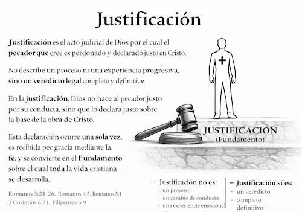
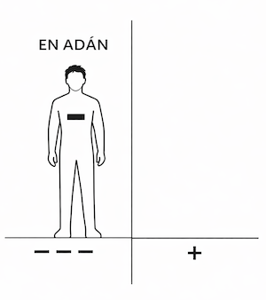
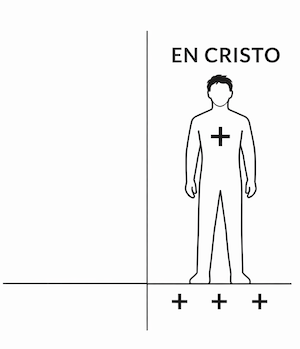
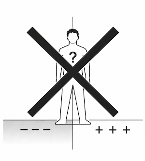
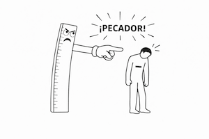
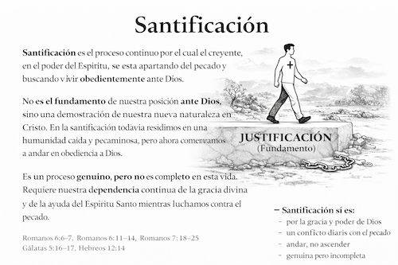
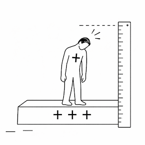
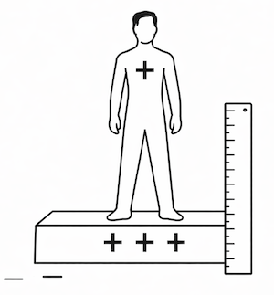
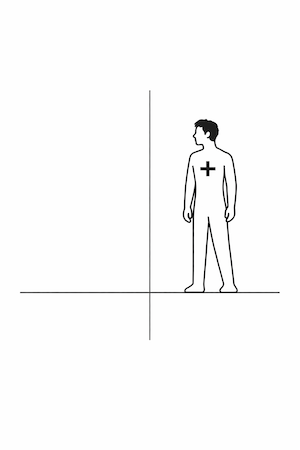
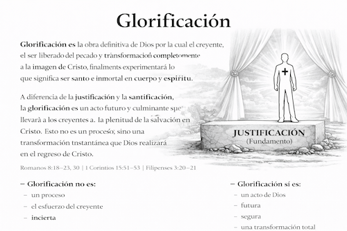

# TABLA DE CONTENIDOS

## CÓMO USAR ESTE MANUAL

### Propósito del manual

### Enfoque metodológico

### Alcance y naturaleza del manual

### Estructura del contenido

### Uso recomendado para la enseñanza

### Observación, aplicación y resultado esperado

## INTRODUCCIÓN

## ROMANOS 1:1–17 – EL EVANGELIO QUE DIOS ANUNCIÓ

### Romanos 1:1–7 – El evangelio prometido y revelado

### Romanos 1:8–17 – El evangelio como poder de Dios

## Romanos 1:18–3:20 – EL MUNDO NECESITA SALVACIÓN

### Romanos 1:18–23 – La revelación de la ira de Dios (resultado del rechazo de Dios como Dios)

### Romanos 1:24–25 – Entrega de Dios #1: El colapso de la conducta humana

### Romanos 1:26–27 – Entrega de Dios #2: El colapso de valores humanos

### Romanos 1:28–32 – Entrega de Dios #3: El colapso de la cosmovisión humana

### Romanos 2:1–5 – El juicio justo e imparcial de Dios (condenación del moralista)

### Romanos 2:6–16 – El juicio justo e imparcial de Dios (principios morales universales)

### Romanos 2:17–29 – El juicio justo e imparcial de Dios (condenación de la hipocresía religiosa)

### Romanos 3:1–8 – Objeciones religiosas y la fidelidad de Dios

### Romanos 3:9–20 – Culpabilidad universal

## ROMANOS 3:21–5:21 – JUSTIFICACIÓN: LA JUSTICIA QUE DIOS PROVEE

### Romanos 3:21–31 – La justicia de Dios aparte de la ley

### Romanos 4:1–8 – Abraham justificado por la fe (no por obras)

### Romanos 4:9–12 – Fe y promesa (antes de la circuncisión)

### Romanos 4:13–17 – La promesa por gracia, no por ley

### Romanos 4:18–25 – La fe contada por justicia

### Romanos 5:1–2 – Paz con Dios y acceso a la gracia

### Romanos 5:3–5 – Esperanza en medio del sufrimiento

### Romanos 5:6–8 – El amor de Dios demostrado

### Romanos 5:9–11 – Reconciliación asegurada

### Romanos 5:12–14 – El origen del pecado y la muerte

### Romanos 5:15–17 – El don no como la transgresión

### Romanos 5:18–19 – Dos actos, dos resultados

### Romanos 5:20–21 – La ley y la multiplicación de la transgresión

## ROMANOS 6:1-8:17 SANTIFICACIÓN: LA VIDA QUE BROTA DE LA JUSTIFICACIÓN

### Romanos 6:1-2 ¿Permaneceremos en el pecado? (la gracia abundante provoca una objeción lógica: si la gracia reina, ¿importa el pecado?)

### Romanos 6:1-2 ¿Permaneceremos en pecado?

### Romanos 6:3-10 La unión con Cristo (bautizados en su muerte y resucitados con él)

### Romanos 6:11-14 Lógica de la unión: considerarse muertos al pecado y vivos para Dios

### Romanos 6:15-23 Dos esclavitudes, dos frutos, dos finales (gracia no significa libertad para pecar)

### Romanos 7:1-6 La ley no puede gobernar a un muerto (liberación del dominio legal)

### Romanos 7:7-13 La ley no es pecado, pero revela el pecado (el pecado usa la ley)

### Romanos 7:14-20 La impotencia del yo bajo la carne (querer no es poder)

### Romanos 7:21-23 Dos leyes operando: el conflicto interno como realidad continua

### Romanos 7:24-25 El clamor por liberación (la solución no es más ley u otra ley, sino una persona)

### Romanos 8:1-4: La vida posible solo por el Espíritu

### Romanos 8:5-11 La mente de la carne versus la mente del Espíritu (vida y paz)

### Romanos 8:12-17 Hijos de Dios: herencia, adopción y testimonio del Espíritu

## Romanos 8:18-39 GLORIFICACIÓN: ESPERANZA Y SEGURIDAD EN EL PROPÓSITO DE DIOS

### Romanos 8:18-25 La creación y la esperanza futura

### Romanos 8:26-27 La ayuda del Espíritu en la debilidad

### Romanos 8:28-30 El propósito de Dios

### Romanos 8:31-39 La seguridad del amor de Dios

## EPÍLOGO VISUAL

## APÉNDICE

# CÓMO USAR ESTE MANUAL

## Propósito del manual

### Este manual existe para enseñar Romanos 1–8 de manera **textual, progresiva y consciente del lenguaje**, dando prioridad a lo que el Texto bíblico dice y a cómo lo dice, antes de cualquier síntesis teológica o aplicación práctica.

### Este manual asume que el estudiante **no trae categorías previas confiables**. Por eso, cada sección busca responder tres preguntas simples y verificables: **(1) ¿Qué dice el texto? (2) ¿Qué palabras/estructuras lo determinan? (3) ¿Qué conclusión se permite, y cuál no?**

### En Romanos, muchas suposiciones comunes (por ejemplo, qué significa “ley”, “justicia”, “fe”, “carne”) pueden ser diferentes a lo que Pablo está construyendo. Por eso, aquí no se “salta” a conclusiones: se avanza con el ritmo del argumento.

### No fue diseñado para resolver debates doctrinales históricos ni para presentar un sistema teológico cerrado. Su propósito es exponer cuidadosamente el argumento de Pablo, observando cómo la gramática, el vocabulario y la estructura literaria determinan el significado. La teología y la aplicación se entienden como derivadas del texto, no como su punto de partida.

## Enfoque metodológico

### Este manual sigue un enfoque observacional e inductivo. Parte de la convicción de que la Escritura comunica significado a través del lenguaje, y que la gramática no es un elemento secundario, sino un medio esencial para transmitir sentido.

### Por esta razón, el material presta atención deliberada a los tiempos verbales, la voz, el modo, los participios, los conectores y las relaciones sintácticas.

### Para mantener el avance **progresivo** de Pablo, el manual no introduce conclusiones “finales” antes de tiempo. En cada punto, se intentará distinguir entre:

- (a) una afirmación textual (lo que Pablo dice),
- (b) una explicación de términos (lo que las palabras permiten), y
- (c) una inferencia (lo que se sigue solo si el texto lo conecta).

### Esto es especialmente importante en contextos latinoamericanos, donde muchas veces se enseña por afirmaciones sueltas. Romanos no se entiende por frases aisladas: se entiende siguiendo el hilo que Pablo va tendiendo.
 Las observaciones se formulan de tal manera que el propio Texto establezca los límites de lo que puede afirmarse. Las tensiones internas del pasaje no se resuelven de forma apresurada, sino que se reconocen y se mantienen visibles cuando el texto mismo no las explica.

## Alcance y naturaleza del manual

### Este manual es una herramienta de estudio bíblico diseñada para **todo estudiante de la Palabra de Dios** y más específicamente, para el uso en el contexto del discipulado en la Iglesia. Puede utilizarse tanto en discipulado personal como en la enseñanza en grupos, clases o estudios congregacionales.

### Está diseñado para enseñar Romanos como un argumento continuo y coherente, y no como una colección de versículos aislados. Su enfoque busca ayudar al lector a observar el Texto con cuidado, siguiendo el desarrollo del pensamiento de Pablo de principio a fin.

### No es un comentario devocional, ni un tratado de teología sistemática, ni un manual de aplicación inmediata. Cuando aparecen observaciones teológicas, pastorales o apologéticas, estas se presentan como conclusiones secundarias que surgen del Texto, y no como ideas impuestas sobre él.

## Estructura del contenido

### El material sigue el flujo argumental de Romanos 1–8, observando cómo Pablo desarrolla su pensamiento mediante patrones recurrentes de explicación, ilustración e inferencia.

### Las secciones no están organizadas únicamente por capítulos, sino por movimientos argumentales. El objetivo es que el estudiante aprenda a seguir la lógica interna de Pablo, reconociendo cómo una afirmación prepara la siguiente y cómo las conclusiones dependen de lo que ya ha sido establecido.

## Uso recomendado para la enseñanza

### Este manual no está diseñado para ser leído literalmente en clase. Funciona como una herramienta de preparación y consulta. Es el deseo de los creadores de este material que el alumno vea que son de apoyo únicamente para presentar lo que el Texto bíblico enseña. El manual no es para hacer entender la Biblia sino presentar lo que la Biblia enseña. Este manual no es para reemplazar a la Biblia. 

### El uso recomendado es para discipulado. Este material está diseñado para permitir que el alumno sea enseñado las verdades que contiene Romanos y a la vez para que el alumno utilice el manual para enseñar a otros. 

## Observación, aplicación y resultado esperado

### En Romanos 1–8, Pablo se enfoca principalmente en declarar realidades antes de exhortar conductas. Por ello, este manual enseña primero a **observar y comprender el texto**, y solo después a considerar su aplicación.

### Al completar el estudio de Romanos 1–8 usando este manual, el estudiante debería ser capaz de seguir el argumento completo de Pablo, reconocer cambios gramaticales significativos, distinguir entre afirmaciones textuales e inferencias, y leer Romanos con mayor precisión, paciencia y fidelidad al texto. De esta manera, el lector podrá acercarse al texto con mayor confianza y respeto por lo que Pablo realmente afirma.

### Esperamos que tenga muchos ánimos de ser enseñado por la Palabra de Dios.

###  ¡Que Dios bendiga su estudio de Romanos 1–8!

# ROMANOS

## El Evangelio de Poder

# INTRODUCCIÓN

## Preámbulo

### La Carta a los Romanos es el escrito más extenso y uno de los más desarrollados, tanto en contenido como en argumentación, del apóstol Pablo. Probablemente fue compuesta en Corinto alrededor del año 56–57 d.C. y dirigida a la iglesia cristiana en Roma. Pablo tenía la expectativa de visitarlos en su camino hacia España.[^3]

### Desde el inicio, Romanos se presenta como una carta cuidadosamente estructurada, cuyo propósito principal es exponer el evangelio de manera ordenada, profunda y progresiva.

## Sobre el autor

### Aunque se desconoce la fecha exacta de su nacimiento, Pablo estuvo activo como misionero durante las décadas del 40 y 50 del siglo 1 d.C. La mayoría de las reconstrucciones históricas sugieren que nació aproximadamente en la misma época que Jesús, o poco después. Su conversión a la fe en Jesucristo ocurrió alrededor del año 33 d.C., y su muerte tuvo lugar, probablemente en Roma, entre los años 62 y 64 d.C.[^4]

### Pablo era un judío de habla griega, originario de Asia Menor. Su ciudad natal, Tarso, era una ciudad importante en el oriente de Cilicia, región que pasó a formar parte de la provincia romana de Siria cPreámbulo

### La Carta a los Romanos es el escrito más extenso y uno de los más desarrollados, tanto en contenido como en argumentación, del apóstol Pablo. Probablemente fue compuesta en Corinto alrededor del aPreámbulo

### La Carta a los Romanos es el escrito más extenso y uno de los más desarrollados, tanto en contenido como en argumentación, del apóstol Pablo. Probablemente fue compuesta en Corinto alrededor del año 56–57 d.C. y dirigida a la iglesia cristiana en Roma. Pablo tenía la expectativa de visitarlos en su camino hacia España.[^3]

### Desde el inicio, Romanos se presenta como una carta cuidadosamente estructurada, cuyo propósito principal es exponer el evangelio de manera ordenada, profunda y progresiva.

## ROMA

### Roma era la ciudad más célebre del mundo en tiempos de Cristo, tradicionalmente fundada en el año 753 a.C. Para la época en que se escribió el Nuevo Testamento, la ciudad estaba enriquecida y adornada con los despojos del mundo conquistado. Su población se estimaba en aproximadamente 1.200.000 habitantes, de los cuales cerca de la mitad eran esclavos. Era una ciudad altamente diversa, compuesta por personas provenientes de múltiples regiones del imperio, y se distinguía por su riqueza, lujo y derroche. El imperio del cual era capital se encontraba entonces en su mayor esplendor.

### El día de Pentecostés había en Jerusalén «extranjeros procedentes de Roma», quienes sin duda llevaron consigo noticias de aquel acontecimiento y desempeñaron un papel importante en el surgimiento de la iglesia en esa ciudad. Más adelante, Pablo fue llevado a Roma como prisionero, donde permaneció dos años viviendo «en una casa alquilada» (Hechos 28:30–31).

### Durante ese período, Pablo escribió varias de sus epístolas: a los Filipenses, a los Efesios, a los Colosenses y a Filemón. En esos años tuvo como compañeros a Lucas y Aristarco (Hechos 27:2), a Timoteo (Filipenses 1:1; Colosenses 1:1), a Tíquico (Efesios 6:21), a Epafrodito (Filipenses 4:18) y a Juan Marcos (Colosenses 4:10).

### Debajo de la ciudad de Roma se encuentran extensas galerías subterráneas conocidas como catacumbas. Estas comenzaron a utilizarse aproximadamente desde la época de los apóstoles —una de las inscripciones halladas lleva la fecha del año 71— y durante unos trescientos años sirvieron como lugares de entierro, refugio en tiempos de persecución y, en algunos casos, como espacios de reunión y culto.

### Se han descubierto alrededor de cuatro mil inscripciones en estas catacumbas, las cuales ofrecen una perspectiva valiosa sobre la historia temprana de la iglesia en Roma hasta la época de Constantino.[^5]

## Gramática de la carta

### En la Carta a los Romanos, Pablo presenta el evangelio y el problema universal del pecado con un claro predominio de declaraciones, más que de exhortaciones directas.

### Aunque existen algunas excepciones, en Romanos capítulos 1–11 Pablo utiliza mayormente verbos en modo indicativo, es decir, declara lo que es, más que indicar lo que debe hacerse. Esto describe una tendencia dominante en la carta, no una ausencia total de imperativos.

### Indicativos (Romanos 1–11) → Imperativos (Romanos 12–15)

### Un cambio gramatical significativo ocurre en Romanos 12:1.

#### Capítulos 1–11: predominan los indicativos, las estructuras condicionales, los contrastes razonados y los marcadores explicativos.
#### Capítulos 12–15: predominan los imperativos y los llamados a la acción.

### Interpretación gramatical

### Este cambio indica que la carta pasa de declarar realidades establecidas a apelar a una respuesta práctica basada en esas realidades.

### Uniendo toda la gramática

### Si se consideran en conjunto las estructuras gramaticales que se repiten a lo largo de la carta —las condiciones de primera clase (premisas asumidas como verdaderas), la cadena lógica marcada por conectores como GAR, DE y OUN, los contrastes extensos y el paso del indicativo al imperativo— se observa un tema gramatical a gran escala:

### Romanos se presenta como un argumento progresivo, construido sobre premisas asumidas como verdaderas, desarrollado mediante contrastes claros, explicado con lógica conectiva y culminando en una respuesta práctica.

## Un patrón recurrente en Romanos

### A lo largo de la carta, Pablo utiliza de manera constante un patrón reconocible.

#### Generalmente:
##### Explica un principio (a menudo introducido con GAR, OUN, EPEIDE, EAN),
##### presenta un ejemplo (una persona o grupo que encarna ese principio),
##### y completa el pensamiento con una conclusión o inferencia.

#### Este patrón no aparece de forma idéntica en cada sección, pero se repite con la frecuencia suficiente como para ser claramente observable.

#### Este estudio abordará Romanos priorizando la observación gramatical, discursiva y contextual del texto griego, evitando conclusiones teológicas que no estén claramente expresadas por la sintaxis o por el flujo argumentativo del propio texto.

# ROMANOS 1:1–17 – EL EVANGELIO QUE DIOS ANUNCIÓ

## Romanos 1:1–7 – El evangelio prometido y revelado 

### Pablo no comienza su carta con el problema del hombre, sino con la iniciativa de Dios.

#### Esta observación es importante porque establece el orden del argumento de toda la carta. Antes de hablar del pecado, de la culpa o de la necesidad humana, Pablo presenta lo que Dios ha hecho y lo que Dios ha anunciado. El evangelio no surge como respuesta a una pregunta humana, sino como revelación de una iniciativa divina.

### Romanos 1:1a "*Pablo,*"
#### Gradualmente dejó de ser llamado Saulo a ser conocido como Pablo. Al principio de su ministerio era conocido como Saulo, pero con el tiempo se lo llama Pablo. ¿Por qué es interesante este detalle? 

#### Este detalle no es anecdótico. Pablo comienza identificándose con el nombre bajo el cual es conocido por las iglesias gentiles. El lector no necesita reconstruir su pasado; Pablo se presenta desde el inicio como el mismo individuo que fue llamado y enviado por Cristo.

#### Saulo significa "aquel que pidieron" llegó a ser Pablo que significa "pequeño". Hechos 7:58, 9:22-24, 13:9, 21:40

#### Este dato lingüístico no prueba por sí solo una transformación espiritual, pero sí ayuda al lector a notar un desplazamiento narrativo: el perseguidor conocido como Saulo es ahora el mensajero conocido como Pablo. El texto bíblico no enfatiza un cambio de carácter aquí, sino una continuidad de persona con una nueva función.

#### Cómo llegamos a esta observación: en el relato de Hechos, el mismo individuo es llamado primero “Saulo” (Hechos 7:58; Hechos 9:1–2) y luego el narrador hace explícito el puente “Saulo, llamado también Pablo” (Hechos 13:9). A partir de ese punto, el nombre “Pablo” domina la narrativa (por ejemplo, Hechos 13:13 en adelante). Este dato no obliga a concluir un cambio moral en sí mismo, pero sí muestra un cambio de designación narrativa que ayuda al lector a reconocer continuidad de persona.

#### Este procedimiento muestra cómo no inferimos más de lo que el texto permite. El cambio de nombre es un dato textual; cualquier conclusión adicional debe ser controlada por el propio relato.

### Romanos 1:1b "*siervo de Cristo Jesús,*"
#### Para Pablo, ser siervo de Cristo no era un término de humillación, sino un honor. 

#### En el mundo romano, la palabra “siervo” estaba asociada a pertenencia y dependencia. Pablo adopta ese lenguaje para expresar a quién pertenece ahora su vida. No se presenta como un pensador independiente ni como fundador de un movimiento.

#### Pablo se consideraba comprado por precio. Su nuevo amo era Cristo Jesús.

#### Esto explica por qué Pablo no habla primero de sus logros, sino de su relación de pertenencia. Su autoridad no nace de sí mismo, sino de Aquel a quien sirve.

### Romanos 1:1c "*llamado a ser apóstol,*"
#### El llamado que Pablo recibió de parte de Dios fue para ser apóstol, es decir, un enviado con un mensaje específico.

#### Aquí aparece por primera vez la idea de misión. Pablo no se autodesigna; él fue llamado. El énfasis no está en su capacidad, sino en el origen del llamado.

> "*apóstol*" APOSTOLO apóstol n. — un enviado de Jesucristo comisionado directamente por Él o por otros apóstoles; normalmente alguien que ha sido enseñado directamente por Jesús y que está investido con la autoridad para hablar en Su nombre.[^1]

#### Esta definición controla el alcance del término: Pablo no es un “mensajero genérico”, sino un enviado con autoridad derivada.

### Romanos 1:1d "*apartado para el evangelio…*"
#### Su llamado apostólico tenía un propósito definido: el evangelio.

#### Pablo no fue apartado para una causa social, política o filosófica. Su separación tiene un objeto claro y exclusivo.

> "*evangelio*" – EUAGGELIO. Buenas noticias. Información positiva sobre acontecimientos recientes e importantes, considerados dignos de ser anunciados y celebrados.[^1]

> En el texto original, “evangelio” aparece con artículo definido. No se trata de un evangelio entre muchos, sino de el evangelio. Pablo no fue apartado para cualquier mensaje, sino para la única buena noticia.

#### Este detalle gramatical evita una lectura relativista: no hay múltiples mensajes equivalentes compitiendo entre sí.

### Romanos 1:1e "*el evangelio de Dios,*"
#### El evangelio tiene su origen en Dios. No procede de ningún hombre. Pablo no lo inventó ni lo redefinió; ya había sido revelado por Dios.

#### Esta afirmación protege al lector de pensar que el evangelio es una construcción cultural o una reinterpretación tardía.

### Romanos 1:2a "*que Él ya había prometido*"
#### Dios ya lo había prometido; no era un mensaje nuevo revelado por Pablo.

#### Pablo anticipa una posible objeción: “¿es esto algo nuevo?”. Su respuesta es clara: no.

#### Aunque el plan redentor de Dios existía desde antes de la fundación del mundo, Dios comenzó a anunciarlo desde el momento en que el ser humano pecó.

##### Dios mismo declaró en Génesis 3:15 (NBLA): "*Pondré enemistad entre tú y la mujer, y entre tu simiente y su simiente; Él te herirá en la cabeza, y tú lo herirás en el talón.*"

###### Se prometió que sería varón: "*Él…*"

###### Se prometió que vendría de la simiente de la mujer: "*tu simiente…*"

###### Se anunció que heriría la cabeza de la serpiente: "*te herirá en la cabeza*"

###### Dios mismo afirmó que Él lo haría: "*Pondré enemistad… Él te herirá…*"

#### Este análisis muestra cómo leemos el texto: observando quién actúa, qué se promete y cómo se formula la esperanza.

### Romanos 1:2b "*…que había prometido por medio de Sus profetas*"
#### Dios anunció el evangelio por medio de Sus profetas.

#### El evangelio no fue comunicado de una sola vez ni por un solo medio.

#### Algunos profetas que anunciaron esta promesa: Moisés (Génesis 3:15; Génesis 12:3), Isaías (Isaías 53), Zacarías (Zacarías 3:9), Malaquías (Malaquías 4:2).

#### Estos ejemplos muestran que la promesa fue repetida, ampliada y reafirmada a lo largo del tiempo.

### Romanos 1:2c "*en las Sagradas Escrituras…*"
#### Las promesas quedaron registradas por escrito.

#### Esto introduce la autoridad del texto escrito como testigo histórico.

### Romanos 1:3a "*acerca de Su Hijo,*"
#### El evangelio es un mensaje específico: trata acerca del Hijo de Dios, Jesucristo.

#### Pablo delimita el contenido del evangelio antes de explicar sus efectos.

### Romanos 1:3b "*que nació de la descendencia de David según la carne,*"
#### Pablo afirma que el Hijo de Dios nació verdaderamente como hombre, de carne y hueso, y como descendiente del rey David.

#### Esto conecta el evangelio con las promesas davídicas sin desarrollarlas todavía.

### Romanos 1:4a "*que fue declarado Hijo de Dios con poder,*"
#### Su identidad fue confirmada mediante un acto poderoso.

#### No se trata de un cambio de identidad, sino de una declaración pública.

### Romanos 1:4b "*conforme al Espíritu de santidad,*"
#### El Espíritu Santo fue el agente principal en este acontecimiento.

#### Pablo introduce aquí al Espíritu sin explicar aún su rol completo; eso vendrá después.

### Romanos 1:4c "*por la resurrección de entre los muertos: Jesucristo nuestro Señor.*"
#### Jesús fue levantado por el Espíritu de santidad.

#### La resurrección funciona como punto de validación.

### Romanos 1:5a "*por medio de Él hemos recibido la gracia y el apostolado…*"
#### Pablo recibió su llamado por medio de Cristo.

#### Esto mantiene la cadena: Dios → Cristo → Pablo.

### Romanos 1:5b "*para promover la obediencia a la fe entre todos los gentiles,*"
#### La gracia y el apostolado tenían un propósito definido.

#### La obediencia no es el punto de partida, sino el resultado.

### Romanos 1:5c "*por amor a Su nombre;*"
#### La obediencia que procede de la fe surge del amor a Cristo.

#### El motivo no es miedo ni presión externa.

### Romanos 1:6a "*entre los cuales están también ustedes…*"
#### Los creyentes en Roma forman parte de ese alcance.

#### Pablo incluye a sus lectores en la misma historia.

### Romanos 1:6b "*llamados de Jesucristo.*"
#### Su identidad está definida por Aquel a quien pertenecen.

### Romanos 1:7a "*a todos los amados de Dios que están en Roma,*"
#### Esta expresión se refiere a creyentes en Jesucristo.

### Romanos 1:7b "*llamados santos;*"
#### Pablo no dice “a ser”, sino que los llama santos.

#### Este detalle prepara el terreno para discusiones posteriores sobre pecado y gracia.

### Romanos 1:7c "*Gracia a ustedes y paz de parte de Dios nuestro Padre y del Señor Jesucristo.*"
#### Pablo inicia su carta con un deseo de gracia y paz.

#### La carta comienza con lo que Dios da, no con lo que exige.

## En Síntesis (1:1–7)

### El evangelio tiene su origen en Dios, no en el hombre.

### No es una idea nueva, sino una promesa anunciada en las Escrituras.

### Jesucristo es el centro del plan redentor de Dios.

### El llamado apostólico existe para producir obediencia que procede de la fe.

### Desde el inicio, el evangelio tiene un alcance universal.

## Romanos 1:8–17 – El evangelio como poder de Dios 

### (No es solo información, sino poder eficaz. 1 Corintios 1:18)

### Romanos 1:8a "*En primer lugar, doy gracias a mi Dios*"
#### Después de haber hablado de Dios como Padre común, Pablo ahora se expresa de manera personal. Manifiesta gratitud y se refiere a Dios como *mi* Dios.

### Romanos 1:8b "*por medio de Jesucristo*"
#### Pablo da gracias a Dios por medio de Jesucristo, quien hizo posible esta relación mediante Su obra redentora en la cruz.

### Romanos 1:8c "*por todos ustedes,*"
#### La gratitud de Pablo no es general, sino concreta: agradece a Dios específicamente por los creyentes en Roma.

### Romanos 1:8d "*porque por todo el mundo se habla de su fe.*"
#### La razón de su gratitud es que la fe de ellos era conocida ampliamente. No se trata de fama personal, sino del testimonio visible de su confianza en Dios.

#### Más adelante Pablo aclarará que esta fe se expresaba en obediencia. Romanos 16:19; 3 Juan 1:3; Colosenses 1:6, 23

### Romanos 1:9a "*Pues Dios, a quien sirvo en mi espíritu*"
#### Pablo describe su servicio a Dios como algo interno y sincero. Su servicio no es meramente externo, sino que brota de lo profundo de su ser. Hechos 18:25; Filipenses 3:3

> El verbo "*sirvo*" LATREUO, término usado para el servicio sacerdotal de Israel a Yahvé (Éxodo 20:5; Deuteronomio 5:9). Pablo emplea este lenguaje porque considera que el ministerio del evangelio es un servicio sagrado a Dios. También usa este término para describir el servicio de los gentiles a Dios (Romanos 12:1; compárese con 2 Timoteo 1:3).[^2]

### Romanos 1:9b "*en la predicación del evangelio de Su Hijo,*"
#### El centro del servicio de Pablo era el anuncio del evangelio, cuyo contenido es el Hijo de Dios.

#### El evangelio no es un método para ser salvo ni una técnica religiosa. Pablo no predicaba un procedimiento, sino un mensaje definido.

#### El mensaje es "*de Su*" Hijo. El enfoque no está en el mensajero ni en el oyente, sino en la persona del Hijo de Dios. Este es el mismo evangelio para el cual Pablo había sido apartado.

### Romanos 1:9c "*me es testigo de cómo sin cesar hago mención de ustedes*"
#### Pablo apela a Dios como testigo de su constante oración por los creyentes en Roma.

### Romanos 1:10 "*siempre en mis oraciones, implorando que ahora, al fin, por la voluntad de Dios, logre ir a ustedes.*"
#### Pablo somete su deseo a la voluntad de Dios. No exige; implora.

### Romanos 1:11a "*Porque anhelo verlos*"
#### Pablo expresa un deseo profundo y personal de visitar a los creyentes en Roma.

### Romanos 1:11b "*para impartirles algún don espiritual,*"
#### El propósito de su visita no es recibir, sino dar. Pablo desea servir y ser de bendición a la iglesia.

#### Este lenguaje muestra su afecto pastoral y su preocupación por la edificación de los creyentes. 1 Corintios 4:15

#### Pablo no especifica el don. La expresión "*algún don*" es deliberadamente general y calificada como espiritual.

#### Otros pasajes muestran que los dones espirituales tienen como propósito la edificación del cuerpo. 1 Corintios 12:4–7; Romanos 12:6

### Romanos 1:11c "*a fin de que sean confirmados;*"
#### El propósito del don es el fortalecimiento de los creyentes.

> "*Confirmados*" proviene de STERIZO (aoristo, pasivo, infinitivo): ser establecido, reforzado o fortalecido.

#### El énfasis gramatical está en el efecto producido en los creyentes, no en la acción de Pablo.

### Romanos 1:12a "*es decir, para que cuando esté entre ustedes nos confortemos mutuamente,*"
#### Pablo aclara que la edificación no sería unilateral. Espera un fortalecimiento mutuo.

#### No va como superior ni como inferior, sino como hermano entre hermanos.

### Romanos 1:12b "*cada uno por la fe del otro, tanto la de ustedes como la mía.*"
#### La base del ánimo mutuo es la fe compartida.

### Romanos 1:13a "*Y no quiero que ignoren, hermanos, que con frecuencia he hecho planes para ir a visitarlos,*"
#### Pablo desea que sepan que su intención de visitarlos ha sido constante.

### Romanos 1:13b "*pero hasta ahora me he visto impedido,*"
#### Los obstáculos no significan falta de interés ni abandono del plan.

### Romanos 1:13c "*a fin de obtener algún fruto también entre ustedes,*"
#### El término "*fruto*" no es definido explícitamente.

#### El contexto más amplio de Romanos sugiere resultados concretos del evangelio operando entre los gentiles. Romanos 15:28

### Romanos 1:13d "*así como entre los demás gentiles.*"
#### Pablo ve a la iglesia en Roma dentro del mismo marco de su ministerio entre los gentiles.

### Romanos 1:14a "*Tengo obligación*"
#### Pablo se describe como deudor, alguien con un deber que debe cumplirse.

> "*Obligación*" proviene de OFEILETES, término que expresa deber o responsabilidad (Mateo 6:12; Romanos 8:12; Gálatas 5:3).[^13]

### Romanos 1:14b "*tanto para con los griegos… como para con los bárbaros… para con los sabios como para con los ignorantes.*"
#### El evangelio no distingue por cultura, idioma o nivel educativo. Pablo se siente responsable ante todos.

### Romanos 1:15a "*Así que, por mi parte, ansioso estoy de anunciar el evangelio...*"
#### Como deudor, Pablo expresa su disposición inmediata a anunciar el evangelio.

### Romanos 1:15b "*también a ustedes que están en Roma.*"
#### Aunque los romanos ya eran creyentes, Pablo desea anunciarles el evangelio.

#### El evangelio no se deja atrás: los creyentes permanecen en él y siguen siendo edificados por su poder. 1 Corintios 15:1–2

### Romanos 1:16a "*Porque no me avergüenzo del evangelio,*"
#### Pablo declara abiertamente su confianza en el evangelio, aun en un contexto cultural hostil.

> "*Avergüenzo*" proviene de EPAISCHYNOMAI: sentir vergüenza, bochorno o retraimiento.[^1]

### Romanos 1:16b "*pues es el poder de Dios*"
#### La razón de su confianza es que el evangelio es el poder de Dios, no del hombre.

#### Todo lo que Pablo explicará a partir de aquí sirve para proteger y aclarar esta verdad central.

### Romanos 1:16c "*para salvación*"
#### En Romanos, la salvación está inseparablemente unida al evangelio.

#### La salvación no procede del esfuerzo humano, de la ley ni de la moralidad, sino del poder eficaz del evangelio.

### Romanos 1:16d "*de todo el que cree,*"
#### El poder salvador del evangelio se aplica a quienes creen.

> La expresión "*el que cree*" TO PISTEUONTI está en presente, indicando una acción continua: “al que está creyendo”.

#### Pablo escribe a creyentes y, aun así, desea predicarles el evangelio porque este sigue operando como poder de Dios en sus vidas.

### Romanos 1:16e "*del judío primeramente y también del griego.*"
#### El alcance del evangelio es universal, respetando el orden histórico de la revelación.

### Romanos 1:17a "*Porque en el evangelio la justicia de Dios se revela*"
#### La justicia de Dios no se produce por el hombre; se revela en el evangelio.

> *“justicia”* DIKAIOSYNE — estado o condición de estar en conformidad con una norma correcta; rectitud reconocida según un estándar válido; puede referirse a un estatus otorgado o a una condición reconocida públicamente. [^18]

> *“revelar”* APOKALYPTO — hacer visible algo que estaba oculto; quitar un velo para que algo sea perceptible o comprensible. [^18]

### Romanos 1:17b "*por fe y para fe*"
#### La justicia se recibe por fe y conduce a una vida caracterizada por la fe.

> *“fe”* PISTIS — confianza, fidelidad o dependencia; relación de confianza dirigida hacia un objeto o persona. [^18]

### Romanos 1:17c "*como está escrito: MAS EL JUSTO POR LA FE VIVIRÁ.*"
#### Pablo apoya su afirmación citando las Escrituras. La vida procede de la fe.

### El evangelio no comienza con el hombre, sino con Dios y Su propósito.

## En Síntesis (1:8–17)

### Pablo presenta el evangelio como poder eficaz, no solo como información.

### El evangelio es poder de Dios para salvación para todo el que cree.

### La justicia de Dios se revela en el evangelio y gobierna la vida del creyente.

### Esta sección establece la tesis que gobierna toda la carta.

### Todo lo que sigue explica por qué este poder es necesario y suficiente.

# ROMANOS 1:18–3:20 – EL MUNDO NECESITA SALVACIÓN

## Romanos 1:18–23 – La revelación de la ira de Dios (resultado del rechazo de Dios como Dios)

### Dios es el Creador y, en el principio, todo lo que hizo reflejaba perfectamente Su carácter. El mundo era bueno en gran manera. No había mal, ni muerte, ni tristeza, ni dolor; todo estaba marcado por armonía, amor, paz y gozo.

#### Esta afirmación inicial establece el punto de partida correcto: el problema del mundo no comienza con Dios ni con la creación, sino con la respuesta humana posterior. Pablo no describe un mundo defectuoso desde el origen, sino uno creado bueno.

#### Toda la creación —cada molécula— depende completamente de Dios para existir. Dios existe por Sí mismo; Él es el gran YO SOY. La creación, en cambio, depende enteramente de Él, y el ser humano es totalmente dependiente de Dios. Salmo 63:8; Hebreos 1:3; 2 Pedro 3:7

### Si Dios es verdaderamente bueno, justo y puro, surge una pregunta inevitable: ¿cómo debe responder Dios ante la injusticia del hombre?

#### Pablo no comienza con el castigo, sino con una pregunta moral implícita. Si Dios es justo, Su respuesta al mal no puede ser indiferente. Esta pregunta prepara el terreno para entender por qué la ira de Dios no contradice el evangelio, sino que hace necesario su poder salvador.

#### Pablo comienza presentando la culpabilidad humana de manera general y, de forma progresiva, la hace cada vez más personal. Su objetivo es demostrar que toda la humanidad es culpable delante de Dios y que Dios es imparcialmente justo con todo ser humano.

### Progresión del argumento de culpabilidad en Romanos

#### Romanos 1:18–32 – Condenación de “ellos”.

#### Romanos 2:1–5 – Condenación del moralista “tú”.

#### Romanos 2:6–16 – Principios morales universales (“él”, “ellos”).

#### Romanos 2:17–29 – Condenación de la hipocresía religiosa judía (“tú”).

#### Romanos 3:1–8 – Diálogo religioso judío imaginario.

#### Romanos 3:9–20 – Culpabilidad universal: “nosotros”, “todos” bajo pecado.

#### Pablo pasa deliberadamente de “ellos” → “tú” → “él/ellos” → “tú” → “nosotros/todos” para demostrar que **no hay justo, ni siquiera uno**. Romanos 3:10

### Romanos 1:18a "*Porque la ira de Dios se revela desde el cielo...*"
#### En Romanos 1:17 Pablo explicó que la justicia de Dios se revela por medio del evangelio. Ahora introduce otra revelación: la ira de Dios. Ambas proceden del mismo Dios y ambas se revelan; no son fuerzas opuestas, sino expresiones coherentes de Su carácter.

> *“ira”* ORGE — reacción estable y deliberada frente a lo que viola un orden establecido; no un arrebato emocional, sino una respuesta consistente frente a una transgresión objetiva. [^18]

### Romanos 1:18b "*...contra toda impiedad e injusticia de los hombres*"
#### La ira de Dios no se dirige contra la humanidad como creación, sino contra la impiedad y la injusticia humanas. Esto muestra que el problema no es existir como ser humano, sino vivir en oposición a Dios.

> *“impiedad”* ASEBEIA — conducta caracterizada por falta de reverencia o reconocimiento debido; vivir sin considerar una autoridad superior. [^18]

### Romanos 1:18c "*que con injusticia restringen la verdad*"
#### La humanidad no solo ignora la verdad, sino que activamente la suprime. El problema no es falta de información, sino resistencia moral.

> *“injusticia”* ADIKIA — comportamiento que viola lo que es correcto o debido; desviación activa del estándar recto. [^18]

> El verbo "*restringen*" proviene de KATECHO y expresa la idea de suprimir, contener o mantener bajo control. Está en tiempo presente y voz activa, señalando una acción continua y deliberada.

#### La razón de la ira divina queda clara: los seres humanos restringen la verdad de Dios, aun cuando la poseen.

### Romanos 1:19a "*porque lo que se conoce acerca de Dios es evidente dentro de ellos*"
#### Todo ser humano posee conocimiento de Dios. Este conocimiento no es meramente externo, sino interno, pues el ser humano fue creado a imagen de Dios y vive dentro del mundo que Él sostiene.

> "*Evidente*" proviene de FANEROS y significa manifiesto o claramente perceptible.

### Romanos 1:19b "*pues Dios se lo hizo evidente*"
#### El conocimiento de Dios no es producto del ingenio humano. Dios mismo tomó la iniciativa de hacerlo evidente. Esto refuerza la responsabilidad humana.

### Romanos 1:20a "*Porque desde la creación del mundo*"
#### Desde el inicio mismo de la creación, Dios ha estado revelándose. No se trata de una revelación tardía ni limitada a un grupo especial.

### Romanos 1:20b "*Sus atributos invisibles*"
#### Aunque Dios es invisible, Él ha hecho perceptibles ciertos atributos por medio de lo creado. Salmo 19:1–6

### Romanos 1:20c "*Su eterno poder y divinidad*"
#### Pablo especifica cuáles atributos son evidentes: poder eterno y divinidad. La creación testifica que Dios es poderoso y distinto de lo creado. Jeremías 51:15

### Romanos 1:20d "*se han visto con toda claridad*"
#### La revelación no es ambigua ni confusa. El problema nunca fue falta de claridad.

### Romanos 1:20e "*siendo entendidos por medio de lo creado*"
#### La creación comunica información real y comprensible acerca de Dios. El ser humano puede entenderla racionalmente.

### Romanos 1:20f "*de manera que ellos no tienen excusa*"
#### La conclusión de Pablo es definitiva: no hay defensa válida. La revelación fue suficiente, continua y universal. El problema no es revelacional, sino moral. Romanos 1:18

### Romanos 1:21a "*Pues aunque conocían a Dios, no lo honraron como a Dios ni le dieron gracias*"
#### El conocimiento de Dios no produjo una respuesta correcta. "*Conocían*" indica conocimiento real; el rechazo fue consciente y responsable.

> *“conocer”* GINOSKO — llegar a conocer mediante experiencia o relación; conocimiento adquirido, no meramente informativo. [^18]

### Romanos 1:21b "*sino que se hicieron vanos en sus razonamientos*"
#### Al rechazar a Dios, el pensamiento humano pierde propósito y dirección. El problema no es falta de capacidad intelectual, sino una mente desconectada de la verdad.

### Romanos 1:21c "*y su necio corazón fue entenebrecido*"
#### El corazón pierde capacidad de discernimiento espiritual. La oscuridad es consecuencia, no causa inicial.

### Romanos 1:22 "*Profesando ser sabios, se volvieron necios*"
#### El ser humano redefine la sabiduría sin Dios, pero el resultado es necedad. Rechazar a Dios no libera la mente; la oscurece. Salmo 14:1

### Romanos 1:23a "*y cambiaron la gloria del Dios incorruptible*"
#### El pecado se expresa como un intercambio: abandonar la gloria verdadera.

### Romanos 1:23b "*por una imagen en forma de hombre corruptible...*"
#### El Creador es sustituido por la criatura caída.

### Romanos 1:23c "*y de aves, de cuadrúpedos y de reptiles*"
#### La idolatría se degrada progresivamente, reflejando la confusión moral y espiritual del ser humano.

## En Síntesis (1:18–23)

### La ira de Dios se revela porque la verdad ha sido rechazada, no porque haya estado ausente.

### El problema del hombre no es ignorancia, sino supresión deliberada de la verdad.

### Dios se ha dado a conocer de manera suficiente a toda la humanidad.

### El rechazo de Dios conduce inevitablemente a la idolatría.

### Esta sección explica por qué el evangelio debe ser poder, no solo información.

## Romanos 1:24–25 – Entrega de Dios #1: El colapso de la conducta humana 
### (La degradación moral es resultado, no causa)

#### Romanos 1:24a "*Por lo cual Dios los entregó a la impureza en la lujuria de sus corazones*" 
##### Dios responde a la injusticia del hombre entregándolos, o dejándolos, a la impureza que ya dominaba los deseos de sus corazones. La acción divina no introduce un mal nuevo, sino que retira el freno, permitiendo que los deseos internos se expresen plenamente.

##### Esta “entrega” debe leerse como consecuencia del intercambio previo (Romanos 1:23) y de la supresión de la verdad (Romanos 1:18), no como el inicio del problema.

##### El texto muestra un orden: primero el rechazo de Dios como Dios, luego el colapso interno, y después la manifestación externa.

> *“entregar”* PARADIDOMI — poner a alguien bajo el control o dominio de algo; ceder a una esfera de influencia. [^18]

> "*Impureza*" AKATHARSIA se refiere a inmoralidad entendida como suciedad o contaminación moral, usada especialmente para pecados de carácter sexual.[^1]

> "*Lujuria*" EPITHYMIA describe un deseo intenso. El término no es negativo en sí mismo, pero en el Nuevo Testamento aparece mayormente con una connotación negativa cuando el deseo está desordenado o gobernado por la carne.

###### Jesús usó este término para expresar un deseo profundo sin connotación pecaminosa (Lucas 22:15), lo que muestra que el problema no es el deseo en sí, sino su orientación y dominio.

###### Pablo también utiliza este término para deseos legítimos. 1 Tesalonicenses 2:17; Filipenses 1:23

###### Sin embargo, la gran mayoría de sus usos en el Nuevo Testamento describen deseos desordenados: deseos del padre Satanás (Juan 8:44), deseos de la carne (Romanos 6:12; 7:7–8; 13:14; Gálatas 5:16, 24; Efesios 2:3; Colosenses 3:5), deseos propios del estado previo a la fe (1 Pedro 1:14; 4:3; Tito 3:3), y deseos en contraste con la voluntad de Dios (1 Juan 2:17; 1 Pedro 4:2).

###### Santiago explica el proceso interno del deseo: Dios no tienta a nadie (Santiago 1:13); la tentación surge cuando cada uno es llevado y seducido por su propio deseo (Santiago 1:14); y cuando el deseo concibe, produce pecado, que finalmente engendra muerte (Santiago 1:15). El énfasis recae en la responsabilidad humana, no en la acción directa de Dios para tentar.

###### Esta cadena ayuda al lector a ver cómo “lo interno” produce “lo externo” sin culpar a Dios como autor del mal, sino reconociendo la responsabilidad humana previa.

#### Romanos 1:24b "*de modo que deshonraron entre sí sus propios cuerpos*" 
##### La deshonra del cuerpo es el resultado visible de esta entrega. El cuerpo se convierte en el escenario donde se manifiesta externamente lo que ya gobierna internamente el corazón.

##### Esta expresión describe la **primera etapa** de la ira de Dios. Debido a que la humanidad rechazó glorificar a Dios como Creador (Romanos 1:21), Dios los entregó a la impureza corporal. No se trata de un solo pecado aislado, sino de una categoría de conductas que surgen de deseos corporales sin control moral.

##### El texto enfatiza un “de modo que”: la entrega produce un efecto. Pablo no está describiendo meras inclinaciones, sino la conducta resultante.

##### Esta deshonra se refiere a prácticas sexuales que degradan la dignidad de la persona, utilizando el cuerpo como instrumento de pasión en lugar de honor, en contradicción con el diseño de Dios. 1 Tesalonicenses 4:3–5

##### Cuando la humanidad vive dominada por impulsos corporales sin freno moral, esto no debe interpretarse como libertad, sino como manifestación de la ira de Dios contra la injusticia. El ser humano sufre las consecuencias de haber rechazado a Dios como Creador. Gálatas 5:19; Efesios 5:3–5; Colosenses 3:5

##### La entrega de Dios se hace visible externamente en inmoralidad sexual, deshonra del cuerpo, actos físicos degradantes, impureza asociada a la idolatría, promiscuidad, sensualidad y explotación del cuerpo ajeno.

#### Romanos 1:25a "*Porque ellos cambiaron la verdad de Dios por la mentira*" 
##### Pablo explica la razón de esta entrega: la humanidad intercambió la verdad de Dios por la mentira. Al rechazar la verdad revelada, Dios deja de restringir la conducta humana, y la impureza interna se manifiesta abiertamente en la conducta.

##### El “porque” ancla el juicio en una causa anterior: no es arbitrariedad divina, sino respuesta coherente a un intercambio moral y espiritual.

#### Romanos 1:25b "*y adoraron y sirvieron a la criatura en lugar del Creador*" 
##### La deshonra del cuerpo está directamente relacionada con la idolatría. Al adorar y servir a lo creado en vez del Creador, la conducta humana colapsa.

##### El orden del argumento es clave: primero se desplaza la adoración, luego se desplaza la ética. La conducta sigue a la adoración.

##### La entrega de Dios se hace evidente cuando la humanidad rinde culto a algo creado en lugar de al Dios que creó todas las cosas. Cuando Dios entrega al ser humano, su verdadera condición interior queda expuesta.

#### Romanos 1:25c "*del Creador, quien es bendito por los siglos. Amén.*" 
##### Pablo interrumpe la descripción para rendir honor y gloria a Dios. Hace una distinción clara entre la creación y el Creador, afirmando que Él es bendito eternamente.

##### Esta doxología funciona como frontera: Pablo no permitirá que el lector confunda al Creador con la culpa de la criatura.

##### El Creador nunca debe ser acusado de injusticia por revelar Su ira. Al contrario, Él es siempre digno de honra. Dios no es culpable de la conducta indecorosa de la humanidad; Su ira se manifiesta de manera justa al entregar al hombre a las consecuencias de haberlo rechazado como Creador.

##### Así como Adán culpó a Dios por la mujer que Él creó (Génesis 3:12), la humanidad tiende a culpar a Dios por el colapso de su conducta, ignorando que la causa real es el rechazo previo de Dios como Creador.

##### Esto protege el hilo rector del evangelio: si Dios fuera injusto, el evangelio no podría ser “poder de Dios para salvación”; Pablo deja claro que Dios es justo aun al juzgar.

## En Síntesis (1:24–25)

### Dios entrega al hombre como consecuencia de su rechazo previo.

### La primera entrega produce un colapso en la conducta humana.

### El cuerpo se convierte en el escenario del desorden moral.

### La degradación es resultado del intercambio de la verdad por la mentira.

### El juicio de Dios es coherente y justo, no arbitrario.

## Romanos 1:26–27 – Entrega de Dios #2: El colapso de valores humanos  

### La consecuencia es una inversión de valores

##### El ser humano, no conforme con abandonar la verdad, insiste en sustituirla por la mentira. Ante esta persistencia, surge la pregunta: ¿cómo responde Dios?

##### La progresión muestra agravamiento: no solo se degrada la conducta, sino también el criterio que define lo “honroso” y lo “vergonzoso”.

#### Romanos 1:26a "*Por esta razón Dios los entregó*" 
##### Esta segunda entrega no es arbitraria ni caprichosa. Dios manifiesta Su ira como respuesta directa al abandono previo de la verdad. La acción divina sigue el curso del rechazo humano.

##### El texto recalca continuidad: “por esta razón” conecta esta entrega con la anterior causa. Romanos 1:25

#### Romanos 1:26b "*a pasiones degradantes;*" 
##### Ahora la entrega no se limita a los deseos del corazón, sino que avanza hacia pasiones que implican deshonra.

> "*Degradantes*" ATIMIA se refiere a un estado de deshonra, vergüenza o descrédito.[^1]

###### Es decir, Dios los entrega —o permite— que sus pasiones vergonzosas gobiernen su conducta. Esta entrega ocurre porque adoraron y sirvieron a la criatura en lugar de reconocer a Dios como Creador.

###### El punto del texto no es presentar una “nueva libertad”, sino una esclavitud más profunda: pasiones que ahora dictan valor y conducta.

#### Romanos 1:26c "*porque sus mujeres cambiaron la función natural por la que es contra la naturaleza.*" 
##### Pablo aclara que este cambio no es resultado del diseño original ni de un proceso natural de la creación.

##### No se trata de una evolución moral ni de un desarrollo progresivo. Es un intercambio deliberado que ocurre como consecuencia de la entrega de Dios. Las mujeres abandonan la función natural y adoptan prácticas contrarias a la naturaleza.

##### El lenguaje de “cambio” mantiene el mismo patrón del pasaje: verdad por mentira, gloria por imagen, función natural por lo contra naturaleza.

#### Romanos 1:27a "*De la misma manera también los hombres, abandonando el uso natural de la mujer,*" 
##### El colapso de valores no se limita a un solo grupo. Los hombres, de igual manera, abandonan la relación natural establecida por Dios.

##### Pablo insiste en “de la misma manera” para mostrar que el patrón de inversión se extiende y se consolida.

#### Romanos 1:27b "*se encendieron en su lujuria unos con otros,*" 
##### El deseo se intensifica de manera desordenada. En lugar de orientarse según el diseño de Dios, se dirige hacia lo que es antinatural.

##### Esto describe intensificación y descontrol: el deseo ya no solo existe; gobierna.

#### Romanos 1:27c "*cometiendo hechos vergonzosos hombres con hombres,*" 
##### El deseo desordenado se manifiesta en actos que Pablo califica como vergonzosos. La conducta refleja la inversión total de los valores establecidos por el Creador.

##### El texto recalca que la vergüenza no es “social”, sino moral: surge de la contradicción con el diseño del Creador.

#### Romanos 1:27d "*y recibiendo en sí mismos el castigo correspondiente a su extravío.*" 
##### El texto indica que las consecuencias no son externas únicamente, sino que se experimentan en ellos mismos. El castigo corresponde directamente al extravío moral y espiritual.

##### El énfasis recae en correspondencia: la consecuencia es “correspondiente”, mostrando justicia en la retribución.

##### El extravío se evidencia en el colapso de los valores, impulsado por deseos pecaminosos que ahora determinan lo que se considera aceptable.

## En Síntesis (1:26–27)

### La segunda entrega afecta el sistema de valores humanos.

### Se invierte lo que se considera natural y correcto.

### El problema ya no es solo la conducta, sino el criterio moral.

### El pecado redefine lo que se honra y lo que se rechaza.

### El colapso de valores revela una corrupción más profunda.

## Romanos 1:28–32 – Entrega de Dios #3: El colapso de la cosmovisión humana  

### (La ira de Dios los deja hasta llegar a un punto sin discernimiento; se vuelven incapaces de evaluar correctamente)

#### Ahora se presenta la tercera entrega mediante la cual Dios revela Su ira frente al rechazo persistente de la verdad. Esta vez, de forma aún más profunda, la entrega es a una mente depravada, lo que produce el colapso total de la cosmovisión humana.

#### Romanos 1:28a "*Y así como ellos no tuvieron a bien reconocer a Dios,*"
##### La causa vuelve a ser el rechazo deliberado. Al no considerar valioso reconocer a Dios, la humanidad insiste en su propia interpretación de la realidad, apartándose de la verdad revelada.

#### Romanos 1:28b "*Dios los entregó a una mente depravada,*"
##### La mente depravada no surge de manera aislada, sino como consecuencia directa de no haber querido reconocer a Dios. Dios responde retirando el freno que preservaba el discernimiento moral.

#### Romanos 1:28c "*para que hicieran las cosas que no convienen.*"
##### El resultado es una conducta inapropiada y desordenada, contraria a lo que es correcto y adecuado.

> "*Convienen*" KATHEKO significa ser apropiado o correcto; aquello que corresponde al orden y a la idoneidad moral.

#### Romanos 1:29–32 – La descripción final del estado real de la humanidad

#### Romanos 1:29a "*Están llenos de toda injusticia,*"
##### La expresión indica plenitud. No se trata de actos ocasionales, sino de una condición dominante.

> "*Llenos*" PLEROO significa estar completamente colmado, hasta el máximo posible.[^1]

#### Romanos 1:29b "*maldad,*"
> "*maldad,*" PONERIA describe corrupción moral y una disposición activa a hacer daño.[^1]

#### Romanos 1:29c "*avaricia,*"
> "*avaricia,*" PLEONEXIA es el deseo insaciable de tener más; codicia egoísta.[^1]

#### Romanos 1:29d "*y malicia,*"
> "*malicia,*" KAKIA expresa mala voluntad, intención de dañar o corromper.[^1]

#### Romanos 1:29e "*llenos de envidia,*"
> "*llenos de envidia*" MESTOUS indica estar completamente caracterizado por algo; FTHONOU es resentimiento ante el bien o la ventaja del otro.[^1]

#### Romanos 1:29f "*homicidios,*"
> "*homicidios,*" FONOU es el acto injusto de quitar la vida a otro.[^1]

#### Romanos 1:29g "*pleitos,*"
> "*pleitos,*" ERIDOS señala conflicto, rivalidad y espíritu contencioso.[^1]

#### Romanos 1:29h "*engaños,*"
> "*engaños,*" DOLOU es deshonestidad deliberada, astucia y traición.[^1]

#### Romanos 1:29i "*y malignidad.*"
> "*y malignidad*" KAKOETHEIAS describe mal carácter, disposición rencorosa y bajeza moral.[^1]

#### Romanos 1:29j "*Son chismosos,*"
> "*Son chismosos*" PSITHYRISTAS son los que difunden rumores en secreto.[^1]

#### Romanos 1:30a "*detractores,*"
> "*detractores*" KATALALOUS son los que difaman y hablan mal de otros.[^1]

#### Romanos 1:30b "*aborrecedores de Dios,*"
> "*aborrecedores de Dios*" THEOSTYGEIS describe hostilidad activa hacia Dios.[^1]

#### Romanos 1:30c "*insolentes,*"
> "*insolentes*" HYBRISTAS son abusadores arrogantes que actúan con violencia verbal o social.[^1]

#### Romanos 1:30d "*soberbios,*"
> "*soberbios*" HYPEREPHANOUS expresa orgullo inflado y autosuficiencia.[^1]

#### Romanos 1:30e "*jactanciosos,*"
> "*jactanciosos*" ALAZONAS son quienes presumen y exageran sus logros o capacidades.[^1]

#### Romanos 1:30f "*inventores de lo malo,*"
> "*inventores de lo malo*" KAKON señala creatividad aplicada a lo perverso.[^1]

#### Romanos 1:30g "*desobedientes a los padres,*"
> "*desobedientes a los padres*" APEITHEIS indica rechazo a la autoridad legítima.[^1]

#### Romanos 1:31a "*sin entendimiento,*"
> "*sin entendimiento*" ASYNETOS describe falta de discernimiento moral y práctico.[^1]

#### Romanos 1:31b "*indignos de confianza,*"
> "*indignos de confianza*" ASYNTHETOS se refiere a quienes rompen pactos y compromisos.[^1]

#### Romanos 1:31c "*sin amor,*"
> "*sin amor*" ASTORGOS describe ausencia de afecto humano natural.[^1]

#### Romanos 1:31d "*despiadados.*"
> "*despiadados*" ANELEEMON señala falta total de misericordia y compasión.[^1]

#### Romanos 1:32a "*Ellos, aunque conocen el decreto de Dios que los que practican tales cosas son dignos de muerte,*"
##### El problema no es ignorancia del decreto divino, sino incapacidad para evaluarlo correctamente. Conocen, pero no comprenden la gravedad de su condición.

##### La falla no es de información, sino de entendimiento. La cosmovisión está tan distorsionada que incluso el juicio de Dios es reinterpretado según criterios propios.

#### Romanos 1:32b "*no solo las hacen, sino que también dan su aprobación a los que las practican.*"
##### El colapso es completo. No solo practican el mal, sino que lo celebran y legitiman en otros.

##### La cosmovisión ha quedado totalmente corrompida. Aquello que antes se percibía con claridad ahora es evaluado desde un razonamiento vano y torcido.

##### Esto explica por qué el evangelio debe ir al mundo. El mundo no busca a Dios porque su manera de pensar ha sido deformada por el rechazo previo de la verdad.

## En Síntesis (1:28–32)

### La tercera entrega afecta la cosmovisión y el pensamiento humano.

### La mente queda incapacitada para evaluar correctamente.

### El pecado se expresa en múltiples dimensiones sociales y relacionales.

### El hombre no solo practica el mal, sino que lo aprueba.

### Romanos 1 concluye el diagnóstico del mundo sin ley.

### Romanos 1 presenta una progresión clara:

#### rechazo de la verdad

#### colapso de la conducta

#### colapso de los valores

#### colapso de la cosmovisión

## Romanos 2:1–5 – El juicio de Dios es imparcial 
### (Juzgar a otros no exime al hombre del juicio de Dios)

### Romanos 2:1–5 – Acusación: el hombre moral condena a otros y hace lo mismo

#### Al igual que Romanos 1, el capítulo 2 tampoco contiene imperativos. Los verbos siguen siendo indicativos, estableciendo lo que es. Pablo continúa denunciando al pecador y describiendo el juicio justo de Dios, pero aún no da órdenes ni exhortaciones directas. Romanos 2 sigue exponiendo la culpabilidad humana, no instrucciones para la vida del creyente.

### Romanos 2:1a "*Por lo cual…*"
#### Esta expresión conecta directamente con todo lo anterior. Pablo ahora anticipa al moralista, aquel que juzga a la humanidad sin darse cuenta de que él mismo está incluido en la misma condición de culpabilidad.

### Romanos 2:1b "*no tienes excusa, oh hombre,*"
#### Anteriormente vimos que el hombre no tenía excusa porque no respondió a la revelación de Dios manifestada en la creación. Ahora, la falta de excusa se debe a que su entendimiento moral reconoce el mal, pero lo usa para juzgar a otros y no para evaluarse a sí mismo.

### Romanos 2:1c "*…quienquiera que seas tú que juzgas…*"
#### Pablo dirige su atención a cualquier persona que adopta una postura de juez frente a los demás.

#### Este “quienquiera que seas” reconoce la maldad ajena, pero no se considera a sí mismo bajo el mismo estándar. Juzga a otros sin reconocer su propia condición.

### Romanos 2:1d "*pues al juzgar a otro, a ti mismo te condenas, porque tú que juzgas practicas las mismas cosas.*"
#### El hombre moral queda expuesto como inexcusable. Al condenar a otros por acciones que él mismo practica, se pronuncia juicio a sí mismo.

#### Al juzgar, demuestra que conoce el bien. Sin embargo, ese conocimiento no lo libra del juicio. Romanos 2:15

### Romanos 2:2 "*Y sabemos que el juicio de Dios justamente cae sobre los que practican tales cosas.*"
#### Dios juzga con justicia. Quien practica el mal, sin excepción, es objeto del juicio divino.

#### Dios no sería injusto al juzgar el mal. Por el contrario, sería injusto si no lo hiciera.

### Romanos 2:3a "*¿Y piensas esto, oh hombre…*"
#### Pablo introduce una pregunta retórica que apela al razonamiento del moralista.

#### Pablo no está ordenando que deje de juzgar. Está confrontando su forma de pensar. El problema no es su juicio sobre el mal, sino su falsa conclusión de que juzgar a otros lo exime del juicio de Dios.

### Romanos 2:3b "*tú que condenas a los que practican tales cosas y haces lo mismo, que escaparás del juicio de Dios?*"
#### La pregunta es directa: ¿cree realmente que condenar el mal en otros lo protegerá del juicio divino?

### Pablo deja claro que la rendición de cuentas final no es ante los hombres, sino ante Dios.

#### No basta con condenar el mal ajeno. Para satisfacer la justicia de Dios, sería necesario practicar perfectamente el mismo bien que se exige a otros. El conocimiento del bien no equivale a obediencia.

### Romanos 2:4a "*¿O tienes en poco las riquezas de Su bondad, tolerancia y paciencia…*"
#### Pablo confronta otra suposición equivocada: interpretar la paciencia de Dios como ausencia de juicio.

#### Dios es paciente y tolerante no porque apruebe el pecado, sino porque extiende oportunidad para que el hombre responda correctamente antes del juicio.

### Romanos 2:4b "*ignorando que la bondad de Dios te guía al arrepentimiento?*"
#### Al pensar que ha escapado del juicio por su moralidad, el hombre desprecia la bondad de Dios, cuya intención es conducirlo a un cambio de manera de pensar.

### Breve aclaración sobre el arrepentimiento bíblico

#### La palabra traducida como “arrepentimiento” corresponde al término griego METANOIA, cuyo sentido básico es cambio de mente o cambio de parecer.

#### En Romanos 2:4, el énfasis no está en actos externos ni en un cambio de conducta, sino en un cambio interno de perspectiva. El hombre moral necesita abandonar su falsa seguridad —basada en comparar su conducta con la de otros— y reconocer que él también está bajo el juicio justo de Dios.

#### La bondad de Dios no apunta a producir méritos ni reformas morales como condición para la salvación, sino a confrontar el razonamiento equivocado del hombre y llevarlo a reconocer la verdad: que no escapará del juicio por saber lo que es correcto, sino que necesita depender de lo que Dios ha provisto.

#### Este cambio de manera de pensar es necesario para creer correctamente el evangelio. No se trata de añadir obras a la gracia, sino de abandonar una confianza errónea y aceptar la evaluación que Dios hace de la condición humana.

### Romanos 2:5a "*Pero por causa de tu terquedad y de tu corazón no arrepentido…*"
#### El problema del hombre moral no es la falta de información, sino la terquedad de su razonamiento. Su “corazón” —entendido bíblicamente como el centro del pensamiento, la voluntad y la percepción— se rehúsa a cambiar de parecer frente a la bondad de Dios.

#### En la cosmovisión bíblica, mente y corazón describen conjuntamente a la persona interior. Un corazón “no arrepentido” es una mente que se niega a reconocer la verdad sobre sí misma y sobre Dios.

### Romanos 2:5b "*…estás acumulando ira para ti en el día de la ira y de la revelación del justo juicio de Dios.*"
#### Al persistir en su manera equivocada de pensar, el hombre moral no reduce su responsabilidad, sino que la incrementa.

#### Ignorar la bondad de Dios no elimina el juicio futuro; lo acumula.

## En Síntesis (2:1–5)

### Pablo confronta al hombre moral que juzga a otros.

### Juzgar no exime de culpabilidad delante de Dios.

### El juicio divino se basa en la verdad, no en comparaciones.

### La paciencia de Dios es oportunidad, no aprobación.

### Un corazón que no cambia de parecer acumula juicio, no justicia.

## Romanos 2:6–11 – Dios juzga según las obras, sin acepción de personas  
### (El juicio de Dios es justo, público e imparcial)

### Romanos 2:6 "*ÉL PAGARÁ A CADA UNO CONFORME A SUS OBRAS:*"
#### En el día del justo juicio de Dios, Él pagará a cada persona según lo que ha hecho.

#### En otras palabras, Dios da a cada uno lo que corresponde conforme a sus obras.

### Romanos 2:7 "*a los que por la perseverancia en hacer el bien buscan gloria, honor e inmortalidad: vida eterna;*"
#### Dios daría vida eterna a aquellos que perseveran en hacer el bien.

#### No es suficiente pensar el bien; es necesario practicarlo. No basta con juzgar a quienes no hacen lo correcto; uno debe practicar el bien y perseverar en hacerlo.

> "*Perseverancia*" HYPOMONE resistencia firme n. – la capacidad de soportar presión, dificultad o sufrimiento con constancia interior.

#### Perseverar no significa simplemente ser sincero ni intentar ocasionalmente hacer el bien. Implica mantenerse firmemente en la práctica del bien. El verbo "*buscan*" está en tiempo presente, indicando una acción continua: buscan constantemente gloria, honor e inmortalidad, y perseveran en hacer el bien.

#### ¿Existe alguien que pueda ser recompensado con vida eterna sobre esta base?

#### ¿Y qué sucede si no persevera perfectamente?

### Romanos 2:8a "*pero a los que son ambiciosos y no obedecen a la verdad,*"
#### La conjunción "*pero*" introduce el otro lado del argumento. Aquí se describe a quienes no perseveran en hacer el bien, sino que actúan movidos por ambición personal y desobedecen continuamente a la verdad revelada.

> "*ambiciosos*" ERITHEIA ambición egoísta n. – un impulso centrado en el beneficio personal sin consideración moral.[^1]

#### En el versículo 7 se presenta una condición hipotética: si alguien perseverara perfectamente en hacer el bien, recibiría vida eterna. Este planteamiento apela directamente al moralista, quien suele pensar que ese es su caso.

#### En el versículo 8, Pablo muestra la otra realidad. Si bien la vida eterna está asociada a una obediencia perfecta, ahora se considera a quienes no cumplen con ese estándar.

#### Pablo cuestiona las motivaciones del hombre moral: no son neutrales ni puras, sino egocéntricas. Son descritos como ambiciosos y desobedientes a la verdad.

### Romanos 2:8b "*sino que obedecen a la injusticia: ira e indignación.*"
#### Al no obedecer a la verdad, se vuelven obedientes a la injusticia. El resultado no es recompensa, sino ira e indignación.

### Romanos 2:9 "*Habrá tribulación y angustia para toda alma humana que hace lo malo, del judío primeramente y también del griego;*"
#### El juicio de Dios no se basa en etnia ni estatus religioso. Abarca a toda persona que practica el mal. El judío es mencionado primero por haber recibido mayor revelación, y luego también el griego.

#### El argumento es claro: conforme a las obras. Al que persevera perfectamente en el bien, vida eterna. Al que no, tribulación y angustia.

### Romanos 2:10 "*pero gloria y honor y paz para todo el que hace lo bueno, al judío primeramente, y también al griego.*"
#### De la misma manera, Dios otorgaría gloria, honor y paz a quien persevera en hacer el bien, sin distinción étnica.

### Romanos 2:11 "*Porque en Dios no hay acepción de personas.*"
#### El conocimiento moral, la posición religiosa o la identidad étnica no otorgan ventaja alguna delante de Dios. Su juicio es completamente imparcial.

#### Dios no favorece a nadie por quién es. Bajo un sistema de obras, solo cuenta el cumplimiento perfecto de ellas.

#### El propósito de esta sección es confrontar al moralista que confía en su propia justicia y asume que Dios le dará vida eterna. Pablo lo obliga a considerar dos realidades:

##### Dios exige perseverancia perfecta en hacer el bien.

##### El moralista no ha cumplido ese estándar y, por lo tanto, debería cuestionar su seguridad.

## En Síntesis (2:6–11)

### Dios juzga con justicia y sin acepción de personas.

### El juicio divino es conforme a las obras, no a las intenciones.

### Judíos y gentiles enfrentan el mismo estándar de juicio.

### La recompensa y el castigo se presentan como resultados del juicio.

### Este pasaje establece la imparcialidad del juicio, no el camino de salvación.

## Romanos 2:12–16 – La responsabilidad según la revelación recibida  

### (Dios juzga a cada persona conforme a la luz que ha recibido)

### Romanos 2:12a "*Pues todos los que han pecado sin la ley, sin la ley también perecerán;*"

> *“pecado”* HAMARTIA — acción o estado que no alcanza el objetivo correcto; fallo respecto a un estándar esperado. [^18]

> *“ley”* NOMOS — principio normativo que regula la conducta; regla, conjunto de mandatos o marco regulador reconocido. [^18]

#### El juicio de Dios es proporcional a la revelación recibida. Quien no tuvo la ley escrita no será juzgado por ella, pero aun así perecerá por haber pecado contra la luz que sí recibió.

#### La persona que nunca recibió una revelación mayor que la manifestada claramente por medio de lo creado igualmente será juzgada, pero conforme a esa revelación limitada. Nadie queda exento de responsabilidad, aunque la medida del juicio corresponde a la medida de la luz recibida.

### Romanos 2:12b "*y todos los que han pecado bajo la ley, por la ley serán juzgados.*"

#### Quienes conocieron la ley y pecaron contra ella serán juzgados por ese mismo estándar. El mayor conocimiento implica mayor responsabilidad.

### Romanos 2:13a "*Porque no son los oidores de la ley los justos ante Dios,*"

#### Escuchar la ley no hace justo a nadie delante de Dios. Bajo un sistema de obras, el conocimiento de la ley no es suficiente.

#### El oidor de la ley queda comprometido a cumplir lo que ha escuchado. Haber recibido la ley no es una ventaja automática, sino una mayor responsabilidad, porque ahora conoce con mayor claridad el estándar de justicia que Dios exige.

### Romanos 2:13b "*sino los que cumplen la ley; esos serán justificados.*"

#### Bajo el sistema de la ley, solo quienes cumplen perfectamente sus demandas serían declarados justos. No basta con oír; es necesario cumplir.

> *“justificar”* DIKAIOO — declarar o reconocer como conforme a un estándar correcto; tratar como estando en condición justa. [^18]

### Romanos 2:14a "*Porque cuando los gentiles, que no tienen la ley, cumplen por instinto los dictados de la ley,*"
#### Pablo introduce el caso de los gentiles, quienes no poseen la ley escrita como Israel.

### Romanos 2:14b "*ellos, no teniendo la ley, son una ley para sí mismos.*"
#### Aun sin la ley escrita, demuestran que existe un estándar moral que opera internamente.

### Romanos 2:15a "*Porque muestran la obra de la ley escrita en sus corazones, su conciencia dando testimonio,*"
#### La conciencia actúa como testigo interno, evidenciando que ciertos actos son reconocidos como correctos o incorrectos.

### Romanos 2:15b "*y sus pensamientos acusándolos unas veces y otras defendiéndolos,*"
#### Los pensamientos funcionan como un tribunal interior: en algunos casos acusan, en otros defienden, mostrando una conciencia activa frente al bien y al mal.

### Romanos 2:16 "*el día en que, según mi evangelio, Dios juzgará los secretos de los hombres mediante Cristo Jesús.*"
#### Todo este juicio apunta a un día futuro y definitivo. Según el evangelio que Pablo anuncia, Dios juzgará incluso lo oculto del ser humano, y lo hará por medio de Jesucristo.

## En Síntesis (2:12–16)

### Cada persona es responsable conforme a la revelación que ha recibido.

### Pecar sin la ley no elimina la culpa ni el juicio.

### Pecar bajo la ley aumenta la responsabilidad delante de Dios.

### La conciencia funciona como testigo interno de la ley moral.

### El juicio final revelará lo oculto mediante Jesucristo.

## Romanos 2:17–24 – La ley no protege al transgresor 
### (Poseer la ley no equivale a cumplirla)

### Romanos 2:17a "*Pero si tú…*"
#### El pronombre "*tú*" está en segunda persona singular. Pablo deja de hablar de manera general y ahora se dirige a una persona específica, creando un contraste directo con lo dicho en los versículos 12–16 sobre los gentiles.

#### La expresión "*si*" introduce una condición de primera clase. No plantea una posibilidad incierta, sino que asume la premisa como verdadera para desarrollar el argumento. Su fuerza es: “dado que esto es así…”, “suponiendo que este sea el caso…”.

#### Una condición de primera clase se usa para iniciar un razonamiento a partir de una premisa asumida, establecer una conexión lógica y extraer una consecuencia. No es una pregunta, sino una suposición retórica.

#### A continuación, Pablo dialoga con esta persona (aunque representativa) mediante una serie de calificativos: te llamas judío, te apoyas en la ley, te jactas de Dios, conoces Su voluntad, apruebas lo excelente, eres instruido, estás convencido de guiar a otros, posees conocimiento.

### Romanos 2:17b "*tú que llevas el nombre de judío*"
#### Pablo se dirige específicamente a quien se identifica como judío, no solo étnicamente, sino religiosamente.

### Romanos 2:17c "*tú que te apoyas en la ley*"
#### Su confianza descansa en la ley. No se describe a alguien sujeto a la ley, sino a alguien que se apoya en ella como base de seguridad.

### Romanos 2:17d "*tú que te glorías en Dios*"
#### No se dice que glorifica a Dios, sino que se gloría en Dios. Dios se convierte en el medio de su propia gloria.

#### El versículo establece un marco de autopercepción: identidad judía, confianza en la ley y jactancia en Dios.

#### Este marco prepara el terreno para Romanos 2:18–20, donde se examinarán conocimiento, discernimiento y enseñanza, antes de exponer la tensión entre estatus declarado y obediencia real.

### Romanos 2:18a "*tú que conoces Su voluntad*"
#### Por medio de la ley, esta persona conoce la voluntad de Dios.

#### Cuanto mayor es el conocimiento recibido, mayor es la responsabilidad. Conocer la voluntad de Dios no concede privilegio, sino obligación.

### Romanos 2:18b "*tú que apruebas las cosas que son esenciales*"
#### Afirma lo que la ley determina como correcto y valioso.

### Romanos 2:18c "*tú que eres instruido por la ley*"
#### La ley es su maestro.

#### Tener un buen instructor no garantiza ser un buen alumno.

### Romanos 2:19a "*tú que confías en que eres guía de los ciegos*"
#### A partir de ese conocimiento, se considera capacitado para guiar a otros.

#### El participio "*confías*" indica una seguridad continua en su propia capacidad como guía espiritual.

### Romanos 2:19b "*luz de los que están en tinieblas*"
#### Se percibe a sí mismo como portador de luz para los ignorantes.

### Romanos 2:20a "*instructor de los necios, maestro de los faltos de madurez*"
#### Se presenta como autoridad educativa sobre los inmaduros.

#### Estas expresiones funcionan como descripciones paralelas de la autoridad percibida del judío religioso.

### Romanos 2:20b "*tú que tienes en la ley la expresión misma del conocimiento y de la verdad*"
#### Su autoridad se basa en poseer la forma estructurada del conocimiento y la verdad en la ley.

#### Romanos 2:20 completa una secuencia descriptiva:
##### Identidad (2:17)
##### Conocimiento y discernimiento (2:18)
##### Confianza en guiar a otros (2:19)
##### Rol de enseñanza y posesión del conocimiento (2:20)

#### Hasta este punto no hay juicio explícito. Todo es descriptivo y autoadscriptivo. La evaluación surge en el contraste que sigue.

### La sección siguiente no busca señalar simplemente hipocresía, sino revelar autoengaño. La ley exige cumplimiento total, no solo conocimiento ni enseñanza selectiva.

#### El conocimiento será contrastado con la obediencia. Sabe mucho, pero no lo practica. Se jacta en la ley, pero actúa contra Dios.

### Romanos 2:21a "*Tú, pues, que enseñas a otro, ¿no te enseñas a ti mismo?*"
#### El "*tú, pues*" introduce el contraste directo. La ley que enseña debería aplicarse primero a sí mismo.

#### El problema no es la ley, sino la excepción que se concede a sí mismo.

### Romanos 2:21b "*Tú que predicas que no se debe robar, ¿robas?*"
#### Proclama la ley contra el robo, condenando al ladrón.

#### Si roba —aunque sea de forma encubierta— queda bajo la misma condena que proclama.

### Romanos 2:22a "*Tú que dices que no se debe cometer adulterio, ¿adulteras?*"
#### Enseña correctamente la prohibición, pero incurre en la misma falta.

#### Enseñar la ley sin cumplirla no ofrece solución al pecado; solo expone culpabilidad.

### Romanos 2:22b "*Tú que abominas a los ídolos, ¿saqueas templos?*"
#### Condena la idolatría, pero comete actos que contradicen la fidelidad a Dios.

### Romanos 2:23 "*Tú que te jactas de la ley, ¿violando la ley deshonras a Dios?*"
#### La conclusión es directa: al quebrantar la ley, deshonra a Dios.

#### La secuencia retórica (2:21–23) enfatiza la inconsistencia moral:
##### Enseñas la ley, pero no te aplicas la ley.
##### Condenas el pecado, pero lo practicas.
##### Te jactas de la ley, pero la violas.
#### El problema no está en la ley, sino en la persona. La ley es justa; el religioso es el que queda expuesto.

### Romanos 2:24a "*Porque tal como está escrito:*"
#### Pablo apela a las Escrituras para confirmar su argumento.

### Romanos 2:24b "*«EL NOMBRE DE DIOS ES BLASFEMADO ENTRE LOS GENTILES POR CAUSA DE USTEDES».*"
#### La conducta del judío religioso provoca que el nombre de Dios sea deshonrado entre los gentiles.

#### "*Blasfemado*" BLASFEMEO está en voz pasiva. El nombre de Dios resulta calumniado como consecuencia directa de la incoherencia del pueblo que lo representa.

#### El texto muestra, sin añadir nada externo, el contraste final:
##### Se identifica como judío (2:17)
##### Se jacta en la ley (2:17, 21, 23)
##### Se gloría en Dios (2:17)
##### Se jacta en su conocimiento (2:18)

##### Se asume maestro y guía (2:19–20)
##### Juzga a otros (2:21–22)
##### Practica lo mismo que condena (2:21–22)

#### Resultado: en lugar de iluminar, oscurece; en lugar de guiar, extravía; en lugar de producir madurez, genera corrupción, comenzando por sí mismo.

## En Síntesis (2:17–24)

### Poseer la ley no equivale a cumplirla.

### El privilegio religioso no protege del juicio.

### La desobediencia invalida la confianza en la ley.

### La hipocresía religiosa deshonra el nombre de Dios.

### La ley expone al transgresor, no lo justifica.

## Romanos 2:25–29: La verdadera circuncisión es interna 
### (La identidad delante de Dios no es externa, sino interna)

### Romanos 2:25a "*Pues ciertamente la circuncisión es de valor si tú practicas la ley,*"
#### La circuncisión tiene valor únicamente cuando el rito externo está acompañado por el cumplimiento de la ley.

### Romanos 2:25b "*pero si eres transgresor de la ley, tu circuncisión se ha vuelto incircuncisión.*"
#### Guardar el rito de la circuncisión mientras se transgrede la ley anula completamente su valor. La circuncisión, en ese caso, equivale a no estar circuncidado.

### Romanos 2:26 "*Por tanto, si el incircunciso cumple los requisitos de la ley, ¿no se considerará su incircuncisión como circuncisión?*"
#### Más allá del rito religioso, lo que determina la evaluación es el cumplimiento de la ley.

#### Pablo mantiene separadas la persona y su condición externa. El contraste no es étnico, sino práctico: circuncidado versus incircunciso, evaluados por lo que practican.

#### El texto enfatiza la práctica, no la posesión del rito. No es el símbolo externo lo que determina la evaluación, sino la obediencia.

##### El incircunciso que guarda la ley es contado como circuncidado. El circuncidado que no guarda la ley es contado como incircunciso.

##### En ambos casos, el criterio es el mismo: cumplir los requisitos de la ley. El factor determinante no es poseer la ley ni el rito, sino obedecerla.

### Romanos 2:27 "*Y si el que es físicamente incircunciso guarda la ley, ¿no te juzgará a ti, que aunque tienes la letra de la ley y eres circuncidado, eres transgresor de la ley?*"
#### El incircunciso obediente termina funcionando como testigo contra el circuncidado que no guarda la ley.

### Romanos 2:28 "*Porque no es judío el que lo es exteriormente, ni la circuncisión es la externa, en la carne.*"
#### El estatus externo no define la identidad real delante de Dios. La circuncisión externa debía reflejar una realidad interna.

#### Entonces surge la pregunta: ¿qué define verdaderamente a un judío?

### Romanos 2:29a "*Pues es judío el que lo es interiormente,*"
#### La identidad verdadera no se establece por un acto ritual externo, sino por una realidad interior.

#### Según la ley del Antiguo Testamento, cualquier varón gentil que quisiera incorporarse a la comunidad del pacto de Israel debía ser circuncidado (Génesis 17:12–13; Éxodo 12:48).

#### Esto no significa que todos los creyentes se conviertan en judíos. El pacto abrahámico establece promesas específicas para Israel como nación.

##### Génesis 12:2 "*Haré de ti una nación grande…*"
###### La promesa incluye una nación, una tierra, un rey y un reino con ubicación y descendencia específicas.

##### Génesis 12:3 "*En ti serán benditas todas las familias de la tierra.*"
###### Además de la promesa nacional, Dios anuncia bendición para todas las etnias por medio de Abraham.

##### Esa bendición a las naciones se cumple a través de la Simiente, Jesucristo, sin anular las promesas nacionales dadas a Israel.

##### Los gentiles no reemplazan a Israel ni heredan su identidad nacional. Esto será desarrollado con mayor claridad en Romanos 9–11 (Romanos 11:25–27).

### Romanos 2:29b "*y la circuncisión es la del corazón, por el Espíritu, no por la letra;*"
#### La circuncisión que Dios valora no es externa, sino interna, realizada en el corazón y no por el simple cumplimiento de la letra.

#### Pablo define la naturaleza de la circuncisión verdadera: una transformación interior, no un acto ritual externo (Deuteronomio 10:16).

### Romanos 2:29c "*la alabanza del cual no procede de los hombres, sino de Dios.*"
#### La aprobación que realmente importa no proviene de los hombres, sino de Dios.

## En Síntesis (2:25–29)

### La circuncisión externa no garantiza aceptación delante de Dios.

### La identidad verdadera se define por una realidad interna.

### El judío verdadero lo es en lo interior, no solo externamente.

### La alabanza que cuenta proviene de Dios, no de los hombres.

### Este cierre redefine la identidad y prepara el argumento de Romanos 3.

## Romanos 3:1–8 La fidelidad de Dios ante la infidelidad humana 
### (Dios permanece justo y fiel aunque el hombre sea infiel)

### Romanos 3 continúa el argumento lógico de Pablo de los capítulos 1 y 2.

#### Romanos 3 no comienza con una nueva historia; continúa el mismo caso que Pablo viene presentando.

#### Pablo ya ha mostrado que el problema del hombre no es superficial, sino real delante de Dios.

#### Pablo también ha mostrado que los privilegios religiosos no pueden producir justicia por sí mismos.

#### Por eso, Romanos 3 avanza respondiendo preguntas que el lector necesariamente tendría después de Romanos 2.

#### Este avance prepara el momento en que Pablo explicará cómo el evangelio salva.

#### El evangelio es el poder de Dios para salvación, así que Pablo debe mostrar que Dios es confiable en lo que dice y hace. Romanos 1:16–17

#### Sigue argumentando sobre el pecado y la culpa universales ante Dios —tanto de judíos como de gentiles— y prepara el terreno para la revelación de la justicia de Dios mediante la fe en Cristo.

#### Pablo está construyendo el diagnóstico antes de anunciar el remedio.

#### Sin un diagnóstico claro, el lector no entendería por qué el evangelio es necesario.

#### Pablo incluye a judíos y gentiles porque su conclusión final será universal.

#### La revelación de la justicia de Dios no tiene sentido si el problema del pecado no ha sido demostrado primero.

#### Así pues, al igual que los capítulos 1 y 2, Romanos 3 es principalmente declarativo (modo indicativo) y argumentativo, no imperativo.

#### Pablo está explicando hechos y verdades, no dando instrucciones de conducta en este tramo.

#### Pablo está formando la mente del lector para que vea el mundo y a Dios según la verdad revelada.

#### Esto es importante para la salvación, porque el evangelio se recibe como verdad, no como opinión.

### Romanos 3:1 *¿Cuál es, entonces, la ventaja del judío? ¿O cuál el beneficio de la circuncisión?*   
#### Pablo continúa hablando del judío y formula una pregunta retórica: ¿existe realmente alguna ventaja en ser judío?

#### La pregunta surge porque Romanos 2 pudo sonar como si el judaísmo no tuviera ningún valor.

#### Pablo no permite que el lector llegue a esa conclusión sin corrección.

#### Pablo primero identifica la pregunta, antes de dar la respuesta.

#### Pablo no niega la historia de Israel; examina el significado de esa historia dentro del juicio de Dios.

#### Pablo está enseñando al lector a pensar en “ventaja” correctamente.

### Romanos 3:2a *Grande, en todo sentido.*   
#### La respuesta de Pablo es enfática: sí, absolutamente, existe una gran ventaja.

#### Pablo responde sin titubeo porque la ventaja no está en duda.

#### El punto que sí está en duda es qué significa esa ventaja.

#### Pablo primero afirma la existencia de la ventaja, y luego la define.

#### Esto impide que el lector confunda “no justifica” con “no tiene valor”.

### Romanos 3:2b *En primer lugar, porque a ellos les han sido confiados los oráculos de Dios.* 
#### Dios confió a Israel Sus oráculos, es decir, Su Palabra revelada.

#### Pablo define la ventaja como algo recibido, no producido.

#### “Oráculos de Dios” indica palabras que vienen de Dios y comunican lo que Dios ha dicho.

#### Pablo no está hablando de tradición humana, sino de revelación.

#### Al decir “confiados”, Pablo introduce el concepto de depósito y responsabilidad.

#### Esta ventaja implica que Israel fue portador de la palabra de Dios para el mundo.

#### Esto conecta con el evangelio, porque el evangelio es un mensaje de Dios y no una opinión humana. Romanos 1:16–17

### Romanos 3:3a *Entonces ¿qué? Si algunos fueron infieles, ¿acaso su infidelidad anulará la fidelidad de Dios?* 
#### Pablo introduce una nueva objeción: si algunos judíos fueron infieles, ¿revoca eso la fidelidad de Dios?

#### Ahora la discusión sube de nivel.

#### La objeción ya no pregunta “qué hizo el hombre”, sino “qué implica eso acerca de Dios”.

#### Si Dios habló a Israel y muchos no respondieron, el lector podría pensar que la palabra de Dios “falló”.

#### Pablo anticipa esa idea antes de que el lector la convierta en conclusión.

#### Dicho de otra manera: si Dios hizo promesas a Israel y muchos no creyeron, ¿significa eso que Dios falló?

#### Esta reformulación hace explícito el temor que la objeción encierra.

#### Si Dios pudiera fallar, entonces ningún mensaje divino sería confiable.

#### Si el evangelio depende de un Dios que puede fallar, el evangelio no podría ser poder de Dios para salvación.

#### La respuesta es inmediata y categórica.

#### Pablo no deja esta cuestión abierta porque sería destructiva para toda confianza en Dios.

### Romanos 3:4a *¡De ningún modo!*   
#### No hay espacio para la duda. La respuesta es tajante y absoluta.

#### Pablo no permite una conclusión parcial del tipo: “Dios fue fiel hasta cierto punto”.

#### Pablo corta la objeción desde la raíz.

#### Aquí Pablo no afirma que las promesas de Dios dependan de la fidelidad humana; al contrario, establece que la fidelidad de Dios no depende del hombre.

#### Pablo está separando dos cosas que el ser humano tiende a mezclar.

#### La conducta humana puede ser infiel sin que eso cambie lo que Dios es.

#### La fidelidad de Dios no es un reflejo del hombre, sino parte del carácter de Dios.

#### La infidelidad humana no afecta la confiabilidad de Dios. Esto se observa claramente en la historia de Israel.

#### Pablo apela a un patrón visible: el hombre falla repetidamente, pero Dios permanece.

#### Esto prepara al lector para confiar en lo que Dios hará en el evangelio.

### Romanos 3:4b *Antes bien, sea hallado Dios veraz, aunque todo hombre sea hallado mentiroso;*   
#### Antes de cuestionar el carácter de Dios, Pablo afirma que todo ser humano puede resultar mentiroso, pero Dios siempre es veraz.

#### Pablo establece una comparación absoluta, no una estadística.

#### Dios no es “más veraz que el hombre”; Dios es el estándar de verdad.

#### Pablo confronta la idea de que la verdad se determina por mayoría. Aunque todos los hombres fallen, Dios permanece fiel.

#### Pablo está quitando al lector el refugio de “si todos lo dicen, debe ser verdad”.

#### La verdad no se decide por cantidad de voces, sino por quién habla.

#### El hombre intenta redefinir la realidad según su percepción, pero Dios nunca deja de ser fiel a Su Palabra.

#### Pablo está corrigiendo el hábito humano de poner a Dios en juicio en vez de ponerse a sí mismo bajo juicio.

#### Esto sostiene el hilo del evangelio, porque el evangelio depende de un Dios que habla verdad. Romanos 1:16–17

### Romanos 3:4c *como está escrito: «PARA QUE SEAS JUSTIFICADO EN TUS PALABRAS, Y VENZAS CUANDO SEAS JUZGADO».*   
#### Pablo cita el Salmo 51:6 (51:4 en hebreo) para afirmar que Dios es vindicado aun cuando juzga.

#### Pablo no apoya su conclusión solo en lógica; la apoya en Escritura.

#### La Escritura funciona como testimonio previo de lo que Pablo está afirmando.

#### El contexto del Salmo 51 es David reconociendo su pecado después de ser confrontado por Natán.

#### Ese contexto muestra una situación real donde el hombre falló y Dios juzgó.

#### El Salmo confirma que Dios es justo cuando habla y justo cuando juzga.

##### Salmo 51:1a *«Ten piedad de mí, oh Dios, conforme a Tu misericordia;»*   
#### David apela a la misericordia de Dios, no a sus propios méritos.

#### David no argumenta que merece perdón.

#### David se apoya en lo que Dios es: misericordioso.

##### Salmo 51:1b *«Conforme a lo inmenso de Tu compasión, borra mis transgresiones.»*   
#### David confía en la fidelidad y compasión de Dios.

#### David pide que Dios actúe conforme al carácter de Dios.

#### David no usa su fidelidad como base.

#### El énfasis del Salmo no está en la fidelidad de David, sino en la fidelidad de Dios.

#### Esto refuerza el punto de Romanos 3: la infidelidad humana no define a Dios.

#### David reconoce que Dios es justo cuando habla y sin reproche cuando juzga.

#### El juicio de Dios no es una injusticia; es una manifestación de justicia.

##### El propósito de la cita no es exaltar a David, sino vindicar el carácter de Dios.

##### Aun cuando el hombre falla, Dios permanece fiel y justo.

### Romanos 3:5a *Pero si nuestra injusticia hace resaltar la justicia de Dios, ¿qué diremos?* 
#### Pablo presenta una objeción hipotética: la injusticia humana sirve para resaltar la justicia de Dios.

#### Pablo ahora enfrenta una conclusión peligrosa que alguien podría sacar de Romanos 3:4.

#### Si Dios es veraz aunque el hombre sea mentiroso, alguien podría intentar usar eso como excusa.

#### Esto no implica que el pecado sea deseable, sino que Dios sigue siendo justo aun cuando el hombre falla.

#### Pablo no está diciendo que el pecado “ayuda” en el sentido moral.

#### Pablo está mostrando que Dios permanece justo aun cuando juzga a pecadores reales.

### Romanos 3:5b *¿Acaso es injusto el Dios que expresa Su ira?*
#### La objeción sugiere que, si el pecado resalta la justicia divina, Dios sería injusto al castigar.

#### La objeción intenta convertir el juicio de Dios en una contradicción.

#### Si el pecado produce un contraste útil, la objeción dice que Dios no debería juzgarlo.

#### Pablo no acepta esa lógica, pero primero la expone claramente.

### Romanos 3:5c *Hablo en términos humanos.* 
#### Pablo aclara que está planteando el argumento desde una perspectiva humana, no divina.

#### Pablo está diciendo que esa manera de razonar es terrenal, limitada y equivocada.

#### Pablo evita que el lector piense que él mismo está afirmando esa idea.

### Romanos 3:6a *¡De ningún modo!* 
#### Pablo rechaza completamente esta idea.

#### La negación es total porque el argumento destruye el concepto mismo de juicio.

### Romanos 3:6b *Pues de otra manera, ¿cómo juzgaría Dios al mundo?*  
#### Si Dios fuera injusto al juzgar el pecado, no podría ser juez del mundo.

#### Pablo demuestra que la objeción se contradice a sí misma.

#### Si se niega el derecho de Dios a juzgar, se elimina el juicio universal que la Escritura afirma.

#### Sin juicio real, el evangelio dejaría de ser salvación real.

#### Salvación implica que hay algo de lo cual ser salvado, y Pablo ha estado mostrando precisamente eso. Romanos 1:16–18

### Romanos 3:7a *Pero si por mi mentira la verdad de Dios abundó para Su gloria,*  
#### Pablo amplía la objeción hipotética: si mi mentira resulta en mayor gloria para Dios…

#### Pablo lleva la lógica humana hasta sus consecuencias.

#### El “si” mantiene el carácter hipotético de la objeción.

#### Pablo muestra el modo en que el pecador podría intentar justificarse a sí mismo.

### Romanos 3:7b *¿por qué también soy yo aún juzgado como pecador?*  
#### La objeción concluye erróneamente que el pecado no debería ser juzgado.

#### La objeción intenta cambiar “culpa” por “utilidad”.

#### Pablo no permite ese cambio.

### Romanos 3:8a *¿Y por qué no decir, como se nos calumnia, y como algunos afirman que nosotros decimos:*  
#### Pablo señala una acusación falsa que circulaba sobre su enseñanza.

#### Pablo distingue entre su argumento y la caricatura que otros hacen de él.

#### Pablo muestra que esa conclusión no es el evangelio, sino una calumnia.

#### La voz pasiva indica que estas calumnias provienen de otros.

#### Pablo presenta la acusación como algo que le atribuyen, no como algo que él enseña.

### Romanos 3:8b *«Hagamos el mal para que venga el bien»?*  
#### Esta es la acusación: que Pablo promovía el pecado para producir bien.

#### Esta frase resume el extremo de la lógica equivocada.

#### Si se acepta, el pecado se convierte en estrategia.

#### Pablo va a rechazar esto sin negociación.

### Romanos 3:8c *La condenación de los tales es justa.*  
#### Pablo declara que el juicio sobre quienes hacen tal acusación es justo.

#### Pablo nunca promueve el pecado; esta acusación surge de una mala interpretación de sus argumentos hipotéticos.

#### Pablo separa el evangelio de cualquier idea que excuse el mal.

#### La objeción distorsiona el contraste que Pablo establece entre la justicia de Dios y el pecado humano.

#### Pablo protege el evangelio de ser entendido como licencia para pecar.

#### El evangelio salva del pecado, no lo justifica como método.

## En Síntesis (3:1–8)

### Pablo responde a objeciones sobre la fidelidad de Dios.

### La infidelidad humana no invalida las promesas divinas.

### Dios permanece justo aun cuando juzga al pecador.

### El pecado no es excusa ni mérito delante de Dios.

### La justicia de Dios no depende del comportamiento humano.

## Romanos 3:9–10 Todos bajo pecado  
### (declaración judicial universal: no hay justo, ni aun uno)

### Romanos 3:9a *¿Entonces qué? ¿Somos nosotros mejores que ellos?*  
#### Entonces, ¿tenemos nosotros alguna ventaja?

#### Esta pregunta retoma la conversación sobre “ventaja” y la lleva al punto final.

#### Pablo ahora mueve el enfoque de “ventaja de revelación” a “ventaja moral”.

#### Pablo pregunta si existe superioridad real en justicia entre grupos humanos.

#### ¿A quiénes se refiere Pablo con “nosotros”? Gramaticalmente, el pronombre puede referirse a:

##### Pablo junto con sus destinatarios creyentes en Roma. Romanos 1:6–7

##### Pablo junto con sus interlocutores judíos. Romanos 3:8

##### Pablo junto con la humanidad en general. Romanos 3:5

##### Pablo junto con cualquier grupo con el que se alinee retóricamente en la discusión.

##### Las formas verbales no restringen por sí solas la identidad del “nosotros”. En el contexto inmediato, Pablo ya ha tratado tanto con judíos como con griegos como grupos separados. El contraste “nosotros versus ellos” pierde sentido si se entiende en términos étnicos.

##### Por lo tanto, el uso del pronombre no tiene un propósito étnico, sino retórico: involucrar a cada oyente en el veredicto y llevar a cada individuo a reconocer su propia culpabilidad delante de Dios.

### Romanos 3:9b *¡De ninguna manera!*  
#### Aunque ser judío era una ventaja por haber recibido los oráculos de Dios, esa ventaja no produce justicia si no hay una respuesta de fe a la revelación recibida.

#### Pablo vuelve a usar una negación total porque la conclusión debe ser inconfundible.

#### La pregunta no se responde con “depende”; se responde con “no”.

#### En ese sentido, la ventaja termina convirtiéndose en mayor responsabilidad, y por lo tanto, en mayor juicio si es rechazada.

#### Pablo muestra que la revelación aumenta responsabilidad, no inmunidad.

### Romanos 3:9c *Porque ya hemos denunciado que tanto judíos como griegos están todos bajo pecado.*  
#### Si judíos y griegos están bajo pecado, no queda ningún otro grupo humano fuera de esta condición.

#### Pablo presenta esto como un veredicto ya establecido en el argumento previo.

#### “Denunciado” indica que el caso ya fue expuesto con evidencia.

#### La denuncia contra los judíos incluye que:

##### No es por poseer los oráculos de Dios que alguien llega a ser justo delante de Él.

##### No es por tener la Ley que uno es declarado justo.

##### No es por enseñar la Ley que se alcanza justicia delante de Dios.

#### La denuncia contra los griegos incluye que:

##### No es por tener un sentido moral o conciencia ética que se obtiene justicia delante de Dios.

#### ¿Y nosotros?

##### Tampoco. En Romanos 3:10–18, Pablo presentará una serie de citas de las Escrituras que confirman que “nosotros” también estamos bajo pecado.

##### Pablo no dejará esta conclusión apoyada solo en razonamiento; la confirmará con testimonio escritural.

##### El juicio no procede de Pablo, sino de Dios mismo, quien ya lo había declarado en las Escrituras.

### Romanos 3:10 *Como está escrito: «NO HAY JUSTO, NI AUN UNO;»*  
#### La Escritura reúne a judíos, griegos y a toda la humanidad bajo una misma categoría: injustos.

#### Pablo introduce la evidencia final apelando a la autoridad máxima para su audiencia.

#### La Escritura no describe excepciones; declara una condición universal.

##### La expresión “ni aun uno” (OUK OUDE EIS) enfatiza de manera absoluta que no existe una sola excepción.

##### Desde una perspectiva humana, se suele hablar de personas “más justas” que otras, o de personas que “intentan hacer el bien”.

##### Sin embargo, ese sistema de medición no es el estándar bíblico. La Escritura declara de forma categórica que no hay justo, ni siquiera uno.

## En Síntesis (3:9–10)

### Pablo declara el veredicto final sobre toda la humanidad.

### Judíos y gentiles están igualmente bajo pecado.

### No existe excepción ni ventaja moral delante de Dios.

### La Escritura concluye que no hay justo, ni aun uno.

### El problema del hombre es universal, no cultural ni étnico.

## Romanos 3:11–18 La condición moral del hombre 
### (evidencia escritural que describe la corrupción humana)

#### Romanos 3:11a "*NO HAY QUIEN ENTIENDA,*"  
##### Pablo comienza con el entendimiento porque el problema del pecado no es solo conducta; también afecta la mente.

##### “Entender” aquí no significa solo tener información; significa comprender correctamente delante de Dios lo que es verdadero.

##### La frase es absoluta: no se presenta como “pocos entienden”, sino como “no hay quien entienda”.

##### Esto derriba la idea común de que siempre habrá al menos “alguien” que, por sí mismo, comprende lo suficiente para estar bien delante de Dios.

##### Pablo apela a la Escritura para que el lector no piense que esto es exageración humana. Salmo 14:1–3; Salmo 53:1–3

#### Romanos 3:11b "*NO HAY QUIEN BUSQUE A DIOS.*"  
##### Pablo pasa de la mente a la voluntad: si no entienden, tampoco buscan.

##### “Buscar a Dios” no se define aquí como curiosidad religiosa; se define como una búsqueda real de Dios mismo.

##### La afirmación también es absoluta: Pablo no está diciendo “son pocos los buscadores”, sino “no hay quien busque”.

##### Esto corrige la idea de que el hombre naturalmente se dirige a Dios si simplemente se le deja libre.

##### Pablo no está describiendo un grupo cultural; está describiendo al hombre bajo pecado, es decir, a la humanidad en su estado natural.

#### Romanos 3:12a "*TODOS SE HAN DESVIADO,*"  
##### Pablo ahora reúne a todos en una misma condición: no hay excepciones.

##### “Desviarse” implica abandonar un camino recto y salir de la ruta correcta.

##### No se trata de pequeños errores aislados, sino de una dirección torcida del andar humano.

##### “Todos” elimina la posibilidad de que alguien quede fuera de esta descripción.

#### Romanos 3:12b "*A UNA SE HICIERON INÚTILES;*"  
##### Pablo describe el resultado del desvío: inutilidad.

##### “Inútiles” significa que ya no cumplen el propósito para el cual fueron hechos.

##### No es simplemente “menos útiles”, sino “inservibles” en cuanto a producir justicia delante de Dios.

##### “A una” significa “juntos”, “en conjunto”, es decir, una condición compartida por toda la humanidad.

#### Romanos 3:12c "*NO HAY QUIEN HAGA LO BUENO,*"  
##### Pablo llega al nivel de las obras: lo interno produce lo externo.

##### “Hacer lo bueno” no se mide aquí por comparación entre humanos, sino por el estándar de Dios.

##### La frase no dice “no hay quien haga suficiente”, sino “no hay quien haga lo bueno”.

##### Pablo no está negando que el hombre haga actos que parezcan buenos; está negando que el hombre produzca bondad verdadera delante de Dios.

#### Romanos 3:12d "*NO HAY NI SIQUIERA UNO.*"  
##### Pablo cierra esta primera cadena con la frase más fuerte posible.

##### La Escritura no deja espacio para la excepción del “caso especial”.

##### La repetición (“no hay…”, “todos…”, “a una…”, “ni siquiera uno…”) no es redundancia inútil; es cierre del argumento.

##### El lector no puede responder: “yo soy la excepción”.

##### El propósito de esta evidencia es sostener el veredicto ya declarado: todos están bajo pecado.

#### Tres imágenes consecutivas del habla humana describen la corrupción interna que se manifiesta por la boca.  
##### Pablo ahora pasa del estado general a evidencias concretas y visibles.

##### El habla es evidencia porque lo que sale por la boca revela lo que hay dentro.

##### Pablo no necesita analizar culturas; basta con observar la lengua humana para ver la corrupción.

##### Estas imágenes muestran que el problema no es solo “hacer”, sino también “hablar”.

##### La progresión anatómica muestra que todo el aparato del habla está comprometido:
##### garganta → sepulcro abierto
##### lengua → instrumento de engaño
##### labios → portadores de veneno mortal

##### La secuencia no es un adorno literario; es un retrato del hablar humano como algo profundamente dañado.

##### Pablo no apela a observaciones culturales ni a eventos contemporáneos, sino que cita las Escrituras (Salmo 5:9; Salmo 140:3), demostrando que esta condición ya era real entonces y continúa siéndolo hoy.

##### Esto también protege el argumento del lector que diría: “eso era en ese tiempo”.

##### Pablo muestra que la Escritura ya había diagnosticado esta condición como universal y persistente.

#### Romanos 3:13a "*SEPULCRO ABIERTO ES SU GARGANTA,*"  
##### Un sepulcro abierto es una imagen de muerte expuesta.

##### La “garganta” representa el conducto por donde salen las palabras.

##### La idea es que del hablar humano brota corrupción como si saliera de una tumba abierta.

##### Pablo no está describiendo una frase ocasional, sino una condición del hablar injusto.

#### Romanos 3:13b "*ENGAÑAN DE CONTINUO CON SU LENGUA.*"  
##### Pablo señala el carácter habitual del engaño.

##### “De continuo” indica repetición, práctica constante, no un accidente raro.

##### La “lengua” representa el instrumento mismo del hablar.

##### El punto no es solo que el hombre miente, sino que usa el habla como herramienta de engaño.

#### Romanos 3:13c "*VENENO DE SERPIENTES HAY BAJO SUS LABIOS;*" 
##### El veneno es peligro oculto.

##### “Bajo sus labios” sugiere algo escondido, listo para salir.

##### El hablar humano no solo engaña; también hiere, destruye y mata con palabras.

##### La imagen enseña que el daño no siempre se ve antes de ser liberado.

#### Romanos 3:14 "*LLENA ESTÁ SU BOCA DE MALDICIÓN Y AMARGURA.*" 
##### Pablo expande el retrato: no es una sola palabra mala, sino una boca “llena”.

##### “Maldición” muestra palabras dirigidas a herir y degradar.

##### “Amargura” muestra un interior torcido que se expresa hacia afuera.

##### La maldad del corazón asciende por la garganta y se expresa por la boca: engaño en la lengua, veneno oculto bajo los labios, maldición y amargura en las palabras.

##### Pablo está mostrando que el pecado es un problema de raíz interna, no solo de actos externos.

##### Son como tumbas abiertas: de ellas brota corrupción, engaño, veneno y destrucción.

##### La boca se vuelve evidencia de muerte espiritual y moral.

#### Pablo demuestra que el pecado no afecta solo las obras externas, sino también las palabras, las intenciones y el carácter interior. 

##### El lector suele evaluar el pecado por “cosas que se hacen”.

##### Pablo obliga al lector a mirar también lo que se dice.

##### Y detrás de lo que se dice, lo que se es.

#### Así prepara el terreno para la conclusión en Romanos 3:19–20: toda boca queda cerrada, irónicamente aquella boca que antes engañaba y destilaba veneno.  

##### Pablo está construyendo el caso como un juicio.

##### La boca, que antes hablaba para engañar, será finalmente callada en el tribunal de Dios.

##### Esto significa que ya no habrá defensa válida delante de Dios.

#### Romanos 3:15 "*SUS PIES SON VELOCES PARA DERRAMAR SANGRE.*"  
##### Pablo cambia de la boca al andar.

##### Los “pies” representan dirección, movimiento y acciones.

##### “Veloces” indica rapidez, disposición y prontitud.

##### El punto es que el hombre no solo cae en violencia; corre hacia ella.

##### Al citar Isaías 59:7 (Septuaginta), Pablo continúa mostrando la condición universal del hombre bajo pecado.

##### Pablo une varias porciones de la Escritura para presentar un testimonio completo.

#### Romanos 3:16 "*DESTRUCCIÓN Y MISERIA HAY EN SUS CAMINOS,*"  
##### “*Caminos*” describe el curso de vida, la manera de vivir.

##### Pablo no dice que la destrucción aparece a veces, sino que está “en sus caminos”.

##### “Miseria” muestra el fruto inevitable de ese andar: sufrimiento, ruina y dolor.

##### Esto afecta tanto a otros como al mismo pecador.

#### Romanos 3:17 "*Y LA SENDA DE PAZ NO HAN CONOCIDO.*" 
##### Pablo describe una ausencia, no un accidente.

##### “No han conocido” indica falta real de experiencia y comprensión.

##### “Senda de paz” no es solo ausencia de guerra; es el camino de relación correcta y armonía.

##### El hombre bajo pecado no camina ese camino porque no lo conoce.

#### Romanos 3:18 "*NO HAY TEMOR DE DIOS DELANTE DE SUS OJOS.*"  
##### Pablo llega a la raíz: el temor de Dios.

##### “*Delante de sus ojos*” describe lo que gobierna la visión y la atención del hombre.

##### Si no hay temor de Dios ante los ojos, Dios no pesa en la conciencia ni dirige las decisiones.

##### Esto explica por qué el hombre no entiende, no busca, se desvía, habla con corrupción y camina en destrucción.

##### En Romanos 3:13–18 Pablo recorre una progresión completa:  
###### garganta → lengua → labios → pies → caminos → ojos

##### La progresión muestra que el problema abarca todo el ser humano.

##### No es una falla localizada; es una condición total.

##### Es un cuadro totalizador: todo el ser humano, en cada uno de sus miembros, está afectado por el pecado.

## En Síntesis (3:11–18)

### Pablo presenta evidencia bíblica directa sobre la condición humana.

### El pecado afecta entendimiento, voluntad, palabras y acciones.

### La corrupción del hombre es integral, no superficial.

### La Escritura describe un estado universal, no casos aislados.

### El temor de Dios está ausente del corazón humano.

## Romanos 3:19–20 La ley cierra toda boca 
### (la función de la ley no es justificar, sino acusar)

### Romanos 3:19a *Ahora bien, sabemos...*  
#### Pablo introduce una conclusión basada en todo lo que acaba de demostrar en Romanos 1–3.

#### “Sabemos” no introduce una opinión nueva, sino un conocimiento que resulta inevitable después de la evidencia presentada.

#### El uso de la primera persona plural incluye a Pablo y a sus lectores, creando un punto de acuerdo común.

#### No es un saber intuitivo ni cultural, sino un saber derivado del testimonio de la Escritura.

#### Pablo está guiando al lector a reconocer algo que ya no puede negarse.

### Romanos 3:19b *que cuanto dice la ley, lo dice a los que están bajo la ley,*  
#### Pablo define primero el alcance inmediato de la ley.

#### La ley habla, y lo que habla tiene destinatarios concretos: “los que están bajo la ley”.

#### Esto incluye principalmente al pueblo judío, que recibió la ley como revelación directa.

#### Pablo deja claro que la ley no fue dada primero a los gentiles, sino a Israel.

#### Sin embargo, lejos de eximir a Israel, la ley los coloca bajo una responsabilidad mayor.

#### Pablo muestra que incluso aquellos con privilegio revelacional quedan plenamente expuestos por lo que la ley dice.

#### “Dice” está en tiempo presente, indicando que la ley sigue hablando; su testimonio no quedó en el pasado.

#### La ley continúa declarando lo mismo hoy que cuando fue dada.

#### La vigencia del hablar de la ley implica que su acusación sigue activa. 1 Timoteo 1:8–10

### Romanos 3:19c "*para que toda boca se calle*" 
#### Pablo ahora presenta el propósito de lo que la ley dice.

#### El resultado no es defensa, sino silencio.

#### “Toda boca” incluye tanto la boca del judío como la del gentil.

#### En el contexto previo, la boca había sido instrumento de engaño, maldición y amargura.

#### Ahora, esa misma boca queda cerrada.

#### El verbo está en voz pasiva: la boca no se cierra a sí misma.

#### Es cerrada por una fuerza externa: el testimonio acusador de la ley.

#### En términos judiciales, el acusado queda sin argumento, sin excusa y sin defensa.

#### Ya no hay palabras para justificarse delante del juez.

### Romanos 3:19d "*y todo el mundo sea hecho responsable ante Dios.*" 
#### Pablo amplía el alcance del resultado.

#### Aunque la ley habla directamente a los que están bajo la ley, el efecto final alcanza a “*todo el mundo*”.

#### La culpabilidad no queda confinada a Israel.

#### La ley, al condenar al pueblo con mayor revelación, demuestra indirectamente la culpabilidad de todos.

#### “Sea hecho responsable” es lenguaje judicial.

#### La humanidad entera queda bajo rendición de cuentas delante de Dios.

#### No queda ningún grupo fuera del tribunal.

#### El juez no es la sociedad, ni la conciencia, ni la tradición: es Dios mismo.

### Romanos 3:20a "*Porque...*" 
#### Pablo introduce ahora la explicación del porqué la ley produce este resultado.

#### No es un efecto accidental, sino una función propia de la ley.

#### Pablo va a explicar por qué la ley no puede justificar.

### Romanos 3:20b "*porque por las obras de la ley...*"
#### Pablo identifica claramente el medio que queda excluido.

#### “*Obras de la ley*” se refiere a acciones realizadas en obediencia a mandamientos legales.

#### Estas obras incluyen prácticas morales, rituales, religiosas y éticas exigidas por la ley mosaica.

#### Todas ellas comparten una misma característica: dependen del hacer humano.

#### Pablo no critica la ley como mala, sino el uso de las obras como medio de justificación.

### Romanos 3:20b "*ningún ser humano será justificado*" 
#### Pablo formula una negación absoluta.

#### “Ningún ser humano” elimina toda posible excepción.

#### No hay distinción de origen, cultura, conocimiento o esfuerzo.

#### “*Será justificado*” DIKAIOTHESETAI (futuro, pasivo, indicativo) indica un veredicto definitivo.

#### El pasivo muestra que la justificación es algo que se recibe, no algo que se produce.

#### Pablo afirma que ese veredicto jamás será otorgado por medio de obras de la ley.

#### Esta vía queda cerrada de manera permanente.

#### El esfuerzo moral o religioso no logra producir aceptación delante de Dios.

### Romanos 3:20c "*delante de Él*" 
#### Pablo especifica el tribunal que importa.

#### No se trata de aprobación humana ni reconocimiento social.

#### Una persona puede parecer justa delante de otros y aun así no serlo delante de Dios.

#### La justificación que importa es la que ocurre en la presencia de Dios mismo.

#### Es Dios quien declara justo o injusto.

#### Y Dios rechaza toda justificación basada en obras.

### Romanos 3:20d "*pues por medio de la ley viene el conocimiento del pecado.*" 
#### Pablo concluye explicando la verdadera función de la ley.

#### La ley no fue dada para salvar, sino para revelar.

#### “Conocimiento del pecado” indica conciencia, reconocimiento y exposición.

#### La ley define lo que es pecado y deja al hombre sin ignorancia.

#### El verbo “viene” no aparece explícitamente en el texto original.

#### La idea es directa: por medio de la ley, conocimiento de pecado.

#### La ley ilumina, acusa y expone, pero no capacita para obedecer perfectamente.

#### La ley muestra el problema, pero no provee la solución.

### Conclusión  

#### Ningún ser humano puede ser justificado por las obras de la ley.

#### La ley cumple una función judicial: cerrar toda boca y establecer culpa.

#### Al hacer esto, la ley prepara el escenario para algo distinto.

#### Si la ley no justifica, entonces otra forma de justicia debe ser revelada.

#### Pablo ha llevado al lector hasta el punto exacto donde el evangelio se vuelve absolutamente necesario.

## En Síntesis (3:19–20)

### La ley cierra toda boca delante de Dios.

### Su función no es justificar, sino revelar culpa.

### Ningún ser humano puede ser declarado justo por obras.

### El conocimiento del pecado viene por medio de la ley.

### La ley prepara el terreno para la gracia.

# ROMANOS 3:21–5:21 – JUSTIFICACIÓN: LA JUSTICIA QUE DIOS PROVEE

## Romanos 3:21–26 La justicia revelada aparte de la ley 
### (Dios provee por medio de la obra de Cristo)

### Romanos 3:21–31 forma una unidad argumentativa clara. 

#### Pablo no inicia un nuevo tema aislado, sino que responde directamente al problema planteado en Romanos 1:18–3:20.

#### Hasta este punto, el lector ha quedado sin defensa: toda boca cerrada, toda la humanidad culpable delante de Dios.

#### A partir de Romanos 3:21, Pablo presenta la solución divina al problema humano ya demostrado.

#### El evangelio, anunciado desde Romanos 1:16–17, comienza ahora a ser explicado con precisión.

#### Los versículos 21–26 presentan un solo argumento continuo; los versículos 27–31 presentan su conclusión.

#### Pablo primero explica **qué** justicia es esta y **cómo** opera, antes de mostrar **qué excluye** y **qué establece**.

### Romanos 3:21a "*Pero ahora,*"  
#### Pablo introduce un giro decisivo en el argumento.

#### “Pero ahora” no es solo una transición literaria; es un contraste teológico.

#### Marca un cambio entre dos realidades distintas: condenación universal y provisión divina.

#### Todo lo anterior ha demostrado lo que el hombre no puede hacer.

#### Lo que sigue mostrará lo que Dios sí ha hecho.

#### El tiempo verbal indica una nueva etapa en la revelación del plan de Dios.

### Romanos 3:21b "*aparte de la ley,*"  
#### Pablo define inmediatamente el carácter de esta justicia.

#### No surge de la ley, no depende de la ley y no se obtiene por la ley.

#### Esto no significa que la ley sea mala, sino que no es el medio de justificación.

#### Pablo responde directamente a la conclusión de Romanos 3:20: la ley no puede justificar.

#### La justicia que sigue no es una versión mejorada de la justicia legal, sino algo distinto.

### Romanos 3:21c "*la justicia de Dios ha sido manifestada,*"  
#### Se introduce el tema central de toda esta sección.

#### “*Justicia de Dios*” no se presenta como una demanda, sino como algo que Dios mismo da.

#### “*Ha sido manifestada*” indica que esta justicia ya ha sido hecha visible en la historia.

#### No es una idea futura ni potencial; es un hecho ya realizado con efectos presentes.

#### Esta justicia existe independientemente de la respuesta humana.

#### Permanece vigente porque no depende de la ley ni del cumplimiento humano.

### Romanos 3:21d *confirmada por la ley y los profetas.*  
#### Pablo evita un malentendido importante.

#### Aunque esta justicia es “aparte de la ley”, no está en contradicción con la Escritura previa.

#### “La ley y los profetas” es una forma de referirse al conjunto de las Escrituras del Antiguo Testamento.

#### Estas Escrituras no producen esta justicia, pero sí dan testimonio de ella.

#### Funcionan como testigos, no como el medio de obtención.

#### Pablo muestra continuidad en el plan de Dios, no un cambio improvisado.

### Romanos 3:22a *esta justicia de Dios,*  
#### Pablo retoma el sujeto para desarrollarlo con mayor precisión.

#### No se trata de una justicia abstracta, sino de una justicia específica con un modo de acceso definido.

### Romanos 3:22b *por medio de la fe en Jesucristo,*  
#### Pablo define el medio por el cual esta justicia llega a las personas.

#### La fe no es la fuente de la justicia, sino el canal.

#### La justicia no nace de la fe; la fe recibe lo que Dios provee.

#### El objeto de la fe no es la fe misma, sino Jesucristo.

#### La confianza se deposita en una persona y en su obra, no en un principio.

### Romanos 3:22c *para todos los que creen,*  
#### Pablo declara el alcance de esta justicia.

#### No está restringida a un grupo étnico, cultural o religioso.

#### Todos los que creen tienen acceso real y pleno.

#### La fe funciona como el único criterio, no la identidad previa.

### Romanos 3:22d "*porque no hay distinción;*" 
#### Pablo explica por qué la justicia se aplica de este modo.

#### No hay distinción porque el problema previo tampoco hacía distinción.

#### La igualdad en la provisión responde a la igualdad en la culpa.

#### Ninguna ventaja previa otorga prioridad ni exclusividad.

### Romanos 3:23a "*por cuanto todos pecaron*" 
#### Pablo vuelve a la base del problema humano.

#### El pecado es un hecho pasado y universal.

#### No se limita a ciertos actos aislados, sino a una condición compartida.

#### Esta afirmación conecta directamente con Romanos 3:9–18.

### Romanos 3:23b "*y no alcanzan la gloria de Dios.*" 
#### Pablo añade la consecuencia presente del pecado.

#### La carencia continúa: el hombre sigue privado de la gloria de Dios.

#### No es solo un evento pasado, sino una condición actual.

#### El hombre no posee por sí mismo lo que Dios requiere.

### Romanos 3:24a "*siendo justificados gratuitamente*" 
#### Pablo introduce el acto central de la salvación.

#### La justificación es una acción que Dios realiza sobre el pecador.

#### “Gratuitamente” indica ausencia total de costo para quien la recibe.

#### No se paga, no se compensa, no se gana.

#### Los mismos que pecaron son los mismos que ahora son justificados.

### Romanos 3:24b "*por Su gracia,*"
#### Pablo establece la base de esta justificación.

#### No es respuesta a mérito humano, sino expresión del carácter de Dios.

> *“gracia”* CHARIS — favor otorgado libremente; disposición positiva que no depende de mérito previo. [^18]

#### La gracia excluye toda idea de deuda u obligación.

#### Dios no justifica porque deba hacerlo, sino porque así lo quiso.

### Romanos 3:24c "*mediante la redención que es en Cristo Jesús,*" 
#### La gracia opera sobre una base objetiva.

#### La justificación no es arbitraria; está fundamentada en una obra real.

#### “Redención” implica liberación mediante el pago de un costo.

#### Ese costo no lo paga el pecador, sino Cristo.

#### La obra está localizada “en Cristo Jesús”, no en el creyente.

### Romanos 3:25a "*a quien Dios exhibió públicamente*" 
#### Pablo vuelve a enfatizar la iniciativa divina.

#### Dios es quien presenta a Cristo.

#### La obra no fue secreta ni simbólica; fue pública y visible.

#### La cruz es el centro histórico de esta manifestación.

### Romanos 3:25b "*como propiciación por Su sangre,*" 
#### Cristo es presentado como el medio dispuesto por Dios para tratar con el pecado.

#### La referencia a la sangre conecta directamente con la muerte de Cristo.

#### La imagen evoca el propiciatorio del Antiguo Testamento.

#### Allí la sangre se presentaba delante de Dios como base para el trato con el pecado.

#### Aquí, Cristo mismo cumple esa función de manera definitiva.

### Romanos 3:25c "*a través de la fe,*" 
#### Pablo repite el medio de acceso para evitar confusión.

#### Nada se aplica automáticamente sin fe.

#### La fe no añade valor a la obra; permite recibir sus beneficios.

### Romanos 3:25d "*como demostración de Su justicia,*" 
#### Pablo explica el propósito divino.

#### Dios no solo salva; también se muestra justo al hacerlo.

#### La cruz no compromete la justicia de Dios, sino que la exhibe.

### Romanos 3:25e *porque en Su tolerancia Dios pasó por alto los pecados cometidos anteriormente;*  
#### Pablo aclara una posible objeción.

#### Dios no castigó inmediatamente todos los pecados del pasado.

#### Esto no significó indiferencia ni injusticia.

#### La cruz explica cómo Dios pudo ser paciente sin dejar de ser justo.

### Romanos 3:26a *para demostrar en este tiempo Su justicia,*  
#### El presente confirma lo que el pasado anticipaba.

#### Ahora se ve claramente que Dios nunca fue injusto.

#### La cruz vindica el trato previo de Dios con el pecado.

### Romanos 3:26b *a fin de que Él sea justo*  
#### Pablo reafirma el carácter de Dios.

#### Dios no deja de ser justo al salvar.

### Romanos 3:26c *y sea el que justifica*  
#### Dios no solo mantiene Su justicia; actúa como juez que absuelve.

#### Él es quien declara justo al pecador.

#### La justificación no proviene de una institución ni de un sistema.

### Romanos 3:26d *al que tiene fe en Jesús.*  
#### La justificación se aplica al creyente.

#### No al que obra, no al que merece, no al que cumple la ley.

#### En todo el pasaje, Dios es el actor principal: Él manifiesta, exhibe, demuestra y justifica.

#### La justicia no es producida por el hombre, sino otorgada por Dios.

## En Síntesis (3:21–26)

### Dios introduce una justicia completamente nueva.

### Esta justicia es revelada aparte de la ley, aunque testificada por ella.

### La justicia de Dios se recibe por medio de la fe en Jesucristo.

### La redención y la propiciación se basan en la obra de Cristo.

### Dios es justo y el que justifica al que cree.

## Romanos 3:27–31 La jactancia excluida 
### (la justificación por fe elimina el orgullo humano y une a todos)

### Romanos 3:27a *¿Dónde está, pues, la jactancia? Queda excluida.*  
#### Pablo abre esta sección con una pregunta retórica que ya contiene su respuesta.

#### “Jactancia” se refiere a cualquier motivo de orgullo delante de Dios.

#### La pregunta no es si el hombre intenta jactarse, sino si existe alguna base legítima para hacerlo.

#### Pablo afirma que no solo se reduce la jactancia: queda completamente excluida.

#### Esto es una consecuencia directa de la manera en que Dios justifica.

#### La jactancia queda excluida porque lo único que el hombre contribuye para su justificación es el pecado.

#### Todo lo que produce la justificación procede de Dios, no del hombre.

### Romanos 3:27b *¿Por cuál ley? ¿La de las obras? No,*  
#### Pablo aclara cómo es que la jactancia fue excluida.

#### Usa la palabra “ley” no en el sentido de la ley mosaica, sino como principio operativo.

#### Pablo plantea una posibilidad para descartarla.

#### ¿Fue excluida la jactancia por un principio de obras?

#### Si la justificación dependiera de obras, siempre existiría un motivo para compararse y presumir.

#### ¿Por qué preguntaría esto Pablo?

##### Porque muchas personas asumen que para eliminar el orgullo humano es necesario introducir algún tipo de obra.

##### Se suele pensar que el problema del orgullo se resuelve agregando requisitos humanos.

##### Por ejemplo:
###### Cambiar de estilo de vida
###### Tener un cambio de actitud frente al pecado
###### Someterse al señorío de Cristo como condición previa o como condición posterior

###### Sentir remordimiento suficiente por una vida pasada
###### Pedir a Dios por salvación como acto meritorio
###### Cumplir ciertos pasos espirituales antes de ser aceptado

##### Todas estas cosas, aunque pueden existir en otros contextos, no eliminan la jactancia como base de justificación.

##### Si algo de esto funcionara como condición para ser justificado, el hombre aún tendría de qué gloriarse.

### Romanos 3:27c *sino por la ley de la fe.*  
#### Pablo responde con claridad: la jactancia se excluye por un principio distinto.

#### No por obras, sino por la fe.

#### “Ley de la fe” no significa un nuevo conjunto de mandamientos.

#### Significa un principio opuesto al de las obras.

#### La fe no produce mérito; recibe lo que otro hizo.

#### Por eso, la fe es el único medio que elimina totalmente el orgullo humano.

#### Toda la gloria queda en aquel que realizó la obra: Jesucristo.

### Romanos 3:28 *Porque concluimos que el hombre es justificado por la fe aparte de las obras de la ley.*  
#### Pablo presenta aquí una conclusión formal.

#### “*Concluimos*” indica que esta afirmación no es arbitraria, sino el resultado lógico del argumento previo.

#### El verbo LOGIZOMAI (*concluir, considerar, calcular*) indica una evaluación basada en hechos.

#### Después de examinar la condición humana y la obra de Cristo, la conclusión es inevitable.

#### El hombre es justificado por la fe.

#### Y esa justificación es “aparte de” las obras de la ley.

#### “*Aparte*” significa separación total, no cooperación parcial.

> *“aparte de”* CHŌRIS (preposición, genitivo) - sin, independientemente de, al margen de, separado de*. Indica separación o exclusión, ya sea espacial, conceptual o funcional, y cuando se usa con el genitivo expresa que algo ocurre sin la participación, contribución o dependencia de aquello que se excluye.[^18]

#### No es fe más obras.
#### No es fe que luego se completa con obras.

#### Es fe sin las obras como base de justificación.

#### El principio de las obras y el principio de la fe no operan juntos.

#### Donde uno está presente, el otro queda excluido.

#### El principio de las obras nunca elimina la jactancia.

#### El principio de la fe la elimina por completo.

#### Por eso toda la gloria recae en Cristo y no en el hombre.

#### Pablo afirma lo mismo de forma consistente en otros pasajes: Gálatas 2:16; Gálatas 3:2, 5, 11; Efesios 2:8–9; Tito 3:5.

#### Las Escrituras tratan las obras y la gracia como principios mutuamente excluyentes.

##### Romanos 11:6 *Pero si es por gracia, ya no es a base de obras; de lo contrario, la gracia ya no es gracia.*

##### Esto no es una exageración retórica, sino una afirmación gramatical.

##### Si las obras entran en juego, la categoría cambia.

##### Ya no se habla de gracia, sino de salario. Romanos 4:4

##### Se usa el mismo verbo (LOGIZOMAI), pero lo que se acredita es distinto.

##### No es dádiva; es deuda.

#### Pablo no dice que las obras sean malas.

#### Dice que no pueden formar parte de la justificación sin destruir su naturaleza.

#### Mantener las obras como base implica:
###### Que la justificación deja de ser un regalo.
###### Que Dios pasa de dador a deudor.
###### Que el evangelio se convierte en un sistema de compensación.

###### Ese es el colapso de categoría que Pablo evita cuidadosamente.

### Romanos 3:29 "*¿O es Dios el Dios de los judíos solamente? ¿No es también el Dios de los gentiles? Sí, también de los gentiles.*" 
#### Pablo ahora muestra una consecuencia inevitable.

#### Si la justificación fuera por la ley, Dios sería funcionalmente el Dios de un solo grupo.

#### Pero si la justificación es por la fe, Dios se muestra como Dios de todos.

#### La fe no está ligada a etnia, cultura ni posesión de La Ley.

#### El principio de las obras crea divisiones.

#### El principio de la fe une.

### Romanos 3:30a "*porque en verdad Dios es uno,*" 
#### Pablo apela a una verdad básica del monoteísmo.

#### Hay un solo Dios.

#### Y un solo Dios no puede justificar por principios distintos a grupos distintos.

#### La unidad de Dios exige unidad en la forma de justificar.

### Romanos 3:30b "*el cual justificará en virtud de la fe a los circuncisos y por medio de la fe a los incircuncisos.*" 
#### Pablo aclara que no hay dos caminos paralelos.

#### No hay una justificación “judía” y otra “gentil”.

#### Ambos grupos son justificados por el mismo principio.

#### La diferencia de expresión no implica diferencia de método.

#### La fe es el único medio para todos.

### Romanos 3:31a "*¿Anulamos entonces la ley por medio de la fe?* "
#### Pablo anticipa una objeción legítima.

#### Si la ley no justifica, ¿queda sin valor?

#### ¿La fe vuelve innecesaria la ley?

### Romanos 3:31b "*¡De ningún modo!*" 
#### Pablo responde con la negación más fuerte posible.

#### La fe no destruye la ley.

### Romanos 3:31c "*Al contrario, confirmamos la ley.*" 
#### Pablo explica cómo la fe establece correctamente la ley.

#### La ley exige justicia perfecta.

#### La fe reconoce que esa justicia no puede ser producida por el hombre.

#### La fe afirma que la muerte de Cristo satisface plenamente las demandas de la ley.

#### La ley es confirmada porque su veredicto sobre el pecado es verdadero.

#### Y su exigencia es satisfecha, no ignorada.

## En Síntesis (3:27–31)

### La justificación por fe excluye toda jactancia humana.

### Las obras no pueden coexistir con la gracia como base de justificación.

### Un solo Dios justifica a judíos y gentiles por el mismo principio.

### La fe no invalida la ley, sino que la confirma.

### El argumento prepara el camino para el ejemplo de Abraham.

## Romanos 4:1–3 Abraham examinado ante Dios

### Romanos capítulo 4 funciona como una demostración bíblica que respalda la afirmación de Romanos 3:21–31.

#### En Romanos 3, Pablo afirmó que la justificación es por la fe aparte de las obras de la ley.

#### En Romanos 4, Pablo demuestra esa afirmación usando la Escritura misma.

#### No se introduce un tema nuevo; se confirma y se prueba el argumento ya establecido.

#### Pablo no apela a experiencias personales ni a razonamientos filosóficos, sino a un caso bíblico reconocido por todos: Abraham.

#### Si la justificación por fe es verdadera, debe ser verificable en las Escrituras anteriores a la ley.

#### Abraham es el caso ideal, porque vivió antes de la ley mosaica y antes de la circuncisión.

#### Por lo tanto, lo que ocurrió con Abraham establece el principio de cómo Dios justifica.

#### Pablo demuestra por las Escrituras que Abraham fue justificado por la fe antes de la ley y antes de la circuncisión.

#### Esto significa que su justificación no pudo depender de ninguna de las dos.

#### Si Abraham fue declarado justo antes de la ley, entonces la ley no puede ser el medio de justificación.

#### Si Abraham fue declarado justo antes de la circuncisión, entonces la circuncisión no puede ser requisito para la justificación.

#### El orden histórico es clave para el argumento.

#### A lo largo de Romanos 4 veremos el uso recurrente del verbo "*contar*" (LOGIZOMAI).

#### Este verbo pertenece al ámbito contable y judicial.

#### No describe una transformación moral interna, sino una acreditación legal.

#### Algo es contado, imputado o acreditado a la cuenta de alguien.

#### Cuando Dios *cuenta* justicia, el verbo aparece en voz pasiva o media-pasiva.

#### Esto indica que el sujeto humano no produce la acción.

#### La justicia no se genera desde el hombre hacia Dios.

#### Es Dios quien actúa, y el hombre quien recibe.

#### Cuando el hombre es llamado a *contar* o *considerar* un hecho, el verbo aparece en voz activa.

#### En esos casos, el hombre es responsable de reconocer algo como verdadero.

#### El hombre no produce justicia, pero sí debe considerar ciertas verdades como reales.

##### Esto indica que cuando Dios acredita justicia al hombre, lo hace sin participación humana alguna.

##### El hombre no coopera, no completa, no contribuye.

##### Dios actúa soberanamente al justificar.

##### Romanos 4:4, 5, 6, 8, 9, 10, 11, 22, 23, 24; 9:8

##### En contraste, hay verdades que el creyente debe *contar* como verdaderas.

##### Estas verdades no producen justificación, pero gobiernan la vida del creyente.

##### De esto el hombre es responsable, no Dios. Romanos 3:28; 6:11; 8:18

#### Dado que el capítulo es argumentativo e ilustrativo —no exhortativo— no encontramos imperativos dirigidos a la acción.

#### Pablo no está diciendo “hagan”, sino “consideren lo que Dios hizo”.

#### El propósito es establecer certeza doctrinal, no conducta inmediata.

### Romanos 4:1a *¿Qué diremos, entonces, que halló Abraham… según la carne?*
#### Pablo retoma el estilo retórico que ha usado desde Romanos 3.

#### “*¿Qué diremos?*” introduce una evaluación razonada.

#### Pablo invita al lector a examinar el caso junto con él.

> "*diremos*" EROUMEN — (futuro, activo, indicativo, primera persona plural) - obtener, llegar a tener o llegar como resultado.[^18]

> "*halló*" EUREKENAI — (perfecto, activo, infinitivo)

#### La pregunta no es qué hizo Abraham espiritualmente, sino, ¿qué logró humanamente?

#### La expresión "*según la carne*" limita el análisis a lo que Abraham pudo haber producido por sí mismo.

#### Esto excluye cualquier acción divina como mérito humano.

### Romanos 4:1b "*…nuestro padre…*"

#### Pablo introduce el título clave del capítulo: *padre*.

#### Abraham es llamado padre no como figura distante, sino como punto de referencia.

##### La palabra *padre* aparece siete veces en Romanos 4, indicando su importancia estructural.

#### Cuando Romanos 4 llama a Abraham "*padre*", no lo hace en términos étnicos.

#### Pablo no está afirmando descendencia biológica como criterio espiritual.

#### Está redefiniendo qué significa ser descendiente de Abraham.

##### El punto principal es mostrar a Abraham como padre de todo el que cree.

##### La fe, no la circuncisión, es lo que establece la filiación. Romanos 4:11–12

##### Abraham es padre de los circuncidados únicamente si creen.

##### Y es padre de los incircuncisos si creen.

##### No hay dos paternidades; hay una sola, basada en la fe.

#### Pablo usa la palabra *padre* para subrayar:
###### - no la paternidad étnica,
###### - no la paternidad legal,
###### - sino la paternidad espiritual basada en la fe.

#### Usa *padre* para revertir las suposiciones judías sobre Abraham.

##### Muchos judíos del primer siglo veían a Abraham como:
###### - padre por sangre,
###### - padre por circuncisión,
###### - padre por obediencia,
###### - padre por distinción del pacto.

##### Pablo desmonta esa lectura.

##### Abraham no es presentado como modelo de obras, sino como receptor de justicia.

#### Por promesa, no por Torá; por creer, no por obrar.

##### La descendencia verdadera es definida por cómo Abraham fue justificado.

#### Para establecer a Abraham como prototipo del creyente.

##### Pablo presenta a Abraham como:
###### - prototipo de fe. Romanos 4:3
###### - prototipo de justificación. Romanos 4:5–6
###### - prototipo de fe en el Dios que da vida a los muertos. Romanos 4:17–25

##### Abraham no es un caso excepcional; es el patrón.

#### Para destacar la promesa de bendición universal

##### Pablo conecta Romanos 4 con Génesis 12 y 17.

##### La promesa siempre fue multinacional.

##### La fe siempre fue el medio.

### Romanos 4:2a *Porque si Abraham fue justificado por las obras,*

#### Pablo plantea una hipótesis que no afirma, sino que examina.

#### “Si” introduce una condición contraria a lo que la Escritura enseña.

> "*fue justificado*" EDIKAIŌTHĒ — (aoristo, pasivo, indicativo)

#### Pablo permite la hipótesis solo para mostrar sus consecuencias.

### Romanos 4:2b *tiene de qué jactarse...*
#### Si Abraham hubiera sido justificado por obras, la jactancia sería lógica.

#### No moralmente correcta, pero sí lógicamente inevitable.

> "*tiene*" EKEI — (presente, activo, indicativo)

### Romanos 4:2c "*pero no para con Dios.*"
#### Pablo introduce el criterio decisivo: Dios.

#### La evaluación válida no es la humana, sino la divina.

#### Aun si los hombres admiraran a Abraham, Dios no lo justificaría por obras.

### Romanos 4:3a *Porque ¿qué dice la Escritura?*
#### Pablo corta toda especulación.

#### La Escritura tiene la última palabra.

> "*dice*" LEGEI — (presente, activo, indicativo)

#### No lo que se piensa, ni lo que se traduce por tradición, sino lo que está escrito.

### Romanos 4:3b *«Y creyó Abraham a Dios, y le fue contado por justicia».* Génesis 15:6

#### El texto no describe una obra, sino una respuesta de fe.

#### Abraham creyó; Dios contó.

#### El orden es inalterable.

#### La justicia no se produce en Abraham; se le acredita.

##### Abraham creyó. No fue Dios creyendo o dándole la fe para creer. 
> "*creyó*" EPISTEUSEN — (aoristo, **activo**, indicativo)

##### Fue Dios quien le contó, no hizo nada Abraham. 
> "*fue contado*" ELOGISTHĒ — (aoristo, **pasivo**, indicativo)

#### El pasivo confirma que Abraham no hizo la imputación.

#### Dios actuó unilateralmente.

## En Síntesis (4:1–3)

### Abraham es examinado como evidencia, no presentado como ejemplo moral.

### El análisis se limita a lo que puede lograrse “*según la carne*”.

### La jactancia queda excluida incluso en el caso de Abraham.

### La Escritura establece el veredicto final.

### Abraham creyó, y Dios le contó justicia.

## Romanos 4:4–5 Dos principios opuestos: salario o gracia

### Romanos 4:4 *Ahora bien, al que trabaja, el salario no se le cuenta como favor, sino como deuda;* 
#### Pablo introduce una ilustración tomada del mundo cotidiano del trabajo y la economía.

#### El ejemplo no es teológico en sí mismo; es práctico y comprensible para cualquier oyente.

#### Todos entienden la diferencia entre recibir un pago y recibir un regalo.

#### Usando términos económicos, Pablo establece una distinción absoluta entre dos sistemas opuestos.

#### El salario —sueldo, paga o jornal— es algo que se debe a una persona por trabajar.

#### El salario no depende de la buena voluntad del empleador, sino de una obligación legal o moral.

#### Si alguien trabaja, el pago no es un favor; es una deuda.

#### En contraste, un favor o gracia pertenece a una categoría completamente distinta.

#### La gracia no responde a una obligación, ni puede ser exigida.

#### La gracia, por definición, no se debe.

> "*al que trabaja*" ERGAZOMENŌ — (presente, medio/deponente, dativo masculino singular)

> "*se le cuenta*" LOGIZETAI — (presente, medio/pasivo, indicativo, tercera persona singular)

#### Pablo no está evaluando si trabajar es bueno o malo.

#### El punto no es moral, sino **contable y judicial**.

#### La pregunta no es: “¿Son buenas las obras?”,  
#### sino: “¿Qué tipo de transacción producen?”

#### Si algo se recibe por trabajo, pertenece a la categoría de deuda.

#### Si algo se recibe por gracia, pertenece a la categoría de dádiva.

#### No pueden coexistir como base de justificación.

### Romanos 4:5a *pero al que no trabaja, sino que cree en Aquel que justifica al impío,* 
#### Pablo introduce ahora el contraste directo y deliberado.

#### No presenta un punto intermedio ni una combinación.

#### Establece dos caminos mutuamente excluyentes.

#### “*No trabaja*” no significa inactividad física ni pasividad moral.

#### Significa **no presentarse ante Dios sobre la base del mérito**.

#### Significa no reclamar justicia sobre la base de lo que uno hace.

> "*no trabaja*" MĒ ERGAZOMENŌ — no funcionando / no operando

> "*cree*" PISTEUONTI — (presente, activo, participio dativo masculino singular)

> "*justifica*" DIKAIOUNTA — (presente, activo, participio acusativo masculino singular)

#### El objeto de la fe no es la fe misma.

#### La fe se dirige a una Persona específica: Dios.

#### Y ese Dios es descrito de manera impactante:
#### “el que justifica al impío”.

#### Esto rompe completamente con la expectativa humana.

#### El texto no dice: “el que ayuda al justo”, 
#### ni: “el que recompensa al obediente”, 
#### ni: “el que mejora al moral”.

#### Dice: **el que justifica al impío**.

#### El impío no tiene obras que presentar.

#### No tiene salario que reclamar.

#### Solo puede recibir.

#### La gramática no presenta una secuencia temporal.

#### No dice que primero uno no trabaje y luego crea como una etapa posterior.

#### Tampoco dice que creer sea una forma alternativa de trabajar.

#### Presenta dos **modos de aproximación** incompatibles:

##### uno basado en mérito,

##### otro basado en confianza.

#### El texto no permite fusionarlos.

### Romanos 4:5b *su fe se le cuenta por justicia.*  
#### La justicia no es producida internamente ni desarrollada progresivamente.

#### Es acreditada.

#### El mismo verbo LOGIZOMAI vuelve a aparecer.
> "*se le cuenta*" LOGIZETAI — (presente, medio/pasivo, indicativo, tercera persona singular)  contar, calcular, evaluar cuidadosamente, a menudo tras un proceso de cálculo.  atribuir o acreditar algo a alguien, especialmente en contextos contables o legales. llevar algo a la cuenta de alguien, ponerlo en el haber o en el debe. 

#### El pasivo es decisivo.

#### El sujeto humano no realiza la acción.

#### Dios acredita justicia al que cree.

#### La fe no es el salario.

#### La fe no es el mérito.

#### La fe no es la causa eficiente de la justificación.

#### La fe es el medio por el cual se recibe lo que Dios otorga.

#### Romanos 4:5 establece así dos principios opuestos:
##### trabajar → salario → "deuda"
##### creer → justicia acreditada → "gracia"

#### No son grados.

#### No son fases.

#### Son categorías excluyentes.

#### Romanos 4:5 **no enseña** que:
##### creer sea una obra encubierta,
##### creer sea un mérito espiritual,
##### creer sustituya parcialmente al trabajo,
##### creer complete lo que Cristo dejó incompleto.

#### Si la fe fuera meritoria, la gracia dejaría de ser gracia.

#### El texto mismo impide esa lectura.

#### Pablo ya había establecido el marco en Romanos 4:2:

##### “*pero no para con Dios*”.
#### La justificación que Pablo discute aquí es **delante de Dios**.

#### No es la evaluación pública.

#### No es la percepción humana.

#### No es la confirmación visible.

#### Esto aclara la relación con Santiago 2.

#### Santiago habla de una justificación visible, demostrable ante los hombres.

#### Pablo habla de una justificación judicial, declarativa ante Dios.

#### Génesis 15:6 ocurre antes de cualquier obra demostrativa.

#### Génesis 22, que cita Santiago, confirma públicamente lo que Dios ya había declarado.

#### Las obras no produjeron la justicia.

#### La evidenciaron.

#### Por esta razón, prácticas modernas generan confusión:
##### pedir perdón como mérito,
##### prometer cambiar como condición,
##### comprometer obediencia futura,
##### abandonar pecados para ser aceptado,
##### orar como requisito justificante.

#### Todas introducen salario en un sistema de gracia.

#### Todas desplazan la obra suficiente de Cristo.

#### Si el hombre debe aportar algo para ser justificado,
#### entonces la transacción deja de ser gracia.
#### Y Pablo no permite esa mezcla.

#### El texto obliga a una sola conclusión:
#### La justificación delante de Dios es completamente gratuita.

#### No admite jactancia.

#### No admite deuda.

#### No admite contribución humana.

## En Síntesis (4:4–5)

### Pablo presenta dos sistemas incompatibles: salario y gracia.

### El trabajo genera deuda; la fe recibe un don inmerecido.

### La fe no es una obra alternativa ni un mérito espiritual.

### Dios es presentado como el que justifica al impío.

### La justificación opera exclusivamente bajo el principio de la gracia.

## Romanos 4:6–8 David y la justicia acreditada sin obras

### Romanos 4:6a "*Como también David habla de la bendición que viene sobre el hombre a quien Dios atribuye justicia*"  
#### Pablo introduce ahora a un segundo testigo bíblico.

#### Abraham fue presentado como evidencia histórica anterior a la ley.

#### David es presentado como evidencia **dentro del período de la ley**.

#### Esto es crucial para el argumento.

#### Pablo no está cambiando de tema; está reforzando el mismo principio con otra Escritura.

#### Si tanto Abraham (antes de la ley) como David (bajo la ley) describen la justificación como un acto de Dios aparte de obras, el principio queda establecido de manera definitiva.

#### David también habla de una "*bendición*".

#### La justificación no es presentada como una carga, una exigencia o una prueba.

#### Es presentada como una condición bienaventurada: algo recibido, no logrado.

#### El sujeto activo sigue siendo Dios.

#### Dios es quien *atribuye* o *acredita* justicia.

#### David no se presenta como alguien que alcanzó justicia por mérito.

#### Habla como alguien que la recibió.

### Romanos 4:6b "*aparte de las obras:*"  
#### Esta frase es determinante.

#### Pablo aclara explícitamente que la justicia de la que David habla es independiente de las obras.

#### Esto incluye:
##### obras morales,
##### obras religiosas,
##### obediencia a la ley,
##### prácticas piadosas,
##### cumplimiento de mandamientos.

#### Esto es especialmente significativo porque David vivió bajo la ley.

#### Si hubiera un hombre que pudiera apelar a obras, David sería un candidato evidente:
##### fue rey,
##### fue ungido,
##### fue autor de muchos salmos,

##### fue identificado como “un hombre conforme al corazón de Dios”.

#### Sin embargo, David no describe su bienaventuranza en términos de obediencia.

#### La describe en términos de **lo que Dios no cuenta**.

#### Esto demuestra que aun bajo la ley, la justificación nunca funcionó por obras.

### Romanos 4:7a "*«BIENAVENTURADOS AQUELLOS CUYAS INIQUIDADES HAN SIDO PERDONADAS,*"  
#### Pablo cita el Salmo 32:1–2.

#### Este salmo no describe a un hombre antes del pecado.

#### Describe a un hombre consciente de su pecado.

#### La bienaventuranza no consiste en no haber pecado.

#### Consiste en que el pecado ha sido tratado por Dios.

#### La iniquidad no es negada ni minimizada.
#### Es perdonada.

#### El perdón no se presenta como resultado de obras previas.

#### Se presenta como una acción soberana de Dios.

### Romanos 4:7b "*Y CUYOS PECADOS HAN SIDO CUBIERTOS.*" 
#### La imagen es deliberadamente contable y legal.

#### Cubrir no significa que el pecado no exista.

#### Significa que no es expuesto para condenación.

#### El pecado no es exhibido como base para juicio.
#### No es usado en contra del pecador.

#### El enfoque no está en el estado moral interno del hombre,

#### sino en la decisión judicial de Dios.

### Romanos 4:8 "*BIENAVENTURADO EL HOMBRE CUYO PECADO EL SEÑOR NO TOMARÁ EN CUENTA».*"  
#### Aquí se expresa el principio con máxima claridad.

#### El verbo clave sigue siendo *contar / imputar / acreditar*.

#### La bienaventuranza no se define por lo que el hombre hace,

#### sino por lo que Dios **decide no contar**.

#### Esto no significa que el pecado desaparezca ontológicamente. 
##### El pecado no deja de existir. 
##### El pecado no es eliminado como realidad

##### el pecado sigue estando presente, aunque su estatus, poder o función pueda haber cambiado. 

#### Significa que Dios no lo registra como cargo judicial.

#### La justificación se define negativamente:
##### pecado no imputado,
##### culpa no contada,
##### deuda cancelada.

#### David es presentado después del pecado, no antes.

#### Esto elimina la idea de que la justificación depende de una vida sin faltas.

#### La justificación es un acto completo con efectos permanentes.

#### No es un proceso progresivo.

#### No es una evaluación renovable.

#### Es una declaración establecida por Dios.

#### Pablo ha logrado ahora algo decisivo:
#### Dos testigos del Antiguo Testamento coinciden.

#### Abraham demuestra que la justificación es por fe.

#### David demuestra que la justificación implica pecado no imputado.

#### Ambos confirman que la justicia es acreditada sin obras.

## En Síntesis (4:6–8)

### David es presentado como segundo testigo escritural.

### La justificación es descrita como una bienaventuranza recibida.

### La justicia acreditada excluye las obras.

### El pecado no es imputado por decisión divina.

### La justificación es definida en términos contables y judiciales, no morales.

## Romanos 4:9–12 Justificación antes y aparte de la circuncisión

### Romanos 4:9a "*¿Es, pues, esta bendición...*" 
#### Pablo retoma explícitamente el tema inmediato del pasaje anterior.

#### La “bendición” no es una idea nueva ni abstracta.

#### Es la bendición ya definida en Romanos 4:6–8:  
##### la condición del hombre a quien Dios atribuye justicia y no imputa pecado.

#### Pablo no está preguntando *qué* es la bendición.

#### Está preguntando *a quién* alcanza.

### Romanos 4:9b "*¿solo para los circuncisos, o también para los incircuncisos?*" 
#### La pregunta introduce el problema central que Pablo debe resolver.

#### Si la bendición depende de la circuncisión, entonces no es universal.

#### Si la bendición alcanza también a los incircuncisos, entonces no depende de la circuncisión.

#### Pablo no discute aún; primero formula la pregunta correctamente.

### Romanos 4:9c "*Porque decimos: «A ABRAHAM, LA FE LE FUE CONTADA POR JUSTICIA».*"  
#### Pablo apela nuevamente a Génesis 15:6.

#### La autoridad no es la experiencia religiosa ni la tradición judía.

#### La autoridad es la Escritura.

#### El argumento no se mueve por emoción, sino por texto.

### Romanos 4:10a "*Entonces, ¿cómo le fue contada?*"  
#### Pablo introduce una pregunta metodológica.

#### No pregunta *si* fue justificado.

#### Pregunta *en qué condición histórica* fue justificado.

### Romanos 4:10b "*¿Siendo circunciso o incircunciso?*" 
#### Aquí se establecen dos únicas posibilidades.

#### No hay una tercera categoría.

#### O Abraham fue justificado después de la circuncisión,

#### o fue justificado antes de ella.

### Romanos 4:10c "*No siendo circunciso, sino siendo incircunciso.*" 
#### La respuesta es directa, clara y concluyente.

#### Abraham fue justificado **antes** de ser circuncidado.

#### Pablo no está interpretando simbólicamente.

#### Está leyendo la cronología del texto bíblico.

#### Génesis 15 precede a Génesis 17.

#### La fe precede a la señal.

### Romanos 4:11a "*Abraham recibió la señal de la circuncisión como sello de la justicia de la fe que tenía mientras aún era incircunciso,*"  

#### Pablo ahora define la función de la circuncisión.

#### No la descarta.

#### La ubica correctamente.

#### La circuncisión no produce justicia.

#### Confirma una justicia ya otorgada.

#### Es señal y sello, no causa ni medio.

### Romanos 4:11b "*para que fuera padre de todos los que creen sin ser circuncidados,*" 
#### El propósito es expresado claramente.

#### Abraham no es padre solo de judíos.

#### Es padre de todos los creyentes incircuncisos.

#### La paternidad no se define por el rito, sino por la fe.

### Romanos 4:11c "*a fin de que la justicia también se les tome en cuenta a ellos.*"
#### El mismo principio contable se aplica.

#### La justicia es acreditada (LOGIZOMAI) a otros de la misma manera.

#### No hay un método distinto para gentiles.

### Romanos 4:12a "*También Abraham es padre de la circuncisión para aquellos que no solamente son de la circuncisión,*"  
#### Pablo ahora se dirige a los judíos.

#### La circuncisión física, por sí sola, no define filiación.

### Romanos 4:12b "*sino que también siguen en los pasos de la fe*"  
#### La fe es el criterio decisivo.

#### La circuncisión sin fe no establece paternidad.

### Romanos 4:12c "*que tenía nuestro padre Abraham cuando era incircunciso.*" 
#### La fe que define la descendencia es anterior al rito.

#### Así, Abraham es padre de creyentes judíos y gentiles por el mismo principio.

## En Síntesis (4:9–12)

### La bendición de la justificación no está limitada a la circuncisión.

### Abraham fue justificado antes del rito.

### La circuncisión confirma, pero no produce justicia.

### La paternidad de Abraham se define por la fe.

### La justificación tiene un alcance universal.

## Romanos 4:13–15 La promesa no viene por la ley

### Romanos 4:13a "*Porque la promesa a Abraham o a su descendencia de que él sería heredero del mundo,*"  
#### Pablo amplía el argumento.

#### Ya no habla solo de justificación.

#### Ahora habla de promesa e herencia.

#### La promesa precede históricamente a la ley.

### Romanos 4:13b "*no fue hecha por medio de la ley, sino por medio de la justicia de la fe.*"  
#### Pablo establece una exclusión clara.

#### La ley no es el canal de la promesa.

#### La fe sí lo es.

### Romanos 4:14 "*Porque si los que son de la ley son herederos, vana resulta la fe y anulada la promesa.*" 
#### Pablo razona por consecuencia.

#### Si la herencia dependiera de la ley:
##### la fe perdería sentido,
##### la promesa quedaría anulada,
##### y Dios dependería del desempeño humano.

### Romanos 4:15a "*Porque la ley produce ira,*" 
#### La ley no garantiza cumplimiento.
#### Revela transgresión.

### Romanos 4:15b "*pero donde no hay ley, tampoco hay transgresión.*"

#### Pablo no dice que no haya pecado.

#### Dice que no hay transgresión imputable sin ley.

#### Esto refuerza que la promesa no puede descansar en la ley.

## En Síntesis (4:13–15)

### La promesa no fue dada por la ley.

### La ley no puede asegurar herencia.

### La ley expone transgresión y produce ira.

### La promesa depende de la fe.

### Solo la gracia puede garantizar la promesa.

## Romanos 4:16–17 La fe que corresponde a la promesa

### Romanos 4:16a "*Por eso es por fe, para que esté de acuerdo con la gracia,*" 
#### Pablo conecta fe y gracia como principios coherentes.

#### La fe es el medio que preserva la gratuidad.

### Romanos 4:16b "*a fin de que la promesa sea firme para toda la posteridad,*"
#### La firmeza no depende del hombre.

#### Depende del carácter de Dios.

### Romanos 4:16c "*no solo a los que son de la ley,*"  
#### El alcance no es limitado.

### Romanos 4:16d "*sino también a los que son de la fe de Abraham,*" 
#### La fe define la pertenencia.

### Romanos 4:16e "*quien es padre de todos nosotros.*"  

#### La paternidad es espiritual, no étnica.

### Romanos 4:17a "*Como está escrito: «TE HE HECHO PADRE DE MUCHAS NACIONES»,*"
#### Pablo vuelve a Génesis.  Génesis 17:4-5

#### La Escritura confirma el diseño universal.

### Romanos 4:17b "*delante de Aquel en quien creyó, es decir Dios,*" 
#### El objeto de la fe es Dios mismo.

### Romanos 4:17c "*que da vida a los muertos*"  

#### Pablo introduce la naturaleza del Dios en quien Abraham creyó.

### Romanos 4:17d "*y llama a las cosas que no son, como si fueran.*" 
#### La promesa descansa en el poder creador de Dios.

#### No en la capacidad humana.

## En Síntesis (4:16–17)

### La fe corresponde a la gracia.

### La promesa es firme porque depende de Dios.

### Abraham es padre de muchas naciones.

### La fe se dirige al Dios que da vida.

### La promesa tiene un alcance universal y seguro.

## Romanos 4:18–22 La fe de Abraham y la certeza de la promesa

### Romanos 4:18a "*Abraham creyó en esperanza contra esperanza,*" 
#### Pablo no describe un sentimiento optimista.

#### Describe una situación objetiva: no había base humana para esperar.

#### “Esperanza” aquí no es deseo, sino expectativa fundada.

#### Abraham creyó cuando toda expectativa visible había desaparecido.

#### No había señales naturales que sostuvieran la promesa.

#### La fe comienza precisamente donde la esperanza humana termina.

### Romanos 4:18b "*a fin de llegar a ser padre de muchas naciones,*"
#### La fe de Abraham no se define por introspección.

#### Se define por alineación con el propósito que Dios ya había declarado.

#### Abraham creyó con una dirección clara: llegar a ser lo que Dios había dicho.

#### La fe no creó el propósito.

#### Respondió al propósito ya revelado.

### Romanos 4:18c *conforme a lo que se le había dicho: «ASÍ SERÁ TU DESCENDENCIA».* 
#### Pablo vuelve a enfatizar la fuente de la fe.

#### La fe de Abraham no surgió de su razonamiento.

#### Surgió de la palabra hablada por Dios.

#### La fe se apoya exclusivamente en lo que Dios dijo.

#### No en lo que Abraham veía.

### Romanos 4:19a "*Y sin debilitarse en la fe contempló su propio cuerpo,*"
#### Pablo aclara algo fundamental.

#### La fe de Abraham no consistió en negar la realidad.

#### Abraham **consideró** su condición física.

#### La fe no requiere ignorancia de los hechos.

### Romanos 4:19b *que ya estaba como muerto puesto que tenía como cien años,* 
#### Abraham reconoció plenamente su limitación natural. Génesis 17:17

#### Su cuerpo ya no tenía capacidad reproductiva. 

#### Esto elimina cualquier explicación basada en fuerza humana.

### Romanos 4:19c *y también la esterilidad de la matriz de Sara.* 
#### La imposibilidad no era parcial. Génesis 16:1-2

#### Era total y doble.

#### No había recurso en Abraham.

#### No había recurso en Sara.

#### La promesa no podía cumplirse por medios naturales.

### Romanos 4:20a *Sin embargo, respecto a la promesa de Dios, Abraham no titubeó con incredulidad,* 
#### Aquí Pablo establece el contraste central.

#### Abraham evaluó su condición,

#### pero no evaluó la promesa como incierta.

#### La incredulidad no dominó su respuesta a la palabra de Dios.

### Romanos 4:20b *sino que se fortaleció en fe, dando gloria a Dios,* 
#### La fe no se fortaleció mirando el problema.

#### Se fortaleció mirando a Dios.

#### Dar gloria a Dios no es una acción añadida a la fe.

#### Es el resultado inevitable de confiar en Él.

#### La fe desplaza la gloria del hombre hacia Dios.

### Romanos 4:21a "*estando plenamente convencido...*" 
#### Pablo describe el estado de convicción de Abraham.

#### No es una emoción momentánea.

#### Es una certeza estable.

### Romanos 4:21b "*de que lo que Dios había prometido,*" 

#### El contenido de la fe es claro.

#### No es fe en la fe. Gálatas 2:16

#### No es fe en el resultado. Filipenses 3:9

#### Es fe en la promesa específica de Dios.

### Romanos 4:21c "*poderoso era también para cumplirlo.*" 
#### La fe de Abraham se centra en la fidelidad Dios y su poder.

#### No en la capacidad humana.

#### No en la probabilidad natural.

#### Dios no solo promete.

#### Dios tiene poder para cumplir lo que promete.

### Romanos 4:22 "*Por lo cual también su fe le fue contada por justicia.*"
#### Este versículo conecta directamente con Génesis 15:6.

#### La fe no fue recompensada.
#### Fue acreditada.

#### La justicia no fue producida en Abraham.

#### Fue contada a su favor por Dios.

#### La fe no es presentada como una virtud moral sobresaliente.

#### Es presentada como confianza en la fidelidad y poder de Dios.

#### El texto no describe un proceso psicológico.

#### Describe una postura relacional ante la promesa.

#### La fe no niega la realidad.

#### Se apoya en una realidad superior: la fidelidad de Dios.

#### Pablo ha demostrado ahora:
#### Que la fe no depende de circunstancias favorables.
#### Que la fe no se apoya en capacidad humana.
#### Que la fe honra a Dios al confiar en su poder.

#### Y que esta fe es la base sobre la cual Dios acredita justicia.

## En Síntesis (4:18–22)

### La fe de Abraham es descrita, no exigida.

### Abraham creyó cuando la esperanza humana había desaparecido.

### La fe se apoyó exclusivamente en la palabra de Dios.

### La fe glorifica a Dios al descansar en Su poder.

### La justicia fue contada a Abraham por confiar en la promesa.

## Romanos 4:23–25 La misma justicia para nosotros

### Romanos 4:23 *Y no solo por él fue escrito que le fue contada,* 

#### Pablo ahora hace un giro explícito en el argumento.

#### Hasta este punto, Abraham ha funcionado como evidencia histórica.

#### Aquí, Pablo aclara el propósito de esa evidencia.

#### El registro de Génesis 15:6 no fue preservado solo para narrar la experiencia de Abraham.

#### Fue escrito con una intención más amplia.

#### La Escritura no es meramente descriptiva; es pedagógica.

#### Lo que Dios hizo con Abraham fue registrado para instruir a otros.

### Romanos 4:24a "*sino también por nosotros, a quienes será contada,*" 
#### Pablo incluye ahora de forma directa al lector.

#### El “nosotros” no es genérico.
#### Se refiere a las personas que escuchan o leen esta carta.

#### La misma categoría contable usada con Abraham se aplica a otros.

#### El verbo “*será contada*” mantiene el mismo marco legal y contable.

#### La justicia no es algo que se genera en el creyente.

#### Es algo que Dios acredita.

#### No se introduce ningún nuevo mecanismo.

#### No se añade ningún requisito adicional.

### Romanos 4:24b "*como los que creen en Aquel que levantó de los muertos a Jesús nuestro Señor,*"

#### Pablo ahora define con precisión el objeto de la fe.

#### No es fe genérica.

#### No es fe en un principio.

#### No es fe en la fe misma.

#### Es fe dirigida a Dios.

#### Y no a Dios de manera abstracta,
#### sino a Dios identificado por una acción concreta: resucitar a Jesús de los muertos.

#### La fe cristiana tiene contenido histórico.

#### Se apoya en un acto objetivo de Dios en la historia.

#### Así como Abraham creyó en el Dios que da vida a los muertos (4:17),
#### nosotros creemos en el mismo Dios que levantó a Jesús.

#### El contenido de la fe de Abraham varía en que no conocía exáctamente como lo lograría Dios, pero el objetivo de su fe era la misma. Abraham estaba confiando en Dios y en su Promesa. Juan 8:56-58

#### La continuidad es deliberada.

### Romanos 4:25a "*que fue entregado por causa de nuestras transgresiones*" 
#### Pablo ahora resume el contenido del evangelio.

#### La entrega de Jesús no fue accidental ni circunstancial.

#### Fue “*por causa de*” nuestras transgresiones.

#### La muerte de Cristo responde directamente al problema del pecado.

#### El lenguaje es judicial y sustitutivo.

#### El problema no es solo la muerte.

#### Es la culpabilidad que exige muerte.

### Romanos 4:25b *y resucitado para nuestra justificación.*  #### La resurrección no es un añadido opcional.

#### Está directamente vinculada con la justificación.

#### La muerte trata con el pecado.

#### La resurrección confirma que el problema fue resuelto.

#### La resurrección es la declaración pública de que la obra fue aceptada.

#### Sin resurrección, no hay confirmación de justicia.

#### Pablo une inseparablemente cruz y resurrección.

#### Ambas forman una sola obra salvadora.

#### Pablo ha llegado ahora al cierre lógico del capítulo.

#### La justicia acreditada a Abraham:
##### no dependió de la ley,
##### no dependió de la circuncisión,
##### no dependió de obras,
##### no dependió de circunstancias favorables.

#### Esa misma justicia:
##### se acredita a nosotros,
##### por el mismo principio,
##### mediante la fe,
##### con el mismo Dios como sujeto activo.

#### Abraham no fue una excepción.

#### Fue el patrón.

## Conclusiones (Romanos 4)

### Romanos capítulo 4 demuestra que la justicia es acreditada, no ganada.

### La justicia no se produce mediante obras, rituales ni desempeño humano.

### La Ley no es el medio de la promesa.

### La circuncisión no es la causa de la justicia.

### La fe es el único medio aceptable porque descansa en la gracia.

### Abraham funciona como evidencia representativa, no como excepción.

### David confirma que el pecado no es imputado al justificado.

### Nada en Romanos 4 describe la justicia como infundida gradualmente.

### Nada presenta la justificación como mantenida por rituales o restaurada por actos humanos.

### La acción dominante del capítulo es la acreditación divina de justicia.

## En Síntesis (4:23–25)

### Pablo aplica directamente el argumento al lector.

### La misma justicia acreditada a Abraham es acreditada a nosotros.

### La fe tiene como objeto al Dios que resucitó a Jesús.

### La justificación está ligada a la obra completa de Cristo.

### Romanos 4 prepara el terreno para la certeza desarrollada en Romanos 5.

## Romanos 5:1–5 Los resultados inmediatos de la justificación 
### (El creyente entra en una nueva realidad relacional y estable delante de Dios)

### Romanos 5:1a "*Por tanto, habiendo sido justificados por la fe,*" 
#### “*Por tanto*” conecta directamente con Romanos 3–4. Pablo no introduce una nueva idea, sino que extrae conclusiones necesarias.

>“*justificados*” — DIKAIOŌ (participio pasivo aoristo) - emitir un veredicto favorable, declarar a alguien en lo correcto, absolver.[^18]

>“habiendo sido” — ECHŌ (presente de indicativo en voz activa, primera persona del plural) - poseer o experimentar algo como propio.[^18]

#### Todo lo que sigue depende de una premisa ya establecida: 
##### la justificación ha ocurrido. 

#### El participio “*habiendo sido justificados*” señala una acción completa con efectos vigentes.

#### La justificación no es progresiva en este contexto; es un acto pasado que define el presente.

#### La fe es el medio por el cual ocurrió la justificación, no el medio por el cual se obtienen los beneficios que siguen.

#### Pablo no exhorta a justificarse; parte del hecho de que ya lo han sido.

### Romanos 5:1b *tenemos paz para con Dios.*  
#### El primer resultado es relacional, no emocional.

#### “Paz” aquí no describe calma interna, tranquilidad psicológica ni ausencia de ansiedad.
#### Describe el fin de una hostilidad objetiva entre Dios y el hombre.

#### El estado anterior del ser humano, descrito en Romanos 1–3, fue de enemistad y condenación.

#### La justificación produce un cambio real de estatus: 
##### de enemigo a reconciliado.

#### Esta paz existe “para con Dios”, es decir, en la relación con Él, independientemente de cómo el creyente se sienta en un momento dado.

### Romanos 5:1c *por medio de nuestro Señor Jesucristo.* 
#### La paz no es directa ni autónoma.

#### No surge del arrepentimiento humano, 
#### de la obediencia posterior 
#### ni del cambio de conducta.

#### Es mediada exclusivamente por Jesucristo.

#### Él es el único fundamento y canal de esta nueva relación.

#### Si se elimina la mediación de Cristo, la paz con Dios desaparece.

### Romanos 5:2a *por medio de quien también hemos obtenido entrada por la fe a esta gracia.* 
#### Pablo introduce un segundo resultado: acceso.

#### El acceso no es algo que el creyente logra, sino algo que recibe.

#### El verbo implica introducción a un ámbito en el cual antes no se estaba.

#### Este acceso es “*a esta gracia*”, no a una experiencia, sino a un dominio o esfera.

#### La fe aparece nuevamente como el principio opuesto a las obras: el medio de recepción, no de producción.

### Romanos 5:2b "*en la cual estamos firmes.*" 
#### El creyente no solo entra en la gracia, sino que permanece en ella.

#### “*Estamos firmes*” describe estabilidad, no esfuerzo.

>"*firmes*" HISTEMI forma perfecta. Estar de pie, estar en una posición de pie; estar firmemente establecido, permanecer en una posición o estado. [^18]

#### No se presenta la gracia como un estado frágil que debe mantenerse por conducta.

#### La firmeza no depende del rendimiento espiritual del creyente.

#### Depende del estatus legal establecido por la justificación.

### Romanos 5:2c "*y nos gloriamos en la esperanza de la gloria de Dios.*" 
#### Pablo introduce nuevamente la idea de “jactancia”, ahora redimida.

#### En Romanos 3:27, toda jactancia humana fue excluida.

#### Aquí aparece una jactancia legítima, pero con un objeto distinto.

#### El creyente no se gloría en sí mismo, sino en una esperanza futura segura.

#### La “*gloria de Dios*” apunta a la consumación final del propósito divino.

#### Esta esperanza no es incierta ni condicional.

#### Surge directamente del estatus presente de justificación.

### Romanos 5:3a "*Y no solo esto, sino que también nos gloriamos en las tribulaciones.*"
#### Pablo amplía el alcance de esta nueva jactancia.

#### Las tribulaciones no contradicen la paz ni la gracia.
#### Tampoco las anulan.

#### La tribulación no significa que la justificación esté en peligro.

#### Ocurre dentro de la nueva relación, no fuera de ella.

### Romanos 5:3b "*sabiendo que la tribulación produce perseverancia.*" 
#### El creyente ahora interpreta la tribulación desde un marco distinto.

#### La tribulación ya no define su identidad ni su estatus.

#### Produce perseverancia porque el fundamento de la relación con Dios no está en juego.

### Romanos 5:4 "*y la perseverancia, carácter probado; y el carácter probado, esperanza.*"
#### Pablo describe una secuencia, no un requisito.

#### No es una escalera para alcanzar aceptación.

#### Es un proceso que ocurre porque la aceptación ya fue otorgada.

#### La esperanza no se debilita; se fortalece.

### Romanos 5:5a "*y la esperanza no desilusiona.*" 
#### Esta esperanza no termina en vergüenza ni frustración.

#### No falla porque no descansa en la capacidad humana.

### Romanos 5:5b "*porque el amor de Dios ha sido derramado en nuestros corazones.*"
#### Pablo da la razón final de esta seguridad.

> "*ha sido derramado*" EKCHEO (perfecto, pasivo, indicativo) -derramar, derramar, inundar. [^18] La acción ocurrió en el pasado. El resultado continúa en el presente.

#### El amor de Dios no es prometido para el futuro; ha sido derramado. 

#### Es presentado como un hecho consumado con efecto presente.

### Romanos 5:5c "*por medio del Espíritu Santo que nos fue dado.*"
#### El Espíritu Santo es presentado como don, no como recompensa.

#### Su presencia no es el resultado de madurez, sino de la justificación.

#### Él es el medio por el cual el amor de Dios se hace conocido internamente.

#### Pablo ha descrito ahora los resultados inmediatos e inevitables de la justificación:
##### paz con Dios,
##### acceso permanente a la gracia,
##### firmeza estable,

##### esperanza futura segura,
##### una nueva interpretación del sufrimiento,
##### y la presencia del Espíritu Santo.

#### Ninguno de estos beneficios es condicional.

#### Ninguno se presenta como provisional.

#### Todos descansan sobre un mismo fundamento: 
##### haber sido justificados por la fe.

## En Síntesis (5:1–5)

### La justificación introduce al creyente en un estatus nuevo y permanente.

### La paz con Dios es objetiva y relacional, no emocional.

### El acceso a la gracia es estable y continuo.

### La esperanza se fundamenta en el estatus recibido, no en las circunstancias.

### Las tribulaciones ocurren dentro de la justificación, no contra ella.

## Romanos 5:6–11 El amor de Dios demostrado objetivamente 
### (La seguridad del creyente se fundamenta en la obra histórica de Cristo, no en su experiencia presente)

### Romanos 5:6a *Porque mientras aún éramos débiles,*  
#### Pablo explica ahora **por qué** la esperanza “*no avergüenza*” (5:5).

#### El fundamento de la seguridad no es el crecimiento del creyente, sino el momento en que Dios actuó.

#### “*Débiles*” describe incapacidad, no inmadurez.

#### No se trata de falta de información ni de ignorancia temporal.

#### Describe total impotencia espiritual para responder a Dios.
#### El ser humano no estaba buscando, cooperando ni avanzando moralmente.

### Romanos 5:6b "*a su tiempo,*"
#### La muerte de Cristo no ocurrió cuando el hombre estuvo listo. 

#### Ocurrió cuando Dios determinó que era el momento correcto. Fue a "*SU*" tiempo. 

#### Esto elimina cualquier idea de que la cruz fue una reacción a la fe humana.

#### El evangelio comienza en la iniciativa soberana de Dios.

### Romanos 5:6c *Cristo murió por los impíos.*  
#### Pablo define con precisión a favor de quién murió Cristo.

#### No solo murió por personas neutrales.

#### No solo murió por buscadores sinceros.

#### No solo murió por personas que estaban a punto de creer.

#### Murió también por “*impíos*”: 
##### personas sin reverencia ni alineación con Dios.

#### La palabra “*por*” indica sustitución y beneficio a favor de otros.

#### El amor de Dios se manifiesta **a pesar** de la condición humana, no a causa de ella.

### Romanos 5:7a "*Porque difícilmente habrá alguien que muera por un justo,*" 
#### Pablo introduce un argumento comparativo humano.

#### Aun dentro del amor humano, el sacrificio extremo es raro.

#### Morir por alguien moralmente correcto ya es inusual.

### Romanos 5:7b "*aunque tal vez alguno se atreva a morir por el bueno.*" 
#### Incluso cuando una persona es beneficiosa, noble o admirable,
#### el sacrificio voluntario sigue siendo excepcional.

#### Pablo establece el límite máximo del amor humano.

### Romanos 5:8a "*Pero Dios demuestra su amor para con nosotros,*"
#### El contraste es total.

#### Dios no solo declara amor; lo demuestra.

#### El verbo implica una acción histórica verificable.

#### El amor de Dios no se define por sentimientos, sino por hechos.

### Romanos 5:8b *en que siendo aún pecadores, Cristo murió por nosotros.* 
#### Pablo repite y profundiza la condición humana.

#### Ahora no solo “*débiles*” e “*impíos*”, sino “*pecadores*”.

#### El momento de la acción es clave: 
##### **siendo aún** pecadores.

#### La cruz no fue respuesta al arrepentimiento.

#### El arrepentimiento es respuesta a la cruz.

#### El amor de Dios queda objetivamente fijado en la historia.

### Romanos 5:9a "*Entonces mucho más, habiendo sido ahora justificados por Su sangre,*"
#### Pablo introduce su argumento de seguridad más fuerte.

#### “*Mucho más*” es un razonamiento lógico, no emocional.

#### Si Dios actuó cuando la situación era peor,

#### entonces el resultado futuro es aún más seguro.

#### La justificación es presentada como una realidad ya establecida.

### Romanos 5:9b "*seremos salvos de la ira de Dios por medio de Él.*" 

#### La ira de Dios es futura.
#### La justificación es pasada.

#### La base para enfrentar el futuro no es el progreso del creyente,
#### sino una obra ya completada.

#### La misma sangre que justificó garantiza la salvación final.

### Romanos 5:10a "*Porque si cuando éramos enemigos fuimos reconciliados con Dios,*"
#### Pablo intensifica aún más el argumento.

#### “*Enemigos*” describe hostilidad real, no distancia emocional.

#### La reconciliación no ocurrió cuando el hombre dejó de resistir,
#### sino mientras la enemistad aún existía.

### Romanos 5:10b "*por la muerte de Su Hijo,*"
#### La reconciliación tiene una causa única.

#### No fue producida por cambio humano.

#### Fue producida por una muerte histórica específica.

#### La reconciliación es objetiva antes de ser experimentada.

### Romanos 5:10c "*mucho más, habiendo sido reconciliados,*" 

#### Pablo repite la estructura lógica:
#### Si lo más difícil ya ocurrió,
#### entonces lo que sigue es seguro.
#### La reconciliación ya es un hecho resuelto.

> *“reconciliar”* KATALLASSO — cambiar una relación de enemistad a una de paz; restaurar una relación rota. [^18]

### Romanos 5:10d "*seremos salvos por Su vida.*"
#### La vida resucitada de Cristo garantiza la consumación de la salvación.

#### La cruz resolvió el problema del pecado.

#### La vida de Cristo asegura la continuidad del resultado.

#### La salvación futura descansa sobre una relación ya restaurada.

### Romanos 5:11a "*Y no solo esto, sino que también nos gloriamos en Dios.*"
#### La respuesta del creyente no es ansiedad ni autosupervisión.

#### Es regocijo centrado en Dios.

#### Toda jactancia humana ya fue excluida.

### Romanos 5:11b *por medio de nuestro Señor Jesucristo,*  #### Cristo sigue siendo el mediador de toda relación con Dios.

#### La reconciliación no es directa ni autónoma.

### Romanos 5:11c "*por quien ahora hemos recibido la reconciliación.*"
#### La reconciliación es presentada como un hecho presente y completo.

#### No es parcial.
#### No es provisional.
#### No es condicional.

#### Romanos 5:6–11 establece que la seguridad del creyente no depende de su constancia,
#### sino de la constancia del amor demostrado por Dios en Cristo.

## En Síntesis (5:6–11)

### El amor de Dios se demuestra objetivamente en la muerte de Cristo.

### Dios actuó cuando el hombre estaba en su peor condición.

### La justificación y la reconciliación son hechos consumados.

### La salvación futura se garantiza por una obra pasada.

### La seguridad del creyente descansa en lo que Dios ya hizo.

## Romanos 5:12–14 Dos cabezas, dos humanidades
### (¿Cómo entraron el pecado y la muerte en la experiencia humana?)

### Romanos 5:12 Introducción de un nuevo dominio

#### Pablo no está cambiando de tema; está profundizando la explicación.

#### En Romanos 5:1–11, Pablo afirmó que la salvación y la reconciliación son seguras.

#### Ahora explica **por qué** esa seguridad puede existir.

#### Para hacerlo, Pablo no comienza con Cristo, sino con Adán.

#### Antes de explicar cómo una obra puede traer vida a muchos, Pablo explica cómo una obra trajo muerte a muchos.

### Romanos 5:12a "*Por tanto, tal como el pecado entró en el mundo,*" 
#### “Por tanto” conecta esta sección con lo anterior.

#### Pablo está explicando la realidad universal que hizo necesaria la obra de Cristo.

#### El pecado no es presentado como algo que siempre estuvo presente.

#### Es presentado como algo que **entra**.

#### Aquí Pablo presenta el pecado como una realidad invasora, pero aún no explica cómo opera ni gobierna. Esta explicación se desarrollará a lo largo del resto del capítulo y en Romanos 6-8.

#### El lenguaje indica una irrupción histórica.

#### El mundo humano pasó de una condición a otra.

#### El pecado no es descrito aquí como actos aislados, sino como una realidad dominante que se introduce.

### Romanos 5:12b "*por medio de un hombre,*"
#### Pablo localiza el origen del problema en una persona histórica.

#### No comienza describiendo la acción, sino el medio.

#### “*Por medio de un hombre*” indica representación.

#### Adán no actúa solo como individuo privado.

#### Su acción afecta a otros.

#### Él funciona como punto de entrada de una nueva condición humana.

### Romanos 5:12c "*y por medio del pecado la muerte,*"
#### La muerte no aparece como fenómeno natural independiente.

#### Aparece como consecuencia del pecado ya introducido.

#### El texto no separa pecado y muerte.

#### El pecado introduce una realidad; 
##### la muerte es el resultado inevitable de esa realidad.

#### La muerte no es solo un evento final.

#### En el contexto, la muerte funciona como un **ámbito de dominio**.

### Romanos 5:12d "*así también la muerte se extendió a todos los hombres,*"
#### Pablo enfatiza la universalidad del efecto.

#### La muerte no queda confinada a Adán.

#### Se propaga.

#### El verbo sugiere expansión, no repetición aislada.

#### La universalidad de la muerte demuestra que el problema no es meramente individual.

#### Es corporativo.

### Romanos 5:12e "*porque todos pecaron.*"
#### Pablo ahora introduce la participación humana.

#### No presenta a la humanidad como víctimas pasivas.

#### Todos pecan.

#### Esto confirma que todos están dentro del dominio introducido.

#### El texto no dice aquí que la culpa de Adán sea imputada directamente.

#### Afirma que todos confirman su pertenencia al ámbito del pecado por sus propios pecados.

#### La lógica del versículo completo es progresiva:
##### el pecado entra por un hombre,
##### la muerte entra por el pecado,
##### la muerte se extiende a todos,
##### todos pecan, confirmando su condición.

### Romanos 5:13a "*Pues antes de la ley había pecado en el mundo,*"
#### Pablo anticipa una objeción.

#### Alguien podría decir: “¿No es la ley la que produce pecado?”

#### Pablo responde: el pecado existía antes de La Ley.

#### La Ley no es la fuente del problema.

### Romanos 5:13b "*pero el pecado no se toma en cuenta cuando no hay ley.*" 
#### Pablo distingue entre la **existencia** del pecado y su **imputación formal**.

#### La ausencia de ley limita la contabilización legal de transgresión.

#### Pero no elimina la realidad del pecado ni sus consecuencias.

### Romanos 5:14a "*Sin embargo, la muerte reinó desde Adán hasta Moisés,*"
#### Pablo presenta la evidencia histórica.

#### Aunque no había ley codificada, la muerte reinó.

#### El verbo “reinar” es clave.

>"*reinó*" BASILEUO (aoristo, activo, indicativo) gobernar como rey, ejercer autoridad real, dominar, reinar. [^18]

#### La muerte es presentada como rey, no como accidente.

#### Esto confirma que el dominio del pecado opera independientemente de La Ley.

### Romanos 5:14b "*aun sobre los que no habían pecado con una transgresión semejante a la de Adán,*"
#### No todos pecaron de la misma manera que Adán.

#### Adán transgredió un mandamiento explícito.

#### Otros no tuvieron ese tipo de mandato.

#### Sin embargo, la muerte reinó sobre todos.

#### Esto demuestra que el problema no es solo la violación consciente de leyes explícitas.

#### El problema es más que acciones indebidas. Es un problema interno que ocaciona que pequemos y reina la muerte. 

### Romanos 5:14c "*el cual es figura de Aquel que había de venir.*"
#### Pablo introduce ahora la clave interpretativa.

#### Adán es figura, no porque sea similar moralmente a Cristo,
#### sino porque ambos funcionan representativamente.

#### Uno introduce muerte a muchos.

#### El otro introducirá vida a muchos.

#### Este versículo prepara el contraste que dominará Romanos 5:15–21.

#### Pablo aún no desarrolla la comparación; solo la anuncia.

## En Síntesis (5:12–14)

### El pecado entra históricamente al mundo por medio de un hombre.

### La muerte entra como consecuencia y reina como dominio.

### La universalidad de la muerte demuestra una condición corporativa.

### Todos pecan, confirmando su participación en ese ámbito.

### Adán es presentado como figura representativa que prepara el contraste con Cristo.

## Romanos 5:15–17 El contraste entre Adán y Cristo

### (La obra de Cristo no solo revierte el daño de Adán, sino que lo sobrepasa abundantemente)

### Introducción al contraste

#### En Romanos 5:12–14, Pablo explicó cómo una sola transgresión introdujo un dominio de pecado y muerte que afectó a toda la humanidad.

#### El lector ya entiende ahora **por qué** todos mueren: no es solo por actos individuales, sino por una condición humana compartida.

#### En Romanos 5:15–17, Pablo da el siguiente paso lógico:

#### Si un solo acto de un solo hombre produjo un efecto tan amplio y devastador,

#### ¿qué sucede cuando otro Hombre actúa, pero esta vez conforme a la gracia de Dios?

#### Pablo deja claro desde el inicio que la obra de Cristo **no es equivalente** a la de Adán.

#### Es superior en naturaleza, alcance y resultado.

### Romanos 5:15a "*Pero no sucede con la dádiva como con la transgresión.*"
#### Pablo abre el contraste con una negación explícita.

#### No permite que el lector piense en una comparación simétrica.

#### La transgresión y la dádiva no funcionan bajo el mismo principio.

#### No producen efectos equivalentes.

#### No operan en la misma categoría.

#### Uno introduce condenación.

#### El otro introduce gracia.

### Romanos 5:15b "*Porque si por la transgresión de uno murieron los muchos,*"
#### Pablo retoma lo ya establecido, pero lo formula con precisión.

#### La causa: una sola transgresión.

#### El agente: un solo hombre.

#### El resultado: la muerte de muchos.

#### “*Murieron*” no describe solo el evento físico final.

#### Resume la experiencia humana bajo el dominio de la muerte.

#### El énfasis no está en cuántas veces pecaron los muchos,

#### sino en que una sola transgresión abrió el dominio bajo el cual todos quedaron.

### Romanos 5:15c "*mucho más, la gracia de Dios...*"
#### Aquí Pablo introduce su expresión clave: **“mucho más”**.

#### Esta frase gobierna todo el argumento.

#### Pablo no dice “de la misma manera”.
#### Dice “*mucho más*”.

#### Si la transgresión tuvo un efecto real y universal,
#### la gracia tiene un efecto mayor, más fuerte y más abundante.

#### La gracia no entra como respuesta defensiva.
#### Entra como poder sobreabundante.

### Romanos 5:15d "*y el don por la gracia de un Hombre, Jesucristo,*"
#### Pablo establece un paralelismo controlado.

#### Un hombre estuvo involucrado en ambos casos.

#### Pero el contenido de la acción es completamente distinto.

#### Adán actúa en desobediencia.

#### Cristo actúa como don.

#### La justicia no se produce,
#### Se da como regalo. 

##### Adan produjo consecuencias. 
##### Cristo dió como don. 

#### El énfasis está en que la gracia **tiene origen en Dios** y **medio en Cristo**.

### Romanos 5:15e "*abundaron para los muchos.*"
#### Pablo vuelve a enfatizar el carácter desbordante de la gracia.

#### La gracia no solo alcanza a los muchos.

#### Abunda para ellos.

#### Donde la transgresión fue una,

#### la gracia se presenta como sobreabundante.

#### El texto no invita a medir la gracia en proporción al pecado,
#### sino a reconocer que la gracia supera completamente su efecto.

### Romanos 5:16 El contraste en los resultados

#### Pablo ahora refina el contraste, no solo en términos de causa,
#### sino en términos de resultado jurídico.

### Romanos 5:16a "*Por una sola transgresión vino el juicio, y el resultado fue condenación.*"
#### Un solo acto produjo un veredicto.

#### El juicio no fue gradual.

#### El resultado fue condenación.

#### Esto refuerza que el problema humano no es acumulativo, sino representativo.

### Romanos 5:16b "*En contraste, la dádiva surge en un contexto completamente distinto:*"
#### Pablo introduce una diferencia clave.

#### La transgresión fue una.

#### Las transgresiones ahora son muchas.

#### Sin embargo, el resultado no es mayor condenación.

#### Es justificación.

#### Esto demuestra que la gracia no responde a una sola falta,
#### sino que es suficiente frente a "*muchas*".

#### Esto demuestra: 
##### La gracia no es frágil.
##### La gracia no se derrumba ante la acumulación.
##### La gracia no se compara directamente con el pecado.

### Romanos 5:17 Dos reinados opuestos

#### Pablo eleva ahora el lenguaje.

#### Ya no habla solo de actos y resultados.

#### Habla de **reinos**.

#### Esto confirma que no está describiendo experiencias aisladas,
#### sino **esferas de dominio** incompatibles.

### Romanos 5:17a "*Porque si por la transgresión de un hombre reinó la muerte,*" 
#### La muerte no fue una consecuencia pasajera.

#### Reinó.

#### Gobernó.

#### Ejerció autoridad sobre la humanidad en Adán.

#### La muerte es presentada como poder dominante.

### Romanos 5:17b "*mucho más reinarán en vida por medio de un Hombre, Jesucristo,*"
#### Aquí Pablo completa el contraste.

#### No dice solamente que los creyentes vivirán.

#### Dice que **reinarán en vida**.

#### El dominio de la muerte es reemplazado por el dominio de la vida.

#### No se trata solo de supervivencia espiritual, 
#### Se trata de participación en un nuevo ámbito gobernante.

#### La vida no es solo restauración del estado anterior.
#### Es una realidad superior.

## En Síntesis (5:15–17)

### La obra de Cristo no es paralela a la de Adán, sino superior.

### La gracia no solo revierte la transgresión, la sobrepasa.

### Un solo acto introdujo muerte bajo un dominio.

### Un solo acto introduce vida bajo un dominio mayor.

### Los que reciben la gracia no solo viven, sino que reinan en vida por medio de Jesucristo.

## Romanos 5:18–19 Un acto individual, resultados universales
### (Dos actos representativos producen dos resultados universales y opuestos)

### Romanos 5:18 El resumen representativo

#### En estos versículos Pablo ya no introduce nuevos conceptos,
#### Resume, condensa y fija legalmente todo lo desarrollado desde Romanos 5:12.

#### El lenguaje es deliberadamente paralelo (simétrico). 
##### Pablo condensa todo el contraste entre Adán y Cristo en una sola frase equilibrada para que el lector pueda ver:

###### dos cabezas representativas
###### dos actos representativos
###### dos resultados representativos

###### La simetría aclara el contraste federal, no la mecánica de resultados universales.

##### Responde:
###### «¿Es el acto de Cristo realmente tan decisivo como el de Adán?»

##### Respuesta de Pablo:
###### «Sí, estructural, judicial e históricamente».

#### El argumento es representativo, no descriptivo de experiencias individuales.

### Romanos 5:18a "*Así pues, tal como por una transgresión resultó la condenación de todos los hombres,*"
#### “*Así pues*” indica una conclusión lógica.

#### Pablo no está proponiendo una posibilidad.

#### Está estableciendo un resultado ya demostrado.

#### La estructura es clara:
##### un acto 
##### un resultado 
##### un alcance universal 

#### La condenación no aparece aquí como castigo acumulado por muchas acciones humanas.

#### Aparece como el resultado jurídico de **una transgresión representativa**.

#### “Todos los hombres” no describe conducta personal,

#### describe **pertenencia a una esfera**.

#### Estar “*en Adán*” significa estar bajo el veredicto que procede de su acto.

### Romanos 5:18b "*así también por un acto de justicia resultó la justificación de vida para todos los hombres.*" 
#### Pablo introduce el segundo lado del paralelismo con la misma fuerza.

#### La estructura no cambia:
##### un acto 
##### un resultado 
##### un alcance universal 

#### El contraste no está en el alcance, sino en el contenido del resultado.

#### El primer acto produjo condenación.

#### El segundo acto produce **justificación de vida**.

#### La justificación no se describe como una mejora moral.

#### Se describe como un **veredicto que concede vida**.

#### La expresión “*acto de justicia*” no se refiere a una cualidad interna,

#### sino a una acción concreta, objetiva y representativa.

#### La justicia no surge del comportamiento de los muchos,

#### sino del acto de Uno.

### Romanos 5:19 La explicación del mecanismo representativo

#### Pablo ahora explica **cómo** funciona este paralelismo.

#### No añade condiciones.

#### No introduce procesos.

#### Explica la lógica de la representación.

### Romanos 5:19a "*Porque así como por la desobediencia de un hombre los muchos fueron constituidos pecadores,*" 
#### Pablo vuelve al origen del primer grupo.

#### El énfasis no está en los pecados de los muchos,
#### sino en la ***desobediencia del uno***.

#### “*Fueron constituidos*” describe una **designación de estatus**.

#### No describe una transformación moral interna.

#### No describe una conducta aprendida.

#### Describe una condición en la que los muchos son colocados.

#### Ser “*pecador*” aquí no es un resumen de acciones,
#### es una categoría legal y relacional.

#### Los muchos no son llamados pecadores porque pecaron primero,
#### pecan porque pertenecen a esta condición. Romanos 5:12

### Romanos 5:19b "*así también por la obediencia de Uno los muchos serán constituidos justos.*"
#### Pablo mantiene la misma lógica representativa.

#### El contraste no está en el método,
#### sino en el resultado.

#### La obediencia no pertenece a los muchos.
#### Pertenece al Uno.

#### Los muchos no producen justicia.
#### Son constituidos justos.

#### El texto no describe una infusión progresiva,
#### ni una mejora ética,
#### ni una cooperación humana.

#### Describe una **nueva designación de estatus** basada en la obediencia de Otro.

### Dos hombres. Dos actos. Dos humanidades.

#### Pablo no deja espacio para categorías mixtas.

#### No existe un tercer grupo.

#### No existe una posición compartida.

#### No existe un estado intermedio.

#### La pregunta no es “¿cómo vive la persona?”,
#### sino “¿bajo quién está representada?”.

### El énfasis temporal del texto

#### Pablo usa deliberadamente el **futuro** al hablar de ser “constituidos justos”.

#### No porque la obediencia de Cristo sea incompleta,
#### sino porque el resultado pleno será manifestado de forma definitiva.

#### El veredicto es seguro.
#### La acción ya ocurrió.

#### El resultado está garantizado.

#### No hay condición implícita.

#### No hay mérito añadido.

#### No hay cooperación requerida.

##### La acción pertenece al representante.

##### El resultado pertenece a los representados.

### Exclusividad de las esferas

#### El texto no permite una lectura de doble pertenencia.

#### No se puede estar parcialmente en Adán y parcialmente en Cristo.

#### La representación es total.

#### La pertenencia es exclusiva.

#### O bien se está bajo la desobediencia de Adán,

#### o bien bajo la obediencia de Cristo.

## En Síntesis (5:18–19)

### Un solo acto representativo trajo condenación universal.

### Un solo acto representativo trajo justificación de vida.

### Ambos resultados operan por representación, no por conducta.

### Los muchos no producen su estatus; lo reciben.

### No existe una realidad compartida entre Adán y Cristo.

## Romanos 5:20–21 La función de la ley y el reinado de la gracia 
### (La ley intensifica la transgresión, pero la gracia reina con mayor poder)

### Romanos 5:20a "*La ley se introdujo*"
#### Pablo afirma que la introducción de La Ley fue una acción deliberada de Dios.

#### La Ley no aparece como una reacción al pecado, sino como una intervención histórica específica.

#### La Ley fue dada en el monte Sinaí, mucho después de que el pecado y la muerte ya reinaban en el mundo. Romanos 5:12–14

#### Esto es clave:  
##### La Ley **no** fue introducida para iniciar el problema humano,
##### porque el problema ya existía antes de La Ley.

#### La ley es buena porque Dios es su autor. 

##### El problema no es la ley, sino el pecado que opera en el ser humano.

#### Pablo ya ha establecido que:
##### el pecado reinaba antes de la ley, 
##### la muerte reinaba antes de la ley, 
##### la humanidad ya estaba condenada antes de la ley.

### Romanos 5:20b "*para que abundara la transgresión,*" 
#### Pablo ahora declara el propósito específico de La Ley.

#### La ley no fue dada para reducir el pecado,
##### ni para neutralizarlo,
##### ni para capacitar al hombre para vencerlo.

#### La ley fue introducida ***para que*** el pecado fuera expuesto como transgresión.

#### El pecado ya existía,
##### pero La Ley lo define, lo nombra y lo multiplica como transgresión.

#### Donde no hay ley, hay pecado;  
##### pero donde hay ley, el pecado queda plenamente expuesto como rebelión.

#### La ley no crea el pecado, 
##### pero lo convierte en transgresión consciente y responsable.

#### Así, la ley cumple su función:
##### hacer visible la magnitud real del problema humano.

### Romanos 5:20c "*pero donde el pecado abundó, sobreabundó la gracia,*" 
#### Pablo introduce ahora el contraste decisivo.

#### La línea de Adán produce pecado creciente.

#### La Ley lo señala y lo multiplica como transgresión.
#### Pero la gracia no responde de forma proporcional.

#### Donde el pecado aumenta,  
##### la gracia **sobrepasa**, **desborda**, **supera**.

#### Pablo no dice que la gracia simplemente “iguala” al pecado.

#### Dice que la gracia ***sobreabunda***.

#### Si una transgresión produjo muerte para todos,
#### la obra de Cristo produce una provisión infinitamente mayor.

### Romanos 5:21a "*para que…*"
#### Pablo introduce aquí el propósito final de todo el argumento.

#### La Ley se introdujo **para que** la transgresión abundara.
#### Pero ese no era el propósito final de Dios.

#### La abundancia de la transgresión sirve a un objetivo mayor.

#### La Ley prepara el escenario histórico y moral 
##### para que el reinado de la gracia sea claramente visible.

#### La Ley demuestra que el hombre no puede salvarse a sí mismo.

#### La gracia demuestra que Dios sí puede hacerlo todo.

### Romanos 5:21b "*así como el pecado reinó en la muerte,*"
#### Pablo vuelve al lenguaje de reinado.

#### El pecado no solo existe: gobierna.

#### Y su reino se ejerce **en la esfera de la muerte**.

#### “Reinó” está en modo indicativo:  
##### describe un hecho histórico, no una posibilidad.

#### El pecado reinó:

##### por medio de Adán (5:12), 
##### produciendo muerte universal (5:12, 14), 
##### dominando a la humanidad (5:17), 
##### ejerciendo su reino en la muerte (5:21).

#### Este reinado no es deseado,
##### pero es real.

### Romanos 5:21c "*así también la gracia reine*"
#### Pablo introduce ahora un segundo reinado.

#### Aquí, "*la gracia **reine***",  el verbo no está en indicativo, sino en un modo que expresa propósito.

>"*reine*" BASILEUO (aoristo, activo, subjuntivo). El subjuntivo aquí expresa propósito. 

#### Esto **no** indica incertidumbre.

#### Indica el diseño y la intención soberana de Dios.

#### El sentido es:
##### “con este propósito” 
##### “para que este resultado ocurra”

#### Pablo no está diciendo que la gracia reina automáticamente sobre todos.

#### Está diciendo que Dios ha actuado **para que la gracia reine**.

#### Esto mantiene tres verdades esenciales:
##### la centralidad de la obra de Cristo, 
##### la necesidad de unión con Cristo, 
##### la distinción entre Adán y Cristo como cabezas representativas.

### Romanos 5:21d "*la gracia reine por medio de la justicia para vida eterna...*"
#### El reinado de la gracia no es caótico ni sentimental.

#### Reina **por medio de la justicia**.

#### Es decir, no ignora el problema del pecado, 
##### lo resuelve legalmente.

#### La gracia no reina apartándose de la justicia,
#### reina ***por medio*** de ella.

#### El resultado final de este reinado no es solo alivio presente,
#### sino ***vida eterna***.

### Romanos 5:21e "*mediante Jesucristo nuestro Señor.*" 

#### El medio exclusivo de este reinado es una Persona.

#### No es La Ley.
#### No es el esfuerzo humano.
#### No es la mejora moral.

#### Es Jesucristo.

#### Pablo concluye así todo el argumento de Romanos 5:
##### Adán introdujo pecado, condenación y muerte.
##### La ley expuso y multiplicó la transgresión.

##### Cristo introdujo gracia, justicia y vida.
##### La gracia reina con poder superior.

#### Este versículo conecta directamente con Romanos 6–8.

#### Romanos 6 explicará cómo este nuevo reinado se vive.

#### Romanos 7 mostrará la incapacidad de la ley para producirlo.

#### Romanos 8 describirá la vida bajo el poder del Espíritu.

## En Síntesis (5:20–21)

### La ley fue introducida para exponer plenamente el pecado.

### El pecado reinó históricamente en la muerte.

### La gracia no responde proporcionalmente, sino abundantemente.

### Dios actuó con el propósito de que la gracia reine.

### Romanos 5 concluye proclamando el dominio victorioso de la gracia.

# ROMANOS 6:1–8:17 SANTIFICACIÓN: LA VIDA QUE BROTA DE LA JUSTIFICACIÓN

## Romanos 6:1–2 ¿Permaneceremos en el pecado?
### (La gracia abundante provoca una objeción lógica: si la gracia reina, ¿importa el pecado?)

### Marco del argumento

#### Romanos 6:1–10 constituye una unidad argumentativa continua.

#### Esta unidad está marcada por:
##### una pregunta retórica inicial (6:1),
##### dos rechazos enfáticos "*¡de ningún modo!*". Romanos 6:2, 6:15
##### Una cadena de explicaciones introducidas por “*porque*” GAR,
##### y una afirmación resumida en el versículo 10.

#### El tema no es comportamiento aislado, sino **estado, dominio y pertenencia**.

#### Pablo continúa el lenguaje de **reinos** introducido en Romanos 5:
##### el reinado del pecado en la muerte (Romanos 5:21),
##### y el reinado de la gracia por medio de la justicia. Romanos 5:21

### Romanos 6:1 "*«¿Qué diremos, entonces? ¿Continuaremos en pecado para que la gracia abunde?»*"
#### Pablo no introduce esta pregunta como una sugerencia.

#### La introduce porque **lógicamente surge** del argumento previo.

#### Romanos 5 ha afirmado con claridad que:
##### donde el pecado abundó, la gracia sobreabundó. (Romanos 5:20),
##### y que la gracia ahora reina (Romanos 5:21).

#### Si esto es cierto —y Pablo lo ha demostrado extensamente— entonces una objeción parece inevitable:
##### “Si la gracia sobreabunda donde hay pecado,  
##### ¿no sería coherente permanecer allí donde la gracia se manifiesta más?”

#### Esta pregunta **no es trivial**, 
##### ni proviene de personas superficiales.

#### Proviene de tomar **en serio** el argumento de Pablo.

#### El significado preciso de “en pecado”

#### El texto griego utiliza:
##### el artículo definido (TE),
##### y el sustantivo singular (HAMARTIA).

#### Pablo **no** está hablando aquí de:
##### actos aislados,
##### fallas morales puntuales,
##### o listas de comportamientos.

#### Está hablando de ***el Pecado*** como poder gobernante.

#### Miremos como Pablo introduce a ***el pecado*** progresivamente:
##### Romanos 5:12 - El pecado entró.
##### Romanos 5:13 - El pecado existe incluso sin la ley.
##### Romanos 5:14 - La muerte reina.

##### Romanos 5:15-17 - El pecado se contrasta con el don/gracia.
##### Romanos 5:18-19 - El pecado está ligado a un solo acto y a una sola persona.
##### Romanos 5:20-21 - Finalmente se muestra que el pecado reina, y la gracia reina sobre él.

#### Por lo tanto, la pregunta significa:
##### “¿Permaneceremos bajo el dominio del Pecado?”

##### “¿Seguiremos viviendo en el reino donde el pecado gobierna?”

#### Lo que Pablo **no** está preguntando

#### Pablo **no** está diciendo:
##### “¿Podemos pecar un poco más?”
##### “¿Es aceptable hacer cosas malas?”
##### “¿Qué tan estricta debe ser la conducta cristiana?”

#### Esa no es la categoría del argumento.

#### Romanos 6 no es un manual de mejora moral.

#### Es una exposición de **transferencia de reinos**.

#### El flujo lógico desde Romanos 5

##### Romanos 5:21 
###### “*El pecado reinó para muerte…*”

##### Romanos 6:1 
###### “*¿Continuaremos en el pecado?*”

##### Romanos 6:2 
###### “*Morimos al pecado.*”

#### La pregunta no es ética en primer lugar.

#### Es **inherente al ser** y **representativa**.

### Romanos 6:2a *«¡De ningún modo!»*
#### La respuesta de Pablo es inmediata, fuerte y absoluta.

#### No es una explicación aún.
#### Es un rechazo categórico.

#### Pablo no deja espacio para matices:
##### la idea es inconcebible,
##### la conclusión es inaceptable,
##### la objeción colapsa frente a la realidad descrita.

### Romanos 6:2b *«Nosotros, que hemos muerto al pecado,»*
#### Aquí Pablo introduce la **razón**, no una exhortación.

#### No dice:
##### “no deberíamos”,
##### “no conviene”,
##### “no es apropiado”.

#### Dice:
##### **“hemos muerto al pecado.”**

#### Esta es una declaración de hecho.

#### No es una experiencia emocional.

#### No es una meta futura.

#### No es un mandato.

#### ¿Qué significa “*morir al pecado*”?

#### Pablo **no** dice que:
##### el pecado murió,
##### el pecado fue erradicado,
##### o que ya no existe conflicto.

#### Dice que ***nosotros** morimos **al pecado***.

#### Es decir:
##### morimos a su autoridad,
##### morimos a su dominio,
##### morimos a su derecho de gobernarnos.

#### Esto ocurrió **cuando Dios nos unió a Cristo**.

#### No por esfuerzo,
#### no por obediencia progresiva,
#### no por disciplina espiritual.

#### Por unión con Cristo.

#### La muerte es relacional, no anatómica.

#### Morir al pecado no describe:
##### la eliminación de impulsos,
##### la ausencia de tentación,
##### o una perfección moral.

#### Describe una **ruptura de relación de gobierno**.

#### El pecado ya no es nuestro señor.

### Romanos 6:2c *«¿Cómo viviremos aún en él?»*
#### La pregunta final no es retórica por sí sola.

#### Es lógica.

#### Pablo no dice que sea difícil.
#### Dice que es incoherente.

#### Vivir “en” el pecado implica:
##### habitar bajo su dominio,
##### permanecer en su esfera,
##### aceptar su autoridad.

#### Pero eso contradice la realidad declarada:
##### hemos muerto a ese reino.

#### Ilustración conceptual

#### Sería como:
##### ser liberado legalmente de prisión,
##### recibir una nueva identidad,
##### ser trasladado a una nueva jurisdicción,
##### y decidir voluntariamente seguir viviendo en la celda.

#### No es una falta de voluntad.

#### Es una contradicción de estatus.

## En Síntesis (6:1–2)

### La gracia abundante genera una objeción lógica.

### Pablo no exhorta primero; explica primero.

### “El Pecado” se refiere a un dominio, no a actos aislados.

### La respuesta se basa en una realidad declarada: hemos muerto al pecado.

### La pregunta no es moral, sino de coherencia con la nueva identidad.

## Romanos 6:3–5 Identidad: muertos al pecado, vivos para Dios 
### (La respuesta de Pablo se basa en identidad compartida con Cristo, no en mandatos)

### Romanos 6:3a *«¿O no saben ustedes…?»*
#### Pablo no introduce nueva información, sino que apela a algo que da por conocido.

#### La pregunta no implica ignorancia real, sino que funciona como una llamada de atención: 
##### “esto ya lo saben, pero deben considerarlo con cuidado”.

#### Lo que sigue es el **fundamento** de por qué permanecer en el pecado es incoherente.

### Romanos 6:3b *«que todos los que hemos sido bautizados en Cristo Jesús…»*
#### Pablo incluye a todos los creyentes sin excepción: “todos los que”.

#### El verbo “hemos sido bautizados” está en **aoristo, pasivo, indicativo**:
##### aoristo → acción completa, no repetida ni progresiva 
##### pasivo → Dios es el agente; no es algo que el creyente hace.
##### indicativo → declaración de hecho, no exhortación

#### Pablo no está describiendo una experiencia opcional ni posterior, sino una realidad que ya ocurrió.

#### El significado de “*bautizados en Cristo Jesús*”

#### El texto **no** habla de bautismo en agua.

#### El bautismo en agua es una expresión visible, pero aquí Pablo habla de una **identificación espiritual realizada por Dios**.

#### En el uso bíblico, “*bautizar*” significa **identificar, unir, colocar dentro de**.

#### Por lo tanto, ser “*bautizados en Cristo Jesús*” significa:
##### haber sido colocados en unión con Su persona, 
##### haber sido identificados con Su obra, 
##### haber sido incluidos en Su historia.

#### Dios no solo perdona al creyente; **lo traslada a Cristo**.

#### Desde ese momento:
##### lo que es verdad de Cristo se vuelve verdad del creyente, 
##### lo que ocurrió con Cristo cuenta como ocurrido para el creyente.

### Romanos 6:3c "*«…hemos sido bautizados en Su muerte?»*"
#### Pablo añade una precisión decisiva.

#### Ser bautizado en Cristo **es**, al mismo tiempo, ser bautizado en Su muerte.

#### No son dos eventos separados.

#### Cristo no es presentado solo como alguien que murió, 
##### sino como alguien en cuya muerte el creyente participa por identificación.

#### La muerte de Cristo no es solo sustitutiva; es **representativa**.

### Romanos 6:4a "*«Por tanto, hemos sido sepultados con Él…»*"
#### Pablo avanza lógicamente.

#### Si fuimos identificados en Su muerte, entonces también lo fuimos en Su sepultura.

#### La sepultura confirma la realidad de la muerte.

#### No se trata de una figura retórica:
##### la sepultura elimina la idea de una muerte simbólica o incompleta.

#### Pablo insiste: 
##### lo que ocurrió con Cristo ocurrió **con nosotros**, por identificación.

### Romanos 6:4b "*«…por medio del bautismo para muerte»*"
#### El medio de esta muerte no fue el esfuerzo humano,  
#### sino la acción de Dios al identificarnos con Cristo.

#### Pablo no está multiplicando bautismos.

#### Está señalando el único que es **decisivo**:
##### el bautismo por el cual Dios nos une a Cristo.

#### Este es el mismo principio afirmado en otros textos:

##### un solo cuerpo, 
##### un solo Espíritu, 
##### una sola unión en Cristo.

### Romanos 6:4c "*«a fin de que, como Cristo resucitó de entre los muertos…»*"
#### Aquí Pablo introduce el **propósito**, no una consecuencia automática.

#### La muerte y la sepultura no son el punto final.

#### Si la identificación solo llegara hasta la muerte, 
##### el resultado sería liberación, pero no vida.

#### Pero Cristo no quedó muerto.

#### Dios lo resucitó.

### Romanos 6:4d "*«…así también nosotros andemos en novedad de vida»*"
#### El propósito de la identificación con Cristo no es solo separación del pecado, 
##### sino participación en una nueva forma de vida.

#### “Andar” describe una manera de existir, no una orden inmediata.

#### “Novedad” indica:
##### una realidad distinta, 
##### una esfera nueva, 
##### un modo de vida que antes no existía.

#### Pablo todavía **no manda** cómo andar.

#### Solo afirma que esta posibilidad existe porque la unión ya ocurrió.

### Romanos 6:5a "*«Porque si hemos sido unidos a Él en la semejanza de Su muerte…»*"
#### Pablo resume lo afirmado hasta ahora.

#### “Unidos” describe una conexión real y estable, no una metáfora débil.

#### “Semejanza” no significa imitación externa. 

##### No se afirma identidad de ser, sino participación en el resultado del acto de Cristo.

#### El creyente participa verdaderamente en lo que Cristo hizo.

### Romanos 6:5b "*«…ciertamente lo seremos también en la semejanza de Su resurrección»*"
#### La conclusión es inevitable.

#### La identificación con Cristo **no es parcial**.

#### No se limita a la muerte.

#### Si hemos sido unidos a Él en Su muerte, 
##### también lo somos en Su resurrección.

#### Esto no describe una experiencia futura subjetiva, 
##### sino una realidad establecida que tendrá implicaciones prácticas.

#### Pablo aún no explica **cómo** se manifiesta esta vida.

#### Solo establece que **ya existe**.

## En Síntesis (6:3–5)

### Pablo fundamenta su respuesta en una realidad compartida con Cristo.

### El bautismo describe identificación, no ritual ni mérito.

### El creyente ha sido unido a Cristo en Su muerte y sepultura.

### La identificación incluye también la resurrección.

### La nueva vida no comienza con mandatos, sino con una unión ya realizada.

## Romanos 6:6–10 Un cambio de dominio 
### (La muerte y resurrección con Cristo implican liberación del antiguo señorío y un nuevo Señor)

### Romanos 6:6a *«Sabemos esto, que nuestro viejo hombre fue crucificado con Cristo»*
#### Pablo continúa construyendo sobre conocimiento, no sobre mandato.

#### “Sabemos” indica una verdad objetiva que debe ser reconocida y tenida en cuenta.

#### Saber aquí no significa recordar información doctrinal, sino **vivir desde una realidad ya establecida**.

#### El contenido de ese conocimiento es claro: 
##### el *viejo hombre* fue crucificado con Cristo.

#### “Viejo hombre” no se refiere a hábitos, conductas o patrones aprendidos.

#### Se refiere a **la persona que éramos en Adán**, nuestra identidad bajo ese primer representante.

#### Esa persona no fue corregida, mejorada ni educada.

#### Fue **crucificada**.

#### El verbo está en aoristo, pasivo, indicativo:
##### aoristo → acción completa 
##### pasivo → Dios es el agente 
##### indicativo → hecho declarado, no experiencia subjetiva 

#### Esto significa que el viejo hombre **no está en proceso de morir**...
#### Murió.

> *“muerte”* THANATOS — estado de separación vital; puede referirse tanto a la cesación física como a una condición relacional de ruptura. [^18]

#### *Hemos muerto al pecado*
#### Pablo ya lo afirmó en Romanos 6:2.

#### Ahora explica **cómo** ocurrió.

#### Morimos al pecado porque la persona que estaba bajo su dominio murió en la cruz con Cristo.

#### Esto no es metáfora psicológica.
#### Es un cambio real de jurisdicción.

### Romanos 6:6b "*«para que nuestro cuerpo de pecado fuera destruido»*"
#### Pablo ahora explica el propósito de esa muerte.

#### El objetivo no era aniquilar el cuerpo físico.

#### “*Cuerpo de pecado*” describe a la sustancia de pecado, la naturaleza de pecado. 

##### También se llama:
###### "*cuerpo de muerte*". Romanos 7:24
###### "*cuerpo de la carne*". Colosenses 2:11
###### "*La carne*". Efesios 2:3; Gálatas 5:24

#### El "*cuerpo de pecado*" funciona como la esfera operativa donde el pecado ejerce su poder. 

#### El verbo clave es KATARGEO.
> "*Fuera destruido*" KATARGEO (aoristo, pasivo, subjuntivo):  estar o volverse inactivo, inoperante o sin poder efectivo.[^1]

#### Pablo **no dice** que el pecado fue eliminado.

#### Dice que fue **desactivado como amo**.

#### El pecado sigue existiendo, 
##### pero ya no tiene autoridad legal ni poder de gobierno.

#### El pecado perdió su derecho a gobernar porque el sujeto al que gobernaba murió.

#### El orden del evangelio es crucial aquí:
##### Primero muere el viejo hombre. 
##### Como resultado, el pecado queda sin poder. 

#### No es que el pecado pierda poder y luego morimos.

#### Morimos, y por eso el pecado queda sin poder.

### Romanos 6:6c "*«a fin de que ya no seamos esclavos del pecado»*"
#### Pablo ahora declara el resultado práctico del cambio de dominio.

#### La esclavitud no es solo comportamiento forzado.
#### Es **pertenencia**.

#### Un esclavo pertenece a su amo y vive bajo su autoridad.

#### Al morir el viejo hombre, la relación amo–esclavo quedó legalmente anulada.

#### El pecado ya no tiene jurisdicción sobre el creyente.

#### Esto no significa que el creyente no pueda pecar.

#### Significa que **no pertenece al pecado**.

#### El pecado puede tentar.

#### No puede gobernar.

### Romanos 6:7 "*«porque el que ha muerto, ha sido libertado del pecado»*"
#### Pablo introduce una afirmación jurídica simple.

#### En cualquier sistema legal, la muerte cancela obligaciones previas.

#### El que muere queda libre de la autoridad que lo reclamaba.

#### El verbo “*ha sido libertado*” está en pasado, indicativo.

#### No describe una posibilidad futura.
#### Describe un hecho consumado.

#### La muerte del viejo hombre produjo una liberación real.

#### No simbólica.

#### No progresiva.

#### No reversible.

#### Corrección de conceptos erróneos comunes

#### Pablo **no** está enseñando:
##### morir al yo cada día como esfuerzo moral, 
##### auto-negación constante como espiritualidad, 
##### sufrimiento voluntario como señal de madurez, 

#### Pablo **no** está enseñando:
##### desprecio del cuerpo o de lo humano, 
##### agotamiento como virtud espiritual.

#### Todas esas ideas niegan un hecho ya consumado.

#### El creyente no muere repetidamente.
#### Murió una vez, en Cristo. Romanos 6:2; Colosenses 2:20, 3:3; 2 Corintios 5:14

### Romanos 6:8 *«Y si hemos muerto con Cristo, creemos que también viviremos con Él»*
#### Pablo introduce ahora la otra mitad inseparable de la unión con Cristo.

#### La muerte no fue el fin.
#### La muerte fue el medio para la vida.

#### El mismo “si” no expresa duda.

#### Es un “si” lógico:  
##### si esto ocurrió, entonces aquello también es cierto.

#### Morir con Cristo implica necesariamente vivir con Cristo.

### Romanos 6:9a "*«sabiendo que Cristo, habiendo resucitado de entre los muertos, no volverá a morir»*"
#### Pablo ancla la seguridad del creyente en un hecho histórico irreversible.

#### Cristo no puede volver a morir.

#### La resurrección no es temporal ni frágil.

### Romanos 6:9c "*«la muerte ya no tiene dominio sobre Él»*"
#### Pablo vuelve al lenguaje de dominio.

#### La muerte gobernó por un tiempo.

#### Ahora ya no.

> *“dominar”* KYRIEUO — ejercer control o autoridad soberana sobre alguien. [^18]

#### El dominio de la muerte fue quebrado definitivamente.

#### Y como el creyente está unido a Cristo,  
##### ese dominio tampoco puede reclamarnos.

### Romanos 6:10a "*«Porque en cuanto a que Él murió, murió al pecado de una vez para siempre»*"
#### La muerte de Cristo no fue repetible.

#### No fue parcial.

#### No fue experimental.

#### Fue **una vez para siempre**.

#### En esa muerte, el pecado fue tratado en su raíz como poder gobernante.

### Romanos 6:10b "*«pero en cuanto Él vive, vive para Dios»*"
#### Cristo ahora vive en una relación plenamente restaurada con el Padre.

#### Su vida no está definida por lucha contra el pecado.

#### Está definida por comunión con Dios.

> *“vida”* ZOE — vida plena, activa, continua y cualitativa. [^18]

#### Esta es la vida en la que el creyente participa por unión.

## En Síntesis (6:6–10)

### El viejo hombre fue crucificado, no reformado.

### La muerte produjo una liberación real del dominio del pecado.

### El pecado perdió su derecho de gobernar.

### La resurrección de Cristo es irreversible.

### El creyente vive ahora bajo un nuevo señorío.

## Romanos 6:11–14 Contando en tu nueva identidad
### (La gracia redefine el marco en el que se vive la obediencia)

### El problema práctico que Pablo aborda

#### Hasta aquí, Pablo ha establecido hechos objetivos:

##### El creyente murió con Cristo. Romanos 6:2–4

##### El viejo hombre fue crucificado. Romanos 6:6 

##### El pecado fue despojado de su poder como amo. Romanos 6:6–7

##### El creyente resucitó con Cristo para una nueva vida. Romanos 6:4–5, 6:8

#### Sin embargo, surge una pregunta inevitable:

#### Si todo esto es verdad, ¿por qué el creyente todavía peca?

#### Pablo no responde diciendo que la obra de Cristo fue incompleta.

#### Tampoco dice que el creyente perdió su nueva identidad.

#### La respuesta de Pablo es otra:  
##### el problema no es falta de poder, sino **falta de contar correctamente con la realidad**.

#### En la práctica, el creyente puede vivir como si aún perteneciera al antiguo dominio, aunque ya no sea así.

### Romanos 6:11a *«Así también ustedes»*
#### Pablo conecta directamente esta exhortación con lo que acaba de declarar sobre Cristo. Romanos 6:10 

#### Así como Cristo murió al pecado y ahora vive para Dios,

#### así también debe entenderse la posición del creyente.

### Romanos 6:11b "*«considérense muertos para el pecado, pero vivos para Dios en Cristo Jesús»*"
#### Aquí aparece el **primer imperativo** de la carta a los Romanos.

#### No es un mandato de conducta externa.
#### Es un mandato dirigido a la **mente**.

> "*considerar*" LOGIZOMAI  
> (presente, activo, imperativo)

#### LOGIZOMAI no significa imaginar, fingir o repetir una afirmación positiva.

#### Significa **contar, calcular, dar por cierto conforme a los hechos**.

#### Pablo no dice: “lleguen a ser muertos al pecado”.

#### Dice: **cuenten con el hecho de que ya lo son**.

#### La obediencia cristiana no comienza con esfuerzo,  
##### comienza con **alinear el pensamiento con la realidad que Dios ya estableció**.

### Romanos 6:12a "*«Por tanto, no reine el pecado en su cuerpo mortal»*".
#### El “por tanto” muestra consecuencia lógica, no amenaza.

#### El pecado **ya no reina por derecho**.

#### Pablo no dice que el pecado haya sido eliminado.

#### Dice que **no debe ser permitido reinar**.

#### Esto introduce una distinción clave:

##### El pecado perdió su autoridad legal.

##### Pero puede ejercer influencia práctica si el creyente vive como si aún estuviera bajo su dominio.

#### El conflicto ocurre en el **cuerpo mortal**, no en la identidad nueva.

#### El cuerpo sigue siendo el lugar donde el pecado intenta operar, aunque ya no tenga autoridad.

### Romanos 6:12b "*«para que ustedes no obedezcan a sus lujurias»*"
#### Cuando el pecado es permitido reinar en la práctica,

#### el resultado visible es obedecer deseos que no corresponden a la nueva identidad.

#### Pablo no dice que estas lujurias definan al creyente.

#### Dice que son el resultado de **vivir incongruentemente con la realidad ya establecida**.

### Romanos 6:13a "*«ni presenten los miembros de su cuerpo al pecado como instrumentos de iniquidad»*"
#### Presentar los miembros es un acto consciente de disponibilidad.

#### El creyente ahora **sí tiene opción**.

#### Antes, en Adán, no la tenía.

#### Presentar los miembros al pecado no ocurre por falta de salvación,

#### sino por falta de contar con la nueva posición.

### Romanos 6:13c "*«sino preséntense ustedes mismos a Dios»*"

#### El contraste es intencional:
##### antes → presentados al pecado 
##### ahora → presentados a Dios 

#### Pablo no comienza con los miembros.

#### Comienza con la persona completa.

### Romanos 6:13d "*«como vivos de entre los muertos»*"
#### Esta frase define **desde qué realidad** nos presentamos a Dios.

#### No nos presentamos como personas que intentan vivir.

#### Nos presentamos como personas que **ya fueron vivificadas**.

### Romanos 6:13e *«y sus miembros a Dios como instrumentos de justicia»*
#### Los mismos miembros que antes servían al pecado,

#### ahora pueden servir a la justicia.

#### No porque el cuerpo haya cambiado,

#### sino porque el **dominio cambió**.

### Romanos 6:14a "*«Porque el pecado no tendrá dominio sobre ustedes»*".
#### Esta es una declaración, no una condición.

#### Pablo no dice: “si hacen esto, el pecado no tendrá dominio”.

#### Dice: **no lo tendrá**, porque algo fundamental ya cambió.

### Romanos 6:14b *«pues no están bajo la ley sino bajo la gracia»*
#### Aquí Pablo explica **por qué** el pecado perdió su poder de dominio.

#### El dominio del pecado está ligado a la ley.

#### No porque la ley sea mala,

#### sino porque la ley:
##### revela el pecado. Romanos 3:20
##### produce ira. Romanos 4:15
##### aumenta la transgresión. Romanos 5:20

##### pero **no libera del pecado**.

#### Estar bajo la gracia no significa ausencia de santidad.

#### Significa estar bajo un **nuevo poder gobernante**.

#### La gracia no solo perdona.

#### La gracia **reina** (Romanos 5:21).

### Resumen del flujo del argumento

#### El pecado reinó bajo Adán.

#### El creyente fue transferido fuera de ese dominio.

#### El pecado ya no tiene autoridad legal.

#### Pero puede ejercer influencia práctica si el creyente no cuenta con su nueva identidad.

#### Por eso el primer imperativo no es “compórtate”.

#### Es: **cuenta con lo que Dios ya hizo**.

## En Síntesis (6:11–14)

### El primer llamado es mental, no conductual.

### El creyente debe contarse conforme a su nueva identidad.

### El pecado pierde poder cuando se vive bajo gracia.

### La obediencia fluye de identidad, no de presión legal.

### La gracia define el nuevo marco de la vida cristiana.

## Romanos 6:15–18 Viviendo según tu nueva identidad
### (La libertad no elimina el señorío; lo redefine)

### El problema que Pablo ahora aborda

#### Pablo acaba de afirmar algo radical:

##### El creyente no está bajo la ley.

##### El creyente está bajo la gracia. Romanos 6:14 

#### Esta afirmación genera una nueva objeción lógica, distinta de la de Romanos 6:1.

#### En Romanos 6:1 la pregunta era:
##### “Si la gracia sobreabunda, ¿debemos permanecer en el pecado?”

#### En Romanos 6:15 la pregunta es más sutil:
##### “Si ya no estamos bajo la ley, ¿significa eso que el pecado ahora es irrelevante?”

#### El tema ya no es el **propósito** de la gracia, sino su **eficacia**.

### Romanos 6:15a "*«¿Entonces qué? ¿Pecaremos porque no estamos bajo la ley, sino bajo la gracia?»*"
#### La pregunta no es si el pecado existe.

#### La pregunta es si el nuevo estatus bajo la gracia **relaja** la relación del creyente con el pecado.

#### Pablo ha afirmado que:
##### la gracia justifica. Romanos 3:24
##### la gracia asegura la promesa. Romanos 4:16
##### la gracia sobreabunda sobre el pecado. Romanos 5:20
##### la gracia reina. Romanos 5:21
##### la gracia rompe el dominio del pecado. Romanos 6:14

#### La objeción es comprensible:  
##### si la ley ya no gobierna, ¿qué impide una vida pecaminosa?

#### Pablo responde no ajustando su doctrina, sino **explicando cómo funciona la libertad bajo la gracia**.

### Romanos 6:15b "*«¡De ningún modo!»*"
#### Pablo rechaza de forma absoluta la idea de que la gracia conduzca al pecado.

#### La gracia nunca es presentada como neutral frente al pecado.

#### Tampoco es presentada como un permiso para pecar.

### Romanos 6:16a "*«¿No saben ustedes que cuando se presentan como esclavos a alguien para obedecerle…»*"
#### Pablo introduce una **ley relacional**, no una ley mosaica.

#### El principio es sencillo y universal:
##### A quien te presentas, a ese sirves.
#### El énfasis no está primero en la obediencia, sino en la **presentación**.

#### La secuencia es clara:
##### presentarse → obedecer → servir como esclavo → producir un resultado

#### La obediencia no aparece como un mandato aquí.

#### Aparece como una consecuencia inevitable de la presentación.

### Romanos 6:16b "*«…son esclavos de aquel a quien obedecen, ya sea del pecado para muerte, o de la obediencia para justicia»*".
#### Pablo reduce la realidad a dos opciones excluyentes.

#### No existe un estado neutral sin señorío.

#### Los dos amos no se definen aquí por nombres personales, sino por resultados funcionales:

##### El pecado → produce muerte.
##### La obediencia → conduce a justicia.

#### Esto no redefine a Dios como “obediencia”.

#### Pablo describe **cómo se manifiesta el señorío**.

##### El pecado gobierna produciendo actos de pecado.

##### Dios gobierna produciendo obediencia que conduce a justicia.

#### El énfasis no está en *qué* se obedece, sino en *a quién* se pertenece.

### Aclaraciones necesarias sobre la obediencia en Romanos

#### La obediencia:
##### no justifica. Romanos 3:24
##### no produce gracia. Romanos 5:20–21
##### no es cumplimiento de la ley. Romanos 6:14
##### no es el objeto de la fe,
##### no es el medio de salvación.

#### La obediencia es el **resultado visible** de un cambio de señorío.

#### El problema nunca es si el creyente obedecerá algo.

#### El problema es **a quién** obedecerá.

### Romanos 6:17a "*«Pero gracias a Dios, que aunque ustedes eran esclavos del pecado, se hicieron obedientes de corazón…»*"
#### Pablo introduce ahora un hecho pasado decisivo.

#### Hubo un momento claro de ruptura.

#### Pablo da gracias a Dios, no al creyente.

#### El cambio de amo no fue auto-producido.

#### Fue obra de Dios.

#### La obediencia aquí no describe un proceso largo.

#### Describe una respuesta puntual, interna y completa.

### Romanos 6:17b "*«obedientes a aquella forma de doctrina a la que fueron entregados»*"
#### La obediencia se dirigió a un contenido específico.

#### No a reglas.

#### No a rituales.

#### Sino a un **patrón de enseñanza**.

#### La voz pasiva es clave:
##### no se entregaron a la doctrina,
##### fueron entregados a ella.

#### Esto conecta directamente con la “obediencia de la fe”. Romanos 1:5

#### La fe obediente no es fe + obras.

#### Es fe que responde al mensaje recibido.

### Romanos 6:18 "*«y habiendo sido libertados del pecado, ustedes se han hecho siervos de la justicia»*".

> "*habiendo sido libertados*"  ELEUTHEROTHENTES (aoristo, pasivo, participio)

#### La liberación del pecado es un hecho completo y pasado.

#### La nueva esclavitud no es regresión.

#### Es redefinición.

#### No es esclavitud a un poder opresivo.

#### Es servicio a un nuevo dominio que produce justicia.

#### El creyente no pasó de esclavitud a independencia.

#### Pasó de un amo destructivo a un amo justo.

### El punto central de Pablo

#### La gracia no elimina el señorío.

#### Cambia el señor.

#### La libertad cristiana no es autonomía.

#### Es pertenencia transformada.

## En Síntesis (6:15–18)

### La gracia no autoriza el pecado.

### La libertad cristiana no es ausencia de señorío.

### Todo ser humano sirve a algo o a alguien.

### La obediencia fluye del señorío que gobierna.

### El creyente fue liberado del pecado para servir a la justicia.

## Romanos 6:19–23 Dos esclavitudes, dos resultados
### (Toda vida produce fruto según el dominio que gobierna)

### Romanos 6:19a "*Hablo en términos humanos, por causa de la debilidad de su carne.*"
#### Pablo advierte que está usando una comparación “humana”, es decir, una analogía sencilla y accesible.

#### La razón que da es “la debilidad de su carne”: no porque el argumento sea falso, sino porque necesita expresarlo de manera entendible.

> *“carne”* SARX — existencia humana considerada en su debilidad o limitación; esfera caracterizada por fragilidad. [^18]

#### Esto ayuda a leer lo que sigue correctamente:

##### Pablo no está redefiniendo el evangelio.

##### Está ilustrando con un modelo claro (esclavitud / presentación / fruto / fin).

### Romanos 6:19b "*«Porque de la manera que ustedes presentaron sus miembros como esclavos a la impureza y a la iniquidad, para iniquidad, así ahora presenten sus miembros como esclavos a la justicia, para santificación».*"

#### Pablo hace dos movimientos paralelos:
##### (1) Describe el pasado en indicativo: “*ustedes presentaron…*”
##### (2) Ordena el presente en imperativo: “*presenten…*”

#### La comparación no pretende igualar moralmente ambos amos.

#### Pretende mostrar que el mecanismo práctico es el mismo:
##### presentarse → servir → producir fruto → avanzar hacia un fin.

#### En el pasado:
##### Se presentaron “a la impureza y a la iniquidad”.
##### El resultado fue “para iniquidad” (una dirección progresiva: más iniquidad).

#### En el presente:
##### Se les ordena presentar los mismos miembros “a la justicia”.
##### El resultado direccional es “para santificación”.

#### Importante: Pablo no dice que la santificación sea el medio de justificación.

#### Presenta la santificación como fruto-dirección coherente con un nuevo dominio.

### Romanos 6:20 "*Porque cuando ustedes eran esclavos del pecado, eran libres en cuanto a la justicia.*"
#### Pablo define la condición pasada con una frase que suena paradójica:

##### esclavos del pecado → libres respecto a la justicia.

#### “Libres” aquí no significa liberados.

#### Significa desligados: la justicia no era su esfera ni su amo.

#### La justicia no tenía reclamo sobre ellos, porque otro dominio los poseía.

### Romanos 6:21a "*¿Qué fruto tenían entonces en aquellas cosas de las cuales ahora se avergüenzan?*"

#### Pablo introduce una pregunta diagnóstica:
##### “¿Qué producía realmente esa vida?”

#### Dos elementos están explícitos:
##### (1) Había “fruto” (resultados visibles).
##### (2) Ese fruto ahora genera “vergüenza” (evaluación presente de lo pasado).

#### Esto mantiene el punto central:
##### no existe vida “sin fruto”.
##### todo dominio produce efectos.

### Romanos 6:21b "*Porque el fin de esas cosas es muerte.*"
#### Pablo no solo evalúa el fruto inmediato.

#### Declara el “*fin*” (resultado final, desenlace) de ese camino: muerte.

#### Esto conecta con el capítulo 5:
##### el pecado entró,
##### la muerte entró por el pecado,
##### la muerte reinó,
##### y el pecado produjo muerte como resultado.

#### En Romanos 6, “muerte” funciona como el desenlace del dominio del pecado.

### Romanos 6:22a "*Pero ahora, habiendo sido libertados del pecado y hechos siervos de Dios,*"
#### “Pero ahora” marca el contraste temporal y de estado.

#### Pablo afirma dos hechos consumados:
##### (1) “habiendo sido libertados del pecado” (pasivo: algo recibido, no auto-producido)
##### (2) “hechos siervos de Dios” (nuevo señorío, nueva pertenencia)

#### Esto no significa independencia.

#### Significa transferencia: de un amo a otro.

### Romanos 6:22b "*tienen por su fruto la santificación,*"
#### Pablo asigna “fruto” al nuevo estado.

#### No lo presenta como pago, ni como mérito.

#### Lo presenta como resultado coherente de pertenecer a Dios.

#### “*Santificación*” aquí funciona como dirección y resultado progresivo del nuevo dominio.

#### No es la causa del cambio de amo.

#### Es el fruto del cambio de amo.

### Romanos 6:22c "*y como resultado la vida eterna*".

#### Pablo completa la cadena:
##### posesión presente (“tienen”) → fruto (“santificación”) → fin (“vida eterna”).

#### La vida eterna aparece como el desenlace del dominio de Dios, no como un salario.

#### El contraste con 6:21 es directo:
##### fin del pecado → muerte
##### fin del servicio a Dios → vida eterna

### Romanos 6:23a "*Porque la paga del pecado es muerte,*"

#### Pablo resume el principio con lenguaje contable:
##### “paga” = compensación debida.

#### El pecado funciona como un amo que siempre paga lo mismo:
##### muerte.
#### No es una posibilidad.
#### Es el resultado propio de ese dominio.

### Romanos 6:23b "*pero la dádiva de Dios es vida eterna en Cristo Jesús Señor nuestro.*"

#### El contraste es total:
##### paga (ganada / debida) ↔ dádiva (regalo / no debido)
##### pecado ↔ Dios
##### muerte ↔ vida eterna
##### fuera ↔ “en Cristo Jesús”

#### “En Cristo Jesús” fija el lugar y el medio:
##### la vida eterna no se presenta como logro humano.
##### se presenta como don divino, ubicado en unión con Cristo.

#### Con esto, Romanos 6 cierra exactamente donde comenzó:
##### la gracia no autoriza el pecado,
##### la gracia cambia de reino,
##### y produce un fruto con un fin opuesto.

## En Síntesis (6:19–23)

### Pablo explica el argumento con una analogía simple: presentación, fruto y fin.

### Dos dominios producen dos frutos y dos desenlaces.

### El pecado paga muerte como salario.

### Dios da vida eterna como don gratuito en Cristo.

### Romanos 6 concluye con un contraste absoluto: paga versus dádiva.

## Romanos 7:1–6 Muertos a la Ley para vivir para Dios
### (la relación del creyente con la ley ha terminado de manera definitiva)

### Romanos 7:1a "*¿Acaso ignoran, hermanos, (pues hablo a los que conocen la ley),*"
#### Pablo inicia con una pregunta retórica que no introduce un tema nuevo, sino que da continuidad directa al argumento de Romanos 6.

#### La expresión “¿acaso ignoran?” no acusa ignorancia real; funciona como un recurso pedagógico para llevar al lector a una conclusión lógica ya conocida.

#### Pablo aclara que se dirige a personas que “conocen la ley”. Esto no limita el argumento a judíos, sino que establece una base común: todos entienden cómo funciona la ley en términos de jurisdicción.

### Romanos 7:1b *que la ley tiene jurisdicción sobre una persona mientras vive?*

#### Pablo establece un principio legal básico: la ley ejerce autoridad solo mientras la persona vive.

#### La muerte pone fin a la jurisdicción legal. Cuando alguien muere, la ley ya no tiene poder sobre esa persona.

#### Este principio será la base para todo el razonamiento posterior.

### Romanos 7:2a *Pues la mujer casada está ligada por la ley a su marido mientras él vive;*

#### Pablo introduce un ejemplo concreto tomado del ámbito civil: el matrimonio.

#### El matrimonio no es presentado como una experiencia emocional, sino como una relación legal establecida y regulada por la ley.

#### Al casarse, dos personas entran en un estado jurídico nuevo, con derechos, deberes y responsabilidades reconocidas por la ley.

### Marco legal del matrimonio

#### El matrimonio crea un nuevo estatus legal: “soltero/a” → “casado/a”.

#### Este estatus:
- otorga derechos (herencia, protección legal, decisiones médicas),
- impone deberes (fidelidad, responsabilidad mutua),
- y requiere una disolución legal para terminarse.

#### La ley reconoce dos vías principales para disolver el vínculo:
- el divorcio,
- o la muerte de uno de los cónyuges.

#### Por eso, el matrimonio no es solo una promesa privada, sino una relación jurídicamente vinculante.

### Romanos 7:2b *pero si su marido muere, queda libre de la ley en cuanto al marido.*

#### La muerte del marido disuelve automáticamente el vínculo legal del matrimonio.

#### El estatus legal de la mujer cambia de “casada” a “viuda”.

#### La ley ya no puede exigirle fidelidad al marido fallecido porque la relación legal ha terminado.

### Romanos 7:3a *Así que, mientras vive su marido, será llamada adúltera si ella se une a otro hombre;*

#### Mientras el marido vive, la ley del matrimonio sigue vigente.

#### Cualquier unión con otro hombre sería considerada ilegal, no por razones emocionales, sino jurídicas.

### Romanos 7:3b *pero si su marido muere, está libre de la ley,*

#### La muerte rompe la jurisdicción de la ley matrimonial.

### Romanos 7:3c *de modo que no es adúltera aunque se una a otro hombre.*

#### Una nueva unión ya no viola la ley, porque la relación legal anterior ha terminado por muerte.

#### Este ejemplo establece el principio clave: la muerte pone fin a la autoridad legal.

### Romanos 7:4a *Por tanto, hermanos míos, también a ustedes se les hizo morir a la ley*

#### Pablo aplica el principio legal al creyente.

#### El creyente no murió por esfuerzo propio. El texto está en voz pasiva: “se les hizo morir”.

#### Dios es el agente de esta muerte. El creyente no se libera de la ley; Dios lo libera.

### Romanos 7:4b *por medio del cuerpo de Cristo,*

#### Dios ejecuta esta muerte mediante la unión con Cristo.

#### Si Cristo murió, y el creyente fue unido a Cristo, entonces el creyente murió con Él.

#### Esta muerte rompe toda relación legal previa que existía en Adán.

### Relaciones legales terminadas en Adán

#### En Adán, el ser humano estaba legalmente vinculado a:
- la ley,
- el pecado,
- el dominio de Satanás,
- el sistema del mundo.

#### La muerte en Cristo rompe todas esas jurisdicciones.

### Romanos 7:4c *para que sean unidos a otro,*

#### La muerte no es el fin; tiene un propósito relacional.

#### El creyente muere para quedar libre y así poder ser unido legítimamente a otro.

### Romanos 7:4d *a Aquel que resucitó de entre los muertos,*

#### El creyente no es unido a un Cristo muerto, sino al Cristo resucitado.

#### La unión es con una vida nueva, no con una tumba.

### Romanos 7:4e *a fin de que llevemos fruto para Dios.*

#### Aquí se expresa el propósito final: llevar fruto para Dios.

#### Bajo la ley, esto era imposible porque el pecado dominaba.

#### La justificación previa hace posible el fruto posterior. El fruto no produce la relación; fluye de ella.

### Romanos 7:5a *Porque mientras estábamos en la carne,*

#### Pablo describe la condición pasada.

#### “estábamos” (imperfecto) indica un estado continuo, no un evento puntual.

### Romanos 7:5b *las pasiones pecaminosas despertadas por la ley,*

#### La ley, al interactuar con la carne, activaba las pasiones pecaminosas.

### Romanos 7:5c *actuaban en los miembros de nuestro cuerpo*

#### El pecado operaba activamente en el cuerpo.

### Romanos 7:5d *a fin de llevar fruto para muerte.*

#### El resultado inevitable era fruto dirigido hacia la muerte.

### Romanos 7:6a *Pero ahora hemos quedado libres de la ley,*

#### “pero ahora” marca un cambio definitivo de estado.

#### El creyente ya no está bajo la jurisdicción de la ley.

### Romanos 7:6b *habiendo muerto a lo que nos ataba,*

#### La muerte rompió la atadura legal.

### Romanos 7:6c *de modo que sirvamos en la novedad del Espíritu*

#### El nuevo servicio ocurre en un nuevo marco: el Espíritu.

### Romanos 7:6d *y no en el arcaísmo de la letra.*

#### El servicio ya no está regulado por el antiguo sistema legal.

#### La ley no pudo producir fruto; la gracia sí.

## En Síntesis (7:1–6)

### El creyente ha muerto a la ley por obra de Dios.

### La muerte rompe toda jurisdicción legal.

### La liberación tiene como propósito la unión con Cristo.

### El fruto para Dios fluye de la gracia, no de la ley.

### La vida cristiana ocurre en un marco completamente nuevo.

## Romanos 7:7-12 La Ley no es pecado, pero lo revela  
*(la ley expone el pecado sin tener poder para vencerlo)*

### Romanos 7:7a *¿Qué diremos entonces? ¿Es pecado la ley?* 

#### Nuevamente, Pablo hace una pregunta retórica, anticipando la inquietud de alguien después de escuchar lo dicho en los versículos 5 y 6. Es una pregunta que requiere una respuesta de sí o no. 

### Romanos 7:7b *¡De ningún modo!* 

#### Pablo responde enfáticamente que no. 

### Romanos 7:7c *Al contrario, yo no hubiera llegado a conocer el pecado si no hubiera sido por medio de la ley.* 

#### Lejos de ser pecaminosa, Pablo considera que la ley es buena porque le hizo conocer el pecado.  

### Romanos 7:7d *Porque yo no hubiera sabido lo que es la codicia, si la ley no hubiera dicho: «NO CODICIARÁS».* 

#### Pablo da testimonio de que fue la ley la que le hizo conocer la codicia, al declarar: no codiciarás. 

#### El conocimiento que Pablo obtuvo por medio de la ley activó al pecado; cuando la ley dijo “no codicies”, el pecado en Pablo fue activado y comenzó a codiciar. 

#### No es que Pablo no codiciara antes, sino que la ley lo expuso y lo hizo visible. 

#### A continuación, Pablo describe su experiencia personal. 

### Romanos 7:8a *Pero el pecado, aprovechándose del mandamiento,* 

#### La ley dijo “no codicies”, pero el pecado tomó ventaja del mandamiento. 

#### Pablo explica cómo el pecado tomó la ley y se aprovechó de ella. 

#### Pablo intentaba sinceramente vivir la vida cristiana bajo la ley. Pero, en lugar de dominar al pecado, como uno esperaría, el pecado fue activado y se aprovechó de la ley. 

### Romanos 7:8b *produjo en mí toda clase de codicia.* 

#### Pablo se encontró codiciando; el pecado produjo toda clase de codicia. 

#### Quien produjo la codicia no fue la ley, sino el pecado que actuaba en la carne. 

#### La ley dijo “no codicies”, y el pecado tomó ese mandamiento y lo convirtió en toda clase de codicia. 

### Romanos 7:8c *Porque aparte de la ley el pecado está muerto.* 

#### El pecado permanece “inactivo” donde no hay ley. Pero en el momento en que se introduce un mandamiento, el pecado se activa y produce toda clase de deseos pecaminosos. 

#### El versículo continúa el argumento de Romanos 7:7, pasando del conocimiento del pecado a la actividad pecaminosa. 

#### La personificación del pecado es coherente con Romanos 5–6, donde el pecado actúa, reina y produce resultados. 

#### La ley nunca es culpada; gramaticalmente es secundaria y utilizada instrumentalmente por el pecado. 

### Romanos 7:9 *En un tiempo yo vivía sin la ley, pero al venir el mandamiento, el pecado revivió, y yo morí* 

#### La secuencia es explícita y ordenada: vida anterior sin la ley, llegada del mandamiento, activación del pecado y resultado en muerte. 

#### Esto describe un estado anterior de vida sin la ley, seguido por la llegada del mandamiento, lo cual coincide con el pecado volviéndose activo y produciendo muerte. 

#### Lo que Pablo experimentó confirma la necesidad de no vivir bajo la ley. La actividad del pecado no es frenada por la ley; al contrario, el pecado se activa cuando el mandamiento entra en escena. 

### Romanos 7:10 *y este mandamiento, que era para vida, a mí me resultó para muerte;* 

#### En ningún momento Pablo afirma que la ley haya hecho algo malo. Sin embargo, la ley nunca fue diseñada para dar vida, sino para señalar la fuente de vida: Cristo. Gálatas 3:24

#### El propósito de la ley es bueno, pero si tratamos de vivir como cristianos bajo la ley, terminaremos experimentando muerte. 

##### ¿Por qué?

### Romanos 7:11a *porque el pecado, aprovechándose del mandamiento, me engañó,* 

#### Si intentas vivir la vida cristiana por medio de la ley, terminarás activando el pecado y caminando según él. 

#### El engaño del pecado consiste en presentar la ley —que es buena— como medio de vida, cuando en realidad produce muerte. Hebreos 3:13; Gálatas 6:7

### Romanos 7:11b *y por medio de él me mató.* 

#### El pecado usó la ley para producir fruto que llevó a Pablo a experimentar muerte en su vivencia. 

#### Santiago describe claramente este proceso de engaño. 

##### Santiago 1:13 *Que nadie diga cuando es tentado: «Soy tentado por Dios». Porque Dios no puede ser tentado por el mal y Él mismo no tienta a nadie.* 

#### La tentación no proviene de Dios; es una apelación a nuestros deseos. 

##### Algunos ejemplos engañosos de tentación:

###### El conocimiento apela a los sentidos y produce falsa seguridad (1 Corintios 8:1).

###### Cumplir mandamientos genera conducta observable, control y seguridad (Romanos 7:10–13).

###### Descansar en la ley produce confianza en lo visible (Romanos 2:17–20).

###### Celo por Dios pensando que la obediencia es vida (produce alivio moral inmediato) (Romanos 10:2). El control se siente mejor que la dependencia por fe. 

##### Santiago 1:14 *Sino que cada uno es tentado cuando es llevado y seducido por su propia pasión.* 

###### La verdadera fuente de la tentación es el pecado residente, que a veces usa cosas buenas para apelar a los sentidos. 

##### Santiago 1:15 *Después, cuando la pasión ha concebido, da a luz el pecado; y cuando el pecado es consumado, engendra la muerte.* 

##### Santiago 1:16 *Amados hermanos míos, no se engañen.* 
###### El engaño del pecado es sutil y usa cosas buenas para ejercer su astucia. 

##### Santiago 1:17 *Toda buena dádiva y todo don perfecto viene de lo alto, desciende del Padre de las luces, en quien no hay cambio ni sombra de variación.*  
###### Dios nunca es la fuente de la tentación. 

###### La tentación existe, pero Dios provee lo necesario para que no nos engañe ni ejerza poder sobre nosotros. 

##### Santiago 1:18 *En el ejercicio de Su voluntad, Él nos hizo nacer por la palabra de verdad, para que fuéramos primicias de Sus criaturas.* 
###### La verdad ocupa su lugar en nosotros y produce fruto por la obra de Dios. 

###### Lo que proviene de Dios se discierne por la fe, no por los sentidos. 

##### Así vemos cómo el pecado puede usar cosas buenas para engañar, esclavizar y producir muerte. 

### Romanos 7:12a *Así que la ley es santa, y el mandamiento es santo, justo y bueno.* 

#### La Escritura nunca presenta la ley como mala, pecaminosa o corrupta. 

#### La ley es santa. Salmo 19:7

#### La ley es justa. Deuteronomio 4:8

#### La ley es buena. 1 Timoteo 1:8; Salmo 119:39

## En Síntesis (7:7-12)

### La ley no es pecado ni produce pecado.

### La ley revela el pecado que ya existe.

### El pecado usa la ley como oportunidad.

### La ley es santa, justa y buena.

### El problema no está en la ley, sino en el pecado.

## Romanos 7:13-17 El problema real: el pecado que habita en uno 
### (el conflicto no proviene de la ley, sino del pecado residente)

### Romanos 7:13a *¿Entonces lo que es bueno vino a ser causa de muerte para mí?* 
#### ¿Es la ley culpable de que haya experimentado muerte en mi vida? 

#### La ley participó en el proceso, pero no es la causa.

#### Pablo reconoce que la ley estuvo involucrada, pero rechaza que sea el origen del problema.

### Romanos 7:13b *¡De ningún modo!* 
#### La negación es absoluta. La ley no es la causa de la muerte.

### Romanos 7:13c *Al contrario, fue el pecado,* 
#### La causa real es identificada claramente: el pecado.  

#### No una acción aislada, sino el pecado como poder residente.

### Romanos 7:13d *a fin de mostrarse que es pecado al producir mi muerte por medio de lo que es bueno,* 
#### La ley fue utilizada como instrumento para exponer al pecado. 

#### Lo bueno (la ley) sirve para revelar lo malo (el pecado), no para producirlo.

#### La ley no origina la muerte; hace visible que la muerte proviene del pecado.

### Romanos 7:13e *para que por medio del mandamiento el pecado llegue a ser en extremo pecaminoso.* 

#### La función de la ley es desenmascarar al pecado en toda su gravedad.  
#### La ley obliga al pecado a mostrarse tal como es.

#### La ley no se alía con el pecado; lo confronta y lo expone.

#### Este versículo retoma y profundiza lo afirmado en Romanos 7:7:  
#### *“yo no hubiera llegado a conocer el pecado si no hubiera sido por medio de la ley.”*

#### Lo que Pablo **no** dice:
##### La ley causa muerte 
##### La ley engaña 
##### La ley falla 
##### La ley coopera con el pecado 

#### Lo que Pablo **sí** afirma:

##### El pecado engaña (Romanos 7:11)
##### El pecado mata 
##### La ley permanece buena y revela al pecado con claridad  

#### En un contexto donde el pecado es engañoso, Pablo protege explícitamente la bondad de la ley.

### Romanos 7:14a *Porque sabemos que la ley es espiritual,* 

#### La ley pertenece a la esfera de Dios.  
#### Es coherente con el Espíritu y expresa la voluntad divina.

#### “Sabemos” (plural) indica un conocimiento compartido y establecido.  
#### La ley es santa, justa, buena y ahora se afirma: espiritual.

#### Pablo elimina cualquier sospecha de que la ley y el pecado operen juntos.

### Romanos 7:14b *pero yo soy carnal, vendido a la esclavitud del pecado.* 

#### Pablo se describe a sí mismo como carnal en esta experiencia.  
#### La carnalidad se manifiesta en el conflicto interno que sigue.

### Romanos 7:15a *Porque lo que hago, no lo entiendo.* 

#### Pablo expresa desconcierto frente a sus propias acciones.  
#### Existe una ruptura entre comprensión, deseo y acción.

### Romanos 7:15b *Porque no practico lo que quiero hacer, sino que lo que aborrezco, eso hago.* 

#### El querer está presente, pero el hacer no responde a ese querer.

#### Este patrón se repite a lo largo del pasaje:

##### El querer está presente, pero no el hacer (Romanos 7:18) 
##### No hago el bien que deseo, sino el mal que no quiero (Romanos 7:19) 
##### Con la mente sirvo a la ley de Dios, pero en los miembros a la ley del pecado (Romanos 7:25)

#### El conflicto es continuo y real.  
#### El deseo interno no se traduce automáticamente en obediencia práctica.

### Romanos 7:16a *Y si lo que no quiero hacer, eso hago, estoy de acuerdo con la ley, reconociendo que es buena.* 

#### El mismo conflicto confirma algo importante:  
#### Pablo está de acuerdo con la ley.

#### Aunque falla en la práctica, reconoce que la ley es buena.

### Romanos 7:17 *Así que ya no soy yo el que lo hace, sino el pecado que habita en mí.* 

#### Pablo identifica el agente del mal: el pecado que habita en él.

#### No atribuye la acción a la ley ni niega que la acción ocurrió.  
#### Distingue entre el “yo” y el pecado residente.

#### Esta afirmación aclara el origen del conflicto, no elimina la responsabilidad.

#### El pecado es descrito como algo que mora en el interior y produce acciones contrarias al deseo.

#### Este versículo prepara el desarrollo posterior del conflicto en Romanos 7:18–23.

## En Síntesis (7:13-17)

### La ley no es la causa de la muerte experimentada.

### El pecado es expuesto como el verdadero problema.

### La ley revela la gravedad del pecado.

### El pecado es presentado como una fuerza residente.

### Pablo distingue entre el yo y el pecado que habita en él.

## Romanos 7:18-20 La experiencia del creyente bajo la ley
### (la voluntad es insuficiente cuando el marco es la ley)

### Romanos 7:18a "*Porque yo sé que en mí, es decir, en mi carne, no habita nada bueno.*" 

#### La razón por la cual Pablo dijo: "*soy carnal, vendido al pecado*", es porque en su carne no habita nada bueno.  
#### Cuando Pablo era engañado y llevado por su carne, entonces él se manifestaba como carnal en su experiencia.

### Romanos 7:18b *Porque el querer está presente en mí, pero el hacer el bien, no.* 

#### Ya hemos visto en Romanos que, si uno intenta vivir por la ley, no es suficiente saber lo que es correcto ni querer hacerlo.

#### Romanos 2:13 *Porque no son los oidores de la ley los justos ante Dios, sino los que cumplen la ley...* 

#### El principio de ser hechos justos delante de Dios nunca vino por conocer la ley.  
#### De la misma manera, Pablo no puede basar su santificación en el simple querer hacer el bien que la ley exige.

##### Gálatas 3:3-5  
*¿Tan insensatos son? Habiendo comenzado por el Espíritu, ¿van a terminar ahora por la carne? ¿Han padecido tantas cosas en vano? ¡Si es que en realidad fue en vano! Aquel, pues, que les suministra el Espíritu y hace milagros entre ustedes, ¿lo hace por las obras de la ley o por el oír con fe?*  

#### La santificación opera por el mismo medio que la justificación.

### Romanos 7:19 *Pues no hago el bien que deseo, sino el mal que no quiero, eso practico.* 

#### El resultado del conflicto interno es claro:  
#### Pablo no hace lo que quiere, sino que termina practicando lo que no quiere.

#### Esto demuestra que, bajo la ley, estaba esclavizado al pecado.  
#### Conocía el bien que debía hacer, pero no tenía la capacidad para llevarlo a cabo.

#### Gálatas 5:16-17 describe este mismo conflicto entre deseo y práctica.

### Romanos 7:20a *Y si lo que no quiero hacer, eso hago, ya no soy yo el que lo hace,* 

#### En lugar de asumir una culpa mal dirigida, Pablo identifica correctamente el origen del problema.  
#### La incapacidad de hacer el bien y la práctica del mal no proceden de su nueva identidad en Cristo.

#### Existe mucha confusión al identificar al verdadero agente del mal:

##### No es el viejo hombre (ese ya murió). Romanos 6:6  
##### No es Satanás (está limitado y no gobierna al creyente).  
##### No es el cuerpo físico en sí mismo. El pecado habita en el cuerpo, pero no es el cuerpo.  
##### La ley no es culpable; ya se ha establecido que es buena y perfecta.  
##### “*Soy así, no puedo evitarlo*” no es una explicación bíblica.

#### Este tipo de conclusiones revela una falta de entendimiento de la nueva realidad en Cristo.  
#### La identidad no está definida por lo que uno hace, sino por lo que Dios ha declarado.

### Romanos 7:20b *sino el pecado que habita en mí.* 

#### Pablo aclara con precisión el verdadero agente del mal que practica.  
#### No se excusa ni traslada la culpa; identifica su origen.

#### El pecado no es externo ni ajeno:  
#### proviene del pecado que **habita** en él.

#### Esta afirmación mantiene la responsabilidad personal, pero distingue correctamente la fuente.

## En Síntesis (7:18-20)

### El querer hacer el bien no produce la capacidad para hacerlo.

### La buena intención es insuficiente bajo la ley.

### Existe una desconexión real entre deseo y acción.

### El problema no es falta de voluntad, sino falta de poder.

### La experiencia bajo la ley es frustrante e impotente.

## Romanos 7:21-23 La Ley como principio de frustración  
*(la ley revela una guerra interior constante)*

### Romanos 7:21 *Así que, queriendo yo hacer el bien, hallo la ley de que el mal está presente en mí.* 

#### Pablo señala una conclusión extraída de la experiencia:  
#### siempre que hay una voluntad presente de hacer el bien, el mal está simultáneamente presente y disponible.

### Romanos 7:22 *Porque en el hombre interior me deleito con la ley de Dios,* 

#### sitúa el deleite en relación con la ley de Dios,  
#### no en el esfuerzo propio ni en el resultado.

#### Este versículo refuerza que el conflicto no es hostilidad hacia la ley;  
#### la persona interior se alinea positivamente con ella.

### Romanos 7:23a *pero veo otra ley en los miembros de mi cuerpo que hace guerra contra la ley de mi mente,* 

#### el problema no está solo en los resultados,  
#### sino que Pablo expresa una guerra activa que se libra contra su mente.

### Romanos 7:23b *y me hace prisionero de la ley del pecado que está en mis miembros.* 

#### Describe la percepción de Pablo de un principio opuesto que opera en los miembros,  
#### luchando activamente contra la ley de la mente  
#### y resultando en cautiverio a la ley del pecado presente en los miembros.

## En Síntesis (7:21-23)

### La ley opera como un principio de conflicto constante.

### El bien es deseado, pero el mal está presente.

### Se describe una guerra interior continua.

### El yo es llevado cautivo bajo este sistema.

### La ley evidencia esclavitud, no libertad.

## Romanos 7:24-25 El clamor por liberación
### (la solución no es más ley u otra ley, sino una persona)

### Romanos 7:24a "*¡Miserable de mí! ¿Quién me libertará de este cuerpo de muerte?*"

#### Pablo demuestra estar totalmente necesitado.  
#### No solo reconoce un conflicto; reconoce que necesita liberación del pecado.  
#### Pablo correctamente identifica un "*quién*" y no meramente un "*qué*". 1 Corintios 1:30

#### Pablo necesitaba ser liberado del cuerpo de muerte,  
#### o de la naturaleza de pecado, que pesaba fuertemente sobre su cuerpo terrenal. 

#### Existen maestros que enseñan liberarse del pecado mediante cosas:

##### El "yoga cristiano" no libera del pecado. 

##### Las "disciplinas espirituales" no liberan del pecado. 

##### La madurez espiritual impuesta por el hombre no significa liberación del pecado. 

##### Las prohibiciones, el separarse del mundo, hacer más o hacer menos,  
##### no son maneras para liberarse del pecado. Colosenses 2:20-23

##### Pablo no pregunta por "*cosas*", sino por "*quién*".  
##### Una persona es la que libraría a Pablo.

### Romanos 7:25a "*Gracias a Dios, por Jesucristo Señor nuestro*". 

#### Pablo agradece a la persona que lo liberó  
#### y continúa liberando del pecado: Jesucristo.

#### El mismo que libera a Pablo  
#### es el mismo que libera a todos los creyentes. 

#### Pablo no describe el mecanismo de liberación  
#### porque no es un mecanismo. Es una persona: Jesucristo.

### Romanos 7:25b *Así que yo mismo, por un lado, con la mente sirvo a la ley de Dios,  
### pero por el otro, con la carne, a la ley del pecado.* 

#### Pablo resume la batalla que experimentó  
#### y que es común a todo creyente. 

#### La acción de gracias precede a la explicación,  
#### marcando un punto de transición más que una resolución completa.

#### El versículo nos prepara para lo que viene en Romanos 8.

## En Síntesis (7:24-25)

### El clamor final es por liberación, no por instrucción.

### La angustia surge de la impotencia, no de ignorancia.

### La respuesta no es más ley.

### La liberación se encuentra en Jesucristo.

### El capítulo deja al lector **sin salida en la ley**,  
### para abrir completamente la puerta a Romanos 8:  
### la vida según el Espíritu

## Romanos 8:1-4: La vida posible solo por el Espíritu

### Romanos 8:1 **retoma directamente** el clamor y la tensión no resuelta de Romanos 7:24–25.

### El paso no es explicativo (cómo), sino **declarativo** (qué es ahora cierto).

### El contraste cambia de **conflicto interno** a **estado resultante**.

### Encontramos en los versículos 1–4 un argumento continuo.  
### Gramaticalmente, ninguno de los versículos funciona de manera independiente del otro.  
### Si se quita una parte, toda la cadena se rompe. 

### Romanos 8:1a *Por tanto, ahora no hay condenación para los que están en Cristo Jesús,* 

#### en base a lo dicho previamente, "*por tanto*", ahora (gracias al Señor Jesús)  
#### no hay condenación para todos y cada uno de los que se encuentran colocados en Cristo.

> *“condenación”* KATAKRIMA — veredicto judicial adverso; resultado formal de un juicio negativo. [^18]

#### “*Ahora, pues*” marca una conclusión inferencial del argumento previo.  
#### La afirmación es absoluta: *ninguna condenación*.

#### El foco no está en la conducta ni en el conflicto,  
#### sino en la posición (*en Cristo Jesús*).  
#### No se introduce todavía el “cómo vivir”,  
#### sino qué ya no aplica: la condenación.

### Romanos 8:1b *los que no andan conforme a la carne sino conforme al Espíritu.*

### Romanos 8:2a *Porque la ley del Espíritu de vida en Cristo Jesús  
### te ha libertado de la ley del pecado y de la muerte.* 

#### La razón por la cual no hay ninguna condenación en Cristo Jesús  
#### es porque ahora el principio gobernante y el resultado son otros. 

#### El contraste se formula con el mismo lenguaje de Romanos 7:
##### antes: *ley del pecado y de la muerte*
##### ahora: *ley del Espíritu de vida*

##### El énfasis no es el esfuerzo humano, sino qué principio gobierna.

### Romanos 8:3a *Pues lo que la ley no pudo hacer,  
### ya que era débil por causa de la carne,* 
#### Pablo aclara por qué la ley no pudo resolver el conflicto de Romanos 7. 

#### La incapacidad no se atribuye a la ley, sino a la carne. 

#### Pablo dijo: “*soy carnal*” (7:14) y 

#### “*en mi carne no habita nada bueno*” (7:18).

#### La carne es el factor que reacciona negativamente contra la ley. 

#### La ley no quita el poder del pecado; lo activa. 

##### La ley queda nuevamente exonerada.

#### Dios nunca dio la Ley para gestionar el pecado. 

#### La vida cristiana es empoderada por Cristo, no mediante la Ley, 

#### porque la Ley no puede producir vida. 

#### La Ley trae conocimiento del pecado. 

#### Por lo tanto, quienes creen que el propósito principal del creyente 

#### es manejar su pecado terminan dependiendo de la Ley para diagnosticarlo. 

#### Sin embargo, la Ley es débil por causa de nuestra carne. 

#### No es hasta que entendemos que la vida cristiana, 

#### provista por la obra de Cristo, 

#### es principalmente una vida espiritual, 

#### que el problema queda resuelto. 

#### Al madurar espiritualmente, el pecado pierde dominio, 

#### pero no maduramos espiritualmente simplemente porque pequemos menos. 

#### De lo contrario, Dios habría dado en vano a Su Hijo. 

#### En Romanos 7 vemos que Pablo dependía enteramente de sí mismo 

#### para cumplir las exigencias de la Ley. 

#### Aunque reconocía que la Ley era buena y deseaba obedecerla, 

#### le fue imposible. 

### Romanos 8:3b *Dios lo hizo: enviando a Su propio Hijo* 
#### En lugar de depender del hombre, Dios intervino  

#### e hizo lo que nadie más podía hacer.  

#### Envió a Su Hijo para traer resolución completa al conflicto. 

#### La maravilla de la obra comprensiva de Dios es que proveyó  

#### no solo para justificarnos,  

#### sino también para vivir libres del poder del pecado  

#### y llevar fruto para Dios. Romanos 7:4

### Romanos 8:3c *en semejanza de carne de pecado* 
#### como verdadero hombre, en representación de la humanidad.  

#### El envío del Hijo aborda exactamente el ámbito del problema:  
#### *la carne*. 

### Romanos 8:3d *y como ofrenda por el pecado,* 

#### no como pecador,  

#### sino como ofrenda por el pecado, en lugar del pecador, 

#### para condenar al pecado mismo  

#### (singular, con artículo definido). 

### Romanos 8:3e *condenó al pecado en la carne,* 

#### lo que fue condenado según este versículo  

#### es la naturaleza pecaminosa que entró con Adán.  

#### El pecado es tratado en su propio terreno,  

#### no ignorado ni suavizado. 

#### Cristo no sentenció al creyente;  

#### sentenció al pecado que habita en la carne.  

#### En el presente, el creyente todavía vive en la carne,  

#### pero llegará el día en que será completamente librado  
#### de la presencia del pecado. 

#### Mientras estaba en la cruz,  

#### Cristo condenó al pecado en la carne. 

#### Esto habla de una sentencia judicial.
#### ejecutada sobre el pecado. 

### Romanos 8:4a *para que* 
#### expresa el propósito de la acción realizada en el versículo 3. 

### Romanos 8:4b *el requisito de la ley se cumpliera en nosotros,* 
#### El propósito no se limita a quitar condenación,  

#### sino a que la justa exigencia de la Ley sea cumplida.  

#### El cumplimiento no se describe como un logro humano, 

#### sino como un resultado producido por Dios. 

#### Sabemos que esto es posible solo gracias  

#### a la provisión de Dios en Cristo (“*Dios lo hizo*”).

### Romanos 8:4c *que no andamos conforme a la carne,  
### sino conforme al Espíritu.* 
#### El estado del creyente ahora es de libertad respecto a la carne 

#### y de vida en el Espíritu, 

#### y por eso anda conforme al Espíritu. 

#### Al andar conforme al Espíritu, 

#### se cumple plenamente el requisito de la Ley. 

## En Síntesis (8:1-4)

### No existe ninguna condenación para los que están en Cristo Jesús.

### El veredicto judicial ha sido cancelado definitivamente.

### La liberación no ocurre por la ley, sino por el Espíritu.

### Dios condenó el pecado en la carne de Cristo.

### La justicia de la ley se cumple en Cristo, no en el creyente.

## Romanos 8:5-11 Dos mentes, dos esferas de vida

### Romanos 8:5–11 no inicia un tema nuevo; desarrolla lo que significa *“andar según el Espíritu”* (8:4).

### El enfoque sigue siendo explicativo, no exhortativo:  
### Pablo describe realidades, no manda conductas.

### Romanos 8:5a *Porque los que viven conforme a la carne, ponen la mente en las cosas de la carne,  
### pero los que viven conforme al Espíritu, en las cosas del Espíritu.* 

#### Identifica dos tipos de personas por **esfera de existencia**, no por acción.

#### Pablo organiza el argumento alrededor de dos esferas mutuamente excluyentes:  
#### *según la carne* y *según el Espíritu*. 

#### "*viven conforme*" (presente, activo, indicativo) literalmente expresa  
#### “los que **son** según”.  
#### Vivir conforme describe una **condición o estado de existencia**.  
#### El estado mental es el **resultado**. 

##### Pablo describe **dos tipos de personas**, no dos pasos.  
##### Observe la estructura:

###### “*los que son según…*” habla de la esfera a la que pertenecen. 

##### La mentalidad se describe como característica de esa esfera.  
##### Pablo no está diciendo:  
##### “si alguien vive según la carne, su mente se vuelve carnal”.  

##### Está diciendo:  
##### “quienes pertenecen a la esfera carnal se caracterizan por una mente dirigida por la carne”.

##### Por lo tanto, la mente es **diagnóstica**, no causal.

### Romanos 8:6a *Porque la mente puesta en la carne es muerte,* 

#### la mente que corresponde a la esfera de la carne **es** muerte.

#### La naturaleza de la mente que vive según la carne  
#### se caracteriza por estar ocupada en las cosas de la carne  
#### y se identifica directamente con la muerte. 

#### Según la gramática griega, el verbo “*es*” está implícito.  
#### Esto es una construcción normal que **iguala dos realidades**. 

#### Por lo tanto, la mente puesta en la carne  
#### **no conduce** a la muerte:  
#### **es** muerte.

### Romanos 8:6b *pero la mente puesta en el Espíritu es vida y paz.* 

#### la mente orientada al Espíritu **es** vida y paz. 

#### La naturaleza de la mente del que vive conforme al Espíritu  
#### se caracteriza por vida y paz.

#### De la misma manera que la mente puesta en la carne **es** muerte,  
#### la mente puesta en el Espíritu **es** vida y paz.  

#### Esto es descriptivo, no condicional ni procedimental.

### Romanos 8:7a *La mente puesta en la carne es enemiga de Dios,* 

#### la mente asociada con la carne  
#### se encuentra en hostilidad hacia Dios. 

#### Esta enemistad no se presenta como una elección consciente,  
#### sino como una condición inherente a la esfera de la carne.

### Romanos 8:7b *porque no se sujeta a la ley de Dios,* 

#### la razón de esta enemistad es que la carne es inherentemente rebelde  
#### y no se somete a la ley de Dios. 

#### Esto no implica que el creyente viva bajo la ley,  
#### sino que la ley revela el carácter rebelde de la carne.  

#### En Cristo, Dios ha provisto gracia  
#### para que se cumpla el requisito de la ley. Romanos 8:3–4

### Romanos 8:7c *pues ni siquiera puede hacerlo,* 

#### la incapacidad es total.  
#### La mente dominada por la carne carece de la capacidad  
#### para someterse a Dios.

### Romanos 8:8 *y los que están en la carne no pueden agradar a Dios.*  

#### Esta afirmación no es condicional, sino descriptiva.  
#### El verbo "*no pueden agradar*" está en modo indicativo.

#### Los que están en la carne —los que no han sido trasladados  
#### a la esfera del Espíritu—  
#### carecen de la capacidad para agradar a Dios.

### Romanos 8:9a *Sin embargo,* 

#### introduce un contraste decisivo.

### Romanos 8:9b *ustedes* 

#### después de definir las categorías generales,  
#### Pablo aplica el argumento directamente a la audiencia.

#### El texto pasa de descripción general (vv. 5–8)  
#### a aplicación directa,  
#### situando al creyente en la esfera del Espíritu.

### Romanos 8:9c *no están en la carne* 

#### esta es una declaración objetiva de estado.

### Romanos 8:9d *sino en el Espíritu,* 

#### afirma la nueva esfera de existencia del creyente.

#### Esta es una realidad presente (indicativo), no una meta espiritual.  

#### La construcción ἐν + dativo expresa esfera o dominio:  
#### el creyente existe *en el Espíritu*.

### Romanos 8:9e *si en verdad el Espíritu de Dios habita en ustedes.* 

#### el "*si*" introduce una condición de primera clase,  
#### asumida como verdadera.

#### Puede entenderse como:  
#### “*puesto que el Espíritu de Dios habita en ustedes*”.

### Romanos 8:9f *Pero si alguien no tiene el Espíritu de Cristo,  
### el tal no es de Él.* 

#### La posesión del Espíritu es el criterio determinante  
#### de pertenencia a Cristo.

#### No existe una categoría intermedia:  
#### quien no tiene el Espíritu no pertenece a Cristo.

### Romanos 8:10a *Y si Cristo está en ustedes,* 

#### nuevamente una condición de primera clase,  
#### asumida como cierta.

### Romanos 8:10b *aunque el cuerpo esté muerto* 

#### establece una realidad presente.

### Romanos 8:10c *a causa del pecado,* 

#### la condición mortal del cuerpo se atribuye al pecado.

### Romanos 8:10d *sin embargo, el espíritu está vivo* 

#### introduce la realidad paralela de vida.

### Romanos 8:10e *a causa de la justicia.* 

#### la vida es atribuida a la justicia,  
#### no al esfuerzo humano.

#### El versículo mantiene juntas dos realidades presentes:  
#### cuerpo muerto y Espíritu vivo.

#### No hay imperativos ni exhortaciones;  
#### se describe un estado, no una instrucción.

### Romanos 8:11a *Pero si el Espíritu de Aquel que resucitó  
### a Jesús de entre los muertos habita en ustedes,* 

#### otra condición de primera clase asumida como verdadera.

### Romanos 8:11b *el mismo que resucitó a Cristo Jesús  
### de entre los muertos,* 

#### El Espíritu es identificado por Su acción histórica:  
#### la resurrección de Cristo.

### Romanos 8:11c *también dará vida a sus cuerpos mortales  
### por medio de Su Espíritu que habita en ustedes.* 

#### El poder que operó en la resurrección pasada  
#### garantiza la vivificación futura del cuerpo.

#### El Espíritu que mora ahora  
#### es la garantía de la vida corporal futura.  
#### Efesios 1:13–14; 4:30

#### El texto une pasado (resurrección de Cristo),  
#### presente (morada del Espíritu)  
#### y futuro (vida del cuerpo).

## En Síntesis (8:5-11)

### Existen dos esferas de vida: carne y Espíritu.

### La mente revela la esfera a la que se pertenece.

### La carne es incapaz de agradar a Dios.

### El Espíritu es la fuente de vida presente y futura.

### La vida cristiana se experimenta desde una nueva realidad interior.

## Romanos 8:12-17 Implicaciones, hijos y herederos de Dios

### El pasaje continúa la lógica de 8:1–11, pero introduce un nuevo tono:  
### ya no solo describe realidades, sino que deriva implicaciones.  
### Esta sección no es exhortativa ni contiene mandatos.  
### Contiene indicativos que declaran que el creyente tiene dos maneras de andar.

### Romanos 8:12a *Así que, hermanos, somos deudores, no a la carne, para vivir conforme a la carne.* 

#### Pablo introduce lenguaje de deuda u obligación, pero niega explícitamente que sea hacia la carne.

#### El conector “así que” señala una conclusión práctica, sin regresar a condenación ni a ley.

#### No se establece una obligación legal, sino una congruencia relacional con la nueva esfera (el Espíritu).

#### Introduce el concepto de obligación sin definir todavía un acreedor positivo,  
#### pero deja claro que **no** es la carne.

#### El lenguaje de la obligación surge de la identidad y del ámbito,  
#### no de la ley ni de la condenación.

#### Por tanto, existe una responsabilidad direccional.  
#### No se trata de quiénes son legalmente,  
#### sino de cómo se orienta ahora la vida dada la nueva realidad del Espíritu.

##### ¿Por qué es tan importante que sepan que no son deudores a la carne?

### Romanos 8:13a *Porque si ustedes viven conforme a la carne, habrán de morir;* 

#### “si” (condición de primera clase) describe una trayectoria:  
#### vivir conforme a la carne conduce a la muerte.

#### No describe un evento inmediato,  
#### sino una dirección existencial.

#### Es fácil caer preso de la carne pensando que existe alguna deuda que saldar.  
#### Pablo aclara que no se le debe **nada** a la carne.

### Romanos 8:13b *pero si por el Espíritu hacen morir las obras de la carne, vivirán.* 

#### El énfasis recae en el Espíritu como el medio,  
#### no en el esfuerzo humano.

#### “*hacen morir*” (presente) indica una actividad continua,  
#### pero siempre **por el Espíritu**, nunca en independencia.

#### La vida se presenta como resultado alineado con el reino del Espíritu,  
#### no como logro legal. Romanos 5:20–21

#### El versículo 13 contrasta explícitamente dos formas de vivir.

##### No es lenguaje de estatus (condenación / justificación).

##### Describe dos maneras de vivir bajo dos poderes gobernantes distintos.

##### Pablo explica cómo opera la vida bajo cada dominio.

### Romanos 8:14a *Porque todos los que son guiados por el Espíritu de Dios,* 

#### Declaración de estado, no de conducta.

#### “*son guiados*” (presente, pasivo, indicativo)  
#### coloca al Espíritu como agente activo.

#### Esto solo puede referirse a creyentes,  
#### ya que los incrédulos no son guiados por el Espíritu.

### Romanos 8:14b *los tales son hijos de Dios.* 

#### No define quién califica como hijo,  
#### sino cómo se manifiesta la vida de los hijos.

#### “*son*” (indicativo) funciona como designación relacional,  
#### no como prueba.

#### El término *hijos* (huios) no enfatiza aquí madurez progresiva,  
#### sino relación activa bajo la guía del Espíritu.

##### “Guiados por el Espíritu” describe la operación.  
##### “Hijos de Dios” nombra la relación expresada.

##### No es prueba de filiación, sino descripción de experiencia filial.

### Romanos 8:15 *Pues ustedes no han recibido un espíritu de esclavitud para volver otra vez al temor,*  
### *sino que han recibido un espíritu de adopción como hijos,*  
### *por el cual clamamos: «¡Abba, Padre!».* 

#### Contraste relacional: esclavitud con temor vs adopción con cercanía.

#### Explica por qué la vida en el Espíritu se vive de manera distinta:  
#### produce confianza e intimidad, no temor.

### Romanos 8:16 *El Espíritu mismo da testimonio a nuestro espíritu de que somos hijos de Dios.* 

#### Ministerio interno del Espíritu: confirmar identidad filial. Gálatas 4:6

#### Al andar conforme al Espíritu, el testimonio interior es claro.

#### Al vivir conforme a la carne, reaparecen pensamientos de temor y esclavitud.

#### Nunca dejamos de ser hijos,  
#### pero sí puede debilitarse la experiencia consciente de pertenencia.

#### El Espíritu produce seguridad, no ansiedad.

### Romanos 8:17a *Y si somos hijos, somos también herederos;* 

#### Condición de primera clase:  
#### puesto que somos hijos, somos herederos.

### Romanos 8:17b *herederos de Dios y coherederos con Cristo,* 

#### Doble relación:  
#### herederos respecto a Dios,  
#### coherederos en unión con Cristo.

### Romanos 8:17c *si en verdad padecemos con Él* 

#### Describe una realidad compartida en el presente.

### Romanos 8:17d *a fin de que también seamos glorificados con Él.* 

#### Sufrimiento presente y gloria futura son inseparables.

#### No establece méritos ni recompensas escalonadas.

#### Describe la trayectoria normal de la vida en Cristo.  
#### Romanos 8:35–39; Filipenses 3:10; 1 Pedro 4:13

#### La herencia incluye identidad, participación y destino compartido.

## En Síntesis (8:12-17)

### La vida en el Espíritu define una nueva dirección.

### No le debemos nada a la carne.

### Vivir según la carne conduce a muerte.

### Por el Espíritu se hacen morir las obras de la carne.

### Pablo describe dos maneras de andar, no dos estatus.

### La vida guiada por el Espíritu caracteriza la experiencia filial.

### La relación con Dios produce confianza, no temor.

### El Espíritu confirma internamente nuestra identidad.

### Ser hijos implica herencia con Cristo.

### El camino incluye sufrimiento presente y gloria futura.

### No es recompensa: es la trayectoria propia de la vida en Cristo.

# Romanos 8:18-39 GLORIFICACIÓN: ESPERANZA Y SEGURIDAD EN EL PROPÓSITO DE DIOS

## Romanos 8:18-25: Sufrimiento presente y gloria futura 
### (el sufrimiento no contradice la esperanza, la confirma)

### Nuestra esperanza futura da referencia a nuestro sufrimiento presente y posiblemente futuro.

#### En realidad, conecta el versículo 17 con el 18. Somos hijos. Padeceremos con Él. Ya que Él padece, nosotros también padecemos con Él. 

#### Pero, así como Él heredará todas las cosas, nosotros también heredamos. Hay una gloria que será revelada en el futuro. En esa misma gloria que nos espera, la creación entera está gimiendo. La creación anhela ver ese día. 

#### Nosotros esperamos ese día también, juntamente con el Espíritu Santo. 

### Romanos 8:18a "*Pues considero que los sufrimientos de este tiempo presente*" 
#### Dios quiere que tengamos claras nuestras circunstancias actuales a la luz de lo que Él ve. 

#### El sufrimiento es presente. El sufrir no es por sufrir, sino para gustar de lo que no se ve y ser consolados por la fe en medio de ese sufrimiento. En esto, Dios está ayudando nuestra visión para ver lo invisible. Lo que no se puede ver, lo hace perceptible por medio del sufrimiento y nos ayuda a anhelar ese día futuro. 

###### El padecimiento no niega la promesa.

### Romanos 8:18b "*no son dignos de ser comparados con la gloria que nos ha de ser revelada.*" 
#### Puestos en una balanza, los sufrimientos actuales no alcanzan a pesar lo mismo que la gloria venidera que nos espera. 

#### Esto no significa que el sufrimiento actual sea agradable. Sin embargo, en comparación con lo que nos espera, no tiene el mismo peso. 

#### Pablo concluye que no pueden ser comparados. El sufrimiento es parte del plan de Dios. Si eres hijo de Dios, sufrirás. Esto es un hecho. 

##### Las realidades del creyente incluyen ambas cosas: 

###### Padecer en el presente

###### Recibir gloria en el futuro

##### ¿Cómo sabemos que esta gloria vendrá? La creación es presentada como testigo. Anhela el día en que los hijos de Dios sean manifestados. 

###### Esperando la redención futura.

### Romanos 8:19 "*Porque el anhelo profundo de la creación es aguardar ansiosamente la revelación de los hijos de Dios.*" 
#### Toda la naturaleza espera el día en que los hijos de Dios sean revelados con cuerpos glorificados. Apocalipsis 19:7-9, 14

#### La creación entera espera ese día porque significará su liberación de la esclavitud a la que fue sometida. 

### Romanos 8:20a "*Porque la creación fue sometida a vanidad,*" 

### Romanos 8:20b "*no de su propia voluntad, sino por causa de Aquel que la sometió,*"

### Romanos 8:20c "*en esperanza*" 
#### En Edén, Dios maldijo la creación como consecuencia del pecado de Adán. 

#### La creación fue sometida, pero sujeta en esperanza. Génesis 3:17-19

#### Algún día la creación será liberada de la esclavitud. En la gloria futura, la misma tierra será transformada y pasará de la esclavitud a la libertad. 

### Romanos 8:21a "*de que la creación misma será también liberada de la esclavitud de la corrupción*" 
#### En la segunda venida, cuando regresemos con Cristo, gran parte de la maldición será removida. 

#### Dios promete que la naturaleza será liberada de su esclavitud a la corrupción. Isaías 35:1-10

### Romanos 8:21b "*a la libertad de la gloria de los hijos de Dios.*"

### Romanos 8:22 "*Pues sabemos que la creación entera gime y sufre hasta ahora dolores de parto.*" 
#### Sabemos esto. No lo vemos todavía, pero sabemos que la creación gime. Isaías 24:4-6; Jeremías 4:28

#### La creación se describe como inestable, decadente o desgastada. Salmo 102:25-26

#### La creación reacciona de manera violenta o catastrófica. Isaías 13:13

#### La creación responde a cambios futuros. Salmo 96:11-13

#### Aunque la ciencia no habla de intención, espera o esperanza, sí observa patrones de tensión, decadencia, inestabilidad y resolución retrasada. 

##### Tendencia universal hacia la decadencia y la inestabilidad. Los sistemas físicos tienden al desorden, al colapso y a la pérdida de energía. Esto es mensurable y universal.

##### Ejemplos: aumento de entropía (segunda ley de la termodinámica), fatiga de materiales, colapso de ecosistemas, agotamiento estelar y envejecimiento biológico.

##### Punto clave: La creación no es estática ni se autoestabiliza. Los sistemas persisten bajo tensión, no en equilibrio. Esto coincide con la descripción bíblica de una creación en espera, no en descanso.

##### Acumulación de tensión seguida de eventos de liberación. La presión se acumula y luego se expresa mediante terremotos, erupciones volcánicas o supernovas.

###### La ciencia no afirma que la creación espere de forma consciente, pero describe una condición que coincide con lo que el texto presenta como tensión sin resolución.

### Romanos 8:23a "*Y no solo ella, sino que también nosotros mismos,*" 
#### Los creyentes, como parte de la creación, también gemimos. 

### Romanos 8:23b "*que tenemos las primicias del Espíritu,*" 
#### se refiere a una posesión presente. Las primicias del Espíritu indican pertenencia y relación. 

### Romanos 8:23c "*aun nosotros mismos gemimos en nuestro interior,*" 
#### Gemimos (presente, activo, indicativo). Esta es la afirmación principal sobre la experiencia actual del creyente. 

### Romanos 8:23d "*aguardando ansiosamente la adopción como hijos,*" 
#### En el primer siglo, la adopción estaba vinculada no solo a la filiación legal, sino especialmente a la herencia. 

#### Parte de nuestra herencia, aunque ya es legalmente nuestra, aún no la hemos recibido plenamente. Un aspecto de esa herencia es la transformación corporal. Esto completa la adopción como hijos. 

### Romanos 8:23e "*aguardando... la redención de nuestro cuerpo.*" 
#### Los hijos de Dios esperan ansiosamente ser liberados de la esclavitud del cuerpo actual. 

#### El cumplimiento total de nuestra adopción es la redención del cuerpo, cuando seamos librados de la mortalidad. 

#### Cuando Dios transforme nuestros cuerpos, todo gemido cesará. Esto es necesario para el cumplimiento de las siguientes promesas:

##### 1 Corintios 15:50 *La carne y la sangre no pueden heredar el reino de Dios.*

##### 1 Corintios 15:51-54 *Todos seremos transformados… lo mortal se vestirá de inmortalidad.*

##### La creación gime porque espera ser librada de la corrupción. 

##### Nosotros gemimos no solo por dolor, sino por esperanza: aguardamos la redención del cuerpo. 

##### La filiación está vinculada a la resurrección y a la transformación corporal. Lucas 20:35-36; Juan 5:28-29

##### La herencia y la gloria futura están ligadas a la identidad de hijos. 1 Juan 3:1-2; Filipenses 3:20-21; 1 Pedro 1:3-5

### Romanos 8:24a "*Porque en esperanza hemos sido salvados,*" 
#### La salvación prometida por Dios abarca más que el rescate del infierno; incluye la consumación futura. 

### Romanos 8:24b "*pero la esperanza que se ve no es esperanza, pues ¿por qué esperar lo que uno ve?*" 

### Romanos 8:25 "*Pero si esperamos lo que no vemos, con paciencia lo aguardamos.*" 

## En Síntesis (8:18-25)

### El sufrimiento presente no es comparable con la gloria futura.

### La creación participa en la expectativa de redención.

### La esperanza está orientada a lo que aún no se ve.

### La espera no es pasiva, sino perseverante.

### La glorificación futura da sentido al presente.

## Romanos 8:26-27 La ayuda del Espíritu en la debilidad
### (La intercesión divina suple la incapacidad humana y garantiza alineación con la voluntad de Dios)

### Romanos 8:26a *“De la misma manera, también el Espíritu nos ayuda en nuestra debilidad.”*  

#### Pablo conecta esta afirmación directamente con lo anterior. La expresión “*de la misma manera*” enlaza la ayuda del Espíritu con el **contexto del sufrimiento, el gemido y la espera** desarrollado en Romanos 8:18–25.

#### El verbo traducido como *“nos ayuda”* implica literalmente **“tomar junto con”**. La idea no es que el Espíritu observe desde fuera ni que actúe en lugar del creyente, sino que **se coloca al lado del creyente para cargar con lo que este no puede llevar por sí mismo**.

#### La debilidad no se presenta como un defecto moral ni como una falta de espiritualidad. Es una **condición común y compartida**. Pablo no dice “su debilidad”, sino **“nuestra debilidad”**, incluyéndose a sí mismo.

#### Esta debilidad no es ocasional ni excepcional. Es una característica permanente de la vida presente del creyente mientras espera la glorificación.

#### El texto no define la debilidad como pecado, incredulidad o negligencia. La define por lo que sigue inmediatamente: la incapacidad de orar con pleno conocimiento.

### Romanos 8:26b *“No sabemos orar como debiéramos,”* 
#### Aquí Pablo explica **en qué consiste concretamente esa debilidad**.

#### El problema no es la falta de oración, ni la falta de deseo de orar, ni la falta de fe. El texto es específico: 
##### **no sabemos qué pedir**.

#### La limitación es cognitiva, no volitiva. Es una **falta de claridad sobre el contenido adecuado de la oración**, especialmente en el contexto del sufrimiento, la espera y la esperanza futura.

#### Esto encaja con el argumento previo:
##### - No vemos aún la gloria futura (8:24).
##### - Esperamos lo que no vemos (8:25).
##### - En ese contexto, **no siempre sabemos qué pedir de manera alineada con el propósito final de Dios**.

#### El texto no culpa al creyente por esta limitación. La presenta como una realidad normal de la vida en fe, antes de la glorificación.

### Romanos 8:26c *“pero el Espíritu mismo intercede por nosotros con gemidos indecibles.”*  
#### El contraste es claro: **“no sabemos… pero el Espíritu…”**.

#### Donde el creyente no sabe qué pedir, el Espíritu **actúa directamente**. El énfasis está en la iniciativa y acción del Espíritu, no en la técnica del creyente.

#### El verbo *“intercede”* describe una acción continua y activa a favor de otro. El Espíritu no intercede ocasionalmente ni en situaciones extremas, sino **de manera constante**.

#### Los *“gemidos indecibles”* no describen sonidos audibles ni experiencias emocionales del creyente. El texto no dice que el creyente gime aquí, sino que el Espíritu intercede **de un modo que no puede ser expresado en lenguaje humano**.

#### Estos gemidos describen **la profundidad y adecuación de la intercesión**, no una forma de comunicación humana. No son instrucciones para orar ni una experiencia que deba reproducirse.

#### Pablo no ordena al creyente hacer algo con estos gemidos. Simplemente afirma un ministerio objetivo del Espíritu a favor de los creyentes.

### Romanos 8:27a *“Y Aquel que escudriña los corazones sabe cuál es el sentir del Espíritu,”*  
#### “Aquel que escudriña los corazones” es una referencia a Dios, presentado como el que **conoce plenamente lo interior del ser humano**.

#### El énfasis aquí no está en los corazones humanos, sino en que **Dios conoce perfectamente la intención del Espíritu**.

#### La intercesión del Espíritu no es ambigua, confusa ni incierta. Dios no necesita interpretar ni descifrar lo que el Espíritu comunica.

#### El texto afirma una **plena correspondencia de entendimiento** entre Dios y el Espíritu.

### Romanos 8:27b *“porque Él intercede por los santos conforme a la voluntad de Dios.”* 
#### Este versículo explica **por qué** Dios conoce perfectamente la intercesión del Espíritu: 

##### porque el Espíritu intercede **en completa armonía con la voluntad de Dios**.

#### No hay tensión entre lo que el Espíritu pide y lo que Dios desea hacer. No hay corrección, ajuste ni rechazo de esa intercesión.

#### El Espíritu no intercede según emociones humanas, necesidades percibidas o deseos inmediatos, sino **según el propósito soberano de Dios**.

#### Esto garantiza que, aun cuando el creyente no sabe qué pedir, **la oración efectiva a favor del creyente sí está ocurriendo**.

#### El énfasis no está en mejorar la calidad de la oración humana, sino en asegurar que **la voluntad de Dios se cumpla sin obstáculo**, incluso en medio de la debilidad humana.

## En Síntesis (8:26-27)

### El Espíritu acompaña activamente al creyente en su debilidad.

### La debilidad consiste en no saber qué pedir, no en falta de fe.

### El Espíritu intercede de manera constante y eficaz.

### Su intercesión no depende del lenguaje humano.

### La voluntad de Dios nunca queda comprometida por la limitación del creyente.

## Romanos 8:28-30 El propósito inquebrantable de Dios
### (una cadena lógica desde la eternidad hasta la gloria)

### Consiste en una afirmación en el presente, respaldada por una cadena explicativa en el pasado y asegurada para el futuro. Utiliza aoristos de indicativo ininterrumpidos, con Dios como único agente. Mantiene la continuidad referencial a lo largo de todo el texto y se estructura gramaticalmente como una explicación, no como una apelación ni condición.

### Romanos 8:28a *“Y sabemos”*  
#### Existen ciertas cosas que cierto grupo de personas puede saber. No saber en el sentido de información, sino saber en el sentido de **certeza segura**.  

#### Lo conocido se presenta como una realidad continua, no como una promesa futura.

### Romanos 8:28b *“sabemos… que para los que aman a Dios,”* 
#### El autor, Pablo, se incluye en este grupo. ¿Quiénes son los que aman a Dios? 

#### Ya que Pablo tampoco amaba perfectamente a Dios, no está describiendo un grupo de cristianos élite que han alcanzado amar a Dios a la perfección.  

#### Esta expresión, *“los que aman a Dios”*, se menciona múltiples veces en el Antiguo Testamento. Por ejemplo, Éxodo 20:6; Deuteronomio 7:9; 5:10; Nehemías 1:5 la usan para referirse a creyentes.  

#### La misma frase aparece tres veces en el Nuevo Testamento (Romanos 8:28; 1 Corintios 2:9; Santiago 1:12). Funciona para **identificar o describir** a un grupo de personas: los creyentes.  

#### Todo creyente está incluido en la descripción *“los que aman a Dios”*.

### Romanos 8:28c *“todas las cosas cooperan para bien,”* 
#### Describe una acción continua, no un evento completado en el presente. Este pasaje afirma **seguridad presente**.  

#### Las cosas que cooperan para bien no son identificadas aquí porque ya fueron mencionadas varias “cosas” previamente:

##### Sufrimientos. Romanos 8:18
##### La condición de la creación. Romanos 8:19–22
##### Estado corporal de los creyentes. Romanos 8:23
##### Esperanza y espera. Romanos 8:24–25
##### Debilidad. Romanos 8:26
##### La intercesión del Espíritu. Romanos 8:27

#### Estos puntos ya se mencionan cuando se menciona *“todas las cosas”*. No se reiteran ni se limitan en el versículo 28. [^20]

#### Sin embargo, la frase enfatiza la **dirección** de la cooperación, no las cosas incluidas. Todas las cosas cooperan *“para bien”*, y el bien es definido por Dios dentro de Sus propósitos. 

#### En los versículos siguientes veremos más acerca de *“todas las cosas”* y del bien provisto por Dios.

### Romanos 8:28d *“esto es, para los que son llamados conforme a Su propósito.”* 

#### Todas las cosas cooperan para bien **para los que son llamados por Dios conforme a Su propósito**.

> *“propósito”* PROTHESIS (sustantivo) — plan o intención previamente determinada; disposición establecida de antemano. [^18]

#### *“Los que aman a Dios”* y *“los que son llamados conforme a Su propósito”* describen al **mismo grupo** de personas. 

#### *“los que aman a Dios”* (presente, activo, participio) expresa la respuesta humana hacia Dios. 

#### *“los que son llamados”* (pasivo) expresa la acción divina hacia el creyente. 

#### Dos descripciones desde direcciones opuestas, sin contradicción.

#### La explicación del llamado vendrá en los versículos siguientes.

#### ¿Cuál es el propósito de Dios?

#### Como veremos a continuación, *“todas las cosas”* no se limitan al presente, sino que incluyen pasado, presente y futuro.

#### En los versículos 29 y 30 veremos una **cadena sin interrupción**. Nada puede influir o frustrar esta secuencia.

#### La gramática presenta esta secuencia como un todo: **todos los verbos están en aoristo**, presentados como hechos consumados desde la perspectiva del texto.

### Romanos 8:29a *“Porque”*  
#### Abre la explicación de lo afirmado en el versículo 28. Aquí se desarrolla cómo ocurre el llamado y cómo es conforme al propósito de Dios.

### Romanos 8:29b *“a los que de antemano conoció,”*  
#### La explicación comienza con el conocimiento previo de Dios.

#### La Escritura afirma:
##### Dios es todopoderoso. Apocalipsis 1:8; Génesis 17:1; Éxodo 6:3 
##### Dios conoce todas las cosas. 1 Juan 3:20; 1 Samuel 2:3; Salmo 44:21; 147:5; Proverbios 15:3 

###### Isaías 42:9  *“Las cosas anteriores ya se han cumplido, y Yo anuncio cosas nuevas; antes que sucedan, se las anuncio.”*

###### Salmo 139:4  *“Aun antes de que haya palabra en mi boca, oh SEÑOR, Tú ya la sabes toda.”*

#### Dios conoce todo antes de que suceda.  

#### El texto no habla de conocimiento previo abstracto, sino de conocimiento previo **de personas**: *“a los que”*. No se explica el mecanismo, solo el hecho. [^21]

#### Dios conoció de antemano a todos los que creerían en Jesucristo como su Salvador, pero el texto no afirma que causó esa respuesta.

#### Lo que sí afirma claramente es que Dios **causó los siguientes eslabones**, todos basados en Su conocimiento previo.

### Romanos 8:29c *“también los predestinó a ser hechos conforme a la imagen de Su Hijo,”* 
#### A los que Dios conoció de antemano, también los predestinó con un propósito específico: **ser conformados a Cristo**.

### Romanos 8:29d *“para que Él sea el primogénito entre muchos hermanos.”*  
#### El fin último es una familia glorificada, con Cristo como el Hijo preeminente.

### Romanos 8:30a *“A los que predestinó, a esos también llamó.”* 

### Romanos 8:30b *“A los que llamó, a esos también justificó.”* 

### Romanos 8:30c *“A los que justificó, a esos también glorificó.”* 

#### Desde la perspectiva divina, la obra está completa. La glorificación futura se presenta como un hecho consumado.

## En Síntesis (8:28-30)

### Pablo afirma una certeza presente para todos los creyentes. 

### “Los que aman a Dios” describe a todos los creyentes, no a una élite. 

### “Todas las cosas” cooperan para bien según el propósito de Dios. 

### Dios es el único agente en toda la cadena.  

### La cadena es ininterrumpida.  

### La glorificación futura se declara segura desde la perspectiva divina.  

### El pasaje describe la obra de Dios, no una condición humana que mantener.

## Romanos 8:31-39 Nada nos puede separar 
### (la seguridad del creyente es absoluta e inquebrantable)

### La siguiente sección usa preguntas retóricas para afirmar seguridad. Todo el pasaje es indicativo, no exhortativo. Dios y Cristo aparecen como agentes activos en tiempos pasado y presente. Se acumulan posibles amenazas en listas amplias y paralelas. Conclusión gramatical: ninguna entidad o circunstancia es capaz de separar a los creyentes del amor de Dios en Cristo.

#### Pablo hará 6 preguntas retóricas que reflejan dudas que pueden existir. Todas las preguntas están formuladas en tiempo futuro.

### Romanos 8:31a *Entonces, ¿qué diremos a esto?*  

#### La respuesta esperada es: “¡gracias a Dios!”. Después de ver todo lo que hemos visto, es un gran consuelo para el creyente saber estas cosas.

#### Dios ya hizo todo esto por nosotros: predestinó, llamó, justificó y glorificó.

### Romanos 8:31b "*Si Dios está por nosotros, ¿quién estará contra nosotros?*" 

#### Hemos visto que Dios ha estado, sigue estando y estará siempre por nosotros. Entonces, ¿habrá alguien que pueda ir contra esto?

#### Pablo hará una serie de preguntas retóricas que anticipan a los que todavía dudan, y todas son respondidas implícitamente.

#### Si Dios defiende al creyente, ninguna oposición tiene poder por encima de Él.

#### ¿Hay alguna fuerza más grande que Dios?

#### ¿Qué temores se desarman al leer este versículo?

### Romanos 8:32a "*El que no negó ni a Su propio Hijo, sino que lo entregó por todos nosotros,*"

#### En el pasado, Dios dio a Su único Hijo por nosotros.

### Romanos 8:32b "*¿cómo no nos dará también junto con Él todas las cosas?*"

#### Si Dios no negó dar a Su Hijo por nosotros en el pasado, ¿sería ilógico pensar que lo haría en vano y permitir que Su Hijo fuese sacrificado sin ningún propósito eterno?

#### Si Dios ya dio lo más valioso, también cuidará del resto.

##### Dios no es indiferente a nuestras necesidades.

### Romanos 8:33a "*¿Quién acusará a los escogidos de Dios?*"

#### ¿Habrá alguien que pueda acusar a los que Dios escogió? Dios nos escogió en Su Hijo antes de la fundación del mundo (Efesios 1:4).

#### Nadie, porque Dios mismo nos declaró justos.

##### ¿Quién tiene la última palabra sobre tu identidad?

### Romanos 8:33b "*Dios es el que justifica.*"
#### Dios no nos acusará porque es Él quien nos justifica.

### Romanos 8:34a "*¿Quién es el que condena?*"
#### ¿Habrá alguien que pueda venir con algo para condenarnos?

#### Razones por las que Cristo **NO** condena al creyente:
##### Cristo murió por nosotros 
##### Cristo resucitó 
##### Cristo está a la diestra de Dios 
##### Cristo intercede por nosotros 

##### El abogado no se convierte en acusador.

### Romanos 8:34b *Cristo Jesús es el que murió,*  
#### No Cristo, porque Él es el que murió por nosotros.

### Romanos 8:34c *sí, más aún, el que resucitó,*  
#### Cristo no puede ser quien nos condene, porque Dios confirmó que aceptó plenamente Su obra al resucitarlo de entre los muertos.

### Romanos 8:34d "*el que además está a la diestra de Dios, el que también intercede por nosotros.*"
#### Tampoco puede ser Cristo quien nos condene, porque Él está sentado en el lugar de máximo honor, a la diestra de Dios, e intercede continuamente por nosotros. Juan 3:17; Hebreos 7:25; 1 Juan 2:2

### Romanos 8:35a "*¿Quién nos separará del amor de Cristo?*"

#### Pablo presenta siete posibles situaciones extremas que podrían hacernos sentir abandonados por Dios, pero ninguna de ellas puede realmente separarnos de Su amor.

### Romanos 8:35b "*¿Tribulación,*"
#### ¿Qué pasa si atravesamos grandes problemas o sufrimos fuertes aflicciones? 2 Corintios 4:8–11

### Romanos 8:35c "*o angustia,*"
#### ¿Qué sucede si enfrentamos tiempos de profunda presión y dolor emocional? 2 Corintios 7:5–6

### Romanos 8:35d *o persecución,* 
#### ¿Qué si somos rechazados, perseguidos, maltratados o incluso asesinados por causa de Cristo? Hechos 8:1

### Romanos 8:35e *o hambre,*
#### ¿Qué si llegamos a carecer de alimento y sufrimos necesidad? (Hechos 11:28–30)

### Romanos 8:35f *o desnudez,* 
#### ¿Qué si perdemos nuestros recursos básicos y quedamos desprotegidos? (Hebreos 11:37–38)

### Romanos 8:35g *o peligro,* 
#### ¿Qué si enfrentamos riesgos extremos y amenazas constantes? (2 Corintios 11:23–27)

### Romanos 8:35h *o espada?*
#### ¿Qué si somos traicionados, atacados violentamente o incluso muertos por causa de nuestra fe? (Hechos 7:58–8:2)

##### ¿Alguna de estas experiencias significa abandono divino?  

##### ¿Qué tentación aparece en medio del sufrimiento?

### Romanos 8:36a "*Tal como está escrito: «POR CAUSA TUYA SOMOS PUESTOS A MUERTE TODO EL DÍA;*"
#### El sufrimiento ha sido una realidad constante para el pueblo de Dios.

##### Sufrir no contradice el amor de Dios.

### Romanos 8:36b *SOMOS CONSIDERADOS COMO OVEJAS PARA EL MATADERO».*

### Romanos 8:37 "*Pero en todas estas cosas somos más que vencedores por medio de Aquel que nos amó.*"  

#### No vencemos porque evitamos problemas, sino porque nada puede anular lo que Dios ya aseguró.

##### La victoria del creyente está en Cristo, no en las circunstancias.

### Romanos 8:38a "*Porque estoy convencido*" 
#### Aunque Pablo enfrentó pruebas extremas, nunca dudó del amor de Dios por él. La pregunta es: ¿tú también estás convencido?

### Romanos 8:38b "*de que ni la muerte, ni la vida*" 
#### Ninguna forma de existencia —ni en la muerte ni en la vida— puede separarnos del amor de Dios en Cristo.

### Romanos 8:38c "*ni ángeles, ni principados,*"
#### Ningún poder espiritual o sobrenatural puede separarnos del amor de Dios en Cristo.

#### Esto incluye a Satanás. Ni siquiera él puede hacerlo.

### Romanos 8:38d "*ni lo presente, ni lo por venir, ni los poderes,*"
#### Nada actual ni futuro puede separarnos del amor de Dios en Cristo.

#### Incluye:
##### Pecados presentes y futuros
##### Dudas futuras
##### Caídas futuras

### Romanos 8:39a "*ni lo alto, ni lo profundo,*"
#### No existe lugar alguno en todo el universo al que el amor de Dios no alcance.

#### Nada puede separarte de Su amor en Cristo Jesús.

### Romanos 8:39b "*ni ninguna otra cosa creada*"

#### Nada creado —ni siquiera tú mismo— puede romper el amor de Dios.

#### Puedes dejar de amar a Dios…

#### pero Él jamás dejará de amarte.

#### La salvación que Él da no es reversible. Romanos 11:29; 1 Pedro 1:23

### Romanos 8:39c *nos podrá separar del amor de Dios que es en Cristo Jesús Señor nuestro.* 
#### Nuestra unión con Cristo garantiza que nada en toda la creación hará que Dios deje de amarnos.

#### Para que eso ocurriera, Dios tendría que dejar de amar a Su propio Hijo —y eso nunca sucederá.

## En Síntesis (8:31-39)

### Ninguna acusación puede prevalecer contra los escogidos de Dios. 

### Cristo es quien justifica e intercede. 

### Ninguna circunstancia puede separar al creyente del amor de Dios. 

### La victoria del creyente está asegurada en Cristo. 

### Romanos 8 concluye con seguridad absoluta e inquebrantable.

# EPÍLOGO VISUAL

## Romanos 8 confirmado históricamente en Romanos 9–11

### Romanos 8 no es una afirmación aislada ni abstracta. 

### Romanos 9–11 existen precisamente porque Romanos 8 **podría ser cuestionado**.

## 1. La pregunta inevitable que nace de Romanos 8

### Romanos 8 afirma verdades absolutas:
#### - Ninguna condenación (8:1)
#### - Un propósito eterno e ininterrumpido (8:28–30)
#### - Una seguridad inquebrantable (8:31–39)
#### - Nada puede separar del amor de Dios (8:39)

### Pero estas declaraciones generan una pregunta legítima y necesaria:
#### **Si el propósito de Dios es tan seguro… ¿qué pasó con Israel?**

### Israel fue:
#### - elegido,
#### - llamado,
#### - separado,
#### - receptor de promesas,
#### - depositario de pactos.

#### Y sin embargo, **Israel como nación terminó en incredulidad**.

### Si Israel cayó, ¿por qué Romanos 8 no sería una ilusión teológica?

### Romanos 9–11 no es un apéndice opcional.  
#### Es la **prueba histórica** de que Romanos 8 es verdadero.

## 2. Romanos 9–11 no cambia el tema: lo verifica

### Romanos 8 hace declaraciones.

### Romanos 9–11 las **somete a prueba en la historia real**.

### Romanos 9–11 responde a esta acusación implícita:

#### “Si Dios no cumplió con Israel, ¿por qué confiar en Él ahora?”

### La respuesta de Pablo no es filosófica ni emocional. 
#### Es **histórica, textual y verificable**.

## 3. Correspondencias directas entre Romanos 8 y 9–11

### A. Romanos 8:28 — El propósito de Dios no falla

#### *“Todas las cosas cooperan para bien… conforme a Su propósito.”*

### Romanos 9 demuestra:
#### - Dios nunca perdió el control del propósito.
#### - La incredulidad de Israel **no frustró** el plan.
#### - El propósito no dependía de la respuesta humana para existir.

#### Romanos 9 no redefine el propósito; lo defiende.

### B. Romanos 8:29–30 — La cadena ininterrumpida
#### - Conoció
#### - Predestinó
#### - Llamó
#### - Justificó
#### - Glorificó

### Romanos 9–11 demuestra:
#### - Israel no rompió la cadena.
#### - El rechazo nacional no implica cancelación eterna.
#### - El endurecimiento fue **parcial, temporal y funcional**, no terminal.

> La cadena no se corta; **se despliega en el tiempo**.

### C. Romanos 8:31 — “Si Dios es por nosotros…”

### Romanos 10 aclara:
#### - Dios sigue extendiendo Su mano.
#### - Israel no fue rechazado sin invitación.
#### - La incredulidad no surgió por falta de revelación.

> Dios fue “por Israel” incluso cuando Israel no respondió.

### D. Romanos 8:33–34 — Ninguna acusación prevalece

### Romanos 9–11 demuestra:
#### - Israel no fue descartado por acusación.
#### - La justicia de Dios nunca fue revocada.
#### - La fidelidad divina no depende del rendimiento humano.

#### Dios no cambia Su veredicto porque cambie la respuesta humana.

### E. Romanos 8:35–39 — Nada puede separar del amor de Dios

### Romanos 11 responde directamente:
#### *“Dios no ha desechado a Su pueblo.”*

#### - Israel sigue siendo amado **por causa de los padres**.
#### - Los dones y el llamamiento de Dios **son irrevocables**.
#### - La incredulidad no anuló el amor.

#### Si Israel no fue separado, **el creyente tampoco puede serlo**.

## 4. Israel como prueba, no como excepción

### Israel no es un contraejemplo de Romanos 8.

### Israel es la **confirmación histórica** de Romanos 8.

#### Lo que Romanos 8 afirma doctrinalmente,  

#### Romanos 9–11 lo muestra históricamente.

#### - Promesa no anulada
#### - Elección no revocada
#### - Amor no retirado
#### - Propósito no frustrado

## 5. El argumento completo de Romanos 1–11

### Romanos 1–8: 
#### **Qué Dios promete y asegura**

### Romanos 9–11: 
#### **Cómo Dios demuestra que Sus promesas no fallan**

### Romanos 12 en adelante:
#### **Cómo vivir a la luz de una seguridad real**

## EN SÍNTESIS FINAL (ROMANOS 1–11)

### Romanos 8 declara seguridad absoluta.

### Romanos 9–11 prueba esa seguridad en la historia de Israel.

### Israel no invalida el evangelio; lo confirma.

### La incredulidad humana no frustra el propósito divino.

### El amor de Dios no se revierte.

### La fidelidad de Dios no se negocia.

### El plan de Dios avanza hacia la gloria conforme a Su promesa irrevocable.

___-___

# APÉNDICE

los tres tiempos de la salvación

| Fase de Salvación | Orientación Temporal    | Término Central (Orientado al Estatus) | Sentido Verbal Dominante | Qué Cambia                       | Lenguaje Típico de Romanos                                   |
| -- |  |  | - | -- |  |
| **Pasado**        | Completado en el pasado | **Establecido**                        | Aoristo / Perfecto       | **Estatus ante Dios**            | *justificado*, *reconciliado*, *liberado de la condenación*  |
| **Presente**      | En curso                | **Expresado**                          | Presente / Imperativo    | **Vida vivida bajo ese estatus** | *caminando*, *sirviendo*, *presentando*, *conduciendo a la santificación* |
| **Futuro**        | Esperado                | **Consumado**                          | Futuro                   | **Estado plenamente realizado**  | *será salvo*, *glorificado*, *adopción revelada*             |

| Estatus                            | Madurez                                            |
| : |  |
| ¿Como es considerado esta persona? | ¿Qué esta pasando a lo largo del tiempo?           |
| ¿Qué es lo cierto?                 | ¿Qué está sucediendo?                              |
| Habiendo sido justificados...      | sean transformados                                 |
| hemos sido santificados            | estamos siendo transformados                       |
| nos transfirió                     | podamos crecer                                     |
| somos                              | Prosigo...                                         |
| identidad                          | madurez                                            |
| estatus es asegurado               | madurez es descrito                                |
| declarado                          | experimentado                                      |
| enfatiza pertenencia               | describe crecimiento, aprendizaje y transformación |

___-___

# BIBLIOGRAFÍA

[^1]: Bible Sense Lexicon
[^2]: John D. Barry et al., The Faithful Study Bible (Bellingham, WA: Lexham Press, 2012, 2016), Ro 1:9
[^3]: Enciclopedia Británica: https://www.britannica.com/topic/Letter-of-Paul-to-the-Romans#ref1
[^4]: Enciclopedia Británica: https://www.britannica.com/biography/Saint-Paul-the-Apostle#ref259967
[^5]: M. G. Easton, Diccionario bíblico ilustrado y tesoro de historia, biografía, geografía, doctrina y literatura bíblicas (Nueva York: Harper & Brothers, 1893), 588.
[^6]: John D. Barry et al., eds., «Catacumbas», en The Lexham Bible Dictionary (Bellingham, WA: Lexham Press, 2016).
[^7]: Faith Alone Journal: https://faithalone.org/journal-articles/repentance-and-salvation-part-3/?utm_source=chatgpt.com
[^9]:TuVersión | La aplicación de la Biblia | Biblia.com
[^10]: *Science Speaks*, 1958
[^11]: network.crcna.org
[^12]: James Hope Moulton y George Milligan, The Vocabulary of the Greek Testament (Londres: Hodder and Stoughton, 1930), 663.
[^13]: G. Abbott-Smith, A Manual Greek Lexicon of the New Testament (Nueva York: Charles Scribner’s Sons, 1922), 330.
[^14]: [*The Lexham Analytical Lexicon to the Greek New Testament*](https://ref.ly/logosres/lxgrcanlex?hw=καταργέω&off=103&ctx=.+fr.+LXX%3a+בטל+(2x) ~13.100+(10)+to+nulli) (Logos Bible Software, 2011).
[^15]: [Free Grace Free Speech](freegracefreespeech.blogspot.com)
[^16 ]: La voz activa (hemos obtenido) sitúa la acción en el sujeto (“nosotros”), mientras que "la fe" funciona como un dativo instrumental, haciendo de la fe el medio empleado, no el agente actuante "fe" o el contenido doctrinal (el cuerpo de la verdad "la fe"). 
[^17]: NASEC
[^18]: Bauer's Lexicon (BDAG)
[^19 ]: Scott-Liddell Greek Lexicon
[^20 ]: **Listas detalladas de “todas las cosas”**: sufrimientos, creación, cuerpo, esperanza, debilidad, intercesión
[^21 ]: Lista larga de pasajes: Abraham, Moisés, Jeremías, Mateo 7:23, Gálatas 4:9, 2 Timoteo 2:19, PROGINOSKO / PROGINOSIS, Distinción técnica entre “conocer” y “causar”
[^22 ]: **Catálogo de usos de PROORIZO**, 1 Corintios 2:7, Efesios 1, Hechos 2 y 4, Aclaración: “ningún otro pasaje habla de predestinación”
