:::title
Introducción al Griego para el Estudio Bblico
:::

> ᾿Εν ἀρχῇ ἦν ὁ Λόγος, καὶ ὁ Λόγος ἦν πρὸς τὸν Θεόν, καὶ Θεὸς ἦν ὁ Λόγος. Juan 1:1

# PREFACIO

## DISCIPLINA EN EL USO DEL GRIEGO

Este manual no <u>existe</u> para producir expertos. Existe para producir estudiantes disciplinados. En CGV no buscamos impresionar. Buscamos entender el texto.

El griego <u>no</u> es: 
- Una herramienta para <u>ganar</u> discusiones.
- Una forma de <u>sonar</u> profundo.
- Un atajo para <u>nuevas</u> interpretaciones.

Es información lingüística. Si se usa sin disciplina, <u>genera</u>:
- Conclusiones exageradas.
- Sermones <u>débiles</u>.
- Argumentos <u>mal</u> construidos.
- Confusión innecesaria.

Si se <u>usa</u> con disciplina, produce:
- Claridad.
- <u>Precisión</u>.
- Humildad interpretativa.
- Confianza <u>responsable</u>.

Este curso te enseñará a usar herramientas. Pero la herramienta no es el centro. El <u>texto</u> lo es.

El griego no reemplaza la observación. La fortalece <u>cuando</u> se usa correctamente. 

Nuestro compromiso es <u>simple</u>:
- Leer <u>con</u> precisión.
- Hablar con <u>cuidado</u>.
- Concluir <u>con</u> responsabilidad.

# CAPÍTULO 1

## 1. ¿Qué estás viendo cuando ves palabras en griego?

##### El Nuevo Testamento Fue <u>Escrito</u> en Griego

##### El <u>Nuevo</u> Testamento fue escrito en griego koiné.

No fue escrito en inglés. No fue <u>escrito</u> en latín. No fue escrito en español.

Cuando abrimos una Biblia en español estamos leyendo una traducción <u>fiel</u>, cuidadosamente trabajada. Pero no estamos leyendo la <u>forma</u> lingüística original.

- <u>Esto</u> no significa que la traducción sea inferior.
   Significa que existe un nivel estructural más profundo que a <u>veces</u> aparece en herramientas bíblicas.

- Ese <u>nivel</u> es el griego.

## 2. El Momento en Que Aparece el Problema

##### Muchos estudiantes hoy usan: Logos, Blue Letter Bible, BibleHub, interlineales, números Strong Y de <u>repente</u> aparece algo como esto:

|λόγος|
|----|
|G3056|
|N-NSM|

##### Entonces el estudiante piensa: “¿Qué estoy <u>mirando</u> ?”

###### Sin entender el uso correcto de estas herramientas, es <u>fácil</u>:

- <u>Exagerar</u> significados
- Confundir términos
- Usar Strong como si <u>fuera</u> un diccionario final
- Hacer afirmaciones incorrectas <u>sobre</u> “el original”

##### Este <u>curso</u> comienza aquí.

## 3. Tres Elementos que Siempre Aparecen

##### Cuando una palabra griega aparece en una herramienta, normalmente estás <u>viendo</u> tres cosas:

1. La forma griega específica que aparece en el <u>versículo</u>.
2. El <u>lema</u> (la forma base).
3. Información morfológica.

A veces también:
4. Un <u>número</u> Strong.

Cada uno cumple una <u>función</u> diferente. Este manual te enseñará a distinguirlos.

## 4. El Griego no es Místico

En muchos contextos cristianos se escucha: “En el <u>griego</u> original esta palabra significa…" Y muchas veces la frase termina la discusión. 

Pero el griego no es mágico.
 Es un idioma.

Y como todo <u>idioma</u>:
- Las palabras cambian de <u>forma</u>.
- El <u>contexto</u> determina significado.
- Una palabra <u>puede</u> tener varios usos.
- La gramática <u>tiene</u> límites.

El problema no es consultar el griego.
 El problema es no <u>saber</u> qué estás consultando.

## 5. ¿Necesitas Hablar Griego Para Usar Herramientas?

##### No es necesario ser griego parlante para estudiar el <u>griego</u>.

###### Pero sí necesitas entender:

- ¿Qué es un <u>lema</u>?
- ¿Qué es morfología?
- ¿Qué significa un <u>código</u> como V-PAI-3S?
- ¿Qué es realmente <u>Strong</u>?
- ¿Qué es un rango semántico?

##### Eso es lo que aprenderás <u>aquí</u>.

## 6. Nuestro Objetivo

###### Este manual no <u>busca</u> que:

- Conjugues <u>verbos</u> de memoria.
- Declines sustantivos.
- Traduzcas capítulos <u>completos</u>.

###### <u>Busca</u> que puedas:

- <u>Leer</u> información gramatical sin intimidación.
- Evaluar afirmaciones sobre el “original”.
- <u>Usar</u> herramientas con precisión.
- Evitar errores <u>comunes</u>.

En otras palabras: Queremos que el <u>griego</u> deje de intimidarte y empiece a informarte.

## 7. Lo Que Haremos Después

##### En el siguiente capítulo comenzaremos con <u>algo</u> simple:

El alfabeto griego. No para que lo memorices como examen escolar. <u>Sino</u> para que cuando veas: ἀγάπη, λέγει, ἐστίν... No sientas confusión.
Sientas reconocimiento.
Y el reconocimiento <u>produce</u> claridad.

## Práctica Breve

##### Identificación <u>básica</u>

Busca en una herramienta bíblica (Logos, Blue Letter Bible o BibleHub) el <u>texto</u> de Juan 1:1.

###### Observa la palabra: λόγος.  Responde:

- ¿Aparece un número <u>Strong</u> junto a la palabra?

- ¿<u>Aparece</u> información morfológica?

- ¿Puedes distinguir entre la palabra que aparece en el versículo y el <u>lema</u> base?

##### No necesitas entender todo todavía. Solo identifica lo que estás <u>viendo</u>.

## Observación Consciente

##### Encuentra cualquier <u>verbo</u> en el mismo versículo.

###### Responde:

- ¿Aparece <u>una</u> serie de letras como V-____?

- ¿Te parece un <u>código</u> estructurado?

- ¿<u>Sabes</u> todavía qué significa? (No es necesario aún.)

##### El objetivo no es comprender.

######  El objetivo es reconocer que <u>estás</u> viendo información organizada.

## Reflexión breve

##### Escribe en una <u>frase</u>: ¿Qué diferencia hay entre decir  “El griego dice…” y “Según el contexto y la información morfológica…”?

# CAPÍTULO 2

## El Alfabeto Griego: Reconocimiento sin Intimidación

##### ¿Por Qué Necesitamos Ver Las <u>Letras</u>?

###### Cuando <u>usas</u> una herramienta bíblica, verás palabras como:

- λόγος
- ἀγάπη
- θεός
- ἐστίν

###### Si no reconoces las letras, el <u>texto</u> parece código extraño.

###### Pero una vez que reconoces los símbolos, deja de parecer misterioso.

###### Nuestro objetivo aquí es simple: Que el griego <u>deje</u> de parecer un sistema desconocido.

##### **El Alfabeto Griego Tiene 24 Letras**

###### No necesitas memorizarlas perfectamente.

###### Solo necesitas poder reconocerlas cuando las <u>veas</u>.

###### Aquí están:

|Minúscula |	Mayúscula|	Nombre aproximado|
|----|----|----|
|α	|Α	|alfa|
|β|	Β	| beta|
|γ|	Γ	| gamma|
|δ|	Δ	| delta|
|ε|	Ε	| épsilon|
|ζ|	Ζ	| zeta|
|η|	Η	| eta|

|Minúscula |	Mayúscula|	Nombre aproximado|
|----|----|----|
|θ|	Θ	| theta|
|ι|	Ι	| iota|
|κ|	Κ	| kappa|
|λ|	Λ	| lambda|
|μ|	Μ	| mu|

|Minúscula |	Mayúscula|	Nombre aproximado|
|----|----|----|
|ν|	Ν	| nu|
|ξ|	Ξ	| xi|
|ο| Ο	| ómicron|
|π|	Π	| pi|
|ρ|	Ρ	| rho|
|σ / ς| Σ| 	sigma|

|Minúscula |	Mayúscula|	Nombre aproximado|
|----|----|----|
|τ|	Τ	| tau|
|υ|	Υ	| upsilon|
|φ|	Φ	| fi|
|χ|	Χ	| ji (chi)|
|ψ|	Ψ	| psi|
|ω|	Ω	| omega|

## 3. Letras Que Confunden a Estudiantes Nuevos

Algunas letras parecen españolas, pero no lo <u>son</u>.

|Ejemplos:|
|----|
|ρ no es “p”. Es “r”.|
|ν no es “v”. Es “n”.|
|η no es “n”. Es vocal, "e".|
|χ no es “x”. Es una consonante diferente.|
|ς es sigma final (solo aparece al final de una palabra).|

###### Si puedes reconocer <u>estas</u>, ya avanzaste mucho.

## 4. La Sigma Tiene Dos <u>Formas</u>

##### σ aparece al <u>inicio</u> o en medio.

##### ς aparece al <u>final</u>.

###### Ejemplo: λόγος
- Observa que termina en ς.
- Eso es normal.
- No es otra <u>letra</u>.

###### Es la misma <u>sigma</u> en posición final.

## 5. No Necesitas Pronunciar Perfectamente

###### Para usar herramientas correctamente, no necesitas:

- Sonar como profesor de <u>griego</u>.

- Reproducir fonética histórica.

- Memorizar <u>reglas</u> de acentuación.

###### Solo necesitas poder mirar una palabra y decir:

- “Eso es una palabra griega y puedo distinguir sus <u>letras</u>.”

###### Eso es suficiente <u>para</u> lo que haremos.

# EL ALFABETO GRIEGO

## Alfa
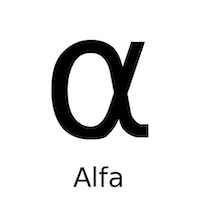

## Beta
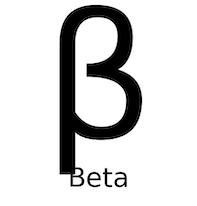

## Gama
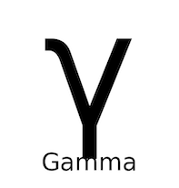

## Delta
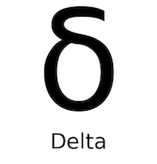

## Epsilon
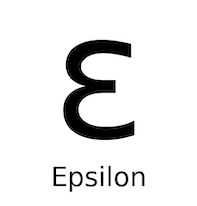

## Zeta
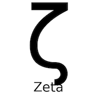

## Eta
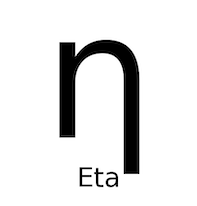

## Theta
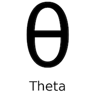

## Iota
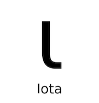 

## Kapa
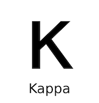

## Lambda
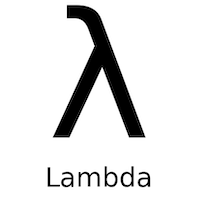 

## Mu
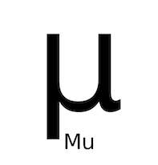

## Nu
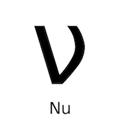 

## Xsi

## Omicron
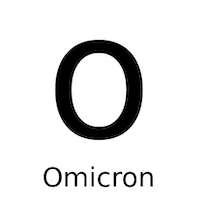

## Pi 
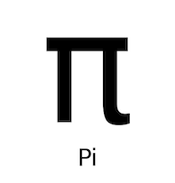

## Ro
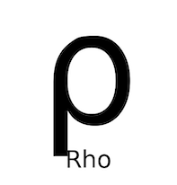

## Sigma
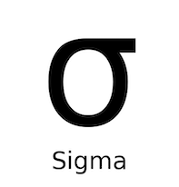

## Tau
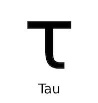

## Upsilon
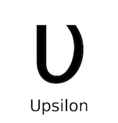

## Fi 
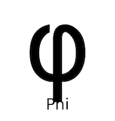 

## Qui
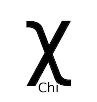

## Psi
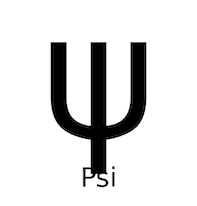

## Omega

## ¡¡Καντεμος λας Λετρας!!

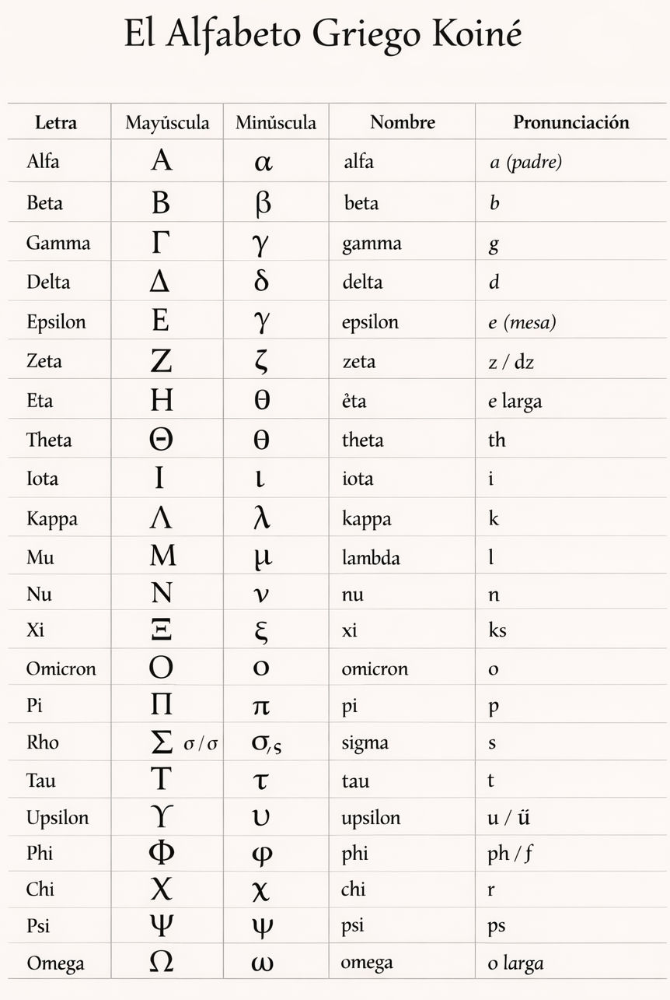

## Práctica Breve

##### **Reconocimiento Visual**

###### <u>Mira</u> las siguientes palabras y responde: λόγος, ἀγάπη, θεός, ἁμαρτία, ἐστίν

- ¿Puedes distinguir cada <u>letra</u>?
- ¿Ves <u>dónde</u> termina la palabra?
- ¿Reconoces si hay una <u>sigma</u> final?

###### (No necesitas <u>saber</u> qué significan. Solo identifica visualmente)

##### **Observación en Herramienta Real**

###### <u>Abre</u> Juan 3:16 en una herramienta bíblica. Encuentra cualquier palabra griega.

###### Responde:

- ¿Puedes reconocer al <u>menos</u> la mitad de las letras?
- ¿Identificas alguna sigma <u>final</u>?
- ¿Ya se ve <u>menos</u> intimidante que antes?

##### Nota Importante: En este curso, el <u>griego</u> no será un obstáculo. Será información estructurada. Y todo comienza con reconocer lo que estás mirando.

# CAPÍTULO 3

## ¿Qué son los Números Strong - y qué no son? 

##### 1. ¿Qué Es <u>Strong</u>?

###### Los números Strong fueron creados por <u>James</u> Strong en el siglo XIX.

###### Su propósito fue <u>simple</u>:

- Asignar un número a <u>cada</u> palabra griega y hebrea del texto bíblico para que una persona que no conociera los idiomas originales pudiera:

- Encontrar <u>todas</u> las ocurrencias de esa palabra
- Consultar una definición <u>básica</u>
- Comparar <u>usos</u>

###### Por ejemplo: λόγος → G3056

###### Ese número permite buscar <u>todas</u> las veces que esa palabra aparece en el Nuevo Testamento. Eso es útil.

###### Pero aquí debemos <u>hacer</u> una distinción crucial.

##### 2. Lo Que Strong <u>Es</u>

###### Strong es: 

- Un <u>sistema</u> de indexación
- Un número que <u>agrupa</u> ocurrencias bajo un lema
- Una <u>puerta</u> de entrada para investigación básica

###### Strong no es:

- Un diccionario completo
- Una definición <u>final</u>
- Una explicación teológica
- Una garantía de significado en <u>cada</u> contexto

##### 3. **El Error Más Común**- Muchos estudiantes hacen esto: 

###### Buscan una palabra. Ven el número <u>Strong</u>. Copian la definición.

###### Afirman: “Esta palabra significa exactamente esto.”

###### Pero las palabras en <u>griego</u> no funcionan así. En español tampoco.

###### Por ejemplo: la palabra “banco” puede significar:

- Institución financiera
- <u>Asiento</u>
- Conjunto de <u>peces</u>

###### El contexto determina el significado. Lo mismo ocurre en griego. Strong no decide el significado. El contexto lo <u>hace</u>.

##### 4. Strong No Es <u>Igual</u> a Significado

###### Un número Strong apunta a un <u>lema</u>.

###### Un lema puede <u>tener</u>:

- Varios <u>usos</u>
- <u>Varios</u> matices

###### Diferentes sentidos <u>según</u> el contexto: 
- Strong <u>agrupa</u>. 
- <u>No</u> interpreta. 
- Si olvidas <u>esto</u>, cometerás errores.

##### 5. El Problema De “El Griego Dice…”

###### Cuando alguien <u>afirma</u>: “El griego dice que esta palabra significa…”

###### Debes hacer dos preguntas:

- ¿Está citando una definición de Strong?
- ¿Está considerando el contexto del versículo?

###### <u>Strong</u> es una herramienta. No es una autoridad final.

##### 6. **Cómo Usar Strong Correctamente**. 

###### Cuando encuentres un número Strong: Úsalo para identificar el <u>lema</u>. 

- Observa <u>todas</u> las ocurrencias.
- <u>Examina</u> el contexto inmediato.
- Luego consulta un <u>léxico</u>.

###### Strong es el <u>punto</u> de partida. No el punto final.

## PRÁCTICA BREVE

##### 1. Observación <u>Real</u>

###### Busca en una herramienta bíblica la palabra “vida” en <u>Juan</u> 10:10.

- ¿Qué número <u>Strong</u> aparece?

- ¿Cuántas veces aparece ese <u>número</u> en el Nuevo Testamento?

- ¿<u>Todas</u> las ocurrencias significan exactamente lo mismo?

###### No concluyas todavía. <u>Solo</u> observa.

##### 2. Reflexión

###### Escribe una <u>frase</u> completando esto:

- Strong es <u>útil</u> porque _______.
- <u>Strong</u> es limitado porque _______.

##### 3. Discernimiento

###### Si alguien <u>afirma</u>: “Esta palabra siempre significa esto en griego.”

- ¿Es esa afirmación <u>segura</u> o peligrosa?
- Explica por qué en una <u>frase</u>.

# CAPÍTULO 4

## ¿Qué es un lema - y por qué Strong Apunta a el?

##### 1. Una Confusión <u>Muy</u> Común

###### Cuando miras una palabra <u>griega</u> en una herramienta bíblica, normalmente ves:

- La palabra que aparece en el versículo
- Un número <u>Strong</u>
- Información morfológica

###### Muchos estudiantes piensan que el número Strong corresponde exactamente a la forma que están viendo. <u>Pero</u> no es así. Strong apunta al lema. Y eso es diferente de la forma que aparece en el texto.

##### 2. ¿Qué Es Un <u>Lema</u>?

###### Un lema es la <u>forma</u> base de una palabra.

###### Es la forma <u>bajo</u> la cual se organizan las palabras en un diccionario.

- En español: “niño”, “niños”, “niña”, “niñas”...
- Todas pertenecen al <u>mismo</u> concepto base.

###### En un diccionario buscarías “niño”. Eso <u>sería</u> el equivalente al lema. En griego ocurre lo mismo.

##### 3. Ejemplo Con Sustantivos

###### Tomemos la palabra: **λόγος**

###### <u>Este</u> es el lema.

###### Pero en el Nuevo Testamento puede aparecer como: λόγος, λόγου, λόγον, λόγοι, λόγους. Todas estas <u>formas</u> son variaciones gramaticales.

###### Cambian por: Caso, Número, Función en la oración.  Pero todas pertenecen al mismo lema: **λόγος**. Y todas comparten el <u>mismo</u> número Strong.

##### 4. Lo Que Strong Realmente Está Haciendo

###### Cuando ves: λόγον → G3056. El número G3056 no está apuntando específicamente a “λόγον”. Está apuntando al lema: **λόγος**. 

###### Strong agrupa todas las formas <u>bajo</u> el lema. Esto es importante. Porque el significado básico se estudia a nivel de lema. Pero la función en el versículo depende de la forma específica.

##### 5. Por Qué Esto Importa

###### Si no distingues entre: lema y forma específica, cometerás un error común: 

- convertir el <u>caso</u> en definición.
- “Está en acusativo, entonces significa ____.” No. El caso no define la palabra; define su uso en la oración.

###### El lema no cambia. La función gramatical sí <u>cambia</u>. El significado básico pertenece al lema. La función pertenece a la morfología. Y veremos eso en el próximo capítulo.

##### 6. Resumen Fundamental

###### El lema es la forma base. Strong apunta al lema. Las palabras en el texto aparecen en formas flexionadas.

- La forma <u>indica</u> función.
- El lema indica identidad léxica.

###### Si entiendes esto, ya <u>estás</u> usando Strong con más precisión que la mayoría.

## Práctica Breve

##### 1. Observación Dirigida

###### Busca en una herramienta bíblica la palabra “palabra” en Juan 1:1.

###### Observa:

- ¿Qué forma específica aparece en el versículo?
- ¿Qué <u>lema</u> indica la herramienta?
- ¿Son idénticos o ligeramente diferentes?
Escribe lo que observas.

##### 2. Comparación

###### Busca otro versículo donde aparezca el mismo número Strong.

###### Responde:

- ¿La forma griega es exactamente igual?
- ¿O cambió ligeramente?
- ¿El número Strong sigue <u>siendo</u> el mismo?

##### 3. Frase de Claridad

###### Completa esta oración:

- Strong apunta al ______.
- La forma específica muestra la ______ en la oración.

# CAPÍTULO 5

## ¿Qué es Morfología - y Cómo Leer RMAC sin Pánico?

##### 1. La Palabra Que Asusta

###### Cuando un estudiante abre una herramienta bíblica y ve algo como: **λόγος** (N-NSM), **λέγει** (V-PAI-3S). 

###### La reacción común es: “Esto es demasiado técnico.” Pero en realidad, estás viendo información comprimida.

###### RMAC es simplemente un sistema de abreviaturas. Nada más.

- No es un <u>código</u> secreto.
- No es gramática avanzada.
- Es información organizada.

##### 2. ¿Qué Es Morfología?

###### Morfología significa: La forma que una palabra adopta para cumplir su función en una oración.

###### En español también ocurre: niño, niños, niña, niñas. La forma cambia según número y género. En griego ocurre lo mismo, pero de manera más visible.

###### La morfología responde a preguntas como:

- ¿Es singular o <u>plural</u>?
- ¿Es sujeto u objeto?
- ¿Es <u>verbo</u> o sustantivo?
- ¿Es presente o <u>pasado</u>?

###### RMAC simplemente codifica esa información.

##### 3. Cómo Leer RMAC Para Sustantivos

###### Ejemplo: λόγος — N-NSM
- (N-NSM) se divide así:
- N = Sustantivo
- N = Nominativo
- S = Singular
- M = Masculino

###### Eso es <u>todo</u>. No necesitas declinar. No necesitas memorizar tablas. Solo necesitas <u>saber</u> leer.

###### Otro ejemplo: λόγον — N-ASM

- (N-ASM) se divide así:
- N = Sustantivo
- A = Acusativo
- S = Singular
- M = Masculino

###### El lema (λόγος) es el mismo. La <u>función</u> (λόγον) cambió. Eso es morfología.

##### 4. Cómo Leer RMAC Para Verbos

###### Ejemplo: λέγει — V-PAI-3S

###### (V-PAI-3S) se divide así:

- V = Verbo
- P = Presente
- A = Activo
- I = Indicativo
- 3S = Tercera persona singular

###### Eso significa: “Él/ella dice.” Nada más. No es más <u>profundo</u> que eso.

##### 5. Lo Que RMAC **No** Hace: 

- Interpreta teológicamente. 
- Explica intención del autor. 
- Determina significado final.

###### Solo describe la <u>forma</u>.

###### La morfología informa.

###### El contexto interpreta.

##### 6. Lo Que Sí Necesitas Saber (Y Nada Más)

###### Para CGV estudiantes, necesitas dominar <u>solo</u> esto:

###### Para sustantivos:

- Caso
- Número
- Género

###### Para verbos:

- Tiempo
- Voz
- Modo
- Persona
- Número

###### No necesitas memorizar <u>todas</u> las formas. Solo necesitas entender qué está indicando el código.

##### 7. Error Común Con Morfología

###### Algunos estudiantes hacen esto: “Es aoristo, entonces significa…” No. El tiempo verbal describe aspecto o tipo de acción. No crea doctrina por sí mismo.

###### La morfología aporta <u>datos</u>. No crea conclusiones aisladas. Si entiendes esto, evitarás muchos abusos.

## Práctica Breve

##### 1. Decodificación <u>Simple</u>

###### Busca en Juan 1:1 el verbo ἦν. Observa el <u>código</u> RMAC.

###### Responde:

- ¿Es <u>verbo</u>?
- ¿Qué <u>tiempo</u> indica?
- ¿Qué persona y número <u>indica</u>?

###### No necesitas interpretar <u>todavía</u>. Solo decodifica.

##### 2. Sustantivo

###### Encuentra la palabra Θεὸς en <u>Juan</u> 1:1.

- ¿Qué <u>código</u> RMAC aparece?
- ¿Está en nominativo o acusativo?
- ¿Es singular o <u>plural</u>?

##### 3. Reflexión Técnica

###### Completa:

- La morfología me <u>dice</u> ______.
  El <u>contexto</u> me dice ______.

###### Hasta  aquí hemos establecido:

- Strong = índice
- Lema = <u>forma</u> base
- Morfología = función estructural

# CAPÍTULO 6

## Verbos: Lo mínimo que Necesitas Entender 

##### 1. ¿Por Qué Los <u>Verbos</u> Son Importantes?

###### En una oración, el <u>verbo</u> es el corazón.

###### Describe: <u>Acción</u>, Estado, Existencia

###### Cuando una herramienta muestra un verbo con código RMAC, está indicando detalles <u>sobre</u> esa acción.

###### Pero debemos recordar:

- La morfología <u>describe</u>.
- El <u>contexto</u> interpreta.

##### 2. Los Cinco Tiempos Que Verás Con Mayor Frecuencia

###### En el <u>Nuevo</u> Testamento encontrarás principalmente estos tiempos:

- Presente (P)
- Imperfecto (I)
- <u>Futuro</u> (F)
- Aoristo (A)
- Perfecto (R)

###### No necesitas memorizar conjugaciones. <u>Solo</u> necesitas entender qué indican a nivel <u>básico</u>.

##### 3. Presente (P)

###### Ejemplo: V-PAI-3S

###### El presente generalmente <u>indica</u>:

- Acción en <u>curso</u>
- Acción habitual
- <u>Estado</u> actual

###### Pero el contexto decide si es continuo o puntual. El código solo indica que es presente. No dice cuánto dura la <u>acción</u>.

##### 4. Imperfecto (I)

###### Ejemplo: V-IAI-3S

###### Indica <u>acción</u> pasada en desarrollo. Describe algo que estaba ocurriendo.

###### Pero nuevamente:

- No <u>crea</u> teología.
- Solo describe <u>forma</u>.

##### 5. Futuro (F)

###### Ejemplo: V-FAI-3S

###### Indica <u>acción</u> que ocurrirá.

###### Eso es todo. El contexto determina si es promesa, advertencia o simple predicción.

##### 6. Aoristo (A)

###### Ejemplo: V-AAI-3S

###### Este es el <u>tiempo</u> más malinterpretado. El aoristo generalmente presenta la acción como un todo.

- No comenta <u>sobre</u> duración.
- No necesariamente <u>indica</u> “una vez para siempre.”
- No implica automáticamente finalización permanente.

###### El aoristo describe la acción como completa desde el punto de vista del narrador. Nada más. <u>Evita</u> exageraciones.

##### 7. Perfecto (R)

###### Ejemplo: V-RAI-3S

###### Indica una <u>acción</u> completada con resultados que continúan.

###### Pero nuevamente:

- El contexto <u>define</u> el alcance de esos resultados.

- No debemos construir doctrinas <u>basadas</u> solo en el tiempo verbal.

##### 8. Recordatorio Fundamental

###### Cuando veas un <u>código</u> como: V-AAI-3S

###### Eso significa:

- Verbo
- Aoristo
- Activo
- Indicativo
- Tercera persona singular

###### Eso es información estructural. No es una conclusión interpretativa.

##### 9. Un Principio De Seguridad

###### Nunca <u>digas</u>: “Como está en aoristo, entonces significa…”

###### Di mejor: “El verbo está en aoristo, lo cual describe la acción como un todo; ahora debemos considerar el contexto.”

###### Eso es uso responsable.

## Práctica Breve

##### 1. Decodificación Real

###### Busca en Romanos 5:1 el verbo “hemos sido justificados.”

- ¿Qué tiempo verbal indica el RMAC?
- ¿Es activo, medio o pasivo?
- ¿Qué modo <u>indica</u>?

###### No interpretes todavía. Solo identifica.

##### 2. Comparación

###### Busca un verbo en tiempo presente en el mismo capítulo.

- ¿Qué código aparece?
- ¿Qué diferencia básica hay entre ese código y el anterior?

##### 3. Frase de Disciplina

###### Completa:

- El <u>tiempo</u> verbal me informa sobre ______.
- Pero no determina automáticamente ______.

# CAPÍTULO 7

## LOS CASOS GRIEGOS: INFORMACIÓN, NO ESPECULACIÓN

##### 1. ¿Qué Es Un Caso?

###### En griego, los sustantivos cambian de forma según su función en la oración. Ese cambio de forma se llama caso.

###### En español usamos principalmente el orden de palabras para indicar función. En griego, la forma <u>misma</u> de la palabra indica su función.

###### Eso es lo que RMAC te muestra cuando ves:

- N-NSM
- N-ASM
- N-GSM

###### El segundo código (N, A, G, D, V) indica el caso.

##### 2. Los Cinco Casos Que Verás

###### En el Nuevo Testamento aparecen cinco casos principales:

- Nominativo (N)
- Genitivo (G)
- Dativo (D)
- Acusativo (A)
- Vocativo (V)

###### No necesitas dominar categorías avanzadas. Solo necesitas reconocer su función básica.

##### 3. Nominativo (N)

###### Generalmente indica el sujeto de la oración.

###### Ejemplo: ὁ λόγος ἦν πρὸς τὸν θεόν

###### “ὁ λόγος” está en nominativo.

###### Eso indica que es el sujeto del <u>verbo</u>. Nada más.

##### 4. Acusativo (A)

###### Generalmente indica el objeto directo.

###### Responde a la pregunta: ¿A quién? ¿Qué cosa?

###### Ejemplo: βλέπει τὸν ἄνθρωπον

###### “El hombre” está en acusativo. Es el objeto de la acción.

##### 5. Genitivo (G)

###### Generalmente indica relación o pertenencia. Muchas veces se traduce <u>como</u> “de”.

###### Ejemplo: λόγος θεοῦ

###### “Palabra de Dios.”

###### Pero aquí debemos tener cuidado:

- El genitivo indica relación.
- El contexto define el tipo de relación.

###### No debemos forzar categorías avanzadas automáticamente.

##### 6. Dativo (D)

###### Generalmente indica: Objeto indirecto

- Ubicación
- Medio

###### Pero nuevamente:

- La forma informa función básica.
- El contexto determina precisión.

##### 7. Vocativo (V)

###### Se usa cuando alguien está <u>siendo</u> llamado o dirigido directamente.

###### Es el menos frecuente.

##### 8. Principio De Seguridad

###### Cuando veas un código como: N-GSM

###### Eso significa:

- Sustantivo
- Genitivo
- Singular
- Masculino

###### Eso es información estructural. No significa automáticamente “Este es un genitivo subjetivo” o “Este es un genitivo partitivo”. 

###### Esas categorías requieren análisis contextual. RMAC solo describe la <u>forma</u>.

##### 9. Error Común

###### Algunos estudiantes hacen esto: “Está en genitivo, entonces significa exactamente…” No. El caso limita posibilidades. No define el significado completo.

###### Siempre debemos regresar al contexto.

## Práctica Breve

##### 1. Identificación

###### Busca en Juan 1:1 las dos ocurrencias de Θεός.

- ¿Están en el mismo <u>caso</u>?
- ¿El código RMAC es idéntico?
- ¿Qué indica el caso en cada una?

##### 2. Observación Comparativa

###### Busca un sustantivo en genitivo en Romanos 8.

- ¿Qué código aparece?
- ¿Puedes reconocer que es <u>genitivo</u>?

###### Sin interpretar, ¿qué tipo de relación básica podría indicar?

##### 3. Disciplina Técnica

###### Completa:

- El caso me ayuda a identificar ______.
- Pero no determina automáticamente ______.

# CAPÍTULO 8

## Cómo Leer un Léxico sin Exagerar Definiciones

##### 1. ¿Qué Es Un Léxico?

Un léxico es un diccionario especializado. Pero no funciona exactamente como un diccionario común.

Un léxico:
- Organiza palabras por <u>lema</u>
- Presenta rangos de significado
- Muestra posibles usos
- A <u>veces</u> ofrece ejemplos

Un léxico no:
- Interpreta tu versículo
- Decide automáticamente qué significa la palabra en tu contexto
- Elimina la necesidad de observar el texto

El léxico informa posibilidades.
El contexto decide cuál posibilidad <u>aplica</u>.

##### 2. El Error Más Frecuente

###### Muchos estudiantes hacen esto: 

- Buscan el número Strong.
- Abren la definición.
- Escogen la primera opción.
- La aplican automáticamente al versículo.

###### Pero las definiciones en un léxico no están ordenadas por importancia doctrinal. Están organizadas por <u>uso</u>.

###### Una palabra puede tener:

- Sentido literal
- Sentido figurado
- Uso técnico
- Uso común
- Uso raro

###### El léxico presenta un rango. No una sola definición.

##### 3. Las Palabras No Tienen “Un Solo Significado”

###### En español tampoco ocurre así. La palabra “cabeza” puede significar:

- Parte del cuerpo
- Líder
- Parte superior
- Inicio de algo

###### El contexto determina el significado. En <u>griego</u> ocurre exactamente lo mismo. 

###### Por eso es peligroso afirmar: “Esta palabra significa exactamente…”

###### Las palabras tienen un <u>campo</u> semántico. El contexto selecciona el sentido.

##### 4. Cómo Leer Un Léxico Correctamente

###### Cuando consultes un léxico: Identifica el lema correcto.

###### Lee <u>todas</u> las opciones de significado.

- Observa ejemplos si los hay.
- Regresa al versículo.
- Pregunta: ¿Cuál encaja naturalmente aquí?

###### No fuerces una definición.

###### Deja que el contexto guíe.

##### 5. Lo Que Un Léxico No Hace

###### Un léxico no: Te dice la intención del autor. 

- Te dice el énfasis retórico.
- Te dice cómo <u>aplicar</u> el texto.
- Te autoriza a crear una nueva interpretación.

###### Solo te muestra cómo esa palabra ha sido usada. Eso es todo.

##### 6. Una Advertencia Importante

###### Nunca combines todas las definiciones posibles en un solo versículo. Eso se llama “transferencia ilegítima de significado total”.

###### Ejemplo incorrecto: “Esta palabra puede significar A, B y C, entonces aquí significa A+B+C al mismo <u>tiempo</u>.” No. El contexto selecciona uno.

##### 7. Principio Fundamental

- El lema te da identidad.
- La morfología te da función.
- El léxico te da posibilidades.
- El contexto decide significado.

###### Si mantienes este orden, evitarás la mayoría de los errores comunes.

## Práctica Breve

##### 1. Observación Real

###### Busca la palabra “mundo” en Juan 3:16. 

- Identifica el <u>lema</u>.
- Abre un léxico.
- ¿Cuántas posibles definiciones aparecen?
- ¿Todas aplican al versículo?

###### No concluyas todavía. Solo observa el <u>rango</u>.

##### 2. Discernimiento

###### Encuentra una palabra común como “vida” o “amor”.

- ¿Tiene múltiples sentidos en el léxico?
- ¿Podrías aplicar todas simultáneamente?
- ¿Qué te impide hacerlo?

##### 3. Frase De Disciplina

###### Completa:

- Un léxico me muestra ______.
- <u>Pero</u> el contexto determina ______.

# CAPÍTULO 9

##### ERRORES COMUNES EN ESTUDIOS DE PALABRAS (Y POR QUÉ DEBES EVITARLOS)

###### Este capítulo es intencionalmente directo. El griego no es un juguete. No es una herramienta para impresionar. No es un recurso para ganar discusiones.

###### Es información lingüística. Si se usa mal, produce interpretaciones débiles.

##### Aquí están los errores más <u>comunes</u>.

###### 1. **“Esta Palabra Siempre Significa…”**

###### Error. Ninguna palabra en ningún idioma significa exactamente lo mismo en todos los contextos.

###### Si alguien afirma: “Esta palabra siempre significa…”

###### Desconfía inmediatamente.

###### Las palabras funcionan dentro de frases. Las frases funcionan dentro de párrafos. Los párrafos funcionan dentro de argumentos.

###### El contexto <u>controla</u> el significado. No el diccionario.

###### 2. **Transferencia Ilegítima de Significado Total**

###### Este error ocurre cuando alguien: 

- Busca una palabra.
- Encuentra tres o cuatro posibles definiciones.
- Las combina todas en un solo <u>versículo</u>.

###### Ejemplo típico: “Esta palabra puede significar A, B y C, entonces aquí significa A+B+C al mismo tiempo.” No. El contexto selecciona una opción. No todas.

###### Si aplicas todas, distorsionas el texto.

###### 3. **La Falacia de Raíz**

###### Algunos estudiantes creen que pueden descubrir el “verdadero significado” dividiendo una palabra en partes.

###### Ejemplo: “Esta palabra viene de esta raíz, por lo tanto significa…”

###### Eso no es cómo funcionan los idiomas.

###### En español:

- “Compromiso” no significa literalmente “con promesa.”
- “Entusiasmo” no significa literalmente “tener un dios dentro.”

###### La etimología no determina el significado <u>actual</u>. 

###### El uso actual lo determina.

###### 4. **Construir Doctrina Desde Un Tiempo Verbal**

###### Este es extremadamente común. 

- “Está en aoristo, entonces significa que…”
- “Está en presente, entonces implica que…” 

###### No.

###### El tiempo verbal describe forma. No crea teología por sí solo.

###### La doctrina se construye desde:

- Argumento completo
- Contexto amplio
- Desarrollo del <u>autor</u>

###### No desde un solo código RMAC.

###### 5. **Usar Strong Como Autoridad Final**

###### Strong es un índice. No es un léxico exhaustivo. No es una herramienta académica avanzada. No fue diseñado para análisis profundo.

###### Si tu <u>estudio</u> termina en Strong, es incompleto.

###### 6. **Decir “El Griego Dice…” Como Argumento Final**

###### Esta frase debe usarse con extrema cautela. Porque muchas veces lo que realmente significa es: “Encontré algo en Strong.”

###### El griego no habla por sí solo. Habla dentro del texto.

###### Nunca uses el griego para <u>cerrar</u> una conversación. Úsalo para aclarar el texto.

###### 7. **Confundir Información Con Interpretación**

###### Información: Caso, <u>Tiempo</u>, Voz, Lema

###### Interpretación:

- Lo que el autor quiso comunicar
- Cómo funciona en el argumento
- Cómo se conecta con el contexto

###### No confundas los dos <u>niveles</u>.

###### 8. **Principio De Disciplina**

###### Antes de afirmar algo basado en el griego, pregúntate:

- ¿Estoy usando el lema correctamente?
- ¿Estoy considerando la forma específica?
- ¿Estoy leyendo el contexto?
- ¿Estoy exagerando una posibilidad léxica?
- ¿Estoy usando el <u>tiempo</u> verbal como prueba doctrinal aislada?

###### Si no puedes responder con claridad, <u>detente</u>.

## Práctica Breve

##### 1. Evaluación Crítica

###### Busca un sermón o comentario en línea donde alguien diga: “En el griego original…”

###### Analiza:

- ¿Está usando Strong solamente?
- ¿Está considerando el contexto?
- ¿Está exagerando un <u>tiempo</u> verbal?
- ¿Está combinando múltiples definiciones?

###### Escribe una evaluación breve.

##### 2. Disciplina Personal

###### Completa:

- El griego no es un atajo para ______.
- El <u>griego</u> es una herramienta para ______.

##### 3. Compromiso

###### Escribe esta frase y complétala:

- <u>Usaré</u> el griego con ______ y ______.

# CAPÍTULO 10

## TALLER PRÁCTICO: 1 JUAN 1:5–10

##### 1. Propósito Del Taller

###### Este ejercicio no busca:

- Traducir el texto completo

- Hacer análisis avanzado

- Crear nuevas interpretaciones

###### Busca integrar lo que ya aprendiste: Strong, Lema, Morfología, Verbos, Casos, Léxico, Disciplina. 

###### El objetivo es <u>observar</u> con precisión.

##### 2. Paso 1 — Observación General

###### Abre 1 Juan 1:5–10 en una herramienta bíblica con interlineal activado.

###### Antes de <u>mirar</u> códigos:

- ¿Cuántas veces aparece la palabra “si”?
- ¿Cuántas veces aparece “decimos”?
- ¿Cuántas veces aparece “pecado”?

###### No mires el griego todavía. Observa el patrón.

##### 3. Paso 2 — Identificando Lemas

###### Encuentra el verbo traducido como “decimos”.

- ¿Cuál es la forma específica que aparece?
- ¿Cuál es el lema?
- ¿Cuántas veces aparece el mismo lema en el pasaje?

###### Observa si todas las formas son idénticas o cambian ligeramente. No interpretes todavía. <u>Solo</u> identifica.

##### 4. Paso 3 — Morfología Sin Exagerar

###### Toma uno de los verbos “decimos”.

- ¿Qué código <u>RMAC</u> aparece?

- ¿Es presente o aoristo?

- ¿Qué persona y número?

###### Ahora responde:

- ¿El tiempo verbal por sí solo cambia el argumento del autor?

###### La respuesta correcta es no. El argumento lo construye la repetición estructural del pasaje.

##### 5. Paso 4 — Analizando Un Sustantivo Clave

###### Busca la palabra “pecado”.

- ¿Qué lema indica?

- ¿Está en singular o plural?

- ¿Está en el <u>mismo</u> caso en todas las ocurrencias?

###### No hagas conclusiones doctrinales aún. Solo observa forma y función.

##### 6. Paso 5 — Léxico Con Disciplina

###### Consulta el lema para “luz” o “pecado”.

- ¿Cuántas posibles definiciones ofrece el léxico?

- ¿Todas <u>aplican</u> aquí?

- ¿El contexto limita el significado?

###### Recuerda:

- El léxico ofrece <u>rango</u>.
- El contexto selecciona.

##### 7. Paso 6 — Evitando Errores

###### Ahora evalúa el siguiente ejemplo hipotético:

###### Alguien afirma: “<u>Como</u> el verbo está en presente, implica acción continua obligatoria sin excepción.”

###### Pregunta: ¿Es eso conclusión morfológica o interpretación ampliada?

###### Explica brevemente.

##### 8. Paso 7 — Integración Final

###### Responde en <u>pocas</u> líneas:

- ¿El griego cambió el significado del pasaje?

- ¿O ayudó a confirmar lo que ya era visible?

- ¿Qué aportó realmente?

###### La respuesta madura debería reconocer:

###### El griego no reemplaza la observación.

###### La refuerza <u>cuando</u> se usa correctamente.

# Conclusión Del Manual

##### Si llegaste hasta aquí, ahora sabes:

- Qué es Strong

- Qué es un lema

- Cómo <u>leer</u> RMAC

- Qué indican los tiempos verbales

- Qué indican los casos

- Cómo usar un léxico

- Cómo <u>evitar</u> errores comunes

##### No sabes hablar griego. Pero sabes usarlo responsablemente. Y eso es exactamente el objetivo de este curso.

# GLOSARIO BÁSICO

##### Este glosario no es académico. Es funcional. <u>Solo</u> incluye términos que necesitas para usar herramientas con claridad.

**Lema**
: Forma base de una palabra.

##### Es la forma bajo la cual se organizan las palabras en un léxico.

**Forma flexionada**
: La forma específica que aparece en el versículo.

##### Puede <u>variar</u> según caso, número, tiempo, etc.

**Morfología**
: La forma que adopta una palabra para <u>cumplir</u> su función en la oración.

**RMAC**
: Sistema de abreviaturas usado en muchas herramientas bíblicas para describir la <u>forma</u> gramatical de una palabra.

**Strong**
: Sistema de numeración que agrupa palabras bajo un lema.
Es un índice, no una definición <u>final</u>.

**Caso**
: Indica la función de un sustantivo en la oración (sujeto, objeto, relación, etc.).

**Tiempo verbal**
: Indica cómo se presenta la acción (presente, aoristo, perfecto, etc.).
Describe forma, no <u>crea</u> doctrina por sí solo.

**Voz**
: Describe la relación del sujeto con la acción (activo, medio, pasivo).

**Modo**
: Describe cómo se presenta la acción (indicativo, imperativo, etc.).

**Campo semántico**
: Rango de posibles significados que una palabra puede tener.

**Transferencia ilegítima de significado total**
: Error que ocurre cuando se aplican todas las posibles definiciones de una palabra a un solo versículo.

## HOJA DE REFERENCIA RÁPIDA RMAC

Esta hoja no es <u>para</u> memorizar.
Es para consultar cuando estés usando herramientas.

##### Sustantivos

###### Ejemplo: N-GSM

- N = Sustantivo
- G = Genitivo
- S = Singular
- M = Masculino

###### Casos:
- N = Nominativo (generalmente sujeto)
- G = Genitivo (relación)
- D = Dativo (objeto indirecto / ubicación / medio)
- A = Acusativo (objeto directo)
- V = Vocativo (llamado directo)

###### Verbos

###### Ejemplo: V-AAI-3S

###### **V** = Verbo

###### **Tiempo:**

- P = Presente
- I = Imperfecto
- F = Futuro
- A = Aoristo
- R = Perfecto
- L = Pluscuamperfecto

###### **Voz:**

- A = Activa
- M = Media
- P = Pasiva

###### **Modo:**

- I = Indicativo
- S = Subjuntivo
- M = Imperativo
- N = Infinitivo
- P = Participio

###### Persona y Número

|Singular| Plural|
|---|---|
|1S = Primera singular|1P = Primera plural |
|2S = Segunda singular| 2P = Segunda plural|
|3S = Tercera singular|3P = Tercera plural |

##### Recordatorio Final

###### RMAC describe <u>forma</u>.

###### No interpreta significado.

###### <u>Strong</u> agrupa.

###### No decide sentido.

###### El lema <u>identifica</u>.

###### No explica contexto.

###### El léxico ofrece posibilidades.

###### El contexto selecciona.

## REGLAS DE ORO PARA USAR EL GRIEGO EN EL ESTUDIO BÍBLICO

##### 1. El griego no reemplaza el contexto.

<u>Nunca</u> permitas que una definición aislada contradiga el flujo del pasaje. Si tu “estudio de palabra” rompe el argumento del autor, tu estudio está mal.

##### 2. Strong es un índice, no una autoridad.

Úsalo para ubicar el lema. No lo uses como definición final.

##### 3. El lema identifica; la forma específica informa.

No confundas el significado básico de una palabra con su función gramatical en el versículo.

##### 4. La morfología describe; no predica.

Un tiempo verbal no construye doctrina por sí solo. Un caso gramatical no determina interpretación completa. La <u>forma</u> informa. El argumento interpreta.

##### 5. El léxico muestra posibilidades; el contexto selecciona una.

Nunca combines todas las definiciones posibles en un solo versículo. Eso es distorsión.

##### 6. La etimología no gobierna el significado actual.

Las palabras significan lo que significan en su uso, no lo que significaron siglos antes.

##### 7. No digas “El griego dice…” como argumento final.

Di mejor: “El texto griego muestra que…” Y luego explica con precisión y contexto.

##### 8. Si el griego contradice tu observación clara del pasaje, revisa tu uso del griego.

El idioma original no complica innecesariamente. Aclara cuando se usa correctamente.

##### 9. Usa el griego con humildad.

Más conocimiento lingüístico <u>debe</u> producir más cuidado,
no más arrogancia.

##### 10. El objetivo nunca es impresionar.

El objetivo es comprender el texto con mayor precisión. Nada más. Nada menos.

## CIERRE

###### Ahora sabes usar:

- Strong
- Lemas
- Morfología
- RMAC
- Léxicos

No sabes hablar <u>griego</u>.
Pero sabes usarlo responsablemente.
Y eso, para este curso, es suficiente.