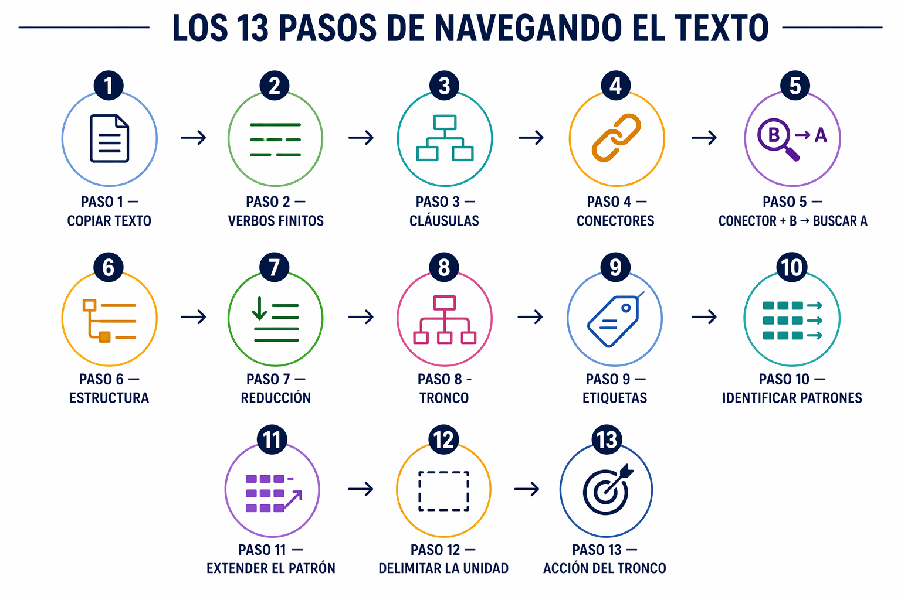
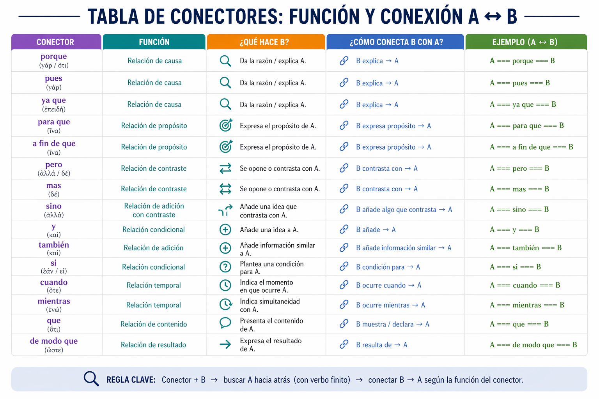

# INTRODUCCIÓN

Cuando un barco zarpa, no lo hace a la deriva. <u>Sale</u> con dirección, equipado con el conocimiento y las herramientas necesarias para navegar con seguridad. Sin esa preparación, las mismas aguas que prometen descubrimiento pueden llevar rápidamente a la confusión, la desorientación o incluso al naufragio.

De la misma manera, acercarse al <u>texto</u> bíblico sin una guía clara puede llevar a interpretaciones incorrectas o conclusiones que el texto mismo no afirma. Este curso está diseñado para equiparte con las herramientas esenciales para navegar las Escrituras con cuidado y precisión. Antes de “zarpar” hacia un estudio más profundo, aprenderemos a observar, trazar y seguir el texto tal como está escrito, de modo que nuestra comprensión esté anclada en lo que realmente dice, y no en suposiciones o ideas externas.

Antes de avanzar, es importante <u>aclarar</u> la manera en que nos acercaremos al texto. No se trata de aprender un método nuevo ni de memorizar una serie de pasos mecánicos, sino de adoptar una forma de pensar. A esto lo llamaremos RO₁O₂TS.

RO₁O₂TS no es un sistema que se impone al texto, sino una actitud que se somete a él. Es una manera de frenar, observar con cuidado, y permitir que el texto hable por sí mismo antes de que nosotros saquemos conclusiones. En <u>lugar</u> de correr hacia interpretaciones rápidas, RO₁O₂TS nos entrena a permanecer en lo que está escrito, siguiendo el flujo, las conexiones y las palabras tal como aparecen.

En este curso, RO₁O₂TS servirá como un marco sencillo para recordarnos que nuestro papel no es forzar el texto a <u>decir</u> algo, sino aprender a leerlo con respeto, atención y precisión. No es una técnica que dominar, sino una disposición que cultivar.

Es importante también aclarar de dónde proviene esta <u>forma</u> de acercarse al texto. RO₁O₂TS no es algo nuevo, ni es un descubrimiento reciente. No estamos introduciendo un sistema innovador ni una metodología exclusiva. En realidad, lo que estamos haciendo es ponerle un nombre sencillo a una manera de leer que ha sido utilizada por décadas en el estudio serio del lenguaje.

Los principios detrás de RO₁O₂TS reflejan prácticas básicas que se emplean en áreas como la lingüística, el análisis del discurso y el estudio cuidadoso de <u>textos</u>: observar lo que está escrito, seguir la estructura, respetar el flujo del pensamiento y evitar imponer ideas externas al contenido. Institutos, traductores y estudiosos del lenguaje han trabajado de esta manera durante mucho tiempo.

RO₁O₂TS simplemente toma esos principios y los presenta de forma accesible, con un lenguaje claro, para que cualquier persona pueda acercarse al texto bíblico con el mismo cuidado y respeto. No estamos inventando una nueva <u>forma</u> de leer, sino recuperando una manera sólida y probada de hacerlo.

Para ayudarnos a mantener esta manera de pensar presente, utilizaremos un recordatorio sencillo: RO₁O₂TS. No es una fórmula rígida, sino una <u>guía</u> que nos ayuda a no desviarnos del texto.

# ¿QUÉ ES RO₁O₂TS?

## INTRODUCCIÓN

### Qué es RO₁O₂TS

###### RO₁O₂TS es el proceso completo para trabajar un <u>texto</u>.

###### No es <u>solo</u> análisis.

###### No es solo <u>estructura</u>.

###### 👉 Es ver, seguir y someterse al <u>texto</u>.

##### Cómo funciona

###### RO₁O₂TS se desarrolla en <u>cinco</u> partes:

###### R — Revelación
* 👉 Dios <u>habló</u>
* 👉 Usó lenguaje
* 👉 El texto comunica

###### O₁ — <u>Observar</u> la estructura
* 👉 Cómo está construido el texto
* 👉 Cómo se <u>conecta</u>
* 👉 Cómo se desarrolla

###### O₂ — Observar lo que el <u>texto</u> dice
* 👉 Qué afirma
* 👉 Qué <u>repite</u>
* 👉 Qué contrasta

###### T — Trazar el texto
* 👉 Cómo avanza de principio a fin
* 👉 Cómo se conectan sus partes
* 👉 Cómo <u>fluye</u> el desarrollo

###### S — Someterse al texto
* 👉 No ajusto el texto a mí
* 👉 Me coloco bajo lo que afirma
* 👉 Dejo que el <u>texto</u> tenga la última palabra

##### Principio clave

###### RO₁O₂TS no termina en el análisis.

###### ❗ RO₁O₂TS incluye:
* observar
* <u>seguir</u>
* someterse

##### Regla central
###### ❗ Si no completas todo el proceso,

###### no has terminado RO₁O₂TS

##### Frase <u>clave</u>
> “No interpreto el texto.
> Lo observo, lo sigo y me someto a él.”

##### Qué debes notar
###### RO₁O₂TS no es un método para explicar el <u>texto</u>.

###### 👉 Es un proceso para dejar que el texto hable.

RO₁O₂TS no añade <u>nada</u> al texto. Más bien, nos ayuda a quitarnos del camino para poder verlo con claridad.

# R – Revelación

Antes de aprender a observar o <u>seguir</u> el texto, necesitamos establecer algo fundamental: **¿qué es lo que tenemos delante?**

No estamos frente a un texto cualquiera.

Dios ha comunicado.

No dejó ideas <u>sueltas</u>.
 No dejó mensajes ocultos.
 No habló en fragmentos aislados.

Dios **reveló**.

## ¿Qué significa revelación?

##### Revelación significa que el contenido **no se originó en el hombre**, <u>sino</u> que fue dado.

##### Esto cambia completamente nuestra postura.

###### No nos acercamos al <u>texto</u> para producir significado, sino para **reconocer lo que ya ha sido comunicado**.

###### Hay una diferencia clara:
- En el descubrimiento, el hombre busca y llega a conclusiones
- En la revelación, la verdad es <u>dada</u> al hombre
- No estamos tratando de “llegar” a la verdad del texto. 
- Estamos <u>siendo</u> confrontados con algo que ya ha sido dicho.

## Dios comunicó por medio de lenguaje

Dios no <u>solo</u> reveló.

Lo hizo por medio de **lenguaje**.

Esto significa que lo que tenemos <u>delante</u> no es una colección de pensamientos dispersos, sino **comunicación intencional**.

Y toda comunicación tiene propósito.

## Propósito de la revelación

La revelación no es información al azar.
 No es acumulación de frases.

Es comunicación con dirección.

Cada <u>porción</u> del texto:

- dice algo
- lo desarrolla
- lo conduce <u>hacia</u> un resultado

Nada está colocado sin propósito.

## No son versículos aislados

La Biblia no fue escrita en versículos.

Los versículos fueron añadidos después para ayudarnos a <u>ubicar</u> el contenido, pero **no forman parte de la comunicación original**.

El autor no pensó en:
- versículo 1
- versículo 2
- versículo 3

<u>Pensó</u> en **una unidad completa de pensamiento**.

Cuando leemos por versículos aislados, rompemos lo que fue dado como una sola comunicación.

## El texto construye

El autor no <u>solo</u> dice cosas.

**Construye**.

El texto:

- <u>afirma</u>
- explica
- conecta
- <u>contrasta</u>
- desarrolla

Forma un movimiento de pensamiento.

Si leemos frases sueltas:

- perdemos la construcción
- perdemos el desarrollo
- perdemos el <u>punto</u>

## Comunicación real, no código

La Escritura no es un código secreto.
 No es un rompecabezas místico.

Dios comunicó <u>usando</u> lenguaje real, y el lenguaje funciona de manera normal:

- palabras en contexto
- ideas conectadas
- desarrollo progresivo

El significado no está escondido detrás del <u>texto</u>.
 Está en **cómo el texto está construido**.

## Dios busca ser entendido

Dios no habló para ocultar.
 Habló <u>para</u> comunicar.

No necesitamos:

- claves ocultas
- conocimiento <u>secreto</u>
- interpretaciones especiales

Necesitamos **observar correctamente** lo que está escrito.

## Fundamento de la revelación

La <u>misma</u> Escritura afirma su origen:

«Toda Escritura es inspirada por Dios…» — 2 Timoteo 3:16
 «…hombres movidos por el Espíritu Santo hablaron de parte de Dios» — 2 Pedro 1:21
 «Dios… nos ha hablado por Su Hijo» — Hebreos 1:1–2

No estamos leyendo <u>ideas</u> humanas aisladas, sino **lo que Dios ha dado a conocer**.

## El peso de la revelación

Si Dios ha hablado, entonces esto no es opcional.

No estamos tratando con un texto más.
 No estamos evaluando <u>ideas</u>.

Estamos frente a algo que **nos precede, nos define y nos confronta**.

Esto cambia completamente cómo leemos:

- no decidimos lo que el texto dice
- no negociamos su contenido
- no lo ajustamos a nuestras ideas

Nos detenemos.
 Observamos.
 Seguimos.

Porque lo que <u>está</u> delante **no se originó en nosotros**.

## El poder de la revelación

La revelación no solo informa.

**actúa**

Nos <u>expone</u>.
 Nos corrige.
 Nos <u>establece</u>.

No <u>leemos</u> para dominar el texto.
 Leemos para ser **afectados por él**.

## Implicaciones

Si la Escritura es revelación, entonces:

- su contenido no <u>depende</u> de nuestra opinión
- su mensaje no cambia según el lector
- su <u>autoridad</u> no es negociable
- Esto nos da una base firme.
- No estamos construyendo sobre interpretaciones cambiantes, sino sobre algo que ha sido establecido fuera de <u>nosotros</u>.

## Nuestra postura frente al texto

Si Dios ha hablado, entonces:

- no leemos <u>para</u> especular, sino para **oír**
- no construimos significado, lo **recibimos**
- no estamos <u>sobre</u> el texto, estamos **bajo él**
- No corregimos el texto. Dejamos que el texto nos corrija a nosotros.

## Principio clave

Dios habló → el <u>texto</u> está construido → la estructura revela el propósito

## Punto de partida

Por eso, no comenzamos preguntando:

“¿Qué significa?”

Ni siquiera comenzamos con:

“¿Qué <u>dice</u>?”

Comenzamos con:

**¿Cómo está construido?**

Porque si Dios comunicó por <u>medio</u> de lenguaje, entonces el significado está en **cómo lo dijo**.

# O₁ - OBSERVAR LA ESTRUCTURA (PASOS 1-13)

<u>Antes</u> de entender el significado, debemos ver **cómo el autor organizó lo que dijo**.

## El problema común

La mayoría de los lectores:
- leen el <u>texto</u>
- entienden una idea general
- sacan una conclusión

Pero no <u>pueden</u> explicar:
- cuál es la idea principal
- qué partes la explican
- <u>cómo</u> se conectan

##### El problema no es falta de interés.
###### Es <u>falta</u> de **observación estructural**.

## Principio fundamental

En este curso cambiamos el orden:
Observación → Estructura → Propósito

No comenzamos interpretando.
Comenzamos <u>observando</u>.

## Por qué esto importa

Un texto <u>bíblico</u> no es una lista de ideas.

Es un argumento construido.

El autor:
- <u>afirma</u>
- explica
- contrasta
- <u>desarrolla</u>

##### Si no vemos esa construcción:
###### perdemos el punto del autor.

## La realidad del texto

Dentro de un párrafo <u>hay</u>:
- acciones (verbos)
- conexiones (conectores)
- <u>unidades</u> de pensamiento (cláusulas)
- detalles que amplían (extensiones)

Todo esto <u>forma</u> una estructura. 

## Lo que aprenderás

Vas a aprender a ver:
- <u>dónde</u> están las afirmaciones
- cómo se conectan
- cuáles son principales
- cuáles dependen de <u>otras</u>

## El proceso de observación estructural



Este proceso es <u>fijo</u>.
No cambia.
No se <u>salta</u> pasos.

## Qué NO haremos

No vamos a:
- interpretar <u>primero</u>
- imponer <u>ideas</u>
- depender de intuición

## Qué SÍ haremos

Vamos a:
- observar el <u>texto</u> con precisión
- <u>dejar</u> que la estructura se muestre
- seguir un <u>proceso</u> claro

## Observación clave

El autor no <u>solo</u> comunica ideas.
El <u>autor</u> construye.

Y si vemos la construcción:
veremos el <u>propósito</u>.

## Transición

En la siguiente <u>lección</u> comenzaremos con el primer paso:
preparar correctamente el texto.

Sin este <u>paso</u>, todo lo demás falla.

# PASO 1 — COPIAR EL TEXTO
## EJECUTA

##### ¿Qué haces?
###### <u>Copias</u> el texto en un solo párrafo y creas una copia de trabajo.

##### Regla
###### No modificas el <u>texto</u>
###### No separas en versículos
###### Siempre trabajas sobre una copia

##### Cómo hacerlo

1. Copia el texto en un editor

2. Elimina <u>títulos</u> y encabezados

3. Une los versículos en un solo párrafo

4. Mantén el texto intacto (sin cambiar palabras)

5. Crea una <u>copia</u> de trabajo del texto bíblico:
- texto original
- <u>texto</u> de trabajo

##### Resultado esperado

```
Así que yo, hermanos, no pude hablarles como a espirituales, sino como a carnales, como a niños en Cristo. 
Les di a beber leche, no alimento sólido, porque todavía no podían recibirlo. En verdad, ni aun ahora pueden.
```

## ENTIENDE

##### Qué estás haciendo realmente
###### Estás preparando el texto para <u>poder</u> observarlo sin distorsión.

##### Principio clave
###### El análisis solo es confiable si el <u>texto</u> se mantiene intacto.

##### Idea clave
###### No trabajas con versículos aislados.
###### Trabajas con una unidad completa de pensamiento.

##### Pregunta guía
###### 👉 ¿Estoy <u>viendo</u> el texto como una unidad o como fragmentos?

##### Definición
###### Párrafo = unidad donde el autor desarrolla una idea completa.

##### Ejemplo <u>guiado</u>

###### Texto original:
>«Así que yo, hermanos, no pude hablarles como a espirituales, sino como a carnales, como a niños en Cristo.
Les di a beber leche, no alimento sólido, porque todavía no podían recibirlo. En verdad, ni aun ahora pueden.»

##### Resultado:
```
Así que yo, hermanos, no pude hablarles como a espirituales, sino como a carnales, como a niños en Cristo. 
Les di a beber leche, no alimento sólido, porque todavía no podían recibirlo. En verdad, ni aun ahora pueden.
```

##### Regla importante
###### Nunca trabajas directamente <u>sobre</u> el texto original.

##### Errores comunes
###### Modificar palabras sin <u>darse</u> cuenta 
###### Trabajar sobre versículos separados
###### No crear copia de trabajo

##### Regla de control
###### Si cambiaste el <u>texto</u> original, perdiste el control del análisis.

##### Frase clave
###### “No modifico el texto — lo preparo para observarlo.”

##### Qué debes notar
###### Cuando el texto está bien preparado:
- <u>puedes</u> ver el flujo completo
- no rompes conexiones
- el análisis posterior se vuelve confiable

##### Transición

###### En el siguiente paso:
- 👉 identificarás los <u>verbos</u> finitos

- 👉 verás <u>dónde</u> están las afirmaciones del texto

# PASO 2 — IDENTIFICAR LOS VERBOS FINITOS

## EJECUTA

##### ¿Qué haces?
###### Identificas y <u>marcas</u> los **verbos finitos del texto**, confirmados por la morfología griega.

##### REGLA
###### Solo se marcan los **verbos conjugados en el texto griego**.

##### CÓMO HACERLO

1. Lee el texto preparado (Paso 1)

2. Consulta el texto griego (o interlineal)

3. Localiza los <u>verbos</u> en el griego

4. Pregunta:
- 👉 ¿Este verbo en griego tiene persona y número?

###### Decide:

- Sí → márcalo en el texto en español
- No → déjalo sin marcar

###### Marca así:
```
==verbo==
```

##### REGLA DE EJECUCIÓN (CRÍTICA)
###### El griego determina:

- qué cuenta como verbo
- cuántos verbos hay

###### El español solo muestra:
- la forma legible del verbo


##### CÓMO ALINEAR
###### No buscas palabra por palabra.

###### Buscas la <u>expresión equivalente</u> en español.

###### Ejemplo:

####### Griego:
```
ἀντέστην
```

###### Español:
```
me ==opuse==
```

###### Griego:
```
συνεσταύρωμαι
```

###### Español:
```
he sido ==crucificado==
```

##### RESULTADO ESPERADO

```
  Así que yo, hermanos, no ==pude== hablarles como a espirituales, sino como a carnales, como a niños en Cristo.  
  Les ==di== a beber leche, no alimento sólido, porque todavía no ==podían== recibirlo.  
  En verdad, ni aun ahora ==pueden==.
```

## ENTIENDE
##### Qué estás haciendo realmente
###### Estás identificando **los puntos de acción reales del texto original**.

##### PRINCIPIO CLAVE
###### Cada verbo finito griego introduce una <u>unidad de acción explícita</u>.

##### IDEA CLAVE
###### No todo lo que parece verbo en español corresponde a un verbo finito en griego.

##### PREGUNTA GUÍA
###### 👉 ¿Este verbo es finito en el texto griego?

##### DEFINICIÓN
###### Verbo finito = verbo que tiene:
- persona
- número
- tiempo/modo

###### y funciona como núcleo de una cláusula en el griego.

##### ACLARACIÓN IMPORTANTE
###### En español puede haber:
- más verbos que en el griego
- menos verbos que en el griego
- estructuras diferentes

##### 👉 Por eso:
###### El griego es la referencia final.

##### EJEMPLO GUIADO
###### Texto:

```
Así que yo, hermanos, no ==pude== hablarles como a espirituales, sino como a carnales, como a niños en Cristo.  
Les ==di== a beber leche, no alimento sólido, porque todavía no ==podían== recibirlo.  
En verdad, ni aun ahora ==pueden==.
```

##### Observación:
- “hablar” → ❌ no es finito en griego
- “recibir” → ❌ no es finito en griego
- ==pude==, ==di==, ==podían==, ==pueden== → ✔ corresponden a verbos finitos griegos

##### REGLA IMPORTANTE
###### Las formas que no tienen persona en el griego:
👉 no crean nuevas cláusulas

##### Errores comunes
- Marcar verbos basados solo en el español
- Seguir el interlineal sin verificar morfología
- Contar participios como verbos principales
- Separar un solo verbo griego en múltiples acciones

##### REGLA DE CONTROL
###### Si no es finito en griego, no se marca.

##### FRASE CLAVE
> “El griego decide; el español muestra.”

##### QUÉ DEBES NOTAR
###### Cuando marcas correctamente:
- aparecen las acciones reales del texto
- el número de unidades se vuelve objetivo
- evitas distorsión por traducción

##### TRANSICIÓN
###### En el siguiente paso:
- 👉 separarás cada verbo en su propia línea
- 👉 verás claramente las unidades de acción del texto

# PASO 3 — IDENTIFICAR CLÁUSULAS

## EJECUTA

##### ¿Qué haces?
###### Colocas <u>cada</u> cláusula en una nueva línea.

##### Regla
###### Cada verbo finito introduce una nueva línea.

##### Cómo hacerlo

1. Parte del texto con los verbos finitos ya marcados (Paso 2)

2. Localiza un verbo finito

3. Coloca la cláusula que contiene ese <u>verbo</u> en una nueva línea.

4. Repite con cada verbo finito

5. No muevas palabras ni reorganices el texto

##### Resultado esperado

```
Así que yo, hermanos, no ==pude== hablarles como a espirituales, sino como a carnales, como a niños en Cristo.

Les ==di== a beber leche, no alimento sólido,  

porque todavía no ==podían== recibirlo.  

En verdad, ni aun ahora ==pueden==.
```

## ENTIENDE

##### Qué estás haciendo realmente
###### Estás separando el texto en **unidades de pensamiento**.
- Aquí comienzas a ver dónde el <u>texto</u> afirma cosas.

##### Principio clave
###### Cada verbo finito introduce una afirmación.

##### Idea clave
###### El texto no es un <u>bloque</u>. Está compuesto por múltiples afirmaciones conectadas.

##### Pregunta guía
###### 👉 ¿Hay un verbo finito aquí?
- Sí → nueva <u>línea</u>
- No → se queda donde está

##### Definición
###### Cláusula = unidad de texto que contiene un <u>verbo</u> finito y expresa una afirmación.

##### Ejemplo guiado

###### Texto (de paso 2):

```
Así que yo, hermanos, no ==pude== hablarles como a espirituales, sino como a carnales, como a niños en Cristo. 
Les ==di== a beber leche, no alimento sólido, porque todavía no ==podían== recibirlo. En verdad, ni aun ahora ==pueden==.
```

##### Aplicación:

```
Así que yo, hermanos, no ==pude== hablarles como a espirituales, sino como a carnales, como a niños en Cristo.

Les ==di== a beber leche, no alimento sólido,  

porque todavía no ==podían== recibirlo.  

En verdad, ni aun ahora ==pueden==.
```

##### Regla importante
###### No delimites perfectamente — separa por verbo finito.
###### Paso 3 no busca perfección gramatical.
- 👉 Busca una segmentación inicial y controlada del texto.

##### Errores comunes
- Intentar definir límites exactos
- Reorganizar el <u>texto</u>
- Mover palabras
- Separar <u>partes</u> sin verbo

##### Regla de control
###### Si no hay verbo finito, no puede iniciar una nueva línea.

##### Frase clave
> Cada verbo finito crea una nueva línea.

### Qué debes notar

###### Cuando separas correctamente:
- el texto <u>deja</u> de ser un bloque
- aparecen las afirmaciones
- la estructura comienza a hacerse <u>visible</u>

### Transición

###### En el siguiente paso:
- 👉 identificarás los conectores entre estas cláusulas

- 👉 comenzarás a ver cómo se relacionan

# PASO 4 — IDENTIFICAR CONECTORES QUE UNEN CLÁUSULAS



## EJECUTA

##### ¿Qué haces?
##### Identificas y marcas los conectores que <u>conectan</u> cláusulas con verbo finito.


##### Regla
##### Solo se marcan los conectores que conectan dos cláusulas con verbo finito.

###### ❗ Todo conector marcado debe unir dos verbos finitos.

###### ❗ No existe la categoría “introduce”.

Aunque el conector aparezca al inicio de una cláusula:

👉 sigue conectando esa cláusula con otra.

##### Cómo hacerlo

1. Parte del texto con <u>verbos</u> finitos y cláusulas ya identificadas

2. Lee entre las cláusulas

3. Haz esta pregunta:
- 👉 ¿Este conector conecta dos verbos finitos?

4. Verifica:
- 👉 Identifica el verbo anterior
- 👉 Identifica el verbo siguiente

5. Decide:
- Sí → se marca
- No → se ignora

6. Marca así:
```
(porque)
```

##### Regla de alineación (CRÍTICA)

###### El conector debe reflejar el texto, pero no siempre aparece explícito.

###### Hay dos casos:

###### Caso 1 — Aparece en el texto
###### Se usa tal como está:

```
(porque)
```

###### Caso 2 — No aparece explícitamente
###### Se añade entre corchetes:

```
([pero])
```

######  👉 Esto ocurre cuando el griego tiene un conector, pero el español no lo expresa directamente.

##### Resultado esperado

```
Así que yo, hermanos, no ==pude== hablarles como a espirituales, sino como a carnales, como a niños en Cristo.

Les ==di== a beber leche, no alimento sólido,

(porque) todavía no ==podían== recibirlo.

([pero]) ni aun ahora ==pueden==.
```

## ENTIENDE

##### Qué estás haciendo realmente
###### Estás identificando cómo una cláusula se relaciona con otra.

##### Principio clave
###### El texto avanza por verbos.

###### Los conectores unen esos verbos.

##### Corrección fundamental
###### Un conector no “introduce” una cláusula.

###### 👉 Siempre la conecta con otra.

##### Idea clave
##### No todo conector en el texto conecta cláusulas.

##### Pregunta guía
###### 👉 ¿Este conector conecta dos <u>verbos</u> finitos?

##### Definición
###### Un conector es una palabra que relaciona una cláusula con otra cláusula.

##### Ejemplo guiado
###### Texto (de paso 3):

```
Así que yo, hermanos, no ==pude== hablarles como a espirituales, sino como a carnales, como a niños en Cristo.

Les ==di== a beber leche, no alimento sólido,  

porque todavía no ==podían== recibirlo.  

En verdad, ni aun ahora ==pueden==.
```

###### Evaluación:

- (porque) conecta ==di== con ==podían== → ✔ válido
- ([pero]) conecta ==podían== con ==pueden== → ✔ válido

###### Resultado:

```
Así que yo, hermanos, no ==pude== hablarles como a espirituales, sino como a carnales, como a niños en Cristo.

Les ==di== a beber leche, no alimento sólido,
    (porque) todavía no ==podían== recibirlo.
        ([pero]) ni aun ahora ==pueden==.
```

##### Regla importante
###### Si un conector no conecta dos verbos finitos, se <u>ignora</u>.

##### Regla de control
###### Si no puedes señalar los dos verbos que conecta, no se marca.

##### Error crítico (nuevo)

- Pensar que un conector “introduce” una cláusula
- Ignorar conectores porque no aparecen en español
- No marcar conectores implícitos en NBLA

##### Frase clave
> “Todo conector conecta cláusulas, aunque no siempre se vea en español.

##### Qué debes notar
###### Cuando los conectores están bien marcados:

- la estructura aparece con claridad
- las dependencias se hacen visibles
- no se pierde información del texto griego

##### Transición
###### En el siguiente paso usarás estos conectores para organizar la estructura.

# PASO 5 - IDENTIFICAR LA ESTRUCTURA

## EJECUTA

##### ¿Qué haces?
###### Organizas las cláusulas para mostrar **qué depende de qué**.

##### Regla
- Cláusula **sin conector** → se <u>queda</u> a la izquierda
- Cláusula **con conector** → va debajo de la que depende

##### Cómo hacerlo

1. Parte del <u>texto</u> con:
- cláusulas separadas (Paso 3)
- conectores marcados (Paso 4)

2. Identifica una cláusula sin conector → base

3. Busca una cláusula con conector

4. Colócala debajo de la cláusula que conecta

5. Repite hasta organizar todo el texto

##### Resultado esperado

```
Así que yo, hermanos, no ==pude== hablarles como a espirituales, sino como a carnales, como a niños en Cristo.

Les ==di== a beber leche, no alimento sólido,
    (porque) todavía no ==podían== recibirlo.

En verdad, ni aun ahora ==pueden==.
```

## ENTIENDE

##### Qué estás haciendo realmente
###### Estás revelando la **estructura interna del pensamiento del autor**.

##### Principio clave
###### La estructura no se <u>decide</u>.
- 👉 La estructura ya está indicada por los conectores.

##### Idea clave
###### La posición <u>visual</u> muestra dependencia:
- izquierda → base
- debajo → dependencia

##### Pregunta guía
###### 👉 ¿Esta cláusula <u>tiene</u> conector?
- Sí → depende → va debajo
- No → base → se queda a la izquierda

##### Definición
###### Estructura = la relación visible de dependencia <u>entre</u> cláusulas.

##### Ejemplo guiado

###### Texto (de paso 4):

```
Así que yo, hermanos, no ==pude== hablarles como a espirituales, sino como a carnales, como a niños en Cristo.

Les ==di== a beber leche, no alimento sólido,

(porque) todavía no ==podían== recibirlo.

En verdad, ni aun ahora ==pueden==.
```

##### Aplicación:

```
Así que yo, hermanos, no ==pude== hablarles como a espirituales, sino como a carnales, como a niños en Cristo.

Les ==di== a beber leche, no alimento sólido,
    (porque) todavía no ==podían== recibirlo.

En verdad, ni aun ahora ==pueden==.
```

##### Regla importante
###### Nunca <u>muevas</u> una cláusula si no hay un conector que lo justifique.

##### Errores comunes
- Ordenar por “sentido”
- Mover líneas porque “suena mejor”
- Ignorar conectores
- Reorganizar el texto

##### Regla de control
###### Si cambias la posición sin un conector, está mal.

##### Frase clave
> “No organizo el texto — revelo su estructura.”

##### Qué debes notar

###### Cuando la estructura está <u>bien</u>:
- puedes ver qué depende de qué
- el <u>flujo</u> del pensamiento aparece
- el texto deja de ser plano

##### Transición
###### En el siguiente paso:
- 👉 usarás los conectores para **leer la relación entre cláusulas**
- 👉 no solo <u>verás</u> la estructura — la entenderás

# PASO 6 - USAR EL CONECTOR

## EJECUTA

##### ¿Qué haces?
###### Usas el conector para **leer la relación entre dos cláusulas**.

##### Regla
###### El conector <u>hace</u> una pregunta fija.
- 👉 Tú respondes con lo que el <u>texto</u> muestra.

##### Cómo hacerlo
1. Toma una cláusula que tenga conector  
2. Identifica el conector  
3. Haz la pregunta correspondiente  
4. Responde usando las palabras del <u>texto</u>, conectando ambas cláusulas

5. Incluye los verbos finitos de ambas cláusulas

6. Escríbelo debajo de la cláusula así:
  (cláusula con conector)
    `pregunta → conexión`

##### Resultado esperado

```
Así que yo, hermanos, no ==pude== hablarles como a espirituales, sino como a carnales, como a niños en Cristo.

Les ==di== a beber leche, no alimento sólido,
     (porque) todavía no ==podían== recibirlo.
     `¿por qué? → les ==di== porque no ==podían== recibirlo`

En verdad, ni aun ahora ==pueden==.
```

###### Lectura:
- 👉 ¿por qué les dio leche?
- → porque no podían recibirlo

## ENTIENDE

##### Qué estás haciendo realmente
###### Estás haciendo visible la **relación ya presente en el texto**.

##### Principio clave
###### La relación <u>entre</u> cláusulas no se interpreta.
- 👉 Se lee directamente del conector.

##### Idea clave
###### El conector contiene la relación.
- 👉 Tú no la creas — solo la haces evidente.

##### Pregunta guía
- 👉 ¿Qué pregunta activa este conector?

##### Definición
###### Usar el conector = leer la relación entre dos cláusulas mediante la pregunta que el conector establece.

##### Ejemplo guiado

###### Texto (de paso 5):

```
Así que yo, hermanos, no ==pude== hablarles como a espirituales, sino como a carnales, como a niños en Cristo.

Les ==di== a beber leche, no alimento sólido,
(porque) todavía no ==podían== recibirlo.

En verdad, ni aun ahora ==pueden==.
```

##### Aplicación:

```
Así que yo, hermanos, no ==pude== hablarles como a espirituales, sino como a carnales, como a niños en Cristo.

Les ==di== a beber leche, no alimento sólido,
     (porque) todavía no ==podían== recibirlo.
     `¿por qué? → les ==di== porque no ==podían== recibirlo`

En verdad, ni aun ahora ==pueden==.
```

##### Regla importante
###### Cada conector tiene una pregunta fija que revela la relación.

##### Errores comunes
- Explicar en lugar de leer  
- Agregar <u>ideas</u> al texto  
- No usar las palabras del texto en la respuesta  
- Ignorar la pregunta del conector  

##### Regla de control
###### La respuesta debe incluir:
- ambas cláusulas
- sus verbos finitos
- el conector

##### Qué debes notar
###### Cuando usas bien el conector:
- la relación se vuelve obvia  
- no necesitas interpretar  
- el texto se explica a sí mismo  

##### Transición
###### En el siguiente paso:
- 👉 reducirás <u>cada</u> cláusula a su forma base  
- 👉 verás la estructura con claridad total  

# PASO 7 - REDUCIR A LA CLÁUSULA BASE

## EJECUTA

##### ¿Qué haces?
###### Reduces cada cláusula a su forma mínima,
###### conservando la <u>acción</u> completa del verbo.
- ❗ No dividas acciones que funcionan como una sola unidad.

##### Regla
###### Mantienes:
- el verbo
- el sujeto (si es necesario)
- los elementos que completan la acción del verbo

###### ❗ No reduces estrictamente a sujeto–verbo–objeto

###### Elimina solo los elementos que no afectan la acción del verbo,
###### pero conserva todo lo necesario para que la acción sea completa.

###### ❗ No eliminas cláusulas  
###### ❗ Mantienes los conectores  
###### ❗ Mantienes la estructura del Paso 6  

##### Cómo hacerlo

1. Toma el texto trabajado en el Paso 6  

2. Lee una cláusula  

3. Identifica el <u>verbo</u>  

4. Pregunta:
   - 👉 ¿Quién hace la acción? → sujeto  
   - 👉 ¿Qué hace? → verbo  
   - 👉 ¿A quién / qué? → objeto (si existe)  

5. Elimina todo lo demás dentro de la cláusula  

6. Repite con cada cláusula  

##### Resultado esperado

###### Antes (Paso 6):

```
Así que yo, hermanos, no ==pude== hablarles como a espirituales, sino como a carnales, como a niños en Cristo.

Les ==di== a beber leche, no alimento sólido,
     (porque) todavía no ==podían== recibirlo.
     `¿por qué? → porque no podían recibirlo`

En verdad, ni aun ahora ==pueden==.
```

###### Después (Paso 7):

```
no ==pude== hablarles

yo ==di== leche
    (porque) no ==podían== recibirlo

ni aun ahora ==pueden==
```

## ENTIENDE

##### Qué estás haciendo realmente

###### Estás dejando visible la estructura <u>mínima</u> de cada cláusula.

##### Principio clave
###### Cada cláusula tiene un núcleo.

##### Idea clave
###### Todo lo que no es núcleo puede quitarse sin perder la acción.

##### Frase clave
> “Reduzco cada cláusula sin eliminar la estructura.”

##### Qué debes notar

###### Cuando reduces bien:
- cada línea <u>queda</u> clara  
- desaparecen las palabras innecesarias  
- la relación entre cláusulas sigue visible  

##### Regla importante
###### Todas las cláusulas permanecen, incluso las dependientes.

##### Errores comunes

- Eliminar cláusulas completas  
- Quitar el verbo  
- Eliminar el conector  
- Cambiar la estructura del Paso 6  

##### Regla de control
###### Si desaparece una cláusula o su conector, redujiste mal.

##### Transición

###### En el siguiente paso:
- 👉 identificarás cuáles cláusulas <u>sostienen</u> el desarrollo  
- 👉 eliminarás las que dependen de otras  

# PASO 8 - IDENTIFICAR LA ESTRUCTURA TRONCAL

## EJECUTA

##### ¿Qué haces?

###### Identificas el tronco del texto eliminando únicamente las cláusulas que están estructuralmente subordinadas.

###### Mantienes las cláusulas que sostienen el desarrollo principal.

###### Mientras lo haces, observas dos cosas:

- quién actúa
- cuándo el flujo se interrumpe


##### Regla

###### Solo puedes eliminar una cláusula si está introducida por un conector subordinante.

###### ❗ No decides por sentido

###### ❗ No decides por importancia

###### ❗ No decides por “parece secundario”

###### 👉 Decides únicamente por lo que está visible en la estructura

##### Regla de decisión (CRÍTICA)

###### Una cláusula se elimina solo si:
- está introducida por un conector subordinante
- ese conector la une directamente a otra cláusula con verbo finito

###### ❗ Si no puedes señalar el conector exacto, no puedes eliminar la cláusula

##### Definición operativa
###### Una cláusula subordinada es aquella que:
- comienza con un conector subordinante
- está unida estructuralmente a otra cláusula

###### ❗ La dependencia se determina por el conector, no por interpretación

##### Cómo hacerlo

1. Toma el texto reducido (Paso 7)

2. Lee cada cláusula

3. Pregunta:
- 👉 ¿Esta cláusula comienza con un conector subordinante?

4. Decide:

- Sí → elimínala
- No → mantenla

1. Repite hasta revisar todo el texto

##### Observación integrada

###### Mientras identificas el tronco, marcas:

###### SUJETO

- Marca solo cuando el sujeto cambia
- No explicas
- No interpretas

###### MOVIMIENTO

###### Detectas cuándo el flujo del texto se interrumpe entre líneas.

###### Solo haces una pregunta:
> **¿Esta línea interrumpe la anterior o sigue igual?**

###### Regla
- Si fluye → no marcas
- Si se interrumpe → marcas **[M]**

###### Qué es una interrupción
- la línea ya no continúa en la misma dirección
- te obliga a hacer una pausa mental
- sientes que la relación cambió

###### Qué NO es una interrupción

```
yo ==fui==
yo ==vi==
yo ==tomé==
```

✔ fluye
✔ no marcas

##### Resultado esperado

###### Antes (Paso 7):

```
no ==pude== hablarles

yo ==di==
(porque) no ==podían==
 
ni aun ahora ==pueden==
```

###### Después (Paso 8):

```
[S→] yo
no ==pude== hablarles

yo ==di==

no ==podían==   [S][M]

ni aun ahora ==pueden==   [M]
```

## ENTIENDE
##### Qué estás haciendo realmente
###### Estás dejando visible el desarrollo principal del texto y marcando los puntos donde el flujo cambia.

##### Principio clave
###### El tronco muestra la línea principal.
###### El movimiento muestra dónde esa línea cambia.

##### Idea clave
- No explicas el cambio.
- No lo nombras.

- 👉 Solo lo detectas.

##### Qué debes notar

###### Ahora el texto:
- queda simplificado
- mantiene su desarrollo principal
- muestra claramente dónde cambia el flujo
- prepara el análisis del siguiente paso

##### Transición

###### En el siguiente paso:
- tomarás cada punto marcado
- y definirás qué está haciendo la cláusula
- 👉 Ahora sí con precisión

## Frase clave
> “No explico el cambio — primero lo detecto.”

# PASO 9 - MARCAR EL COMPORTAMIENTO

## EJECUTA

##### ¿Qué haces?
###### Nombras qué hace la cláusula **solo en los puntos donde el flujo se interrumpe**.

###### Trabajas únicamente con:
- el tronco (Paso 8)
- las marcas **[M]**

##### Regla principal
###### ❗ Solo etiquetas donde hay **[M]**

###### ❗ Si no hay [M], no haces nada

##### Regla de control
###### Si dos estudiantes no etiquetan las mismas líneas:
- 👉 No detectaron bien el [M]
- 👉 Deben volver al Paso 8

##### Qué estás nombrando
- No explicas ideas.

- 👉 Nombras **qué hace la línea nueva con respecto a la anterior**

##### Cómo hacerlo
1. Busca una marca **[M]**

2. Lee:
- la línea anterior
- la línea con [M]

3. Haz una sola pregunta:
> **¿Qué está haciendo esta línea con la anterior?**

4. Asigna una etiqueta clara

## ETIQUETAS PERMITIDAS (FIJAS)

###### • EXPONE  • RAZÓN • CONTRASTE • RESULTADO

## DEFINICIONES (SIMPLIFICADAS)

### EXPONE
-👉 Continúa la misma línea
-👉 No cambia la dirección

### RAZÓN
- 👉 Explica por qué
- 👉 Responde: “¿por qué?”

### CONTRASTE
- 👉 Cambia la dirección
- 👉 Se opone o corrige

### RESULTADO
- 👉 Muestra consecuencia
- 👉 Responde: “¿qué pasa entonces?”

## RESULTADO ESPERADO

###### Paso 8:

```
yo ==pude== hablarles

yo ==di== a beber leche

no ==podían== recibirlo   [S][M]

ni aun ahora ==pueden==   [M]
```

###### Paso 9:

```
yo ==pude== hablarles

yo ==di== a beber leche

::RAZÓN::
no ==podían== recibirlo   [S][M]

::EXPONE::
ni aun ahora ==pueden==   [M]
```

## EJEMPLOS ADICIONALES

### Ejemplo 1 — Contraste

```
yo ==quería== ayudar

pero ellos ==rechazaron==   [M]
::CONTRASTE::
pero ellos rechazaron
```

### Ejemplo 2 — Resultado

```
ellos ==creyeron==

por eso ==fueron salvos==   [M]
::RESULTADO::
fueron salvos
```

### Ejemplo 3 — Sin cambio

```
yo ==fui==
yo ==vi==
yo ==tomé==
```

- ✔ no hay [M]
- ✔ no etiquetas nada

## ERRORES COMUNES

### ❌ Etiquetar todo

```
::EXPONE::
yo pude

::EXPONE::
yo di
```
- 👉 incorrecto

### ❌ Pensar en significado
- “esto enseña…”
- “esto implica…”
- 👉 incorrecto

### ❌ Inventar etiquetas
- “aclara”
- “amplía”
- 👉 prohibido

### FRASE CLAVE
> “No interpreto — nombro lo que el texto hace en el punto donde cambia.”

## ENTIENDE

##### Qué estás haciendo realmente
###### Estás nombrando los puntos donde el texto cambia de dirección.

##### Principio clave
###### El cambio ya fue detectado en Paso 8.
- 👉 Aquí solo lo defines.

##### Idea clave
###### No buscas en todo el texto.
- 👉 Solo trabajas donde hay [M]

##### Qué debes notar
###### Ahora el texto muestra:
- dónde cambia
- qué tipo de cambio ocurre

### TRANSICIÓN A PASO 10 (CRUCIAL)

###### Ahora puedes ignorar el contenido.

###### Solo lees:
```
EXPONE
RAZÓN
EXPONE
CONTRASTE
```

- 👉 Esto empieza a repetirse
- 👉 Eso es un patrón

# ANTES DE CONTINUAR — LEER EL COMPORTAMIENTO DEL TEXTO

## LO QUE YA TIENES

##### Hasta aquí no has interpretado.

###### Has trabajado el texto mecánicamente:

- identificaste verbos
- separaste cláusulas
- organizaste estructura
- redujiste al tronco (Paso 8)
- marcaste los puntos donde el flujo cambia ([M])
- nombraste esos cambios (Paso 9)

------

###### Ahora tienes algo completo:

- 👉 un conjunto de líneas claras
- 👉 solo las líneas principales
- 👉 marcas de cambio ([S] y [M])
- 👉 una etiqueta en cada punto de cambio

------

##### Esto es **datos procesados**.

------

## LO QUE CAMBIA AHORA

###### Hasta este punto preguntabas:

- 👉 ¿qué hay en el texto?

###### Ahora haces algo distinto:

- 👉 vas a **agrupar lo que ya ves**

------

## CAMBIO CLAVE

##### Ya no lees el texto como contenido

👉 lees lo que hacen las líneas

------

###### En lugar de:

```
yo no pude hablar
yo di leche
no podían
```

------

###### Ahora ves:

```
EXPONE
EXPONE
RAZÓN
```

------

👉 Esto es lo que usarás a partir de ahora

------

## NO INTERPRETAS SIGNIFICADO

##### No explicas el texto

##### No enseñas doctrina

##### No aplicas

👉 Solo observas comportamiento visible

------

# CÓMO EMPEZAR (MECÁNICO)

##### No buscas tipos de patrón

##### No decides por intuición

👉 Solo haces esto:

------

### Paso 1

Mira solo las etiquetas

------

### Paso 2

Agrupa las que son iguales

------

### Paso 3

Separa cuando cambian

------

### Paso 4

Observa qué ocurrió

------

## LECTURA GUIADA

##### Comportamiento:

```
EXPONE
EXPONE
RAZÓN
```

------

##### Paso 1 — agrupar

```
[EXPONE
 EXPONE]

[RAZÓN]
```

------

##### Paso 2 — observar

- dos líneas iguales → se agrupan
- una línea distinta → se separa
- la línea distinta sostiene a las anteriores

------

###### No interpretaste

###### No explicaste

👉 solo agrupaste lo que ya estaba visible

------

## QUÉ DEBES NOTAR

###### Ahora comienzas a ver:

- repetición (líneas iguales)
- cambio (líneas diferentes)
- soporte (una línea depende de otra)

------

###### Ya no ves líneas aisladas

👉 ves cómo se agrupan

------

## REGLA CLAVE

> No busco patrones — agrupo líneas que hacen lo mismo.

------

## NOTA

###### Existen formas comunes como:

- repetición
- contraste
- progresión

👉 pero no las buscas directamente

👉 aparecen cuando agrupas correctamente

------

## LO QUE VIENE

##### Ahora sí estás listo

###### En el siguiente paso:

- 👉 no buscarás información nueva
- 👉 extenderás las agrupaciones que ya ves

# PASO 10 — IDENTIFICAR PATRONES

## EJECUTA

##### ¿Qué haces?

###### Identificas patrones en el tronco agrupando líneas que se comportan juntas.

##### Regla
###### Solo trabajas con:

- el texto del Paso 8 (tronco)
- las etiquetas del Paso 9 (comportamiento)

###### ❌ No agregas contenido

###### ❌ No explicas el significado

###### ❌ No interpretas

###### 👉 Solo agrupas lo que se repite o se mantiene igual

# CÓMO HACERLO (SIMPLIFICADO)

### 1. Toma el texto del Paso 8 con las etiquetas del Paso 9

### 2. Lee línea por línea

### 3. Haz UNA sola pregunta
> 👉 ¿Esta línea hace lo mismo que la anterior?

### 4. Decide
- ✔ Sí → agrúpalas
- ❌ No → comienza un nuevo grupo

### 5. Repite hasta terminar el texto

### 6. Observa cada grupo

👉 recién aquí puedes notar:
- repetición
- contraste
- razón
- cambio

# REGLA CRÍTICA
> No buscas el tipo de patrón primero.
>  👉 Primero formas grupos.

# CUÁNDO PUEDES FORMAR UN GRUPO

Solo si hay:

- misma etiqueta (EXPONE, RAZÓN, etc.)
- misma acción visible
- continuidad clara

###### ❗ No agrupas por tema

###### ❗ No agrupas por idea

# PATRONES PERMITIDOS

(Solo después de agrupar)

REPETICIÓN • PROGRESIÓN • CONTRASTE • CAUSA–RESULTADO • PARALELISMO • CAMBIO DE SUJETO

# RESULTADO ESPERADO

```
[EXPONE
 EXPONE]

[RAZÓN]
```

------

### (Opcional — nombre del patrón)

```
::REPETICIÓN::
EXPONE
EXPONE

::RAZÓN::
RAZÓN
```

# ENTIENDE

##### Qué estás haciendo realmente

###### Estás dejando de ver líneas individuales.

###### 👉 Ahora ves bloques.

##### Principio clave

###### Un patrón no está en una línea.

###### 👉 Está en la relación entre líneas.

##### Idea clave

###### El patrón no se inventa.

###### 👉 Aparece cuando agrupas correctamente.

# ADVERTENCIA 

###### Si estás pensando:

- “esto parece…”
- “esto significa…”

👉 te saliste del paso

###### Si dudas:

👉 vuelve a la pregunta base
> ¿Hace lo mismo que la línea anterior?

# RESULTADO MENTAL ESPERADO

###### Ahora puedes ver:
- qué líneas pertenecen juntas
- dónde se rompe el flujo
- dónde comienza un nuevo bloque


###### 👉 Esto prepara el siguiente paso:

👉 no solo ver el patrón…
👉 sino seguirlo hasta que termine

# PASO 11 — EXTENDER EL PATRÓN

## EJECUTA

##### ¿Qué haces?
###### Extiendes el patrón identificado siguiendo las líneas que mantienen el mismo comportamiento.

##### Regla
###### Solo trabajas con:
- los patrones marcados en Paso 10
- el texto del tronco (Paso 8)
- las etiquetas del Paso 9

###### ❌ No creas patrones nuevos
###### ❌ No cambias etiquetas
###### ❌ No reorganizas el texto

- 👉 Solo sigues el patrón existente

##### Cómo hacerlo

1. Toma un patrón identificado en Paso 10

2. Comienza desde su primera línea

3. Avanza línea por línea

4. En cada línea pregunta:
- 👉 ¿Mantiene exactamente el mismo patrón observable?
- misma estructura
- misma relación
- misma función

###### ❗ Si uno cambia → el patrón se detiene

5. Mientras la respuesta sea “sí”:
- 👉 la línea pertenece al patrón

6. Cuando la respuesta sea “no”:
- 👉 el patrón se detiene

##### Qué detiene un patrón

###### El patrón termina cuando aparece:
- cambio de comportamiento (EXPONE → RAZÓN, etc.)
- cambio de relación (repetición → contraste, etc.)
- cambio claro de dirección
- cambio significativo de sujeto (cuando rompe la continuidad)

##### Resultado esperado

```
::REPETICIÓN::
yo no pude hablar
yo di leche

::RAZÓN::
no podían
```

- 👉 El patrón no se extendió a “no podían” porque cambia la función

## ENTIENDE

##### Qué estás haciendo realmente
###### Estás delimitando hasta dónde llega un comportamiento consistente.

##### Principio clave
###### Un patrón no termina porque tú decides.

###### Termina cuando deja de sostenerse.

##### Idea clave
###### El límite del patrón es observable.

###### Se detecta cuando:
- algo deja de repetirse
- algo cambia de función
- algo rompe el flujo

##### Advertencia
###### Si dudas, sigue avanzando.

###### El patrón no se corta temprano.

###### Se corta cuando se rompe claramente.

##### Resultado mental esperado

###### Ahora puedes ver:
- hasta dónde llega cada patrón
- dónde empieza a cambiar el texto
- dónde se preparan los límites de la unidad

##### 👉 Esto prepara directamente el siguiente paso:
- no solo seguir el patrón…
- 👉 sino usar su ruptura para delimitar la unidad.

# PASO 12 — DELIMITAR LA UNIDAD

## EJECUTA

##### ¿Qué haces?
###### Delimitar la unidad identificando dónde el patrón comienza y dónde se rompe.

##### Regla
###### Trabajas únicamente con:
- los patrones extendidos (Paso 11)
- el texto del tronco (Paso 8)
- las etiquetas de comportamiento (Paso 9)

###### ❌ No decides el límite
###### ❌ No cortas por preferencia
###### ❌ No usas capítulos o versículos

- 👉 El límite lo marca el texto

##### Cómo hacerlo

1. Toma un patrón extendido (Paso 11)

2. Identifica su primera línea
- 👉 ahí comienza la unidad

3. Sigue el patrón hasta donde se sostiene

4. Observa dónde se rompe:
- 👉 cambio de patrón
- 👉 cambio claro de comportamiento
- 👉 cambio de dirección
- 👉 cambio significativo de sujeto

5. Marca ese punto
- 👉 ahí termina la unidad

##### Cómo confirmar el límite

###### Lee la unidad completa:
- 👉 ¿todas las líneas pertenecen al mismo desarrollo?
- 👉 ¿el patrón se mantiene hasta el final?

###### Si sí:
- 👉 el límite es correcto

###### Si no:
- 👉 vuelve a Paso 11

##### Resultado esperado

```
[INICIO]
yo no pude hablar
yo di leche
no podían
[FIN]
```

- 👉 La unidad comienza donde inicia el patrón
- 👉 Termina donde el patrón se rompe

## ENTIENDE

##### Qué estás haciendo realmente
###### Estás reconociendo los límites naturales del texto.

##### Principio clave
###### La unidad no se crea.

###### 👉 Se descubre cuando el patrón se detiene.

##### Idea clave
###### El inicio está donde comienza el comportamiento consistente.

###### El final está donde deja de sostenerse.

##### Advertencia
###### No cortes antes de tiempo.

###### No extiendas más allá del patrón.

###### 👉 El límite no es progresivo, es observable.

##### Resultado mental esperado
###### Ahora puedes ver:
- dónde inicia una unidad real
- dónde termina sin forzarla
- cómo el texto se organiza naturalmente

###### 👉 Esto prepara el paso final:
- no decidir la unidad…
- 👉 sino verificarla y expresarla correctamente.

# PASO 13 — EXPRESAR LA ACCIÓN DEL TRONCO

## EJECUTA

##### ¿Qué haces?
###### Escribes una <u>sola</u> oración que expresa la acción del texto usando el tronco.

##### Regla

###### Solo puedes usar:
- el **autor**
- un **verbo permitido**
- el **contenido del tronco**
- debe ser coherente con el comportamiento observado

###### ❌ No agregas <u>ideas</u>
###### ❌ No explicas
###### ❌ No interpretas

##### Cómo hacerlo
###### Trabajas únicamente con el tronco (Paso 8).

1. Toma el tronco completo

2. Léelo de principio a fin

3. Haz esta pregunta:
- 👉  ¿Qué hace el <u>autor</u> según el tronco?

4. Escribe una sola oración con este formato:
- 👉 **[Autor] + [verbo permitido] + [contenido del tronco]**

##### Resultado esperado
###### Una sola oración clara que exprese la <u>acción</u> del texto:

```
Pablo expone que no pudo hablarles, que les dio, y que no podían.
```

## ENTIENDE

##### Qué estás haciendo realmente
###### Hasta el Paso 12 delimitaste la unidad.

###### Aquí defines qué hace esa unidad completa.

###### Ya no miras líneas individuales.
- 👉 Ahora miras el movimiento total

##### Principio clave
###### El tronco contiene la acción principal del texto.
- 👉 Todo lo demás lo <u>apoya</u>
- 👉 Aquí lo expresas directamente

##### Idea clave
###### Estructura → cómo está construido

###### Movimiento → cómo avanza

###### Acción del tronco → qué hace el texto completo
- 👉 Paso 8 te dio el tronco
- 👉 Paso 9 te mostró comportamiento
- 👉 Paso 13 expresa la acción final

##### Pregunta guía
###### 👉 ¿Qué hace el autor según el tronco?

###### NO preguntes:
- ¿qué significa?

###### SÍ pregunta:
- ¿qué hace?

##### Definición
###### Acción del tronco = lo que el autor hace con el contenido del tronco.
- La acción del tronco <u>debe</u> ser coherente con el comportamiento observado (Paso 9)

###### Verbos permitidos:
• expone • afirma • contrasta • declara • muestra

##### Ejemplo guiado

###### Tronco:

```
no pude ==hablarles==  
les ==di==  
no ==podían==
```

##### Aplicación:

```
Pablo expone que no pudo hablarles, que les dio, y que no podían.
```

##### Regla importante
###### La oración debe salir del tronco, no de ideas externas.
- 👉 Si no está en el tronco, no <u>entra</u> en la oración

##### Errores comunes
- Explicar el texto
- Agregar interpretación
- Usar palabras que no vienen del tronco
- Hacer más de una oración

- Usar frases como:
  - “parece que”
  - “da la idea de”
  - “probablemente”

- 👉 Esto indica interpretación, no observación

##### Regla de control
###### Cada elemento de la oración debe poder señalarse en el tronco

###### Si explica en lugar de declarar acción:
- 👉 Está incorrecta

##### Frase clave
###### “No expliques — declara lo que el texto hace.”

##### Qué debes notar
###### Ahora puedes ver:
- la acción principal del autor
- el propósito del desarrollo
- la dirección del <u>texto</u> completo

- 👉 Estás viendo el texto como una unidad completa en acción

##### Qué debes entender
###### Paso 13 no es una explicación del texto.
###### Es una reformulación controlada del tronco.

##### Paso 13 ES:
- ✔ Una reformulación controlada  
- ✔ Una compresión trazable  
- ✔ Un paso de verificación  

##### Paso 13 NO ES:
- ❌ Un resumen  
- ❌ Una interpretación  
- ❌ Una conclusión  
- ❌ Un punto de enseñanza  

##### Regla de control
###### Si agregas algo que no puedes señalar en el tronco,
###### ya saliste del paso.

##### Transición
###### Aquí termina la fase estructural.

###### 👉 Ya tienes:
  - estructura
  - movimiento
  - <u>patrones</u>
  - unidad
  - acción

##### CONTROL FINAL

##### ¿Qué haces?
###### Verificas que la estructura identificada (H1 y H2) sea correcta.

##### Regla
###### La oración del Paso 13 debe:
- incluir todo el desarrollo
- no requerir añadir ideas externas
- reflejar los movimientos observados

##### Resultado
###### Si fluye naturalmente → estructura correcta
###### Si no fluye → revisa H2 o límites de unidad

# CONCLUSIONES DE LOS PASOS 1–13

## CONTEXTO DEL TEXTO

### ¿Qué haces?
###### Estableces el marco completo del texto que vas a observar.

### Definición
###### Contexto = la unidad + su desarrollo + su acción.

### Cómo hacerlo

1. Toma la unidad delimitada (Paso 12)

2. Toma la acción del texto (Paso 13)

3. Toma los movimientos internos del texto

### Resultado
###### Sabes:
- qué texto estás observando
- cómo se desarrolla
- qué está haciendo

### Principio clave
###### El contexto no se añade.

###### El contexto se establece a partir del texto mismo.

### Frase clave
> “Observo cada parte dentro de la unidad que el texto define.”

## H1 — UNIDAD PRINCIPAL

### ¿Qué haces?
###### Nombras la unidad completa del texto.

### Cómo hacerlo

1. Toma la referencia (Paso 12)

2. Toma la oración del Paso 13

3. Reduce la oración sin añadir ideas

### Resultado esperado

```
Referencia
Título
```

### Ejemplo

```
Gálatas 2:1–21  
Pablo expone su interacción con otros y declara la justificación por la fe y su condición en Cristo.
```

### Regla
###### El título debe salir del texto.

###### No añade ideas.

###### No interpreta.

### Regla de reducción
##### El título (H1) es una versión reducida del Paso 13.
##### Conserva la acción principal
##### Elimina los desarrollos internos

### Principio clave
###### El título resume la acción del texto.

### Errores comunes
- añadir explicación
- introducir teología
- usar lenguaje no presente

### Frase clave
> “Nombró la unidad según lo que el texto hace.”

## H2 — MOVIMIENTOS INTERNOS

### ¿Qué haces?
###### Identificas y nombras los grupos dentro de la unidad.

### Cómo hacerlo

1. Toma el tronco (Paso 8)

2. Observa los cortes naturales:
- cambios de sujeto (O1)
- cambios de desarrollo

3. Agrupa las cláusulas que se mantienen juntas

4. Asigna referencia a cada grupo

5. Nombra cada grupo desde el texto

### Resultado esperado

```
Referencia   Título
```

##### Ejemplo

```
2:1–2   Subida y exposición  
2:3–10  Interacción  
2:11–13 Confrontación  
2:14    Declaración  
2:15–16 Justificación  
2:17–21 Condición en Cristo
```

### Regla
###### Los grupos no se inventan.

###### Se observan en el desarrollo.

### Principio clave
###### H2 muestra cómo se mueve el texto dentro de la unidad.

### Errores comunes
- agrupar por tema
- dividir demasiado
- usar títulos interpretativos

### Frase clave
> “Agrupo lo que el texto mantiene unido.”

## RESULTADO FINAL

### Ahora tienes:
- la unidad completa del texto
- su desarrollo interno
- su acción
- su contexto establecido

### Estás listo para:
- observar frase por frase
- sin perder el desarrollo
- sin interpretar

# O₂ — OBSERVAR EL TEXTO

## INTRODUCCIÓN

##### Qué haces ahora
###### Observas el texto con precisión, trabajando frase por frase dentro de la estructura ya definida.

##### Nivel de trabajo
###### O₂ trabaja en el nivel de la **frase ancla (H4)**.

###### No observas ideas generales.

###### No observas secciones completas.

###### Observas una frase a la vez.

##### Contexto
###### Cada frase se observa dentro de:
- la unidad (H1)
- su movimiento (H2)
- la acción del texto (Paso 13)

###### ❗ Nunca observas una frase aislada.

##### Propósito
###### Ver exactamente lo que el texto dice, sin añadir significado.

##### Regla central
###### No interpretas.
###### No explicas.
###### No completas.

###### 👉 Solo observas lo que está presente.

## Naturaleza de esta fase

##### Esta fase es diferente a los pasos anteriores.
###### En los Pasos 1–13:
- 👉 debías completar cada paso correctamente
- 👉 no avanzabas sin haber terminado el anterior

###### En O₂:
- 👉 no necesitas observar todo perfectamente
- 👉 puedes avanzar mientras aprendes

##### Principio clave
###### La observación se desarrolla con la práctica.

###### No se exige perfección desde el inicio.

##### Cómo trabajar
###### Estas categorías no son una lista obligatoria.

###### Son herramientas para ayudarte a ver mejor el texto.
- 👉 algunas serán claras de inmediato
- 👉 otras se desarrollarán con el tiempo

##### Regla
###### No te detienes por no ver todo.

###### Avanzas observando lo que puedes ver con claridad.

##### Frase clave
>“Observo con precisión lo que puedo ver, y mejoro con la práctica.”

## TRABAJAR CADA FRASE (H4)

##### Qué haces
###### Tomas una frase ancla (H4) y observas únicamente lo que está en el texto.

##### Regla
###### No agregas significado
###### No explicas
###### No interpretas

###### 👉 Solo afirmas lo que el texto muestra

##### PROCESO FIJO
###### Para cada frase, puedes observar lo siguiente:

##### 1. AFIRMACIÓN
- 👉 ¿Qué afirma el texto?
- 👉 Escríbelo sin cambiar palabras

##### 2. SUJETO
- 👉 ¿Quién realiza la acción?
- 👉 ¿Está explícito o implícito?

##### 3. VERBO
- 👉 ¿Qué acción ocurre?
- 👉 ¿Cómo está expresada?

##### 4. COMPLEMENTO
- 👉 ¿Sobre qué recae la acción?
- 👉 ¿Qué se menciona directamente?

##### 5. RELACIÓN
- 👉 ¿Cómo se conecta con la frase anterior?
- 👉 Usa solo lo ya observado (Paso 8–9)

##### 6. REPETICIÓN
- 👉 ¿Qué palabras o ideas aparecen otra vez?

##### 7. CONTRASTE
- 👉 ¿Hay oposición directa con otra frase?

##### 8. ÉNFASIS
- 👉 ¿Qué está resaltado por:
  - repetición
  - contraste
  - posición
  - formulación?

##### IMPORTANTE
###### No todas las categorías aplican siempre.
###### 👉 Solo observas lo que el texto permite ver.

##### RESULTADO
###### Produces observaciones:
- claras
- breves
- verificables en el texto

##### EJEMPLO (FORMATO)

```
Frase:
yo ==di== leche

Observación:
- sujeto: yo
- verbo: di
- complemento: leche
- relación: continúa la acción anterior
```

##### REGLA DE CONTROL
###### Si explicas → te saliste
###### Si agregas → te saliste
###### Si interpretas → te saliste

###### Toda observación debe poder señalarse directamente en el texto.

###### ❗ Si no puedes subrayarlo, no es observación.
###### ❗ Si requiere explicación, es interpretación.

##### ERRORES COMUNES
- explicar el texto
- resumir
- añadir ideas
- usar lenguaje no presente
- observar fuera del contexto

##### QUÉ DEBES NOTAR

###### Ahora:
- ves lo que el texto afirma
- ves quién actúa
- ves cómo avanza
- ves qué repite
- ves qué contrasta

###### 👉 Estás viendo el contenido real del texto

##### TRANSICIÓN
###### Después de observar todas las frases:
- 👉 tendrás el contenido completo
- 👉 sin haber interpretado
- 👉 listo para la siguiente fase

# EJEMPLO COMPLETO — 1 CORINTIOS 3:1

## PUNTO DE PARTIDA DEL EJEMPLO

##### Este ejemplo asume que ya se han completado:
- Pasos 1–13
- Conclusiones (Contexto, H1, H2)

###### ❗ La observación de lo que dice el texto no comienza desde cero.
###### ❗ Comienza desde una estructura ya definido.

## CONCLUSIONES DE LOS PASOS 1–13

## H1 — UNIDAD

```
1 Corintios 3:1–4:21 Pablo expone la condición de los creyentes y su desarrollo.
```

## H2 — MOVIMIENTOS INTERNOS

```
3:1–4   Condición de los creyentes  
3:5–9   Explicación del origen  
3:10–15 Evaluación de la obra  
3:16–23 Identidad del creyente  
4:1–5   Responsabilidad  
4:6–13  Contraste  
4:14–21 Exhortación
```

## CONTEXTO

###### La frase se observa dentro de:

- la unidad completa (3:1–4:21)
- el movimiento inicial (3:1–4)
- la acción del texto (Pablo expone la condición)

## O₂ — OBSERVAR EL TEXTO

##### TEXTO — 1 CORINTIOS 3:1
Así que yo, hermanos, no pude hablarles como a espirituales, sino como a carnales, como a niños en Cristo.

##### OBSERVACIÓN FRASE POR FRASE (H4)

##### FRASE 1

```
Así que
```
- afirma: introduce consecuencia
- relación: conecta con lo anterior
- énfasis: inicio del desarrollo

##### FRASE 2

```
yo
```
- afirma: sujeto explícito
- sujeto: yo
- relación: agente de la acción

##### FRASE 3

```
hermanos
```
- afirma: destinatarios
- relación: dirigido a ellos
- tipo: vocativo

##### FRASE 4

```
no pude hablarles
```
- afirma: yo no pude hablarles
- sujeto: yo
- verbo: pude

- complemento: hablarles
- relación: acción principal

- morfología (apoyo):
  - tiempo: pasado
  - modo: indicativo
  - voz: activa
  - negación: no
- énfasis: negación

##### FRASE 5

```
como a espirituales
```
- afirma: hablar como a espirituales
- relación: depende de “hablarles”
- contraste: prepara oposición

- repetición:
  - “como a …”

##### FRASE 6

```
sino como a carnales
```
- afirma: hablar como a carnales
- relación: contrasta con “espirituales”
- contraste:
  - espirituales ↔ carnales

- repetición:
  - “como a …”

##### FRASE 7

```
como a niños en Cristo
```
- afirma: hablar como a niños en Cristo
- relación: añade a “carnales”
- repetición:
  - “como a …”

##### RESULTADO CONSOLIDADO

- *Así que* → consecuencia
- *yo* → sujeto
- *hermanos* → destinatarios
- *no pude hablarles* → acción principal (negada)
- *como a espirituales* → forma
- *sino como a carnales* → contraste
- *como a niños en Cristo* → continuación


##### LO QUE ESTE EJEMPLO DEMUESTRA

###### La observación:

- depende de la unidad (H1)
- depende del movimiento (H2)
- no ignora ninguna frase
- no interpreta el texto

##### Principio clave
###### La precisión no viene de explicar más.

###### 👉 Viene de observar mejor.

##### FRASE CLAVE FINAL
> “Observo cada frase dentro del texto ya definido.”

# T — TRAZAR EL TEXTO

## INTRODUCCIÓN

##### El problema de ver sin poder decir
###### Has observado el texto con precisión.

###### Has identificado lo que cada frase dice.

###### Pero eso no garantiza que puedas **expresarlo correctamente**.

###### ❗ Muchos ven el texto,

###### pero no pueden decirlo sin cambiarlo.

##### El error de buscar lo oculto
###### Muchos estudiantes de la Biblia buscan:
- ideas nuevas
- puntos profundos
- cosas que nadie ha visto

###### ❗ Pero el texto no está escondiendo su mensaje.

##### Qué hace un buen estudiante
###### Un buen estudiante no busca lo que no está.

###### 👉 Observa lo que ya está en el texto.
###### 👉 Y puede expresarlo con claridad y fidelidad.

##### Principio clave
###### La precisión no está en descubrir algo nuevo.

###### 👉 Está en decir correctamente lo que ya está.

##### Qué haces ahora
###### Tomas cada frase (H4) y la expresas de forma clara y fiel.

##### Nivel de trabajo
###### T trabaja en el nivel de la **frase (H4)**.

###### No trabajas secciones completas.

###### No resumes el texto.

###### 👉 Trabajas una frase a la vez.

##### Propósito
###### Entrenar tu capacidad de expresar el texto sin añadir, sin omitir y sin cambiar.

##### Naturaleza de esta fase
###### Este paso no añade contenido nuevo.

###### Este paso toma lo observado (O₂)

###### y lo convierte en expresión clara.

###### 👉 Es una prueba de fidelidad y claridad.

##### Frase clave
>“Digo la frase tal como el texto la presenta.”

## EJECUTA

##### ¿Qué haces?
###### Expresas cada frase del texto de forma clara,

###### manteniendo exactamente lo que dice.

##### Regla
###### No explicas
###### No interpretas
###### No agregas
###### No reduces

###### 👉 Solo expresas lo que el texto dice

##### Cómo hacerlo

1. Toma una frase (H4)

2. Usa lo observado en O₂

3. Exprésala en una oración clara

4. Mantén:
- el sujeto
- la acción (si la hay)
- el contenido

##### Nota importante
###### Algunas frases no son completas por sí solas.

###### En esos casos:
- 👉 usas el contexto inmediato
- 👉 completas la expresión sin añadir ideas

###### ❗ No explicas
###### ❗ No cambias palabras

##### Resultado esperado

###### Una expresión clara de la frase,

###### completamente trazable al texto.

##### Regla de ejecución
- no cambias el sujeto
- no cambias el verbo
- no agregas información
- no eliminas contenido esencial

###### ❗ Solo puedes reorganizar para claridad

##### Regla de ejecución
- no cambias el sujeto
- no cambias el verbo
- no agregas información
- no eliminas contenido esencial

###### ❗ Solo puedes reorganizar para claridad

## EJEMPLO

##### Frase:
```
sino como a carnales
```

##### Observación (O₂):
- afirma: forma de hablar como a carnales
- relación: contrasta con “espirituales”

##### Trazado:
```
Pablo les habló como a carnales.
```

## COMPARACIÓN

##### Incorrecto (explicación):
```
Pablo dice que ellos eran carnales.
```

##### Incorrecto (incompleto):
```
como a carnales
```

##### Correcto:
```
Pablo les habló como a carnales.
```

## ENTIENDE

##### Qué estás haciendo realmente
###### Estás convirtiendo observación en expresión fiel.

##### Principio clave
###### Ver el texto no es suficiente.

###### 👉 Debes poder decirlo correctamente.

##### Idea clave
###### No mejoras el texto.
###### No lo explicas.

###### 👉 Lo expresas tal como está.

##### Regla de control
###### Si cambias el contenido → fallaste
###### Si agregas ideas → fallaste
###### Si omites partes → fallaste

##### Errores comunes
- explicar en lugar de decir
- añadir palabras no presentes
- omitir elementos
- cambiar el sentido

##### Qué debes notar

###### Cuando lo haces correctamente:
- la frase se mantiene fiel
- el contenido es claro
- puedes expresarla sin distorsión

##### Formación

###### Este paso te entrena a:
- hablar el texto con precisión
- mantener su contenido
- comunicar sin distorsionar

###### 👉 Te prepara para enseñar fielmente

##### Frase clave final
> “No busco lo oculto; expreso lo evidente.”

##### Transición
###### Ahora no solo ves el texto, puedes expresarlo correctamente.

###### 👉 Estás listo para someterte a lo que el texto dice.

# S — SINTETIZAR

## EJECUTA

##### ¿Qué haces?
###### Verificas que la unidad se sostiene completamente y expresas su acción en una sola oración clara.

##### Regla

###### Trabajas únicamente con:
- la unidad delimitada (Paso 12)
- los patrones extendidos (Paso 11)
- el tronco (Paso 8)

###### ❌ No agregas ideas
###### ❌ No explicas
###### ❌ No corriges el texto

- 👉 Solo verificas y expresas

##### Cómo hacerlo

1. Recorre toda la unidad desde el inicio hasta el final

2. Confirma en cada línea:
- 👉 pertenece a un patrón identificado
- 👉 mantiene el comportamiento esperado
- 👉 encaja en el flujo general

3. Haz esta pregunta clave:
- 👉 ¿se sostiene toda la unidad sin romperse?

##### Regla de control
###### Si algo no encaja:
- 👉 no sintetizas
- 👉 vuelves a Paso 10–11

1. Si todo se sostiene:
- 👉 escribe una sola oración usando este formato:

- **[Autor] + [verbo permitido] + [contenido del tronco]**

##### Resultado esperado
- 👉 Una sola oración que:

- representa toda la unidad
- refleja el flujo completo
- no añade ni omite contenido

## ENTIENDE

##### Qué estás haciendo realmente
###### Estás cerrando el proceso completo del análisis.

##### Principio clave
###### No puedes sintetizar lo que no se sostiene.

##### Idea clave
###### La síntesis no descubre.

###### 👉 Confirma y expresa lo que ya es claro.

##### Advertencia
###### Si necesitas explicar, te saliste del paso.

###### Si agregas ideas, te saliste del paso.

###### Si dudas, el flujo no está claro.

##### Resultado mental esperado

###### Ahora tienes:
- una unidad verificada
- un flujo coherente
- una expresión fiel del texto

##### Frase clave final
> “Solo expreso lo que el texto ya sostiene.”

# CIERRE

### Has llegado al final del proceso
###### No comenzaste con ideas.

###### No comenzaste con interpretación.

###### Comenzaste con el texto.

### Lo que hiciste
###### Observaste cómo está construido

###### Observaste lo que dice

###### Seguiste su desarrollo

### Y ahora
###### No estás sobre el <u>texto</u>.
- 👉 Estás bajo él

### Principio final
###### El texto no necesita ser completado

###### El texto no necesita ser ajustado
- 👉 El texto ya comunica

### Lo que queda
###### No es explicar el texto

###### No es defenderlo
###### No es adaptarlo
- 👉 Es dejar que el texto tenga la <u>última</u> palabra

### Frase final
```
“Dios habló.
Yo observo.
Sigo el desarrollo del texto.
Me someto al texto.”
```

##### Última línea
###### RO₁O₂TS no es un método para enseñar el texto.
###### 👉 Es un proceso para dejar que el texto hable.

# EJERCICIOS — PRÁCTICA PROGRESIVA DE RO₁O₂TS

## INTRODUCCIÓN

##### Naturaleza de los ejercicios
###### Estos ejercicios no presentan métodos diferentes.

###### 👉 Son el mismo proceso (RO₁O₂TS), aplicado en distintos niveles de práctica.

##### Principio clave
###### No aprendes partes del método.
###### 👉 Aprendes a ejecutarlo progresivamente.

##### Cómo avanzar
###### Comienzas con textos simples, y avanzas hacia mayor independencia.
###### ❗ No necesitas perfección para avanzar.
###### 👉 Necesitas claridad y fidelidad al texto.

## NIVEL 1 — MICRO RO₁O₂TS (FUNDAMENTO)

##### Objetivo
###### Familiarizarte con el proceso en textos muy breves.

##### Texto
```
yo planté, Apolos regó
```

##### Ejercicio

1. Identifica los verbos

2. Divide en cláusulas

3. Observa cada frase (O₂)

4. Traza cada frase (T)

##### Formato

```
Frase:
__________

Observación:
- sujeto:
- verbo:

Trazado:
__________
```

##### Enfoque
- reconocer acciones
- identificar sujetos
- expresar con claridad

## NIVEL 2 — RO₁O₂TS PARCIAL (CONTROL)

##### Objetivo
###### Seguir el proceso con textos breves.

##### Texto
```
yo planté, Apolos regó, pero Dios daba el crecimiento.
```

##### Ejercicio

1. Pasos 1–5 (estructura básica)

2. Identifica el tronco (Paso 8)

3. Observa cada frase (O₂)

4. Traza cada frase (T)

##### Formato

```
Frase:
__________
 
Observación:
__________
 
Trazado:
__________
```

##### Enfoque
- contraste (“pero”)
- continuidad
- orden del texto

## NIVEL 3 — RO₁O₂TS CON RELACIÓN

##### Objetivo
###### Reconocer relaciones dentro del texto.

##### Texto
```
ni el que planta es algo, ni el que riega, sino Dios que da el crecimiento.
```

##### Ejercicio

1. Pasos 1–8

2. Identifica relaciones (contraste, repetición)

3. Observa (O₂)

4. Traza (T)

##### Enfoque
- contraste
- repetición
- dependencia

## NIVEL 4 — RO₁O₂TS COMPLETO (GUIADO)

##### Objetivo
###### Ejecutar el proceso completo con apoyo.

##### Texto
```
Así que ni el que planta ni el que riega son algo, sino Dios que da el crecimiento.
```

##### Ejercicio

1. Pasos 1–13

2. Se te proporciona:

```
H1: ________
H2: ________
```

3. Observa cada frase (O₂)

4. Traza cada frase (T)

5. Sométete al texto (S)

##### Formato

```
Frase:
__________
 
Observación:
__________

Trazado:
__________

Afirmación mantenida:
__________
```

##### Enfoque
- flujo completo
- fidelidad
- control del proceso

## NIVEL 5 — RO₁O₂TS COMPLETO (INDEPENDIENTE)

##### Objetivo
###### Ejecutar todo el proceso sin ayuda.

##### Texto
```
Porque somos colaboradores de Dios, y ustedes son labranza de Dios, edificio de Dios.
```

##### Ejercicio

1. Ejecuta Pasos 1–13

2. Establece:
- H1
- H2
- contexto

3. Observa cada frase (O₂)

4. Traza cada frase (T)

5. Sométete al texto (S)

##### Resultado esperado

###### Un trabajo completo:
- estructurado
- observado
- expresado
- mantenido

## NIVEL 6 — CONTROL DE FIDELIDAD (S)

##### Objetivo
###### Detectar alteraciones del texto.

##### Texto
```
ni el que planta es algo, ni el que riega, sino Dios que da el crecimiento.
```

##### Ejercicio
###### Indica cuál es fiel al texto:

##### Opción A
```
Los que trabajan no son importantes, solo Dios.
```

##### Opción B
```
Ni el que planta es algo, ni el que riega, sino Dios que da el crecimiento.
```

##### Opción C
```
Dios es más importante que los que trabajan.
```

##### Enfoque
- detectar reducción
- detectar interpretación
- mantener afirmación

## NIVEL 7 — PRODUCCIÓN COMPLETA

##### Objetivo
###### Ejecutar el proceso completo con claridad y precisión.

##### Texto
```
Porque nadie puede poner otro fundamento que el que está puesto, el cual es Jesucristo.
```

##### Ejercicio

1. Ejecuta RO₁O₂TS completo

2. Presenta:
- estructura
- observación
- trazado
- sometimiento

##### Resultado esperado
###### Un trabajo listo para ser enseñado.

# CIERRE DE LOS EJERCICIOS

##### Qué estás desarrollando
###### A través de estos ejercicios estás formando la capacidad de:

- ver el texto con precisión
- seguir su desarrollo
- expresarlo correctamente
- mantenerlo sin alterarlo

##### Principio final
###### La meta no es completar ejercicios.

###### 👉 Es poder trabajar cualquier texto correctamente.

##### Frase clave final
> “Veo el texto, lo digo correctamente y no lo cambio.”

# EJEMPLOS COMPLETADOS 
## 1 CORINTIOS 3:6

##### TEXTO
```
Yo planté, Apolos regó, pero Dios daba el crecimiento.
```

##### PASO 1 — TEXTO
```
Yo planté, Apolos regó, pero Dios daba el crecimiento.
```

##### PASO 2 — VERBOS FINITOS
```
Yo ==planté==, Apolos ==regó==, pero Dios ==daba== el crecimiento.
```

##### PASO 3 — CLÁUSULAS
```
Yo ==planté==

Apolos ==regó==

pero Dios ==daba== el crecimiento
```

##### PASO 4 — CONECTORES
```
Yo ==planté==

Apolos ==regó==

(pero) Dios ==daba== el crecimiento
```

##### PASO 5 — ESTRUCTURA
```
Yo ==planté==

Apolos ==regó==

(pero) Dios ==daba== el crecimiento
```

##### PASO 6 — USAR EL CONECTOR
```
(pero) Dios ==daba== el crecimiento
`¿qué contrasta? → planté/regó pero Dios daba`
```

##### PASO 7 — REDUCCIÓN
```
yo ==planté==

Apolos ==regó==

(pero) Dios ==daba==
```

##### PASO 8 — TRONCO + O1
```
[S→] yo
yo ==planté==

[S→] Apolos
Apolos ==regó==

[S→] Dios
Dios ==daba==
```

###### PASO 9 — COMPORTAMIENTO
```
::EXPONE::
yo planté

::EXPONE::
Apolos regó

::CONTRASTE::
Dios daba
```

##### PASO 10 — PATRÓN
```
EXPONE
EXPONE
CONTRASTE
```
No hay patrón repetido claro.

##### PASO 11 — SEGUIR O DETENERSE
No aplica (no hay patrón).

##### PASO 12 — UNIDAD
Unidad:
```
1 Corintios 3:6
```

##### PASO 13 — ACCIÓN DEL TRONCO
```
Pablo contrasta que él plantó, Apolos regó, y Dios daba.
```

### CONCLUSIONES

##### H1
```
1 Corintios 3:6  
Pablo contrasta las acciones humanas con la acción de Dios.
```

##### H2
```
3:6a   Acción de Pablo  
3:6b   Acción de Apolos  
3:6c   Acción de Dios
```

##### O₂ — OBSERVACIÓN

##### FRASE
```
pero Dios daba el crecimiento
```

- afirma: Dios daba el crecimiento
- sujeto: Dios
- verbo: daba
- contraste: pero
- relación: oposición con acciones anteriores

##### T — TRAZAR
```
Dios daba el crecimiento en contraste con las acciones anteriores.
```

##### S — SOMETERSE
```
Dios daba el crecimiento.
```

## EJEMPLO 2 — GÁLATAS 2:16 (PARTE SIMPLE)

##### TEXTO
```
sabiendo que el hombre no es justificado por las obras de la ley, sino por la fe en Cristo Jesús
```

###### PASO 1 — TEXTO
```
sabiendo que el hombre no es justificado por las obras de la ley, sino por la fe en Cristo Jesús
```

##### PASO 2 — VERBOS FINITOS
```
el hombre no ==es justificado== por las obras de la ley, sino por la fe en Cristo Jesús
```

##### PASO 3 — CLÁUSULAS
```
el hombre no ==es justificado== por las obras de la ley, sino por la fe en Cristo Jesús
```

##### PASO 4 — CONECTORES
(no hay conector entre cláusulas con verbo finito)

##### PASO 5 — ESTRUCTURA
```
el hombre no ==es justificado== por las obras de la ley, sino por la fe en Cristo Jesús
```

##### PASO 6 — USAR EL CONECTOR
(no aplica)

##### PASO 7 — REDUCCIÓN
```
el hombre no ==es justificado==
```

##### PASO 8 — TRONCO + O1
```
[S→] el hombre
el hombre no ==es justificado==
```

##### PASO 9 — COMPORTAMIENTO
```
::EXPONE::
el hombre no es justificado
```

##### PASO 10 — PATRÓN
No hay patrón.

##### PASO 11 — SEGUIR O DETENERSE
No aplica.

##### PASO 12 — UNIDAD

Unidad:
```
Gálatas 2:16 (segmento)
```

##### PASO 13 — ACCIÓN DEL TRONCO
```
Pablo afirma que el hombre no es justificado.
```

### CONCLUSIONES

##### H1
```
Gálatas 2:16  
Pablo afirma la no justificación del hombre por obras.
```

##### H2
```
2:16a   Negación  
2:16b   Contraste (implícito en “sino”)
```

##### O₂ — OBSERVACIÓN

##### FRASE
```
no es justificado
```

- afirma: no es justificado
- sujeto: el hombre
- verbo: es justificado
- negación: no
- énfasis: negación directa

##### T — TRAZAR
```
El hombre no es justificado.
```

##### S — SOMETERSE
```
El hombre no es justificado.
```

# GLOSARIO BÁSICO

### VERBO
##### Palabra que expresa una acción o estado.

### SUJETO
##### Quien realiza la acción del verbo.

### COMPLEMENTO
###### Lo que recibe o completa la acción del verbo.

### CLÁUSULA
###### Unidad con verbo que expresa una idea.

### CONECTOR
###### Palabra que une cláusulas y muestra su relación.

### TRONCO
###### Conjunto de cláusulas principales que sostienen el desarrollo del texto.

### COMPORTAMIENTO
###### Función que una cláusula cumple dentro del desarrollo del texto.

### PATRÓN
###### Secuencia de comportamiento que se repite.

### UNIDAD
###### Tramo completo donde el mismo desarrollo se mantiene.

### MORFOLOGÍA
###### Forma de una palabra y lo que esa forma indica.

### VERBO FINITO
###### Verbo que está conjugado y expresa persona y número.

### TIEMPO (VERBO)
###### Indica cuándo ocurre la acción (pasado, presente, futuro).

### MODO (VERBO)
###### Indica cómo se presenta la acción.
- indicativo → como real
- subjuntivo → como posibilidad o condición
- imperativo → como mandato

### VOZ
###### Relación entre el sujeto y la acción.
- activa → el sujeto hace la acción
- pasiva → el sujeto recibe la acción

### PERSONA
###### Quién realiza la acción.
- primera → yo / nosotros
- segunda → tú / ustedes
- tercera → él / ellos

### NÚMERO
###### Cantidad del sujeto.
- singular → uno
- plural → más de uno

### NOMINATIVO
###### Caso que normalmente indica el sujeto.

### ACUSATIVO
###### Caso que normalmente indica el objeto directo.

### GENITIVO
###### Caso que indica relación o posesión.

### DATIVO
###### Caso que indica destinatario o beneficio.

### VOCATIVO
###### Caso que indica llamado directo.

### INDICATIVO
###### Modo verbal que presenta la acción como real.

### SUBJUNTIVO
###### Modo verbal que presenta la acción como posible o condicionada.

### IMPERATIVO
###### Modo verbal que expresa mandato.

### CONTRASTE
###### Relación donde una idea se opone a otra.

### REPETICIÓN
###### Elemento que aparece más de una vez en el texto.

### ÉNFASIS
###### Elemento que el texto resalta por repetición, posición o contraste.
