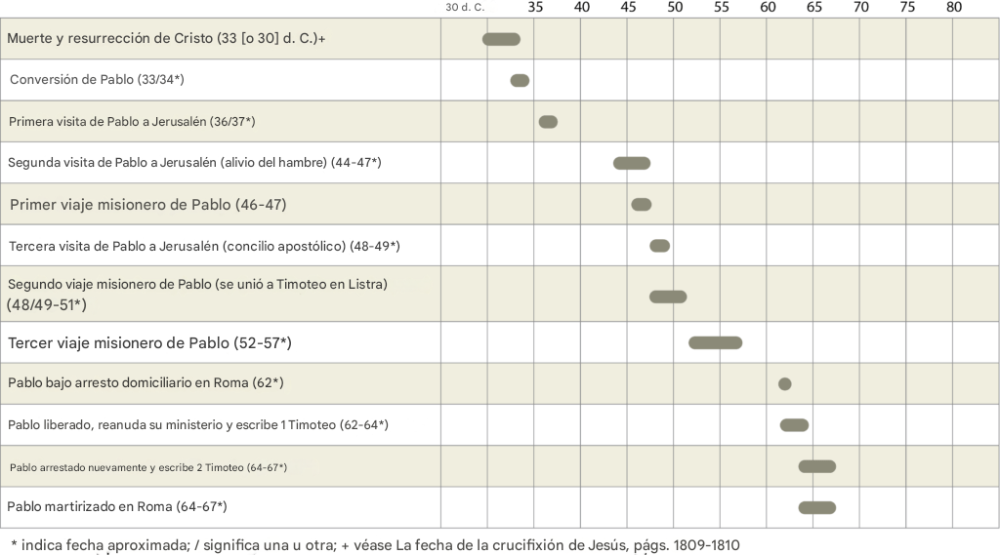

___-___
# 1 Timoteo  
## La Iglesia del Dios Vivo

El material de CGV es desarrollado para el uso libre de la iglesia. Nuestro animo es que sea de bendición para la iglesia. Este material esta diseñado para promover el discipulado dentro de la Iglesia local. Creemos que el mejor lugar para cumplir la Gran Comisión (discipular y enseñar) es por medio de la Iglesia bien equipada. 2 Timoteo 3:15-16

www.discipuladocgv.org

ÍNDICE

| 1 Timoteo - En la Casa de Dios                               |      |
| ------------------------------------------------------------ | ---- |
| La Iglesia: Información General                              |      |
| Características Distintivas de la Iglesia del Nuevo Testamento |      |
| 1 Timoteo 1:1-2 - Saludos e Información Biográfica           |      |
| 1 Timoteo 1:3-20 - Batallando por la Verdad                  |      |
| Breve Doctrina sobre la Disciplina en la Iglesia             |      |
| 1 Timoteo 2:1-15 - Instrucción Sobre la Adoración            |      |
| 1 Timoteo 3:1-16 - Instrucción en la selección de líderes en la iglesia |      |
| 1 Timoteo 4:1-16 - Protección Contra la Apostasía            |      |
| 1 Timoteo 5:1-6:21 - Relaciones dentro de la Iglesia         |      |
| 1 Timoteo 6:3-21 - Asuntos Relacionados con la Iglesia       |      |

# Introducción 

## A primera vista

### La maravilla de la iglesia __<u>está</u>__ en el hecho que Cristo la concibió en Sus planes desde antes de la fundación del mundo (Efesios 1:4), la compró con Su sangre (Hechos 20:28), prometió edificarla (Mateo 16:18a), envió el Espiritu para fundarla (Hechos 2), la santifica (Efesios 5:26) y prometió preservarla eternamente (Mateo 16:18b). 

### La Iglesia pertenece únicamente a Jesucristo quien la compró __<u>con</u>__ Su sangre. Hechos 20:28; 1 Corintios 7:23

### Tradicionalmente, las cartas de 1 Timoteo, 2 Timoteo y Tito han sido descritos como "cartas pastorales". Ese pensamiento ha impregnado en el pensamiento actual y dió a entender que __<u>solo</u>__ líderes cristianos tienen la necesidad de estudiarlos para así ser capacitados para liderar en el ministerio. 2 Corintios 2:1-5

### Lamentablemente este pensamiento resultó en congregaciones que se quedaron con una __<u>falta</u>__ por comprender las verdades que contiene estas epistolas. 1 Timoteo 3:15

### Vemos en 2 Timoteo 3:16 que toda la revelación de nuestro Señor es __<u>útil</u>__ para la instrucción de cada uno de Sus santos, por lo tanto, 1 Timoteo ha sido escrito para todo creyente también. 

### Este precioso __<u>libro</u>__ contiene instrucción importante para hermanos mayores, hermanas mayores, hermanas jóvenes y hermanos jóvenes. Personas en posiciones de empleados (esclavos) y empresarios (ricos). 

### Si alguna vez te preguntaste "¿Qué es la Iglesia?", "¿Cómo se define la Iglesia?", "¿Cuál es mi __<u>parte</u>__ dentro de la Iglesia?", "¿Cómo debemos conducirnos en ella?", entonces el contenido de este libro te guiará a la esencia de que es la Iglesia de Jesucristo y como debe andar ordenadamente. Asi que, creyente, ¡pon atención a este hermoso y valioso libro!

## Información General

## Género: 

### El género del libro es didáctico, es una __<u>carta</u>__ escrita a alguien con el propósito de dar enseñanza. 

##### Timoteo es el único individuo que recibió __<u>dos</u>__ cartas que son parte de las Sagradas Escrituras. 

##### El libro de 1 Timoteo contiene __<u>tres</u>__ poemas. 1 Timoteo 1:17, 3:16, 6:15-16

## Eventos importantes en referencia a 1 Timoteo

## Trasfondo Cultural/Histórico

### La fecha de escritura es entre 62 y 65 d.C. __<u>desde</u>__ Macedonia.

### Pablo había estado en Éfeso (1 Timoteo 1:3) después de su llegada de Roma, lo cual fue ciertamente antes del incendio de Roma en el 64 d.C. [^1]

### Había dejado a Timoteo a cargo de la __<u>obra</u>__ en Éfeso y se había ido a Macedonia (1 Timoteo 1:3), posiblemente a Filipos, como esperaba. Filipenses 2:24

### Deseaba ayudar a Timoteo a afrontar los problemas de doctrina, disciplina y formación eclesiástica, que eran __<u>cada</u>__ vez más urgentes. 1 Timoteo 4:16

### Aquí encontramos sabias palabras del Apóstol Pablo a un __<u>jóven</u>__ ministro a quien estimaba. 1 Timoteo 6:11-12

## Autor y Receptor del libro 

### Encontramos esta epístola como la primera __<u>carta</u>__ escrita por el Apóstol Pablo hacia su hijo en la fe, Timoteo. 1 Timoteo 1:1

### La carta de 1 Timoteo fue escrita  por el apóstol Pablo casi al __<u>final</u>__ del ministerio de Timoteo el cual duró aproximadamente 15 años (49d.C. - 64d.C.). Hechos 18:2; 2 Timoteo 4:6

## Tema Principal

### El __<u>tema</u>__ principal de la carta: Como establecer y conducir una iglesia como columna y sostén de la verdad apta para resistir la falsa enseñanza.

### 1 Timoteo 3:14-15 "*...te escribo para que sepas cómo debe conducirse uno en la casa de Dios, que es la iglesia del Dios vivo, columna y sostén de la verdad.*"

### En 1 Timoteo, se encuentran instrucciones para establecer iglesias, corregir abusos, __<u>falsas</u>__ doctrinas, prácticas de adoración, hábitos de discipulado, vida familiar, responder a la persecución y más. 

### En __<u>tres</u>__ ocaciones encontramos a Pablo haciendo la declaración, "*palabra fiel*" (1 Timoteo 1:15, 3:1, 4:9). El hecho que es "*palabra fiel*" nos __<u>anima</u>__ a prestar atención al mensaje que contiene. 

### En resumen, podemos decir que Pablo le escribió a Timoteo por su inmenso amor y aprecio por Timoteo y la __<u>obra</u>__ que había sido llamado a realizar al servicio del Señor Jesús. A través de esta carta Timoteo podía enseñar a los hermanos en Efeso y nosotros aprendemos también. 

### La carta de Timoteo no es __<u>solo</u>__ para líderes. La carta de Timoteo es para que todo creyente sepa como conducirse en la casa de Dios. 

## Bosquejo del libro
| Capítulo 1                                                   | Capítulo 2                          | Capítulo 3                            | Capítulo 4                            | Capítulo 5-6                             |
| ------------------------------------------------------------ | ----------------------------------- | ------------------------------------- | ------------------------------------- | ---------------------------------------- |
| 1 Timoteo 1:1-2 Saludos   1 Timoteo 1:3-10 Batallando por la gracia | 1 Timoteo 2:1-15 Sobre la adoración | 1 Timoteo 3:1-16 Selección de Líderes | 4:1-16 Protección contra la Apostacía | 5:1-6:21 Relaciones dentro de la Iglesia |

# La iglesia: el cuerpo de Cristo y casa del Dios vivo

## Introducción

### Generación a generación Dios ha __<u>estado</u>__ buscando incanzablemente a este mundo perdido, con el único proposito de salvarlo y rescatarlo de las tinieblas y del rumbo del hombre que se dirige hacia la condena eterna. Salmos 8:4

### Dios siendo omnisciente, no fué tomado por sorpresa en la caída del hombre, sino que El mismo anticipó proveer un __<u>medio</u>__ de salvación. El mismo ideó un solo camino de verdad y vida que posibilite acercase nuevamente al Padre. 2 Timoteo 1:9; Juan 14:6; 1 Pedro 1:20

### A través de la historia, Dios ha usado diferentes agentes (como testigos) para la predicación de Su Palabra. Dios usó a Set, Enoch y Noé. Más adelante Dios usó a Israel como __<u>agente</u>__ para proclamar Su mensaje de salvación. Hoy, en nuestro tiempo, Dios sigue anunciando Su mensaje, a través de la Iglesia. Colosenses 1:25; 1 Timoteo 3:15

### Por tal motivo es bueno que nos hagamos las preguntas, ¿qué es la Iglesia?, ¿quien fundó la Iglesia?, ¿a quién le pertenece la Iglesia?, ¿cuándo inicio?, ¿cuándo termina? y ¿quiénes forman __<u>parte</u>__ de ella?.

## La Palabra Iglesia y su orígen

### Inicialmente el significado de la palabra *ekklesia* era simplemente los llamados afuera a una asamblea, o a una __<u>reunión</u>__. En las antiguas ciudades griegas, una *ekklesía* era una asamblea de ciudadanos que se reunían para tomar decisiones sobre asuntos de la ciudad.

### *Ekklesia* es la palabra griega traducida en el Nuevo Testamento como "iglesia". Proviene de *ek*, que significa "salir de" y *kaleo*, que significa "llamar hacia", y tiene que ver con un __<u>grupo</u>__ de personas llamadas de un lugar a otro. 

### Etimológicamente no tiene un significado dirigido a un edificio físico, y tampoco era utilizado con un fin religioso, un ejemplo que podemos __<u>ver</u>__, es en Hechos 19:23-25 en la que un hombre hace un llamado a salir afuera para reunir a toda la ciudad.

### En Hechos 19:29 muestra que no todos los ciudadanos sabían porque se les había llamado a salir __<u>afuera</u>__ a reunirse Hechos 19:32 y muy probablemente los que llegaban a la reunión no tenían claro porque los ciudadanos estaban en "Ekklesía" Hechos 19:33.

#### Existen 191 menciones de la palabra EKKLESIA en la Biblia. 77 veces en el Antiguo Testamento (Septuaginta - traducido asamblea), 114 veces en el Nuevo Testamento. 77 menciones son las que se __<u>refieren</u>__ específicamente a la iglesia del Señor Jesucristo.

#### De las 77 menciones de EKKLESIA del Antiguo Testamento, ninguno se refiere al cuerpo de __<u>Cristo</u>__ que es la iglesia. Habla de una asamblea o una reunión como lo vimos en el uso común de la palabra. 1 Crónicas 11:4; 2 Crónicas 28:14

#### En el Nuevo Testamento, 37 menciones no se refieren a la "Ekklesía" como __<u>cuerpo</u>__ de Cristo, sino a una reunión o asamblea. Hechos 19:41

#### El libro de Hechos __<u>lleva</u>__ 17 menciones. Hechos 8:1; Hechos 9:31; Hechos 11:26; Hechos 20:28

#### En las epístolas del Apóstol Pablo se __<u>hace</u>__ mención 46 veces. Romanos 16:1; Efésios 1:22; Filemón 1:2

#### En el resto de las epístolas se __<u>hacen</u>__ mención 11 veces. Santiago 5:14; 3 Juan 1:6; Apocalipsis 1:4

#### Y el Señor Jesucristo lo mencionó 3 __<u>veces</u>__. Mateo 16:18; Mateo 18:17

### Fue el Señor Jesucristo quien usó la palabra EKKLESIA para darle un significado propio cuando dijo "*edificaré mi Iglesia*" dando a entender que en un tiempo futuro El levantaría __<u>sus</u>__ llamados (salidos de EK y llamados hacia KALEO). 

### Mateo 16:18 "*...edificaré Mi iglesia...*" Es en este pasaje que el Señor Jesucristo dió su __<u>origen</u>__ a la palabra "Mi" iglesia, en pertenencia, propósito, cuidado y protección de ella.

### La Iglesia no pertenece a ninguna institución humana como decir el Vaticano, alguna denominación, las naciones unidas o algún __<u>país</u>__. La iglesia no es de una institución que represente ante el gobierno. Efesios 5:27

### La iglesia no pertenece a personas como los reformadores, misioneros, "padres fundadores", ancestros, maestros, ancianos o diáconos. La iglesia no pertenece a personas que ofrendaron por comprar el __<u>lote</u>__ y un edificio. 3 Juan 1:9-10

### Pablo describe la __<u>iglesia</u>__ en Romanos 1:6, "*entre los cuales están también ustedes, llamados de Jesucristo.*" 1 Corintios 1:2, 9, 24

## Fundación e inicios de la Iglesia

### Aunque Jesús anunció __<u>edificar</u>__ su iglesia en un tiempo futuro, ¿cuándo sucedió?

### Antes de ascender al __<u>cielo</u>__, Jesús dijo en Hechos 1:8 “*pero recibirán poder cuando el Espíritu Santo venga sobre ustedes; y serán Mis testigos en Jerusalén, en toda Judea y Samaria, y hasta los confines de la tierra».*“ 

### Con la llegada del Espíritu Santo ellos llegarían a ser testigos de Jesucristo. Dios les levantaría como agentes o testigos __<u>para</u>__ llevar Su mensaje de salvación a todo el mundo. 

### Hechos 1:8a “...*pero recibirán poder cuando el Espíritu Santo venga sobre ustedes...*" La instrucción dada por el Señor Jesucristo era que ellos no debian hacer absolutamente nada hasta que __<u>haya</u>__ venido el Espiritu Santo. Lucas 24:46-49

#### En Juan 14:16 El Señor Jesucristo rogaría al Padre para que el Espíritu Santo more en __<u>cada</u>__ creyente durante el tiempo de la iglesia. Efesios 1:13

#### El mundo (incrédulos) no puede recibir el Espíritu Santo, solo aquellos que han creído en la __<u>obra</u>__ de Jesucristo lo reciben. Efesios 1:13; Juan 14:17; Romanos 8:16

##### Efesios 1:13 "*...fueron **sellados** en Él con el Espíritu Santo de la promesa,*"

#### El ministerio del Espiritu Santo en el creyente seria de enseñar y recordar todas las __<u>cosas</u>__ que el Señor Jesucristo había dicho a sus discipulos. Juan 14:26

#### Es por eso que cuando __<u>llegó</u>__ el Espiritu Santo en el día de pentecostés inició la obra y el ministerio de la predicación del Evangelio. Hechos 2:1-4

#### Hechos 2:41b "*...y se añadieron aquel día como 3,000 almas*".

#### Hechos 2:44 "*Todos los que habían creído estaban juntos y tenían todas las cosas en común*".

#### Hechos 2:47 "*...alabando a Dios y hallando favor con todo el pueblo. Y el Señor añadía cada día a la (__<u>iglesia</u>__ RVR60) los que iban siendo salvos*".

### Hechos 1:8b "*...y serán __<u>Mis</u>__ testigos en Jerusalén, en toda Judea y Samaria, y hasta los confines de la tierra».*“ Con la llegada del Espíritu Santo Dios identificó a todo creyente como testigos de la obra de Jesucristo. Hechos 2:37-39; Juan 17:16; Juan 17:20

#### __<u>Todo</u>__ creyente ha sido incluido para participar en lo que esta haciendo el Espíritu Santo por medio de la iglesia de alcanzar al mundo perdido por medio de la predicación del Evangelio. Romanos 1:9; Filipenses 1:27

#### Juan 16:8-10 "*Y cuando él venga, convencerá al mundo de pecado, de justicia y de juicio. De pecado, por cuanto no creen en mí; de justicia, por cuanto voy al Padre, y no me veréis más; y de juicio, por cuanto el príncipe de este mundo ha sido ya juzgado*".

### Concluimos entonces que la fundación y el __<u>inicio</u>__ de la iglesia fue con la llegada del Espíritu Santo.

#### Es por medio del Espíritu Santo que el Señor Jesucristo esta llevando a cabo la edificación de la __<u>iglesia</u>__. Mateo 16:18; Juan 14:18; Juan 14:20

#### En el tiempo __<u>actual</u>__, el Espíritu Santo continua llevando a cabo Su ministerio, tanto con los creyentes de la iglesia, guiándolos a toda verdad (Juan 16:13) y convenciendo por medio de la predicación de La Palabra de Dios al mundo perdido. Juan 16:8

## Un Misterio, el Plan de Dios con la Iglesia

### El plan de Dios siempre ha sido llegar a los gentiles (a __<u>todo</u>__ el mundo). Israel era antiguamente el agente por el cual anunciaba la luz a las naciones. Éxodo 19:5-6; Génesis 12:3

### Por causa del rechazo de la __<u>nación</u>__ de Israel al Señor Jesucristo (Hechos 3:13-15), los gentiles llegaron a ser participantes en los planes de Dios. Romanos 11:17

#### Sin embargo, no debemos __<u>llegar</u>__ a la conclusión que Dios ha desechado a Su pueblo. Un día Dios retomará sus planes con la nación de Israel. Romanos 11:1-2

### Hoy, la iglesia es el __<u>agente</u>__ que Dios esta usando para alcanzar a todas las naciones, incluyendo a la nación de Israel ya que el Evangelio es el mensaje de Dios para todo el mundo. Romanos 11:14, 1:14; 1:16

#### Efesios 3:10-11- "*para dar a conocer...de la sabiduría de Dios, por __<u>medio</u>__ de la Iglesia, conforme al plan eterno que ha realizado por medio de Cristo Jesús, Señor nuestro,*" 1 Timoteo 3:15

### En Mateo 18 el Señor Jesucristo va preparando a sus discipulos __<u>sobre</u>__ la iglesia, aunque para ese momento, para ellos la iglesia seguía siendo un misterio. Efesios 3:2-6, 9

## Funcionamiento y vigencia de la iglesia

### Toda casa tiene su propietario. 1 Timoteo 3:5 dice, "*...de la iglesia de Dios*?", la iglesia es la casa del Dios vivo y __<u>tiene</u>__ su propio orden y gobierno. 1 Timoteo 3:15

### Y en ésta __<u>casa</u>__, que es la iglesia, Dios estableció su propio orden, Efesios 5:23b "*... Cristo es cabeza de la iglesia, siendo El mismo Salvador del cuerpo*".[^3] Colosenses 1:18

### La palabra Mi iglesia le da el sentido de pertenencia al mismo Señor Jesucristo, ya que el mismo dió su vida por ella, __<u>para</u>__ rescatarla y purificarla Mateo 16:18; Efesio 5:24; Romanos 16:16

#### Efesios 5:25 “*…así como Cristo __<u>amó</u>__ a la iglesia y se dio Él mismo por ella,*”

#### Cristo en la cruz no solo nos __<u>rescató</u>__ de la condena del pecado, sino que Él se dio por la iglesia para: 

##### Efesios 5:26 “*...santificarla, habiéndola purificado por el lavamiento del __<u>agua</u>__ con la palabra,*”.

##### Efesios 5:27 "*a fin de presentársela a sí mismo, __<u>una</u>__ iglesia en toda su gloria, sin que tenga mancha ni arruga ni cosa semejante, sino que fuera santa e inmaculada*".

### En Hechos 20:28 podemos encontrar que Dios compró la iglesia, mostrando claramente la __<u>deidad</u>__ de Cristo, ya que dice, la compró con Su propia sangre.

### Esto significa que la iglesia le pertenece a Dios Padre __<u>como</u>__ a Jesucristo. 1 Tesalonicenses 1:1; 2 Tesalonicenses 1:1

### Es Cristo el que esta llevando a __<u>cabo</u>__ la edificación de la iglesia "*...hasta que haya entrado la plenitud de los gentiles.*" Romanos 11:25b

#### Por aquel motivo el nos ha llamado __<u>salir</u>__ "Ek" de las tinieblas hacia "Kaleo" su luz admirable. 1 Pedro 2:9

#### 2 Timoteo 1:9 "*Él nos ha salvado...según Su propósito y según la gracia que nos fue dada en Cristo Jesús desde la eternidad*"

#### 1 Corintios 1:9 "*...fueron llamados a la comunión con Su Hijo Jesucristo...*"

#### Aunque vivimos en el mundo y somos __<u>parte</u>__ de él, la iglesia debe ser distinta. Debemos estar separados de los caminos del mundo y señalar la verdad de Dios. Filipenses 2:12-16

## Iglesia universal versus iglesias locales

### La Iglesia universal se refiere al __<u>cuerpo</u>__ espiritual de Cristo que está representado por muchas iglesias locales. Si bien hay una sola Iglesia de Jesucristo, tiene muchas diferentes representaciones en diferentes lugares. 

### Representación __<u>universal</u>__:

#### Al momento en creer en el Señor Jesucristo uno llega a formar parte de la iglesia universal de Dios, __<u>llega</u>__ a ser un miembro del cuerpo de Cristo en cualquier lugar que se encuentre. Efesios 2:18; Juan 17:20-21

#### 1 Corintios 6:15a "*¿No saben que sus cuerpos __<u>son</u>__ miembros de Cristo?*"

#### 1Corintios 6:19 "*¿O no saben que su cuerpo es templo del Espíritu Santo que está en ustedes, el cual tienen de Dios, y que ustedes no se pertenecen a sí mismos?*"

#### Efesios 1:22-23 "*...a Él lo dio por cabeza sobre todas las cosas a la iglesia, la cual es Su cuerpo, la plenitud de Aquel que lo llena todo en todo.*"

#### Efesios 2:15 "*...para crear en Él* [Cristo] *mismo de los dos un __<u>nuevo</u>__ hombre...*"

#### Efesios 4:4 "*Hay un __<u>solo</u>__ cuerpo y un solo Espíritu...*"

#### Colosenses 3:15 "*...fueron llamados en __<u>un</u>__ solo cuerpo...*"

#### Cualquier creyente en Jesucristo es __<u>miembro</u>__ de la iglesia universal. Efesios 1:13, 2:19, 22

### Representaciones __<u>locales</u>__:

#### La Iglesia universal se ve expresada de forma local, en una ciudad, una comunidad o aldea. 

##### 1 Corintios 1:2 "*a la iglesia de Dios que está __<u>en Corinto</u>__, a los que han sido santificados en Cristo Jesús...*"

##### Romanos 1:7 "*A todos los amados de Dios que están __<u>en Roma</u>__...*"

#### ¿Cuando se concidera establecida un iglesia local?

#### Se considera una iglesia __<u>local</u>__ desde el momento en que 2, 3 o más personas se reunen regularmente en el nombre del Señor Jesucristo con un propósito de adorar, estudiar La Palabra y tener comunión entre los santos. Mateo 18:20; Hechos 2:42

#### El propósito principal de la iglesia está en la instrucción del Señor Jesucristo. La Gran Comisión. Ir y hacer discipulos __<u>incluye</u>__ evangelizar, discipular y encargar a hombres fieles a discipular a otros y establecer iglesias locales. Mateo 28:18-20, 2 Timoteo 2:2

##### Es verdad que cada miembro de la __<u>iglesia</u>__ no debe descuidar la misión de anunciar y predicar el Evangelio de la salvación. Marcos 16:15; Hechos 4:12.

##### Pero una iglesia que no hace discipulos su fin es seguro, ya que no quedará nadie quien enseñe a __<u>guardar</u>__ todas las cosas que el Señor Jesucristo ha enseñado. Mateo 28:20; 2 Timoteo 2:2

#### Una iglesia local es parte de la iglesia universal sin embargo ella es autónoma en funcionamiento.

#### Cuando una iglesia local establece otra iglesia local, la nueva iglesia llega a funcionar independientemente de la __<u>primera</u>__. Una iglesia local que tiene otras iglesias locales bajo los mismos ancianos no esta siendo autónoma ni permitiendo a otros ser autónomos. Hechos 20:17; Santiago 5:14

# 1 Timoteo 1:1-2 - Saludos 

## Autor de la carta: Un Apóstol de Jesucristo

### 1 Timoteo 1:1a "*Pablo...*" Vemos el nombre de Pablo como __<u>firma</u>__ de esta epístola. 1 Timoteo 1:13, 15, 2:7

#### Pablo era un hebreo y ciudadano __<u>romano</u>__, anteriormente llamado __<u>Saulo</u>__, nacido en la ciudad de Tarso. Hechos 22:3

#### En su vida como incrédulo fue un fiel religioso __<u>judío</u>__ (Filipenses 3:4-9) y un fiel perseguidor de los del "Camino", la Iglesia de Dios. Hechos 22:4; Gálatas 1:13

#### En Hechos 9 podemos encontrar __<u>registros</u>__ de su salvación al ver a Cristo resucitado.

#### Hechos 13:9 muestra: "*Entonces __<u>Saulo</u>__, llamado también __<u>Pablo</u>__...*" ahí encontramos que Saulo __<u>pasa</u>__ a ser llamado Pablo durante los días de su primer viaje como apóstol de Cristo hasta el día de su martirio en el año 67 d.C aproximadamente.

### 1 Timoteo 1:1b "*Pablo, apóstol de Cristo Jesús...*" Pablo se presenta en esta carta __<u>como</u>__ un apóstol de Jesucristo.

#### Cristo escogió a Pablo __<u>como</u>__ Su Apóstol (enviado, emisario, mensajero) a los gentiles. Hechos 9:15, 22:21; Romanos 11:13; 2 Timoteo 1:11

#### Podemos también encontrar en la escritura __<u>otras</u>__ personas enviadas. Hechos 14:14; Filipenses 2:25; 2 Corintios 8:23

#### Sin embargo, en toda la escritura observamos __<u>doce</u>__ Apóstoles del Cordero, especificamente enviados por Jesucristo mismo. Apocalipsis 21:14

###### Escogidos directamente por __<u>nuestro</u>__ Señor Jesucristo. 1 Corintios 9:1-2

###### Utilizados __<u>como</u>__ el fundamento de la Iglesia. Efesios 2:19-20, 4:11-12; 2 Pedro 3:2

###### Designados como principales autoridades espirituales __<u>bajo</u>__ la autoridad de Cristo. 1 Corintios 12:28

#### Pablo como apóstol de Jesucristo fue comisionado a los gentiles, fue designado con un __<u>rol</u>__ importante en el establecimiento de la Iglesia. Hechos 9:15; Colosenses 4:3 

#### El Apostolado de Pablo es innegable y confirmado de __<u>varias</u>__ maneras:

##### Por Jesucristo: 

###### Jesús escogió personalmente a __<u>Pablo</u>__ para su Apostolado. Hechos 9:15; 1 Corintios 15:7-8; Gálatas 1:11-16; Efesios 3:7

##### Por los líderes en Jerusalén:

###### Gálatas 2:9 "*Al reconocer la gracia que se me había dado, Jacobo, Pedro y Juan, que eran considerados como columnas, nos dieron a mí y a Bernabé la diestra de compañerismo, para que nosotros fuéramos a los gentiles y ellos a los de la circuncisión.*" Romanos 1:5; Efesios 3:2

##### Por Milagros:

###### Dejó __<u>ciego</u>__ temporalmente a un hechicero (Hechos 13:11). Sanó a un hombre cojo de nacimiento (Hechos 14:8-10). Expulsó a un espíritu que lo molestaba (Hechos 16:16-18). Sanó a personas y expulsó espíritus mediante objetos que tocaba (Hechos 19:11-12). Resucitó a un joven llamado Eutico (Hechos 20:9-12). Fue mordido por una serpiente venenosa y no le ocurrió nada (Hechos 28:3-5). Sanó a un hombre con fiebre y disentería (Hechos 28:8).

##### Por Las Escrituras: 

###### Pablo escribió 13 __<u>libros</u>__ del Nuevo Testamento que confirman su legitimidad.

##### Por Sus Frutos:

###### Los __<u>mismos</u>__ hermanos en Corinto eran evidencia de su Apostolado. 2 Corintios 3:1-2

#### 1 Timoteo 1:1c "*...por mandato de Dios nuestro Salvador...*" La iniciativa y la autoridad en designar a Pablo como apóstol a los __<u>gentiles</u>__ vino directamente de Dios el Padre.

##### Las primeras palabras en esta carta demuestran quien es el que está al control del trabajo de Pablo, __<u>quien</u>__ es el iniciador y proveedor en su apostolado, Dios mismo. Gálatas 1:1, 11-12

##### Dios Padre es descrito aquí como Salvador (Redentor, Libertador). No se queda ahí, sino que el Espíritu Santo __<u>inspiró</u>__ las palabras "*...nuestro Salvador...*", no solo era el Salvador único y eterno de Pablo, sino también lo era de su hijo en la fe, Timoteo. Judas 1:24-25

##### Vemos que el apostolado de Pablo no __<u>fue</u>__ por iniciativa propia, sino que era orquestado por su Salvador..."*por mandato de Dios*".

#### 1 Timoteo 1:1d "*...y de Cristo Jesús...*" En __<u>total</u>__ armonía con el Padre, Cristo también es el originador del trabajo de Pablo para Su Obra, la edificación de Su Iglesia (Sus llamados afuera). Hechos 26:15-18

#### 1 Timoteo 1:1e "*...Cristo Jesús nuestra esperanza...*". Nótese las palabras de este versículo, no dice que Jesucristo nos da esperanza. Sino que Jesucristo __<u>era</u>__ la esperanza de Pablo y le recuerda a Timoteo que también era su esperanza. Romanos 8:24-25

##### Jesucristo es también ahora la __<u>esperanza</u>__ de cada persona que creyó en Él, en Su persona y Su obra completa (Su muerte por los pecados, Su sepultura y Su resurrección). Si tú también creíste en Jesucristo como Pablo y Timoteo, Él también es ahora y para siempre tu esperanza.

##### 1 Pedro 1:3 "*Jesucristo es por medio de __<u>quien</u>__ tienes una esperanza viva, porque Él vive*".

##### Romanos 5:2 Jesucristo es... "*por __<u>medio</u>__ de quien has sido declarado justo delante del Padre y ahora puedes gozarte en la esperanza de Su Gloria*". Colosenses 1:27

##  Receptor de la carta: El bien amado de Pablo

### 1 Timoteo 1:2a "*a Timoteo, verdadero hijo en la fe...*" Timoteo un creyente en Jesucristo y también el hijo espiritual __<u>amado</u>__ de Pablo.

#### Timoteo estaría con Pablo durante su __<u>primer</u>__ encarcelamiento en Roma. Sin embargo, al momento de la escritura de 1 Timoteo, el joven Timoteo se encontraba en Éfeso, sirviendo como evangelista entre las diversas iglesias domésticas que existían en ese entonces. 1 Timoteo 1:3

#### Pablo deseaba llevar a Timoteo en su segundo viaje misionero, por lo que tuvo que circunsidarlo por __<u>causa</u>__ de los judios. Entonces Timoteo lo acompañó en su viaje. Timoteo llegó a ser un fiel compañero en el Señor para Pablo. 1 Corintios 4:17

##### Debemos tener en claro el hecho que Pablo mando a Timoteo que sea circuncidado era para el alcance a los judios, no por complecer al legalismo de los judios. Hechos 16:3, 15:5; Gálatas 5:2, 6:13

#### Por Hechos 16:1-2 sabemos que Timoteo era un joven discípulo (creyente) crecido en Listra (Turquía en la actualidad), de __<u>madre</u>__ judía (Eunice) creyente y padre griego.  Su abuela, Loida también era creyente y participó en su crianza. 2 Timoteo 1:5, 3:15

#### También gozaba de buen testimonio entre los hermanos de Listra e Iconio.

##### Timoteo fue discipulado por Pablo (1 Timoteo 1:2). En Hechos 16:1-5, aprendemos que Timoteo tenía __<u>buen</u>__ testimonio delante de los hermanos en Listra e Iconio.

##### Su __<u>labor</u>__ incluía la proclamación del Evangelio, la enseñanza, la lectura de las Escrituras, el nombramiento de ancianos y diáconos, y la oposición a las falsas enseñanzas. Pablo le escribió, probablemente desde Macedonia, para animarlo en su fiel servicio a Cristo. 1 Timoteo 1:18 [^3]

##### Timoteo cumplió algún tiempo en la __<u>cárcel</u>__ por su fe en Jesucristo, y luego fue liberado. Hebreos 13:23

#### Observando un __<u>poco</u>__ la manera en la cual Pablo se dirige a Timoteo:

##### La palabra *verdadero* viene del griego GNÉSIOS que significa legítimo, genuino, fiel. Esta palabra no solo __<u>refleja</u>__ autenticidad sino también confiabilidad.

##### La palabra *hijo* viene del griego TEKNON que significa también __<u>niño</u>__, descendiente. Esta palabra muestra un vínculo muy cercano y de mucho aprecio entre Pablo y Timoteo.

##### Timoteo llegó a ser alguien de __<u>mucha</u>__ estima para Pablo (1 Corintios 4:17), colaborador en el ministerio (Romanos 16:21), compañero fiel (1 Corintios 4:17, 16:10; 1 Tesalonicenses 3:2).

#### De las numerosas instrucciones y mandatos que Pablo da a Timoteo en esta epístola, es evidente que Pablo lo tenía en alta __<u>estima</u>__.

## 1 Timoteo 1:2b-2f El Saludo

### 1 Timoteo 1:2b "*Gracia...*" es la palabra CHARIS en griego. Significaba varias cosas en el primer siglo __<u>como</u>__ veremos a continuación. 

#### El uso de la palabra __<u>gracia</u>__ en el griego del primer siglo abarca cuatro sentidos principales. 

##### Gracia como Bondad - Amabilidad de una persona __<u>respecto</u>__ a otra. [^6] Lucas 4:22

##### Gracia como Favor - __<u>Ayuda</u>__ o socorro que se concede a alguien. [^7]Lucas 1:30, 2:52; Hechos 2:47

##### Gracia __<u>como</u>__ Gratitud - Sentimiento de la persona que agradece un favor recibido.[^8] Lucas 17:9; Romanos 6:17; 1 Timoteo 1:12; 2 Timoteo 1:3; Hebreos 12:28

##### Gracia como saludo - En cada __<u>ocasión</u>__, Pablo usó la palabra gracia para saludar y despedirse en su escritos. Romanos 1:7

#### Bíblicamente, en la __<u>edad</u>__ de la iglesia, la palabra gracia es muy importante y llega a tener un significado propio. 

##### La gracia fue profetizada e indagada __<u>por</u>__ los profetas de la antigüedad. 1 Pedro 1:10-11

##### La gracia para salvación __<u>fue</u>__ manifiesta en la cruz. Tito 2:11

##### Así como La Ley vino por __<u>medio</u>__ de Moisés, la gracia fue hecha realidad por medio de Jesucristo. Juan 1:17; Hebreos 2:9

##### La gracia __<u>para</u>__ el creyente proviene de Dios. Juan 1:16; 1 Corintios 1:4, 16:23; Gálatas 6:18, 1 Tesalonicenses 5:28

##### La gracia es gratuita, no es por __<u>obras</u>__ o merecimiento. Romanos 11:6, 3:24; Efesios 4:7

##### Dios nos llama por __<u>medio</u>__ de la gracia. Hechos 18:27; Gálatas 1:6, Colosenses 1:6, 2 Timoteo 1:9

##### La salvación es por gracia - buena voluntad libremente difundida (por Dios); es especialmente __<u>para</u>__ beneficio del receptor y es independiente del beneficio acumulado para el difundidor.[^9] Efesios 2:8; Hechos 15:11

###### Somos justificados libremente por su __<u>gracia</u>__. Romanos 3:24; Tito 3:7

###### La __<u>redención</u>__ y perdón de pecados es según la riqueza de Su gracia. Efesios 1:7

##### Ya que la gracia es la __<u>obra</u>__ de Dios mediante Jesucristo y la fe no es una obra, la fe y la gracia armonizan perfectamente. Romanos 3:24-26, 4:5, 4:16

##### El creyente está __<u>firme</u>__ en y bajo la gracia. Romanos 5:2, 6:14

##### La gracia es suficiente para __<u>todo</u>__ el andar del creyente. 2 Corintios 12:9, 1 Timoteo 1:14

##### La gracia es lo que __<u>edifica</u>__ al creyente. Hechos 20:32, Tito 2:12

###### Pablo siempre __<u>animaba</u>__ a los hermanos a permanecer en la gracia. Hechos 13:43, 20:24; Filipenses 4:23; 2 Timoteo 2:1

###### Pedro, en su despedida a los hermanos, __<u>animó</u>__ a sus lectores a continuar creciendo en la gracia. 2 Pedro 1:2, 3:18

### 1 Timoteo 1:2c "*misericordia*..." Esta palabra, ELEOS, también __<u>puede</u>__ ser traducido compasión. 

#### Mientras que la gracia es recibir gratuitamente lo que uno no merece, la misericordia es no recibir lo que si merece. 

#### Podríamos decir que es la manifestación externa de la compasión; da por sentado la necesidad en __<u>aquel</u>__ que la recibe, y recursos adecuados para afrontar la necesidad de parte de aquel que la exhibe.

#### La mayor muestra de misericordia de __<u>nuestro</u>__ Dios es no dar el castigo que merecemos por nuestras injusticias. Y esta misericordia es por medio de la persona y obra de Jesucristo. Tito 3:5-7

### 1 Timoteo 1:2d "*y paz...*" EIRENE es __<u>posible</u>__ que Pablo juntó dos saludos (griego-favor y hebreo-paz) para hacer el suyo. 

#### Más que un simple __<u>saludo</u>__, Pablo deseaba que la paz de Cristo gobierne en el corazón de Timoteo. 2 Timoteo 2:22; 1 Tesalonicenses 5:23

¿De donde provenía la paz que hablaba Pablo?

### 1 Timoteo 1:2e "*de parte de Dios Padre...*" La __<u>gracia</u>__, misericordia y paz que Pablo deseaba para Timoteo provienen de Dios Padre. 

### 1 Timoteo 1:2f "*y de Cristo Jesús nuestro Señor.*" No solo de Dios Padre sino también de __<u>parte</u>__ de Jesucristo. 

#### Pablo introdujo a Cristo en la __<u>carta</u>__ como Señor. Cristo no solo es "*nuestra esperanza*", también es "*nuestro Señor*". Pablo y Timoteo compartían el mismo Señor Jesucristo. 

### La expresión de Pablo __<u>indica</u>__ que deseaba que Timoteo pudiera experimentar más plenamente la gracia, misericordia y paz de Dios. 

# 1 Timoteo 1:3-20 - Batallando por la Verdad

## 1 Timoteo 1:1-4 Enseña que no enseñen doctrinas extrañas

### 1 Timoteo 1:3a "*Tal como te rogué al salir para Macedonia que te quedaras en Éfeso*..." Evidentemente, al salir para Macedonia, Pablo había __<u>rogado</u>__ a Timoteo que se quedara en Éfeso. Hechos 18:21

### 1 Timoteo 1:3b "*...para que instruyeras a algunos que no enseñaran doctrinas extrañas...*" Algunos en la congregación __<u>estaban</u>__ enseñando una doctrina diferente al mensaje de la Biblia. 

#### La frase "*enseñaran doctrinas extrañas*" Es la palabra HETERODIDASKALEO. Significa enseñar "otra __<u>doctrina</u>__" o "desviarse de la verdad"[^7]. 

#### Debemos comprender que cualquier tipo de enseñanza que cambie el Evangelio o que vaya en __<u>contra</u>__ de la escritura es considerada una doctrina extraña. 1 Corintios 15:3-4; Gálatas 1:6-9

#### La enseñanza en la __<u>iglesia</u>__ no debe provenir de un lugar que no sea, La Palabra de Dios correctamente entendida dentro de su contexto. 

### 1 Timoteo 1:4a "*ni prestaran atención*..." La observación del __<u>Texto</u>__ bíblico es muy importante. A lo que prestemos atención afectará los resultados de nuestra instrucción. 

#### Prestar atención PROSECHO es dar __<u>atención</u>__ continua a algo, como alguien que tiene una adicción. Es ser llevado a algo. Aparece 4 veces en 1 Timoteo. 1 Timoteo 1:4, 3:8, 4:1, 4:13

##### 1 Timoteo 3:8 "*no dados*" PROSECHO "*al vino*". Cuando alguien tiene una adicción al vino su __<u>mente</u>__ esta puesta continuamente en tomar. 

##### PROSECHO da la __<u>idea</u>__ de que la atención de uno esta fijado detenidamente en algo. 

#### Algunos estaban dedicando su atención PROSECHO a __<u>cosas</u>__ que desviaban del verdadero conocimiento de Cristo. 

### 1 Timoteo 1:4b "*a mitos*..." Pusieron su atención en __<u>fabulas</u>__ o cosas de ficción.

### 1 Timoteo 1:4c "*y genealogías interminables*..." Sabemos que la genealogía era importante entre la __<u>cultura</u>__ judía. La descendencia de uno definía su tribu y quien era su ancestro. 

#### Hacer largos recuentos de historia y genealogías no es enseñanza que llevaría a la madurez. Timoteo debía __<u>instruir</u>__ a estos maestros que dejen de enseñar este tipo de cosas. 

### 1 Timoteo 1:4d "*lo que da lugar a discusiones inútiles*". El resultado de enseñar fabulas y genealogías interminables es que lleva a __<u>disputar</u>__ inútilmente entre los hermanos. Tito 1:10

#### La frase "discusiones inútiles" es EKZETESIS. La palabra significa sobre investigación de las __<u>cosas</u>__.[^7] 

#### Es sin provecho que la __<u>iglesia</u>__ se ocupe en la sobre investigación de cosas inútiles.

### 1 Timoteo 1:4e …"*en vez de hacer avanzar el plan de Dios que es por fe*". La única manera que haya crecimiento (madurez) en la iglesia es __<u>enseñando</u>__ la gracia de Dios, esto es "*avanzar el plan de Dios que es por fe*". 

#### La gracia y la fe armonizan __<u>juntos</u>__ perfectamente. 

#### Cualquier enseñanza extraña distraera del mensaje de las Escrituras para prestar atención a __<u>cosas</u>__ que producen más bien carnalidad y se manifestará en contiendas y discusiones sin propósito espiritual alguno. 1 Timoteo 6:4

### 1 Timoteo 1:4f …"*así te encargo ahora*". Pablo le __<u>confió</u>__ esta importante tarea a Timoteo. Debía hacerlo con urgencia pues los resultados serian devastadores. 

## 1 Timoteo 1:5 - El propósito de la instrucción verdadera

### 1 Timoteo 1:5a "*Pero...*" En un __<u>claro</u>__ contraste con esos que enseñan doctrinas extrañas, Pablo explica...

### 1 Timoteo 1:5b …"*el propósito de nuestra instrucción...*" En contraste con la enseñanza __<u>desviada</u>__ de la verdad, Pablo prosigue buscando abrir el entendimiento de Timoteo para mostrarle la finalidad de la enseñanza verdadera en la iglesia. 

#### La enseñanza de Pablo y Timoteo es __<u>una</u>__ instrucción diferente. No son compatibles. Cada instrucción tiene su resultado. 

#### Al callar a algunos que enseñan incorrectamente, Pablo no esta dividiendo la iglesia. Al contrario, la unidad de la __<u>iglesia</u>__ depende de la verdad. 

#### No es que Pablo __<u>tiene</u>__ algo personal contra uno de ellos. Es que simplemente su enseñanza se había desviado. 

### 1 Timoteo 1:5b "*es el amor*". El propósito de la instrucción es el amor. Una instrucción sana, verdaderamente __<u>bíblica</u>__ llevará al amor. 

#### Sin instrucción de la __<u>verdad</u>__, no puede haber verdadero amor. 

#### Pablo no enseñaba por enseñar cosas interesantes para llevarlos a discusiones que alimentan la __<u>carne</u>__. Sus intenciones en enseñar la verdad eran para beneficio de los hermanos. Por medio de la instrucción tendrían amor. 

##### El amor __<u>proviene</u>__ de Dios. Juan 15:10; 1 Timoteo 1:14

##### Sin la verdad, no puede __<u>haber</u>__ amor. Juan 13:35; Romanos 12:9; 1 Corintios 13:6; 2 Corintios 6:6; 1 Timoteo 6:14; Efesios 2:13-19

##### Sin la verdad, no puede haber unidad. La unidad es en __<u>base</u>__ a la verdad. Juan 17:26; 2 Corintios 13:11

### 1 Timoteo 1:5c "*es el amor...nacido de corazón __<u>puro</u>__,*" Salmo 51:10

#### Sin la verdad, no hay __<u>amor</u>__. 1 Corintios 13:6

### 1 Timoteo 1:5d "*es el amor...de una buena conciencia,*" En nuestro andar diario podemos gozar de una __<u>buena</u>__ conciencia o no.

#### Para este __<u>caso</u>__ en específico, una buena conciencia está estrechamente relacionada con el mensaje de la escritura, al permancer en el mensaje sin alterarlo estaremos gozando de una buena conciencia.

#### Cuando hacemos algo malo nuestra consciencia no nos deja tranquilos. 

#### El resultado de la verdad adoptada por la fe __<u>tendrá</u>__ como fruto el amor.

### 1 Timoteo 1:5e "*es el amor...y de una fe sincera,*" El amor que vine de una fe sincera habla de un amor que __<u>viene</u>__ de la confianza sin hipocresía o falsedad.

#### Pablo no está hablando de fe para salvación de la condena del pecado, poniendo así en tela de __<u>duda</u>__ la salvación eterna.

#### Mas bien habla de fe en nuestro diario andar, fe sin hipocresía, hablando de una doble dependencia, esto en contraste con la __<u>sola</u>__ dependencia de la verdad de la Escritura. 

## 1 Timoteo 1:6-7 - El desvío de la instrucción bíblica al pervertir el uso de La Ley 

### 1 Timoteo 1:6a "*Pues algunos, desviándose de estas cosas* *se han apartado hacia una vana palabrería...*" Al apartarse del propósito correcto de la instrucción, terminaron enseñando meramente palabras __<u>huecas</u>__ sin conseguir el amor de corazon puro, una buena consciencia y una fe sincera. 

#### El error que cometieron fue de enseñar __<u>cosas</u>__ extrañas y eso terminó en vana palabrería. 

### 1 Timoteo 1:7a "*Quieren ser maestros de la ley*" Su intención es __<u>ser</u>__ "doctos" en la ley. 

#### Cuando una herramienta es utilizada para __<u>algo</u>__ que no es su uso, puede resultar ser peligroso y dañino. 

#### Al __<u>querer</u>__ ser maestros de La Ley, estas personas estaban dando un mal uso a una buena herramienta y terminó en algo dañino para la iglesia. 

#### Se apartaron de la verdad para __<u>apuntar</u>__ hacia vana palabrería. Hacen declaraciones categóricas al intentar ser maestros de La Ley. Se apartaron de la gracia creando algo nuevo. Algo estéril, un cancer, doctrina de demonios. 1 Timoteo 4:1; Gálatas 3:12-13

##### Su mensaje contenia Palabras __<u>vanas</u>__ tales como: la auto-negación religiosa, el formalismo religioso, las disciplinas espirituales, la vestimenta, las reuniones, la comida, etc. etc... 

### 1 Timoteo 1:7b "*aunque no saben lo que __<u>dicen</u>__ ni entienden las cosas acerca de las cuales hacen declaraciones categóricas.*" ¿Cómo pueden enseñar algo que __<u>ellos</u>__ ni siquiera entienden? Demuestran que  no entienden porque Dios no usa La Ley para madurar al creyente. Romanos 6:14

#### Al querer usar La __<u>Ley</u>__ para santificar a los hermanos, claramente demuestra que no saben lo que dicen. 

#### Al querer ser maestros de La Ley muestran que no han entendido la relación que el creyente __<u>tiene</u>__ con La Ley. Romanos 7:4

#### Declaraciones categóricas es la palabra DIADEBAIMOOMAI que conlleva la idea de hablar confiadamente o dogmaticamente declarar las __<u>cosas</u>__. 

## En Síntesis (1 Timoteo 1:1-7)

### Pablo el apóstol designó una tarea muy importante a su __<u>preciado</u>__ hijo Timoteo. 1 Timoteo 1:3

### Él debía __<u>impedir</u>__ las enseñanzas que no eran conforme al de Dios y tampoco debían prestarles atención. 1 Timoteo 1:3-4

#### Así la iglesia no se perdería en información __<u>vacia</u>__ e inutil. 1 Timoteo 1:4

#### Así la iglesia andaría conforme al __<u>plan</u>__ de Dios para ellos, que es por la fe. 1 Timoteo 1:4c

### El proposito era un __<u>amor</u>__ (agape) en los creyentes. 1 Timoteo 1:5

### Toda iglesia local __<u>busca</u>__ amor en los hermanos. Pero lo que realmente hace posible eso, es una iglesia que se aferra a la verdad de Dios.

### Habían creyentes que estaban desviando a la iglesia por __<u>medio</u>__ de enseñanzas falsas de la ley. 1 Timoteo 1:6-7

### Los pervertidores : Son autoproclamados "expertos" de La Ley, que se __<u>dedican</u>__ a esparcir su veneno. 1 Timoteo 1:3

### La perversión: Estos __<u>hombres</u>__ han agregado una dolorosa mezcla de mitos, fábulas y genealogías interminables a la ley. 1 Timoteo 1:3-7

## 1 Timoteo 1:8-11 - El propósito de la Ley Moisés

### 1 Timoteo 1:8a "*Pero nosotros sabemos que la ley es buena, si uno la usa **legítimamente**.*" Pablo quiere aclararnos en __<u>cuanto</u>__ a la ley, debido a su mal uso, esto no solo es para conocimiento de Timoteo, posteriormente lo seria para toda la iglesia.

#### Como creyentes jamás debemos percibir La Ley __<u>como</u>__ malvada e inútil. La Biblia no enseña el antinomialismo. 

#### La ley fue dada por Dios, esta se muestra como un reflejo de Su santidad y justicia, y en ultima insatancia de Su __<u>propia</u>__ Persona. Romanos 7:6, 12, 16; Salmos 19:7-8

### 1 Timoteo 1:8b "*...si uno la usa legítimamente.*" La ley puede ser __<u>usada</u>__ de manera legitima, asi como ilegítimamente. 

#### La ley consta de un __<u>uso</u>__ y propósito según las Escrituras. Romanos 3:20; Gálatas 3:23-25

### 1 Timoteo 1:9a "*Reconozcamos esto: que la ley **no** ha sido instituida para el justo*" Podemos ver algo de __<u>manera</u>__ clara en este versículo, la ley no esta dada para el justo. Romanos 6:14

#### ¿Entonces, quien es el justo?

### 1 Timoteo 1:9b "*sino para los transgresores...*" Pablo nos __<u>aclara</u>__ para quien esta instituida la ley. La Ley no ha sido instituida para los justos sino para los que transgreden. 

#### Transgresores son __<u>aquellos</u>__ que quebrantan la ley o mejor descritos como los que ni siquiera tienen ley.

### 1 Timoteo 1:9c "*y rebeldes...*" Son los que no se __<u>sujetan</u>__ a Dios, también descritos como los que van contra Dios.

### 1 Timoteo 1:9d "*para los **impíos** y pecadores...*" Los impios, también traducido como irreverente o falto de respeto, __<u>esto</u>__ es dirigido a Dios, en cuanto su persona y carácter.

#### Los pecadores, es un calificativo para describir a un __<u>grupo</u>__ de personas que cometen pecado. Es una característica. 

### 1 Timoteo 1:9e "*para los irreverentes y __<u>profanos</u>__...*"

#### Los irreverentes, aunque parece repetitivo esta palabra se distingue en el griego con ANOSIOS, __<u>alguien</u>__ sin respeto a lo establecido por Dios a diferencia de su persona.[^7]

#### Los profanos, también llamados mundanos, __<u>contiene</u>__ la idea de traspasar lo sagrado o santo, contaminándolo.  

### 1 Timoteo 1:9f "*para los que matan a sus padres o a sus madres...*" Específicamente dirigido a aquellos que son __<u>asesinos</u>__ de los progenitores, el odio también entra como parte del asesinato.

### 1 Timoteo 1:9g "*para los asesinos...*" Son los que sustraen la vida a otro ser humano, odiar o aborrecer a tu __<u>hermano</u>__ es considerado como un crimen de asesinato. 

### 1 Timoteo 1:10a "*para los inmorales...*" PORNOS es la palabra utilizada aquí, no solo es cualquier tipo de inmoralidad sexual también __<u>incluye</u>__ la pornografía de cualquier tipo, lascivia o lujuria.

### 1 Timoteo 1:10b "*para los...homosexuales...*" Describe a los hombres que se acuestan con hombres, así mismo las __<u>mujeres</u>__ que se acuestan con mujeres, la homosexualidad es parte de la inmoralidad.

### 1 Timoteo 1:10c "*para los...secuestradores,*" Literalmente habla de privar de la __<u>libertad</u>__ o esclavizar.

### 1 Timoteo 1:10d "*para los...mentirosos y los que juran en falso...*" un mentiroso es alguien que no tiene __<u>verdad</u>__ o habla verdad, también incluye a los que cambian la verdad o le agregan.

#### Los que juran en __<u>falso</u>__, esto es parte de engañar debido a que el juramento es inexistente ya que es quebrantado.

### 1 Timoteo 1:10e "*y para cualquier otra cosa que es contraria a la sana doctrina*" la Biblia NET traduce esta frase así, "*para cualquira que __<u>viva</u>__ contrario a la sana doctrina*".

#### Lo que observamos anteriormente son adjetivos calificativos que señalan caracteristicas que __<u>definen</u>__ a un grupo de personas.  

#### Concluimos deciendo que la ley __<u>esta</u>__ instituida para todo incrédulo.

#### __<u>Sana</u>__ doctrina literalmente significa enseñanza saludable. 

### 1 Timoteo 1:11a "*según el glorioso Evangelio del Dios bendito...*" Aqui tenemos un termino muy asombroso, la __<u>sana</u>__ doctrina es "*segun el glorioso Evangelio*".

#### Si cambiamos el Evangelio, __<u>deja</u>__ de haber una enseñanza saludable para la iglesia.

### 1 Timoteo 1:11b "*que me ha sido encomendado...*" Jesucristo encomendó el mensaje del Evangelio a __<u>Pablo</u>__. Gálatas 1:11-12

## En Síntesis (1 Timoteo 1:8-11)

### La Ley no fue hecha para __<u>guiar</u>__ los justos (creyentes) en su vida. 1 Timoteo 1:8; 1 Corintios 6:9-11

### El propósito que sirve la ley es para guíar a los __<u>injustos</u>__ (incredulos) a Cristo. 1 Timoteo 1:8-11; Gálatas 3:24

### Vemos que la sana __<u>doctrina</u>__ (doctrina que sana) es según del Evangelio de Dios.

#### La única enseñanza que lleva al creyente al __<u>amor</u>__ AGAPE es la sana doctrina, no La Ley. 

## 1 Timoteo 1:12-17 - El Testimonio de Pablo: Profunda gratitud por la fidelidad de Dios

### 1 Timoteo 1:12a "*Doy gracias a Cristo Jesús nuestro Señor, que me ha fortalecido...*" Nuevamente __<u>vemos</u>__ el uso (es tercera vez en 12 versículos) de "*nuestro*". Timoteo necesitaba acordarse que Pablo era colaborador con Timoteo en su servicio por el Señor. 

#### Fortalecido ENDUNAMOO es una __<u>palabra</u>__ compuesta de EN (en) y DUNAMIS (poder). Pablo dice que recibió fortalecimiento interno. 

##### El mundo vive buscando fortalecimiento externo. Los cosméticos para mejorar la apariencia, seguridad en el sustento económico, vivir con tranquilidad circustancial, ejercicio físico y __<u>mucho</u>__ más para ser fortalecido. 

##### El creyente puede vivir siendo fortalecido internamente por la gracia de Dios. Pablo invitó a Timoteo a esforzarse (voz __<u>pasiva</u>__) en la gracia de Dios por esta razón. 2 Timoteo 2:1; Efesios 3:16

###### ¿Donde esta el fortalecimiento del creyente? ¿Esta en sus propias fuerzas? ¿Está en su habilidad o inteligencia? ¡No! está en el fortalecimiento en el interior que viene de Cristo en nosotros. 

##### El testimonio de __<u>Pablo</u>__ de como Dios le había fortalecido, seria de mucho animo para Timoteo. 

###### Aunque había pasado toda __<u>clase</u>__ de tribulaciones, El mismo que sostuvo a Pablo puede también sostener a Timoteo ahora. Efesios 6:10

### 1 Timoteo 1:12a "*porque me tuvo por fiel, poniéndome en el ministerio*..." Esto es una declaración inusual. __<u>Antes</u>__ que Cristo le ponga en el ministerio, Pablo era todo, menos fiel. Hechos 9:15-16

#### Pablo persiguió a los creyentes __<u>para</u>__ matarlos, encadenarlos o meterlos en la prisión. Ni siquiera le importaba si era hombre o mujer. Hechos 8:3, 9:13-14

##### Buscamos entender esta frase de como Dios halló fiel a Pablo y llegamos a la conclusión, se concidero __<u>fiel</u>__ a Pablo en su pasión y entrega a perseguir a la iglesia de Cristo. Hechos 8:3, 9:1-5

##### Aquí, el término fiel no __<u>debe</u>__ ser visto como fidelidad de un creyente. 

#### Fiel en este contexto simplemente __<u>significa</u>__, uno que es constante y confiable en lo que se dedica. 

##### Esta es una __<u>persona</u>__ a la que uno puede dedicar tiempo y esfuerzo para discipular. 2 Timoteo 2:2

### 1 Timoteo 1:13a "*aun habiendo sido yo antes blasfemo, perseguidor y agresor...*" Pablo era religiosamente __<u>fariseo</u>__. Había ascendido más que sus co-iguales. Era entregado (fiel) a lo que se dedicaba. ¡Y hacía todo en nombre de Dios! 

#### Sin embargo, ahora desde la perspectiva divina, Pablo ve que era blasfemo (difamador), perseguidor y __<u>agresor</u>__ (violento a creyentes inocentes). Gálatas 1:13

### 1 Timoteo 1:13b "*Sin embargo, se me mostró misericordia porque lo hice por ignorancia en mi incredulidad...*" Pablo estaria recibiendo misericordia al ser encomendado como Apóstol __<u>para</u>__ proclamar y enseñar el Evangelio.

### 1 Timoteo 1:13c "*porque lo hice por ignorancia en mi incredulidad...*" En la ignorancia de su incredulidad, esto mostrado __<u>como</u>__ un ferviente ceso y devocion por Dios, Pablo persiguió a la iglesia plenamente convencido de que estaba haciendo la voluntad de Dios.

#### Jesucristo le __<u>mostró</u>__ misericordia a Pablo al no darle lo que merecia, pero no solamente recibiría misericordia, a medida que camine estará conociendo aún mucho más de quien es Jesucristo.

### 1 Timoteo 1:14 "*Pero la gracia de nuestro Señor fue más que abundante, con la fe y el amor que se hallan en Cristo Jesús...*" La __<u>gracia</u>__ de Dios en Cristo no solo se mostró en misericordia, ésta es mucho mas abundante.

#### Podemos notar una brecha entre el versículo 13 y 14, al inicio Pablo conoció la misericordia de Dios, mas adelante __<u>estaría</u>__ conociendo todo lo que la gracia de Dios en Cristo contiene para el creyente.

#### Pablo da testimonio de que fue la gracia de Dios que hizo la diferencia. 

#### Menciona la fe y el amor que __<u>solo</u>__ pueden ser hallados en Cristo. Hebreos 12:2

### 1 Timoteo 1:15a "*Palabra fiel y digna de ser aceptada por todos:*" Iniciar con esta declaración nos da seguridad y veracidad en lo que se dirá a continuación. Podemos (todos)  __<u>confiar</u>__ en esa declaración.

### 1 Timoteo 1:15b "*Cristo Jesús vino al mundo para salvar a los pecadores...*" Es una certeza que el Padre __<u>entrego</u>__ a su Hijo unico, enviandolo al mundo. Su propósito por venir era para salvar. Juan 1:14, 3:16; Hebreos 1:6

#### Cristo no vino para curar a los sanos. No vino para __<u>salvar</u>__ a los justos, sino a pecadores. Significa que las personas que se creen demasiado buenos no pueden ser salvos por Jesucristo porque el vino "*para salvar a los pecadores*". Marcos 2:17; Salmo 14:1-3; Lucas 19:10

#### Cristo viene al mundo con un propósito, viene ha hacer una obra, el tendria que morir en la cruz tomando el __<u>lugar</u>__ de los pecadores, dejando al Padre satisfecho, provisionando salvación a los pecadores por medio de la fe. Romanos 5:8; 2 Corintios 5:21; 1 Pedro 3:8; Juan 19:18-20

### 1 Timoteo 1:15c "*entre los cuales* [pecadores] *yo soy el primero...*" Pablo comprendió más y más que era un pecador __<u>indigno</u>__. 

#### Pablo llegó al __<u>final</u>__ de su vida para hacer esta declaración. No dijo que yo era sino "*yo soy*" (presente, activo, indicativo). Entendia que debía depender de la gracia de Dios para todo momento. 

### 1 Timoteo 1:16a "*Sin embargo, por esto hallé misericordia...*Dios cambió todo. De un perseguidor de la iglesia __<u>llegó</u>__ a ser un ejemplo para que otros crean en Jesucristo para recibir vida eternal.  

#### A continuación va explicar porqué Dios mostró misericordia...

### 1 Timoteo 1:16b *para que en mí, como el primero, Jesucristo demostrara toda Su paciencia como un ejemplo para los que habrían de creer en Él para vida eterna...*" En otras palabras, si Dios __<u>podia</u>__ salvar a un judio fariseo, asesino, blasfemo como Pablo, podría salvar a cualquiera. 

#### Pablo era un __<u>trofeo</u>__ de la gracia de Dios. Un ejemplo de lo que Dios por medio de su gracia en Jesucristo podia lograr. 

#### A veces pensamos que un asesino, un violador, un borracho o un secuestror son los que se merecen todo el __<u>odio</u>__ y jamas Dios los salvaria, ellos no lo merecen. Bueno, ¿Quién merece ser salvado? seria la pregunta. Romanos 3:23

#### La realidad es que no hay diferencia, si nos comparamos ante el estandar perfecto de Dios (La ley) todo __<u>somos</u>__ hallados como pecadores culpables, merecedores no de salvación sino de muerte. Romanos 6:23; Santiago 2:10

#### Lo asombroso aqui es el __<u>milagro</u>__ que es la salvación provista en Cristo por gracia por medio de la fe. Romanos 3:21-22, 4:4; Efesios 2:8

#### Vemos su paciencia de Dios que no quiere la muerte del impío, por eso dio a su Hijo, el quiere que cambien de __<u>mente</u>__ y salvarlos, aún al más cruel o abominable según nuestra perspectiva. Ezequiel 18:23, 33:11; Hechos 17:30; 2 Pedro 3:9

### 1 Timoteo 1:16c "*como un ejemplo para los que habrían de creer en Él para vida eterna...*" Si el mayor pecador puede hallar gracia ante Dios, entonces otra persona puede animarse a creer en Dios también. 

### 1 Timoteo 1:16d "*como un ejemplo para los que habrían de creer en Él para vida eterna...*" Esta __<u>parte</u>__ esta dirigida a futuros creyentes, Dios esta ofreciendo salvación en Cristo.

#### Los que creen en Cristo gozarán de vida __<u>eterna</u>__, no verán jamás condenación. 

### 1 Timoteo 1:17a "*Por tanto, al Rey...*" Por esta __<u>razón</u>__ Pablo brota en exaltación de alabanza al Rey, su Salvador Jesucristo. Apocalipsis 19:16

### 1 Timoteo 1:17b "*eterno...*" Jesucristo como __<u>Dios</u>__ es el eterno Yo Soy. Hebreos 9:14; Juan 1:15, 8:58 

### 1 Timoteo 1:17c "*inmortal...*" Jesucristo el __<u>hombre</u>__ es inmortal. 2 Timoteo 1:10; Juan 3:13, 6:40

### 1 Timoteo 1:17d "*invisible...*" imposible de __<u>ver</u>__. Colosenses 1:15

### 1 Timoteo 1:17e "*__<u>único</u>__ Dios...*" 1 Timoteo 6:15-16

### 1 Timoteo 1:17f "*a Él sea honor y gloria por los siglos de los siglos. Amén*" Pablo expresa gratitud al __<u>Rey</u>__ en eternos agradecimientos.

## En Síntesis (1 Timoteo 1:12-17)

### Cristo, en Su gracia era el "en-fortalecedor" de Pablo. Debía ser __<u>igual</u>__ para Timoteo. 1 Timoteo 1:12

### Cristo, en Su gracia es el que __<u>puso</u>__ a Pablo en el ministerio. 1 Timoteo 1:12

### Cuando Cristo salvó a Pablo, __<u>cuando</u>__ el era un blasfemo y un perseguidor violento de los cristianos. 1 Timoteo 1:13-14

### Solo Cristo cura hasta el más __<u>enfermo</u>__. Solo Cristo salva hasta el más pecador. 1 Timoteo 1:15

### Pablo es el __<u>ejemplo</u>__ de la paciencia, misericordia y gracia de Jesucristo para todo pecador que cree en Él para vida eterna. 1 Timoteo 1:16

### Alabanza a __<u>nuestro</u>__ Dios. 1 Timoteo 1:17

# 1 Timoteo 1:18-20 - La sabiduría en Pablo

## 1 Timoteo 1:18-19b - La comisión de Timoteo 

### 1 Timoteo 1:18a "*Esta comisión te confío, hijo Timoteo...*" Aquí __<u>vemos</u>__ la relación de un padre espiritual a su hijo. 1 Timoteo 1:2

#### Una comisión es una instrucción. A Pablo le fue confiado el Evangelio para ser comisionado (Apostol). 1 Timoteo 1:5, 11

#### Pablo encarga esta comisión que recibió a Timoteo. 2 Timoteo 4:5, 1 Timoteo 4:14

### 1 Timoteo 1:18b "*conforme a las profecías que antes se hicieron en cuanto a ti...*" el encargo que Pablo le hace a Timoteo es __<u>según</u>__ las profecías que hicieron sobre Timoteo. 1 Timoteo 4:14

#### Es decir, últimadamente, no es __<u>Pablo</u>__ quien comisiona a Timoteo, sino Dios. Pablo sabiamente le hace recuerdo a Timoteo de este hecho. 

### 1 Timoteo 1:18c "*a fin de que por ellas pelees la buena batalla...*" La profecias debían ser motivación de Timoteo de no mirar las circunstancias sino acordarse de las palabras de Dios por __<u>medio</u>__ de la profecía. 

### 1 Timoteo 1:19a "*guardando la fe...*" La buena batalla se __<u>pelea</u>__ en guardar la fe.

#### Guardar la fe se refiere a __<u>retener</u>__ toda la verdad, como el conjunto de la enseñanza de la Escritura. Tito 1:9

### 1 Timoteo 1:19b "*y una buena conciencia...*" Mantener un buena consciencia es posible solo al mantenerse en la verdad.  1 Timoteo 1:5; 2 Timoteo 1:3

### 1 Timoteo 1:19c "*que algunos han rechazado y naufragaron en lo que toca a la fe...*" Vemos que algunos rehusaron __<u>guardar</u>__ la fe con buena conciencia desviandose a otra enseñanza o dejando la verdad. 

#### Habían dejado la buena batalla, de la gracia se cayeron.

### 1 Timoteo 1:20a "*Entre ellos están Himeneo y Alejandro...*" Interesantemente, Pablo los __<u>llaman</u>__ por nombre sin disfrazarlos en la anonimidad. 

#### Al contrario de una mentalidad __<u>moderna</u>__ que dice que funcionemos bajo distintos mensajes pero en paz, Pablo señaló a estos hombres que enseñaban diferentemente. 

### 1 Timoteo 1:20b "*a quienes he entregado a Satanás...*" No solo los señaló a estos hombres, sino los mando a que ya no __<u>puedan</u>__ influenciar a la congregación con sus distorsiones. 

#### Entregar a Satanás significa sacar de la comunión de los santos.  Es decir, prohibirlo de comunión con los hermanos. Que sea privado del amor de los hermanos y pase tiempo entre Satanás para aprender. 1 Corintios 5:4-5

### 1 Timoteo 1:20c "*para que aprendan a no blasfemar...*" Pablo los llamo como eran, blasfemos. La intención de __<u>Pablo</u>__ no era menospreciar, pero si era necesario que estos hombres aprendan a no blasfemar. Tito 2:5; Judas 1:10

## En Síntesis (1 Timoteo 18-20)

### Lo escrito en el pasaje __<u>anterior</u>__ es la base para volver a la comisión que le estaba siendo dada a Timoteo. 1 Timoteo 1:18

### Timoteo debía pelear la __<u>buena</u>__ batalla de la fe, esto iría acorde a su rol designado como evangelista anteriormente. 1 Timoteo 1:18

### Pelear la buena __<u>batalla</u>__ era mantenerse fiel a la verdad de Dios. 1 Timoteo 1:19

### Pelear la buena batalla era tener una limpia conciencia delante de Dios, resultado de una dependencia de la verdad de __<u>Dios</u>__. 1 Timoteo 1:19

### Pablo muestra que __<u>algunos</u>__ se habian apartado de la fe, Himeneo y Alejandro. 1 Timoteo 1:19-20

### Fueron disciplinados: Pablo los __<u>habia</u>__ entregado a Satanás para una futura restauración. 1 Timoteo 1:20

# Breve Doctrina sobre la Disciplina en la Iglesia

## Introducción

### Para algunos cristianos, la disciplina eclesiástica parece contradecir la esencia __<u>misma</u>__ de la historia bíblica. ¿Acaso el Evangelio no se centra en Jesús dando la bienvenida a los recaudadores de impuestos y pecadores? 

#### ¿No estamos retrocediendo el tiempo y sometiendo a los creyentes de nuevo a la ley si empezamos a excluir a personas de la __<u>iglesia</u>__ por ciertos pecados? 

### Como veremos, la disciplina de Dios a Su pueblo es parte integral de toda la historia bíblica, __<u>desde</u>__ el Edén hasta la Nueva Creación. 

## Jardín del Edén

### En el principio, Dios creó a Adán y a Eva. Los trajo consigo y los unió. Los puso en el jardín que había preparado para __<u>ellos</u>__. Caminó con ellos y habló con ellos cara a cara. Génesis 1:26-28, 2:4-25

### Pero no duró. Adán y Eva pecaron, y Dios les impuso una sentencia de muerte y los desterró. Los expulsó __<u>hacia</u>__ el este, de Su jardín y lejos de Su presencia. Esto fue la disciplina de Dios a Adán y Eva.  Génesis 3:1-24

## Disciplina en el desierto

### A pesar de las asombrosas obras que Dios realizó ante los ojos de Israel, no creyeron y se quejaron. Se negaron a __<u>confiar</u>__ en que el Dios que rompió sus cadenas pudiera llenar sus estómagos. Éxodo 16-17; Números 11

### Se negaron a __<u>confiar</u>__ en que el Dios que venció a Faraón pudiera controlar a los enemigos que se les presentaban.  Números 14

### Dios disciplina a su pueblo para que __<u>aprenda</u>__ a no depender de sí mismo ni correr tras otros dioses, sino a buscarlo todo y encontrarlo todo en él. 

## Disciplina para evitar la destrucción

### Dios guio a su pueblo a la Tierra Prometida, expulsó a sus enemigos y los estableció allí. En el __<u>pacto</u>__ que Dios hizo con Israel por medio de Moisés en el Sinaí, los convirtió no solo en un pueblo, sino en una nación (Éxodo 19:5-6). 

### Les dio una ley que no solo debía asegurar su obediencia, sino también gobernar su sociedad. Bajo el pacto mosaico, Dios responsabilizó a Israel ante esta ley y autorizó al gobierno humano de Israel a __<u>imponer</u>__ las sanciones correspondientes por la deserción del pacto. 

### Los falsos profetas debían ser ejecutados (Deuteronomio 13:1-5), al igual que los idólatras (Deuteronomio 13:6-18, 17:2-7). El objetivo de Dios al autorizar al pueblo a __<u>ejecutar</u>__ a los idólatras era "*purgar al malvado*" persona malvada "*de en medio de ustedes*".

### En el pacto mosaico, Dios también empleó otros medios de disciplina. Si el pueblo no obedecía, amenazaba con enfermedad y derrota (Levítico 26:14-17). Si no se arrepentían, Dios prometía una __<u>mayor</u>__ "disciplina" que consistía en arruinar su tierra y quebrantar su fuerza (Levítico 26:18-20). Y otras consecuencias aún más terribles les aguardaban si el pueblo persistía en la rebelión.

#### Levítico 26:21-39; __<u>véase</u>__ "disciplina" en los versículos 23 (enmiendan) y 28 (castigaré)

### Toda esta disciplina tenía como objetivo evitar el desastre del exilio. Dios disciplinó a su pueblo __<u>para</u>__ ofrecerle un salvavidas ante un juicio aún mayor.[^7]

## La disciplina por exilio

### Pero Israel falló su intento. A lo largo de cientos de años, a pesar de las advertencias de __<u>docenas</u>__ de profetas, el pueblo rechazó persistentemente a Dios y se negó a hacer Su voluntad. Así que Dios finalmente impuso las sanciones del pacto, primero a Israel en el norte, y luego a Judá en el sur. Levítico 26; Deuteronomio 28; 2 Reyes 17:1-23, 25:1-21

### Como Israel se negó a __<u>confiar</u>__ a Dios, Dios les impuso una especie de sentencia capital (Levítico 26:38; Deuteronomio 4:27). Entonces Dios los desterró. Los expulsó hacia el este, de su tierra y lejos de su presencia. Levítico 26:24

### Dios promete destrucción __<u>total</u>__ y definitiva a las naciones que ignoran sus advertencias. Sin embargo, Dios disciplina a su pueblo con la devastación del exilio para restaurarlos a la comunión con él, al arrepentimiento y a un andar por la fe.

## Disciplina en la iglesia

### Dios no ha cambiado. Sigue siendo perfectamente justo. El hecho que el discipline a sus hijos no quiere decir que deje atrás el amor ni Su justicia. Dios actua en amor y justifica para con Sus hijos. Dios no nos saca debajo de la gracia para colocarnos bajo la ley para disciplinarnos.  Tito 2:11-12; Hebreos 12:5-11

#### El pacto mosaico __<u>exigía</u>__ obediencia, pero no otorgaba el poder para obedecer. Si bien mostraba tu culpabilidad, no te fortalecia para obedecerlas. 

### Dios sigue disciplinando de igual manera, pero ahora a la Iglesia. Dios usa la persecución y providencias difíciles, animandonos a alejarnos del __<u>mundo</u>__ y aferrándonos más a Sus promesas. Apocalipsis 3:19 

### Dios sigue disciplinando hoy en la __<u>Iglesia</u>__ por el pecado, incluso hasta el punto de infligir la muerte. 1 Corintios 11:27-31; Hechos 5:1-11

### El propósito, como antes, es que al aceptar la disciplina de Dios ahora, finalmente escapemos del __<u>juicio</u>__ de entonces: «*Pero cuando somos juzgados por el Señor, somos disciplinados para que no seamos condenados junto con el mundo*».[^22] 1 Corintios 11:32

### Pero también provee nuevos medios para preservar la pureza de su pueblo. Además de la provisión interna del Espíritu, Dios __<u>provee</u>__ el apoyo externo de la rendición de cuentas de la iglesia. 

#### Ahora, quienes afirman ser el pueblo de Dios, pero cuyas vidas contradicen esa afirmación, son advertidos, exhortados, suplicados y, si es necesario, excluidos de la membresía de la iglesia. Mateo 18:15-17; 1 Corintios 5:1-13; 2 Corintios 2:5-8; Tito 3:10-11

### La enseñanza del Nuevo Testamento sobre la disciplina eclesiástica presupone que los miembros de la iglesia __<u>profesan</u>__ la fe en Cristo y que sus vidas suelen confirmar esa afirmación. 

### Cuando la vida de alguien socava fundamentalmente su profesión, la respuesta del Nuevo Testamento es, esto no alinea con quienes somos. 

#### Si cada miembro de la iglesia entenderia mejor el propósito y proceder de la disciplina bíblica, ¿Cuantos casos se podría evitar a que llegaran al conocimiento De la Iglesia? ¿Cuantos casos se podría manejar en amor, demostrando todo el proceso en vez de simplemente eliminar al ofensor? Mateo 18:15; Proverbios 17:17; Santiago 5:19-20

## Disciplina en el Reino Milenial

### Cuando regrese Cristo para reinar, la Iglesia ya no necesitará disciplina. Veremos a Cristo cara a __<u>cara</u>__ y seremos como él (1 Juan 3:1-2). La disciplina que Dios aplica a su pueblo ahora —ya sea la disciplina formativa de la enseñanza y la formación, la disciplina correctiva de la reprensión o la exclusión, o la disciplina providencial de la persecución y las dificultades— tiene como objetivo nuestra conformidad con Cristo, que un día se perfeccionará. 

### La disciplina que Dios ha aplicado a su pueblo a lo largo de la historia siempre ha tenido __<u>como</u>__ objetivo su restauración y transformación, y un día esa transformación será completa.

### Sin embargo durante el Milenio, las naciones si recibirán disciplina por no venir a adorar al rey en la __<u>fiesta</u>__ de tabernáculos. La disciplina será no tener lluvia por un año. Zacarías 14:16-19

## Consumación de los tiempos: No más disciplina, sino una división final

### Pero en el nuevo cielo y nueva tierra, Dios también decretará una división definitiva. Efectuará una exclusión irreversible. Así como Adán y Eva fueron desterrados del Edén, así __<u>como</u>__ Israel fue exiliado de su tierra, así también todos los que no confían en Cristo, todos los que persisten en el pecado, serán excluidos de la nueva creación de Dios para siempre.

### Apocalipsis 22:14-15 "*Bienaventurados los que lavan sus vestiduras para tener derecho al árbol de la vida y __<u>entrar</u>__ en la ciudad por las puertas. Afuera están los perros, los hechiceros, los inmorales, los asesinos, los idólatras y todo aquel que ama y practica la mentira*". 

## En Síntesis (sobre la disciplina bíblica)

### ¿Qué aprendemos de Dios y su manera de disciplinar a __<u>través</u>__ de la historia?

### En __<u>primer</u>__ lugar, de este lado del juicio final, todo acto de disciplina divina tiene como objetivo reformar y renovar a Su pueblo. De este lado del juicio final, ningún juicio es definitivo.

#### A través de la larga y tortuosa historia de Dios con Su pueblo, a menudo desobediente, a menudo ha recurrido a la disciplina para sacarnos del estupor pecaminoso. El objetivo siempre fue el arrepentimiento (__<u>cambio</u>__ de mente) y la renovación espiritual. De igual manera, cuando excluimos a alguien de la iglesia, no estamos anunciando su destino final, sino advirtiéndole de lo que podría ser. Excluir a alguien de la comunión con los santos, no es anunciar su condenación final, sino buscar evitarla. 

#### Cuando excluimos a alguien, debemos __<u>seguir</u>__ trabajando, orando y esperando su arrepentimiento, renovación y restauración.

### En segundo lugar, incluso al disciplinar a su __<u>pueblo</u>__, Dios distingue entre ellos y el mundo. En Jeremías, Dios promete a las naciones un fin definitivo; le promete a su pueblo un nuevo comienzo. 

#### Este es un pronóstico temporal de destinos eternos. Todos los que se oponen a Dios sufrirán el "fin definitivo" del __<u>castigo</u>__ eterno; todos los que confían en Cristo experimentarán el nuevo comienzo eterno de la nueva creación.

### En tercer lugar, Dios “nos disciplina para nuestro bien, para que participemos de su santidad” (Hebreos 12:10). La disciplina de Dios nos beneficia; __<u>busca</u>__ un bien mucho mayor del que solemos aceptar. 

#### Necesitamos recordar constantemente que las providencias severas no significan que Dios tenga un corazón __<u>duro</u>__. Si Dios usa medidas duras, debemos considerar nuestros corazones duros como errantes, no acusar a Dios. 

##### Solo un martillo neumático (un golpe con fuerza) __<u>puede</u>__ partir el concreto (un material duro). Cuando un creyente tiene un corazón endurecido, Dios tratará con ese hijo para quebrar la dureza de su corazón. Zacarías 7:11-14

### El amor no siempre se siente agradable, la bondad no siempre es indulgente y la tolerancia no siempre es una __<u>virtud</u>__. Un "no" suele ser la respuesta más amorosa que un padre, un líder o una iglesia puede dar. 

#### Y si ese "no" no se escucha, entonces no es cruel, sino amoroso, seguir el __<u>ejemplo</u>__ de Dios y obedecer sus instrucciones al disciplinar a alguien ahora, con la esperanza de que sea salvo en el día final.

# 1 Timoteo 2:1-15 - Entendiendo lo que Dios quiere

## 1 Timoteo 2:1-3 - Orando juntos por la paz para llevar el Evangelio

### 1 Timoteo 2:1a "*Exhorto, pues...*" La palabra exhortar PARAKALEO expresa la intención de orar, __<u>alentar</u>__, amonestar y animar. 

### 1 Timoteo 2:1b "*ante todo...*" habla enfáticamente de __<u>colocar</u>__ como una prioridad esta instrucción. 

### 1 Timoteo 2:1c "*que se hagan plegarias, oraciones, __<u>peticiones</u>__ y acciones de gracias por todos los hombres...*" Pablo les estaba animando a los creyentes a que __<u>puedan</u>__ orar continuamente por todos. Mateo 5:44; Efesios 6:18-20

#### "*plegarias...*" Súplicas hechas con __<u>humildad</u>__ con el fin de pedir algo. Efesios 6:18

#### "*oraciones...*" Las oraciones de los creyentes expresan sus deseos y emociones hacia Dios en plena __<u>confianza</u>__ que el nos escucha. 1 Juan 5:14-15

#### "*peticiones...*" Podemos acercarnos a el confiadamente y pedir por nuestras necesidades personales como __<u>también</u>__ de otra persona. Filipenses 4:6-7

#### "*y acciones de gracias...*" expresa gratitud por todos los hombres, sin una actitud excluyente a los que son __<u>buenos</u>__ o malos.

#### "*todos los hombres...*" Pablo se refiere a todos los hombres 5 veces en los primeros 6 versículos del capítulo 2. 

### 1 Timoteo 2:2a "*por los reyes*..." Los reyes son las máximas autoridades nacionales, en nuestro contexto __<u>vendrían</u>__ a ser los presidentes o primer ministros.

#### Nos anima a poder orar por nuestras autoridades, los que ejercen la máxima control __<u>sobre</u>__ los ciudadanos.

#### El Señor ha entregado en manos del hombre el sistema de gobierno humano ejerciendo autoridad y __<u>justicia</u>__ sobre la vida de los hombres. Génesis 9:6

#### En el momento que fue escrita esta carta el "rey" romano era el emperador Nerón (54 d.C. - 68 d.C.). Llegó a ser emperador a sus 16 años y reinó durante 14 años, su reinado se __<u>asocia</u>__ con la tiranía absoluta, ejecuciones públicas y persecución a los cristianos.

#### Parece poco lógico __<u>orar</u>__ por un tirano y dictador, pero Pablo animó a los creyentes mostrándoles un propósito para el gobierno humano el cual es bueno y agradable a Dios.

#### Se deduce que Pablo tuvo una __<u>defensa</u>__ ante Nerón y fue librado. 2 Timoteo 4:16-18

#### Pocos años mas tarde __<u>según</u>__ el historiador Eusebio, escribió que Pablo fue decapitado por orden del emperador romano Nerón o uno de sus subordinados.

### 1 Timoteo 2:2b "...*y por todos los que están en autoridad*..." Pablo pidió a los creyentes __<u>oren</u>__ por todos los que están en autoridad o eminencia, no solo los reyes. Esto incluye toda autoridad civil. 

#### ¿Por qué orar por los que están en autoridad? con el fin de que todos los ciudadanos podamos __<u>vivir</u>__ vidas tranquilas y sosegadas.

### 1 Timoteo 2:2c "...*para que podamos vivir una vida tranquila y sosegada*..." El propósito de orar por los __<u>reyes</u>__ y todos los que están en autoridad es para que haya tranquilidad civil. 

#### Es interesante saber que podemos orar por los que gobiernan con el fin para tener __<u>vidas</u>__ tranquilas mientras estamos en este mundo caótico y lleno de maldad. 1 Tesalonicenses 4:11-12

##### La abilidad de abiertamente demostrar a traves de palabra y piedad es una bendición que aporta en la comunicación del Evangelio. 

### 1 Timoteo 2:2d "*con toda piedad y dignidad*..." Es bueno orar por las autoridades para que los creyentes podamos vivir tranquilamente en una manera de vivir piadosa y digna sin __<u>estorbo</u>__. 

#### La palabra *piedad* es EUSEBIA tiene el sentido de llevar una vida buena, justa y __<u>moral</u>__ ante los hombres. Es vivir según estandares y valores.[^7] 

##### Cuando hablamos de piedad, esencialmente es una vida formada por la verdad. 1 Timoteo 4:7-8, 6:11; Tito 1:1

#### *dignidad* SEMNOTES muestra la honorabilidad o seriedad en el diario andar de uno, una vida venerable __<u>digna</u>__ de respeto.[^7] 

#### Hoy en día, palabras como piedad y dignidad son manejados con mucho cuidado porque abunda el tipo de piedad que es solo externo y visible. Jesús habló bastante sobre la hipocresía de los fariseos. Ellos mostraban piedad pero solo era una apariencia. Mateo 6:5, 23:25, 27; Marcos 7:6

##### Con la mucha falsedad que se ve entre líderes políticos e incluso líderes famosos en los medios de comunicación que demuestran tener piedad pero el final se muestran como falsos, las últimas generaciones han rechazado todo sentido de piedad para no aparentar como esas personas falsas. 

#### A pesar de lo que pueda ser nuestro concepto de la piedad, a continuación veremos que Dios tiene un propósito muy distinto para el creyente...

### 1 Timoteo 2:3 "*Porque esto es __<u>bueno</u>__ y agradable delante de Dios nuestro Salvador*..." Con referente a lo anterior podemos ver que la piedad y dignidad en el andar de un creyente es visto de buena __<u>manera</u>__ ante Dios. 1 Pedro 2:13-17; 1 Timothy 5:4

#### "*Agradable*" EUPROSDEKTOS es ser recibido con mucho gusto y gran placer.[^7]

#### La piedad y dignidad es la razón por la cual oramos por todos los que están en lugares de liderazgo civil y nacional. Esto podría parecer una petición bastante extraña si no entendemos porque. 

#### 1 Pedro 2:13-17 __<u>dice</u>__ de la siguiente manera: 

##### 1 Pedro 2:15 *Porque esta es la __<u>voluntad</u>__ de Dios: que haciendo bien, ustedes hagan enmudecer la ignorancia de los hombres insensatos.* 

###### La voluntad de Dios es que se haga el bien y al hacer la sabiduria del mundo queda silenciada. 1 Corintios 1:18, 21-23, 27-29

##### 1 Pedro 2:16 *Anden como __<u>libres</u>__, pero no usen la libertad como pretexto para la maldad, sino empléenlacomo siervos de Dios.*

##### 1 Pedro 2:17 *Honren a todos, __<u>amen</u>__ a los hermanos, teman a Dios, honren al rey.*

#### La frase de *Dios nuestro Salvador* expresa que El es el que nos dió la salvación y vemos esta expresión __<u>usada</u>__ en varios pasajes de esta carta. 1 Timoteo 1:1, 2:3, 4:10

##### Cuando usa "*Dios nuestro salvador*" coloca todo el foco sobre el arquitecto y maestro creador de nuestra salvación. Dios es __<u>aquel</u>__ que nos salvó y por eso nos es de interés si hay algo que le agrada.  Cosa que le agrada a Dios se hace para nosotros algo importante ver que se realice. 

###### Para los reyes en el tiempo de Pablo, (Nerón en este caso), era requisito adorarlo como salvador. El emperador era salvador de la gente proveyendoles paz, orden, prosperidad y protección. 

###### El mismo Dios nuestro salvador (1 Timoteo 1:1) que comisionó a Pablo, le es agradable que andemos de forma piadosa y digna porque es una excelente forma de recomendar el Evangelio a otros. 

#### En resumen, Pablo dice, ofrescan toda clase de oraciónes por toda clase de personas ultimadamente para la salvación de ellos. Efesios 6:18-20

#### Pablo a continuación nos explicará porque Dios es agradado en nuestro andar piadoso y digo...

## 1 Timoteo 2:4 - Dos aspectos impactantes de la voluntad de Dios

### 1 Timoteo 2:4a ''*el cual quiere que todos los hombres sean salvos y vengan al pleno conocimiento de la verdad*''. Podemos ver lo que Dios __<u>quiere</u>__ para todos los hombres. Es el deseo de Dios que todos sean salvos. No es necesario que ningún hombre o mujer sean separados eternamente de Dios. 

### 1 Timoteo 2:4b "*el cual quiere*..." La palabra quiere THELO nos indica el __<u>deseo</u>__ o voluntad.[^7]

#### Contrastando podemos ver lo que Dios no quiere, el no quiere la muerte del __<u>impío</u>__, sino que se arrepienta METANOIA - cambiar de mente. Ezequiel 18:21-23, 32; 2 Pedro 3:9

### 1 Timoteo 2:4c "*que todos los hombres sean salvos*..." **El primer aspecto de la voluntad de Dios** es que desea que __<u>todos</u>__ sean salvos. 

#### Dios quiere que los hombres sean salvos. Dios es todopoderoso para salvarlos. Entonces, ¿__<u>cómo</u>__ quiere Dios que los hombres sean salvos?

##### El quiere que todos los hombres sean salvos por medio de la fe en Jesucristo, por medio de __<u>creer</u>__ en el Evangelio. Hechos 4:12

##### El no quiere que sean salvos obligadamente, o predeterminadamente sino el hizo posible la salvación por __<u>medio</u>__ de confiar en el anuncio de una buena noticia y creerla de manera libre. Romanos 10:14-17

#### La salvación no es __<u>algo</u>__ que se pueda ganar o merecer.

##### No es por la "*obras de fe*" que uno es __<u>salvo</u>__. Efesios 2:9; Romanos 3:20; Gálatas 3:10

##### No es por "*obras de caridad*" que __<u>uno</u>__ se salva. Hechos 10:31-33, 11:4-18

##### No es por "*obras de benevolencia*" que uno __<u>consigue</u>__ salvación. Romanos 4:6

##### No es por __<u>obras</u>__ que se "*confirma*" la salvación. Hechos 7:40-41; Romanos 9:32

##### No es ni siquiera por las mejores ''*obras de justicia*'' lo mas justo que hubiéramos __<u>hecho</u>__ para salvarnos. Tito 3:5; Isaias 64:6

#### La salvación es la obra que Dios hizo por gracia, recibida únicamente a los que __<u>creen</u>__ en el Evangelio. Gálatas 3:2

##### Dios espera que todos las personas puedan responder positivamente en su decisión de creer en el mensaje del Evangelio anunciado por __<u>medio</u>__ de vasos de barro, hombres sencillos.

#### Ahora podemos entender porque es bueno y agradable a Dios que el creyente sea piadoso y digno porque promueve a que se cumpla la voluntad de Dios.

#### Entendemos que el Espíritu __<u>Santo</u>__ convence al mundo de justicia, juicio y pecado. Juan 16:8-10

##### Dios se agrada de la vida del creyente que vive piadosamente ante los incrédulos porque promueve su voluntad que todos los hombres sean salvos. 

##### Dios se agrada de la vida del creyente que vive piadosamente ante otros creyentes porque promueve al pleno conocimiento de Dios.

#### La __<u>iglesia</u>__ no tiene potestad de salvar a las personas, pero si puede andar de una manera que sea agradable al Señor, de manera que aún los no creyentes pueden ver la conducta piadosa de los creyentes y ser llevados a conocer el Evangelio.

## Una breve explicación de la soberanía en relación a la voluntad de Dios

### La voluntad de Dios no __<u>debe</u>__ confundirse con la soberanía de Dios.

#### Un aspecto de la soberanía de Dios es: lo que El se propone hacer, lo hace. Sabemos que Dios queire que todos los hombres sean salvos. Sin embargo no __<u>vemos</u>__ que todos los hombres son salvos y vengan al conocimiento de la verdad. ¿qué pasó? ¿Será que Dios no es todopoderoso? 

##### Dios soberanamente propuso salvar a las personas por el medio de la fe en Jesucristo. 

##### Dios soberanamente eligió usar agentes humanos (la iglesia) para que por el medio de la predicación del Evangelio puedan ser salvos. 1 Corintios 1:21; Romanos 10:17

##### Dios soberanamente eligió usar El Espíritu Santo para convencer al mundo. Eligió principalmente usar a la iglesia. Juan 16:7-15

##### Dios también uso Su derecho como soberano para establecer que la salvación sea solo para los que creen. Es decir, ningún ser humano es salvo por obligación. El hombre debe responder creyendo el Evangelio para ser salvo. 

#### Dios quiere, anhela, desea (es Su voluntad) que todos sean salvos. 

##### Dios envió a Su Hijo al mundo para que todo el mundo sea salvo. Jesucristo murio por todos. 

##### Sin embargo, aún después de haber escuchado el Evangelio de la gracia de Dios, no todos responden creyendo en Jesucristo. Dios soberanamente hizo que el hombre voluntariamente pueda rechazar. Es libre de hacerlo. 

#### Entonces, concluimos que la voluntad de Dios no contradice la soberanía de Dios y la soberanía de Dios no entorpece la voluntad de Dios. 

### 1 Timoteo 2:4d "*y vengan al pleno conocimiento de la verdad*..." El __<u>segundo</u>__ aspecto de la voluntad de Dios es que desea que todas las personas que El salva lleguen a un conocimiento pleno de la verdad. Gálatas 2:5; Efesios 4:15; Colosenses 1:5

#### La palabra *vengan* ERJOMAI es un verbo que se encuentra en tiempo aoristo, activo, infinitivo, dando a entender una __<u>acción</u>__ iniciada en un punto del tiempo que se muestra de manera continua, estén viniendo activamente, es un proceso que vayan conociendo la verdad.

#### La palabra *pleno conocimiento* es EPIGNOSIS o también pleno discernimiento, contiene una preposición EPI, que significa acertado o apropiado y GNOSIS conocimiento. __<u>Enseña</u>__ un conocimiento completamente acertado y un pleno discernimiento. 

#### Dios no __<u>solo</u>__ quiere que seamos salvos y que conozcamos teóricamente de El, sino que seamos plenamente capaces para comprender y discernir toda la verdad, esa es Su voluntad. Romanos 10:2; Colosenses 1:9-10; Efesios 1:16-18, 3:18-19

##### 2 Tesalonicenses 2:14 "*a lo cual os llamó mediante nuestro Evangelio, para alcanzar la gloria de nuestro Señor Jesucristo.*" 

#### Dios quiere enseñarles a Sus hijos varias verdades fundamentales: Juan 15:15

##### **Sobre su nueva identidad** - Son sus hijos, adoptados en su familia mediante la fe en Jesucristo, y esta identidad les brinda seguridad de pertenencia y amor. __<u>Son</u>__ perdonados de sus pecados mediante el sacrificio de Jesús, y este perdón está disponible para todos los que se arrepienten y creen (vease 100 verdades de nuestra identidad en Cristo). 1 Pedro 1:23; Juan 1:12; 2 Corintios 5:17; Colosenses 3:3; Efesios 2:6

##### **Sobre su nueva relación con Él** - El __<u>amor</u>__ de Dios por ellos es incondicional e inquebrantable, no depende de su comportamiento ni de sus logros, y nada puede separarlos de este amor. Él desea que sepan que nunca están solos, pues promete estar siempre con ellos, enviando a su Espíritu Santo para que more en ellos y los guíe. Juan 1:12; Gálatas 2:20

##### **Sobre su nuevo propósito en la vida** - También quiere que comprendan que fueron creados para buenas obras, preparados por Él de antemano y llamados a vivir con rectitud y a glorificarlo en todo lo que hacen. Además, Dios desea que sus hijos __<u>sepan</u>__ que están hechos a su imagen, que son una creación única y valiosa con un propósito, y que Él tiene buenos planes para sus vidas. 1 Pedro 2:9; Efesios 2:10; 1 Corintios 6:19-20

##### Dios quiere que lo conozcan personal e íntimamente, ya que el verdadero conocimiento de Él es el camino a la __<u>vida</u>__ eterna, incluyendo esperanza y un futuro. También deben saber que Dios es fiel, está presente en todas las circunstancias. 

##### 1 Pedro 4:19 "*Así que los que sufren **conforme a la voluntad de Dios**, encomienden sus almas al fiel Creador, haciendo el bien*".

## 1 Timoteo 2:5-6 - Jesucristo el hombre en relación a la voluntad del Padre

### 1 Timoteo 2:5a "*Porque hay un __<u>solo</u>__ Dios, y también un solo Mediador entre Dios y los hombres, Cristo Jesús hombre,*" Este pasaje nos __<u>muestra</u>__ que Dios es único y también su mediador es único. No existe otro mediador fuera de Jesucristo.

### 1 Timoteo 2:5b "*Porque hay un solo Dios*..." Un pleno conocimiento de la verdad empieza por __<u>saber</u>__ que hay un solo Dios. Hechos 14:15

### 1 Timoteo 2:5c "...*y también un solo Mediador entre Dios y los hombres...*" Un entendimiento __<u>pleno</u>__ de la verdad es que existe un solo mediador entre Dios y el hombre. Hebreos 8:6, 9:15

#### Jesús afirma que no __<u>existe</u>__ otro medio para ir al Padre. Juan 14:6

#### El es nuestro __<u>único</u>__ intercesor ante el Padre. Romanos 8:34

### 1 Timoteo 2:5d "*Cristo Jesús hombre...*" el único y solo __<u>mediador</u>__ es Cristo Jesús el hombre (completamente humano). 

#### Cuando Jesús hablaba se presentaba como el hijo del hombre expresando su naturaleza humana y profecía con __<u>respecto</u>__ al mesías venidero. Marcos 14:62

#### Es importante mencionar la humanidad de Jesucristo, esto es debido a que muchos solo creían que es Dios __<u>pero</u>__ no era completamente humano.

#### Sin embargo vemos una línea de sangre real (Humana) desde David, cumpliendo así las promesas __<u>hechas</u>__ en el antiguo testamento a David y a Judá. Mateo 1:1; Romanos 1:3

#### Jesucristo-hombre es el __<u>único</u>__ que podría sustituirnos de manera perfecta, hebreos nos aclara que la sangre de toros no era un sustituto adecuado. Hebreos 10:4-14

### 1 Timoteo 2:6a "*quien se dio a sí mismo en rescate por todos*" Un entendimiento pleno de Su voluntad es que lleguemos a comprender que Dios (Cristo Jesús hombre) se dio a Sí __<u>mismo</u>__ para rescatarnos a todos. Filipenses 2:7; Romanos 15:3; 1 Corintios 15:3; Gálatas 1:4; Hebreos 7:27

#### Este pasaje nos expresa que el __<u>rescate</u>__ realizado por medio de El, fue por hecho para toda la humanidad. 1 Juan 2:2; 2 Corintios 5:15

### 1 Timoteo 2:6b "*testimonio dado a su debido tiempo...*" este testimonio de rescate __<u>hecho</u>__ por Jesucristo fue realizado en un tiempo específico planificado por el Padre y llegó a cumplirse literalmente. Marcos 1:15; Gálatas 4:4

#### La palabra *testimonio* es MARTURION, que es __<u>donde</u>__ viene nuestra palabra mártir. 

##### Un testimonio es un __<u>relato</u>__ o una declaración que una persona hace para afirmar la veracidad de algo que ha visto, experimentado o de lo que tiene conocimiento. 

#### Una traducción mas literal nos ayuda __<u>entender</u>__ mejor el significado de testimonio. "*El cual se dio a sí mismo en rescate por todos, cuyo testimonio fue dado en sus propios tiempos*". (BTX4)

#### El testimonio de Jesucristo es la obra que el hizo por nosotros en la Cruz, este es el testimonio que los creyentes __<u>confirman</u>__. 1 Corintios 1:6; 2 Tesalonicenses 1:10; 1 Timoteo 2:6; 2 Timoteo 1:8; Apocalipsis 1:2

## 1 Timoteo 2:7 El Apostol Pablo en relación a la voluntad del Padre

### Pablo explica su __<u>rol</u>__ de Apóstol y proclamador del Evangelio.

### 1 Timoteo 2:7a "*Y para esto yo fui constituido predicador y apóstol...*" El Apóstol Pablo hace una afirmación con __<u>respecto</u>__ al propósito de enseñar a los creyentes los misterios concernientes a la iglesia y la vida de piedad entre los hermanos.

#### Al Apóstol Pablo se le concedió esta gracia con un rol importante __<u>para</u>__ la iglesia. Efesios 3:8; 1 Timoteo 1:11; 2 Timoteo 1:11

#### La palabra predicador KERUX puede ser también expresada como pregonero o heraldo, __<u>alguien</u>__ que primeramente va anunciando un mensaje.

#### Podemos ver en la mayoría de sus cartas que __<u>expresa</u>__ su apostolado encomendado por Jesucristo mismo, y con esa autoridad escribe a las iglesias.

### 1 Timoteo 2:7b "*(digo la verdad en Cristo, no miento)...*" Nos llama la atención afirmar la __<u>verdad</u>__ en Cristo, delante de el como testigo de estos hechos.

### 1 Timoteo 2:7c "*como maestro de los gentiles en fe y verdad...*" Dios estableció a Pablo como maestro para __<u>enseñar</u>__ el pleno conocimiento de la verdad. Hechos 9:15

## 1 Timoteo 2:8 - Conociendo ahora la voluntad de Dios, Pablo ahora se dirige a los varones creyentes

### La vida piadosa ha llegado a tener una __<u>mala</u>__ fama en esta generación torcida y perversa.

#### Podemos ver que las religiones en el mundo instan a formar piedad para ganar de alguna manera la salvación, sin __<u>embargo</u>__ no vemos esto en la Biblia. 

#### No debemos confundir la piedad como medio para ganar algo sino que se muestra exteriormente de lo que se ha adaptado interiormente. 

### Entendemos que no somos salvos por una conducta u obras piadosas sino únicamente por __<u>medio</u>__ de la fe en el Evangelio. 

#### No debemos caer en pensar que la iglesia debe actuar piadosamente para ser salva. ¡De ninguna manera! 

#### La vida piadosa en el creyente es un resultado de Cristo en nosotros y es de mucho valor ante Dios y ante los hombres que __<u>pueden</u>__ observar esto y así estar dispuestos a escuchar el mensaje que traemos. 

### 1 Timoteo 2:8a ''*Por tanto...*" En base a las verdades que acaba de mostrar, Pablo va a continuar con las siguientes instrucciones...

### 1 Timoteo 2:8b ''quiero que en todo lugar los hombres* [ANER] *oren levantando manos santas, sin ira ni discusiones*''. El deseo Pablo es que el creyente en cualquier lugar exprese una actitud santa __<u>demostrando</u>__ el carácter propio de un hombre de piedad.

#### El deseo de Pablo es que __<u>todo</u>__ creyente en todo lugar manifieste lo que ya es en Cristo, sea en las iglesias o en todas partes. 1 Corintios 1:2; 2 Corintios 2:14; 1 Tesalonicenses 1:8

### 1 Timoteo 2:8c "...*los hombres __<u>oren</u>__ levantando manos santas*..." En ciertas culturas, la oración era frecuentemente delegado a otros. Especialmente a las mujeres.

#### Pablo manda a los hombres creyentes en __<u>todo</u>__ lugar a estar orando. 

#### Las manos santas levantadas __<u>puede</u>__ tener varios significados. Siempre está en el contexto de oración y adoración:

##### Habla de adoración en los __<u>Salmos</u>__. Salmo 26:6, 28:2, 63:4, 88:9, 141:2

##### Habla de una __<u>postura</u>__ de reverencia. Nehemías 8:6

##### Habla de un corazón __<u>libre</u>__ de enojo y disputa. Job 16:17

##### Habla de un corazón __<u>puro</u>__ y consciencia limpia ante Dios. Salmo 24:4; Job 17:9; Santiago 4:8 

### 1 Timoteo 2:8d "*...sin ira ni discusiones...*" Esto es una expresión __<u>externa</u>__ y es con el propósito de mostrar piedad, resultado de Cristo en nosotros. 

#### La ira y las discusiones no __<u>deben</u>__ representarnos como creyentes. Considerando el contexto la ira y discusiones en la iglesia era notoria debido a una enseñanza desviada de la verdadera piadad que proviene de mantenernos en la verdad. 

##### La palabra *ira* ORGE significa __<u>furia</u>__ — un sentimiento de ira intensa que no desaparece; a menudo en una escala épica.[^7] Efesios 4:31

##### La palabra *discusiones* DIALOGISMOS es __<u>debate</u>__ — discusión en la que se exponen razones a favor y en contra de alguna proposición o propuesta.[^7] Colosenses 3:8

## 1 Timoteo 2:9-15 - Habiendo demostrado como los hombres muestran piedad, Pablo ahora se dirige a las mujeres creyentes

### 1 Timoteo 2:9a "*Asimismo, que las mujeres se vistan* [ataviandose RVR60] *con ropa decorosa, con pudor y modestia, no con peinado ostentoso, no con oro, o perlas, o vestidos costosos,*" Después de hablar del __<u>actuar</u>__ de los hombres en la adoración pública, ahora Pablo se dirige a las mujeres creyentes que profesan salvación en Jesucristo. 

### 1 Timoteo 2:9b "*Asimismo, que las mujeres se vistan con ropa decorosa...*" Podemos ver que __<u>había</u>__ un problema con la expresión piadosa de la mujer y la manera de expresarse al mundo.

#### Podría verse de dos __<u>puntos</u>__ de vista, vestirse totalmente sin decoro, para mostrar una falsa piedad, o estar completamente enfocada a la vestimenta ostentosa.

### 1 Timoteo 2:9c "*...con pudor y modestia...*" La manera correcta nos muestra que no es enfocada a lo __<u>visible</u>__, sino modestamente, con la vestimenta apropiada a cada contexto de población. 

### 1 Timoteo 2:9d "*...no con peinado ostentoso...*" Literalmente con trenzas, vemos que la manera de realización de __<u>trenzas</u>__ requería bastante tiempo y era enfocado en la expresión ostentosa y presuntuosa del peinado.

### 1 Timoteo 2:9e "*...no con oro, o perlas...*" Los accesorios valiosos de materiales caros eran el adorno __<u>externo</u>__ visible de las mujeres con mucho valor y estatus, sin embargo menciona que ese no sea el foco principal de la mujer en su expresión pública.

### 1 Timoteo 2:9f "...*o vestidos costosos...*" Los vestidos costosos eran elaborados y diseñados por personas dedicadas al __<u>corte</u>__, confección y moda, demostrando visiblemente el adorno de la mujer en la ropa y prendas de vestir.

#### Sin embargo Pablo no esta sugiriendo vestirse mal o andrajosamente, sino que era diferente el enfoque __<u>principal</u>__ de expresión pública de una mujer piadosa. 1 Pedro 3:3-5

##### 1 Pedro 3:1 Asimismo ustedes, mujeres, estén sujetas a sus maridos, de modo que si algunos *de ellos* son desobedientes a la palabra, puedan ser ganados **sin palabra alguna** por la conducta de sus mujeres

##### 1 Pedro 3:2 al observar ellos **su conducta** casta y respetuosa.

##### 1 Pedro 3:3 *Que el adorno de ustedes no sea el externo: peinados ostentosos, joyas de oro o vestidos lujosos,*

##### 1 Pedro 3:4 *sino que sea lo que procede de lo íntimo del corazón, con el adorno incorruptible de un espíritu tierno y sereno, lo cual es precioso delante de Dios.*

##### 1 Pedro 3:5 *Porque así también se adornaban en otro tiempo las santas mujeres que esperaban en Dios, **estando sujetas a sus maridos**.*

#### La idea central de este __<u>pasaje</u>__ es que las mujeres creyentes entiendan que la piedad no se manifiesta en algo externamente visible en lo que el mundo considera bueno. 

#### ¿Entonces como se debe adornar una mujer creyente para demostrar piedad? 

### 1 Timoteo 2:10a "*sino con buenas obras...* Pablo expresa claramente que el propósito de manifestar piedad es con buenas obras y no con vestimenta o apariencia __<u>externa</u>__.

#### Las mujeres __<u>vestidas</u>__ de buenas obras es palpable y alinea correctamente con lo que profesan.

#### La religiosidad __<u>invita</u>__ a la piedad aunque sea fingida. La Palabra nos enseña que la piedad sea un resultado de la verdad y sin fingimiento. Romanos 12:9-10 

#### Estas buenas obras no son __<u>hechas</u>__ o impulsadas por la autodeterminación humana, sino es el resultado de Cristo en cada creyente, esto será de manera visible hacia las personas.

### 1 Timoteo 2:10b "*...como corresponde a las mujeres que profesan la piedad.*" las mujeres que profesan piedad expresarán de manera __<u>visible</u>__ su mensaje en sus vidas, dando igualdad a lo que profesan con lo que hacen.

#### ¿Quien es una mujer que profesa piedad? Es toda mujer creyente. ¿Porqué? Porque al estar asociado con Cristo llevando el nombre de cristiana, ella profesa piedad directa o indirectamente.  

#### La siguiente lista de obras son manifestaciones de piedad. Esta lista es completamente contraria a la __<u>cultura</u>__ y a la naturaleza humana.

####  La piedad en la vida de los creyentes tiene un mensaje poderoso que trasciende culturas y es conforme a la voluntad de Dios. 1 Timoteo 2:4-6

## 1 Timoteo 2:11-12 - La mujer dentro de la congregación

### 1 Timoteo 2:11a "*Que la mujer aprenda calladamente...". En el contexto cultural al que __<u>Pablo</u>__ escribió esta carta, las mujeres no podían estudiar, sin embargo vemos el deseo de Pablo que las mujeres también puedan aprender en la congregación.

#### Ahora vemos un __<u>verbo</u>__ imperativo de Pablo, una orden en tiempo presente que aprenda.

#### Esto nos muestra que había libertad en las reuniones de la iglesia para que las mujeres __<u>sean</u>__ enseñadas en la verdad de igual manera que los varones. 1 Timoteo 2:4

#### Sin embargo, Pablo instruye que aprendan en __<u>silencio</u>__. Esto habla de que el enfoque principal estaba en el aprendizaje más que prohibición. Las mujeres no deben estar interrumpiendo en las reuniones, con el fin de que puedan escuchar la enseñanza. 1 Corintios 14:33-35, 40

#### Cuando uno va a la biblioteca mantiene silencio al aprender. En el mismo sentido, la mujer debe aprender en silencio. 

### 1 Timoteo 2:11b "*...Con toda obediencia...*" JUPOTAGE se refiere a tener sujeción. Es un término militar que tiene la idea de estar subordinado en __<u>firmeza</u>__. Habla de estar en atención y de manera ordenada. Gálatas 2:4-5

#### Esta enseñanza de sujeción en las __<u>mujeres</u>__ era contraria a la cultura pagana, en la que había profetizas prominentes que tenían autoridad sobre los varones. Hechos 16:16-17

### 1 Timoteo 2:12a "*Yo no permito que la mujer enseñe ni que ejerza autoridad sobre el hombre, sino que permanezca callada*". En el anterior verso animaba a las mujeres el aprender __<u>dentro</u>__ de la congregación, sin embargo, en este explica el rol de la enseñanza con respecto a varones y mujeres creyentes. 

#### Pablo explica que el rol de la mujer __<u>dentro</u>__ de la congregación no es el de la enseñanza pública. 1 Corintios 14:34

#### Vemos una limitante en la enseñanza de mujeres en la iglesia de hacerlo a los hombres, esto es __<u>debido</u>__ a que este rol de la enseñanza pública ha sido designado por Dios a los hombres. 1 Timoteo 3:16

##### Sin embargo, esto no __<u>quiere</u>__ decir que las mujeres creyentes no puedan enseñar a los niños y tampoco entre mujeres. 2 Timoteo 3:15, 1:5; Tito 2:3-4

#### La mujer no puede __<u>ejercer</u>__ autoridad sobre el hombre dentro de la iglesia, debido a que Dios estableció un orden de sujeción dentro de la iglesia. 1 Corintios 11:3

##### Esto no significa que las mujeres no puedan superarse profesionalmente, o intelectualmente y progresar en __<u>diversas</u>__ áreas de la vida, sino que estas instrucciones son dentro de la iglesia en el orden de autoridad que Dios estableció.

##### Estas instrucciones __<u>hacia</u>__ la mujer creyente no implican ser inferior en posición, o de menor valor ante Dios. Gálatas 3:28

###### 1 Pedro 3:7 "*Ustedes, maridos, igualmente, convivan de manera comprensiva *con sus mujeres,* como con un vaso más frágil, puesto que es mujer, dándole honor **por ser heredera como ustedes** de la gracia de la vida, para que sus oraciones no sean estorbadas*". 

### 1 Timoteo 2:12b "*...sino que permanezca callada*". Nuevamente Pablo instruye a las mujeres que permanezcan manteniendo __<u>silencio</u>__ en la congregación.

#### En una cultura que las __<u>mujeres</u>__ no podían ser enseñadas, era de esperarse que haya interrupciones constantes sin dejar avanzar la enseñanza. 

#### Una actitud visible de una mujer que __<u>profesa</u>__ piedad es el de es de permanecer en silencio, facilitando la comprensión y enseñanza dentro de la iglesia. Esta postura está incluida dentro de lista de buenas obras. 

## 1 Timoteo 2:13-15 - Pablo explica el porque de los roles

#### Pablo empezará a dar instrucciones concernientes a la creación expresando el por que una mujer debería __<u>sujetarse</u>__ voluntariamente conforme al plan y orden elaborado de Dios desde la creación.

#### Cabe recalcar que esto no es machista, o feminista, sino es un orden que Dios lo realizó desde mucho __<u>antes</u>__ de la caída, cuando no había pecado en el mundo.

#### En estos pasajes podemos ver el error de no obedecer el orden que Dios realizo para Adán y Eva. Adán falló en ser la __<u>cabeza</u>__ y obedeció a su mujer en vez de escuchar a Dios, y Eva falló en sujetarse a su cabeza.

#### Si ambos hubieran obedecido al __<u>orden</u>__ de creación que Dios estableció, no hubieran transgredido ambos. Pablo para explicará desde el orden establecido por Dios para aplicarlo a la sujeción en la iglesia. 

### 1 Timoteo 2:13a "*Porque Adán fue creado primero, después Eva...*" El orden que Dios hizo en la creación es simbolizado __<u>dentro</u>__ de la congregación.

#### Cada uno __<u>tenía</u>__ propósito individual y complementaron el uno al otro para cumplir el propósito de Dios. 

#### Podemos ver este __<u>orden</u>__ en la creación, Adán como cabeza y Eva como ayuda idónea.

### 1 Timoteo 2:13b "*Porque Adán fue creado primero*..." Adán fue __<u>creado</u>__ primero y es cabeza, esto conlleva responsabilidad sobre la creación. Génesis 2:7, 15-16, 19-20

#### Dios dio a Adán un mandato específico, y luego también se le __<u>exigió</u>__ dar cuentas sobre esto. Génesis 2:16-17, Génesis 3:17

### 1 Timoteo 2:13c "*...después Eva...*" Eva fue __<u>creada</u>__ después, para ser ayuda idónea para Adán. Génesis 2:18, 21-22

#### De acuerdo al orden de la creación que Dios estableció, la __<u>mujer</u>__ no debe tomar autoridad (ser cabeza) sobre el hombre.

### 1 Timoteo 2:14a "*Y Adán no fue el engañado, sino que la mujer, siendo engañada completamente, cayó en transgresión*". Eva pecó siendo engañada, sin embargo Adán pecó deliberadamente y fue __<u>hecho</u>__ responsable por el pecado que entró al mundo. Romanos 5:12; Génesis 3:13

#### Este argumento que Pablo usa de la creación nos explicará el los roles que Dios planificó dentro de la congregación, el rol de la mujer piadosa y el rol de responsabilidad __<u>sobre</u>__ los hombres en la iglesia.

### 1 Timoteo 2:14b "*Y Adán no fue el engañado...*" En este pasaje nos muestra que Adán no cayó en el __<u>engaño</u>__ de la serpiente. Génesis 3:17

#### Se podría decir que Adán obedeció a la __<u>mujer</u>__ en lugar de a Dios. Génesis 3:17

### 1 Timoteo 2:14c "...*sino que la mujer, siendo engañada completamente...*" Eva fue completamente engañada __<u>por</u>__ la serpiente, sin embargo adán no.

#### ¿Cómo podía la __<u>mujer</u>__ (Eva) salvarse de ser engañada? Sujetarse voluntariamente a su cabeza (Adán).

#### ¿Cómo Adán no __<u>podría</u>__ caer en transgresión? obedecer completamente al mandato de Dios y no obedecer a la voz de su mujer en lugar de Dios.

#### Es justamente eso lo que Dios quería para Adán y Eva en el respectivo rol que tenían. Esta ilustración __<u>explica</u>__ referente a los roles que la mujer y el varón tienen en la iglesia.

### 1 Timoteo 2:14d "*cayó en transgresión...*" El resultado de la mujer __<u>siendo</u>__ engañada fue caer en transgresión. 

#### Satanas vino con __<u>astucia</u>__ y la tento, ella escuchó, miro con agrado el fruto prohibido, y fue engañada y como consecuencia la transgresión. Génesis 3:1-7

#### La cultura en nuestros días insta a la igualdad de género. Esta mentalidad esta influenciando en las congregaciones. Sin __<u>embargo</u>__, vemos en La Escritura desde la creación roles específicos para el hombre y para la mujer, no iguales, sino complementarios uno al otro. 

##### Cuando una mujer se desarrolla dentro de su rol, llega a ser una mujer agradable al Señor y a toda persona. Romanos 16:12; Proverbios 31:10, 26

##### ¿Cómo una mujer creyente puede ser librada de ser engañada y caer en transgresión? 

###### El versículo __<u>siguiente</u>__ nos hablará de una salvación de este engaño, sujetándose voluntariamente a su cabeza y cumpliendo con el rol (propósito) específico para la mujer. 

### 1 Timoteo 2:15a "*Pero...*" La palabra "*pero*" da ánimo que no tiene que permanecer de esa manera. Increíblemente este __<u>pasaje</u>__ va dentro de la lista de mujeres que profesan piedad. 1 Timoteo 2:4

#### Sin embargo puede caer en __<u>malas</u>__ interpretaciones con respecto a la palabra de salvación, lo cual aclararemos en este pasaje.

### 1 Timoteo 2:15b "*...se salvará engendrando hijos...*" Este __<u>verso</u>__ causa muchas preguntas y confusión relacionadas a la salvación:

#### Pero en esta conversación las __<u>madres</u>__ podrian objetar, "Queremos participar en armonia con la voluntad de Dios, pero Pablo, ¿qué piedad hay en la crianza de niños?" Además, ¿Cómo podemos aprender (escuchar) si tenemos que cuidar los niños? Pablo les anticipa con la siguiente explicación. 

#### Primeramente, ¿de qué salvación está hablando en este pasaje? 

#### ¿será que se refiere a una mujer siendo salva del __<u>infierno</u>__ engendrando hijos?

#### La palabra salvación SOZO en la Biblia __<u>puede</u>__ ser utilizada para referirse a:

##### Salvación física: Está __<u>referida</u>__ a la preservación del cuerpo físico ó muerte física.

##### Salvación de la pena del __<u>pecado</u>__ (justificación): Es conocida como la salvación del infierno o de la condena de los pecados. Romanos 5:1

##### Salvación del __<u>poder</u>__ del pecado (santificación): Nos habla en el aspecto de cada día ser salvo del poder del pecado en la vida del creyente. Filipenses 1:6

##### Salvación de la presencia del __<u>pecado</u>__ (glorificación): Nos muestra una salvación futura, separados completamente del pecado. Romanos 13:11

#### Este versículo es un __<u>ejemplo</u>__ de la salvación de una mujer que profesa piedad en un sentido de santificación (siendo salva del poder del pecado). 

##### ¿Cómo es que engendrar __<u>hijos</u>__ puede ser parte de su santificación? Juan 16:21

##### Una mujer piadosa se salvaría de ser engañada y caer en transgresión, cumpliendo con el rol específico que Dios __<u>diseño</u>__ para ella. 

##### Las mujeres tienen el rol de tener ó engendrar hijos (claramente no es dado este rol a los hombres). __<u>Conlleva</u>__ una bendición especial, única para las mujeres de parte de Dios. Génesis 49:25; Job 31:15; Salmo 127:3

##### Dentro de este propósito está tambien criarlos en piedad. Esta mujer puede __<u>tomar</u>__ esta instrucción por la fe, y cumplir con el rol designado por Dios a las mujeres y ser santificada en el proceso. 1 Timothy 5:14, 1:5, 1:14

#### El punto de Pablo en este contexto es que la voluntad de Dios es la salvación del hombre y que lleguen a conocerlo plenamente. La __<u>piedad</u>__ manifestada de Cristo en nosotros promueve la volunta de Dios. 

### Pero __<u>viene</u>__ con una condición de 4 partes...

#### Esta porción debería ser traducida "*permanecen*" ya que es un verbo aoristo, activo subjuntivo en __<u>tercera</u>__ persona plural. La versión BTX la traduce correctamente: "*si permanecen en fe, amor y santificación, con sensatez*". BTX

##### Esto podria referirse a las __<u>mujeres</u>__ como un grupo o puede referirse a la madre y sus hijos. Si se refiere a ellas como grupo entonces estas son condicionantes personales. Si incluye los hijos entonces de trata de que las madres tienen el rol de infundir estos valores en sus hijos. 

#### Es verdad que ellas no __<u>deben</u>__ enseñar (guardar silencio) entre los hombres. Pero si tienen el rol muy importante de infundir valores a los niños en fe, amor, santidad y modestia. 

##### En la modernidad se ha entregado este rol de enseñanza a los niños a la "escuela dominical" que __<u>empezó</u>__ probablemente cerca al año 1780 en gran bretaña. Durante la revolución industrial muchos niños ivan directamente a trabajar en las fabricas en vez de aprender a leer y a escribir. 

###### Entonces se __<u>inició</u>__ la "escuela dominical" que era la escuela literaria en la iglesia el día domingo o sabado. Les enseñaban a leer y escribir y a la vez les enseñaban la Biblia. De ahi empieza lo que hoy conocemos como "escuela dominical". 

##### Sin embargo, este rol __<u>pertenece</u>__ a los padres, y más específicamente (dada la cercania en el hogar) a las madres. 

### 1 Timoteo 2:15c "...*si permanecen...en fe, amor y santidad con __<u>modestia</u>__...*" 1 Timoteo 1:5, 2:9; 1 Pedro 5:8

#### Estas condiciones mencionadas parecen incluir a los hijos porque está en plural, pero es deduccíon de parte nuestra. La mujer es santificada a traves de engrendrar hijos. ¿__<u>incluye</u>__ esto la crianza también? 

#### Ella no enseña en público a la congregación, pero si enseña en el hogar a los niños. Si las madres permanecen __<u>andando</u>__ por la fe, amor y santidad y modestia e infunden estos valores en sus hijos tiene recompensas ahora y eternas. Salmo 127:3; Proverbios 31:28-31

## En Síntesis (1 Timoteo 2:1-15)

### Pablo __<u>escribe</u>__ sobre la adoración apropiada de Dios.

### Pablo insta grandemente a __<u>orar</u>__ por:

#### Todos los __<u>hombres</u>__. 1 Timoteo 2:1

#### Por todos los que estan en __<u>autoridad</u>__ en la sociedad. 1 Timoteo 2:2a

#### Para que los creyentes puedan __<u>vivir</u>__ en piedad y dignidad delante de Dios y vista por los hombres. 1 Timoteo 2:2b

### Dios el Salvador ve esto como __<u>bueno</u>__ ¿Porqué? 1 Timoteo 2:3 

#### Dios quiere que __<u>todo</u>__ hombre sea salvo. 1 Timoteo 2:4a

#### Dios quiere que todo __<u>salvo</u>__ crezca en el conocimiento de Su verdad. 1 Timoteo 2:4b

#### Esto Dios lo hace por __<u>medio</u>__ del andar piadoso de Sus creyentes.

### El Mediador: Jesucristo intercede __<u>entre</u>__ Dios y las personas. 1 Timoteo 2:5

### El método: La __<u>salvación</u>__ se efectuó por la muerte de Cristo. 1 Timoteo 2:6

### Un mensajero: Pablo ha sido __<u>elegido</u>__ por Dios para servir como apóstol a los gentiles. 1 Timoteo 2:7

### Un muestra de una andar de piedad por el creyente __<u>varón</u>__. 1 Timoteo 2:8

### La mujer __<u>piadosa</u>__. 1 Timoteo 2:9-15

#### Sus responsabilidades. 1 Timoteo 2:9-11

##### En __<u>materia</u>__ de vestimenta: Debe vestirse modestamente como alguien que profesa adorar a Dios. 1 Timoteo 2:9-10

##### En cuestiones de __<u>actitud</u>__: Debe escuchar y aprender en silencio y con humildad.

#### Sus restricciones. 1 Timoteo 2:12-14

##### La regla: A la mujer no se le __<u>permite</u>__ enseñar o tener autoridad sobre un hombre. 1 Timoteo 2:12

##### La __<u>razón</u>__: Se dan dos factores. 1 Timoteo 2:13-14

###### El factor de la __<u>creación</u>__ original: Adán fue creado antes que Eva. 1 Timoteo 2:13

###### El factor de la corrupción original: Adán no fue engañado por __<u>Satanás</u>__ como lo fue la mujer. 1 Timoteo 2:14

#### Su redención: Ella estará __<u>siendo</u>__ salva (santificada) a través de la maternidad. Viviendo en fe, amor, santidad y modestia.  1 Timoteo 2:15

# 1 Timoteo 3:1-16 - Líderes en la iglesia

### 1 Timoteo 3:1a "*Palabra fiel es esta:...*" La __<u>frase</u>__ "*Palabra fiel*" aparece tres veces en 1 Timoteo. 

#### 1 Timoteo 1:15 "*Palabra fiel...*" - Cristo vino al __<u>mundo</u>__ para salvar a los pecadores...

#### 1 Timoteo 3:1 "*Palabra fiel...*" - Si alguien __<u>desea</u>__ obispado buena cosa desea...

#### 1 Timoteo 4:9 "*Palabra fiel....*" - Por esto trabajamos y sufrimos, porque esperamos al Dios __<u>viviente</u>__...

#### "Palabra" en este versiculo es LÓGOS (mensaje, enseñanza, comunicado) y la palabra "fiel" es PISTOS (confiable, __<u>digno</u>__ de confianza, seguro, verdadero) en griego.

#### La declaración que encontraremos en los siguientes versiculos es un mensaje, un anuncio de Dios, el cual es confiable y __<u>seguro</u>__ de prestar atención. 

### 1 Timoteo 3:1b "*si alguien aspira al cargo de obispo buena obra desea hacer*..." Pablo aquí le aclara a Timoteo que si hay algún hermano que aspira ser anciano que vea esa intención con buen __<u>ánimo</u>__. 

#### Tener la intención de ser anciano (obispo) es bueno! Debemos animar a los que desean ser ancianos en vez de desanimar el deseo de ancianato. 

#### Obispo, anciano y pastor son términos sinónimos. En realidad hay tres palabras en el griego que son __<u>usadas</u>__ para describir la misma posición de lider en cada iglesia local. 

##### EPISCOPOS __<u>obispo</u>__ - El oficio de velar, dirigir y cuidar una iglesia.[^1] Hechos 20:28; Filipenses 1:1; 1 Timoteo 3:1; Tito 1:7

##### PRESBUTEROS Anciano - Un anciano encargado de una asamblea de creyentes cristianos (como __<u>cargo</u>__ designado o elegido).[^1] Hechos 20:17; Tito 1:5, 6; 1 Pedro 5:1

##### POIMEN Pastor - Gobernar a un __<u>grupo</u>__ de personas, entendido como cuidar ovejas o cabras.[^1] Hechos 20:28; Efesios 4:11; 1 Pedro 5:2

#### En cada caso, siempre los vemos a estos líderes en plural. El cual nos lleva a pensar en la práctica de la pluralidad de liderazgo (Hechos 14:23; Tito 1:5; Hebreos 13:7). Si bien __<u>puede</u>__ haber un anciano que se llama pastor que tiene el don de pastorear, no es el único anciano. El es parte del concilio de ancianos. 

#### ¿Es necesario que una iglesia __<u>local</u>__ coloque ancianos? 

#### El rol de anciano es bíblico y justamente el trabajo de Timoteo en Efeso fue establecer ancianos y diáconos. Es una mala práctica colocar personas indebidas (que no califican) __<u>como</u>__ ancianos. Estas personas pueden llevar a toda la iglesia a descarriarse. 

#### Es mejor __<u>estar</u>__ sin ancianos y diaconos que escogerlos sin que califiquen bíblicamente.

#### La siguiente lista de requisitos que veremos para que un creyente de la iglesia sea reconocido como anciano va __<u>acorde</u>__ a la responsabilidad y rol que debe cumplir dentro de la iglesia local. Veremos algunos aspectos de la importancia de que estos requisitos sean cumplidos en totalidad y en todo tiempo:

##### Los líderes (ancianos, pastores u obispos) de la iglesia local, deben estar capacitados en el mensaje __<u>claro</u>__ de la Escritura, de esa manera podrían animar y tambien corregir en mansedumbre a los miembros de la iglesia. Debe tener la capacidad de demostrar por la Escritura enseñanzas erroneas que pueden surgir dentro o desde afuera de la iglesia. Tito 1:9-10 

##### La designación bíblica de líderes no viene de iniciativa humana, sino por la guía Divina que nos a sido provista en las Escrituras. El lider debe __<u>andar</u>__ en continua examinación propia y de los miembros de la iglesia por medio de las Escrituras. Hechos 20:28-31

###### La iglesia esta en constante ataque. Dios no dijo que talvez vengan ataques hacia la iglesia. Dios indicó que efectivamente vendrán doctrinas extrañas. ¿Cómo podría un __<u>lider</u>__ cuidar al rebaño de esos ataques si no esta capacitado en el mensaje de Cristo?

##### La designación de un líder dentro de la iglesia local, influirá tanto en el pensamiento del creyente en el __<u>nuevo</u>__ rol, como la manera de que el y la iglesia sean persividas por las personas de afuera de la iglesia. 1 Timoteo 3:6-7

## Requisitos para los ancianos

### Es importante reconocer que TODOS los requisitos dados para los ancianos están en tiempo presente. Quiere decir que las todas las condiciones deben ser cumplidos por cada anciano en todo tiempo, no solo en algún __<u>punto</u>__ en el pasado para llegar a ser anciano. 

#### Por esa razón, un anciano que no cumple estos requisitos en cualquier momento, debe dejar a un lado su __<u>cargo</u>__ hasta poner en orden sus cosas. 

### 1 Timoteo 3:2a "*Un obispo* EPISCOPOS *debe ser, pues...*" Las condiciones para ancianos no son sugerencias que __<u>deben</u>__ tratarse de cumplir. Son requisitos que tienen que ser cumplidos en todo momento y en plenitud. 

### 1 Timoteo 3:2b "*irreprochable...*" ANEPILEPTOS - es sin crítica. Se refiere a que el creyente debe estar libre de cualquier crítica justificable delante de los de la iglesia. Esto también incluye el __<u>hecho</u>__ de estar libre de cualquier ofensa legal. Tito 1:6-7

### 1 Timoteo 3:2c "*marido de una sola mujer...*" Un anciano de la __<u>iglesia</u>__, si esta casado, debe ser marido de una sola mujer.

#### Esto excluye cualquier pensamiento poligamo. Dios instituyo el matrimonio únicamente entre un __<u>solo</u>__ hombre y una sola mujer. Efesios 5:22-33

#### Por el requisito observado encontramos que este rol __<u>dentro</u>__ de la iglesia es exclusivamente para varones creyentes.

### 1 Timoteo 3:2d "*sobrio*..." NEFALIOS quiere decir tambien templado, moderado. La palabra da el significado directo a una persona libre de vino. También, podria referirse a un creyente libre de un __<u>estado</u>__ mental libre del control de las pasiones y lujuria. 

### 1 Timoteo 3:2e "*prudente...*" SOFRONE quiere decir __<u>moderado</u>__. 

### 1 Timoteo 3:2f "*de conducta decorosa...*" KOSMIOS bien __<u>ordenado</u>__, respetuoso.

### 1 Timoteo 3:2g "*hospitalario...*" FILOXENOS es __<u>amable</u>__ con sus visitas. 

### 1 Timoteo 3:2h "*apto para enseñar...*" apto para enseñar es una sola palabra DIDAKTIKOS en el griego. Debe ser __<u>idóneo</u>__ para enseñar. 

### 1 Timoteo 3:3a "*no dado a la bebida...*" PAROINOS, no dado al vino significa que no se embriaga. No tiene el vicio de la __<u>bebida</u>__. 

### 1 Timoteo 3:3b "*no pendenciero sino amable...*" misericordioso o __<u>tolerante</u>__.

### 1 Timoteo 3:3c "*no contencioso...*" __<u>inclinado</u>__ hacia la paz siempre. 

### 1 Timoteo 3:3d "*no avaricioso...*" es libre del __<u>amor</u>__ al dinero. 

### 1 Timoteo 3:4a "*Que gobierne bien su casa...*" gobierne es la palabra PROISTEMI. Significa mantener, estar al __<u>frente</u>__ de, ser protector o guardian. 

### 1 Timoteo 3:4b "*teniendo a sus hijos sujetos con toda dignidad...*" sus hijos __<u>deben</u>__ conducirse respetuosamente. 

### 1 Timoteo 3:5 "*(pues si un hombre no sabe cómo gobernar su propia casa, ¿cómo podrá cuidar de la iglesia de Dios?)...*" La sabiduría para gobernar bien su propia casa es necesario para sobreveer __<u>sobre</u>__ la casa de Dios. 

### 1 Timoteo 3:6 "*No debe ser un recién convertido no sea que se envanezca y caiga en la condenación en que cayó el diablo...*" Un creyente __<u>nuevo</u>__ no tiene la madurez de poder estar al frente sin que sea afectado por el orgullo. 

### 1 Timoteo 3:7a "*Debe gozar también de una buena reputación entre los de afuera de la iglesia...*" Tener un buen testimonio entre los __<u>vecinos</u>__ es un requisito para ser anciano. 

### 1 Timoteo 3:7b "*para que no caiga en descrédito y en el lazo del diablo*" una comunicación grosera que menosprecia u __<u>ofende</u>__ a alguien o algo injustamente.

## En Síntesis (1 Timoteo 3:1-7)

### Requisitos para la designación de __<u>líderes</u>__ en la iglesia local. 1 Timoteo 3:1-7; 2 Pedro 3:15-18

#### Calificaciones __<u>positivas</u>__. 1 Timoteo 3:1-5, 7

##### Libre de criticas justificables y __<u>ante</u>__ la ley civil. 1 Timoteo 3:1-2

##### Debe ser hombre de una __<u>sola</u>__ esposa (actualmente) y serle fiel. 1 Timoteo 3:2

##### Debe ser __<u>moderado</u>__, autocontrolado, respetable, hospitalario. 1 Timoteo 3:2

##### Capaz de __<u>enseñar</u>__. 1 Timoteo 3:2

##### Debe ser amable y tener una __<u>familia</u>__ que se comporte bien. 1 Timoteo 3:3-5

##### Debe tener buen testimonio __<u>entre</u>__ los no creyentes. 1 Timoteo 3:7

#### Calificaciones __<u>negativas</u>__. 1 Timoteo 3:3, 6

##### No debe ser un __<u>bebedor</u>__ empedernido. 1 Timoteo 3:3

##### No debe ser __<u>violento</u>__. 1 Timoteo 3:3

##### No __<u>debe</u>__ ser orgulloso. 1 Timoteo 3:6

##### No debe ser __<u>codicioso</u>__. 1 Timoteo 3:3

##### No __<u>debe</u>__ ser un creyente nuevo. 1 Timoteo 3:6

### Cada uno de estos requisitos __<u>deben</u>__ ser cumplidos continuamente en el tiempo presente.

## Requisitos para los diaconos

### La palabra DIAKONO significa servidor. Filipenses 1:1; Juan 2:5; Mateo 2:13; Romanos 13:4, 16:1; 1 Corintios 10:5; Romanos 15:8

### Muchos creen que el rol de diaconos se estableció en Hechos 6:1-7 cuando hubo necesidad de atención a las necesidades físicas de los hermanos. Ahi, los apóstoles decidieron que era necesario __<u>cuidar</u>__ de los hermanos sin descuidar la oración y enseñanza de La Palabra. Hechos 6:3-4

#### Entonces establecieron diáconos o siervos que estarían pendientes de las necesidades __<u>físicas</u>__. 

#### Una persona en el __<u>oficio</u>__ de diácono que se preocupa por las necesidades y el sustento de una asamblea de creyentes.

### 1 Timoteo 3:8a "*De la misma manera, también los diáconos...*" la condiciones para diáconos son de la misma __<u>manera</u>__. Deben ser cumplidos de manera continua. 

### 1 Timoteo 3:8b "*deben ser dignos...*" que es digno de estima o respeto; especialmente __<u>debido</u>__ a su comportamiento.

### 1 Timoteo 3:8c "*de una sola palabra...*" su discurso no es hipócrita o insincero __<u>debido</u>__ a la equivocación o la duplicidad. No es una persona que un día te habla una cosa y otro día te dice otra cosa. 

### 1 Timoteo 3:8d "*no dados al mucho vino...*" no se embriaga. __<u>Dados</u>__ PROSECHO Sin una adicción al vino. 

### 1 Timoteo 3:8e "*ni amantes de ganancias deshonestas...*" aunque todos los requisitos son necesarios, este requisito es primordial porque los diaconos son los que __<u>manejan</u>__ el dinero. 

### 1 Timoteo 3:9a "*sino guardando el misterio de la fe...*" Sostienen el __<u>tema</u>__ de la fe con una consciencia limpia. 1 Timoteo 1:5, 2:8; 1 Corintios 2:7; Gálatas 1:23

### 1 Timoteo 3:9b "*con limpia conciencia*..." Ellos expresan pureza y sinceridad conscientes. Es como si la consciencia limpia es el __<u>lugar</u>__ donde vive guardado el misterio de la fe. 1 Timoteo 2:8 

#### Los diáconos están en contraste con aquellos que son descritos como marcados en su propia conciencia, y que por lo __<u>tanto</u>__ hacen que sus seguidores se alejen de la fe. 1 Timoteo 4:1-2

### 1 Timoteo 3:10a "*Que también estos sean sometidos a prueba primero...*" La palabra prueba es DOKIMAZO - ser o __<u>llegar</u>__ a ser examinado de manera crítica o minuciosa, o con minucioso detalle (comprobar que sea genuino o no). 

#### Timoteo debía ponerlos a prueba antes de colocarlos al rol de diaconado. 

### 1 Timoteo 3:10b "*y si son irreprensibles...*" Irreprensibles es ANANKLETOS - no sujeto a, merecedor o __<u>digno</u>__ de una acusación de maldad. 

#### El único resultado aceptables de ser examinado es ser __<u>hallado</u>__ sin acusación alguna. Debe ser hallado irreprensible. 

### 1 Timoteo 3:10c "*que entonces sirvan como diáconos...*" al igual que los ancianos, los diáconos son vistos en plural. Si pasan la __<u>prueba</u>__ y cumplen los otros requisitos entonces recién pueden servir como diáconos. 

## 1 Timoteo 3:11 Requisitos para las esposas de los diáconos

### Esta porción puede ser interpretado de dos maneras válidas. Algunos ven que las mujeres mencionadas en este __<u>pasaje</u>__ se refiere a mujeres como diaconisas. Romanos 16:1-2

### Sin embargo, dado que después de hablar de las mujeres continúa hablando de los diáconos, __<u>parece</u>__ que es mejor interpretar que esta hablando de las esposas de los diaconos y no de diaconisas. 

#### Vimos al início que la palabra diakono signficia alguien que sirve. Es usado de diferentes formas no solo del rol de diaconado en la iglesia. 

#### Vimos que en Romanos 16:1 Febe es mencionada como alguien que estaba sirviendo y no ejerciendo un rol en la iglesia local. 

#### Las condiciones para diaconos son imperativos (verbos). Sin embargo las menciones de mujeres son cualidades (adjetivos) y no mandatos. 

#### Tampoco menciona requisitos de liderazgo sino de __<u>apoyo</u>__ a sus esposos. 

### Aunque no menciona las esposas de los ancianos, se podrían aplicar los mismos requisitos para __<u>ellas</u>__ también. 

### 1 Timoteo 3:11a "*De igual manera, las mujeres...*" En muchos sentidos que los ancianos y diáconos, las esposas de los __<u>líderes</u>__ tienen ciertas cualidades que cumplir. 

### 1 Timoteo 3:11b "*deben ser dignas...*" __<u>deben</u>__ conducirse con dignidad. 

### 1 Timoteo 3:11c "*no calumniadoras...*" Muchas veces se confían cosas delicadas a las __<u>esposas</u>__ de los líderes. Ellas deben saber guardar esa información y no ser chismosas. 

#### La palabra calumniadora es DIABOLOS - caracterizado por __<u>atacar</u>__ la reputación de otra persona mediante calumnias o difamaciones.

### 1 Timoteo 3:11d "*sino sobrias...*" que __<u>actuen</u>__ con templanza. NEFALIOS - libres del vino. Tiene la idea que no es alguien que llevada por sus pasiones. 

### 1 Timoteo 3:11e "*fieles en todo...*" fieles es PISTOS - caracterizado por la creencia, la confianza y la dependencia. Es decir uno puede confiar en __<u>ellas</u>__. 

### 1 Timoteo 3:12a "*Que los diáconos...*" Luego Pablo vuelve a mencionar más requisitos para los __<u>diaconos</u>__. Aquí tambien vemos la palabra diacono esta en masculino. 

### 1 Timoteo 3:12b "*sean maridos de una sola mujer...*" Marido de una sola mujer significa que en este momento presente esta siendo hombre de una mujer. No es un hombre que anda con más de una __<u>mujer</u>__. 

### 1 Timoteo 3:12c "*y que gobiernen bien sus hijos y sus propias casas...*" Este es el mismo requisito que vimos en 1 Timoteo 3:4 para los ancianos. Si los diáconos no gobiernan bien en sus __<u>casas</u>__, no son adecuados para servir en los asuntos delicados en las finanzas y necesidades físicas de la iglesia. 

#### ¿Y porqué muestra los ancianos como diaconos que tienen el requisito de ser hombres de familia? 

##### La iglesia es un organismo no una institución. Es una familia y no una empresa u organización. Efesios 2:19; 1 Corintios 12:2 

##### Gálatas 6:10 Así que entonces, hagamos bien a todos según tengamos oportunidad, y especialmente a los **de la familia de la fe**.

##### La iglesia es una familia por eso no se requiere que los ancianos y diaconos sean hombres empresarios o personas que sepan dirigir una organización. Los requisitos de los lideres en la iglesia deben ser hombres de familia. 

### 1 Timoteo 3:13a "*Pues los que han servido bien como diáconos obtienen para sí una posición honrosa...*" El rol de diacono no es un servicio glamoroso y siempre visto ante los hombres. Sin embargo no __<u>viene</u>__ sin recompensa ante Dios. El diácono que sirve bien es considerado por el Señor de tener un alto grado honroso. 

#### La ayuda que los diáconos proveen para los ancianos les permite dedicarse al __<u>estudio</u>__ y enseñanza de La Palabra de Dios. Hechos 6:5, 8:6

### 1 Timoteo 3:13c "*y gran confianza en la fe que es en Cristo Jesús...*" La idea es que por medio de un fiel __<u>servicio</u>__ como diácono, uno gana confianza y libertad en cuanto a la fe. El hablar se hace más facil. 

#### ¿Porqué es importante que los diaconos cumplan todos estos requisitos? ¿Es posible que alguien pueda cumplirlos? Cuando se mantiene una enseñanza sana, si. 1 Timoteo 1:5; Gálatas 5:22

## En Síntesis (1 Timoteo 3:8-13)

### Requisitos __<u>para</u>__ un diácono. 1 Timoteo 3:8-13

#### Calificaciones __<u>positivas</u>__. 1 Timoteo 3:8, 9-13

##### Debe ser sincero y __<u>digno</u>__ de respeto. 1 Timoteo 3:8

##### Debe ser un hombre fiel al mensaje de la __<u>verdad</u>__. 1 Timoteo 3:9

##### Debe ser un __<u>hombre</u>__ de carácter y habilidad probados. 1 Timoteo 3:10

##### Debe ser fiel a su esposa, y su esposa __<u>debe</u>__ ser una mujer de buen carácter. 1 Timoteo 3:11-12

#### Calificaciones __<u>negativas</u>__. 1 Timoteo 3:8

##### No debe ser un __<u>bebedor</u>__ empedernido. 1 Timoteo 3:8

##### No __<u>debe</u>__ ser codicioso. 1 Timoteo 3:8

### Servir como diácono es un posición de mucha honra y es de mucho beneficio para la madurez en la fe del creyente __<u>mismo</u>__. 1 Timoteo 3:13

### Al igual que en el __<u>caso</u>__ de un lider de la iglesia, cada requisito debe ser cumplido en el tiempo presente.

## 1 Timoteo 3:14-16 Te escribo para que sepas...

### 1 Timoteo 3:14 "*Te escribo estas cosas, esperando ir a verte pronto...*" Pablo tenía toda intención de reunirse con Timoteo en Efeso. Sin embargo, su situación no le permitía hacer __<u>planes</u>__. 

### La carta de Pablo iría antes de el y aclararía todo para Timoteo. Gracias a Dios tenemos esta carta para poder __<u>poner</u>__ en orden las cosas del Señor 2000 años después. 

### 1 Timoteo 3:15a "*pero en caso que me tarde...*" Posiblemente Pablo sospechaba demorarse. __<u>Queria</u>__ prevenir cualquier cosa y dejar bien encargado a Timoteo. 

### 1 Timoteo 3:15b "*te escribo...*" Aunque Pablo no podia ir, si le llegó la carta escrita al __<u>estilo</u>__ de Pablo inspirado por el Espíritu Santo. 

#### Pablo no dijo lo que el creia como debe ser la iglesia. Pablo fue inspirado por el Espíritu Santo para escribir exactamente lo que Dios queria que sea explicado sobre la Casa de Dios. 2 Timoteo 3:15-16; 2 Pedro 1:21

### 1 Timoteo 3:15c "*para que sepas cómo debe conducirse uno en la casa de Dios...*" Como habia la posibilidad que Pablo no llegara a tiempo, dejó todo en claro a Timoteo con esta carta en __<u>cuanto</u>__ a como debía llevarse acabo la familia de Dios. 

### Con el tiempo, y por falta de discipulado a las siguientes generaciones las iglesias se pueden desviar. La historia nos muestra que muchas veces la iglesia se ha desviado de su __<u>escencia</u>__ y propósito. 

### Muchas iglesias aceptan esta situación por no causar problemas entre los hermanos. 

### Gracias a la carta de Pablo a Timoteo, podemos saber que es la iglesia y como ella debe andar. Es poderoso entender que cada generación de creyentes durante la era de la iglesia puede __<u>retornar</u>__ a la verdadera escencia de la iglesia simplemente regresando a las Escrituras, específicamente con libros de Efesios, Tito y 1 y 2 Timoteo. 

### 1 Timoteo 3:15d "*que es la iglesia del Dios vivo...*" La __<u>iglesia</u>__ (universal) es "*del*" Dios vivo. La iglesia es propiedad de Dios. 

#### Aunque muchas organizaciones toman iniciativas __<u>para</u>__ ayudar a la iglesia, no les pertenece la iglesia. 

##### La iglesia no es propiedad del __<u>estado</u>__. No le pertenece al gobierno. 

##### Las organizaciones que representan a la iglesia ante el gobierno en el país donde se encuenta no es __<u>dueño</u>__ de la iglesia. 

##### Las denominaciones no son __<u>dueños</u>__ de la iglesia. 

##### Los __<u>misioneros</u>__ no han comprado la iglesia. Es posible que dieron sus vidas en servicio por la Iglesia, pero es la Iglesia de Dios.

##### Los hermanos de la __<u>iglesia</u>__ no son dueños de la iglesia. 

##### Una iglesia local no es __<u>propiedad</u>__ de las personas que compraron el local donde se reune la iglesia. 

##### La iglesia no pertenece a __<u>ningún</u>__ pastor, anciano, diácono o hermano. 

#### La iglesia es del "*Dios vivo*". En contraste con las religiones paganas que tienen dioses muertos, la iglesia es del __<u>único</u>__ Dios vivo y verdadero. 

#### La iglesia es la __<u>casa</u>__ de Dios. Mateo 12:4; Marcos 2:26; Lucas 6:4, 11:51; 1 Timoteo 3:15; Hebreos 3:2, 5, 6, 10:21; 1 Pedro 4:17

### 1 Timoteo 3:15e "*columna y sostén de la verdad...*" La iglesia no es solo propiedad de Dios. Tiene también un propósito establecido por Dios. Es columna y sostén de la __<u>verdad</u>__ en esta dispensación. 

## El misterio de la piedad

### 1 Timoteo 3:16a "*E indiscutiblemente, grande es el misterio de la piedad:*" Ahora Pablo procederá a explicar como es posible un __<u>andar</u>__ piadoso, visible ante los hombres. 

#### La solución no proviene del hombre. El hombre no tiene la capacidad de producir verdadera __<u>piedad</u>__ sin terminar en la hipocresía. Mateo 23:27

#### Dios ha provisto una fuente interminable y misterioso que __<u>lleva</u>__ a la verdadera piedad. El misterio de la piedad será revelado en los siguientes versículos. 

#### Dios ha provisto la forma que la iglesia viva piadosamente para poder vivir en este siglo __<u>justa</u>__ y piadosamente. Tito 2:11-12

##### No es por un método que __<u>lleva</u>__ a la piedad. La oración y la lectura matutina no producen piedad verdadera. No es que el orar esta mal pero si yo creo que orar me produce piedad, terminaré en falsedad o frustración. 

##### No es un ejercicio espiritual que producirá piedad. El ayuno, la yoga, las vigilias, las prohibiciones de alimentos etc. etc. no producen __<u>piedad</u>__ genuina. 

##### No es una serie de actividades en la congregación como estudios bíblicos, campamentos, __<u>retiros</u>__ espirituales, asistencia regular a las reuniones semanales son ejemplos de maneras que los hombres buscan tener la piedad. Estas cosas son buenas pero no produce transformación interna. 

#### El siguiente versículo es probablemente un __<u>himno</u>__ que se cantaba que resume La Fe cristiana de manera simple pero profunda. 

### 1 Timoteo 3:16a "*Él...*" La piedad proviene de una Persona. El misterio de la piedad __<u>empieza</u>__ con "*Él*". El misterio de la piedad es la persona de Jesucristo como veremos en este versículo. Juan 15:4-5

### El misterio de la __<u>piedad</u>__ es "*Él*" (Cristo) en nosotros. Colosenses 1:27

#### Veamos a continuación como Pablo presenta la provisión de Dios para la piedad de su __<u>pueblo</u>__.

### 1 Timoteo 3:16a "*El...fue manifestado en la carne...*" El fue manifestado en un cuerpo. No fue solo una representación de __<u>Cristo</u>__. Los hombres lo vieron tal como era, Dios encarnado. Juan 1:14; Romanos 1:3

#### Todos podian mirar a Jesus el Cristo. Fue manifestado para que todos lo vieran. No solo su manera de __<u>andar</u>__ sino su muerte en la cruz por nuestros pecados. Juan 3:14, 12:32; 1 Juan 3:5

### 1 Timoteo 3:16b "*El...fue vindicado* [justificado RVR60] *en el Espíritu...*" El Espíritu dio testimonio en defensa de quien era El. El Espíritu autentifico su identidad. __<u>Aprobó</u>__ el Cristo. 

#### El Espiritu Santo descendió __<u>sobre</u>__ Él. Lucas 3:21-22 

#### El Espiritu Santo __<u>estuvo</u>__ con Él durante su ministerio. Lucas 4:18-21 

#### El Espiritu Santo le __<u>levantó</u>__ de los muertos. Romanos 1:4, 8:11

### 1 Timoteo 3:16c "*Él...fue contemplado por ángeles...*" Los ángeles le pusieron grán __<u>atención</u>__. 

#### Los ángeles se maravillaron en la salvación provista por gracia en Cristo. 

##### 1 Pedro 1:12 "*A ellos les fue __<u>revelado</u>__ que no se servían a sí mismos, sino a ustedes, en estas cosas que ahora les han sido anunciadas mediante los que les predicaron el Evangelio por el Espíritu Santo enviado del cielo; cosas a las cuales los ángeles anhelan mirar*".

###### En este versículo vemos los prophetas que dieron revelación sobre Cristo, nosotros lo recibimos, otros predicaron/testificaron el Evangelio (Cristo murio por nuestros pecados y resucito) por medio del poder del Espíritu Santo, y estas cosas los angeles anhelan mirar. 

#### Los ángeles fueron testigos a __<u>través</u>__ de la vida de Jesús. Efesios 3:10

##### Ángeles fueron testigos de Su nacimiento (Lucas 2:9-14), Su tentación en el desierto (Mateo 4:11), Su __<u>agonía</u>__ en el jardín (Lucas 22:43) y Su resurrección (Mateo 28:5-6).

### 1 Timoteo 3:16d "*El...fue proclamado entre las naciones...*" La proclamación de su nombre ha llegado a los __<u>confines</u>__ de la tierra. Su nombre ha sido anunciado a las naciones. 

#### Los __<u>Apóstoles</u>__ lo proclamaron

#### Los discípulos lo __<u>proclamaron</u>__

#### Seguimos proclamando la __<u>persona</u>__ y obra de Cristo.

### 1 Timoteo 3:16e "*El...fue creído en el mundo...*" Al proclamar su nombre a las naciones, muchos en el __<u>mundo</u>__ pusieron su confianza en Él. 

#### Después de escuchar el mensaje de la verdad, el Evangelio de Jesucristo, las personas a __<u>través</u>__ del mundo entero pusieron su fe en Él. Efesios 1:13

### 1 Timoteo 3:16f "*El...fue recibido arriba en gloria...*" Después que Él murió por nuestros pecados y fue sepultado, el Espíritu Santo Le levantó de los muertos (Romanos 8:11) y el Padre Lo __<u>recibió</u>__ en gloria. Hechos 1:9-11; Romanos 8:34; Hebreos 1:3

### Todos estos dieron testimonio de "*Él*", Jesucristo. Todos en tiempo pasado porque es una obra completa y hecha, terminada y aprobada.

## En Síntesis (1 Timoteo 3:14-16)

### Pablo debía informar __<u>sobre</u>__ algo muy importante a Timoteo y a las iglesias de Éfeso, por lo que escribió esta Epístola. 1 Timoteo 3:14-15

#### ¿Qué necesitaban __<u>saber</u>__?

##### Las ovejas en la iglesia: Pablo escribió esta carta para que Timoteo y la congregación sepan cómo deben dirigirse __<u>cada</u>__ uno en la casa (familia) de Dios. 1 Timoteo 3:15

##### La iglesia pertenece al __<u>único</u>__ Dios, es Su casa, Su familia. 1 Timoteo 3:15

##### Dios __<u>puso</u>__ La Iglesia como único instrumento de Su verdad en esta era. 1 Timoteo 3:15

##### El salvador de la iglesia: En este versículo único y supremo, Pablo da un __<u>resúmen</u>__ séxtuple del ministerio terrenal de Jesús. 1 Timoteo 3:16

##### Cristo, __<u>nuestro</u>__ Salvador es el misterio de la piedad:

###### Él vino a la tierra __<u>como</u>__ Dios-Hombre. 1 Timoteo 3:16

###### Él fue anunciado y confirmado __<u>por</u>__ el Espíritu Santo. 1 Timoteo 3:16

###### Él fue contemplado por __<u>todos</u>__ Sus ángeles. 1 Timoteo 3:16

###### Él fue y es predicado en __<u>todo</u>__ el mundo. 1 Timoteo 3:16

###### Él fue y continua siendo __<u>creído</u>__ en el mundo. 1 Timoteo 3:16

###### Él fue recibido y __<u>sentado</u>__ a la diestra de Su Padre. 1 Timoteo 3:16

# 1 Timoteo 4:1-16 - Protección contra la apostasía

### 1 Timoteo 4:1a "*El Espíritu dice claramente que en los últimos tiempos...*" Aquí Pablo transmite que el Espiritu __<u>Santo</u>__ anunciaba que algo pasaría después de su partida. Hechos 20:17-38

#### Hechos 20:28 "*»Tengan cuidado de sí mismos y de toda la congregación, en medio de la cual el Espíritu Santo les ha hecho obispos para pastorear la iglesia de Dios, la cual Él compró con Su propia sangre*".

#### El verbo "*dice*" __<u>esta</u>__ en tiempo presente modo indicativo. Quiere decir que era un continuo avisar del Espíritu Santo que esto sucedería y que era un hecho seguro. 2 Timoteo 3:1

### 1 Timoteo 4:1b "*algunos se apartarán* [apostatarán RVR60] *de la fe...*" En los últimos tiempos será similar pero peor que los maestros que Timoteo __<u>estaba</u>__ luchando. 1 Timoteo 1:3, 19, 6:10

#### "*Apartarse*" APHISTEMI __<u>apartarse</u>__ de. En un tiempo futuro algunos (como en el tiempo de Timoteo) se apartarán (modo indicativo) de la fe. Mateo 10:14, 18:23

#### ¿Qué causaria que se __<u>aparten</u>__ de la fe? 

### Timoteo 4:1c "*prestando __<u>atención</u>__ a espíritus engañadores...*" escucharán espíritus seductores. 2 Juan 1:7; Hebreos 13:9; Colosenses 2:18

#### Nuevamente vemos la palabra PROSECHO, "*prestando atención*" o "dar importancia a algo" que describe a estas personas poniendo una __<u>mirada</u>__ fija sobre espíritus engañadores. 1 Timoteo 1:4, 3:8, 4:1, 13

#### Durante su __<u>tiempo</u>__ en Éfeso, Timoteo debía enseñar a "*algunos*" que no enseñaran doctrinas extrañas. Estaban prestando atención PROSECHO a mitos y genealogías interminables y por eso se desviaron. 

#### En un tiempo futuro, "*algunos*", no todos se apartarán de la fe. Esto no se está refiriéndo a un día cuando __<u>todos</u>__ se apartarían.

##### Se apartarán de la fe, __<u>significa</u>__ que son creyentes que se desvian de la fe, la verdad enseñada por los Apóstoles de Cristo. Judas 1:3 

##### Esto no es para crear una expectativa de "cuando ha de suceder". Es para alertar de este peligro, para que no tenga que __<u>suceder</u>__ a ellos. Cualquier iglesia que presta atención a esta advertencia puede evitar que esto suceda. Judas 1:24-25

### 1 Timoteo 4:1d "*y a doctrinas de demonios...*" pondrán su mirada en enseñanzas que __<u>vienen</u>__ de demonios. Santiago 3:5; 2 Corintios 4:4; 1 Corintios 10:20

#### En un tiempo futuro a esto, Pablo dijo que el Espíritu Santo notició que vendrían algunos prestando __<u>atención</u>__ a espíritus engañadores y enseñanzas inspiradas por demonios. 

### 1 Timoteo 4:2a "*mediante la hipocresía de mentirosos...*" Estas personas creyentes son mentirosas, son hipócritas y son __<u>usados</u>__ por espíritus que engañan y doctrinas inspiradas por demonios. 

#### __<u>Notamos</u>__ que los que se apartaron de la fe fue por la hipocresía de mentirosos.

#### Pablo muestra que estos engañadores son unos hipócritas, tiene aparencia de ser piadosos. A traves de esa falsa piedad __<u>serian</u>__ arrastrados los creyentes. 

### 1 Timoteo 4:2b "*...que tienen cauterizada la conciencia...*" Estos mentirosos __<u>tienen</u>__ una consciencia insensible. No disciernen entre lo bueno y lo malo. 

#### En el tiempo de Timoteo, __<u>prestar</u>__ atención a mitos y genealogías interminables causó que terminaran en vana palabrería. 

#### Similarmente, en el futuro, cuando hayan estos mentirosos engañadores que escuchan a espíritus engañadores y doctrinas de demonios, llevarán a conclusiones __<u>peores</u>__. 

### 1 Timoteo 4:3a "*Esos prohibirán casarse y mandarán abstenerse de __<u>algunos</u>__ alimentos...*"

#### La prohibición de matrimonio y abstención de ciertos alimentos es una consecuencia al desvio de la verdad. Es una consecuencia de prestar atención a cosas que provienen de espíritus engañadores y enseñanzas de demonios. 

#### La prohibición de matrimonio y abstención de alimentos son formas resultantes de esta enseñanza de mostrar "piedad". Tienen la apariencia pero nos agrada a Dios. Colosenses 2:20-23

#### __<u>Estos</u>__ instruirán prohibiciones para un aparente crecimiento espiritual, reflejado en el auto-control.

### 1 Timoteo 4:3b "*...que Dios los ha creado para que con acción de gracias participen de ellos los que creen y que han conocido la verdad...*" La realidad es que Dios ha creado estas cosas para __<u>disfrutar</u>__ y para estar agradecidos a Dios.

#### En contraste con su enseñanza, Pablo muestra lo que Dios dice acerca del tema, participen con __<u>accion</u>__ de gracias por su provision.

#### Estos perversos tergiversan lo que resulta en el agradecimiento por la bondad de Dios en __<u>causar</u>__ el sufrimiento para Dios. Produce dependencia creciente en estos hombres según sus reglamentos para ser vistos como "piadosos". 

##### Esto equivale a una __<u>falsa</u>__ espiritualidad por medio de la tristeza producida por falsa enseñanza. Colosenses 2:8

### 1 Timoteo 4:4 "*Porque todo lo creado por Dios es bueno y nada se debe rechazar si se recibe con acción de gracias;*" Dios desea que lo que Él ha creado sea recibido de manera que ocacione __<u>gratitud</u>__ a Él. 

### 1 Timoteo 4:5 "*porque es santificado mediante la palabra de Dios y la oración...*" Es santificado por Dios y __<u>bueno</u>__ para ser tomado. 

#### Santificado esta voz pasiva. En este __<u>caso</u>__, Dios es el actor que santificó estas cosas. 

#### Por medio de La Palabra de Dios y la fe en __<u>oración</u>__ estamos de acuerdo en lo que dice Dios de que es bueno. 

## En Síntesis (1 Timoteo 4:1-5)

### Pablo contrasta dos __<u>tipos</u>__ de pastores.

### Dios el Espiritu __<u>Santo</u>__ advierte de situaciones que ocurriran en la iglesia. 1 Timoteo 4:1a

#### Habran creyentes que se desviarán de la __<u>verdad</u>__. 1 Timoteo 4:1b

#### Esto sucederá por prestar __<u>atención</u>__ a enseñanzas que provienen de espíritus mentirosos y demonios. 1 Timoteo 4:1

#### Estas enseñanzas __<u>vendrán</u>__ de falsos piadosos hipócritas y mentirosos. 1 Timoteo 4:2

##### Estos tampoco permitirán que los __<u>creyentes</u>__ disfruten del matrimonio y de los alimentos. 1 Timoteo 4:3

##### Dios los creó para __<u>recibirlos</u>__ con acción de gracias por la fe. 1 Timoteo 4:4-5

### Esto sucederá en los "últimos tiempos", probablemente antes de la __<u>venida</u>__ de Jesús. 1 Timoteo 4:1

## 1 Timoteo 4:6-16 Pablo pasa a prestar atención a Timoteo

### 1 Timoteo 4:6a "*Al señalar estas cosas a los hermanos serás un buen ministro de Cristo Jesús...*" Timoteo debe __<u>tomar</u>__ coraje de la gracia por la fe, el confrontar esta situación es ser hallado un buen siervo de Jesucristo. Gálatas 1:10; Judas 1:1; Colosenses 4:12

### 1 Timoteo 4:6a "*nutrido con las palabras de la fe...*" Al contrario de algunos que se apartaron de la fe, Timoteo __<u>debe</u>__ mantener su mirada fija en nutrirse bien. 

#### ¿Qué __<u>comida</u>__ será la de Timoteo? Las palabras de la fe. Judas 1:3; Colosenses 2:19

### 1 Timoteo 4:6a "*y de la buena doctrina que has seguido...*" Timoteo simplemente debía seguir como había __<u>hecho</u>__. Fidelidad a la fe entregada es la manera hacia su propio cuidado. 

### 1 Timoteo 4:7a "*Pero nada tengas que ver con las fábulas profanas propias de viejas...*" Pablo le __<u>aclara</u>__, no te distraigas ni por un momento con mitos de viejas. 

### 1 Timoteo 4:7b "*Más bien disciplínate a ti mismo para la piedad...*" Pablo no está animando a Timoteo a prestar atención a las disciplinas espirituales para llevarle a una __<u>meta</u>__ deseada. Ya estableció que Timoteo debe fijarse en nutrirse de la fe. 

#### Timoteo debía ejercitarse, entrenarse hacia la piedad. La verdad es lo que lleva a la piedad. El __<u>misterio</u>__ para la piedad es Cristo. 1 Timoteo 3:16; Hebreos 5:14

### 1 Timoteo 4:8a "*Porque el ejercicio físico aprovecha poco...*" ¿Qué aprovecha el ejercicio físico? La mayoria de las __<u>personas</u>__ que dan atención al ejercicio es para mejorar la salúd y apariencia de uno mismo. 

#### ¿Es tan importante que el __<u>foco</u>__ de nuestra vida sea para la salud y apariencia personal? ¿Viviremos para siempre de esa manera? ¿De qué aprovecharían mis seres queridos de eso? ¿Es provechoso dentro del plan y propósito que Dios tiene para mi vida?

### 1 Timoteo 4:8b "*pero la piedad es provechosa para todo...*" Aunque el ejercicio físico es __<u>bueno</u>__ en parte, la piedad es bueno para todo (y para todos). 

#### La piedad provista de Cristo llega a ser provechosa en todos los aspectos de la vida y aun más entre el __<u>cuerpo</u>__ de Cristo.

### 1 Timoteo 4:8c "*pues tiene promesa para la vida presente y también __<u>para</u>__ la futura...*" Ambos ejercicios tratan con la apariencia (lo exterior), pero uno solo sirve para lo que es temporal. La piedad __<u>sirve</u>__ para propósitos eternos. ¿Cómo? 

#### A continuación Pablo le explica el __<u>cómo</u>__ a Timoteo...prestemos atención. 

### 1 Timoteo 4:9 "*Palabra fiel es esta, y digna de ser aceptada por todos...*" Podemos confiar en la __<u>verdad</u>__ de que la verdadera piedad proveniente de la verdad es provechosa para el hoy y contine promesa aún para la eternidad. 

#### Esto es un gran contraste a la falsa __<u>piedad</u>__ ofrecida por maestros mentirosos.

### 1 Timoteo 4:10a "*Porque por esto trabajamos y nos esforzamos...*" En el sentido de la piedad. Conlleva __<u>esfuerzo</u>__, trabajo. 

### 1 Timoteo 4:10b "*porque hemos puesto nuestra esperanza en el Dios vivo*" El motivo por trabajar y __<u>esforzarse</u>__ en la piedad es por motivos mucho mayores que nuestra salud y apariencia física. Es porque nuestra mirada esta fijada en el porvenir. Esperamos confiadamente en el Dios vivo... 

### 1 Timoteo 4:10c "*que es el Salvador de todos los hombres*", La voluntad de Dios es que todos lleguen a ser __<u>salvos</u>__ por la fe en Jesucristo. La piedad del creyente es un medio que Dios usa para promover la necesidad de un salvador. 1 Timoteo 2:4

### 1 Timoteo 4:10d "*especialmente de los creyentes*". La voluntad de Dios no es solo para la salvación del incrédulo. La segunda __<u>parte</u>__ de la voluntad de Dios es para los creyentes. Que lleguen a conocerlo plenamente. 1 Timoteo 2:4

#### Esto se traduce como salvación de Dios. Esto es la salvación del creyente. Dios nos salva del poder del __<u>pecado</u>__ para servirle. 

### 1 Timoteo 4:11 "*Esto manda y enseña*" Lo que es bueno y necesario para Timoteo es lo que debe enseñar a los demás también. Pablo no __<u>enseña</u>__ una receta secreta para el ministro y otra receta para los creyentes. El evangelio es la solución para todos por igual. 

#### La salvación de Timoteo es la misma salvación para los que le oyen. Únicamente viene por medio de __<u>nutrirse</u>__ de la fe y ejercitados en la piedad. 

## En Síntesis (1 Timoteo 4:6-11)

### A Timoteo __<u>estar</u>__ atento al:

#### __<u>Cuidado</u>__ de los creyentes de las doctrinas extrañas

#### Enseñar la __<u>doctrina</u>__ de Dios

### Entonces sería un buen __<u>siervo</u>__ delante de Dios y la iglesia. 1 Timoteo 4:6

### Que esta alimentado, maduro en la __<u>verdad</u>__ de Dios. 1 Timoteo 4:6

### Debía evitar completamente cualquier información que llevará a murmuraciones constantes y __<u>desviara</u>__ de la verdad a él y la Iglesia. 1 Timoteo 4:7

### Debía ejercitarse en la __<u>piedad</u>__, conociendo el misterio de la piedad, a Jesucristo. 1 Timoteo 4:7

#### El ejercicio físico es solo para esta __<u>vida</u>__ temporal en la tierra. 1 Timote 4:8

#### Una vida piadosa a __<u>traves</u>__ de Cristo viviendo en nosotros, es de provecho presente y futuro. 1 Timoteo 4:8

#### La esperanza del creyente es el Dios __<u>vivo</u>__, Su Salvador. 1 Timoteo 4:9-10

### Estas cosas tenían que ser el __<u>enfoque</u>__ para cada miembro de la iglesia. 1 Timoteo 4:11

## La piedad de Timoteo en acción

### 1 Timoteo 4:12a "*No permitas que nadie menosprecie tu juventud*" La instrucción de Pablo a el joven Timoteo es que no permita que __<u>nadie</u>__ le menosprecie por ser joven. 

#### "*Menospecio*" KATAPHRONEO - mirar con desprecio. 

#### Timoteo ha sido dejado en Efeso para poner en orden la casa de Dios y establecer ancianos. Algunos no darian esta tarea a un joven. Esto, dirian, es el trabajo de un veterano. Sin embargo Pablo pudo observar al Señor operando en la vida de Timoteo. Filipenses 2:20-23

### Aveces el menosprecio a la juventud viene de parte de los que se olvidan que un día eran jóvenes. Es común quejarse de "estos jovenes hoy en día" pero no toman en cuenta quienes los criaron. 

### Los mayores hacen bien en prestar atención en este pasaje también para tomar en cuenta la juventud. Son los jóvenes que __<u>tienen</u>__ energia para trabajar. Se equivocan pero no necesitan ser aplastados por críticas sino direccionados en amor. 

#### Timoteo (el joven) debe comprender que muchas veces habrá menosprecio pero hay una acción proactiva que puede tomar. 

### 1 Timoteo 4:12b "*sino sé ejemplo de los creyentes*" En vez de __<u>exigir</u>__, puede demostrar la diferencia. Esto conlleva un andar de fe en dependencia de Dios. 

#### Timoteo, un jóven, no debe exigir respeto de los demás. Hacer demandas y tratar de imponer su manera de __<u>pensar</u>__ (sea bíblico o no) no es el consejo de Pablo. Timoteo no esta llamado a controlar lo que piensan de el. Su foco no debe estar en lo que dicen y tratar de contradecirles. 

#### Timoteo no permitiria que menosprecien su juventud cuando demostraba ser __<u>ejemplo</u>__ de los creyentes. No dice se ejemplo **a** los creyentes como algo que debía demostrarles a ciertas personas. Timoteo debía ser un ejemplar **de** los creyentes. 

#### La palabra ejemplo TUPOS signifcia una forma o patrón representativo; a menudo para imitación o réplica. Tiene una __<u>variedad</u>__ de aplicaciones. 

##### como patrón - (ej: ollas en __<u>buen</u>__ estado según el patrón mencionado)[^42]

##### como plano - (ej: para registrarse según el __<u>siguiente</u>__ plan) [^43]

##### como forma - (ej: manera de __<u>escribir</u>__)[^44]

##### como emitir juicio - (Solo que __<u>existe</u>__ un principio según el cual he juzgado a menudo.) [^45]

##### __<u>como</u>__ sentencia - (ej: por la sentencia de los honorables hombres)[^46]

#### La piedad no solo es provechosa para el mundo inconverso. También es provechoso dentro de la __<u>casa</u>__ de Dios. Los jovenes pueden ser cristianos ejemplares. Tito 2:8

### La siguiente lista de instrucción para Timoteo nace de un amor puro, la fuente es Cristo, el misterio de la piedad. Verdadera piedad proviene de la doctrina que es sana. 

### 1 Timoteo 4:12c "*se ejemplo...en palabra...*" Las palabras que usa el joven pueden ser de ejemplo.  Colosenses 4:6; Efesios 5:4

### 1 Timoteo 4:12d "*se ejemplo en...conducta...*" Su conducta de Timoteo debe ser __<u>ejemplar</u>__. Santiago 3:3, 17

#### La conducta, no solo las palabras, es importante. La manera de expresarse a veces habla más fuerte que el mismo contenido. El jóven que no se __<u>expresa</u>__ como ejemplo en palabra no debe pensar que será tan bien recibido que aquel que se expresa siendo ejemplar en como habla. 

#### A veces el jóven tiende a __<u>criticar</u>__ a los hermanos por ser "legalistas", "tradicionales" y aburridos sin que permitan ni un cambio. 

##### __<u>Puede</u>__ que el "legalismo" de los mayores es años de ejercitarse en la piedad pero mal comprendido por el jóven. Puede ser que sea legalismo. 

#### Sin embargo, Pablo llama a Timoteo a ser __<u>ejemplo</u>__ en su conducta no maestro en la crítica de los demás. 1 Corintios 11:1; Filipenses 3:17; 2:20-23

### 1 Timoteo 4:12e "*se ejemplo en...amor...*" Timoteo como un ejemplo de lo que es el amor seria una bendición a la congregación. De ser asi, su enseñanza seria mucho mejor __<u>recibido</u>__ por los hermanos y hermanas. Juan 13:35; Efesios 5:2; 1 Tesalonicenses 3:12; 1 Pedro 1:22

### 1 Timoteo 4:12f "*se ejemplo en...fe...*" Ejemplo de un __<u>andar</u>__ por fe. En realidad estos mandatos son para todos los creyentes no solo para los jovenes. 1 Timoteo 6:11

### 1 Timoteo 4:12g "*se ejemplo en...pureza...*". __<u>Pureza</u>__ es propio de una persona que pone su esperanza en Dios. 1 Juan 3:3-5; 2 Pedro 3:14

### 1 Timoteo 4:13a "*Entretanto que llego...*" Pablo __<u>queria</u>__ que Timoteo sea hallado bien aunque Pablo no esté presente con el. 

### 1 Timoteo 4:13b "*ocúpate...en la lectura de las Escrituras...*" La lectura de las Escrituras es una piedad valiosa. Colosenses 4:16 

#### "*Ocupate*" PROSECHO - dedicar, enfocar la __<u>propia</u>__ vida o esfuerzos a; 

#### En este contexto, Pablo habla de lecturas hechas en las reuniones. Hechos 13:15; 1 Tesalonicenses 5:27

#### La lectura pública de las Escrituras era una costumbre que se practicaba en las sinagogas. Posiblemente Timoteo quiera cambiar las tradiciones de la reuniones y Pablo le anima a seguir con la lectura de la Palabra. 

#### El estudio de la Palabra sin embargo es absolutamente esencial para la persona que desea ser __<u>usado</u>__ como instrumento. 

#### El crecimiento espiritual esta estrechamente ligado a crecer en el conocimiento de Cristo y Su gracia por __<u>medio</u>__ de ocuparse en las Escrituras. Hechos 17:11

### 1 Timoteo 4:13c "*ocúpate...la exhortación*" La exhortación es valuable cuando proviene de las Escrituras. Pablo menciona 5 veces que Timoteo __<u>debe</u>__ denunciar, exhortar el error. 1 Timoteo 1:3, 4:11, 5:7, 6:13, 6:17

### 1 Timoteo 4:13e "*ocúpate...y la enseñanza*" La enseñanza o instrucción es la tarea principal de Timoteo. Pablo le dice, __<u>ocupate</u>__ en enseñar. 2 Timoteo 4:2; 

### 1 Timoteo 4:14a "*No descuides el don espiritual que está en ti*" ¿Cuál era el don de Timoteo? Hay indicaciones que era el de evangelista. En el __<u>contexto</u>__ inmediato, entenderiamos ese don a ser uno de enseñanza. 1 

#### La palabra "*don*" CARISMA - significa un presente dado como señal de favor benéfico. Este no era un don __<u>natural</u>__ como un talento. Era un don espiritual. 

#### Cada creyente tiene al __<u>menos</u>__ un don CARISMA y es dado para el provecho de la iglesia. 1 Corintios 12:4-7; 1 Pedro 4:10

### 1 Timoteo 4:14b "*que te fue conferido por medio de la profecía con la imposición de manos del presbiterio*". Pablo le recuerda a Timoteo como estaba en el ministerio. 2 Timoteo 1:6

#### El imponer manos era una representación de impartir poder. No es un poder especial o divino que se esta impartiendo (como lo fue inicialmente por medio de los apostoles). En este contexto es delegar un rol, encomendar al ministerio. Números 8:10; Hechos 13:1-3; 

#### El ministerio de Timoteo provenia del llamado de Dios (por profecía) y la iglesia local lo autentificaron publicamente al encomendar a Timoteo al ministerio. 1 Tesalonicenses 5:22

#### El Espíritu Santo no prohibió a Timoteo de servir por ser joven. La iglesia local también dieron su aprobación y apoyo. 

### 1 Timoteo 4:15a "*Reflexiona sobre estas cosas;"* Timoteo tendría que prestar atención a estas cosas. 

#### "*Reflexiona*" MELETAO es practicar, dedicarse a, fijarse en, aprender por repetición. 

### 1 Timoteo 4:15b "*dedícate a ellas,*" las cosas de las cuales Timoteo debía ser __<u>ejemplo</u>__. 

### 1 Timoteo 4:15c "*para que tu aprovechamiento sea evidente a todos*". Ser ejemplo se trata más de un efoque de __<u>quien</u>__ uno es y no en lo que piensen los demás. Timoteo debía dejar que su ejemplo se evidencie a los demás a medida que vaya gradualmente desarrollandose en la fe. 

#### aprovechamiento PROKOPE es __<u>mejora</u>__ o crecimiento o desarrollo gradual.

### 1 Timoteo 4:16a "*Ten cuidado de ti mismo y de la enseñanza*". Timoteo debía __<u>cuidarse</u>__ primeramente y de su enseñanza. 

#### Nadie esta excento de caer en el __<u>error</u>__, por eso es tan importante volver a las escrituras y ser enseñados por ella.

#### De la misma manera debemos __<u>cuidar</u>__ de lo que enseñamos, esto es relevante ya que el mensaje no es nuestro, simplemente somos administradores de lo que Dios ha confiado. ¿Qué tal si lo que simpre enseñe o enseño en realidad no esta alineado con la verdad de la escritura?.

### 1 Timoteo 4:16b "*Persevera en estas cosas*" __<u>Debia</u>__ continuar pacientemente.

#### "*Persevera*"  EPIMENO - continuar un determinado __<u>estado</u>__, condición o actividad.

### 1 Timoteo 4:16c "*porque haciéndolo asegurarás la salvación*" ¿Por qué continuar? Porque el provecho __<u>vendría</u>__ de Dios. 

#### Asegurar la salvación, no esta referido a salvación __<u>eterna</u>__, todo creyente esta asegurado etermanente. Colosenses 3:3

#### Más bien observemos la preposición "haciendolo", ¿Qué __<u>debia</u>__ hacer?

#### Bueno en el contexto inmediado, son las instruciones y recomendaciones de Pablo, a permanecer firme en la __<u>verdad</u>__, cuidandose y de la enseñanza. Al andar permaneciendo en la verdad asegurara la salvacion en el tiempo presente.

### 1 Timoteo 4:16d "*tanto para ti mismo...*" Timoteo seria salvo por medio de perseverar en estas cosas. 

### 1 Timoteo 4:16e "*como para los que te __<u>escuchan</u>__*" Y también para la congregación.

#### Este será el resultado solo si los creyentes son __<u>nutridos</u>__ en la verdad. Al retener la enseñanza.

## En Síntesis (1 Timoteo 4:12-16)

### La mirada de Timoteo no debía __<u>estar</u>__ en su edad. 1 Timote 4:12a

### Su mirada debía __<u>estar</u>__ en una vida piadosa por medio de la Gracia de Cristo. Esto sería de bendición para los incredulos y hermanos de la congregación. 1 Timoteo 4:12b

### Timoteo __<u>debía</u>__ dedicarse:

#### A la lectura de la Palabra de __<u>Dios</u>__ en la iglesia. 1 Timoteo 4:13a

#### Alentar a la iglesia por __<u>medio</u>__ de la Palabra de Dios. 1 Timoteo 4:13b

#### A discipular a la __<u>iglesia</u>__ en la Palabra de Dios. 1 Timoteo 4:13c

### No debía ignorar la responsabilidad que se le habia confiado, debía meditar y dedicarse de completo a ella en la __<u>verdad</u>__ de la Escritura. 1 Timoteo 4:14-15

### Timoteo debía estar antento en su __<u>andar</u>__ diario y de la doctrina que confiaba y enseñaba.

### Esto protegería a Timoteo y a los miembros de la iglesia de ser engañados y andar conforme al __<u>plan</u>__ de Dios que es por la fe. 1 Timoteo 4:16

# 1 Timoteo 5:1-6:21 - Relaciones dentro de la Iglesia

### Efesios 4:4 "*Hay un solo cuerpo y un solo Espíritu, así como también ustedes fueron llamados en una misma esperanza de su vocación;*"

#### Aveces queremos separar la iglesia de ser familia. Todos forman parte del cuerpo. Estamos unidos como una familia en una casa, la casa de Dios.

## Con los ancianos

### 1 Timoteo 5:1a "*No reprendas con dureza al anciano, sino, más bien, exhórtalo como a padre;*" El trato de los mayores en la iglesia debe ser __<u>siempre</u>__ con respeto y dignidad. Los hermanos mayores en la iglesia son considerados como padres.

#### La palabra reprendas EPIPLESSO significa literalmente “golpear, herir con las palabras”, o “__<u>castigar</u>__ con palabras”. 

#### Si vemos aqui dice no reprendas al hombre mayor, al viejo. No estamos hablando al rol de anciano sino al hombre mayor. A continuación veremos como tratar con las hermanas mayores.  

#### Al igual que un __<u>mayor</u>__ podría menospreciar la juventud de Timoteo, así también él no debía menospreciar a los que son adultos y mayores de edad. Un jóven puede tratar con toda piedad a un anciano. 

#### Muchas veces para un __<u>joven</u>__ es fácil humillar a un mayor de edad cuando se equivoca.

#### Timoteo debía ser ejemplo en palabra, conducta y __<u>amor</u>__ también con los mayores y a los que debía reprender, no debía reprenderlos con dureza. 

#### En ejemplo de amor, Timoteo __<u>debía</u>__ animar a los mayores de la congregación como si fuera su propio padre, ya que a ningún hijo le gustaría ver a su padre siendo humillado con palabras que golpean. 2 Timoteo 2:25

## Con los jóvenes

### 1 Timoteo 5:1b "*No reprendas con dureza...a los más jóvenes*, [sino] *como a hermanos...*" Los jóvenes son considerados como hermanos de __<u>sangre</u>__.

#### De la misma manera, Timoteo debía animar a los jóvenes a ejercitarse en la piedad, siendo el __<u>mismo</u>__ ejemplo de un joven que sabe cómo conducirse en la casa de Dios.

#### Enseñando también a ellos que un __<u>joven</u>__ si puede vivir una vida piadosa agradable a Dios. Eclesiastés 12:1, Tito 2:6-8

#### Muchas veces solemos tener preconceptos de la juventud, de que a ellos no les gusta aprender de los __<u>caminos</u>__ de Dios y que ellos prefieren distraerse en vanidades. Eclesiastes 12:1

#### Entendiendo claramente que esta epístola no esta dirigida solamente a los pastores o líderes de la __<u>iglesia</u>__, podemos ver claramente que los jóvenes creyentes pueden beneficiarse del misterio de la piedad. 

## Con las ancianas

### 1 Timoteo 5:2a "*No reprendas con dureza...a las ancianas*, [sino] *como a madres;*" las ancianas __<u>deben</u>__ ser vistas como madres. No reprendas a la anciana sino exhortalas como a madres. 

#### En una casa las mujeres que son de mayor edad suelen ser olvidadas, hasta incluso suelen ser llevados a una __<u>casa</u>__ hogar para dejarlos olvidados ahí para que la casa tenga más campo.

#### Pero en la casa de Dios, todo miembro tiene un lugar muy importante, y las mujeres que son mayores de __<u>edad</u>__, para Dios, deben tratarse como un amor inocente de un niño que tiene ese deseo natural de cuidarla y protegerla.

#### Ya que ellas son las que enseñan a las más jóvenes, Timoteo no debía descuidarse de __<u>exhortar</u>__ y enseñar las escrituras a las mujeres mayores de la iglesia. Tito 2:3-5

## Con las jóvenes

### 1 Timoteo 5:2b "**No reprendas con dureza...a las más jóvenes*, [sino] *como a hermanas, con toda pureza*". Las hermanas jóvenes son __<u>tratadas</u>__ como hermanas de sangre. 

#### Timoteo también debía ser ejemplo en palabra, conducta, amor, fe y pureza con las hermanas __<u>más</u>__ jóvenes. 

#### Por lo general un joven cuando está rodeado de otros jóvenes suelen tener un lenguaje poco apropiado que resulta ofensivo para las jovencitas de la iglesia, aún para uno mismo __<u>como</u>__ a los que escuchan. 

#### Timoteo debía reflexionar sobre estas cosas, ya que muchas ocasiones un joven, no trata con __<u>pureza</u>__ a una hermana que es jóven.

#### Toda pureza, no solo habla del aspecto exterior, Timoteo debía ser ejemplo en toda pureza de palabra, toda __<u>pureza</u>__ de conducta en su trato para con ella. 

#### Así también siendo ejemplo en toda pureza en lo interior del pensamiento y corazón, toda pureza de __<u>amor</u>__ fraternal, como si fuera su propia hermana. 

## Con las viudas

### Introducción

#### Es relevante para entender mejor esta sección tener un poco de trasfondo cultural. En el primer siglo, las mujeres eran oblicadas a volverse a casar. 

Efesios  (todos somos iguales en la iglesia)

### 1 Timoteo 5:3 "*Honra a las viudas que en verdad son viudas*". A las __<u>viudas</u>__ se extiende honor. 

#### Honra “TIMAO” Es un verbo en tiempo presente, modo imperativo y voz activa, lo que significa que es una __<u>orden</u>__ que debe hacer ahora mismo y no debe olvidarse de realizarlo.

#### Honrar a las viudas que en verdad son __<u>viudas</u>__ y no olvidar que merecen ser honradas. 

#### El término, "*las que en verdad son viudas*" tiene un significado específico a viudas que cumplen requisitos que han sido enseñados en esta carta, ya que la iglesia no debería __<u>olvidar</u>__ la importancia de esta orden.

### **Características para recompensar a una viuda que en verdad es viuda:**

### No significa que existen viudas que son falsas, sino se refiere a las viudas que no tiene ningún apoyo y __<u>están</u>__ completamente solas y sin ayuda. 

### 1 Timoteo 5:3 “*Sean solidarios con las __<u>viudas</u>__ que realmente estén desamparadas*”.

### En el antiguo testamento Dios siempre mostro tener amor y cuidado por las mujeres que son __<u>viudas</u>__. Exodo 22:22; Deuteronomio 24:21

### También mostraba protección y hacia justicia por las mujeres viudas, ya que Dios mismo __<u>conoce</u>__ la necesidad y la fragilidad de una mujer que está completamente desamparada. Deuteronomio 10:18; Deuteronomio 24:17; Salmo 68:5

### 1 Timoteo 5:4a "*Pero si alguna viuda tiene hijos o nietos*", Entonces si una mujer viuda tiene hijos o nietos ella no esta desamparada, sino más bien, tiene hijos o nietos que pueden __<u>cuidar</u>__ de ella.

### 1 Timoteo 5:4b "*que aprendan estos primero a mostrar piedad para con su propia familia y a recompensar a sus padres,*" Los hijo y los nietos deben aprender a trabajar para recompensar a sus __<u>padres</u>__ eso es agradable a los ojos de Dios. Efesios 6:2-3

#### Muchas veces un hijo puede independizarse y olvidar su propia madre que ha quedado viuda, dejándola __<u>sola</u>__ y sin cuidado.

#### Estos deben aprender del misterio de la piedad y manifestar su amor a los miembros de su __<u>propia</u>__ familia.

### 1 Timoteo 5:4c "*porque esto es agradable delante de Dios*". Ya que Dios mismo estableció el cuidado de las mujeres viudas, que un __<u>hijo</u>__ o un nieto cuide de su propia familia le agrada a Dios. Isaías 1:17

### 1 Timoteo 5:5 "*Sin embargo la que en verdad es viuda y se ha quedado sola, tiene puesta su esperanza en Dios y __<u>continúa</u>__ en súplicas y oraciones noche y día*".

#### 1 Timoteo 5:5a "*Sin embargo…*” nos da entender que hay una clara diferencia entre la mujer viuda que __<u>tiene</u>__ hijos que puedan cuidar de ella, con la nadie puede cuidar de ella.

#### 1 Timoteo 5:5b “*…la que en verdad es viuda…*” Nuevamente se repite “la que en verdad es viuda” dando a entender hay una __<u>viuda</u>__ en la iglesia que en verdad esta desamparada “*... y se ha quedado sola…,*”.

#### Dios es inmutable, su carácter nunca cambia, en la era de la iglesia para Dios la mujer __<u>viuda</u>__ que ha quedado desamparada no ha dejado de ser importante para Él.

#### 1 Timoteo 5:5c “*…tiene puesta su esperanza en Dios…*”. La palabra esperanza ELPIZO es un verbo en tiempo perfecto, modo indicativo y voz __<u>activa</u>__, lo que quiere decir, que de hecho esta esperando y continua esperando en Dios.

#### Eso significa que la que en verdad es viuda tiene la característica piadosa de tener __<u>puesta</u>__ su esperanza continuamente en el Dios vivo.

#### 1 Timoteo 5:5d “*…y continúa en súplicas…*” otra carectistica que sobresale es que la que en __<u>verdad</u>__ es viuda continua en suplicas.

#### La palabra continua “PROSMENO” es un __<u>verbo</u>__ que está en tercera persona, lo que significa que ella realiza suplicas no para sí misma, sino que sus rogativas son por otros miembros de la iglesia, o incluso por los todos. 1 Timoteo 2:1-3

#### 1 Timoteo 5:5e “*…y oraciones noche y día*". La que en verdad es viuda es dedicada a la oración, pidiendo noche y día por los __<u>demás</u>__ y no para si misma.

### 1 Timoteo 5:6 "*Pero la que se entrega a los placeres desenfrenados, aun viviendo, está muerta*". Aquí podemos ver que también hay __<u>viudas</u>__ que su andar no es según piedad.

### 1 Timoteo 5:6a "*Pero…*” Pablo quería __<u>dejar</u>__ en claro, que hay gran diferencia de “*una viuda que en verdad es viuda*”, a la que se debe honor, con una mujer viuda que se entrega a los placeres desenfrenados.

### 1 Timoteo 5:6b “*…la que se entrega a los placeres desenfrenados,*” muy diferente a la que en verdad es __<u>viuda</u>__ que hace rogativas y oraciones noche y dia por los demás y no para si misma.

#### Esta característica de __<u>viuda</u>__ solo busca de manera egoísta sus propios placeres de forma desenfrenada.

#### por esa causa __<u>Pablo</u>__ la describe como 1 Timoteo 5:6c “*… aún viviendo, está muerta*”.

#### En este pasaje podemos encontrar 2 verdades fundamentales del Evangelio que la iglesia no debería __<u>olvidar</u>__. 

#### *Primero*: Que Pablo diga que “*aún viviendo*” nos muestra la fidelidad de Dios sobre la salvación por __<u>medio</u>__ de la fe en el Evangelio. Juan 5:24

#### Por el Señor Jesucristo sabemos que todo el que cree en Él pasa de muerte a vida, a una vida __<u>nueva</u>__, en un nuevo nacimiento. Juan 3:3

#### 2 Timoteo 2:13 “*Si somos infieles, Él permanede fiel, pues no puede negarse a si mismo*” la salvación no se pierde, y para que Dios tenga que negarnos, tendría que negar primero a Cristo, y eso __<u>nunca</u>__ pasara, ya que Él no puede negarse a si mismo.

#### Entonces Pablo no dejó en duda de la salvación de esta __<u>mujer</u>__ viuda. 

#### *Segundo*: Sin embargo, el andar diario de esta mujer viuda no es en la vida __<u>provista</u>__ por el Señor. Apocalipsis 3:1

#### Por Romanos 6:23 podemos entender que: “*porque la paga del pecado es muerte…*” y este __<u>pasaje</u>__ lo habla en un contexto de santificación.

#### Muerte en la biblia no significa inexistencia, sino que su significado es separación, en este caso hay __<u>muerte</u>__ de comunión, ósea separación de comunión con Dios de parte de la mujer viuda (creyente) a Dios, y no de Dios hacia la mujer (creyente). 1 Juan 1:6

#### La forma en la que un creyente tiene comunión con Dios es por medio de la fe en Jesucristo, que nos __<u>limpia</u>__ en nuestro andar diario de todo pecado (santificación). 1 Juan 1:7

#### Un creyente que no considera su realidad, de estar __<u>muerto</u>__ al pecado y vivo para Dios Romanos 6:11 y que tampoco se presenta a Dios como vivo de entre los muertos Romanos 6:13, es dominado por el pecado.

#### Habiéndose presentado el creyente al pecado, resulta en muerte, y posteriormente se ve manifestado en pecados visibles. Un andar que no es según __<u>piedad</u>__. Romanos 6:16; Gálatas 5:19-21

#### La manifestación del pecado es porque el creyente dejo de andar en la provisión de Dios, que es por el Espíritu Santo y es de esa manera que su andar está satisfaciendo la __<u>carne</u>__. Gálatas 5:16-17

#### Por lo cual, cualquier creyente que anda por la carne, tarde o temprano, las obras de la carne se manifestarán de manera visible los __<u>cuales</u>__ indudablemente serán manifestación de pecados. Gálatas 5:19-21

#### La muerte no viene cuando los pecados son manifestados, sino que la muerte se produjo antes cuando el creyente se presentó al __<u>pecado</u>__ y resulto en muerte. Romanos 6:16; Santiago 1:15

#### Entonces podemos ver que la mujer viuda que se ha entregado a los placeres desenfrenados, viviendo (salva de la pena del pecado); está muerta (no está siendo salva en tiempo presente del __<u>poder</u>__ del pecado).

### 1 Timoteo 5:7 "*Ordena también estas cosas, para que sean irreprochables*". Esta es una labor importante en la __<u>iglesia</u>__ de Dios, ya que Dios en ningún momento ve agradable el pecado. Romanos 6:15

#### Nunca la gracia va asociado con seguir pecando. Es más, ir por el pecado es en contra de la gracia de Dios, ya que la __<u>gracia</u>__ es que nos enseña a vivir un vida libre de los placeres desenfrenados. Tito 1:12

#### Timoteo debía ordenar también estas cosas para que por medio de la provisión de la gracia de __<u>Dios</u>__ todo miembro de la iglesia sea irreprochable en su andar diario. 2 Pedro 1:8-9

### 1 Timoteo 5:8 "*Pero si alguien no provee para los suyos, y especialmente para los de su casa, ha negado la fe y es __<u>peor</u>__ que un incrédulo*". Una vez más Pablo amonesta a los creyentes para proveer para los suyos, en este caso lo hijos o los nietos puedan proveer para la mujer viuda de su casa.

### 1 Timoteo 5:9a "*Que la viuda sea puesta en la lista*" Despues de haber evaluado las características piadosas de la mujer viuda que en verdad es viuda debe ser pueda en una lista para ahora evaluar __<u>sobre</u>__ las buenas obras y características físicas.

### 1 Timoteo 5:9b "*solo si no es menor de sesenta años,*" una característica física muy importante es que debe __<u>mayor</u>__ a los sesenta años.

#### Si una mujer ha __<u>quedado</u>__ viuda a las 40 años y no tiene hijos ni nietos, no califica, ya que debe ser mayor a sesenta años.

### 1 Timoteo 5:9c "*habiendo sido la __<u>esposa</u>__ de un solo marido,*" otra caraterista que la iglesia debe notar es que no se haya casado 2 veces.

#### La palabra habiendo sido “GINOMAI” Es un verbo en tiempo perfecto, modo participio y esta en voz __<u>activa</u>__, lo que quiere decir que es una acción hecha en el pasado y continua en el presente.

#### A diferencia de los obispos y diáconos, ellos __<u>debían</u>__ ser maridos de una mujer en tiempo presente.

#### Entonces si la __<u>mujer</u>__ viuda se vuelve a casar o tuvo 2 maridos, ella no cumple con los requisitos de una verdadera viuda.

### 1 Timoteo 5:10a "*que tenga testimonio de buenas obras;*" Las buenas obras puede referirse a que hayan enseñado lo __<u>bueno</u>__ y también instruido a las más jóvenes, hacendosas en el hogar, amables y sujetas a sus maridos. Tito 2:4-5

#### O también __<u>puede</u>__ referirse a las cualidades de una mujer que profesa piedad. 1 Timoteo 2:9-10; 1 Timoteo 5:5

### 1 Timoteo 5:10b "*si ha criado hijos,*" Si una viuda a criado a sus hijos y no los ha abandonado, entonces si __<u>califica</u>__ con este requisito. Tito 1:6

#### La palabra TEKNOTROFEO ha criado hijos, podría contradecir con 1 timoteo 5:4, pero la palabra para __<u>hijos</u>__ en ese pasaje es TEKNON. 

#### TEKNOTROFE Significa que ha terminado el tiempo de crianza de sus hijos, en nuestro contexto, que ha __<u>dejado</u>__ de vivir bajo el techo o la tutoría de la mujer que quedo viuda.

### 1 Timoteo 5:10c "*si ha mostrado hospitalidad a extraños,*" la mujer viuda debe tener testimonio __<u>haber</u>__ sido hospitalaria con extranjeros, o la cualidad de ser hospedadora.

#### Aquí podemos ver otro pasaje en la que Dios no ha cambiado y que aún el sigue velando por el bien __<u>estar</u>__ de los extranjeros, el dio a la nación de Israel de cuidar y ser hospitalarios con los extranjeros. Exodo 22:21.

#### Igualmente el Señor Jesucristo enseñó sobre la hospitalidad a los extranjeros, llevando a un __<u>nivel</u>__ superior. Mateo 25:25

#### Esta labor piadosa es lo que debe caracterizar a una verdadera viuda, que extiende el amor del Señor __<u>hacia</u>__ el extranjero, mostrando hospitalidad.

### 1 Timoteo 5:10d "*si ha lavado los pies de los santos,*" El lavado de los pies por lo general era la __<u>labor</u>__ de un siervo a los siervos de un rey o de alguien que tenía alta reputación 1 Samuel 25:41

#### Juan 12:3 vemos a una mujer que es reconocida por el Señor Jesucristo y es alaba por haber ungido los __<u>pies</u>__ del Señor con perfume.

#### Tambien en Lucas 7:44 podemos ver que, cuando alguien lavaba los pies de los invitados a su __<u>casa</u>__, era porque representaba que su invitado tenia alto honor al recibirlo con el lavado de pies.

#### Juan 13:5-14 En estos pasajes podemos ver que el __<u>mismo</u>__ Señor Jesús, lavó los pies de sus discípulos, mostrándose como un siervo a ellos. Juan 13:14

#### Juan 13:15 “»*Porque les he dado __<u>ejemplo</u>__, para que como Yo les he hecho, también ustedes lo hagan*".

##### Esto puede significar en sentido literal el lavado de pies a los santos, que el mismo Señor Jesus lavo los __<u>pies</u>__ de sus discípulos.

##### O también puede significar también en sentido figurado, prestar servicio a los santos, de recibirlos como al __<u>mismo</u>__ Señor Jesús, mostrar preocupación en su cuidado y su bienestar. Juan 13:20 

##### De todos modos habla de una mujer que ha quedado viuda y que tiene buen testimonio de __<u>mostrar</u>__ preocupación y brindar cuidado por los siervos del Señor.

### 1 Timoteo 5:10e "*si ha ayudado a los afligidos*" Una vez más vemos que una mujer viuda que muestra el amor de Cristo sobre los afligidos debía ser considerada dentro de los requisitos de una verdadera __<u>viuda</u>__. 

#### La palabra EPARQUEO es un verbo en tiempo aoristo, modo indicativo en vos activa, y habla sobre el mantenimiento o socorro, lo que quiere decir que si de hecho en algún tiempo ha __<u>ayudado</u>__ en provisión y consuelo para los afligidos. 

#### La mejor __<u>provisión</u>__ de consuelo para un afligido es el mensaje de la obra de Jesucristo ya que el mismo vino a anunciar las buenas nuevas a los afligidos Isaías 61:1; Lucas 4:18; Mateo 11:28

### 1 Timoteo 5:10f "*y si se ha consagrado a toda buena obra*". Todo creyente es llamado a andar en las __<u>buenas</u>__ obras que Dios ha preparado, nada bueno puede venir de uno mismo, el andar de Fe de una mujer viuda le llevara a estar dedicada a toda buena obra. Efesios 2:10

#### “*si se ha consagrado*” EPAKOLUTHEO  y es un verbo en tiempo aoristo, modo indicativo y voz __<u>activa</u>__, referido a que se ha dedicado o ha practicado (RVR60) toda buena obra.

#### Toda buena obra solo es nacido de una __<u>sana</u>__ enseñanza sobre la gracia de Dios y de evitar vanas palabrerías. Tito 1:16, 2:11-13; 2 Timoteo 2:16

### 1 Timoteo 5:11a "*Pero rehúsa poner en la lista a viudas más jóvenes,*" En contraste a la lista que califican a una verdadera viuda, aquí Pablo deja una segunda lista, de las que son viudas, pero que __<u>ellas</u>__ deben aprender a andar piadosamente.

#### Pero rehúsa “PARAITEOMAI” es un verbo en tiempo presente, modo imperativo y voz media/pasiva, lo que significa que __<u>tanto</u>__ el y como la iglesia, debía rehusarse en poner en la lista de verdaderas viudas.

#### Uno de los motivos que nos dice es que ellas son más jóvenes, osea que no son __<u>mayores</u>__ de 60 años, por lo cual están descalificadas. 1 Timoteo 5:9.

### 1 Timoteo 5:11b "*porque cuando sienten deseos sensuales,*" otro de los motivos por lo cual no califica __<u>dentro</u>__ de la lista, es porque es dominada por sus propios deseos, lo que claramente muestra que no califica como una mujer piadosa, y que más bien corre peligro de andar desenfrenadamente en sus propios placeres. 1Timoteo 5:6 

### 1 Timoteo 5:11c "*contrarios a Cristo, se quieren casar,*" no solo se entregan a sus __<u>deseos</u>__ sensuales, sino que también se (“*rebelan contra*” RVR60) Cristo.

#### cualquiera que se entregan a su naturaleza pecaminosa (“*a sus propios deseos sensuales*”) se constituye __<u>enemigo</u>__ de Dios, siendo contrarios a Cristo, teniendo amor por las cosas vanas del mundo, siendo guiados por sus propios apetitos. Santiago 4:4 

#### Romanos 8:7 “*porque la manera de pensar de la carne es enemistad contra DIOS, pues no se sujeta a la ley de __<u>DIOS</u>__, porque tampoco puede*".

#### Romanos 8:8 “*Así que, los que __<u>están</u>__ en la carne no pueden agradar a DIOS*".

#### Siendo guiadas por sus deseos egoístas estas mujeres solo quieren casarse con el fin de satisfacer sus __<u>deseos</u>__ sensuales, y esto solo acarrea corrupción. Gálatas 6:7-8

#### Entonces si __<u>Timoteo</u>__ o la iglesia incluía a estas mujeres viudas, solamente estarían recompensando las obras impías y corruptas de la carne y no la recompensa de las obras piadosas y consagradas de las que en verdad son viudas.

### 1 Timoteo 5:12a "*incurriendo así en condenación*", Pablo advierte de la tendencia de viudas jóvenes que se ponen en la lista para apoyarlas porque primeramente se entregan Cristo para servirlo y siendo que son jóvenes todavia se dejan llevar por sus placeres y  luego deciden casarse. Esto causa que tengan un reproche. Timoteo haría bien en prestar atención.

#### hace referencia que mientras que a las verdaderas viudas se les recompensara, ellas recibirán recompensa de ser acusadas de haber abandonado su __<u>primer</u>__ amor, pero nunca de perdida de salvación. 1 Corintios 11:32

#### porque podemos ver en 1 Timoteo 1:5 “*pero el propósito del mandato es el amor nacido de un corazón puro, de buena conciencia y de una fe no fingida,*”, el reconomiento de honor a las mujeres __<u>viudas</u>__ son por un andar piadoso de una Fe no fingida. Filipenses 1:5

### 1 Timoteo 5:12b "*por haber abandonado su promesa anterior.*" Posiblemente se refiera a una acusación de disciplina por parte de la iglesia, para que pueda cambiar de __<u>mente</u>__. Mateo 18:15-17; 2 Corintios 2:5-8

#### __<u>Puede</u>__ referirse a la disciplina del Señor de ir en rebeldía contra Cristo, habiendo quebrantado su compromiso al ministerio. Hebreos 15:5-11

#### Que una iglesia pueda prestar atención de este hecho, es de gran importancia, ya que al no llevar a __<u>cabo</u>__ una disciplina de corrección para un cambio de mente puede llevar a abandonar la Fe, no solo ella sino a toda la iglesia, ya que la palabra “ATHETEO” es una palabra en tercera persona plural. 1 Corintios 5:2

### 1 Timoteo 5:13a "*Y además, aprenden a estar ociosas,*" El ignorar esta realidad, lleva a que una mujer viuda joven a __<u>aprenda</u>__ a estar ociosa.

#### la palabra aprenden MANTHANO es un verbo en tiempo presente, modo indicativo, y vos activa, lo que __<u>quiere</u>__ decir que ellas en tiempo pasado no eran ociosas, sino que de hecho aprendieron a estar ociosas.

#### Lo __<u>cual</u>__ no es el propósito de la enseñanza de la sana doctrina, ya ellas también pueden aprender a ocuparse en buenas obras. 1 Timoteo 2:10; Tito 3:8 

### 1 Timoteo 5:13b "*yendo de casa en casa.*" Al estar ociosas y no ocupadas en buenas obras ni en su propio __<u>hogar</u>__, estas mujeres están yendo casa en casa llevando vanas palabrerías. 1 Timoteo 1:6

### 1 Timoteo 5:13c "*Y no solo son ociosas, sino también charlatanas y entremetidas, hablando de __<u>cosas</u>__ que no son dignas.*"

#### 1 Timoteo 4:7 “*Pero evita las fábulas profanas y __<u>propias</u>__ de viejas; ejercítate en la piedad*” 

### 1 Timoteo 5:14a "*Por tanto, quiero que las viudas más jóvenes*" por todos los motivos que Pablo mostro a Timoteo, es completamente necesario considerar que las mujeres mas __<u>jóvenes</u>__ aprendan también a profesar piedad.

### 1 Timoteo 5:14b "*que las viudas...se casen...*" este __<u>pasaje</u>__ probablemente tiene una aparente contradicción con 1 Timoteo 5:11, pero no es asi, veamos porque:

#### Viudas __<u>jóvenes</u>__ quieren volverse a casar, pero el siguiente pasaje 1 Timoteo 5:12 muestra que esta “*incurriendo así en condenación*”

##### ¿Entonces cómo podemos __<u>entender</u>__ este pasaje?

#### Primero, guiadas por sus propios “*deseos sensuales*” ellas se dejan llevar y van en rebeldía al Señor (*contrarios a Cristo*). Ellas son __<u>guiadas</u>__ por su carne. 1 Timoteo 5:6

#### *Segundo* al ser guiadas por sus deseos carnales, ellas han abandonado su primera Fe, yendo por __<u>medio</u>__ de las obras de la carne. Gálatas 6:7-8

#### Entonces Pablo __<u>anima</u>__ a estas mujeres a casarse, sin ser llevadas por sus deseos carnales, sino por medio de la instrucción nacida de un corazón puro. 1Timoteo 1:5

### 1 Timoteo 5:14c "*...que tengan hijos...*" habíamos visto que en la vida de una mujer que profesa piedad, ella es santificada __<u>teniendo</u>__ hijos sujetos con toda dignidad. 1 Timoteo 2:15; 1 Timoteo 3:4

### 1 Timoteo 5:14d "*...que cuiden su casa...*" una mujer que esta al cuidado de su hogar se adorna y __<u>reluce</u>__ sus mejores vestidos de buenas obras, y su valor es aún mayor que a las perlas preciosas. Proverbios 31:1

### 1 Timoteo 5:14e "*...y no den al adversario ocasión de reproche...*" El que una mujer se vista de buenas __<u>obras</u>__, hace que la palabra de Dios no sea blasfemada Tito 2:4-5

#### 1 Timoteo 5:15 "*Pues algunas ya se han apartado para seguir a Satanás.*" Pablo dice que algunas viudas sostenidas y en la lista de viudas verdaderas se habían apartado ya. Es lamentable esta realidad, ya que no es la voluntad de Dios que una __<u>viuda</u>__ (o cualquiera) se aparte de su amor y provisión. 

#### Cuando una mujer viuda es joven, fácilmente puede ser llevada por las vanas palabrerías, ya que ella __<u>misma</u>__ va aprendiendo a estar ociosa, y esto llevarle a apartarse. 1 Timoteo 1:6

#### Esto no debe ser así, ya que las mujeres viudas más jóvenes también pueden aprender de la __<u>sana</u>__ doctrina, y del misterio de la piedad. Tito 2:3-4

### 1 Timoteo 5:16a "*Si alguna creyente tiene viudas en la familia, que las mantenga,*" volviendo al rol de los hijos, como conclusión por el bien del cuerpo de la iglesia la familia que tiene mujeres __<u>viudas</u>__ en su hogar deben proveer para su manutención.

### 1 Timoteo 5:16b "*y que la iglesia no lleve la carga para que pueda ayudar a las que en verdad son viudas.*" Cuando una familia se ocupa de cuidar a las viudas de su propia familia alivia a la iglesia de __<u>poder</u>__ proveer el reconocimiento para las viudas que en verdad son viudas y están desamparadas.

#### En estos pasajes logramos ver que una mujer llega a tener un rol muy importante en la congregación, que muchas veces no logramos notar, son de edificación de la __<u>iglesia</u>__, de manera espiritual (1 Timoteo 5:5) también de manera física (1 Timoteo 5:10). Ese es un rol que muchas veces los hombres no vemos y descuidamos. 

#### Por eso es que la que en verdad es viuda debe ser recompensada por su labor, ya que Dios mismo la ve agradable a su __<u>andar</u>__ piadoso. 1 Timoteo 5:3

## En Síntesis (1 Timoteo 5:1-16)

### Los primeros dos versiculos de este capitulo nos muestra una perspectiva como lo que realmente es, la __<u>familia</u>__ de Dios es la casa de Dios.

### Timoteo debía mostrar piedad en el trato a los miembros de la __<u>casa</u>__ de Dios:

#### Con respecto a los hombres mayores: Trátalos como __<u>padres</u>__ respetados. 1 Timoteo 5:1a

#### Con respecto a los __<u>hombres</u>__ más jóvenes: Trátalos como hermanos. 1 Timoteo 5:1b

#### Con respecto a las mujeres mayores: __<u>Trátalas</u>__ como madres. 1 Timoteo 5:2a

#### Con respecto a las __<u>mujeres</u>__ más jóvenes: Trátalas como hermanas. 1 Timoteo 5:2b

### No pasa desapercibido que se toman catorce versiculos para aclarar sobre el cuidado de las verdaderas __<u>viudas</u>__ de la iglesia:

#### __<u>Viudas</u>__ mayores. 1 Timoteo 5:3-10, 16

#### Las viudas mayores de sesenta años, __<u>piadosas</u>__ y sin hijos vivos : Éstas deben ser honradas y provistas. 1 Timoteo 5:3, 5, 9-10, 16

#### Viudas que tienen hijos y nietos creyentes vivos, estos primeros deben sustentar a las viudas de sus __<u>familias</u>__. 1 Timoteo 5:4, 8, 16

#### Viudas que son carnales y __<u>viven</u>__ solo para el placer: No deben recibir ayuda. 1 Timoteo 5:6-7

### Las viudas más jóvenes, __<u>menores</u>__ de 60 años. 1 Timoteo 5:11-15

#### La regla: Que se vuelvan a __<u>casar</u>__ y críen hijos. 1 Timoteo 5:11-12, 14

#### La razón: __<u>Esto</u>__ los mantendrá alejados de la inmoralidad y de la palabrería. 1 Timoteo 5:13, 15

## 1 Timoteo 5:17-22 El cuidado sobre los ancianos

### 1 Timoteo 5:17a "*Los ancianos que gobiernan bien*" para algunos gobernar bien significa que representan bien a los asuntos de los miembros de la iglesia. Uno puede ir y reclamarles __<u>alguna</u>__ cosa y le hacen caso a uno, posiblemente por temor a ofender a alguien. 

#### Gobernar bien no es mantener a __<u>todos</u>__ animados. No es mantener una supuesta unidad para que no se vayan los hermanos ofendidos. 

#### Gobernar bien no es __<u>ganar</u>__ la aceptación de los hermanos a costas de la verdad. 

#### Gobernar bien no es sujetarse a los hombres o a un grupo de hombres porque nos falta examinar las Escrituras por __<u>cuenta</u>__ propia. 

#### Gobernar bien es estar sujeto a la autoridad de Jesucristo como cabeza. La manera que se demuestra esto como lider es sujeto a las Escrituras como máxima autoridad de la iglesia. Es revelación de Dios al hombre. No se puede gobernar bien y no __<u>alinear</u>__ con la Biblia. 

#### Gobernar bien es entregar la verdad como Dios la ha revelado. Es mantenerse fiel a la fe una vez entregada. Es estar dispuesto a ser enseñado por medio de La Palabra y el Espíritu Santo, admitiendo cuando uno tiene que cambiar de mente e inclusive reconocer si ha enseñado algo erróneo por __<u>falta</u>__ de comprensión. 

#### El anciano o cualquier maestro en este caso, no es perfecto, no debe tratar de mantener una imagen que se traiga alabanza. 

#### Gobernar bien es hacer entender que todos estamos en proceso de aprendizage y dar el __<u>ejemplo</u>__ de aquello. No es sostener mi opinión, es sostener la verdad. 

### 1 Timoteo 5:17b "*sean considerados dignos de doble honor,*" esto se refiere a un honor encima del respeto que merecen. El __<u>doble</u>__ honor es la responsabilidad de la iglesia. La iglesia debe preocuparse de recompensar al anciano que se dedica a gobernar bien. 

#### El anciano digno de doble honor es como un minero que se dedica completamente a encontrar la beta y extrae la beta. El anciano que se dedica a la enseñanza debe ser remunerado para poder continuar en este trabajo importante. 

### 1 Timoteo 5:17c "*principalmente los que trabajan en la predicación y en la enseñanza*" el anciano que pone su foco en trabajar en la predicación y enseñanza hace excelentemente bien. Debe __<u>tener</u>__ un respaldo económico para poder continuar haciéndolo. La iglesia es responsable por hacerlo. 

#### La voluntad de Dios es que el anciano que quiere trabaja enteramente en la exposición de La Palabra sea respaldado por la iglesia para poder hacerlo. Una iglesia que tiene __<u>líderes</u>__ dispuestos debe ser dados doble honor, son una bendición y no una carga. 

### 1 Timoteo 5:18a "*Porque la Escritura dice: «NO PONDRÁS BOZAL AL BUEY CUANDO TRILLA»,*" La iglesia que no toma responsabilidad en cuidar de sus ancianos es como una persona que __<u>abusa</u>__ sus animales, haciendolos trabajar pisando grano sin poder fortalecerse porque tiene un bosal sobre su boca. Esto es ser abusivo. 

### 1 Timoteo 5:18b "*y: «El obrero es digno de su salario».*" El que trabaja, merece ser __<u>pagado</u>__. 

#### Solo porque el anciano que enseña esté dedicado a cosas espirituales no significa que su comida __<u>solo</u>__ es espiritual. Merece comer bien, vivir comodamente para dedicarse más a la oración y La Palabra. Hechos 6:2-4; 1 Pedro 5:1

### 1 Timoteo 5:19a "*No admitas acusación contra un anciano...*" Tipicamente las personas son __<u>rapidas</u>__ para criticar a los ancianos. Sin embargo, la instrucción a Timoteo (e indirectamente a la iglesia) es de no recibir una acusación contra el anciano. 

### 1 Timoteo 5:19b "...*a menos de que haya dos o tres testigos.*" únicamente en el caso que haya dos o tres __<u>testigos</u>__ que están de acuerdo en acusar al anciano. 

#### Los __<u>ancianos</u>__ no son perfectos. También son sujetos a caer en el error como toda persona. También están sujetos a la autoridad de La Palabra de Dios.

#### Aquí hay una __<u>clausula</u>__ para que la iglesia no tenga que sufrir bajo un lider que anda en el error, la iglesia puede reprenderlo. 

### 1 Timoteo 5:20a "*A los que continúan en pecado, repréndelos en presencia de todos*" Aquí hay otra clausula en el caso donde el anciano no cambia de mente después de ser acusado con __<u>testigos</u>__, entonces se lleva a la presencia de toda la iglesia. 

### 1 Timoteo 5:20b "*para que los demás tengan temor de pecar.*" Al ver esta manera de tratar con la falta de corregir __<u>pecado</u>__ en la vida del líder, causa que la congregación tome mayor importancia en no andar en el pecado. 

#### Existen enseñanzas hoy que enfatizan que el pecado ha sido pagado por completo y que solo es necesario andar según nuestro parecer. Esto es una __<u>manera</u>__ sujetiva de ver la vida cristiana. 

#### La Palabra de Dios es clara. El pecado en la vida del creyente nunca es aceptable. Un creyente que __<u>anda</u>__ en la luz, confiesa su pecado y no lo esconde. 1 Juan 1:6-9 

## Una corta doctrina sobre la confesión de pecados

#### ¿Porqué confesar nuestros pecados? Porque cuando pecamos es necesario admitir haber hecho algo que es __<u>contrario</u>__ a quien es Dios y quienes somos como sus hijos. Reconocemos honestamente los pecados sin racionalizarlos ni echar la culpa a otros.

#### El pecado que va sin __<u>confesar</u>__ siempre tiene serias consecuencias. Proverbios 28:13 

##### Corrompe el __<u>alma</u>__. Salmo 32:3-4

##### __<u>Ancallece</u>__ la consciencia. Salmo 51:10

##### Permanece la __<u>culpa</u>__. Salmo 31:10

##### Sientes __<u>distante</u>__ de Dios. Salmo 66:18

##### vivimos engañandonos a __<u>nosotros</u>__ mismos. 1 Juan 1:8

### 1 Timoteo 5:21a "*Te encargo solemnemente en la presencia de Dios y de Cristo Jesús y de Sus ángeles escogidos...*" Ya que la iglesia es la casa de Dios, con Cristo a la cabeza, teniendo angeles como __<u>testigos</u>__, Pablo enfatizo la impotancia de estas cosas. 

#### Los angeles __<u>estan</u>__ observando a la iglesia. 1 Corintios 11:10; Mateo 18:10

### 1 Timoteo 5:21b "*que conserves estos principios sin prejuicios,*" Timoteo es mandado a cuidar estas cosas sin __<u>llegar</u>__ a emitir juicio antes de tiempo. 

#### "*conservar*" TEREO  guardar, __<u>observar</u>__, conformar la propia acción o práctica a.[^47]

#### "*prejuicios*" PROKRIMA - un __<u>juicio</u>__ alcanzado antes de que la evidencia esté disponible.

#### El cuidado que Timoteo debe tener es no dejar que su opinión afecte su papel en el __<u>cuidado</u>__ de los futuros ancianos. 

### 1 Timoteo 5:21c "*...no haciendo nada con espíritu de parcialidad.*" Timoteo no debía permitir que su __<u>opinión</u>__ (sea buena o mala) influya. 

#### "*...te encargo que hagas todo esto sin tomar partido ni tener **preferencias***"(PDT). 

#### "*parcialidad*" PROSKLISIS - parcialidad que __<u>impide</u>__ la consideración objetiva de una cuestión o situación.[^48]

## 1 Timoteo 5:22-25 El cuidado ministerial

### 1 Timoteo 5:22a "*No impongas las manos sobre nadie con ligereza...*" Timoteo no debía __<u>cometer</u>__ el error de colocar ancianos demasiado rapido. 

#### El colocar manos sobre __<u>alguien</u>__ es separarlo para el ministerio. Hechos 13:3, 14:23; 2 Timoteo 1:6

##### Act 13:1-3 En la iglesia que estaba en Antioquía había profetas y maestros...Entonces, después de ayunar, orar y haber impuesto las manos sobre ellos, los enviaron.¿Quienes impusieron manos sobre Saulo y Bernabe?

##### Es interesante ver que no fueron apóstoles nombrados o ancianos (presbiterio) que impusieron manos. Al menos no es mencionado...en este caso después que El Espíritu Santos los aparto, la iglesia ayunó, oró e impuso las manos y los enviaron. 

#### El acto de imponer __<u>manos</u>__ sobre alguien es simbólicamente bendecirle y entregarle al ministerio. 

#### "*ligereza*" TACHEOS - superficialmente, sin __<u>tomarse</u>__ molestias; como demasiado apresuradamente.

### 1 Timoteo 5:22b "*compartiendo así la responsabilidad por los pecados de otros;*" Al colocar a alguien en el ministerio, especificamente al ancianato, Timoteo se hacía responsable de las __<u>cosas</u>__ buenas y malas. 

#### Timoteo no debía colocar a los ancianos sin pasar el dolor del proceso de discipular y dejar que la enseñanza tenga sus resultados. No debía apresurarse y dejar que sus preferencias __<u>afecten</u>__ su sano juicio. 

### 1 Timoteo 5:22c "*guárdate libre de pecado...*" Timoteo llegaría a ser cómplice de los errores cometidos por un __<u>anciano</u>__ puesto a cargo sin tomar las previsiones debidas. 

#### Un __<u>anciano</u>__ colocado en el liderazgo de manera prematura puede causar mucho dolor y daño a una congregación. 

#### Sin duda, llevaria al __<u>pecado</u>__ y no al propósito de su instrucción que es el amor. 

#### Por apresurarse y dejar que su __<u>opinión</u>__ afecte su decisión causaria colocar a un hermano y ponerlo en una situación precaria para ese hermano y toda la congregación. 

##### Timoteo debía tomar mucha importancia que esta en la casa de Dios, donde Cristo es la cabeza y los __<u>angeles</u>__ estan observando lo que hacemos. El cuidado en preparar y escoger a futuros ancianos y diaconos no era algo que debía tomar con ligereza. 

### 1 Timoteo 5:23 "*Ya no bebas agua sola, sino usa un poco de vino por causa de tu estómago y de tus frecuentes enfermedades.*" El mismo libro que enseña que los ancianos y diaconos no sean dados al __<u>vino</u>__, dice a Timoteo que tome vino para ayudar sus frecuentes enfermedades. 

#### Vale la pena mencionar que mientras que la borrachera y la adiccion al alcohol es demarcado como __<u>prohibido</u>__, tomar bebidas alcohólicas no es. 

##### Asi como muchas __<u>cosas</u>__ en la vida que son buenas, pueden llegar a hacernos daño si abusamos. 

##### Por ejemplo, la sal es __<u>buena</u>__. La sal añade sabor a los alimentos. Pero mucha sal no solo da un mal sabor, es malo para la salud. En el caso de personas con hipertensión, la sal debe ser consumida medidamente. 

##### Asi como miramos el contenido de sal en un __<u>alimento</u>__, mirar el porcentaje de alcohol en una bebida antes de beberla es necesario. 

#### Similarmente con las bebidas alcohólicas. Si bien no esta mal tomar una bebida alcohólica, __<u>debe</u>__ ser tratado responsablemente. Embriagarse por no medir la cantidad de bebida es pecado. 

#### El contexto aquí es que Pablo enseña a Timoteo que tome vino (medidamente) para promover una mejor salúd. 

##### Por ejemplo, en el __<u>caso</u>__ de la presión baja, es provechoso tomar un vaso de vino que ayuda elevar la presión sanguínea. 

#### Después del conocimiento sobre las bebidas alcohólicas y lo que se puede y no hacer, debemos __<u>tomar</u>__ más consideraciones. Si un hermano tiene la convicción que no se debe tomar en absoluto, entonces no debo imponer mi punto de vista y por amor considerar que es mejor no participar con una bebida alcohólica. 1 Corintios 8:7-13; Romanos 14:20-21

### 1 Timoteo 5:24a "*Los pecados de algunos hombres ya son evidentes...*" Algunos ya manifestaban pecado en sus __<u>vidas</u>__ como consecuencia inminente de la falsa enseñanza. 1 Timoteo 1:3-4 

#### Si los pecados de alguien son manifiéstos, es porque dejaron de caminar en comunión con el Señor y __<u>andaron</u>__ según la carne y como resultado termina manifestandose en pecado evidente. Luego procederá la muerte como síntoma evidente de haber caminado influenciado por la carne. Santiago 1:14-15

### 1 Timoteo 5:24b "*yendo delante de ellos al juicio;*" El creyente que piensa que esta bien __<u>pecar</u>__ no esta considerando que aunque el creyente ha sido salvo de la ira de Dios, si será juzgado. Seremos juzgados según la ley de la libertad. Santiago 2:12; Gálatas 6:2; Hebreos 10:35

### 1 Timoteo 5:24c "*...pero a otros, sus pecados los siguen*". Solo porque los pecados no se han hecho manifiéstos no quiere decir que Cristo no los juzgará también. La ley de la libertad es según la __<u>intención</u>__ del corazon no solo por lo que es externamente visible. Hebreos 4:12

### 1 Timoteo 5:25a "*De la misma manera, las buenas obras son evidentes, y las que no lo son no se pueden ocultar...*" Era necesario para Timoteo observar detenidamente a los que consideró candidatos para el __<u>ancianato</u>__ antes de colocarlos en el rol. 

## En Síntesis (1 Timoteo 5:17-25)

### Asuntos sobre los __<u>ancianos</u>__ en la iglesia. 1 Timoteo 5:17-22, 24-25

### Los ancianos que dirigen en base a la piedad dentro de la iglesia. Son dignos de mucho respeto y un __<u>sustento</u>__ por su servicio, mucho mas si tambien estan dedicados a la enseñanza. 1 Timoteo 5:17-18

### Cualquier acusación contra un anciano debe ser cuidadosamente observado. Debe haber mas de un __<u>testigo</u>__. Si se confirman las acusaciones de pecado, se debe reprenderlos delante de toda la congregación. 1 Timoteo 5:19-20, 24-25

### Timoteo debía ser __<u>imparcial</u>__ respecto solucionar ciertos problemas dentro de la iglesia, especialmente cuando se trata de la elección de ancianos. 1 Timoteo 5:21

### Antes de designar ancianos, Timoteo debía examinar cuidadosamente a cada candidato, ya que la responsabilidad de cualquier __<u>pecado</u>__ recaería sobre él. 1 Timoteo 5:22

### Así podía mantenerse __<u>puro</u>__ de pecado. 1 Timoteo 5:22

### Timoteo en el cuidado de su salúd: "*Bebe un poco de vino por amor a tu estómago porque estás __<u>enfermo</u>__ muy a menudo*". 1 Timoteo 5:23

# 1 Timoteo 6:1-21 - Asuntos Relacionados con la Iglesia

## 1 Timoteo 6:1-2 Los Esclavos

### 1 Timoteo 6:1a "*Todos los que están __<u>bajo</u>__ yugo como esclavos,*" Ahora en cuanto a los esclavos creyentes.

#### Actualmente no vivimos con la esclavitud. Pero para comprenderlo mejor, si hubiera esclavitud hoy, un __<u>gran</u>__ procentaje de la iglesia seria esclavos. Es como era en los tiempos de la escritura de esta carta. ¿Cómo aplicamos esto para hoy si no tenemos esclavitud en la actualidad? 

#### Hoy en día, esto se aplica perfectamente a empleados. Personas que trabajan para alguien. Y __<u>como</u>__ se dijo, la mayoria de la iglesia hoy cae en esta categoría. Asi que es una sección de interés para toda la iglesia. 

#### Dentro de la iglesia, aunque teniendo el mismo valor, no se ignora la realidad social de cada uno. Esto __<u>añade</u>__ variedad a la familia de Dios y demuestra que la unión espiritual de la iglesia no es en base a igualdad civil. 

### 1 Timoteo 6:1b "*consideren a sus propios amos como dignos de todo honor,*" El esclavo creyente __<u>puede</u>__ mostrar piedad aún en su trabajo forzado. ¿Cómo puede ser esto posible si es obligatorio de todas maneras? Lo hace mostrando respeto. 

#### Honor TIME - el __<u>estado</u>__ de ser altamente respetado y reverenciado.[^34]

#### En una relacion de trabajo, normalmente esperamos un trato equitativo, si soy respetado por mi señor lo repetare, Pablo no dice tal __<u>cosa</u>__, como empleados podemos vivir piadosamente para con un amo, mostrandoles completo respeto. 

### 1 Timoteo 6:1c "*para que el nombre de Dios y nuestra doctrina no sean blasfemados*". Es poderoso entender que una persona, aunque esclava en aquel entonces, puede alinear con la voluntad de Dios también de una manera igualmente __<u>valiosa</u>__. 

#### Esto va mas alla de las apariencias. El vivir en piedad como creyentes empleados es utlizado por Dios __<u>para</u>__ con los inconversos que observan. Es tan poderoso ya que no hablan mal del nombre de Dios y lo que enseñamos. 

#### El caso contrario tambien es posible, el nombre de Dios puede ser blasfemado, asi como el Evangelio por __<u>causa</u>__ de los mismos creyentes.

### 1 Timoteo 6:2a "*Y los que tienen amos que son creyentes, no les falten el respeto, porque son hermanos,*" Esta aclaración es importante porque puede ser que el esclavo (empleado) que es tan afortunado de tener un __<u>amo</u>__ creyente quiera tomar esa relación a la lijera. 

### 1 Timoteo 6:2b "*sino sírvanles aún mejor,*" En vez de faltarles el respeto, se debería  __<u>servirles</u>__ aún mejor.

#### Si tenemos un __<u>amo</u>__ incrédulo, sirvamosle como digno de todo respeto. Pero si nuestro amo es un hermano, lo respetamos igualmente pero serimos más aún. Gálatas 6:10

### 1 Timoteo 6:2c "*ya que son creyentes y amados los que se benefician de su servicio.*" La motivación es __<u>porque</u>__ sus amos creyentes son familia y servirles es para bendicin. Cuanto más podemos hacer el bien a los de la familia de la fe en toda piedad como empleados, mejor. 

### 1 Timoteo 6:2e "*Enseña y predica estos principios.*" Timoteo debía enseñar estas cosas, no solo __<u>esperar</u>__ que sucedan. 

#### Saber como debe ser el andar del creyente en cualquier circunstancia es provechoso. Nuestro andar debe expresarse de la manera que Dios ha establecido para su casa. Es su __<u>casa</u>__ y su familia y debe expresarse a la manera que El dice. Esto vuelve al cristianismo objetivo y efectivo en el alcance del mundo perdido. 

#### Entender como se logra la piedad también es absolutamente esencial. El misterio de la piedad es __<u>Cristo</u>__. El vive en nosotros y quiere expresar su vida a traves de cada creyente. 1 Timoteo 3:16; Colosenses 1:27; Tito 2:11-14; Romanos 6:11-13

### 1 Timoteo 6:3f "*Si alguien __<u>enseña</u>__ una doctrina diferente y no se conforma a las sanas palabras...*" Pablo da una advertencia a aquella persona que quiere contradecir, para el que no quiere conformarse... 

#### Aquí Pablo usa un término interesante, palabras "*sanas*" HUGIAINO - singifica ser correcto o __<u>preciso</u>__, concebido como estar libre de enfermedad o dolencia[^34]. Sanas (participio presente activo). Cuando Pablo mensiona "*sanas palabras*" quiere decir que son palabras libres de enfermedad o dolencia, son para sanar. El participio hace entender que sana describe una acción. Son palabras sanadoras. 

### 1 Timoteo 6:3h "*las de nuestro Señor Jesucristo, y a la doctrina que es conforme a la piedad,*" Las palabras sanadoras de nuestro Señor Jesucristo, dice Pablo, es enseñanza que va conforme o __<u>lleva</u>__ a la piedad. 

#### Si alguien no se conforma, es __<u>decir</u>__, no está de acuerdo con la palabra de Jesucristo que es conforme a la piedad, debe saber algunas cosas importantes... 

### 1 Timoteo 6:4a "*está envanecido y nada entiende...*" Todos deben saber que esta persona no razona __<u>bien</u>__. Esta engañado, sin poder entender. 

#### "*Envanecido*" TYFOOMAI - es __<u>estar</u>__ o llegar a estar engañado acerca de la realidad que le concierne a uno mismo, especialmente acerca de la propia inteligencia o superioridad...[^49]

### 1 Timoteo 6:4b "*sino que tiene un interés corrompido*" Tiene un __<u>deseo</u>__ que esta sin satisfacer. 

#### "*interés corrompido*" NOSEO - estar languideciendo por un deseo insatisfecho; concebido como estar físicamente __<u>enfermo</u>__ por falta de satisfacción.[^51]

### 1 Timoteo 6:4c "*en discusiones y contiendas de palabras...*" Su interés insatisfecho es para discutir y contender por __<u>palabras</u>__.  Esta persona le falta satisfacer su deseo que hacer preguntas controversionales y causar discusiones sobre palabras. 

##### Primero, esta envanecido, o engañado __<u>acerca</u>__ de la realidad. 

##### Segundo, no comprende __<u>nada</u>__. 

##### Tercero, esta languideciendo por un __<u>deseo</u>__ insatisfecho por causar discusiones y contiendas por palabras. 

### 1 Timoteo 6:4d "*de las cuales nacen...*" Lo que viene enseñando Pablo son las palabra de Cristo que son __<u>según</u>__ la piedad. Las palabras sanadoras de Cristo llevan a expresarse piadosamente. 

#### Entonces, si un creyente esta envanecido y no ha entendido nada y tiene un deseo insatisfecho para contender __<u>sobre</u>__ palabras, ¿que manifestará?

### 1 Timoteo 6:4e "*de las cuales nacen...envidias...*" manifestará __<u>envidias</u>__. 

### 1 Timoteo 6:4f "*\*de las cuales nacen...pleitos...*" mostrará __<u>pleitos</u>__. 

### 1 Timoteo 6:4g "*\*de las cuales __<u>nacen</u>__...blasfemias...*" hablará blasfemias. 

### 1 Timoteo 6:4h "*de las cuales nacen....malas sospechas...*" sospecha de __<u>todos</u>__.  

### 1 Timoteo 6:5a "*y...nacen...constantes rencillas entre hombres de mente depravada...*" produce fricción constante __<u>entre</u>__ hombres de mente faltante en integridad o rectitud. 

### 1 Timoteo 6:5b "*que están privados de la verdad...*" Lo que les falta, es que no se han detenido para __<u>mirar</u>__ fijamente las "*palabra sana*", por esto están privados de la verdad. 

#### "*privados*" APOSTEREOMAI es estar o __<u>llegar</u>__ a estar sin algo; no obtener o tener.[^52]

### 1 Timoteo 6:5c "*que suponen que la piedad es un medio de ganancia.*" Estas personas asumen el hecho que la __<u>piedad</u>__ es para su ganancia. 

#### Falsos __<u>maestros</u>__ se aprovechan de la apariencia de piedad para conseguir ganancia económica. Erróneamente asumen que la piedad tiene ese fin. 1 Timoteo 6:9

#### "*suponen*" DOKEO - __<u>pensar</u>__ o creer (algo) sin estar totalmente decidido en mente u opinión. 

### 1 Timoteo 6:6 "*Pero la piedad, en efecto, es un medio de gran ganancia cuando va acompañada de contentamiento.*" La piedad es un medio para mucho beneficio pero solo cuando __<u>viene</u>__ con contentamiento. ¿Qué significa esto?

#### "*contentamiento*" AUTARKEIA adecuación que resulta especialmente en satisfacción con la propia situación en la __<u>vida</u>__. [^53]

#### La piedad acompañada de satisfacción por si sola es de gran ganancia. El Apóstol Pablo colocaba gran __<u>valor</u>__ sobre contentamiento por indica la suficiencia de Cristo. Filipenses 4:11, 13

#### El contentamiendo no vendrá de la circunstancia sino mas bien de la confianza en nuestro __<u>gran</u>__ Dios y Cristo, esto en nuestro diario andar.

#### La piedad acompañada de satisfación es algo incomparable, no vivimos piadosamente para __<u>obtener</u>__ satisfacion o completarla, sino que nuestra satisfacción esta completa en Cristo. 

### 1 Timoteo 6:7 "*Porque nada hemos traído al mundo, así que nada podemos sacar de él.*" ¿Porqué nos enfocaríamos en cosas terrenales si no llevaremos las cosas de la __<u>tierra</u>__ con nosotros? 

#### Pablo enfatiza la piedad __<u>sobre</u>__ el bienestar material. 

### 1 Timoteo 6:8 "*Y si tenemos qué comer y con qué cubrirnos, con eso estaremos contentos.*" Si estamos contentos con un __<u>techo</u>__ y la comida, la piedad es gran ganancia y somos satisfechos. 

### 1 Timoteo 6:9 "*Pero los que quieren enriquecerse caen en tentación y lazo y en muchos deseos necios y dañosos que hunden a los hombres en la ruina y en la perdición.*" Los falsos maestros, por __<u>querer</u>__ ser ricos, caen en tentación y hacen a otros caer en la ruina y perdición. 

#### Vemos una gran contraste en el versiculo 8 y 9, el foco del primero esta fijada en Cristo, hallando contentamiento en el. El segundo tiene su __<u>foco</u>__ en su circunstancia, quiere enriqueserse, su satisfacción viene de su deseo.

#### Son dos enseñanzas totalmente distintas, con dos resultados distintos, uno según la __<u>verdad</u>__, y otro en el engaño.

### 1 Timoteo 6:10a "*Porque la raíz de todos los males es el amor al dinero,*" El dinero no es culpable de los males. La raíz de __<u>todos</u>__ los males es amar al dinero. Esto se llama avaricia. 

### 1 Timoteo 6:10b "*por el cual, codiciándolo algunos, se extraviaron de la fe*" En vez de perseguir la __<u>verdad</u>__ en Jesucristo, estos hombres codician el dinero y como consecuencia se extravian de la verdad, la fe. 

### 1 Timoteo 6:10d "*y se torturaron con muchos dolores.*" 

#### "*dolores*" ODYNE sentimientos de __<u>dolor</u>__ mental o físico. 

#### estos hombres se ocasionan __<u>estrés</u>__, ansiedad y más. 

## En Síntesis (1 Timoteo 6:1-10)

### Los obreros: Pablo insta a los __<u>siervos</u>__ cristianos a rendir servicio fiel a sus amos, para que el nombre de Dios no sea calumniado. 1 Timoteo 6:1-2

### Maestros necios. 1 Timoteo 6:3-5

#### No se aferran a la __<u>doctrina</u>__ de Cristo, la que es conforme a la piedad. 1 Timoteo 6:3

#### Por lo que esta cegado a la verdad y su __<u>mente</u>__ esta enfocada en ganancias terrenales. 1 Timoteo 6:4

#### Causan confusión, __<u>envidia</u>__ y fricción. 1 Timoteo 6:5a

#### Estos son llevados a una falsa __<u>piedad</u>__, para beneficio propio. 1 Timoteo 6:5b

#### Usan las __<u>cosas</u>__ espirituales para obtener ganancias financieras. 1 Timoteo 6:5

### Los sabios, gracias a la doctrina de Cristo, se dan cuenta de que la piedad con contentamiento es una gran ganancia. Esta vida es __<u>pasajera</u>__. 1 Timoteo 6:6-8

### Los ricos. 1 Timoteo 6:9-10

#### El deseo: "El amor al __<u>dinero</u>__ está en la raíz de toda clase de males". 1 Timoteo 6:10

#### La destrucción: Este tipo de codicia, si no se __<u>controla</u>__, resultará en ruina y destrucción. 1 Timoteo 6:9

# PALABRAS DE PABLO A TIMOTEO (6:11-21)

### 1 Timoteo 6:11a "*Pero tú, oh hombre de Dios...*" Nuevamente Pablo le habla diréctamente a Timoteo ya no como hijo sino __<u>hombre</u>__ de Dios. 2 Timoteo 3:17

#### La expresión que usa Pablo __<u>acerca</u>__ de Timoteo era usado de hombres como Moisés, David y otros profetas. Deuteronomio 33:1; Nehemias 12:24; 1 Samuel 9:6

##### No te hace más hombre de Dios __<u>tener</u>__ mucho dinero. 

##### No te __<u>hace</u>__ más hombre de Dios ser famoso. 

##### No te hace más hombre de __<u>Dios</u>__ caerles bien a todos. 

##### Pablo le __<u>recuerda</u>__ a Timoteo que no le faltaba nada para ser hombre de Dios. 

### 1 Timoteo 6:11a "*huye de estas cosas...*" la instrucción aqui es de huir. 

#### ¡escapa de __<u>estas</u>__ cosas! No te dejes distraer en absoluto por estas cosas. 

### 1 Timoteo 6:11a "*y sigue la justicia...*" más bien, __<u>macérate</u>__ en la justicia. 

### 1 Timoteo 6:11a "*sigue...la piedad...*" __<u>Sigue</u>__ la piedad. 

### 1 Timoteo 6:11a "*sigue...la fe...*" sigue la fe, el cuerpo de __<u>verdad</u>__ que tenemos.

### 1 Timoteo 6:11a "*sigue...el amor...*" sigue el __<u>amor</u>__. Juan 13:35

### 1 Timoteo 6:11a "*sigue...la perseverancia...*" __<u>Seguir</u>__ caminando pacientemente.

### 1 Timoteo 6:11a "*sigue...y la amabilidad...*" __<u>Busca</u>__ ser afuécutoso, afable, complaciente. 

### 1 Timoteo 6:12a "*Pelea la buena batalla de la fe...*" Pelear la batalla de la fe es permanecer fiel al __<u>mensaje</u>__ del Evangelio. 2 Timoteo 4:7

### 1 Timoteo 6:12b "*Echa mano de la vida eterna a la cual fuiste llamado...*" Timoteo fue llamado a se __<u>participe</u>__ de la vida eterna.

#### Todo __<u>creyente</u>__ es llamado a ser participe de la vida eterna por medio de la fe en Cristo.

#### "Echa mano"tiene una connotacion de urgencia en __<u>tomar</u>__ posesión de la vida eterna, Timoteo debia estar apropiandose en el presente de lo que tiene en Cristo.

#### Vida eterna en el contexto de santificación es __<u>calidad</u>__ de vida en Cristo. Juan 10:10, 17:3; Romanos 6:22-23

### 1 Timoteo 6:12c "*y de la que hiciste buena profesión en presencia de muchos testigos...*" Timoteo habria declarado públicamente la buena profesión de la vida eterna a la que fue __<u>llamado</u>__ en presencia de testigos.

#### "__<u>Buena</u>__ profesión" también traducido la buena declaración pública, en contextp, Timoteo habria declarado públicamente la vida eterna por medio de Cristo así como de la vida abundate por medio de Cristo.

### 1 Timoteo 6:13a "*Te mando __<u>delante</u>__ de Dios, que da vida a todas las cosas...*" Pablo encomienda a Timoteo en el ministerio delante de Dios. Timoteo seria utilizado como un instrumento de parte de Dios para Anunciar el buen mensaje de Cristo.

#### Dios es el unico que puede dar __<u>vida</u>__ al pecador, lo hace por medio de la fe en Cristo Jesus. 

### 1 Timoteo 6:13b "*y de Cristo Jesús, que dio testimonio de la buena profesión delante de Poncio Pilato...*" Poncio __<u>Pilato</u>__ era el gobernador Romano de Judea quien presidió sobre el juicio y execución de Jesús. 

#### "Delante de", a la __<u>vista</u>__ de o en la presencia tanto de Dios como de Cristo.

#### No sabemos mucho de lo que Jesús habla con Pilato, sin embargo en Juan 18:37 Jesús hace una declaracion a Pilato "para esto Yo he nacido y para esto he venido al mundo, __<u>para</u>__ dar testimonio de la Verdad, todo el que es de la Verdad escucha mi voz". Posiblemente sea a esto que esta aludiendo Pablo.

### 1 Timoteo 6:14a "*que __<u>guardes</u>__ el mandamiento*" 2 Pedro 2:21, 3:2

#### "*guardes*" TEREO mantener en un determinado __<u>estado</u>__, posición o actividad. [^54]

#### 1Pedro 1:4 "*para __<u>obtener</u>__ una herencia incorruptible, inmaculada, y que no se marchitará, reservada* TEREO *en los cielos para ustedes*".

#### Judas 1:21 "*consérvense* TEREO *en el amor de Dios, esperando ansiosamente la misericordia de nuestro Señor Jesucristo para __<u>vida</u>__ eterna*".

#### El mandamiento al que se refiere __<u>aqui</u>__ es visto en 1 Timoteo 1:5, "*Pero el propósito de nuestra instrucción es el amor nacido de un corazón puro, de una buena conciencia y de una fe sincera*". Juan 14:15

#### Mandamiento o instrucción parece referirse a la enseñanza __<u>total</u>__, la fe. 2 Timoteo 1:14

### 1 Timoteo 6:14b "*sin mancha ni reproche*" guardar el mandamiento es mantenerla sin __<u>mancha</u>__ ni reproche. 2 Pedro 3:14

#### "*mancha*" AMOMOS - libre de defectos __<u>fisicos</u>__ o morales[^55]Santiago 1:19

#### "*reproche*" AKATAGNOSTOS - no __<u>merece</u>__ ninguna reprensión o crítica [^56]

### 1 Timoteo 6:14c "*hasta la manifestación de nuestro Señor Jesucristo,*" La manifestación de Jesucristo se refiere a la segunda venida de Cristo cuando será manifestado __<u>como</u>__ Rey de Reyes y Señor de Señores. 2 Timoteo 1:10, 4:1; Tito 2:13; Colosenses 3:4

#### Esto no debe ser confundido con el __<u>rapto</u>__ de la iglesia. 1 Tesalonicenses 4:15-18

### 1 Timoteo 6:15a "*la cual manifestará a su debido tiempo*" El cambio aquí es sutil pero al parecer __<u>cambia</u>__ de Jesús, quien será manifestado, al Padre quien lo manifestará a su debido tiempo. Solo el Padre sabe la fecha y la hora de la maniifestación de Jesucristo. Hechos 1:6-7

### 1 Timoteo 6:15c "*el bienaventurado y único Soberano,*" Dios esta en el __<u>lugar</u>__ más alto de cualquier otro en la creación. 1 Timoteo 1:11; Marcos 14:61; 2 Corintios 11:31

#### "*Soberano*" DYNASTES - persona que gobierna o manda; especialmente entendido como __<u>alguien</u>__ que tiene gran influencia controladora.[^57] Es traducido poderoso, y gobernador. 

### 1 Timoteo 6:15d "*el Rey de reyes y Señor de señores;*" Este título lleva Jesucristo cuando que __<u>viene</u>__ en poder. Sin embargo, se refiere al Padre en este contexto. Salmo 10:16; Malaquias 1:14; Daniel 4:34-35

#### Según vemos la transición del libro, Zacarías muestra al Angel del Señor (Jesucristo Pre-encarnado) tomando el __<u>título</u>__ de Señor de los Ejércitos. Zacarías 1:12, 14:17; Apocalipsis 19:16; 1 Corintios 15:24-28; 

### 1 Timoteo 6:16a "*el único que tiene inmortalidad*" No solo es el único soberano, es el único que tiene inmortalidad. Dios es __<u>eterno</u>__. Es el único que tiene estos atributos. 

### 1 Timoteo 6:16b "*y habita en luz inaccesible, a quien ningún hombre ha visto ni puede ver*" Dios __<u>habita</u>__ en luz imposible de penetrar o alcanzar. Ningún hombre jamás lo ha visto. Éxodo 33:20

### 1 Timoteo 6:16d "*A Él sea la honra y el dominio eterno. Amen.*" Dios merece toda la gloria, todo respeto y __<u>honor</u>__. Que así sea. 

## Los Ricos

### 1 Timoteo 6:17a "*A los ricos en este mundo,*" Pablo no esta hablando a todos los ricos del mundo, sino a creyentes __<u>ricos</u>__. 

#### Pablo dió un calificativo para aclarar valores al llamarlos ricos "en este mundo". Según el mundo, el __<u>dinero</u>__ es riqueza. Sin embargo, Santiago nos dice que los pobres son ricos. Ricos en fe. Santiago 2:5

### 1 Timoteo 6:17b "*enséñales que no sean altaneros*" Timoteo es responsable de __<u>enseñar</u>__ a los creyentes ricos que no sean orgullosos. Proverbios 30:8-9

#### El dinero tiende a poder __<u>arreglar</u>__ muchas cosas. El rico puede llegar a ser vanidoso o arrogante con su dinero. Oseas 13:6

### 1 Timoteo 6:17c "*ni pongan su esperanza en la incertidumbre de las riquezas,*" La riqueza es algo terrenal, __<u>nunca</u>__ debe ser objeto de esperanza para el creyente. Proverbios 11:28

### 1 Timoteo 6:17d "*sino en Dios,*" O bien la esperanza del creyente rico está en su riqueza o en Dios. No __<u>puede</u>__ ser ambos. 

### 1 Timoteo 6:17e "*el cual nos da abundantemente todas las cosas*" El rico debe entender que su riqueza __<u>proviene</u>__ de Dios y no es razón para alabarse o volverse altanero. Salmos 104:28

### 1 Timoteo 6:17f "*__<u>para</u>__ que las disfrutemos.*" Eclesiástes 2:24; Deuteronomio 26:11

#### Hay un riqueza incomparable en Dios para nosotros, el nos da abundantemente todas las cosas, esto no habla necesariamente de que seremos prosperos económicamente, mas bien de abundancia de su persona en plenitud, El __<u>quiere</u>__ que Disfrutemos de todas las cosas que tenemos en Cristo.

### 1 Timoteo 6:18a "*Enséñales que hagan bien,*" Timoteo debía enseñarles a ocuparse en cosas que __<u>tienen</u>__ que ver con hacer bien. Tito 3:8; Gálatas 6:10

### 1 Timoteo 6:18b "*que sean ricos en buenas obras,*" Tito 2:14

#### El sentido de ser ricos en buenas __<u>obras</u>__ es a abundar en buenas obras.

### 1 Timoteo 6:18c "*generosos*" Pueden __<u>abundar</u>__ en generosidad. Proverbios 3:28; 

### 1 Timoteo 6:18d "*y prontos a compartir,*" Normalmente los ricos tienden a ser avaros, __<u>vemos</u>__ el contraste en estos creyente al ser prontos en compartir. Filipenses 4:14; Romanos 12:13; Hebreos 13:16

#### Compartir es el opuesto a acumular (retener), en esto vemos como una esperanza puesta en Dios que nos da abundatemente nos __<u>anima</u>__ a compartir de lo que recibimos. 

### 1 Timoteo 6:19a "*acumulando para sí el tesoro*" __<u>Puede</u>__ ir acumulando un tesoro para si en los cielos por compartir y participar en buenas obras. Mateo 6:20; Proverbios 11:25

#### El rico entiende el concepto de acumular para si tesoro. Pablo aplica esto al creyente __<u>rico</u>__ para enseñarle una verdad espiritual de inversión de otra forma usando los principios aprendidos en la acumulación de dinero. 

### 1 Timoteo 6:19b "*de un buen fundamento __<u>para</u>__ el futuro,*" Su inversión será firme y será para el futuro. Hebreos 10:34

#### En la eternidad, los que __<u>serán</u>__ incalculablemente ricos, son aquellos que invirtiéron en el futuro. Pusieron su inversión en cosas eternas y no de este mundo. 

### 1 Timoteo 6:19c "*para que puedan echar __<u>mano</u>__ de lo que en verdad es vida.*" Los ricos pueden estar tomando provecho de lo en verdad es vida. 1 Pedro 1:4; 2 Timoteo 2:1; 1 Juan 2:25

#### La verdadera vida no son las riquezas o lo material, "Es Cristo", Cristo viendo a traves de nosotros, ejercitandonos en toda __<u>piedad</u>__ haciendo bien entre los mienbros del cuerpo de Cristo.

## Timoteo, antes de despedirme

### 1 Timoteo 6:20a "*Timoteo, guarda lo que se te ha encomendado,*" Pablo reitera lo que ya le había dicho, __<u>dando</u>__ mayor importancia al tema. 2 Timoteo 1:14

#### El cuidado en la iglesia de Éfeso era importante y debía ser cuidado. El saber conducirse en la casa de Dios había sido __<u>mostrado</u>__ en la carta de Pablo. Le tocaba a Timoteo enseñar los mismos principios a los hermanos para que todos sepan conducirse. 

### 1 Timoteo 6:20b "*y __<u>evita</u>__ las palabrerías vacías y profanas,*" Nuevamente, Timoteo es recordado a no meterse en enseñar o participar en palabrerías vacías y profanas. 

### 1 Timoteo 6:20c "*...y evita...las objeciones de lo que falsamente se llama ciencia,*" Timoteo no __<u>estaba</u>__ llamado a entretener o responder las objeciones que procede de conocimiento. 

#### La palabra __<u>ciencia</u>__ GNOSIS de aquí proviene una secta llamada gnosticismo. En el tiempo de Timoteo ya habia indicios de gnósticos que acusaban en nombre del conocimiento. 

### 1 Timoteo 6:21a "*la cual profesándola algunos,*" Vemos que __<u>estos</u>__ profesaban ya algunos. Marcos 14:11

#### Algunos se habían __<u>dejado</u>__ llevar por las promesas de los que profesaban vida mediante el gnosis (conocimiento). 

### 1 Timoteo 6:21b "*se han __<u>desviado</u>__ de la fe.*" Lo que ocacionó fue que se desviaron de la fe, el conocimiento de Jesucristo. 

### 1 Timoteo 6:21c "*La gracia sea con ustedes.*" Para mantenerse sin __<u>desviar</u>__, para mantenerse animados, para no desviarse de la fe, debían enfocarse en la gracia. 

#### Es interesante que Pablo cierra su carta con ustedes. ¿Será que su intención era que Timoteo lea la __<u>carta</u>__ a la iglesia en Éfeso y así todos estar en la misma página?

#### Posiblemente, sin __<u>embargo</u>__ nosotros si podemos leer la carta y de esa manera aprender sobre la Iglesia del Dios Vivo, que es el sostén de la verdad y como debe conducirse. 

#### ¡Que la __<u>gracia</u>__ de Dios sea con nosotros! 

## En Síntesis (1 Timoteo 6:11-21)

### Lo que Timoteo __<u>debe</u>__ hacer. 1 Timoteo 6:11-14, 17-21

### __<u>Huye</u>__ del mal y sigue el bien. 1 Timoteo 6:11

### Pelea la __<u>buena</u>__ batalla de la fe. 1 Timoteo 6:12

### __<u>Cumple</u>__ fielmente tu ministerio. 1 Timoteo 6:13-14, 20a

### ¿Por quién Timoteo __<u>debe</u>__ hacerlo? (1 Timoteo 6:15-16): Dios.

### El bendito y __<u>único</u>__ Dios Todopoderoso. 1 Timoteo 6:15a

### El Rey de __<u>Reyes</u>__. 1 Timoteo 6:15b

### El __<u>Señor</u>__ de Señores. 1 Timoteo 6:15c

### El Dios inmortal e __<u>invisible</u>__. 1 Timoteo 6:16a

### El Único que __<u>habita</u>__ en luz inaccesible. 1 Timoteo 6:16b

### Advierte a los __<u>ricos</u>__. 1 Timoteo 6:17-19

### Lo que __<u>deben</u>__ hacer. 1 Timoteo 6:17-18 

#### No confíes en tu __<u>dinero</u>__. 1 Timoteo 6:17

#### Úselo para __<u>ayudar</u>__ a otros. 1 Timoteo 6:18

### ¿Por qué deberían hacerlo?: Dios los recompensará tanto en la __<u>tierra</u>__ como en el cielo. 1 Timoteo 6:19

### Rechaza lo que el __<u>mundo</u>__ y el creyente engañado llama sabiduría y aférrate al misterio de la piedad, la persona de Jesucristo. 1 Timoteo 6:20b-21

# Apéndice

## 100 Verdades de Identidad en Cristo

1. Nací de nuevo (1 Pedro 1:23)
2. Soy hijo de Dios (Juan 1:12)
3. Soy santo (1 Corintios 1:2)
4. Soy la sal de la tierra (Mateo 5:13)
5. Soy la luz del mundo (Mateo 5:14)
6. Soy discípulo porque amo a los demás (Juan 13:34-35)
7. Estoy protegido por el poder de su nombre (Juan 17:11)
8. Soy libre por la verdad (Juan 8:31-33)
9. Estoy eternamente seguro en Cristo (Juan 10:27-31)
10. Estoy protegido del maligno (Juan 17:15)
11. Soy uno con Dios Padre y Jesús Hijo (Juan 17:23)
12. Soy el regalo de Dios a Cristo (Juan 17:24)
13. Tengo paz con Dios (Romanos 5:1)
14. He sido justificado por la fe (Romanos 5:1)
15. Tengo acceso a la esfera de la gracia de Dios (Romanos 5:2)
16. Puedo regocijarme en la tribulación (Romanos 5:3)
17. El amor de Dios ha sido derramado en mi corazón (Romanos 5:5)
18. Estoy reinando en la vida de Jesucristo (Romanos 5:17)
19. He sido reconciliado con Dios por la muerte de Jesús (Romanos 5:10)
20. Estoy siendo salvo por la vida de Jesús (Romanos 5:10b)
21. He sido bautizado en la muerte de Cristo (Romanos 6:3)
22. He sido resucitado para andar en la Nueva vida (Romanos 6:4)
23. He sido unido a Cristo mediante su muerte y resurrección (Romanos 6:5)
24. Mi viejo yo fue crucificado con Cristo (Romanos 6:6)
25. Estoy vivo para Dios en Cristo Jesús (Romanos 6:11)
26. Estoy rendido a Dios (Romanos 6:13)
27. No estoy bajo la ley, sino bajo la gracia (Romanos 6:14)
28. Tengo vida eterna en Cristo Jesús (Romanos 6:23)
29. Estoy libre del poder del pecado (Romanos 6:18)
30. Estoy libre de condenación (Romanos 8:1)
31. Soy siervo de Dios (Romanos 6:22)
32. Él está libre del poder del pecado y es siervo de la justicia (Romanos 6:18)
33. Estoy libre de la maldad Ciclo de pecado y muerte (Romanos 8:2)
34. El Espíritu Santo mora en mí (Romanos 8:9)
35. El Espíritu de Dios me guía (Romanos 8:14)
36. Soy coheredero con Cristo (Romanos 8:17)
37. Confío en que todas las cosas obran para bien (Romanos 8:28)
38. Estoy siendo conformado a la imagen de Cristo (Romanos 8:29)
39. El Espíritu Santo me ayuda en mis debilidades (Romanos 8:26)
40. El Espíritu Santo intercede por mí (Romanos 8:26)
41. Dios me conoció de antemano (Romanos 8:29)
42. Todas las cosas me han sido dadas (Romanos 8:32)
43. Soy inseparable del amor de Dios (Romanos 8:35)
44. Soy más que Un vencedor por medio de Cristo (Romanos 8:37)
45. Soy templo de Dios (1 Corintios 3:16-17)
46. Soy lavado, santificado y justificado por la sangre de Jesús (1 Corintios 6:11)
47. He sido comprado por precio (1 Corintios 6:20)
48. Soy la imagen y gloria de Dios (1 Corintios 11:7)
49. Soy triunfante en Cristo (2 Corintios 2:14)
50. Soy un aroma fragante que manifiesta la presencia de Dios dondequiera que voy (2 Corintios 2:14)
51. Soy apto para todo porque mi suficiencia viene de Dios (2 Corintios 3:5)

52. Soy una nueva creación en Cristo (2 Corintios 5:17)
53. Soy un embajador de Cristo (2 Corintios 5:20)
54. Soy más fuerte cuando soy más débil (2 Corintios 12:10)
55. Estoy crucificado con Cristo y la vida que ahora vivo es suya (Gálatas 2:20)
56. Soy redimido de la maldición de la Ley (Gálatas 3:13)
57. Estoy lleno del fruto del Espíritu: amor, gozo, paz, paciencia, benignidad, bondad, fidelidad, mansedumbre, dominio propio (Gálatas 5:22-23)
58. Estoy en Cristo Jesús (Efesios 1:1)
59. Soy bendecido con toda bendición espiritual (Efesios 1:3)
60. Soy elegido por Dios para ser santo e irreprensible (Efesios 1:4)
61. Estoy predestinado a la adopción por medio de Jesús (Efesios 1:5)
62. Soy acepto en el amado (Efesios 1:6)
63. Tienes redención por su sangre (Efesios 1:7)
64. Soy perdonado de todos mis pecados (Efesios 1:7)
65. Él me ha dado a conocer el misterio de su voluntad (Efesios 1:9)
66. Tengo sabiduría al tratar de conocer su voluntad (Efesios 1:8)
67. Él está predestinado conforme a su propósito (Efesios 1:11)
68. Has obtenido una herencia (Efesios 1:11)
69. Estoy lleno del Espíritu Santo de la promesa (Efesios 1:13)
70. Tengo el espíritu de sabiduría y revelación en su conocimiento (Efesios 1:17)
71. Mis ojos han sido iluminados (Efesios 1:18)
72. Conozco la esperanza de mi llamamiento (Efesios 1:18)
73. Conozco la sobreabundancia La grandeza de su poder para conmigo (Efesios 1:19)
74. Conozco las riquezas de su herencia en los santos (Efesios 1:18)
75. Con Cristo estoy vivo (Efesios 2:1)
76. Con Cristo estoy resucitado y sentado en los lugares celestiales (Efesios 2:6)
77. Has sido salvo por gracia mediante la fe (Efesios 28)
78. Soy hechura de Dios, creado en Cristo Jesús para buenas obras (Efesios 2:10)
79. Antes estaba lejos, ahora estoy cerca por la sangre de Cristo (Efesios 2:13)
80. Tienes acceso al Padre por medio de Jesús (Efesios 2:18)
81. Soy conciudadano de los santos en la casa de Dios (Efesios 2:19)
82. Estoy edificado sobre el fundamento de los apóstoles y Cristo, la piedra angular (Efesios 2:20)
83. Puedo caminar con valentía en la presencia de Cristo (Efesios 3:12).
84. Soy fortalecido con poder por medio de su espíritu interior (Efesios 3:16).
85. Recibo mucho más de lo que pido o entiendo (Efesios 3:20).
86. Puedo hablar la verdad en amor (Efesios 4:15).
87. Puedo crecer en todo bajo su guía (Efesios 4:15).
88. He sido renovado en el espíritu de mi mente (Efesios 4:23).
89. Me he despojado del viejo hombre (Efesios 4:22).
90. Antes era tinieblas, pero ahora soy luz en el Señor (Efesios 5:8).
91. Puedo caminar como un hijo de luz (Efesios 5:8).
92. Soy fuerte en el Señor y en el poder. De su poder (Efesios 6:10).
93. Elijo ponerme toda la armadura de Dios y mantenerme firme (Efesios 6:13).
94. Puedo apagar todos los dardos de Satanás (Efesios 6:16).
95. El que comenzó en mí la buena obra, la terminará (Filipenses 1:6).
96. No me avergonzaré de nada; con denuedo, Cristo será engrandecido (Filipenses 1:20).
97. La mente que estaba en Cristo está en mí (Filipenses 2:5).
98. Dios está obrando en mí tanto para desear como para hacer su buena voluntad (Filipenses 2:13).
99. Mi ciudadanía está en los cielos, de donde espero con ansias su venida (Filipenses 3:20).
100. Siempre puedo regocijarme en el Señor (Filipenses 4:4). 

___-___

[^1]: Robertson Word Pictures

[^2]: BibleRef, 1 Timothy, <https://www.bibleref.com/1-Timothy/index.html>

[^3]: Podemos encontrar 12 pasajes bíblicos de la iglesia haciendo mención de pertenencia a Dios, “**la iglesia de Dios**” 1 Corintios 1:2; 1 Corintios 10:32; 1 Corintios 11:22; 1 Corintios 11:16; 1 Corintios 15:9; 2 Corintios 1:1; Gálatas 1:13; 1 Tesalonicenses 1:1; 1Tesalonicenses 2:14; 2 Tesalonicenses 1:1; 2 Tesalonicenses 1:4; 1 Timoteo 3:5; 1 Timoteo 3:15

[^4]: Compelling Truth, <https://www.compellingtruth.org/Espanol/definicion-ekklesia.html>

[^5]: Diccionario de la lengua Española, <https://dle.rae.es/>

[^6]: The Free Dictionary, <https://es.thefreedictionary.com/>

[^7]: Bible Sense Lexicon, Ephesians 2:8

[^8]: 9 Marks, Bobby Jamieson, A Biblical Theology of Church Discipline, <https://www.9marks.org/article/a-biblical-theology-of-church-discipline/>

[^9]: Vincent Word Studies

[^10]: Vocabulary of Greek Testament

[^11]: Neil Anderson, Ministerio Libertad en Cristo - https://ocinternational.org/wp-content/uploads/100_Identity_Truths1.pdf