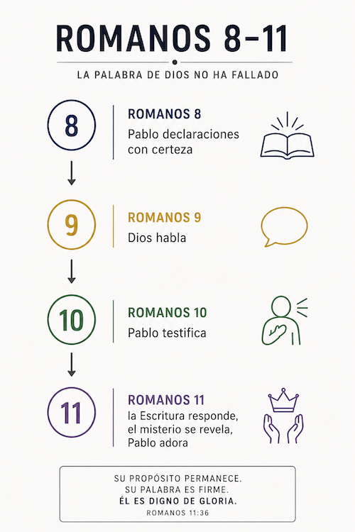

:::title
CONFIABLE
:::
:::subtitle
Viviendo a la luz de una palabra firme
:::
# Introducción

## Contexto

### Introducción a Romanos 9–16

Romanos 8 termina con algunas de las declaraciones más firmes de toda la carta.

Pablo habla con absoluta seguridad. Afirma que no hay condenación para los que están en Cristo Jesús. Afirma que Dios obra en todas las cosas para bien. Afirma que aquellos a quienes Dios justificó también los glorificó. Afirma que nada podrá separar al creyente del amor de Dios.

Las declaraciones son extraordinarias. Pero precisamente por ser tan firmes surge una pregunta inevitable:

¿Cómo sabemos que la palabra de Dios es realmente confiable?

Romanos 9–11 responde esa pregunta.

Pablo no responde mediante filosofía, especulación ni argumentos abstractos. Tampoco responde apelando a experiencias personales. Repetidamente vuelve a las Escrituras y dirige la atención a momentos donde Dios habló.

Dios habló a Rebeca.

Dios habló a Moisés.

Dios habló acerca de Faraón.

Dios habló por medio de Oseas.

Dios habló por medio de Isaías.

Dios habló por medio de David.

Una y otra vez Pablo cita palabras pronunciadas por Dios mucho antes de que los acontecimientos ocurrieran.

Luego observa la historia.

Siglos pasan.

Las circunstancias cambian.

Las generaciones vienen y van.

Sin embargo, la palabra pronunciada por Dios permanece en pie.

Por eso Romanos 9 comienza con una afirmación decisiva:

> «No es que la palabra de Dios haya fallado». Romanos 9:6

A lo largo de Romanos 9–11, Israel funciona como el escenario histórico donde esa fidelidad puede observarse. Pablo sigue el hilo de la historia y muestra repetidamente que Dios continúa actuando de acuerdo con lo que había dicho.

Cuando llega Romanos 12, la discusión cambia de dirección.

Después de demostrar que la palabra de Dios permanece firme, Pablo introduce una respuesta apropiada:

> «Por tanto...»

La exhortación práctica de Romanos 12–16 descansa sobre la certeza de que Dios es fiel a su palabra.

Por eso los creyentes pueden presentarse a Dios.

Por eso pueden vivir en amor.

Por eso pueden recibir a otros.

Por eso pueden caminar en obediencia.

No están respondiendo a una posibilidad incierta, sino a una realidad que Dios mismo ha establecido.

Romanos 9–11 muestra una palabra firme.

Romanos 12–16 muestra una vida vivida a la luz de esa palabra firme.

##### Romanos 8 termina con algunas de las declaraciones más contundentes de toda la carta.

###### Pablo declara con confianza:
- No hay condenación para los que están en Cristo Jesús.
- Los creyentes son hijos y herederos de Dios.
- La gloria futura es presentada como una certeza.
- Dios obra todas las cosas para bien.

##### Los que Dios llamó, justificó y glorificó aparecen como parte de un propósito que no fracasa.

##### Ninguna acusación puede prevalecer.

##### Ninguna condenación puede permanecer.

##### Nada puede separar al creyente del amor de Dios en Cristo Jesús.

##### Estas afirmaciones son extraordinarias.

##### Pero precisamente por eso surge una pregunta inevitable.

##### ¿Puede confiarse realmente en una palabra tan absoluta?

##### Romanos 9–11 responde a esa pregunta.

##### La dificultad aparece cuando Pablo considera la situación de Israel. Si Dios hizo promesas a Israel y la historia parece mostrar tropiezo y rechazo, ¿ha fallado la palabra de Dios?

##### Pablo responde que no.

##### A lo largo de Romanos 9–11 demuestra que Dios continúa actuando conforme a Su propósito. La situación presente de Israel no constituye una falla de la palabra de Dios. Por el contrario, confirma que Dios sigue cumpliendo lo que ha dicho.

##### Por eso la confianza de Romanos 8 permanece intacta.

##### Lo que Dios declaró no era una esperanza frágil ni una promesa incierta.

##### La palabra de Dios permanece firme.

> Romanos 8 Pablo declaraciones con certeza

##### Por esa razón Romanos 12 comienza con un:
> *Por tanto...*

##### Las exhortaciones que siguen no buscan producir una nueva realidad.

##### Son la respuesta apropiada a una realidad que Dios ya ha establecido.

##### Por eso Pablo llama a los creyentes a presentarse a Dios, vivir con una mente renovada, amar a los demás, buscar la paz, edificarse mutuamente y caminar en obediencia.

##### La carta concluye mostrando que el mismo evangelio que estableció a judíos y gentiles en un solo pueblo continúa extendiéndose a las naciones.

##### Finalmente, Pablo termina donde comenzó: con Dios mismo.

##### El Dios que prometió, actuó y sostuvo Su propósito es también poderoso para afirmar a Su pueblo conforme al evangelio.

##### Así, Romanos 9–16 defiende la confiabilidad de la palabra de Dios y muestra cómo debe vivir el pueblo que descansa en ella.

# ROMANOS 9:1–11:36 LA PALABRA DE DIOS NO HA FALLADO

### Una observación importante para Romanos 9–11

A medida que avanzamos por Romanos 9–11, observaremos algo repetidamente:

Pablo responde mediante citas de las Escrituras.

Con frecuencia, antes de preguntarnos qué significa una cita, conviene preguntarnos:

- ¿Quién está hablando?
- ¿A quién está hablando?
- ¿Por qué Pablo cita estas palabras aquí?

A lo largo de esta sección aparecen muchas voces:

#### Romanos 9

- Romanos 9:12 — Dios habla a Rebeca
- Romanos 9:13 — Dios habla en Malaquías
- Romanos 9:15 — Dios habla a Moisés
- Romanos 9:17 — Dios habla a Faraón
- Romanos 9:25–26 — Dios habla en Oseas
- Romanos 9:27–29 — Isaías habla acerca de Israel

#### Romanos 10

- Romanos 10:5 — Moisés escribe
- Romanos 10:6–8 — Moisés sigue hablando
- Romanos 10:11 — La Escritura habla
- Romanos 10:16 — Isaías habla
- Romanos 10:19 — Moisés habla
- Romanos 10:20–21 — Isaías habla

#### Romanos 11

- Romanos 11:2–4 — Dios habla a Elías
- Romanos 11:8 — La Escritura habla
- Romanos 11:26–27 — Isaías habla
- Romanos 11:34–35 — Isaías y Job hablan

##### Observación

Pablo no construye su argumento principalmente mediante explicaciones nuevas.

Una y otra vez dirige la atención a palabras ya pronunciadas en las Escrituras.

Por eso, para seguir el argumento de Romanos 9–11, es importante identificar quién habla, en qué contexto habla y por qué Pablo trae esa cita al desarrollo de su argumento.

## Romanos 9:1–5 — Pablo introduce a la nación de Israel en la conversación

### Romanos 9:1
Digo la verdad en Cristo, no miento, dándome testimonio mi conciencia en el Espíritu Santo,

#### Digo la verdad en Cristo, no miento,
##### Pablo afirma explícitamente la veracidad de lo que va a decir.

###### El texto refuerza esta afirmación de dos maneras:
- “Digo la verdad”
- “No miento”

###### Pablo comienza esta sección estableciendo la confiabilidad de su testimonio.

#### dándome testimonio mi conciencia en el Espíritu Santo,
##### El texto añade un testigo a la declaración de Pablo.

###### Pablo no solamente afirma decir la verdad.

###### También declara que su conciencia da testimonio de ello.

###### La declaración queda enmarcada “en el Espíritu Santo”.

### Romanos 9:2
de que tengo gran tristeza y continuo dolor en mi corazón.

#### de que tengo gran tristeza y continuo dolor en mi corazón.
##### Pablo declara una carga personal intensa.

###### El texto describe esa carga con dos expresiones:
- “gran tristeza”
- “continuo dolor”

###### La tristeza no aparece como algo momentáneo.

###### Pablo la presenta como una realidad permanente.

###### El dolor es descrito como algo interno:
> *en mi corazón*

### Romanos 9:3
Porque desearía yo mismo ser anatema, separado de Cristo por amor a mis hermanos, mis parientes según la carne.

#### Porque desearía yo mismo ser anatema,
##### Pablo explica la razón de la tristeza mencionada en el versículo anterior.

###### El deseo expresado aquí representa el punto más intenso de la carga descrita en 9:2.

###### El texto presenta un deseo llevado al extremo.

#### separado de Cristo por amor a mis hermanos,
##### Pablo relaciona ese deseo con otras personas.

###### El foco no está en sí mismo.

###### El deseo es expresado en favor de sus hermanos.

#### mis parientes según la carne.
##### El texto identifica específicamente a quiénes se refiere Pablo.

###### No habla de personas en general.

###### Habla de sus parientes según la carne.

###### El versículo siguiente identificará formalmente a este grupo como israelitas.

### Romanos 9:4
Porque son israelitas, a quienes pertenece la adopción como hijos, y la gloria, los pactos, la promulgación de la ley, el culto y las promesas,

#### Porque son israelitas,
##### Pablo identifica explícitamente al grupo mencionado en los versículos anteriores.

###### En 9:3 habló de:
> *mis parientes según la carne*

###### Ahora los identifica como:
> *israelitas*

#### a quienes pertenece la adopción como hijos,
##### Pablo comienza un inventario de cosas asociadas con Israel.

###### La adopción aparece como el primer elemento de la lista.

#### y la gloria,
##### La gloria aparece como una pertenencia adicional de Israel.

###### Pablo continúa ampliando el inventario.

#### los pactos,
##### Los pactos forman parte de aquello que Pablo asocia con Israel.

###### El texto continúa acumulando elementos relacionados con este pueblo.

#### la promulgación de la ley,
##### Pablo incluye la ley dentro del inventario.

###### La lista sigue creciendo.

#### el culto y las promesas,
##### El culto y las promesas completan esta parte del inventario.

###### El énfasis no está todavía en explicar cada elemento.

###### El énfasis está en mostrar todo lo que está asociado con Israel.

### Romanos 9:5
de quienes son los patriarcas, y de quienes, según la carne, procede el Cristo, el cual está sobre todas las cosas, Dios bendito por los siglos. Amén.

#### de quienes son los patriarcas,
##### Pablo continúa el inventario iniciado en el versículo anterior.

###### Los patriarcas son presentados como parte de la herencia histórica de Israel.

#### y de quienes, según la carne,
##### La expresión:
> “según la carne”
###### conecta con el lenguaje utilizado anteriormente en 9:3.

###### El texto continúa describiendo una relación de linaje y descendencia.

#### procede el Cristo,
##### El inventario alcanza su punto más alto.

###### Pablo afirma que el Cristo procede de Israel según la carne.

###### El grupo descrito en estos versículos está directamente relacionado con la venida del Cristo.

#### el cual está sobre todas las cosas, Dios bendito por los siglos. Amén.
##### El versículo concluye con una declaración de exaltación y bendición.

###### La atención se desplaza del inventario hacia la grandeza de Cristo.

###### La sección termina con una expresión de alabanza:
> “Amén”.

## Romanos 9:6–29 — Dios habla sobre Israel

### Romanos 9:6
Pero no es que la palabra de Dios haya fallado. Porque no todos los descendientes de Israel son Israel;

#### Pero no es que la palabra de Dios haya fallado.
##### Pablo niega explícitamente una conclusión posible.

###### Después de mencionar a Israel, los pactos, las promesas, los patriarcas y el Cristo (9:4–5), el texto responde a una pregunta fundamental:
> ¿Ha fallado la palabra de Dios?

###### La respuesta es clara:
> *No es que la palabra de Dios haya fallado*.

##### Esta declaración funciona como una afirmación central para la sección que sigue.

##### En Romanos 9, Pablo no solo habla de Dios. Una gran parte del capítulo consiste en Dios hablando a través de las Escrituras.

###### Por ejemplo:
- 9:7 «POR ISAAC SERÁ LLAMADA TU DESCENDENCIA»
- 9:9 «POR ESTE TIEMPO VOLVERÉ, Y SARA TENDRÁ UN HIJO»
- 9:12 «EL MAYOR SERVIRÁ AL MENOR»
- 9:13 «A JACOB AMÉ, PERO A ESAÚ ABORRECÍ»
- 9:15 «TENDRÉ MISERICORDIA DEL QUE YO TENGA MISERICORDIA...»
- 9:17 «PARA ESTO MISMO TE HE LEVANTADO...»

###### Dios continúa hablando más sobre Israel:
- 9:25 «LLAMARÉ PUEBLO MÍO AL QUE NO ERA MI PUEBLO...»
- 9:26 «SERÁN LLAMADOS HIJOS DEL DIOS VIVIENTE»
- 9:33 «HE AQUÍ, PONGO EN SIÓN PIEDRA DE TROPIEZO Y ROCA DE ESCÁNDALO, Y EL QUE CREA EN ÉL NO SERÁ AVERGONZADO»

##### Note lo que está sucediendo.
###### Romanos 9 está dominado por:
- Dios dijo...
- Dios dijo...
- Dios dijo...
- Dios dijo...
- Dios dijo...

###### ¿Por qué puede afirmar esto?

#### Porque no todos los descendientes de Israel son Israel;
##### Pablo comienza a explicar por qué la palabra de Dios no ha fallado.

###### La explicación inicia con una distinción.

###### El texto diferencia entre:
- los descendientes de Israel
- e Israel

##### El lector no puede asumir automáticamente que ambas expresiones significan exactamente lo mismo.

###### Pablo introduce una distinción que desarrollará en los versículos siguientes.

### Romanos 9:7
ni son todos hijos por ser descendientes de Abraham, sino que «POR ISAAC SERÁ LLAMADA TU DESCENDENCIA».

#### ni son todos hijos por ser descendientes de Abraham,
##### Pablo continúa desarrollando la misma distinción.

###### No toda descendencia de Abraham es identificada automáticamente como “hijos”.

###### El texto vuelve a diferenciar entre categorías que podrían parecer equivalentes a primera vista.

##### La explicación avanza mediante una nueva distinción.
- descendencia de Abraham
- hijos

#### sino que «POR ISAAC SERÁ LLAMADA TU DESCENDENCIA».
##### Después de negar una conclusión, Pablo presenta una evidencia tomada de las Escrituras. 

- Fué Dios mismo que afirmó a Abraham que por Isaac sería su descendencia. Génesis 21:12

###### La cita muestra que la descendencia no es definida simplemente por procedencia física.

###### Pablo dirige la atención a Isaac como ejemplo dentro de su argumento.

###### A partir de este punto, Pablo comenzará a responder la pregunta de 9:6 apelando repetidamente a las Escrituras.

###### La explicación avanza mediante citas y ejemplos tomados de la historia de Israel.

### Romanos 9:8
Esto es, no son los hijos de la carne los que son hijos de Dios, sino que los hijos de la promesa son considerados como descendientes.

#### Esto es, no son los hijos de la carne los que son hijos de Dios,
##### Pablo explica con mayor claridad la distinción introducida en los versículos anteriores.

###### El contraste ahora es explícito:
- hijos de la carne
- hijos de Dios

##### El texto niega que la descendencia física, por sí sola, responda a la pregunta planteada en esta sección.

###### Pablo continúa desarrollando la distinción iniciada en 9:6–7.

#### sino que los hijos de la promesa son considerados como descendientes.
##### Pablo presenta la categoría que quiere destacar.

###### El contraste ya no gira alrededor de la carne, sino alrededor de la promesa.

##### Observación importante:
###### El texto no dice simplemente:
> “los hijos de la promesa son descendientes”.

###### Dice:
> “son considerados como descendientes”.

###### Pablo introduce la idea de que la descendencia es definida de acuerdo con la promesa presentada por Dios.

### Romanos 9:9
Porque la palabra de promesa es esta: «POR ESTE TIEMPO VOLVERÉ, Y SARA TENDRÁ UN HIJO».

#### Porque la palabra de promesa es esta:
##### Pablo fundamenta la afirmación anterior mediante una cita de las Escrituras.

###### La promesa deja de ser una idea general.

###### El texto dirige la atención a una promesa específica.

###### Pablo continúa respondiendo a la pregunta de 9:6 apelando a las palabras de Dios.

#### «POR ESTE TIEMPO VOLVERÉ,
##### La promesa incluye un tiempo señalado.

###### El cumplimiento no queda indefinido.

###### Dios anuncia una acción futura en un momento determinado.

#### Y SARA TENDRÁ UN HIJO».
##### La promesa culmina con el nacimiento de un hijo.

###### El ejemplo presentado por Pablo no gira alrededor de la capacidad humana.

###### Gira alrededor de una promesa dada por Dios.

##### Observación desarrollacional:
###### Pablo continúa mostrando que la descendencia relevante para su argumento está relacionada con la promesa de Dios.

###### La historia de Isaac es presentada como evidencia para apoyar la afirmación de 9:6.

### Romanos 9:10
Y no solo esto, sino que también Rebeca concibió mellizos de uno, nuestro padre Isaac.

#### Y no solo esto,
##### Pablo añade un segundo ejemplo.

###### El caso de Isaac no es presentado como un caso aislado.

###### El argumento continúa con otro ejemplo tomado de la misma línea familiar.

#### sino que también Rebeca concibió mellizos de uno,
##### El texto dirige ahora la atención a Rebeca.

###### Pablo destaca que ambos hijos proceden del mismo embarazo.

###### El énfasis recae sobre el origen común de los mellizos.

#### nuestro padre Isaac.
##### Pablo identifica a Isaac como el padre de ambos hijos.

###### El ejemplo permanece dentro de la misma línea familiar introducida anteriormente.

### Romanos 9:11
Porque cuando aún los mellizos no habían nacido, y no habían hecho nada, ni bueno ni malo, para que el propósito de Dios conforme a Su elección permaneciera, no por las obras, sino por Aquel que llama,

#### Porque cuando aún los mellizos no habían nacido,
##### Pablo dirige la atención al momento anterior al nacimiento.

###### El texto enfatiza que lo que sigue ocurre antes de que los niños nazcan.

#### y no habían hecho nada, ni bueno ni malo,
##### Pablo añade una segunda observación sobre ese momento.
###### Los mellizos aún no habían realizado ninguna acción.

###### El texto menciona ambos extremos:
- bueno
- malo

###### El énfasis continúa colocado antes del nacimiento y antes de cualquier acción realizada por los mellizos.

#### para que el propósito de Dios conforme a Su elección permaneciera,
##### Pablo declara la finalidad de lo que acaba de describir.

###### El foco del versículo se desplaza hacia:
> *el propósito de Dios*

###### El texto afirma que ese propósito permanece.

##### Observación importante:
###### Esta es la primera vez que aparece la expresión:
> *el propósito de Dios conforme a Su elección*.

###### Pablo la desarrollará en los versículos siguientes.

#### no por las obras,
##### Pablo niega una base específica.

###### Las obras son explícitamente excluidas de la explicación que está desarrollando.

#### sino por Aquel que llama,
##### Pablo presenta el contraste.

###### El énfasis deja de estar en las obras.

###### El énfasis pasa a Aquel que llama.

##### Observación desarrollacional:
###### A lo largo de Romanos 9, Pablo continúa desplazando la atención:
- de la carne a la promesa
- de las obras al llamamiento

###### El argumento sigue avanzando mediante contrastes.

### Romanos 9:12

se le dijo a Rebeca: «EL MAYOR SERVIRÁ AL MENOR».

#### se le dijo a Rebeca:

##### Pablo continúa desarrollando el caso de Rebeca.

###### La explicación no se apoya en acciones realizadas por los mellizos.

###### El texto dirige la atención a algo que fue dicho a Rebeca.

###### Después de hablar del propósito de Dios y de Aquel que llama (Romanos 9:11), Pablo introduce palabras dirigidas a Rebeca.

###### El argumento continúa avanzando mediante lo que Dios dijo.

#### «EL MAYOR SERVIRÁ AL MENOR».

##### Pablo cita palabras que fueron dichas a Rebeca antes del nacimiento de los niños.

###### Para entender el contexto de esta declaración, es necesario volver a Génesis 25:23:

> Y el SEÑOR le dijo: «Dos naciones hay en tu seno,
>  Y dos pueblos se dividirán desde tus entrañas;
>  Un pueblo será más fuerte que el otro,
>  Y el mayor servirá al menor». Génesis 25:23

###### La declaración incluye:

- dos naciones
- dos pueblos
- un pueblo más fuerte que el otro
- el mayor sirviendo al menor

###### Pablo cita la última línea de una declaración que originalmente hablaba de:

- dos naciones
- dos pueblos

###### ¿A qué pueblos se refiere? Génesis posteriormente los identifica: 

- Jacob representa la nación de Israel. Génesis 32:28, 35:10
- Esau representa la nación de Edom. Génesis 25:30, 36:1, 8, 19

Esto hace notar que la declaración dada a Rebeca en Génesis 25:23 habla de Israel y Edom, además de mencionar a los dos hijos.

##### Observación importante:

###### La declaración fue dada antes del nacimiento de los hijos.

###### Pablo sigue construyendo su argumento mediante lo que Dios dijo a Rebeca. 

### Romanos 9:13
Tal como está escrito: «A JACOB AMÉ, PERO A ESAÚ ABORRECÍ».

#### Tal como está escrito:

##### Pablo ahora cita una declaración escrita mucho después del nacimiento de Jacob y Esaú.

###### Romanos 9:12 cita lo que Dios dijo a Rebeca antes del nacimiento de los mellizos.

###### Romanos 9:13 cita Malaquías, siglos después, cuando Jacob y Esaú ya están vinculados con pueblos y naciones.

###### Génesis 25:23 ya había hablado de *dos naciones* y *dos pueblos*.

###### Malaquías 1:2–4 continúa ese mismo marco nacional: Jacob/Israel y Esaú/Edom.

#### «A JACOB AMÉ, PERO A ESAÚ ABORRECÍ».

##### La cita presenta un contraste entre Jacob y Esaú.

###### Pero el contexto de Malaquías muestra que la declaración no aparece aislada.

###### Malaquías habla de Israel y Edom, no solamente de dos niños antes de nacer.

###### Malaquías 1:2–3 dice: «Yo los he amado», dice el SEÑOR. Pero ustedes dicen: «¿En qué nos has amado?». «¿No era Esaú hermano de Jacob?», declara el SEÑOR. «Sin embargo, Yo amé a Jacob, y aborrecí a Esaú...».

##### Observación importante:

###### Romanos 9:12 mira hacia Génesis 25:23.

###### Romanos 9:13 mira hacia Malaquías 1:2–4.

###### Ambos textos mantienen juntos a Jacob/Esaú y a los pueblos relacionados con ellos.

##### Observación desarrollacional:
###### Pablo no está sacando una frase suelta.

###### Está citando una línea que pertenece a una historia más amplia.

###### En Génesis 25:23, Dios habla de dos naciones y dos pueblos.

###### En Malaquías 1:2–4, la comparación aparece dentro de la relación entre Israel y Edom.

###### Esto mantiene el argumento conectado con la pregunta de Romanos 9:6 acerca de Israel y la palabra de Dios.

### Romanos 9:14
¿Qué diremos entonces? ¿Qué hay injusticia en Dios? ¡De ningún modo!

#### ¿Qué diremos entonces?
##### Pablo introduce una objeción.

###### La pregunta surge a partir de lo que acaba de afirmar en los versículos anteriores.

###### El texto se detiene para considerar una posible reacción del lector.

#### ¿Qué hay injusticia en Dios?
##### La objeción es expresada de manera directa.

###### La pregunta no gira alrededor de Isaac, Rebeca o Jacob.

###### La pregunta gira alrededor de Dios mismo.

###### El tema planteado es la justicia de Dios.

###### Pablo no evita la objeción.

###### El texto la presenta explícitamente antes de responderla.

#### ¡De ningún modo!
##### Pablo rechaza inmediatamente la objeción.

###### La respuesta es breve y contundente.

###### El texto no deja abierta la posibilidad de que exista injusticia en Dios.

### Romanos 9:15
Porque Él dice a Moisés: «TENDRÉ MISERICORDIA DEL QUE YO TENGA MISERICORDIA, Y TENDRÉ COMPASIÓN DEL QUE YO TENGA COMPASIÓN».

#### Porque Él dice a Moisés:
##### Pablo vuelve a responder mediante palabras pronunciadas por Dios.

###### La respuesta continúa avanzando por medio de las Escrituras.

###### Después de citar lo dicho a Rebeca (Romanos 9:12) y lo escrito en Malaquías (Romanos 9:13), Pablo ahora dirige la atención a una declaración dada a Moisés.

###### La cita proviene de Éxodo 33:19.

###### Pablo sigue respondiendo a la afirmación de Romanos 9:6 apelando a cosas que Dios dijo en distintos momentos de la historia de Israel.

#### «TENDRÉ MISERICORDIA DEL QUE YO TENGA MISERICORDIA,
##### Estas palabras fueron pronunciadas después del episodio del becerro de oro.

###### Israel ya había salido de Egipto.

###### Israel ya había quebrantado el pacto al hacerse un becerro de oro.

###### Moisés estaba intercediendo por el pueblo cuando Dios pronunció esta declaración.

###### La cita no proviene de una situación hipotética, sino de un momento concreto de la historia de Israel.

##### Observación importante:
###### Una vez más, Pablo cita palabras pronunciadas por Dios antes de que la historia siguiera desarrollándose.

###### Primero Dios habló.

###### Después la historia continuó.

#### Y TENDRÉ COMPASIÓN DEL QUE YO TENGA COMPASIÓN».
##### La segunda línea completa la declaración dada por Dios a Moisés.

###### Misericordia y compasión aparecen juntas como parte de una misma respuesta.

###### Pablo cita la declaración completa tal como aparece en las Escrituras.

##### Observación desarrollacional:
###### Romanos 9 continúa acumulando testimonios provenientes de distintos períodos de la historia de Israel.

###### Dios habló a Rebeca. (Génesis 25:19-23)

###### Dios habló por medio de Malaquías. (Malaquías 1:2–4)

###### Dios habló a Moisés. (Éxodo 33:12-23)

###### En cada caso, Pablo dirige la atención a palabras pronunciadas por Dios y al desarrollo posterior de la historia.

###### El argumento sigue avanzando para mostrar que la palabra de Dios no ha fallado.

### Romanos 9:16
Así que no depende del que quiere ni del que corre, sino de Dios que tiene misericordia.

#### Así que no depende del que quiere
##### Pablo presenta una conclusión basada en la declaración citada en el versículo anterior.

###### El versículo conecta directamente con las palabras que Dios dijo a Moisés.

###### El énfasis no recae sobre el deseo humano.

###### La atención permanece en lo que Dios declaró.

##### Observación importante:
###### En las citas anteriores, Pablo ha mostrado declaraciones pronunciadas por Dios antes de que los acontecimientos ocurrieran.

###### Después la historia avanzó, pero la palabra pronunciada por Dios permaneció firme.

#### ni del que corre,
##### Pablo añade una segunda negación.

###### El énfasis tampoco recae en el esfuerzo humano.

###### La explicación no es atribuida al deseo ni al esfuerzo.

###### Pablo continúa alejando la atención de las acciones humanas como base de su argumento.

#### sino de Dios que tiene misericordia.
##### El contraste dirige toda la atención hacia Dios.

###### Después de negar dos bases humanas, Pablo presenta una base positiva.

###### El énfasis recae en Dios y en Su misericordia.

##### Observación desarrollacional:
###### La conclusión retoma directamente las palabras citadas en Romanos 9:15:
> «Tendré misericordia del que yo tenga misericordia».

###### Pablo sigue respondiendo mediante declaraciones pronunciadas por Dios.

###### A lo largo del capítulo, el argumento continúa avanzando mediante palabras que Dios dijo y que permanecen firmes a través del desarrollo de la historia.

### Romanos 9:17
Porque la Escritura dice a Faraón: «PARA ESTO MISMO TE HE LEVANTADO, PARA DEMOSTRAR MI PODER EN TI, Y PARA QUE MI NOMBRE SEA PROCLAMADO POR TODA LA TIERRA».

#### Porque la Escritura dice a Faraón:
##### Pablo introduce otro testimonio tomado de las Escrituras.

###### Después de citar palabras dirigidas a Rebeca y a Moisés, ahora dirige la atención a palabras dirigidas a Faraón.

###### La cita proviene del relato del éxodo de Israel desde Egipto.

###### Una vez más, el argumento avanza mediante algo que Dios dijo.

###### La Escritura es presentada hablando a Faraón porque la cita recoge palabras pronunciadas por Dios.

#### «PARA ESTO MISMO TE HE LEVANTADO,
##### La cita presenta una declaración hecha por Dios acerca de Faraón.

###### Dios habla antes de que la historia llegue a su desenlace.

###### La atención se dirige al propósito expresado en la declaración.

###### Pablo continúa mostrando palabras pronunciadas por Dios dentro de la historia de Israel.

#### PARA DEMOSTRAR MI PODER EN TI,
##### El primer propósito señalado en la cita es la manifestación del poder de Dios.

###### El énfasis recae en:
> «mi poder»

###### La atención permanece en lo que Dios declara acerca de lo que hará.

#### Y PARA QUE MI NOMBRE SEA PROCLAMADO
##### La cita añade un segundo propósito.

###### El énfasis se desplaza hacia el nombre de Dios.

###### El propósito no termina en Faraón mismo.

###### La declaración mira más allá del acontecimiento inmediato.

#### POR TODA LA TIERRA».
##### El alcance del propósito se amplía.

###### La proclamación no queda limitada a Egipto.

###### La declaración apunta a toda la tierra.

##### Observación importante:
###### Pablo continúa respondiendo mediante palabras pronunciadas por Dios.

###### Primero Dios habló.

###### Después la historia avanzó.

###### El éxodo terminó mostrando el poder de Dios y haciendo conocido Su nombre.

##### Observación desarrollacional:
###### Rebeca recibió una declaración antes del nacimiento de los hijos.
###### Moisés recibió una declaración durante la crisis del becerro de oro.
###### Faraón recibió una declaración antes del desenlace del éxodo.

###### En cada caso, Pablo dirige la atención a palabras pronunciadas por Dios y al desarrollo posterior de la historia.

###### El argumento continúa avanzando para mostrar que la palabra de Dios no ha fallado.

### Romanos 9:18
Así que Dios tiene misericordia del que quiere, y al que quiere endurece.

#### Así que Dios tiene misericordia,
##### Pablo presenta una conclusión.

###### Después de citar palabras dirigidas a Rebeca, a Moisés y a Faraón, ahora resume parte de su argumento con sus propias palabras.

###### El versículo recoge los ejemplos anteriores y extrae una conclusión de ellos.

###### La misericordia continúa ocupando un lugar central en la discusión.

###### La conclusión retoma directamente el tema introducido en Romanos 9:15–16:
> «Tendré misericordia...»
> «Dios tiene misericordia...»

###### Pablo pasa de la cita a la conclusión.

##### Observación importante:
###### A lo largo de esta sección, Pablo ha dirigido repetidamente la atención a palabras pronunciadas por Dios.

###### Después observa cómo la historia se desarrolla.

###### Ahora resume lo observado en una conclusión.

#### del que quiere y al que quiere endurece.
##### La conclusión presenta dos acciones contrastadas.

###### El texto afirma:
* Dios tiene misericordia
* Dios endurece

###### Ambas acciones aparecen juntas dentro de la misma conclusión.

###### Pablo no está citando una nueva declaración.

###### Está resumiendo la evidencia presentada hasta este punto.

##### Observación desarrollacional:
###### La tensión del argumento aumenta.

###### Pablo ya no está simplemente citando lo que Dios dijo.

###### Ahora está extrayendo una conclusión de los ejemplos que ha presentado.

###### Esta conclusión prepara directamente la objeción que aparecerá en el versículo siguiente.

### Romanos 9:19
Me dirás entonces: «¿Por qué, pues, todavía reprocha Dios? Porque ¿quién resiste a Su voluntad?».

#### Me dirás entonces:
##### Pablo introduce una nueva objeción.

###### La pregunta surge como reacción a lo que acaba de afirmar en el versículo anterior.

###### El texto vuelve a presentar la voz de un interlocutor.

###### Romanos 9 alterna entre:
* afirmación
* objeción
* respuesta

###### La discusión continúa avanzando mediante ese patrón.

#### «¿Por qué, pues, todavía reprocha Dios?»
##### La objeción se formula directamente.

###### La pregunta ya no gira alrededor de Moisés o Faraón.

###### Ahora se enfoca en el hecho de que Dios reprocha.

##### Observación importante:
###### Pablo no evita la pregunta.
###### La presenta de manera abierta antes de responderla.

#### «Porque ¿quién resiste a Su voluntad?».
##### La objeción continúa desarrollándose.

###### El interlocutor conecta el reproche de Dios con la voluntad de Dios.

###### La pregunta plantea una tensión que exige respuesta.

##### Observación desarrollacional:
###### El nivel de la discusión ha cambiado.
###### El argumento ya no gira solamente alrededor de ejemplos tomados de la historia de Israel.

###### Ahora la objeción se dirige directamente a la relación entre la voluntad de Dios y la responsabilidad humana.

###### Pablo responderá a esta objeción en los versículos siguientes.

### Romanos 9:20

Al contrario, ¿quién eres tú, oh hombre, que le contestas a Dios? ¿Dirá acaso el objeto modelado al que lo modela: «¿Por qué me hiciste así?»?

#### Al contrario,

##### Pablo responde directamente a la objeción planteada en el versículo anterior.

###### Romanos 9:19 preguntó:

> «¿Por qué, pues, todavía reprocha Dios? Porque ¿quién resiste a Su voluntad?»

###### Ahora Pablo comienza su respuesta.

#### ¿quién eres tú, oh hombre,

##### Pablo dirige la atención hacia la persona que formula la objeción.

###### El énfasis recae sobre:

> «oh hombre»

###### La pregunta establece un contraste entre el ser humano y Dios.

#### que le contestas a Dios?

##### Pablo identifica el verdadero destinatario de la objeción.

###### La discusión ya no gira solamente alrededor de Faraón, Moisés o Israel.

###### La pregunta es presentada como una respuesta dirigida a Dios mismo.

##### Observación importante:

###### A lo largo de Romanos 9, Pablo ha presentado repetidamente palabras pronunciadas por Dios.

- Dios habla a Rebeca
- Dios habla en Malaquías
- Dios habla a Moisés
- Dios habla a Faraón

###### Ahora la objeción es presentada como una contestación a Dios.

#### ¿Dirá acaso el objeto modelado al que lo modela:

##### Pablo introduce una ilustración.

###### La imagen compara:

- el que modela
- lo que es modelado

###### La ilustración preparará el desarrollo del siguiente versículo.

#### «¿Por qué me hiciste así?»?

##### La pregunta expresa el contenido de la objeción.

###### El objeto modelado cuestiona la acción de quien lo formó.

##### Observación desarrollacional:

###### Pablo no responde todavía desarrollando una explicación extensa.

###### Primero introduce la ilustración del alfarero y el barro.

###### El siguiente versículo continuará desarrollando esta imagen.

### Romanos 9:21

¿O no tiene el alfarero derecho sobre el barro de hacer de la misma masa un vaso para uso honorable y otro para uso ordinario?

#### ¿O no tiene el alfarero derecho sobre el barro
##### Pablo responde mediante una ilustración.

###### La imagen presenta dos elementos:
* el alfarero
* el barro

##### Observación importante:
###### La pregunta está formulada para que la respuesta resulte evidente.
###### El alfarero tiene autoridad sobre el barro.

###### Pablo continúa respondiendo a la objeción planteada en 9:19.

###### La respuesta avanza mediante una ilustración sencilla antes de pasar nuevamente a Dios.

#### de hacer de la misma masa un vaso
##### Pablo continúa desarrollando la ilustración.

###### La atención se dirige a una misma masa de barro.

###### El énfasis recae sobre el material compartido.

#### para uso honorable y otro para uso ordinario?
##### La ilustración culmina con dos vasos diferentes.

###### Ambos proceden de la misma masa.

###### Sin embargo, son presentados con usos distintos.

##### Observación desarrollacional:
###### La ilustración deja abierta una pregunta.

###### Pablo responderá mediante la expresión:
> “¿Y qué, si Dios...?”

### Romanos 9:22
¿Y qué, si Dios, aunque dispuesto a demostrar Su ira y hacer notorio Su poder, soportó con mucha paciencia a los vasos de ira preparados para destrucción?

#### ¿Y qué, si Dios,
##### Pablo comienza la aplicación de la ilustración.

###### La pregunta iniciada en el versículo anterior continúa desarrollándose.

###### El pensamiento todavía no está completo.

##### Observación importante:
###### El versículo comienza con una pregunta.
###### La respuesta no llegará hasta que Pablo complete la idea.

#### aunque dispuesto a demostrar Su ira y hacer notorio Su poder,
##### Pablo menciona dos propósitos.

###### El texto destaca:
* Su ira
* Su poder

###### Ambos aparecen como parte de la misma declaración.

#### soportó con mucha paciencia
##### El versículo añade un elemento inesperado.

###### Junto a la ira y al poder aparece la paciencia.

###### El texto afirma que Dios soportó con mucha paciencia.

##### Observación importante:
###### La paciencia ocupa un lugar central en la acción descrita.
###### El énfasis no recae únicamente en la ira.

#### a los vasos de ira preparados para destrucción?
##### Pablo identifica a quienes fueron soportados con paciencia.

###### El texto los llama:
> “vasos de ira”

###### Además los describe como:
> “preparados para destrucción”

##### Qué NO está haciendo el texto todavía:
###### Pablo aún no ha explicado el propósito completo de esta acción.

###### La pregunta iniciada en 9:22 continúa abierta.

###### El pensamiento seguirá desarrollándose en 9:23.

### Romanos 9:23
Lo hizo para dar a conocer las riquezas de Su gloria sobre los vasos de misericordia, que de antemano Él preparó para gloria,

#### Lo hizo para dar a conocer las riquezas de Su gloria
##### Pablo completa el propósito iniciado en el versículo anterior.

###### La pregunta abierta en 9:22 ahora recibe una respuesta.

###### El énfasis se dirige hacia:
> “las riquezas de Su gloria”

###### El pensamiento iniciado con:
> “¿Y qué, si Dios...?”

###### continúa desarrollándose y alcanza aquí uno de sus propósitos declarados.

#### sobre los vasos de misericordia,
##### Pablo introduce un segundo grupo.

###### En el versículo anterior aparecieron:
> “vasos de ira”

###### Ahora aparecen:
> “vasos de misericordia”

##### Observación importante:
###### El contraste entre ambos grupos forma parte del desarrollo del argumento.

#### que de antemano Él preparó para gloria,
##### Pablo añade una descripción de los vasos de misericordia.

###### El énfasis recae en dos elementos:
* Dios los preparó de antemano
* para gloria

##### Observación desarrollacional:
###### El versículo todavía no identifica quiénes son estos vasos de misericordia.

###### Esa identificación llegará inmediatamente después.

### Romanos 9:24
es decir, nosotros, a quienes también llamó, no solo de entre los judíos, sino también de entre los gentiles.

#### es decir, nosotros,
##### Pablo identifica finalmente el grupo que viene describiendo.

###### El argumento pasa de ilustraciones y categorías generales a un referente concreto:
> “nosotros”

##### Observación importante:
###### Esta es una de las primeras veces en la sección donde Pablo se incluye explícitamente dentro del grupo descrito.

#### a quienes también llamó,
##### Pablo añade una característica adicional del grupo.

###### El tema del llamamiento reaparece dentro del argumento.

###### El grupo es identificado como aquellos a quienes Dios llamó.

###### El tema del llamamiento ya había aparecido anteriormente en la sección.

###### Pablo vuelve a retomarlo aquí.

#### no solo de entre los judíos,
##### Pablo comienza a describir la composición del grupo.

###### El grupo incluye judíos.

###### Pero la descripción no termina allí.

#### sino también de entre los gentiles.
##### Pablo completa la descripción.

###### El grupo incluye:
* judíos
* gentiles

##### Observación importante:
###### El “nosotros” descrito por Pablo está compuesto por ambos grupos.

###### Esta afirmación prepara las citas de Oseas e Isaías que seguirán inmediatamente después.

##### Observación desarrollacional:
###### Después de identificar al grupo, Pablo volverá a apelar a las Escrituras para mostrar que esta realidad ya había sido anunciada.

### Romanos 9:25
Como también dice en Oseas: «A LOS QUE NO ERAN MI PUEBLO, LLAMARÉ: “PUEBLO MÍO”, Y A LA QUE NO ERA AMADA: “AMADA mía”.

#### Como también dice en Oseas:
##### Pablo vuelve a apoyar su argumento mediante las Escrituras.

###### Después de hablar de judíos y gentiles (9:24), Pablo cita al profeta Oseas.

###### Pablo continúa respondiendo mediante testimonios tomados de las Escrituras.

###### El argumento sigue avanzando por medio de citas.

#### «A LOS QUE NO ERAN MI PUEBLO,
##### La cita comienza con una identidad negativa.

###### El grupo descrito es identificado como:
> “no eran mi pueblo”

##### Observación importante:
###### Pablo comienza la cita con una condición inicial.

###### La atención se centra en aquello que este grupo no era.

#### LLAMARÉ: “PUEBLO MÍO”,
##### La cita presenta un cambio de identidad.

###### El contraste es directo:
- no eran mi pueblo
- pueblo mío

##### Observación importante:
###### El verbo “llamaré” ocupa un lugar central en la cita.

###### El cambio es expresado mediante aquello que Dios dice.

#### Y A LA QUE NO ERA AMADA: “AMADA mía”.
##### Pablo añade un segundo ejemplo paralelo.

###### El mismo patrón vuelve a aparecer:
- no amada
- amada

##### Observación desarrollacional:
###### La cita presenta un movimiento repetido:
- una condición inicial
- una nueva identidad

###### Pablo utiliza esta cita para apoyar lo que acaba de afirmar en 9:24.

### Romanos 9:26
Y SUCEDERÁ QUE EN EL LUGAR DONDE SE LES DIJO: “USTEDES NO SON MI PUEBLO”, ALLÍ SERÁN LLAMADOS HIJOS DEL DIOS VIVIENTE».

#### Y SUCEDERÁ QUE EN EL LUGAR
##### Pablo continúa la cita de Oseas.

###### La evidencia tomada del profeta todavía no ha terminado.

###### El texto sigue desarrollando el mismo tema.

#### DONDE SE LES DIJO:
##### La cita recuerda una declaración anterior.

###### Primero hubo una palabra dirigida a este grupo.

###### Esa palabra será contrastada con otra declaración posterior.

#### “USTEDES NO SON MI PUEBLO”,
##### La condición inicial es repetida.

###### La cita vuelve a enfatizar la misma identidad negativa.

##### Observación importante:
###### Pablo refuerza el patrón presentado en el versículo anterior.

###### Primero aparece una negación.

#### ALLÍ SERÁN LLAMADOS HIJOS DEL DIOS VIVIENTE».
##### La cita culmina con una nueva identidad.

###### El contraste es completo:
- no son mi pueblo
- hijos del Dios viviente

###### El énfasis recae nuevamente en ser llamados.

###### La cita conecta naturalmente con Romanos 9:24:
> “a quienes llamó”
> “serán llamados”

##### Observación desarrollacional:
###### Después de identificar al grupo en 9:24, Pablo muestra que las Escrituras ya hablaban de una realidad como esta.

###### En el siguiente versículo cambiará de profeta.

###### Oseas dará paso a Isaías.

### Romanos 9:27
Isaías también exclama en cuanto a Israel: «AUNQUE EL NÚMERO DE LOS HIJOS DE ISRAEL SEA COMO LA ARENA DEL MAR, solo EL REMANENTE SERÁ SALVO;

#### Isaías también exclama en cuanto a Israel:
##### Pablo introduce una nueva cita de las Escrituras.

###### Después de citar a Oseas, ahora cita a Isaías.

###### El argumento continúa avanzando mediante testimonios tomados de las Escrituras.

###### El énfasis cambia de Oseas a Isaías, y de los gentiles a Israel.

#### «AUNQUE EL NÚMERO
##### La cita comienza destacando la gran cantidad de personas.

###### El énfasis inicial recae sobre el número.

#### DE LOS HIJOS DE ISRAEL SEA COMO LA ARENA DEL MAR,
##### Isaías utiliza una comparación para describir una multitud inmensa.

###### La imagen enfatiza una cantidad innumerable.

##### Observación importante:
###### La atención se dirige primero a la magnitud del pueblo.

###### Sin embargo, la cita todavía no ha llegado a su conclusión.

#### solo EL REMANENTE SERÁ SALVO;
##### La cita introduce un contraste inesperado.

###### Después de hablar de una multitud innumerable, Isaías dirige la atención hacia:
> “el remanente”

##### Observación importante:
###### La cita distingue entre:
- los hijos de Israel
- el remanente

##### Observación desarrollacional:
###### Esta distinción encaja con el argumento que Pablo viene desarrollando desde Romanos 9:6.

###### La cita de Isaías aporta una nueva evidencia para ese argumento.

### Romanos 9:28
PORQUE EL SEÑOR EJECUTARÁ SU PALABRA SOBRE LA TIERRA CABALMENTE Y CON BREVEDAD».

#### PORQUE EL SEÑOR EJECUTARÁ SU PALABRA
##### Isaías añade la razón de la declaración anterior.

###### El versículo comienza con:
> “Porque...”

###### La afirmación sobre el remanente es seguida por una explicación.

##### Observación importante:

###### El énfasis recae sobre la palabra del Señor.

###### El Señor hará aquello que ha dicho.

#### SOBRE LA TIERRA
##### La acción descrita es presentada dentro de la historia humana.

###### El cumplimiento no permanece como una idea abstracta.

###### La cita habla de algo que ocurre sobre la tierra.

#### CABALMENTE Y CON BREVEDAD».
##### Isaías describe la manera en que el Señor ejecutará Su palabra.

###### La acción será llevada a cabo plenamente.

###### La acción será llevada a cabo con brevedad.

###### La cita no solo afirma que el Señor actuará.

###### También enfatiza que cumplirá completamente Su palabra.

##### Observación desarrollacional:
###### Después de hablar del remanente, Isaías dirige la atención a la certeza del cumplimiento de la palabra del Señor.

###### El siguiente versículo añadirá una segunda cita de Isaías para reforzar el mismo argumento.

### Romanos 9:29
Y como Isaías predijo: «SI EL SEÑOR DE LOS EJÉRCITOS NO NOS HUBIERA DEJADO DESCENDENCIA, HUBIÉRAMOS LLEGADO A SER COMO SODOMA, Y HECHOS SEMEJANTES A GOMORRA».

#### Y como Isaías predijo:
##### Pablo añade una segunda cita de Isaías.

###### La cita anterior habló del remanente.

###### Esta nueva cita explica por qué existe un remanente.

###### Pablo continúa apoyando su argumento mediante las Escrituras.

###### Isaías sigue siendo el testigo principal en esta sección.

#### «SI EL SEÑOR DE LOS EJÉRCITOS
##### La cita comienza con una condición.

###### Todo lo que sigue depende de la acción del Señor.

##### Observación importante:
###### El énfasis recae en lo que el Señor hizo.

###### La explicación no comienza con el pueblo.

###### Comienza con el Señor.

#### NO NOS HUBIERA DEJADO DESCENDENCIA,
##### Isaías identifica aquello que evitó un resultado diferente.

###### El texto afirma que el Señor dejó descendencia.

##### Observación desarrollacional:
###### La existencia de una descendencia es presentada como la razón por la cual el resultado no fue total destrucción.

###### Esto complementa la idea del remanente presentada en el versículo anterior.

#### HUBIÉRAMOS LLEGADO A SER COMO SODOMA,
##### Isaías presenta un resultado hipotético.

###### Si el Señor no hubiera dejado descendencia, el resultado habría sido diferente.

###### Sodoma es utilizada como ejemplo de ese resultado.

#### Y HECHOS SEMEJANTES A GOMORRA».
##### La comparación es reforzada con un segundo ejemplo.

###### La cita presenta:
- Sodoma
- Gomorra

##### Observación importante:
###### Ambos ejemplos apuntan a la misma conclusión.

###### Sin la descendencia dejada por el Señor, el resultado habría sido destrucción total.

###### La cita concluye reforzando la explicación del remanente.

###### Primero Isaías afirmó:
> “solo el remanente será salvo”

###### Ahora explica por qué existe ese remanente.

##### Observación desarrollacional:
###### Con esta cita termina la cadena de evidencias tomadas de Oseas e Isaías.

###### En el siguiente versículo Pablo volverá a preguntar:
> “¿Qué diremos entonces?”

###### El argumento avanzará hacia la relación entre Israel, los gentiles y la justicia.

## Romanos 9:30–10:21 — Pablo da testimonio sobre Israel

### Romanos 9:30
¿Qué diremos entonces? Que los gentiles, que no iban tras la justicia, alcanzaron justicia, es decir, la justicia que es por fe;

#### ¿Qué diremos entonces?
##### Pablo introduce una conclusión.

###### Después de las citas de Oseas e Isaías, el argumento avanza hacia una conclusión.

###### La pregunta no queda abierta.

###### Pablo la responde inmediatamente.

#### Que los gentiles, que no iban tras la justicia,
##### Pablo comienza con los gentiles.

###### El punto de partida es sorprendente.

###### Los gentiles son descritos como personas que no iban tras la justicia.

#### alcanzaron justicia,
##### Pablo presenta el resultado.

###### Aunque no iban tras la justicia, la alcanzaron.

##### Observación importante:

###### El contraste entre punto de partida y resultado es central para la afirmación de Pablo.

#### es decir, la justicia que es por fe;
##### Pablo aclara qué clase de justicia tiene en mente.

###### No deja el término sin explicación.

###### La identifica como:
> “la justicia que es por fe”

##### Observación desarrollacional:

###### El tema de la fe vuelve a ocupar el centro del argumento.

###### El contraste con Israel aparecerá inmediatamente después.

### Romanos 9:31
pero Israel, que iba tras una ley de justicia, no alcanzó esa ley.

#### pero Israel, que iba tras una ley de justicia,
##### Pablo presenta el contraste.

###### Después de hablar de los gentiles, dirige la atención a Israel.

##### Observación importante:

###### A diferencia de los gentiles, Israel sí iba tras una ley de justicia.

#### no alcanzó esa ley.
##### Pablo presenta el resultado.

###### El resultado contrasta con la búsqueda.

###### Israel perseguía esa meta, pero no la alcanzó.

###### Los dos versículos forman un contraste paralelo:
- los gentiles no iban tras la justicia y la alcanzaron
- Israel iba tras una ley de justicia y no la alcanzó

###### Pablo responderá inmediatamente la pregunta:
> “¿Por qué?”

### Romanos 9:32
¿Por qué? Porque no iban tras ella por fe, sino como por obras. Tropezaron en la piedra de tropiezo,

#### ¿Por qué?
##### Pablo formula la pregunta que surge naturalmente del contraste anterior.

###### El texto no deja la diferencia sin explicación.

###### Pablo mismo plantea la pregunta.

#### Porque no iban tras ella por fe,
##### Pablo presenta la razón.

###### La explicación comienza con la fe.

###### El problema no es descrito como falta de búsqueda.

###### El problema es descrito en términos de fe.

#### sino como por obras.
##### Pablo presenta el contraste.

###### La explicación se desarrolla mediante dos caminos opuestos:
- por fe
- como por obras

##### Observación importante:
###### El énfasis recae en la manera de buscar, no en la intensidad de la búsqueda.

#### Tropezaron en la piedra de tropiezo,
##### Pablo describe el resultado mediante una imagen.

###### El lenguaje cambia de alcanzar/no alcanzar a tropezar.

##### Observación desarrollacional:
###### La imagen de la piedra prepara la cita que sigue inmediatamente.

###### Pablo volverá a apoyar su argumento mediante las Escrituras.

### Romanos 9:33
tal como está escrito: «HE AQUÍ, PONGO EN SIÓN UNA PIEDRA DE TROPIEZO Y ROCA DE ESCANDALO; Y EL QUE CREA EN ÉL NO SERÁ AVERGONZADO».

#### tal como está escrito:
##### Pablo vuelve a apoyar su argumento mediante las Escrituras.

###### El tropiezo mencionado en el versículo anterior no es una idea nueva.

###### Pablo muestra que ya estaba escrito.

###### Romanos 9 continúa respondiendo mediante testimonios tomados de las Escrituras.

#### «HE AQUÍ, PONGO EN SIÓN
##### La cita comienza con una acción realizada por Dios.

###### El sujeto principal de la acción es Dios.

###### Dios mismo coloca aquello que será descrito en la cita.

#### UNA PIEDRA DE TROPIEZO
##### La cita identifica aquello con lo que se tropieza.

###### La imagen conecta directamente con Romanos 9:32:
> “Tropezaron en la piedra de tropiezo”.

##### Observación importante:
###### Pablo no abandona la imagen.

###### La desarrolla mediante la Escritura.

#### Y ROCA DE ESCÁNDALO;
##### La misma idea es reforzada mediante una segunda imagen.

###### La piedra y la roca aparecen juntas para enfatizar el mismo punto.

##### Observación desarrollacional:
###### La cita continúa explicando el tropiezo mencionado en el versículo anterior.

#### Y EL QUE CREA EN ÉL
##### La cita introduce un contraste.

###### Hasta ahora el énfasis ha estado en el tropiezo.

###### Ahora aparece la fe.

##### Observación importante:

###### La fe vuelve a ocupar el centro del argumento.

###### Esto conecta con la explicación dada en Romanos 9:30–32.

#### NO SERÁ AVERGONZADO».
##### La cita concluye con una promesa.

###### El resultado para quien cree es diferente al resultado de quien tropieza.

###### La cita termina contrastando dos resultados:
- tropiezo
- no será avergonzado

##### Observación desarrollacional:
###### Romanos 9 comenzó preguntando:
> “¿Ha fallado la palabra de Dios?”

###### La sección concluye mostrando dos respuestas distintas frente a aquello que Dios ha puesto:
- unos tropiezan
- otros creen

###### Romanos 10 continuará desarrollando el tema de la fe, la justicia y la respuesta de Israel.

### Romanos 10:1
Hermanos, el deseo de mi corazón y mi oración a Dios por ellos es para su salvación.

#### Hermanos,
###### Después de desarrollar el argumento de Romanos 9, Pablo vuelve a hablar de manera personal.
- Mi deseo...
- Mi oración...
- Yo testifico...
- La palabra está cerca...
- Todo aquel que invoque...

##### a diferencia de Romanos 9 donde vemos que es Dios mayormente hablando, ahora en el capítulo veremos que es Pablo dando testimonio en el presente sobre el estado de Israel. 

###### El tono del pasaje cambia.

###### Pablo pasa de la argumentación a una declaración personal.

#### el deseo de mi corazón y mi oración a Dios
##### Pablo describe tanto lo que desea como lo que pide a Dios.

###### El deseo y la oración aparecen unidos.

###### Ambos están dirigidos hacia el mismo objetivo.

##### Observación importante:
###### Pablo no habla de este tema con indiferencia.

###### El asunto continúa siendo profundamente personal para él.

#### por ellos es para su salvación.
##### Pablo identifica claramente el objeto de su deseo y de su oración.

###### Su deseo no es simplemente el bienestar de ellos.

###### Es su salvación.

##### Observación desarrollacional:
###### El dolor expresado en Romanos 9:1–3 reaparece ahora en forma de oración.

###### La preocupación de Pablo por Israel sigue siendo el trasfondo de esta sección.

### Romanos 10:2
Porque yo testifico a su favor de que tienen celo de Dios, pero no conforme a un pleno conocimiento.

#### Porque yo testifico a su favor
##### Pablo presenta su propio testimonio acerca de Israel.

###### Después de citar repetidamente a las Escrituras en Romanos 9, ahora habla personalmente.

###### El versículo continúa la preocupación expresada en Romanos 10:1:
> «el deseo de mi corazón y mi oración a Dios por ellos es para su salvación».

###### Pablo no habla como un observador distante.

###### Habla como alguien que conoce la situación de Israel.

#### de que tienen celo de Dios,
##### Pablo reconoce algo positivo acerca de Israel.

###### El problema no es ausencia de interés por Dios.

###### Pablo afirma que existe celo por Dios.

###### El versículo reconoce una preocupación real por las cosas de Dios.

###### Esta observación prepara el contraste que aparece inmediatamente después.

#### pero no conforme a un pleno conocimiento.
##### Pablo introduce una corrección importante.

###### El problema no es la existencia de celo.

###### El problema aparece en la manera en que ese celo está siendo ejercido.

###### El contraste del versículo es:
- celo de Dios
- no conforme a un pleno conocimiento

##### Observación desarrollacional:
###### Romanos 10 comienza a explicar por qué Israel no ha respondido correctamente a aquello que Dios ha revelado.

###### Pablo reconoce la existencia de celo.

###### Sin embargo, los versículos siguientes mostrarán que ese celo no condujo a someterse a la justicia de Dios.

### Romanos 10:3
Pues desconociendo la justicia de Dios y procurando establecer la suya propia, no se sometieron a la justicia de Dios.

#### Pues desconociendo la justicia de Dios
##### Pablo explica el problema que acaba de identificar.

###### El versículo anterior afirmó que tenían celo.

###### Ahora Pablo explica dónde estaba la dificultad.

##### Observación importante:
###### El problema es descrito en relación con:
> “la justicia de Dios”

###### Pablo afirma que no la reconocieron.

#### y procurando establecer la suya propia,
##### Pablo añade una segunda descripción.

###### Junto al desconocimiento aparece un esfuerzo activo.

###### El texto describe una búsqueda por establecer una justicia propia.

###### Pablo presenta dos movimientos paralelos:
* desconocer la justicia de Dios
* procurar establecer la propia

#### no se sometieron a la justicia de Dios.
##### Pablo presenta el resultado.

###### El versículo culmina con una negativa.

###### La justicia de Dios vuelve a aparecer al final del versículo.

##### Observación importante:
###### La sección comienza y termina con la misma expresión:
> “la justicia de Dios”

###### Esa expresión ocupa el centro del argumento.

##### Observación desarrollacional:
###### El siguiente versículo comenzará con:
> “Porque...”

###### Pablo explicará por qué ocurrió esto.

##### Antes de estudiar Romanos 10:6–10

###### Pablo cita Deuteronomio 30. (Deuteronomio 30:1-20)

###### Antes de interpretar la cita, conviene observar algunas preguntas:
- ¿Quién está hablando?
- ¿A quién está hablando?
- ¿En qué situación histórica?
- ¿Por qué Pablo escogió este pasaje?

###### También podemos preguntar:
- ¿Qué parte del argumento de Moisés está utilizando Pablo?
- ¿Cómo contribuye esta cita al desarrollo de Romanos 9–11?

###### Estas preguntas nos ayudarán a observar el contexto antes de sacar conclusiones.

### Romanos 10:4

Porque Cristo es el fin de la ley para justicia a todo aquel que cree.

#### Porque Cristo es el fin de la ley

##### Pablo explica la afirmación anterior.

###### El versículo conecta directamente con Romanos 10:3.

###### Después de hablar de quienes procuraban establecer su propia justicia, Pablo dirige la atención a Cristo.

###### Cristo ocupa ahora el centro de la explicación.

###### La razón dada por Pablo comienza con:

> «Porque Cristo es el fin de la ley».

##### Observación

###### El versículo no continúa hablando acerca del esfuerzo humano.

###### La atención se desplaza hacia Cristo.

###### Los versículos siguientes continuarán desarrollando esta afirmación mediante las Escrituras.

#### para justicia

##### Pablo añade el propósito o resultado de la afirmación.

###### El tema de la justicia continúa siendo central en el argumento.

###### Ya en Romanos 10:3 apareció el contraste entre:

- la justicia propia
- la justicia de Dios

###### Ahora Pablo vuelve a hablar de justicia, pero en relación con Cristo.

##### Observación desarrollacional

###### El tema de la justicia conecta este versículo con lo que sigue.

###### Los versículos 5–13 continuarán desarrollando cómo las Escrituras hablan acerca de esta justicia.

#### a todo aquel que cree.

##### Pablo identifica a los beneficiarios de esta justicia.

###### El énfasis recae sobre:

> «todo aquel que cree».

###### Esta expresión prepara el desarrollo posterior del capítulo.

###### Más adelante Pablo volverá repetidamente al tema de creer, confesar e invocar.

##### Observación importante

###### El versículo funciona como una transición.

###### Pablo concluye la explicación iniciada en Romanos 10:3.

###### A partir del versículo 5 comenzará a desarrollar esta afirmación mediante citas de Moisés, Isaías y Joel.

## Romanos 10:5–13 - La palabra está cerca

##### Pablo continúa respondiendo mediante las Escrituras.

###### Después de citar repetidamente a las Escrituras en Romanos 9, ahora dirige la atención a Moisés.

###### Antes de estudiar este pasaje, conviene detenernos y hacer algunas preguntas:

- ¿Quién está hablando?
- ¿A quién está hablando?
- ¿En qué situación histórica?
- ¿Por qué Pablo escogió este pasaje?

###### Estas preguntas nos ayudarán a observar el contexto antes de sacar conclusiones.

##### Una observación importante

###### A lo largo de Romanos 9–11, Pablo responde repetidamente mediante citas de las Escrituras.

###### Con frecuencia dirige la atención a palabras pronunciadas mucho antes de los acontecimientos que está describiendo.

- Dios habla a Rebeca (9:12)
- Dios habla en Malaquías (9:13)
- Dios habla a Moisés (9:15)
- Dios habla a Faraón (9:17)
- Dios habla en Oseas (9:25–26)
- Isaías habla acerca de Israel (9:27–29)

###### Ahora Pablo vuelve a citar a Moisés.

##### El contexto de Deuteronomio 30

###### La cita proviene de Deuteronomio 30.

###### Moisés está hablando a Israel como nación.

###### El contexto incluye dispersión, restauración y regreso.

###### Después de hablar de estas realidades, Moisés afirma que la palabra de Dios no está lejos.

###### No está en el cielo.

###### No está al otro lado del mar.

###### La palabra está cerca.

###### Está en la boca.

###### Está en el corazón.

##### Observación

###### Pablo no está citando una frase aislada.

###### Está citando una sección más amplia donde Moisés habla acerca de una palabra ya dada y ya cercana a Israel.

###### Por eso, antes de estudiar Romanos 10:5–13, conviene observar cuidadosamente qué estaba diciendo Moisés y cómo Pablo utiliza esas palabras dentro de su argumento.

##### Una conexión importante

###### Romanos 10:1–4 ha estado hablando acerca de Israel.

###### Pablo reconoce su celo por Dios, pero afirma que no se sometieron a la justicia de Dios.

###### Después declara:

> «Cristo es el fin de la ley para justicia a todo aquel que cree».

###### Inmediatamente después, Pablo dirige la atención a Moisés.

###### Por esta razón, conviene observar cuidadosamente por qué Pablo escoge este pasaje de Deuteronomio.

###### La sección continúa desarrollando el tema de la justicia y la respuesta a la palabra de Dios.

### Romanos 10:5

Pues Moisés escribe que el hombre que practica la justicia que es de la ley, vivirá por ella.

#### Pues Moisés escribe

##### Pablo introduce un testimonio tomado de las Escrituras.

###### Después de afirmar que Cristo es el fin de la ley para justicia a todo aquel que cree, Pablo dirige la atención a Moisés.

###### El argumento continúa avanzando mediante las Escrituras.

###### Moisés aparece nuevamente como testigo dentro de la discusión.

#### que el hombre que practica la justicia

##### La cita describe a la persona que practica lo que la ley demanda.

###### El énfasis recae sobre la práctica de esta justicia.

###### Pablo comienza con una declaración tomada de Moisés antes de introducir el siguiente contraste.

#### que es de la ley,

##### Pablo identifica el marco de esta justicia.

###### El versículo habla específicamente de:

> «la justicia que es de la ley».

###### Esta expresión será contrastada inmediatamente con:

> «la justicia que es de la fe».

#### vivirá por ella.

##### La cita concluye con un resultado.

###### La vida aparece vinculada a la justicia descrita en la cita.

##### Observación desarrollacional:

###### El siguiente versículo introducirá un contraste.

###### Pablo pasará de:

> «la justicia que es de la ley»

###### a:

> «la justicia que es de la fe».

### Romanos 10:6

Pero la justicia que es de la fe, dice así: «NO DIGAS EN TU CORAZÓN: “¿QUIÉN SUBIRÁ AL CIELO?”. Esto es, para hacer bajar a Cristo,

#### Pero la justicia que es de la fe, dice así:

##### Pablo introduce una nueva cita de las Escrituras.

###### Ahora comienza a citar Deuteronomio 30.

###### La cita proviene de una sección donde Moisés habla a Israel.

###### El contexto incluye dispersión, restauración y regreso.

###### Después de hablar de estas realidades, Moisés afirma que la palabra de Dios no está lejos.

#### «NO DIGAS EN TU CORAZÓN:

##### Pablo comienza con las palabras de Moisés.

###### La atención se dirige al corazón.

###### La expresión prepara las preguntas que siguen.

###### El énfasis no recae en buscar una palabra lejana, sino en la respuesta a una palabra ya dada.

#### “¿QUIÉN SUBIRÁ AL CIELO?”.

##### La primera pregunta mira hacia algo inaccesible para el ser humano.

###### En Deuteronomio, Moisés niega que la palabra de Dios se encuentre fuera del alcance de Israel.

###### La pregunta prepara el contraste que aparecerá más adelante:

> «Cerca de ti está la palabra».

#### Esto es, para hacer bajar a Cristo,

##### Pablo aplica la cita al tema que está desarrollando.

###### La explicación continúa en el versículo siguiente.

###### El énfasis sigue estando en la inutilidad de intentar traer aquello que Dios ya ha provisto.

### Romanos 10:7

o “¿QUIÉN DESCENDERÁ AL ABISMO?”. Esto es, para subir a Cristo de entre los muertos».

#### o “¿QUIÉN DESCENDERÁ AL ABISMO?”.

##### Pablo añade una segunda pregunta.

###### La estructura repite la idea anterior.

###### La atención continúa dirigida hacia intentos humanos de alcanzar aquello que está fuera de su alcance.

###### La pregunta prepara nuevamente el contraste que aparecerá en el versículo siguiente.

#### Esto es, para subir a Cristo de entre los muertos».

##### Pablo continúa aplicando las palabras de Moisés.

###### La explicación sigue apuntando a la obra de Cristo.

###### El argumento se mueve hacia la afirmación central que aparecerá en el versículo 8.

### Romanos 10:8

Pero, ¿qué dice? «CERCA DE TI ESTÁ LA PALABRA, EN TU BOCA Y EN TU CORAZÓN», es decir, la palabra de fe que predicamos:

#### Pero, ¿qué dice?

##### Después de dos preguntas negativas, Pablo dirige la atención a la afirmación principal de la cita.

###### El argumento vuelve al punto central de Deuteronomio 30.

###### La pregunta prepara la respuesta que Moisés mismo da.

#### «CERCA DE TI ESTÁ LA PALABRA,

##### Esta es la afirmación central de la cita.

###### En Deuteronomio, Moisés insiste en que la palabra no está lejos.

###### No está en el cielo.

###### No está al otro lado del mar.

###### La palabra está cerca.

##### Observación importante:

###### El énfasis principal de la cita no es buscar la palabra.

###### El énfasis es que la palabra ya ha sido dada y está presente.

#### EN TU BOCA

##### Pablo continúa citando a Moisés.

###### La boca ya aparecía en el texto original de Deuteronomio.

###### No es una idea introducida por Pablo en este punto.

###### El desarrollo continuará en los versículos siguientes.

#### Y EN TU CORAZÓN»,

##### Pablo completa la cita.

###### El corazón también procede directamente de Deuteronomio 30.

###### Los elementos "boca" y "corazón" forman parte del argumento original de Moisés.

###### Más adelante Pablo desarrollará ambos elementos.

#### es decir, la palabra de fe que predicamos:

##### Pablo identifica la palabra que está anunciando.

###### El argumento ya no permanece únicamente en Deuteronomio.

###### Pablo conecta la cita con el mensaje que está siendo proclamado.

##### Observación desarrollacional:

###### Los versículos 9–10 desarrollarán precisamente los dos elementos ya mencionados por Moisés:

- boca
- corazón

###### Antes de hablar de creer y confesar, Pablo ya ha establecido que la palabra está cerca.

### Romanos 10:9

que si confiesas con tu boca a Jesús por Señor, y crees en tu corazón que Dios lo resucitó de entre los muertos, serás salvo.

#### que si confiesas con tu boca

##### Pablo comienza desarrollando uno de los elementos mencionados en Romanos 10:8.

###### La boca ya apareció en la cita de Deuteronomio 30.

###### Ahora Pablo vuelve a mencionarla.

###### El versículo introduce una confesión expresada con la boca.

##### Observación importante:

###### Los elementos:

- boca
- corazón

###### no aparecen por primera vez en Romanos 10:9.

###### Ambos proceden de la cita de Moisés en los versículos anteriores.

#### a Jesús por Señor,

##### Pablo identifica el contenido de la confesión.

###### La confesión está centrada en Jesús.

###### El versículo no habla de una confesión indefinida.

###### Pablo especifica aquello que es confesado.

##### Observación importante:

###### Pablo no ha abandonado el tema de Cristo.

###### Romanos 10 comenzó afirmando:

> «Cristo es el fin de la ley para justicia a todo aquel que cree».

###### La atención continúa centrada en Él.

#### y crees en tu corazón

##### Pablo introduce el segundo elemento mencionado en Romanos 10:8.

###### Después de hablar de la boca, ahora habla del corazón.

###### Los dos elementos aparecen nuevamente juntos.

###### Pablo continúa desarrollando el lenguaje tomado de Deuteronomio 30.

#### que Dios lo resucitó de entre los muertos,

##### Pablo identifica el contenido de la fe descrita en el versículo.

###### La fe está relacionada con la resurrección de Jesús.

###### El énfasis recae sobre lo que Dios hizo.

#### serás salvo.

##### El versículo concluye con una promesa de salvación.

###### La declaración presenta el resultado asociado con creer y confesar.

##### Observación desarrollacional:

###### La palabra que Moisés describía como cercana es ahora desarrollada por Pablo en relación con Jesús.

###### El argumento continúa avanzando alrededor de la palabra anunciada y la respuesta a ella.

### Romanos 10:10

Porque con el corazón se cree para justicia, y con la boca se confiesa para salvación.

#### Porque con el corazón se cree para justicia,

##### Pablo explica la relación presentada en el versículo anterior.

###### El corazón vuelve a aparecer asociado con la fe.

###### La fe es relacionada con la justicia.

##### Observación importante:

###### El tema de la justicia continúa ocupando un lugar central en esta sección.

###### Pablo sigue desarrollando el tema introducido en Romanos 10:3–4.

###### El argumento continúa girando alrededor de la justicia de Dios y de la respuesta a ella.

##### Observación desarrollacional:

###### La justicia sigue apareciendo en conexión con la fe.

###### Pablo no ha abandonado el tema introducido al comienzo del capítulo.

#### y con la boca se confiesa para salvación.

##### Pablo completa el paralelo.

###### La boca vuelve a aparecer asociada con la confesión.

###### El versículo mantiene juntos los mismos dos elementos:

- corazón
- boca

###### Los dos elementos ya estaban presentes en la cita de Deuteronomio 30.

##### Observación importante:

###### Pablo no está introduciendo una nueva línea de argumentación.

###### Continúa desarrollando la palabra que, según Moisés, ya estaba cerca:

- en la boca
- en el corazón

##### Observación importante:

###### La palabra cercana descrita por Moisés es ahora explicada por Pablo en relación con Cristo.

###### La discusión continúa desarrollándose alrededor de la palabra anunciada y de la respuesta a ella.

##### Observación desarrollacional:

###### La sección se encuentra dentro de una discusión acerca de Israel.

###### Romanos 10 comenzó describiendo una situación donde Israel no se sometió a la justicia de Dios.

###### Después Pablo citó a Moisés para hablar acerca de una palabra que ya estaba cerca.

###### Ahora desarrolla esa palabra antes de volver nuevamente al testimonio de las Escrituras en los versículos siguientes.

### Romanos 10:11

Pues la Escritura dice: «TODO EL QUE CREE EN ÉL NO SERÁ AVERGONZADO».

#### Pues la Escritura dice:

##### Pablo vuelve a apoyar su argumento mediante las Escrituras.

###### Después de desarrollar la relación entre creer y confesar, dirige nuevamente la atención a una cita bíblica.

###### La Escritura vuelve a funcionar como testigo dentro del argumento.

###### Pablo retoma una promesa que ya apareció anteriormente en Romanos 9:33.

#### «TODO EL QUE CREE EN ÉL
##### La cita enfatiza al creyente.

###### El sujeto es presentado de manera amplia:
> «todo el que cree».

###### El énfasis recae sobre la fe descrita en esta sección.

##### Observación importante:
###### La fe continúa ocupando un lugar central en el argumento.

###### Pablo sigue desarrollando el tema introducido desde Romanos 9:30–32.

#### NO SERÁ AVERGONZADO».
##### La cita presenta una promesa.

###### La declaración ya había sido utilizada por Pablo en Romanos 9:33.

###### La promesa es presentada en términos universales:
> «todo el que cree».

##### Observación desarrollacional:

###### La palabra clave ahora es:
> «todo».

###### El siguiente versículo explicará por qué Pablo puede hablar de esta manera.

### Romanos 10:12
Porque no hay distinción entre judío y griego, pues el mismo Señor es Señor de todos, abundando en riquezas para todos los que le invocan;

#### Porque no hay distinción entre judío y griego,

##### Pablo explica la afirmación anterior.

###### El versículo anterior habló de:
> «todo el que cree».

###### Ahora Pablo explica por qué puede utilizar esa expresión.

##### Observación importante:

###### El contraste entre judío y gentil ha estado presente a lo largo de Romanos 9–11.

###### Aquí Pablo afirma que no existe distinción en relación con la promesa que acaba de citar.

#### pues el mismo Señor es Señor de todos,

##### Pablo presenta la razón de la afirmación anterior.

###### La explicación comienza con el Señor mismo.

###### El énfasis recae en la unidad del Señor.

###### El mismo Señor es presentado como Señor de todos.

#### abundando en riquezas para todos los que le invocan;

##### Pablo añade una segunda afirmación.

###### El énfasis vuelve a recaer sobre la palabra:
> «todos».

###### El argumento continúa ampliándose:
- todo el que cree
- todos los que le invocan

##### Observación desarrollacional:
###### Pablo está preparando la cita que aparecerá en el versículo siguiente.

###### La referencia a quienes invocan al Señor anticipa directamente la cita de Joel.

###### El argumento continúa avanzando mediante las Escrituras.

### Romanos 10:13
porque: «TODO AQUEL QUE INVOQUE EL NOMBRE DEL SEÑOR SERÁ SALVO».

#### porque:
##### Pablo fundamenta la afirmación anterior mediante las Escrituras.

###### Después de hablar acerca de quienes invocan al Señor, presenta una cita bíblica como respaldo.

###### El argumento continúa avanzando mediante el testimonio de las Escrituras.

###### Ahora aparece Joel como testigo dentro de la discusión.

#### «TODO AQUEL
##### La cita comienza con una expresión amplia.

###### La misma amplitud que apareció en los versículos anteriores vuelve a aparecer aquí.

###### Pablo continúa desarrollando la idea de:
> «todo el que cree»

###### y:
> «todos los que le invocan».

##### Observación importante:
###### El énfasis sigue recayendo sobre:
> «todo».

#### QUE INVOQUE EL NOMBRE DEL SEÑOR
##### La cita identifica la acción mencionada en el versículo anterior.

###### Pablo acaba de hablar de:
> «todos los que le invocan».

###### Ahora Joel confirma esa misma idea mediante las Escrituras.

###### La referencia a invocar ocupa un lugar central en el desarrollo del argumento.

##### Observación importante:

###### La cita proviene de Joel.

###### Igual que la cita de Moisés en Romanos 10:6–8, esta declaración pertenece a un contexto más amplio.

###### Joel habla dentro de una sección que mira hacia la restauración futura y la intervención de Dios.

#### SERÁ SALVO».

##### La cita concluye con una promesa.

###### El resultado asociado con invocar al Señor es la salvación.

###### La promesa es expresada en términos universales:

>«todo aquel».

##### Observación importante:

###### Esta declaración proviene de Joel.

###### En su contexto original, Joel está hablando dentro de una sección más amplia acerca de la intervención de Dios, la restauración y la liberación de Su pueblo.

###### Pablo toma esta promesa y la incorpora a su argumento para mostrar que las Escrituras ya hablaban de una salvación disponible para quienes invocan al Señor.

##### Observación desarrollacional:
###### Romanos 10 ha citado sucesivamente a:

- Moisés
- Isaías
- Joel

###### Cada uno de estos testimonios ha sido utilizado para apoyar el mismo argumento.

###### La sección termina afirmando que:

> «Todo aquel que invoque el nombre del Señor será salvo».

##### Observación desarrollacional:
###### Romanos 10:1 comenzó con el deseo de Pablo por la salvación de Israel.

###### Ahora Pablo ha mostrado mediante las Escrituras que:
- todo el que cree
- todos los que invocan al Señor
- participan de esta promesa.

###### Después de citar a Joel, Pablo comenzará una nueva serie de preguntas:
> «¿Cómo invocarán...?»

###### El argumento avanzará hacia el tema de la proclamación del mensaje.

### Romanos 10:14
¿Cómo, pues, invocarán a Aquel en quien no han creído? ¿Y cómo creerán en Aquel de quien no han oído? ¿Y cómo oirán sin haber quien les predique?

#### ¿Cómo, pues, invocarán a Aquel en quien no han creído?
##### Pablo comienza una serie de preguntas conectadas entre sí.

El versículo anterior afirmó:
> «Todo aquel que invoque el nombre del Señor será salvo».

##### Ahora Pablo comienza a explicar cómo alguien llega a invocar.

##### Observación importante:
###### La invocación presupone fe.

###### La pregunta dirige la atención al paso anterior.

#### ¿Y cómo creerán en Aquel de quien no han oído?
##### Pablo añade un segundo eslabón.

###### La fe no aparece aislada.

###### Pablo conecta la fe con oír.

###### La cadena continúa avanzando hacia atrás:
* invocar
* creer
* oír

#### ¿Y cómo oirán sin haber quien les predique?
##### Pablo añade un tercer eslabón.

###### El oír presupone que alguien proclame el mensaje.

##### Observación importante:
###### El argumento no se concentra solamente en quien responde.

###### También se concentra en cómo llega el mensaje.

##### Observación desarrollacional:

###### Pablo ha construido una cadena completa:
* invocar
* creer
* oír
* predicación

###### El siguiente versículo añadirá un paso más al inicio de la cadena.

### Romanos 10:15
¿Y cómo predicarán si no son enviados? Tal como está escrito: «¡CUAN HERMOSOS SON LOS PIES DE LOS QUE ANUNCIAN EL EVANGELIO DEL BIEN!».

#### ¿Y cómo predicarán si no son enviados?
##### Pablo retrocede un paso más en la cadena.

###### Antes habló de la predicación.

###### Ahora habla del envío.

###### La cadena queda completa:
- enviados
- predican
- oyen
- creen
- invocan

##### Observación importante:

###### Pablo está mostrando cómo el mensaje llega a quienes lo escuchan.

#### Tal como está escrito:
##### Pablo vuelve a apoyar su argumento mediante las Escrituras.

###### La proclamación del mensaje no es presentada como algo nuevo.

###### Pablo muestra que las Escrituras ya hablaban de ello.

#### «¡CUÁN HERMOSOS SON LOS PIES
##### La cita dirige la atención a los mensajeros.

###### La imagen celebra la llegada de quienes traen el mensaje.

##### Observación importante:

###### El énfasis no está en los pies mismos.

###### El énfasis está en aquello que traen.

#### DE LOS QUE ANUNCIAN EL EVANGELIO DEL BIEN!».
##### La cita identifica a los mensajeros por su acción.

###### Son personas que anuncian buenas noticias.

##### Observación desarrollacional:

###### Pablo ha mostrado cómo la salvación anunciada en Romanos 10:13 llega a las personas.

###### El mensaje debe ser anunciado.

###### Sin embargo, la siguiente sección mostrará que no todos responden de la misma manera al mensaje anunciado.

### Romanos 10:16
Sin embargo, no todos hicieron caso al evangelio, porque Isaías dice: «SEÑOR, ¿QUIÉN HA CREÍDO A NUESTRO ANUNCIO?».

#### Sin embargo,
##### Pablo introduce un contraste importante.

###### La cadena presentada en los versículos anteriores es verdadera.

###### Pero eso no significa que todos respondan de la misma manera.

###### El argumento cambia de:
- cómo llega el mensaje

###### a:
- cómo responden las personas al mensaje.

#### no todos hicieron caso al evangelio,

##### Pablo presenta el problema.

###### El mensaje fue anunciado.

###### Sin embargo, la respuesta no fue universal.

##### Observación importante:

###### El énfasis recae sobre:
> “no todos”

###### La proclamación del evangelio no garantiza la obediencia de todos los que lo oyen.

#### porque Isaías dice:
##### Pablo vuelve a presentar a Isaías como testigo dentro del argumento.

###### La pregunta ya no gira alrededor del anuncio.

###### Gira alrededor de la respuesta al anuncio.

#### «SEÑOR, ¿QUIÉN HA CREÍDO A NUESTRO ANUNCIO?».
##### La cita presenta la misma tensión.

###### Existe un anuncio.

###### Sin embargo, la pregunta gira alrededor de quién lo creyó.

##### Observación desarrollacional:
###### Pablo muestra que el problema no es la ausencia de anuncio.

###### El problema es la respuesta al anuncio.

### Romanos 10:17
Así que la fe viene del oír, y el oír, por la palabra de Cristo.

#### Así que la fe viene del oír,
##### Pablo extrae una conclusión.

###### El versículo anterior habló de creer el anuncio.

###### El versículo responde directamente a la pregunta planteada en 10:14:
> «¿Cómo creerán en Aquel de quien no han oído?»

##### Observación importante:
###### La fe no aparece aislada.

###### Pablo la conecta directamente con el oír.

#### y el oír, por la palabra de Cristo.
##### Pablo añade el origen del oír.

###### El oír está relacionado con la palabra acerca de Cristo.

###### El argumento mantiene la misma secuencia:
- palabra
- oír
- fe

##### Observación desarrollacional:
###### Pablo ha respondido a la pregunta de cómo surge la fe.

###### El siguiente versículo planteará una nueva objeción:
> “¿Acaso nunca han oído?”

### Romanos 10:18
Pero yo digo, ¿acaso nunca han oído? Ciertamente que sí: «POR TODA LA TIERRA HA SALIDO SU VOZ, Y HASTA LOS CONFINES DEL MUNDO SUS PALABRAS».

#### Pero yo digo,
##### Pablo introduce una nueva pregunta.

###### El argumento continúa avanzando mediante objeciones y respuestas.

#### ¿acaso nunca han oído?
##### Pablo formula la objeción de manera directa.

###### Si la fe viene del oír, podría preguntarse si el problema fue que nunca oyeron.

##### Observación importante:
###### La pregunta se enfoca en el oír.

#### Ciertamente que sí:
##### Pablo rechaza inmediatamente esa explicación.

###### La respuesta es enfática.

###### El problema no fue falta de oír.

###### Pablo descarta una posible explicación antes de continuar.

#### «POR TODA LA TIERRA HA SALIDO SU VOZ,

##### Pablo responde a la pregunta planteada en el versículo anterior.

###### La cuestión era:

> «¿Acaso nunca han oído?»

###### La respuesta de Pablo es:

> «Sí».

###### La cita es presentada como evidencia de que el mensaje ha sido dado a conocer.

##### Observación importante:

###### El énfasis recae sobre el alcance del anuncio.

###### La explicación de Pablo no apunta a una falta de proclamación.

###### El mensaje ha salido.

#### Y HASTA LOS CONFINES DEL MUNDO SUS PALABRAS».

##### La segunda línea amplía aún más el alcance de la cita.

###### La proclamación es presentada en términos amplios.

###### El énfasis continúa siendo la difusión del mensaje.

##### Observación desarrollacional:

###### Pablo descarta la idea de que el problema haya sido falta de oír.

###### La siguiente pregunta ya no será:

> «¿No oyeron?»

###### Sino:

> «¿No entendieron?»

##### Observación dentro del argumento de Romanos 9–11

###### Desde Romanos 9, Pablo ha estado mostrando que Dios ha hablado repetidamente mediante las Escrituras.

###### Ahora añade que el mensaje también ha sido proclamado.

###### La explicación ya no puede encontrarse en la ausencia de palabra o de anuncio.

###### El argumento continúa avanzando hacia la respuesta que se dio a ese mensaje.

### Romanos 10:19
Y añado: ¿Acaso Israel no sabía? En primer lugar, Moisés dice: «YO LOS PROVOCARÉ A CELOS CON UN PUEBLO QUE NO ES PUEBLO; CON UN PUEBLO SIN ENTENDIMIENTO LOS PROVOCARÉ A IRA».

#### Y añado: ¿Acaso Israel no sabía?
##### Pablo plantea una nueva pregunta.

###### El versículo anterior respondió:
> “¿No oyeron?”

###### Ahora la pregunta cambia.

##### Observación importante:

###### El problema ya no es oír.

###### La pregunta ahora es:
> “¿Israel no sabía?”

###### Pablo continúa avanzando mediante objeciones y respuestas.

#### En primer lugar, Moisés dice:
##### Pablo introduce al primer testigo.

###### La respuesta no comienza con una explicación personal.

###### Comienza con Moisés.

##### Observación importante:

###### Pablo responde la pregunta apelando nuevamente a las Escrituras.

#### «YO LOS PROVOCARÉ A CELOS
##### La cita anuncia una reacción futura.

###### El énfasis recae sobre la provocación a celos.

##### Observación importante:

###### El sujeto principal de la acción es Dios.

###### Dios mismo anuncia lo que hará.

#### CON UN PUEBLO QUE NO ES PUEBLO;
##### La cita identifica el medio utilizado.

###### La provocación ocurre mediante un pueblo descrito de manera inesperada:
> “un pueblo que no es pueblo”.

##### Observación desarrollacional:

###### Esta expresión recuerda temas que ya aparecieron anteriormente en Romanos 9.

#### CON UN PUEBLO SIN ENTENDIMIENTO
##### La descripción continúa.

###### El mismo grupo recibe una segunda caracterización.

##### Observación importante:

###### Pablo todavía no explica la cita.

###### Primero permite que Moisés hable.

#### LOS PROVOCARÉ A IRA».
##### La cita concluye con una segunda reacción.

###### Primero aparecieron los celos.

###### Ahora aparece la ira.

###### La respuesta de Pablo a la pregunta:
> “¿Israel no sabía?”

###### comienza con una cita de Moisés.

##### Observación desarrollacional:

###### El siguiente versículo añadirá un segundo testigo.

###### Moisés será seguido por Isaías.

### Romanos 10:20
E Isaías es muy osado, y dice: «FUI HALLADO POR LOS QUE NO ME BUSCABAN; ME MANIFESTÉ A LOS QUE NO PREGUNTABAN POR MÍ».

#### E Isaías es muy osado, y dice:
##### Pablo añade un segundo testigo.

###### Después de citar a Moisés, ahora cita a Isaías.

##### Observación importante:

###### La respuesta continúa apoyándose en las Escrituras.

###### Moisés habló primero.

###### Isaías habla ahora.

#### «FUI HALLADO
##### La cita comienza con una afirmación sorprendente.

###### El énfasis no recae en la búsqueda de las personas.

###### Recae en el hecho de ser hallado.

#### POR LOS QUE NO ME BUSCABAN;
##### La cita presenta un contraste inesperado.

###### Los que hallaron no son descritos como personas que estaban buscando.

##### Observación importante:
###### La ausencia de búsqueda es enfatizada por la propia cita.

###### Sin embargo, el hallazgo ocurre igualmente.

#### ME MANIFESTÉ
##### La misma idea continúa mediante una segunda expresión.

###### La cita sigue destacando la iniciativa del hablante.

###### Los dos miembros son paralelos:
* fui hallado
* me manifesté

#### A LOS QUE NO PREGUNTABAN POR MÍ».
##### La cita concluye con una segunda descripción negativa.

###### Primero:
> no me buscaban

###### Ahora:
> no preguntaban por mí

##### Observación desarrollacional:

###### Isaías describe una situación inesperada.

###### Personas que no buscaban ni preguntaban terminan encontrando aquello que no estaban buscando.

###### El siguiente versículo contrastará esta situación con Israel.

### Romanos 10:21
Pero en cuanto a Israel, dice: «TODO EL DÍA HE EXTENDIDO MIS MANOS A UN PUEBLO DESOBEDIENTE Y REBELDE».

#### Pero en cuanto a Israel, dice:
##### Pablo introduce un contraste explícito.

###### El versículo anterior describió a quienes no buscaban.

###### Ahora Pablo dirige la atención directamente a Israel.

##### Observación importante:

###### El contraste ya no está implícito.

###### Israel es mencionado por nombre.

#### «TODO EL DÍA HE EXTENDIDO MIS MANOS
##### La cita presenta una acción continua.

###### El énfasis recae sobre la persistencia de la acción.

###### La expresión:
> “todo el día”
- subraya esa continuidad.

##### Observación importante:
###### La cita describe iniciativa constante por parte del hablante.

#### A UN PUEBLO DESOBEDIENTE Y REBELDE».
##### La cita identifica la respuesta del pueblo.

###### El problema descrito no es falta de oportunidad.

###### El problema es presentado en términos de respuesta.

###### La cita termina con dos descripciones paralelas:
* desobediente
* rebelde

##### Observación desarrollacional:

###### Romanos 10 termina con una tensión clara:
* unos no buscaban y hallaron
* Israel es descrito como desobediente y rebelde

###### Esta tensión conduce directamente a la pregunta que abre Romanos 11:
> “¿Acaso ha desechado Dios a Su pueblo?”

## Romanos 11:1–10 — Dios no ha rechazado a Su pueblo

### Romanos 11:1
Digo entonces: ¿Acaso ha desechado Dios a Su pueblo? ¡De ningún modo! Porque yo también soy israelita, descendiente de Abraham, de la tribu de Benjamín.

#### Digo entonces:
##### Pablo extrae una conclusión de lo que acaba de decir.

###### El versículo anterior terminó describiendo a Israel como:
* desobediente
* rebelde

###### Ahora Pablo plantea la pregunta que surge naturalmente de esa descripción.

###### Romanos 11 comienza respondiendo una objeción.

#### ¿Acaso ha desechado Dios a Su pueblo?
##### Pablo formula la pregunta de manera directa.

###### Después de todo lo dicho sobre Israel, esta es la conclusión que podría parecer más evidente.

##### Observación importante:

###### La pregunta no es acerca de si Israel fue desobediente.

###### La pregunta es si Dios ha rechazado a Su pueblo.

#### ¡De ningún modo!
##### Pablo responde inmediatamente.

###### No deja la pregunta abierta.

###### La respuesta es una negación enfática.

##### Observación importante:

###### La conclusión correcta no es:
> “Dios ha rechazado a Su pueblo”.

#### Porque yo también soy israelita,
##### Pablo presenta una evidencia personal.

###### Su respuesta no comienza con una teoría.

###### Comienza con un hecho.

##### Observación importante:

###### Pablo se identifica explícitamente como israelita.

###### Su propia existencia forma parte de la respuesta que está construyendo.

#### descendiente de Abraham,
##### Pablo añade una segunda identificación.

###### No solamente afirma ser israelita.

###### También afirma pertenecer a la descendencia de Abraham.

#### de la tribu de Benjamín.
##### Pablo completa la identificación.

###### La referencia se vuelve aún más específica.

###### Pablo señala incluso su tribu.

##### Observación desarrollacional:

###### La respuesta de Pablo comienza con su propio caso.

###### En los versículos siguientes ampliará el argumento y mostrará que su caso no es una excepción aislada.

###### La discusión se moverá hacia el tema del remanente.

### Romanos 11:2
Dios no ha desechado a Su pueblo, al cual conoció con anterioridad. ¿O no saben lo que dice la Escritura en el pasaje sobre Elías, cómo suplica a Dios contra Israel:

#### Dios no ha desechado a Su pueblo,
##### Pablo repite la respuesta dada en el versículo anterior.

###### La pregunta fue:
> “¿Acaso ha desechado Dios a Su pueblo?”

###### La respuesta continúa siendo la misma:
> “Dios no ha desechado a Su pueblo”.

##### Observación importante:
###### Pablo transforma la negación del versículo anterior en una afirmación directa.

#### al cual conoció con anterioridad.
##### Pablo añade una descripción del pueblo.

###### El pueblo mencionado no aparece como un grupo desconocido para Dios.

###### Pablo lo describe como un pueblo que Dios conoció con anterioridad.

##### Observación desarrollacional:

###### Pablo todavía no desarrolla esta afirmación.

###### Primero dirigirá la atención a un episodio de las Escrituras.

#### ¿O no saben lo que dice la Escritura en el pasaje sobre Elías,
##### Pablo introduce un nuevo testigo.

###### Después de utilizar a Moisés e Isaías en Romanos 10, ahora dirige la atención hacia Elías.

##### Observación importante:

###### Pablo sigue respondiendo mediante las Escrituras.

###### La respuesta no depende solamente de su experiencia personal.

#### cómo suplica a Dios contra Israel:
##### Pablo identifica el momento específico que tiene en mente.

###### No menciona simplemente a Elías.

###### Menciona una ocasión en la que Elías habló a Dios acerca de Israel.

##### Observación desarrollacional:

###### Los versículos siguientes citarán las palabras de Elías.

###### Primero escucharemos la evaluación de Elías.

###### Después escucharemos la respuesta de Dios.

### Romanos 11:3
«Señor, HAN DADO MUERTE A TUS PROFETAS, HAN DERRIBADO TUS ALTARES; Y SOLO YO HE QUEDADO Y ATENTAN CONTRA MI VIDA».

#### «Señor, HAN DADO MUERTE A TUS PROFETAS,
##### Elías comienza describiendo la situación que observa.

###### Su atención se dirige a los profetas del Señor.

###### La situación presentada es grave.

##### Observación importante:

###### Elías presenta una evaluación muy negativa del estado de Israel.

#### HAN DERRIBADO TUS ALTARES;
##### Elías añade una segunda acusación.

###### La descripción continúa acumulando evidencias de deterioro y oposición.

###### La percepción de Elías se vuelve cada vez más sombría.

#### Y SOLO YO HE QUEDADO
##### Elías pasa de describir al pueblo a describirse a sí mismo.

###### La atención se mueve desde:
* tus profetas
* tus altares

###### hacia:
* yo

##### Observación importante:
###### Elías se percibe como el único que permanece.

###### La sensación dominante es aislamiento.

#### Y ATENTAN CONTRA MI VIDA».
##### La queja culmina con una amenaza personal.

###### Elías no solamente se siente solo.

###### También se siente perseguido.

###### La evaluación de Elías termina en una conclusión implícita:
> “Solo yo he quedado”.

##### Observación desarrollacional:

###### El siguiente versículo mostrará que la evaluación de Elías no refleja toda la realidad.

###### Ahora hablará Dios.

### Romanos 11:4
Pero, ¿qué le dice la respuesta divina?: «ME HE RESERVADO SIETE MIL HOMBRES QUE NO HAN DOBLADO LA RODILLA A BAAL».

#### Pero, ¿qué le dice la respuesta divina?
##### Pablo dirige la atención a la respuesta de Dios.

###### El versículo anterior presentó la evaluación de Elías.

###### Ahora escucharemos la respuesta divina.

##### Observación importante:

###### La percepción de Elías no es la palabra final.

###### La respuesta de Dios sí lo es.

#### «ME HE RESERVADO
##### Dios describe una acción realizada por Él mismo.

###### El énfasis recae sobre lo que Dios hizo.

##### Observación importante:

###### La respuesta no comienza con Elías.

###### Comienza con Dios.

#### SIETE MIL HOMBRES
##### La respuesta corrige la percepción de Elías.

###### Elías había dicho:
> “solo yo he quedado”

###### Dios muestra que la realidad era diferente.

###### El problema no era la ausencia total de fieles.

###### El problema era la percepción limitada de Elías.

#### QUE NO HAN DOBLADO LA RODILLA A BAAL».
##### Dios identifica la característica de estos hombres.

###### Son descritos por aquello que no hicieron.

###### No se inclinaron ante Baal.

##### Observación desarrollacional:

###### La respuesta de Dios demuestra que no todo Israel había abandonado al Señor.

###### El siguiente versículo aplicará este mismo patrón al tiempo presente.

### Romanos 11:5
Y de la misma manera, también ha quedado en el tiempo presente un remanente conforme a la elección de la gracia de Dios.

#### Y de la misma manera,
##### Pablo extrae la conclusión del caso de Elías.

###### El episodio no fue citado solamente como historia.

###### Pablo lo utiliza como modelo para entender la situación actual.

##### Observación importante:

###### Elías y el tiempo presente son colocados en paralelo.

#### también ha quedado en el tiempo presente
##### Pablo aplica el patrón al presente.

###### Lo que ocurrió en los días de Elías también tiene una correspondencia en el ahora.

###### El argumento se mueve de:
* entonces
* ahora

#### un remanente
##### Pablo identifica la realidad presente.

###### La respuesta a la pregunta de Romanos 11:1 continúa desarrollándose.

###### Dios no ha rechazado a Su pueblo.

###### Existe un remanente.

##### Observación importante:

###### El remanente ocupa ahora el centro del argumento.

#### conforme a la elección de la gracia de Dios.
##### Pablo añade la descripción del remanente.

###### No solamente afirma que existe.

###### También describe la base sobre la cual existe.

##### Observación desarrollacional:

###### El siguiente versículo explicará la relación entre gracia y obras.

###### La atención se moverá hacia la palabra:
> “gracia”.

### Romanos 11:6
Pero si es por gracia, ya no es a base de obras, de otra manera la gracia ya no es gracia.

#### Pero si es por gracia,
##### Pablo desarrolla la descripción del remanente del versículo anterior.

###### El remanente existe según la elección de la gracia de Dios.

###### Ahora Pablo se concentra en la palabra:
> gracia

#### ya no es a base de obras,
##### Pablo establece un contraste.

###### Presenta dos categorías distintas:
* gracia
* obras

##### Observación importante:

###### Pablo no las presenta como fundamentos combinados.

###### Las presenta como categorías diferentes.

#### de otra manera la gracia ya no es gracia.
##### Pablo explica la razón.

###### Si la base fuera otra, la gracia dejaría de ser gracia.

###### El énfasis del versículo no recae sobre las obras.

###### Recae sobre la naturaleza de la gracia.

##### Observación desarrollacional:

###### Después de aclarar la base del remanente, Pablo volverá a la situación general de Israel.

### Romanos 11:7
Entonces ¿qué? Aquello que Israel busca no lo ha alcanzado, pero los que fueron escogidos lo alcanzaron y los demás fueron endurecidos.

#### Entonces ¿qué?
##### Pablo extrae una conclusión.

###### Después de hablar del remanente y de la gracia, ahora resume la situación.

###### La pregunta prepara una respuesta resumida.

#### Aquello que Israel busca no lo ha alcanzado,
##### Pablo comienza con el resultado relacionado con Israel.

###### Israel aparece buscando.

###### Sin embargo, no alcanza aquello que busca.

##### Observación importante:

###### Pablo enfatiza el contraste entre búsqueda y resultado.

#### pero los que fueron escogidos lo alcanzaron
##### Pablo presenta el contraste.

###### Lo que Israel no alcanzó, otro grupo sí lo alcanzó.

###### El versículo queda dividido en dos resultados diferentes:
* no alcanzó
* alcanzó

#### y los demás fueron endurecidos;
##### Pablo añade un tercer grupo.

###### Primero habló de Israel.

###### Después habló de los escogidos.

###### Ahora habla de los demás.

##### Observación importante:

###### El versículo termina con la palabra:
> endurecidos

###### Esa afirmación será desarrollada y respaldada por las Escrituras en los versículos siguientes.

##### Observación desarrollacional:

###### Pablo ha resumido la situación actual en tres declaraciones:
* Israel busca
* la elección alcanza
* los demás son endurecidos

###### Los versículos siguientes explicarán este endurecimiento con citas de las Escrituras.

### Romanos 11:8
tal como está escrito: «DIOS LES DIO UN ESPÍRITU EMBOTADO, OJOS CON QUE NO VEN Y OÍDOS CON QUE NO OYEN, HASTA EL DÍA DE HOY».

#### tal como está escrito:
##### Pablo apoya con las Escrituras la afirmación que acaba de hacer.

###### El versículo anterior terminó diciendo:
> “los demás fueron endurecidos”.

###### Ahora Pablo muestra que este patrón ya estaba escrito.

##### Observación importante:

###### Pablo no presenta el endurecimiento como una idea nueva.

###### Lo apoya con las Escrituras.

#### «DIOS LES DIO UN ESPÍRITU EMBOTADO,
##### La cita describe una condición dada por Dios.

###### El énfasis recae en la incapacidad de responder correctamente.

##### Observación importante:
###### Pablo continúa explicando el endurecimiento mencionado en el versículo anterior.

#### OJOS CON QUE NO VEN
##### La cita utiliza la imagen de los ojos.

###### Los ojos están presentes.

###### Sin embargo, no ven.

###### La descripción apunta a una falta de percepción.

#### Y OÍDOS CON QUE NO OYEN,
##### La cita añade una segunda imagen paralela.

###### Ahora la atención se dirige a los oídos.

###### Los oídos están presentes.

###### Sin embargo, no oyen.

###### Los dos paralelos comunican la misma idea:
* ojos que no ven
* oídos que no oyen

#### HASTA EL DÍA DE HOY».
##### La cita añade una referencia temporal.

###### La condición descrita no aparece como algo momentáneo.

###### La cita la presenta como una realidad que continúa hasta el presente.

##### Observación desarrollacional:

###### Pablo sigue explicando el endurecimiento mencionado en Romanos 11:7.

###### El siguiente versículo añadirá otro testigo de las Escrituras.

###### Después de Moisés e Isaías, ahora aparecerá David.

### Romanos 11:9
Y David dice: «SU BANQUETE SE CONVIERTA EN LAZO Y EN TRAMPA, Y EN PIEDRA DE TROPIEZO Y EN RETRIBUCIÓN PARA ELLOS.

#### Y David dice:
##### Pablo añade otro testigo de las Escrituras.

###### Después de la cita anterior, ahora introduce a David.

##### Observación importante:

###### Pablo continúa respaldando su argumento mediante las Escrituras.

###### El endurecimiento mencionado en Romanos 11:7 sigue siendo el tema.

#### «SU BANQUETE
##### La cita comienza con algo que normalmente se asociaría con provisión y bienestar.

###### La atención se dirige a aquello que pertenece a ellos.

##### Observación importante:

###### Lo que sigue mostrará una inversión inesperada.

#### SE CONVIERTA EN LAZO
##### La cita presenta un cambio de función.

###### Lo que estaba delante de ellos se convierte en ocasión de captura.

###### La cita comienza una serie de imágenes negativas.

#### Y EN TRAMPA,
##### David añade una segunda imagen.

###### La idea anterior es reforzada mediante una expresión paralela.

##### Observación importante:

###### La acumulación de imágenes aumenta la intensidad de la descripción.

#### Y EN PIEDRA DE TROPIEZO
##### La cita continúa desarrollando la misma idea.

###### Ahora aparece el lenguaje de tropiezo.

##### Observación desarrollacional:

###### El tema del tropiezo ya ha aparecido anteriormente en Romanos.

###### La imagen vuelve a surgir dentro de esta descripción.

#### Y EN RETRIBUCIÓN PARA ELLOS.
##### La cita concluye con una consecuencia.

###### La secuencia termina con una referencia a retribución.

###### La cita presenta una cadena creciente:
* lazo
* trampa
* tropiezo
* retribución

##### Observación desarrollacional:

###### David continúa describiendo la condición que Pablo está utilizando para explicar el endurecimiento.

###### La cita todavía no ha terminado.

###### El siguiente versículo añadirá una segunda línea a la misma declaración de David.

### Romanos 11:10
«OSCURÉZCANSE SUS OJOS PARA QUE NO PUEDAN VER, Y DOBLA SUS ESPALDAS PARA SIEMPRE».

#### OSCURÉZCANSE SUS OJOS
##### David continúa describiendo la condición presentada en la cita anterior.

###### La imagen vuelve a enfocarse en la incapacidad de percibir.

##### Observación importante:

###### La descripción es paralela a lo que ya apareció en Romanos 11:8.

###### El tema sigue siendo el endurecimiento.

#### PARA QUE NO PUEDAN VER,
##### La cita explica el resultado de la imagen anterior.

###### Los ojos están presentes.

###### Sin embargo, no ven.

###### La misma idea se repite una vez más:
* ojos
* incapacidad para ver

#### Y DOBLA SUS ESPALDAS PARA SIEMPRE».
##### David añade una segunda imagen.

###### Ahora la atención se dirige a la espalda.

###### La descripción comunica una condición continua.

##### Observación importante:

###### La cita concluye reforzando la realidad descrita en Romanos 11:7.

##### Observación desarrollacional:

###### Después de confirmar el endurecimiento mediante las Escrituras, Pablo formulará una nueva pregunta.

###### La siguiente cuestión ya no será:
> “¿Fueron endurecidos?”

###### Sino:
> “¿Tropezaron para caer?”

## Romanos 11:11–32 — El propósito de Dios permanece

Hasta este punto Pablo ha demostrado que existe
un remanente.

Ahora comienza a explicar por qué el tropiezo
actual de Israel no es el final de la historia.

Romanos 11:11–32 avanza repetidamente desde:

rechazo presente
↓
beneficio para los gentiles
↓
restauración futura de Israel

### Romanos 11:11

Digo entonces: ¿Acaso tropezaron para caer? ¡De ningún modo! Pero por su transgresión ha venido la salvación a los gentiles, para causarles celos.

#### Digo entonces:

##### Pablo introduce una nueva pregunta.

###### La pregunta surge directamente de la discusión anterior acerca de Israel.

###### Después de hablar del remanente y del endurecimiento, Pablo continúa desarrollando el tema.

#### ¿Acaso tropezaron para caer?

##### Pablo formula la pregunta que va a dirigir esta sección.

###### El versículo gira alrededor de dos ideas:

- tropezar
- caer

##### Observación importante:

###### La pregunta busca aclarar el significado del tropiezo de Israel.

###### El resto de la sección desarrollará esta cuestión.

#### ¡De ningún modo!

##### Pablo responde inmediatamente.

###### La respuesta es enfática.

###### Pablo rechaza la conclusión implícita en la pregunta.

##### Observación importante:

###### El versículo no permite concluir que el tropiezo sea el final de la historia.

###### Pablo continúa desarrollando el argumento después de negar esa conclusión.

#### Pero por su transgresión ha venido la salvación a los gentiles,

##### Pablo introduce una consecuencia del tropiezo de Israel.

###### La atención se desplaza hacia aquello que ocurrió a partir de su transgresión.

###### El resultado mencionado es:

> «la salvación a los gentiles».

##### Observación importante:

###### Pablo no se detiene en la transgresión misma.

###### Dirige la atención hacia lo que ocurrió a partir de ella.

#### para causarles celos.

##### Pablo añade un propósito adicional.

###### La llegada de la salvación a los gentiles no es presentada como el punto final del argumento.

###### Pablo afirma que también tiene relación con Israel.

##### Observación desarrollacional:

###### Este tema volverá a aparecer en los versículos siguientes.

###### La sección comienza con una secuencia que continuará desarrollándose:

- transgresión
- salvación a los gentiles
- celos

###### Los versículos posteriores ampliarán cada uno de estos elementos.

### Romanos 11:12

Y si su transgresión es riqueza para el mundo, y su fracaso es riqueza para los gentiles, ¡cuánto más será su plenitud!

#### Y si su transgresión es riqueza para el mundo,

##### Pablo continúa desarrollando la afirmación del versículo anterior.

###### Acaba de decir que por su transgresión vino la salvación a los gentiles.

###### Ahora considera las implicaciones de ese hecho.

##### Observación importante:

###### La transgresión de Israel es asociada con riqueza para el mundo.

###### Pablo sigue describiendo aquello que resultó de su transgresión.

#### y su fracaso es riqueza para los gentiles,

##### Pablo repite la misma idea mediante una expresión paralela.

###### El resultado continúa siendo:

- riqueza
- para los gentiles

###### Los dos primeros miembros avanzan juntos.

###### Ambos describen lo que ocurrió a partir de la situación de Israel.

##### Observación importante:

###### Pablo todavía está hablando de resultados ya ocurridos.

###### Todavía no ha llegado al punto principal de la comparación.

#### ¡cuánto más será su plenitud!

##### Pablo llega al clímax de la comparación.

###### El énfasis recae sobre:

> «cuánto más».

###### Después de describir los resultados de la transgresión y del fracaso, dirige la atención hacia la plenitud.

##### Observación importante:

###### La comparación no termina con la transgresión.

###### Tampoco termina con el fracaso.

###### Pablo dirige la mirada hacia algo que llama:

> «su plenitud».

##### Observación desarrollacional:

###### El argumento comienza a mirar más allá de la situación presente.

###### Pablo establece una comparación entre:

- transgresión
- fracaso

y

- plenitud

###### Los versículos siguientes continuarán desarrollando esta expectativa.

### Romanos 11:13
Pero a ustedes hablo, gentiles. Entonces, puesto que yo soy apóstol de los gentiles, honro mi ministerio,

#### Pero a ustedes hablo, gentiles.
##### Pablo se dirige ahora directamente a los gentiles.

###### Esta es la primera vez en la sección que identifica tan claramente a su audiencia inmediata.

##### Observación importante:
###### El foco del discurso cambia.

###### Pablo comienza a hablar directamente a las naciones.

#### puesto que yo soy apóstol de los gentiles,
##### Pablo explica por qué les habla de esta manera.

###### Su ministerio está relacionado directamente con ellos.

###### Pablo conecta sus palabras con su propia misión.

#### honro mi ministerio,
##### Pablo afirma el valor de su servicio.

###### No minimiza su ministerio.

###### Lo presenta como algo importante dentro del propósito de Dios.

##### Observación desarrollacional:

###### El siguiente versículo explicará por qué Pablo habla así a los gentiles.

###### Aparecerá nuevamente un tema ya mencionado anteriormente:
> provocar celos.

> ### Romanos 11:14
>
> si en alguna manera puedo causar celos a mis compatriotas y salvar a algunos de ellos.
>
> #### si en alguna manera
>
> ##### Pablo expresa una esperanza relacionada con su ministerio.
>
> ###### No presenta el resultado como algo automático.
>
> ###### Habla de aquello que espera alcanzar mediante el ministerio que desarrolla entre los gentiles.
>
> #### puedo causar celos a mis compatriotas
>
> ##### Pablo retoma un tema que ya apareció anteriormente en esta sección.
>
> ###### Romanos 11:11 afirmó:
>
> > «por su transgresión ha venido la salvación a los gentiles, para causarles celos».
>
> ###### Ahora Pablo vuelve a mencionar esa misma idea.
>
> ##### Observación importante:
>
> ###### Los celos continúan formando parte del desarrollo del argumento.
>
> ###### Pablo sigue describiendo un proceso que involucra tanto a los gentiles como a Israel.
>
> ##### Observación desarrollacional:
>
> ###### La secuencia continúa avanzando:
>
> - salvación a los gentiles
> - celos
> - salvación
>
> #### y salvar a algunos de ellos.
>
> ##### Pablo expresa el propósito que persigue.
>
> ###### No busca simplemente provocar una reacción.
>
> ###### Su esperanza es que algunos sean salvados.
>
> ##### Observación importante:
>
> ###### El ministerio de Pablo entre los gentiles continúa conectado con Israel.
>
> ###### Su mirada permanece puesta en su propio pueblo.
>
> ##### Observación desarrollacional:
>
> ###### El siguiente versículo ampliará la comparación iniciada anteriormente.
>
> ###### Después de hablar de transgresión, riqueza y plenitud, Pablo pasará a hablar de:
>
> - rechazo
> - reconciliación
> - aceptación
>
> ###### La atención continúa desplazándose hacia aquello que espera que ocurra.

### Romanos 11:15

Porque si el excluirlos a ellos es la reconciliación del mundo, ¿qué será su admisión, sino vida de entre los muertos?

#### Porque si el excluirlos a ellos es la reconciliación del mundo,

##### Pablo continúa la comparación iniciada en los versículos anteriores.

###### Primero habló de:

- transgresión
- riqueza

###### Ahora habla de:

- rechazo
- reconciliación

##### Observación importante:

###### Pablo sigue describiendo resultados asociados con la situación presente de Israel.

###### El rechazo es relacionado con:
> «la reconciliación del mundo».

#### ¿qué será su admisión,
##### Pablo dirige nuevamente la atención hacia el otro lado de la comparación.

###### Igual que en el versículo 12, el énfasis recae sobre aquello que todavía espera.

###### La pregunta mira más allá de la situación presente.

##### Observación importante:
###### Toda la fuerza del argumento descansa sobre el contraste.

###### Pablo compara:
- rechazo
- admisión

###### y pregunta cuál será el resultado de esa admisión.

#### sino vida de entre los muertos?

##### Pablo responde con una expresión de máxima intensidad.

###### La admisión es asociada con:
> «vida de entre los muertos».

###### La comparación alcanza aquí su punto más alto.

##### Observación importante:
###### Pablo no minimiza aquello que ya ocurrió.

###### La reconciliación del mundo sigue siendo presentada como algo grande.

###### Sin embargo, vuelve a dirigir la atención hacia algo todavía mayor.

##### Observación desarrollacional:

###### El mismo patrón aparece repetidamente en esta sección:
- transgresión → riqueza
- fracaso → riqueza
- plenitud → mucho más

###### y ahora:
- rechazo → reconciliación
- admisión → vida de entre los muertos

###### Los versículos siguientes comenzarán a explicar por qué Pablo puede hablar de esta manera.

### Romanos 11:16
Y si el primer pedazo de masa es santo, también lo es toda la masa; y si la raíz es santa, también lo son las ramas.

#### Y si el primer pedazo de masa es santo,

##### Pablo introduce una nueva comparación.

###### Después de hablar del rechazo y de la admisión, utiliza una ilustración tomada de la masa.

###### La atención se dirige primero a una porción.

#### también lo es toda la masa;

##### Pablo completa la primera comparación.

###### La relación es presentada entre:
- una porción
- el conjunto

##### Observación importante:

###### Pablo conecta una parte con aquello a lo que pertenece.

###### La comparación avanza desde la porción hacia la totalidad.

#### y si la raíz es santa,

##### Pablo introduce una segunda comparación.

###### Ahora cambia de la imagen de la masa a la imagen de un árbol.

###### La atención se dirige a la raíz.

##### Observación importante:
###### La raíz ocupará un lugar importante en los versículos siguientes.

###### Pablo está preparando una nueva ilustración.

#### también lo son las ramas.

##### Pablo completa el paralelo.

###### La relación ahora es:
- raíz
- ramas

###### La comparación avanza desde la raíz hacia las ramas.

##### Observación desarrollacional:

###### Las dos comparaciones siguen el mismo patrón:
- porción → masa
- raíz → ramas

###### Ambas preparan la ilustración que Pablo desarrollará a continuación.

###### Los siguientes versículos explicarán la relación entre raíz y ramas mediante la imagen de un olivo.

### Romanos 11:17
Pero si algunas de las ramas fueron desgajadas, y tú, siendo un olivo silvestre, fuiste injertado entre ellas y fuiste hecho participante con ellas de la rica savia de la raíz del olivo,

#### Pero si algunas de las ramas fueron desgajadas,

##### Pablo comienza a desarrollar la ilustración del olivo.

###### Después de introducir la relación entre raíz y ramas (11:16), ahora describe algo que ocurrió con algunas ramas.

##### Observación importante:

###### El texto dice:
> «algunas de las ramas».

###### No dice:
> «todas las ramas».

###### La atención debe permanecer en lo que Pablo afirma.

#### y tú,

##### Pablo se dirige directamente al lector gentil.

###### La ilustración ya no es presentada solamente de manera general.

###### Ahora incluye una aplicación directa.

#### siendo un olivo silvestre,

##### Pablo describe la condición inicial del gentil dentro de la ilustración.

###### La imagen utilizada es la de un olivo silvestre.

##### Observación importante:

###### Pablo comienza describiendo su condición anterior.

###### Todavía no habla de aquello que recibió.

#### fuiste injertado entre ellas

##### Pablo describe una acción que ocurrió sobre el gentil.

###### El énfasis recae en aquello que le fue hecho.

###### El texto dice:
> «fuiste injertado».

###### No dice:
> «te injertaste».

##### Observación importante:
###### El movimiento de la ilustración es:
- fuera
- dentro

###### El gentil pasa a ocupar una nueva posición dentro del árbol.

#### y fuiste hecho participante

##### Pablo añade el resultado de ese injerto.

###### El énfasis se desplaza hacia la participación.

###### El gentil ya no aparece como alguien separado.

###### Ahora participa junto con otros.

#### con ellas de la rica savia de la raíz del olivo,

##### Pablo identifica aquello de lo cual participa.

###### La participación está relacionada con:
- la raíz
- la savia
- el olivo

##### Observación importante:

###### La riqueza no es presentada como algo originado en las ramas.

###### La atención continúa dirigiéndose hacia la raíz.

##### Observación desarrollacional:

###### La ilustración ya ha presentado:
- raíz
- ramas naturales
- ramas desgajadas
- olivo silvestre
- injerto
- participación

###### El siguiente versículo comenzará una advertencia dirigida al gentil.

###### Pablo pasará de describir el injerto a corregir una posible actitud equivocada:
> «no te jactes contra las ramas».

### Romanos 11:18
no seas arrogante para con las ramas. Pero si eres arrogante, recuerda que tú no eres el que sustenta la raíz, sino que la raíz es la que te sustenta a ti.

#### no seas arrogante para con las ramas.

##### Pablo introduce la primera advertencia directa de esta sección.

###### Después de describir el injerto y la participación en la raíz, ahora corrige una posible actitud equivocada.

##### Observación importante:
###### La advertencia está dirigida al gentil injertado.

###### La arrogancia mencionada no es presentada de manera general.

###### Está dirigida específicamente:
> «para con las ramas».

#### Pero si eres arrogante,

##### Pablo considera la posibilidad de que esa actitud aparezca.

###### No afirma que necesariamente ocurrirá.

###### Sin embargo, considera necesario advertir contra ella.

##### Observación desarrollacional:
###### La corrección que sigue se enfoca en la relación entre:
- la raíz
- las ramas

#### recuerda que tú no eres el que sustenta la raíz,

##### Pablo corrige la manera de pensar del orgulloso.

###### El injertado no ocupa la posición de fundamento.

###### No sostiene la raíz.

##### Observación importante:

###### La advertencia dirige la atención hacia el origen del sustento.

###### Pablo corrige cualquier percepción de autosuficiencia o superioridad.

#### sino que la raíz es la que te sustenta a ti.

##### Pablo establece el orden correcto de la ilustración.

###### La raíz sostiene a las ramas.

###### No las ramas a la raíz.

##### Observación importante:

###### Toda la corrección gira alrededor de esta relación de dependencia.

###### El énfasis recae sobre aquello que sostiene al injertado.

##### Observación desarrollacional:

###### La advertencia prepara la respuesta que aparecerá en el siguiente versículo.

###### Pablo comenzará a responder el razonamiento que podría surgir:

> «Las ramas fueron desgajadas para que yo fuera injertado».

### Romanos 11:19

Dirás entonces: «Las ramas fueron desgajadas para que yo fuera injertado».

#### Dirás entonces:

##### Pablo pone en palabras el razonamiento que podría surgir después de la advertencia anterior.

###### Acaba de advertir:

> «no seas arrogante para con las ramas».

###### Ahora expresa la manera de pensar que podría producir esa arrogancia.

##### Observación importante:

###### Pablo no está afirmando esta conclusión.

###### Está preparándose para responderla.

#### «Las ramas fueron desgajadas

##### La objeción comienza con algo que Pablo ya ha afirmado.

###### Algunas ramas fueron desgajadas.

###### Esa parte de la afirmación no es corregida.

##### Observación importante:

###### El problema no está en este hecho.

###### El problema aparecerá en la conclusión que se construye a partir de él.

#### para que yo fuera injertado».

##### La atención se desplaza hacia el "yo".

###### El razonamiento termina centrándose en el injertado.

###### Toda la afirmación apunta al beneficio recibido por él.

##### Observación importante:

###### La frase coloca al injertado en el centro de la historia.

###### Precisamente esa perspectiva será corregida por Pablo en el siguiente versículo.

##### Observación desarrollacional:

###### La secuencia del argumento continúa siendo:

- ramas desgajadas
- injerto
- arrogancia

###### Pablo responderá concediendo parte de la afirmación.

###### Sin embargo, mostrará que la explicación correcta no conduce al orgullo, sino a una reflexión acerca de la fe.

### Romanos 11:20
Muy cierto. Fueron desgajadas por su incredulidad, pero tú por la fe te mantienes firme. No seas altanero, sino teme;

#### Muy cierto.
##### Pablo concede parte de la afirmación anterior.

###### Sí, las ramas fueron desgajadas.

###### Pero la explicación correcta todavía necesita ser aclarada.

#### Fueron desgajadas por su incredulidad,
##### Pablo identifica la razón del desgajamiento.

###### El problema no fue falta de importancia.

###### El problema fue incredulidad.

##### Observación importante:

###### Pablo dirige la atención a la causa real.

#### pero tú por la fe te mantienes firme.
##### Pablo establece el contraste.

###### Ellos aparecen relacionados con incredulidad.

###### Tú apareces relacionado con fe.

##### Observación importante:

###### Pablo no atribuye la permanencia a superioridad.

###### La relaciona con la fe.

#### No seas altanero,
##### Pablo vuelve a la advertencia.

###### La fe no debe convertirse en motivo de orgullo.

##### Observación importante:

###### El peligro sigue siendo la arrogancia.

#### sino teme;
##### Pablo presenta la actitud correcta.

###### La respuesta apropiada no es confianza en uno mismo.

###### Es temor.

##### Observación desarrollacional:

###### El siguiente versículo explicará por qué Pablo da esta advertencia tan seria.

###### La razón será tomada del mismo ejemplo que acaba de mencionar.

### Romanos 11:21
porque si Dios no perdonó a las ramas naturales, tampoco a ti te perdonará.

#### porque si Dios no perdonó a las ramas naturales,
##### Pablo explica la razón de la advertencia anterior.

###### El mandato:
> "teme"

###### ahora recibe una explicación.

##### Observación importante:

###### Pablo dirige la atención a las ramas naturales.

###### Ellas forman el ejemplo que debe ser considerado.

#### tampoco a ti te perdonará.
##### Pablo aplica la conclusión al injertado.

###### El argumento sigue una lógica sencilla.

###### Si Dios actuó así con las ramas naturales, el injertado no debe sentirse inmune.

##### Observación importante:

###### El propósito del versículo no es producir arrogancia.

###### Es eliminarla.

##### Observación desarrollacional:

###### El siguiente versículo reunirá ambos lados del argumento.

###### Pablo hablará simultáneamente de:
* bondad
* severidad

###### y volverá a enfatizar la importancia de permanecer.

### Romanos 11:22
Mira, pues, la bondad y la severidad de Dios: severidad para con los que cayeron, pero para ti, bondad de Dios si permaneces en Su bondad. De lo contrario también tú serás cortado.

#### Mira, pues, la bondad y la severidad de Dios:
##### Pablo resume la advertencia mediante dos realidades que deben considerarse juntas.

###### El texto no presenta solamente bondad.

###### Tampoco presenta solamente severidad.

###### Pablo llama al lector a considerar ambas.

##### Observación importante:

###### La exhortación comienza con un mandato:
> Mira.

###### Pablo quiere que el lector observe cuidadosamente lo que está explicando.

#### severidad para con los que cayeron,
##### Pablo aplica la severidad a un grupo específico.

###### La severidad aparece relacionada con los que cayeron.

##### Observación importante:

###### Pablo sigue utilizando la imagen de las ramas desgajadas.

#### pero para ti, bondad de Dios
##### Pablo presenta el otro lado del contraste.

###### Sobre el injertado aparece la bondad de Dios.

##### Observación importante:

###### El contraste no es entre dos dioses.

###### Es entre dos aspectos del mismo Dios.

#### si permaneces en Su bondad.
##### Pablo añade una condición.

###### La exhortación ya no trata solamente de cómo alguien entró.

###### Ahora trata de permanecer.

##### Observación importante:

###### El énfasis del versículo recae en permanecer.

#### De lo contrario también tú serás cortado.
##### Pablo vuelve a la advertencia.

###### El injertado no debe interpretar su posición como una garantía para la arrogancia.

##### Observación desarrollacional:

###### El siguiente versículo introduce una nota de esperanza.

###### Pablo dirigirá la atención nuevamente hacia las ramas que fueron cortadas.

### Romanos 11:23
Y también ellos, si no permanecen en su incredulidad, serán injertados, pues poderoso es Dios para injertarlos de nuevo.

#### Y también ellos,
##### Pablo vuelve a hablar de las ramas que fueron desgajadas.

###### Después de advertir al injertado, ahora dirige la atención nuevamente hacia ellos.

##### Observación importante:

###### Pablo no los presenta como un caso cerrado.

#### si no permanecen en su incredulidad,
##### Pablo identifica el problema específico.

###### El obstáculo señalado por el texto es la incredulidad.

##### Observación importante:

###### La condición no está relacionada con su origen.

###### Está relacionada con la incredulidad.

#### serán injertados,
##### Pablo declara una posibilidad real.

###### Las ramas que fueron desgajadas pueden volver a ser injertadas.

##### Observación importante:

###### El corte no es presentado aquí como irreversible.

#### pues poderoso es Dios
##### Pablo fundamenta esta esperanza en Dios.

###### La atención se desplaza de las ramas a la capacidad de Dios.

##### Observación importante:

###### La confianza del argumento no descansa en el hombre.

###### Descansa en Dios.

#### para injertarlos de nuevo.
##### Pablo concluye repitiendo la imagen del injerto.

###### El mismo Dios que injertó anteriormente puede injertar nuevamente.

##### Observación desarrollacional:

###### El siguiente versículo desarrollará un argumento de "cuánto más".

###### Si Dios hizo algo inesperado con ramas silvestres,

###### cuánto más puede hacerlo con las ramas naturales.

### Romanos 11:24
Porque si tú fuiste cortado de lo que por naturaleza es un olivo silvestre, y contra lo que es natural fuiste injertado en un olivo cultivado, ¿cuánto más estos, que son las ramas naturales, serán injertados en su propio olivo?

#### Porque si tú fuiste cortado de lo que por naturaleza es un olivo silvestre,
##### Pablo vuelve a la ilustración del olivo.

###### Comienza recordando la situación del gentil.

###### Su origen es descrito mediante la imagen de un olivo silvestre.

##### Observación importante:

###### Pablo dirige la atención al injerto que ya ocurrió.

#### y contra lo que es natural fuiste injertado en un olivo cultivado,

##### Pablo destaca lo extraordinario de ese injerto.

###### La atención recae en la expresión:
> contra lo que es natural

##### Observación importante:

###### Pablo presenta este injerto como algo inesperado.

###### Algo que ya sucedió.

#### ¿cuánto más estos, que son las ramas naturales,
##### Pablo llega al centro del argumento.

###### La pregunta no busca información.

###### Busca que el lector saque una conclusión.

##### Observación importante:

###### Toda la fuerza del versículo está en:
> cuánto más

#### serán injertados en su propio olivo?
##### Pablo presenta la conclusión.

###### Si ocurrió lo más sorprendente,

###### cuánto más puede ocurrir aquello que corresponde a las ramas naturales.

##### Observación desarrollacional:

###### La ilustración del olivo está llegando a su conclusión.

###### El siguiente versículo introducirá un nuevo tema:
> este misterio

###### y comenzará a explicar el endurecimiento parcial de Israel y la entrada de la plenitud de los gentiles.

### Romanos 11:25

Porque no quiero, hermanos, que ignoren este misterio, para que no sean sabios en su propia opinión: que a Israel le ha acontecido un endurecimiento parcial hasta que haya entrado la plenitud de los gentiles.

#### Porque no quiero, hermanos,

##### Pablo introduce algo que considera importante que sus lectores entiendan.

###### Vuelve a dirigirse directamente a ellos como hermanos.

##### Observación importante:

###### Lo que sigue tiene como propósito corregir una manera equivocada de pensar.

#### que ignoren este misterio,

##### Pablo identifica el tema como un misterio que necesita ser revelado.

###### No quiere que sus lectores permanezcan en ignorancia acerca de este asunto.

##### Observación importante:

###### El misterio será explicado inmediatamente.

###### No queda oculto en el texto.

#### para que no sean sabios en su propia opinión:

##### Pablo explica por qué quiere que conozcan este misterio.

###### El conocimiento correcto debe impedir la arrogancia.

##### Observación importante:

###### Esta advertencia conecta con toda la sección anterior.

###### Pablo sigue corrigiendo el orgullo que podría surgir en los gentiles.

#### que a Israel le ha acontecido un endurecimiento parcial

##### Pablo comienza a explicar el misterio.

###### Israel ha experimentado endurecimiento.

##### Observación importante:

###### El texto no dice:

> endurecimiento total

###### Dice:

> endurecimiento parcial

##### Observación desarrollacional:

###### Esta afirmación retoma el tema que apareció anteriormente en Romanos 11.

###### Pablo continúa describiendo la situación presente de Israel.

#### hasta que haya entrado la plenitud de los gentiles.

##### Pablo añade un límite temporal.

###### El endurecimiento no es presentado como permanente.

###### Está descrito mediante un:

> «hasta que».

##### Observación importante:

###### El misterio no consiste solamente en un endurecimiento.

###### También incluye aquello que ocurre durante ese endurecimiento.

###### Pablo une dos realidades dentro de la misma explicación:

- endurecimiento parcial de Israel
- entrada de la plenitud de los gentiles

##### Observación importante:

###### La atención del versículo no permanece únicamente en el endurecimiento.

###### También se dirige hacia la plenitud de los gentiles.

##### Observación desarrollacional:

###### El siguiente versículo mostrará hacia dónde conduce esta explicación.

###### Pablo pasará de:

- endurecimiento parcial
- plenitud de los gentiles

###### al resultado que introduce con las palabras:

> «y así».

### Romanos 11:26

Así, todo Israel será salvo, tal como está escrito: «EL LIBERTADOR VENDRÁ DE SIÓN; APARTARÁ LA IMPIEDAD DE JACOB.

#### Así, todo Israel será salvo,

##### Pablo presenta el resultado que sigue a la explicación anterior.

###### El versículo comienza con:

> «y así».

##### Observación importante:

###### Pablo conecta esta declaración con lo que acaba de explicar.

###### La salvación de Israel aparece ligada al desarrollo descrito en el versículo anterior.

###### No aparece como una idea aislada.

##### Observación desarrollacional:

###### Pablo ha pasado de:

- endurecimiento parcial
- plenitud de los gentiles

###### al resultado que ahora declara:

> «todo Israel será salvo».

#### tal como está escrito:

##### Pablo vuelve a apoyar su afirmación mediante las Escrituras.

###### Como ha hecho repetidamente a lo largo de Romanos 9–11, apela al testimonio escrito.

##### Observación importante:

###### La explicación no descansa solamente en la afirmación de Pablo.

###### También es apoyada mediante las Escrituras.

##### Observación desarrollacional:

###### La cita que sigue explicará esta salvación.

#### «EL LIBERTADOR VENDRÁ DE SIÓN;

##### La atención se dirige al Libertador.

###### La salvación mencionada en el versículo no aparece separada de su intervención.

##### Observación importante:

###### El énfasis recae sobre la acción del Libertador.

###### La explicación comienza con su venida.

#### APARTARÁ LA IMPIEDAD DE JACOB.

##### La cita describe la obra que realizará el Libertador.

###### Su acción consiste en apartar la impiedad de Jacob.

##### Observación importante:

###### La salvación recién mencionada es explicada mediante esta acción.

###### La cita conecta la salvación con la remoción de la impiedad.

##### Observación desarrollacional:

###### El siguiente versículo completará la cita.

###### Pablo añadirá una referencia al pacto y a la remoción de los pecados.

### Romanos 11:27

Y ESTE ES MI PACTO CON ELLOS, CUANDO YO QUITE SUS PECADOS».

#### Y ESTE ES MI PACTO CON ELLOS,

##### Pablo continúa la cita iniciada en el versículo anterior.

###### La salvación de Israel sigue siendo el tema.

##### Observación importante:

###### La cita ahora introduce la idea de pacto.

###### Pablo añade al tema del Libertador una referencia al pacto.

###### La explicación de la salvación continúa desarrollándose mediante esta cita.

#### CUANDO YO QUITE SUS PECADOS».

##### La cita identifica una acción específica.

###### La atención se dirige a los pecados.

###### Y a su remoción.

##### Observación importante:

###### La salvación mencionada en los versículos anteriores continúa siendo explicada.

###### La cita relaciona esa salvación con la remoción de los pecados.

##### Observación desarrollacional:

###### La secuencia de la cita ha descrito:

- la venida del Libertador
- la remoción de la impiedad
- el pacto
- la remoción de los pecados

###### Pablo ha terminado la cita.

###### Ahora volverá a explicar cómo debe entenderse la situación actual de Israel.

###### El siguiente versículo presentará dos perspectivas simultáneas sobre ellos.

### Romanos 11:28

En cuanto al evangelio, son enemigos por causa de ustedes, pero en cuanto a la elección de Dios, son amados por causa de los padres.

#### En cuanto al evangelio,

##### Pablo introduce el primer marco de referencia.

###### La misma situación será observada desde una perspectiva específica.

##### Observación importante:

###### Pablo comienza distinguiendo entre dos maneras de considerar a Israel.

#### son enemigos por causa de ustedes,

##### Bajo este primer marco, Pablo describe su situación como enemigos.

###### La referencia a "ustedes" continúa señalando a los gentiles.

##### Observación importante:

###### Pablo no está hablando aquí de dos grupos distintos.

###### Sigue hablando del mismo Israel.

###### La diferencia está en la perspectiva desde la cual es considerado.

#### pero en cuanto a la elección de Dios,

##### Pablo introduce un segundo marco de referencia.

###### Ahora observa la misma situación desde otra perspectiva.

###### El versículo está construido sobre un contraste:

- en cuanto al evangelio
- en cuanto a la elección

##### Observación importante:

###### Pablo mantiene juntas ambas afirmaciones.

###### No elimina una para afirmar la otra.

#### son amados por causa de los padres.

##### Bajo este segundo marco, Pablo describe a Israel como amado.

###### La razón mencionada es:

> por causa de los padres

##### Observación importante:

###### El mismo grupo que aparece como enemigo en la primera mitad del versículo aparece como amado en la segunda.

###### Pablo mantiene ambas afirmaciones juntas.

###### La segunda afirmación recibe un fundamento específico:

> por causa de los padres

##### Observación desarrollacional:

###### El siguiente versículo explicará por qué esta segunda realidad permanece vigente.

###### Pablo apelará a los dones y al llamamiento de Dios.

###### La explicación continuará desarrollando la razón por la cual Israel sigue siendo descrito como amado.

### Romanos 11:29

Porque los dones y el llamamiento de Dios son irrevocables.

#### Porque los dones y el llamamiento de Dios

##### Pablo explica la afirmación anterior.

###### Acaba de decir que Israel es amado por causa de los padres.

###### Ahora presenta la razón de esa afirmación.

##### Observación importante:

###### La explicación dirige la atención hacia:

- los dones de Dios
- el llamamiento de Dios

###### El énfasis recae sobre aquello que pertenece a Dios.

#### son irrevocables.

##### Pablo describe los dones y el llamamiento de Dios mediante una sola afirmación.

###### Ambos son presentados como:

> irrevocables

##### Observación importante:

###### El versículo explica por qué Pablo puede seguir hablando de Israel como amado por causa de los padres.

###### La razón presentada por Pablo es que los dones y el llamamiento de Dios son irrevocables.

##### Observación desarrollacional:

###### Romanos 11 ha venido describiendo:

- transgresión
- rechazo
- endurecimiento parcial

###### Sin embargo, Pablo continúa mirando más allá de esas realidades.

###### Ahora apela a algo que describe como:

> irrevocable

##### Observación desarrollacional:

###### El siguiente versículo comenzará a explicar cómo la misericordia de Dios ha estado obrando tanto en gentiles como en Israel.

### Romanos 11:30
Pues así como ustedes en otro tiempo fueron desobedientes a Dios, pero ahora se les ha mostrado misericordia por razón de la desobediencia de ellos,

#### Pues así como ustedes
##### Pablo comienza una comparación.

###### Ahora comparará la experiencia de los gentiles con la situación actual de Israel.

#### en otro tiempo fueron desobedientes a Dios,
##### Pablo recuerda el pasado de los gentiles.

###### Hubo un tiempo en que ellos también estuvieron en desobediencia.

#### pero ahora se les ha mostrado misericordia
##### Pablo contrasta ese pasado con su situación presente.

###### Lo que caracteriza el presente es la misericordia recibida.

#### por razón de la desobediencia de ellos,
##### Pablo conecta ambas historias.

###### La misericordia recibida por los gentiles está relacionada con la desobediencia actual de Israel.

##### Observación importante:

###### Pablo no presenta dos historias separadas.

###### Presenta una sola historia en la que Dios está obrando con ambos grupos.

### Romanos 11:31
así también ahora estos han sido desobedientes, para que por la misericordia mostrada a ustedes, también a ellos ahora les sea mostrada misericordia.

#### así también ahora estos han sido desobedientes,
##### Pablo completa el paralelo.

###### Lo que antes describió acerca de los gentiles ahora lo aplica a Israel.

#### para que por la misericordia mostrada a ustedes,
##### Pablo introduce el propósito de esta etapa de la historia.

###### La misericordia mostrada a los gentiles forma parte del desarrollo del plan que está describiendo.

#### también a ellos ahora les sea mostrada misericordia.
##### Pablo revela el objetivo.

###### La historia no termina con la desobediencia de Israel.

###### El objetivo final señalado aquí es que ellos también reciban misericordia.

##### Observación importante:
###### La misericordia mostrada a los gentiles no aparece como el final de la historia.

###### Aparece como parte del camino por el cual la misericordia alcanzará también a Israel.

##### Observación desarrollacional:
###### El siguiente versículo resumirá todo el argumento con una declaración general acerca de todos y la misericordia de Dios.

### Romanos 11:32
Porque Dios ha encerrado a todos en desobediencia para mostrar misericordia a todos.

#### Porque Dios ha encerrado a todos en desobediencia
##### Pablo resume el patrón que acaba de describir.

###### Primero habló de la desobediencia de Israel.

###### Luego recordó la desobediencia pasada de los gentiles.

###### Ahora reúne a todos bajo una misma realidad.

##### Observación importante:
###### El énfasis del versículo no recae sobre un solo grupo.

###### Pablo habla de todos.

#### para mostrar misericordia a todos.
##### Pablo presenta el propósito de esta acción.

###### El versículo comienza con desobediencia.

###### Pero termina con misericordia.

##### Observación importante:

###### La última palabra del argumento no es desobediencia.

###### La última palabra del argumento es misericordia.

##### Observación desarrollacional:

###### Este versículo funciona como resumen de Romanos 11:30–31.

###### También prepara la respuesta de adoración que sigue inmediatamente en los versículos siguientes.

## Romanos 11:33–36 — Pablo responde con adoración

### Romanos 11:33
¡Oh, profundidad de las riquezas y de la sabiduría y del conocimiento de Dios! ¡Cuán insondables son Sus juicios e inescrutables Sus caminos!

#### ¡Oh, profundidad de las riquezas y de la sabiduría y del conocimiento de Dios!
##### Después de concluir su argumento, Pablo responde con asombro.

###### Ya no está formulando objeciones.

###### Ya no está respondiendo preguntas.

###### Ahora expresa admiración.

##### Observación importante:
###### Pablo dirige toda la atención hacia Dios.

###### Las riquezas, la sabiduría y el conocimiento pertenecen a Dios.

#### ¡Cuán insondables son Sus juicios
##### Pablo reconoce la grandeza de los juicios de Dios.

###### Los presenta como algo que no puede ser agotado ni medido completamente.

##### Observación importante:
###### La atención permanece sobre Dios y sobre lo que Él hace.

#### e inescrutables Sus caminos!
##### Pablo completa la declaración.

###### No solamente los juicios de Dios producen asombro.

###### También sus caminos.

##### Observación desarrollacional:

###### La doxología continuará con una serie de preguntas que resaltan la grandeza de Dios.

###### Pablo ha llegado al final de su explicación y responde con adoración.

### Romanos 11:34
Pues, ¿QUIÉN HA CONOCIDO LA MENTE DEL SEÑOR? ¿O QUIÉN LLEGÓ A SER SU CONSEJERO?

#### ¿QUIÉN HA CONOCIDO LA MENTE DEL SEÑOR?
##### Pablo formula una pregunta cuya respuesta esperada es "nadie".

###### Después de hablar de la profundidad de la sabiduría y del conocimiento de Dios, pregunta quién ha conocido plenamente Su mente.

##### Observación importante:

###### La pregunta enfatiza la distancia entre el conocimiento humano y el conocimiento de Dios.

###### Nadie puede afirmar que comprende completamente los pensamientos de Dios.

#### ¿O QUIÉN LLEGÓ A SER SU CONSEJERO?
##### Pablo presenta una segunda pregunta paralela.

###### No solo nadie conoce plenamente la mente de Dios.

###### Tampoco nadie ocupa el lugar de su consejero.

##### Observación importante:

###### Dios no necesita ser corregido.

###### Dios no necesita ser instruido.

###### Dios no necesita recibir consejo.

##### Observación desarrollacional:
###### El siguiente versículo añadirá una tercera pregunta.

###### Esta vez relacionada con deuda y recompensa.

### Romanos 11:35
¿O QUIÉN LE HA DADO A ÉL PRIMERO PARA QUE SE LE TENGA QUE RECOMPENSAR?

#### ¿O QUIÉN LE HA DADO A ÉL PRIMERO
##### Pablo añade una tercera pregunta.

###### La respuesta esperada sigue siendo la misma:
> nadie

##### Observación importante:
###### Nadie puede colocarse en la posición de benefactor de Dios.

###### Nadie puede decir que Dios recibió algo primero de él.

#### PARA QUE SE LE TENGA QUE RECOMPENSAR?
##### Pablo lleva la pregunta a su conclusión.

###### Si nadie le dio primero a Dios,

###### entonces nadie puede exigir pago o compensación de parte de Dios.

##### Observación importante:

###### Dios no actúa como deudor de nadie.

###### Todo lo que Dios hace procede de Él mismo.

##### Observación desarrollacional:

###### El siguiente versículo cerrará la doxología.

###### Pablo resumirá todo con una declaración absoluta acerca de Dios y de todas las cosas.

### Romanos 11:36
Porque de Él, por Él y para Él son todas las cosas. A Él sea la gloria para siempre. Amén.

#### Porque de Él, por Él y para Él son todas las cosas.
##### Pablo presenta la razón final de la adoración.

###### Todo lo que acaba de decir acerca de Dios conduce a esta afirmación.

##### Observación importante:
###### Dios aparece como el origen de todas las cosas.

###### Dios aparece como aquel por medio de quien todas las cosas existen.

###### Dios aparece como el destino hacia el cual todas las cosas se dirigen.

##### Observación importante:
###### El énfasis recae completamente sobre Dios.

###### La atención ya no está sobre Israel.

###### Ya no está sobre los gentiles.

###### Ya no está sobre Pablo.

###### Está sobre Dios.

#### A Él sea la gloria para siempre.
##### Pablo responde a esta realidad con adoración.

###### Si todas las cosas son de Él, por Él y para Él,

###### entonces la gloria le pertenece a Él.

##### Observación importante:
###### La doxología termina donde comenzó.

###### Con Dios ocupando el centro de todo.

#### Amén.
##### Pablo concluye la doxología.

###### La sección iniciada en Romanos 9 termina con una afirmación de adoración y reconocimiento a Dios.

##### Observación desarrollacional:

###### Después de tres capítulos explicando el propósito y la fidelidad de Dios,

###### Romanos 12 comenzará a mostrar cómo debe responder el creyente.

# ROMANOS 12:1–13:14 PRESÉNTENSE Y VIVAN CONFORME A LA NUEVA REALIDAD

## Romanos 12:1–8 - Presenten sus cuerpos

### Romanos 12:1
Por tanto, hermanos, les ruego por las misericordias de Dios que presenten sus cuerpos como sacrificio vivo y santo, aceptable a Dios, que es el culto racional de ustedes.

#### Por tanto, hermanos,
##### Pablo comienza una nueva sección, pero no un tema nuevo.

###### Todo lo que sigue nace de lo que acaba de explicar acerca de las misericordias de Dios y de sus caminos en Romanos 9–11.

###### El “por tanto” conecta la explicación anterior con la respuesta que ahora espera de sus lectores.

###### Véase Romanos 11:30–36.

###### Puente: la siguiente frase presenta la base sobre la cual Pablo hace este ruego.

#### les ruego por las misericordias de Dios
##### Pablo no apela a méritos humanos ni a obligaciones religiosas.

###### La exhortación se fundamenta en las misericordias de Dios que han sido desarrolladas a lo largo de la carta.

###### La respuesta que Pablo pedirá en los siguientes versículos surge de lo que Dios ha hecho, no de lo que el hombre puede aportar.

###### Véase Romanos 11:30–32.

###### Puente: ahora Pablo expresa la respuesta concreta que espera.

#### que presenten sus cuerpos
##### Pablo dirige la exhortación hacia la persona completa.

###### La acción principal del versículo es “presentar”.

###### A partir de este punto la atención se mueve desde lo que Dios ha hecho hacia la respuesta que corresponde a quienes han recibido misericordia.

###### Puente: la siguiente frase describe cómo debe entenderse esa presentación.

#### como sacrificio vivo y santo,
##### Pablo utiliza lenguaje relacionado con la adoración y la entrega.

###### El sacrificio ya no es descrito como algo muerto, sino como algo vivo.

###### Las expresiones “vivo” y “santo” describen la clase de presentación que Pablo tiene en mente.

###### Puente: la siguiente frase añade una tercera descripción.

#### aceptable a Dios,
##### La presentación tiene una orientación clara: Dios.

###### El énfasis no está en la opinión de otros ni en la apariencia externa, sino en aquello que es aceptable delante de Dios.

###### Puente: la última frase resume cómo debe entenderse toda esta presentación.

#### que es el culto racional de ustedes.
##### Pablo reúne todas las expresiones anteriores en una sola descripción.

###### La presentación de los cuerpos es identificada como el culto que corresponde a quienes han recibido las misericordias de Dios.

###### Este versículo funciona como introducción a toda la sección práctica que sigue.

###### Puente: Romanos 12:2 explicará cómo esa presentación afecta la forma de pensar y vivir.

### Romanos 12:2
Y no se adapten a este mundo, sino transfórmense mediante la renovación de su mente, para que verifiquen cuál es la voluntad de Dios: lo que es bueno y aceptable y perfecto.

#### Y no se adapten a este mundo,
##### Pablo comienza con una prohibición.

###### La vida presentada a Dios no puede simplemente copiar el patrón que la rodea.

###### Después de hablar de presentar los cuerpos, Pablo pasa a describir una manera diferente de vivir y pensar.

###### Puente: el contraste aparece inmediatamente en la siguiente frase.

#### sino transfórmense
##### Pablo no solo dice qué evitar; también indica una dirección positiva.

###### El contraste es deliberado: no conformarse al presente orden de cosas, sino experimentar transformación.

###### La exhortación avanza desde la conducta externa hacia un cambio más profundo.

###### Puente: la siguiente frase explica el medio de esa transformación.

#### mediante la renovación de su mente,
##### Pablo ubica el cambio en la manera de pensar.

###### La transformación no comienza con nuevas costumbres sino con una mente renovada.

###### Esta referencia a la mente prepara el tema de Romanos 12:3, donde Pablo hablará de cómo pensar correctamente acerca de uno mismo.

###### Puente: la siguiente frase expresa el propósito de esta renovación.

#### para que verifiquen cuál es la voluntad de Dios:
##### Pablo presenta el resultado esperado.

###### La mente renovada permite reconocer y aprobar aquello que corresponde a la voluntad de Dios.

###### El énfasis está en discernir correctamente, no en inventar una voluntad propia.

###### Puente: la frase final describe esa voluntad.

#### lo que es bueno y aceptable y perfecto.
##### Pablo caracteriza la voluntad de Dios con tres descripciones.

###### Estas expresiones concluyen el versículo mostrando el carácter de aquello que la mente renovada aprende a reconocer.

###### La secuencia completa es clara: presentación → transformación → renovación → discernimiento.

###### Puente: Romanos 12:3 comenzará a aplicar esta manera de pensar a la vida dentro de la comunidad.

### Romanos 12:3
Porque en virtud de la gracia que me ha sido dada, digo a cada uno de ustedes que no piense de sí mismo más de lo que debe pensar, sino que piense con buen juicio, según la medida de fe que Dios ha distribuido a cada uno.

#### Porque en virtud de la gracia que me ha sido dada,
##### Pablo explica desde qué posición habla.

###### No presenta su exhortación como una opinión personal, sino como algo relacionado con la gracia que le fue dada.

###### Esta referencia sirve como fundamento para la instrucción que sigue.

###### Puente: ahora Pablo dirige la exhortación a cada creyente.

#### digo a cada uno de ustedes
##### La exhortación es individual.

###### Pablo no habla solamente a líderes o a un grupo específico.

###### Cada miembro de la comunidad debe evaluar su manera de pensar acerca de sí mismo.

###### Puente: la siguiente frase presenta la advertencia principal.

#### que no piense de sí mismo más de lo que debe pensar,
##### Pablo comienza corrigiendo una tendencia hacia la autoexaltación.

###### El tema ya no es la transformación de la mente en general, sino cómo esa mente renovada evalúa la propia persona.

###### Esta advertencia prepara el ejemplo del cuerpo y los miembros que aparecerá en los versículos siguientes.

###### Puente: Pablo ahora presenta la alternativa correcta.

#### sino que piense con buen juicio,
##### El contraste no es dejar de pensar, sino pensar correctamente.

###### Pablo reemplaza la exageración personal por una evaluación sobria y equilibrada.

###### La atención continúa centrada en la forma de pensar.

###### Puente: la siguiente frase establece el criterio.

#### según la medida de fe que Dios ha distribuido a cada uno.
##### Pablo recuerda que lo recibido proviene de Dios.

###### El énfasis se encuentra en lo que Dios ha distribuido, no en logros personales.

###### Esta idea prepara el tema de los diferentes dones que aparecerá más adelante en la sección.

###### Puente: Romanos 12:4 introduce la ilustración del cuerpo para explicar diversidad sin orgullo.

### Romanos 12:4
Pues así como en un cuerpo tenemos muchos miembros, pero no todos los miembros tienen la misma función,

#### Pues así como en un cuerpo tenemos muchos miembros,
##### Pablo introduce una comparación.

###### La imagen del cuerpo permite explicar cómo puede existir diversidad sin perder unidad.

###### El énfasis inicial recae en la existencia de muchos miembros dentro de un solo cuerpo.

###### Puente: la siguiente frase añade una observación importante acerca de esos miembros.

#### pero no todos los miembros tienen la misma función,
##### Pablo aclara que la unidad no significa uniformidad.

###### Los miembros pertenecen al mismo cuerpo, pero no realizan exactamente la misma tarea.

###### Esta observación prepara la aplicación directa que hará en Romanos 12:5 acerca de la comunidad de creyentes.

###### Puente: el siguiente versículo trasladará la comparación del cuerpo a la realidad de la iglesia.

### Romanos 12:5
así nosotros, que somos muchos, somos un cuerpo en Cristo e individualmente miembros los unos de los otros.

#### así nosotros, que somos muchos,
##### Pablo ahora aplica directamente la ilustración del cuerpo.

###### Lo que era una comparación en el versículo anterior ahora se convierte en una descripción de la comunidad.

###### El énfasis permanece en la existencia de muchos dentro de una misma realidad.

###### Puente: la siguiente frase identifica cuál es esa realidad compartida.

#### somos un cuerpo en Cristo
##### Pablo afirma la unidad de todos los creyentes.

###### Aunque son muchos, forman un solo cuerpo.

###### La expresión "en Cristo" conecta esta unidad con la realidad que Pablo ha venido desarrollando a lo largo de la carta.

###### Véase Romanos 6:11; Romanos 8:1.

###### Puente: la siguiente frase añade una segunda dimensión de esta unidad.

#### e individualmente miembros los unos de los otros.
##### La unidad no elimina la individualidad.

###### Cada miembro conserva su identidad, pero al mismo tiempo queda relacionado con los demás.

###### Pablo no describe miembros aislados, sino miembros vinculados entre sí.

###### Esta relación prepara naturalmente la conversación sobre los diferentes dones en los versículos siguientes.

###### Puente: Romanos 12:6 explicará cómo esta diversidad se expresa mediante distintos dones.

### Romanos 12:6
Pero teniendo diferentes dones, según la gracia que nos ha sido dada, usémoslos: si el de profecía, úsese en proporción a la fe;

#### Pero teniendo diferentes dones,
##### Pablo desarrolla la diversidad que acaba de mencionar.

###### Los miembros no solo tienen funciones distintas; también reciben dones distintos.

###### La diferencia entre unos y otros no es presentada como un problema, sino como una realidad normal dentro del mismo cuerpo.

###### Puente: la siguiente frase explica el origen de esos dones.

#### según la gracia que nos ha sido dada,
##### Pablo atribuye estos dones a la gracia de Dios.

###### El origen de los dones no está en la capacidad personal, sino en lo que ha sido dado.

###### Esta referencia a la gracia mantiene el mismo énfasis de humildad que apareció en Romanos 12:3.

###### Puente: ahora Pablo comienza a enumerar ejemplos concretos.

#### usémoslos:
##### Pablo pasa de la descripción a la acción.

###### Los dones no son mencionados para ser admirados o comparados, sino para ser ejercidos.

###### Lo que sigue muestra varios ejemplos de cómo debe funcionar esta diversidad dentro del cuerpo.

###### Puente: la primera ilustración es la profecía.

#### si el de profecía, úsese en proporción a la fe;
##### Pablo inicia una lista de dones específicos.

###### El énfasis del versículo no está en definir la profecía, sino en ejercerla de acuerdo con la medida que corresponde.

###### La lista continuará mostrando el mismo patrón: cada don debe expresarse de acuerdo con su propia función.

###### Puente: Romanos 12:7 continúa con el servicio y la enseñanza.

### Romanos 12:7
si el de servicio, en servir; o el que enseña, en la enseñanza;

#### si el de servicio, en servir;
##### Pablo continúa desarrollando la diversidad de dones.

###### La atención permanece en la función misma: quien sirve debe dedicarse al servicio.

###### El énfasis está en la actividad correspondiente al don recibido.

###### Puente: la siguiente frase presenta un segundo ejemplo.

#### o el que enseña, en la enseñanza;
##### Pablo añade el don de enseñanza.

###### Igual que en el caso anterior, el énfasis recae en ejercer fielmente aquello que corresponde a la función recibida.

###### La estructura del versículo muestra una misma idea repetida: cada don debe desarrollarse dentro de su propia esfera.

###### Puente: Romanos 12:8 ampliará la lista con varios ejemplos adicionales.

### Romanos 12:8
el que exhorta, en la exhortación; el que da, con liberalidad; el que dirige, con diligencia; el que muestra misericordia, con alegría.

#### el que exhorta, en la exhortación;
##### Pablo continúa aplicando el mismo principio.

###### El enfoque permanece en la tarea correspondiente al don recibido.

###### La lista sigue mostrando diversidad dentro del mismo cuerpo.

###### Puente: la siguiente frase pasa al acto de compartir con otros.

#### el que da, con liberalidad;
##### Pablo menciona ahora el dar.

###### La atención se dirige a la manera en que debe ejercerse esta función.

###### La liberalidad caracteriza el ejercicio de este don.

###### Puente: la siguiente frase se enfoca en quienes están al frente de otros.

#### el que dirige, con diligencia;
##### Pablo añade otra función dentro de la comunidad.

###### El énfasis no está en la posición misma, sino en la forma de ejercerla.

###### La diligencia aparece como la característica que acompaña esta labor.

###### Puente: la última frase presenta un ejemplo más.

#### el que muestra misericordia, con alegría.
##### Pablo concluye la lista con la misericordia.

###### La misericordia no solo debe practicarse; también debe estar acompañada por una disposición adecuada.

###### Con este versículo termina la lista de dones iniciada en Romanos 12:6.

###### Puente: Romanos 12:9 abre una nueva subsección enfocada en las relaciones dentro de la comunidad, comenzando con la expresión: “El amor sea sin hipocresía”.

## Romanos 12:9–21 - El amor sin hipocresía

### Romanos 12:9
El amor sea sin hipocresía; aborreciendo lo malo, aplicándose a lo bueno.

#### El amor sea sin hipocresía;
##### Pablo introduce el tema principal de esta sección: un amor genuino.

###### Después de hablar de dones y funciones, el énfasis pasa a la manera en que los creyentes deben relacionarse entre sí.

###### Todo lo que sigue hasta el final del capítulo desarrolla cómo se ve este amor en la práctica.

###### Puente: las siguientes frases muestran dos características básicas de este amor.

#### aborreciendo lo malo,
##### El amor descrito por Pablo no es indiferente frente al mal.

###### El texto presenta una actitud de rechazo hacia aquello que es malo.

###### Esta expresión forma pareja con la siguiente: rechazar lo malo y aferrarse a lo bueno.

###### Puente: ahora Pablo presenta el aspecto positivo.

#### aplicándose a lo bueno.
##### El amor no consiste solamente en evitar lo malo.

###### Pablo añade una adhesión activa a lo bueno.

###### Las dos expresiones juntas funcionan como introducción a todas las instrucciones que siguen.

###### Puente: Romanos 12:10 comienza a describir cómo este amor se expresa entre los creyentes.

### Romanos 12:10
Sean afectuosos unos con otros con amor fraternal; con honra, dándose preferencia unos a otros.

#### Sean afectuosos unos con otros
##### Pablo dirige la atención a las relaciones dentro de la comunidad.

###### El amor del versículo anterior se expresa mediante afecto genuino entre los creyentes.

###### El énfasis está en la cercanía y el cuidado mutuo.

###### Puente: la siguiente frase identifica la clase de amor que tiene en mente.

#### con amor fraternal;
##### Pablo utiliza lenguaje familiar.

###### Los creyentes son descritos relacionándose unos con otros como hermanos.

###### Esta idea desarrolla la unidad que ya apareció en Romanos 12:5.

###### Puente: la siguiente frase muestra una manifestación concreta de este amor.

#### con honra, dándose preferencia unos a otros.
##### Pablo introduce el tema de la honra mutua.

###### En lugar de buscar reconocimiento para uno mismo, el énfasis se dirige hacia los demás.

###### La honra aparece como una expresión visible del amor fraternal.

###### Puente: Romanos 12:11 continúa describiendo la actitud que debe caracterizar esta vida compartida.

### Romanos 12:11
No sean perezosos en lo que requiere diligencia. Sean fervientes en espíritu, sirviendo al Señor,

#### No sean perezosos en lo que requiere diligencia.
##### Pablo contrasta la negligencia con la diligencia.

###### La vida que describe no es pasiva ni descuidada.

###### El llamado es a mantener compromiso y dedicación en aquello que corresponde hacer.

###### Puente: la siguiente frase añade otra característica de esta actitud.

#### Sean fervientes en espíritu,
##### Pablo describe una disposición marcada por intensidad y entusiasmo.

###### El contraste con la pereza del miembro anterior es evidente.

###### La diligencia no debe ser mecánica, sino acompañada de fervor.

###### Puente: la siguiente frase señala la orientación de ese servicio.

#### sirviendo al Señor,
##### Pablo dirige toda esta actividad hacia el Señor.

###### El servicio no se presenta como una búsqueda de reconocimiento humano.

###### Esta referencia conecta las acciones descritas con una realidad mayor que las sostiene.

###### Puente: Romanos 12:12 continúa con tres exhortaciones breves relacionadas entre sí.

### Romanos 12:12
gozándose en la esperanza, perseverando en el sufrimiento, dedicados a la oración,

#### gozándose en la esperanza,
##### Pablo comienza con una actitud de alegría relacionada con la esperanza.

###### La esperanza aparece como motivo de gozo aun cuando las circunstancias no sean ideales.

###### Esta esperanza ya ha sido mencionada anteriormente en la carta.

###### Véase Romanos 5:2–5.

###### Puente: la siguiente frase muestra cómo responder en medio de la dificultad.

#### perseverando en el sufrimiento,
##### Pablo añade la perseverancia frente a la aflicción.

###### El gozo en la esperanza no elimina las dificultades, pero acompaña la perseverancia en ellas.

###### Las dos expresiones funcionan juntas dentro del mismo pensamiento.

###### Puente: la tercera frase muestra una práctica constante que acompaña ambas.

#### dedicados a la oración,
##### Pablo completa la secuencia con la oración.

###### La oración aparece como una práctica continua dentro de la vida que está describiendo.

###### Las tres expresiones juntas forman una breve descripción de constancia y dependencia.

###### Puente: Romanos 12:13 pasa a necesidades concretas dentro de la comunidad.

### Romanos 12:13
contribuyendo para las necesidades de los santos, practicando la hospitalidad.

#### contribuyendo para las necesidades de los santos,
##### Pablo dirige la atención hacia las necesidades de otros creyentes.

###### El amor descrito en esta sección incluye participación práctica en las necesidades de la comunidad.

###### La preocupación por otros no queda solamente en palabras o sentimientos.

###### Puente: la siguiente frase amplía esta disposición hacia la hospitalidad.

#### practicando la hospitalidad.
##### Pablo añade una expresión concreta de apertura hacia otros.

###### La hospitalidad aparece aquí como una práctica activa, no como una idea abstracta.

###### Ambas exhortaciones muestran un amor que se traduce en acciones visibles.

###### Puente: Romanos 12:14 extiende esta actitud incluso hacia quienes persiguen.

### Romanos 12:14
Bendigan a los que los persiguen. Bendigan, y no maldigan.

#### Bendigan a los que los persiguen.
##### Pablo amplía el alcance de sus instrucciones.

###### Ya no habla solamente de la relación entre creyentes, sino también de quienes los persiguen.

###### La respuesta ordenada no es represalia, sino bendición.

###### Puente: la siguiente frase repite la instrucción para enfatizarla.

#### Bendigan, y no maldigan.
##### Pablo refuerza deliberadamente el mandato.

###### La repetición destaca la importancia de esta respuesta.

###### La segunda mitad del versículo presenta el contraste directo entre bendecir y maldecir.

###### Véase también Mateo 5:44.

###### Puente: Romanos 12:15 vuelve al ámbito de las relaciones personales.

### Romanos 12:15
Gócense con los que se gozan y lloren con los que lloran.

#### Gócense con los que se gozan
##### Pablo llama a compartir las experiencias de otros.

###### El gozo ajeno no debe producir competencia ni envidia.

###### La comunidad es presentada participando de las alegrías de sus miembros.

###### Puente: la siguiente frase presenta el paralelo correspondiente.

#### y lloren con los que lloran.
##### Pablo mantiene la misma lógica en el sufrimiento.

###### Así como el gozo se comparte, también el dolor.

###### El versículo muestra una comunidad involucrada en la realidad de otros, tanto en momentos felices como difíciles.

###### Puente: Romanos 12:16 resume esta actitud mediante un llamado a la unidad y la humildad.

### Romanos 12:16
Tengan el mismo sentir unos con otros. No sean altivos en su pensar, sino condescendiendo con los humildes. No sean sabios en su propia opinión.

#### Tengan el mismo sentir unos con otros.
##### Pablo llama a una disposición de armonía mutua.

###### Esta exhortación recoge muchos de los temas desarrollados desde Romanos 12:9.

###### El énfasis está en la relación entre los creyentes, no en la exaltación personal.

###### Puente: la siguiente frase identifica una amenaza para esa unidad.

#### No sean altivos en su pensar,
##### Pablo advierte contra la arrogancia.

###### El problema señalado no es una diferencia de dones o funciones, sino una actitud elevada acerca de uno mismo.

###### Esta preocupación ya apareció en Romanos 12:3.

###### Puente: ahora presenta la alternativa.

#### sino condescendiendo con los humildes.
##### Pablo dirige la atención hacia quienes ocupan posiciones modestas.

###### El contraste es claro: en lugar de buscar lo elevado, acercarse a los humildes.

###### Esta instrucción continúa desarrollando el tema de la humildad dentro de la comunidad.

###### Puente: la frase final resume la advertencia.

#### No sean sabios en su propia opinión.
##### Pablo concluye con una advertencia directa.

###### La autosuficiencia intelectual y la confianza exagerada en el propio criterio contradicen la actitud que viene describiendo.

###### Este versículo funciona como transición hacia las exhortaciones que siguen sobre la relación con otros y la respuesta frente al mal.

###### Puente: Romanos 12:17 comenzará aplicando estos principios en situaciones de conflicto y ofensa.

### Romanos 12:17
Nunca paguen a nadie mal por mal. Respeten lo bueno delante de todos los hombres.

#### Nunca paguen a nadie mal por mal.
##### Pablo prohíbe responder al mal reproduciendo el mismo patrón.

###### Después de hablar de humildad y armonía, ahora aborda la manera de responder cuando se recibe daño u ofensa.

###### El énfasis recae sobre la respuesta del creyente, no sobre la conducta del agresor.

###### Véase también Proverbios 20:22.

###### Puente: la siguiente frase añade una orientación positiva.

#### Respeten lo bueno delante de todos los hombres.
##### Pablo dirige la atención hacia lo que es honorable y correcto.

###### La conducta descrita debe ser visible delante de otros.

###### El contraste del versículo es claro: no devolver mal por mal, sino procurar aquello que es bueno.

###### Puente: Romanos 12:18 amplía esta actitud hacia la búsqueda de la paz.

### Romanos 12:18
Si es posible, en cuanto de ustedes dependa, estén en paz con todos los hombres.

#### Si es posible,
##### Pablo reconoce que la paz no siempre depende de una sola persona.

###### La exhortación incluye una condición realista.

###### El texto reconoce que pueden existir circunstancias fuera del control del creyente.

###### Puente: la siguiente frase delimita la responsabilidad personal.

#### en cuanto de ustedes dependa,
##### Pablo enfoca la atención en aquello que sí está bajo la responsabilidad del creyente.

###### El énfasis no está en controlar la respuesta de otros, sino en la propia conducta.

###### Esta expresión complementa la condición anterior.

###### Puente: ahora aparece la exhortación principal.

#### estén en paz con todos los hombres.
##### Pablo llama a buscar relaciones pacíficas con todos.

###### El alcance es amplio: no se limita solamente a la comunidad cristiana.

###### Esta instrucción desarrolla el mismo espíritu que aparece en los versículos anteriores.

###### Puente: Romanos 12:19 explicará por qué el creyente no debe tomar venganza por sí mismo.

### Romanos 12:19
Amados, nunca tomen venganza ustedes mismos, sino den lugar a la ira de Dios, porque escrito está: «MÍA ES LA VENGANZA, YO PAGARÉ», dice el Señor.

#### Amados,
##### Pablo introduce esta exhortación con una expresión de afecto.

###### La advertencia que sigue se da dentro del contexto de cuidado pastoral.

###### Puente: la siguiente frase contiene la prohibición principal.

#### nunca tomen venganza ustedes mismos,
##### Pablo prohíbe la venganza personal.

###### Después de ordenar paz y rechazo del mal por mal, ahora especifica que el creyente no debe asumir el papel de ejecutor de justicia.

###### El énfasis está en lo que el creyente no debe hacer.

###### Puente: la siguiente frase presenta la alternativa.

#### sino den lugar a la ira de Dios,
##### Pablo dirige la atención hacia la acción de Dios.

###### En lugar de tomar venganza personalmente, el creyente debe dejar espacio para la respuesta divina.

###### Esta frase prepara la cita bíblica que sigue.

###### Puente: la Escritura es presentada como fundamento de esta instrucción.

#### porque escrito está:
##### Pablo apoya su exhortación mediante una cita del Antiguo Testamento.

###### La prohibición anterior no se basa solamente en una opinión apostólica.

###### El argumento queda anclado en la Escritura.

###### Puente: la cita explica por qué la venganza no pertenece al creyente.

#### «MÍA ES LA VENGANZA, YO PAGARÉ», dice el Señor.
##### La cita atribuye la venganza al Señor.

###### La respuesta al mal no queda fuera de la justicia; simplemente no pertenece al individuo.

###### Pablo utiliza esta cita para reforzar la prohibición de la venganza personal.

###### Véase Deuteronomio 32:35.

###### Puente: Romanos 12:20 mostrará una respuesta completamente diferente hacia el enemigo.

### Romanos 12:20
«PERO SI TU ENEMIGO TIENE HAMBRE, DALE DE COMER; Y SI TIENE SED, DALE DE BEBER, PORQUE HACIENDO ESTO, CARBONES ENCENDIDOS AMONTONARÁS SOBRE SU CABEZA».

#### PERO SI TU ENEMIGO TIENE HAMBRE,
##### Pablo continúa con una cita bíblica que presenta una respuesta inesperada hacia el enemigo.

###### El contraste con la venganza del versículo anterior es evidente.

###### La atención se dirige a una necesidad concreta del enemigo.

###### Puente: la siguiente frase presenta la respuesta requerida.

#### DALE DE COMER;
##### Pablo describe una acción de ayuda práctica.

###### La respuesta al enemigo no es presentada como represalia sino como provisión.

###### El énfasis está en satisfacer la necesidad descrita.

###### Puente: la misma idea se repite con una segunda necesidad.

#### Y SI TIENE SED,
##### La cita añade un ejemplo paralelo.

###### El patrón permanece igual: necesidad seguida de ayuda.

###### La repetición refuerza la idea principal.

###### Puente: ahora aparece la acción correspondiente.

#### DALE DE BEBER,
##### Pablo continúa la misma línea de conducta.

###### La respuesta al enemigo sigue caracterizándose por el bien en lugar del mal.

###### Este paralelismo fortalece el argumento de la cita.

###### Puente: la frase final explica el resultado asociado a esta conducta.

#### PORQUE HACIENDO ESTO, CARBONES ENCENDIDOS AMONTONARÁS SOBRE SU CABEZA».

##### Pablo concluye la cita con una imagen tomada del texto original.

###### El énfasis del contexto permanece en hacer bien al enemigo.

###### La imagen funciona como parte de la razón presentada en la cita bíblica.

###### Véase Proverbios 25:21–22.

###### Puente: Romanos 12:21 resumirá toda la sección con una declaración final.

### Romanos 12:21
No seas vencido por el mal, sino vence el mal con el bien.

#### No seas vencido por el mal,
##### Pablo resume el peligro que ha estado describiendo.

###### Responder al mal con mal significa permitir que el mal determine la conducta.

###### Este versículo funciona como conclusión de toda la sección iniciada en Romanos 12:9.

###### Puente: la siguiente frase presenta la alternativa final.

#### sino vence el mal con el bien.
##### Pablo concluye con un contraste directo.

###### El bien aparece como la respuesta que debe caracterizar toda la conducta descrita en estos versículos.

###### Esta declaración resume el amor sincero, la paz, la renuncia a la venganza y el trato hacia el enemigo desarrollados desde Romanos 12:9.

###### Puente: Romanos 13 comenzará una nueva sección enfocada en la relación con las autoridades y el orden establecido.

## Romanos 13:1–7 - Sométanse a las autoridades

### Romanos 13:1
Sométase toda persona a las autoridades que gobiernan. Porque no hay autoridad sino de Dios, y las que existen, por Dios son constituidas.

#### Sométase toda persona a las autoridades que gobiernan.
##### Pablo introduce una nueva esfera de relaciones: la relación con las autoridades.

###### La exhortación es universal: “toda persona”.

###### Después de hablar de las relaciones con otros (Romanos 12:9–21), Pablo ahora aborda la relación con quienes ejercen autoridad.

###### Puente: la siguiente frase explica la razón de esta exhortación.

#### Porque no hay autoridad sino de Dios,
##### Pablo fundamenta la existencia de la autoridad en Dios.

###### La razón presentada no se basa en la calidad de los gobernantes, sino en el origen de la autoridad misma.

###### El argumento comienza con una afirmación general acerca de toda autoridad.

###### Puente: la siguiente frase desarrolla esa afirmación.

#### y las que existen, por Dios son constituidas.
##### Pablo añade que las autoridades existentes han sido establecidas por Dios.

###### Esta frase completa la explicación iniciada en la línea anterior.

###### Ambas afirmaciones juntas sirven de fundamento para la exhortación a someterse.

###### Puente: Romanos 13:2 mostrará la implicación de resistir esa autoridad.

### Romanos 13:2
Por tanto, el que resiste a la autoridad, a lo ordenado por Dios se ha opuesto; y los que se han opuesto, recibirán condenación sobre sí mismos.

#### Por tanto,
##### Pablo extrae una conclusión de lo que acaba de afirmar.

###### Si la autoridad procede de Dios, entonces la actitud hacia la autoridad tiene consecuencias.

###### Este versículo desarrolla la implicación lógica de Romanos 13:1.

###### Puente: la siguiente frase presenta esa implicación.

#### el que resiste a la autoridad,
##### Pablo describe una acción específica: resistir la autoridad.

###### La atención se centra en la respuesta de la persona frente a la autoridad establecida.

###### Puente: la siguiente frase explica el significado de esa resistencia.

#### a lo ordenado por Dios se ha opuesto;
##### Pablo conecta la resistencia a la autoridad con oposición a lo que Dios ha establecido.

###### El argumento sigue la lógica presentada en el versículo anterior.

###### La oposición no se describe solamente en términos humanos, sino también en relación con Dios.

###### Puente: la última frase presenta el resultado.

#### y los que se han opuesto, recibirán condenación sobre sí mismos.
##### Pablo señala una consecuencia para quienes persisten en esa oposición.

###### El énfasis está en el resultado que acompaña la resistencia descrita.

###### Este resultado prepara la explicación acerca de la función de los gobernantes en los versículos siguientes.

###### Puente: Romanos 13:3 explicará por qué las autoridades producen temor en ciertos casos.

### Romanos 13:3
Porque los gobernantes no son motivo de temor para los de buena conducta, sino para el que hace el mal. ¿Deseas, pues, no temer a la autoridad? Haz lo bueno y tendrás elogios de ella,

#### Porque los gobernantes no son motivo de temor para los de buena conducta,
##### Pablo explica la función normal de la autoridad.

###### El contraste del versículo gira alrededor de dos conductas: hacer lo bueno y hacer lo malo.

###### La autoridad es presentada en relación con esas conductas.

###### Puente: la siguiente frase introduce el contraste.

#### sino para el que hace el mal.
##### Pablo contrapone la buena conducta con la mala conducta.

###### El temor aparece asociado a quien practica el mal.

###### Esta observación desarrolla la explicación iniciada en el versículo anterior.

###### Puente: ahora Pablo formula una pregunta directa.

#### ¿Deseas, pues, no temer a la autoridad?
##### Pablo utiliza una pregunta para avanzar el argumento.

###### La pregunta prepara la respuesta práctica que sigue.

###### El tema continúa siendo la relación entre conducta y autoridad.

###### Puente: la siguiente frase responde la pregunta.

#### Haz lo bueno y tendrás elogios de ella,
##### Pablo presenta una respuesta sencilla dentro de la lógica del argumento.

###### La buena conducta aparece vinculada al reconocimiento de la autoridad.

###### El contraste sigue siendo el mismo: bien frente a mal.

###### Puente: Romanos 13:4 explicará por qué la autoridad cumple esta función.

### Romanos 13:4
pues es para ti un ministro de Dios para bien. Pero si haces lo malo, teme. Porque no en vano lleva la espada, pues es ministro de Dios, un vengador que castiga al que practica lo malo.

#### pues es para ti un ministro de Dios para bien.
##### Pablo describe la función de la autoridad.

###### La autoridad es presentada como un servidor que cumple una función dentro del propósito de Dios.

###### El énfasis aquí está en el bien que esa función busca preservar.

###### Puente: la siguiente frase presenta el contraste.

#### Pero si haces lo malo, teme.
##### Pablo vuelve al contraste entre bien y mal.

###### La advertencia se dirige a quien practica aquello que la autoridad debe corregir.

###### El tema del temor reaparece conectado con la mala conducta.

###### Puente: ahora Pablo explica la razón.

#### Porque no en vano lleva la espada,
##### Pablo presenta la autoridad como poseedora de capacidad para ejercer castigo.

###### La referencia a la espada explica por qué el temor mencionado no es vacío.

###### La autoridad posee medios para cumplir su función.

###### Puente: la siguiente frase amplía esta explicación.

#### pues es ministro de Dios,
##### Pablo repite una idea ya mencionada anteriormente.

###### La repetición subraya la función que la autoridad desempeña dentro del argumento.

###### El énfasis sigue estando en el papel asignado a ella.

###### Puente: la frase final explica ese papel con más detalle.

#### un vengador que castiga al que practica lo malo.
##### Pablo identifica la función específica que tiene en vista.

###### La autoridad aparece relacionada con la aplicación de castigo sobre quien practica el mal.

###### Esta explicación completa el razonamiento iniciado en Romanos 13:3.

###### Puente: Romanos 13:5 resumirá la respuesta apropiada frente a esta realidad.

### Romanos 13:5
Por tanto, es necesario someterse, no solo por razón del castigo, sino también por causa de la conciencia.

#### Por tanto,
##### Pablo vuelve a presentar una conclusión.

###### Esta exhortación resume la explicación de los versículos anteriores.

###### El razonamiento avanza desde la función de la autoridad hacia la respuesta del creyente.

###### Puente: la siguiente frase contiene esa respuesta.

#### es necesario someterse,
##### Pablo reafirma el mandato principal de la sección.

###### La exhortación retoma el tema con el que comenzó Romanos 13:1.

###### Ahora aparece respaldada por todo el argumento desarrollado hasta este punto.

###### Puente: la siguiente frase presenta una motivación.

#### no solo por razón del castigo,
##### Pablo reconoce una razón evidente para someterse.

###### El castigo mencionado se relaciona con la función explicada en el versículo anterior.

###### Sin embargo, Pablo no se detiene ahí.

###### Puente: la siguiente frase añade una segunda razón.

#### sino también por causa de la conciencia.
##### Pablo introduce una motivación adicional.

###### La sumisión no debe depender únicamente del temor a las consecuencias externas.

###### La conciencia también forma parte del razonamiento que Pablo presenta.

###### Puente: Romanos 13:6 aplicará este principio al tema de los impuestos.

### Romanos 13:6
Pues por esto también ustedes pagan impuestos, porque los gobernantes son servidores de Dios, dedicados precisamente a esto.

#### Pues por esto también ustedes pagan impuestos,
##### Pablo aplica el principio anterior a una situación concreta.

###### El pago de impuestos aparece como una expresión práctica de la relación descrita en esta sección.

###### La frase conecta directamente con la explicación previa acerca de la autoridad.

###### Puente: la siguiente frase presenta la razón.

#### porque los gobernantes son servidores de Dios,
##### Pablo vuelve a describir a los gobernantes mediante el mismo marco utilizado anteriormente.

###### La repetición ayuda a mantener la continuidad del argumento.

###### La función de los gobernantes sigue siendo el fundamento de la exhortación.

###### Puente: la última frase completa la idea.

#### dedicados precisamente a esto.
##### Pablo concluye explicando la actividad a la que están entregados.

###### El versículo cierra reafirmando la relación entre la función de los gobernantes y la respuesta esperada de los creyentes.

###### Puente: Romanos 13:7 resumirá esta sección mediante varias obligaciones concretas hacia las autoridades.

### Romanos 13:7

Paguen a todos lo que deban: al que impuesto, impuesto; al que tributo, tributo; al que temor, temor; al que honor, honor.

#### Paguen a todos lo que deban:

##### Pablo resume la responsabilidad del creyente hacia otros.

###### La instrucción es amplia:

> «a todos»

###### El énfasis recae en cumplir aquello que corresponde.

#### al que impuesto, impuesto;

##### Pablo menciona una obligación específica.

###### El creyente debía entregar aquello que correspondía en materia de impuestos.

#### al que tributo, tributo;

##### Pablo añade una segunda obligación.

###### La misma estructura se repite.

###### La instrucción continúa enfatizando dar lo que corresponde.

#### al que temor, temor;

##### Pablo pasa de obligaciones económicas a actitudes relacionales.

###### El texto menciona:

> «temor»

###### como algo que también debe darse donde corresponde.

#### al que honor, honor.

##### Pablo concluye con una cuarta obligación.

###### La estructura del versículo permanece constante:

- impuesto → impuesto
- tributo → tributo
- temor → temor
- honor → honor

##### Observación desarrollacional:

###### Pablo cierra la sección sobre las autoridades resumiendo el principio de dar a cada uno lo que corresponde.

###### El siguiente versículo ampliará este mismo tema mediante una nueva declaración:

> «No deban a nadie nada, sino el amarse unos a otros».

### Romanos 13:8

No deban a nadie nada, sino el amarse unos a otros. Porque el que ama a su prójimo, ha cumplido la ley.

#### No deban a nadie nada,
##### Pablo pasa de las obligaciones civiles a las relaciones personales.

###### Las deudas normales pueden pagarse y terminar. Sin embargo, presenta una obligación que permanece continuamente.

#### sino el amarse unos a otros.
##### El amor mutuo aparece como una responsabilidad constante dentro de la comunidad.

###### Este tema ya había sido introducido en Romanos 12:9–10 y ahora recibe un desarrollo más amplio.

#### Porque el que ama a su prójimo, ha cumplido la ley.
##### Pablo conecta el amor con el propósito de los mandamientos relacionados con el prójimo.

###### Los versículos siguientes explicarán esta afirmación mediante ejemplos concretos de la ley.

### Romanos 13:9
Porque esto: «NO COMETERÁS ADULTERIO, NO MATARÁS, NO HURTARÁS, NO CODICIARÁS», y cualquier otro mandamiento, en estas palabras se resume: «AMARÁS A TU PRÓJIMO COMO A TI MISMO».

#### Porque esto:
##### Pablo demuestra su afirmación citando varios mandamientos conocidos.

#### «NO COMETERÁS ADULTERIO, NO MATARÁS, NO HURTARÁS, NO CODICIARÁS»,
##### Todos estos mandamientos regulan la manera en que una persona trata a otras personas.

###### Pablo no los presenta de forma aislada, sino como ejemplos de un principio más amplio.

#### y cualquier otro mandamiento,
##### La misma lógica se extiende más allá de los ejemplos mencionados.

#### «AMARÁS A TU PRÓJIMO COMO A TI MISMO».
##### Pablo presenta el principio que resume los mandamientos relacionados con el prójimo.

###### Véase Levítico 19:18.

### Romanos 13:10
El amor no hace mal al prójimo. Por tanto, el amor es el cumplimiento de la ley.

#### El amor no hace mal al prójimo.
##### Pablo explica por qué el amor resume los mandamientos.

###### Si el amor busca el bien del prójimo, entonces evita precisamente aquello que la ley prohíbe.

#### Por tanto, el amor es el cumplimiento de la ley.
##### Esta es la conclusión de la sección iniciada en Romanos 13:8.

###### Pablo resume toda la discusión en una sola afirmación.

### Romanos 13:11
Y hagan todo esto, conociendo el tiempo, que ya es hora de despertarse del sueño. Porque ahora la salvación está más cerca de nosotros que cuando creímos.

#### Y hagan todo esto,
##### Pablo añade una nueva razón para vivir de esta manera.

###### No solo importa qué hacer, sino también el momento en que se vive.

#### que ya es hora de despertarse del sueño.
##### Pablo utiliza la imagen de alguien que despierta.

###### La figura prepara el contraste entre noche y día que aparece en los versículos siguientes.

#### Porque ahora la salvación está más cerca de nosotros que cuando creímos.
##### Pablo señala que el tiempo ha avanzado.

###### Esta realidad impulsa la urgencia de las exhortaciones que siguen.

### Romanos 13:12
La noche está muy avanzada, y el día está cerca. Por tanto, desechemos las obras de las tinieblas y vistámonos con las armas de la luz.

#### La noche está muy avanzada, y el día está cerca.
##### Pablo continúa desarrollando la imagen del versículo anterior.

###### La escena describe una transición: una realidad se acerca a su fin mientras otra se aproxima.

#### Por tanto, desechemos las obras de las tinieblas y vistámonos con las armas de la luz.
##### La conclusión surge directamente de la imagen anterior.

###### Pablo contrasta dos maneras de vivir mediante las figuras de tinieblas y luz.

### Romanos 13:13
Andemos decentemente, como de día, no en orgías y borracheras, no en promiscuidad sexual y lujurias, no en pleitos y envidias.

#### Andemos decentemente, como de día,
##### Pablo aplica de forma práctica el contraste entre tinieblas y luz.

###### La conducta debe corresponder a la realidad representada por el día.

#### no en orgías y borracheras, no en promiscuidad sexual y lujurias, no en pleitos y envidias.
##### Pablo presenta varios ejemplos de conductas incompatibles con la exhortación anterior.

###### La lista incluye tanto excesos visibles como actitudes que dañan las relaciones entre las personas.

### Romanos 13:14
Antes bien, vístanse del Señor Jesucristo, y no piensen en proveer para las lujurias de la carne.

#### Antes bien, vístanse del Señor Jesucristo,
##### Pablo concluye esta sección retomando la imagen de vestirse introducida en el versículo 12.

###### Después de describir lo que debe abandonarse, ahora presenta aquello con lo que deben identificarse.

#### y no piensen en proveer para las lujurias de la carne.
##### La exhortación final contrasta directamente con la lista del versículo anterior.

###### Con este llamado, Pablo cierra la unidad práctica iniciada en Romanos 12:1 acerca de presentar la vida a Dios.

# ROMANOS 14:1–15:13 ACÉPTENSE UNOS A OTROS

## 14:1–12 El Señor es quien sostiene a Su siervo

### Romanos 14:1
Acepten al que es débil en la fe, pero no para juzgar sus opiniones.

#### Acepten al que es débil en la fe,
##### Pablo abre una nueva sección con una instrucción sobre cómo tratar a creyentes que tienen convicciones diferentes.

###### El énfasis inicial no está en corregir al débil, sino en recibirlo.

###### El tema principal de esta sección será la convivencia entre creyentes que no piensan igual sobre ciertos asuntos.

###### Puente: la siguiente frase aclara cómo no debe hacerse esa recepción.

#### pero no para juzgar sus opiniones.
##### La aceptación no debe convertirse en una oportunidad para discutir o condenar las convicciones del otro.

###### Pablo dirige la atención hacia la relación entre los creyentes más que hacia el asunto específico que produce la diferencia.

###### Este principio controlará todo el desarrollo de los versículos siguientes.

### Romanos 14:2
Uno tiene fe en que puede comer de todo, pero el que es débil solo come legumbres.

#### Uno tiene fe en que puede comer de todo,
##### Pablo presenta el primer ejemplo de diferencia dentro de la comunidad.

###### Una persona considera que puede comer cualquier alimento sin problema.

###### El versículo no discute todavía quién tiene razón; simplemente describe las dos posiciones.

###### Puente: la siguiente frase presenta la posición opuesta.

#### pero el que es débil solo come legumbres.
##### Pablo contrasta al creyente anterior con otro que limita su alimentación.

###### El contraste muestra que ambos pertenecen a la misma comunidad, aunque sus prácticas sean diferentes.

###### Puente: Romanos 14:3 mostrará cómo deben tratarse mutuamente.

### Romanos 14:3
El que come no desprecie al que no come, y el que no come no juzgue al que come, porque Dios lo ha aceptado.

#### El que come no desprecie al que no come,
##### Pablo corrige la primera reacción equivocada.

###### Quien tiene mayor libertad no debe mirar al otro con desprecio o superioridad.

###### La diferencia de práctica no justifica una actitud de menosprecio.

###### Puente: la siguiente frase corrige el error opuesto.

#### y el que no come no juzgue al que come,
##### Pablo también corrige al creyente que restringe su alimentación.

###### La diferencia tampoco debe convertirse en condenación hacia quien actúa de otra manera.

###### Ambos extremos reciben la misma corrección.

###### Puente: la siguiente frase explica la razón.

#### porque Dios lo ha aceptado.
##### Pablo fundamenta su instrucción en la acción de Dios.

###### Si Dios ha recibido a esa persona, los creyentes no tienen base para rechazarla.

###### Esta idea será desarrollada aún más en el versículo siguiente.

### Romanos 14:4
¿Quién eres tú para juzgar al criado de otro? Para su propio amo está en pie o cae. En pie se mantendrá, porque poderoso es el Señor para sostenerlo en pie.

#### ¿Quién eres tú para juzgar al criado de otro?
##### Pablo utiliza la imagen de un siervo y su amo.

###### La pregunta busca mostrar que el creyente pertenece a otro Señor.

###### El énfasis recae en los límites de la autoridad humana para juzgar.

###### Puente: la siguiente frase desarrolla la ilustración.

#### Para su propio amo está en pie o cae.
##### Pablo recuerda que el siervo responde ante su propio amo.

###### La evaluación definitiva no pertenece a otros siervos.

###### La imagen mantiene el enfoque en la relación entre el Señor y su siervo.

###### Puente: la siguiente frase añade una afirmación importante.

#### En pie se mantendrá,
##### Pablo expresa confianza respecto al creyente mencionado.

###### La atención se mueve del juicio humano al cuidado del Señor.

###### Puente: la siguiente frase explica por qué.

#### porque poderoso es el Señor para sostenerlo en pie.
##### La estabilidad final del creyente se atribuye al Señor.

###### El argumento no descansa en la fuerza del siervo, sino en la capacidad de quien lo sostiene.

###### Puente: Romanos 14:5 introduce un segundo ejemplo de diferencias entre creyentes.

### Romanos 14:5
Uno juzga que un día es superior a otro, otro juzga iguales todos los días. Cada cual esté plenamente convencido según su propio sentir.

#### Uno juzga que un día es superior a otro,
##### Pablo presenta otro ejemplo de diferencias dentro de la comunidad.

###### Ahora el tema no es la comida, sino la valoración de ciertos días.

###### Puente: la siguiente frase presenta la posición opuesta.

#### otro juzga iguales todos los días.
##### Pablo muestra una segunda perspectiva sobre el mismo asunto.

###### El contraste es similar al ejemplo anterior: creyentes que llegan a conclusiones distintas.

###### El énfasis continúa estando en la convivencia, no en la discusión del calendario.

###### Puente: la siguiente frase presenta la instrucción principal.

#### Cada cual esté plenamente convencido según su propio sentir.
##### Pablo llama a actuar con convicción personal.

###### La instrucción se dirige a la certeza con la que cada uno practica aquello que considera correcto.

###### Puente: Romanos 14:6 explicará cómo ambas prácticas pueden orientarse hacia el Señor.

### Romanos 14:6
El que guarda cierto día, para el Señor lo guarda. El que come, para el Señor come, pues da gracias a Dios; y el que no come, para el Señor se abstiene, y da gracias a Dios.

#### El que guarda cierto día, para el Señor lo guarda.
##### Pablo señala la intención detrás de la práctica.

###### La observancia del día está dirigida al Señor.

###### Puente: la siguiente frase aplica el mismo principio a la comida.

#### El que come, para el Señor come,
##### Pablo muestra que la práctica diferente también puede estar orientada al Señor.

###### La diferencia externa no implica necesariamente una diferencia en el propósito.

###### Puente: la siguiente frase añade una evidencia.

#### pues da gracias a Dios;
##### La acción de dar gracias muestra reconocimiento hacia Dios.

###### Pablo utiliza esta observación para mostrar la orientación común de ambos grupos.

###### Puente: ahora presenta el otro lado del contraste.

#### y el que no come, para el Señor se abstiene,
##### El creyente que se abstiene actúa con la misma intención básica.

###### Pablo vuelve a destacar la dirección hacia el Señor.

###### Puente: la frase final repite el mismo elemento.

#### y da gracias a Dios.
##### Ambos grupos comparten una misma actitud de gratitud.

###### La repetición refuerza el argumento de que la diferencia no está en el Señor al que sirven, sino en la práctica que siguen.

###### Puente: Romanos 14:7 presentará el principio general que sostiene todo este razonamiento.

### Romanos 14:7
Porque ninguno de nosotros vive para sí mismo, y ninguno muere para sí mismo.

#### Porque ninguno de nosotros vive para sí mismo,
##### Pablo comienza a explicar la razón que une los ejemplos anteriores.

###### El creyente no es presentado como alguien que existe únicamente para sus propias preferencias o decisiones.

###### Esta afirmación prepara una explicación más amplia sobre la relación con el Señor.

###### Puente: la siguiente frase completa el paralelo.

#### y ninguno muere para sí mismo.
##### Pablo amplía el principio hasta abarcar toda la vida.

###### El paralelismo entre vivir y morir muestra el alcance total de la afirmación.

###### Puente: Romanos 14:8 continuará desarrollando esta idea mostrando que tanto la vida como la muerte pertenecen al Señor.

### Romanos 14:8
Pues si vivimos, para el Señor vivimos, y si morimos, para el Señor morimos. Por tanto, ya sea que vivamos o que muramos, del Señor somos.

#### Pues si vivimos, para el Señor vivimos,
##### Pablo continúa desarrollando la idea del versículo anterior.

###### La vida del creyente no se presenta como algo orientado principalmente a sí mismo, sino al Señor.

###### Esto explica por qué las diferencias tratadas en este capítulo no deben convertirse en motivo de división.

###### Puente: la siguiente frase extiende el mismo principio a la muerte.

#### y si morimos, para el Señor morimos.
##### Pablo amplía el alcance de la afirmación.

###### Tanto la vida como la muerte quedan bajo la misma relación con el Señor.

###### El argumento busca mostrar una pertenencia que abarca toda la existencia.

###### Puente: la siguiente frase resume ambas afirmaciones.

#### Por tanto, ya sea que vivamos o que muramos, del Señor somos.
##### Pablo llega a la conclusión principal.

###### La identidad del creyente se define por su pertenencia al Señor.

###### Esta realidad prepara la explicación del versículo siguiente.

### Romanos 14:9
Porque para esto Cristo murió y resucitó, para ser Señor tanto de los muertos como de los vivos.

#### Porque para esto Cristo murió y resucitó,
##### Pablo explica la base de la afirmación anterior.

###### La muerte y resurrección de Cristo se presentan como acontecimientos que sostienen su señorío.

###### El versículo conecta directamente con la declaración de que vivimos y morimos para el Señor.

###### Puente: la siguiente frase expresa el propósito señalado por Pablo.

#### para ser Señor tanto de los muertos como de los vivos.
##### Pablo presenta el alcance del señorío de Cristo.

###### La afirmación abarca a vivos y muertos, retomando las dos categorías mencionadas en el versículo anterior.

###### Este argumento servirá para corregir la actitud de juzgar al hermano.

### Romanos 14:10
Pero tú, ¿por qué juzgas a tu hermano? O también, tú, ¿por qué desprecias a tu hermano? Porque todos compareceremos ante el tribunal de Dios.

#### Pero tú, ¿por qué juzgas a tu hermano?
##### Pablo vuelve al problema práctico que abrió la sección.

###### Después de afirmar el señorío de Cristo, cuestiona el hábito de juzgar al hermano.

###### La pregunta obliga al lector a reconsiderar su postura frente a otros creyentes.

###### Puente: la siguiente pregunta aborda el error contrario.

#### O también, tú, ¿por qué desprecias a tu hermano?
##### Pablo corrige tanto al que juzga como al que menosprecia.

###### Ambos comportamientos rompen la relación que debe existir entre hermanos.

###### El problema no está solamente en condenar, sino también en mirar con superioridad.

###### Puente: la siguiente frase explica la razón.

#### Porque todos compareceremos ante el tribunal de Dios.
##### Pablo dirige la atención al juicio de Dios.

###### El énfasis deja de estar en la evaluación humana y pasa a la evaluación divina.

###### Todos aparecen en la misma condición delante de Dios.

###### Puente: el versículo siguiente apoya esta afirmación con una cita de la Escritura.

### Romanos 14:11
Porque está escrito: «VIVO YO, DICE EL SEÑOR, QUE ANTE MÍ SE DOBLARÁ TODA RODILLA, Y TODA LENGUA ALABARÁ A DIOS».

#### Porque está escrito:
##### Pablo fundamenta su argumento en la Escritura.

###### La autoridad de la afirmación no descansa en una opinión personal, sino en un texto ya escrito.

###### Puente: la cita describe una respuesta universal delante de Dios.

#### «VIVO YO, DICE EL SEÑOR,
##### La declaración comienza con una afirmación solemne del Señor.

###### La cita enfatiza que es Dios mismo quien habla.

###### Puente: la siguiente frase describe la respuesta que recibirá.

#### QUE ANTE MÍ SE DOBLARÁ TODA RODILLA,
##### La imagen presenta reconocimiento y sumisión delante de Dios.

###### El alcance es universal: toda rodilla.

###### Puente: la siguiente frase completa el paralelismo.

#### Y TODA LENGUA ALABARÁ A DIOS».
##### La cita añade la confesión verbal junto a la acción de doblar la rodilla.

###### Ambas imágenes apuntan a una comparecencia universal delante de Dios.

###### Véase Isaías 45:23.

###### Puente: Pablo resumirá la implicación en el versículo siguiente.

### Romanos 14:12
De modo que cada uno de nosotros dará a Dios cuenta de sí mismo.

#### De modo que cada uno de nosotros dará a Dios cuenta de sí mismo.
##### Pablo extrae la conclusión de la cita anterior.

###### La responsabilidad presentada aquí es personal.

###### El énfasis recae en la relación de cada creyente con Dios, no en la evaluación de otros creyentes.

###### Puente: la siguiente exhortación aplicará esta conclusión al problema del juicio mutuo.

## 14:13–23 No destruyan al hermano

### Romanos 14:13
Por tanto, ya no nos juzguemos los unos a los otros, sino más bien decidan esto: no poner obstáculo o piedra de tropiezo al hermano.

#### Por tanto, ya no nos juzguemos los unos a los otros,
##### Pablo aplica directamente la conclusión del versículo anterior.

###### Si cada persona dará cuenta de sí misma a Dios, entonces la comunidad no debe dedicarse a juzgarse mutuamente.

###### Esto retoma el tema iniciado en Romanos 14:1–4.

###### Puente: la siguiente frase propone una decisión mejor.

#### sino más bien decidan esto:
##### Pablo reemplaza una actividad por otra.

###### En lugar de juzgar al hermano, deben tomar una resolución diferente.

###### Puente: la siguiente frase expresa esa resolución.

#### no poner obstáculo o piedra de tropiezo al hermano.
##### Pablo dirige la atención al efecto que una conducta puede tener sobre otros creyentes.

###### El enfoque cambia del derecho personal al bienestar del hermano.

###### Este principio dominará el resto de la sección.

### Romanos 14:14
Yo sé, y estoy convencido en el Señor Jesús, de que nada es inmundo en sí mismo; pero para el que estima que algo es inmundo, para él lo es.

#### Yo sé, y estoy convencido en el Señor Jesús,
##### Pablo expresa una convicción personal con claridad.

###### La afirmación prepara el contenido principal del versículo.

###### Puente: la siguiente frase declara esa convicción.

#### de que nada es inmundo en sí mismo;
##### Pablo afirma que ningún alimento es inmundo por naturaleza propia.

###### Esta declaración ayuda a entender su posición en la discusión.

###### Sin embargo, Pablo no termina aquí.

###### Puente: la siguiente frase introduce una consideración adicional.

#### pero para el que estima que algo es inmundo, para él lo es.
##### Pablo toma en cuenta la conciencia de la otra persona.

###### El énfasis sigue estando en la manera en que los creyentes conviven con diferencias de convicción.

###### Puente: el versículo siguiente mostrará cómo esto afecta la conducta hacia el hermano.

### Romanos 14:15
Porque si por causa de la comida tu hermano se entristece, ya no andas conforme al amor. No destruyas con tu comida a aquel por quien Cristo murió.

#### Porque si por causa de la comida tu hermano se entristece,
##### Pablo presenta una situación concreta.

###### La discusión deja de centrarse en la comida misma y pasa a considerar el efecto producido en el hermano.

###### Puente: la siguiente frase evalúa esa conducta.

#### ya no andas conforme al amor.
##### Pablo mide la situación usando el criterio del amor.

###### Esto conecta con el énfasis desarrollado anteriormente en Romanos 12:9–10 y Romanos 13:8–10.

###### Puente: la siguiente frase intensifica la advertencia.

#### No destruyas con tu comida a aquel por quien Cristo murió.
##### Pablo muestra el valor que tiene el hermano dentro del argumento.

###### El contraste es intencional: un asunto relacionado con comida no debe colocarse por encima del bienestar de una persona.

###### Puente: el versículo siguiente extraerá una conclusión práctica.

### Romanos 14:16
Por tanto, no permitan que se hable mal de lo que para ustedes es bueno.

#### Por tanto, no permitan que se hable mal de lo que para ustedes es bueno.
##### Pablo resume la preocupación planteada en los versículos anteriores.

###### Algo que es bueno en sí mismo puede llegar a ser motivo de conflicto si se utiliza sin consideración hacia otros.

###### La atención continúa enfocada en proteger la unidad y evitar tropiezos innecesarios.

###### Puente: Romanos 14:17 explicará por qué estas cuestiones no constituyen el centro del reino de Dios.

### Romanos 14:17
Porque el reino de Dios no es comida ni bebida, sino justicia y paz y gozo en el Espíritu Santo.

#### Porque el reino de Dios no es comida ni bebida,
##### Pablo explica por qué la comida no debe convertirse en el centro de la discusión.

###### Después de varios ejemplos relacionados con alimentos, dirige la atención hacia algo más importante.

###### El argumento no niega la existencia de esas diferencias, pero sí niega que definan la esencia del reino de Dios.

###### Puente: la siguiente frase muestra aquello que sí caracteriza al reino.

#### sino justicia y paz y gozo en el Espíritu Santo.
##### Pablo presenta tres realidades que contrastan con la discusión sobre comida y bebida.

###### El enfoque pasa de cuestiones externas a aquello que fortalece la vida del pueblo de Dios.

###### La paz conecta especialmente con la exhortación que aparecerá en el versículo 19.

###### Puente: el versículo siguiente muestra el resultado de vivir de esta manera.

### Romanos 14:18
Porque el que de esta manera sirve a Cristo, es aceptable a Dios y aprobado por los hombres.

#### Porque el que de esta manera sirve a Cristo,
##### Pablo se refiere a la manera de vivir descrita en el versículo anterior.

###### El énfasis está en servir a Cristo según las prioridades que acaba de mencionar.

###### Puente: la siguiente frase describe el resultado.

#### es aceptable a Dios y aprobado por los hombres.
##### Pablo presenta dos resultados paralelos.

###### La conducta descrita encuentra aprobación tanto delante de Dios como en las relaciones humanas.

###### Esto prepara la exhortación práctica del versículo siguiente.

### Romanos 14:19
Así que procuremos lo que contribuye a la paz y a la edificación mutua.

#### Así que procuremos
##### Pablo extrae una conclusión práctica de todo el argumento anterior.

###### La discusión deja de centrarse en quién tiene razón y pasa a centrarse en qué debe buscar la comunidad.

###### Puente: la siguiente frase define ese objetivo.

#### lo que contribuye a la paz y a la edificación mutua.
##### Pablo identifica dos metas principales.

###### La paz retoma el tema del versículo 17.

###### La edificación dirige la atención al beneficio de otros creyentes.

###### Véase Romanos 12:16–18.

###### Puente: el versículo siguiente muestra una conducta que contradice estas metas.

### Romanos 14:20
No destruyas la obra de Dios por causa de la comida. En realidad, todas las cosas son limpias, pero son malas para el hombre que escandaliza a otro al comer.

#### No destruyas la obra de Dios por causa de la comida.
##### Pablo vuelve al ejemplo principal de esta sección.

###### El contraste es fuerte: la comida aparece frente a la obra de Dios.

###### La exhortación mantiene el énfasis en el valor del hermano y de la comunidad.

###### Puente: la siguiente frase aclara la posición de Pablo sobre los alimentos.

#### En realidad, todas las cosas son limpias,
##### Pablo reafirma algo que ya había dicho anteriormente.

###### La cuestión principal no es la naturaleza de la comida.

###### Esta afirmación se conecta con Romanos 14:14.

###### Puente: la siguiente frase introduce la preocupación central.

#### pero son malas para el hombre que escandaliza a otro al comer.
##### Pablo dirige la atención al efecto producido sobre otra persona.

###### El problema no es simplemente comer, sino hacerlo de una manera que cause tropiezo.

###### La preocupación sigue siendo el bienestar del hermano.

###### Puente: el versículo siguiente expresa el mismo principio de forma positiva.

### Romanos 14:21
Es mejor no comer carne, ni beber vino, ni hacer nada en que tu hermano tropiece.

#### Es mejor no comer carne, ni beber vino,
##### Pablo presenta una alternativa voluntaria.

###### La prioridad continúa siendo proteger al hermano antes que ejercer una libertad personal.

###### La comida y la bebida siguen funcionando como ejemplos concretos.

###### Puente: la siguiente frase resume el principio general.

#### ni hacer nada en que tu hermano tropiece.
##### Pablo amplía el principio más allá de la comida.

###### El énfasis ya no está en una acción específica, sino en cualquier conducta que produzca tropiezo.

###### Esto resume gran parte del argumento desarrollado desde Romanos 14:13.

###### Puente: el versículo siguiente vuelve a la responsabilidad personal delante de Dios.

### Romanos 14:22
La fe que tú tienes, tenla conforme a tu propia convicción delante de Dios. Dichoso el que no se condena a sí mismo en lo que aprueba.

#### La fe que tú tienes,
##### Pablo se dirige directamente al creyente que posee una convicción determinada sobre estos asuntos.

###### El énfasis pasa nuevamente a la responsabilidad personal.

###### Puente: la siguiente frase desarrolla esa responsabilidad.

#### tenla conforme a tu propia convicción delante de Dios.
##### Pablo relaciona estas convicciones con la relación personal delante de Dios.

###### El foco no está en imponerlas a otros, sino en sostenerlas delante de Dios.

###### Puente: la siguiente frase presenta una bienaventuranza.

#### Dichoso el que no se condena a sí mismo en lo que aprueba.
##### Pablo describe una situación de tranquilidad de conciencia.

###### La persona aprueba una conducta sin quedar condenada por ella en su propia conciencia.

###### Este pensamiento prepara el contraste del versículo siguiente.

### Romanos 14:23
Pero el que duda, si come se condena, porque no lo hace por fe. Todo lo que no procede de fe, es pecado.

#### Pero el que duda,
##### Pablo presenta el caso opuesto al versículo anterior.

###### El tema sigue siendo la relación entre la conducta y la convicción personal.

###### Puente: la siguiente frase describe la consecuencia.

#### si come se condena,
##### Pablo explica el resultado de actuar contra la propia convicción.

###### La atención recae sobre la condición interior de la persona que duda.

###### Puente: la siguiente frase explica la razón.

#### porque no lo hace por fe.
##### Pablo identifica la causa del problema.

###### La acción no surge de una convicción segura.

###### Esta explicación conecta directamente con el tema desarrollado en los versículos anteriores.

###### Puente: la última frase formula el principio general.

#### Todo lo que no procede de fe, es pecado.
##### Pablo concluye la sección con una declaración amplia.

###### El principio resume el problema tratado a lo largo del capítulo: actuar sin convicción delante de Dios.

###### Con esta afirmación concluye la discusión iniciada en Romanos 14:1 sobre diferencias de conciencia entre creyentes.

## Romanos 15:1–7 - Acéptense unos a otros

### Romanos 15:1
Así que, nosotros los que somos fuertes, debemos sobrellevar las flaquezas de los débiles y no agradarnos a nosotros mismos.

#### Así que, nosotros los que somos fuertes,
##### Pablo conecta directamente con la discusión de los capítulos anteriores.

###### Después de hablar sobre fuertes y débiles en asuntos de conciencia, ahora se dirige específicamente a quienes tienen mayor libertad.

###### El énfasis ya no está en quién tiene razón, sino en cómo debe actuar el fuerte.

###### Puente: la siguiente frase presenta la responsabilidad correspondiente.

#### debemos sobrellevar las flaquezas de los débiles
##### Pablo asigna una responsabilidad al fuerte.

###### La carga principal recae sobre quien tiene mayor libertad y comprensión del asunto.

###### Esta exhortación desarrolla lo que ya venía diciendo en Romanos 14:13–23.

###### Puente: la siguiente frase muestra el contraste.

#### y no agradarnos a nosotros mismos.
##### Pablo identifica la alternativa equivocada.

###### El problema no es la libertad en sí, sino usarla únicamente para beneficio propio.

###### Puente: el versículo siguiente muestra la dirección correcta.

### Romanos 15:2
Cada uno de nosotros agrade a su prójimo en lo que es bueno para su edificación.

#### Cada uno de nosotros agrade a su prójimo
##### Pablo amplía la exhortación a toda la comunidad.

###### La atención se dirige nuevamente al prójimo y no a uno mismo.

###### El lenguaje continúa desarrollando la idea de Romanos 15:1.

###### Puente: la siguiente frase aclara el propósito.

#### en lo que es bueno para su edificación.
##### Pablo define el objetivo de agradar al prójimo.

###### No se trata de aprobación sin criterio, sino de aquello que contribuye a su crecimiento y fortalecimiento.

###### Véase Romanos 14:19.

###### Puente: el versículo siguiente presenta a Cristo como ejemplo.

### Romanos 15:3
Pues ni aun Cristo se agradó a Él mismo; antes bien, como está escrito: «LOS INSULTOS DE LOS QUE TE INJURIABAN CAYERON SOBRE MÍ».

#### Pues ni aun Cristo se agradó a Él mismo;
##### Pablo fundamenta su exhortación en el ejemplo de Cristo.

###### El argumento pasa de la conducta de los creyentes a la conducta de Cristo.

###### Esto refuerza la exhortación de no buscar principalmente el propio beneficio.

###### Puente: la siguiente frase apoya esta afirmación con una cita bíblica.

#### antes bien, como está escrito:
##### Pablo vuelve a fundamentar su argumento en las Escrituras.

###### La cita sirve como respaldo del ejemplo que acaba de mencionar.

###### Puente: la siguiente frase contiene el texto citado.

#### «LOS INSULTOS DE LOS QUE TE INJURIABAN CAYERON SOBRE MÍ».
##### Pablo utiliza esta cita para ilustrar el principio que está desarrollando.

###### El énfasis está en soportar aquello que viene de otros en lugar de buscar agradarse a uno mismo. Salmo 69:9

###### Puente: el versículo siguiente explica el propósito de las Escrituras.

### Romanos 15:4
Porque todo lo que fue escrito en tiempos pasados, para nuestra enseñanza se escribió, a fin de que por medio de la paciencia y del consuelo de las Escrituras tengamos esperanza.

#### Porque todo lo que fue escrito en tiempos pasados,
##### Pablo amplía la importancia de la cita anterior.

###### No se limita al texto recién citado, sino que habla de las Escrituras en general.

###### Puente: la siguiente frase explica su propósito.

#### para nuestra enseñanza se escribió,
##### Pablo identifica una función de las Escrituras.

###### Lo escrito anteriormente sigue teniendo valor para los lectores actuales.

###### Puente: la siguiente frase desarrolla el resultado esperado.

#### a fin de que por medio de la paciencia y del consuelo de las Escrituras tengamos esperanza.
##### Pablo señala el propósito final.

###### La paciencia, el consuelo y la esperanza aparecen unidos dentro de la misma idea.

###### El tema de la esperanza conecta con varias secciones anteriores de Romanos.

###### Puente: el versículo siguiente se convierte en una oración basada en estos conceptos.

### Romanos 15:5
Y que el Dios de la paciencia y del consuelo les conceda tener el mismo sentir los unos para con los otros conforme a Cristo Jesús,

#### Y que el Dios de la paciencia y del consuelo
##### Pablo transforma la enseñanza anterior en una petición.

###### Los mismos conceptos mencionados en el versículo anterior reaparecen ahora asociados a Dios.

###### Puente: la siguiente frase expresa la petición específica.

#### les conceda tener el mismo sentir los unos para con los otros
##### Pablo desea unidad dentro de la comunidad.

###### La preocupación sigue siendo la convivencia entre creyentes con diferencias.

###### Esto retoma el tema desarrollado desde Romanos 14:1.

###### Puente: la siguiente frase define el modelo.

#### conforme a Cristo Jesús,
##### Cristo aparece nuevamente como referencia para la vida comunitaria.

###### La unidad buscada no surge simplemente de acuerdos humanos, sino que se relaciona con Cristo.

###### Puente: el versículo siguiente presenta el propósito de esta unidad.

### Romanos 15:6
para que unánimes, a una voz, glorifiquen al Dios y Padre de nuestro Señor Jesucristo.

#### para que unánimes, a una voz,
##### Pablo muestra el resultado esperado de la unidad mencionada anteriormente.

###### Las expresiones destacan armonía y acción conjunta.

###### Puente: la siguiente frase presenta la meta.

#### glorifiquen al Dios y Padre de nuestro Señor Jesucristo.
##### La unidad tiene un propósito que va más allá de la convivencia misma.

###### La meta final es la glorificación de Dios.

###### Este versículo funciona como la culminación de la oración iniciada en Romanos 15:5.

###### Puente: el versículo siguiente vuelve a la exhortación práctica.

### Romanos 15:7
Por tanto, acéptense los unos a los otros, como también Cristo nos aceptó para la gloria de Dios.

#### Por tanto, acéptense los unos a los otros,
##### Pablo resume la sección con una exhortación directa.

###### La aceptación mutua ha sido el tema constante desde Romanos 14:1.

###### Ahora aparece como conclusión explícita.

###### Puente: la siguiente frase presenta el modelo.

#### como también Cristo nos aceptó
##### Cristo vuelve a ser el ejemplo principal.

###### La aceptación mutua entre creyentes se relaciona con la manera en que Cristo los ha recibido.

###### Esta referencia conecta con el énfasis de Romanos 14–15 sobre no rechazar al hermano.

###### Puente: la frase final muestra el propósito.

#### para la gloria de Dios.
##### Pablo concluye uniendo aceptación y gloria de Dios.

###### La misma meta que apareció en Romanos 15:6 vuelve a cerrar la sección.

###### Este versículo funciona como un resumen de toda la unidad iniciada en Romanos 14:1 sobre fuertes, débiles y aceptación mutua.

### Romanos 15:8
Pues les digo que Cristo se hizo servidor de la circuncisión para demostrar la verdad de Dios, para confirmar las promesas dadas a los padres,

#### Pues les digo que Cristo se hizo servidor de la circuncisión
##### Pablo explica cómo Cristo contribuye a la aceptación mutua que acaba de mencionar.

###### Después de exhortar a judíos y gentiles a aceptarse unos a otros (Romanos 15:7), Pablo comienza mostrando la relación de Cristo con Israel.

###### El énfasis recae en que Cristo vino como servidor de la circuncisión.

###### Puente: la siguiente frase explica el propósito de ese servicio.

#### para demostrar la verdad de Dios,
##### Pablo relaciona el ministerio de Cristo con la fidelidad de Dios.

###### Lo que Cristo hizo confirma que Dios actúa conforme a lo que ha dicho.

###### Puente: la siguiente frase desarrolla esa misma idea en términos de promesas.

#### para confirmar las promesas dadas a los padres,
##### Pablo conecta la obra de Cristo con las promesas hechas anteriormente.

###### La referencia a los padres enlaza con el tema que apareció en Romanos 11:28.

###### La llegada de Cristo no aparece separada de esas promesas, sino vinculada a ellas.

###### Puente: el versículo siguiente añade un segundo propósito relacionado con los gentiles.

### Romanos 15:9
y para que los gentiles glorifiquen a Dios por Su misericordia, como está escrito: «POR TANTO, TE CONFESARÉ ENTRE LOS GENTILES, Y A TU NOMBRE CANTARÉ».

#### y para que los gentiles glorifiquen a Dios por Su misericordia,
##### Pablo añade un segundo propósito junto al anterior.

###### Cristo no solo confirma las promesas hechas a los padres; también abre el camino para que los gentiles glorifiquen a Dios.

###### La misericordia vuelve a ocupar un lugar importante en el argumento (Romanos 11:30–32).

###### Puente: la siguiente frase apoya esta afirmación con Escritura.

#### como está escrito:
##### Pablo vuelve a fundamentar su argumento en una cita bíblica.

###### A partir de aquí reunirá varias citas que muestran a los gentiles participando en la alabanza a Dios.

###### Puente: la siguiente frase contiene la primera cita.

#### «POR TANTO, TE CONFESARÉ ENTRE LOS GENTILES, Y A TU NOMBRE CANTARÉ».
##### La cita presenta alabanza a Dios en medio de los gentiles.

###### Pablo utiliza este texto para mostrar que la participación de los gentiles ya estaba presente en las Escrituras. (Salmo 18:49)

###### Puente: el versículo siguiente añade una segunda cita.

### Romanos 15:10
Y vuelve a decir: «REGOCÍJENSE, GENTILES, CON SU PUEBLO».

#### Y vuelve a decir:
##### Pablo continúa acumulando testimonios de las Escrituras.

###### La repetición muestra que no depende de un solo texto para sostener su argumento.

###### Puente: la siguiente frase contiene la cita.

#### «REGOCÍJENSE, GENTILES, CON SU PUEBLO».
##### La cita une a los gentiles con el pueblo de Dios en una misma celebración.

###### El énfasis está en el regocijo compartido. (Deuteronomio 32:43)

###### Puente: el versículo siguiente añade una tercera cita.

### Romanos 15:11
Y de nuevo: «ALABEN AL SEÑOR TODOS LOS GENTILES, Y TODOS LOS PUEBLOS LO ALABEN».

#### Y de nuevo:
##### Pablo introduce otro testimonio adicional.

###### La serie de citas sigue reforzando la misma dirección del argumento.

###### Puente: la siguiente frase contiene el contenido de la cita.

#### «ALABEN AL SEÑOR TODOS LOS GENTILES, Y TODOS LOS PUEBLOS LO ALABEN».
##### La cita amplía el llamado a la alabanza.

###### Tanto los gentiles como los pueblos aparecen convocados a glorificar al Señor. (Salmo 117:1)

###### Puente: el versículo siguiente añade una cuarta cita, esta vez de Isaías.

### Romanos 15:12
Y a su vez, Isaías dice: «RETOÑARÁ LA RAÍZ DE ISAÍ, EL QUE SE LEVANTA A REGIR A LOS GENTILES; LOS GENTILES PONDRÁN EN ÉL SU ESPERANZA».

#### Y a su vez, Isaías dice:
##### Pablo añade un nuevo testigo de las Escrituras.

###### La secuencia de citas alcanza ahora a Isaías.

###### Puente: la siguiente frase presenta la figura central de la cita.

#### «RETOÑARÁ LA RAÍZ DE ISAÍ,
##### La cita introduce una figura asociada con Isaí.

###### Pablo utiliza este texto como parte de su demostración acerca de los gentiles.

###### Puente: la siguiente frase describe su función.

#### EL QUE SE LEVANTA A REGIR A LOS GENTILES;
##### La figura presentada ejerce autoridad sobre los gentiles.

###### Los gentiles ya no aparecen solo como espectadores de la alabanza, sino relacionados directamente con este gobernante.

###### Puente: la siguiente frase muestra la respuesta de los gentiles.

#### LOS GENTILES PONDRÁN EN ÉL SU ESPERANZA».
##### La cita culmina con la esperanza de los gentiles.

###### Este tema conecta inmediatamente con la oración que sigue en el versículo siguiente. (Isaías 11:10)

###### Puente: el versículo siguiente transforma esta verdad en una bendición para los lectores.

### Romanos 15:13
Y el Dios de la esperanza los llene de todo gozo y paz en el creer, para que abunden en esperanza por el poder del Espíritu Santo.

#### Y el Dios de la esperanza
##### Pablo pasa de las citas a una oración.

###### La esperanza mencionada en el versículo anterior reaparece ahora como una característica asociada a Dios.

###### Puente: la siguiente frase expresa la petición.

#### los llene de todo gozo y paz en el creer,
##### Pablo desea que los creyentes experimenten gozo y paz.

###### Ambos elementos aparecen vinculados al creer.

###### Puente: la siguiente frase muestra el propósito de esta petición.

#### para que abunden en esperanza
##### La meta de la oración es una esperanza abundante.

###### La esperanza ha sido un tema recurrente desde Romanos 15:4.

###### Puente: la siguiente frase identifica el medio.

#### por el poder del Espíritu Santo.
##### Pablo atribuye esta abundancia de esperanza a la acción del Espíritu Santo.

###### La oración concluye uniendo esperanza, gozo, paz y poder espiritual.

###### Puente: el versículo siguiente cambia del contenido doctrinal a una valoración personal de los creyentes en Roma.

# Romanos 15:14–16:27 EL EVANGELIO CONTINÚA AVANZANDO

## 15:14–21 El ministerio de Pablo a los gentiles

### Romanos 15:14
En cuanto a ustedes, hermanos míos, yo mismo estoy también convencido de que ustedes están llenos de bondad, llenos de todo conocimiento y capaces también de amonestarse los unos a los otros.

#### En cuanto a ustedes, hermanos míos,
##### Pablo cambia de tono y se dirige directamente a los creyentes de Roma.

###### Después de la oración anterior, vuelve a hablar de ellos de manera personal.

###### Puente: la siguiente frase expresa su convicción.

#### yo mismo estoy también convencido
##### Pablo declara su confianza respecto a ellos.

###### Lo que sigue no es una corrección severa, sino un reconocimiento de cualidades presentes en la comunidad.

###### Puente: la siguiente frase describe la primera de ellas.

#### de que ustedes están llenos de bondad,
##### Pablo reconoce la presencia de bondad entre ellos.

###### Esta afirmación prepara el resto de la descripción.

###### Puente: la siguiente frase añade otra característica.

#### llenos de todo conocimiento
##### Pablo también reconoce conocimiento en la congregación.

###### Bondad y conocimiento aparecen juntos en la evaluación de Pablo.

###### Puente: la siguiente frase presenta una consecuencia práctica.

#### y capaces también de amonestarse los unos a los otros.
##### Pablo afirma que la comunidad posee capacidad para instruirse y corregirse mutuamente.

###### Esta observación encaja con el énfasis comunitario desarrollado desde Romanos 12:3 en adelante.

###### Puente: Romanos 15:15 explicará por qué Pablo les ha escrito con tanta franqueza a pesar de reconocer estas cualidades.

### Romanos 15:15
Pero les he escrito con atrevimiento sobre algunas cosas, para así hacer que las recuerden otra vez, por la gracia que me fue dada por Dios,

#### Pero les he escrito con atrevimiento sobre algunas cosas,
##### Pablo equilibra lo que acaba de decir en Romanos 15:14.

###### Aunque reconoce la madurez de los creyentes en Roma, explica por qué les escribió con tanta franqueza en ciertos temas.

###### El énfasis no está en corregir una iglesia incapaz, sino en recordar asuntos importantes.

###### Puente: la siguiente frase explica el propósito de esa manera de escribir.

#### para así hacer que las recuerden otra vez,
##### Pablo presenta su carta como un recordatorio.

###### A lo largo de Romanos ha desarrollado temas que los lectores necesitaban tener presentes nuevamente.

###### Esto conecta con la función de enseñanza mencionada en Romanos 15:4.

###### Puente: la siguiente frase explica la base de su ministerio.

#### por la gracia que me fue dada por Dios,
##### Pablo atribuye su función apostólica a la gracia de Dios.

###### La autoridad con la que escribe no es presentada como mérito personal, sino como algo recibido.

###### Este lenguaje recuerda Romanos 12:3, donde también habló de la gracia que le fue dada.

###### Puente: el versículo siguiente explica en qué consiste esa gracia.

### Romanos 15:16
para ser ministro de Cristo Jesús a los gentiles, ministrando a manera de sacerdote el evangelio de Dios, a fin de que la ofrenda que hago de los gentiles sea aceptable, santificada por el Espíritu Santo.

#### para ser ministro de Cristo Jesús a los gentiles,
##### Pablo describe la tarea que recibió de Dios.

###### El enfoque principal de su ministerio está dirigido a los gentiles.

###### Este tema ha aparecido repetidamente desde Romanos 1 y vuelve a ocupar el centro de la discusión.

###### Puente: la siguiente frase describe cómo entiende esa labor.

#### ministrando a manera de sacerdote el evangelio de Dios,
##### Pablo utiliza lenguaje relacionado con el servicio sacerdotal.

###### El evangelio aparece como el ámbito en el que desarrolla su ministerio.

###### El énfasis sigue estando en su función de servicio, no en su propia importancia.

###### Puente: la siguiente frase expresa la meta de ese ministerio.

#### a fin de que la ofrenda que hago de los gentiles sea aceptable,
##### Pablo presenta a los gentiles como el resultado de su labor ministerial.

###### El lenguaje continúa desarrollando la imagen sacerdotal introducida en la frase anterior.

###### Puente: la siguiente frase explica cómo esa ofrenda llega a ser aceptable.

#### santificada por el Espíritu Santo.
##### Pablo atribuye esta obra al Espíritu Santo.

###### El Espíritu aparece como quien produce la condición necesaria para que la ofrenda sea aceptable.

###### Puente: el versículo siguiente muestra la actitud de Pablo respecto a este ministerio.

### Romanos 15:17
Por tanto, en Cristo Jesús he hallado razón para gloriarme en las cosas que se refieren a Dios.

#### Por tanto, en Cristo Jesús
##### Pablo extrae una conclusión de lo que acaba de describir.

###### Todo lo dicho sobre su ministerio queda situado "en Cristo Jesús".

###### Puente: la siguiente frase expresa el resultado.

#### he hallado razón para gloriarme
##### Pablo habla de una razón legítima para gloriarse.

###### Sin embargo, la atención no se dirige a capacidades personales, sino a la obra que Dios ha realizado.

###### Puente: la siguiente frase delimita el ámbito de esa gloria.

#### en las cosas que se refieren a Dios.
##### Pablo restringe el motivo de su gloria.

###### El centro sigue siendo la actividad de Dios y no los logros personales del apóstol.

###### Puente: el versículo siguiente aclara aún más este punto.

### Romanos 15:18
Porque no me atreveré a hablar de nada sino de lo que Cristo ha hecho por medio de mí para la obediencia de los gentiles, en palabra y en obra,

#### Porque no me atreveré a hablar de nada
##### Pablo explica la naturaleza de su gloria.

###### No pretende llamar la atención sobre experiencias o logros ajenos al ministerio que Cristo realizó.

###### Puente: la siguiente frase establece el límite de lo que está dispuesto a mencionar.

#### sino de lo que Cristo ha hecho por medio de mí
##### Pablo atribuye la obra a Cristo.

###### Aunque participa activamente en el ministerio, el énfasis recae en lo que Cristo hizo.

###### Esto mantiene la misma línea de Romanos 15:17.

###### Puente: la siguiente frase presenta el propósito de esa obra.

#### para la obediencia de los gentiles,
##### Pablo vuelve a mencionar a los gentiles como objetivo de su ministerio.

###### La expresión conecta con el inicio de la carta, donde también habló de la obediencia relacionada con la fe. Romanos 1:5.

###### Puente: la siguiente frase resume los medios utilizados.

#### en palabra y en obra,
##### Pablo describe el alcance de su ministerio.

###### La actividad incluye tanto proclamación como acciones visibles.

###### Puente: el versículo siguiente amplía esta descripción.

### Romanos 15:19
con el poder de señales y prodigios, en el poder del Espíritu de Dios. De manera que desde Jerusalén y por los alrededores hasta el Ilírico he predicado en toda su plenitud el evangelio de Cristo.

#### con el poder de señales y prodigios,
##### Pablo continúa describiendo su ministerio.

###### Las señales y prodigios aparecen como acompañamiento de la obra realizada.

###### Puente: la siguiente frase identifica la fuente de ese poder.

#### en el poder del Espíritu de Dios.
##### Pablo atribuye nuevamente la obra al Espíritu de Dios.

###### Igual que en Romanos 15:16, el énfasis recae en la acción divina y no en la capacidad humana.

###### Puente: la siguiente frase presenta el resultado geográfico de este ministerio.

#### De manera que desde Jerusalén y por los alrededores hasta el Ilírico
##### Pablo resume la extensión de su labor.

###### La descripción abarca una amplia región y muestra el alcance de su ministerio.

###### Puente: la siguiente frase concluye la idea.

#### he predicado en toda su plenitud el evangelio de Cristo.
##### Pablo resume la tarea que ha venido describiendo.

###### El evangelio de Cristo permanece como el centro de toda la sección.

###### Romanos 15:20 continuará explicando la estrategia que caracterizó este ministerio: anunciar donde Cristo aún no había sido nombrado.

### Romanos 15:20
De esta manera me esforcé en anunciar el evangelio, no donde Cristo ya era conocido, para no edificar sobre el fundamento de otro;

#### De esta manera me esforcé en anunciar el evangelio,
##### Pablo explica la estrategia que caracterizó su ministerio.

###### Después de describir el alcance de su labor (Romanos 15:19), ahora explica cómo desarrolló esa obra.

###### El énfasis recae en anunciar el evangelio.

###### Puente: la siguiente frase aclara dónde procuraba hacerlo.

#### no donde Cristo ya era conocido,
##### Pablo describe una característica de su ministerio.

###### Su objetivo era trabajar en lugares donde Cristo aún no había sido anunciado.

###### Puente: la siguiente frase explica la razón.

#### para no edificar sobre el fundamento de otro;
##### Pablo explica el motivo de esa estrategia.

###### Su labor se concentraba en abrir nuevos campos de trabajo, no en continuar una obra ya iniciada por otros.

###### Puente: el versículo siguiente fundamenta esta práctica con una cita bíblica.

### Romanos 15:21
sino como está escrito: «AQUELLOS A QUIENES NUNCA LES FUE ANUNCIADO ACERCA DE ÉL, VERÁN, Y LOS QUE NO HAN OÍDO, ENTENDERÁN».

#### sino como está escrito:
##### Pablo apoya su estrategia mediante las Escrituras.

###### La cita sirve como fundamento para la labor que acaba de describir.

###### Puente: la siguiente frase contiene el contenido de la cita.

#### «AQUELLOS A QUIENES NUNCA LES FUE ANUNCIADO ACERCA DE ÉL, VERÁN,
##### La cita dirige la atención hacia personas que aún no habían recibido el anuncio.

###### El énfasis está en quienes anteriormente no habían tenido acceso a este mensaje.

###### Puente: la siguiente frase completa la idea.

#### Y LOS QUE NO HAN OÍDO, ENTENDERÁN».
##### La cita concluye con la respuesta de quienes antes no habían oído.

###### Pablo presenta este texto como respaldo de su ministerio entre nuevos pueblos.

###### Véase Isaías 52:15.

###### Puente: el versículo siguiente conecta esta estrategia con su relación con los creyentes de Roma.

## Romanos 15:22–33 - Los planes de Pablo

### Romanos 15:22
Por esta razón muchas veces me he visto impedido de ir a ustedes.

#### Por esta razón
##### Pablo conecta con lo que acaba de explicar.

###### Su forma de trabajar explica lo que dirá a continuación.

###### Puente: la siguiente frase presenta la consecuencia.

#### muchas veces me he visto impedido de ir a ustedes.
##### Pablo explica por qué aún no había visitado Roma.

###### Su dedicación a regiones donde Cristo no había sido anunciado había retrasado ese viaje.

###### Puente: el versículo siguiente muestra que esa situación está cambiando.

### Romanos 15:23
Pero ahora, no quedando ya más lugares para mí en estas regiones, y puesto que por muchos años he tenido un gran deseo de ir a ustedes,

#### Pero ahora, no quedando ya más lugares para mí en estas regiones,
##### Pablo describe un cambio en su situación.

###### La labor que venía desarrollando en esas regiones ha llegado a un punto de conclusión.

###### Puente: la siguiente frase añade una razón personal para visitar Roma.

#### y puesto que por muchos años he tenido un gran deseo de ir a ustedes,
##### Pablo recuerda un deseo antiguo.

###### La visita a Roma no surge repentinamente, sino que ha estado presente durante mucho tiempo. (Romanos 1:10–13)

###### Puente: el versículo siguiente explica el plan concreto.

### Romanos 15:24
cuando vaya a España los visitaré. Porque espero verlos al pasar y que me ayuden a continuar hacia allá, después de que haya disfrutado un poco de su compañía.

#### cuando vaya a España los visitaré.
##### Pablo presenta su plan de viaje.

###### Roma aparece como una etapa dentro de un proyecto más amplio.

###### Puente: la siguiente frase explica sus expectativas para esa visita.

#### Porque espero verlos al pasar
##### Pablo desea encontrarse con ellos durante el trayecto.

###### El encuentro forma parte de sus planes inmediatos.

###### Puente: la siguiente frase añade otro propósito.

#### y que me ayuden a continuar hacia allá,
##### Pablo espera recibir apoyo para continuar su viaje.

###### La iglesia de Roma aparece vinculada a la siguiente etapa de su ministerio.

###### Puente: la siguiente frase añade un deseo personal.

#### después de que haya disfrutado un poco de su compañía.
##### Pablo expresa afecto hacia los creyentes romanos.

###### La visita no es solamente funcional; también incluye comunión personal.

###### Puente: el versículo siguiente presenta una tarea que debe realizar antes de ese viaje.

### Romanos 15:25
Pero ahora voy a Jerusalén para el servicio de los santos,

#### Pero ahora voy a Jerusalén
##### Antes de dirigirse hacia Roma y España, Pablo tiene otro destino inmediato.

###### Jerusalén ocupa el siguiente lugar en sus planes.

###### Puente: la siguiente frase explica el motivo.

#### para el servicio de los santos,
##### Pablo describe el propósito de este viaje.

###### El viaje está relacionado con una labor a favor de los creyentes en Jerusalén.

###### Puente: el versículo siguiente explica los detalles.

### Romanos 15:26
pues Macedonia y Acaya han tenido a bien hacer una colecta para los pobres de entre los santos que están en Jerusalén.

#### pues Macedonia y Acaya han tenido a bien hacer una colecta
##### Pablo explica el origen del servicio mencionado.

###### Las iglesias de estas regiones participaron voluntariamente en una contribución.

###### Puente: la siguiente frase identifica a los destinatarios.

#### para los pobres de entre los santos que están en Jerusalén.
##### La colecta tiene un propósito específico.

###### Está destinada a creyentes necesitados en Jerusalén.

###### Puente: el versículo siguiente explica por qué Pablo considera apropiada esta ayuda.

### Romanos 15:27
Sí, tuvieron a bien hacerlo, y a la verdad que están en deuda con ellos. Porque si los gentiles han participado de sus bienes espirituales, también están obligados a servir a los santos en los bienes materiales.

#### Sí, tuvieron a bien hacerlo,
##### Pablo destaca el carácter voluntario de esta contribución.

###### Las iglesias participaron de buena voluntad.

###### Puente: la siguiente frase añade otra consideración.

#### y a la verdad que están en deuda con ellos.
##### Pablo presenta una obligación moral relacionada con esta ayuda.

###### No solo hubo disposición, sino también una razón para actuar así.

###### Puente: la siguiente frase explica esa razón.

#### Porque si los gentiles han participado de sus bienes espirituales,
##### Pablo establece una relación entre dos tipos de beneficio.

###### Los gentiles han recibido algo que él describe como bienes espirituales.

###### Puente: la siguiente frase desarrolla la correspondencia.

#### también están obligados a servir a los santos en los bienes materiales.
##### Pablo muestra la respuesta apropiada a esa participación.

###### La ayuda material aparece como una expresión de esa relación.

###### Puente: el versículo siguiente retoma el plan de viaje.

### Romanos 15:28
Así que cuando haya cumplido esto y les haya entregado esta ofrenda, iré a España llegando de paso a verlos.

#### Así que cuando haya cumplido esto
##### Pablo resume la tarea inmediata que tiene por delante.

###### Primero debe completar el servicio relacionado con Jerusalén.

###### Puente: la siguiente frase añade el resultado esperado.

#### y les haya entregado esta ofrenda,
##### Pablo espera concluir satisfactoriamente esta misión.

###### Después de ello podrá continuar con los siguientes planes.

###### Puente: la siguiente frase retoma el itinerario.

#### iré a España llegando de paso a verlos.
##### Pablo vuelve al proyecto mencionado anteriormente.

###### Roma sigue apareciendo como una escala importante dentro de ese viaje.

###### Puente: el versículo siguiente expresa su expectativa respecto a la visita.

### Romanos 15:29
Y sé que cuando vaya a ustedes, iré en la plenitud de la bendición de Cristo.

#### Y sé que cuando vaya a ustedes,
##### Pablo expresa confianza respecto a esta futura visita.

###### Habla de ella como un plan esperado y deseado.

###### Puente: la siguiente frase describe cómo espera llegar.

#### iré en la plenitud de la bendición de Cristo.
##### Pablo relaciona el viaje con la bendición de Cristo.

###### La visita no es presentada simplemente como un desplazamiento geográfico, sino como parte de su ministerio.

###### Puente: el versículo siguiente introduce una petición de oración.

### Romanos 15:30
Les ruego, hermanos, por nuestro Señor Jesucristo y por el amor del Espíritu, que se esfuercen juntamente conmigo en sus oraciones a Dios por mí,

#### Les ruego, hermanos,
##### Pablo pasa de informar sus planes a pedir ayuda.

###### La petición está dirigida directamente a la iglesia.

###### Puente: la siguiente frase muestra la base de ese ruego.

#### por nuestro Señor Jesucristo y por el amor del Espíritu,
##### Pablo apela a realidades compartidas por sus lectores.

###### Esto da solemnidad a la petición que sigue.

###### Puente: la siguiente frase presenta la petición concreta.

#### que se esfuercen juntamente conmigo en sus oraciones a Dios por mí,
##### Pablo solicita la participación de la iglesia mediante la oración.

###### La expresión enfatiza cooperación y participación conjunta.

###### Puente: los versículos siguientes especifican los motivos de oración.

### Romanos 15:31
para que sea librado de los que son desobedientes en Judea, y que mi servicio a Jerusalén sea aceptable a los santos,

#### para que sea librado de los que son desobedientes en Judea,
##### Pablo presenta la primera petición específica.

###### Su próximo viaje incluye riesgos relacionados con personas en Judea.

###### Puente: la siguiente frase añade una segunda petición.

#### y que mi servicio a Jerusalén sea aceptable a los santos,
##### Pablo también desea que la misión que lleva a Jerusalén sea bien recibida.

###### Esto conecta directamente con la colecta mencionada anteriormente.

###### Puente: el versículo siguiente añade el resultado esperado.

### Romanos 15:32
y para que con gozo llegue a ustedes por la voluntad de Dios, y encuentre confortante reposo con ustedes.

#### y para que con gozo llegue a ustedes
##### Pablo expresa el resultado que espera después de completar su misión.

###### Su deseo sigue siendo visitar Roma.

###### Puente: la siguiente frase añade el marco en que espera hacerlo.

#### por la voluntad de Dios,
##### Pablo reconoce que sus planes dependen de la voluntad de Dios.

###### Esta idea aparece varias veces en la carta. Romanos 1:10.

###### Puente: la siguiente frase expresa el beneficio esperado.

#### y encuentre confortante reposo con ustedes.
##### Pablo espera hallar consuelo y descanso en compañía de ellos.

###### La relación con la iglesia de Roma aparece nuevamente en términos personales y afectuosos.

###### Puente: el versículo siguiente concluye esta sección.

### Romanos 15:33
El Dios de paz sea con todos ustedes. Amén.

#### El Dios de paz sea con todos ustedes.
##### Pablo concluye esta parte de la carta con una bendición.

###### La expresión resume el tono pastoral que caracteriza toda esta sección final.

###### El título "Dios de paz" encaja con varios temas desarrollados en Romanos 14–15.

###### Puente: la siguiente palabra cierra formalmente la bendición.

#### Amén.
##### Pablo concluye la bendición con una afirmación final.

###### Esta palabra marca el cierre de la sección antes de pasar a los saludos del capítulo 16.

## Romanos 16:1–16 - Una red de colaboradores

### Romanos 16:1
Les recomiendo a nuestra hermana Febe, diaconisa de la iglesia en Cencrea,

#### Les recomiendo a nuestra hermana Febe,
##### Pablo inicia la sección final de la carta presentando a Febe a los creyentes de Roma.

###### La recomendación prepara a la iglesia para recibirla favorablemente.

###### Pablo la llama "nuestra hermana", destacando su pertenencia a la misma comunidad de fe.

###### Puente: la siguiente frase identifica su relación con una iglesia local.

#### diaconisa de la iglesia en Cencrea,
##### Pablo añade información acerca de Febe.

###### La presenta como servidora de la iglesia en Cencrea.

###### Esta descripción ayuda a explicar por qué Pablo la recomienda de manera especial.

###### Puente: el versículo siguiente explica cómo deben recibirla.

### Romanos 16:2
para que la reciban en el Señor de una manera digna de los santos, y que la ayuden en cualquier asunto en que ella necesite de ustedes, porque ella también ha ayudado a muchos y aun a mí mismo.

#### para que la reciban en el Señor
##### Pablo expresa el propósito de su recomendación.

###### La recepción de Febe debe realizarse dentro del marco de la comunión cristiana.

###### Puente: la siguiente frase describe la manera en que debe hacerse.

#### de una manera digna de los santos,
##### Pablo establece el carácter de esa recepción.

###### El trato hacia Febe debe corresponder a la identidad compartida de los creyentes.

###### Puente: la siguiente frase añade una responsabilidad práctica.

#### y que la ayuden en cualquier asunto en que ella necesite de ustedes,
##### Pablo pide apoyo concreto para Febe.

###### La recomendación no es solamente formal; incluye ayuda activa cuando sea necesaria.

###### Puente: la siguiente frase explica la razón.

#### porque ella también ha ayudado a muchos y aun a mí mismo.
##### Pablo justifica su petición recordando el servicio previo de Febe.

###### Su ayuda había beneficiado a muchos creyentes.

###### Pablo añade su propio testimonio personal como parte de esa evidencia.

###### Puente: el versículo siguiente comienza una larga serie de saludos personales.

### Romanos 16:3
Saluden a Priscila y a Aquila, mis colaboradores en Cristo Jesús,

#### Saluden a Priscila y a Aquila,
##### Pablo comienza la lista de saludos.

###### Priscila y Aquila aparecen juntos como una unidad frecuente dentro del ministerio de Pablo.

###### Puente: la siguiente frase explica su relación con ellos.

#### mis colaboradores en Cristo Jesús,
##### Pablo describe a Priscila y Aquila como compañeros de trabajo.

###### El énfasis está en la colaboración dentro de la obra relacionada con Cristo.

###### Puente: el versículo siguiente explica por qué son especialmente apreciados.

### Romanos 16:4
los cuales expusieron su vida por mí, a quienes no solo yo doy gracias, sino también todas las iglesias de los gentiles.

#### los cuales expusieron su vida por mí,
##### Pablo recuerda una acción significativa realizada por Priscila y Aquila.

###### Destaca el riesgo personal que asumieron en favor suyo.

###### Puente: la siguiente frase muestra la respuesta que esto produjo.

#### a quienes no solo yo doy gracias,
##### Pablo expresa su gratitud personal.

###### La deuda de gratitud no es solamente teórica; surge de una ayuda concreta recibida.

###### Puente: la siguiente frase amplía el alcance de ese agradecimiento.

#### sino también todas las iglesias de los gentiles.
##### Pablo extiende el reconocimiento más allá de sí mismo.

###### El impacto de la labor de Priscila y Aquila alcanzó a muchas iglesias.

###### Esto muestra la amplitud de su influencia dentro del ministerio apostólico.

###### Puente: el versículo siguiente continúa con más saludos.

### Romanos 16:5
Saluden también a la iglesia que está en su casa. Saluden a mi querido hermano Epeneto, que es el primer convertido a Cristo en Asia.

#### Saluden también a la iglesia que está en su casa.
##### Pablo amplía el saludo a la congregación que se reúne con ellos.

###### La referencia muestra una iglesia reunida en una casa particular.

###### Puente: la siguiente frase añade un saludo individual.

#### Saluden a mi querido hermano Epeneto,
##### Pablo menciona personalmente a Epeneto.

###### El lenguaje utilizado refleja cercanía y afecto.

###### Puente: la siguiente frase explica una característica destacada de él.

#### que es el primer convertido a Cristo en Asia.
##### Pablo identifica a Epeneto mediante un dato particular.

###### Lo presenta como el primer fruto de la obra relacionada con Cristo en esa región.

###### Este detalle explica por qué es mencionado de manera especial.

###### Puente: el versículo siguiente continúa la lista de saludos.

### Romanos 16:6
Saluden a María, que ha trabajado mucho por ustedes.

#### Saluden a María,
##### Pablo añade otro saludo individual.

###### La sección continúa destacando personas específicas conocidas por la iglesia de Roma.

###### Puente: la siguiente frase explica la razón de esta mención.

#### que ha trabajado mucho por ustedes.
##### Pablo reconoce el esfuerzo realizado por María.

###### El énfasis recae en su trabajo y dedicación en beneficio de otros creyentes.

###### Esta observación continúa el patrón de reconocimiento personal que caracteriza los saludos de Romanos 16.

###### Puente: Romanos 16:7 seguirá ampliando la lista de personas que Pablo desea mencionar personalmente.

### Romanos 16:7
Saluden a Andrónico y a Junias, mis parientes y compañeros de prisión, que se destacan entre los apóstoles y quienes también vinieron a Cristo antes que yo.

#### Saluden a Andrónico y a Junias,
##### Pablo continúa la lista de saludos personales.

###### Cada nombre refleja relaciones concretas desarrolladas a lo largo de su ministerio.

###### Puente: la siguiente frase explica la relación que Pablo tiene con ellos.

#### mis parientes y compañeros de prisión,
##### Pablo destaca dos aspectos de su relación con ellos.

###### Los identifica como parientes y también como personas que compartieron sufrimientos junto a él.

###### Puente: la siguiente frase añade otro reconocimiento.

#### que se destacan entre los apóstoles
##### Pablo menciona la reputación que tenían dentro de los círculos apostólicos.

###### La observación funciona como un reconocimiento público de su trayectoria y servicio.

###### Puente: la siguiente frase añade un dato histórico importante.

#### y quienes también vinieron a Cristo antes que yo.
##### Pablo señala que ellos llegaron a Cristo antes de su propia conversión.

###### Esto resalta la antigüedad de su experiencia cristiana.

###### Puente: el versículo siguiente continúa con otro saludo individual.

### Romanos 16:8
Saluden a Amplias, mi querido hermano en el Señor.

#### Saluden a Amplias,
##### Pablo continúa mencionando personas específicas de la comunidad.

###### El capítulo sigue destacando relaciones personales dentro de la iglesia.

###### Puente: la siguiente frase muestra cómo Pablo lo considera.

#### mi querido hermano en el Señor.
##### Pablo expresa afecto personal hacia Amplias.

###### El lenguaje refleja cercanía y comunión dentro del Señor.

###### Puente: el versículo siguiente añade nuevos nombres a la lista.

### Romanos 16:9
Saluden a Urbano, nuestro colaborador en Cristo, y a mi querido hermano Estaquis.

#### Saluden a Urbano,
##### Pablo menciona a otro creyente conocido por la iglesia de Roma.

###### El saludo continúa mostrando la amplitud de relaciones dentro de la comunidad cristiana.

###### Puente: la siguiente frase describe su servicio.

#### nuestro colaborador en Cristo,
##### Pablo identifica a Urbano como colaborador.

###### El énfasis está en el trabajo compartido en relación con Cristo.

###### Puente: la siguiente frase añade un segundo saludo.

#### y a mi querido hermano Estaquis.
##### Pablo vuelve a expresar afecto personal.

###### Al igual que en los versículos anteriores, combina reconocimiento y cercanía.

###### Puente: el versículo siguiente continúa con más saludos.

### Romanos 16:10
Saluden a Apeles, el aprobado en Cristo. Saluden a los de la casa de Aristóbulo.

#### Saluden a Apeles,
##### Pablo menciona a otro creyente de manera individual.

###### El saludo va acompañado de una breve descripción.

###### Puente: la siguiente frase contiene esa descripción.

#### el aprobado en Cristo.
##### Pablo destaca una cualidad asociada a Apeles.

###### El énfasis está en su condición "en Cristo".

###### Puente: la siguiente frase amplía el saludo a un grupo más grande.

#### Saluden a los de la casa de Aristóbulo.
##### Pablo extiende el saludo a quienes pertenecen a esa casa.

###### La atención pasa de una persona individual a un conjunto de creyentes relacionados entre sí.

###### Puente: el versículo siguiente continúa con el mismo patrón.

### Romanos 16:11
Saluden a Herodión, mi pariente. Saluden a los de la casa de Narciso, que son del Señor.

#### Saluden a Herodión, mi pariente.
##### Pablo vuelve a mencionar un vínculo familiar.

###### La referencia recuerda expresiones similares usadas anteriormente en el capítulo.

###### Puente: la siguiente frase añade otro grupo de creyentes.

#### Saluden a los de la casa de Narciso,
##### Pablo dirige un saludo a otro conjunto de personas.

###### El patrón alterna entre individuos y grupos relacionados con ellos.

###### Puente: la siguiente frase identifica específicamente a quiénes se refiere.

#### que son del Señor.
##### Pablo distingue a los creyentes dentro de esa casa.

###### El énfasis recae en su pertenencia al Señor.

###### Puente: el versículo siguiente vuelve a mencionar personas destacadas por su labor.

### Romanos 16:12
Saluden a Trifena y a Trifosa, obreras del Señor. Saluden a la querida hermana Pérsida, que ha trabajado mucho en el Señor.

#### Saluden a Trifena y a Trifosa,
##### Pablo menciona a dos creyentes juntas.

###### Ambas aparecen asociadas a una misma descripción.

###### Puente: la siguiente frase explica esa característica.

#### obreras del Señor.
##### Pablo destaca su trabajo.

###### El énfasis está en la labor realizada para el Señor.

###### Puente: la siguiente frase introduce a otra creyente.

#### Saluden a la querida hermana Pérsida,
##### Pablo expresa nuevamente afecto personal.

###### El lenguaje sigue reflejando cercanía y aprecio.

###### Puente: la siguiente frase explica la razón de esta mención.

#### que ha trabajado mucho en el Señor.
##### Pablo vuelve a destacar el esfuerzo realizado.

###### El reconocimiento del trabajo aparece repetidamente en esta sección de saludos.

###### Puente: el versículo siguiente añade otro saludo individual.

### Romanos 16:13
Saluden a Rufo, escogido en el Señor, también a su madre y mía.

#### Saluden a Rufo,
##### Pablo menciona a otro creyente de manera personal.

###### El saludo viene acompañado de una breve descripción.

###### Puente: la siguiente frase contiene esa descripción.

#### escogido en el Señor,
##### Pablo identifica a Rufo mediante una característica especial.

###### La expresión sigue manteniendo el énfasis "en el Señor".

###### Puente: la siguiente frase añade una referencia familiar.

#### también a su madre y mía.
##### Pablo expresa una relación especialmente cercana.

###### La referencia muestra el afecto y los vínculos personales desarrollados dentro de la comunidad cristiana.

###### Puente: el versículo siguiente continúa ampliando la lista de saludos.

### Romanos 16:14
Saluden a Asíncrito, a Flegonte, a Hermes, a Patrobas, a Hermas, y a los hermanos con ellos.

#### Saluden a Asíncrito, a Flegonte, a Hermes, a Patrobas, a Hermas,
##### Pablo continúa enumerando creyentes conocidos por la iglesia de Roma.

###### La lista muestra la diversidad y amplitud de relaciones presentes en la comunidad.

###### Puente: la siguiente frase amplía el saludo al grupo asociado con ellos.

#### y a los hermanos con ellos.
##### Pablo incluye a otros creyentes relacionados con estas personas.

###### El saludo deja ver grupos de creyentes conectados entre sí dentro de la misma comunidad.

###### Puente: Romanos 16:15 continuará con otro grupo de nombres y creyentes asociados a ellos.

### Romanos 16:15
Saluden a Filólogo y a Julia, a Nereo y a su hermana, y a Olimpas, y a todos los santos que están con ellos.

#### Saluden a Filólogo y a Julia, a Nereo y a su hermana, y a Olimpas,
##### Pablo continúa mencionando creyentes específicos dentro de la comunidad cristiana.

###### La larga lista de nombres en Romanos 16 muestra que el evangelio había producido una red amplia de relaciones personales y de servicio.

###### Puente: la siguiente frase amplía el saludo al grupo asociado con ellos.

#### y a todos los santos que están con ellos.
##### Pablo no limita el saludo a personas individuales.

###### También incluye a los creyentes que se reúnen junto a ellos, mostrando nuevamente la dimensión comunitaria que aparece repetidamente en este capítulo.

###### Véase también Romanos 16:5 y Romanos 16:14, donde Pablo extiende saludos a grupos completos de creyentes.

###### Puente: el siguiente versículo pasa de los saludos individuales a una exhortación para toda la iglesia.

### Romanos 16:16
Salúdense los unos a los otros con un beso santo. Todas las iglesias de Cristo los saludan.

#### Salúdense los unos a los otros
##### Pablo transforma los saludos recibidos en una acción mutua dentro de la propia congregación.

###### La atención se mueve de personas específicas a toda la comunidad.

###### Puente: la siguiente frase describe la forma visible de ese saludo.

#### con un beso santo.
##### Pablo menciona una expresión de afecto y comunión reconocida entre los creyentes.

###### El énfasis recae en el carácter del saludo ("santo"), no simplemente en el gesto mismo.

###### Véase también 1 Corintios 16:20; 2 Corintios 13:12; 1 Tesalonicenses 5:26.

###### Puente: la siguiente frase amplía el saludo más allá de Roma.

#### Todas las iglesias de Cristo los saludan.
##### Pablo transmite el saludo de otras iglesias.

###### Después de una carta que ha tratado extensamente la relación entre judíos y gentiles, este saludo presenta a las iglesias como una realidad compartida y conectada.

###### Puente: el siguiente versículo cambia abruptamente de tono y contiene una advertencia.

## Romanos 16:17–20 - Protejan la enseñanza recibida

### Romanos 16:17
Les ruego, hermanos, que vigilen a los que causan disensiones y tropiezos contra las enseñanzas que ustedes aprendieron, y que se aparten de ellos.

#### Les ruego, hermanos,
##### Pablo introduce una exhortación directa antes de concluir la carta.

###### El lenguaje recuerda el tono exhortativo que comenzó en Romanos 12:1.

###### Puente: la siguiente frase identifica el objeto de la advertencia.

#### que vigilen a los que causan disensiones y tropiezos
##### Pablo pide atención deliberada hacia ciertas personas y su influencia.

###### Los dos resultados señalados son disensiones y tropiezos dentro de la comunidad.

###### La preocupación principal es el efecto que producen en la iglesia.

###### Puente: la siguiente frase explica el criterio por el cual deben ser identificados.

#### contra las enseñanzas que ustedes aprendieron,
##### El problema no es simplemente el conflicto, sino el conflicto que se opone a lo que la iglesia ya recibió.

###### Pablo apela a una enseñanza previamente conocida por sus lectores. (Romanos 6:17)

###### Puente: la siguiente frase indica la respuesta que deben tomar.

#### y que se aparten de ellos.
##### Pablo concluye la advertencia con una instrucción clara.

###### La exhortación no es debatir continuamente con ellos, sino mantener distancia de su influencia.

###### Puente: el siguiente versículo explica por qué esta medida es necesaria.

### Romanos 16:18
Porque los tales son esclavos, no de Cristo nuestro Señor, sino de sus propios apetitos, y por medio de palabras suaves y lisonjeras engañan los corazones de los ingenuos.

#### Porque los tales son esclavos,
##### Pablo fundamenta la advertencia anterior explicando la verdadera lealtad de estas personas.

###### La descripción se centra en a quién sirven realmente.

###### Puente: la siguiente frase establece el contraste principal.

#### no de Cristo nuestro Señor, sino de sus propios apetitos,
##### Pablo contrapone dos posibilidades de servicio.

###### El contraste es directo: Cristo por un lado, sus propios intereses por el otro.

###### Este lenguaje recuerda el tema de la esclavitud y el servicio desarrollado anteriormente en Romanos 6.

###### Puente: la siguiente frase describe el método que utilizan.

#### y por medio de palabras suaves y lisonjeras
##### Pablo llama la atención sobre la forma de su discurso.

###### El peligro no aparece presentado como algo agresivo o evidente, sino como algo atractivo y persuasivo.

###### Puente: la siguiente frase muestra el resultado.

#### engañan los corazones de los ingenuos.
##### Pablo identifica el efecto producido por esas palabras.

###### La advertencia se enfoca especialmente en quienes son más vulnerables a ser desviados.

###### Puente: el siguiente versículo vuelve a reconocer algo positivo acerca de los creyentes de Roma.

### Romanos 16:19
Porque la noticia de la obediencia de ustedes se ha extendido a todos. Por tanto, me regocijo por ustedes, pero quiero que sean sabios para lo bueno e inocentes para lo malo.

#### Porque la noticia de la obediencia de ustedes se ha extendido a todos.
##### Pablo equilibra la advertencia anterior con un reconocimiento positivo.

###### La obediencia de los creyentes de Roma era ampliamente conocida.

###### Esto retoma el tono de agradecimiento y reconocimiento visto anteriormente en Romanos 1:8.

###### Puente: la siguiente frase expresa la reacción personal de Pablo.

#### Por tanto, me regocijo por ustedes,
##### Pablo responde con alegría al escuchar acerca de ellos.

###### La advertencia del versículo anterior no cancela la valoración positiva que tiene de la iglesia.

###### Puente: la siguiente frase añade una exhortación final.

#### pero quiero que sean sabios para lo bueno e inocentes para lo malo.
##### Pablo resume la actitud que desea ver en ellos.

###### La sabiduría debe dirigirse hacia lo bueno, mientras que la relación con lo malo debe caracterizarse por inocencia y ausencia de participación.

###### Esta exhortación funciona como preparación para la promesa y conclusión que siguen en Romanos 16:20.

### Romanos 16:20
Y el Dios de paz aplastará pronto a Satanás debajo de los pies de ustedes. La gracia de nuestro Señor Jesucristo sea con ustedes.

#### Y el Dios de paz
##### Pablo vuelve a una descripción de Dios que ya ha aparecido en la carta.

###### Después de advertir acerca de quienes causan divisiones (Romanos 16:17–19), Pablo recuerda que Dios es presentado como el Dios de paz. (Romanos 15:33)

###### Puente: la siguiente frase contiene una promesa acerca de la derrota de Satanás.

#### aplastará pronto a Satanás debajo de los pies de ustedes.
##### Pablo anuncia una victoria futura de Dios sobre Satanás.

###### El énfasis recae en la acción de Dios ("aplastará") y en el resultado final de sometimiento.

###### Esta declaración contrasta con el peligro y el engaño mencionados en Romanos 16:17–18.

###### Puente: la siguiente frase concluye con una bendición de gracia.

#### La gracia de nuestro Señor Jesucristo sea con ustedes.
##### Pablo añade una bendición breve antes de continuar con los saludos finales.

###### La gracia de Jesucristo aparece repetidamente como marco y cierre de sus exhortaciones.

###### Puente: el siguiente versículo introduce los saludos de los compañeros de Pablo.

## Romanos 16:21–27 - Dios afirma a Su pueblo conforme al evangelio

### Romanos 16:21
Timoteo, mi colaborador, los saluda, y también Lucio, Jasón y Sosípater, mis parientes.

#### Timoteo, mi colaborador, los saluda,
##### Pablo incluye en el saludo a uno de sus colaboradores cercanos.

###### El énfasis está en la participación conjunta en la obra del evangelio.

###### Véase también Filipenses 2:19–22; 1 Tesalonicenses 3:2.

###### Puente: la siguiente frase amplía la lista de personas que envían saludos.

#### y también Lucio, Jasón y Sosípater, mis parientes.
##### Pablo añade otros nombres asociados con él.

###### Como en el resto del capítulo, la atención permanece en las relaciones personales que rodean el ministerio y las iglesias.

###### Puente: el siguiente versículo introduce a quien escribió materialmente la carta.

### Romanos 16:22
Yo, Tercio, que escribo esta carta, los saludo en el Señor.

#### Yo, Tercio, que escribo esta carta,
##### Por un momento la voz cambia y habla quien está redactando la carta.

###### Esta es una de las pocas ocasiones en que el escribiente se identifica directamente dentro del texto.

###### Puente: la siguiente frase añade su saludo personal.

#### los saludo en el Señor.
##### Tercio se une a los saludos que han aparecido en toda esta sección final.

###### La expresión "en el Señor" mantiene el mismo marco relacional que aparece repetidamente a lo largo del capítulo.

###### Puente: el siguiente versículo continúa con más saludos.

### Romanos 16:23
Gayo, hospedador mío y de toda la iglesia, los saluda. Erasto, el tesorero de la ciudad, los saluda, y el hermano Cuarto.

#### Gayo, hospedador mío y de toda la iglesia, los saluda.
##### Pablo menciona a Gayo destacando su hospitalidad.

###### La referencia conecta con el tema de la hospitalidad mencionado anteriormente en Romanos 12:13.

###### Puente: la siguiente frase añade otro saludo.

#### Erasto, el tesorero de la ciudad, los saluda,
##### Pablo identifica a Erasto mediante su función dentro de la ciudad.

###### La mención muestra la diversidad de personas vinculadas a las iglesias.

###### Puente: la siguiente frase añade un último nombre.

#### y el hermano Cuarto.
##### Pablo concluye esta serie de saludos con otra referencia personal.

###### La acumulación de nombres a lo largo del capítulo subraya el carácter relacional y comunitario de la carta.

###### Puente: el siguiente versículo presenta una bendición final.

### Romanos 16:24
La gracia de nuestro Señor Jesucristo sea con todos ustedes. Amén.

#### La gracia de nuestro Señor Jesucristo sea con todos ustedes.
##### Pablo vuelve a cerrar con una bendición centrada en la gracia de Jesucristo.

###### Esta fórmula resume el tono pastoral con el que concluye la carta.

###### Véase también Romanos 16:20.

###### Puente: los versículos siguientes concluyen con una doxología de alabanza a Dios.

#### Amén.
##### La bendición termina con una afirmación solemne de cierre.

###### Sin embargo, la carta aún concluye con una sección final de adoración.

### Romanos 16:25
Y a Aquel que es poderoso para afirmarlos conforme a mi evangelio y a la predicación de Jesucristo, según la revelación del misterio que ha sido mantenido en secreto durante siglos sin fin,

#### Y a Aquel que es poderoso para afirmarlos
##### Pablo inicia una doxología centrada en la capacidad de Dios para fortalecer y establecer a los creyentes.

###### La atención se dirige completamente hacia Dios.

###### Puente: la siguiente frase explica el medio por el cual ocurre ese fortalecimiento.

#### conforme a mi evangelio y a la predicación de Jesucristo,
##### Pablo relaciona ese fortalecimiento con el evangelio que ha anunciado y con la proclamación de Jesucristo.

###### El evangelio ha sido un tema central desde el inicio de la carta. (Romanos 1:1–17) 

###### Puente: la siguiente frase añade una descripción adicional de ese evangelio.

#### según la revelación del misterio
##### Pablo describe el evangelio como algo que fue revelado.

###### El énfasis está en que se trata de algo dado a conocer por Dios.

###### Puente: la siguiente frase contrasta esa revelación con un largo período anterior.

#### que ha sido mantenido en secreto durante siglos sin fin,
##### Pablo señala que este misterio permaneció oculto durante largos tiempos.

###### La siguiente declaración mostrará el cambio producido ahora.

###### Puente: Romanos 16:26 presenta la manifestación pública de aquello que había permanecido oculto.

### Romanos 16:26
pero que ahora ha sido manifestado, y por las Escrituras de los profetas, conforme al mandamiento del Dios eterno, se ha dado a conocer a todas las naciones para guiarlas a la obediencia de la fe,

#### pero que ahora ha sido manifestado,
##### Pablo establece el contraste principal con el versículo anterior.

###### Lo que estuvo oculto ahora ha sido dado a conocer.

###### Puente: la siguiente frase conecta esa manifestación con las Escrituras.

#### y por las Escrituras de los profetas,
##### Pablo relaciona esta revelación con los escritos proféticos.

###### A lo largo de Romanos, las Escrituras han servido repetidamente como fundamento de su argumento.

###### Puente: la siguiente frase identifica la fuente última de esta revelación.

#### conforme al mandamiento del Dios eterno,
##### Pablo atribuye esta obra a la iniciativa y autoridad de Dios.

###### El énfasis permanece en la acción divina detrás de todo el proceso.

###### Puente: la siguiente frase muestra el alcance de esa revelación.

#### se ha dado a conocer a todas las naciones
##### Pablo destaca la amplitud del anuncio.

###### El tema de las naciones ha sido una parte importante de Romanos desde los primeros capítulos. (Romanos 1:5; 15:8–12)

###### Puente: la siguiente frase declara el propósito de este anuncio.

#### para guiarlas a la obediencia de la fe,
##### Pablo concluye la descripción con el propósito del evangelio.

###### Esta expresión retoma el lenguaje utilizado al comienzo de la carta. (Romanos 1:5)

###### Puente: el último versículo concluye con una declaración final de gloria a Dios.

### Romanos 16:27
al único y sabio Dios, por medio de Jesucristo, sea la gloria para siempre. Amén.

#### al único y sabio Dios,
##### Pablo dirige toda la doxología hacia Dios.

###### Después de recorrer la obra de Dios en la carta, la atención termina donde comenzó: en Dios mismo.

###### Puente: la siguiente frase muestra el medio señalado por Pablo.

#### por medio de Jesucristo,
##### La gloria dirigida a Dios aparece vinculada a Jesucristo.

###### La carta ha presentado repetidamente la obra de Dios y la de Jesucristo juntas.

###### Puente: la siguiente frase expresa la respuesta apropiada.

#### sea la gloria para siempre.
##### Pablo concluye con una declaración de alabanza.

###### La sección de Romanos 9–11 terminó con una doxología (Romanos 11:33–36), y ahora toda la carta concluye de la misma manera.

###### La respuesta final al evangelio presentado en Romanos es adoración a Dios.

#### Amén.
##### Pablo cierra definitivamente la carta.

###### El desarrollo doctrinal, las exhortaciones prácticas y los saludos terminan con una afirmación de gloria dirigida a Dios.