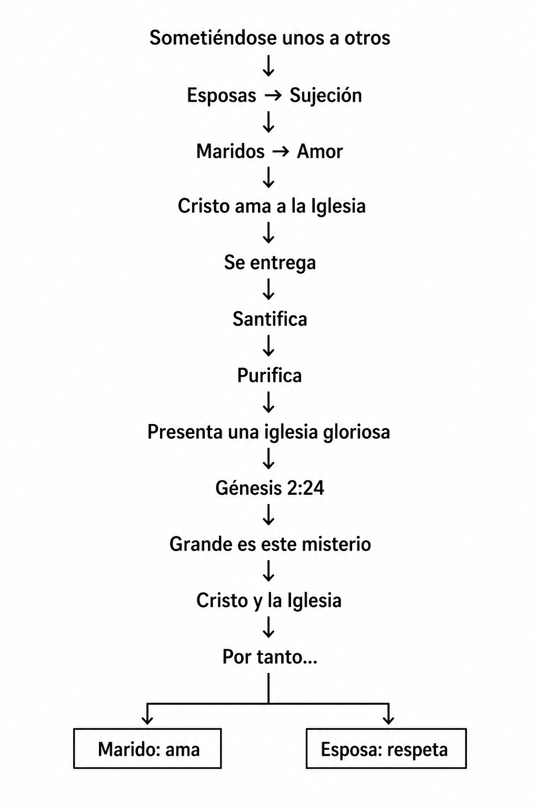

**COMPRENDIENDO EL MISTERIO DE CRISTO POR MEDIO DEL EVANGELIO**

# Introducción

## La ciudad de Éfeso

**Ubicación e importancia**

Éfeso estaba situada en la costa occidental de Asia Menor, en la actual Turquía. Durante el primer siglo era la capital de la provincia romana de Asia y una de las ciudades más importantes del Imperio Romano.

Su puerto sobre el mar Egeo la convirtió en un centro estratégico para el comercio, la administración y la difusión de ideas. Desde Éfeso era posible acceder fácilmente a las demás ciudades de la provincia, lo que explica la influencia que tuvo el evangelio en toda la región (Hechos 19:10).

##### **La cultura de Éfeso**

Éfeso era una ciudad grande y próspera, con una población estimada entre 200.000 y 250.000 habitantes.

Su economía dependía principalmente del comercio marítimo, la manufactura y la actividad religiosa. Contaba con un gran puerto, amplios mercados (ágoras), calles pavimentadas y edificios públicos que reflejaban la riqueza de la ciudad.

Entre sus construcciones más conocidas estaban el gran teatro, con capacidad para miles de personas, y la Biblioteca de Celso, uno de los edificios más representativos de la ciudad durante la época romana.

##### **La religión en Éfeso**

La ciudad era famosa por el templo de Artemisa (Diana para los romanos), considerado una de las maravillas del mundo antiguo.

El culto a Artemisa dominaba la identidad religiosa de la ciudad y sostenía una importante actividad económica mediante la fabricación y venta de imágenes y objetos relacionados con la diosa (Hechos 19:23–41).

Además del culto a Artemisa, Éfeso era conocida por la práctica de la magia y el ocultismo. Cuando muchos creyeron en el evangelio, abandonaron esas prácticas y quemaron públicamente sus libros de magia (Hechos 19:18–20).

También existía una comunidad judía con una sinagoga, donde Pablo comenzó predicando el evangelio (Hechos 18:19; 19:8).

## La iglesia en Éfeso

Pablo visitó Éfeso por primera vez durante su segundo viaje misionero. Permaneció poco tiempo, predicó en la sinagoga y dejó allí a Aquila y Priscila antes de continuar su viaje (Hechos 18:18–21).

Tiempo después llegó Apolos, quien conocía las Escrituras y el bautismo de Juan. Aquila y Priscila le explicaron con mayor precisión el camino de Dios (Hechos 18:24–26).

Durante su tercer viaje misionero Pablo regresó a Éfeso y permaneció allí alrededor de tres años. Predicó primero en la sinagoga y luego enseñó diariamente en la escuela de Tirano, de manera que el evangelio llegó a toda la provincia de Asia (Hechos 19:8–10).

El crecimiento del evangelio produjo un profundo impacto en la ciudad. Muchos abandonaron la magia y la idolatría, mientras que la disminución del comercio relacionado con Artemisa provocó el gran alboroto narrado en Hechos 19:23–41.

Antes de dirigirse a Jerusalén, Pablo convocó en Mileto a los ancianos de la iglesia de Éfeso para exhortarlos a cuidar fielmente el rebaño que Dios les había encomendado (Hechos 20:17–38).

Años más tarde dejó a Timoteo en Éfeso para enfrentar las falsas enseñanzas y ordenar la vida de la iglesia (1 Timoteo 1:3).

## Panorama del libro de Efesios

##### Efesios presenta lo que Dios ha realizado en Cristo conforme a Su propósito eterno, revelando el misterio de Cristo y mostrando cómo ese propósito transforma la vida de quienes han sido llamados por Él.

##### La carta muestra la obra de Dios desde Su propósito eterno hasta la vida diaria del creyente. Pablo explica lo que Dios ha hecho en Cristo, cómo judíos y gentiles han sido reunidos en un solo pueblo, cuál fue el misterio que le fue revelado para anunciar entre las naciones y, sobre esa base, exhorta a los creyentes a vivir de una manera digna del llamamiento recibido.

## Propósito del libro de Efesios

Efesios fue escrito por Pablo para dar a conocer el misterio de Cristo que Dios reveló en Su debido tiempo y que le encomendó anunciar entre los gentiles (1:9; 3:3–10). Al mismo tiempo, exhorta a los creyentes a vivir de manera coherente con la obra que Dios ya ha realizado en Cristo (4:1).

La carta presenta primero la obra de Dios y luego llama a los creyentes a responder a esa obra mediante una vida digna de su llamamiento.

##### Capítulo 1

Pablo comienza bendiciendo a Dios por todas las bendiciones espirituales concedidas en Cristo. Describe la obra de Dios conforme a Su voluntad y propósito, culminando con la alabanza de Su gloria (1:3–14).

Después ora para que los creyentes comprendan la esperanza de su llamamiento, las riquezas de la herencia de Dios y la extraordinaria grandeza de Su poder para con los que creen (1:15–23).

##### Capítulo 2

Pablo recuerda la condición pasada de los creyentes y muestra que Dios les dio vida juntamente con Cristo únicamente por gracia (2:1–10).

Luego dirige la atención a la reconciliación de judíos y gentiles. Cristo derribó la enemistad, hizo de ambos un solo pueblo y los está edificando juntamente como morada de Dios en el Espíritu (2:11–22).

##### Capítulo 3

Pablo explica el ministerio que le fue encomendado para dar a conocer el misterio de Cristo, anteriormente oculto y ahora revelado, conforme al propósito eterno de Dios (3:1–13).

Después ora nuevamente para que los creyentes sean fortalecidos por el Espíritu, comprendan el amor de Cristo y sean llenos hasta toda la plenitud de Dios (3:14–21).

##### Capítulo 4

Sobre la base de todo lo anterior, Pablo exhorta a los creyentes a vivir de una manera digna del llamamiento recibido, conservando la unidad del Espíritu (4:1–6).

Explica que Cristo dio dones para la edificación de Su cuerpo hasta que todos lleguen a la madurez en Él (4:7–16).

Finalmente, exhorta a abandonar la antigua manera de vivir, renovarse y revestirse del nuevo hombre creado según Dios (4:17–32).

##### **Capítulo 5**

Pablo continúa mostrando cómo debe caminar el creyente: como imitador de Dios, en amor, como hijo de luz y con sabiduría, siendo lleno del Espíritu (5:1–21).

Luego aplica estas instrucciones a las relaciones entre esposos y esposas, utilizando la relación entre Cristo y la iglesia para ilustrar el propósito del matrimonio (5:22–33).

##### **Capítulo 6**

Las exhortaciones continúan con las relaciones entre hijos y padres, y entre siervos y amos, mostrando cómo debe vivirse el llamamiento recibido en todos los ámbitos de la vida (6:1–9).

Finalmente, Pablo exhorta a los creyentes a fortalecerse en el Señor, revestirse de toda la armadura de Dios y permanecer firmes frente a las asechanzas del diablo, perseverando en oración por todos los santos (6:10–24).


## Autor y Fecha de la escritura del libro de Efesios.

##### El autor de la carta es Pablo, el Apóstol así se presenta en Efesios 1:1. Efesios, Filipenses, Colosenses y Filemón. Son llamadas con frecuencia, Cartas de la Cautividad (o cartas desde la prisión), ya que todas ellas fueron escritas durante el encarcelamiento de Pablo en Roma (Efesios 1:1; Filipenses 1:7; Colosenses 4:10; Filemón 9).

##### Se discute si estuvo preso en Roma uno o dos veces, aunque dos encarcelamientos parecen que cuadran mejor con los hechos. Durante el primero, Pablo estuvo custodiado dentro o cerca del cuartel de la Guarda Pretoriana o en un lugar alquilado, cuya renta pagó el mismo por dos años (Hechos 28:30), y durante este tiempo fueron escritas estas epístolas. Previamente a ser liberado (Filemón 22).

##### Después de esta liberación, hizo varios viajes, escribió. 1 Timoteo y Tito. Lo volvieron a arrestar. Escribió segunda de Timoteo y fue martirizado. Estas, pues son las cartas de su primer encarcelamiento en Roma, mientras que 2 Timoteo es la carta de su segundo encarcelamiento en Roma. 

##### La fecha de la escritura de esta carta fue en el año 61-62 d.C.

##### **Nota de carta circular:** Varias cosas indican que Efesios era una carta circular, un tratado doctrinal en forma de carta a las iglesias de Asia Menor. Algunos manuscritos griegos omiten las palabras **en Éfeso** (Efesios 1:1). No hay ninguna controversia en esta Carta y no trata acerca de problemas de iglesias locales.

##### Puesto que Pablo había trabajado en Éfeso durante unos tres años y normalmente mencionaba a muchos de sus amigos en las iglesias a las que escribía, la ausencia de nombres personales en esta epístola es un argumento fuerte en favor de la idea de su carácter circular. Parece ser que fue enviado primero a Éfeso por Tíquico (Efesios 6:21-22; Colosenses 4:7-8) y es probablemente la misma carta que él llama “la de Laodicea” en Colosenses 4:16.

### Efesios 1:1

#### Pablo, apóstol de Cristo Jesús por la voluntad de Dios

##### La carta comienza identificando claramente a su autor.

###### Pablo no se presenta simplemente por su nombre.

###### Se identifica como apóstol de Cristo Jesús.

###### Además, afirma que su apostolado es "por la voluntad de Dios".

###### Desde la primera línea, el origen de su ministerio es atribuido a Dios.

------

#### A los santos que están en Éfeso

##### Pablo identifica a los destinatarios de la carta.

###### Los llama "santos".

###### También especifica el lugar donde se encuentran: Éfeso.

###### El énfasis recae sobre las personas a quienes va dirigida la carta.

------

#### y fieles en Cristo Jesús

##### Pablo añade una segunda descripción de los destinatarios.

###### La carta no solo los llama santos.

###### También los identifica como fieles en Cristo Jesús.

###### Ambas expresiones forman parte de la presentación inicial de los destinatarios.

### Efesios 1:2

#### Gracia y paz a ustedes de parte de Dios nuestro Padre y del Señor Jesucristo.

##### Pablo continúa el saludo con una bendición para los destinatarios.

###### La bendición está formada por dos expresiones: "gracia" y "paz".

###### Ambas proceden de una misma fuente: Dios nuestro Padre y el Señor Jesucristo.

###### El saludo no presenta estas bendiciones como un deseo humano, sino como algo que proviene de Dios y del Señor Jesucristo.

###### Desde el comienzo de la carta, Pablo coloca a Dios el Padre y al Señor Jesucristo como la fuente de la bendición para los creyentes.

------

### Conexiones bíblicas

- Pablo abre la mayoría de sus cartas con el mismo saludo de "gracia y paz" (Romanos 1:7; 1 Corintios 1:3; 2 Corintios 1:2; Gálatas 1:3; Filipenses 1:2; Colosenses 1:2).
- Más adelante en Efesios, Pablo volverá a hablar de la paz lograda por medio de Cristo (Efesios 2:14–18).
- La gracia ocupa un lugar importante a lo largo de la carta (Efesios 2:5–9; 3:2, 7–8; 4:7).

# Efesios 1:3–14 – Dios los bendijo en Cristo

## Efesios 1:3–6 – Bendecidos en Cristo con toda bendición espiritual

### Efesios 1:3

#### Bendito sea el Dios y Padre de nuestro Señor Jesucristo

##### Pablo comienza esta sección bendiciendo a Dios.

###### La atención no se dirige primero a los creyentes, sino a Dios.

###### Dios es presentado como el Dios y Padre de nuestro Señor Jesucristo.

###### Toda la sección comienza con alabanza antes de describir las bendiciones recibidas.

------

#### que nos ha bendecido

##### Pablo explica la razón de su alabanza.

###### Dios es quien ha bendecido.

###### El sujeto de la acción es Dios.

###### El objeto de esa acción es "nos".

###### Pablo se incluye junto con sus destinatarios al decir "nos".

------

#### con toda bendición espiritual

##### La bendición es presentada como completa.

###### Pablo no habla de algunas bendiciones.

###### Habla de toda bendición espiritual.

###### En los versículos siguientes comenzará a desarrollar esas bendiciones.

------

#### en los lugares celestiales

##### Pablo identifica el ámbito donde se encuentran estas bendiciones.

###### Esta es la primera vez que la expresión "lugares celestiales" aparece en la carta.

###### Más adelante volverá a utilizar esta expresión (1:20; 2:6; 3:10; 6:12).

------

#### en Cristo

##### Pablo ubica estas bendiciones en relación con Cristo.

###### Esta es la primera aparición de la expresión "en Cristo" dentro del desarrollo de la carta.

###### A lo largo de Efesios, Pablo volverá repetidamente a esta expresión.

------

### Conexiones bíblicas

- La expresión "Dios y Padre de nuestro Señor Jesucristo" también aparece en 2 Corintios 1:3 y 1 Pedro 1:3.
- La expresión "lugares celestiales" es característica de Efesios y aparece nuevamente en 1:20; 2:6; 3:10 y 6:12.
- La expresión "en Cristo" ocupa un lugar destacado a lo largo de toda la carta.

------

### Efesios 1:4

#### Porque nos escogió en Él antes de la fundación del mundo

##### Pablo comienza a desarrollar la primera bendición mencionada.

###### Dios es nuevamente el sujeto de la acción.

###### La acción consiste en escoger.

###### Pablo vuelve a incluirse con sus lectores mediante el pronombre "nos".

###### La acción es situada antes de la fundación del mundo.

###### Pablo vuelve a relacionarla con Cristo mediante la expresión "en Él".

------

#### para que fuéramos santos y sin mancha delante de Él

##### Pablo expresa el propósito de esa elección.

###### El propósito es presentado con la expresión "para que".

###### El resultado descrito es "santos y sin mancha".

###### La frase concluye con la expresión "delante de Él", manteniendo el enfoque en Dios.

------

### Conexiones bíblicas

- Pablo vuelve a usar la expresión "antes de la fundación del mundo" en relación con el propósito de Dios (cf. 2 Timoteo 1:9; 1 Pedro 1:20).
- Más adelante en Efesios, los términos "santo" y "santos" aparecerán repetidamente para referirse a los creyentes (1:15, 18; 2:19; 3:8, 18; 4:12; 5:3).

## Efesios 1:5–6 – Predestinados para adopción como hijos

### Efesios 1:5

#### En amor nos predestinó para adopción como hijos para sí mediante Jesucristo

##### Pablo continúa describiendo las bendiciones que Dios ha realizado.

###### Dios sigue siendo el sujeto de todas las acciones.

###### La acción ahora es "nos predestinó".

###### Pablo vuelve a incluirse con sus lectores mediante el pronombre "nos".

###### El propósito de esa acción aparece de manera explícita: "para adopción como hijos".

###### Pablo señala que esta adopción es "para sí".

###### También afirma que todo ello es "mediante Jesucristo".

------

#### conforme a la buena intención de Su voluntad

##### Pablo vuelve a indicar el origen de la obra de Dios.

###### La acción descrita está relacionada con la voluntad de Dios.

###### Pablo la caracteriza como la buena intención de Su voluntad.

###### La atención permanece sobre lo que Dios ha decidido hacer.

------

### Conexiones bíblicas

- Pablo volverá a mencionar la adopción en Romanos 8:15–23 y Gálatas 4:4–7.
- La voluntad y el propósito de Dios continúan desarrollándose en Efesios 1:9–11 y 3:11.

------

### Efesios 1:6

#### para alabanza de la gloria de Su gracia

##### Pablo expresa el propósito de lo que acaba de describir.

###### La expresión comienza con "para", indicando el propósito.

###### La atención se dirige ahora a la gloria de la gracia de Dios.

###### Esta es la primera vez que aparece en la carta la expresión "la gloria de Su gracia".

------

#### que gratuitamente ha impartido sobre nosotros en el Amado

##### Pablo vuelve a incluirse con sus lectores mediante el pronombre "nosotros".

###### La gracia es presentada como algo que Dios ha concedido gratuitamente.

###### Pablo identifica nuevamente el ámbito donde esto ocurre: "en el Amado".

###### La carta continúa relacionando las bendiciones de Dios con Cristo.

------

### Conexiones bíblicas

- La gracia volverá a ocupar un lugar central en Efesios (2:5–9; 3:2, 7–8; 4:7).
- La expresión "en el Amado" es única en la carta y mantiene el énfasis de las repetidas expresiones "en Cristo" y "en Él".

## Efesios 1:7-10 – Nuestra redención en la sangre de Cristo y el perdón de pecados.

### Efesios 1:7-8 
En Él tenemos redención mediante Su sangre, el perdón de nuestros pecados según las riquezas de Su gracEfesios 1:7–10 – Dios dio a conocer el misterio de Su voluntad

### Efesios 1:7

#### En Él tenemos redención mediante Su sangre

##### Pablo continúa describiendo las bendiciones que los creyentes tienen en Cristo.

###### La expresión "En Él" vuelve a colocar el énfasis en Cristo.

###### Pablo afirma que "tenemos" redención.

###### La redención es presentada como una realidad actual para los creyentes.

###### Pablo añade que esta redención es "mediante Su sangre".

------

#### el perdón de nuestros pecados

##### Pablo relaciona la redención con el perdón de los pecados.

###### El perdón forma parte de lo que los creyentes tienen en Cristo.

###### El énfasis continúa sobre lo que Dios ha realizado.

------

#### según las riquezas de Su gracia

##### Pablo muestra la medida de esta obra.

###### No habla de una gracia limitada.

###### La presenta conforme a las riquezas de Su gracia.

------

### Conexiones bíblicas

- La redención también aparece relacionada con Cristo y Su sangre en Colosenses 1:13–14 y 1 Pedro 1:18–19.
- Más adelante, Efesios volverá a desarrollar la riqueza de la gracia de Dios (2:4–9; 3:7–8).

------

### Efesios 1:8

#### que hizo abundar para con nosotros

##### Pablo continúa describiendo la gracia de Dios.

###### La gracia no solo fue dada.

###### Dios la hizo abundar para con nosotros.

------

#### en toda sabiduría e inteligencia

##### Pablo añade el ámbito en el que esta gracia fue manifestada.

###### La carta todavía no explica estas expresiones.

###### Más adelante desarrollará cómo Dios ha dado a conocer Su propósito.

------

### Efesios 1:9

#### dándonos a conocer el misterio de Su voluntad

##### Pablo introduce un nuevo tema dentro de la carta.

###### Dios es quien da a conocer.

###### Lo que da a conocer es "el misterio de Su voluntad".

###### Esta es la primera vez que la palabra "misterio" aparece en Efesios.

###### Pablo todavía no explica el contenido del misterio.

------

#### según la buena intención que se propuso en Cristo

##### Pablo vuelve a señalar el origen de esta obra.

###### El misterio forma parte del propósito que Dios se propuso en Cristo.

###### La iniciativa continúa siendo completamente de Dios.

------

### Conexiones bíblicas

- Pablo desarrollará ampliamente el misterio en Efesios 3:1–13.
- La voluntad y el propósito de Dios continúan apareciendo a lo largo de la carta (1:5, 11; 3:11).

#### Efesios 1:10 – con miras a una buena administración en el cumplimiento de los tiempos, es decir, de reunir todas las cosas en Cristo, tonto las que están en los cielos, como las que están en la tierra”.* El misterio se trata de reunir todas las cosas en Cristo. Dios se propuso en Cristo, revelar este misterio en el cumplimiento de los tiempos. Gálatas 4:4.

##### Este fue el periodo señalado por Dios de una buena administración que se lleva adelante en Cristo, reunir todas las cosas en Cristo. Colosenses 1:19-20, Efesios 2:16-18.

##### Cuando el pecado entró en el mundo la tierra fue sujeta a maldición, el hombre fue destituido de la presencia de Dios, nada y nadie podía reconciliar todo con Dios, se veía imposible restaurar o reunir otra vez las cosas. Pero Dios fijó un tiempo o un período donde por medio de Cristo, lograría reunir otra vez lo imposible. Génesis 3:17-18, Isaías 59:2, Romanos 3:23, Hechos 1:7.

##### Cuando el pecado entró en el mundo, todos los hombres pecaron, el cielo y la tierra se convirtieron en enemigos, el hombre y Dios quedaron en enemistad, se veía imposible, que Dios y el hombre puedan reunirse otra vez, porque la paga por el pecado es la muerte. Efesios 2:1-3, Genesis 2:15-17; 3:7; Romanos 5:12; 6: 23a. Colosense 1:21, Santiago 4:4.

##### Efesios 1:10 … de reunir todas las cosas, tanto los que están en los cielos, … Esto de las cosas en el cielo no está hablando de los espíritus de los hombres ni de los ángeles caídos. Además, la Biblia no habla de la restauración de los ángeles caídos sino un castigo eterno. Mateo 25:41

###### *“Tanto los que están en los cielos”,* (observación léxica: forma usada para introducir una glosa) que Dios mismo se estaría reconciliando con el hombre, de esa manera, Dios no estará más enemistado con el hombre, el cielo estará reunido con las cosas de la tierra. Romanos 5:1

##### Efesios 1:10 *… “de reunir todas las cosas, tanto los que están en los cielos, **como las que están en la tierra**. (observación léxica: forma usada para introducir una glosa) que el hombre se reconciliará con Dios por medio de Cristo. Todos aquellos que creen en el evangelio, están otra vez reunidos con Dios. La tierra ha sido reconciliada por medio de Cristo. Romanos 5:1, Efesios 2:14-17; 2 Corintios 5:18-21Efesios 1:11–12 – Herencia conforme al propósito de Dios

### Efesios 1:11

#### También en Él hemos obtenido herencia

##### Pablo continúa describiendo las bendiciones que los creyentes tienen en Cristo.

###### La expresión "en Él" vuelve a señalar a Cristo como el ámbito donde se recibe esta bendición.

###### Pablo afirma que "hemos obtenido herencia".

###### Esta es la primera vez que la carta introduce la herencia como una de las bendiciones recibidas.

------

#### habiendo sido predestinados

##### Pablo relaciona la herencia con una acción previa de Dios.

###### Dios continúa siendo el sujeto de la acción.

###### La herencia no aparece separada del propósito de Dios.

------

#### según el propósito de Aquel que obra todas las cosas conforme al consejo de Su voluntad

##### Pablo vuelve a dirigir la atención hacia Dios.

###### La herencia está relacionada con el propósito de Dios.

###### Pablo afirma que Dios obra todas las cosas.

###### Esa obra es presentada como conforme al consejo de Su voluntad.

###### A lo largo de este párrafo, Pablo ha repetido varias veces expresiones relacionadas con la voluntad y el propósito de Dios (1:5, 9, 11).

------

### Efesios 1:12

#### a fin de que nosotros, que fuimos los primeros en esperar en Cristo

##### Pablo expresa nuevamente un propósito.

###### La expresión "a fin de que" introduce el propósito de lo que viene describiendo.

###### Pablo distingue aquí a "nosotros" como quienes fueron los primeros en esperar en Cristo.

------

#### seamos para alabanza de Su gloria

##### El párrafo vuelve a terminar con una expresión de alabanza.

###### Esta es la segunda vez que Pablo concluye una sección con la expresión "para alabanza de Su gloria".

###### La gloria continúa siendo el destino final de la obra de Dios.

------

### Conexiones bíblicas

- La herencia volverá a aparecer más adelante en la carta (Efesios 1:14, 18; 5:5).
- El propósito de Dios continúa desarrollándose en Efesios 3:11.
- La expresión "para alabanza de Su gloria" forma parte de una secuencia repetida en 1:6, 1:12 y 1:14.

## Efesios 1:12–14 – Sellados con el Espíritu Santo de la promesa

### Efesios 1:12

#### a fin de que nosotros, que fuimos los primeros en esperar en Cristo

##### Pablo expresa nuevamente el propósito de la obra de Dios.

###### La expresión "a fin de que" introduce un propósito.

###### Pablo habla aquí de "nosotros".

###### En el siguiente versículo cambiará a "ustedes".

###### El cambio de pronombres merece atención dentro del desarrollo de la carta.

------

#### seamos para alabanza de Su gloria

##### La obra de Dios vuelve a terminar en la alabanza de Su gloria.

###### Esta expresión ya apareció en el versículo 6.

###### Volverá a aparecer otra vez en el versículo 14.

###### La repetición une todo el desarrollo de 1:3–14.

------

### Conexiones bíblicas

- La esperanza en Cristo será retomada más adelante en la carta (1:18; 2:12; 4:4).

------

### Efesios 1:13

#### En Él también ustedes

##### Pablo cambia el pronombre de "nosotros" a "ustedes".

###### El cambio marca un nuevo paso dentro del desarrollo del párrafo.

###### La atención ahora se dirige directamente a los destinatarios de la carta.

------

#### después de escuchar el mensaje de la verdad, el evangelio de su salvación

##### Pablo describe una secuencia.

###### Primero aparece el mensaje.

###### Ese mensaje es identificado como "el evangelio de su salvación".

###### Pablo también lo llama "el mensaje de la verdad".

------

#### y habiendo creído

##### La secuencia continúa.

###### Después de escuchar, Pablo menciona el creer.

###### El texto mantiene el mismo orden de los acontecimientos.

------

#### fueron sellados con el Espíritu Santo de la promesa

##### Pablo presenta una nueva bendición recibida por los creyentes.

###### El sujeto de la acción permanece implícitamente en Dios.

###### Los creyentes reciben el Espíritu Santo de la promesa.

###### Esta es la primera vez que el Espíritu Santo aparece mencionado en la carta.

------

### Conexiones bíblicas

- El Espíritu Santo volverá a aparecer repetidamente a lo largo de Efesios (2:18, 22; 3:5, 16; 4:3–4, 30; 5:18; 6:17–18).
- El evangelio volverá a ocupar un lugar importante en la carta (3:6; 6:15, 19).

------

### Efesios 1:14

#### que nos es dado como garantía de nuestra herencia

##### Pablo continúa describiendo la obra del Espíritu Santo.

###### El Espíritu es presentado como garantía.

###### La garantía está relacionada con la herencia mencionada anteriormente.

###### Pablo vuelve a utilizar el pronombre "nuestra".

------

#### con miras a la redención de la posesión adquirida

##### Pablo vuelve a expresar un propósito.

###### La expresión "con miras a" señala nuevamente la dirección de la obra de Dios.

###### La carta continuará desarrollando esta obra en los capítulos siguientes.

------

#### para alabanza de Su gloria

##### El gran párrafo iniciado en el versículo 3 termina donde comenzó.

###### Por tercera vez aparece la expresión "para alabanza de Su gloria".

###### La repetición funciona como el cierre de toda la sección.

------

### Conexiones bíblicas

- Pablo volverá a mencionar el sello del Espíritu en Efesios 4:30.
- La herencia también reaparece en Efesios 1:18 y 5:5.

### Efesios 1:14

#### que nos es dado como garantía de nuestra herencia

##### Pablo continúa describiendo la obra del Espíritu Santo.

###### El Espíritu Santo es presentado como garantía.

###### La garantía está relacionada con la herencia mencionada en el versículo 11.

###### Pablo une así dos de las bendiciones desarrolladas en esta sección.

------

#### con miras a la redención de la posesión adquirida

##### Pablo vuelve a expresar el propósito de la obra de Dios.

###### La expresión "con miras a" señala nuevamente la dirección hacia la cual apunta esta obra.

###### La carta volverá a desarrollar el tema de la redención más adelante.

------

#### para alabanza de Su gloria

##### Pablo concluye el gran párrafo iniciado en el versículo 3.

###### Esta es la tercera vez que aparece la expresión "para alabanza de Su gloria" o "para alabanza de la gloria de Su gracia".

###### La repetición funciona como el cierre de toda la sección.

###### El párrafo comienza bendiciendo a Dios (1:3) y termina nuevamente dirigiendo toda la atención hacia Su gloria.

------

### Conexiones bíblicas

- Pablo volverá a mencionar el sello del Espíritu en Efesios 4:30.
- La herencia reaparece en Efesios 1:18 y 5:5.
- La redención vuelve a mencionarse en Efesios 4:30.

### Efesios 1:14

#### que nos es dado como garantía de nuestra herencia

##### Pablo continúa describiendo la obra del Espíritu Santo.

###### El Espíritu Santo es presentado como garantía.

###### La garantía está relacionada con la herencia mencionada en el versículo 11.

###### Pablo une así dos de las bendiciones desarrolladas en esta sección.

------

#### con miras a la redención de la posesión adquirida

##### Pablo vuelve a expresar el propósito de la obra de Dios.

###### La expresión "con miras a" señala nuevamente la dirección hacia la cual apunta esta obra.

###### La carta volverá a desarrollar el tema de la redención más adelante.

------

#### para alabanza de Su gloria

##### Pablo concluye el gran párrafo iniciado en el versículo 3.

###### Esta es la tercera vez que aparece la expresión "para alabanza de Su gloria" o "para alabanza de la gloria de Su gracia".

###### La repetición funciona como el cierre de toda la sección.

###### El párrafo comienza bendiciendo a Dios (1:3) y termina nuevamente dirigiendo toda la atención hacia Su gloria.

------

### Conexiones bíblicas

- Pablo volverá a mencionar el sello del Espíritu en Efesios 4:30.
- La herencia reaparece en Efesios 1:18 y 5:5.
- La redención vuelve a mencionarse en Efesios 4:30.

## Efesios 1:17–19 – Pablo ora para que conozcan mejor a Dios

### Efesios 1:17

#### pido que el Dios de nuestro Señor Jesucristo, el Padre de gloria

##### Pablo presenta el contenido de su oración.

###### La oración está dirigida a Dios.

###### Pablo lo identifica como el Dios de nuestro Señor Jesucristo.

###### También lo llama "el Padre de gloria".

------

#### les dé espíritu de sabiduría y de revelación

##### Pablo expresa la primera petición de su oración.

###### La petición está dirigida a favor de los creyentes.

###### Pablo desea que Dios les dé espíritu de sabiduría y de revelación.

###### La carta todavía no desarrolla estas expresiones.

###### El énfasis recae sobre lo que Pablo pide a Dios.

------

#### en un mejor conocimiento de Él

##### Pablo expresa el propósito de esa petición.

###### El objetivo es un mejor conocimiento de Dios.

###### La oración no se centra en recibir nuevas bendiciones.

###### Se centra en conocer mejor a Aquel que ya los ha bendecido.

------

### Conexiones bíblicas

- Pablo volverá a orar por estos creyentes en Efesios 3:14–21.
- El conocimiento vuelve a ocupar un lugar importante en la carta (1:18; 3:19; 4:13).
- La sabiduría reaparece en Efesios 5:15–17.

## Efesios 1:18–19 – Pablo ora para que conozcan lo que Dios ya ha realizado

### Efesios 1:18

#### Mi oración es que los ojos de su corazón sean iluminados

##### Pablo continúa desarrollando el contenido de su oración.

###### La imagen cambia de "espíritu de sabiduría y revelación" a "los ojos de su corazón".

###### La oración sigue teniendo un mismo propósito: que los creyentes puedan comprender.

------

#### para que sepan

##### Esta expresión introduce el propósito de la oración.

###### A partir de aquí, Pablo menciona tres cosas que desea que los creyentes conozcan.

###### La estructura del pasaje está organizada alrededor de estas tres peticiones.

------

#### cuál es la esperanza de Su llamamiento

##### Esta es la primera realidad que Pablo desea que conozcan.

###### El énfasis recae sobre la esperanza relacionada con el llamamiento de Dios.

###### La carta volverá a mencionar el llamamiento y la esperanza más adelante.

------

#### cuáles son las riquezas de la gloria de Su herencia en los santos

##### Pablo presenta la segunda realidad.

###### La atención ahora se dirige a la herencia.

###### La herencia ya había sido mencionada anteriormente (1:11–14).

###### Ahora Pablo desea que conozcan las riquezas de su gloria.

------

### Efesios 1:19

#### y cuál es la extraordinaria grandeza de Su poder para con nosotros los que creemos

##### Pablo presenta la tercera realidad de su oración.

###### El énfasis cambia ahora al poder de Dios.

###### Pablo destaca la extraordinaria grandeza de ese poder.

###### Ese poder es descrito en relación con "nosotros los que creemos".

------

#### conforme a la eficacia de la fuerza de Su poder

##### Pablo concluye esta parte de la oración describiendo ese poder.

###### La atención permanece completamente sobre el poder de Dios.

###### En los versículos siguientes Pablo comenzará a mostrar ese poder actuando en Cristo.

------

### Conexiones bíblicas

- El llamamiento volverá a desarrollarse en Efesios 4:1–4.
- La herencia reaparece en Efesios 1:11, 14 y 5:5.
- El poder de Dios continuará siendo desarrollado inmediatamente en Efesios 1:20–23 y volverá a aparecer en 3:7, 16 y 6:10.

## Efesios 1:20–23 – El poder de Dios manifestado en Cristo

### Efesios 1:20

#### Ese poder obró en Cristo cuando lo resucitó de entre los muertos

##### Pablo comienza a mostrar el poder que acaba de mencionar.

###### El sujeto continúa siendo Dios.

###### El poder ya no es solamente descrito; ahora es mostrado en acción.

###### La primera obra mencionada es la resurrección de Cristo.

------

#### y lo sentó a Su diestra en los lugares celestiales

##### Pablo añade una segunda acción realizada por Dios.

###### Dios no solamente resucitó a Cristo.

###### También lo sentó a Su diestra.

###### La expresión "lugares celestiales" vuelve a aparecer en la carta.

------

### Efesios 1:21

#### muy por encima de todo principado, autoridad, poder y dominio

##### Pablo describe la posición que ahora ocupa Cristo.

###### La exaltación de Cristo es presentada mediante una serie de expresiones ascendentes.

###### Cristo es colocado por encima de toda autoridad y dominio.

------

#### y de todo nombre que se nombra, no solo en este siglo sino también en el venidero

##### Pablo amplía todavía más el alcance de esa exaltación.

###### La supremacía de Cristo no queda limitada al presente.

###### También abarca el siglo venidero.

------

### Efesios 1:22

#### Y todo sometió bajo Sus pies

##### Pablo continúa describiendo la obra de Dios.

###### Dios es quien somete todas las cosas.

###### Cristo aparece como aquel bajo cuyos pies todo ha sido puesto.

------

#### y a Él lo dio por cabeza sobre todas las cosas a la iglesia

##### La atención se dirige ahora a la relación entre Cristo y la iglesia.

###### Cristo es presentado como cabeza.

###### La iglesia aparece por primera vez en la carta.

###### Más adelante Pablo desarrollará ampliamente esta relación.

------

### Efesios 1:23

#### la cual es Su cuerpo

##### Pablo describe a la iglesia mediante una nueva imagen.

###### La iglesia es llamada el cuerpo de Cristo.

###### Esta imagen volverá a desarrollarse en los capítulos siguientes.

------

#### la plenitud de Aquel que todo lo llena en todo

##### Pablo concluye esta sección con una descripción de Cristo.

###### El párrafo termina dirigiendo nuevamente la atención hacia Él.

###### La idea de plenitud volverá a aparecer más adelante en la carta.

------

### Conexiones bíblicas

- El Salmo 110:1 está detrás de la imagen de Cristo sentado a la diestra de Dios.
- Pablo desarrollará la relación entre Cristo y la iglesia en Efesios 4:11–16 y 5:22–33.
- La expresión "cuerpo" reaparece en Efesios 2:16; 3:6; 4:4, 12, 16; 5:23, 30.

### Efesios 1:21

#### muy por encima de todo principado, autoridad, poder, dominio y de todo nombre que se nombra

##### Pablo continúa describiendo la exaltación de Cristo.

###### La descripción está formada por una serie de expresiones que aumentan progresivamente el alcance de Su autoridad.

###### Cristo es presentado como superior a todo principado, autoridad, poder y dominio.

###### Pablo añade además: "y de todo nombre que se nombra", ampliando aún más esa supremacía.

###### El énfasis del pasaje no está en identificar cada una de estas autoridades, sino en mostrar que Cristo está por encima de todas ellas.

------

#### no solo en este siglo sino también en el venidero

##### Pablo extiende esa supremacía más allá del tiempo presente.

###### La autoridad de Cristo no queda limitada a este siglo.

###### También alcanza el siglo venidero.

###### De esta manera, Pablo presenta el señorío de Cristo como permanente y superior a toda otra autoridad.

------

### Conexiones bíblicas

- El Salmo 110:1 constituye el trasfondo de Cristo sentado a la diestra de Dios.
- Hebreos 1:3, 13 también presenta a Cristo sentado a la diestra de la Majestad.
- Colosenses 1:15–20 desarrolla igualmente la supremacía de Cristo sobre todas las cosas.

## Efesios 1:22–23 – Cristo es dado por cabeza a la iglesia

### Efesios 1:22

#### Y todo lo sometió bajo Sus pies

##### Pablo continúa describiendo la obra de Dios en Cristo.

###### Dios sigue siendo el sujeto de la acción.

###### Todo es presentado como sometido bajo los pies de Cristo.

###### La descripción continúa desarrollando la supremacía de Cristo iniciada en el versículo anterior.

------

#### y a Él lo dio por cabeza sobre todas las cosas a la iglesia

##### Pablo añade una nueva acción de Dios.

###### Dios dio a Cristo por cabeza a la iglesia.

###### Esta es la primera vez que la iglesia aparece en la carta.

###### La relación entre Cristo y la iglesia será desarrollada más ampliamente en los capítulos siguientes.

------

### Efesios 1:23

#### la cual es Su cuerpo

##### Pablo describe a la iglesia mediante una imagen.

###### La iglesia es identificada como el cuerpo de Cristo.

###### Esta imagen volverá a aparecer repetidamente en la carta.

------

#### la plenitud de Aquel que todo lo llena en todo

##### Pablo concluye el capítulo con una descripción de Cristo.

###### Cristo es presentado como Aquel que todo lo llena en todo.

###### La carta continuará desarrollando esta relación entre Cristo y Su cuerpo.

------

### Conexiones bíblicas

- La imagen del cuerpo vuelve a desarrollarse en Efesios 2:16; 3:6; 4:4, 11–16; 5:23–32.
- Cristo como cabeza reaparece en Efesios 4:15 y 5:23.
- La plenitud vuelve a mencionarse en Efesios 3:19 y 4:13.

# Efesios 2:1–10 – Dios dio vida a los que estaban muertos

## Efesios 2:1–3 – La condición pasada de judíos y gentiles

### Efesios 2:1

#### Y ustedes estaban muertos en sus delitos y pecados

##### Pablo cambia ahora la atención hacia sus lectores.

###### Después de mostrar el poder de Dios obrando en Cristo (1:20–23), comienza a mostrar ese mismo poder obrando en ellos.

###### Pablo describe la condición pasada de sus lectores.

###### El verbo "estaban" sitúa esta condición en el pasado.

###### La descripción es: "muertos en sus delitos y pecados".

###### Pablo todavía no explica cómo cambió esa condición.

------

### Efesios 2:2

#### en los cuales anduvieron en otro tiempo

##### Pablo continúa describiendo esa vida pasada.

###### La expresión "en otro tiempo" mantiene el contraste con el presente.

###### Pablo no está describiendo su condición actual, sino la anterior.

------

#### según la corriente de este mundo

##### Pablo añade la primera característica de esa vida pasada.

###### Su manera de vivir seguía la corriente de este mundo.

###### La carta todavía no desarrolla esta expresión.

------

#### conforme al príncipe de la potestad del aire

##### Pablo añade una segunda descripción.

###### Esa vida también era conforme al príncipe de la potestad del aire.

###### Pablo lo describirá nuevamente más adelante en la carta (6:11–12).

------

#### el espíritu que ahora opera en los hijos de desobediencia

##### Pablo completa la descripción.

###### El espíritu ahora opera en los hijos de desobediencia.

###### La atención continúa sobre la condición anterior de quienes ahora creen.

------

### Efesios 2:3

#### Entre ellos también todos nosotros vivimos en otro tiempo

##### Pablo cambia de "ustedes" a "nosotros".

###### Ya no habla solamente de los destinatarios.

###### Ahora se incluye a sí mismo.

###### La descripción alcanza tanto a "ustedes" como a "nosotros".

###### El contraste entre ambos grupos será importante en el resto del capítulo.

------

### Conexiones bíblicas

- El contraste entre "ustedes" y "nosotros" continuará desarrollándose hasta Efesios 2:11–22.
- El tema de los poderes espirituales volverá a aparecer en Efesios 3:10 y 6:10–12.

## Efesios 2:3–7 – Pero Dios actuó por Su misericordia y amor

### Efesios 2:3

#### Entre ellos también todos nosotros en otro tiempo vivíamos

##### Pablo amplía ahora la descripción iniciada en los versículos anteriores.

###### Después de hablar de "ustedes", ahora se incluye a sí mismo con el pronombre "nosotros".

###### La descripción ya no se limita a un solo grupo.

###### Pablo presenta una condición compartida.

------

#### en las pasiones de nuestra carne

##### Pablo continúa describiendo esa vida pasada.

###### La expresión pertenece a la misma descripción iniciada en los versículos 1–2.

###### La atención permanece sobre la condición anterior.

------

#### satisfaciendo los deseos de la carne y de la mente

##### Pablo añade otra característica de esa vida pasada.

###### La descripción continúa acumulando expresiones que muestran la condición en la que vivían.

------

#### y éramos por naturaleza hijos de ira, lo mismo que los demás

##### Pablo concluye la descripción iniciada en el versículo 1.

###### El verbo "éramos" mantiene el énfasis en el pasado.

###### Pablo termina igualando a "nosotros" con "los demás".

###### La descripción ha alcanzado ahora tanto a judíos como a gentiles.

------

### Observación estructural

##### Los versículos 1–3 forman una sola descripción.

###### Pablo repite expresiones como:

- estaban...
- anduvieron...
- vivíamos...
- satisfaciendo...
- éramos...

###### Todo este desarrollo prepara el gran contraste del versículo siguiente:

**"Pero Dios..."**

------

## Efesios 2:4

#### Pero Dios...

##### Dos palabras cambian completamente la dirección del relato.

###### Hasta aquí el énfasis ha estado sobre la condición humana.

###### A partir de este punto el sujeto vuelve a ser Dios.

###### El cambio es intencional y marca el inicio de la respuesta de Dios a la condición descrita en los versículos anteriores.

------

#### que es rico en misericordia

##### Pablo comienza describiendo a Dios.

###### La primera característica mencionada es que Dios es rico en misericordia.

------

#### por causa del gran amor con que nos amó

##### Pablo añade el motivo de la acción de Dios.

###### El amor de Dios aparece como parte de la explicación de lo que hará a continuación.

###### La carta todavía no describe la acción.

###### Primero presenta quién es Dios antes de mostrar lo que hizo.

------

### Conexiones bíblicas

- El contraste entre la condición humana y la acción de Dios continúa en los versículos 5–7.
- El amor de Dios volverá a aparecer en Efesios 3:17–19 y 5:2.

## Efesios 2:5–6 – Dios dio vida juntamente con Cristo

### Efesios 2:5

#### aun cuando estábamos muertos en nuestros delitos

##### Pablo retoma la condición descrita en los versículos 1–3.

###### El contraste iniciado con "Pero Dios" continúa desarrollándose.

###### La condición sigue siendo la misma: "estábamos muertos".

------

#### nos dio vida juntamente con Cristo

##### Pablo presenta la primera gran acción de Dios.

###### Dios es el sujeto de la acción.

###### El contraste es directo con la condición anterior.

###### Los que estaban muertos ahora reciben vida.

###### Pablo añade que esta vida es "juntamente con Cristo".

------

#### por gracia ustedes han sido salvados

##### Pablo interrumpe momentáneamente la oración con una afirmación.

###### Esta es la primera vez que aparece de manera explícita la expresión "por gracia ustedes han sido salvados".

###### Más adelante desarrollará esta afirmación con mayor amplitud (2:8–9).

------

### Efesios 2:6

#### y con Él nos resucitó

##### Pablo añade una segunda acción realizada por Dios.

###### La repetición de "con Él" mantiene el énfasis en Cristo.

###### Dios no solamente dio vida.

###### También nos resucitó con Cristo.

------

#### y con Él nos sentó en los lugares celestiales en Cristo Jesús

##### Pablo presenta una tercera acción.

###### Dios también nos sentó con Cristo.

###### Vuelve a aparecer la expresión "los lugares celestiales".

###### La sección termina nuevamente con la expresión "en Cristo Jesús".

------

### Observación estructural

##### Los tres verbos forman una progresión.

###### Dios:

- nos dio vida,
- nos resucitó,
- nos sentó.

###### Esta progresión refleja la demostración del poder de Dios iniciada al final del capítulo anterior.

###### En 1:20 Dios resucitó y sentó a Cristo.

###### En 2:5–6 Dios da vida, resucita y sienta a los creyentes juntamente con Cristo.

------

### Conexiones bíblicas

- La expresión "por gracia ustedes han sido salvados" será desarrollada en Efesios 2:8–9.
- Los "lugares celestiales" ya aparecieron en Efesios 1:3 y 1:20.
- La unión con Cristo continúa siendo uno de los temas principales de la carta.

### Efesios 2:7

#### a fin de mostrar en los siglos venideros las sobreabundantes riquezas de Su gracia

##### Pablo expresa ahora el propósito de las acciones descritas en los versículos anteriores.

###### Dios nos dio vida, nos resucitó y nos sentó con Cristo con un propósito.

###### Ese propósito es mostrar las sobreabundantes riquezas de Su gracia.

###### La atención vuelve a centrarse en Dios y en Su gracia.

------

#### por Su bondad para con nosotros en Cristo Jesús

##### Pablo explica cómo esa gracia se ha manifestado.

###### La bondad de Dios ha sido mostrada para con nosotros.

###### Nuevamente, toda esta obra aparece vinculada a Cristo Jesús.

------

### Observación estructural

##### Los versículos 4–7 forman una sola unidad.

###### Dios:

- nos amó,
- nos dio vida,
- nos resucitó,
- nos sentó,

para mostrar las sobreabundantes riquezas de Su gracia.

------

### Conexiones bíblicas

- Las riquezas de Su gracia ya aparecieron en Efesios 1:7–8.
- La expresión "en Cristo Jesús" continúa el énfasis repetido desde el comienzo de la carta.

## Efesios 2:8–9 – La salvación es por gracia y no por obras

### Efesios 2:8

#### Porque por gracia ustedes han sido salvados

##### Pablo retoma la afirmación hecha anteriormente en el versículo 5.

###### La explicación ahora desarrolla cómo han sido salvados.

###### El énfasis vuelve a colocarse sobre la gracia de Dios.

------

#### por medio de la fe

##### Pablo añade el medio por el cual esa salvación es recibida.

###### La salvación es presentada como recibida mediante la fe.

###### El énfasis del pasaje permanece sobre la obra realizada por Dios.

------

#### y esto no procede de ustedes

##### Pablo niega que el origen de esta salvación esté en el hombre.

###### La expresión "no procede de ustedes" contrasta con la acción de Dios desarrollada desde el versículo 4.

###### Todo el énfasis continúa sobre lo que Dios ha hecho.

------

#### sino que es don de Dios

##### Pablo afirma el origen de esta salvación.

###### Lo que acaba de describir es presentado como don de Dios.

###### El contraste permanece entre Dios y el hombre.

------

### Efesios 2:9

#### no por obras

##### Pablo añade un segundo contraste.

###### La salvación no es presentada como resultado de obras.

###### El énfasis continúa siendo la gracia de Dios.

------

#### para que nadie se gloríe

##### Pablo expresa el propósito de excluir las obras.

###### La conclusión elimina toda posibilidad de jactancia humana.

###### Toda la gloria permanece en Dios.

------

### Observación estructural

##### Pablo construye el argumento mediante contrastes.

###### Por gracia...

###### No procede de ustedes...

###### Es don de Dios...

###### No por obras...

###### Para que nadie se gloríe.

###### Toda la sección mantiene el énfasis en la iniciativa y la obra de Dios.

------

### Nota gramatical

##### La expresión **"y esto"** resume la afirmación precedente.

###### Pablo no interrumpe el desarrollo para definir una palabra aislada.

###### La atención permanece sobre toda la declaración: **"por gracia ustedes han sido salvados por medio de la fe".**

------

### Conexiones bíblicas

- Efesios 2:5 anticipó esta afirmación: "por gracia ustedes han sido salvados."
- Tito 3:5 también contrasta la salvación con las obras.
- Romanos 3:24–28 desarrolla igualmente el contraste entre gracia, fe y obras.

## Efesios 2:10 – Creados en Cristo Jesús para buenas obras

### Efesios 2:10

#### Porque somos hechura Suya

##### Pablo explica ahora el resultado de la salvación descrita en los versículos anteriores.

###### El verbo "somos" presenta una realidad actual.

###### Dios continúa siendo el sujeto implícito de toda la obra descrita desde el versículo 4.

###### La expresión "hechura Suya" dirige la atención hacia lo que Dios ha hecho.

------

#### creados en Cristo Jesús

##### Pablo añade una segunda descripción de los creyentes.

###### Esta nueva creación aparece nuevamente relacionada con Cristo.

###### La expresión "en Cristo Jesús" mantiene el énfasis repetido a lo largo de la carta.

------

#### para buenas obras

##### Pablo presenta ahora el propósito.

###### Los versículos anteriores afirmaron que la salvación no es por obras (2:9).

###### Ahora Pablo afirma que los creyentes han sido creados para buenas obras.

###### El contraste es intencional.

------

#### las cuales Dios preparó de antemano

##### Pablo vuelve a colocar la atención sobre la iniciativa de Dios.

###### Las buenas obras son presentadas como preparadas por Dios.

###### La acción vuelve a atribuirse a Dios y no al hombre.

------

#### para que anduviéramos en ellas

##### Pablo concluye indicando el propósito de esas obras.

###### El verbo "andar" retoma una palabra ya utilizada anteriormente en el capítulo.

###### Antes andaban en delitos y pecados (2:2).

###### Ahora las buenas obras son el nuevo ámbito en el que Dios desea que anden.

------

### Observación estructural

##### El verbo "andar" une las dos partes del capítulo.

###### Antes:

- anduvieron según la corriente de este mundo (2:2).

###### Ahora:

- anden en las buenas obras preparadas por Dios (2:10).

###### El contraste muestra el cambio producido por la obra de Dios.

------

### Conexiones bíblicas

- Efesios 2:2 y 2:10 forman un contraste mediante el verbo "andar".
- La idea de "andar" continuará desarrollándose en Efesios 4:1, 4:17, 5:2, 5:8 y 5:15.
- La expresión "en Cristo Jesús" continúa el énfasis desarrollado desde el capítulo 1.

# Efesios 2:11–12 – Recuerden cómo era su condición anterior

## Efesios 2:11

#### Por tanto, recuerden

##### Pablo introduce una nueva sección mediante un mandato.

###### Después de explicar la salvación por gracia (2:1–10), ahora pide a sus lectores que recuerden.

###### El mandato prepara el contraste que desarrollará a partir del versículo 13.

------

#### que en otro tiempo ustedes, los gentiles en la carne

##### Pablo identifica a quiénes dirige este mandato.

###### El énfasis recae sobre el tiempo anterior.

###### La expresión "en otro tiempo" conecta con las descripciones anteriores del capítulo.

------

#### llamados Incircuncisión por la llamada Circuncisión

##### Pablo recuerda cómo eran identificados los gentiles.

###### Presenta dos designaciones: "Incircuncisión" y "Circuncisión".

###### La expresión "la llamada Circuncisión" prepara el contraste entre ambas.

------

#### hecha en la carne por manos humanas

##### Pablo añade una descripción de esa circuncisión.

###### La atención permanece sobre una marca realizada en la carne.

###### Pablo todavía no desarrolla su significado.

------

## Efesios 2:12

#### recuerden que en aquel tiempo

##### Pablo continúa desarrollando el mandato iniciado en el versículo anterior.

###### A partir de aquí presenta una serie de descripciones de la condición pasada de los gentiles.

------

#### separados de Cristo

##### Primera descripción.

###### Pablo comienza la lista señalando su relación con Cristo.

------

#### excluidos de la ciudadanía de Israel

##### Segunda descripción.

###### Pablo añade una segunda realidad que caracterizaba su condición anterior.

------

#### extraños a los pactos de la promesa

##### Tercera descripción.

###### Continúa acumulando expresiones para describir esa condición.

------

#### sin esperanza

##### Cuarta descripción.

###### La lista se vuelve progresivamente más breve y contundente.

------

#### y sin Dios en el mundo

##### Quinta descripción.

###### Pablo concluye la descripción con una afirmación que resume la condición anterior.

------

### Observación estructural

##### Pablo desarrolla el mandato "recuerden" mediante una lista.

###### Los gentiles debían recordar que en otro tiempo estaban:

- separados de Cristo,
- excluidos de la ciudadanía de Israel,
- extraños a los pactos de la promesa,
- sin esperanza,
- sin Dios en el mundo.

###### Toda la lista prepara el gran contraste del versículo siguiente:

**"Pero ahora en Cristo Jesús..."**

------

### Conexiones bíblicas

- La expresión "pero ahora en Cristo Jesús" (2:13) responde directamente a toda la lista de los versículos 11–12.
- El tema de la unidad entre judíos y gentiles continuará desarrollándose hasta el final del capítulo.

## Efesios 2:13–16 – Cristo acerca a los que estaban lejos y crea un solo hombre nuevo

### Efesios 2:13

#### Pero ahora en Cristo Jesús

##### Pablo introduce un fuerte contraste con la condición descrita en los versículos 11–12.

###### Después del "recuerden" y de la lista de la condición pasada, ahora presenta la nueva realidad.

------

#### ustedes, que en otro tiempo estaban lejos

##### Pablo retoma la última descripción del pasaje anterior.

###### El contraste sigue siendo entre "en otro tiempo" y "pero ahora".

------

#### han sido acercados

##### Pablo afirma una nueva realidad.

###### El verbo presenta una acción realizada sobre los creyentes.

###### El énfasis recae en lo que ha sucedido con ellos.

------

#### por la sangre de Cristo

##### Pablo identifica el medio por el cual fueron acercados.

###### El texto no atribuye este acercamiento a los creyentes.

###### Lo relaciona directamente con la sangre de Cristo.

------

### Conexiones bíblicas

- Efesios 1:7 — "En Él tenemos redención mediante Su sangre."
- Colosenses 1:20 — Cristo hizo la paz por medio de la sangre de Su cruz.

------

### Efesios 2:14

#### Porque Él mismo es nuestra paz

##### Pablo ya no habla solamente de paz.

###### Ahora identifica a Cristo mismo como nuestra paz.

------

#### y de ambos pueblos hizo uno

##### Pablo presenta el resultado de la obra de Cristo.

###### Los dos grupos pasan a ser uno.

------

#### derribando la pared intermedia de separación

##### Pablo introduce la imagen de una barrera derribada.

###### Todavía no identifica en qué consiste esa separación.

###### La explicación aparece en el versículo siguiente.

------

### Efesios 2:15a

#### poniendo fin a la enemistad

##### Pablo explica qué hizo Cristo con esa separación.

###### La enemistad deja de tener vigencia.

------

#### la ley de los mandamientos expresados en ordenanzas

##### Pablo identifica aquello relacionado con la enemistad mencionada.

###### Esta expresión desarrolla la explicación iniciada en el versículo anterior.

------

### Observación estructural

##### El desarrollo del argumento es progresivo.

###### Los que estaban lejos...

↓

###### fueron acercados...

↓

###### Cristo es nuestra paz...

↓

###### de ambos hizo uno...

↓

###### derribó la separación...

↓

###### puso fin a la enemistad.

Cada expresión desarrolla la anterior hasta llegar al propósito que Pablo explicará en la segunda mitad del versículo 15.

------

### Conexiones bíblicas

- Efesios 1:7 — La sangre de Cristo.
- Colosenses 1:20 — Paz mediante la sangre de Su cruz.
- Gálatas 3:28 — La unidad entre judíos y gentiles en Cristo.
- Juan 10:16 — Un solo rebaño y un solo pastor.

#### Efesios 2: 15a – **poniendo fin a la enemistad en Su carne*, la ley de los mandamientos expresados en poniendo fin a la enemistad

##### Pablo continúa explicando la obra de Cristo.

###### Después de derribar la separación, ahora afirma que Cristo puso fin a la enemistad.

------

#### la ley de los mandamientos expresados en ordenanzas

##### Pablo identifica aquello relacionado con la enemistad.

###### La explicación completa de la separación llega ahora.

###### El énfasis del pasaje no recae sobre la ley en sí, sino sobre la obra que Cristo realizó respecto a esa enemistad.

------

### Conexiones bíblicas

- Romanos 3:19–20
- Romanos 5:20
- Gálatas 3:19–25

------

### Efesios 2:15

#### para crear en Él mismo de los dos un solo y nuevo hombre

##### Pablo presenta el primer propósito de la obra de Cristo.

###### El resultado no es que un pueblo sustituya al otro.

###### Tampoco que ambos continúen separados.

###### Cristo crea una nueva realidad formada de ambos.

------

#### en Él mismo

##### La nueva realidad existe en Cristo.

###### El énfasis vuelve a recaer sobre la expresión que domina toda la sección: "en Cristo".

------

#### de los dos

##### Pablo mantiene presentes los dos grupos mencionados desde el versículo 11.

###### Judíos y gentiles continúan siendo el punto de comparación.

------

#### un solo y nuevo hombre

##### El resultado es una sola nueva entidad.

###### El texto destaca la unidad.

###### Ya no desarrolla la condición pasada de cada grupo.

###### Ahora desarrolla lo que ambos son en Cristo.

------

#### estableciendo así la paz

##### Pablo concluye el primer propósito.

###### La paz es el resultado de la obra descrita en los versículos 13–15.

------

### Observación estructural

La secuencia del argumento continúa desarrollándose:

Lejos

↓

Acercados

↓

Cristo es nuestra paz

↓

De ambos hizo uno

↓

Derribó la separación

↓

Puso fin a la enemistad

↓

Creó un solo y nuevo hombre

↓

Estableció la paz

------

### Conexiones bíblicas

- Juan 10:16 — Un solo rebaño y un solo pastor.
- Gálatas 3:28 — Unidad en Cristo.
- Colosenses 3:10–11 — El nuevo hombre.

### Efesios 2:16

#### y para reconciliar con Dios a los dos

##### Pablo presenta el segundo propósito de la obra de Cristo.

###### El primer propósito fue crear un solo y nuevo hombre.

###### Ahora añade que ambos son reconciliados con Dios.

------

#### a los dos

##### Pablo continúa hablando de los mismos dos grupos.

###### Judíos y gentiles siguen siendo el punto de referencia.

------

#### con Dios

##### El texto identifica claramente con quién ocurre la reconciliación.

###### El énfasis recae en la relación con Dios.

------

#### en un cuerpo

##### La reconciliación ocurre en un solo cuerpo.

###### Pablo mantiene la unidad que viene desarrollando desde el versículo 14.

###### Ya no habla de dos pueblos separados, sino de un solo cuerpo.

------

#### por medio de la cruz

##### Pablo identifica el medio por el cual ocurre la reconciliación.

###### La cruz ocupa el centro de la acción.

###### La reconciliación no se atribuye a ninguno de los dos grupos.

------

#### habiendo dado muerte a la enemistad

##### Pablo concluye la explicación de la obra de Cristo.

###### La enemistad ya no domina la relación descrita en el pasaje.

###### El argumento iniciado en el versículo 14 llega aquí a su culminación.

------

### Observación estructural

El desarrollo completo de los versículos 13–16 forma una sola línea de pensamiento.

Lejos

↓

Acercados

↓

Cristo es nuestra paz

↓

De ambos hizo uno

↓

Derribó la separación

↓

Puso fin a la enemistad

↓

Creó un solo hombre nuevo

↓

Estableció la paz

↓

Reconcilió a ambos con Dios

↓

En un solo cuerpo

↓

Por medio de la cruz

↓

Dio muerte a la enemistad

------

### Conexiones bíblicas

- Romanos 5:10–11 — Reconciliados con Dios por la muerte de Su Hijo.
- 2 Corintios 5:18–20 — Dios reconcilió consigo mismo por medio de Cristo.
- Colosenses 1:20–22 — Reconciliación mediante la sangre de Su cruz.
- Efesios 4:4 — Un solo cuerpo.

## Efesios 2:17–19 – Cristo anuncia paz y da acceso al Padre

### Efesios 2:17

#### Y vino y anunció paz

##### Pablo continúa describiendo la obra de Cristo.

###### El anuncio que destaca es paz.

------

#### a ustedes que estaban lejos

##### Pablo vuelve a mencionar a los gentiles.

###### Retoma la condición descrita en los versículos 11–13.

------

#### y paz a los que estaban cerca

##### Ahora incluye a los judíos.

###### Ambos grupos reciben el mismo anuncio.

------

### Observación estructural

Los dos grupos aparecen nuevamente:

- los que estaban lejos
- los que estaban cerca

El anuncio es el mismo para ambos.

------

### Conexiones bíblicas

- Isaías 57:19
- Romanos 1:16
- Colosenses 1:20

------

### Efesios 2:18

#### Porque por medio de Él

##### Pablo identifica nuevamente el medio.

###### El acceso continúa siendo por medio de Cristo.

------

#### los unos y los otros

##### Los dos grupos siguen presentes.

###### Pablo mantiene la unidad desarrollada desde el versículo 14.

------

#### tenemos nuestra entrada

##### Pablo afirma una realidad compartida.

###### El verbo está en presente.

###### Ambos tienen acceso.

------

#### al Padre

##### El acceso descrito tiene como destino al Padre.

###### El énfasis recae sobre la nueva relación descrita por Pablo.

------

#### en un mismo Espíritu

##### El acceso es compartido.

###### Pablo no habla de dos espíritus ni de dos accesos distintos.

###### Ambos llegan al Padre en un mismo Espíritu.

------

### Conexiones bíblicas

- Efesios 3:12
- Romanos 5:1–2
- Hebreos 10:19–22

------

### Efesios 2:19

#### Así pues

##### Pablo presenta la conclusión de todo el argumento iniciado en el versículo 11.

------

#### ya no son extraños ni extranjeros

##### La condición pasada queda atrás.

###### Pablo retoma dos expresiones usadas anteriormente para describir a los gentiles.

------

#### sino que son conciudadanos de los santos

##### Ahora presenta el primer contraste.

###### Ya no son extranjeros.

###### Ahora son conciudadanos.

------

#### y miembros de la familia de Dios

##### Pablo añade una segunda descripción.

###### El movimiento continúa avanzando.

Extraños

↓

Conciudadanos

↓

Miembros de la familia de Dios.

------

### Observación estructural

Los contrastes del versículo son muy claros.

Antes:

- extraños
- extranjeros

Ahora:

- conciudadanos
- miembros de la familia de Dios

Cada expresión desarrolla la nueva posición descrita por Pablo.

------

### Conexiones bíblicas

- Filipenses 3:20
- Gálatas 6:10
- 1 Timoteo 3:15

## Efesios 2:20–21 – Edificados sobre el fundamento

### Efesios 2:20

#### edificados sobre el fundamento

##### Pablo continúa la ilustración del edificio.

###### La familia de Dios ahora es presentada como una construcción.

###### El verbo está en voz pasiva.

###### El edificio no se edifica a sí mismo.

------

#### de los apóstoles y profetas

##### Pablo identifica el fundamento relacionado con el ministerio apostólico y profético.

###### La atención no permanece en ellos.

###### El versículo termina dirigiendo toda la atención hacia Cristo.

------

#### siendo Cristo Jesús mismo la piedra angular

##### Cristo ocupa la posición principal del edificio.

###### Toda la construcción depende de Él.

###### El edificio no gira alrededor de los apóstoles.

###### Gira alrededor de Cristo.

------

### Efesios 2:21

#### en quien

##### Pablo mantiene el mismo centro.

###### El edificio existe en Cristo.

------

#### todo el edificio

##### La ilustración continúa desarrollándose.

###### Ya no habla solamente de individuos.

###### Ahora contempla toda la construcción.

------

#### bien ajustado

##### Las diferentes partes forman una sola estructura.

###### El edificio permanece unido.

------

#### va creciendo

##### El edificio no está terminado.

###### Pablo lo presenta como una construcción en crecimiento.

------

#### para ser un templo santo en el Señor

##### El crecimiento tiene un propósito.

###### El edificio llega a ser un templo santo.

###### La meta ya no es simplemente una construcción.

###### Es el lugar donde Dios habita.

### Aplicación – Efesios 2:22

#### En Él también ustedes son juntamente edificados

##### Pablo termina aplicando la ilustración directamente a los creyentes de Éfeso.

###### Ya no habla solamente del edificio.

###### Les recuerda que ellos forman parte de esa construcción.

###### La voz pasiva vuelve a mostrar que Dios continúa realizando la obra.

###### La iglesia no se edifica a sí misma; Dios la edifica en Cristo.

------

#### para morada de Dios en el Espíritu

##### Este es el propósito hacia el cual ha estado avanzando toda la ilustración.

###### Dios no está levantando simplemente un edificio.

###### Está formando el lugar donde Él mismo habita por medio de Su Espíritu.

###### La iglesia existe porque Dios mora en ella.

###### La presencia de Dios es lo que distingue a Su pueblo.

###### El edificio alcanza su propósito cuando llega a ser la morada de Dios en el Espíritu.

# Efesios 3:1-13 – La administración del misterio revelado a Pablo

## Efesios 3:1-6 – El misterio revelado por el evangelio a los apóstoles y profetas según la administración de la gracia de Dios.

### Efesios 3:1

#### Por esta causa, yo, Pablo, prisionero de Cristo Jesús

##### Pablo vuelve a tomar el tema del edificio iniciado en el capítulo anterior.

###### Antes de continuar, explica cómo llegó a conocer el misterio que ahora anuncia.

###### Aunque está preso en Roma, se presenta como prisionero de Cristo Jesús.

###### Su situación no define su ministerio; Cristo sí.

------

#### por ustedes los gentiles

##### Pablo relaciona sus prisiones con el ministerio que recibió para los gentiles.

###### Dios lo envió a anunciar entre ellos el misterio de Cristo.

###### Lo que sigue explicará cómo recibió esa responsabilidad.

### Efesios 3:2-3 – La administración de la gracia de Dios y la revelación del misterio.

#### Efesios 3:2

##### si en verdad han oído de la administración de la gracia de Dios

###### Pablo supone que los efesios ya conocen el ministerio que Dios le había confiado.

###### La administración no era un plan diseñado por Pablo.

###### Dios le encomendó anunciar Su gracia especialmente a los gentiles.

###### Esta administración consistía en comunicar algo que Dios había mantenido oculto hasta el momento.

###### El siguiente versículo explica cuál era ese encargo.

#### Efesios 3:3

##### por revelación me fue dado a conocer el misterio

###### Pablo no llegó al misterio por estudio, tradición o razonamiento humano.

###### Dios tomó la iniciativa y se lo dio a conocer por revelación.

###### El misterio había permanecido oculto, pero ahora Dios decidió manifestarlo.

###### Desde ese momento el misterio ya no debía permanecer escondido, sino ser anunciado a las iglesias.

##### tal como antes les escribí brevemente

###### Pablo recuerda que este tema ya había sido mencionado anteriormente en la carta.

###### Lo que sigue desarrolla con mayor claridad aquello que solo había presentado de manera resumida.

### Efesios 3:4-5 – El misterio de Cristo, antes oculto, ahora revelado.

#### Efesios 3:4

##### En vista de lo cual, leyendo podrán entender

###### Pablo espera que los efesios comprendan el misterio por medio de lo que les ha escrito.

###### La carta fue escrita para que compartan la misma comprensión que Dios le dio a Pablo.

###### El siguiente versículo explica por qué Pablo pudo entender este misterio.

##### mi comprensión del misterio de Cristo

###### Pablo no presenta una opinión personal, sino el entendimiento que recibió de Dios.

###### El misterio gira alrededor de Cristo y de la obra que Dios realiza en Él.

###### Lo importante no es Pablo, sino el misterio que le fue confiado anunciar.

#### Efesios 3:5

##### que en otras generaciones no se dio a conocer a los hijos de los hombres

###### El misterio no era conocido por las generaciones anteriores.

###### Permaneció oculto hasta el tiempo determinado por Dios.

###### No significa que Dios cambiara Su plan, sino que todavía no lo había revelado.

##### como ahora ha sido revelado a Sus santos apóstoles y profetas por el Espíritu

###### Dios decidió revelar ahora lo que antes había mantenido oculto.

###### La revelación fue dada a los apóstoles y profetas por medio del Espíritu.

###### Ellos recibieron el misterio para anunciarlo a la iglesia.

###### El siguiente versículo explica en qué consiste exactamente ese misterio.

#### Efesios 3:5

##### que en otras generaciones no se dio a conocer a los hijos de los hombres

###### El misterio permaneció oculto durante las generaciones anteriores.

###### Dios no lo había dado a conocer a la humanidad.

###### Israel recibió muchas revelaciones de Dios, pero este misterio todavía no había sido manifestado.

###### El siguiente contraste muestra que ahora la situación ha cambiado.

##### como ahora ha sido revelado

###### Dios decidió revelar ahora lo que antes permanecía oculto.

###### El cambio no ocurrió porque los hombres lo descubrieran, sino porque Dios quiso darlo a conocer.

###### Lo que antes era un misterio ahora puede ser anunciado con claridad.

##### a Sus santos apóstoles y profetas

###### Dios reveló este misterio a los apóstoles y profetas que puso como fundamento de la iglesia.

###### Ellos recibieron esta revelación para anunciarla fielmente a los demás.

###### Pablo forma parte de ese grupo al que Dios confió este ministerio.

##### por el Espíritu

###### El Espíritu Santo fue quien hizo posible esta revelación.

###### El mensaje no nació de la iniciativa ni de la sabiduría humana.

###### Los apóstoles y profetas hablaron lo que Dios les dio a conocer por medio del Espíritu.

###### El siguiente versículo explica en qué consiste exactamente ese misterio.

### Efesios 3:6 – El contenido del misterio de Cristo.

#### Efesios 3:6

##### a saber, que los gentiles son

###### Pablo deja de hablar del misterio en forma general y ahora explica en qué consiste.

###### El misterio no permanece indefinido; Dios revela claramente su contenido.

###### Todo lo que sigue describe la nueva posición de los gentiles en Cristo.

##### coherederos

###### Los gentiles creyentes reciben la misma herencia junto con los judíos creyentes.

###### Ambos participan de las promesas de Dios en Cristo.

###### La herencia ya no distingue entre judíos y gentiles dentro del cuerpo de Cristo.

##### miembros del mismo cuerpo

###### Judíos y gentiles forman un solo cuerpo.

###### Ninguno ocupa un lugar superior al otro.

###### Cristo no creó dos pueblos dentro de la iglesia, sino un solo cuerpo.

##### participantes igualmente de la promesa

###### Los gentiles comparten la misma promesa que Dios cumple en Cristo.

###### Todos reciben esa promesa sobre la misma base.

###### Ningún creyente participa por mérito personal, sino por la obra de Cristo.

##### en Cristo Jesús mediante el evangelio

###### Todo esto es posible únicamente por la unión con Cristo.

###### El evangelio es el medio por el cual judíos y gentiles reciben estas bendiciones.

###### El misterio de Cristo consiste en que los gentiles, por medio del evangelio, participan juntamente con los judíos creyentes de la misma herencia, del mismo cuerpo y de la misma promesa.

## Efesios 3:7-9 – Pablo anuncia el misterio de Cristo por la gracia de Dios.

### Efesios 3:7

#### Es de este evangelio que fui hecho ministro

##### Pablo fue constituido servidor del evangelio.

###### Su ministerio estaba directamente relacionado con el anuncio del misterio de Cristo.

###### Dios lo llamó para llevar este evangelio especialmente a los gentiles.

###### El siguiente versículo explica por qué Pablo considera este ministerio un privilegio y no un mérito.

#### conforme al don de la gracia de Dios

##### El ministerio de Pablo fue un regalo de la gracia de Dios.

###### Pablo no llegó a ser ministro por capacidad, esfuerzo o mérito personal.

###### Dios lo llamó y lo capacitó por pura gracia.

###### La misma gracia que salva también capacita para servir.

#### que se me ha concedido según la eficacia de Su poder

##### Dios no solamente llamó a Pablo; también lo fortaleció para cumplir su ministerio.

###### El poder de Dios hacía eficaz el servicio que Pablo realizaba.

###### La obra dependía del poder de Dios y no de la capacidad humana.

###### El siguiente versículo muestra cómo Pablo entendía ese privilegio.

### Efesios 3:8-9 – La gracia dada a Pablo para anunciar las riquezas de Cristo.

#### Efesios 3:8

##### A mí, que soy menos que el más pequeño de todos los santos

###### Pablo no presenta su ministerio desde su importancia, sino desde la gracia de Dios.

###### Nunca olvidó quién había sido antes de conocer a Cristo.

###### Cuanto mayor era el privilegio recibido, mayor era su conciencia de no haberlo merecido.

###### Precisamente por eso atribuye todo a la gracia de Dios.

##### se me concedió esta gracia

###### El ministerio de Pablo fue un regalo y no una recompensa.

###### Dios lo llamó por gracia y también le dio la capacidad para servir.

###### Esa gracia tenía un propósito específico.

##### anunciar a los gentiles las inescrutables riquezas de Cristo

###### Pablo recibió la responsabilidad de anunciar a los gentiles las buenas noticias de Cristo.

###### Las riquezas de Cristo no pueden descubrirse por esfuerzo humano; Dios las da a conocer por medio del evangelio.

###### El evangelio revela todo lo que Dios ha provisto en Cristo para quienes creen.

###### El siguiente versículo añade un segundo propósito de esta gracia.

#### Efesios 3:9

##### y sacar a la luz cuál es la administración del misterio

###### Pablo recibió también la responsabilidad de hacer visible lo que Dios había mantenido oculto.

###### El misterio ya no debía permanecer escondido, sino ser dado a conocer.

###### La administración del misterio consiste en el plan que Dios ahora revela por medio del evangelio.

##### que por siglos ha estado oculto en Dios

###### El misterio no nació en tiempos de Pablo.

###### Dios siempre conoció este plan, aunque durante siglos no lo dio a conocer.

###### Lo que permaneció oculto para las generaciones anteriores ahora ha sido revelado.

###### El misterio estuvo oculto para los hombres, pero nunca estuvo oculto para Dios.

##### creador de todas las cosas

###### El mismo Dios que creó todas las cosas fue quien diseñó este plan desde el principio.

###### Nada de lo que ahora sucede tomó a Dios por sorpresa.

###### El misterio forma parte del propósito eterno de Dios y no de una decisión improvisada.

### Efesios 3:10–12 – La iglesia hace visible la sabiduría de Dios conforme a Su propósito eterno.

#### Efesios 3:10

##### para que ahora la multiforme sabiduría de Dios sea dada a conocer

###### Todo lo anterior conduce a este propósito.

###### Dios reveló el misterio para hacerlo conocido.

###### Ahora Su sabiduría se manifiesta públicamente.

###### La iglesia es el medio por el cual Dios da a conocer esa sabiduría.

##### por medio de la iglesia

###### La iglesia no es el origen de esta sabiduría.

###### Dios decidió manifestarla por medio del cuerpo de Cristo.

###### La existencia misma de una iglesia formada por judíos y gentiles unidos en Cristo hace visible el misterio revelado.

###### Lo que antes estuvo oculto ahora puede verse en la iglesia.

##### a los principados y potestades en los lugares celestiales

###### La sabiduría de Dios no solo es contemplada por los seres humanos.

###### También las autoridades espirituales son testigos de la obra que Dios realiza en Cristo.

###### La iglesia constituye una demostración pública de la sabiduría y del propósito de Dios.

### Efesios 3:11–12 – El propósito eterno de Dios se realizó en Cristo, y en Él tenemos libre acceso al Padre.

#### Efesios 3:11

##### conforme al propósito eterno que llevó a cabo en Cristo Jesús nuestro Señor

###### La existencia de la iglesia no fue una decisión improvisada.

###### Todo responde al propósito eterno de Dios.

###### Ese propósito fue realizado en Cristo.

###### Lo que Dios había planeado desde la eternidad ahora se ha cumplido en Él.

#### Efesios 3:12

##### en quien tenemos libertad

###### Cristo mismo es la esfera donde disfrutamos esta libertad.

###### Pablo no habla de una libertad que debemos alcanzar.

###### Presenta una realidad que ya pertenece a todos los creyentes.

###### Esta libertad existe porque estamos en Cristo.

##### y acceso con confianza

###### En Cristo también tenemos acceso al Padre.

###### Ya no permanecemos alejados de Dios.

###### Podemos acercarnos con confianza porque Cristo abrió el camino.

###### La confianza no descansa en nosotros, sino en Él.

##### por medio de la fe en Él

###### La fe es el medio por el cual participamos de estas bendiciones.

###### Toda la seguridad permanece centrada en Cristo.

###### El acceso, la libertad y la confianza existen únicamente en Él.

### Efesios 3:13 – Las tribulaciones de Pablo no deben desanimar a la iglesia.

#### Efesios 3:13

##### por tanto, les pido que no desmayen

###### Pablo concluye el paréntesis con una petición.

###### Después de explicar el ministerio que Dios le encomendó, dirige nuevamente la atención a los efesios.

###### No quiere que interpreten incorrectamente su situación.

###### Sus sufrimientos no son motivo de desánimo.

##### a causa de mis tribulaciones por ustedes

###### Pablo sufría precisamente por el ministerio que Dios le había confiado.

###### Sus prisiones eran consecuencia del anuncio del evangelio a los gentiles.

###### Las dificultades no significaban que Dios hubiera abandonado a Pablo.

###### Formaban parte del ministerio que Dios le había encomendado.

##### porque son la gloria de ustedes

###### Los sufrimientos de Pablo habían contribuido a que el evangelio llegara hasta ellos.

###### Lo que Pablo padecía servía para el bien espiritual de los creyentes.

###### Por eso, sus tribulaciones no debían producir desánimo, sino gratitud a Dios.

### Efesios 3:14–15 – Pablo ora al Padre por el fortalecimiento de los creyentes.

#### Efesios 3:14

##### por esta causa doblo mis rodillas ante el Padre

###### Pablo retoma la oración que había comenzado en el versículo 1.

###### Después del paréntesis sobre su ministerio, vuelve a presentar su petición.

###### La postura expresa la intensidad de su ruego.

###### La oración está dirigida al Padre.

##### del Padre de nuestro Señor Jesucristo

###### Pablo presenta al Padre como el destinatario de su oración.

###### Toda la petición que sigue será dirigida a Él.

###### Los versículos siguientes desarrollarán el contenido de esa oración.

#### Efesios 3:15

##### de quien recibe nombre toda familia en el cielo y en la tierra

###### Toda familia encuentra su identidad en el Padre.

###### Pablo destaca la relación de Dios con toda Su familia.

###### Los creyentes que están en la tierra y los que ya están con el Señor pertenecen al mismo Padre.

###### Esta relación prepara el fundamento para la petición que sigue.

### Efesios 3:16 – Pablo pide que los creyentes sean fortalecidos por el Espíritu.

#### Efesios 3:16

##### que les conceda

###### Pablo presenta la primera petición de esta oración.

###### El fortalecimiento no procede del esfuerzo humano.

###### Es un don que Dios concede.

###### La oración dirige toda la atención a la obra de Dios.

##### conforme a las riquezas de Su gloria

###### Dios fortalece conforme a la grandeza de Sus propias riquezas.

###### Pablo no limita la provisión de Dios.

###### La petición descansa en la abundancia de Dios y no en la capacidad del creyente.

##### el ser fortalecidos con poder

###### La necesidad no es simplemente recibir ayuda.

###### Pablo pide que Dios fortalezca a los creyentes con Su poder.

###### El énfasis recae en la acción de Dios.

##### por Su Espíritu

###### El Espíritu Santo es el medio por el cual Dios concede este fortalecimiento.

###### Pablo no dirige la atención al creyente, sino a la obra del Espíritu.

###### El fortalecimiento procede de Dios y es realizado por Su Espíritu.

##### en el hombre interior

###### El fortalecimiento ocurre en el interior de la persona.

###### Pablo prepara así la siguiente petición, donde Cristo habitará por la fe en sus corazones.

###### El énfasis permanece en la obra interior que Dios realiza en el creyente.

### Efesios 3:17–19 – Pablo ora para que los creyentes comprendan el amor de Cristo.

#### Efesios 3:17a

##### para que Cristo habite por la fe en sus corazones

###### El fortalecimiento del Espíritu tiene este propósito.

###### Pablo desea que Cristo ocupe plenamente el centro de la vida del creyente.

###### La expresión "por la fe" mantiene la atención puesta en Cristo.

###### La oración continúa desarrollando la obra que Dios realiza en el interior del creyente.

#### Efesios 3:17b

##### arraigados y cimentados en amor

###### Pablo describe la condición de los creyentes.

###### No presenta un mandamiento, sino una realidad sobre la cual continúa su oración.

###### La imagen cambia de un árbol con raíces firmes a un edificio con fundamentos sólidos.

###### Ambas ilustraciones comunican estabilidad y permanencia.

###### Desde esa posición firme continúa la siguiente petición.

#### Efesios 3:18

##### para que sean capaces de comprender

###### Pablo ora para que los creyentes comprendan aquello en lo que ya permanecen.

###### No pide que Dios los ame más.

###### Pide que comprendan más profundamente ese amor.

###### La oración avanza desde el fortalecimiento hacia la comprensión.

### Efesios 3:18

#### ustedes sean capaces de comprender

##### Pablo continúa expresando el contenido de su oración.

###### No da un mandamiento a los creyentes.

###### Ruega a Dios para que les conceda la capacidad de comprender.

###### El fortalecimiento pedido en el versículo anterior tiene ahora un propósito: comprender el amor de Cristo.

###### La siguiente frase muestra que esta comprensión pertenece a toda la iglesia.

#### con todos los santos

##### La petición no está dirigida a un grupo especial de creyentes.

###### Pablo desea que todos los creyentes lleguen a comprender el amor de Cristo.

###### El amor de Cristo pertenece por igual a todo Su pueblo.

###### La oración continúa mostrando qué es lo que desea que comprendan.

#### cuál es la anchura, la longitud, la altura y la profundidad

##### Pablo describe el amor de Cristo mediante cuatro dimensiones.

###### No intenta medir el amor de Cristo.

###### Utiliza un lenguaje que comunica su inmensidad.

###### El amor de Cristo supera cualquier medida humana.

###### La siguiente frase añade que este amor no solo puede comprenderse, sino también conocerse personalmente.

### Efesios 3:19

#### y de conocer el amor de Cristo

##### Pablo añade una segunda petición relacionada con el amor de Cristo.

###### No solo desea que los creyentes lo comprendan.

###### También ruega que lleguen a conocerlo personalmente.

###### El amor de Cristo no es solo una verdad para aprender, sino una realidad para vivir.

###### La siguiente frase muestra que este amor supera todo lo que el ser humano puede abarcar.

#### que sobrepasa el conocimiento

##### El amor de Cristo excede toda comprensión humana.

###### Nunca podremos agotarlo ni medirlo completamente.

###### Cuanto más conocemos a Cristo, más descubrimos la grandeza de Su amor.

###### Precisamente porque su amor es inagotable, Pablo continúa orando para que Dios siga obrando en los creyentes.

#### para que sean llenos hasta la medida de toda la plenitud de Dios

##### Pablo expresa el propósito final de esta oración.

###### El conocimiento del amor de Cristo conduce a una vida plenamente transformada por Dios.

###### La plenitud proviene de Dios y no del esfuerzo humano.

###### La oración alcanza aquí su punto culminante antes de terminar con una alabanza a Dios.

## Efesios 3:20-21 – Alabanza a Dios por Su poder y Su gloria

### Efesios 3:20

#### Y a Aquel que es poderoso

##### Pablo concluye su oración dirigiendo toda la atención a Dios.

###### Después de presentar sus peticiones, recuerda quién es el que puede responderlas.

###### Dios posee todo el poder necesario para cumplir Su propósito.

###### La siguiente frase enfatiza que Dios hace mucho más de lo que el hombre puede imaginar.

#### para hacer todo mucho más abundantemente de lo que pedimos o pensamos

##### Dios no responde limitado por nuestras expectativas.

###### Su poder supera nuestras peticiones y aun nuestros pensamientos.

###### Pablo no reduce la obra de Dios a lo que nosotros alcanzamos a comprender.

###### La siguiente frase explica que este poder ya está obrando en los creyentes.

#### según el poder que obra en nosotros

##### El mismo poder de Dios actúa en la vida de los creyentes.

###### No se trata de un poder distante.

###### Dios mismo está obrando en Su pueblo.

###### Esa realidad conduce naturalmente a la alabanza del versículo siguiente.

### Efesios 3:21

#### a Él sea la gloria en la iglesia y en Cristo Jesús

##### Toda la gloria pertenece a Dios.

###### La iglesia existe para manifestar Su gloria.

###### Cristo es el medio por el cual Dios lleva a cabo Su propósito.

###### La oración termina donde comenzó: con toda la atención dirigida a Dios.

#### por todas las generaciones, por los siglos de los siglos

##### La gloria de Dios no pertenece solamente al tiempo presente.

###### Su gloria permanece de generación en generación.

###### Nunca tendrá fin.

#### Amén

##### Pablo concluye afirmando esta alabanza.

###### Así sea.

## Efesios 4:1-3 – Vivan de una manera digna del llamamiento recibido.

### Efesios 4:1

#### Yo, pues, prisionero del Señor

##### Pablo vuelve a recordar su condición de prisionero.

###### No habla como alguien desanimado.

###### Habla como un siervo que permanece fiel a su llamamiento.

###### Desde esa situación dirige un ruego a los creyentes.

#### les ruego que vivan

##### Pablo pasa de la doctrina a la manera de vivir.

###### No introduce un nuevo tema.

###### Lo que sigue es la respuesta práctica a todo lo que Dios hizo en los capítulos anteriores.

###### La siguiente frase muestra cómo debe ser esa manera de vivir.

#### de una manera digna del llamamiento

##### La vida del creyente debe corresponder al llamamiento que ha recibido.

###### Pablo no pide que vivan para obtener el llamamiento.

###### Ruega que vivan de acuerdo con el llamamiento que ya recibieron.

###### Los capítulos 1–3 describieron ese llamamiento.

###### Los capítulos 4–6 mostrarán cómo vivir conforme a él.

#### con que han sido llamados

##### El llamamiento proviene de Dios.

###### No fue producido por el esfuerzo humano.

###### Es una realidad ya recibida por todos los creyentes.

###### Los siguientes versículos describen cómo se expresa una vida digna de ese llamamiento.

### Efesios 4:2

#### con toda humildad

##### Pablo comienza describiendo la manera de vivir digna del llamamiento.

###### La humildad caracteriza esa manera de vivir.

###### No pone el énfasis en uno mismo.

###### Da el lugar debido a los demás.

###### La siguiente característica continúa describiendo esa misma forma de vivir.

#### y mansedumbre

##### La mansedumbre acompaña a la humildad.

###### Describe una actitud apacible hacia los demás.

###### No busca imponerse.

###### Forma parte del carácter que Cristo produce en los creyentes.

#### con paciencia

##### La paciencia permite permanecer firmes en la relación con otros.

###### No abandona rápidamente a los demás.

###### Persevera aun cuando existen dificultades.

###### La siguiente frase muestra cómo esa paciencia se expresa en la práctica.

#### soportándose unos a otros en amor

##### El amor sostiene la relación entre los creyentes.

###### Pablo no habla de soportar con amargura.

###### El amor es el ambiente en el que los creyentes se reciben mutuamente.

###### Esa actitud prepara el camino para preservar la unidad del Espíritu.

### Efesios 4:3

#### esforzándose por preservar la unidad del Espíritu

##### Pablo continúa describiendo la vida digna del llamamiento.

###### La unidad no es creada por los creyentes.

###### El Espíritu ya la ha producido.

###### La responsabilidad del creyente es conservarla.

###### La siguiente frase muestra el ámbito donde esa unidad permanece.

#### en el vínculo de la paz

##### La paz mantiene unida a la iglesia.

###### Cristo mismo es nuestra paz.

###### La unidad del Espíritu permanece unida por esa paz.

###### Así concluye la primera descripción de una vida digna del llamamiento.

### Efesios 4:4–5

#### un solo cuerpo

##### Pablo comienza explicando por qué la unidad del Espíritu puede preservarse.

###### Existe un solo cuerpo: la iglesia de Cristo.

###### Todos los creyentes forman parte de ese mismo cuerpo.

###### La unidad no nace de la organización humana, sino de la obra de Dios.

###### La siguiente realidad explica quién da vida a ese cuerpo.

#### y un solo Espíritu

##### El mismo Espíritu habita en todos los creyentes.

###### No existe un Espíritu para unos y otro para otros.

###### Todos participan del mismo Espíritu.

###### Esa presencia común sostiene la unidad del cuerpo.

#### así como también ustedes fueron llamados en una misma esperanza de su llamamiento

##### Todos los creyentes comparten el mismo llamamiento.

###### También comparten la misma esperanza.

###### No existen diferentes destinos para el pueblo de Dios.

###### La unidad del Espíritu incluye un mismo futuro esperado.

### Efesios 4:5

#### un solo Señor

##### La iglesia reconoce un solo Señor.

###### Cristo gobierna a todo el cuerpo.

###### Ningún creyente pertenece a un señor diferente.

###### La autoridad de Cristo mantiene unido al cuerpo.

#### una sola fe

##### Todos los creyentes comparten la misma fe.

###### Pablo no enfatiza distintas experiencias.

###### El evangelio es el mismo para todos.

###### Esa misma fe une a todos los creyentes.

#### un solo bautismo

##### Todos los creyentes participan del mismo bautismo.

###### Pablo continúa describiendo aquello que todos tienen en común.

###### Así como hay un solo cuerpo y un solo Espíritu, también hay un solo bautismo.

###### Todas estas realidades muestran la unidad producida por Dios y no por el hombre.

#### Efesios 4:6

##### un solo Dios y Padre de todos

###### Pablo concluye la lista mostrando el origen de toda la unidad.

###### Así como hay un solo cuerpo, un solo Espíritu y un solo Señor, también hay un solo Dios y Padre.

###### Todos los creyentes pertenecen a la misma familia porque tienen el mismo Padre.

###### La unidad de la iglesia descansa finalmente en Dios mismo.

##### que está sobre todos, por todos y en todos

###### Pablo describe la relación de Dios con todo Su pueblo.

###### Él gobierna sobre todos.

###### Él obra por medio de todos.

###### Él está presente en todos.

###### La unidad de la iglesia no depende del esfuerzo humano, sino de la obra continua de Dios.

## Efesios 4:7–10 – Cristo reparte gracia a cada miembro de Su cuerpo.

### Efesios 4:7

#### Pero a cada uno de nosotros

##### Después de describir la unidad de la iglesia, Pablo dirige la atención a cada creyente.

###### La iglesia es un solo cuerpo.

###### Sin embargo, cada miembro recibe algo de Cristo.

###### La unidad no elimina la diversidad.

#### se nos ha concedido la gracia

##### Cristo ha dado gracia a cada creyente.

###### Ningún creyente queda fuera de este regalo.

###### La gracia aquí no enfatiza la salvación, sino la provisión de Cristo para servir dentro de Su cuerpo.

###### Lo recibido no fue ganado; fue concedido.

#### conforme a la medida del don de Cristo

##### Cristo mismo determina la medida de cada don.

###### Todos reciben gracia.

###### No todos reciben la misma medida.

###### La diversidad dentro del cuerpo proviene de Cristo mismo.

###### Los siguientes versículos explican que esta distribución ya había sido anunciada en las Escrituras.

#### Efesios 4:8

##### Por tanto, dice

###### Pablo apoya su argumento citando las Escrituras.

###### La cita prepara la explicación que desarrollará en los versículos siguientes.

###### El énfasis de Pablo no está todavía en explicar la cita, sino en introducirla.

##### Cuando ascendió a lo alto

###### Pablo dirige la atención a la ascensión de Cristo.

###### En los versículos 9 y 10 explicará por qué menciona primero la ascensión.

##### llevó cautivo un gran número de cautivos

###### La imagen es la de un conquistador que regresa victorioso.

###### Pablo no explica todavía esta expresión.

###### El énfasis principal de la cita recae en la victoria de Cristo.

##### y dio dones a los hombres

###### Pablo relaciona la ascensión de Cristo con la entrega de dones.

###### Los siguientes versículos explicarán cómo Cristo distribuye esos dones.

###### El desarrollo culminará en el versículo 11, donde Pablo identifica algunos de esos dones.

#### Efesios 4:9

##### Esta expresión: "Ascendió"

###### Pablo toma la palabra "ascendió" de la cita del Salmo para explicarla.

###### Su pregunta prepara la explicación del versículo siguiente.

##### ¿qué significa sino que Él también había descendido?

###### Si Cristo ascendió, primero tuvo que descender.

###### Pablo presenta el descenso como el paso previo a la ascensión.

###### El énfasis no recae todavía en el lugar del descenso, sino en el hecho de que ocurrió.

##### a las partes más bajas de la tierra

###### Pablo establece el contraste entre el descenso y la ascensión.

###### En el siguiente versículo desarrollará ese contraste.

### Efesios 4:10

#### El que descendió es también el mismo que ascendió

##### Pablo identifica al mismo Cristo como el que descendió y el que ascendió.

###### No se trata de dos personas ni de dos obras separadas.

###### El mismo Cristo que descendió fue exaltado.

#### mucho más arriba de todos los cielos

##### La ascensión presenta la exaltación de Cristo.

###### Él fue levantado por encima de todo.

###### Pablo vuelve a dirigir la atención al señorío de Cristo.

#### para llenarlo todo

##### La ascensión tiene un propósito.

###### Cristo ocupa el lugar de supremacía sobre todas las cosas.

###### Desde esa posición continúa obrando en favor de Su iglesia.

###### El siguiente versículo muestra una de esas obras: Él mismo dio dones a Su pueblo.

#### Efesios 4:11

##### Y Él dio

###### Pablo vuelve al tema del versículo 7.

###### El Cristo que ascendió es quien dio estos regalos a Su iglesia.

###### Los siguientes nombres describen algunos de esos dones.

###### El propósito de todos ellos será explicado en el versículo siguiente.

##### a algunos, apóstoles

###### Cristo dio a algunos este ministerio.

###### Los apóstoles participaron en el fundamento de la iglesia y en el testimonio de Cristo.

###### Pablo los menciona como parte de los dones dados por Cristo.

##### a otros, profetas

###### Cristo también dio profetas a Su iglesia.

###### Junto con los apóstoles participaron en el fundamento y en la revelación del misterio de Cristo.

###### Pablo continúa mostrando la diversidad de dones.

##### a otros, evangelistas

###### Cristo dio evangelistas.

###### Ellos forman parte de los dones que Cristo entregó para beneficio de la iglesia.

###### El propósito de este ministerio será explicado en los versículos siguientes.

##### y a otros, pastores y maestros

###### Pablo une estos dos términos más estrechamente que los anteriores.

###### Ambos aparecen vinculados dentro de la misma descripción.

###### Cristo también dio este ministerio para el bien de Su iglesia.

###### El versículo 12 explicará el propósito común de todos estos dones.

### Efesios 4:12–13 – El propósito de los dones de Cristo

#### Efesios 4:12

##### a fin de capacitar a los santos

###### Pablo comienza explicando el propósito por el cual Cristo dio estos dones.

###### Los dones no fueron dados para el beneficio de quienes los recibieron.

###### Fueron dados para preparar a todos los santos.

###### La preparación tiene un propósito que Pablo continúa desarrollando.

##### para la obra del ministerio

###### Los santos son preparados para servir.

###### El ministerio no queda limitado a quienes recibieron los dones mencionados en el versículo anterior.

###### La iglesia entera participa en la obra del ministerio.

###### Ese servicio conduce al siguiente propósito.

##### para la edificación del cuerpo de Cristo

###### El servicio de los santos produce la edificación del cuerpo de Cristo.

###### Pablo vuelve a dirigir la atención hacia la iglesia.

###### Todo el proceso apunta al crecimiento del cuerpo.

###### El siguiente versículo responderá hasta cuándo continúa esta edificación.

#### Efesios 4:13

##### hasta que todos lleguemos

###### Pablo ahora responde hasta cuándo continúa la edificación del cuerpo.

###### El proceso no termina inmediatamente.

###### Cristo continúa edificando Su iglesia hasta alcanzar el propósito que Pablo describe a continuación.

##### a la unidad de la fe

###### La meta no es solamente reunir personas.

###### La iglesia avanza hacia una misma fe.

###### Aquí "la fe" señala el contenido común que todos creen.

###### Pablo continúa describiendo esa misma meta.

##### y del pleno conocimiento del Hijo de Dios

###### La unidad de la fe va unida al pleno conocimiento del Hijo de Dios.

###### El crecimiento de la iglesia no consiste únicamente en aprender más información.

###### Pablo dirige la atención hacia un conocimiento cada vez más pleno de Cristo.

###### Ese crecimiento conduce al siguiente resultado.

##### a la condición de un hombre maduro

###### Pablo presenta la iglesia como un solo hombre que alcanza la madurez.

###### La meta no es la madurez aislada de cada creyente.

###### El cuerpo entero avanza hacia esa madurez.

###### Pablo todavía no termina de describir esa meta.

##### a la medida de la estatura de la plenitud de Cristo

###### Cristo mismo establece la medida del crecimiento.

###### La iglesia continúa siendo edificada hasta reflejar Su plenitud.

###### Toda la secuencia de los versículos 11–13 apunta a este objetivo.

###### Los siguientes versículos mostrarán el resultado visible de alcanzar esta madurez.

## Efesios 4:14-16 – Una iglesia nutrida en Cristo y edificada con cada miembro en amor.

### Efesios 4:14-16 – La iglesia madura ya no es arrastrada por enseñanzas engañosas, sino que creciendo en Cristo, todo el cuerpo continúa siendo edificado en amor.

#### Efesios 4:14

##### entonces ya no seremos niños

###### Pablo presenta el primer resultado de la edificación del cuerpo de Cristo.

###### La meta es dejar atrás la inmadurez espiritual.

###### El siguiente cuadro describe cómo actúa un niño espiritual.

##### sacudidos por las olas

###### Pablo utiliza la imagen del mar para describir la inestabilidad.

###### Un niño espiritual cambia fácilmente de dirección.

###### La imagen continúa desarrollándose en la siguiente frase.

##### y llevados de aquí para allá por todo viento de doctrina

###### Las olas y el viento forman una sola escena.

###### La enseñanza falsa mueve al creyente inestable como el viento mueve una embarcación.

###### Pablo ahora explica quién produce ese engaño.

##### por la astucia de los hombres

###### El problema no es solamente la existencia de falsas enseñanzas.

###### También existen personas que buscan desviar deliberadamente a otros.

###### Pablo todavía continúa describiendo ese engaño.

##### por las artimañas engañosas del error

###### El engaño sigue un método cuidadosamente preparado.

###### No se trata de un error accidental.

###### Pablo termina el contraste en el siguiente versículo mostrando el camino correcto.

#### Efesios 4:15

##### Más bien, al hablar la verdad en amor

###### Pablo contrasta la inestabilidad del versículo anterior con una manera completamente diferente de vivir.

###### La verdad ya no es usada para engañar, sino que es expresada en amor.

###### Pablo describe una vida caracterizada por la verdad y el amor.

###### Ese modo de vivir produce el siguiente resultado.

##### creceremos

###### El crecimiento es el resultado esperado de la edificación del cuerpo.

###### Pablo vuelve a incluirse junto con todos los creyentes.

###### Después de dejar atrás la inmadurez, ahora presenta el crecimiento como la meta del cuerpo.

###### El siguiente complemento muestra hacia dónde crece la iglesia.

##### en todos los aspectos hacia Aquel que es la cabeza

###### El crecimiento tiene una dirección definida.

###### La iglesia no crece hacia cualquier modelo.

###### Todo el cuerpo crece hacia Cristo, quien dirige y sostiene el cuerpo.

###### Pablo identifica finalmente quién es esa cabeza.

##### es decir, Cristo

###### Cristo es la cabeza del cuerpo.

###### Él determina la dirección del crecimiento.

###### Todo el desarrollo del cuerpo depende de su relación con Él.

###### El siguiente versículo explicará cómo el cuerpo recibe de Cristo ese crecimiento.

#### Efesios 4:16

##### de quien todo el cuerpo

###### Pablo vuelve la atención a Cristo, la cabeza.

###### Todo el crecimiento del cuerpo tiene su origen en Él.

###### La iglesia es presentada como un solo cuerpo.

###### Pablo ahora explica cómo ese cuerpo continúa creciendo.

##### estando bien ajustado y unido

###### Todo el cuerpo permanece unido como un solo organismo.

###### Cada miembro ocupa su lugar dentro del cuerpo.

###### Pablo sigue describiendo la manera en que Cristo sostiene ese crecimiento.

##### por la cohesión que las coyunturas proveen

###### Las coyunturas mantienen unido todo el cuerpo.

###### Por medio de ellas el cuerpo recibe el suministro necesario para continuar creciendo.

###### Ningún miembro vive separado del resto del cuerpo.

##### conforme al funcionamiento de cada miembro

###### Cada miembro participa en el crecimiento del cuerpo.

###### Ningún miembro reemplaza a otro.

###### Cada uno contribuye conforme a la función que le corresponde.

###### El resultado aparece en la última frase.

##### produce el crecimiento del cuerpo para su propia edificación en amor

###### El cuerpo crece mientras cada miembro cumple su función.

###### La edificación beneficia a todo el cuerpo.

###### Todo este crecimiento ocurre en amor.

###### Pablo concluye mostrando una iglesia que continúa creciendo bajo la dirección de Cristo, su cabeza.

## Efesios 4:17-19 – Instrucción que viene del Señor.

### Efesios 4:17-19 – Después de describir el crecimiento del cuerpo de Cristo, Pablo comienza a mostrar cómo debe vivir esa nueva humanidad.

#### Efesios 4:17

##### Esto digo y afirmo juntamente con el Señor

###### Pablo presenta esta exhortación con toda autoridad.

###### No habla solamente en nombre propio.

###### Lo que sigue expresa la voluntad del Señor para Su iglesia.

###### Ahora presenta la exhortación.

##### que ustedes ya no anden

###### Pablo llama a abandonar una manera de vivir.

###### El cambio de vida corresponde al llamamiento recibido en Cristo.

###### La comparación aparece inmediatamente.

##### así como andan también los gentiles

###### Pablo contrasta la vida de los creyentes con la de quienes permanecen fuera de Cristo.

###### El énfasis no está en la etnia, sino en una manera de vivir.

###### Pablo ahora describe esa manera de vivir.

##### en la vanidad de su mente

###### La mente gobierna la dirección de esa vida.

###### Pablo describe una manera de pensar vacía de Dios y de Su propósito.

###### Los siguientes versículos explicarán cómo esa condición afecta toda la vida del ser humano.

#### Efesios 4:18

##### teniendo entenebrecido su entendimiento

###### Pablo comienza describiendo la condición interior del hombre sin Cristo.

###### Su manera de entender la realidad permanece oscurecida.

###### Esa condición explica la manera de vivir descrita en el versículo anterior.

###### Pablo ahora muestra la consecuencia de ese estado.

##### excluidos de la vida de Dios

###### La vida de Dios no forma parte de su realidad.

###### No solamente piensan de otra manera; viven separados de la vida que procede de Dios.

###### Pablo explica por qué ocurre esa separación.

##### por causa de la ignorancia que hay en ellos

###### La separación de la vida de Dios está relacionada con la ignorancia que permanece en ellos.

###### No se trata simplemente de falta de información, sino del desconocimiento de Dios.

###### Pablo añade una causa aún más profunda.

##### por la dureza de su corazón

###### La dureza del corazón sostiene esa condición de ignorancia.

###### Un corazón endurecido rechaza la verdad de Dios.

###### Así se completa la explicación de por qué los gentiles viven alejados de la vida de Dios.

#### Efesios 4:19

##### habiendo llegado a ser insensibles

###### Pablo describe una condición en la que la conciencia ha dejado de responder.

###### La pérdida de sensibilidad no ocurrió de un momento a otro; caracteriza su manera de vivir.

###### Esa condición prepara lo que sucede después.

##### se entregaron a la sensualidad

###### Al perder toda sensibilidad, ellos mismos se entregaron a una vida sin freno moral.

###### Pablo presenta esta decisión como una acción voluntaria.

###### La siguiente frase muestra hacia dónde conduce esa entrega.

##### para cometer con avidez toda clase de impureza

###### La sensualidad produce una búsqueda continua de toda clase de impureza.

###### Pablo no describe una caída aislada, sino un estilo de vida dominado por el deseo.

###### La avidez muestra que el pecado nunca produce satisfacción; siempre impulsa a buscar más.

### Efesios 4:20–21 – La verdad que aprendieron en Cristo

#### Efesios 4:20

##### Pero ustedes no han aprendido a Cristo de esta manera

###### Pablo contrasta el estilo de vida de los gentiles con lo que los creyentes aprendieron en Cristo.

###### El problema no es solamente una conducta diferente; es que ese modo de vivir no corresponde con Cristo.

###### Pablo da por sentado que los efesios ya conocieron esa verdad.

###### El siguiente versículo recuerda cómo la recibieron.

#### Efesios 4:21

##### si en verdad lo oyeron

###### Pablo asume que ellos escucharon el mensaje acerca de Cristo.

###### Esa verdad llegó a ellos por medio del anuncio del evangelio.

##### y han sido enseñados en Él

###### Los creyentes no solamente oyeron acerca de Cristo; fueron enseñados en unión con Él.

###### Pablo prepara al lector para explicar el contenido de esa enseñanza.

##### conforme a la verdad que hay en Jesús

###### La enseñanza recibida corresponde a la verdad que se encuentra en Jesús.

###### Los versículos siguientes explican en qué consiste esa verdad.

#### Efesios 4:22

##### en cuanto a la anterior manera de vivir

###### Pablo comienza delimitando el ámbito de su explicación.

###### La enseñanza se refiere a la vida que caracterizaba su existencia anterior.

###### No está describiendo la nueva vida en Cristo, sino la que quedó atrás.

##### ustedes se despojen del viejo hombre

###### Los creyentes fueron enseñados a dejar atrás al viejo hombre.

###### Pablo continúa desarrollando la verdad que hay en Jesús.

###### La siguiente frase explica por qué ese viejo hombre pertenece al pasado.

##### que se corrompe según los deseos del engaño

###### El viejo hombre pertenece a un orden de vida que continúa corrompiéndose.

###### Esa corrupción sigue el rumbo de los deseos producidos por el engaño.

###### Pablo prepara el contraste con el nuevo hombre que presentará en los versículos siguientes.

#### Efesios 4:23

##### y que sean renovados en el espíritu de su mente

###### Pablo continúa explicando la enseñanza que recibieron en Cristo.

###### La renovación ocupa el centro entre dejar atrás el viejo hombre y vestir el nuevo.

###### Esta renovación ocurre en el espíritu de la mente, es decir, en la disposición interior desde donde nace la manera de pensar.

###### Pablo presenta una renovación continua que acompaña toda la vida del creyente.

###### El siguiente versículo mostrará el resultado de esa renovación: vestir el nuevo hombre.

#### Efesios 4:24

##### y se vistan del nuevo hombre

###### Pablo completa la enseñanza que recibieron en Cristo.

###### Después de dejar atrás el viejo hombre y ser renovados, presenta el nuevo hombre como la nueva realidad del creyente.

###### El siguiente texto describe cómo es ese nuevo hombre.

##### el cual ha sido creado según Dios

###### El nuevo hombre no surge del esfuerzo humano.

###### Dios mismo es el modelo y el autor de esta nueva creación.

###### Pablo explica ahora las características de esa nueva creación.

##### en la justicia y santidad de la verdad

###### El nuevo hombre pertenece a una esfera caracterizada por la justicia y la santidad.

###### Así como el viejo hombre se corrompe según los deseos del engaño, el nuevo hombre ha sido creado conforme a la verdad.

###### Pablo concluye el contraste entre las dos identidades para preparar las exhortaciones que comienzan en el versículo 25.

## Efesios 4:25-5:2 – Nueve Instrucciones según el nuevo hombre en Justicia y Santidad.

### Efesios 4:25-32 – **Por tanto”,*** da la continuidad a la enseñanza previa de la verdad que es real en Jesús. Estos mandamientos vienen de acuerdo con la comprensión de la nueva identidad que tenemos en Cristo, ya que el nuevo hombre ha sido creado en semejanza de Dios en justicia y santidad de la verdad.

### Las siguientes nueve instrucciones que vienen con mandamientos, están alineadas con la nueva identidad en Cristo. Efesios 4 tiene once verbos imperativos desde el versículo 25 a 32

### Efesios 4:25 – **Instrucción \#1 –** *“Por tanto, dejando a un lado la falsedad, HABLEN VERDAD CADA CUAL CON SU PRÓJIMO, porque somos miembros los unos de los otros”.* 

#### Efesios 4:25 Estando vestidos del nuevo hombre en justicia y santidad de la verdad **–** *Por tanto,* aquí continua el argumento.

#### Efesios 4:25 **–** *“Por tanto, dejando a un lado la falsedad”,* … El participio dejando a un lado puede ser desechando las mentiras o falsedades, cosas que estorban en nuestro caminar.

##### Pablo no está diciendo dejen de ser mentirosos, sino dejando a un lado la mentira o falsedad. Ahora son nuevos en Cristo.

#### Efesios 4:25 – *… “HABLEN VERDAD CADA CUAL CON SU PRÓJIMO”,* … tenemos el primer imperativo, presente, activo, esta es una orden hablen la verdad cada cual con su prójimo.

##### Esto no solo es decir la verdad una vez sino vivir la verdad en compañía con el prójimo.

##### No puede existir una verdad a medias, por eso Pablo lo primero que dijo antes de dar la orden; dejando a un lado las mentiras o falsedades.

##### El verbo presente indica una acción continua, no una sola vez.

##### Hablen la verdad con su prójimo, no solo con los que te caen bien, sino con todos aquellos que están cerca de ti, prójimo indica cercanía o alguien semejante. 

##### El mandato es para cada uno, *CADA CUAL,* no es que alguien lo haga por ti.


#### Efesios 4:25 – porque somos miembros los unos de los otros”.* Pablo se incluye con los lectores.

##### El verbo *somos*, es presente, indicativo. Es una realidad, somos miembros ahora y seguiremos siéndolo siempre. Somos miembros del cuerpo de Cristo

#####  Esta es una buena razón para hablar la verdad, por eso, Pablo expresó primeramente, que dejaran a un lado las mentiras, nuestras conversaciones no deben estar mezcladas con engaños.

##### Un miembro del cuerpo no puede hacer daño a otro miembro, si eso pasa todo el cuerpo siente el daño.

###### El ojo no puede decir a la mano que levante un montón de brazas o que tome un puñal y lo clave en los pies, sin que esto afecte al resto del cuerpo.

## Efesios 4:26–27 – **Instrucción #2 –** *«ENÓJENSE, PERO NO PEQUEN; no se ponga el sol sobre su enojo, 27 ni den oportunidad al diablo».*

#### Esta instrucción contiene cuatro imperativos que desarrollan una sola idea. Pablo reconoce la realidad del enojo, pero inmediatamente establece sus límites. El enojo no debe conducir al pecado, no debe prolongarse y no debe abrir oportunidad al diablo.

#### Efesios 4:26 – **«ENÓJENSE»**…

##### Pablo comienza reconociendo que el creyente puede experimentar enojo.

##### El siguiente mandato muestra que el problema no es la existencia del enojo, sino lo que se hace con él.

##### Esta primera orden prepara las tres instrucciones que siguen.

#### Efesios 4:26 – **«PERO NO PEQUEN»**…

##### Pablo une inmediatamente el enojo con un límite claro: el enojo nunca debe convertirse en pecado.

##### Los dos primeros imperativos forman una sola instrucción. El enojo no recibe libertad para gobernar la conducta del creyente.

###### El argumento continúa desarrollando cómo debe tratarse ese enojo.

#### Efesios 4:26 – **«no se ponga el sol sobre su enojo»**…

##### Pablo añade un segundo límite: el enojo no debe mantenerse ni prolongarse.

##### La imagen del sol expresa que el enojo no debe permanecer sin resolverse.

##### Pablo toma esta expresión del Salmo 4:4 para reforzar su exhortación. El argumento continúa mostrando que el enojo no debe permanecer.

###### La razón de este mandato aparece inmediatamente en el siguiente versículo.

#### Efesios 4:27 – **«ni den oportunidad al diablo»**.

##### Este es el propósito de las instrucciones anteriores.

##### Mantener el enojo abre una oportunidad para la acción del diablo.

##### Pablo no desarrolla aquí la manera en que esto sucede; simplemente advierte que el creyente no debe darle lugar.

###### Los cuatro imperativos forman una progresión:

- Enójense.
- Pero no pequen.
- No permitan que el enojo permanezca.
- No den oportunidad al diablo. 

### Efesios 4:28 – **Instrucción #3 –** *«El que roba, no robe más, sino más bien trabaje, haciendo con sus manos lo que es bueno, a fin de que tenga qué compartir con el que tiene necesidad».*

#### Esta instrucción presenta un cambio completo de conducta. Pablo pasa del tomar para uno mismo al trabajar para beneficiar a otros.

#### Efesios 4:28 – **«El que roba…»**

##### Pablo se dirige al creyente que todavía practica el robo.

##### El participio describe una práctica que debe ser abandonada.

###### El primer mandato muestra el cambio esperado.

#### Efesios 4:28 – **«no robe más»**

##### Este es el primer imperativo de la instrucción.

##### Pablo ordena poner fin a esa práctica.

##### El robo pertenece a la antigua manera de vivir y no corresponde al nuevo hombre.

###### Pero Pablo no se limita a prohibir una conducta; inmediatamente presenta la alternativa.

#### Efesios 4:28 – **«sino más bien trabaje»**

##### El segundo imperativo reemplaza el robo por el trabajo.

##### Pablo no solo manda dejar de tomar lo ajeno; manda producir mediante el propio esfuerzo.

###### El siguiente participio explica cómo debe realizarse ese trabajo.

#### Efesios 4:28 – **«haciendo con sus manos lo que es bueno»**

##### El trabajo debe caracterizarse por aquello que es bueno.

##### Pablo dirige al creyente hacia una labor honesta y útil.

##### El énfasis no está solamente en trabajar, sino en realizar una obra que sea buena.

###### El propósito aparece en la última frase.

#### Efesios 4:28 – **«a fin de que tenga qué compartir con el que tiene necesidad»**

##### El objetivo del trabajo ya no es solamente el beneficio personal.

##### Pablo lleva al creyente desde tomar para sí mismo hasta tener para compartir con otros.

##### El nuevo hombre no se caracteriza por apropiarse de lo ajeno, sino por suplir la necesidad del prójimo.

###### El movimiento del versículo muestra un cambio completo:

- dejar de robar,
- comenzar a trabajar,
- producir lo que es bueno,
- tener para compartir con el necesitado.

### Efesios 4:29 – **Instrucción #4 –** *«No salga de la boca de ustedes ninguna palabra mala, sino solo la que sea buena para edificación, según la necesidad del momento, para que imparta gracia a los que escuchan».*

#### Esta instrucción cambia el propósito de nuestras palabras. Pablo pasa de prohibir la palabra que destruye a promover la palabra que edifica.

#### Efesios 4:29 – **«No salga de la boca de ustedes ninguna palabra mala»**

##### Este es el primer imperativo de la instrucción.

##### Pablo ordena que ninguna palabra corrompida proceda de la boca del creyente.

##### La expresión "palabra mala" describe aquello que corrompe, daña o deteriora a quien la escucha.

###### Pero Pablo no termina con una prohibición; inmediatamente presenta la alternativa.

#### Efesios 4:29 – **«sino solo la que sea buena»**

##### El contraste dirige la atención hacia el tipo de palabra que sí debe salir.

##### No basta con evitar las palabras malas; la conversación debe caracterizarse por palabras buenas.

###### Pablo explica el propósito de esa clase de palabra.

#### Efesios 4:29 – **«para edificación»**

##### La palabra buena tiene como objetivo edificar.

##### En lugar de destruir, fortalece y beneficia a quienes la reciben.

##### La boca del creyente debe contribuir al crecimiento de los demás.

###### Pero esa palabra también debe responder a una necesidad concreta.

#### Efesios 4:29 – **«según la necesidad del momento»**

##### Pablo no habla de palabras buenas en sentido general.

##### La palabra apropiada es aquella que responde a la necesidad presente de quien escucha.

##### El creyente aprende a hablar de manera oportuna y provechosa.

###### El propósito final aparece en la última frase.

#### Efesios 4:29 – **«para que imparta gracia a los que escuchan»**

##### La meta de nuestras palabras es comunicar gracia.

##### La conversación del creyente debe convertirse en un medio mediante el cual otros reciban beneficio.

##### Pablo lleva la atención desde la boca del que habla hacia el bien del que escucha.

###### El movimiento completo del versículo es:

- que no salga palabra corrompida,
- sino palabra buena,
- para edificación,
- conforme a la necesidad del momento,
- para impartir gracia a los que escuchan.

### Efesios 4:30 – **Instrucción #5 –** *«Y no entristezcan al Espíritu Santo de Dios, por el cual fueron sellados para el día de la redención.»*

#### Esta instrucción continúa la manera de vivir propia del nuevo hombre. Pablo pasa de las palabras que edifican a la relación del creyente con el Espíritu Santo.

#### Efesios 4:30 – **«Y no entristezcan al Espíritu Santo de Dios»**

##### Este es el siguiente imperativo de la serie.

##### Pablo ordena que el creyente no entristezca al Espíritu Santo.

##### El verbo describe causar tristeza o dolor.

###### Pablo no explica aquí de qué manera ocurre esto; simplemente presenta la orden y enseguida da la razón.

#### Efesios 4:30 – **«al Espíritu Santo de Dios»**

##### Pablo identifica claramente a la Persona que no debe ser entristecida.

##### El Espíritu Santo pertenece a Dios y obra en los creyentes.

##### La instrucción muestra que nuestra manera de vivir afecta nuestra relación con Él.

###### La razón del mandato aparece en la siguiente frase.

#### Efesios 4:30 – **«por el cual fueron sellados»**

##### Pablo recuerda una realidad que ya pertenece a todos los creyentes.

##### El verbo "fueron sellados" describe una acción realizada por Dios.

##### El creyente no se selló a sí mismo; Dios mismo lo selló con Su Espíritu.

##### El sello señala pertenencia y seguridad.

###### Pablo ya había mencionado este sello en Efesios 1:13–14.

#### Efesios 4:30 – **«para el día de la redención»**

##### El sello tiene un propósito.

##### Los creyentes fueron sellados con vista al día de la redención.

##### Pablo dirige la mirada hacia el futuro, cuando la obra de Dios llegará a su culminación.

##### El Espíritu Santo permanece con los creyentes hasta ese día.

###### La razón del mandato queda completa:

- no entristezcan al Espíritu Santo,
- porque Él mismo es quien los selló,
- y ese sello permanece hasta el día de la redención.

### Efesios 4:31 – **Instrucción #6 –** *«Sea quitada de ustedes toda amargura, enojo, ira, gritos, insultos, así como toda malicia.»*

#### Pablo continúa describiendo la manera de vivir propia del nuevo hombre. Ahora ordena apartar aquello que destruye las relaciones dentro del cuerpo de Cristo.

#### Efesios 4:31 – **«Sea quitada de ustedes»**

##### Este es el siguiente imperativo de la serie.

##### La instrucción no consiste en justificar estas actitudes, sino en que sean quitadas de la vida del creyente.

###### Pablo explica inmediatamente qué cosas deben desaparecer.

#### Efesios 4:31 – **«toda amargura»**

##### La lista comienza con una actitud interior.

##### La amargura describe un corazón resentido que permanece afectado por aquello que ha recibido.

###### Esa actitud interior suele manifestarse de otras maneras.

#### Efesios 4:31 – **«enojo e ira»**

##### Pablo continúa con las reacciones que nacen de esa disposición interior.

##### Lo que permanece en el corazón termina expresándose en la conducta.

###### Esa expresión ya no permanece oculta.

#### Efesios 4:31 – **«gritos e insultos»**

##### El pecado ahora aparece en las palabras.

##### Lo que comenzó en el interior termina dañando a quienes nos rodean.

###### Pablo concluye la lista con un término que resume toda esa manera de actuar.

#### Efesios 4:31 – **«así como toda malicia»**

##### La malicia reúne toda intención de hacer daño al prójimo.

##### Pablo no deja lugar para conservar alguna de estas actitudes.

##### Todo aquello que rompe la comunión entre los miembros del cuerpo debe ser quitado.

###### El movimiento del versículo es progresivo:

- una actitud interior,
- reacciones del corazón,
- palabras que dañan,
- y toda forma de malicia.

#### El siguiente versículo presenta el contraste. En lugar de estas actitudes, Pablo describirá la manera de tratarse unos a otros conforme al nuevo hombre.

### Efesios 4:32 – **Instrucción #7 –** *«Sean más bien amables unos con otros, misericordiosos, perdonándose unos a otros, así como también Dios los perdonó en Cristo.»*

#### Después de ordenar que toda malicia sea quitada, Pablo presenta la manera de relacionarse que corresponde al nuevo hombre.

#### Efesios 4:32 – **«Sean más bien»**

##### El contraste continúa con el versículo anterior.

##### En lugar de amargura, ira y malicia, Pablo llama a una manera completamente diferente de vivir.

###### Esa nueva manera se describe en tres características.

#### Efesios 4:32 – **«amables unos con otros»**

##### El creyente debe caracterizarse por un trato bondadoso hacia los demás.

##### La instrucción no consiste solamente en realizar actos aislados de amabilidad, sino en que esa sea la manera habitual de relacionarse.

###### Pablo añade una segunda característica.

#### Efesios 4:32 – **«misericordiosos»**

##### El trato entre los miembros del cuerpo debe estar acompañado de compasión.

##### La misericordia mira la necesidad del otro y responde con un corazón dispuesto a ayudar.

###### Esa disposición encuentra su expresión más clara en la siguiente acción.

#### Efesios 4:32 – **«perdonándose unos a otros»**

##### El perdón forma parte de la vida del nuevo hombre.

##### Pablo presenta el perdón como una práctica continua entre los creyentes.

##### La comunión del cuerpo de Cristo se preserva cuando sus miembros se conceden mutuamente gracia.

###### El modelo del perdón no proviene del hombre.

#### Efesios 4:32 – **«así como también Dios los perdonó en Cristo»**

##### La medida del perdón es la manera en que Dios actuó con nosotros.

##### Pablo dirige la mirada al evangelio.

##### Dios perdonó a los creyentes en Cristo; ese es el fundamento del perdón entre los miembros del cuerpo.

##### El creyente no perdona para obtener el perdón de Dios, sino porque ya ha sido perdonado en Cristo.

###### El movimiento del versículo es claro:

- sean amables,
- sean misericordiosos,
- perdónense unos a otros,
- porque Dios ya los perdonó en Cristo.

### Efesios 5:1 – **Instrucción #8 –** *«Sean, pues, imitadores de Dios como hijos amados.»*

#### Pablo continúa la misma línea de pensamiento iniciada en el capítulo 4. Después de describir la manera de tratarse unos a otros, ahora presenta el modelo que debe dirigir toda la vida del creyente.

#### Efesios 5:1 – **«Sean, pues»**

##### La exhortación continúa el argumento anterior.

##### El "pues" conecta esta instrucción con todo lo que Pablo acaba de enseñar acerca del nuevo hombre.

###### La meta ahora es clara.

#### Efesios 5:1 – **«imitadores de Dios»**

##### Pablo llama a los creyentes a tener a Dios como modelo.

##### La vida del nuevo hombre encuentra su referencia en el carácter de Dios.

##### El siguiente versículo explicará de manera concreta cómo se expresa esa imitación.

###### La razón de esta exhortación aparece inmediatamente.

#### Efesios 5:1 – **«como hijos amados»**

##### Pablo no dice que los creyentes deban imitar a Dios para llegar a ser Sus hijos.

##### Los llama a vivir de esa manera porque ya son hijos amados.

##### La identidad vuelve a convertirse en el fundamento de la conducta.

###### El movimiento del versículo es sencillo:

- puesto que son hijos amados,
- vivan como quienes tienen a Dios por modelo.

#### Esta instrucción continúa directamente en el versículo siguiente, donde Pablo explicará cómo esa imitación se manifiesta al andar en amor, así como Cristo nos amó.

### Efesios 5:2 – **Instrucción #9 –** *«y anden en amor, así como también Cristo los amó y se dio a sí mismo por nosotros, ofrenda y sacrificio a Dios, como fragante aroma.»*

#### Esta instrucción desarrolla la anterior. Pablo acaba de llamar a los creyentes a ser imitadores de Dios; ahora muestra cómo esa imitación se hace visible.

#### Efesios 5:2 – **«y anden en amor»**

##### Este es el siguiente imperativo de la serie.

##### Pablo no ordena simplemente amar en momentos específicos.

##### El mandato es que toda la manera de vivir esté caracterizada por el amor.

##### Andar en amor describe un estilo de vida.

###### Pablo presenta inmediatamente el modelo de ese amor.

#### Efesios 5:2 – **«así como también Cristo los amó»**

##### Cristo es la medida del amor al que Pablo llama.

##### El creyente no define el amor según su propia opinión, sino según el ejemplo de Cristo.

###### Pablo explica cómo Cristo manifestó ese amor.

#### Efesios 5:2 – **«y se dio a sí mismo por nosotros»**

##### El amor de Cristo no quedó en palabras.

##### Su amor se manifestó entregándose voluntariamente por nosotros.

##### Pablo dirige la atención a la obra de Cristo en favor de los creyentes.

###### Esa entrega es descrita con dos expresiones.

#### Efesios 5:2 – **«ofrenda y sacrificio a Dios»**

##### Cristo no solo se entregó por nosotros.

##### También se ofreció a Dios.

##### Pablo reúne ambas expresiones para mostrar la entrega completa de Cristo.

###### El versículo concluye mostrando cómo recibió Dios esa ofrenda.

#### Efesios 5:2 – **«como fragante aroma»**

##### La entrega de Cristo fue plenamente aceptable delante de Dios.

##### Su sacrificio fue agradable al Padre.

##### El amor que Pablo manda imitar tiene como modelo la entrega de Cristo.

###### El movimiento completo del versículo es:

- anden en amor,
- como Cristo nos amó,
- entregándose por nosotros,
- como ofrenda y sacrificio a Dios,
- en un aroma agradable.

## Efesios 5:3–5 – Lo que no corresponde a los santos

### Efesios 5:3–5 – Pablo contrasta el estilo de vida propio de los santos con prácticas que no corresponden a quienes pertenecen a Cristo.

### Efesios 5:3 – *«Pero que la inmoralidad, y toda impureza o avaricia, ni siquiera se mencionen entre ustedes, como corresponde a los santos.»*

#### Efesios 5:3 – **«Pero»**

##### Pablo continúa el contraste iniciado anteriormente.

##### Después de llamar a andar en amor, ahora presenta conductas que no corresponden al pueblo de Dios.

###### No explica todavía sus consecuencias; primero establece que no son compatibles con la identidad de los creyentes.

#### Efesios 5:3 – **«la inmoralidad, toda impureza o avaricia»**

##### Pablo reúne tres ejemplos representativos.

##### No desarrolla cada uno por separado.

##### Los presenta como prácticas incompatibles con la vida de los santos.

###### El énfasis recae en el conjunto de aquello que no corresponde al nuevo hombre.

#### Efesios 5:3 – **«ni siquiera se mencionen entre ustedes»**

##### Este es el mandato principal del versículo.

##### Pablo no llama a convivir con estas prácticas ni a tratarlas como algo normal dentro de la iglesia.

##### El lenguaje enfatiza que tales cosas no deben caracterizar la vida de la comunidad.

###### La razón aparece inmediatamente.

#### Efesios 5:3 – **«como corresponde a los santos»**

##### Pablo fundamenta el mandato en la identidad de los creyentes.

##### No dice que los creyentes llegarán a ser santos si evitan estas prácticas.

##### Dice que estas cosas no corresponden a quienes ya son santos.

###### El argumento continúa el desarrollo iniciado en Efesios 4:24: el nuevo hombre ha sido creado según Dios en justicia y santidad de la verdad; por eso hay conductas que simplemente no armonizan con esa nueva identidad.

### Efesios 5:4 – *«Tampoco haya obscenidades, ni necedades, ni groserías, que no son apropiadas, sino más bien acciones de gracias.»*

#### Efesios 5:4 – **«Tampoco haya obscenidades, ni necedades, ni groserías»**

##### Pablo continúa la lista de aquello que no corresponde a los santos.

##### Si el versículo anterior habló de ciertas prácticas, ahora se concentra en la manera de hablar.

##### Las tres expresiones describen un lenguaje que no refleja la nueva vida en Cristo.

###### El énfasis no recae en distinguir cada palabra, sino en presentar una forma de hablar incompatible con la identidad del creyente.

#### Efesios 5:4 – **«que no son apropiadas»**

##### Pablo explica por qué estas expresiones no deben caracterizar a los creyentes.

##### No corresponden a quienes han sido apartados para Dios.

##### El argumento sigue siendo el mismo desde Efesios 4:24: el nuevo hombre ha sido creado según Dios; por eso hay maneras de vivir y de hablar que ya no armonizan con esa nueva identidad.

###### El contraste aparece inmediatamente.

#### Efesios 5:4 – **«sino más bien acciones de gracias»**

##### Pablo no solo reemplaza un tipo de lenguaje por otro.

##### Sustituye palabras que corrompen por palabras que reconocen la gracia de Dios.

##### El creyente no solamente deja de hablar de una manera; aprende a hablar de otra.

###### La gratitud expresa una vida orientada hacia Dios y ocupa el lugar que antes ocupaban las palabras impropias.

### Efesios 5:5 – *«Porque con certeza ustedes saben esto: que ningún inmoral, impuro o avaro, que es idólatra, tiene herencia en el reino de Cristo y de Dios.»*

#### Efesios 5:5 – **«Porque con certeza ustedes saben esto»**

##### Pablo fundamenta la afirmación de los versículos anteriores.

##### No introduce una idea nueva.

##### Apela a una verdad que los creyentes ya conocen.

###### Lo que sigue explica por qué aquellas prácticas no corresponden a los santos.

#### Efesios 5:5 – **«ningún inmoral, impuro o avaro, que es idólatra»**

##### Pablo describe personas caracterizadas por estas prácticas.

##### No se refiere a un acto aislado, sino a una forma de vida identificada con la inmoralidad, la impureza o la avaricia.

##### La avaricia recibe una descripción adicional: es idolatría.

###### El énfasis permanece sobre la persona caracterizada por estas conductas.

#### Efesios 5:5 – **«no tiene herencia»**

##### Pablo hace una declaración.

##### No presenta una posibilidad ni una advertencia hipotética.

##### Afirma que quienes son caracterizados por estas prácticas no participan de la herencia.

###### El contraste implícito es con los creyentes, quienes ya han sido presentados en la carta como herederos en Cristo.

#### Efesios 5:5 – **«en el reino de Cristo y de Dios»**

##### La herencia pertenece al reino sobre el cual Cristo y Dios ejercen su autoridad.

##### Pablo concluye así la razón por la cual esas prácticas no corresponden a los santos.

###### Los creyentes pertenecen a ese reino; por eso su manera de vivir debe corresponder a la identidad que ya poseen en Cristo.

### Efesios 5:6 – *«Que nadie los engañe con palabras vanas, pues por causa de estas cosas la ira de Dios viene sobre los hijos de desobediencia.»*

#### Efesios 5:6 – **«Que nadie los engañe con palabras vanas»**

##### Pablo vuelve a un mandato directo.

##### Después de describir aquello que no corresponde a los santos, ahora advierte contra quienes intenten justificar esas prácticas.

##### El peligro no son solamente las acciones, sino también las palabras que buscan presentarlas como aceptables.

###### El creyente no debe dejarse persuadir por razonamientos vacíos.

#### Efesios 5:6 – **«con palabras vanas»**

##### Pablo describe el medio por el cual puede venir el engaño.

##### Son palabras vacías, sin la verdad de Dios.

##### El contexto indica que ese engaño está relacionado con las prácticas mencionadas en los versículos anteriores.

###### Lo que sigue explica por qué ese engaño debe rechazarse.

#### Efesios 5:6 – **«pues por causa de estas cosas»**

##### Pablo presenta la razón del mandato.

##### Las «estas cosas» retoman la inmoralidad, la impureza, la avaricia y el lenguaje impropio mencionados anteriormente.

###### La explicación culmina en la siguiente declaración.

#### Efesios 5:6 – **«la ira de Dios viene sobre los hijos de desobediencia»**

##### Pablo hace una afirmación.

##### La ira de Dios no aparece como una posibilidad, sino como una realidad anunciada sobre los hijos de desobediencia.

##### El énfasis recae sobre las personas caracterizadas por la desobediencia.

###### Este versículo prepara el contraste que Pablo desarrollará enseguida entre los hijos de desobediencia y los hijos de luz.

## Efesios 5:7–14 – Andando como hijos de luz

### Efesios 5:7–14 – Pablo exhorta a los creyentes a vivir de acuerdo con su nueva identidad. Ya no pertenecen a las tinieblas; ahora son luz en el Señor.

### Efesios 5:7 – *«Por tanto, no sean partícipes con ellos.»*

#### Efesios 5:7 – **«Por tanto»**

##### Pablo extrae la conclusión de la advertencia anterior.

##### Si la ira de Dios viene sobre los hijos de desobediencia, los creyentes no deben participar con ellos.

###### El fundamento completo de esta exhortación será desarrollado en el versículo siguiente.

#### Efesios 5:7 – **«no sean partícipes con ellos»**

##### Este es el mandato principal del versículo.

##### Pablo no prohíbe el contacto con las personas.

##### Prohíbe participar juntamente con ellas en aquello que caracteriza su manera de vivir.

###### El contexto inmediato señala las prácticas descritas en los versículos 3–6.

##### La razón de esta exhortación no aparece todavía.

##### Pablo la presenta inmediatamente en el versículo 8: los creyentes ya no son tinieblas, sino luz en el Señor.

### Efesios 5:8 – *«Porque antes ustedes eran tinieblas, pero ahora son luz en el Señor; anden como hijos de luz.»*

#### Efesios 5:8 – **«Porque antes ustedes eran tinieblas»**

##### Pablo presenta la razón del mandato anterior.

##### Recuerda la condición pasada de los creyentes.

##### No dice que antes estaban en tinieblas, sino que eran tinieblas.

###### El contraste recae sobre un cambio de identidad.

#### Efesios 5:8 – **«pero ahora son luz en el Señor»**

##### Pablo contrasta el pasado con la realidad presente.

##### Tampoco dice solamente que están en la luz.

##### Afirma que ahora son luz en el Señor.

###### La nueva identidad no procede de ellos mismos, sino de su unión con Cristo.

#### Efesios 5:8 – **«anden como hijos de luz»**

##### Sobre esa nueva identidad Pablo da el mandato.

##### No manda llegar a ser luz.

##### Manda vivir de acuerdo con lo que ahora son.

###### El versículo siguiente explica cómo se manifiesta ese andar.

### Efesios 5:9 – *«Porque el fruto de la luz consiste en toda bondad, justicia y verdad.»*

#### Efesios 5:9 – **«Porque el fruto de la luz»**

##### Pablo explica la razón del mandato anterior.

##### El fruto no produce la luz.

##### El fruto procede de la luz.

###### El énfasis está en el resultado de andar como hijos de luz.

#### Efesios 5:9 – **«consiste en toda bondad, justicia y verdad»**

##### Pablo describe un solo fruto.

##### No presenta tres frutos diferentes.

##### Describe tres expresiones que caracterizan el fruto de la luz.

###### El resultado de andar como hijos de luz se manifiesta en toda bondad, justicia y verdad.

##### Estas tres cualidades armonizan con la nueva creación descrita anteriormente.

##### El nuevo hombre fue creado según Dios en justicia y santidad de la verdad (Efesios 4:24).

###### El argumento continúa mostrando cómo esa nueva identidad se expresa en la vida diaria.

### Efesios 5:10 – *«Examinando qué es lo que agrada al Señor.»*

#### Efesios 5:10 – **«Examinando»**

##### El verbo δοκιμάζοντες (*dokimázontes*, examinando, comprobando) está en **presente, activo, participio**.

###### En el texto griego este participio depende del imperativo del versículo anterior: **«anden como hijos de luz»** (5:8).

###### Es decir, Pablo no introduce aquí un nuevo mandamiento. El participio describe **la manera** en que debe caminar un hijo de luz.

###### La idea es:

- Anden como hijos de luz,
- **examinando continuamente**
- qué es lo que agrada al Señor.

##### El tiempo presente muestra una acción continua.

###### Mientras el creyente anda como hijo de luz, constantemente va poniendo a prueba y discerniendo aquello que agrada al Señor.

#### Efesios 5:10 – **«qué es lo que agrada al Señor»**

##### El criterio del creyente deja de ser su propia opinión.

##### El Señor mismo se convierte en la medida para evaluar la conducta.

##### Andar como hijo de luz implica desarrollar continuamente ese discernimiento.

###### Romanos 12:2 expresa una idea semejante: la mente renovada permite comprobar cuál es la voluntad de Dios, lo que es bueno, agradable y perfecto.

### Efesios 5:11 – **«Y no participen en las obras estériles de las tinieblas, sino más bien desenmascárenlas.»**

#### La oración continúa desarrollando el imperativo del versículo 8: **«anden como hijos de luz»**.

##### Los verbos de los versículos 10 y 11 dependen de ese mandato principal.

###### La secuencia del argumento es:

- Anden como hijos de luz.
- Examinando qué agrada al Señor (v.10).
- No participando de las obras estériles de las tinieblas.
- Más bien, poniéndolas al descubierto.

#### Efesios 5:11a – **«Y no participen…»**

##### El verbo **συγκοινωνεῖτε** (*synkoinōneíte*) está en **presente, activo, imperativo**.

###### El presente imperativo describe una acción continua. Pablo no está hablando de un acto aislado, sino de un estilo de vida.

###### El verbo está compuesto por:

- **σύν** = juntamente con.
- **κοινωνέω** = participar, compartir, tener comunión.

###### La idea es: **no tengan participación juntamente con**, no compartan aquello que pertenece a otro ámbito.

##### El mandato no prohíbe el contacto con los incrédulos.

###### Lo que prohíbe es participar de las obras que caracterizan el reino de las tinieblas.

#### Efesios 5:11b – **«…en las obras estériles de las tinieblas.»**

##### Pablo habla de **obras**, no de fruto.

###### El contraste con el versículo 9 es intencional.

- v.9: **el fruto** (*καρπός*) de la luz.
- v.11: **las obras** (*ἔργα*) estériles de las tinieblas.

##### El adjetivo **ἀκάρποις** (*akárpois*, estériles, infructuosas) significa literalmente **«sin fruto»**.

###### Está formado por:

- **ἀ-** = sin.
- **καρπός** = fruto.

##### Pablo no dice simplemente que estas obras producen poco fruto.

###### Las caracteriza como obras que carecen de fruto delante de Dios; no producen aquello que corresponde a la luz.

##### El genitivo **«de las tinieblas»** señala su origen y esfera.

###### Son obras que pertenecen al dominio de las tinieblas y reflejan su naturaleza.

##### El creyente, siendo ahora luz en el Señor (v.8), no debe participar de aquello que pertenece a esa esfera.

#### Efesios 5:11c – **«…sino más bien desenmascárenlas.»**

##### El contraste se introduce con **μᾶλλον δέ** (*más bien*).

###### Pablo no se limita a prohibir la participación; presenta la alternativa correspondiente al hijo de luz.

##### El verbo **ἐλέγχετε** (*elénchete*) está en **presente, activo, imperativo**.

###### El presente imperativo expresa una acción continua.

###### El verbo puede traducirse:

- poner al descubierto,
- desenmascarar,
- convencer,
- dejar en evidencia,
- exponer.

##### El sentido principal es **hacer manifiesto aquello que permanece oculto**.

###### El contexto inmediato (vv.12-13) muestra que Pablo está hablando de sacar a la luz las obras de las tinieblas, no de participar en ellas.

##### El contraste es claro:

- no participar de las obras de las tinieblas;
- vivir de tal manera que esas obras queden expuestas por la luz.

###### El argumento continúa en los versículos 12-13, donde Pablo explica por qué las obras de las tinieblas deben ser puestas al descubierto.

### Efesios 5:12 – *«Porque es vergonzoso aun hablar de las cosas que ellos hacen en secreto.»*

#### El versículo comienza con **γάρ** (*porque*).

##### Pablo da la razón del mandato anterior.

###### Los creyentes no deben participar de las obras estériles de las tinieblas; por el contrario, deben ponerlas al descubierto (v.11), **porque** las obras mismas son vergonzosas.

#### Efesios 5:12a – **«Porque es vergonzoso aun hablar…»**

##### El adjetivo **αἰσχρόν** (*aischrón*, vergonzoso, deshonroso) aparece al comienzo de la oración para enfatizar la naturaleza de estas obras.

###### Pablo no dice simplemente que las obras son malas.

###### Afirma que son tan vergonzosas que **aun hablar de ellas** resulta deshonroso.

##### El énfasis no está en prohibir toda mención de esos pecados.

###### El argumento explica por qué esas obras deben ser expuestas (v.11) y no compartidas: pertenecen a una esfera tan degradada que incluso describirlas produce vergüenza.

##### Esto armoniza con Efesios 5:3-4, donde Pablo ya había dicho que la inmoralidad, la impureza y la avaricia **ni siquiera deben mencionarse** entre los santos.

#### Efesios 5:12b – **«…de las cosas que ellos hacen en secreto.»**

##### El verbo **γινόμενα** (*ginómena*, las cosas que son hechas) está en **presente, pasivo, participio**.

###### El participio describe las acciones que continuamente se practican en secreto.

###### El sujeto sigue siendo **ellos**, es decir, quienes pertenecen al ámbito de las tinieblas.

##### La expresión **«en secreto»** caracteriza el lugar y el carácter de esas obras.

###### Son obras ocultas, propias de las tinieblas, en contraste con la luz que las pone de manifiesto.

##### El argumento prepara naturalmente el versículo 13.

###### Lo que permanece oculto en las tinieblas debe ser expuesto por la luz; precisamente porque esas obras son vergonzosas, no deben permanecer encubiertas.

### Efesios 5:13 – *«Pero todas las cosas se hacen visibles cuando son expuestas por la luz, porque todo lo que se hace visible es luz.»*

#### Efesios 5:13a – **«Pero todas las cosas se hacen visibles cuando son expuestas por la luz.»**

##### Este versículo desarrolla el mandato del versículo 11: **«desenmascárenlas».**

###### Pablo explica por qué la luz pone al descubierto las obras de las tinieblas.

##### El verbo **φανεροῦται** (*phaneroûtai*, se hace visible) está en **presente, pasivo, indicativo**.

###### El presente indica una realidad continua.

###### La voz pasiva muestra que el sujeto recibe la acción: aquello que estaba oculto es hecho manifiesto.

##### El participio **ἐλεγχόμενα** (*elenchómena*, siendo expuestas) también está en **presente, pasivo, participio**.

###### Este participio depende de la acción principal.

###### La idea es:

> Todas las cosas **se hacen manifiestas mientras son expuestas** por la luz.

##### El agente de esa acción aparece expresado por la preposición **ὑπό** (*por*).

###### No son las tinieblas las que revelan la realidad.

###### Es la luz la que pone todo al descubierto.

##### Este pensamiento continúa el desarrollo iniciado en el versículo 8.

- Los creyentes son luz en el Señor (v.8).
- El fruto procede de la luz (v.9).
- La luz ahora revela lo que permanece oculto (v.13).

#### Efesios 5:13b – **«Porque todo lo que se hace visible es luz.»**

##### El texto griego dice literalmente:

> **«Porque todo lo que está siendo manifestado, luz es.»**

##### El participio **φανερούμενον** (*phaneroúmenon*, siendo manifestado) está en **presente, pasivo, participio**.

###### Pablo continúa hablando de aquello que es traído a la luz.

##### El verbo **ἐστιν** (*es*) está en **presente, indicativo**.

###### No expresa una acción.

###### Hace una declaración acerca de la identidad o la esfera a la que algo pertenece.

##### Pablo no dice que aquello expuesto **se convierte** en luz.

###### Dice que aquello que ha sido traído plenamente a la luz **es luz**.

##### El énfasis no está en un cambio de naturaleza, sino en que lo revelado ya no permanece oculto en las tinieblas.

###### Lo que la luz manifiesta queda ahora completamente en el ámbito de la luz.

##### Así el argumento forma una progresión lógica:

- Las tinieblas ocultan.
- La luz expone.
- Lo expuesto ya no permanece en las tinieblas, sino que está en la luz.

#### El versículo 14 continúa esta misma línea de pensamiento.

##### Pablo cita un texto conocido por sus lectores para llamar a despertar y salir de las tinieblas hacia la luz de Cristo.

### Efesios 5:14 – *«Por eso dice: Despierta, tú que duermes, y levántate de entre los muertos, y Cristo te alumbrará.»*

#### El versículo comienza con **διό** (*por eso, por tanto*).

##### Pablo concluye el desarrollo iniciado en el versículo 8 acerca de la luz.

###### Después de mostrar que la luz expone todo lo oculto (v.13), presenta un llamado a responder a esa luz.

#### Efesios 5:14a – **«Por eso dice…»**

##### El verbo **λέγει** (*dice*) está en **presente, activo, indicativo**.

###### Pablo introduce una cita conocida por sus lectores.

###### El presente indica que la Escritura continúa hablando.

##### No es Pablo quien origina este llamado.

###### Pablo apela a una autoridad ya reconocida por la iglesia.

#### Efesios 5:14b – **«Despierta, tú que duermes.»**

##### El verbo **ἔγειρε** (*despierta*) está en **aoristo, activo, imperativo**.

###### El aoristo imperativo expresa un llamado puntual.

###### No enfatiza un proceso continuo de despertarse, sino responder decisivamente al llamado.

##### El participio **καθεύδων** (*durmiendo*) está en **presente, activo, participio**.

###### Describe el estado en que se encuentra el sujeto.

###### El contraste es claro:

- estando dormido;
- despierta.

#### Efesios 5:14c – **«Y levántate de entre los muertos.»**

##### El verbo **ἀνάστα** (*levántate*) también está en **aoristo, activo, imperativo**.

###### Los dos imperativos forman una unidad.

###### Primero: despierta.

###### Después: levántate.

##### El texto no dice:

> «Tú que estás muerto.»

###### Dice:

> **«de entre los muertos.»**

##### Pablo utiliza una imagen que intensifica el contraste entre muerte y vida, tinieblas y luz.

###### La persona llamada debe abandonar completamente esa esfera.

#### Efesios 5:14d – **«Y Cristo te alumbrará.»**

##### El verbo **ἐπιφαύσει** (*alumbrará*) está en **futuro, activo, indicativo**.

###### No es un mandato.

###### Es una promesa que sigue a los dos imperativos.

##### Cristo aparece como la fuente de la luz.

###### El mismo tema desarrollado desde el versículo 8 llega aquí a su culminación.

------

### Desarrollo del argumento (Efesios 5:8–14)

```text
Ustedes son luz en el Señor
            │
            ▼
Anden como hijos de luz
            │
            ▼
El fruto de la luz
(bondad, justicia y verdad)
            │
            ▼
Examinando
lo que agrada al Señor
            │
            ▼
No participen
de las obras de las tinieblas
            │
            ▼
Más bien,
desenmascárenlas
            │
            ▼
La luz pone todo
de manifiesto
            │
            ▼
Despierta
Levántate
            │
            ▼
Cristo te alumbrará
```

## Efesios 5:15–21 – Viviendo como sabios.

### Efesios 5:15–21 – Después de llamar a los creyentes a andar como hijos de luz (5:8–14), Pablo continúa con una nueva exhortación acerca de la manera de vivir.

### El tema ya no es el contraste entre luz y tinieblas, sino entre la insensatez y la sabiduría.

### El mandato principal es **«tengan cuidado cómo andan»**. Los imperativos y participios que siguen desarrollan cómo se vive sabiamente.

### Efesios 5:15–16 – *«Por tanto, tengan cuidado cómo andan; no como insensatos sino como sabios, aprovechando bien el tiempo, porque los días son malos.»*

#### Efesios 5:15 – **«Por tanto…»**

##### El conector **οὖν** (*por tanto*) enlaza esta exhortación con todo el desarrollo anterior (5:8–14).

###### Ya que son luz en el Señor y deben andar como hijos de luz, ahora Pablo les llama a considerar cuidadosamente la manera en que viven.

#### Efesios 5:15a – **«Tengan cuidado cómo andan.»**

##### El verbo **βλέπετε** (*blépete*) está en **presente, activo, imperativo**.

###### El presente imperativo expresa una acción continua.

###### Pablo no llama a observar una sola vez, sino a vivir prestando atención continuamente.

##### El verbo significa mirar, observar, prestar atención o vigilar.

###### Aquí no describe simplemente ver con los ojos.

###### Habla de examinar cuidadosamente la propia manera de vivir.

##### El adverbio **ἀκριβῶς** (*akribōs*) significa cuidadosamente, exactamente, diligentemente.

###### No modifica el verbo «andar», sino la manera en que debe realizarse la observación.

###### La idea es:

> Miren cuidadosamente cómo están andando.

#### Efesios 5:15b – **«No como insensatos.»**

##### La palabra **ἄσοφοι** (*ásophoi*) significa literalmente **«sin sabiduría»**.

###### Pablo no está hablando de inteligencia.

###### El contraste es moral y espiritual.

##### La insensatez describe una manera de vivir que no toma en cuenta la voluntad de Dios.

#### Efesios 5:15c – **«Sino como sabios.»**

##### El contraste se completa con **σοφοί** (*sophoí*, sabios).

###### Pablo todavía no define en qué consiste esa sabiduría.

###### Lo hará inmediatamente en los versículos siguientes.

##### La estructura del argumento es sencilla:

- tengan cuidado cómo andan;
- no como insensatos;
- sino como sabios.

#### Efesios 5:16 – **«Aprovechando bien el tiempo…»**

##### El verbo **ἐξαγοραζόμενοι** (*exagorazómenoi*) está en **presente, voz media, participio**.

###### Este participio depende del imperativo del versículo 15.

###### No introduce un nuevo mandato.

###### Describe **cómo** anda una persona sabia.

##### La secuencia del argumento es:

- Tengan cuidado cómo andan.
  - aprovechando bien el tiempo;
  - porque los días son malos.

##### El tiempo presente expresa una actitud continua.

###### El creyente vive aprovechando cada oportunidad que Dios le concede.

##### La expresión **«porque los días son malos»** da la razón.

###### Precisamente porque vivimos en días malos, cada oportunidad debe aprovecharse sabiamente.

### Desarrollo del argumento (Efesios 5:15–21)

```text
Tengan cuidado
cómo andan
        │
        ▼
No como insensatos
        │
        ▼
Sino como sabios
        │
        ▼
Aprovechando
bien el tiempo
        │
        ▼
Entendiendo
la voluntad del Señor
(v.17)
        │
        ▼
No se embriaguen
(v.18)
        │
        ▼
Sean llenos
del Espíritu
(v.18)
        │
        ▼
Hablando...
Cantando...
Dando gracias...
Sometiéndose...
(vv.19–21)
```

#### Efesios 5:16 – **«Aprovechando bien el tiempo»**

##### La oración continúa desde el mandato del versículo 15:

> **«Tengan mucho cuidado cómo andan... aprovechando bien el tiempo.»**

##### El verbo **ἐξαγοραζόμενοι** (*exagorazómenoi*) está en **presente, voz media, participio**.

###### El tiempo presente expresa una acción continua.

###### Al ser un participio, no introduce un nuevo mandato independiente.

###### Describe **cómo** anda el creyente que vive sabiamente.

##### La voz media añade la idea de participación personal.

###### El creyente mismo participa activamente en aprovechar cada oportunidad que Dios pone delante de él.

##### El verbo significa literalmente **«comprar fuera del mercado»**, **«rescatar para uno mismo»** o **«redimir»**.

###### En el mundo griego podía usarse para comprar algo antes de que desapareciera del mercado.

###### Pablo utiliza esa imagen para enseñar que cada oportunidad debe aprovecharse antes de que pase.

##### La palabra **καιρός** (*kairós*) no describe el paso del tiempo (**χρόνος**), sino un **momento oportuno**, una ocasión o una oportunidad.

###### Pablo no dice simplemente que aprovechen las horas del día.

###### Habla de reconocer y aprovechar las oportunidades que Dios presenta.

##### La idea completa es:

> **Anden cuidadosamente, aprovechando continuamente cada oportunidad que Dios les concede.**

###### Un ejemplo de este mismo principio aparece en 2 Timoteo 4:2:

> *«Predica la palabra; insiste a tiempo y fuera de tiempo...»*

###### Allí también Pablo llama a aprovechar toda oportunidad para servir al Señor.

#### Efesios 5:16 – **«Porque los días son malos.»**

##### La conjunción **ὅτι** introduce la razón del participio anterior.

###### Los creyentes deben aprovechar cada oportunidad **porque** los días son malos.

##### El verbo **εἰσίν** (*son*) está en **presente, indicativo**.

###### Pablo hace una declaración objetiva.

###### No dice que algunos días serán malos.

###### Afirma que ésta es la realidad presente del mundo.

##### La expresión **«los días son malos»** describe el carácter de la época en que vivimos.

###### El mundo está marcado por el pecado, el engaño y la oposición a Dios.

###### Precisamente por eso cada oportunidad para vivir como hijos de luz tiene un enorme valor.

##### El argumento queda así:

- Tengan cuidado cómo andan.
- No como insensatos, sino como sabios.
- Aprovechando continuamente cada oportunidad.
- **Porque** los días son malos.

###### Pablo no llama a vivir con temor.

###### Llama a vivir con sabiduría, reconociendo el valor de cada oportunidad que Dios concede.

### Efesios 5:17 – **«Así pues, no sean necios, sino entiendan cuál es la voluntad del Señor.»**

#### Efesios 5:17 – **«Así pues...»**

##### Pablo continúa el argumento iniciado en los versículos 15–16.

###### Ya que los creyentes deben andar cuidadosamente, aprovechando cada oportunidad porque los días son malos, la conclusión lógica es la siguiente:

> **«Así pues...»**

###### No introduce un tema nuevo.

###### Aplica la exhortación anterior.

------

#### Efesios 5:17 – **«No sean necios.»**

##### El verbo **γίνεσθε** (*gínesthe*) está en **presente, voz media, imperativo**.

###### Proviene del verbo **γίνομαι**, "llegar a ser", "convertirse", "venir a ser".

###### Pablo no utiliza el verbo **εἰμί** ("ser"), sino **γίνομαι** ("llegar a ser").

##### Por eso la idea no es simplemente:

> "No sean necios."

##### Sino:

> **"No lleguen a convertirse en personas necias."**

###### El presente imperativo expresa una actitud continua.

###### Pablo exhorta a que ningún creyente adopte una manera de vivir propia del insensato.

##### El necio, en el contexto, es el que no considera a Dios al tomar sus decisiones.

###### Es el contraste del creyente que anda sabiamente.

###### Pablo ya había advertido que los días son malos.

###### Precisamente por eso no tiene sentido vivir sin discernimiento.

##### Un ejemplo de esta necedad aparece en Gálatas 3:1–3.

> *«¿Tan insensatos son? Habiendo comenzado por el Espíritu, ¿van ahora a acabar por la carne?»*

###### Allí Pablo muestra que un creyente puede actuar neciamente cuando deja de caminar conforme a la verdad del evangelio.

------

#### Efesios 5:17 – **«Sino entiendan cuál es la voluntad del Señor.»**

##### El verbo **συνίετε** (*syníete*) está en **presente, activo, imperativo**.

###### No es un participio.

###### Es un segundo mandato paralelo al primero.

##### El verbo significa:

- comprender,
- discernir,
- captar el sentido,
- entender juntamente.

##### Pablo no solamente prohíbe llegar a ser necios.

###### También manda a vivir discerniendo continuamente cuál es la voluntad del Señor.

##### El presente imperativo expresa una acción continua.

###### El creyente debe permanecer comprendiendo y discerniendo la voluntad del Señor mientras anda en sabiduría.

##### El contraste queda claro:

- No lleguen a ser necios.
- Sino estén comprendiendo continuamente cuál es la voluntad del Señor.

##### Pablo no presenta la voluntad de Dios como algo oculto o imposible de conocer.

###### El creyente puede discernirla mientras anda en la luz y con una mente renovada.

##### Romanos 12:2 desarrolla este mismo principio:

> *«No se adapten a este mundo, sino transfórmense mediante la renovación de su mente, para que comprueben cuál es la voluntad de Dios: lo que es bueno, agradable y perfecto.»*

### Efesios 5:18 – **«Y no se embriaguen con vino, en lo cual hay disolución, sino sean llenos por el Espíritu.»**

#### Pablo continúa el mismo argumento iniciado en el versículo 15.

##### La secuencia es continua:

- tengan cuidado cómo andan;
- no lleguen a ser necios;
- entiendan cuál es la voluntad del Señor;
- **y** no se embriaguen..., sino sean llenos por el Espíritu.

##### No introduce un tema nuevo.

###### Sigue describiendo cómo vive el creyente que anda sabiamente.

------

#### Efesios 5:18 – **«No se embriaguen con vino.»**

##### El verbo **μεθύσκεσθε** (*methýskesthe*) está en **presente, pasivo, imperativo**.

###### El presente imperativo expresa una acción continua.

###### Pablo prohíbe un estilo de vida caracterizado por la embriaguez.

##### La voz pasiva resulta llamativa.

###### El creyente no debe colocarse bajo la influencia del vino.

###### La embriaguez domina a la persona desde afuera.

##### Pablo no prohíbe el uso del vino.

###### Prohíbe la embriaguez.

###### El contraste del pasaje no es entre beber vino o no beber vino.

###### El contraste es entre dos influencias completamente distintas.

#### Efesios 5:18 – **«En lo cual hay disolución.»**

##### La palabra **ἀσωτία** (*asōtía*) significa:

- desenfreno,
- disipación,
- vida sin control,
- desperdicio moral.

###### La embriaguez conduce a una vida donde se pierde el dominio propio.

###### Produce una conducta desordenada.

------

#### Efesios 5:18 – **«Sino sean llenos por el Espíritu.»**

##### El verbo **πληροῦσθε** (*plēroûsthe*) está en **presente, pasivo, imperativo**.

###### Es un mandato.

###### No una sugerencia.

##### El tiempo presente expresa una acción continua.

###### La idea es:

> **«Continúen siendo llenados.»**

##### La voz pasiva indica que el sujeto recibe la acción.

###### El creyente no se llena a sí mismo.

###### El Espíritu Santo es quien produce esa llenura.

##### Gramaticalmente encontramos la expresión **ἐν πνεύματι** (*en pneumati*).

###### La preposición **ἐν** con dativo puede expresar diferentes relaciones gramaticales.

###### En este contexto el énfasis recae en que el Espíritu es el agente mediante el cual Dios llena al creyente.

###### Por eso puede expresarse:

> **«Sean llenados por el Espíritu.»**

##### Pablo no enseña que el creyente pierda el control.

###### Tampoco presenta una experiencia extática.

###### El contraste del contexto ayuda a interpretar la frase.

##### El vino controla al hombre desde afuera.

##### El Espíritu Santo dirige y produce una vida conforme a Cristo.

###### Dos influencias.

###### Dos resultados completamente diferentes.

##### Ya en Efesios 1:13–14 Pablo enseñó que todos los creyentes poseen al Espíritu Santo.

###### Aquí no manda recibir al Espíritu.

###### Manda vivir continuamente bajo Su acción.

##### Jesús mismo explicó cuál sería la obra del Espíritu.

###### Él glorificaría a Cristo y tomaría de lo que es de Cristo para darlo a conocer a los creyentes (Juan 16:13–14).

###### La llenura del Espíritu siempre dirige la atención hacia Cristo.

------

#### La oración no termina en el versículo 18.

##### El mandato principal es:

> **«Sean llenados por el Espíritu.»**

##### A partir del versículo 19 aparecen cinco participios presentes:

- hablando,
- cantando,
- alabando,
- dando gracias,
- sometiéndose.

##### Estos participios **dependen del imperativo** **πληροῦσθε**.

###### No introducen cinco nuevos mandamientos.

###### Describen cómo se manifiesta una vida que está siendo continuamente llena por el Espíritu.

##### El flujo del argumento queda así:

- Tengan cuidado cómo andan.
- No lleguen a ser necios.
- Comprendan la voluntad del Señor.
- No vivan bajo la influencia del vino.
- **Vivan siendo continuamente llenados por el Espíritu.**

###### Los versículos 19–21 mostrarán el resultado visible de esa llenura.

### Efesios 5:19 – **«Hablando entre ustedes con salmos, himnos y cantos espirituales, cantando y alabando en sus corazones al Señor.»**

#### El versículo continúa desarrollando el mandato principal del versículo 18.

##### El imperativo sigue siendo:

> **«Sean continuamente llenados por el Espíritu.»**

##### A partir de aquí Pablo utiliza participios presentes.

###### No introduce nuevos mandamientos.

###### Describe cómo se manifiesta una vida llena del Espíritu.

------

#### Efesios 5:19 – **«Hablando entre ustedes...»**

##### El verbo **λαλοῦντες** (*lalountes*) está en **presente, activo, participio**.

###### Expresa una acción continua.

###### Depende del imperativo **«sean llenados por el Espíritu»**.

##### La idea es:

> **«Sean llenados por el Espíritu, hablando continuamente unos con otros...»**

##### El énfasis no recae primero sobre la música.

###### Recae sobre la comunicación entre los creyentes.

###### Pablo describe la clase de conversación que caracteriza a una iglesia llena del Espíritu.

------

#### Efesios 5:19 – **«Con salmos, himnos y cantos espirituales.»**

##### La preposición **ἐν** introduce el medio mediante el cual esa comunicación ocurre.

###### Pablo menciona tres formas de expresión musical.

##### **Salmos** (**ψαλμοῖς**)

###### Canciones acompañadas originalmente con instrumentos.

###### Incluye naturalmente los Salmos del Antiguo Testamento cantados por el pueblo de Dios.

##### **Himnos** (**ὕμνοις**)

###### Cantos de alabanza dirigidos a Dios o a Cristo.

###### En el mundo antiguo un himno exaltaba a una persona digna de honor.

###### En la iglesia ese honor pertenece al Señor.

##### **Cantos espirituales** (**ᾠδαῖς πνευματικαῖς**)

###### Canciones caracterizadas por el Espíritu.

###### El adjetivo **«espirituales»** modifica a los cantos.

###### El énfasis no está solamente en el estilo musical, sino en su origen y carácter.

##### Pablo no establece diferencias rígidas entre estas tres expresiones.

###### Más bien reúne distintas formas mediante las cuales la iglesia comunica y celebra la verdad de Dios.

------

#### Efesios 5:19 – **«Cantando y alabando en sus corazones al Señor.»**

##### Pablo añade dos nuevos participios.

##### **ᾄδοντες** (*adontes*)

###### Presente, activo, participio.

###### **Cantando continuamente.**

##### **ψάλλοντες** (*psallontes*)

###### Presente, activo, participio.

###### Originalmente significaba pulsar un instrumento de cuererdas.

###### Con el tiempo llegó a significar cantar alabanzas acompañadas de música.

##### Ambos participios dependen igualmente del mandato:

> **«Sean llenados por el Espíritu.»**

###### La vida llena del Espíritu se expresa cantando y alabando al Señor.

------

#### Efesios 5:19 – **«En sus corazones al Señor.»**

##### La expresión **«en sus corazones»** modifica la manera en que se canta y se alaba.

###### El corazón, en las Escrituras, representa el centro del pensamiento, la voluntad y las decisiones.

###### Pablo no limita la adoración a las palabras o a la música.

###### La adoración nace del interior.

##### El destinatario de toda esta adoración queda claramente identificado.

###### Es **«al Señor.»**

###### El centro de la reunión no es la experiencia musical.

###### Es Cristo.

------

#### El flujo del argumento continúa siendo uno solo:

- Sean llenados por el Espíritu.
- Hablando unos con otros.
- Con salmos, himnos y cantos espirituales.
- Cantando.
- Alabando en sus corazones al Señor.

###### Pablo no está construyendo una doctrina acerca de la música.

###### Está describiendo cómo habla y adora una iglesia que vive bajo la acción continua del Espíritu Santo.

### Efesios 5:20 – **«Dando siempre gracias por todo, en el nombre de nuestro Señor Jesucristo, a Dios, el Padre.»**

#### El versículo continúa desarrollando el mandato principal del versículo 18.

##### El imperativo sigue siendo:

> **«Sean continuamente llenados por el Espíritu.»**

##### Ahora Pablo añade un cuarto participio presente.

###### No introduce un nuevo mandamiento.

###### Describe otra característica de una vida llena del Espíritu.

------

#### Efesios 5:20 – **«Dando siempre gracias por todo.»**

##### El verbo **εὐχαριστοῦντες** (*eucharistoûntes*) está en **presente, activo, participio**.

###### Expresa una acción continua.

###### Depende del imperativo **«sean llenados por el Espíritu.»**

##### La idea es:

> **«Sean llenados por el Espíritu, dando continuamente gracias...»**

##### El verbo proviene de la raíz **χάρις** (*cháris*), "gracia" o "favor".

###### Esta relación léxica ayuda a entender que la gratitud cristiana nace de la gracia recibida de Dios.

###### No es una simple expresión de cortesía.

###### Es la respuesta del creyente a la gracia de Dios manifestada en Cristo.

##### Pablo añade dos expresiones que amplían el alcance de esta gratitud.

##### **«Siempre.»**

###### La gratitud no caracteriza solamente algunos momentos de la vida.

###### Es una actitud continua del creyente.

##### **«Por todo.»**

###### Pablo no limita la gratitud a las circunstancias agradables.

###### La gracia de Dios permite reconocer Su obra en toda circunstancia.

###### La gratitud no depende primero de las circunstancias.

###### Depende del Dios que permanece fiel en todas ellas.

------

#### Efesios 5:20 – **«En el nombre de nuestro Señor Jesucristo.»**

##### La expresión **«en el nombre»** señala la esfera y la autoridad bajo la cual se presenta esta gratitud.

###### El creyente da gracias representando a Cristo y por medio de Él.

###### Toda gratitud cristiana está fundamentada en la obra del Señor Jesucristo.

------

#### Efesios 5:20 – **«A Dios, el Padre.»**

##### Pablo identifica claramente el destinatario de la acción de gracias.

###### La gratitud se dirige a Dios Padre.

###### El acceso al Padre es posible por medio del Señor Jesucristo.

##### El flujo del argumento continúa siendo uno solo:

- Sean llenados por el Espíritu.
- Hablando unos con otros.
- Cantando.
- Alabando al Señor.
- Dando continuamente gracias a Dios Padre por medio de Jesucristo.

###### La llenura del Espíritu produce una vida marcada por la adoración, la gratitud y una constante conciencia de la gracia de Dios.

### Efesios 5:21 – *«Sometiéndose unos a otros en el temor de Cristo.»*

#### Este versículo concluye la cadena de participios que comenzó en Efesios 5:19.

##### El mandato principal continúa siendo:

> **«Sean continuamente llenados por el Espíritu.»**

##### El verbo **ὑποτασσόμενοι** (*hypotassómenoi*) está en **presente, medio/pasivo, participio**.

###### No introduce un nuevo mandamiento.

###### Describe otra manifestación de una vida continuamente llena del Espíritu.

------

#### Efesios 5:21 – **«Sometiéndose unos a otros.»**

##### El verbo **ὑποτάσσω** proviene de:

- **ὑπό** = debajo.
- **τάσσω** = ordenar, colocar en su lugar.

##### Era un término usado para colocar algo bajo un orden establecido.

##### En este contexto el participio tiene un sentido reflexivo o voluntario.

###### Las mejores traducciones son:

- sometiéndose,
- sujetándose,
- colocándose voluntariamente bajo el otro.

##### Pablo no está describiendo una sumisión impuesta por la fuerza.

##### Está describiendo una disposición voluntaria que caracteriza al creyente lleno del Espíritu.

##### El pronombre **«unos a otros»** muestra que Pablo habla de relaciones dentro del cuerpo de Cristo.

###### No está desarrollando todavía cómo funciona esa sumisión.

###### Eso comenzará inmediatamente en los versículos siguientes.

------

#### Efesios 5:21 – **«En el temor de Cristo.»**

##### La expresión **ἐν φόβῳ Χριστοῦ** significa literalmente:

> **«En el temor de Cristo.»**

##### La preposición **ἐν** introduce la esfera en la cual ocurre esta actitud.

###### No nace del temor al hombre.

###### No nace de inferioridad.

###### Nace del respeto, reverencia y reconocimiento de la autoridad de Cristo.

##### La motivación de la sumisión es Cristo mismo.

------

#### Este versículo sirve como puente hacia toda la sección doméstica.

##### Pablo desarrolla cómo esa actitud se expresa en diferentes relaciones:

- 5:22–24 — Las esposas con sus propios maridos.
- 5:25–33 — Los maridos con sus propias esposas.
- 6:1–3 — Los hijos con sus padres.
- 6:4 — Los padres con sus hijos.
- 6:5–8 — Los siervos con sus amos.
- 6:9 — Los amos con sus siervos.

##### Todo este desarrollo depende del mismo mandato principal:

> **Sean continuamente llenados por el Espíritu.**

##### Entonces aparecen cinco participios que describen esa llenura:

- hablando unos con otros;
- cantando;
- alabando al Señor;
- dando siempre gracias;
- sometiéndose unos a otros.

###### Pablo no presenta estas acciones como requisitos para recibir la llenura del Espíritu.

###### Las presenta como la evidencia visible de una vida que está siendo continuamente llena por el Espíritu.

### Efesios 5:22 – *«Las mujeres, a sus propios maridos, como al Señor.»*

#### El versículo 22 continúa la oración iniciada en Efesios 5:18.

##### El mandato principal sigue siendo:

> **«Sean continuamente llenados por el Espíritu.»**

##### Después aparecen cinco participios que describen esa llenura.

##### El último participio fue:

> **«sometiéndose unos a otros en el temor de Cristo.»** (5:21)

##### El versículo 22 depende directamente de ese participio.

###### En los manuscritos griegos más antiguos no aparece un nuevo verbo.

###### El verbo **«estar sometidas»** se sobreentiende del versículo anterior.

###### Pablo no comienza una idea nueva; continúa desarrollando cómo se expresa esa actitud dentro del matrimonio.

------

#### Efesios 5:22 – **«Las mujeres, a sus propios maridos.»**

##### El sujeto ahora queda restringido.

##### Pablo no habla de todas las mujeres.

##### Habla específicamente de las mujeres casadas.

##### El texto tampoco dice:

> "a los hombres."

##### Dice:

> **«a sus propios maridos.»**

##### La expresión **ἰδίοις ἀνδράσιν** ("sus propios maridos") limita completamente el alcance del mandato.

###### No establece una relación de sumisión hacia todos los hombres.

###### Se refiere únicamente a la relación matrimonial.

------

#### «Estén sometidas.»

##### El verbo que se toma del versículo 21 es **ὑποτάσσω**.

##### Literalmente significa:

> colocarse bajo un orden establecido.

##### El término era usado para describir el orden dentro de una estructura.

##### El énfasis del verbo no recae primero sobre la autoridad del esposo.

##### Recae sobre la disposición voluntaria de la esposa para ocupar el lugar que Dios estableció dentro del matrimonio.

##### Pablo tampoco ordena al marido:

> "somete a tu esposa."

##### La responsabilidad es dirigida exclusivamente a la esposa.

###### Es una respuesta voluntaria delante del Señor.

------

#### Efesios 5:22 – **«Como al Señor.»**

##### La comparación está introducida por **ὡς** ("como").

##### Pablo presenta el modelo de esa actitud.

##### La sumisión de la esposa no nace principalmente del carácter del marido.

##### Nace de su relación con Cristo.

##### El Señor es el estándar que gobierna esta actitud.

##### Por eso este mandato forma parte de la sección que comenzó con:

> **«Sean continuamente llenados por el Espíritu.»**

###### Pablo no está enseñando una simple estructura familiar.

###### Está mostrando cómo la llenura del Espíritu transforma las relaciones dentro del hogar.

------

#### Observe el desarrollo del argumento.

```
Sean llenados por el Espíritu.

        ↓

Sometiéndose unos a otros.

        ↓

Las mujeres...
a sus propios maridos.

        ↓

Porque el marido
es cabeza de la mujer.

        ↓

Como Cristo
es cabeza de la Iglesia.
```

##### El fundamento de la instrucción no es la cultura.

##### Pablo inmediatamente la fundamentará en la relación entre Cristo y la Iglesia (5:23–24).

### Efesios 5:23 – *«Porque el marido es cabeza de la mujer, así como Cristo es cabeza de la iglesia, siendo Él mismo el Salvador del cuerpo.»*

#### Efesios 5:23 – **«Porque...»**

##### La conjunción **γάρ** ("porque") introduce la razón del mandato dado en el versículo anterior.

##### Pablo no inicia una idea nueva.

##### Explica por qué la esposa debe estar voluntariamente sujeta a su propio marido.

------

#### Efesios 5:23 – **«El marido es cabeza de la mujer.»**

##### Pablo hace una declaración, no un mandato.

##### El verbo **ἐστιν** ("es") está en **presente, indicativo**.

###### No expresa una acción.

###### Declara una realidad permanente.

##### Pablo no dice que el marido **llega a ser** cabeza cuando la esposa se somete.

##### Tampoco dice que **deja de ser** cabeza cuando ella no se somete.

##### El texto simplemente afirma la realidad establecida por Dios dentro del matrimonio.

------

#### La figura de la cabeza.

##### Pablo utiliza la imagen de un cuerpo.

##### La cabeza ocupa el lugar de dirección del cuerpo.

##### La comparación no pretende exaltar el valor del marido sobre la esposa.

##### Presenta el orden establecido por Dios dentro del matrimonio.

##### El énfasis del contexto no recae todavía sobre cómo debe ejercer ese liderazgo.

###### Pablo desarrollará esa responsabilidad a partir del versículo 25.

------

#### Efesios 5:23 – **«Así como Cristo es cabeza de la iglesia.»**

##### La comparación está introducida por **ὡς** ("así como").

##### El matrimonio encuentra su modelo en la relación entre Cristo y la Iglesia.

##### Pablo ya había presentado esta verdad anteriormente.

###### Cristo es la cabeza del cuerpo (Efesios 1:22–23).

###### El cuerpo crece unido a su cabeza (Efesios 4:15–16).

##### Ahora aplica esa misma realidad al matrimonio.

------

#### Efesios 5:23 – **«Siendo Él mismo el Salvador del cuerpo.»**

##### Aquí la comparación se detiene.

##### Pablo no dice que el marido sea el salvador de la esposa.

##### Esa afirmación pertenece únicamente a Cristo.

##### El pronombre **αὐτός** ("Él mismo") enfatiza que Cristo, y nadie más, ocupa ese lugar.

##### El verbo **es** continúa sobreentendido.

###### Cristo sigue siendo el Salvador del cuerpo.

###### Esa realidad no cambia.

##### El cuerpo pertenece a Cristo porque Él lo salvó.

##### Ningún marido ocupa ese lugar dentro del matrimonio.

------

#### Observe cuidadosamente el desarrollo del argumento.

```text
La esposa:
    sométase...

            porque...

el marido
es cabeza de la mujer

            así como

Cristo
es cabeza de la Iglesia

            pero

Cristo mismo
es el Salvador del cuerpo.
```

##### Pablo compara al marido con Cristo únicamente en el aspecto de ser cabeza.

##### No extiende la comparación al papel de Salvador.

##### Esa función pertenece exclusivamente a Cristo.

###### Esta precisión prepara el desarrollo del versículo 25, donde Pablo mostrará que el marido debe amar a su esposa tomando a Cristo como modelo.

### Efesios 5:24 – *«Pero, así como la iglesia está sujeta a Cristo, también las mujeres a sus propios maridos en todo.»*

#### Efesios 5:24 – **«Pero...»**

##### Pablo concluye la comparación iniciada en el versículo 23.

##### La estructura griega es muy clara:

> **Así como... también...**

##### Primero presenta la relación entre Cristo y la Iglesia.

##### Después aplica ese mismo modelo al matrimonio.

------

#### Efesios 5:24 – **«Así como la iglesia está sujeta a Cristo.»**

##### El verbo **ὑποτάσσεται** está en **presente, medio/pasivo, indicativo**.

##### Pablo hace una declaración.

###### No expresa un mandato.

###### Describe una realidad permanente.

##### La iglesia vive en una relación de sujeción a Cristo.

##### Esa relación no es presentada como una carga.

##### Es la respuesta natural del cuerpo hacia su Cabeza.

##### La iglesia reconoce voluntariamente el lugar que Cristo ocupa sobre ella.

------

#### Observe el desarrollo del argumento.

```text
Cristo
        ↓
es la Cabeza

        ↓

La Iglesia
está sujeta a Cristo

        ↓

Así también...

        ↓

La esposa
a su propio marido.
```

##### Pablo usa la relación entre Cristo y la Iglesia como el modelo para comprender el matrimonio.

##### El modelo no nace de la cultura.

##### Nace del evangelio.

------

#### Efesios 5:24 – **«También las mujeres a sus propios maridos.»**

##### La aplicación mantiene la misma limitación del versículo 22.

##### Pablo no habla de todas las mujeres.

##### Dice:

> **«a sus propios maridos.»**

##### El alcance continúa restringido exclusivamente al matrimonio.

##### La comparación es:

> Así como la Iglesia se relaciona con Cristo,

> así también la esposa con su propio marido.

------

#### Efesios 5:24 – **«En todo.»**

##### La expresión griega **ἐν παντί** significa literalmente:

> **«en todo.»**

##### Pablo no introduce condiciones.

##### Tampoco califica el mandato según las circunstancias del matrimonio.

##### El énfasis recae sobre la amplitud de la actitud de sujeción.

##### La esposa no escoge las áreas en las que reconocerá el liderazgo de su marido.

##### La comparación continúa siendo la Iglesia respecto de Cristo.

------

#### Observe la progresión del argumento.

```text
Sean llenados por el Espíritu.

        ↓

Sometiéndose unos a otros.

        ↓

Esposas...

        ↓

Porque el marido
es cabeza.

        ↓

Como Cristo
es cabeza.

        ↓

Así como la Iglesia
está sujeta a Cristo,

        ↓

Así también
la esposa a su propio marido.
```

##### Pablo todavía no ha desarrollado la responsabilidad del marido.

##### Toda la atención permanece sobre la esposa.

##### El siguiente párrafo cambiará completamente el foco hacia el marido, dedicándole muchos más versículos (5:25–33) para explicar cómo debe amar a su esposa tomando a Cristo como modelo.

## Efesios 5:25-31 – Instrucciones para los maridos según el modelo de Cristo.

### Efesios 5:25-31 – Después de dirigir tres versículos a las esposas, Pablo dedica el resto de la sección a los maridos.

##### Las esposas recibieron un mandato:

> **Estén sujetas.**

##### Los maridos también reciben un solo mandato:

> **Amen a sus mujeres.**

##### Todo lo que sigue (5:25–31) explica cómo debe entenderse ese amor.

##### El modelo ya no es el matrimonio.

##### El modelo es Cristo y Su Iglesia.

------

### Efesios 5:25 – *«Maridos, amen a sus mujeres, así como Cristo amó a la Iglesia y se entregó Él mismo por ella.»*

#### Efesios 5:25 – **«Maridos, amen a sus mujeres.»**

##### El verbo **ἀγαπᾶτε** está en **presente, activo, imperativo**.

##### Pablo da una orden directa a los maridos.

##### El tiempo presente describe una acción continua.

###### Amar debe caracterizar continuamente la vida del marido.

##### La voz activa muestra que el marido es responsable de ejercer ese amor.

##### Pablo no desarrolla todavía qué significa amar.

##### Lo explicará inmediatamente mediante el ejemplo de Cristo.

------

#### Observe el contraste del pasaje.

```text
Esposas

Estén sujetas.

↓

Maridos

Amen.
```

##### Pablo no ordena al marido gobernar a su esposa.

##### Tampoco le ordena ejercer autoridad sobre ella.

##### Ya declaró que el marido es cabeza.

##### Ahora explica cómo esa posición debe expresarse:

> amando.

------

#### Efesios 5:25 – **«Así como Cristo amó a la Iglesia.»**

##### La comparación está introducida nuevamente por **καθὼς** ("así como").

##### Cristo continúa siendo el modelo del matrimonio.

##### El verbo **ἠγάπησεν** está en **aoristo, activo, indicativo**.

##### Pablo presenta un hecho histórico.

###### Cristo realmente amó a la Iglesia.

###### Ese amor quedó demostrado en un acto concreto.

##### La referencia apunta a la entrega de Cristo en la cruz.

------

#### Efesios 5:25 – **«Y se entregó Él mismo por ella.»**

##### El verbo **παρέδωκεν** ("se entregó") también está en **aoristo, activo, indicativo**.

##### Pablo continúa describiendo el mismo acontecimiento.

##### Cristo no solamente sintió amor por la Iglesia.

##### Demostró ese amor entregándose voluntariamente por ella.

##### El pronombre **ἑαυτόν** ("Él mismo") enfatiza que nadie tomó Su vida.

##### Él mismo se entregó.

##### La expresión **«por ella»** muestra el carácter sustitutorio y sacrificial de esa entrega.

------

#### Observe el desarrollo del argumento.

```text
Maridos

↓

Amen.

↓

¿Cómo?

↓

Como Cristo.

↓

¿Cómo amó Cristo?

↓

Se entregó
a Sí mismo
por la Iglesia.
```

##### Pablo todavía no ha explicado el propósito de esa entrega.

##### Los versículos 26–27 desarrollarán el resultado de la obra de Cristo por Su Iglesia.

##### El mandato para los maridos permanece unido al modelo supremo del amor de Cristo.

### Efesios 5:26 – *«Para santificarla, habiéndola purificado por el lavamiento del agua con la palabra.»*

#### El versículo 26 explica el propósito de la entrega de Cristo.

##### Pablo continúa la oración del versículo anterior.

##### Cristo:

- amó a la Iglesia;
- se entregó por ella;

##### **con el propósito de** santificarla.

##### La conjunción **ἵνα** ("para que", "a fin de que") introduce una cláusula de propósito.

###### Todo lo que sigue responde a la pregunta:

> ¿Para qué se entregó Cristo por la Iglesia?

------

#### Efesios 5:26 – **«Para santificarla.»**

##### El verbo **ἁγιάσῃ** está en **aoristo, activo, subjuntivo**.

##### El aoristo presenta la acción como un todo.

##### El subjuntivo depende de **ἵνα**, expresando propósito.

###### Cristo se entregó por la Iglesia con el propósito de santificarla.

##### El sujeto de la acción es Cristo.

##### La Iglesia no se santifica a sí misma.

##### Cristo es quien realiza esta obra.

------

#### Observe el desarrollo del argumento.

```text
Cristo amó

↓

se entregó

↓

para santificar
```

##### Pablo todavía no explica cómo ocurre esa santificación.

##### Antes introduce otra acción mediante un participio.

------

#### Efesios 5:26 – **«Habiéndola purificado.»**

##### El verbo **καθαρίσας** está en **aoristo, activo, participio**.

##### El participio expresa una acción que acompaña y prepara la acción principal.

##### Literalmente:

> **habiendo purificado.**

##### Pablo distingue cuidadosamente las dos acciones.

```text
Habiendo purificado

↓

para santificar
```

##### Primero menciona la purificación.

##### Después presenta el propósito de santificar.

##### El sujeto continúa siendo Cristo.

------

#### Efesios 5:26 – **«Por el lavamiento del agua.»**

##### La expresión **τῷ λουτρῷ τοῦ ὕδατος** significa literalmente:

> **«por el lavamiento del agua.»**

##### El sustantivo **λουτρόν** significa lavado o lavamiento.

##### Pablo no explica aquí el simbolismo del agua.

##### El énfasis recae sobre la obra purificadora realizada por Cristo.

##### Tito 3:5 utiliza una expresión muy semejante al hablar del **lavamiento de la regeneración**.

##### Ambos pasajes presentan la iniciativa salvadora de Dios y no una obra realizada por el hombre.

------

#### Efesios 5:26 – **«Con la palabra.»**

##### La expresión griega **ἐν ῥήματι** puede traducirse:

- en la palabra;
- por medio de la palabra;
- mediante el mensaje.

##### El término **ῥῆμα** suele referirse a una palabra pronunciada o un mensaje comunicado.

##### Pablo une el lavamiento con la palabra.

##### La purificación de la Iglesia no aparece separada del mensaje de Cristo.

##### El evangelio anunciado ocupa un lugar esencial dentro de esa obra purificadora.

------

#### Observe cuidadosamente la progresión del pensamiento.

```text
Cristo amó

↓

Se entregó

↓

para santificar

↓

habiendo purificado

↓

por el lavamiento

↓

con la palabra
```

##### Cada frase desarrolla la anterior.

##### Pablo todavía no ha llegado al objetivo final.

##### El siguiente versículo presentará el segundo propósito de la obra de Cristo:

> **presentar a la Iglesia delante de Sí mismo gloriosa.**

### Efesios 5:27 – *«A fin de presentársela a Sí mismo, una iglesia en toda su gloria, sin que tenga mancha ni arruga ni cosa semejante, sino que fuera santa e inmaculada.»*

#### Efesios 5:27 continúa desarrollando el propósito de la obra de Cristo.

##### Pablo todavía no introduce una nueva idea.

##### La segunda cláusula de propósito continúa la secuencia iniciada en el versículo anterior.

```text
Cristo amó

↓

se entregó

↓

para santificar

↓

habiendo purificado

↓

para presentar
```

##### Todo sigue respondiendo a la misma pregunta:

> ¿Para qué se entregó Cristo por la Iglesia?

------

#### Efesios 5:27 – **«A fin de presentársela a Sí mismo.»**

##### El verbo **παραστήσῃ** está en **aoristo, activo, subjuntivo**.

##### Igual que en el versículo anterior, el subjuntivo depende de **ἵνα**, expresando propósito.

##### Cristo no solamente murió para santificar a la Iglesia.

##### También se entregó **para presentársela a Sí mismo**.

##### El verbo **παρίστημι** significa presentar, poner delante o comparecer ante alguien.

##### En distintos contextos puede usarse para presentar una ofrenda, presentar una persona delante de una autoridad o presentar una novia para la boda.

##### Aquí la imagen encaja perfectamente con la relación entre Cristo y Su Iglesia desarrollada en todo el pasaje.

------

#### Efesios 5:27 – **«A Sí mismo.»**

##### El pronombre reflexivo **ἑαυτῷ** muestra que el sujeto y el destinatario son la misma persona.

##### Cristo no presenta la Iglesia a otro.

##### Cristo la presenta **para Sí mismo**.

##### Toda la obra iniciada por Cristo culmina en Su propia posesión de la Iglesia.

------

#### Efesios 5:27 – **«Una iglesia en toda su gloria.»**

##### Pablo ahora describe cómo será la Iglesia presentada por Cristo.

##### El énfasis ya no está sobre la acción de presentar.

##### El énfasis está sobre la condición de la Iglesia.

##### No presenta varias iglesias.

##### Presenta **una Iglesia**.

##### El adjetivo **ἔνδοξον** ("gloriosa") describe una Iglesia revestida de honor, esplendor y dignidad.

##### Toda esa gloria proviene de la obra realizada por Cristo en los versículos anteriores.

------

#### Efesios 5:27 – **«Sin que tenga mancha ni arruga ni cosa semejante.»**

##### La descripción continúa desarrollando la condición de la Iglesia.

##### Pablo acumula tres expresiones negativas.

- sin mancha;
- sin arruga;
- sin cosa semejante.

##### El participio **ἔχουσα** ("teniendo") está en **presente, activo, participio**.

##### Literalmente:

> **no teniendo mancha ni arruga.**

##### El presente describe la condición que caracteriza a la Iglesia presentada por Cristo.

##### Pablo no está dando un mandamiento.

##### Está describiendo el resultado de la obra de Cristo.

------

#### Efesios 5:27 – **«Sino que fuera santa e inmaculada.»**

##### La conjunción **ἀλλά** introduce el contraste.

##### En lugar de toda imperfección, Cristo presenta una Iglesia:

- santa;
- inmaculada.

##### La cláusula vuelve a depender de **ἵνα**.

##### El verbo **ᾖ** ("sea") está en **presente, subjuntivo**.

##### Mientras el aoristo enfatiza la acción completa de presentar, el presente resalta la condición permanente de la Iglesia presentada.

##### El propósito de Cristo no consiste solamente en quitar aquello que contamina.

##### También consiste en presentar una Iglesia caracterizada por santidad e integridad.

##### "Santa" enfatiza que pertenece completamente a Cristo.

##### "Inmaculada" enfatiza que no existe defecto alguno delante de Él.

##### Toda esta condición procede de la obra realizada por Cristo y no del mérito de la Iglesia.

------

#### Observe cómo Pablo desarrolla toda la secuencia.

```text
Cristo amó

↓

Se entregó

↓

para santificar

↓

habiendo purificado

↓

para presentar

↓

una Iglesia gloriosa

↓

sin mancha

↓

sin arruga

↓

santa

↓

inmaculada
```

##### La Iglesia no produce esta condición.

##### Cristo la produce.

##### La obra comienza con Su amor y culmina con una Iglesia presentada delante de Él completamente preparada para Su gloria.

### Efesios 5:28 – *«Así deben también los maridos amar a sus mujeres como a sus propios cuerpos. El que ama a su mujer, a sí mismo se ama.»*

#### Efesios 5:28 vuelve al mandamiento dado en el versículo 25.

##### Después de explicar la obra de Cristo por la Iglesia (vv. 25–27), Pablo retoma ahora la aplicación para los maridos.

##### Toda la explicación anterior sirve como fundamento del mandato.

```text
Cristo amó a la Iglesia.

↓

Cristo se entregó por ella.

↓

Cristo la santifica.

↓

Cristo la presenta gloriosa.

↓

Así también...

↓

los maridos deben amar a sus mujeres.
```

------

#### Efesios 5:28 – **«Así deben también los maridos amar a sus mujeres.»**

##### El verbo **ὀφείλουσιν** ("deben") está en **presente, activo, indicativo**.

##### Pablo no da aquí un nuevo imperativo.

##### Hace una declaración de obligación.

##### Literalmente:

> **Así también los maridos están obligados a amar a sus propias mujeres.**

##### El presente indica una obligación permanente, no una responsabilidad ocasional.

##### La obligación nace del modelo desarrollado en los versículos anteriores.

##### Así como Cristo amó a Su Iglesia, de esa misma manera los maridos deben amar a sus propias esposas.

##### El texto tampoco habla de las mujeres en general.

##### Cada marido debe amar **a su propia mujer**.

------

#### Efesios 5:28 – **«Como a sus propios cuerpos.»**

##### Pablo introduce ahora una segunda ilustración.

##### Primero presentó el modelo de Cristo y la Iglesia.

##### Ahora presenta una realidad que todos experimentan diariamente.

##### El amor al propio cuerpo.

##### No está ordenando que primero aprendamos a amarnos.

##### Da por sentado un hecho evidente.

##### Normalmente cada persona cuida su propio cuerpo.

##### Lo alimenta.

##### Lo protege.

##### Lo abriga.

##### Lo descansa.

##### Lo atiende cuando enferma.

##### Esa atención constante sirve como ilustración del amor que el marido debe expresar hacia su esposa.

##### La esposa no aparece como alguien ajeno al marido.

##### Pablo comienza a desarrollar la unidad del matrimonio que explicará plenamente en los versículos siguientes.

------

#### Efesios 5:28 – **«El que ama a su mujer, a sí mismo se ama.»**

##### El verbo **ἀγαπῶν** ("el que ama") está en **presente, activo, participio**.

##### Describe al marido caracterizado por amar continuamente a su esposa.

##### El verbo principal **ἀγαπᾷ** ("ama") está en **presente, activo, indicativo**.

##### Pablo hace una declaración.

##### No presenta una posibilidad.

##### Presenta una realidad.

##### El marido que ama a su esposa está amándose a sí mismo.

##### El orden de la oración es importante.

##### Pablo no dice primero:

> "El que se ama a sí mismo ama a su mujer."

##### Dice exactamente lo contrario.

> "El que ama a su mujer, a sí mismo se ama."

##### El énfasis permanece sobre el amor hacia la esposa.

##### La razón aparecerá en el siguiente versículo.

##### La esposa no es presentada como alguien separado del marido.

##### Pablo demostrará que amar a la esposa resulta equivalente a cuidar el propio cuerpo, porque ambos forman una sola carne.

### Efesios 5:29 – *«Porque nadie aborreció jamás su propio cuerpo, sino que lo sustenta y lo cuida, así como también Cristo a la iglesia.»*

#### Efesios 5:29 comienza con **«Porque» (γάρ)**.

##### Pablo presenta ahora la razón de la afirmación del versículo anterior.

##### ¿Por qué el que ama a su mujer se ama a sí mismo?

##### Porque la relación entre el marido y su esposa puede compararse con la relación entre una persona y su propio cuerpo.

------

#### Efesios 5:29 – **«Porque nadie aborreció jamás su propio cuerpo.»**

##### Pablo hace una declaración basada en una realidad evidente.

##### El verbo **ἐμίσησεν** ("aborreció") está en **aoristo, activo, indicativo**.

##### Presenta el hecho como algo reconocido.

##### Nadie toma como costumbre odiar su propio cuerpo.

##### La afirmación sirve como fundamento para el argumento que Pablo está desarrollando.

##### Si la esposa forma parte de esa unidad, resulta contrario a la naturaleza odiarla o despreciarla.

------

#### Efesios 5:29 – **«Sino que lo sustenta y lo cuida.»**

##### En lugar de aborrecerlo, toda persona normalmente hace dos cosas con su cuerpo.

##### El verbo **ἐκτρέφει** ("sustenta") está en **presente, activo, indicativo**.

##### Describe una acción continua.

##### El verbo significa alimentar, nutrir o criar hasta la madurez.

##### No se limita a dar alimento.

##### Comunica la idea de proveer continuamente aquello que el cuerpo necesita para desarrollarse.

##### El verbo **θάλπει** ("cuida") también está en **presente, activo, indicativo**.

##### Literalmente significa dar calor, abrigar o cuidar con ternura.

##### Describe un cuidado protector, constante y afectuoso.

##### Pablo presenta estas dos acciones como la conducta normal hacia el propio cuerpo.

##### No intenta definir exhaustivamente el amor.

##### Las utiliza como evidencia de que nadie trata su cuerpo con desprecio.

------

#### Efesios 5:29 – **«Así como también Cristo a la iglesia.»**

##### Pablo vuelve inmediatamente al modelo supremo.

##### La comparación permanece entre Cristo y la Iglesia.

##### Así como una persona nutre y cuida su propio cuerpo, Cristo nutre y cuida continuamente a Su Iglesia.

##### Los verbos permanecen en presente.

##### Cristo sigue sustentando a Su Iglesia.

##### Cristo sigue cuidando a Su Iglesia.

##### Esta afirmación conecta directamente con Efesios 4:15–16.

##### Allí Pablo explicó que todo el cuerpo recibe crecimiento y nutrición de Cristo, quien es la Cabeza.

##### El argumento todavía no ha terminado.

##### En el siguiente versículo Pablo dará la razón definitiva de esta comparación.

> **Porque somos miembros de Su cuerpo.**

### Efesios 5:30 – *«Porque somos miembros de Su cuerpo.»*

#### Efesios 5:30 comienza con **«Porque» (γάρ)**.

##### Pablo da ahora la razón de la afirmación del versículo anterior.

##### ¿Por qué Cristo sustenta y cuida continuamente a la Iglesia?

##### Porque somos miembros de Su cuerpo.

##### Este versículo prepara directamente la cita de Génesis 2:24 que sigue en el versículo 31.

------

#### Efesios 5:30 – **«Porque somos miembros de Su cuerpo.»**

##### El verbo **ἐσμέν** ("somos") está en **presente, indicativo, primera persona plural**.

##### Pablo se incluye dentro de esta realidad.

##### No expresa una posibilidad.

##### Declara un hecho permanente.

##### Los creyentes **somos** miembros del cuerpo de Cristo.

##### El énfasis no recae solamente sobre la Iglesia considerada como un cuerpo en sentido colectivo.

##### También recae sobre cada creyente como miembro de ese mismo cuerpo.

##### Cristo mantiene una relación con todo el cuerpo y, al mismo tiempo, con cada uno de sus miembros.

------

#### El argumento de Pablo continúa avanzando.

##### Cristo no sustenta ni cuida a la Iglesia simplemente porque decidió hacerlo.

##### La razón presentada por Pablo es más profunda.

##### Cristo cuida Su cuerpo porque la Iglesia es Su cuerpo.

##### Así como nadie deja de cuidar su propio cuerpo, Cristo tampoco deja de cuidar el Suyo.

##### Los verbos presentes del versículo anterior (**sustenta** y **cuida**) encuentran aquí su explicación.

##### El cuidado continuo de Cristo nace de la unión permanente que existe entre Él y Su Iglesia.

------

#### Observe cómo progresa el argumento.

```text
Ama a la Iglesia.

↓

La sustenta.

↓

La cuida.

↓

Porque somos miembros de Su cuerpo.

↓

Por esta razón...

↓

Los dos serán una sola carne.
```

##### Pablo todavía no ha terminado la comparación entre Cristo y la Iglesia.

##### El siguiente versículo mostrará que esta unidad ya había sido anunciada desde el principio en las Escrituras mediante el matrimonio.

### Efesios 5:31 – *«POR ESTO EL HOMBRE DEJARÁ A SU PADRE Y A SU MADRE, Y SE UNIRÁ A SU MUJER, Y LOS DOS SERÁN UNA SOLA CARNE.»* (Génesis 2:24)

#### Efesios 5:31 cita directamente Génesis 2:24.

##### Pablo no introduce una idea nueva.

##### Ahora apela a las Escrituras para confirmar todo lo que acaba de enseñar acerca del matrimonio.

##### Después de mostrar la relación entre Cristo y la Iglesia, demuestra que el diseño del matrimonio ya estaba presente desde el principio.

------

#### Efesios 5:31 – **«Por esto el hombre dejará a su padre y a su madre.»**

##### El verbo **καταλείψει** ("dejará") está en **futuro, activo, indicativo**.

##### El futuro no expresa aquí una simple predicción.

##### Describe el orden establecido por Dios para el matrimonio.

##### Así es como Dios diseñó esta nueva relación.

##### El hombre deja la unidad familiar anterior para formar una nueva unidad con su esposa.

##### La prioridad cambia.

##### No abandona el deber de honrar a sus padres.

##### Pero sí establece una relación superior y permanente con su mujer.

------

#### Efesios 5:31 – **«Y se unirá a su mujer.»**

##### El verbo **προσκολληθήσεται** está en **futuro, pasivo, indicativo**.

##### Literalmente significa:

> pegarse,
> adherirse,
> unirse estrechamente.

##### El verbo comunica una unión firme y permanente.

##### La voz pasiva merece atención.

##### Pablo no presenta simplemente la decisión del hombre.

##### Presenta una unión que Dios mismo establece.

##### Jesús utiliza este mismo texto para concluir:

> **«Lo que Dios unió, no lo separe el hombre.»**

##### La secuencia permanece inalterable.

```text
Dejar

↓

Unirse

↓

Ser una sola carne
```

##### Cada paso prepara el siguiente.

------

#### Efesios 5:31 – **«Y los dos serán una sola carne.»**

##### El verbo **ἔσονται** ("serán") también está en **futuro, indicativo**.

##### Pablo declara el resultado de la unión matrimonial.

##### No dice que parecerán una sola carne.

##### No dice que deban imaginarse una sola carne.

##### Declara que llegan a constituir una nueva unidad.

##### Toda la argumentación de los versículos anteriores encuentra aquí su fundamento.

##### Ahora resulta evidente por qué el marido ama a su esposa como a su propio cuerpo.

##### En el diseño de Dios ya no son dos realidades independientes.

##### Constituyen una sola carne.

------

#### Observe cómo Pablo desarrolla el argumento.

```text
Cristo ama a la Iglesia.

↓

La sustenta.

↓

La cuida.

↓

Porque somos miembros de Su cuerpo.

↓

Por esta razón...

↓

El hombre deja.

↓

Se une.

↓

Los dos llegan a ser una sola carne.
```

##### Pablo todavía no explica completamente por qué cita Génesis.

##### Guarda la explicación para el siguiente versículo.

##### Allí revelará el verdadero alcance de esta cita.

### Efesios 5:32 – *«Grande es este misterio, pero yo hablo con referencia a Cristo y a la iglesia.»*

#### Efesios 5:32 constituye el punto culminante de toda la explicación iniciada en el versículo 22.

##### Pablo ha hablado del matrimonio.

##### Ha hablado del marido.

##### Ha hablado de la esposa.

##### Ha citado Génesis 2:24.

##### Ahora revela el verdadero alcance de todo ese argumento.

------

#### Efesios 5:32 – **«Grande es este misterio.»**

##### El verbo **ἐστίν** ("es") está en **presente, indicativo**.

##### Pablo hace una declaración.

##### El misterio no llegará a ser grande.

##### El misterio **es** grande.

##### La palabra **μυστήριον** no describe algo misterioso o imposible de comprender.

##### En Pablo, un misterio es una verdad que permaneció oculta en épocas anteriores y que ahora Dios ha revelado.

##### Génesis 2:24 siempre estuvo en las Escrituras.

##### Sin embargo, el verdadero alcance de esas palabras permanecía oculto.

##### Ahora, por medio del evangelio, Dios revela aquello hacia lo cual apuntaban desde el principio.

------

#### Efesios 5:32 – **«Pero yo hablo con referencia a Cristo y a la iglesia.»**

##### La conjunción **δέ** marca un giro decisivo en el argumento.

##### Pablo revela ahora el verdadero referente de la cita de Génesis.

##### La expresión **εἰς Χριστὸν καὶ εἰς τὴν ἐκκλησίαν** merece especial atención.

##### La preposición **εἰς** expresa dirección o referencia.

##### Pablo no dice simplemente que el matrimonio ilustra a Cristo.

##### Dice que está hablando **con referencia a Cristo y a la Iglesia**.

##### Todo el desarrollo anterior converge en esta realidad.

##### La unión entre el hombre y la mujer encuentra su significado más profundo en la unión entre Cristo y Su Iglesia.

------

#### Observe el desarrollo del argumento.

```text
Cristo amó.

↓

Se entregó.

↓

Santificó.

↓

Purificó.

↓

Presentará a Su Iglesia.

↓

La sustenta.

↓

La cuida.

↓

Somos miembros de Su cuerpo.

↓

Los dos serán una sola carne.

↓

Grande es este misterio.

↓

Hablo con referencia a Cristo y a la Iglesia.
```

##### Génesis 2:24 no aparece aquí simplemente como una ilustración del matrimonio.

##### Pablo afirma que esas palabras alcanzan su pleno significado en Cristo y en la Iglesia.

##### El matrimonio continúa siendo verdadero.

##### Pero ahora se entiende a la luz de una realidad aún mayor: la unión entre Cristo y Su Iglesia.

## Efesios 5:33 – *«En todo caso, cada uno de ustedes ame también a su mujer como a sí mismo, y que la mujer respete a su marido».*

### Efesios 5:33 – Pablo concluye la enseñanza volviendo al matrimonio después de revelar el gran misterio de Cristo y la iglesia.

#### Efesios 5:33 – *«En todo caso...»*

##### La conjunción **πλήν** ("sin embargo", "en todo caso", "no obstante") introduce la conclusión práctica de toda la sección.

##### Después de explicar el misterio de Cristo y la iglesia, Pablo vuelve a las responsabilidades del esposo y de la esposa.

##### El misterio no reemplaza las instrucciones para el matrimonio.

##### Más bien, les da su fundamento y su verdadero significado.

------

#### Efesios 5:33 – *«cada uno de ustedes ame también a su mujer como a sí mismo.»*

##### Pablo retoma el mandato dado en el versículo 25.

##### El verbo **ἀγαπάτω** está en **presente, activo, imperativo**, indicando una acción continua y permanente.

##### El marido no recibe un nuevo mandamiento.

##### Pablo resume todo lo que explicó acerca del amor de Cristo.

##### Después de mostrar que Cristo amó, se entregó, santificó, purificó y sustenta a la iglesia, el significado de "amar" ya ha quedado definido.

##### Amar a la esposa significa buscar continuamente su bien, siguiendo el modelo de Cristo.

------

#### Efesios 5:33 – *«y que la mujer respete a su marido.»*

##### Pablo concluye retomando la instrucción dirigida a la esposa.

##### El verbo **φοβῆται** está en **presente, voz media, subjuntivo**, expresando la respuesta esperada dentro de esta exhortación.

##### No describe un temor servil.

##### Habla del respeto y reconocimiento del lugar que Dios dio al marido dentro del matrimonio.

##### Así como la iglesia vive en reverencia a Cristo, la esposa responde con respeto hacia su propio marido.

##### Pablo no desarrolla un nuevo argumento.

##### Resume la enseñanza iniciada en el versículo 22.

------

## Observación

### La estructura completa de Efesios 5:22–33 muestra un movimiento cuidadosamente desarrollado.

```text
Esposas
↓
Sujétense a sus maridos.

↓

Porque el marido es cabeza.

↓

Así como Cristo es cabeza de la iglesia.

↓

Maridos
↓
Amen a sus mujeres.

↓

Así como Cristo amó a la iglesia.

↓

Se entregó por ella.

↓

La santifica.

↓

La purifica.

↓

La presentará gloriosa.

↓

Por esto...
(Génesis 2:24)

↓

Grande es este misterio.

↓

Cristo y la iglesia.

↓

En todo caso...

Cada marido ame a su mujer.

Cada mujer respete a su marido.
```

### El flujo del argumento

##### Pablo comienza con el matrimonio humano.

##### Muy pronto dirige la atención hacia una realidad mucho mayor: Cristo y la iglesia.

##### Toda la explicación acerca del matrimonio sirve para revelar ese misterio.

##### Finalmente vuelve al matrimonio.

##### El esposo y la esposa viven su relación a la luz de la realidad más grande: Cristo ama a Su iglesia y la iglesia responde a Cristo.

##### El matrimonio no reemplaza el evangelio.

##### Más bien, el evangelio da significado al matrimonio.



## Efesios 6:1–3 – Instrucciones para los hijos en el Señor

### Efesios 6:1–3 – Pablo continúa desarrollando cómo se expresa la sumisión mutua producida por la llenura del Espíritu.

#### La exhortación comenzó en Efesios 5:18 con el mandato: **«sean llenos del Espíritu»**.

#### Los cinco participios que siguen (hablando, cantando, dando gracias y sometiéndose) dependen de ese mandato principal.

#### A partir de Efesios 5:22 Pablo muestra cómo esa actitud de sumisión se expresa en tres relaciones del hogar:

- esposas y maridos;
- hijos y padres;
- siervos y amos.

#### Ahora dirige la atención a los hijos creyentes.

------

### Efesios 6:1 – *«Hijos, obedezcan a sus padres en el Señor, porque esto es justo.»*

#### Efesios 6:1 – *«Hijos...»*

##### Pablo ahora se dirige directamente a los hijos dentro de la iglesia.

##### El sustantivo **τὰ τέκνα (ta tekna)** lleva artículo y está en plural neutro.

##### El término **τέκνα** describe a los hijos de una familia, sin distinguir entre hijos e hijas.

##### El mandato, por tanto, alcanza a todos los hijos creyentes.

------

#### Efesios 6:1 – *«obedezcan a sus padres...»*

##### El verbo **ὑπακούετε (hypakouete)** está en **presente, activo, imperativo**.

##### El tiempo presente comunica una obediencia continua como forma habitual de vivir.

##### La voz activa muestra que el hijo responde voluntariamente al mandato.

##### El verbo proviene de:

- **ὑπό** = debajo.
- **ἀκούω** = oír.

##### La idea es **escuchar desde una posición de sujeción**, con la disposición de obedecer.

##### Pablo no simplemente manda a escuchar.

##### Manda a escuchar con el propósito de obedecer.

------

#### Efesios 6:1 – *«a sus padres...»*

##### El sustantivo **γονεῦσιν (goneusin)** significa **progenitores**.

##### La obediencia es dirigida tanto al padre como a la madre.

##### Pablo mantiene el orden establecido por Dios para la familia.

------

#### Efesios 6:1 – *«en el Señor.»*

##### La expresión **ἐν Κυρίῳ (en Kyriō)** modifica el mandato de obedecer.

##### La preposición **ἐν** con dativo señala la esfera dentro de la cual debe ejercerse esa obediencia.

##### No significa:

> "si los padres son creyentes."

##### Significa:

> "obedecer dentro del ámbito de la autoridad del Señor."

##### Cristo continúa siendo la autoridad suprema.

##### Si una orden contradice la voluntad del Señor, el creyente permanece obligado a obedecer primero a Dios.

##### Así, la obediencia a los padres nunca queda separada de la obediencia a Cristo.

------

#### Efesios 6:1 – *«porque esto es justo.»*

##### Pablo termina dando la razón del mandato.

##### El adjetivo **δίκαιον (dikaion)** significa **justo**, **correcto**, **conforme al orden establecido por Dios**.

##### La obediencia no se presenta como una simple tradición familiar.

##### Pablo afirma que corresponde al orden justo que Dios estableció.

##### Este fundamento prepara la cita del quinto mandamiento en los versículos siguientes.

### Efesios 6:2 – *«HONRA A TU PADRE Y A TU MADRE (que es el primer mandamiento con promesa).»*

#### Efesios 6:2 – *«HONRA A TU PADRE Y A TU MADRE.»*

##### Pablo ahora cita directamente **Éxodo 20:12**.

##### La cita sirve como fundamento para la afirmación del versículo anterior: **«porque esto es justo.»**

##### La obediencia de los hijos no es una idea nueva del Nuevo Testamento.

##### Forma parte del orden que Dios estableció desde el principio.

##### El verbo **τίμα (tima)** está en **presente, activo, imperativo**.

##### El tiempo presente comunica una actitud continua de honra.

##### La voz activa muestra que el hijo responde personalmente a este mandato.

##### Honrar implica reconocer el valor, el lugar y la autoridad que Dios ha dado a los padres.

##### Pablo no vuelve a desarrollar aquí la obediencia.

##### Ahora dirige la atención hacia el principio bíblico de la honra.

------

#### Efesios 6:2 – *«que es el primer mandamiento con promesa.»*

##### Pablo añade una observación acerca del mandamiento que acaba de citar.

##### No significa que sea el primer mandamiento dado por Dios.

##### Tampoco significa que los demás mandamientos no sean importantes.

##### La expresión **«primer mandamiento con promesa»** destaca que este es el primero de los Diez Mandamientos que lleva una promesa explícita asociada a su obediencia.

##### Pablo prepara así al lector para la promesa que citará en el versículo siguiente.

##### La promesa consta de dos partes:

- «para que te vaya bien»;
- «y para que tengas larga vida sobre la tierra».

### Efesios 6:3 – *«PARA QUE TE VAYA BIEN, Y PARA QUE TENGAS LARGA VIDA SOBRE LA TIERRA.»*

#### Efesios 6:3 – *«PARA QUE TE VAYA BIEN.»*

##### Pablo continúa citando **Éxodo 20:12**, presentando la primera parte de la promesa asociada al mandamiento de honrar a los padres.

##### La conjunción **ἵνα (hina)** introduce el propósito o resultado esperado de la promesa.

##### El verbo está en **subjuntivo**, no porque Pablo exprese duda, sino porque depende de **ἵνα**, que normalmente introduce propósito o resultado.

##### La promesa expresa el bien que Dios asocia con este mandamiento.

##### Pablo no explica aquí cómo ni cuándo Dios cumple esta promesa.

##### Simplemente recuerda que Dios vinculó una bendición al mandamiento de honrar a los padres.

------

#### Efesios 6:3 – *«Y PARA QUE TENGAS LARGA VIDA SOBRE LA TIERRA.»*

##### Esta es la segunda parte de la promesa.

##### El verbo también está en **subjuntivo**, nuevamente gobernado por la conjunción **ἵνα**.

##### La expresión **«sobre la tierra»** proviene de la cita del Antiguo Testamento.

##### Pablo conserva la promesa tal como aparece en la Escritura.

##### El énfasis del pasaje no está en analizar las circunstancias de cada creyente.

##### El énfasis está en mostrar que Dios mismo unió una promesa al mandamiento de honrar a los padres.

------

### Observación

##### La estructura del argumento es sencilla y progresiva:

```text
Obedezcan a sus padres.

↓

Porque esto es justo.

↓

La Escritura lo confirma.

↓

Honra a tu padre y a tu madre.

↓

Este es el primer mandamiento con promesa.

↓

Para que te vaya bien.

↓

Y para que tengas larga vida sobre la tierra.
```

##### Pablo no fundamenta la obediencia en el temor.

##### La fundamenta en el orden establecido por Dios y en la promesa que Él mismo dio.

## Efesios 6:4 – Instrucciones para los padres en el Señor

### Efesios 6:4 – Pablo ahora dirige la atención a los padres, mostrando dos mandamientos que describen cómo debe ejercerse la autoridad dentro del hogar.

### Efesios 6:4 – *«Y ustedes, padres, no provoquen a ira a sus hijos, sino críenlos en la disciplina e instrucción del Señor.»*

#### El versículo está construido sobre dos imperativos en contraste.

```text
No provoquen...
        │
     sino
        │
Críenlos...
```

##### Pablo primero prohíbe una manera de tratar a los hijos.

##### Después presenta la manera correcta.

------

#### Efesios 6:4 – *«Y ustedes, padres...»*

##### Pablo se dirige ahora a los padres creyentes.

##### Después de hablar a los hijos, ahora habla a quienes ejercen la autoridad dentro del hogar.

------

#### Efesios 6:4 – *«no provoquen a ira a sus hijos.»*

##### El verbo **παροργίζετε (parorgizete)** está en **presente, activo, imperativo**.

##### La negación **μή** con un imperativo presente normalmente comunica la idea de dejar de realizar una acción o no continuar practicándola.

##### El verbo proviene de:

- **παρά** = junto a.
- **ὀργίζω** = irritar, provocar a ira.

##### La idea es provocar repetidamente hasta despertar ira, resentimiento o exasperación.

##### Pablo no desarrolla aquí las maneras en que esto ocurre.

##### Solamente prohíbe esa forma de tratar a los hijos.

------

#### Efesios 6:4 – *«sino críenlos...»*

##### El verbo **ἐκτρέφετε (ektrephete)** está en **presente, activo, imperativo**.

##### El tiempo presente comunica una responsabilidad continua.

##### El verbo proviene de:

- **ἐκ** = completamente.
- **τρέφω** = alimentar, nutrir, criar.

##### Describe el cuidado continuo que lleva al crecimiento y la madurez.

##### El contraste es claro.

##### Los padres no deben destruir mediante la provocación.

##### Deben edificar mediante la crianza.

------

#### Efesios 6:4 – *«en disciplina e instrucción del Señor.»*

##### La preposición **ἐν** introduce el ámbito o medio en que debe desarrollarse esa crianza.

##### Los dos sustantivos aparecen unidos por **καί**, formando una sola idea.

##### Ambos quedan modificados por la expresión **«del Señor»**.

##### Pablo no dice simplemente:

- disciplina;
- instrucción.

##### Dice:

- disciplina **del Señor**;
- instrucción **del Señor**.

##### Es el Señor quien define el carácter de ambas.

------

#### «Disciplina»

##### El sustantivo **παιδεία (paideia)** describe la formación integral de un hijo.

##### Incluye educación, corrección, entrenamiento y desarrollo hacia la madurez.

##### No se limita al castigo.

##### Su propósito es formar.

------

#### «Instrucción»

##### El sustantivo **νουθεσία (nouthesia)** proviene de:

- **νοῦς** = mente.
- **τίθημι** = poner.

##### Describe la enseñanza que corrige el pensamiento mediante la exhortación, la advertencia y la instrucción.

##### El énfasis recae en dirigir la mente hacia lo correcto.

------

### Observación

##### El desarrollo del versículo es sencillo y progresivo.

```text
Padres

↓

No provoquen a ira.

↓

Sino...

↓

Críenlos.

↓

En disciplina del Señor.

↓

Y en instrucción del Señor.
```

##### Pablo no solamente prohíbe una conducta.

##### También muestra el ambiente en el que debe desarrollarse la crianza: bajo la disciplina y la instrucción que pertenecen al Señor.

## Efesios 6:5–8 – Instrucciones para los siervos en el Señor

### Efesios 6:5–8 – Pablo ahora dirige sus instrucciones a los siervos creyentes. Aunque el contexto inmediato es la esclavitud del mundo grecorromano, los principios presentados también describen la manera en que un creyente debe servir bajo cualquier autoridad humana.

### Efesios 6:5 – *«Siervos, obedezcan a sus amos según la carne, con temor y temblor, con sinceridad de su corazón, como a Cristo.»*

#### Pablo continúa desarrollando la sumisión dentro de las relaciones humanas.

##### Después de los hijos y los padres, ahora habla a los siervos.

##### El énfasis no está en cambiar la estructura social, sino en cómo debe vivir el creyente dentro de ella.

------

#### Efesios 6:5 – *«Siervos...»*

##### El sustantivo **δοῦλοι (douloi)** significa siervos o esclavos.

##### En el mundo grecorromano muchos hogares funcionaban mediante esclavos.

##### Pablo escribe a creyentes que vivían en esa condición.

##### Los principios del pasaje siguen siendo aplicables hoy a cualquier creyente que sirve bajo autoridad humana.

------

#### Efesios 6:5 – *«obedezcan a sus amos según la carne...»*

##### El imperativo **ὑπακούετε (hypakouete)** está en **presente, activo, imperativo**.

##### El tiempo presente describe una obediencia continua.

##### El verbo proviene de:

- **ὑπό** = bajo.
- **ἀκούω** = escuchar.

##### Literalmente comunica la idea de escuchar bajo autoridad.

##### No describe solamente oír.

##### Describe escuchar con la disposición de obedecer.

------

#### *«a sus amos según la carne»*

##### Literalmente el texto dice **«los señores según la carne»**.

##### Pablo distingue cuidadosamente entre:

- los señores terrenales;
- el Señor celestial.

##### La autoridad humana es real.

##### Pero es temporal y limitada.

------

#### *«con temor y temblor...»*

##### Ambos sustantivos describen la actitud con que debe realizarse el servicio.

##### No hablan de pánico.

##### Hablan de respeto, seriedad y responsabilidad delante de la autoridad recibida.

------

#### *«con sinceridad de su corazón...»*

##### El sustantivo **ἁπλότης (haplotēs)** comunica sencillez, integridad o ausencia de doblez.

##### El servicio no debe ser fingido.

##### Pablo pide una obediencia que nace de un corazón íntegro.

------

#### Efesios 6:5 – *«como a Cristo.»*

##### Aquí aparece el verdadero fundamento del mandato.

##### Pablo no dice que el amo sea Cristo.

##### Dice que el creyente debe servir **como si estuviera sirviendo a Cristo**.

##### Esta expresión gobernará todo el desarrollo de los versículos siguientes.

------

### Observación

##### La estructura del versículo dirige continuamente la mirada desde el amo terrenal hacia Cristo.

```text
Siervos

↓

Obedezcan

↓

A los amos según la carne

↓

Con temor

↓

Con sinceridad

↓

Como a Cristo
```

##### La obediencia al amo terrenal encuentra su verdadera motivación en la relación del creyente con Cristo.

##### Por eso Pablo continuará desarrollando esta misma idea en los versículos 6–8, donde repetirá varias veces que el servicio del creyente es, en realidad, para el Señor.

### Efesios 6:6 – *«no para ser vistos, como los que quieren agradar a los hombres, sino como siervos de Cristo, haciendo de corazón la voluntad de Dios».*

#### Efesios 6:6 – *«no para ser vistos...»*

##### Pablo comienza con un contraste respecto al versículo anterior.

##### La obediencia cristiana no depende de que alguien esté observando.

##### La expresión griega **μὴ κατ᾽ ὀφθαλμοδουλίαν (mē kat' ophthalmodoulian)** significa literalmente **«no con servicio al ojo»**.

##### Es una palabra compuesta:

- **ὀφθαλμός** = ojo.
- **δουλεία** = servicio o esclavitud.

##### La idea es servir únicamente cuando el amo está mirando.

##### Pablo rechaza esa clase de servicio.

------

#### Efesios 6:6 – *«como los que quieren agradar a los hombres...»*

##### El creyente no debe servir buscando únicamente la aprobación humana.

##### Quien sirve solo para ser visto trabaja para la opinión de las personas.

##### Su motivación cambia según quién lo observa.

##### Pablo ya estableció en el versículo 5 que el verdadero modelo del servicio es **«como a Cristo»**.

------

#### Efesios 6:6 – *«sino como siervos de Cristo...»*

##### Aquí aparece el verdadero contraste.

##### Aunque el creyente tiene un amo terrenal, su identidad más profunda es ser **siervo de Cristo**.

##### Pablo no dice simplemente: «sirvan mejor».

##### Cambia completamente la perspectiva del servicio.

##### El amo terrenal recibe el trabajo.

##### Cristo recibe el servicio.

##### Esta misma verdad aparecerá nuevamente en los versículos 7 y 8.

------

#### Efesios 6:6 – *«haciendo de corazón la voluntad de Dios.»*

##### El participio **ποιοῦντες (poiountes)** depende del mandato principal del versículo 5: **«obedezcan»**.

##### Mientras obedecen, los creyentes están haciendo la voluntad de Dios.

##### La expresión **«de corazón»** señala la motivación interior.

##### Pablo no habla simplemente de cumplir órdenes.

##### Habla de realizar la voluntad de Dios con una disposición sincera.

##### El creyente puede obedecer a una autoridad humana y, al mismo tiempo, estar haciendo la voluntad de Dios.

------

### Observación

##### Pablo desarrolla un contraste progresivo.

```text
No servir al ojo

↓

No agradar a los hombres

↓

Ser siervos de Cristo

↓

Hacer la voluntad de Dios

↓

De corazón
```

##### Cada paso aleja al creyente de la motivación humana y lo acerca al verdadero Señor a quien sirve.

##### El énfasis del pasaje no es producir mejores trabajadores, sino recordar que todo servicio del creyente pertenece finalmente a Cristo.

### Efesios 6:7 – *«Sirviendo de buena voluntad, como al Señor y no a los hombres».*

#### Efesios 6:7 – *«Sirviendo de buena voluntad...»*

##### El verbo **δουλεύοντες (douleuontes)** está en **participio presente, activo**.

##### Este participio depende del imperativo principal del versículo 5: **«obedezcan»**.

##### Pablo continúa describiendo la manera en que el creyente debe obedecer a su amo terrenal.

##### La obediencia cristiana no es pasiva ni forzada.

##### Debe expresarse mediante un servicio realizado **de buena voluntad**.

##### La expresión griega **μετ᾽ εὐνοίας (met' eunoias)** significa literalmente **«con buena disposición»**, «con buena voluntad» o «con un ánimo favorable».

##### Pablo no describe simplemente el trabajo realizado, sino la actitud con la que debe realizarse.

------

#### Efesios 6:7 – *«como al Señor y no a los hombres.»*

##### Aquí Pablo vuelve al mismo contraste iniciado en los versículos 5 y 6.

##### El creyente sirve a un amo humano, pero considera que su verdadero servicio pertenece al Señor.

##### La comparación **«como al Señor»** no elimina la autoridad terrenal.

##### Le da una perspectiva completamente distinta.

##### El creyente trabaja delante de Cristo.

##### Por eso el servicio no depende del carácter del amo, sino del Señor a quien finalmente sirve.

##### Esta misma idea alcanza su explicación en el versículo siguiente, donde Pablo declara que el Señor recompensará todo bien que cada creyente haga.

------

### Observación

##### Pablo continúa elevando progresivamente la perspectiva del creyente.

```text
Obedezcan (v.5)
        │
        ▼
No sirviendo al ojo (v.6)
        │
        ▼
No agradando a los hombres (v.6)
        │
        ▼
Como siervos de Cristo (v.6)
        │
        ▼
Haciendo la voluntad de Dios (v.6)
        │
        ▼
Sirviendo de buena voluntad (v.7)
        │
        ▼
Como al Señor
```

##### Cada nueva frase aleja el enfoque del amo terrenal y lo dirige hacia Cristo.

##### Pablo transforma completamente la motivación del servicio sin cambiar la circunstancia externa del creyente.

### Efesios 6:8 – *«sabiendo que cualquier cosa buena que cada uno haga, esto recibirá del Señor, sea siervo o sea libre.»*

#### Efesios 6:8 – *«sabiendo que...»*

##### El participio **εἰδότες (eidotes)** proviene del verbo **οἶδα (oida)**, «saber» o «conocer».

##### Está en **participio perfecto, activo**.

##### El perfecto describe un conocimiento adquirido que permanece.

##### No se trata de algo que los creyentes podrían llegar a saber.

##### Pablo asume que ya lo saben y continúan sabiéndolo.

##### Este participio depende de la exhortación anterior y explica la motivación del servicio cristiano.

##### Los creyentes sirven de buena voluntad **porque saben** una realidad acerca del Señor.

------

#### Efesios 6:8 – *«cualquier cosa buena que cada uno haga...»*

##### Pablo amplía ahora el principio.

##### No limita la recompensa a una clase particular de servicio.

##### Dice literalmente **«cualquier bien que cada uno haga»**.

##### El énfasis recae sobre **cada uno**.

##### Ninguna buena obra realizada para el Señor pasa inadvertida delante de Él.

##### Pablo no pone el énfasis en la cantidad del trabajo, sino en el bien que cada creyente realiza.

------

#### Efesios 6:8 – *«esto recibirá del Señor.»*

##### El verbo **κομιεῖται (komieitai)** está en **futuro**.

##### Pablo hace una declaración segura.

##### El creyente recibirá del Señor aquello que haya hecho para Él.

##### El texto no especifica aquí la naturaleza de la recompensa.

##### Solo afirma con certeza que el Señor mismo recompensará el bien realizado.

##### La mirada deja de estar puesta en el amo terrenal y se dirige completamente al Señor.

------

#### Efesios 6:8 – *«sea siervo o sea libre.»*

##### Pablo elimina cualquier diferencia social.

##### El mismo principio se aplica al esclavo y al hombre libre.

##### Ambos comparecen delante del mismo Señor.

##### Ambos sirven al mismo Señor.

##### Ambos recibirán de ese mismo Señor.

##### La posición social no altera la justicia ni la recompensa de Dios.

------

### Observación

##### Pablo concluye el argumento comenzado en el versículo 5.

```text
Obedezcan

↓

Como a Cristo

↓

Como siervos de Cristo

↓

Haciendo la voluntad de Dios

↓

Sirviendo de buena voluntad

↓

Como al Señor

↓

Sabiendo...

↓

El Señor recompensará el bien

↓

Sea siervo o libre
```

##### El centro del pasaje ya no es el amo terrenal.

##### Toda la atención termina puesta sobre el Señor, quien observa el servicio y recompensa justamente a cada creyente.

## Efesios 6:9 – Instrucciones para los amos (jefes) en el Señor.

### Efesios 6:9 – Pablo concluye esta sección dirigiéndose ahora a los amos creyentes. Los mismos principios aplican hoy a quienes ejercen autoridad sobre otros, como empleadores, supervisores o jefes.

### Efesios 6:9 – *«Y ustedes, amos, hagan lo mismo con sus siervos, dejando las amenazas, sabiendo que el Señor de ellos y de ustedes está en los cielos, y que para Él no hay acepción de personas.»*

#### Efesios 6:9 – *«Y ustedes, amos, hagan lo mismo con sus siervos.»*

##### Pablo cambia ahora de destinatario, pero no de argumento.

##### Después de instruir a los siervos, dirige la palabra a quienes ejercen autoridad sobre ellos.

##### El imperativo **ποιεῖτε (poieite)** está en **presente, activo**.

##### Es un mandato continuo.

##### Los amos deben practicar constantemente aquello que Pablo acaba de enseñar.

##### La expresión **«hagan lo mismo»** no significa obedecer a los esclavos.

##### Se refiere a tratar a sus siervos conforme a los mismos principios desarrollados en los versículos anteriores.

##### Así como el siervo sirve de buena voluntad, como al Señor, el amo también debe ejercer su autoridad delante del mismo Señor.

##### Pablo elimina la idea de que el evangelio solo transforma al que está bajo autoridad.

##### También transforma a quien la ejerce.

------

#### Efesios 6:9 – *«dejando las amenazas.»*

##### El participio **ἀνιέντες (anientes)** significa **«dejando», «abandonando» o «renunciando»**.

##### Depende del mandato principal **«hagan»**.

##### Mientras ejercen autoridad, los amos deben abandonar la intimidación y las amenazas.

##### Pablo no redefine la autoridad.

##### Redefine la manera de ejercerla.

##### El liderazgo cristiano no se sostiene mediante el temor, sino bajo la autoridad del Señor.

------

#### Efesios 6:9 – *«sabiendo que el Señor de ellos y de ustedes está en los cielos.»*

##### El participio **εἰδότες (eidotes)** está en **perfecto, activo**.

##### Describe un conocimiento que ya poseen y continúa siendo verdadero.

##### Los amos saben que tanto ellos como sus siervos tienen el mismo Señor.

##### Pablo eleva nuevamente la mirada desde la autoridad terrenal hacia la autoridad suprema de Cristo.

##### El amo tiene autoridad sobre el siervo.

##### Pero ambos están bajo la autoridad del mismo Señor.

##### Esta realidad cambia completamente la manera de ejercer el liderazgo.

------

#### Efesios 6:9 – *«y que para Él no hay acepción de personas.»*

##### Pablo concluye con una declaración.

##### Dios no favorece a una persona por su posición social.

##### Delante del Señor no existe diferencia entre esclavo y libre.

##### Ambos comparecen delante del mismo Juez.

##### Ambos sirven al mismo Señor.

##### Ambos serán evaluados con la misma justicia.

------

### Observación

##### Pablo termina esta unidad exactamente donde comenzó: con Cristo como centro de toda relación humana.

```text
Siervos
        │
        ▼
Obedezcan

↓

Como a Cristo

↓

Como siervos de Cristo

↓

Como al Señor

↓

El Señor recompensará

══════════════════════

Amos
        │
        ▼
Hagan lo mismo

↓

Dejen las amenazas

↓

El mismo Señor está sobre ambos

↓

No hay acepción de personas
```

##### El evangelio no elimina las responsabilidades propias de cada relación.

##### Transforma la manera en que cada creyente vive esas responsabilidades.

##### Tanto el siervo como el amo quedan finalmente bajo la autoridad del mismo Señor.

# Efesios 6:10–18 – Toda la armadura de Dios y la oración perseverante.

### Efesios 6:10–18 – Pablo concluye la parte exhortativa de la carta mostrando cómo el creyente puede permanecer firme en medio del conflicto espiritual. La fuerza no proviene del creyente mismo, sino del Señor.

## Efesios 6:10–13 – Fortalecidos en el Señor y revestidos con toda la armadura de Dios.

### Efesios 6:10–13 – La secuencia del argumento es clara:

```text
Sean fortalecidos

↓

Revístanse de toda la armadura

↓

Para poder permanecer firmes

↓

Porque nuestra lucha...
```

### Efesios 6:10 – *«Por lo demás, fortalézcanse en el Señor y en el poder de su fuerza.»*

#### Efesios 6:10 – *«Por lo demás...»*

##### Pablo introduce la conclusión de las exhortaciones iniciadas en Efesios 4:1.

##### No cambia de tema.

##### Lleva toda la enseñanza anterior hacia el conflicto espiritual en el que vive el creyente.

------

#### Efesios 6:10 – *«fortalézcanse...»*

##### El verbo **ἐνδυναμοῦσθε (endynamousthe)** está en **presente, pasivo, imperativo**.

##### El tiempo presente comunica una acción continua.

##### La voz pasiva indica que el creyente recibe la acción.

##### Literalmente podría traducirse:

###### «continúen siendo fortalecidos.»

##### Pablo no manda al creyente a producir su propia fortaleza.

##### Tampoco le manda a confiar en sus propios recursos.

##### El creyente debe recibir continuamente la fortaleza que proviene de Dios.

##### Este verbo aparece nuevamente en otros pasajes paulinos con el mismo énfasis: Dios es quien fortalece al creyente (2 Timoteo 2:1; 4:17).

------

#### Efesios 6:10 – *«en el Señor...»*

##### La preposición **ἐν (en)** con dativo señala la esfera o la unión en la que ocurre esa fortaleza.

##### La fuerza no procede del creyente.

##### Procede del Señor.

##### Pablo ya había presentado esta misma realidad al comienzo de la carta.

##### El mismo poder que Dios manifestó en Cristo (Efesios 1:19–20) es el poder del cual ahora viven los creyentes.

##### La exhortación no consiste en buscar otra fuerza.

##### Consiste en depender continuamente de la fuerza que ya pertenece al Señor.

------

#### Efesios 6:10 – *«y en el poder de su fuerza.»*

##### Pablo acumula tres palabras relacionadas con el poder.

##### **κράτος (kratos)** — poder manifiesto, dominio, fuerza ejercida.

##### **ἰσχύς (ischys)** — fuerza, capacidad o vigor.

##### La expresión enfatiza la grandeza del poder divino.

##### No se trata de una fortaleza humana aumentada.

##### Se trata del poder propio del Señor actuando en quienes pertenecen a Él.

##### El creyente permanece firme porque la fortaleza proviene completamente del Señor.

------

### Observación

##### Pablo comienza esta sección enfocando la atención en la fuente del poder, no en la armadura.

```text
No tus fuerzas

↓

La fuerza del Señor

↓

No tu capacidad

↓

El poder del Señor

↓

No tu victoria

↓

Permanece fortalecido en Él
```

##### Antes de hablar del enemigo, Pablo dirige la mirada del creyente hacia Cristo.

##### La batalla espiritual comienza dependiendo del poder del Señor y no del esfuerzo humano.

### Efesios 6:11 – *«Revístanse con toda la armadura de Dios, para que puedan estar firmes contra las insidias del diablo.»*

#### Efesios 6:11 – *«Revístanse con toda la armadura de Dios.»*

##### Pablo da ahora el segundo mandamiento de esta sección.

##### El verbo **ἐνδύσασθε (endysasthe)** está en **aoristo, medio, imperativo**.

##### El aoristo presenta la acción como un acto decisivo.

##### La voz media muestra la participación del creyente en la acción.

##### Literalmente la idea es:

###### «Vístanse ustedes mismos.»

##### Pablo no dice que busquen una armadura.

##### Tampoco dice que fabriquen una armadura.

##### La armadura ya pertenece a Dios.

##### El creyente debe revestirse de ella.

##### La expresión **«toda la armadura»** traduce la palabra griega **πανοπλία (panoplia)**.

##### **Panoplia** significa la armadura completa de un soldado.

##### Pablo no habla de algunas piezas.

##### Habla del equipo completo.

##### La totalidad de la armadura será desarrollada en los versículos 14–17.

------

#### Efesios 6:11 – *«para que puedan estar firmes...»*

##### Aquí aparece el propósito del mandato.

##### Pablo no dice todavía para qué sirve cada pieza de la armadura.

##### Primero explica el propósito de vestirla.

##### El verbo **δύνασθαι (dynasthai)** significa **ser capaces**, **tener poder** o **estar en condiciones de**.

##### La capacidad para permanecer firmes depende de los dos mandamientos anteriores.

```text
Sean fortalecidos

↓

Revístanse

↓

Para poder permanecer firmes
```

##### Nadie permanece firme por sus propias fuerzas.

##### La capacidad proviene del Señor y de la armadura que Él provee.

------

#### Efesios 6:11 – *«estar firmes...»*

##### El verbo **στῆναι (stēnai)** está en **aoristo, infinitivo**.

##### Tiene la idea de ponerse firme, mantenerse en pie o conservar la posición.

##### Pablo no presenta aquí una ofensiva contra Satanás.

##### El énfasis recae sobre permanecer firmes.

##### El creyente no lucha para obtener la victoria.

##### Permanece firme porque la victoria pertenece a Cristo.

##### El propósito es no ceder terreno frente a los ataques del enemigo.

------

#### Efesios 6:11 – *«contra las insidias del diablo.»*

##### La palabra **μεθοδείας (methodeias)** dio origen al término castellano **«método»**.

##### En este contexto describe estrategias, artimañas, engaños o planes cuidadosamente preparados.

##### Pablo no presenta un ataque desordenado.

##### Describe un enemigo que actúa con astucia.

##### El plural **«insidias»** muestra la variedad de sus estrategias.

##### La lucha del creyente no consiste solamente en enfrentar oposición abierta.

##### También consiste en permanecer firme frente al engaño.

##### Pablo ya había mencionado el engaño como una de las principales armas del enemigo (Efesios 4:14).

------

### Observación

##### Antes de describir la armadura, Pablo establece el propósito de usarla.

```text
Sean fortalecidos

↓

Revístanse

↓

Permanezcan firmes

↓

Contra las estrategias del diablo
```

##### La armadura no es presentada para atacar.

##### Es presentada para permanecer firmes en medio del conflicto espiritual.

##### En los versículos siguientes Pablo explicará por qué esta firmeza es necesaria.

### Efesios 6:12 – *«Porque nuestra lucha no es contra sangre y carne, sino contra principados, contra potestades, contra los gobernantes de este mundo de tinieblas, contra las fuerzas espirituales de maldad en las regiones celestiales.»*

#### Efesios 6:12 – *«Porque...»*

##### Pablo introduce ahora la razón de los dos mandamientos anteriores.

##### ¿Por qué deben los creyentes ser fortalecidos y revestirse con toda la armadura de Dios?

##### Porque la naturaleza de su conflicto no es humana.

------

#### Efesios 6:12 – *«nuestra lucha...»*

##### La palabra griega **πάλη (palē)** significa lucha cuerpo a cuerpo o combate cercano.

##### Pablo no presenta una guerra distante.

##### Describe un conflicto real en el que participa cada creyente.

##### Al decir **«nuestra»**, Pablo se incluye con sus lectores.

##### Esta lucha pertenece a toda la iglesia.

------

#### Efesios 6:12 – *«no es contra sangre y carne.»*

##### Pablo comienza aclarando qué clase de lucha **no** es.

##### La expresión **«sangre y carne»** es una manera de referirse al ser humano en su condición terrenal.

##### El creyente no libra su verdadera batalla contra otras personas.

##### Esto no significa que las personas no puedan oponerse al evangelio.

##### Significa que detrás del conflicto visible existe una realidad espiritual más profunda.

------

#### Efesios 6:12 – *«sino contra...»*

##### Pablo presenta ahora el verdadero carácter del conflicto.

##### Repite cuatro veces la preposición **«contra» (πρός)**.

##### La repetición enfatiza la realidad del enfrentamiento espiritual.

##### El énfasis del texto no consiste en describir detalladamente a cada grupo.

##### El énfasis consiste en mostrar que toda la oposición pertenece al ámbito espiritual.

------

#### Efesios 6:12 – *«contra principados.»*

##### **ἀρχάς (archas)** significa literalmente **«principados»**, «gobernantes» o «autoridades principales».

##### Pablo utiliza este término para referirse a poderes espirituales que ejercen autoridad.

------

#### Efesios 6:12 – *«contra potestades.»*

##### **ἐξουσίας (exousias)** describe autoridades que ejercen poder o dominio.

##### Pablo vuelve a señalar que el conflicto ocurre en el ámbito espiritual.

------

#### Efesios 6:12 – *«contra los gobernantes de este mundo de tinieblas.»*

##### La palabra **κοσμοκράτορας (kosmokratoras)** significa literalmente **«gobernantes del mundo»**.

##### Pablo aclara inmediatamente que se trata del **mundo de las tinieblas**.

##### No habla del gobierno de la creación de Dios.

##### Habla del sistema caracterizado por la oscuridad y la oposición a Dios.

------

#### Efesios 6:12 – *«contra las fuerzas espirituales de maldad.»*

##### Pablo concluye mencionando las fuerzas espirituales caracterizadas por la maldad.

##### El conflicto del creyente pertenece completamente al ámbito espiritual.

##### Por eso la fuerza necesaria también debe provenir de Dios.

------

#### Efesios 6:12 – *«en las regiones celestiales.»*

##### La expresión **«lugares celestiales»** ya apareció varias veces en la carta.

##### Pablo vuelve a situar esta lucha en el ámbito espiritual invisible.

##### No describe una batalla terrenal.

##### Describe un conflicto que trasciende lo visible.

------

### Observación

##### El versículo explica por qué el creyente necesita ser fortalecido y revestido.

```text
Sean fortalecidos

↓

Revístanse

↓

Permanezcan firmes

↓

Porque...

↓

La lucha no es humana

↓

La lucha es espiritual
```

##### La naturaleza espiritual del conflicto exige una fortaleza que también proviene del Señor.

##### Pablo no pretende despertar curiosidad acerca de los poderes espirituales.

##### Su propósito es dirigir toda la atención hacia la suficiencia del poder de Dios.

### Efesios 6:13 – *«Por tanto, tomen toda la armadura de Dios, para que puedan resistir en el día malo, y habiéndolo hecho todo, estar firmes.»*

#### Efesios 6:13 – *«Por tanto...»*

##### Este conector retoma directamente el versículo anterior.

##### Ya que la lucha no es contra sangre y carne, sino contra poderes espirituales, la respuesta del creyente no puede depender de sus propias fuerzas.

##### Por eso Pablo añade un tercer mandamiento.

------

#### Efesios 6:13 – *«tomen toda la armadura de Dios.»*

##### El verbo **ἀναλάβετε (analábete)** está en **aoristo, activo, imperativo**.

##### El aoristo presenta una acción decisiva.

##### La voz activa muestra que el creyente debe responder personalmente a este mandato.

##### Pablo ya había dicho: **«revístanse de toda la armadura de Dios»** (v.11).

##### Ahora añade un nuevo mandato.

##### **«Revístanse»** enfatiza estar equipado.

##### **«Tomen»** enfatiza asumir activamente esa armadura para el conflicto.

##### No se trata de una repetición innecesaria.

##### Pablo intensifica la preparación antes de describir cada una de las piezas de la armadura.

##### El creyente debe tomar **toda** la armadura de Dios.

##### Ninguna parte resulta opcional.

------

#### Efesios 6:13 – *«para que puedan resistir en el día malo.»*

##### El propósito vuelve a expresarse mediante **«para que» (ἵνα)**.

##### El objetivo de tomar la armadura no es buscar el combate.

##### El objetivo es **resistir**.

##### El verbo **ἀντιστῆναι (antistēnai)** significa ponerse firme frente a un ataque, oponerse y no ceder terreno.

##### Pablo vuelve a enfatizar la defensa antes que el ataque.

##### La expresión **«el día malo»** señala el momento en que llega la oposición espiritual.

##### Pablo no define cuándo ocurre ese día.

##### El énfasis no está en identificar el momento, sino en estar preparados cuando llegue.

------

#### Efesios 6:13 – *«y habiéndolo hecho todo, estar firmes.»*

##### El participio **«habiéndolo hecho todo»** resume todo lo que Pablo acaba de ordenar.

##### Ser fortalecidos.

##### Vestirse de toda la armadura.

##### Tomarla.

##### Resistir.

##### Después de haber respondido fielmente en medio del conflicto, permanece el mismo objetivo.

##### **Estar firmes.**

##### El verbo **στῆναι (stēnai)** vuelve a aparecer.

##### Esta repetición muestra el énfasis principal del pasaje.

##### Pablo no desarrolla una estrategia para derrotar al diablo.

##### Presenta a creyentes que permanecen firmes porque el Señor ya les ha dado la victoria.

------

### Observación

##### El desarrollo de la argumentación hasta este punto forma una secuencia muy clara.

```text
Sean fortalecidos
        │
        ▼
Revístanse
        │
        ▼
Tomen toda la armadura
        │
        ▼
Resistan
        │
        ▼
Permanezcan firmes
```

##### Todo el pasaje apunta hacia un mismo objetivo.

##### La fortaleza viene del Señor.

##### La armadura pertenece a Dios.

##### La responsabilidad del creyente consiste en permanecer firme.

## Efesios 6:14-17 – Toda la Armadura de Dios

### Efesios 6:14-17 – Después de ordenar a los creyentes que sean fortalecidos, se revistan y tomen toda la armadura de Dios, Pablo describe ahora las piezas de esa armadura.

### El objetivo continúa siendo el mismo: **permanecer firmes**.

------

### Efesios 6:14 – *«Estén, pues, firmes...»*

#### El imperativo **στῆτε (stēte)** está en **aoristo, activo, imperativo**.

##### Pablo vuelve al mismo mandato de los versículos 11 y 13.

##### El objetivo nunca cambia.

##### Permanecer firmes frente a las insidias del diablo.

#### Gramaticalmente ocurre algo muy importante.

##### Después del imperativo **«estén firmes»**, Pablo añade una serie de **participios aoristos**.

##### Estos participios describen las acciones que acompañan y explican cómo permanece firme un creyente.

##### El orden del texto es significativo.

```text
Estén firmes
      │
      ├── habiéndose ceñido
      ├── habiéndose vestido
      ├── habiendo calzado
      └── habiendo tomado
```

##### El creyente no permanece firme por sus propias fuerzas.

##### Permanece firme porque está equipado con toda la armadura de Dios.

------

## Efesios 6:14 – Pieza #1

### *«Ceñida su cintura con la verdad.»*

#### El participio **περιζωσάμενοι (perizōsamenoi)** está en **aoristo, voz media, participio**.

##### Literalmente:

**«Habiéndose ceñido la cintura con la verdad.»**

##### El participio expresa una acción considerada completa que acompaña al mandato principal.

##### La idea no es:

*"ceñirse continuamente."*

##### La idea es:

*"estando ya ceñidos, permanezcan firmes."*

#### El cinturón era la primera pieza que el soldado romano ajustaba antes del combate.

##### Sujetaba la túnica.

##### Daba libertad de movimiento.

##### Permitía llevar la espada.

##### Todo lo demás dependía de él.

#### Pablo habla del **cinturón de la verdad**.

##### No manda buscar la verdad.

##### No manda producir la verdad.

##### La verdad ya pertenece a la armadura de Dios.

##### En Efesios la verdad ya había aparecido varias veces.

- La verdad está en Jesús (4:21).
- El nuevo hombre fue creado en justicia y santidad de la verdad (4:24).
- Los creyentes deben hablar verdad (4:25).

##### El creyente permanece firme apropiándose por la fe de esa verdad revelada en Cristo.

##### La mentira caracteriza al diablo.

##### La verdad caracteriza a Cristo.

------

## Efesios 6:14 – Pieza #2

### *«Revestidos con la coraza de la justicia.»*

#### El participio **ἐνδυσάμενοι (endusamenoi)** también está en **aoristo, voz media, participio**.

##### Literalmente:

**«Habiéndose vestido con la coraza de la justicia.»**

##### Igual que el cinturón, esta acción acompaña al mandato de permanecer firmes.

##### Pablo continúa describiendo al creyente completamente equipado.

#### La coraza protegía los órganos vitales del soldado.

##### Cubría principalmente el pecho y la espalda.

##### Era una pieza indispensable para permanecer en pie durante el combate.

#### Pablo habla ahora de **la justicia**.

##### Tampoco ordena producir justicia propia.

##### La justicia pertenece a la armadura de Dios.

##### En Cristo el creyente ha sido constituido justicia de Dios.

##### Esa realidad ya fue presentada anteriormente.

- Efesios 4:24.
- Efesios 5:9.

##### La conducta justa brota de esa nueva identidad.

##### Cuando el creyente es acusado, no permanece firme confiando en su propia justicia.

##### Permanece firme descansando en la justicia que Dios le ha dado en Cristo.

##### Precisamente porque la armadura pertenece a Dios, ninguna de sus piezas procede del esfuerzo humano.

## Efesios 6:15 – Pieza #3

### *«Y habiéndose calzado los pies con el apresto del evangelio de la paz.»*

#### El participio **ὑποδησάμενοι (hypodēsamenoi)** está en **aoristo, voz media, participio**.

##### Literalmente:

**«Habiéndose calzado los pies...»**

##### Igual que los dos participios anteriores, esta acción acompaña al mandato principal:

**«Estén firmes.»**

##### Pablo continúa describiendo al creyente completamente preparado para permanecer firme.

------

#### *«...con el apresto del evangelio de la paz.»*

##### La palabra **ἑτοιμασία (hetoimasía)** significa preparación, disposición o estar listo.

##### La palabra describe una condición de preparación, no una acción de salir.

##### Es importante observar que el texto griego **no contiene** las palabras:

**«para anunciar».**

##### Esa expresión fue añadida por algunos traductores para facilitar la comprensión.

##### Aunque anunciar el evangelio es una verdad bíblica, **ese no es el énfasis de este pasaje.**

##### El contexto no trata acerca de evangelismo.

##### El contexto trata acerca de permanecer firmes en medio de la guerra espiritual.

##### Por eso Pablo relaciona el apresto con el evangelio mismo.

##### El creyente permanece firme porque está afirmado en el evangelio de la paz.

------

#### *«...del evangelio de la paz.»*

##### Pablo no habla simplemente de paz.

##### Habla del **evangelio de la paz**.

##### Esa expresión ya fue desarrollada anteriormente en la carta.

##### Cristo es nuestra paz.

##### Por medio de Su muerte hizo la paz.

##### Él anunció las buenas nuevas de paz.

##### (Efesios 2:14-17)

##### Por la fe tenemos paz con Dios.

##### (Romanos 5:1)

##### El creyente que permanece firme no lo hace porque tiene confianza en sí mismo.

##### Permanece firme porque descansa en la paz que Cristo ya obtuvo mediante el evangelio.

------

### Observación

##### Pablo continúa desarrollando la armadura con las grandes doctrinas que ya había explicado en la carta.

```text
Verdad
        │
Justicia
        │
Evangelio de la paz
```

##### La armadura no consiste en cualidades producidas por el creyente.

##### Consiste en apropiarse por la fe de lo que Dios ya ha dado en Cristo.

##### Precisamente por estar afirmado en el evangelio de la paz, el creyente puede permanecer firme cuando llegan las insidias del diablo.

##### Y, como consecuencia natural, quien está afirmado en el evangelio también está preparado para anunciarlo, aunque ese no sea el énfasis principal de este versículo.

## Efesios 6:16 – Pieza #4

### *«En todo, habiendo tomado el escudo de la fe, con el cual podrán apagar todos los dardos encendidos del maligno.»*

#### El participio **ἀναλαβόντες (analabontes)** está en **aoristo, activo, participio**.

##### Literalmente:

**«Habiendo tomado el escudo de la fe...»**

##### Pablo continúa la misma construcción iniciada en el versículo 14.

##### Los cuatro participios muestran cómo permanece firme el creyente.

------

#### *«En todo...»*

##### La expresión griega **ἐν πᾶσιν (en pasin)** admite varias posibilidades.

##### Puede entenderse como:

- en toda circunstancia;
- en todo momento;
- o además de todo lo anterior.

##### En cualquiera de estos casos, el énfasis no es que el escudo sea la pieza más importante.

##### Pablo muestra que el escudo acompaña constantemente al creyente en toda la lucha espiritual.

------

#### *«...el escudo de la fe.»*

##### El **θυρεός (thyreós)** era el escudo grande utilizado por el soldado romano.

##### Cubría casi todo el cuerpo.

##### Estaba revestido de cuero grueso.

##### Antes del combate solía humedecerse para apagar las flechas incendiarias.

##### Pablo utiliza esa imagen para hablar del **escudo de la fe**.

##### La fe no aparece aquí como una confianza en uno mismo.

##### En Efesios, la fe siempre está dirigida a Cristo y a Su obra.

##### Es la confianza continua en todo lo que Dios ha realizado por medio del Señor Jesucristo.

##### Por esa razón, el creyente permanece firme descansando en Cristo y no en sus propias fuerzas.

------

#### *«...con el cual podrán apagar todos los dardos encendidos del maligno.»*

##### El propósito del escudo queda expresado claramente.

##### **«Con el cual podrán apagar...»**

##### Los dardos representan los ataques del maligno.

##### Pablo ya había mencionado sus **insidias** (6:11).

##### Ahora presenta otra imagen de esos ataques.

##### Son dardos incendiarios que buscan producir daño.

##### La Escritura muestra que Satanás ataca mediante el engaño, la mentira, la acusación y la tentación.

##### La fe no impide que los dardos sean lanzados.

##### La fe impide que produzcan el efecto que buscan.

##### El creyente permanece firme porque continúa confiando en Cristo.

------

### Observación

##### Hasta este punto Pablo ha presentado cuatro piezas de la armadura.

```text
Verdad
      │
Justicia
      │
Evangelio de la paz
      │
Fe
```

##### Todas ellas ya habían sido desarrolladas anteriormente en la carta.

##### La armadura consiste en apropiarse por la fe de las realidades que Dios ya concedió en Cristo.

##### Por eso el creyente puede permanecer firme aun cuando llegan los ataques del maligno.

#### Efesios 6:17 – **Pieza \#5 *“Tomen*** *también el CASCO DE LA SALVACIÓN”, …* Tenemos el casco de la Salvación.

##### El imperativo “Tomen” es aoristo una acción puntual completa, voz media, es uno mismo. (tomar o levantar) Este mandato implica tanto para el casco, como para la espada del Espíritu: “tomen el casco y la espada” Sin estas dos piezas no puedes estar firme.

##### La palabra PERIKEPHALAÍAN, casco o yelmo viene de (PERI – alrededor, y KEPHALLE – cabeza) (observación léxica: forma usada para introducir una glosa) lo que esta alrededor de la cabeza: tomen ahora mismo el casco.

##### El yelmo romano era un casco de bronce o de hierro que cubría el cráneo, sienes y nuca y a veces también las mejillas y el cuello. La función principal era proteger la cabeza de golpes. 

##### Tomar el casco de la Salvación, no (observación léxica: forma usada para introducir una glosa) trabajar para salvarte más; ya somos salvos por la fe en Cristo de manera completa, la salvación es la obra de Dios. Estar firme depende de que estamos afirmados en la salvación consumada. Efesios 1:13-14

##### Tomar el casco de la salvación, es la seguridad que tenemos de la salvación en Cristo, de la que activamente nos apropiamos por la fe. Efesios 2:8-9

##### El casco protege la cabeza, la mente, se relaciona con tu identidad, de quienes somos en Cristo, donde tenemos la esperanza. Hay que proteger la cabeza de los ataques, de los golpes. 1 Tesalonicenses 5:8b

##### Hay muchas cosas que nos hacen dudar de nuestra salvación, aquí el contexto es en medio de la guerra espiritual, el ataque a nuestra mente; el enemigo puede hacernos dudar y nos paralizamos.

## Efesios 6:17 – Pieza #5

### *«Tomen también el casco de la salvación...»*

#### Pablo cambia nuevamente la construcción gramatical.

##### Después de cuatro participios consecutivos (vv.14-16), vuelve a un **imperativo**.

##### El verbo **δέξασθε (dexasthe)** está en **aoristo, voz media, imperativo**.

##### La orden vuelve a ser directa.

##### **«Tomen.»**

##### Este mismo mandato gobierna tanto el casco como la espada.

------

#### *«...el casco de la salvación.»*

##### El **περικεφαλαία (perikephalaía)** era la protección que cubría la cabeza del soldado.

##### Protegía una de las partes más vulnerables durante el combate.

##### Pablo habla ahora del **casco de la salvación**.

##### No ordena obtener la salvación.

##### No ordena conservar la salvación mediante esfuerzos personales.

##### La salvación ya pertenece al creyente por la obra consumada de Cristo.

##### En Efesios esta realidad ya fue presentada.

- Efesios 1:13-14.
- Efesios 2:8-9.

##### El creyente permanece firme apropiándose por la fe de esa salvación.

##### La armadura sigue siendo la armadura de Dios.

##### Ninguna de sus piezas procede del mérito humano.

##### Cuando llegan las acusaciones o las dudas, el creyente permanece firme descansando en la salvación que Dios ya realizó en Cristo.

------

## Efesios 6:17 – Pieza #6

### *«...y la espada del Espíritu, que es la palabra de Dios.»*

#### El mismo imperativo **«tomen»** continúa gobernando esta segunda pieza.

##### Pablo introduce ahora la única arma ofensiva mencionada en la armadura.

#### La palabra **μάχαιρα (máchaira)** describe la espada corta utilizada por la infantería romana.

##### Era un arma preparada para el combate cercano.

##### Pablo utiliza esa imagen para describir la respuesta del creyente frente a las insidias del diablo.

------

#### *«...la espada del Espíritu.»*

##### La espada pertenece al Espíritu.

##### No es la espada del creyente.

##### El Espíritu es quien la da y quien la utiliza.

##### El creyente la toma para responder conforme a la verdad de Dios.

------

#### *«...que es la palabra de Dios.»*

##### Pablo identifica la espada como **τὸ ῥῆμα τοῦ Θεοῦ (to rhēma tou Theou)**.

##### Es interesante que utilice **ῥῆμα** y no **λόγος**.

##### Ambos términos pueden referirse a la palabra de Dios.

##### Sin embargo, **ῥῆμα** suele destacar la palabra comunicada o proclamada.

##### En este contexto, Pablo presenta la palabra de Dios como la respuesta concreta frente al ataque espiritual.

##### El ejemplo más claro aparece en la tentación del Señor Jesús.

##### Frente a cada ataque de Satanás respondió:

**«Escrito está...»**

##### (Mateo 4:1-11)

##### La victoria no provino de argumentos humanos.

##### Provino de la correcta utilización de la palabra de Dios.

##### Precisamente por eso, el creyente debe conocerla y manejarla con precisión.

------

### Observación

##### Pablo termina la descripción de la armadura reuniendo seis grandes realidades que ya había desarrollado anteriormente en la carta.

```text
Verdad
      │
Justicia
      │
Evangelio de la paz
      │
Fe
      │
Salvación
      │
Palabra de Dios
```

##### La armadura no consiste en producir estas realidades.

##### Consiste en apropiarse por la fe de todo lo que Dios ya ha dado en Cristo.

##### Así es como el creyente permanece firme en medio de la lucha espiritual.

## Efesios 6:18

### Pablo no abandona el contexto de la guerra espiritual.

#### Después de describir toda la armadura de Dios, Pablo no termina el tema con una oración final.

#### Gramaticalmente, el versículo continúa dependiendo del mandato principal:

**«Estén firmes.»** (v.14)

#### Los participios **«orando»** y **«velando»** describen cómo permanece firme el creyente mientras enfrenta la lucha espiritual.

------

### Efesios 6:18 – *«Con toda oración y súplica, orando en todo tiempo en el Espíritu...»*

#### Pablo utiliza nuevamente un participio presente.

##### El verbo **προσευχόμενοι (proseuchomenoi)** significa:

- orando,
- mientras oran,
- permaneciendo en oración.

##### Al estar en participio presente, describe una acción continua que acompaña al mandato principal.

##### La idea no es:

> "oren una vez."

##### Sino:

> "permanezcan orando."

------

#### *«Con toda oración y súplica...»*

##### Pablo no limita la oración a una sola clase.

##### La expresión **«toda oración»** comunica toda clase de oración.

##### Luego añade:

**«y súplica»**

##### La súplica enfatiza peticiones específicas presentadas delante de Dios.

##### En medio de la guerra espiritual, el creyente depende continuamente del Señor.

------

#### *«...en todo tiempo...»*

##### Pablo amplía todavía más el alcance.

##### No solamente toda clase de oración.

##### Sino también:

**en toda ocasión.**

##### La oración acompaña permanentemente la vida del creyente.

------

#### *«...en el Espíritu.»*

##### Pablo no habla de una experiencia mística.

##### La oración ocurre bajo la dirección del Espíritu Santo.

##### El mismo Espíritu fortalece al creyente y dirige su dependencia hacia Dios.

##### Romanos 8:26.

------

### Efesios 6:18 – *«...y con esto, velando con toda perseverancia y súplica por todos los santos.»*

#### Pablo añade un segundo participio presente.

##### **ἀγρυπνοῦντες (agrypnountes)**

##### significa:

- permaneciendo despiertos,
- manteniéndose alerta,
- velando continuamente.

##### La imagen sigue siendo militar.

##### Un centinela no abandona su puesto mientras exista peligro.

------

#### *«...con toda perseverancia...»*

##### La vigilancia no debe ser ocasional.

##### Debe mantenerse constantemente.

##### El creyente no sabe cuándo llegarán las insidias del diablo.

##### Precisamente por eso permanece alerta.

------

#### *«...por todos los santos.»*

##### La guerra espiritual nunca se presenta como una lucha individual.

##### Pablo amplía inmediatamente el enfoque.

##### El creyente no solamente vela por sí mismo.

##### También permanece orando y velando por todo el pueblo de Dios.

##### La preocupación mutua forma parte de permanecer firmes.

------

### Observe cómo termina toda la sección.

```
Fortalézcanse

↓

Revístanse

↓

Tomen

↓

Estén firmes

↓

Orando

↓

Velando

↓

Por todos los santos
```

##### La armadura prepara al creyente para permanecer firme.

##### La oración y la vigilancia sostienen continuamente esa firmeza.

##### Pablo no termina con la guerra.

##### Termina mostrando cómo permanece firme un soldado de Cristo.

## Efesios 6:19–20 – Oración por Pablo.

### Efesios 6:19 – *«...y también por mí, para que me sea dada palabra al abrir mi boca, a fin de dar a conocer con denuedo el misterio del evangelio.»*

#### La oración continúa dependiendo del participio del versículo 18.

##### Pablo había dicho:

- orando,
- velando,
- por todos los santos.

##### Ahora añade:

**«y también por mí».**

##### Pablo no abandona el tema de la oración.

##### Simplemente añade una petición personal dentro de esa misma exhortación.

------

### Efesios 6:19 – *«...para que me sea dada palabra...»*

#### La petición de Pablo comienza con una cláusula de propósito (**ἵνα**).

##### El verbo **δοθῇ (dothē)** está en **aoristo, pasivo, subjuntivo**.

##### Literalmente:

> **«para que me sea dada palabra».**

##### La voz pasiva muestra que Pablo espera recibir esa palabra de Dios.

##### No confía en su propia capacidad para hablar.

##### Primero pide que Dios le conceda la palabra adecuada.

##### Después hablará.

------

### Efesios 6:19 – *«...al abrir mi boca...»*

#### El orden del texto es importante.

##### Primero:

Dios da la palabra.

##### Después:

Pablo abre su boca.

##### El énfasis no está en la elocuencia humana.

##### Sino en depender de la palabra que Dios concede.

##### Pablo no pide facilidad para hablar.

##### Pide tener la palabra correcta cuando llegue el momento de hablar.

------

### Efesios 6:19 – *«...a fin de dar a conocer con denuedo el misterio del evangelio.»*

#### El propósito de recibir esa palabra queda claramente expresado.

##### No era hablar de cualquier tema.

##### Era dar a conocer el misterio del evangelio.

##### El verbo **γνωρίσαι (gnōrisai)** significa:

- dar a conocer,
- revelar,
- hacer conocido.

##### Pablo no pide sabiduría para defenderse delante de las autoridades.

##### Tampoco pide ser liberado de la prisión.

##### Su preocupación continúa siendo el evangelio.

##### El mismo misterio que Dios le había revelado (Efesios 3:3–9) ahora debía ser anunciado con claridad.

##### El denuedo no sustituye el mensaje.

##### El denuedo acompaña al mensaje que Dios da.

------

### Observe la secuencia del texto.

```text
Oren...

        ↓

También por mí

        ↓

Que Dios me dé palabra

        ↓

Abrir mi boca

        ↓

Dar a conocer

        ↓

El misterio del evangelio
```

##### Pablo no confía en su capacidad para hablar.

##### Confía en que Dios le dará la palabra necesaria para anunciar fielmente el evangelio.

### Efesios 6:20 – *«...por el cual soy embajador en cadenas, para que al proclamarlo hable con denuedo, como debo hablar.»*

#### Efesios 6:20 – *«...por el cual soy embajador en cadenas...»*

##### La expresión **«por el cual»** se refiere al **misterio del evangelio** mencionado en el versículo anterior.

##### Pablo está preso precisamente por anunciar ese evangelio.

##### Las cadenas no son un obstáculo para su ministerio.

##### Son consecuencia de su fidelidad al mensaje.

##### El verbo **πρεσβεύω (presbeuō)**, **«soy embajador»**, está en **presente, activo, indicativo**.

##### Pablo no dice:

- «fui embajador»,
- «era embajador»,
- «seré embajador».

##### Dice:

**«soy embajador».**

##### Aun estando encadenado, continúa representando oficialmente a Cristo.

##### Un embajador no comunica su propio mensaje.

##### Habla en nombre de quien lo envió.

##### Así también Pablo anuncia el mensaje de Cristo y no el suyo propio.

##### Las cadenas podían limitar su libertad física.

##### Pero no podían detener el evangelio que representaba.

------

#### Efesios 6:20 – *«...para que al proclamarlo hable con denuedo...»*

##### Pablo vuelve a utilizar una cláusula de propósito (**ἵνα**).

##### En el versículo 19 pidió:

> «que me sea dada palabra».

##### Ahora añade una segunda petición.

##### No solamente desea recibir la palabra adecuada.

##### También desea proclamarla con toda libertad y valentía.

##### El verbo **παρρησιάσωμαι (parrēsiasōmai)** significa:

- hablar con franqueza,
- hablar con libertad,
- hablar con denuedo.

##### Pablo no pide protección.

##### No pide ser liberado.

##### Pide anunciar fielmente el evangelio.

------

#### Efesios 6:20 – *«...como debo hablar.»*

##### Pablo reconoce que existe una manera correcta de anunciar el evangelio.

##### No habla según su propia opinión.

##### Habla como representante oficial de Cristo.

##### El mensaje pertenece al Rey.

##### El embajador únicamente tiene la responsabilidad de comunicarlo fielmente.

##### Por eso Pablo pide oración.

##### No para recibir una mejor elocuencia.

##### Sino para recibir de Dios la palabra necesaria y anunciarla con el denuedo que corresponde a un embajador de Cristo.

------

### Observe el progreso de la petición de Pablo.

```text
Oren por mí

        ↓

Que Dios me dé palabra

        ↓

Abrir mi boca

        ↓

Hablar con denuedo

        ↓

Como debo hablar

        ↓

El misterio del evangelio
```

##### La confianza de Pablo no descansa en su capacidad.

##### Descansa en que Dios da la palabra, y el embajador debe anunciarla fielmente, aun cuando lleve cadenas.

## Efesios 6:21–22 – El hermano Tíquico en el Señor.

### Efesios 6:21–22 – Pablo envía a Tíquico para informar y fortalecer a la iglesia.

### Efesios 6:21 – *«Pero para que también ustedes sepan cómo estoy y lo que hago, todo se lo dará a conocer Tíquico, amado hermano y fiel ministro en el Señor.»*

#### Efesios 6:21 – *«Pero para que también ustedes sepan...»*

##### Pablo introduce nuevamente una cláusula de propósito (**ἵνα**).

##### El envío de Tíquico no es un simple saludo.

##### Tiene un propósito definido.

##### Pablo desea que la iglesia conozca su situación.

------

#### Efesios 6:21 – *«...cómo estoy y lo que hago.»*

##### Pablo menciona dos aspectos.

- Su situación.
- Su ministerio.

##### La iglesia no solamente quería saber cómo estaba Pablo.

##### También quería conocer cómo Dios seguía obrando por medio de él.

##### Aunque estaba preso, el evangelio continuaba avanzando.

------

#### Efesios 6:21 – *«Todo se lo dará a conocer Tíquico...»*

##### Pablo confía plenamente en Tíquico.

##### Él comunicará fielmente todo lo relacionado con Pablo.

##### No hablará por iniciativa propia.

##### Transmitirá exactamente aquello que Pablo desea dar a conocer.

------

#### Efesios 6:21 – *«...amado hermano y fiel ministro en el Señor.»*

##### Pablo utiliza dos expresiones para describir a Tíquico.

##### **«Amado hermano.»**

##### Antes que colaborador, Tíquico pertenece a la familia de Dios.

##### La relación entre ambos nace de su unión en Cristo.

##### **«Fiel ministro en el Señor.»**

##### La fidelidad caracteriza su servicio.

##### Pablo puede confiarle tanto la carta como la responsabilidad de informar a las iglesias.

##### La expresión **«en el Señor»** vuelve a recordar que su servicio encuentra su esfera y su origen en Cristo.

------

### Observe el propósito del envío de Tíquico.

```text
Pablo envía a Tíquico

        ↓

Para que sepan

        ↓

Su situación

        ↓

Su ministerio

        ↓

La iglesia es fortalecida
```

##### Pablo no centra la atención en sí mismo.

##### Incluso al hablar de sus cadenas, su interés continúa siendo el fortalecimiento de la iglesia.

### Efesios 6:22 – *«A quien he enviado precisamente para esto: para que sepan de nosotros y para que consuele sus corazones.»*

#### Efesios 6:22 – *«A quien he enviado precisamente para esto...»*

##### Pablo explica el propósito del envío de Tíquico.

##### La expresión:

**«precisamente para esto»**

enfatiza que el viaje de Tíquico tiene un propósito específico.

##### No solamente llevaba la carta.

##### También llevaba información personal acerca del ministerio de Pablo.

------

#### Efesios 6:22 – *«...para que sepan de nosotros.»*

##### Pablo vuelve a utilizar una cláusula de propósito (**ἵνα**).

##### El objetivo era que la iglesia conociera la situación de Pablo y de quienes servían junto con él.

##### La iglesia no permanecería en incertidumbre.

##### Dios estaba obrando aun mientras Pablo permanecía preso.

##### Conocer esa realidad fortalecería la fe de los creyentes.

------

#### Efesios 6:22 – *«...y para que consuele sus corazones.»*

##### Este es el segundo propósito del envío de Tíquico.

##### El verbo **παρακαλέσῃ (parakalēsē)** significa:

- animar,
- fortalecer,
- consolar,
- alentar.

##### El propósito no era únicamente informar.

##### La información debía producir ánimo y fortaleza espiritual.

##### Pablo sabía que las noticias acerca de la obra de Dios en medio de sus prisiones fortalecerían el corazón de la iglesia.

##### Aun sus cadenas servían para el avance del evangelio.

##### Filipenses 1:12–14.

------

### Observe el propósito del envío de Tíquico.

```text
Tíquico es enviado

        ↓

Para que sepan

        ↓

La situación de Pablo

        ↓

La obra del evangelio continúa

        ↓

Sus corazones son fortalecidos
```

##### Pablo termina la carta de la misma manera en que la comenzó.

##### Desde el principio mostró lo que Dios está haciendo en Cristo.

##### Ahora, aun hablando de su propia prisión, dirige nuevamente la atención a la obra de Dios y al fortalecimiento de la iglesia.

## Efesios 6:23-24 – Despedida deseando la paz y gracia a los efesios. 

### Efesios 6:23 – *“Paz sea a los hermanos, y amor con fe, de parte de Dios el Padre y del Señor Jesucristo”.* 

#### Efesios 6:23 – *“Paz sea a los hermanos*” La bendición que repite Pablo es la paz, que pueda gobernar en sus corazones; esta es la paz de Dios. Filipenses 4:7

#### Efesios 6:23 – y amor con fe*” la segunda bendición es amor AGAPE con fe, (observación léxica: forma usada para introducir una glosa) amor sin fingimiento o sin hipocresía, que venía de parte de Dios. Romanos 12:9

##### Que tanto la paz y el amor con fe, reposara sobre sus vidas.

#### Efesios 6:23 – de parte de Dios el Padre y del Señor Jesucristo la fuente de la cual fluye la paz y amor sin hipocresía es Dios el Padre y el Señor Jesucristo. Son las únicas fuentes (y el Espíritu), que está ministrando estas bendiciones en nuestras vidas.

##### Pablo menciona una tercera bendición de gracia, igualmente la fuente es Dios el Padre y el Señor Jesucristo.

### Efesios 6:24 – *“La gracia sea con todos los que aman a nuestro Señor Jesucristo con amor incorruptible”.* 

#### Efesios 6:24 – La gracia sea con todos los que aman a nuestro Señor Jesucristo con amor incorruptible*”. 

##### “sea con todos los que están amando a nuestro Señor Jesucristo” son todos los creyentes en Cristo, aquí Pablo identifica a todos los creyentes, como los que están amando a nuestro Señor Jesucristo con amor incorruptible. Romanos 8:28

##### Una cascada de gracia de la fuente, quien es Dios el Padre y el Señor Jesucristo, está disponible siempre, para todos los creyentes.

##### Estas tres bendiciones, paz, amor con fe, y gracia son las mejores que pueden reposar en sus vidas. 2 Pedro 3:18.

###### AMÉN

---
# Appendix — Theology/Implications (moved from main body)

Estas líneas fueron movidas fuera del flujo principal para mantener el cuerpo del manual en modo “observación primero”.

- L83: #### Conocer las bendiciones espirituales en Cristo debería cambiar nuestra manera de pensar como creyentes que somos, ahora, en el tiempo presente. Dios no nos ha salvado para que vivamos miserablemente, sino que, siendo sus hijos por medio del evangelio, quiere que disfrutemos de una vida abundante, a través de las riquezas espirituales que tenemos en Cristo.
- L145: #### ¿Existen apóstoles de Cristo todavía? Con el tiempo aparecieron y aparecen falsos apóstoles que se autoproclaman como apóstoles de Cristo, no debemos ser engañados por estos hombres. Apocalipsis 21:14 menciona que solo hay doce apóstoles, hombres que se proclaman como apóstoles solo vienen con engaños. 2 Corintios 11:13, Apocalipsis 2:2, 2 Pedro 2:1.
- L157: #### Todos los creyentes han sido llamados por medio del evangelio a vivir por fe. Romanos 1:17 *“Porque en el evangelio la justicia de Dios se revela por fe* (Justificación) *y para fe* (Santificación) *como está escrito: MAS EL JUSTO POR LA FE VIVIRÁ”.* Significa que viva por la fe. La Biblia muestra que el creyente puede ser infiel, 2 Timoteo 2:13 *“Si somos infieles, Él permanece fiel, pues no puede negarse Él mismo”.* Juan 20:27, Hechos 16:15, Apocalipsis 2:10, 13.
- L173: #### Estas bendiciones son doblemente grandiosas porque no solo viene de nuestro Padre sino también del Señor Jesucristo quien es nuestro Salvador. Aunque no se menciona el Espíritu Santo, Él es quien administra estas bendiciones en nuestras vidas, tenemos al Dios Trino obrando en nosotros.
- L197: ##### No fuimos bendecidos aquí en la tierra, ya no somos terrenales, no debemos buscar estas bendiciones aquí en la tierra, tampoco debes intentar ganártelas, ya que las tienes en Cristo.
- L201: #### Este pasaje a menudo tiene malas interpretaciones, de este pasaje sale la doctrina de la elección. Para interpretar correctamente, primero, debemos hacernos algunas preguntas ¿Para qué nos escogió Dios antes de la fundación del mundo? ¿En quién nos escogió Dios antes de la fundación del mundo? ¿Cómo escoge Dios? Estas preguntas son relevantes.
- L205: ##### Debemos entender que Dios es OMNISCIENTE significa que Dios sabe todo, esto incluye todas las posibilidades o eventos que podría haber pasado las cuales no pasaron. Por ejemplo, a menudo las personas dicen: que habría pasado si hubiera estudiado una carrera; que habría pasado si hubiera tomado otra ruta. Todas esas posibilidades Dios sabe porque es Omnisciente. Salmo 139:1-4, Mateo 6:8; 11:20-24
- L207: ##### Tenemos también la PRESCIENCIA de Dios, significa conocer de antemano lo que va a pasar. Dios en su Presciencia conoció de antemano quienes iban a creer en el evangelio, esto no es lo mismo forzar a hacer o creer. Así que Dios puede saber de antemano las cosas que van a pasar si no fuera así Dios no sería Dios. Hechos 2:23, 1 Pedro 1:2.
- L211: ##### El hecho de que Dios nos haya escogido no es por nuestros méritos sino nos escogió en Cristo. En Cristo tenemos una nueva identidad. Aquí es donde debemos responder a la pregunta anterior ¿Para qué Dios nos escogió antes de la fundación del mundo? Dios siempre tiene propósitos para escoger. 
- L217: #### ¿Cuál es el propósito de Dios en elegirnos en Cristo? Efesios 1:4 *Porque Dios nos escogió en Cristo antes de la fundación del mundo **para** **que fuéramos** santos y sin mancha delante de Él.* Este pasaje no dice que Dios nos escogió para salvación como muchos lo supone o le interpretan, este pasaje tampoco está hablando de nuestra justificación (salvos de la condenación eterna).
- L223: ###### Estar “sin mancha” significa carecer de defecto. En Cristo, el creyente posee una santidad posicional perfecta ante los ojos de Dios; esto es una realidad espiritual basada en nuestra unión con Cristo. 
- L237: ##### Para entender la adopción debemos entender en el contexto y la cultura en que fue escrito libro de Efesios, para esto conozcamos la adopción en el contexto grecorromano había varias maneras de que uno tenga hijo o hijos que hayan recibido la adopción.
- L259: ###### No debemos buscar la aceptación de Dios por medio de méritos, ya que Dios nos aceptó por Su gracia, de manera completa, en Cristo. Su gracia fue impartida sobre nosotros, de manera gratuita, no tenemos que buscarla o intentar ganarla. La gracia de Dios no está disponible mediante negociaciones, o por un buen comportamiento, es totalmente gratuita, únicamente por la fe, podemos gozar de estas bendiciones. Colosense 2:6, 10.
- L299: ###### El discernimiento que Dios nos dio, es para aplicar en la práctica la sabiduría, es dar sentido a las verdades espirituales en nuestro andar diario. En este contexto los versículos que siguen nos dicen a qué es lo que debemos dar sentido en nuestra vida cristiana, es bueno que Dios nos dé el discernimiento.
- L301: ###### Muchos creyentes no encuentran el sentido de la vida eterna mientras viven aquí en la tierra, piensan que la vida eterna o abundante será cuando estemos en el cielo. En realidad, la sabiduría es conocer, entender, la teoría sobre las verdades espirituales de Dios y el discernimiento es aplicar eso en nuestro andar diario. Ambos Dios hizo abundar en su gracia para con nosotros, los creyentes.
- L309: ######  El misterio es grande, algo que debemos entender que ya nos ha sido dado a conocer, no hay más misterios ocultos, el misterio no es algo que no existía, el misterio siempre estuvo en la mente de Dios, ahora se ha revelado y está en marcha en la persona de Cristo. Entonces ¿Cuál es el misterio de Su voluntad que se propuso en Cristo?
- L359: ##### Hechos 13:46” *Entonces Pablo y Bernabé hablaron con valor y dijeron: Era necesario que la palabra de Dios les fuera predicada primeramente a ustedes* JUDIOS*; pero ya que la rechazaron y no se juzgan dignos de la vida eterna, así que ahora nos volvemos a los gentiles”.* Romanos 1:16
- L427: ###### *“Con miras a **la redención de la posesión adquirida de Dios*,* Esto se refiere a nuestra glorificación en el día del rapto. Dios nos dio Su Espíritu para que habite en nosotros hasta que llegue el día en que esta redención será consumada. Romanos 8:23-25; 1 Corintios 15:23, 35-44, 50-55, 1 Tesalonicenses 4:13-17
- L429: ##### Efesios 1:14 – que nos es dado como garantía de nuestra herencia, con miras a la redención de la posesión adquirida de Dios, **para alabanza de Su gloria**. Esta es la tercera vez que dice Pablo: para alabanza de Su gloria. En esto Dios es alabado porque al Dios Trino pertenece la salvación.
- L451: ###### En Romanos 1:17 indica que la justicia de Dios se revela por fe y para fe. Una persona incrédula para su justificación cree en Cristo y Su obra. También, para que pueda vivir en la santificación debe seguir confiando en Cristo.
- L453: ##### Los creyentes de Éfeso no solo creyeron para su Justificación, sino que estaban viviendo por la fe en Cristo, como indica *la fe en el Señor Jesús **que hay entre ustedes.*** 
- L473: #### Nosotros deberíamos orar a Dios en agradecimiento por todos los creyentes, ellos en Cristo son bendecidos con toda bendición espiritual en los lugares celestiales.
- L553: ##### Habiendo sido justificados por Su gracia vinimos a ser herederos de la vida eterna. Tito 3:7
- L585: ##### Dios quería que sepas que tenemos el poder de la resurrección en nosotros en una persona, el Espíritu Santo, la vida abundante se vive siendo empoderados por el Espíritu Santo, por nuestra cuenta no podemos vivirla.
- L603: ###### Cristo fue resucitado para que seamos justificados por la fe. Romanos 4:24-25 – como los que creen en **Aquel que levantó** de los muertos a Jesús nuestro Señor 25 que fue entregado por causa de nuestras transgresiones y **resucitado para nuestra justificación”.*** 
- L755: ##### En Juan 3:36 – *El que cree en el Hijo tiene vida eterna; pero el que no obedece al Hijo no verá la vida, **sino que la ira de Dios** permanece sobre él.* La razón por la que son hijos de ira, es porque no obedecen al evangelio, por eso están bajo la ira de Dios.
- L799: ##### Jesús prometió vida eterna a todos aquellos que escucharan Su palabra y creyeran en Él. Juan 5:24; 6:40, 47; 11:25-26.
- L807: ##### La vida que Dios nos dio juntamente con Cristo no es una existencia, la vida misma es Cristo. 1 Juan 5:11-12 – *Y el testimonio es este: que **Dios nos ha dado vida eterna**, y esta vida está **en Su Hijo.** 12 El que tiene al Hijo tiene la vida, y el que no tiene al Hijo de Dios, no tiene la vida.* Juan 14:6
- L869: ###### *Porque por gracia **han sido salvados*****:** La salvación aquí es la salvación completa, tanto justificación, santificación, y glorificación, que solo es por la gracia de Dios que hemos y estamos siendo salvados.
- L897: ##### Nuestra justificación se basa en la gracia de Dios. Pablo mencionó que Dios nos dio vida juntamente con Cristo aun cuando éramos pecadores que no merecíamos. Efesios 2:5; Romanos 4:4-8, 16.
- L899: ##### Nuestra Santificación, nuestra posición justa y santa, de que estamos siendo salvados en Cristo. Esta es nuestra posición de santos y sin mancha, no es momentánea sino continua, que no cambia en ningún momento, porque Dios nos ve las veinticuatro horas del día para siempre en Cristo. Efesios 2:6; Romanos 6:3-10.
- L901: ##### Nuestra glorificación también será por la gracia de Dios. Efesios 2:7; Romanos 8:30
- L921: ##### Decimos que la fe debe descansar en Cristo para salvación, esto es porque Cristo mismo invitó a que todos crean **en Él** para vida eterna. Cristo es el objeto de la salvación. Juan 1:12; 2:11; 3:16, 18, 36; 5:24; 6:35, 40; 7:38; 8:24; 11:25-26; 12:36; 14:1; 20:30-31.
- L937: #### Verdaderamente claro que sí, la esencia de la costumbre es que tienes que comprar un regalo de valor semejante, que demuestre el mismo nivel de amistad que está representada por el regalo que debes dar.
- L949: #### Es una de las declaraciones más claras y confrontantes para todos los que desean ganarse la vida eterna con buenas obras, porque no tendrán de que gloriarse.
- L955: #### Las Escrituras son muy claras en declarar que la salvación no es por buenas obras que el hombre pecador pueda hacer, no hay una justicia perfecta de parte del hombre para la vida eterna. No obstante, sí somos salvos solamente por la obra de Cristo, una obra de justicia perfecta. Juan 19:30; 1 Corintios 15:3
- L973: ### Ahora que Dios nos salvó de manera gratuita, tenemos la salvación completa, esto es el regalo de Dios, ahora podemos ocuparnos en nuestra salvación porque estamos en Cristo, estando en Él, podemos vivir con propósito la vida eterna.
- L977: ## Efesios 2:10 – Creados en Cristo para vivir la vida eterna con propósito.
- L1097: ##### Se sienten más importantes en el cuerpo de Cristo por lo que hacen y no hacen, toman en menos importancia a aquellos que no pueden hacer las mismas cosas. Uno tiene que traer a la memoria su vida pasada para apreciar el cuerpo de Cristo.
- L1105: #### Realmente los gentiles estaban lejos de Dios, no podían acercarse por sí mismos, porque el problema era muy grande, su problema era su pecado, alguien los tiene que salvar primero de su pecado, porque la única manera de hacer justicia era la muerte.
- L1287: ###### Santos desde el día de pentecostés hasta el día del rapto, tenemos a los santos de la iglesia de Cristo. Efesios 1:1
- L1289: ###### Santos desde el rapto hasta la segunda venida de Cristo, tenemos a los santos conocidos como santos de la tribulación. Apocalipsis 7:14
- L1689: #### Efesios 3:12c – *…” y acceso a Dios con confianza **por medio de la fe en Él*.* Por medio de la fe no es una condición sino una provisión, la provisión de un medio que no tiene que ver con hacer méritos, sino con tener fe, porque la fe no es una obra. Descansa en un objeto, Dios mismo. 
- L2307: ### Efesios 4:14 – Entonces ya no seremos niños, sacudidos por las olas y llevados de aquí para allá por todo viento de doctrina, por la astucia de los hombres, por las artimañas engañosas del error”.*
- L2335: #### Efesios 4:14c – *… “sacudidos por las olas y llevados de aquí para allá **por todo viento de doctrina** … La palabra doctrina viene de instrucción, esto es doctrina o enseñanza.
- L2337: ##### Siendo sacudidos y llevados por medio de todo viento de doctrina, las enseñanzas.
- L2339: ###### El texto no habla de una enseñanza, sino *todo viento de doctrina*. Esto no habla de uno, las metáforas que usa como olas o viento transmiten más de uno.
- L2341: ###### Los verbos son pasivos, no tomamos la decisión, si seguimos como niños esto puede pasar en nuestras vidas a causa de todo tipo de doctrina y no solo eso. 1 Pedro 2:2
- L2653: ##### Esto es como quitarse la ropa vieja que está encima, ya no debemos tener encima el estilo de vida pasada, el viejo hombre. 
- L2719: ##### Por la fe debemos vestirnos del nuevo hombre ya que fuimos enseñados conforme a la verdad. ¿Por qué el creyente debe vestirse del nuevo hombre?
- L2801: ###### ¿Por qué debemos hablar la verdad con el prójimo?
- L2941: ###### La razón por la cual no debemos entristecer al Espíritu Santo de Dios es porque.
- L2961: ##### Pablo aquí da las razones por las que no debemos entristecer al Espíritu Santo de Dios, fuimos sellados con Él, Dios mismo está habitando en nosotros, está como una garantía de nuestra redención, nuestra futura glorificación. 
- L3009: ###### Este versículo no habla de perdonarse a sí mismo, habla de perdonar a alguien. Muchas personas dicen: tienes que perdonarte a ti mismo.
- L3315: ##### El argumento continúa mostrando la razón de por qué debemos andar como hijos de luz, o andar en la luz. 1 Juan 1:6
- L3393: ##### Viviendo en este mundo de tinieblas y siendo luz en el Señor ¿Qué debemos hacer con las obras estériles de las tinieblas?
- L3399: ##### El significado es amplio no solo es poner al descubierto, eso es lo que hace la luz sino también tiene que ver con reprochar, mostrar lo falso e inútil que son las obras estériles de las tinieblas. 
- L3505: ##### ¿Un creyente puede vivir como insensato en este mundo? La respuesta es un sí, pero no debe ser así, si bien no pierde su alma, pero si perderá las recompensas en el futuro y en el presente la vida abundante. Mateo 16:24-25
- L3627: ##### Nuestras canciones y alabanzas al o para el Señor, siempre tienen que ser con entendimiento. 
- L3681: ### Efesios 5:21 – **Nota –** mientras hagamos el estudio en los siguientes versículos. No debemos olvidar el primer imperativo es: SEAN LLENADOS POR ESPÍRITU, eso será evidente en la medida en la que estemos viviendo en sumisión voluntaria unos a otros
- L3797: ##### Pablo no pone condiciones como: si su esposa es sumisa entonces debes amarla, sino una orden sin condiciones.
- L3827: ##### Tiempo aoristo, significa que Cristo, para santificarla, hizo toda la obra en la cruz, en esa obra, la iglesia está siendo santificada; la santificación es el resultado de la obra de Cristo.
- L3845: ##### “con la palabra” RHEMATI, enfatiza palabra hablada, pronunciada, mensaje expresado; diferencia de LOGOS es más amplio; mensaje, discurso, doctrina.
- L3855: ##### El verbo presentársela no está en tiempo futuro, no se refiere a la futura glorificación donde estará la iglesia glorificada, Pablo no habla de ese momento.
- L3903: ##### Nadie puede negar que ama a su propio cuerpo; por si a alguien se le olvida como amar a su esposa, el día que te sientas mal, que tu cuerpo te duela, recuerde que con ese mismo amor con el que tratas a tu cuerpo, debes tratar a tu esposa.
- L3925: ##### El argumento que Pablo da, tiene que ver con el sentido común de todas las personas; en tiempo aoristo presenta una negación absoluta dice: nadie ha odiado jamás su propio cuerpo.
- L4311: ##### Por la fe en Cristo, debemos ser fortalecidos con el poder que viene del Señor. Efesios 3:16
- L4313: ##### Pablo todavía no dice para qué debemos ser fortalecido con el poder del Señor.
- L4443: ##### A veces dudamos en nuestros corazones de la justicia de Dios en nosotros y empezamos a pelear en nuestros esfuerzos, por la fe debemos vestirnos (aprópiate) con la coraza de justicia.
- L4495: ##### Antes de estar firme, debes tomar el casco de la salvación, si no, estás desarmado
- L4535: #####  No debemos descuidar el velar en oración por todos los santos.
- L4555: ##### Pablo, humildemente pidió, reconociendo que la palabra que necesita hablar con denuedo, no viene de él, le tiene que ser dada. ¿Qué palabra?