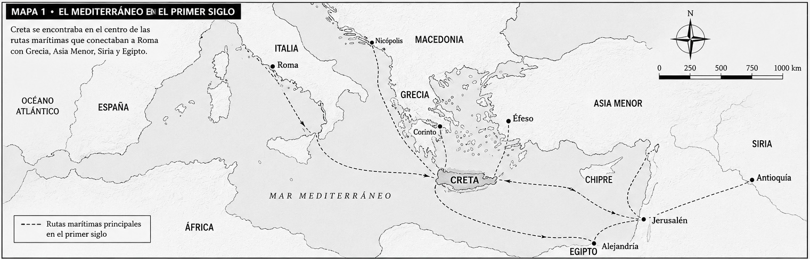
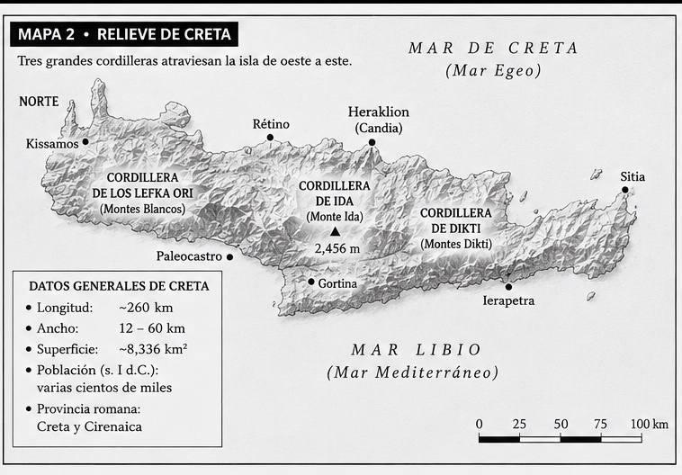
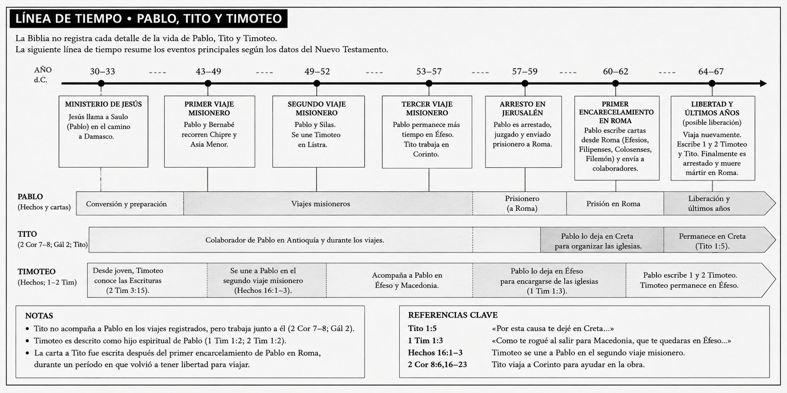
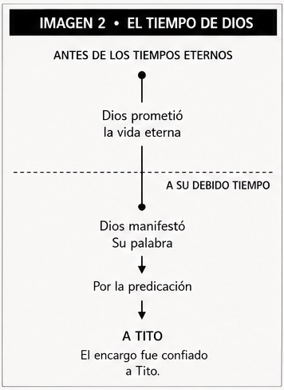
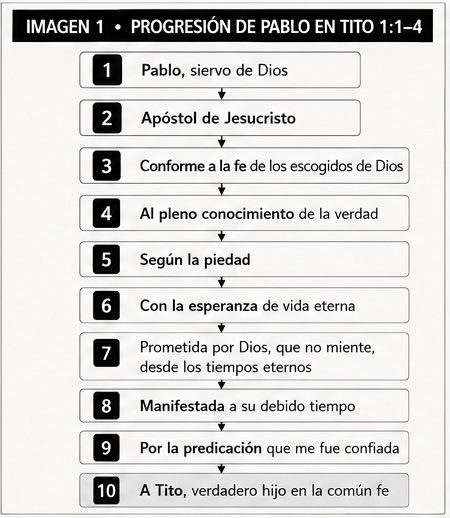
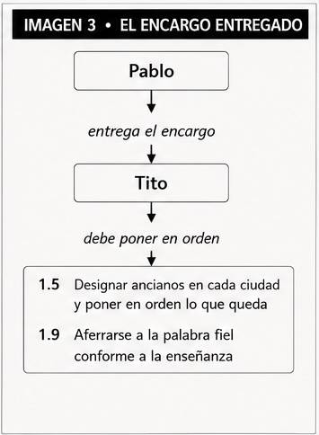
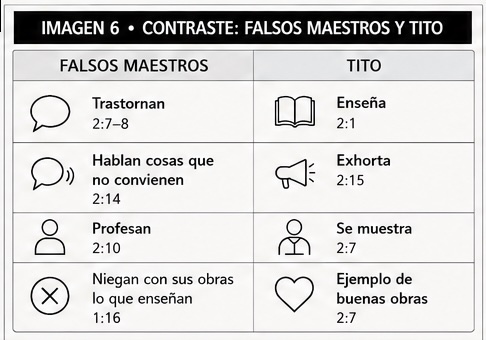
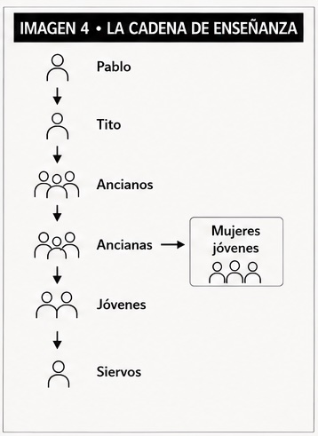
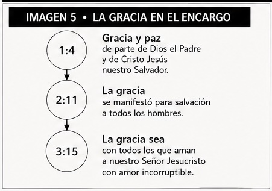
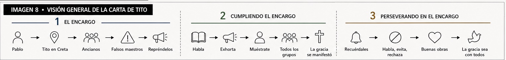

# Introducción

Antes de leer una carta conviene conocer el <u>mundo</u> en el que fue escrita.

La carta a Tito nació en un lugar real, entre personas reales, enfrentando circunstancias reales. Conocer ese escenario no responde las preguntas de la carta, pero sí nos ayuda a comprender mejor el contexto en el que <u>Pablo</u> escribió y el desafío que Tito recibió.

A lo largo de este estudio procuraremos permitir que la propia carta responda nuestras preguntas. No adelantaremos sus conclusiones ni resumiremos su mensaje antes de comenzar. Caminaremos junto al texto, observando cómo Pablo desarrolla sus ideas paso a <u>paso</u>.

Comencemos, entonces, conociendo el escenario donde todo <u>ocurrió</u>.

# Conociendo Creta

## Una isla en el corazón del Mediterráneo

> 

Creta es la isla más grande de Grecia y una de las <u>mayores</u> del mar Mediterráneo. Se encuentra al sur del continente griego, entre Europa, Asia y África, ocupando una posición estratégica sobre las principales rutas marítimas del mundo antiguo.

Durante el primer siglo, los barcos que navegaban entre Roma, Grecia, <u>Asia</u> Menor, Siria y Egipto conocían bien la isla de Creta. Su ubicación la convertía en un importante punto de paso para el comercio, el transporte y la comunicación entre distintas regiones del Imperio Romano.

Cuando Pablo dejó a Tito en Creta, no lo dejó en un lugar aislado. Lo dejó en una isla <u>conocida</u> por todo el Mediterráneo.

## Una isla mucho más grande de lo que imaginamos

> 

Con frecuencia imaginamos Creta <u>como</u> una pequeña isla. Sin embargo, mide aproximadamente **260 kilómetros de largo** y entre **12 y 60 kilómetros de ancho**, extendiéndose de este a oeste a través del Mediterráneo.

La isla estaba formada por numerosas ciudades y <u>poblaciones</u> distribuidas a lo largo de toda su extensión.

Cuando Pablo <u>escribió</u>:

> «...designes <u>ancianos</u> en cada ciudad...» (Tito 1:5)

<u>estaba</u> hablando de una tarea que abarcaba toda la isla.

## Una tierra de montañas

> 

La mayor parte de Creta está formada por cordilleras, valles y desfiladeros. Tres grandes cadenas montañosas atraviesan la <u>isla</u> de un extremo al otro, con cumbres que superan los dos mil metros de altura.

En tiempos de Tito no existían carreteras modernas. Viajar significaba recorrer caminos estrechos entre montañas, cruzar <u>valles</u> y desplazarse de ciudad en ciudad a pie o a caballo.

Este <u>escenario</u> nos ayuda a apreciar la dimensión práctica del encargo recibido por Tito.

## Una isla con una larga historia

Mucho <u>antes</u> del Imperio Romano, Creta había sido el hogar de la antigua civilización minoica, una de las más importantes del Mediterráneo.

Con el paso de los siglos fue <u>gobernada</u> por distintos pueblos hasta convertirse, en el año 67 a.C., en parte del Imperio Romano.

Para la época del Nuevo Testamento, Creta era una <u>provincia</u> romana con numerosas ciudades distribuidas por toda la isla.

## La reputación de Creta

Los escritores antiguos mencionan <u>frecuentemente</u> a Creta.

Algunos destacaban su importancia <u>estratégica</u>.

Otros describían el carácter de sus <u>habitantes</u>.

Estrabón menciona las continuas <u>disputas</u> internas y la piratería presentes en la isla.

El historiador Polibio criticó <u>severamente</u> las costumbres de muchos cretenses de su tiempo.

Incluso uno de sus propios poetas, Epiménides, escribió las <u>palabras</u> que Pablo más tarde citaría en la carta:

> «Los cretenses siempre son mentirosos, malas bestias, <u>glotones</u> ociosos.»
> *(<u>Tito</u> 1:12)*

Resulta interesante que Pablo no escriba una carta para describir la cultura cretense. Más bien, <u>utiliza</u> esa conocida afirmación como parte del desarrollo de un argumento que la propia carta irá revelando.

# El momento histórico

El libro de los Hechos registra que Pablo pasó por Creta <u>cuando</u> era llevado prisionero rumbo a Roma (Hechos 27).

Sin embargo, la situación <u>descrita</u> en la carta a Tito corresponde a un momento posterior. Cuando leemos la carta encontramos a Tito ya establecido en la isla, con responsabilidades que no aparecen durante el viaje narrado por Lucas.

Por esta razón, la mayoría de los estudiosos entiende que la carta fue escrita después del primer encarcelamiento romano de Pablo, durante un período en el que volvió a tener <u>libertad</u> para viajar.

Aunque el Nuevo Testamento no narra detalladamente ese viaje, esta reconstrucción armoniza con los datos proporcionados por las cartas <u>pastorales</u>.

> 

# Pablo y Tito

El autor de la carta se identifica <u>desde</u> las primeras palabras:

> «Pablo, siervo de Dios y <u>apóstol</u> de Jesucristo...» (Tito 1:1)

Tito <u>aparece</u> repetidamente junto a Pablo en otras cartas del Nuevo Testamento como uno de sus colaboradores más cercanos (2 Corintios 7–8; Gálatas 2).

Cuando comienza esta <u>carta</u>, Tito ya se encuentra en Creta desempeñando una labor que Pablo le había confiado.

¿<u>Cuál</u> era esa labor?

La <u>carta</u> misma responderá esa pregunta.

# ¿A quién fue escrita esta carta?

Aunque Tito es el destinatario <u>directo</u>, la carta menciona repetidamente a distintos grupos dentro de las iglesias:

- ancianos
- hombres mayores
- mujeres mayores
- mujeres jóvenes
- hombres jóvenes
- siervos

Desde el <u>principio</u> observamos que las instrucciones de Pablo alcanzan diversos ámbitos de la vida de la iglesia.

La carta <u>comienza</u> dirigida a Tito, pero muy pronto descubriremos que su contenido involucra a toda la comunidad.

# Cómo leer este manual

Nuestro propósito no será <u>adelantarnos</u> al mensaje de la carta, sino descubrirlo junto con Pablo.

A medida que avancemos observaremos cómo ciertas palabras, contrastes, propósitos y <u>mandatos</u> aparecen una y otra vez. Algunas ideas surgirán discretamente; otras se repetirán hasta convertirse en parte del movimiento natural de la carta.

Permitamos que sea la propia Escritura quien <u>establezca</u> el orden, haga las preguntas y presente las respuestas.

Ahora que conocemos el escenario, es tiempo de <u>escuchar</u> las primeras palabras de Pablo.

> **«Pablo, siervo de <u>Dios</u> y apóstol de Jesucristo...»**

# CAPÍTULO 1 — EL ENCARGO DE TITO

## Tito 1:1 - 4 Un Encargo conforme a la fe, verdad, piedad y esperanza

### Tito 1:1–4 — *y a su propio tiempo manifestó su palabra por la predicación*

*Pablo, siervo de <u>Dios</u> y apóstol de Jesucristo, conforme a la fe de los escogidos de Dios y al pleno conocimiento de la verdad que es según la piedad*
*con la esperanza de vida eterna, la cual Dios, que no miente, prometió desde los tiempos <u>eternos</u>,*
*y a su debido <u>tiempo</u>, manifestó Su palabra por la predicación que me fue confiada, conforme al mandamiento de Dios nuestro Salvador.*
*a <u>Tito</u>, verdadero hijo en la común fe: Gracia y paz de parte de Dios el Padre y de Cristo Jesús nuestro Salvador.*

+ *Pablo, siervo de Dios, apóstol de Cristo Jesús,*

> La carta comienza identificando al autor. <u>Antes</u> de hablar del propósito de la carta o de Tito, Pablo se presenta a sí mismo.

> Lo primero que dice acerca de sí mismo es que es "siervo de <u>Dios</u>".

> *"Siervo" traduce la palabra griega *doulos*. Se usaba para una <u>persona</u> que pertenecía a un señor y vivía para cumplir su voluntad. Antes de mencionar cualquier tarea o responsabilidad, Pablo deja claro a quién pertenece.

> Después <u>añade</u> que también es "apóstol de Cristo Jesús".

> *"Apóstol" traduce la palabra griega *apostolos*. Era alguien enviado con la autoridad de otra persona. No iba representándose a sí mismo, sino a quien lo enviaba. Pablo no solo pertenece a <u>Dios</u>; también ha sido enviado por Jesucristo.

+ *conforme a la fe de los escogidos de Dios*

> A partir de este punto la presentación de Pablo comienza a crecer. La <u>oración</u> todavía no explica estas ideas; simplemente las va añadiendo una tras otra.

> <u>Pablo</u> sigue siendo el sujeto de la oración.

> <u>Primero</u> se presenta como siervo y apóstol. Ahora añade que su ministerio es "conforme a la fe de los escogidos de Dios".

> Aquí *"la fe" no describe la acción de creer, sino aquello que caracteriza a este grupo llamado *"los <u>escogidos</u> de Dios".

> En este momento Pablo no explica qué entiende por *"la fe" ni quiénes son *"los escogidos". Solamente introduce <u>estas</u> expresiones. La carta irá desarrollando su significado.

+ *y al pleno conocimiento de la verdad que es según la piedad,*

> Pablo continúa <u>ampliando</u> su presentación.

> Ahora añade <u>otra</u> expresión: "el pleno conocimiento de la verdad".

> *"Conocimiento" traduce una palabra griega que <u>habla</u> de conocer plenamente o reconocer algo con claridad. No se trata solamente de tener información, sino de conocer la verdad.

> Hasta aquí <u>Pablo</u> ha mencionado:

> - la fe
> - el pleno conocimiento de la <u>verdad</u>

> Después añade una nueva <u>relación</u>:

> "la <u>verdad</u> según la piedad".

> El texto no presenta *"la verdad" y *"la piedad" <u>como</u> dos ideas separadas. Las une dentro de una misma expresión.

> En este momento Pablo todavía no explica cómo se relacionan. Simplemente nos muestra que existe una relación entre ambas. A medida que avance la carta, esa relación <u>aparecerá</u> una y otra vez.

> *"Piedad" traduce una palabra que describe una manera de vivir que honra a Dios. Pablo aún no desarrolla esta idea; solamente la <u>introduce</u>.

+ *con la esperanza de vida eterna*

> La oración <u>continúa</u> creciendo.

> Pablo todavía no se <u>detiene</u> a explicar ninguna de las expresiones que ha mencionado. Simplemente sigue acumulándolas.

> Hasta <u>este</u> momento hemos visto:

> - Pablo, siervo de Dios y <u>apóstol</u> de Jesucristo.
> - Conforme a la fe de los escogidos de <u>Dios</u>.
> - Al <u>pleno</u> conocimiento de la verdad.
> - <u>Según</u> la piedad.
> - Con la esperanza de vida <u>eterna</u>.

> Ahora aparece la *"esperanza de <u>vida</u> eterna".

> *"Esperanza" no habla simplemente de un deseo o de algo que quizá suceda. En el Nuevo Testamento describe una expectativa <u>firme</u> puesta en aquello que Dios ha prometido.

> Pablo todavía no explica <u>esta</u> esperanza. Solamente la añade a las demás expresiones con las que ha venido presentando su ministerio.

- *la cual Dios, que no miente, prometió desde los tiempos eternos,*

*<u>vida</u> eterna*

> *"La cual" introduce una nueva explicación <u>acerca</u> de la *vida eterna*.

> El sujeto de la <u>oración</u> cambia. Hasta ahora la atención estaba puesta principalmente en Pablo. Ahora el texto dirige nuestra mirada hacia Dios.

> Antes de mencionar lo que Dios hizo, <u>Pablo</u> describe quién es.

> Lo presenta <u>como</u> "Dios, que no miente".

> El carácter de Dios aparece antes que su acción. Primero <u>conocemos</u> quién promete; después conocemos la promesa.

> El texto <u>dice</u> que Dios **prometió** la vida eterna.

> Después <u>añade</u> cuándo hizo esa promesa:

> "<u>desde</u> los tiempos eternos".

> Pablo no <u>desarrolla</u> todavía esta afirmación. Solamente ubica la promesa antes del tiempo tal como nosotros lo conocemos.

#### *y a su debido tiempo, manifestó Su palabra por la predicación*

> Después de hablar de una promesa hecha *"<u>desde</u> los tiempos eternos", Pablo introduce otro momento.

> <u>Ahora</u> habla de "su debido tiempo".

> El texto comienza a <u>mostrar</u> un movimiento.

> Dios <u>prometió</u>.

> Y, cuando llegó el tiempo <u>señalado</u>, Dios manifestó su palabra.

> *"<u>Manifestó</u>" significa hacer visible o dar a conocer aquello que estaba oculto.

> Pablo todavía mantiene a Dios como sujeto de la oración. Ahora ya no habla de una promesa, <u>sino</u> de la manifestación de su palabra.

- *por la predicación...que me fue confiada*

> El texto <u>explica</u> el medio por el cual Dios manifestó su palabra.

> Fue "por la <u>predicación</u>".

> *"Predicación" traduce una palabra que se refiere al anuncio público de un mensaje. <u>Dios</u> dio a conocer su palabra mediante ese anuncio.

> Pablo añade que esta predicación "me fue <u>confiada</u>".

> El verbo aparece en forma pasiva. Pablo no <u>presenta</u> este ministerio como una iniciativa personal ni como un derecho ganado por él mismo.

> La <u>recibió</u> porque le fue confiada.

+ *conforme al mandamiento de Dios nuestro Salvador,*

> <u>Pablo</u> añade conforme a qué le fue confiada esa predicación.

> Fue "conforme al mandamiento de <u>Dios</u>".

> El ministerio de <u>Pablo</u> no nació de una decisión personal. Tiene su origen en el mandato de Dios.

> La <u>presentación</u> termina recordándonos que este Dios es "nuestro Salvador".

> Pablo no habla solamente de su Salvador, sino del <u>Salvador</u> que comparte con todos los creyentes.

+ *A Tito, hijo genuino según la fe común:*

> Después de presentar al <u>autor</u>, la carta presenta al destinatario.

> Pablo escribe **a <u>Tito</u>**.

> Lo <u>llama</u> "hijo genuino".

> En este momento la carta no explica por qué utiliza esta expresión. Simplemente describe así la relación que <u>existe</u> entre Pablo y Tito.

> Después añade "<u>según</u> la fe común".

> *"Común" significa compartida. Pablo y Tito <u>participan</u> de la misma fe.

> El <u>texto</u> no desarrolla todavía esa relación. Solamente la presenta antes de comenzar el contenido de la carta.

+ *gracia y paz de Dios Padre y de Cristo Jesús nuestro Salvador*

> La <u>presentación</u> termina con el saludo habitual de Pablo.

> Él desea <u>para</u> Tito **gracia y paz**.

> *"Gracia" <u>habla</u> del favor de Dios dado gratuitamente.

> *"Paz" describe la tranquilidad y la reconciliación que proceden de <u>Dios</u>.

> Pablo presenta tanto a **Dios Padre** como a **Cristo Jesús** <u>como</u> la fuente de esta gracia y de esta paz.

> Finalmente vuelve a describir a Cristo como "nuestro Salvador", una expresión que aparecerá nuevamente a lo largo de la <u>carta</u>.

### En Síntesis

* Pablo se presenta como **siervo de Dios** y **apóstol de Jesucristo**, mostrando tanto a quién pertenece como quién lo envió.

* Desde el inicio de la carta aparecen las expresiones que marcarán su desarrollo: **la fe**, **la verdad**, **la piedad** y **la esperanza de la vida eterna**.

* Dios es presentado como **el que no miente**, quien prometió la vida eterna desde los tiempos eternos y manifestó Su palabra en el tiempo señalado por medio de la predicación confiada a Pablo.

* El ministerio de Pablo no nace de una iniciativa personal, sino del **mandamiento de Dios nuestro Salvador**.

* Tito es presentado como el destinatario de la carta y como **verdadero hijo según la fe común**, mostrando la relación que comparte con Pablo en el evangelio.

* La introducción termina con **gracia y paz** de parte de Dios Padre y de Cristo Jesús nuestro Salvador, anticipando uno de los grandes énfasis que recorrerá toda la carta.

### Tito 1:5–11 — *Por esta razón te dejé en Creta*

*Por <u>esta</u> causa te dejé en Creta, para que pusieras en orden lo que queda, y designaras ancianos en cada ciudad como te mandé.*
*Lo designarás, si el anciano es <u>irreprensible</u>, marido de una sola mujer, que tenga hijos creyentes, no acusados de disolución ni de rebeldía.*
*<u>Porque</u> el obispo debe ser irreprensible como administrador de Dios, no obstinado, no iracundo, no dado a la bebida, no pendenciero, no amante de ganancias deshonestas.*
*Antes bien, debe ser hospitalario, amante de lo bueno, prudente, justo, santo, dueño de sí <u>mismo</u>.*
*Debe retener la palabra fiel que es conforme a la enseñanza, para que sea capaz también de exhortar con sana <u>doctrina</u> y refutar a los que contradicen.*
*Porque hay muchos <u>rebeldes</u>, habladores vanos y engañadores, especialmente los de la circuncisión,*
*a quienes es preciso tapar la boca, <u>porque</u> están trastornando familias enteras, enseñando por ganancias deshonestas, cosas que no deben.*

#### *Por esta razón te dejé en Creta*

* Esta frase <u>empieza</u> sola, sin una palabra de enlace (como «y» o «porque»).

> La carta entra directamente al motivo por el cual Pablo <u>escribe</u> a Tito.

> Es Pablo quien <u>dejó</u> a Tito en Creta.

> Desde el <u>comienzo</u> conocemos el hecho, pero todavía no conocemos la razón completa.

> Pablo solamente establece que dejó a Tito en la isla <u>porque</u> había una tarea que debía realizar.

- *para que pusieras en orden lo que queda*

* "<u>para</u> que" (ἵνα) dice el propósito de «dejé» — para qué se hace esa acción.

* "falta" (λείποντα) va junto a «corrigieras». No es el <u>verbo</u> principal; muestra algo que ocurre al mismo tiempo o en relación con esa acción.

> En seguida Pablo explica el <u>propósito</u> por el cual dejó a Tito en Creta.

> Tito <u>debía</u> **poner en orden lo que queda**.

> En este momento la carta no <u>explica</u> qué significa exactamente "poner en orden".

> <u>Tampoco</u> desarrolla qué comprende "lo que queda".

> Pablo simplemente presenta el propósito. <u>Será</u> la propia carta la que irá mostrando qué implicaba ese trabajo.

- *y designaras ancianos en cada ciudad como te mandé*

* Esta frase va <u>unida</u> con «y» y sigue bajo el mismo «ἵνα» de la frase anterior. No abre un propósito nuevo; continúa el mismo.

> Pablo añade una segunda parte del <u>mismo</u> propósito.

> No presenta un propósito diferente, sino otra tarea que <u>forma</u> parte de la razón por la cual Tito fue dejado en Creta.

> Tito <u>debía</u> **designar ancianos en cada ciudad**.

> <u>Hasta</u> aquí la progresión es sencilla:

> Por esta <u>causa</u> te dejé.

> Para que pusieras en orden lo que <u>queda</u>.

> Y <u>designaras</u> ancianos en cada ciudad.

- *como te mande*

* "como" (ὡς) <u>dice</u> el momento relacionado con la frase anterior — cuándo.

> Pablo <u>añade</u> que esta tarea no era nueva para Tito.

> Él ya había recibido <u>estas</u> instrucciones anteriormente.

> En este momento la carta todavía no explica cómo <u>debía</u> ponerse en orden lo que quedaba.

> Tampoco explica cómo debía realizarse la designación de los <u>ancianos</u>.

> Pablo <u>solamente</u> presenta el encargo. Los detalles aparecerán en el desarrollo de la carta.

  - *Lo designarás, si el anciano es irreprensible, marido de una sola mujer*

  * "si" (εἴ) pone una condición: «si esto…», entonces aplica lo de la frase <u>anterior</u>.

  * "con" (ἔχων) describe a *fieles, que*. No es el verbo principal; <u>añade</u> detalle sobre esa persona o cosa.

> A partir de este punto la <u>carta</u> deja de hablar del trabajo de Tito y comienza a describir el tipo de hombre que debía ser designado.

> La designación queda <u>unida</u> a una condición.

> Pablo <u>dice</u>:

> "Lo <u>designarás</u>, si..."

> La <u>condición</u> aparece antes que la designación.

> <u>Después</u> comienza una serie de características que describen el carácter del anciano.

> Primero menciona que <u>debe</u> ser **irreprensible**.

> <u>Después</u> añade que sea **marido de una sola mujer**.

> La carta todavía no explica estas expresiones. Simplemente <u>comienza</u> a describir al hombre que puede ser designado.

  + *con hijos fieles, que no estén bajo acusación de disolución o de ser insubordinados*

> Pablo continúa <u>describiendo</u> el entorno familiar del anciano.

> El texto añade que <u>tenga</u> **hijos creyentes**.

> Después describe dos cosas que no <u>deben</u> caracterizarlos.

> No deben estar bajo <u>acusación</u> de:

> - <u>disolución</u>.
> - <u>rebeldía</u>.

> Hasta este momento toda la descripción permanece dentro del <u>ámbito</u> familiar.

    - *Porque es necesario que el obispo sea irreprochable*
    
    * "porque" (γὰρ) da el <u>motivo</u> de la frase anterior — por qué se dijo eso.
    
    * "sea" (εἶναι) <u>completa</u> a "necesario" (δεῖ): dice *qué* se debe hacer o qué acción sigue.

> Ahora Pablo explica la razón de la condición <u>anterior</u>.

> Introduce esa explicación con "<u>porque</u>".

> En el <u>versículo</u> anterior habló del **anciano**.

> Ahora utiliza la <u>palabra</u> **obispo**.

> El <u>texto</u> no introduce una persona diferente. Continúa describiendo al mismo hombre.

    + *como administrador de Dios,*

> Pablo <u>añade</u> una nueva descripción.

> El obispo es presentado <u>como</u> **administrador de Dios**.

> *"Administrador" traduce una palabra que describe a la persona encargada de cuidar los bienes de otra. No <u>actúa</u> como dueño, sino como responsable de aquello que le ha sido confiado.

> <u>Precisamente</u> por esa responsabilidad debe ser irreprensible.

    + *no obstinado, no iracundo, no dado a la bebida, no pendenciero, no amante de ganancias deshonestas*

> <u>Pablo</u> comienza describiendo lo que este administrador **no debe ser**.

> La <u>lista</u> no habla de sus capacidades, sino de su carácter.

> No <u>debe</u> ser:

> - <u>obstinado</u>.
> - <u>iracundo</u>.
> - <u>dado</u> a la bebida.
> - <u>pendenciero</u>.
> - amante de <u>ganancias</u> deshonestas.

    + *sino hospitalario, amante de lo bueno, prudente, justo, santo, dueño de sí*

> Después el <u>énfasis</u> cambia.

> <u>Ahora</u> Pablo deja de describir lo que el administrador no debe ser y comienza a mostrar lo que sí debe caracterizarlo.

> <u>Debe</u> ser:

> - <u>hospitalario</u>.
> - amante de lo <u>bueno</u>.
> - <u>prudente</u>.
> - <u>justo</u>.
> - <u>santo</u>.
> - dueño de sí <u>mismo</u>.

> La <u>atención</u> continúa puesta en el obispo como administrador de Dios.

    + *Debe retener la palabra fiel que es conforme a la enseñanza,*

> La descripción termina con una última <u>característica</u>.

> El administrador de Dios <u>debe</u> **retener la palabra fiel**.

> *"Retener" <u>significa</u> mantenerse firmemente unido a algo, sin soltarlo.

> En este momento Pablo no explica qué comprende "la palabra <u>fiel</u>".

> Solamente <u>añade</u> que es **conforme a la enseñanza**.

> Más adelante la carta <u>volverá</u> repetidamente sobre la enseñanza.

    - *para que sea capaz también de exhortar con sana doctrina y refutar los que contradicen*
    
    * "para que" (ἵνα) dice el propósito de «es» — <u>para</u> qué se hace esa acción.
    
    * "exhortar" (παρακαλεῖν) completa a "sea" (ᾖ): <u>dice</u> *qué* se debe hacer o qué acción sigue.
    
    * "reprender" (ἐλέγχειν) completa a "sea" (ᾖ): dice *qué* se <u>debe</u> hacer o qué acción sigue.

> Hasta aquí Pablo ha <u>descrito</u> cómo debe ser el administrador de Dios.

> <u>Ahora</u> explica **para qué** debe ser así.

> El propósito <u>comienza</u> con "para que".

> Debe ser <u>capaz</u> de **exhortar con sana doctrina**.

> <u>También</u> debe ser capaz de **refutar a los que contradicen**.

> El propósito no está dirigido a su propio beneficio, <u>sino</u> al cuidado de otros.

> En <u>este</u> momento la carta introduce la expresión "sana doctrina", pero todavía no la desarrolla.

    * "contradicen" (ἀντιλέγοντας) va <u>junto</u> a «sea». No es el verbo principal; muestra algo que ocurre al mismo tiempo o en relación con esa acción.

> El propósito <u>tiene</u> dos partes.

> No <u>solamente</u> exhortar.

> También <u>refutar</u> a quienes contradicen.

    * "reteniendo" (ἀντεχόμενον) funciona como un nombre: <u>señala</u> a una persona o cosa (quién / qué), no solo describe a otra.
    
    * "<u>sana</u>" (ὑγιαινούσῃ) describe a *doctrina*. No es el verbo principal; añade detalle sobre esa persona o cosa.
    
      - *Porque hay muchos e insubordinados, vanos habladores y engañadores*
    
      * "porque" (γὰρ) da el <u>motivo</u> de la frase anterior — por qué se dijo eso.

> Hasta este momento Pablo ha hablado del <u>hombre</u> que debe ser designado.

> Ahora <u>cambia</u> el enfoque.

> Comienza a describir el problema que existe en las <u>iglesias</u>.

> Introduce <u>esta</u> nueva razón con "porque".

> <u>Pablo</u> no dice que quizá aparezcan estas personas.

> <u>Dice</u> que **hay muchos**.

> El problema ya <u>estaba</u> presente.

> Después describe varias características de <u>ellos</u>.

> <u>Son</u>:

> - <u>rebeldes</u>.
> - habladores <u>vanos</u>.
> - <u>engañadores</u>.

      + *sobre todo los de la circuncisión*

> Pablo hace un énfasis especial en un <u>grupo</u>.

> Dice "sobre <u>todo</u> los de la circuncisión".

> No afirma que todos pertenezcan a ese grupo, pero sí destaca que muchos de ellos <u>provenían</u> de allí.

        - *a quienes es preciso tapar la boca*
        *e insubordinados, vanos habladores y engañadores, <u>sobre</u>*
    
        * "cual" (οὓς) abre una frase que habla más de *e <u>insubordinados</u>, vanos habladores y engañadores, sobre*.
    
        * "tapar" (ἐπιστομίζειν) <u>completa</u> a "necesario" (δεῖ): dice *qué* se debe hacer o qué acción sigue.

> Pablo continúa hablando del <u>mismo</u> grupo.

> Ahora describe lo que <u>considera</u> necesario hacer.

> Dice que **es preciso <u>tapar</u> la boca**.

> El texto no desarrolla <u>todavía</u> cómo debía hacerse. Solamente expresa que era una necesidad.

        - *porque están trastornando familias enteras*
        *e insubordinados, vanos habladores y <u>engañadores</u>, sobre todo los de*
    
        * "el cual" (οἵτινες) abre una frase que <u>habla</u> más de *e insubordinados, vanos habladores y engañadores, sobre todo los de*.

> Pablo <u>añade</u> la razón.

> Era necesario taparles la <u>boca</u> **porque** estaban trastornando familias enteras.

> El texto ya no describe <u>solamente</u> a estos hombres.

> Ahora describe el <u>efecto</u> que estaban produciendo.

> El problema <u>alcanzaba</u> a familias enteras.

        - *enseñando por ganancias deshonestas, cosas que no deben*
        *e insubordinados, vanos <u>habladores</u> y*
    
        * "cual" (ἃ) abre una frase que habla más de *e insubordinados, <u>vanos</u> habladores y*.
    
        * "enseñando" (διδάσκοντες) va junto a «conviene». No es el verbo principal; muestra algo que ocurre al mismo tiempo o en relación con esa <u>acción</u>.

> <u>Pablo</u> completa la descripción del problema.

> Estas personas estaban trastornando familias **<u>enseñando</u>**.

> Después añade la <u>motivación</u> que acompañaba esa enseñanza.

> Lo hacían **por ganancias <u>deshonestas</u>**.

> <u>Finalmente</u> resume el contenido de esa enseñanza con una expresión sencilla.

> Enseñaban **cosas que no <u>deben</u>**.

### Tito 1:12 — *Dijo uno de ellos, su propio profeta*

*Uno de ellos, su propio profeta, <u>dijo</u>: «Los cretenses son siempre mentirosos, malas bestias, glotones ociosos».*

#### *Uno de ellos, su propio profeta, dijo:*

* Esta frase empieza sola, sin una palabra de <u>enlace</u> (como «y» o «porque»).

> El texto continúa desarrollando la <u>situación</u> que Pablo acaba de describir.

> Hasta el versículo anterior <u>habló</u> de un grupo de hombres que estaban trastornando familias enteras con su enseñanza.

> Ahora introduce a "uno de <u>ellos</u>".

> En este momento la carta todavía no <u>dice</u> su nombre.

> Solamente nos informa que pertenece al mismo grupo al que <u>hace</u> referencia.

> Después añade una <u>nueva</u> descripción.

> Ese hombre era "su <u>propio</u> profeta".

> Pablo no explica qué entiende aquí por *"profeta". Simplemente identifica a la persona cuya declaración <u>está</u> a punto de citar.

> A continuación, Pablo <u>deja</u> de hablar con sus propias palabras y presenta una cita.

+ *Los cretenses son siempre mentirosos, malas bestias, vientres ociosos*

> Pablo <u>cita</u> las palabras de ese profeta.

> La declaración <u>contiene</u> tres descripciones acerca de los cretenses:

> - siempre <u>mentirosos</u>.
> - <u>malas</u> bestias.
> - <u>vientres</u> ociosos.

> En este <u>momento</u> Pablo todavía no comenta la cita.

> Solamente reproduce lo que <u>dijo</u> este hombre.

> Ahora el lector puede identificar <u>quiénes</u> forman parte del grupo mencionado en la cita.

> La atención del texto pasa a los **<u>cretenses</u>**, preparando el comentario que Pablo hará en el siguiente versículo.

### Tito 1:13 — *Este testimonio es verdadero*

#### *Este testimonio es verdadero*

* Esta frase empieza sola, sin una palabra de <u>enlace</u> (como «y» o «porque»).

> Después de <u>citar</u> las palabras del profeta, Pablo hace un comentario sobre ellas.

> <u>Dice</u> sencillamente:

> "Este <u>testimonio</u> es verdadero."

> El texto no discute <u>quién</u> era el profeta ni cómo llegó a esa conclusión.

> <u>Pablo</u> solamente afirma que ese testimonio es verdadero.

> Esa afirmación <u>prepara</u> la acción que ordenará a continuación.

### En Síntesis

* Pablo explica por qué dejó a Tito en Creta: **poner en orden lo que quedaba** y **designar ancianos en cada ciudad**.

* La designación de ancianos queda unida a una condición. Antes de ser designado, el anciano debía mostrar un carácter irreprensible en su vida, su familia y su conducta.

* El anciano es presentado como **administrador de Dios**. Por esa responsabilidad debía retener firmemente la palabra fiel conforme a la enseñanza.

* El propósito de ese carácter y de esa fidelidad era doble: **exhortar con sana doctrina** y **refutar a los que contradicen**.

* Pablo explica que esta necesidad no era teórica. Ya había muchos rebeldes, habladores vanos y engañadores que estaban trastornando familias enteras enseñando cosas que no debían por ganancias deshonestas.

* La sección concluye con el testimonio acerca de los cretenses y la afirmación de Pablo: **«Este testimonio es verdadero»**, preparando la instrucción que desarrollará en los siguientes versículos.

### Tito 1:13–15 — *Por esta razón repréndelos severamente*

*Este testimonio es verdadero. Por eso, repréndelos <u>severamente</u> para que sean sanos en la fe,*
*y no presten <u>atención</u> a mitos judaicos y a mandamientos de hombres que se apartan de la verdad.*
*Todas las cosas son puras para los puros, pero para los corrompidos e incrédulos nada es puro, sino que tanto su mente como su <u>conciencia</u> están corrompidas.*

#### *Por eso, repréndelos severamente*

* "<u>cual</u>" (ἣν) sigue la idea anterior y la une a esta frase.

> "Por eso" une <u>esta</u> orden con la afirmación anterior.

> La secuencia es <u>sencilla</u>:

> El testimonio es <u>verdadero</u>.

> Por eso, repréndelos <u>severamente</u>.

> La <u>orden</u> está dirigida a Tito.

> <u>Debía</u> **reprenderlos**.

> Después Pablo añade cómo debía <u>hacerlo</u>.

> La reprensión <u>debía</u> ser **severa**.

> En este momento el texto todavía no explica en qué consistía esa severidad. Solamente <u>caracteriza</u> la manera en que debía realizarse la reprensión.

- *para que sean sanos en la fe*

* "para que" (ἵνα) dice el propósito de «repréndelos» — <u>para</u> qué se hace esa acción.

> Pablo añade el propósito de esa <u>reprensión</u>.

> La reprensión no <u>aparece</u> como un fin en sí misma.

> Debía realizarse **para que** <u>ellos</u> fueran sanos en la fe.

> *"Sanos" traduce una palabra que describe aquello que está sano, <u>saludable</u> o libre de enfermedad.

> Pablo utiliza esta imagen para <u>hablar</u> de **la fe**.

> En este momento no desarrolla qué comprende esa expresión. Solamente presenta el propósito de la <u>reprensión</u>.

+ *y no presten atención a mitos judaicos*

* "prestando" (προσέχοντες) describe a *a mitos*. No es el verbo principal; añade detalle <u>sobre</u> esa persona o cosa.

* "apartan" (ἀποστρεφομένων) describe a *de la*. No es el <u>verbo</u> principal; añade detalle sobre esa persona o cosa.

> El <u>propósito</u> continúa desarrollándose.

> Pablo <u>añade</u> una segunda parte.

> No <u>solamente</u> debían ser sanos en la fe.

> También debían **<u>dejar</u> de prestar atención** a ciertas cosas.

> <u>Primero</u> menciona **los mitos judaicos**.

> El texto no explica todavía en qué <u>consistían</u> esos mitos. Solamente señala que no debían prestarles atención.

+ *y a mandamientos de hombres que se apartan de la verdad.*

> La misma idea continúa <u>ampliándose</u>.

> No debían <u>prestar</u> atención:

> - a mitos <u>judaicos</u>.
> - a <u>mandamientos</u> de hombres.

> Después Pablo <u>añade</u> una descripción de esos hombres.

> Son hombres **que se apartan de la <u>verdad</u>**.

> El énfasis no <u>está</u> solamente en los mandamientos, sino también en quienes los promueven.

+ *Todas las cosas son puras para los puros*

> Pablo <u>continúa</u> desarrollando su argumento.

> Ahora presenta una <u>afirmación</u>.

> <u>Dice</u>:

> "Todas las cosas son <u>puras</u> para los puros."

> El texto <u>establece</u> un contraste que será desarrollado inmediatamente.

> En este momento no explica quiénes son **los <u>puros</u>** ni cómo llegan a serlo.

> Solamente presenta esta <u>afirmación</u>.

- *pero para los corrompidos e incrédulos nada es puro,*

* Esta frase va unida con «pero» y marca un contraste con la afirmación <u>anterior</u>.

* "contaminados" (μεμιαμμένοις) <u>describe</u> a *corrompidos*. No es el verbo principal; añade detalle sobre esa persona o cosa.

> Pablo introduce <u>ahora</u> el contraste mediante la palabra "pero".

> Frente a **los puros**, aparecen **los corrompidos e <u>incrédulos</u>**.

> El texto presenta ambas <u>descripciones</u> unidas para hablar del mismo grupo de personas.

> El contraste <u>también</u> cambia el resultado.

> Para los puros, todas las cosas son <u>puras</u>.

> Pero para los corrompidos e incrédulos, **<u>nada</u> es puro**.

+ *sino que tanto su mente como su conciencia están corrompidas.*

> Pablo añade una <u>segunda</u> parte al contraste.

> El problema no <u>está</u> en las cosas.

> El texto <u>dirige</u> la atención hacia las personas.

> <u>Tanto</u> **la mente** como **la conciencia** de ellos están corrompidas.

> De esta manera <u>Pablo</u> explica por qué nada les resulta puro.

> El énfasis permanece sobre la condición de estas personas y no <u>sobre</u> las cosas mismas.

### Tito 1:16 — *Profesan conocer a Dios*

#### *Profesan conocer a Dios*

* Esta frase <u>empieza</u> sola, sin una palabra de enlace (como «y» o «porque»).

* "conocer" (εἰδέναι) completa a "Profesan" (ὁμολογοῦσιν): dice *qué* se <u>debe</u> hacer o qué acción sigue.

> Pablo continúa <u>hablando</u> del mismo grupo descrito en los versículos anteriores.

> <u>Ahora</u> añade una nueva descripción.

> Dice que <u>ellos</u> **profesan conocer a Dios**.

> *"Profesar" significa declarar o afirmar <u>algo</u> públicamente.

> Lo que estas personas afirman es que **conocen a <u>Dios</u>**.

> En este momento el texto solamente presenta esa afirmación. Todavía no dice si esa <u>profesión</u> corresponde con su manera de vivir.

### Tito 1:16 — *pero con las obras lo niegan, siendo abominables e inobedientes*

*<u>Profesan</u> conocer a Dios, pero con sus hechos lo niegan, siendo abominables y desobedientes e inútiles para cualquier obra buena.*

#### *pero con sus hechos lo niegan, siendo abominables y desobedientes e inútiles *

* "y" (δὲ) <u>sigue</u> la idea anterior y la une a esta frase.

* "siendo" (ὄντες) va junto a «niegan». No es el verbo <u>principal</u>; muestra algo que ocurre al mismo tiempo o en relación con esa acción.

> Inmediatamente Pablo introduce un <u>contraste</u> mediante la palabra "pero".

> El contraste no está entre dos grupos de <u>personas</u>.

> <u>Está</u> entre **lo que profesan** y **lo que hacen**.

> Ellos <u>profesan</u> conocer a Dios.

> Pero con sus obras lo <u>niegan</u>.

> El texto dirige la atención <u>hacia</u> sus hechos.

> No evalúa solamente sus palabras, <u>sino</u> también su conducta.

> Después Pablo añade <u>tres</u> descripciones acerca de ellos.

> <u>Son</u>:

> - <u>abominables</u>.
> - <u>desobedientes</u>.
> - <u>inútiles</u>.

> Estas descripciones continúan <u>hablando</u> del mismo grupo de personas.

+ *y reprobados para toda buena obra*

> Pablo añade una <u>última</u> descripción.

> Dice que son **<u>reprobados</u> para toda buena obra**.

> *"Reprobados" describe a alguien que no <u>resiste</u> una prueba o que no resulta aprobado después de ser examinado.

> La descripción queda <u>relacionada</u> con **toda buena obra**.

> De esta <u>manera</u> termina la descripción de este grupo.

> La carta ha <u>pasado</u> de lo que ellos **profesan**, a lo que **hacen**, y finalmente a la condición en la que Pablo los describe.

### En Síntesis

* Pablo ordena a Tito reprender severamente porque el testimonio acerca de los cretenses es verdadero. El propósito de esa reprensión es que sean sanos en la fe.

* Una fe sana implica dejar de prestar atención a los mitos judaicos y a los mandamientos de hombres que se apartan de la verdad.

* Pablo establece un contraste entre **los puros** y **los corrompidos e incrédulos**, mostrando que el problema no está en las cosas, sino en la condición de la mente y la conciencia.

* Estas personas profesan conocer a Dios, pero sus obras contradicen esa profesión.

* La carta muestra una clara diferencia entre **lo que dicen** y **la manera en que viven**, revelando que sus hechos niegan aquello que afirman.

* Pablo concluye describiéndolos como abominables, desobedientes e inútiles para toda buena obra, cerrando la sección con el contraste entre una fe sana y una profesión sin una vida conforme a ella.

# CAPÍTULO 2 — CUMPLIENDO EL ENCARGO

## Tito 2:1 - 15 En cuanto a ti Enseña, Exhorta y Muéstrate

### Tito 2:1–3 — *Pero tú habla lo que conviene a la sana doctrina*

*<u>Pero</u> en cuanto a ti, enseña lo que está de acuerdo con la sana doctrina:*
*Los ancianos deben ser sobrios, dignos, prudentes, sanos en la fe, en el amor, en la <u>perseverancia</u>.*
*Asimismo, las ancianas deben ser reverentes en su conducta, no calumniadoras ni <u>esclavas</u> de mucho vino. Que enseñen lo bueno,*

#### *Pero en cuanto a ti enseña lo que está de acuerdo con la sana doctrina:*

* "cual" (ἃ) sigue la <u>idea</u> anterior y la une a esta frase.

* "sana" (ὑγιαινούσῃ) describe a *doctrina*. No es el <u>verbo</u> principal; añade detalle sobre esa persona o cosa.

> El capítulo <u>comienza</u> con un fuerte contraste.

> <u>Pablo</u> dice:

> "Pero en <u>cuanto</u> a ti..."

> Hasta <u>este</u> momento ha descrito a los falsos maestros, su enseñanza y su conducta.

> Ahora dirige nuevamente la atención <u>hacia</u> Tito.

> El <u>contraste</u> no solo está entre las personas.

> También está entre lo que aquellos <u>enseñaban</u> y lo que Tito debía enseñar.

- *lo que conviene a la sana doctrina*
*lo que <u>conviene</u>*

* "cual" (ἃ) abre una <u>frase</u> que habla más de *lo que conviene*.

> El mandato <u>principal</u> es "enseña".

> Después Pablo <u>añade</u> qué debía enseñar.

> Debía enseñar **lo que <u>está</u> de acuerdo con la sana doctrina**.

> *"Doctrina" significa <u>enseñanza</u>.

> *"Sana" traduce una palabra que describe aquello que está <u>sano</u> o saludable.

> Pablo no explica todavía qué comprende esa sana <u>doctrina</u>.

> En lugar de <u>definirla</u>, comienza a mostrar cómo luce una vida que está de acuerdo con ella.

+ *Que los ancianos sean sobrios, dignos, prudentes, sanos en la fe, en el amor, en la paciencia*

* "sean" (εἶναι) nombra una acción que depende de un verbo <u>cercano</u> (como «debe» o «pide»).

* "<u>sanos</u>" (ὑγιαίνοντας) describe a *en la fe*. No es el verbo principal; añade detalle sobre esa persona o cosa.

> A <u>partir</u> de este punto Pablo comienza a desarrollar aquello que está de acuerdo con la sana doctrina.

> El primer <u>grupo</u> mencionado son **los ancianos**.

> La atención no <u>está</u> puesta en lo que deben hacer, sino en lo que deben ser.

> <u>Pablo</u> describe su carácter.

> <u>Deben</u> ser:

> - <u>sobrios</u>.
> - <u>dignos</u>.
> - <u>prudentes</u>.
> - <u>sanos</u>.

> Después <u>añade</u> en qué deben ser sanos.

> - en la fe.
> - en el <u>amor</u>.
> - en la <u>perseverancia</u>.

> La descripción <u>continúa</u> desarrollando cómo luce una vida que está de acuerdo con la sana doctrina.

+ *Las ancianas igualmente, en conducta reverentes, no calumniadoras, ni esclavizadas a mucho vino, maestras del bien*

* "esclavizadas" (δεδουλωμένας) describe a *bien*. No es el verbo <u>principal</u>; añade detalle sobre esa persona o cosa.

> Después Pablo dirige la atención hacia otro <u>grupo</u>.

> Dice "<u>asimismo</u>".

> Con esta palabra une la instrucción para las ancianas con la que <u>acaba</u> de dar a los ancianos.

> De la misma manera que describió el carácter de los ancianos, ahora comienza a describir el <u>carácter</u> de las ancianas.

> Deben ser **<u>reverentes</u> en su conducta**.

> Después añade dos <u>características</u> negativas.

> No <u>deben</u> ser:

> - <u>calumniadoras</u>.
> - <u>esclavas</u> de mucho vino.

> *"Esclavas" traduce una palabra que describe a <u>alguien</u> dominado o controlado por otra cosa. Pablo presenta el mucho vino como algo que no debía gobernar la vida de estas mujeres.

> <u>Finalmente</u> añade una característica positiva.

> Debían ser **maestras del <u>bien</u>**.

> La <u>carta</u> todavía no explica qué debían enseñar. Esa explicación aparecerá en los versículos siguientes.

+ *Que enseñen lo bueno,*

> Esta última expresión prepara la siguiente parte de la <u>carta</u>.

> Pablo pasa de describir el carácter de las ancianas a <u>señalar</u> una responsabilidad específica.

> <u>Debían</u> **enseñar lo bueno**.

> En este momento el texto no desarrolla qué comprende "lo <u>bueno</u>".

> Simplemente <u>introduce</u> esa responsabilidad antes de explicarla en los versículos que siguen.

### Tito 2:4–5 — *para que instruyan a las jóvenes*

*para que puedan <u>instruir</u> a las jóvenes a que amen a sus maridos, a que amen a sus hijos,*
*a que sean prudentes, puras, <u>hacendosas</u> en el hogar, amables, sujetas a sus maridos, para que la palabra de Dios no sea blasfemada.*

#### *para que puedan instruir a las jóvenes*

* "para que" (ἵνα) une esta <u>frase</u> a la anterior.

* "ser" (εἶναι) <u>completa</u> a "instruyan" (⸀σωφρονίζωσι): dice *qué* se debe hacer o qué acción sigue.

> <u>Esta</u> parte continúa directamente la instrucción dada a las ancianas.

> <u>Pablo</u> añade un propósito.

> Las ancianas <u>debían</u> **enseñar lo bueno**.

> **Para que** pudieran instruir a las <u>mujeres</u> más jóvenes.

> El propósito no termina en las <u>ancianas</u>.

> Lo que ellas aprenden debía continuar siendo transmitido a la <u>siguiente</u> generación.

> *"Instruir" traduce una palabra que significa ayudar a alguien a desarrollar buen juicio o una manera <u>sensata</u> de vivir.

+ *a que amen a sus maridos, a que amen a sus hijos,*

> Pablo comienza a describir aquello en lo que las <u>mujeres</u> jóvenes debían ser instruidas.

> Lo primero que <u>menciona</u> es:

> - <u>amar</u> a sus maridos.
> - amar a sus <u>hijos</u>.

> La <u>carta</u> no desarrolla estas expresiones en este momento.

> <u>Simplemente</u> comienza una lista que continuará en el siguiente versículo.

+ *a que sean prudentes, puras,hacendosas en el hogar, amables, sujetas a sus maridos,*

> La <u>lista</u> continúa.

> Las mujeres jóvenes <u>debían</u> ser:

> - <u>prudentes</u>.
> - <u>puras</u>.
> - <u>hacendosas</u> en el hogar.
> - <u>amables</u>.
> - sujetas a sus <u>maridos</u>.

> Pablo continúa <u>describiendo</u> el carácter y la conducta que las ancianas debían enseñar.

> En este momento no <u>explica</u> cada una de estas cualidades. Solamente las presenta como parte de la instrucción que debía transmitirse.

* "para que" (ἵνα) dice el propósito de «instruyan» — para qué se hace esa <u>acción</u>.

* "sujetas" (ὑποτασσομένας) funciona como un nombre: <u>señala</u> a una persona o cosa (quién / qué), no solo describe a otra.

- *para que la palabra de Dios no sea blasfemada*

> Pablo añade ahora el propósito de toda esta <u>instrucción</u>.

> Las <u>ancianas</u> debían enseñar.

> Las <u>jóvenes</u> debían aprender.

> Y todo ello <u>tenía</u> un propósito.

> **Para que la palabra de Dios no <u>fuera</u> blasfemada.**

> El texto <u>dirige</u> la atención hacia la Palabra de Dios.

> En <u>este</u> momento no explica cómo podría ser blasfemada.

> Solamente <u>presenta</u> el propósito que acompaña toda la instrucción dada hasta aquí.

> Hasta <u>este</u> momento Pablo ha ido cambiando de un grupo a otro.

> <u>Primero</u> habló a Tito.

> <u>Después</u> a los ancianos.

> Luego a las <u>ancianas</u>.

> Ahora las ancianas <u>aparecen</u> enseñando a las mujeres más jóvenes.

> El texto comienza a <u>mostrar</u> una secuencia de enseñanza.

> Pablo no presenta a las ancianas solamente como receptoras de instrucción. Ahora ellas mismas participan <u>enseñando</u> a otras.

> La <u>carta</u> todavía continuará desarrollando esta secuencia con otros grupos.

### En Síntesis

* Pablo dirige nuevamente la atención hacia Tito y le manda enseñar **lo que está de acuerdo con la sana doctrina**, en contraste con la enseñanza de los falsos maestros.

* En lugar de definir la sana doctrina, la carta comienza a mostrar cómo se refleja en la vida de los creyentes, describiendo el carácter que debe distinguir a cada grupo.

* Pablo comienza con los ancianos y las ancianas, enfatizando no solamente lo que deben hacer, sino principalmente **lo que deben ser**.

* Las ancianas reciben además la responsabilidad de enseñar lo bueno e instruir a las mujeres más jóvenes, mostrando que la enseñanza debía transmitirse de una generación a otra.

* La instrucción a las mujeres jóvenes culmina con un propósito: **que la palabra de Dios no sea blasfemada**.

* Desde el comienzo del capítulo se observa una cadena de enseñanza: **Pablo instruye a Tito, Tito enseña a la iglesia, y las ancianas enseñan a las mujeres más jóvenes**, mostrando cómo el encargo continúa desarrollándose dentro del pueblo de Dios.

### Tito 2:6–10 — *Exhorta igualmente a los jóvenes*

*Asimismo, exhorta a los <u>jóvenes</u> a que sean prudentes.*
*<u>Muéstrate</u> en todo como ejemplo de buenas obras, con pureza de doctrina, con dignidad,*
*con palabra sana e irreprochable, a fin de que el adversario se avergüence al no tener nada <u>malo</u> que decir de nosotros.*
*<u>Exhorta</u> a los siervos a que se sujeten a sus amos en todo, que sean complacientes, no contradiciendo,*
*no defraudando, sino mostrando toda buena fe, <u>para</u> que adornen la doctrina de Dios nuestro Salvador en todo respecto.*

#### *Exhorta igualmente a los jóvenes*

* Esta frase empieza sola, sin una <u>palabra</u> de enlace (como «y» o «porque»).

+ *a ser prudentes*

* "prudentes" (σωφρονεῖν) completa a "Exhorta" (παρακάλει): dice *qué* se debe hacer o qué acción <u>sigue</u>.

> Pablo dirige ahora la <u>atención</u> a otro grupo.

> Después de hablar de las ancianas y de las mujeres <u>jóvenes</u>, ahora menciona a **los jóvenes**.

> <u>Tito</u> debía **exhortarlos**.

> *"<u>Exhortar</u>" significa animar, llamar o alentar a alguien a actuar de determinada manera.

> El <u>contenido</u> de esa exhortación es sencillo.

> Los <u>jóvenes</u> debían **ser prudentes**.

> <u>Resulta</u> interesante observar que la prudencia vuelve a aparecer una vez más.

> Ya había sido mencionada para los <u>ancianos</u> y para las mujeres jóvenes.

> Ahora también forma <u>parte</u> de la exhortación dirigida a los jóvenes.

> La carta continúa mostrando cómo <u>Tito</u> debía enseñar a cada grupo de la iglesia.

> Hasta aquí hemos <u>visto</u> una progresión:

> - Tito <u>enseña</u>.
> - Las <u>ancianas</u> enseñan a las mujeres jóvenes.
> - Tito exhorta ahora a los <u>jóvenes</u>.

> Pablo <u>continúa</u> dirigiendo la enseñanza a distintos grupos dentro de la iglesia.

+ *Muéstrate en todo como ejemplo de buenas obras,*

* "<u>mostrándote</u>" (παρεχόμενος) describe a *ejemplo*. No es el verbo principal; añade detalle sobre esa persona o cosa.

> Sin dejar el tema de los jóvenes, Pablo vuelve a dirigir la <u>atención</u> hacia Tito.

> <u>Ahora</u> añade de qué manera debía realizar esa exhortación.

> Tito debía **<u>mostrarse</u>** como ejemplo.

> No solamente debía <u>hablar</u>.

> <u>También</u> debía servir de ejemplo por medio de sus propias buenas obras.

> El texto añade "en todo", ampliando esta manera de vivir a todos los <u>aspectos</u> de su conducta.

+ *con pureza de doctrina, con dignidad,*

> <u>Pablo</u> continúa describiendo ese ejemplo.

> Tito debía <u>mostrarse</u>:

> - con <u>pureza</u> de doctrina.
> - con <u>dignidad</u>.

> *"Doctrina" significa <u>enseñanza</u>.

> La atención <u>continúa</u> puesta en la manera en que Tito debía presentarse delante de quienes enseñaba.

+ *con palabra sana e irreprochable*

> La descripción del <u>ejemplo</u> continúa.

> Ahora Pablo añade <u>otra</u> característica.

> <u>Tito</u> debía tener una **palabra sana e irreprochable**.

> Así como anteriormente habló de **sana doctrina**, <u>ahora</u> habla de una **palabra sana**.

> La idea continúa desarrollándose alrededor de una <u>enseñanza</u> saludable.

- *a fin de que el adversario se avergüence*

* "<u>para</u> que" (ἵνα) dice el propósito de «Exhorta» — para qué se hace esa acción.

* "<u>decir</u>" (λέγειν) completa a "avergüence" (ἐντραπῇ): dice *qué* se debe hacer o qué acción sigue.

* "a fin" (ἔχων) va junto a «avergüence». No es el verbo principal; muestra algo que ocurre al mismo tiempo o en relación con esa <u>acción</u>.

> <u>Pablo</u> añade ahora el propósito.

> Tito debía <u>exhortar</u>.

> <u>Tito</u> debía mostrarse como ejemplo.

> Todo <u>ello</u> tenía un propósito.

> **A fin de que el adversario se <u>avergüence</u>.**

> El <u>propósito</u> no termina en Tito.

> Ahora dirige la <u>atención</u> hacia quien se opone.

+ *al no tener nada malo que decir de nosotros.*

> Pablo explica por qué el <u>adversario</u> se avergonzaría.

> Sería **al no tener nada malo que <u>decir</u> de nosotros**.

> La <u>vergüenza</u> del adversario queda relacionada con la ausencia de una acusación válida.

+ *Exhorta a los siervos a que se sujeten a sus amos en todo,*

* "someterse" (ὑποτάσσεσθαι) nombra una acción que depende de un verbo cercano (como «debe» o «<u>pide</u>»).

> Pablo dirige ahora la atención hacia otro <u>grupo</u>.

> <u>Ahora</u> habla de **los siervos**.

> <u>Tito</u> también debía exhortarlos.

> La primera <u>instrucción</u> es que **se sujeten a sus amos**.

> Después <u>añade</u> "en todo".

> El texto enfatiza el alcance de esa sujeción, aunque en este momento no desarrolla situaciones <u>particulares</u>.

* "ser" (εἶναι) nombra una acción que depende de un verbo cercano (como «debe» o «<u>pide</u>»).

+ *que sean complacientes, no contradiciendo,*

* "contradiciendo" (ἀντιλέγοντας) funciona como un nombre: señala a una persona o cosa (<u>quién</u> / qué), no solo describe a otra.

> Pablo continúa describiendo la <u>conducta</u> que debía caracterizar a los siervos.

> <u>Debían</u> ser:

> - <u>complacientes</u>.
> - no <u>contradiciendo</u>.

> La <u>descripción</u> continúa centrada en la relación del siervo con su amo.

+ *no defraudando, sino mostrando toda buena fe,*

> Pablo <u>añade</u> una segunda característica negativa.

> Los <u>siervos</u> no debían **defraudar**.

> Después introduce un contraste mediante "<u>sino</u>".

> En lugar de ello debían **mostrar <u>toda</u> buena fe**.

> El contraste sigue desarrollando el carácter que <u>debía</u> distinguir a los siervos.

  - *para que adornen la doctrina de Dios nuestro Salvador en todo respecto.*

  * "para que" (ἵνα) <u>dice</u> el propósito de «avergüence» — para qué se hace esa acción.

  * "apropiándose" (νοσφιζομένους) funciona como un nombre: señala a una persona o cosa (quién / qué), no <u>solo</u> describe a otra.

  * "demostrando" (ἐνδεικνυμένους) funciona como un nombre: señala a una persona o cosa (quién / qué), no solo <u>describe</u> a otra.

> Pablo concluye esta sección con un <u>propósito</u>.

> Todo lo anterior debía caracterizar a los siervos **para que** adornaran la doctrina de Dios <u>nuestro</u> Salvador.

> *"Adornar" significa hacer <u>visible</u> algo de una manera que resalte su belleza o su valor.

> Pablo no <u>dice</u> que ellos añadan algo a la doctrina.

> Dice que su <u>manera</u> de vivir debía **adornarla**.

> Finalmente añade "en <u>todo</u> respecto".

> De <u>esta</u> manera el propósito alcanza toda la conducta del siervo.

> Es interesante observar que, por <u>segunda</u> vez en este capítulo, Pablo relaciona la conducta con la enseñanza.

> Primero habló de **lo que <u>está</u> de acuerdo con la sana doctrina**.

> Ahora habla de **adornar la doctrina de <u>Dios</u> nuestro Salvador**.

> La carta continúa mostrando que la enseñanza y la manera de vivir avanzan <u>juntas</u>.

### En Síntesis

* Pablo continúa desarrollando el encargo de Tito, dirigiendo ahora su enseñanza a los jóvenes y a los siervos, mostrando que toda la iglesia debía ser alcanzada por la sana doctrina.

* Tito no solamente debía exhortar con sus palabras, sino también mostrarse como ejemplo de buenas obras, con pureza de doctrina, dignidad y una palabra sana e irreprochable.

* El propósito de ese ejemplo era que el adversario no tuviera nada malo que decir de los creyentes.

* Los siervos debían distinguirse por una conducta marcada por la sujeción, la fidelidad y la integridad en su servicio.

* Pablo concluye esta sección mostrando que esa manera de vivir tenía un propósito: **adornar la doctrina de Dios nuestro Salvador**.

* A lo largo de esta parte del capítulo vuelve a aparecer una misma relación: la sana doctrina no solo se enseña, sino que también se refleja en una vida que la honra y la hace visible.

### Tito 2:11–14 — *Porque se ha manifestado la gracia de Dios, salvadora para todos los hombres*

*Porque la gracia de Dios se ha manifestado, trayendo <u>salvación</u> a todos los hombres,*
*enseñándonos, que negando la impiedad y los deseos mundanos, vivamos en este <u>mundo</u> sobria, justa y piadosamente,*
*aguardando la esperanza bienaventurada y la manifestación de la gloria de nuestro gran <u>Dios</u> y Salvador Cristo Jesús.*
*Él se dio por <u>nosotros</u>, para REDIMIRNOS DE TODA INIQUIDAD y PURIFICAR PARA SÍ UN PUEBLO PARA POSESIÓN SUYA, celoso de buenas obras.*

#### *Porque la gracia de Dios se ha manifestado, trayendo salvación a todos los hombres,*

* "porque" (γὰρ) da la razón de lo que se <u>dijo</u> antes.

> Pablo introduce ahora la razón de <u>todo</u> lo que ha venido diciendo.

> Hasta <u>este</u> momento ha descrito cómo deben vivir los distintos grupos dentro de la iglesia.

> Ahora <u>explica</u> **por qué**.

> La razón comienza con una <u>declaración</u>.

> **La <u>gracia</u> de Dios se ha manifestado.**

> *"Gracia" habla del favor que Dios <u>concede</u> sin que el hombre pueda merecerlo.

> *"Manifestado" significa <u>hacer</u> visible o dar a conocer algo que antes permanecía oculto.

> Pablo presenta la <u>gracia</u> de Dios como algo que ha sido manifestado.

> <u>Después</u> añade una nueva descripción.

> Esa <u>gracia</u> trae salvación.

> Y esa salvación se presenta <u>dirigida</u> **a todos los hombres**.

> En este <u>momento</u> Pablo no desarrolla de qué manera vino esa salvación.

> Solamente afirma que la gracia de Dios se ha <u>manifestado</u> trayéndola.

- *disciplinándonos, para que, habiendo renunciado a la impiedad y a los deseos mundanos, vivamos prudentemente, justamente y piadosamente en el presente siglo*

* "<u>para</u> que" (ἵνα) dice el propósito de «manifestado» — para qué se hace esa acción.

* "disciplinándonos" (παιδεύουσα) va junto a «vivamos». No es el verbo principal; muestra algo que ocurre al <u>mismo</u> tiempo o en relación con esa acción.

* "<u>renunciado</u>" (ἀρνησάμενοι) va junto a «vivamos». No es el verbo principal; muestra algo que ocurre al mismo tiempo o en relación con esa acción.

> La misma gracia que trae salvación continúa <u>actuando</u>.

> <u>Ahora</u> Pablo la presenta **enseñándonos**.

> Es interesante <u>observar</u> que la gracia no solamente salva.

> <u>También</u> enseña.

> *"Enseñar" traduce una palabra que también puede expresar la idea de <u>formar</u> o disciplinar a alguien.

> Pablo presenta la gracia <u>como</u> una instructora.

> Después añade el <u>propósito</u> de esa enseñanza.

> Debíamos <u>vivir</u> en este mundo:

> - <u>sobria</u>.
> - <u>justa</u>.
> - <u>piadosamente</u>.

> Antes de describir esa manera de vivir, <u>Pablo</u> añade otra acción.

> Debíamos <u>negar</u>:

> - la <u>impiedad</u>.
> - los <u>deseos</u> mundanos.

> El texto presenta ambas cosas antes de <u>describir</u> cómo debía vivirse.

+ *aguardando la esperanza bienaventurada y la manifestación de la gloria del gran Dios y Salvador nuestro, Jesús Cristo*

* "aguardando" (προσδεχόμενοι) describe a *esperanza bienaventurada*. No es el verbo principal; añade <u>detalle</u> sobre esa persona o cosa.

> La descripción <u>continúa</u>.

> La <u>gracia</u> enseña.

> La gracia <u>conduce</u> a una manera de vivir.

> Ahora <u>Pablo</u> añade otra característica.

> Esa <u>vida</u> se vive **aguardando**.

> *"Aguardar" significa esperar con <u>expectativa</u>.

> El texto menciona dos cosas que son <u>esperadas</u>.

> - la esperanza <u>bienaventurada</u>.
> - la manifestación de la <u>gloria</u> de nuestro gran Dios y Salvador Jesucristo.

> En este momento Pablo <u>todavía</u> no desarrolla estas expresiones.

> Solamente dirige la mirada del creyente hacia <u>aquello</u> que espera.

- *Él se dio por nosotros*
*<u>Salvador</u>*

* "El" <u>abre</u> una frase que habla más de *Salvador*.

> <u>Ahora</u> Pablo dirige toda la atención hacia Cristo Jesús.

> <u>Dice</u> sencillamente:

> **Él se dio por <u>nosotros</u>.**

> La acción <u>aparece</u> como un hecho ya realizado.

> Después Pablo explicará el propósito de esa <u>entrega</u>.

  - *para REDIMIRNOS DE TODA INIQUIDAD y PURIFICAR PARA SÍ UN PUEBLO*

  * Esta frase va unida con «y» y sigue bajo el mismo «ὃς» de la frase anterior. No abre una <u>descripción</u> nueva; continúa la misma.

> Pablo añade el propósito por el cual Cristo se <u>entregó</u>.

> <u>Primero</u> menciona:

> **Redimirnos de <u>toda</u> iniquidad.**

> *"Redimir" significa liberar mediante el pago de un <u>precio</u>.

> Después añade un <u>segundo</u> propósito.

> **<u>Purificar</u> para sí un pueblo para posesión suya.**

> <u>Ambos</u> propósitos permanecen unidos.

> Cristo se <u>entregó</u>:

> - <u>para</u> redimir.
> - <u>para</u> purificar.

> El texto <u>dirige</u> la atención hacia la obra realizada por Cristo y hacia el pueblo que ahora le pertenece.

+ *celoso de buenas obras*

> <u>Pablo</u> concluye la descripción de ese pueblo.

> Lo presenta <u>como</u> un pueblo **celoso de buenas obras**.

> *"Celoso" <u>describe</u> a alguien que muestra un interés intenso o un profundo deseo por algo.

> La descripción <u>termina</u> exactamente donde comenzó esta sección.

> Pablo inició hablando de la <u>manera</u> de vivir de los creyentes.

> Ahora termina describiendo a un pueblo <u>caracterizado</u> por las buenas obras.

> Es <u>interesante</u> observar el desarrollo de la carta.

> La gracia se <u>manifestó</u>.

> La <u>gracia</u> trae salvación.

> La gracia <u>enseña</u>.

> La gracia conduce a una <u>manera</u> de vivir.

> Esa vida espera la <u>manifestación</u> de Cristo.

> <u>Cristo</u> se entregó.

> <u>Cristo</u> redime.

> Cristo <u>purifica</u>.

> Y el <u>resultado</u> es un pueblo celoso de buenas obras.

> De esta manera, la razón presentada en el <u>versículo</u> 11 da fundamento a todo lo que Pablo ha venido enseñando desde el comienzo del capítulo.

### Tito 2:15 — *Estas cosas habla*

#### *Esto habla*

* <u>Esta</u> frase empieza sola, sin una palabra de enlace (como «y» o «porque»).

> Después de desarrollar toda la enseñanza del capítulo, Pablo vuelve a dirigir su <u>atención</u> a Tito.

> El <u>mandato</u> es sencillo.

> "Estas cosas <u>habla</u>."

> La expresión "estas cosas" reúne todo lo que Pablo acaba de <u>enseñar</u>.

> Tito debía <u>hablar</u> aquello que acababa de recibir.

### Tito 2:15 — *y exhorta*

#### *y exhorta*

* "y" (καὶ) une esta frase a la anterior. Solo suma; no cambia el <u>sentido</u> ni da una razón.

> Pablo añade un <u>segundo</u> mandato.

> Tito no solamente debía hablar estas <u>cosas</u>.

> También <u>debía</u> **exhortar**.

> *"Exhortar" <u>significa</u> animar, llamar o alentar a otros a responder a la enseñanza recibida.

### Tito 2:15 — *y reprende con toda autoridad*

#### *y reprende con toda autoridad*

* "y" (καὶ) une esta <u>frase</u> a la anterior. Solo suma; no cambia el sentido ni da una razón.

+ *Que*

> Pablo añade un tercer <u>mandato</u>.

> Tito también debía **<u>reprender</u>**.

> *"Reprender" traduce una palabra que significa poner <u>algo</u> en evidencia o dejarlo al descubierto. La idea no es simplemente corregir con dureza, sino exponer aquello que necesita ser confrontado a la luz de la verdad.

> Los tres mandatos <u>aparecen</u> unidos.

> <u>Tito</u> debía:

> - <u>hablar</u>.
> - <u>exhortar</u>.
> - <u>reprender</u>.

> Finalmente Pablo <u>añade</u> que todo ello debía hacerse **con toda autoridad**.

> Así concluye el encargo que Tito debía desempeñar en <u>Creta</u>.

### Tito 2:15 — *nadie te menosprecie*

*Esto habla, exhorta y <u>reprende</u> con toda autoridad. Que nadie te menosprecie.*

#### *Que nadie te menosprecie*

* Esta <u>frase</u> empieza sola, sin una palabra de enlace (como «y» o «porque»).

> La sección termina con una última declaración <u>dirigida</u> a Tito.

> "Que <u>nadie</u> te menosprecie."

> Después de los tres imperativos <u>anteriores</u>, esta frase dirige nuevamente la atención hacia Tito mismo.

> El <u>texto</u> no desarrolla de qué manera alguien podría menospreciarlo.

> Solamente deja <u>claro</u> que nadie debía hacerlo.

> De esta manera concluye un capítulo en el que Pablo ha mostrado qué debía <u>enseñar</u> Tito, a quiénes debía dirigir esa enseñanza y de qué manera debía llevar a cabo ese ministerio.

> A lo largo de este <u>capítulo</u> Pablo ha pasado por distintos grupos dentro de la iglesia: ancianos, ancianas, mujeres jóvenes, jóvenes y siervos. Después de mostrar cómo debía vivir cada uno de ellos, vuelve nuevamente a Tito. El capítulo termina exactamente donde comenzó: con la responsabilidad de Tito de hablar, exhortar y reprender estas cosas.

### En Síntesis

* Pablo presenta la razón de todo lo que ha enseñado acerca de la conducta de la iglesia: **la gracia de Dios se ha manifestado** trayendo salvación a todos los hombres.

* Esa misma gracia no solo salva; también enseña a vivir en este mundo rechazando la impiedad y los deseos mundanos, mientras esperamos la manifestación de Cristo.

* Cristo se entregó por nosotros con un doble propósito: redimirnos de toda iniquidad y purificar para sí un pueblo que le pertenece.

* Ese pueblo es descrito como un pueblo **celoso de buenas obras**, mostrando que las buenas obras son el resultado de la obra de Dios y no la causa de la salvación.

* Después de presentar este fundamento, Pablo vuelve a Tito y resume su responsabilidad en tres mandatos: **habla, exhorta y reprende con toda autoridad**.

* El capítulo comienza con Tito enseñando lo que está de acuerdo con la sana doctrina y termina enviándolo nuevamente a enseñar. Entre ambos extremos, Pablo muestra que la gracia de Dios salva, enseña y forma un pueblo cuya manera de vivir confirma el mensaje que proclama.

# CAPÍTULO 3 — PROTEGIENDO EL ENCARGO

## Tito 3:1 - 11 Recuérdales, Habla y Evita

### Tito 3:1–4 — *Recuérdales que se sometan a los gobernantes y a las autoridades*

*Recuérdales que estén sujetos a los gobernantes, a las autoridades; que sean obedientes, que <u>estén</u> preparados para toda buena obra.*
*Que no injurien a nadie, que no sean <u>contenciosos</u>, sino amables, mostrando toda consideración para con todos los hombres.*
*Porque nosotros también en otro <u>tiempo</u> éramos necios, desobedientes, extraviados, esclavos de deleites y placeres diversos, viviendo en malicia y envidia, aborrecibles y odiándonos unos a otros.*
*Pero cuando se manifestó la bondad de Dios nuestro <u>Salvador</u>, y Su amor hacia la humanidad,*

#### *Recuérdales que estén sujetos a los gobernantes, a las autoridades;*

* Esta <u>frase</u> empieza sola, sin una palabra de enlace (como «y» o «porque»).

* "sometan" (ὑποτάσσεσθαι) completa a "Recuérdales" (Ὑπομίμνῃσκε): dice *qué* se debe hacer o qué acción <u>sigue</u>.

* "obedezcan" (πειθαρχεῖν) completa a "Recuérdales" (Ὑπομίμνῃσκε): dice *qué* se <u>debe</u> hacer o qué acción sigue.

* "estar" (εἶναι) completa a "Recuérdales" (Ὑπομίμνῃσκε): <u>dice</u> *qué* se debe hacer o qué acción sigue.

> <u>Pablo</u> vuelve a dirigir un mandato a Tito.

> Ahora el énfasis <u>está</u> en **recordar**.

> Tito debía recordar <u>estas</u> cosas a los creyentes.

> Lo <u>primero</u> que debían recordar era que estuvieran sujetos a los gobernantes y a las autoridades.

> *"Sujetarse" describe la disposición de <u>colocarse</u> bajo una autoridad.

> El texto no desarrolla casos <u>particulares</u>.

> Simplemente presenta este <u>recordatorio</u>.

> Es interesante observar que, una vez más, Pablo continúa describiendo la manera en que los <u>creyentes</u> deben vivir.

+ *que obedezcan, estar listos para toda buena obra*

> Pablo continúa desarrollando aquello que <u>Tito</u> debía recordarles.

> <u>Debían</u> ser:

> - <u>obedientes</u>.
> - preparados para toda buena <u>obra</u>.

> *"Preparados" describe a alguien dispuesto o listo para <u>actuar</u>.

> El texto no enumera cuáles son esas buenas <u>obras</u>.

> El énfasis permanece en que el creyente esté preparado para participar en toda <u>buena</u> obra.

+ *Que no injurien a nadie, que no sean contenciosos, sino amables, mostrando toda consideración para con todos los hombres*

* "blasfemar" (βλασφημεῖν) nombra una acción que <u>depende</u> de un verbo cercano (como «debe» o «pide»).

* "ser" (εἶναι) nombra una acción que depende de un verbo cercano (<u>como</u> «debe» o «pide»).

* "mostrando" (ἐνδεικνυμένους) <u>describe</u> a *los*. No es el verbo principal; añade detalle sobre esa persona o cosa.

> El <u>recordatorio</u> continúa.

> Pablo <u>añade</u> ahora dos características negativas.

> Los <u>creyentes</u> no debían:

> - <u>injuriar</u> a nadie.
> - ser <u>contenciosos</u>.

> *"Injuriar" <u>significa</u> hablar de una manera ofensiva o insultante.

> *"Contencioso" describe a quien busca constantemente la pelea o la <u>discusión</u>.

> Después introduce un <u>contraste</u>.

> En lugar de eso <u>debían</u> ser:

> - <u>amables</u>.
> - <u>mostrando</u> toda consideración hacia todos los hombres.

> El contraste <u>continúa</u> mostrando el carácter que debía distinguir a los creyentes.

> Hasta <u>aquí</u> Pablo ha descrito cómo debían vivir.

> Ahora <u>explicará</u> por qué.

- *Porque nosotros también en otro tiempo éramos necios,*

* "porque" (γάρ) da el motivo de la <u>frase</u> anterior — por qué se dijo eso.

> Pablo introduce ahora la <u>razón</u> mediante "porque".

> El sujeto <u>cambia</u>.

> Ya no <u>habla</u> de **ellos**.

> Ahora <u>dice</u> **nosotros**.

> <u>Pablo</u> incluye tanto a Tito como a sí mismo.

> Después <u>añade</u> una expresión de tiempo.

> "En otro <u>tiempo</u>."

> El contraste no es entre dos grupos distintos de <u>personas</u>.

> Es entre lo que <u>ahora</u> son y lo que antes eran.

> Pablo comienza <u>describiendo</u> esa condición pasada.

> <u>Dice</u> que eran **necios**.

> *"Necio" describe a quien vive sin comprender la <u>verdad</u> de Dios.

+ *desobedientes, extraviados, esclavizados a deseos y placeres diversos, viviendo en malicia y envidia, odiosos, odiándonos unos a otros*

* "esclavizados" (δουλεύοντες) va junto a «éramos». No es el verbo principal; muestra algo que ocurre al mismo tiempo o en <u>relación</u> con esa acción.

* "viviendo" (διάγοντες) va junto a «éramos». No es el <u>verbo</u> principal; muestra algo que ocurre al mismo tiempo o en relación con esa acción.

* "odiándonos" (μισοῦντες) describe a *a otros*. No es el verbo principal; añade <u>detalle</u> sobre esa persona o cosa.

* "extraviados" (πλανώμενοι) describe a *desobedientes*. No es el verbo principal; añade detalle sobre esa <u>persona</u> o cosa.

> <u>Pablo</u> continúa describiendo esa vida pasada.

> <u>Eran</u>:

> - <u>desobedientes</u>.
> - <u>extraviados</u>.
> - esclavos de diversos deseos y <u>placeres</u>.

> Después añade otra <u>descripción</u>.

> <u>Vivían</u>:

> - en <u>malicia</u>.
> - en <u>envidia</u>.

> <u>Finalmente</u> concluye la descripción diciendo que eran:

> - <u>aborrecibles</u>.
> - odiándose <u>unos</u> a otros.

> Toda esta descripción <u>continúa</u> hablando del mismo "nosotros".

> Pablo recuerda cómo era la condición de los creyentes <u>antes</u>.

  - *Pero cuando se manifestó la bondad y el amor a los hombres de Dios nuestro Salvador*

> <u>Ahora</u> aparece un fuerte contraste.

> Pablo introduce ese cambio mediante la <u>palabra</u> "pero".

> El contraste ya no gira alrededor de <u>nosotros</u>.

> Ahora <u>dirige</u> toda la atención hacia Dios.

> <u>Después</u> añade un momento específico.

> "Cuando se <u>manifestó</u>..."

> Así como anteriormente habló de la manifestación de la gracia, <u>ahora</u> habla de la manifestación de la bondad de Dios.

> <u>Dios</u> es presentado nuevamente como **nuestro Salvador**.

> El <u>cambio</u> descrito por Pablo no comienza en el hombre.

> Comienza con la acción de <u>Dios</u>.

+ *y Su amor hacia la humanidad,*

* "cuando" (ὅτε) dice el momento relacionado con la frase anterior — <u>cuándo</u>.

> Pablo añade una <u>segunda</u> descripción de aquello que fue manifestado.

> No solamente se <u>manifestó</u> la bondad de Dios.

> También se <u>manifestó</u> **su amor hacia la humanidad**.

> *"<u>Amor</u> hacia la humanidad" traduce una palabra que expresa el amor o la bondad de Dios hacia las personas.

> En <u>este</u> momento Pablo todavía no explica de qué manera se manifestó ese amor.

> Solamente prepara al lector <u>para</u> la explicación que continuará en los siguientes versículos.

### Tito 3:5–8 — *no por obras de justicia que nosotros hicimos, sino según su misericordia, nos salvó mediante el lavamiento de la regeneración y la renovación del Espíritu Santo*

*Él nos salvó, no por las obras de <u>justicia</u> que nosotros hubiéramos hecho, sino conforme a Su misericordia, por medio del lavamiento de la regeneración y la renovación por el Espíritu Santo,*
*que Él <u>derramó</u> sobre nosotros abundantemente por medio de Jesucristo nuestro Salvador,*
*para que <u>justificados</u> por Su gracia fuéramos hechos herederos según la esperanza de la vida eterna.*

- *que nosotros hicimos*
*<u>obras</u>*

* "cual" (ἃ) abre una <u>frase</u> que habla más de *obras*.

#### *Él nos salvó, no por las obras de justicia que nosotros hubiéramos hecho, sino conforme a Su misericordia, por medio del lavamiento de la regeneración y la renovación por el Espíritu Santo,*

> Después de describir la manifestación de la bondad y del amor de Dios, Pablo <u>presenta</u> la acción principal.

> **Él nos <u>salvó</u>.**

> Toda la explicación gira alrededor de esa <u>declaración</u>.

> A continuación Pablo aclara primero lo que **no** fue la <u>base</u> de esa salvación.

> **No por obras de justicia que <u>nosotros</u> hubiéramos hecho.**

> El énfasis recae en que la <u>salvación</u> no tuvo su origen en las obras realizadas por nosotros.

> Después introduce un fuerte <u>contraste</u>.

> **<u>Sino</u> conforme a Su misericordia.**

> *"Misericordia" describe la <u>compasión</u> de Dios hacia quien no puede salvarse por sí mismo.

> <u>Pablo</u> presenta la misericordia de Dios como el fundamento de su acción salvadora.

> Finalmente <u>añade</u> el medio por el cual Dios nos salvó.

> Fue **por <u>medio</u> del lavamiento de la regeneración y la renovación por el Espíritu Santo**.

> *"Lavamiento" habla de una <u>limpieza</u>.

> *"Regeneración" describe un <u>nuevo</u> comienzo o un nuevo nacimiento.

> *"Renovación" expresa la idea de hacer algo nuevo o transformar <u>aquello</u> que era antes.

> En este momento Pablo no <u>desarrolla</u> estas expresiones.

> Solamente presenta el <u>medio</u> por el cual Dios realizó su obra.

- *el cual derramó sobre nosotros abundantemente por medio de Jesús Cristo nuestro Salvador*
*<u>Espíritu</u> Santo*

* "cual" (οὗ) abre una <u>frase</u> que habla más de *Espíritu Santo*.

> Ahora Pablo <u>continúa</u> hablando del Espíritu Santo.

> Dice que Dios **lo derramó <u>sobre</u> nosotros**.

> <u>Después</u> añade cómo lo hizo.

> Lo <u>derramó</u> **abundantemente**.

> Finalmente presenta el medio por el <u>cual</u> sucedió.

> Fue **por medio de <u>Jesucristo</u> nuestro Salvador**.

> Es interesante <u>observar</u> cómo la atención permanece completamente en la acción de Dios.

> Dios manifestó su <u>bondad</u>.

> Dios manifestó su <u>amor</u>.

> Dios nos <u>salvó</u>.

> Dios <u>derramó</u> el Espíritu Santo.

> Y todo <u>ello</u> ocurrió por medio de Jesucristo nuestro Salvador.

> La explicación continúa desarrollando la obra de Dios <u>desde</u> el principio hasta el final.

  - *para que, justificados por la gracia de aquel, llegáramos a ser herederos*

  * "para que" (ἵνα) dice el propósito de «derramó» — <u>para</u> qué se hace esa acción.

  * "justificados" (δικαιωθέντες) va junto a «llegáramos». No es el verbo principal; muestra algo que ocurre al mismo tiempo o en relación con esa <u>acción</u>.

> Pablo añade ahora el <u>propósito</u>.

> Toda la obra que acaba de describir <u>conduce</u> a un **para que**.

> Primero <u>menciona</u> que somos **justificados por su gracia**.

> *"Justificar" <u>significa</u> declarar justo.

> Después añade el <u>propósito</u> principal.

> **<u>Fuéramos</u> hechos herederos.**

> El énfasis del texto no permanece solamente en la <u>justificación</u>.

> Continúa hacia aquello que Dios <u>quiere</u> hacer de nosotros.

> Pablo <u>dirige</u> ahora la atención a la condición de **herederos**.

  + *según la esperanza de la vida eterna*

> Finalmente Pablo añade cómo son descritos <u>esos</u> herederos.

> Son herederos **según la <u>esperanza</u> de la vida eterna**.

> La esperanza de la vida eterna vuelve a aparecer, tal <u>como</u> al comienzo de la carta.

> Es interesante observar cómo Pablo <u>retoma</u> expresiones ya utilizadas anteriormente.

> Al <u>iniciar</u> la carta habló de **la esperanza de la vida eterna**.

> Ahora vuelve a mencionarla al describir aquello para lo cual Dios nos <u>salvó</u>.

> De esta manera la explicación <u>continúa</u> mostrando el desarrollo de la obra de Dios.

  + *Fiel es la palabra, y acerca de*

> Pablo concluye esta <u>explicación</u> con una afirmación.

> "Fiel es la <u>palabra</u>."

> Con <u>esta</u> declaración dirige nuevamente la atención hacia todo lo que acaba de decir.

> En los siguientes versículos continuará mostrando por qué estas cosas debían ocupar un lugar <u>central</u> en la enseñanza de Tito.

### Tito 3:8–10 — *estas cosas quiero que te afirmes firmemente*

*<u>Palabra</u> fiel es esta; y en cuanto a estas cosas quiero que hables con firmeza, para que los que han creído en Dios procuren ocuparse en buenas obras. Estas cosas son buenas y útiles para los hombres.*
*<u>Pero</u> evita controversias necias, genealogías, contiendas y discusiones acerca de la ley, porque son sin provecho y sin valor.*

#### *y en cuanto a estas cosas quiero que hables con firmeza*

* Esta frase empieza sola, sin una palabra de enlace (como «y» o «<u>porque</u>»).

* "afirmes" (διαβεβαιοῦσθαι) completa a "quiero" (βούλομαί): dice *qué* se debe <u>hacer</u> o qué acción sigue.

> Después de declarar "Fiel es esta palabra", Pablo vuelve a dirigir su <u>atención</u> a Tito.

> Ahora <u>expresa</u> un deseo personal.

> <u>Dice</u>:

> "<u>Quiero</u> que hables con firmeza acerca de estas cosas."

> No se trata de un nuevo <u>tema</u>.

> "Estas cosas" reúne todo lo que Pablo acaba de explicar acerca de la <u>obra</u> de Dios.

> *"Hablar con firmeza" significa <u>hablar</u> con seguridad y convicción.

> Pablo desea que Tito comunique estas <u>cosas</u> con plena confianza.

- *para que los que han creído en Dios se dediquen a buenas obras*

* "para que" (ἵνα) dice el propósito de «quiero» — <u>para</u> qué se hace esa acción.

* "creído" (πεπιστευκότες) describe a *firmemente, <u>para</u>*. No es el verbo principal; añade detalle sobre esa persona o cosa.

> Pablo añade el propósito de ese <u>deseo</u>.

> Tito debía hablar con firmeza **para que** los que han creído en Dios procuraran ocuparse en buenas <u>obras</u>.

> <u>Ahora</u> el sujeto cambia.

> La atención ya no está sobre <u>Tito</u>.

> Se <u>dirige</u> a **los que han creído en Dios**.

> *"Procurar" <u>expresa</u> la idea de poner especial atención o dedicación a algo.

> Pablo desea que los <u>creyentes</u> dirijan su atención hacia las buenas obras.

> Es interesante observar cómo las <u>buenas</u> obras vuelven a aparecer una vez más.

> A lo largo de la carta, Pablo ha regresado repetidamente a este <u>mismo</u> tema.

- *Estas cosas son buenas y provechosas para los hombres*

> Pablo <u>hace</u> ahora una evaluación de todo lo que acaba de decir.

> Dice <u>sencillamente</u>:

> "Estas <u>cosas</u> son buenas y útiles para los hombres."

> "Estas cosas" vuelve a señalar la <u>enseñanza</u> anterior.

> Pablo las describe <u>como</u>:

> - <u>buenas</u>.
> - <u>útiles</u>.

> El texto no solamente <u>afirma</u> que son correctas.

> También afirma que producen beneficio <u>para</u> las personas.

- *Pero evita controversias necias, genealogías, contiendas y discusiones acerca de la ley*

* Esta frase va <u>unida</u> con «pero» y marca un contraste con la enseñanza anterior.

> Ahora aparece un fuerte <u>contraste</u>.

> Frente a "estas cosas", Pablo presenta <u>otro</u> grupo de asuntos.

> Introduce el <u>contraste</u> con "pero".

> Tito debía **<u>evitarlos</u>**.

> *"Evitar" significa <u>apartarse</u> o mantenerse lejos de algo.

> Después <u>Pablo</u> enumera aquello que debía evitar.

> - <u>controversias</u> necias.
> - <u>genealogías</u>.
> - <u>contiendas</u>.
> - <u>discusiones</u> acerca de la ley.

> El énfasis no está en <u>describir</u> cada una de ellas.

> Pablo simplemente reúne todas como cosas que Tito <u>debía</u> evitar.

  - *porque son sin provecho y sin valor*

  * "porque" (γὰρ) da el <u>motivo</u> de la frase anterior — por qué se dijo eso.

> Finalmente Pablo <u>explica</u> la razón.

> Tito debía evitar <u>estas</u> cosas **porque** son:

> - sin <u>provecho</u>.
> - sin <u>valor</u>.

> Es interesante observar el contraste que Pablo <u>construye</u>.

> **Estas cosas** son <u>buenas</u> y útiles.

> **Aquellas <u>cosas</u>** son sin provecho y sin valor.

> La carta termina esta sección mostrando dos caminos completamente distintos para la <u>enseñanza</u> de Tito.

### En Síntesis

* Pablo muestra que la salvación tiene su origen únicamente en la misericordia de Dios y no en las obras de justicia realizadas por el hombre.

* Dios nos salvó mediante el lavamiento de la regeneración y la renovación del Espíritu Santo, a quien derramó abundantemente sobre nosotros por medio de Jesucristo nuestro Salvador.

* El propósito de esa obra es que, justificados por la gracia de Dios, lleguemos a ser herederos conforme a la esperanza de la vida eterna.

* Después de declarar que esta es una palabra fiel, Pablo quiere que Tito enseñe estas cosas con plena convicción para que los creyentes procuren ocuparse en buenas obras.

* Pablo vuelve a destacar que esta enseñanza es buena y útil para los hombres, en contraste con las controversias, genealogías, contiendas y discusiones acerca de la ley, las cuales no producen provecho.

* Al finalizar esta sección, el contraste es claro: Tito debía dedicar su enseñanza a las verdades del evangelio que producen buenas obras, y evitar aquellas discusiones que solo consumen tiempo y no edifican a la iglesia.

### Tito 3:10–11 — *hombre sectario, después de una y segunda amonestación, recházalo*

*Al hombre que cause divisiones, después de la primera y <u>segunda</u> amonestación, recházalo,*
*sabiendo que el tal es perverso y <u>está</u> pecando, habiéndose condenado a sí mismo.*

#### *Al hombre que cause divisiones, después de la primera y segunda amonestación, recházalo,*

* Esta frase empieza sola, sin una palabra de enlace (como «y» o «<u>porque</u>»).

> Después de hablar de las discusiones sin provecho, Pablo dirige ahora la atención hacia una <u>persona</u>.

> <u>Dice</u>:

> "Al <u>hombre</u> que cause divisiones..."

> El énfasis del texto no <u>está</u> en la identidad del hombre.

> <u>Está</u> en el efecto que produce.

> Es un hombre que <u>causa</u> divisiones.

> Después <u>Pablo</u> añade una secuencia muy clara.

> **Después de la primera y segunda <u>amonestación</u>.**

> El <u>texto</u> no presenta un rechazo inmediato.

> Antes aparece una <u>primera</u> amonestación.

> Después una <u>segunda</u>.

> Solo <u>entonces</u> Pablo da el siguiente mandato.

> **<u>Recházalo</u>.**

> *"<u>Amonestar</u>" significa advertir o corregir con el propósito de hacer ver el error.

> *"<u>Rechazar</u>" significa apartarse o dejar de recibir a esa persona.

> El <u>texto</u> muestra una secuencia deliberada.

> Primero la <u>amonestación</u>.

> Después una <u>segunda</u> amonestación.

> <u>Finalmente</u>, el rechazo.

- *sabiendo que tal está pervertido*
*Al <u>hombre</u> sectario, después de*

* "que" (ὅτι) abre una frase que habla más de *Al hombre <u>sectario</u>, después de*.

* "sabiendo" (εἰδὼς) describe a *que*. No es el <u>verbo</u> principal; añade detalle sobre esa persona o cosa.

> Pablo añade ahora la razón por la cual <u>Tito</u> debía actuar de esa manera.

> No <u>debía</u> rechazarlo de manera arbitraria.

> Debía hacerlo **sabiendo** algo acerca de esa <u>persona</u>.

> Pablo la <u>describe</u> de dos maneras.

> <u>Dice</u> que:

> - está <u>pervertida</u>.
> - está <u>pecando</u>.

> *"Pervertido" describe a alguien que se ha desviado del camino <u>correcto</u>.

> *"Está pecando" presenta esa <u>conducta</u> como una realidad presente.

> El <u>texto</u> continúa describiendo la condición de esa persona después de haber rechazado las amonestaciones.

- *habiéndose condenado a sí mismo.*

* Esta frase va unida con «y» y sigue bajo el mismo «ὅτι» de la frase anterior. No abre una descripción <u>nueva</u>; continúa la misma.

* "siendo" (ὢν) describe a alguien o algo cercano. No es el verbo principal; añade detalle sobre esa persona o <u>cosa</u>.

> <u>Finalmente</u> Pablo añade una última descripción.

> Dice que esa <u>persona</u> **se ha condenado a sí misma**.

> El énfasis del texto permanece sobre la responsabilidad de ese <u>hombre</u>.

> La <u>condenación</u> no es presentada como algo impuesto arbitrariamente desde afuera.

> Pablo dice que él mismo **se ha condenado a sí <u>mismo</u>**.

> De esta manera concluye esta sección mostrando el resultado final de permanecer en esa condición aun después de haber recibido repetidas <u>amonestaciones</u>.

### En Síntesis

* Pablo concluye esta sección mostrando cómo debe responder la iglesia cuando una persona persiste en causar divisiones.

* Antes del rechazo hay un proceso: una primera amonestación y luego una segunda. El rechazo no es una reacción impulsiva, sino el paso final después de una oportunidad para corregirse.

* El énfasis del texto no está en identificar al hombre, sino en el daño que produce al causar divisiones dentro del pueblo de Dios.

* Pablo explica que el rechazo se basa en la condición de esa persona: permanece desviada, continúa pecando y ha rechazado la corrección recibida.

* Finalmente, el apóstol afirma que esa persona se ha condenado a sí misma, resaltando su propia responsabilidad por permanecer en esa condición.

* Con esta instrucción concluye la parte principal de la carta, mostrando que el mismo evangelio que llama a las buenas obras también protege a la iglesia de aquello que amenaza su unidad.

# DESPEDIDA
<u>Instrucciones</u> finales y saludos

### Tito 3:12 — *Cuando envíe a Artemas a ti, o a Tíquico*

#### *Cuando envíe a Artemas a ti, o a Tíquico*

* Esta frase <u>empieza</u> sola, sin una palabra de enlace (como «y» o «porque»).

### Tito 3:12–14 — *apresúrate a venir a mí a Nicópolis*

*Cuando te envíe a Artemas o a Tíquico, procura venir a verme en Nicópolis, porque he decidido pasar <u>allí</u> el invierno.*
*<u>Encamina</u> con diligencia a Zenas, intérprete de la ley, y a Apolos, para que nada les falte.*
*Y que los nuestros aprendan a ocuparse en buenas obras, atendiendo a las <u>necesidades</u> apremiantes, para que no estén sin fruto.*

+ *Cuando te envíe a Artemas o a Tíquico,*

> La carta entra <u>ahora</u> en su parte final.

> Pablo vuelve a dirigir un encargo personal a <u>Tito</u>.

> Todo <u>comienza</u> con "cuando", indicando que la siguiente instrucción dependía de un momento futuro.

> <u>Pablo</u> contempla dos posibilidades.

> <u>Podía</u> enviar a **Artemas** o a **Tíquico**.

> Cuando cualquiera de <u>ellos</u> llegara a Creta, Tito debía realizar la siguiente acción.

#### *procura venir a verme en Nicópolis*

* <u>Esta</u> frase empieza sola, sin una palabra de enlace (como «y» o «porque»).

* "venir" (ἐλθεῖν) <u>completa</u> a "apresúrate" (σπούδασον): dice *qué* se debe hacer o qué acción sigue.

> Pablo dirige un <u>mandato</u> directo a Tito.

> Debía **procurar <u>venir</u>** a verlo en Nicópolis.

> *"Procurar" expresa la <u>idea</u> de hacer todo el esfuerzo posible o actuar con diligencia para cumplir ese encargo.

> La llegada de Artemas o de Tíquico haría posible que Tito dejara temporalmente su <u>trabajo</u> en Creta para reunirse con Pablo.

- *porque allí he decidido pasar*
*<u>Nicópolis</u>*

* "porque" (γὰρ) abre una <u>frase</u> que habla más de *Nicópolis*.

* "pasar" (παραχειμάσαι) completa a "decidido" (κέκρικα): dice *qué* se debe hacer o qué <u>acción</u> sigue.

+ *el invierno*

> <u>Pablo</u> explica la razón de este encargo.

> <u>Introduce</u> esa explicación con "porque".

> <u>Había</u> decidido pasar el invierno en Nicópolis.

> El texto <u>simplemente</u> informa el motivo por el cual Tito debía reunirse con él allí.

- *Encamina con diligencia a Zenas, intérprete de la ley, y a Apolos*

* Esta frase <u>empieza</u> sola, sin una palabra de enlace (como «y» o «porque»).

> <u>Pablo</u> añade un nuevo mandato.

> Ahora <u>menciona</u> a dos personas más.

> **Zenas**, identificado como <u>intérprete</u> de la ley.

> Y **<u>Apolos</u>**.

> <u>Tito</u> debía **encaminarlos con diligencia**.

> *"Encaminar" significa ayudar a alguien en su viaje o proveer lo <u>necesario</u> para que pueda continuar su camino.

> Pablo añade que debía hacerlo **con diligencia**, <u>mostrando</u> cuidado y prontitud.

  - *para que nada les falte*

  * "para que" (ἵνα) dice el propósito de «<u>encamina</u>» — para qué se hace esa acción.

> Pablo añade el <u>propósito</u>.

> Tito <u>debía</u> ayudarlos **para que nada les faltara**.

> El objetivo era que pudieran continuar su camino <u>teniendo</u> todo lo necesario.

  - *Y que los nuestros aprendan a ocuparse en buenas obras, atendiendo a las necesidades apremiantes*

  * Esta frase <u>empieza</u> sola y añade una nueva instrucción relacionada con los creyentes.

  * "<u>dedicarse</u>" (προΐστασθαι) completa a "aprendan" (μανθανέτωσαν): dice *qué* se debe hacer o qué acción sigue.

  + *las necesidades urgentes*

> Pablo amplía <u>ahora</u> la enseñanza más allá de Tito.

> Dirige la atención <u>hacia</u> "los nuestros".

> <u>Ellos</u> también debían **aprender**.

> ¿Qué debían <u>aprender</u>?

> A ocuparse en <u>buenas</u> obras.

> Después Pablo añade de qué <u>manera</u>.

> **Atendiendo las <u>necesidades</u> apremiantes.**

> Es interesante observar que, una vez más, las buenas obras <u>aparecen</u> relacionadas con el beneficio de otros.

> La carta vuelve al mismo énfasis que ha <u>desarrollado</u> desde el comienzo.

    - *para que no sean infructuosos*
    
    * "para que" (ἵνα) <u>dice</u> el propósito de «aprendan» — para qué se hace esa acción.

> <u>Finalmente</u> Pablo añade el propósito.

> Los nuestros <u>debían</u> aprender a ocuparse en buenas obras **para que** no estuvieran sin fruto.

> El propósito <u>recae</u> sobre ellos.

> Pablo desea que la <u>vida</u> de los creyentes produzca fruto.

> Es significativo <u>observar</u> cómo la carta comienza y termina insistiendo en las buenas obras.

> A lo largo de Tito, Pablo ha <u>vuelto</u> una y otra vez a este mismo tema.

> Ahora, al acercarse al final de la carta, <u>vuelve</u> a exhortar a los creyentes a aprender a ocuparse en ellas.

### Tito 3:15 — *Te saludan todos los que están conmigo*

#### *Te saludan todos los que están conmigo*

* Esta frase empieza sola, sin una palabra de enlace (como «y» o «<u>porque</u>»).

> La carta entra en su <u>despedida</u>.

> Pablo comienza <u>transmitiendo</u> los saludos de quienes estaban con él.

> <u>Dice</u>:

> "Todos los que <u>están</u> conmigo te saludan."

> La <u>despedida</u> no proviene solamente de Pablo.

> También incluye a <u>quienes</u> lo acompañaban en ese momento.

### Tito 3:15 — *Saluda a los que nos aman en la fe*

*<u>Todos</u> los que están conmigo te saludan. Saluda a los que nos aman en la fe. La gracia sea con todos ustedes.*

#### *Saluda a los que nos aman en la fe*

* Esta frase empieza sola, sin una <u>palabra</u> de enlace (como «y» o «porque»).

* "aman" (φιλοῦντας) va <u>junto</u> a «Saluda». No es el verbo principal; muestra algo que ocurre al mismo tiempo o en relación con esa acción.

> Pablo añade un <u>último</u> mandato dirigido a Tito.

> "<u>Saluda</u> a los que nos aman en la fe."

> El saludo no se dirige simplemente a personas <u>conocidas</u>.

> Pablo las identifica como <u>quienes</u> **nos aman en la fe**.

> De esta manera, la fe vuelve a aparecer en la <u>despedida</u> de la carta, tal como apareció desde el saludo inicial.

+ *La gracia sea con todos ustedes*

> Finalmente Pablo concluye con una <u>bendición</u>.

> "La <u>gracia</u> sea con todos ustedes."

> La <u>carta</u> termina exactamente con la gracia.

> Es interesante observar que la gracia ha acompañado toda la <u>carta</u>.

> Pablo comenzó <u>saludando</u> a Tito con **gracia y paz**.

> Después mostró que **la gracia de Dios se ha manifestado**, trayendo salvación y <u>enseñándonos</u> cómo vivir.

> Ahora <u>concluye</u> deseando que esa misma gracia sea con todos ellos.

> Así termina la <u>carta</u> donde comenzó: poniendo la atención en la gracia de Dios.

# OBSERVACIÓN FINAL - La gracia enmarca toda la carta

## Observación final

> Al llegar al final de la carta es fácil <u>pensar</u> que los saludos son solamente una despedida. Sin embargo, vale la pena detenerse un momento y observar cómo Pablo ha enmarcado toda la carta.

> Al comienzo <u>escribió</u>:

> "<u>Gracia</u> y paz..." (1:4)

> Más adelante <u>declaró</u>:

> "La gracia de Dios se ha <u>manifestado</u>..." (2:11)

> Y finalmente concluye <u>diciendo</u>:

> "La <u>gracia</u> sea con todos ustedes." (3:15)

> La gracia aparece al comienzo, en el centro y al final de la <u>carta</u>.

> A lo largo de Tito, Pablo no solo <u>menciona</u> la gracia; también muestra lo que ella hace.

> La gracia <u>trae</u> salvación.

> La <u>gracia</u> enseña.

> La gracia conduce a una vida <u>sobria</u>, justa y piadosa.

> La gracia dirige la mirada <u>hacia</u> la esperanza de la vida eterna.

> La gracia forma para Cristo un pueblo <u>celoso</u> de buenas obras.

> Finalmente, Pablo desea que esa misma <u>gracia</u> permanezca con todos ellos.

> Así termina la carta exactamente <u>donde</u> comenzó: con la gracia de Dios.

> <u>Quizá</u> esa sea una buena manera de terminar también nuestra observación. Después de recorrer toda la carta, Pablo quiere que el lector salga de ella con la mirada puesta, no en Tito, ni en Creta, ni siquiera en sí mismo, sino en la gracia de Dios que salva, enseña y continúa acompañando a su pueblo.

### En Síntesis

* La carta concluye con instrucciones personales, pero aun en estos detalles finales Pablo continúa desarrollando los mismos temas que han recorrido toda la carta.

* Tito debía continuar sirviendo a otros, ayudar a los colaboradores del evangelio y procurar que los creyentes aprendieran a ocuparse en buenas obras, atendiendo las necesidades más urgentes.

* Una vez más, las buenas obras aparecen como una expresión práctica de la vida que el evangelio produce en el pueblo de Dios.

* Los saludos finales muestran la comunión que existía entre quienes participaban en la misma fe y en el mismo servicio al Señor.

* La carta termina con una bendición: **«La gracia sea con todos ustedes.»** Así, Pablo deja a los creyentes con la misma gracia con la que comenzó la carta.

# Bibliografia

[^1]: Estrabón, <u>Geografía</u> 10.4.16–20
[^2]: Epiménides, Cretica (<u>fragmento</u> 1)
[^3]: Polibio, <u>Historias</u> 6.46–47.